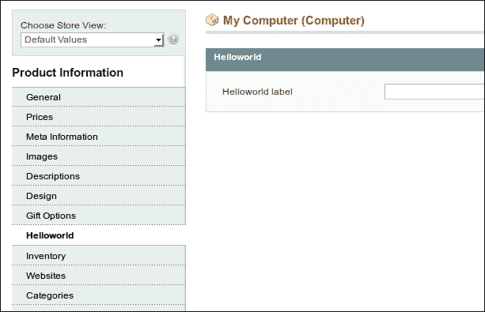
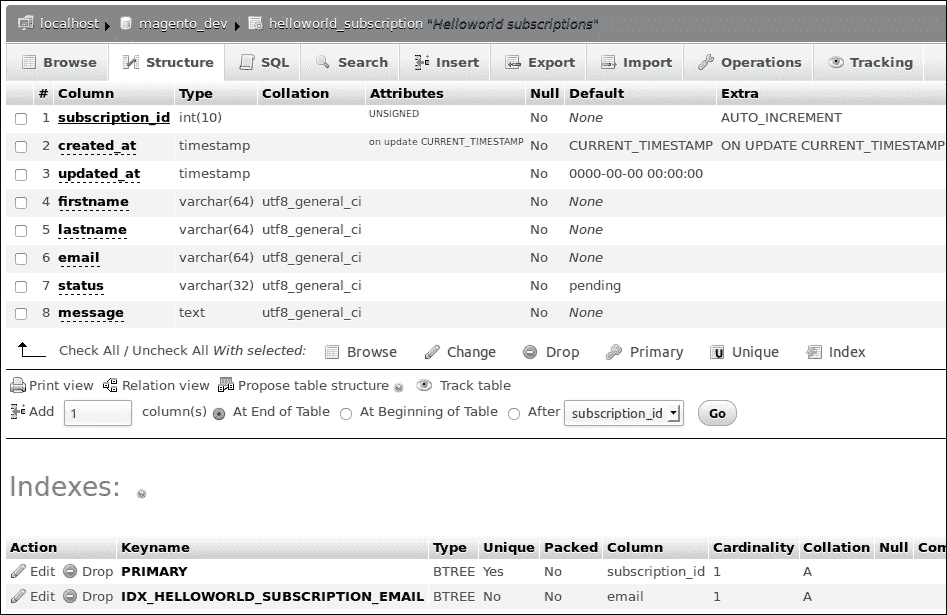
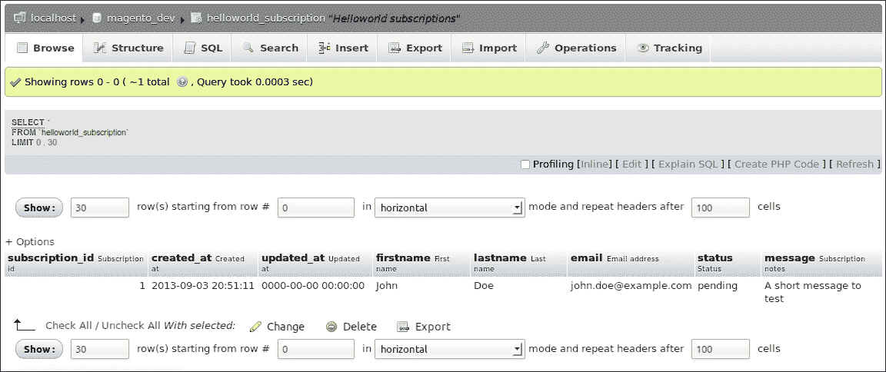
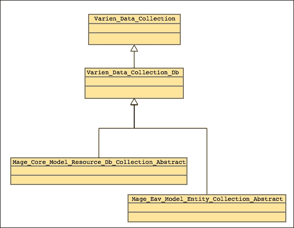

# 第六章。数据库和模块

在本章中，我们将涵盖：

+   注册资源模型

+   注册连接

+   安装和升级脚本

+   使用模型创建平面表

+   与 Magento 集合一起工作

# 简介

在上一章中，我们学习了如何使用 Magento 数据库，可用的连接以及如何与数据库交互。

在本章中，我们将使用上一章学到的知识执行一些实际任务。我们将扩展在 第四章 中创建的模块，并与数据库交互。

我们将创建与由模块安装的数据库表交互的 Magento 模型。

# 注册资源模型

我们首先要做的是注册 **资源** 模型。普通模型用于编写业务逻辑。资源模型用于与数据库交互。

## 准备工作

我们必须在模块的 `config.xml` 文件中添加额外的配置。打开 `app/code/local/Packt/Helloworld/etc/config.xml` 文件。

## 如何操作...

以下步骤解释了如何在现有的 `Packt_Helloworld` 模块中注册资源模型：

1.  导航到注册模型的标签。这位于 `config/global/models` 标签中。

1.  在其中添加以下配置以添加资源模型。你的 `<global>` 标签将如下所示：

    ```php
    <global>
        <blocks>
           <helloworld>
               <class>Packt_Helloworld_Block</class>
           </helloworld>
        </blocks>
        <helpers>
           <helloworld>
               <class>Packt_Helloworld_Helper</class>
           </helloworld>
        </helpers>
        <models>
           <helloworld>
               <class>Packt_Helloworld_Model</class>
           </helloworld>
           <helloworld_resource>
               <class>Packt_Helloworld_Model_Resource</class>
           </helloworld_resource>
        </models>
    </global>
    ```

1.  创建 `app/code/local/Packt/Helloworld/Model/Resource` 文件夹。

1.  通过在 `<models>` 标签中添加以下 XML 代码将普通模型与资源模型链接起来。`<models>` 标签将如下所示：

    ```php
    <models>
       <helloworld>
           <class>Packt_Helloworld_Model</class>
           <resourceModel>helloworld_resource</resourceModel>
       </helloworld>
       <helloworld_resource>
           <class>Packt_Helloworld_Model_Resource</class>
       </helloworld_resource>
    </models>
    ```

    使用 `<resourceModel>` 标签建立 `helloworld` 和 `helloworld_resource` 模型之间的链接。

1.  使用 `wiz` 命令行工具运行以下命令来测试你的配置：

    ```php
    wiz devel-models | grep helloworld
    ```

    你现在将得到以下输出：

    

    之前的命令将显示所有注册的模型，并过滤输出以匹配 `helloworld` 单词的行。

## 它是如何工作的...

Magento 中的模型用于业务逻辑。例如，观察者模型通常包含由事件或计划任务触发的函数。

一个 Magento 对象也可以代表一个实体，如产品、客户和类别。代表实体的模型通常继承自 `Mage_Core_Model_Abstract` 类。这个类有与资源模型连接的逻辑。例如，`save()` 函数是在这个类中声明的。

当你在 `Mage_Core_Model_Abstract` 类的 `save()` 函数中查看时，你会看到调用了 `getResource()` 函数。这个 `getResource()` 函数将返回资源模型的一个实例。

资源模型用于将实体与数据库连接起来。在模型中编写特定的业务逻辑，并在与实体一起工作时调用模型。

如果你想要获取资源模型实例，你可以使用`Mage::getResourceModel()`或`Mage::getResourceSingleton()`方法。要获取类的实例，我们必须将 Magento 类名作为第一个参数传递。

# 注册连接

在这个菜谱中，我们将配置`read`和`write`适配器，以便在这个模块中使用。这些适配器用于将模型与数据库连接起来。

## 准备工作

我们将在`Packt_Helloworld`模块的`config.xml`文件中添加适配器配置。打开此文件，准备添加一些配置。

## 如何操作...

按照以下步骤创建`Packt_Helloworld`模块的`read`和`write`连接：

1.  导航到`<global>`标签，并向其中添加以下配置。这将注册`read`适配器。

    ```php
    <resources>
        <helloworld_read>
            <connection>
                <use>core_read</use>
            </connection>
        </helloworld_read>
    </resources>
    ```

1.  配置`write`适配器，在 XML 代码的`<resources>`标签中添加以下内容。你的资源标签将如下所示：

    ```php
    <resources>
        <helloworld_write>
            <connection>
                <use>core_write</use>
            </connection>
        </helloworld_write>
        <helloworld_read>
            <connection>
                <use>core_read</use>
            </connection>
        </helloworld_read>
    </resources>
    ```

1.  清除你的缓存，你就完成了。

## 它是如何工作的...

Magento 中的每个模型都与一个`read`和`write`适配器相关联。默认的`read`适配器是`core_read`。默认的`write`适配器是`core_write`。

通常，所有模型在数据库表位于 Magento 数据库中时，都使用`core_read`和`core_write`适配器。

## 更多内容...

你可以注册和配置一个使用另一个数据库连接的特定数据库模型。如果你导航到以下 URL，你可以找到一个很好的教程，它解释了这一点：

[`www.solvingmagento.com/accessing-an-external-database-from-your-magento-module/`](http://www.solvingmagento.com/accessing-an-external-database-from-your-magento-module/)

# 安装和升级脚本

当你的模块使用自定义数据库表时，你需要对数据库进行某些更改，以便在预发布或生产服务器上部署你的模块。Magento 有一种方法可以在代码处于正确位置时自动触发和安装或更新脚本。

在这个菜谱中，我们将使用`install`脚本扩展`Packt_Helloworld`模块。这个`install`脚本将为所有产品添加一个属性。

## 准备工作

对于这个菜谱，我们必须在模块文件夹和数据库中工作。打开你的数据库客户端，并转到`Packt_Helloworld`模块中的代码。

## 如何操作...

以下步骤描述了创建和安装模块脚本的程序：

1.  通过在`config.xml`文件的`<resources>`标签中添加以下代码来初始化模块的设置程序：

    ```php
    <helloworld_setup>
        <setup>
            <module>Packt_Helloworld</module>
            <class>Mage_Eav_Model_Entity_Setup</class>
        </setup>
        <connection>
            <use>core_setup</use>
        </connection>
    </helloworld_setup>
    ```

    之前的代码将初始化一个名为`helloworld_setup`的设置程序。`<module>`标签配置了与`Packt_Helloworld`模块的关系。

1.  创建安装脚本的文件夹。在这个例子中，文件夹名称是`app/code/local/Packt/Helloworld/sql/helloworld_setup`。

1.  创建安装脚本。安装脚本的命名遵循`install-<version_number_config_xml>.php`的约定。在我们的例子中，这个脚本的名称是`install-0.0.1.php`。

1.  在文件中添加以下内容以测试安装过程：

    ```php
    die('test');
    ```

1.  清除缓存并重新加载任何前端页面。您将看到一个带有**测试**字样的白色页面。

    ### 小贴士

    安装或升级脚本是为了在安装期间运行一次。每个注册设置的版本号都存储在`core_resource`数据库表中。当您想再次运行脚本进行测试时，您可以删除条目或更改设置的版本号。

1.  在安装脚本中添加以下内容。这将安装一个适用于所有产品的产品属性。

    ```php
    <?php

    $installer = $this;

    $installer->startSetup();

    $installer->addAttribute('catalog_product', 'helloworld_label', array(
            'group'             => 'Helloworld',
            'type'              => 'varchar',
            'label'             => 'Helloworld label',
            'input'             => 'text',
            'global'            => Mage_Catalog_Model_Resource_Eav_Attribute::SCOPE_STORE,
            'visible'           => true,
            'required'          => false,
            'searchable'        => false,
            'filterable'        => false,
            'comparable'        => false,
            'visible_on_front'  => true,
            'unique'            => false,
            'apply_to'          => 'simple,configurable,virtual,bundle,downloadable',
            'is_configurable'   => false
        ));

    $installer->endSetup();
    ```

    之前的代码将创建`helloworld_label`产品属性。该属性将应用于所有产品。

    使用`group`选项，在查看后端产品时，属性将在**Helloworld**标签页中显示。

1.  清除缓存并重新加载页面。在清除缓存后重新加载页面时，安装脚本将自动运行。

1.  前往后端并打开一个产品以检查是否已添加产品属性。通常，您将看到一个包含属性的**Helloworld**标签页，类似于以下截图：

1.  当您的安装脚本执行时，您可以在 Magento 的`core_resource`表中看到您的设置。在这个表中，存储了所有模块和版本号，因此 Magento 知道哪些安装或升级脚本需要执行。

## 它是如何工作的...

当您想更改数据库结构时，使用安装脚本是有用的。一些目的包括：

+   从开发/测试环境轻松部署到生产环境

+   修复数据库的能力

+   数据库变更概述

安装脚本中的`$this`对象是在`config.xml`文件中的设置注册中声明的类。在这种情况下，它是`Mage_Eav_Model_Entity_Setup`类。这个类主要用于您想向实体添加 EAV 属性的情况，例如产品或类别，就像我们在本菜谱中所做的那样。大多数设置类都扩展了默认的设置类，即`Mage_Core_Model_Resource_Setup`。

如果您想在安装脚本中做很多事情，您可以创建自己的设置类。这将扩展正常的设置类。

在这个类中声明的函数可以在安装文件中调用`$this`对象。

# 使用模型创建扁平表

在这个菜谱中，我们将通过一个扁平数据库表扩展我们的模块。我们将创建一个升级脚本，包含创建表的指令。当表创建完成后，我们将通过添加所需的 Magento 模型、资源模型和集合来完成设置。完成整个设置后，我们已创建了一个具有所有 Magento ORM 功能的自定义 Magento 实体。

## 准备工作

对于这个菜谱，我们必须处理代码和数据库。在`module`文件夹中打开您的 IDE，并获取对您的数据库客户端的访问权限。

## 如何操作...

以下步骤是创建一个数据库表并使用适当的 Magento 模型与之交互的指令：

1.  在 `app/code/local/Packt/Helloworld/etc/config.xml` 文件中配置表名。

1.  在 `helloworld_resource` 标签下添加以下代码，使标签看起来如下：

    ```php
    <helloworld_resource>
         <class>Packt_Helloworld_Model_Resource</class>
         <entities>
             <subscription>
                 <table>helloworld_subscription</table>
             </subscription>
         </entities>
    </helloworld_resource>
    ```

    上述代码将声明一个实体，它引用 `helloworld_subscription` 表。

1.  通过创建 `app/code/local/Packt/Helloworld/sql/helloworld_setup/upgrade-0.0.1-0.0.2.php` 文件来创建升级脚本。

1.  在升级文件中添加以下代码。此代码是创建具有一些字段的表的命令。

    ```php
    <?php

    $installer = $this;

    $installer->startSetup();

    $table = $installer->getConnection()
        ->newTable($installer->getTable('helloworld/subscription'))
        ->addColumn('subscription_id', Varien_Db_Ddl_Table::TYPE_INTEGER, null, array(
            'identity'  => true,
            'unsigned'  => true,
            'nullable'  => false,
            'primary'   => true,
            ), 'Subscription id')
        ->addColumn('created_at', Varien_Db_Ddl_Table::TYPE_TIMESTAMP, null, array(
            'nullable'  => false,
            ), 'Created at')
        ->addColumn('updated_at', Varien_Db_Ddl_Table::TYPE_TIMESTAMP, null, array(
            'nullable'  => false,
            ), 'Updated at')
        ->addColumn('firstname', Varien_Db_Ddl_Table::TYPE_TEXT, 64, array(
            'nullable'  => false,
            ), 'First name')
        ->addColumn('lastname', Varien_Db_Ddl_Table::TYPE_TEXT, 64, array(
            'nullable'  => false,
            ), 'Last name')
        ->addColumn('email', Varien_Db_Ddl_Table::TYPE_TEXT, 64, array(
            'nullable'  => false,
            ), 'Email address')
        ->addColumn('status', Varien_Db_Ddl_Table::TYPE_TEXT, 32, array(
            'nullable'  => false,
            'default'   => 'pending',
            ), 'Status')
        ->addColumn('message', Varien_Db_Ddl_Table::TYPE_TEXT, '64k', array(
            'unsigned'  => true,
            'nullable'  => false,
            ), 'Subscription notes')
        ->addIndex($installer->getIdxName('helloworld/subscription', array('email')),
            array('email'))
        ->setComment('Helloworld subscriptions');
    $installer->getConnection()->createTable($table);

    $installer->endSetup();
    ```

1.  清除缓存并重新加载前端。当你在数据库客户端刷新你的表时，你将看到 `helloworld_subscription` 表在列表中。

    ### 小贴士

    在创建表时，考虑命名约定。第一部分是模型注册的名称，后面跟着一个下划线。第二部分指的是实体模型。

    确保模型的名称是单数。在这个例子中，它是 `subscription` 而不是 `subscriptions`。

1.  检查该表是否已安装到数据库中。在 phpMyAdmin 中重新加载表并打开新表。结构将如下所示：

1.  当使用升级脚本（从 0.0.1 升级到 0.0.2）安装表时，最后一步是创建一个与之前创建的表通信的 Magento 实体。为此，我们必须创建一个模型、一个资源模型和一个集合资源模型。第一步是创建以下文件：

    +   `app/code/local/Packt/Helloworld/Model/Subscription.php`（模型）

    +   `app/code/local/Packt/Helloworld/Model/Resource/Subscription.php`（资源模型）

    +   `app/code/local/Packt/Helloworld/Model/Resource/Subscription/Collection.php`（资源集合模型）

1.  打开模型文件，并向其中添加以下内容。此内容将模型与适当的资源模型链接。

    ```php
    <?php
    class Packt_Helloworld_Model_Subscription extends Mage_Core_Model_Abstract 
    {
        protected function _construct() 
        {
            $this->_init('helloworld/subscription');
        }

    }
    ```

1.  打开资源模型文件，并向其中添加以下内容。接下来的内容将模型与数据库链接。在 `_init` 函数中，我们将模型与数据库表的主键链接。

    ```php
    <?php
    class Packt_Helloworld_Model_Resource_Subscription extends Mage_Core_Model_Resource_Db_Abstract 
    {

        protected function _construct() {
            $this->_init('helloworld/subscription', 'subscription_id');
        }

    }
    ```

1.  打开资源集合模型文件，并向其中添加以下内容。此文件使得在调用实体的 `getCollection()` 方法时，可以在模型上使用 Magento 集合。

    ```php
    <?php
    class Packt_Helloworld_Model_Resource_Subscription_Collection extends Mage_Core_Model_Resource_Db_Collection_Abstract 
    {

        protected function _construct() {
            $this->_init('helloworld/subscription');
        }

    }
    ```

1.  如果一切顺利，所有文件都已放置在正确的位置以开始测试。为了执行一些测试，在模块的 `IndexController` 中创建一个 `subscriptionAction()` 方法。

1.  通过访问 `http://magento-dev.local/helloworld/index/subscription` URL 来导航到控制器中的新动作。你将看到一个空白页面。

1.  在创建我们表中新订阅项的动作中添加以下内容：

    ```php
    public function subscriptionAction()
    {
        $subscription = Mage::getModel('helloworld/subscription');

        $subscription->setFirstname('John');
        $subscription->setLastname('Doe');
        $subscription->setEmail('john.doe@example.com');
        $subscription->setMessage('A short message to test');

        $subscription->save();

        echo 'success';
    }
    ```

1.  当你重新加载页面时，你会看到单词**成功**。这个单词的显示是所有动作已成功执行的标志。导航到你的数据库并执行以下查询：

    ```php
    SELECT * FROM helloworld_subscription;

    ```

    这个查询将给出以下输出：



## 它是如何工作的...

当你使用数据库表中的实体之前的设置工作时，Magento ORM 会在实体和数据库之间建立联系。

在我们之前创建的 Magento 实体（`Mage::getModel('helloworld/subscription')`）中，我们可以使用以下函数，这将导致对数据库的查询：

+   `load($entityId)`

+   `save()`

+   `delete()`

所有这些函数都是在`Mage_Core_Model_Abstract`类中实现的。所有的 Magento 实体都将扩展这个抽象类以使用 ORM 框架。

# 使用 Magento 集合

在本章中，我们将探索 Magento 集合的可能性。一个 Magento 集合是一组**实体**，你可以添加过滤器来自定义你的结果。

在本章中，我们将探索使用 Magento 集合所能做的一切。

## 准备工作

前往`helloworld`模块的`indexController`并创建一个`collectionAction`方法。在这个动作中，我们将执行一些测试来比较结果。

## 如何做...

下面的示例展示了在处理 Magento 集合时的可能性：

1.  在`collectionAction`方法中添加以下代码并导航到页面。这段代码将返回 10 个产品。

    ```php
    public function collectionAction () 
    {

        $productCollection = Mage::getModel('catalog/product')
                ->getCollection()
                ->setPageSize(10,1);

        foreach ($productCollection as $product)
        {
            Zend_Debug::dump($product->debug());
        }

    }
    ```

    ### 提示

    在代码的末尾，有一个`foreach`循环。这个循环会在对象上调用`debug()`函数。`debug()`函数在所有扩展了`Varien_Object`函数的对象上都是可用的。集合转储是一个非常大的数组，可能会导致 PHP 中的**内存不足**异常或在浏览器中产生非常大的响应。

1.  当你查看输出时，你会看到以下数组：

    ```php
    array(11) {
      ["entity_id"] => string(2) "16"
      ["entity_type_id"] => string(2) "10"
      ["attribute_set_id"] => string(2) "38"
      ["type_id"] => string(6) "simple"
      ["sku"] => string(5) "n2610"
      ["created_at"] => string(19) "2007-08-23 13:03:05"
      ["updated_at"] => string(19) "2008-08-08 14:50:04"
      ["has_options"] => string(1) "0"
      ["required_options"] => string(1) "0"
      ["is_salable"] => string(1) "1"
      ["stock_item (Varien_Object)"] => array(1) {
        ["is_in_stock"] => string(1) "1"
      }
    }
    ```

1.  这个对象中的值不包含属性值。为了选择它们，我们必须使用`addAttributeToSelect('<attribute_code>')`函数。添加以下代码来选择具有名称、价格和图像属性的第一个 10 个产品：

    ```php
    public function collectionAction () 
    {

        $productCollection = Mage::getModel('catalog/product')
                ->getCollection()
                ->addAttributeToSelect('name')
                ->addAttributeToSelect('price')
                ->addAttributeToSelect('image')
                ->setPageSize(10,1);

        foreach ($productCollection as $product)
        {
            Zend_Debug::dump($product->debug());
        }

    }
    ```

    这段代码将为每个产品输出一个数组，如下面的代码所示：

    ```php
    array(14) {
      ["entity_id"] => string(2) "16"
      ["entity_type_id"] => string(2) "10"
      ["attribute_set_id"] => string(2) "38"
      ["type_id"] => string(6) "simple"
      ["sku"] => string(5) "n2610"
      ["created_at"] => string(19) "2007-08-23 13:03:05"
      ["updated_at"] => string(19) "2008-08-08 14:50:04"
      ["has_options"] => string(1) "0"
      ["required_options"] => string(1) "0"
      ["name"] => string(16) "Nokia 2610 Phone"
      ["image"] => string(27) "/n/o/nokia-2610-phone-2.jpg"
      ["price"] => string(8) "149.9900"
      ["is_salable"] => string(1) "1"
      ["stock_item (Varien_Object)"] => array(1) {
        ["is_in_stock"] => string(1) "1"
      }
    }
    ```

1.  我们现在将在产品集合上创建一个过滤器。下面的代码展示了如何过滤名为**诺基亚 2610 手机**的产品：

    ```php
    public function collectionAction () 
    {

        $productCollection = Mage::getModel('catalog/product')
                ->getCollection()
                ->addAttributeToSelect('price')
                ->addAttributeToSelect('image')
                ->addAttributeToFilter('name', 'Nokia 2610 Phone');

        foreach ($productCollection as $_product)
        {
            Zend_Debug::dump($_product->debug());
        }

    }
    ```

    ### 注意

    这个语句中的代码将在查询中创建一个`WHERE name = 'Nokia 2610 Phone'`语句，所以所有名为**诺基亚 2610 手机**的项目都将被返回。

1.  使用`addAttributeToFilter`函数，我们可以做更多。下面的代码展示了如何创建一个`WHERE product_id IN (159, 160, 161)`语句：

    ```php
    public function collectionAction () 
    {

        $productCollection = Mage::getModel('catalog/product')
                ->getCollection()
                ->addAttributeToSelect('price')
                ->addAttributeToSelect('image')
                ->addAttributeToFilter('entity_id', array(
                    'in' => array(159, 160, 161)
                ));

        foreach ($productCollection as $_product)
        {
            Zend_Debug::dump($_product->debug());
        }

    }
    ```

1.  我们接下来要使用的过滤器是`like`过滤器。添加以下代码来执行带有`WHERE name LIKE '%PC%'`语句的查询：

    ```php
    public function collectionAction () 
    {

        $productCollection = Mage::getModel('catalog/product')
                ->getCollection()
                ->addAttributeToSelect('price')
                ->addAttributeToSelect('image')
                ->addAttributeToFilter('name', array(
                    'like' => '%PC%'
                ));

        foreach ($productCollection as $_product)
        {
            Zend_Debug::dump($_product->debug());
        }

    }
    ```

1.  当查询变得更加复杂时，有时知道将生成什么 SQL 查询来获取集合是很不错的。为了打印用于集合的 SQL 查询，我们可以使用以下代码行：

    ```php
    $productCollection->getSelect()->__toString()
    ```

1.  当你添加以下代码时，你会看到这个集合的查询：

    ```php
    public function collectionAction () 
    {

        $productCollection = Mage::getModel('catalog/product')
                ->getCollection()
                ->addAttributeToSelect('price')
                ->addAttributeToSelect('image')
                ->addAttributeToFilter('name', array(
                    'like' => '%PC%'
                ));

        $productCollection->load();

        echo $productCollection->getSelect()->__toString();

    }
    ```

    此代码将输出以下 SQL 查询：

    ```php
    SELECT `e`.*,
           IF(at_name.value_id > 0, at_name.value, at_name_default.value) AS `name`,
           `price_index`.`price`,
           `price_index`.`tax_class_id`,
           `price_index`.`final_price`,
           IF(price_index.tier_price IS NOT NULL, Least(price_index.min_price,
                                              price_index.tier_price),
           price_index.min_price)                                         AS
           `minimal_price`,
           `price_index`.`min_price`,
           `price_index`.`max_price`,
           `price_index`.`tier_price`
    FROM   `catalog_product_entity` AS `e`
           INNER JOIN `catalog_product_entity_varchar` AS `at_name_default`
                   ON ( `at_name_default`.`entity_id` = `e`.`entity_id` )
                      AND ( `at_name_default`.`attribute_id` = '96' )
                      AND `at_name_default`.`store_id` = 0
                      LEFT JOIN `catalog_product_entity_varchar` AS `at_name`
                  ON ( `at_name`.`entity_id` = `e`.`entity_id` )
                     AND ( `at_name`.`attribute_id` = '96' )
                     AND ( `at_name`.`store_id` = 1 )
                     INNER JOIN `catalog_product_index_price` AS `price_index`
                   ON price_index.entity_id = e.entity_id
                      AND price_index.website_id = '1'
                      AND price_index.customer_group_id = 0
    WHERE  ( IF(at_name.value_id > 0, at_name.value, at_name_default.value) LIKE
             '%PC%' )
    ```

    ### 小贴士

    当使用`getSelect()->__toString()`函数时，请确保集合已加载。这就是为什么我们在打印 SQL 语句之前调用了`$productCollection->load()`函数。当你在一个`foreach()`循环中添加集合时，集合将自动加载。

    在 phpMyAdmin 中运行此查询，你会看到这个扁平响应可以用来创建产品集合。

1.  通过前面的代码示例，我们只能从数据库中读取数据。通过使用`setDataToAll()`函数，你可以更新集合中所有实体的某些属性。使用以下代码来更新集合中的所有价格：

    ```php
    public function collectionAction () 
    {

        $productCollection = Mage::getModel('catalog/product')
                ->getCollection()
                ->addAttributeToSelect('price')
                ->addAttributeToSelect('image')
                ->addAttributeToFilter('name', array(
                    'like' => '%PC%'
                ));

        $productCollection->setDataToAll('price', 20);

        foreach ($productCollection as $_product)
        {
            Zend_Debug::dump($_product->debug());
        }

    }
    ```

1.  当你使用`setDataToAll()`函数时，除非你调用了`save()`函数，否则数据库中不会有任何变化。在`setDataToAll()`函数之后添加以下代码以保存集合：

    ```php
    $productCollection->save();
    ```

## 如何工作...

当你想获取实体集合时，你可以通过调用以下两个方法来实现。这两个方法的返回值是一个集合对象。

```php
Mage::getModel('model/entity')->getCollection();
Mage::getResourceModel('model/entity_collection');
```

Magento 集合对象始终扩展自`Varien_Data_Collection`类。这个对象作为一个数组工作，因此你可以在集合中的项目之间迭代。

对于每个实体，在资源模型文件夹中都会创建一个集合类。在大多数情况下，这个类扩展了父类，在某些情况下，会为实体添加特定的方法。

产品实体是这方面的一个好例子。当你打开`Mage_Catalog_Model_Resource_Product_Collection`类时，你会看到这个类不是空的。在这里，一些函数是专门为产品实体声明的。

当你调试集合的继承时，你会看到扁平实体和 EAV 实体之间存在差异，如下面的图所示：



你可以看到，扁平实体（`Mage_Core_Model_Resource_Db_Collection_Abstract`）和 EAV 实体（`Mage_Eav_Model_Entity_Collection_Abstract`）的类扩展了相同的父类。EAV 类添加了额外的函数并重新定义了一些现有的函数以与 EAV 系统协同工作。

这是集合查询为何在扁平实体和 EAV 实体之间不同的主要原因。

对于在字段上添加过滤器，EAV 的函数是`addAttributeToFilter()`。对于扁平实体，函数是`addFieldToFilter()`。`addAttributeToFilter()`函数在`Mage_Eav_Model_Entity_Collection_Abstract`类中声明，因此在`Varien_Data_Collection_Db`类中不可用。

## 参见

如果你想了解 Magento 集合提供的所有可能选项，请查看 Magento 网站上的以下文章，其中包含了所有功能和选项的信息：

[`www.magentocommerce.com/wiki/1_-_installation_and_configuration/using_collections_in_magento`](http://www.magentocommerce.com/wiki/1_-_installation_and_configuration/using_collections_in_magento)
