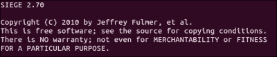
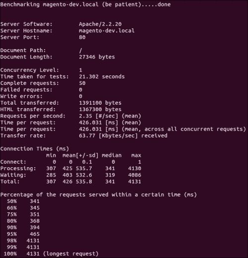
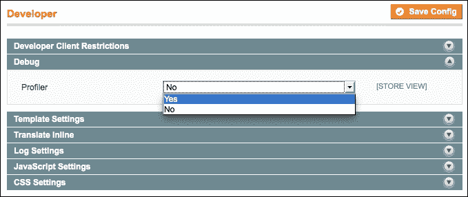
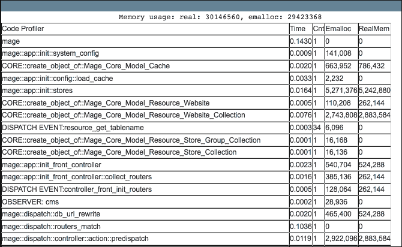
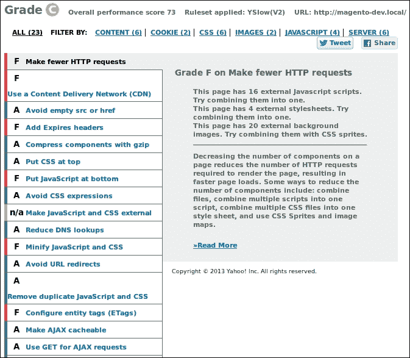
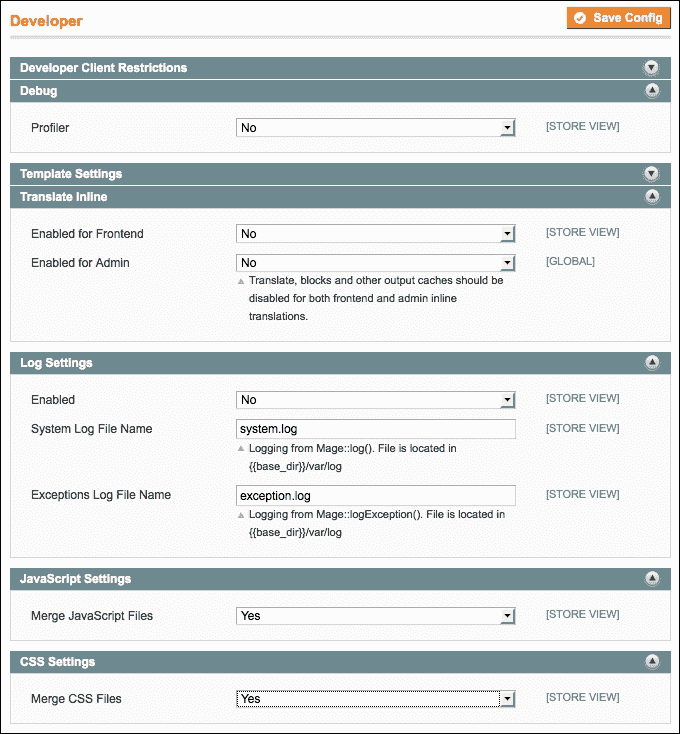
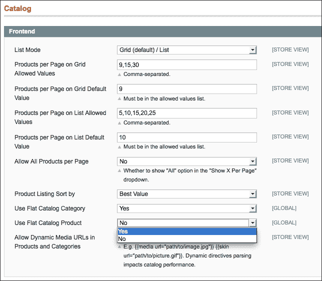
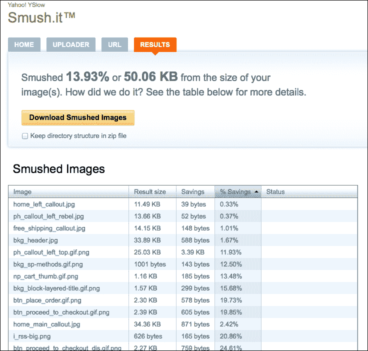
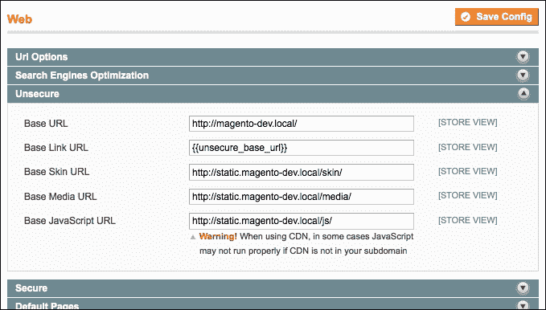

# 第十一章。性能优化

在本章中，我们将涵盖以下主题：

+   探索网站的极限

+   优化数据库和 MySQL 配置

+   优化 Apache 网络服务器

+   调整 Magento 配置

+   配置 APC 和 Memcached

+   优化 PHP 配置

+   分析页面速度

# 简介

对于运动员来说，秒、毫秒或千分秒可能决定他们是否能赢得比赛。每一个提高性能的小方面都是赢得比赛正确方向上的一步。

对于网站来说，情况相同。您的 Magento 商店越快，效果越好。在性能方面，Magento 不是最有效的系统之一。尤其是当您处理大量产品和属性时，良好的设置可以提高您的网店性能。

网站的性能对您的访客有很大影响。以下是一些关于这个陈述的事实：

+   页面速度对搜索引擎如 Google 的页面排名有显著影响

+   在电子商务网站上，每一秒都意味着销售额总量的 1% 的损失

+   当您减少页面大小时，您可以从搜索引擎中获得更多访客。

如您所见，性能是提高您网站 SEO 的关键部分。当网站表现不佳时，客户会离开您的网站。

既然您已经完成了开发，是时候看看整个系统的性能了。在本章中，我们将使用许多工具来探索、检测和修复 Magento 网上商店的性能泄漏。

一些工具是作为 Magento 标准版提供的，但我们必须全面考虑。两个相同的 Magento 安装可能会有不同的页面速度结果，这可能是以下原因造成的：

+   硬件

+   网络

+   负载

+   客户端设备

# 探索网站的极限

您需要了解的第一件事是当前网站的局限性。我的网站有多少容量？是什么减慢了我的网站？我们必须对所有这些方面有一个全面的了解，以便得出哪种优化效果最显著的结论。

在这个菜谱中，我们将看到一些有助于创建性能视图的工具。以下是一些工具的列表：

+   ApacheBench

+   Siege

+   Magento Profiler

+   YSlow

+   PageSpeed

+   GTmetrix

+   WebPagetest

我们将对所有这些工具进行一些测试，以找出 Magento 商店的潜在问题。有了这些结果，我们可以找出哪些优化效果最显著。

一些优化非常简单，可以产生很大的效果。其他优化则比较困难，效果可能较小。决定权在您手中。

## 准备工作

首先，建议安装以下工具，以便对 Magento 安装进行一些性能测试：

+   **ApacheBench** (**ab**)：此工具与 Apache 网络服务器自动安装。当您有权访问命令行界面时，您可以在 Linux 服务器上运行以下命令：

    ```php
    ab -h

    ```

+   **Siege**：我们将使用安装在同一个服务器上的 Siege 进行一些性能测试。为了查看它是否已安装，你可以运行以下命令：

    ```php
    siege -V

    ```

    +   在这里，请确保`V`是大写字母。当 Siege 安装后，你将看到其版本号，如下面的截图所示：

    +   如果你使用的是基于 Debian 的 Linux 发行版，并且它尚未安装，你可以运行以下命令：

        ```php
        sudo apt-get install siege
        ```

    +   第二种选择是下载安装文件，并按照以下步骤进行安装：

        1.  要下载存档，请运行以下命令：

            ```php
            wget ftp://ftp.joedog.org/pub/siege/siege-latest.tar.gz

            ```

        1.  要提取存档，请运行以下命令：

            ```php
            tar xzf siege-latest.tar.gz

            ```

        1.  将文件夹移动到首选位置并更改目录。

        1.  使用以下命令安装 Siege：

            ```php
            sudo ./configure

            ```

+   **Magento 配置文件**：这是 Magento 中的一个标准功能。你可以在系统配置中启用它。

+   **YSlow**：这是一个可以从附加组件商店下载和安装的 Firefox 插件。

因为**GTMetrix**和**WebPagetest**是在线工具，所以我们不需要安装它们。

## 如何做...

1.  为了了解在并发用户负载下的响应时间，我们可以使用 ApacheBench。我们将使用以下命令进行测试，并将结果保存到 CSV 文件中：

    ```php
    ab -c 10 -n 50 -e apachebench.csv http://magento-dev.local/

    ```

1.  在上一个命令中，我们使用以下参数进行了负载测试：

    +   `-c`：此参数表示并发用户数。在这个测试中，始终有 10 个请求同时运行。

    +   `-n`：此参数表示请求数量。在这种情况下是 50，所以我们将有 50 个结果在文件中。

    +   `-e`：此参数表示输出文件。输出将写入给定的 CSV 文件。

        ### 小贴士

        `-g`选项与`-e`选项含义相同，但`-g`会生成一个**.tsv**（制表符分隔值）文件，也称为 gnuplot 文件。

1.  当你运行命令时，一个带有结果的输出屏幕将被打印出来，如下面的截图所示：

    此报告显示了测试的一般统计数据。具体结果保存在 CSV 文件中。

1.  当你运行`ab -h`命令时，你会看到所有可用的选项。

1.  使用 Siege 进行负载测试。

    Siege 是另一个类似于 ApacheBench 的负载测试工具。Siege 与 ApacheBench 的区别在于，Siege 比 ApacheBench 有更多功能。它被设计用来进行多个并发用户的压力测试。它具有与 HTTP 身份验证、cookies、会话等一起工作的能力。当你编写一个好的脚本时，你可以模拟一个真实的压力情况。

1.  对于使用 Siege 进行的负载测试，我们将使用一个文本文件，在其中我们将设置一些在 Siege 负载测试期间将使用的 URL。使用不同的 URL 进行测试更好，因为你可以测试你网站上更多的页面，这意味着你可以找到更多的陷阱。创建一个`siege_url.txt`文件，并将以下内容粘贴到其中：

    +   `http://magento-dev.local/`

    +   `http://magento-dev.local/skin/frontend/default/default/images/bkg_body.gif`

    +   `http://magento-dev.local/skin/frontend/default/default/images/logo.gif`

    +   `http://magento-dev.local/skin/frontend/default/default/images/ph_callout_left_top.gif`

    +   `http://magento-dev.local/skin/frontend/default/default/images/ph_callout_left_rebel.jpg`

    +   `http://magento-dev.local/skin/frontend/default/default/images/home_main_callout.jpg`

    +   `http://magento-dev.local/index.php/electronics.html`

    +   `http://magento-dev.local/index.php/electronics.html?cat=12`

    +   `http://magento-dev.local/index.php/checkout/cart/add/product/46/`

    +   `http://magento-dev.local/index.php/checkout/cart/`

    +   `http://magento-dev.local/skin/frontend/default/default/images/i_shipping.gif`

    +   `http://magento-dev.local/skin/frontend/default/default/images/i_discount.gif`

    +   `http://magento-dev.local/skin/frontend/default/default/images/btn_trash.gif`

    +   `http://magento-dev.local/skin/frontend/default/default/images/bkg_th.gif`

    +   `http://magento-dev.local/skin/frontend/default/default/images/i_msg-success.gif`

    +   `http://magento-dev.local/skin/frontend/default/default/images/btn_checkout.gif`

    +   `http://magento-dev.local/index.php/checkout/onepage/`

    +   `http://magento-dev.local/js/varien/accordion.js`

    +   `http://magento-dev.local/skin/frontend/base/default/js/opcheckout.js`

    +   `http://magento-dev.local/skin/frontend/default/default/images/opc-ajax-loader.gif`

    +   `http://magento-dev.local/skin/frontend/default/default/images/cvv.gif`

    +   `http://magento-dev.local/index.php/checkout/onepage/progress/?toStep=billing`

    +   `http://magento-dev.local/index.php/electronics/cameras/accessories/universal-camera-case`

    +   `http://magento-dev.local/index.php/tag/product/list/tagId/185/`

    +   `http://magento-dev.local/index.php/tag/product/list/tagId/27/`

    +   `http://magento-dev.local/index.php/customer/account/login/`

1.  您可以更改 URL，使其与您的 Magento 配置匹配。确保域名与您的配置匹配，并且 URL 存在。

1.  运行以下命令以启动具有 50 个并发用户的负载测试：

    ```php
    siege -c50 -i -t 1M -d 3 -f siege_url.txt

    ```

1.  此脚本运行的周期取决于网店的性能。命令的输出如下所示：

    ```php
    ~$ siege -c50 -i -t 1M -d 3 -f siege_url.txt
    ** SIEGE 2.70
    ** Preparing 50 concurrent users for battle.
    The server is now under siege...
    Lifting the server siege...      done.
    Transactions:                   2001 hits
    Availability:                 100.00 %
    Elapsed time:                  59.48 secs
    Data transferred:               0.49 MB
    Response time:                  0.00 secs
    Transaction rate:              33.64 trans/sec
    Throughput:                     0.01 MB/sec
    Concurrency:                    0.03
    Successful transactions:          38
    Failed transactions:               0
    Longest transaction:            0.04
    Shortest transaction:           0.00
    ```

    使用 Siege `-h` 命令，您可以看到所有可用选项。

1.  我们继续配置 Magento Profiler。要启用 Magento Profiler，请打开后台并导航到 **系统** | **配置** | **高级** | **开发者** | **调试**。配置 **Profiler** 字段，如以下屏幕截图所示：

1.  要查看更多统计信息，请在 `index.php` 文件中取消以下行的注释：

    ```php
    Varien_Profiler::enable();
    ```

1.  当您重新加载前端时，您将看到以下屏幕截图所示的网格：

1.  在前面的屏幕截图中，您可以查看每个执行函数的执行时间和内存使用情况。这可以帮助您找到性能泄漏。

1.  接下来，我们将安装 YSlow 到 Firefox 中。

    +   YSlow 是一个与 Firebug 一起安装的 Firefox 插件

1.  要打开 YSlow，可以通过按*F12*键或点击附加组件栏中的图标来打开 Firebug。

1.  在 Firebug 启动后，打开 YSlow 标签页。

1.  确认**规则集**下拉菜单设置为**YSlow(V2)**。

1.  通过点击**运行测试**按钮开始测试。

1.  YSlow 执行一些测试，然后显示如下截图所示的测试结果：



## 它是如何工作的...

我们从 ApacheBench 开始，这是一个与 Apache Web 服务器一起安装的工具。此工具旨在对 HTTP 请求进行基准测试。

我们使用多个并发用户进行了测试。当你用 10 个并发用户进行测试时，你将模拟测试期间持续的 10 个请求的负载。当一个请求完成时，会触发一个新的请求，所以总是有 10 个进程在运行。

当你将测试时间限制为 30 秒时，你可以看到在这段时间内你的 Apache 服务器完成了多少个成功的请求。这可以给你一个关于你的 Web 服务器容量的良好印象。

Siege 是一个与 ApacheBench 类似的工具。主要区别在于 Siege 比 ApacheBench 有更多的选项。在这个菜谱中，我们使用 URL 列表进行了负载测试。在这个列表中，你可以通过创建 POST 请求将产品添加到购物车中，以模拟网络商店上的人类流量。通常，产品页面是缓存的，但特定于会话的流程，如结账，不能缓存，这将在你的服务器上产生更多的负载。

### 小贴士

使用 ApacheBench 和 Siege，你可以在网站上创建负载。在远程网站上执行此操作时，你可能会因为来自同一主机的许多请求看起来像攻击而被防火墙阻止。

一个网页的性能取决于许多因素。YSlow 捆绑了最重要的因素，并使用这些因素进行测试。参数捆绑在规则集中。我们使用的规则集是包含大多数检查的 YSlow (V2)。你可以选择其他一些或创建自己的规则集。

当测试运行时，YSlow 将检查规则集中所有的因素。对于每个因素，它都会给出一个分数。所有分数的平均值乘以每个因素的权重。权重取决于每个因素对网站性能的影响。

在 YSlow 生成的报告中，针对每个特定部分提出了改进建议。选择哪种选项来优化你的网站取决于你。

## 还有更多...

当你的网站在公共 URL 上时，你可以使用一些在线工具来显示你网站性能的报告。这些工具将查看你的网站并生成报告。它们会提出一些建议，就像 YSlow 做的那样：

+   **WebPagetest**：这个工具可以在[`www.webpagetest.org/`](http://www.webpagetest.org/)找到。

+   **GTmetrix**：这个工具可以在[`gtmetrix.com/`](http://gtmetrix.com/)找到。

# 优化数据库和 MySQL 配置

当扩展 Magento 网站时，您将有一个部分是件困难的工作，那就是 MySQL 数据库。您可以使用多个服务器来扩展您的商店，但数据库是网站所有数据的中央存储，因为它需要同步，所以并不容易扩展。在这个食谱中，我们将优化 Magento MySQL 数据库和 MySQL 服务器。

## 准备工作

登录 phpMyAdmin 并导航到显示数据库信息的下一页。

## 如何操作...

第一步是优化 Magento 数据库的表结构。请查看以下步骤：

1.  当您在 phpMyAdmin 中时，点击 Magento 数据库，您将看到表概览。

1.  在页面底部，点击**全选**按钮。

1.  当您点击下拉列表时，您可以修复表并优化它，如下面的截图所示：

    ### 小贴士

    确保您为 Magento 数据库中的所有表运行此操作。列表可能会被分隔并在多页中展示。

1.  当您修复并优化了所有内容后，您的 MySQL 数据库已优化。您还可以使用与我们在第五章中*配置主/从设置*食谱中所做的相同方式，通过主/从设置来复制数据库。

第二步是优化 MySQL 服务器。按照以下步骤优化 MySQL 服务器：

1.  一个好的服务器配置始于良好的硬件和正确的操作系统。为了运行 Magento，建议使用专用服务器或 VPS。当您使用共享环境时，RAM 和 CPU 负载将由其他用户共享。使用 VPS 或专用服务器，您有固定数量的 CPU 和固定数量的 RAM 可用。

1.  当您的服务器配备了足够的 RAM 时，您可以关闭交换设备。有时，即使有足够的内存，交换选项也会自动使用。

1.  在`my.cnf`文件中，在`[mysqld]`部分下，使用`skip-external-locking`参数来避免外部锁定。

1.  以下命令用于在`MyISAM`表中设置`key_buffer`的正确值。要查看配置，请在 MySQL 提示符下运行以下命令：

    ```php
    mysql> SHOW VARIABLES LIKE '%key_buffer%';

    ```

1.  我们将设置键缓冲区大小为 512 MB。我们可以在 MySQL 提示符下运行以下命令来完成此操作：

    ```php
    mysql> SET GLOBAL key_buffer_size = 536870912;

    ```

1.  我们将在`my.cnf`文件中进行以下优化设置。这是 MySQL 服务器的主要配置文件，位于`app/etc/mysql`文件夹中：

    1.  打开文件，在`[mysqld]`部分下粘贴以下配置：

        ```php
        [mysqld]
        key_buffer = 512M
        max_allowed_packet = 64M
        thread_stack = 192K
        thread_cache_size = 32
        table_cache = 512
        query_cache_type = 1
        query_cache_size = 52428800
        tmp_table_size = 128M
        expire_logs_days = 10
        max_binlog_size = 100M
        sort_buffer_size = 4M
        read_buffer_size = 4M
        read_rnd_buffer_size = 2M
        myisam_sort_buffer_size = 64M
        wait_timeout = 300
        max_connections = 400
        ```

    1.  保存文件并重新启动您的 MySQL 服务器。您可以通过运行以下命令来完成此操作：

        ```php
        sudo service mysql restart

        ```

## 它是如何工作的...

在优化 MySQL 服务器时，你必须了解你服务器的功能和预期的流量。有了这些参数，你可以计算出`key_buffer`、`query_cache`和`table_cache`的良好值。还要考虑`skip-external-locking`参数。使用此参数，你可以拒绝外部锁定。

使用以下命令，你可以查看 MySQL 服务器状态：

| 命令 | 更多信息 |
| --- | --- |
| mysql> SHOW STATUS; | 此命令显示 MySQL 服务器的当前状态。此命令在 MySQL 5.0 及以上版本中可用，并且是显示所有全局变量的标准命令。 |
| mysql> SHOW VARIABLES; | 此命令显示所有 MySQL 变量。 |
| mysql> SHOW INNODB STATUS; | 此命令让你了解当前的`INNODB`状态。 |
| mysql> SHOW GLOBAL STATUS; | 此命令显示数据库服务器对所有连接的负载值。 |
| mysql> SHOW LOCAL STATUS; | 这与`SHOW GLOBAL STATUS`命令相同，但值是在当前连接上计算的。 |
| mysql> mysqladmin extended -i100 -r | 使用此命令查看 MySQL 服务器当前正在发生的情况。 |

数据库优化是调整你的 Magento 网店的关键方面之一。数据库优化占页面加载的 50%。

# 优化 Apache 网络服务器

当运行 Magento 网站时，Magento 推荐使用 Apache 网络服务器。市场上还有一些其他网络服务器，如 Nginx，但最初 Magento 是针对 Apache 进行优化的。

网络服务器的性能主要取决于服务器运行的硬件。在选择服务器时，网卡、RAM、硬盘、操作系统和 CPU 是重要的硬件考虑因素。

## 如何做...

1.  首先要考虑的是网络服务器将运行的操作系统。强烈建议使用 Linux 发行版。在这本书的食谱中，我们使用了 Ubuntu 服务器（基于 Debian 的 Linux 发行版）。

    ### 小贴士

    不要使用 Windows 服务器来运行 Magento。它可以工作，但效率较低，可能会导致文件权限、代码等问题。

1.  将操作系统更新到最新稳定版本，因为更新软件更快更安全。使用 Apache2 而不是 Apache1 系列。Apache2 在提供静态内容时使用更少的 CPU 资源。

1.  在网络服务器上仅安装所需的服务。当安装了很多服务时，你将会有一些后台任务会使用服务器的资源。

1.  使用 XFS 和 ReiserFS 作为文件系统以获得更好的磁盘 I/O。

1.  你必须配置网络服务器，使其永远不会需要交换。当你的网络服务器开始交换时，所有请求都将变慢。首先，比较服务器上的 RAM 容量与请求的平均内存负载和请求数量。你可以做的第二件事是配置`MaxClients`设置。此设置控制服务器交换时的子进程数量。

1.  查看 `HostnameLookups` 设置并检查是否已配置为 `Off` 值。

1.  不建议使用 `SymLinksIfOwnerMatch` 设置。对于指定的目录，最好使用 `Options` `+FollowSymLinks` `+SymLinksIfOwnerMatch`。对于其他位置，使用 `Options` `+FollowSymLinks` 设置以防止系统调用 `lstat(2)`。`lstat()` 系统调用永远不会被缓存。

1.  不要在 `DirectoryIndex` 设置中使用通配符语法。设置如下所示：

    ```php
    DirectoryIndex index
    ```

1.  最好只使用 `index.php`，因为 Magento 使用 `index.php` 作为默认索引。此设置如下所示：

    ```php
    DirectoryIndex index.php
    ```

1.  使用以下命令启用 `deflate` 和 `header` Apache 模块：

    ```php
    sudo a2enmod deflate
    sudo a2enmod header

    ```

1.  在 Magento 根目录中打开 `.htaccess` 文件并转到 `mod_deflate` 配置标签。取消注释一些行，使块看起来像以下代码：

    ```php
    <IfModule mod_deflate.c>

    ############################################
    ## enable apache served files compression
    ## http://developer.yahoo.com/performance/rules.html#gzip

        # Insert filter on all content
        SetOutputFilter DEFLATE
        # Insert filter on selected content types only
        AddOutputFilterByType DEFLATE text/html text/plain text/xmltext/css text/javascript

        # Netscape 4.x has some problems...
        BrowserMatch ^Mozilla/4 gzip-only-text/html

        # Netscape 4.06-4.08 have some more problems
        BrowserMatch ^Mozilla/4\.0[678] no-gzip

        # MSIE masquerades as Netscape, but it is fine
        BrowserMatch \bMSIE !no-gzip !gzip-only-text/html

        # Don't compress images
        SetEnvIfNoCase Request_URI \.(?:gif|jpe?g|png)$ no-gzip dont-vary

        # Make sure proxies don't deliver the wrong content
        Header append Vary User-Agent env=!dont-vary

    </IfModule>
    ```

    ### 小贴士

    在更改后遇到内部服务器错误时，可能是 Apache `headers` 模块未启用。运行 `sudo a2enmod header` 命令并重新启动服务器以修复此问题。

1.  查看您的 Apache 服务器的 `KeepAlive` 设置。当此设置为开启时，Apache 服务器可以通过相同的 TCP 连接处理多个请求。

1.  为您的案例配置 **MPM**（**多处理模块**）。这些配置的值取决于您期望服务器上的资源和负载。

    ```php
    StartServers 50
    MinSpareServers 15
    MaxSpareServers 30
    MaxClients 225
    MaxRequestsPerChild 4000
    ```

1.  当您再次运行一些负载测试时，可以将获得的结果与优化前的结果进行比较。通常，您会看到一些差异。

## 它是如何工作的...

Web 服务器的性能取决于许多因素。关键部分是应用程序、硬件、操作系统和网络。

+   **应用程序**：第一件事是确保您的应用程序能够高效地使用服务器的资源。如果您的应用程序对请求期望大量资源，您可以在这里进行优化。

+   **硬件**：第二项是服务器的硬件。您必须确保服务器的资源足够高，能够处理预期的负载和峰值。

+   **操作系统**：第三项是操作系统和 Web 服务器。使用带有 Apache 或 Nginx Web 服务器的 Linux 服务器来托管 Magento。始终使用软件的最新版本，因为它通常更快且更安全。

+   **网络**：最后一项是网络。Web 服务器通过网络将响应发送到客户端。当网络速度慢时，请求的下载时间会很长。将您的 Web 服务器托管在具有良好网络连接的地方，并将其托管在与您的网店目标受众相同的地区。例如，为意大利网站托管在意大利。

优化您所使用的系统配置。在这个菜谱中，我们对 Apache Web 服务器进行了一些优化，通过在 `.htaccess` 文件中定义自定义设置来实现。

最后一点是你的 Web 服务器的地理位置。最好将你的 Web 服务器放置在目标受众所在的地区。此外，限制 HTTP 请求的大小和数量。

# 调整 Magento 配置

Magento 提供了一些标准功能以提升性能，例如缓存和编译。在本教程中，我们将配置这些功能以优化设置的性能。

## 准备工作

登录管理面板并导航到**系统** | **配置**页面。

## 如何操作...

当你执行以下步骤时，你的 Magento 安装将运行得更快：

1.  卸载或禁用你未使用的扩展。

1.  启用 Magento 拥有的所有缓存系统。它们位于**系统** | **缓存管理**。

    ### 小贴士

    当所有缓存都启用时，确保你在开发代码时清除它们。

1.  编译你的 Magento 安装。你可以在**系统** | **工具** | **编译**页面点击**运行编译过程**来完成。当编译启用时，所有 Magento 类将在一个目录中构建，这将使它们加载更快。编译可以将速度提高 25%到 50%。

1.  禁用未使用的模块。你可以通过导航到**系统** | **配置** | **高级** | **禁用模块输出**来禁用前端输出。当你不使用`Mage_Poll`模块时，你可以在那里禁用它。

1.  禁用一些开发者功能，因为在实际网站上你不需要它们。前往**系统** | **配置** | **高级** | **开发者**并按照以下截图进行配置：

1.  前往**目录** | **属性** | **管理属性**。当你点击一个属性时，你可以看到**前端属性**部分。仅设置你希望在前端使用的配置参数为**是**。

1.  前往**系统** | **配置** | **目录**并启用扁平目录产品和平坦目录分类设置，如图所示。当启用时，EAV 系统的一部分将被转换为扁平表：



### 注意

你可以在第五章的*使用 EAV 表*食谱中找到有关扁平目录设置的更多信息。

## 工作原理...

标准的 Magento 配置并不是最佳性能配置。你启用的每个选项都会对开发灵活性和与平台和模块的兼容性产生影响。

当缓存启用时，你将获得更好的性能。然而，你必须记住，在开发代码时，你需要经常清除缓存，以便看到你的更改效果。

开发功能在编写代码时很有用，因为它包含有趣的信息。然而，当您的网站上线时，您不需要这些功能，因为它会减慢您的网站速度。建议您禁用此功能。

编译是一个过程，其中 Magento 将将 `app/code` 文件夹中的所有类复制到 `includes` 文件夹。当所有类都位于一个文件夹中时，加载一个类比在所有不同的模块文件夹中查找一个类要快。

编译的优势是您的网站将更快，但缺点是您必须在代码的每次更改后运行编译过程。当您使用不遵循 Magento 标准的模块时，启用编译可能会导致错误。

最后一步是启用扁平目录产品和扁平目录分类。当您启用这些功能时，Magento 将使用扁平表来加载产品和分类，而不是在多个 EAV 表中查找。

使用此方法的缺点是您必须从 EAV 表同步数据到扁平表。当处理大量产品和分类时，同步数据的索引过程会持续很长时间。

# 配置 APC 和 Memcached

Magento 的缓存系统基于 HTML 输出的缓存部分和一些配置文件。在本菜谱中，我们将配置 PHP 级别的缓存，您可以使用 APC 和 Memcached 来实现。APC 将缓存 PHP 文件，而 Memcached 将缓存对象。

## 准备工作

当为我们的 Magento 店铺配置 APC 和 Memcached 时，我们必须确保服务器上已安装 APC。

要安装 APC，请按照以下说明操作：

1.  在基于 Debian 的 Linux 发行版上，您可以使用以下命令安装 APC：

    ```php
    sudo apt-get install php-apc

    ```

1.  按照安装程序操作，APC 将会在您的 PHP 配置中可用。

1.  要安装 Memcached，您可以运行以下命令：

    ```php
    sudo apt-get install php5-memcached

    ```

1.  要测试扩展是否正确安装，您可以使用 `phpinfo()` 命令。此命令以图形方式显示所有可用的 PHP 设置。

1.  要查看 `phpinfo`，创建一个包含以下内容的 `phpinfo.php` 文件：

    ```php
    <?php
    phpinfo();
    ```

当您在 APC 和 Memcached 上搜索时，您将看到一个包含所有设置的块。

## 如何操作...

在以下步骤中，我们将讨论 Magento 中的 APC 和 Memcached 配置：

1.  确保服务器上已安装 APC 和 Memcached。这在本菜谱的上一节中已有描述。

1.  打开 `app/code/local.xml` 文件，并将一个 `<cache>` 块作为 `<global>` 标签的子标签添加。您的 `local.xml` 文件如下所示：

    ```php
    <?xml version="1.0"?>
    <config>
     <global>
        <install>
          <date><![CDATA[Mon,
          22 Jul 2013 18:12:54 +0000]]></date>
        </install>
        <crypt>
          <key><![CDATA[cac0174a5563885b926aa73723aeb870]]></key>
        </crypt>
        <disable_local_modules>false</disable_local_modules>
        <resources>
          <db>
            <table_prefix><![CDATA[]]></table_prefix>
          </db>
          <default_setup>
            <connection>
              <host><![CDATA[localhost]]></host>
              <username><![CDATA[root]]></username>
              <password><![CDATA[root]]></password>
              <dbname><![CDATA[magento_dev]]></dbname>
              <initStatements><![CDATA
              [SET NAMES utf8]]></initStatements>
              <model><![CDATA[mysql4]]></model>
              <type><![CDATA[pdo_mysql]]></type>
              <pdoType><![CDATA[]]></pdoType>
              <active>1</active>
            </connection>
          </default_setup>
        </resources>
        <session_save><![CDATA[files]]></session_save>
        <cache>
     <backend>apc</backend>
     </cache>
      </global>
      <admin>
        <routers>
          <adminhtml>
            <args>
              <frontName><![CDATA[admin]]></frontName>
            </args>
          </adminhtml>
        </routers>
      </admin>
    </config>
    ```

1.  清除所有 Magento 缓存并重新启动您的 Apache 服务器。当您使用 ApacheBench 进行负载测试时，您将看到性能有显著提升：

    ```php
    ab -c 5 -n 100 http://magento-dev.local
    ```

1.  之前的配置启用了 Magento 的 APC 配置。通过下一个配置，我们启用 Memcached。我们通过将 `<cache>` 标签作为 `<global>` 标签的子标签来实现这一点。使用 Memcached，`local.xml` 文件将如下所示：

    ```php
    <?xml version="1.0"?>
    <config>
      <global>
        <install>
          <date><![CDATA[Mon,
          22 Jul 2013 18:12:54 +0000]]></date>
        </install>
        <crypt>
          <key><![CDATA[cac0174a5563885b926aa73723aeb870]]></key>
        </crypt>
        <disable_local_modules>false</disable_local_modules>
        <resources>
          <db>
            <table_prefix><![CDATA[]]></table_prefix>
          </db>
          <default_setup>
            <connection>
              <host><![CDATA[localhost]]></host>
              <username><![CDATA[root]]></username>
              <password><![CDATA[root]]></password>
              <dbname><![CDATA[magento_dev]]></dbname>
              <initStatements><![CDATA
              [SET NAMES utf8]]></initStatements>
              <model><![CDATA[mysql4]]></model>
              <type><![CDATA[pdo_mysql]]></type>
              <pdoType><![CDATA[]]></pdoType>
              <active>1</active>
            </connection>
          </default_setup>
        </resources>
        <session_save><![CDATA[files]]></session_save>
     <cache>
     <backend>memcached</backend>
     <slow_backend>database</slow_backend>
     <memcached>
     <servers>
     <server>
     <host><![CDATA[127.0.0.1]]></host>
     <port><![CDATA[11211]]></port>
     <persistent><![CDATA[1]]></persistent>
     <weight><![CDATA[2]]></weight>
     <timeout><![CDATA[10]]></timeout>
     <retry_interval><![CDATA[10]]></retry_interval>
     <status><![CDATA[1]]></status>
     </server>
     </servers>
     <compression><![CDATA[0]]></compression>
     <cache_dir><![CDATA[]]></cache_dir>
     <hashed_directory_level><![CDATA[]]>
     </hashed_directory_level>
     <hashed_directory_umask><![CDATA[]]>
     </hashed_directory_umask>
     <file_name_prefix><![CDATA[]]></file_name_prefix>
     </memcached>
     </cache>
      </global>
     <cache>
     <backend>apc</backend>
     </cache>
      <admin>
        <routers>
          <adminhtml>
            <args>
              <frontName><![CDATA[admin]]></frontName>
            </args>
          </adminhtml>
        </routers>
      </admin>
    </config>
    ```

1.  最后一件事情是将 `var/cache` 文件夹存储在内存中。我们可以通过使用 TMPFS 挂载文件夹来实现这一点：

    ```php
    mount tmpfs /var/www/packt/magento-dev/var/cache -t tmpfs -o size=64m

    ```

## 它是如何工作的...

**APC**（**替代 PHP 缓存**）是一个开源的缓存框架，它优化 PHP 代码，编译它，并在共享内存中缓存它。执行预编译的代码比加载所有脚本要快。APC 的一个常见问题是，你必须清除 APC 缓存才能看到任何代码更改，因为旧代码的一些部分被缓存了。

Memcached 是 PHP 中的另一个缓存系统。Memcached 将缓存以后将在应用程序中使用的对象。例如，数据库对象、会话和 API 调用。Memcached 在服务器上运行，即在这个例子中，与 web 服务器相同的服务器。通过设置 Magento 配置，我们连接到运行在端口 11211 的本地 Memcached 服务器。

在 Magento 中，Memcached 提高了性能。在前端，有一些效果，但最大的效果是在后端，因为 Magento 本身缓存的东西非常少。

最后一件事情是将 Magento 的 `cache` 文件夹挂载到内存中。当有足够的内存可用时，将缓存文件存储在 RAM 中会更快。当它们位于 RAM 中时，加载缓存文件比从磁盘读取它要快。

# 优化 PHP 配置

当你不使用 APC 等加速器时，考虑使用 PHP 加速器；我们将在本菜谱中看到如何做到这一点。当请求 PHP 脚本时，脚本将被读取，然后它将被编译成二进制，这被称为操作码。这个编译后的代码将由 PHP 引擎执行。

操作码缓存只是一个简单的缓存机制，它保存编译后的代码，这样代码就不必每次脚本运行时都进行编译。在这个菜谱中，我们将优化 `php.ini` 设置以获得最佳性能。

## 准备工作

市场上有很多 PHP 加速器，如 APC、eAccelerator、XCache、Zend Accelerator 和 Zend Platform。在以下 URL 中，你可以找到有关这些加速器的更多信息：

+   **APC**：这个 PHP 加速器可以在 [`pecl.php.net/package/APC`](http://pecl.php.net/package/APC) 找到

+   **eAccelerator**：这个 PHP 加速器可以在 [`eaccelerator.net/`](http://eaccelerator.net/) 找到

+   **XCache**：这个 PHP 加速器可以在 [`xcache.lighttpd.net/`](http://xcache.lighttpd.net/) 找到

## 如何做到这一点...

以下步骤描述了一些你可以采取的措施来改进 PHP 配置：

1.  使用一个高效的进程管理器，如 php-fpm，它在 FastCGI 上运行速度惊人。

1.  使用`realpath_cache_size`配置设置来配置 PHP 中真实路径缓存的大小。在 PHP 打开和关闭大量文件的系统上，此值需要增加。您可以为 Magento 使用以下设置：

    ```php
    realpath_cache_size=1M
    realpath_cache_ttl=86400
    ```

1.  下表中设置的设置可以改善 PHP 设置的性能：

    | 设置 | 描述 | 推荐值 |
    | --- | --- | --- |
    | `max_execution_time` | 此设置设置进程可以存活的最大时间（以秒为单位）。 | 120 |
    | `max_input_time` | 此属性设置脚本等待输入数据的时间（以秒为单位）。 | 240 |
    | `memory_limit` | 使用此设置，您可以设置进程可以消耗的内存量。 | 对于 Magento，建议使用 216 MB。 |
    | `output_buffering` | 使用此设置，您可以设置在向客户端发送响应之前缓冲的字节数。 | 4096 |

1.  最后，当您的网站处于活动状态时，禁用一些错误报告级别。可以通过以下设置来完成：

    ```php
    error_reporting = E_COMPILE_ERROR|E_ERROR|E_ CORE_ERROR
    ```

## 它是如何工作的...

`php.ini`配置文件中的值主要取决于您正在运行的应用程序以及该应用程序将对您的系统产生的负载。如果您的应用程序有一些将运行很长时间的过程（当您有大量产品时，重新索引过程就是这样），则需要增加`max_execution_time`和`max_input_time`的值。对于`memory_limit`参数也是如此，对于 Magento，建议使用 216 MB。

在生产系统上禁用错误报告对于警告和通知是推荐的，但关键错误需要报告，因为解决错误时需要这些信息。

# 分析页面速度

YSlow 是一个分析网页速度的工具。它是一个可以安装到 Firebug 的插件。在运行报告时，网站将在一些参数上进行测试。将显示一个包含您网站总体得分的报告。

测试基于一组规则。您有 YSlow (V2) 和 YSlow (V1) 规则集。我们将使用 YSlow(V2) 规则集进行本食谱，它包含 22 条规则。如果您遵守以下 22 条规则，完整的页面加载（包括图像和静态内容）可以提高 25 到 50%：

+   最小化 HTTP 请求

+   使用内容分发网络

+   避免空的`src`或`href`

+   添加过期头或缓存控制头

+   为组件使用 Gzip

+   将样式表放在顶部

+   将脚本放在底部

+   避免使用 CSS 表达式

+   使 JavaScript 和 CSS 外部化

+   减少 DNS 查找

+   压缩 JavaScript 和 CSS

+   避免重定向

+   删除重复的脚本

+   配置 ETags

+   使 AJAX 可缓存

+   使用 GET 进行 AJAX 请求

+   减少 DOM 元素的数量

+   无 404 错误

+   减少 cookie 大小

+   使用无 cookie 域名进行组件

+   避免过滤器

+   不要在 HTML 中缩放图像

+   使`favicon.ico`文件小并可缓存

## 如何做到...

执行以下步骤以查看我们可以使用 YSlow 结果做什么：

1.  在当前网页上运行 YSlow 测试。在标准的 Magento 网上商店中，测试通常返回一个总体 C 级分数。

1.  第一件事是减少 HTTP 请求。你可以通过启用 CSS 和 JS 合并来解决这个问题。为了获得最佳分数，建议使用精灵图，这样你只有一个背景图片。

1.  为了优化背景图片，你可以使用像 Yahoo 的 Smush.it 这样的图片优化工具。当你上传你的主题的 `images` 文件夹并运行它时，你可以下载如以下截图所示的优化版本：

1.  你可以下载优化后的图片，并在 `skin` 文件夹中替换它们。

1.  测试中的下一个缺点是添加过期头。我们可以通过修改 `.htaccess` 文件中的某些规则来解决这个问题。

1.  以下代码展示了如何向网站的静态内容添加 `expire` 头：

    ```php
    <IfModule mod_expires.c>

    ############################################
    ## Add default Expires header
    ## http://developer.yahoo.com/performance/rules.html#expires

      ExpiresDefault "access plus 1 year"

      ExpiresDefault
      ExpiresActive On
      ExpiresByType image/gif
      ExpiresByType image/jpg
      ExpiresByType image/jpeg
      ExpiresByType image/png
      ExpiresByType image/x-icon
      ExpiresByType text/css
      ExpiresByType application/x-javascript

    </IfModule>

    ############################################
    ```

1.  以下代码将压缩一些文件类型：

    ```php
    <IfModule mod_deflate.c>

    ############################################
    ## enable apache served files compression
    ## http://developer.yahoo.com/performance/rules.html#gzip

      # Insert filter on all content
      SetOutputFilter DEFLATE
      # Insert filter on selected content types only
      AddOutputFilterByType DEFLATE text/html text/plain text/xml text/css text/javascript

      # Netscape 4.x has some problems...
      BrowserMatch ^Mozilla/4 gzip-only-text/html

      # Netscape 4.06-4.08 have some more problems
      BrowserMatch ^Mozilla/4\.0[678] no-gzip

      # MSIE masquerades as Netscape, but it is fine
      BrowserMatch \bMSIE !no-gzip !gzip-only-text/html

      # Don't compress images
      SetEnvIfNoCase Request_URI \.(?:gif|jpe?g|png)$ no-gzip dont-vary

      # Make sure proxies don't deliver the wrong content
      Header append Vary User-Agent env=!dont-vary

    </IfModule>
    ```

1.  最后一步是使用 CDN 网络托管你的静态图片。你可以使用现有的 CDN 提供商来托管你网站的静态文件，但你也可以创建一个子域名 `static.magento-dev.local`，它也指向 Magento 根目录，并配置 Magento 使用此子域名来托管静态内容。你可以在后台通过导航到 **系统** | **配置** | **常规** | **Web** 来完成此操作，如下面的截图所示：



## 它是如何工作的...

YSlow 的所有 22 条规则的文档都可以在他们的网站上找到。如果你想了解更多关于某个规则的信息，请访问包含所有信息的以下页面：

[`developer.yahoo.com/performance/rules.html`](http://developer.yahoo.com/performance/rules.html)
