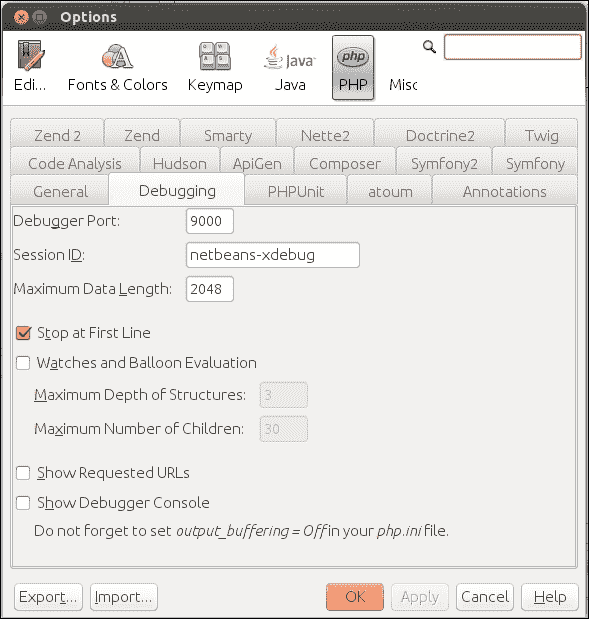

# 第十二章。调试和单元测试

在本章中，我们将涵盖：

+   开始使用 Xdebug

+   使用 FirePHP 调试

+   安装 PHPUnit

+   创建一个 Magento 测试用例

# 简介

以高效的方式调试网站是 PHP 开发者最重要的工作之一。如今，一个网站远不止一些简单的 HTML 页面。在 Magento 网上商店中，你有很多复杂的业务逻辑，这些逻辑用于电子商务交易流程中。

PHP 中的调试不像其他编程语言那样直接。有许多方法可以配置 PHP 调试器（Xdebug）与一个好的代码编辑器，如 NetBeans。通过一些额外的工具，如 FirePHP 和 Zend Wildfire 插件，调试变得更加容易。

调试的另一个部分是自动化测试。在处理对象和函数时，有许多方法可以编写一些可以在一组配置的函数上运行的测试。报告将显示有关通过和失败的测试的信息。

# 开始使用 Xdebug

调试 PHP 应用程序最常见的方式是使用一些函数，如 `echo`、`die()`、`var_dump()` 和 `print_r()`。在 Magento 中，你可以使用 `Mage::log()` 语句将一些日志打印到文件，但这并不是真正的调试器。

使用真正的调试器，你可以中断脚本并查看变量及其值。你还可以更改值、进一步执行、跳过语句等。

在 PHP 中，你可以配置 Xdebug 来调试你的 PHP 脚本或应用程序。在本食谱中，我们将了解如何在开发环境中安装 Xdebug，以及我们如何将其与 IDE 集成。

## 准备工作

在本食谱中，我们将使用 NetBeans IDE 启动一个 Xdebug 会话。打开 NetBeans 并将 **Magento** 项目设置为 **主项目**。确保在项目的 **属性** 设置中正确配置了所有 URL。

## 如何做...

以下步骤展示了你如何在开发服务器上安装 Xdebug：

1.  我们将使用 PHP 的 `pear` 库来安装 Xdebug。确保它已安装。如果没有，请运行以下命令：

    ```php
    sudo apt-get install php5-dev
    sudo apt-get install php-pear

    ```

1.  下一步是安装 `xdebug` 库。你可以使用以下命令来完成：

    ```php
    sudo pecl install xdebug

    ```

1.  此命令将给出以下输出：

1.  如截图所示，我们必须在 `php.ini` 文件中定位 `xdebug.so` 文件。要找出 `xdebug.so` 文件的路径，请运行以下命令：

    ```php
    find / -name 'xdebug.so'

    ```

1.  当你有了路径后，在 `php.ini` 文件中添加以下行。使用以下命令打开文件：

    ```php
    sudo nano /etc/php5/apache2/php.ini

    ```

1.  同样，对 `cli/php.ini` 文件也做相同的操作：

    ```php
    sudo nano /etc/php5/cli/php.ini

    ```

1.  在末尾粘贴以下代码行：

    ```php
    zend_extension="/usr/lib/php5/20100525/xdebug.so"

    ```

    确保路径与服务器上 `xdebug.so` 文件的路径匹配。

1.  使用以下命令重新启动 Apache 服务器：

    ```php
    sudo service apache2 restart

    ```

1.  要测试 Xdebug 是否正确安装，你可以在浏览器中使用 `phpinfo()` 查看它，或者你可以运行以下命令来检查 `phpinfo()` 页面：

    ```php
    php -i | grep xdebug

    ```

1.  之前的命令将给出以下输出：

    ```php
    xdebug
    xdebug support => enabled
    xdebug.auto_trace => Off => Off
    xdebug.cli_color => 0 => 0
    xdebug.collect_assignments => Off => Off
    xdebug.collect_includes => On => On
    xdebug.collect_params => 0 => 0
    xdebug.collect_return => Off => Off
    xdebug.collect_vars => Off => Off
    xdebug.coverage_enable => On => On
    xdebug.default_enable => On => On
    xdebug.dump.COOKIE => no value => no value
    xdebug.dump.ENV => no value => no value
    xdebug.dump.FILES => no value => no value
    xdebug.dump.GET => no value => no value
    xdebug.dump.POST => no value => no value
    xdebug.dump.REQUEST => no value => no value
    xdebug.dump.SERVER => no value => no value
    xdebug.dump.SESSION => no value => no value
    xdebug.dump_globals => On => On
    xdebug.dump_once => On => On
    xdebug.dump_undefined => Off => Off
    xdebug.extended_info => On => On
    xdebug.file_link_format => no value => no value
    xdebug.idekey => no value => no value
    xdebug.max_nesting_level => 100 => 100
    xdebug.overload_var_dump => On => On
    xdebug.profiler_aggregate => Off => Off
    xdebug.profiler_append => Off => Off
    xdebug.profiler_enable => Off => Off
    xdebug.profiler_enable_trigger => Off => Off
    xdebug.profiler_output_dir => /tmp => /tmp
    xdebug.profiler_output_name => cachegrind.out.%p => cachegrind.out.%p
    xdebug.remote_autostart => Off => Off
    xdebug.remote_connect_back => Off => Off
    xdebug.remote_cookie_expire_time => 3600 => 3600
    xdebug.remote_enable => Off => Off
    xdebug.remote_handler => dbgp => dbgp
    xdebug.remote_host => localhost => localhost
    xdebug.remote_log => no value => no value
    xdebug.remote_mode => req => req
    xdebug.remote_port => 9000 => 9000
    xdebug.scream => Off => Off
    xdebug.show_exception_trace => Off => Off
    xdebug.show_local_vars => Off => Off
    xdebug.show_mem_delta => Off => Off
    xdebug.trace_enable_trigger => Off => Off
    xdebug.trace_format => 0 => 0
    xdebug.trace_options => 0 => 0
    xdebug.trace_output_dir => /tmp => /tmp
    xdebug.trace_output_name => trace.%c => trace.%c
    xdebug.var_display_max_children => 128 => 128
    xdebug.var_display_max_data => 512 => 512
    xdebug.var_display_max_depth => 3 => 3

    ```

1.  下一步是配置 NetBeans 的 Xdebug 集成。为了使 NetBeans 与 Xdebug 一起工作，我们必须在 `php.ini` 文件末尾添加以下配置：

    ```php
    xdebug.remote_enable=1
    xdebug.remote_handler=dbgp
    xdebug.remote_mode=req
    xdebug.remote_host=localhost
    xdebug.remote_port=9000
    xdebug.idekey="netbeans-xdebug"
    ```

1.  重新启动您的 Apache 服务器，并查看 `phpinfo()` 页面以确认 Xdebug 设置是否已应用。

1.  下一步是检查您的 NetBeans 调试设置。导航到 **工具** | **选项** 并按照以下截图进行配置：

1.  下一步是检查项目 URL 是否具有正确的值。打开 **项目属性** 并转到 **运行配置**。确保 **项目 URL** 字段具有以下截图所示的正确值：

1.  我们现在已准备好开始第一个调试会话。要开始它，我们必须点击靠近运行按钮的调试按钮。您也可以使用快捷键 *Ctrl* + *F5*。

1.  当开始调试会话时，浏览器将添加一个新标签页，其 URL 形式如下：

    `http://magento-dev.local/?XDEBUG_SESSION_START=netbeans-xdebug`

1.  网页无法加载，因为调试器正在中断进程。要继续，我们必须使用 NetBeans 中的调试器控件。

1.  当您在 `index.php` 文件的第 87 行添加断点 `Mage::run($mageRunCode, $mageRunType)` 并继续使用调试器时，您将看到以下截图所示的变量值：

1.  当您继续使用断点时，您会看到页面将被加载。

1.  调试会话将持续到您在 NetBeans 中点击停止按钮。当您浏览网站上的其他页面时，只要会话处于活动状态，调试器将继续运行。

1.  要停止调试会话，请在 NetBeans 中点击停止按钮。一个浏览器页面将打开，显示会话已停止的消息。

## 它是如何工作的...

Xdebug 需要安装在您想要调试的服务器上。在这个菜谱中，使用的是本地调试服务器。

我们使用 PEAR 安装了 Xdebug。PEAR 是 PHP 插件的软件仓库。使用 PEAR，我们下载并安装了 `xdebug` 库。

当 Xdebug 在服务器上安装时，我们配置了 `php.ini` 文件以使用 `xdebug` 库。我们添加了一些设置以使 Xdebug 配置与 NetBeans 兼容。

### 小贴士

当在远程服务器上使用 Xdebug 时，请确保您可以通过端口 9000 连接到服务器。这通常在服务器和您的本地 PC 的防火墙中被禁用。

当服务器配置正确后，我们在 NetBeans 中检查了配置并开始调试会话。当会话开始时，我们能够像调试器一样调试 Magento 应用程序。

调试器启用了以下高级调试功能：

+   设置断点

+   逐句执行代码语句

+   跳过代码部分

+   浏览和更改变量名

# 使用 FirePHP 进行调试

FirePHP 是您可以在 Firefox 中安装的插件。它集成在 Firebug 控制台中，使其作为调试工具易于使用。在服务器上，FirePHP 也需要安装。我们可以通过 PEAR 仓库轻松完成此操作，就像我们在前面的食谱中做 Xdebug 一样。

要使用 FirePHP 进行调试，我们需要另一个 PHP 库。这是在 Zend Framework 中的 Zend Wildfire 插件。由于 Magento 是基于 Zend Framework 构建的，因此 Wildfire 插件是标准安装的。

## 准备中

**FirePHP** 是一个在 **Firebug** 中运行的插件。为了使它们正常工作，我们需要使用以下链接将 Firebug 和 FirePHP 作为 Firefox 插件安装：

[`addons.mozilla.org/us/firefox/addon/firebug/`](https://addons.mozilla.org/us/firefox/addon/firebug/)

[`addons.mozilla.org/us/firefox/addon/firephp/`](https://addons.mozilla.org/us/firefox/addon/firephp/)

## 如何操作...

以下步骤描述了如何在 Magento 项目中使用 FirePHP：

1.  确保所有 Firefox 插件都已安装。

1.  在您的 IDE（如 NetBeans）中打开您的 Magento 项目。

1.  打开 `index.php` 文件，并在文件末尾添加以下代码：

    ```php
    // ------------------------------------------------------
    // Zend Wildfire log function
    // ------------------------------------------------------
    /**
     * Logs variables to the Firebug Console
     * via HTTP response headers and the FirePHP Firefox Extension.
     *
     * @param mixed $var The variable to log.
     * @param string $label OPTIONAL Label to prepend to the log
      event.
     * @param string $style OPTIONAL Style of the log event.
     * @param array $options OPTIONAL Options to change how messages
      are processed and sent
     * @return boolean Returns TRUE if the variable was added to the
      response headers or buffered.
     * @throws Zend_Wildfire_Exception
     */
    function logFirePHP($var, $label = 'Magento vars', $style = 'INFO', $options = array()) {
        if (Mage::getIsDeveloperMode()) {
            $httpRequest = new Zend_Controller_Request_Http();
            $httpResponse = new Zend_Controller_Response_Http();
            $channel = Zend_Wildfire_Channel_HttpHeaders::getInstance();
            $channel->setRequest($httpRequest);
            $channel->setResponse($httpResponse);
            ob_start();
            Zend_Wildfire_Plugin_FirePhp::send($var, $label, $style, $options);
            $channel->flush();
            $httpResponse->sendHeaders();
        } else {
            return null;
        }
    }
    // ------------------------------------------------------
    // End Zend Wildfire function
    // ------------------------------------------------------
    ```

1.  保存文件 `index.php`。

1.  启用 Magento **Profiler** 和 Magento 开发者模式。

1.  我们已准备好 Magento 安装以与 FirePHP 一起使用。要通过它记录某些内容，我们可以使用 `logFirePHP()` 函数在日志中打印某些内容。打开文件 `app/design/frontend/base/default/template/catalog/product/view.phtml`。

1.  在文件末尾添加以下代码：

    ```php
    <?php logFirePHP($_product->debug()) ?>
    ```

1.  当您打开产品详情页面和 Firebug 控制台时，您应该得到一个类似于以下截图的输出：


## 它是如何工作的...

FirePHP 是一个在 Firebug 控制台中显示日志消息的日志工具。我们通过在 `index.php` 文件中添加的 `logFirePHP()` 函数来创建日志消息。

当使用 `logFirePHP()` 函数时，将在 HTTP 请求中添加一个标题。FirePHP 将捕获这些标题并在 Firebug 控制台中打印它们。

使用 `logFirePHP()` 函数，我们可以在第一个参数中设置日志消息。这可以是任何变量，例如字符串、数组、对象或其他内容。

第二个参数是将在 Firebug 控制台中显示的日志消息的名称。

最后一个参数是日志消息的类型。您可以使用以下选项显示消息：

+   `LOG`

+   `INFO`

+   `WARN`

+   `ERROR`

+   `EXCEPTION`

+   `TRACE`

+   `TABLE`

+   `DUMP`

+   `GROUP_START`

+   `GROUP_END`

# 安装 PHPUnit

当我们想在 PHP 中开始进行 **单元测试** 时，我们需要一个名为 **PHPUnit** 的工具。当 PHPUnit 安装完成后，我们可以在命令行中使用 `phpunit` 命令开始加载测试。

## 准备中

在安装 PHPUnit 之前，请确保您的服务器上已安装 PEAR。如果没有完成，您可以通过运行以下命令来完成此操作：

```php
sudo apt-get install php-pear

```

您也可以使用文件来安装它。您可以通过导航到以下 URL 获取有关此过程的更多信息：

[`pear.php.net/manual/en/installation.php`](http://pear.php.net/manual/en/installation.php)

## 如何做...

按照以下步骤在你的开发服务器上安装 PHPUnit：

1.  要安装 PHPUnit，我们必须使用一个自定义的 PEAR 通道。在我们可以通过 PEAR 安装 PHPUnit 之前，我们需要注册 PHPUnit 的 PEAR 通道。使用以下命令，我们将添加额外的通道到 PEAR 环境中：

    ```php
    sudo pear channel-discover pear.phpunit.de
    ```

1.  PHPUnit 通道依赖于一些其他通道。我们需要发现通道`components.ez.no`：

    ```php
    sudo pear channel-discover components.ez.no

    ```

1.  我们必须发现的最后一个通道是**Symfony Components**的 PEAR 通道。使用以下命令，我们将发现通道`pear.symfony-project.com`：

    ```php
    sudo pear channel-discover pear.symfony-project.com
    sudo pear channel-discover pear.symfony.com

    ```

1.  当我们发现了所有必需的通道后，是时候安装`PHPUnit`库了。我们可以通过运行以下命令来完成：

    ```php
    sudo pear install phpunit/PHPUnit

    ```

1.  此命令的结果将以以下行结束：

    ```php
    install ok: channel://pear.phpunit.de/File_Iterator-1.3.4
    install ok: channel://pear.phpunit.de/Text_Template-1.1.4
    install ok: channel://pear.phpunit.de/PHP_Timer-1.0.5
    install ok: channel://pear.phpunit.de/PHP_TokenStream-1.2.1
    install ok: channel://pear.phpunit.de/PHP_CodeCoverage-1.2.13
    install ok: channel://pear.phpunit.de/PHPUnit_MockObject-1.2.3
    install ok: channel://pear.symfony.com/Yaml-2.3.6
    install ok: channel://pear.phpunit.de/PHPUnit-3.7.28

    ```

1.  当运行此命令时，安装程序将下载并准备所有必需的包，以便你可以使用它们。

1.  最后要做的事情是安装 PHP 的 CLI 组件。这很可能已经安装了；如果没有安装，我们必须运行以下命令：

    ```php
    sudo apt-get install php5-cli

    ```

1.  最后要做的事情是测试我们安装的每一项是否正常工作。为此，我们可以运行命令`phpunit --version`：

    ```php
    $ phpunit –version

    PHPUnit 3.7.28 by Sebastian Bergmann.

    ```

## 它是如何工作的...

作为 xUnit 的一部分，PHPUnit 是 PHP 单元测试中最受欢迎的框架。xUnit 框架包含许多编程语言的单元测试框架，例如 Java 的 JUnit。

要安装 PHPUnit 库，我们使用了 PEAR 安装程序（PHP 的扩展）来下载和安装额外的插件。要添加更多插件，我们可以像安装 PHPUnit 时那样添加额外的通道到 PEAR。

## 还有更多...

当你想在不使用 PEAR 的情况下安装`PHPUnit`库时，你可以按照以下步骤进行：

1.  首先要做的事情是下载你可以在以下 URL 找到的库文件 [`pear.phpunit.de/get/`](http://pear.phpunit.de/get/)。

1.  在`php.ini`配置中定义的`include_path`函数中提取文件。

1.  下一步是配置 PHPUnit 脚本。首先将`phpunit.php`文件移动到`phpunit`。

1.  打开文件，将字符串`@php_bin@`替换为你的 PHP bin 路径。通常，这是`/usr/bin/php`。

1.  将文件复制到你的 Linux `PATH`中的位置。确保脚本可执行。

1.  最后要做的事情是在`PHPUnit/Util/PHP.php`文件中更改一些内容。打开此文件，并将`@php_bin@`字符串替换为你的 PHP bin 路径。通常，这是`/usr/bin/php`。

1.  现在，你可以运行`phpunit`命令。

# 创建一个 Magento 测试用例

对于本章的最后一个小菜谱，我们将使用 PHPUnit 编写一个自动化测试。PHPUnit 是我们上一章安装的单元测试框架。

单元测试是**测试驱动开发**（**TDD**）的关键部分。使用 TDD，我们将首先编写测试用例，然后编写返回我们在测试用例中定义的预期值的代码。

基于 Zend 框架并使用 TDD 构建的 Magento，可以编写用于自定义或现有模块的 PHPUnit 单元测试。在这个食谱中，我们将看到执行自定义单元测试所需的所有步骤。

## 准备工作

在这个食谱中，我们将为我们在第四章、*创建模块*、第六章、*数据库和模块*、第七章、*Magento 后端*和第八章、*事件处理器和 Cron 作业*中创建和扩展的`Packt_Helloworld`模块创建一个单元测试。

如果您没有完整的代码，您可以从 Packt 出版社网站[`www.packtpub.com`](http://www.packtpub.com)下载。

## 如何操作...

按照以下步骤为 Magento 创建单元测试：

1.  在您的 Magento 根目录中创建一个名为`unit-tests`的文件夹。

1.  在`unit-tests`文件夹中创建一个名为`autoload.php`的文件。

1.  打开`autoload.php`文件，并在其中添加以下内容：

    ```php
    <?php

    ini_set('include_path', ini_get('include_path') . PATH_SEPARATOR . dirname(__FILE__) . '/../app' . PATH_SEPARATOR . dirname(__FILE__));

    //Set custom memory limit
    ini_set('memory_limit', '512M');

    //Include Magento libraries
    require_once 'Mage.php';

    //Start the Magento application
    Mage::app('default');

    //Avoid issues "Headers already send"
    session_start(); 
    ```

1.  在`unit-tests`文件夹中创建一个名为`phpunit.xml`的文件，内容如下：

    ```php
    <?xml version="1.0" encoding="UTF-8" ?>
    <phpunit backupGlobals="false"
             backupStaticAttributes="false"
             colors="true"
             convertErrorsToExceptions="true"
             convertNoticesToExceptions="true"
             convertWarningsToExceptions="true"
             processIsolation="false"
             stopOnFailure="false"
             syntaxCheck="true"
             bootstrap="./autoload.php">
        <testsuite name="Magento Unit Test">
            <directory>./</directory>
        </testsuite>
        <filter>
            <whitelist>
                <directory>../app/code/local</directory>
            </whitelist>
        </filter>
    </phpunit> 
    ```

1.  下一步是创建一个如以下截图所示的文件夹树：

    ### 小贴士

    除了手动创建所有文件夹外，您还可以在终端中运行以下 Linux 命令：`mkdir -p app/code/local/Packt/Helloworld/Model/`。

1.  在`app/code/local/Packt/Helloworld/Model/`文件夹中，创建一个名为`SubscriptionTest.php`的新 PHP 文件。

1.  在`SubscriptionTest.php`文件中，添加以下内容：

    ```php
    <?php
    class SubscriptionTest extends PHPUnit_Framework_TestCase {

        protected $_subscriptionInstance;

        public function setUp() {
            echo 'Start unit test for method: ' . $this->getName();

            Mage::app('default');

            $this->_subscriptionInstance = Mage::getModel('helloworld/subscription');
        }

        protected function tearDown() {

        }

        public function testGetAllSubscriptions() {
            $subscriptions = $this->_subscriptionInstance->getCollection();

            //Check if $subscriptions is instance of the collection class
            $this->assertInstanceOf('Packt_Helloworld_Model_Resource_Subscription_Collection', $subscriptions);
        }

    } 
    ```

1.  要开始单元测试，打开终端并使用以下命令导航到您的 Magento 安装的`unit-tests`目录：

    ```php
    cd /var/www/magento-dev/unit-tests
    ```

1.  在`unit-tests`文件夹中，运行`phpunit`命令。这将给出以下截图所示的输出：

1.  当您看到消息`OK (1 test, 1 assertion)`时，测试已经通过。

## 它是如何工作的...

我们通过创建单元测试所需的全部文件夹来开始这个食谱。我们创建了以下文件：

+   `autoload.php`

+   `phpunit.xml`

+   `SubscriptionTest.php`

`phpunit`命令的引导配置在`phpunit.xml`文件中。在这个文件中，在命令的开始处，我们可以配置一些重要的参数。我们已配置了加载文件`autoload.php`和一些全局变量和错误报告变量的其他值。

在`phpunit.xml`文件中，我们首先配置了`autoload.php`文件以便运行它。在这个文件中，我们设置了包含路径为 Magento 应用程序的路径、一些 PHP 设置以及`Mage.php`文件的包含。

单元测试本身是在 `SubscriptionTest.php` 文件中编写的。在这个文件中，我们创建了一个继承自 `PHPUnit_Framework_Testcase` 类的类。这个父类包含了单元测试的所有逻辑和通用函数。

在 `setup()` 函数中，我们可以编写一些代码来初始化测试。在这个例子中，我们创建了一个订阅集合的实例。

单元测试位于 `testGetAllSubscriptions()` 方法中。`phpunit` 命令将会运行该类中所有的 `test*` 函数。在这个函数中，我们使用了 `assertInstanceOf()` 函数来检查类的类型是否与第一个参数中设置的值匹配。

## 还有更多...

在这个例子中，我们使用了断言函数 `assertInstanceOf()`，它会检查变量的实例类型。PHPUnit 中还有许多其他的断言函数可供使用。例如，一个比较数字和检查空值的函数。

断言方法的完整列表可以在以下网址找到：

[`phpunit.de/manual/3.7/en/writing-tests-for-phpunit.html#writing-tests-for-phpunit.assertions`](http://phpunit.de/manual/3.7/en/writing-tests-for-phpunit.html#writing-tests-for-phpunit.assertions)
