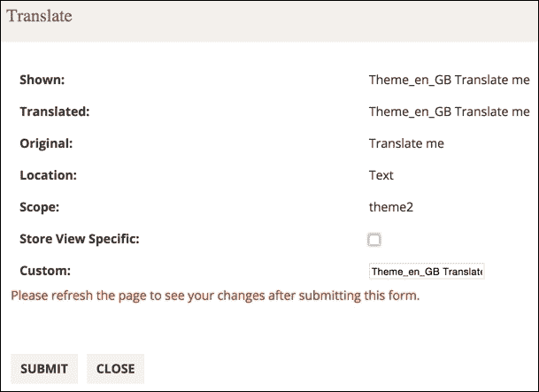

# 第七章。后端开发

**后端开发** 是一个最常用来描述与服务器端紧密相关的工作的术语。这通常意味着实际的服务器、应用程序代码和数据库。例如，如果我们打开一个网络商店的店面，向购物车添加几个产品，然后结账，应用程序将存储提供的信息。这些信息由一个使用服务器端语言（如 PHP）的服务器管理，然后保存在数据库中。在 第四章，*模型和集合*中，我们探讨了后端开发的框架。在本章中，我们将探讨其他与后端相关的方面。

在我们探讨以下主题时，我们将使用在第几章中定义的 `Foggyline_Office` 模块：

+   `cron` 作业

+   通知消息

+   会话和 cookies

+   记录日志

+   分析器

+   事件和观察者

+   缓存

+   小部件

+   自定义变量

+   i18n（国际化）

+   索引器

这些功能独立的单元通常用于日常后端相关开发。

# `cron` 作业

谈到 `cron` 作业，有一点很重要。`Magento cron` 作业与操作系统的 `cron` 作业不同。操作系统的 `cron` 由一个 `crontab`（即 `cron` 表）文件驱动。`crontab` 文件是一个配置文件，它指定了需要在给定的时间表上定期运行的 shell 命令。

`Magento cron` 作业由定期执行处理 `cron_schedule` 表条目的 PHP 代码驱动。`cron_schedule` 表是 `Magento cron` 作业从单个 `crontab.xml` 文件中提取后排队的地方。

`Magento` 的 `cron` 作业无法在没有将操作系统的 `cron` 作业设置为执行 `php bin/magento cron:run` 命令的情况下执行。理想情况下，应该设置一个操作系统的 `cron` 作业，使其每分钟触发 `Magento` 的 `cron:run`。然后，`Magento` 将根据在 `crontab.xml` 文件中定义的每个单独的 `cron` 作业的方式内部执行其 `cron` 作业。

要在 `Magento cron` 中定义一个新的 `cron` 作业，我们首先需要在模块中定义一个 `crontab.xml` 文件。让我们创建一个 `app/code/Foggyline/Office/etc/crontab.xml` 文件，内容如下：

```php
<?xml version="1.0"?>
<config  xsi:noNamespaceSchemaLocation= "urn:magento:module:Magento_Cron:etc/crontab.xsd">
    <group id="default">
        <job name="foggyline_office_logHello" instance= "Foggyline\Office\Model\Cron" method="logHello">
            <schedule>*/2 * * * *</schedule>
        </job>
    </group>
</config>
```

注意，`XSD` 架构位置指向 `Magento_Cron` 模块内的 `crontab.xsd`。

`group` 元素的 `id` 属性被设置为 `default` 默认值。在其模块中，`Magento` 定义了两个不同的组，即默认和索引。我们使用了 `default` 值，因为这是在控制台触发标准的 `php bin/magento cron:run` 命令时执行的那个值。

在`group`元素内，我们在`job`元素下定义了单独的作业。`job`元素要求我们指定`name`、`instance`和`method`属性。`name`属性必须在`group`元素内是唯一的。`instance`和`method`属性的值应指向将被实例化的类以及需要在该类中执行的方法。

在`cron`作业中嵌套的`schedule`元素指定了作业期望的执行时间。它使用与操作系统`crontab`文件中的条目相同的时间表达式。我们将查看的特定示例定义了一个每两分钟执行一次的表达式（`*/2 * * * *`）。

一旦我们定义了`crontab.xml`文件，我们需要定义`Foggyline\Office\Model\Cron`类文件，如下所示：

```php
namespace Foggyline\Office\Model;

class Cron
{
    protected $logger;

    public function __construct(
        \Psr\Log\LoggerInterface $logger
    )
    {
        $this->logger = $logger;
    }

    public function logHello()
    {
        $this->logger->info('Hello from Cron job!');
        return $this;
    }
}
```

上述代码简单地定义了一个由`cron`作业使用的`logHello`方法。在`logHello`方法中，我们使用了通过构造函数实例化的`logger`方法。一旦执行，`logger`方法将在`var/log/system.log`文件中创建一个日志条目。

一旦命令执行，你将在控制台看到按计划运行的`Ran`作业消息。此外，`cron_schedule`表应该填充所有已定义的`Magento cron`作业。

在这一点上，我们应该在控制台触发`php bin/magento cron:run`命令。

`cron_schedule`表包含以下列：

+   `schedule_id`：自增`primary`字段。

+   `job_code`：在`crontab.xml`文件中定义的作业`name`属性的值，在我们的例子中等于`foggyline_office_logHello`表。

+   `status`：默认为表中新创建条目的待处理值，允许有`pending`、`running`、`success`、`missed`或`error`值。其值会随着`cron`作业在其生命周期中的变化而改变。

+   `messages`：存储在作业执行过程中发生的异常错误消息（如果发生异常）。

+   `created_at`：表示作业创建的时间戳值。

+   `scheduled_at`：表示作业计划执行的时间戳值。

+   `executed_at`：表示作业执行开始的时间戳值。

+   `finished_at`：表示作业执行完成的时间戳值。

除非我们已经设置了操作系统的`cron`以触发`php bin/magento cron:run`命令，否则我们需要每隔两分钟自己触发它几次，以便实际执行作业。第一次运行命令时，如果作业不在`cron_schedule`表中，`Magento`只会将其排队，但不会执行它。随后的`cron`运行将执行命令。一旦我们确认`cron_schedule`表中的`cron`作业条目已填充`finished_at`列值，我们将在`var/log/system.log`文件中看到一个类似`[2015-11-21 09:42:18] main.INFO: Hello from Cron job! [] []`的条目。

### 小贴士

在`Magento`中开发和测试`cron`作业时，我们可能需要截断`cron_schedule`表，删除`Magento`的`var/cache`值，并重复执行`php bin/magento cron:run`命令，直到测试并通过。

# 通知消息

`Magento`通过`Messages`模块实现通知消息机制。`Messages`模块符合`\Magento\Framework\Message\ManagerInterface`接口。尽管接口本身不强制任何会话关系，但实现会添加接口定义的消息类型到会话中，并允许稍后访问这些消息。在`app/etc/di.xml`文件中，为`\Magento\Framework\Message\ManagerInterface`定义了一个针对`Magento\Framework\Message\Manager`类的偏好设置。

`Message\ManagerInterface`指定了四种消息类型，即`error`、`warning`、`notice`和`success`。消息类型后面跟着`Message\Manager`类中的几个关键方法，如`addSuccess`、`addNotice`、`addWarning`、`addError`和`addException`。`addException`方法基本上是`addError`的包装，它接受一个`exception`对象作为参数。

让我们在`app/code/Foggyline/Office/Controller/Test/Crud.php`的`execute`方法中尝试运行以下代码：

```php
$resultPage = $this->resultPageFactory->create();
$this->messageManager->addSuccess('Success-1');
$this->messageManager->addSuccess('Success-2');
$this->messageManager->addNotice('Notice-1');
$this->messageManager->addNotice('Notice-2');
$this->messageManager->addWarning('Warning-1');
$this->messageManager->addWarning('Warning-2');
$this->messageManager->addError('Error-1');
$this->messageManager->addError('Error-2');
return $resultPage;
```

一旦此代码执行，结果，如以下截图所示，将在浏览器页面中显示：


通知消息在前端和后台区域都会出现。

前端布局文件`vendor/magento/module-theme/view/frontend/layout/default.xml`定义如下：

```php
<page layout="3columns"  xsi:noNamespaceSchemaLocation= "../../../../../../../lib/internal/Magento/Framework /View/Layout/etc/page_configuration.xsd">
    <update handle="default_head_blocks"/>
    <body>
        <!-- ... -->
        <referenceContainer name="columns.top">
            <container name="page.messages" htmlTag="div" htmlClass="page messages">
                <block class="Magento\Framework\View\Element \Messages" name="messages" as="messages" template="Magento_Theme::messages.phtml"/>
            </container>
        </referenceContainer>
        <!-- ... -->
    </body>
</page>
```

用于渲染消息的`template`文件位于`Magento_Theme`模块中的`view/frontend/templates/messages.phtml`。通过查看`Magento\Framework\View\Element\Messages`类，你会看到`_toHtml`方法根据模板是否设置而分支到`if-else`语句。如果模板未设置，`_toHtml`方法内部会调用`_renderMessagesByType`方法，该方法以类型分组渲染 HTML 格式的消息。

`Magento_AdminNotification`模块中的`view/adminhtml/layout/default.xml`管理布局文件如下定义：

```php
<page  xsi:noNamespaceSchemaLocation="urn:magento: framework:View/Layout/etc/page_configuration.xsd">
    <body>
        <referenceContainer name="notifications">
            <block class="Magento\AdminNotification\Block \System\Messages" name="system_messages" as="system_messages" before="-" template= "Magento_AdminNotification::system/messages.phtml"/>
        </referenceContainer>
    </body>
</page>
```

用于渲染消息的`template`文件位于`Magento_AdminNotification`模块中的`view/adminhtml/templates/system/messages.phtml`。当你查看`Magento\AdminNotification\Block\System\Messages`类时，你会看到它的`_toHtml`正在调用父方法`_toHtml`，其中父类属于`\Magento\Framework\View\Element\Template`类。这意味着输出依赖于`Magento_AdminNotification`模块中的`view/adminhtml/templates/system/messages.phtml`文件。

# 会话和 cookies

`Magento`中的会话符合`Magento\Framework\Session\SessionManagerInterface`。在`app/etc/di.xml`文件中，有一个对`SessionManagerInterface`类的定义偏好设置，它指向`Magento\Framework\Session\Generic`类类型。`Session\Generic`类只是一个空的类，它扩展了`Magento\Framework\Session\SessionManager`类，而后者又实现了`SessionManagerInterface`类。

在`SessionManager`实例中，有一个重要的对象被实例化，它符合`\Magento\Framework\Session\Config\ConfigInterface`。查看`app/etc/di.xml`文件，我们可以看到对`ConfigInterface`的偏好设置指向`Magento\Framework\Session\Config`类类型。

### 小贴士

要完全理解`Magento`中的会话行为，我们应该研究`SessionManager`和`Session\Config`类的内部工作原理。

`Magento`使用 cookie 来跟踪会话。这些 cookie 的默认生存期为 3,600 秒。当会话建立时，在浏览器中创建一个名为`PHPSESSID`的 cookie。cookie 的值等于会话名称。默认情况下，会话存储在`Magento`根安装的`var/session`目录中的文件中。

如果您查看这些会话文件，您将看到会话信息被存储在序列化的字符串中，这些字符串被分为如`_session_validator_data, _session_hosts`, `default`, `customer_website_1`, 和`checkout`等分组，如下面的截图所示：


这不是分组列表的终结。实现自己会话处理部分的模块可以添加自己的组。

我们可以通过简单地使用以下表达式在会话中存储和检索信息：

```php
$this->sessionManager->setFoggylineOfficeVar1('Office1');
$this->sessionManager->getFoggylineOfficeVar1();
```

上述表达式将在默认组下创建和获取会话条目。

我们可以通过使用`$this->sessionManager->getData()`表达式简单地获取默认会话组的全部内容，这将返回一个类似于以下的数据数组：

```php
array(3) {
  ["_form_key"] => string(16) "u3sNaa26Ii21nveV"
  ["visitor_data"] => array(14) {
    ["last_visit_at"] => string(19) "2015-08-19 07:40:03"
    ["session_id"] => string(26) "8p82je0dkqq1o00lanlr6bj6m2"
    ["visitor_id"] => string(2) "35"
    ["server_addr"] => int(2130706433)
    ["remote_addr"] => int(2130706433)
    ["http_secure"] => bool(false)
    ["http_host"] => string(12) "magento2.loc"
    ["http_user_agent"] => string(121) "Mozilla/5.0 …"
    ["http_accept_language"] => string(41) "en-US,en;"
    ["http_accept_charset"] => string(0) ""
    ["request_uri"] => string(38) "/index.php/foggyline_office/test/crud/"
    ["http_referer"] => string(0) ""
    ["first_visit_at"] => string(19) "2015-08-19 07:40:03"
    ["is_new_visitor"] => bool(false)
  }
  ["foggyline_office_var_1"] => string(7) "Office1"
}
```

如您所见，`foggyline_office_var_1`值就在其他会话值之中。

`ConfigInterface`有几个有用的方法，我们可以使用这些方法来获取会话配置信息；以下是一些方法：

+   `getCookieSecure`

+   `getCookieDomain`

+   `getCookieHttpOnly`

+   `getCookieLifetime`

+   `getName`

+   `getSavePath`

+   `getUseCookies`

+   `getOptions`

下面是一个在`Session\Config`实例上调用`getOptions`方法的结果示例：

```php
array(9) {
  ["session.save_handler"] => string(5) "files"
  ["session.save_path"] => string(39) "/Users/branko/www/magento2/var/session/"
  ["session.cookie_lifetime"] => int(3600)
  ["session.cookie_path"] => string(1) "/"
  ["session.cookie_domain"] => string(12) "magento2.loc"
  ["session.cookie_httponly"] => bool(true)
  ["session.cookie_secure"] => string(0) ""
  ["session.name"] => string(9) "PHPSESSID"
  ["session.use_cookies"] => bool(true)
}
```

cookie 通常与会话一起使用。除了用于链接到某个会话外，cookie 还常用于在客户端存储一些信息，从而跟踪或识别回头用户和客户。

除了使用`setcookie`函数的纯 PHP 方法外，我们还可以通过`Magento\Framework\Stdlib\CookieManagerInterface`实例在`Magento`中管理 cookie。当你查看`app/etc/di.xml`文件时，你会看到对`CookieManagerInterface`的偏好设置指向了`Magento\Framework\Stdlib\Cookie\PhpCookieManager`类型的类。

当涉及到`Magento`的 cookie 时，以下限制值得关注：

+   我们可以在系统中设置最多 50 个 cookie。否则，`Magento`将抛出`Unable to send the cookie. Maximum number of cookies would be exceeded`异常。

+   我们可以存储最大大小为 4096 字节的 cookie。否则，`Magento`将抛出`Unable to send the cookie. Size of 'name' is size bytes`异常。

通过实施这些限制，`Magento`确保我们与大多数浏览器兼容。

`CookieManagerInterface`类，以及其他一些功能，指定了`setSensitiveCookie`方法的要求。此方法使用给定的`$name $value`配对在私有 cookie 中设置一个值。敏感 cookie 将**HttpOnly**设置为 true，因此不能通过 JavaScript 访问。

正如我们将在以下示例中很快展示的，要设置公共或私有 cookie，我们可以通过使用以下实例来帮助自己：

+   `\Magento\Framework\Stdlib\Cookie\CookieMetadataFactory`

+   `\Magento\Framework\Stdlib\CookieManagerInterface`

+   `\Magento\Framework\Session\Config\ConfigInterface`

我们可以按以下方式设置公共 cookie：

```php
$cookieValue = 'Just some value';
$cookieMetadata = $this->cookieMetadataFactory
    ->createPublicCookieMetadata()
    ->setDuration(3600)
    ->setPath($this->sessionConfig->getCookiePath())
    ->setDomain($this->sessionConfig->getCookieDomain())
    ->setSecure($this->sessionConfig->getCookieSecure())
    ->setHttpOnly($this->sessionConfig->getCookieHttpOnly());

$this->cookieManager
  ->setPublicCookie('cookie_name_1', $cookieValue, $cookieMetadata);
```

前面的代码将生成一个 cookie，如下面的截图所示：


我们可以按以下方式设置私有 cookie：

```php
$cookieValue = 'Just some value';

$cookieMetadata = $this->cookieMetadataFactory
    ->createSensitiveCookieMetadata()
    ->setPath($this->sessionConfig->getCookiePath())
    ->setDomain($this->sessionConfig->getCookieDomain());

$this->cookieManager
  ->setSensitiveCookie('cookie_name_2', $cookieValue, $cookieMetadata);
```

前面的代码将生成一个 cookie，如下面的截图所示：


有趣的是，前面示例中的公共和私有 cookie 都显示**HttpOnly**被勾选，因为默认情况下，`Magento`管理员在**Stores** | **Settings** | **Configuration** | **General** | **Web** | **Default Cookie Settings** | **Use HTTP Only**设置为**Yes**。由于我们在公共 cookie 示例中使用`setHttpOnly`方法，我们只需通过`$this->sessionConfig->getCookieHttpOnly()`获取`config`值并传递即可。如果我们取消注释该行，我们将看到公共 cookie 实际上并没有默认设置**HttpOnly**。

# 记录

`Magento`通过其`\Psr\Log\LoggerInterface`类支持消息记录机制。`LoggerInterface`类在`app/etc/di.xml`文件中为`Magento\Framework\Logger\Monolog`类类型定义了偏好设置。实现的`核心`实际上在名为`Monolog\Logger`的`Monolog`父类中，它来自`Monolog`供应商。

`LoggerInterface`类使用以下八种方法将日志写入八个 RFC 5424 级别：

+   `debug`

+   `info`

+   `notice`

+   `warning`

+   `error`

+   `critical`

+   `alert`

+   `emergency`

要使用记录器，我们需要将`LoggerInterface`类传递给一个构造函数，该构造函数位于我们想要使用的类内部，然后简单地调用以下方法之一：

```php
$this->logger->log(\Monolog\Logger::DEBUG, 'debug msg');
$this->logger->log(\Monolog\Logger::INFO, 'info msg');
$this->logger->log(\Monolog\Logger::NOTICE, 'notice msg');
$this->logger->log(\Monolog\Logger::WARNING, 'warning msg');
$this->logger->log(\Monolog\Logger::ERROR, 'error msg');
$this->logger->log(\Monolog\Logger::CRITICAL, 'critical msg');
$this->logger->log(\Monolog\Logger::ALERT, 'alert msg');
$this->logger->log(\Monolog\Logger::EMERGENCY, 'emergency msg');
```

或者，通过单独的日志级别类型方法，首选的较短的版本如下：

```php
$this->logger->debug('debug msg');
$this->logger->info('info msg');
$this->logger->notice('notice msg');
$this->logger->warning('warning msg');
$this->logger->error('error msg');
$this->logger->critical('critical msg');
$this->logger->alert('alert msg');
$this->logger->emergency('emergency msg');
```

这两种方法都会在`Magento`中创建相同的两个日志文件，如下所示：

+   `var/log/debug.log`

+   `var/log/system.log`

`debug.log`文件只包含日志的调试级别类型，其余的都保存在`system.log`中。

这些日志条目将看起来像这样：

```php
[2015-11-21 09:42:18] main.DEBUG: debug msg {"is_exception":false} []
[2015-11-21 09:42:18] main.INFO: info msg [] []
[2015-11-21 09:42:18] main.NOTICE: notice msg [] []
[2015-11-21 09:42:18] main.WARNING: warning msg [] []
[2015-11-21 09:42:18] main.ERROR: error msg [] []
[2015-11-21 09:42:18] main.CRITICAL: critical msg [] []
[2015-11-21 09:42:18] main.ALERT: alert msg [] []
[2015-11-21 09:42:18] main.EMERGENCY: emergency msg [] []
```

这些`logger`方法中的每一个都可以接受一个名为`context`的任意数据数组，如下所示：

```php
$this->logger->info('User logged in.', ['user'=>'Branko', 'age'=>32]);
```

上述表达式将在`system.log`中产生以下条目：

```php
[2015-11-21 09:42:18] main.INFO: User logged in. {"user":"Branko","age":32} []
```

### 小贴士

我们可以手动从`var/log`目录中删除任何`.log`文件，当需要时，`Magento`会自动重新创建它。

`Magento`还实施了一种其他的日志记录机制，它在数据库的`log_*`表中记录以下操作：

+   `log_customer`

+   `log_quote`

+   `log_summary`

+   `log_summary_type`

+   `log_url`

+   `log_url_info`

+   `log_visitorz`

+   `log_visitor_info`

+   `log_visitor_online`

值得注意的是，这种数据库日志记录与之前描述的`Psr`记录器没有任何关系。虽然`Psr`记录器在代码中为开发者提供了一种根据`Psr`标准对某些消息进行分组和记录的方法，但数据库日志记录记录的是浏览器中`用户/客户`交互产生的实时数据。

默认情况下，`Magento`保留数据库日志大约 180 天。这是一个可配置的选项，可以在`Magento`管理区域**商店** | **设置** | **配置** | **高级** | **系统** | **日志清理**选项卡中控制，如以下截图所示：


**配置**选项，如前一张截图所示，仅表示操作系统`cron`正在触发`Magento cron`。

### 小贴士

我们可以在终端执行两个命令：`php bin/magento log:status`以获取日志表当前状态信息，以及`php bin/magento log:clean`以强制清除表。

# 剖析器

`Magento`有一个内置的剖析器，可以用来识别服务器端的性能问题。简而言之，剖析器可以告诉我们某些代码块执行的时间。它的行为并没有什么特别之处。我们只能获取被剖析器的开始和停止方法包裹的代码块或单个表达式的执行时间。`Magento`在其代码中广泛地调用剖析器。然而，我们看不到它的效果，因为剖析器的输出默认是禁用的。

`Magento`支持三种剖析器输出，即`html`、`csvfile`和`firebug`。

要启用剖析器，我们可以编辑`.htaccess`并添加以下表达式之一：

+   `SetEnv MAGE_PROFILER "html"`

+   `SetEnv MAGE_PROFILER "csvfile"`

+   `SetEnv MAGE_PROFILER "firebug"`

分析器的 HTML 类型将输出到我们在浏览器中打开的页面的页脚区域，如下面的截图所示：


分析器的`csv`文件类型将输出到`var/log/profiler.csv`，如下面的截图所示：


分析器的 firebug 类型将输出到`var/log/profiler.csv`，如下面的截图所示：


分析器输出了以下信息：

+   `Time`分析器显示从`Profiler::start`到`Profiler::stop`所花费的时间。

+   `Avg`分析器显示对于`Cnt`大于一的情况，从`Profiler::start`到`Profiler::stop`所花费的平均时间。

+   `Cnt`分析器显示我们使用相同的计时器名称启动分析器的次数的整数值。例如，如果我们已经在代码的某个地方调用了`\Magento\Framework\Profiler::start('foggyline:office')`两次，那么`Cnt`将显示值为`2`。

+   `Emalloc`分析器代表分配给 PHP 的内存量。它是核心 PHP `memory_get_usage`函数（没有传递带有 true 参数的它）和计时器值的组合。

+   `RealMem`分析器也代表分配给 PHP 的内存量，其最终值也是通过`memory_get_usage`函数减去计时器值获得的，但这次传递了带有 true 参数的它。

我们可以在代码的任何地方轻松地添加自己的`Profiler::start`调用。每个`Profiler::start`都应该跟随一些代码表达式，然后通过一个`Profiler::stop`调用结束，如下所示：

```php
\Magento\Framework\Profiler::start('foggyline:office');
sleep(2); /* code block or single expression here */
\Magento\Framework\Profiler::stop('foggyline:office');
```

根据我们在代码中调用分析器的位置，生成的输出应该类似于以下截图所示：


# 事件和观察者

`Magento`通过`\Magento\Framework\Event\ManagerInterface`实现观察者模式。在`app/etc/di.xml`中，有一个指向`Magento\Framework\Event\Manager\Proxy`类类型的`ManagerInterface`偏好设置。`Proxy`类进一步扩展了`\Magento\Framework\Event\Manager`类，该类实现了实际的事件分发方法。

事件通过在`Event\Manager`类的实例上调用分发方法，并将名称和一些数据（可选）传递给它来分发。以下是一个`Magento`核心事件的示例：

```php
$this->eventManager->dispatch(
    'customer_customer_authenticated',
    ['model' => $this->getFullCustomerObject($customer), 'password' => $password]
);
```

`$this->eventManager`是之前提到的`Event\Manager`类的实例。在这种情况下，事件名称等于`customer_customer_authenticated`，而传递给事件的数据是包含两个元素的数组。前一个事件是在调用`\Magento\Customer\Model\AccountManagement`上的 authenticate 方法时触发的，即当客户登录时。

仅当我们期望有人观察事件并在事件被触发时执行他们的代码时，触发事件才有意义。根据我们想要观察事件的区域，我们可以在以下 XML 文件之一中定义观察者：

+   `app/code/{vendorName}/{moduleName}/etc/events.xml`

+   `app/code/{vendorName}/{moduleName}/etc/frontend/events.xml`

+   `app/code/{vendorName}/{moduleName}/etc/adminhtml/events.xml`

让我们定义一个观察者，它将认证用户的电子邮件地址记录到`var/log/system.log`文件中。我们可以使用`Foggyline_Office`模块并向其中添加一些代码。由于我们对店面感兴趣，将观察者放在`etc/frontend/events.xml`模块中是有意义的。

让我们定义包含以下内容的`app/code/Foggyline/Office/etc/frontend/events.xml`文件：

```php
<config  xsi:noNamespaceSchemaLocation="urn:magento:framework: Event/etc/events.xsd">
    <event name="customer_customer_authenticated">
        <observer name="foggyline_office_customer_authenticated" instance="Foggyline\Office\Observer\LogCustomerEmail" />
    </event>
</config>
```

在这里，我们指定了一个`foggyline_office_customer_authenticated`观察者用于`customer_customer_authenticated`事件。观察者定义在放置在`Observer`模块目录中的`LogCustomerEmail`类中。`Observer`类必须实现`Magento\Framework\Event\ObserverInterface`类。`Observer`接口定义了一个单一的`execute`方法。`execute`方法包含观察者代码，并在`customer_customer_authenticated`事件被触发时执行。

让我们继续在`app/code/Foggyline/Office/Observer/LogCustomerEmail.php`文件中定义`Foggyline\Office\Observer\LogCustomerEmail`类，如下所示：

```php
namespace Foggyline\Office\Observer;

use Magento\Framework\Event\ObserverInterface;

class LogCustomerEmail implements ObserverInterface
{
    protected $logger;

    public function __construct(
        \Psr\Log\LoggerInterface $logger
    )
    {
        $this->logger = $logger;
    }

    /**
     * @param \Magento\Framework\Event\Observer $observer
     * @return self
     */
    public function execute(\Magento\Framework\Event\Observer $observer)
    {
        //$password = $observer->getEvent()->getPassword();
        $customer = $observer->getEvent()->getModel();
        $this->logger->info('Foggyline\Office: ' . $customer-> getEmail());
        return $this;
    }
}
```

`execute`方法接受一个名为`$observer`的单个参数，其类型为`\Magento\Framework\Event\Observer`。我们正在观察的事件在数组中传递两份数据，即`model`和`password`。我们可以通过使用`$observer->getEvent()->get{arrayKeyName}`表达式来访问这些数据。`$customer`对象是`Magento\Customer\Model\Data\CustomerSecure`类的一个实例，它包含诸如`email`、`firstname`、`lastname`等属性。因此，我们可以从中提取电子邮件地址并将其传递给记录器的`info`方法。

现在我们知道了如何观察现有的事件，让我们看看我们如何可以触发我们自己的事件。我们可以在代码的几乎任何地方触发事件，无论是有数据还是无数据，如下面的示例所示：

```php
$this->eventManager->dispatch('foggyline_office_foo');
// or
$this->eventManager->dispatch(
    'foggyline_office_bar',
    ['var1'=>'val1', 'var2'=>'val2']
);
```

值得注意的是，存在两种类型的事件；我们可以根据它们名称的分配方式将它们分组如下：

+   **静态**: `$this->eventManager->dispatch('event_name', ...)`

+   **动态**: `$this->eventManager->dispatch({expression}.'_event_name', ...)`

静态事件有一个固定的字符串名称，而动态事件则有一个在运行时确定的名称。以下是一个很好的核心`Magento`功能示例，来自定义在`lib/internal/Magento/Framework/Data/AbstractSearchResult.php`下的`afterLoad`方法，展示了如何使用这两种类型的事件：

```php
protected function afterLoad()
{
    $this->eventManager->dispatch ('abstract_search_result_load_after', ['collection' => $this]);
    if ($this->eventPrefix && $this->eventObject) {
        $this->eventManager->dispatch($this->eventPrefix . '_load_after', [$this->eventObject => $this]);
    }
}
```

我们可以看到一个**静态**事件（`abstract_search_result_load_after`）和一个动态事件（`$this->eventPrefix . '_load_after'`）。`$this->eventPrefix` 是一个在运行时被评估的表达式。在使用动态事件时我们应该小心，因为它们在多种情况下被触发。一些有趣的动态事件是在以下类中定义的：

+   `Magento\Framework\Model\AbstractModel`

    +   `$this->_eventPrefix . '_load_before'`

    +   `$this->_eventPrefix . '_load_after'`

    +   `$this->_eventPrefix . '_save_commit_after'`

    +   `$this->_eventPrefix . '_save_before'`

    +   `$this->_eventPrefix . '_save_after'`

    +   `$this->_eventPrefix . '_delete_before'`

    +   `$this->_eventPrefix . '_delete_after'`

    +   `$this->_eventPrefix . '_delete_commit_after'`

    +   `$this->_eventPrefix . '_clear'`

+   `\Magento\Framework\Model\ResourceModel\Db\Collection\AbstractCollection`

    +   `$this->_eventPrefix . '_load_before'`

    +   `$this->_eventPrefix . '_load_after'`

+   `\Magento\Framework\App\Action\Action`

    +   `'controller_action_predispatch_' . $request-> getRouteName()`

    +   `'controller_action_predispatch_' . $request-> getFullActionName()`

    +   `'controller_action_postdispatch_' . $request-> getFullActionName()`

    +   `'controller_action_postdispatch_' . $request-> getRouteName()`

+   `Magento\Framework\View\Result\Layout`

+   `'layout_render_before_' . $this->request-> getFullActionName()`

这些事件在 `model`、`collection`、`controller` 和 `layout` 类上触发，这些类可能是最常用的后端元素，经常需要观察和交互。尽管我们可以说在运行时，我们知道完整的事件名称以及动态事件，但这也可以在运行前就假设。

例如，假设我们想要观察 `Foggyline_Office` 模块的 `Crud` 控制器动作的 `'controller_action_predispatch_' . $request->getFullActionName()`，那么实际的全事件名称将是 `'controller_action_predispatch_foggyline_office_test_crud'`，因为在运行时 `$request->getFullActionName()` 将解析为 `foggyline_office_test_crud`。

# 缓存（s）

根据以下列表，`Magento` 提供了十一种内置缓存类型，这些类型在系统内部多个层级中使用：

+   **配置**：跨模块收集并合并的各种 XML 配置

+   **布局**：布局构建指令

+   **块 HTML 输出**：页面块 HTML

+   **集合数据**：集合数据文件

+   **反射数据**：API 接口反射数据

+   **数据库 DDL 操作**：DDL 查询的结果，例如描述表或索引

+   **EAV 类型和属性**：实体类型声明缓存

+   **页面缓存**：完整页面缓存

+   **翻译**：翻译文件

+   **集成配置**：集成配置文件

+   **集成 API 配置**：集成 API 配置文件

+   **Web 服务配置**：REST 和 SOAP 配置，生成的 WSDL 文件

此外，还有 **附加缓存管理**，它管理以下文件的缓存：

+   之前生成的产品图片文件

+   主题 JavaScript 和 CSS 文件合并为一个文件

+   预处理视图文件和静态文件

这些缓存中的每一个都可以单独清除。

我们可以轻松地定义自己的缓存类型。我们可以通过首先创建一个 `app/code/Foggyline/Office/etc/cache.xml` 文件并包含以下内容来实现：

```php
<config  xsi:noNamespaceSchemaLocation="urn:magento:framework:Cache/etc/ cache.xsd">
    <type name="foggyline_office"
          instance="Foggyline\Office\Model\Cache">
        <label>Foggyline Office Example</label>
        <description>Example cache from Foggyline Office module.</description>
    </type>
</config>
```

在定义新的缓存类型时，我们需要指定其 `name` 和 `instance` 属性。`type` 元素的 `name` 属性应设置为 `foggyline_office`，并且在整个 `Magento` 中应该是唯一的。这个值应该与 `Foggyline\Office\Model\Cache` 类中的 `TYPE_IDENTIFIER` 常量值相匹配，该类将很快创建。`instance` 属性包含我们将用于缓存的类名。

然后，我们将在 `app/code/Foggyline/Office/Model/Cache.php` 文件中定义 `Foggyline\Office\Model\Cache` 类，内容如下：

```php
namespace Foggyline\Office\Model;

class Cache extends \Magento\Framework\Cache\Frontend\Decorator\TagScope
{
    const TYPE_IDENTIFIER = 'foggyline_office';

    const CACHE_TAG = 'OFFICE';

    public function __construct(
        \Magento\Framework\App\Cache\Type\FrontendPool $cacheFrontendPool
    )
    {
        parent::__construct(
            $cacheFrontendPool->get(self::TYPE_IDENTIFIER), self::CACHE_TAG
        );
    }
}
```

`Cache` 类继承自 `TagScope` 并为其自己的 `TYPE_IDENTIFIER` 和 `CACHE_TAG` 指定值，在 `__construct` 方法中将它们传递给父构造函数。有了这两个文件（`cache.xml` 和 `Cache`），我们基本上定义了一种新的缓存类型。

一旦我们指定了 `cache.xml` 文件和引用的 `cache` 类，我们应该能够在 `Magento` 管理后台的 **系统** | **工具** | **缓存管理** 菜单下看到我们的缓存类型，如下截图所示：


仅通过定义一个新的缓存，并不意味着它会被 `Magento` 填充和使用。

如果你想在代码的任何地方使用缓存，你可以通过首先将缓存类的实例传递给构造函数来实现，如下所示：

```php
protected $cache;

public function __construct(
    \Foggyline\Office\Model\Cache $cache
)
{
    $this->cache = $cache;
}
```

然后，你可以执行一段代码，如下所示：

```php
$cacheId = 'some-specific-id';
$objInfo = null;
$_objInfo = $this->cache->load($cacheId);

if ($_objInfo) {
    $objInfo = unserialize($_objInfo);
} else {
    $objInfo = [
        'var1'=> 'val1',
        'var2' => 'val2',
        'var3' => 'val3'
    ];
    $this->cache->save(serialize($objInfo), $cacheId);
}
```

上述代码显示了我们首先尝试从现有的缓存条目中加载值，如果没有，则保存它。如果缓存类型在 **缓存管理** 菜单下设置为 `disabled`，则上述代码将永远不会保存并从缓存中拉取数据，因为它不起作用。

现在，如果你查看 `Magento` 的 `var/cache` 文件夹，你将看到以下截图所示的内容：


`Magento` 为我们创建了两个缓存条目，分别是 `var/cache/mage-tags/mage---a8a_OFFICE` 和 `var/cache/mage--f/mage---a8a_SOME_SPECIFIC_ID`。在这个特定情况下，`mage---a8a_OFFICE` 文件只有一行条目，条目是 `a8a_SOME_SPECIFIC_ID` 字符串，显然指向另一个文件。`mage---a8a_SOME_SPECIFIC_ID` 文件包含实际的序列化 `$objInfo` 数组。

`a8a_` 前缀和其他 `cache` 文件名中的前缀对我们来说并不真正相关；这是 `Magento` 自己添加的。对我们来说，相关的是向我们要缓存的块或变量传递适当的单个缓存标签，就像前面的例子中那样，以及我们为 `Cache` 类设置的 `TYPE_IDENTIFIER` 和 `CACHE_TAG` 标签。

# 小部件

`Magento` 提供了对小部件的支持。尽管“小部件”这个词可能意味着前端开发技能和活动，但我们将把它们视为后端开发流程的一部分，因为创建有用且健壮的小部件需要大量的后端知识。

`Magento` 提供了几个开箱即用的小部件；其中一些如下：

+   CMS 页面链接

+   CMS 静态块

+   目录分类链接

+   目录新产品列表

+   目录产品链接

+   目录产品列表

+   订单和退货

+   最近比较的产品

+   最近查看的产品

要创建一个完全自定义的小部件，我们首先定义 `app/code/Foggyline/Office/etc/widget.xml` 并添加内容，如下所示：

```php
<widgets  xsi:noNamespaceSchemaLocation="urn:magento:module: Magento_Widget:etc/widget.xsd">
    <widget id="foggyline_office"
        class="Foggyline\Office\Block\Widget\Example"
            placeholder_image="Magento_Cms::images/ widget_block.png">
        <label translate="true">Foggyline Office</label>
        <description translate="true">Example Widget</description>
        <parameters>
            <parameter name="var1" xsi:type="select" visible="true" source_model="Magento\Config\Model \Config\Source\Yesno">
                <label translate="true">Yes/No var1</label>
            </parameter>
            <parameter name="var2" xsi:type="text" required="true" visible="true">
                <label translate="true">Number var2</label>
                <depends>
                    <parameter name="var1" value="1"/>
                </depends>
                <value>5</value>
            </parameter>
        </parameters>
    </widget>
</widgets>
```

`id` 小部件已被设置为 `foggyline_office`，而驱动小部件的类已被设置为 `Foggyline\Office\Block\Widget\Example`。`widget` 类基本上是一个扩展自 `\Magento\Framework\View\Element\AbstractBlock` 并实现 `\Magento\Widget\Block\BlockInterface` 的 `block` 类。当我们选择小部件进行使用时，`label` 和 `description` 元素设置的值将显示在 `Magento` 管理后台。 

小部件的参数是其可配置选项，这些选项根据我们选择的 `type` 和 `source_model` 选项转换为 HTML 表单元素。在下面的例子中，我们将演示使用 `select` 和 `text` 元素从用户那里获取输入，如图所示：


让我们通过在 `app/code/Foggyline/Office/Block/Widget/Example.php` 文件中创建实际的 `WidgetExample` 类并添加内容来继续，如下所示：

```php
namespace Foggyline\Office\Block\Widget;

class Example extends \Magento\Framework\View\Element\Text implements \Magento\Widget\Block\BlockInterface
{
    protected function _beforeToHtml()
    {
        $this->setText(sprintf(
            'example widget: var1=%s, var2=%s',
            $this->getData('var1'),
            $this->getData('var2')
        ));

        return parent::_beforeToHtml();
    }
}
```

这里发生的情况是，我们正在使用 `Element\Text` 作为块类型，而不是 `Element\Template`，因为我们想简化示例，因为 `Element\Template` 还需要定义 `phtml` 模板。通过使用 `Element\Text`，我们可以简单地定义 `_beforeToHtml` 并调用 `setText` 方法来设置块的输出文本字符串。我们将通过拾取作为参数传递给块的 `var1` 和 `var2` 变量来构建输出字符串。

现在，如果我们打开 `Magento` 管理区域，转到 **内容** | **元素** | **页面**，并选择 **主页** 进行编辑，我们应该能够点击 **插入前端应用** 按钮并将我们的小部件添加到页面中。或者，如果我们不是在 `WYSIWYG` 模式下编辑页面内容，我们也可以使用以下表达式手动将小部件添加到页面中：

```php
{{widget type="Foggyline\\Office\\Block\\Widget\\Example" var1="1" var2="5"}}
```

最后，当我们访问店面主页时，我们应该在浏览器中看到示例小部件：`var1=1, var2=5` 字符串。

我们可以使用前端应用创建高度可配置和可嵌入的组件，用户可以轻松地将它们分配到 CMS 页面或块。

# 自定义变量

变量是`Magento_Variable`核心模块的一个便捷小功能。`Magento`允许你创建自定义变量，然后可以在电子邮件模板、`WYSIWYG`编辑器或甚至代码表达式中使用它们。

以下步骤概述了如何手动创建新变量：

1.  在`Magento`管理区域，导航到**系统** | **其他设置** | **自定义变量**。

1.  点击**添加新变量**按钮。

1.  在考虑**商店视图**切换器的同时，填写所需的**变量代码**和**变量名称**选项，并最好选择一个可选选项，即**变量 HTML 值**或**变量纯文本值**。

1.  点击**保存**按钮。

现在我们已经创建了自定义变量，我们可以通过以下表达式在电子邮件模板或`WYSIWYG`编辑器中使用它：

```php
{{customVar code=foggyline_hello}}
```

上述表达式将调用代码`foggyline_hello`中`custom`变量的值。

变量可以在各种代码表达式中使用，尽管不建议依赖于单个变量的存在，因为管理员用户可以在任何时间点删除它。以下示例演示了如何在代码中使用现有变量：

```php
$storeId =0;

$variable = $this->_variableFactory->create()->setStoreId(
    $storeId
)->loadByCode(
    'foggyline_hello'
);

$value = $variable->getValue(
    \Magento\Variable\Model\Variable::TYPE_HTML
);
```

`$this->_variableFactory`是`\Magento\Variable\Model\VariableFactory`的一个实例。

如果使用得当，变量可以很有用。存储诸如电话号码或用于 CMS 页面、博客和电子邮件模板中的专用标签等信息是使用自定义变量的好例子。

# i18n

**i18n**是**国际化**的缩写。`Magento`默认添加 i18n 支持，因此无需应用更改即可适应各种语言和地区。在`app/functions.php`中，有一个`__()`翻译函数，其定义如下：

```php
function __()
{
    $argc = func_get_args();

    $text = array_shift($argc);
    if (!empty($argc) && is_array($argc[0])) {
        $argc = $argc[0];
    }

    return new \Magento\Framework\Phrase($text, $argc);
}
```

这个`translation`函数接受可变数量的参数，并将它们传递给`\Magento\Framework\Phrase`类的构造函数，并返回其实例。`Phrase`类有`__toString`方法，然后返回翻译后的字符串。

这里有一些如何使用`__()`函数的示例：

+   `__('Translate me')`

+   `__('Var1 %1, Var2 %2, Var %3', time(), date('Y'), 32)`

+   `__('版权 %1 <a href="%2">Magento</a>', date('Y'), 'http://magento.com')`

通过`translation`函数传递的字符串预计可以在本地 CSV 文件中找到，例如`app/code/{vendorName}/{moduleName}/i18n/{localeCode}.csv`。让我们暂时想象一下，我们在`Magento`管理区域的**商店** | **设置** | **所有商店**下定义了两个不同的商店视图。一个商店将**商店** | **设置** | **配置** | **常规** | **区域选项** | **区域**设置为**英语（英国**）和另一个设置为**德语（德国**）。**英语（英国**）的本地代码是`en_GB`，而**德语（德国**）的本地代码是`de_DE`。

对于`de_DE`区域设置，我们将在`app/code/Foggyline/Office/i18n/de_DE.csv`文件中添加翻译条目，如下所示：

```php
"Translate me","de_DE Translate me"
"Var1 %1, Var2 %2, Var %3","de_DE Var1 %1, Var2 %2, Var %3"
"Copyright %1 <a href=""%2"">Magento</a>","de_DE Copyright %1 <a href=""%2"">Magento</a>"
```

对于`en_GB`区域设置，我们将在`app/code/Foggyline/Office/i18n/en_GB.csv`文件中添加翻译条目，如下所示：

```php
"Translate me","en_GB Translate me"
"Var1 %1, Var2 %2, Var %3", "en_GB Var1 %1, Var2 %2, Var %3"
"Copyright %1 <a href=""%2"">Magento</a>","en_GB Copyright %1 <a href=""%2"">Magento</a>"
```

观察两个 CSV 文件，出现了一个模式。我们可以看到 CSV 文件按以下方式工作：

+   根据 CSV 的每一行提供单独的翻译字符串

+   每一行进一步包含两个由逗号分隔的独立字符串

+   两个独立字符串都被引号包围

+   如果一个字符串包含引号，它将通过双引号转义，以便它不会破坏翻译

+   `%1`、`%2`、`%3`...`%n`模式用于标记我们在应用程序运行时通过代码提供的变量占位符

`Magento`支持与其`bin/magento`控制台工具相关的几个命令：

```php
i18n
 i18n:collect-phrases   Discovers phrases in the codebase
 i18n:pack              Saves language package
 i18n:uninstall         Uninstalls language packages

```

如果我们执行以下控制台命令，Magento 将递归地查找 PHP、PHTML 或 XML 文件中的可翻译表达式，这些文件包含要翻译的短语：

```php
php bin/magento i18n:collect-phrases -o "/Users/branko/www/magento2/app/code/Foggyline/Office/i18n/en_GB.csv" /Users/branko/www/magento2/app/code/Foggyline/Office

```

上述命令的输出将基本上覆盖`app/code/Foggyline/Office/i18n/en_GB.csv`文件，该文件包含所有`Foggyline/Office`模块的可翻译短语。这是一种将所有可翻译短语聚合到适当的区域文件中的好方法，例如在本例中的`en_GB.csv`。

翻译 CSV 文件也可以放置在单个主题下。例如，让我们想象一种情况，我们向`app/design/frontend/Magento/blank/i18n/en_GB.csv`添加内容，如下所示：

```php
"Translate me","Theme_en_GB Translate me"
"Var1 %1, Var2 %2, Var %3", "Theme_en_GB Var1 %1, Var2 %2, Var %3"
"Copyright %1 <a href=""%2"">Magento</a>","Theme_en_GB Copyright %1 <a href=""%2"">Magento</a>"
```

现在，对于`en_GB`区域设置的店面，`Translate me`字符串的输出将解析为`Theme_en_GB Translate me`，而不是`en_GB Translate me`字符串。

### 小贴士

主题 CSV 翻译的优先级高于模块 CSV 翻译，因此允许开发者覆盖单个模块的翻译。

除了 CSV 翻译文件外，`Magento`还支持一个名为``可以在`Magento`管理区域中激活行内翻译，通过导航到**商店**`` **| **设置** | **配置** | **高级** | **开发者** | **行内翻译**。此功能可以分别针对管理员和店面单独打开，如下面的截图所示：

****

**如图所示的前一个截图，当某个功能被激活时，HTML 元素周围会出现红色的虚线边框。将鼠标悬停在单个元素上时，在左下角会显示一个小书图标。点击书图标会弹出一个窗口，如图下所示：**

****

**需要注意的是，这些红色的虚线边框和书图标只会出现在我们通过`__()`翻译函数传递的字符串上。**

**在这里，我们可以看到有关字符串的各种信息，例如`显示`、`翻译`和`原文`字符串。还有一个名为`自定义`的输入字段，我们可以在此添加新的翻译。内联翻译字符串存储在数据库中的`translation`表中。**

### **提示**

**内联翻译比主题 CSV 翻译文件具有更高的优先级。**
