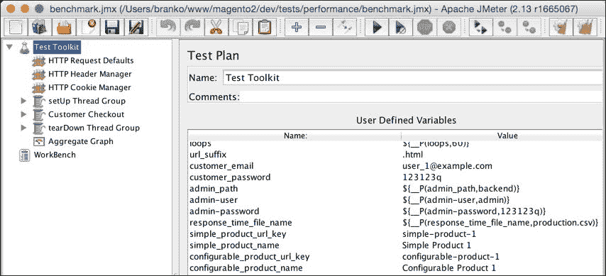

# 第十一章 测试

软件测试可以定义为开发生命周期中的一个关键步骤。这一步骤常常被许多开发者无声地忽视，因为需要投入一定的时间来为代码库编写一个体面的测试套件。编写测试不仅是一个单一的一次性活动，而是一个随着代码的增长和变化而持续的过程。在任何时候，测试结果都应该验证和确认我们的软件按预期工作，从而满足业务和技术要求。在生命周期的早期阶段，编写测试应该早于编写实际的应用程序代码。这有助于防止在代码中引入缺陷。

在高层次上，我们可以将测试分为以下类别：

+   **静态**：在测试期间不执行应用程序代码。通过检查应用程序代码文件而不是它们的执行来查找可能的错误。

+   **动态**：在测试期间执行应用程序代码。在检查应用程序的功能行为时发现可能的错误。

在本章中，我们将探讨 Magento 提供的测试选项。在这个过程中，我们将构建一个包含一些测试功能的基本模块。

# 测试类型

Magento 提供多种类型的测试。我们可以在运行以下命令时在 Magento 根目录下的控制台看到这些测试的列表：

```php
php bin/magento dev:tests:run –help

```

命令的结果是一个看起来像这样的输出：

```php
Usage:
 dev:tests:run [type]
Arguments:
 type Type of test to run. Available types: all, unit, integration, integration-all, static, static-all, integrity, legacy, default (default: "default")

```

这个输出源自核心`Magento_Developer`模块中的`Console/Command/DevTestsRunCommand.php`文件。查看输出，我们可能会说实际上有九种测试类型，如下所示：

+   `all`

+   `unit`

+   `integration`

+   `integration-all`

+   `static`

+   `static-all`

+   `integrity`

+   `legacy`

+   `default`

然而，这些并非独特的测试类型；这些是组合，正如我们很快就会看到的。

让我们更仔细地查看`DevTestsRunCommand`类中的代码及其`setupTestInfo`方法。

`setupTestInfo`方法定义了内部的`commands`属性，如下所示：

```php
$this->commands = [
    'unit'                   => ['../tests/unit', ''],
    'unit-performance'       => ['../tests/performance/ framework/tests/unit', ''],
    'unit-static'            => ['../tests/static/ framework/tests/unit', ''],
    'unit-integration'       => ['../tests/integration/ framework/tests/unit', ''],
    'integration'            => ['../tests/integration', ''],
    'integration-integrity'  => ['../tests/integration', ' testsuite/Magento/ Test/Integrity'],
    'static-default'         => ['../tests/static', ''],
    'static-legacy'          => ['../tests/static', ' testsuite/Magento/Test/Legacy'],
    'static-integration-js'  => ['../tests/static', ' testsuite/Magento/Test/ Js/Exemplar'],
];
```

此外，我们还可以在以下方式定义的`setupTestInfo`方法中看到`types`属性：

```php
$this->types = [
    'all'             => array_keys($this->commands),
    'unit'            => ['unit', 'unit-performance', 'unit- static', 'unit-integration'],
    'integration'     => ['integration'],
    'integration-all' => ['integration', 'integration-integrity'],
    'static'          => ['static-default'],
    'static-all'      => ['static-default', 'static-legacy', 'static-integration-js'],
    'integrity'       => ['static-default', 'static-legacy', 'integration-integrity'],
    'legacy'          => ['static-legacy'],
    'default'         => [
        'unit',
        'unit-performance',
        'unit-static',
        'unit-integration',
        'integration',
        'static-default',
    ],
];
```

`types`属性逻辑上将一个或多个测试组合成一个在`commands`属性下找到的单个名称。我们可以看到`unit`单一类型如何包含`unit`、`unit-performance`、`unit-static`和`unit-integration`测试。`commands`属性指向实际测试库的磁盘位置。相对于 Magento 根安装文件夹，测试可以在`dev/tests/`目录中找到。

# 单元测试

**单元测试**旨在单独测试单个类方法，断言所有可能的组合，并关注应用程序中最小的可测试部分。Magento 使用**PHPUnit**测试框架进行单元测试。由于高度专注，单元测试在某个测试失败时可以轻松地识别问题的根本原因。

我们可以通过使用以下命令从 Magento 安装根目录特定地触发单元测试：

```php
php bin/magento dev:tests:run unit

```

一旦触发，Magento 将在 `vendor/magento/module-developer/Console/Command/DevTestsRunCommand.php` 文件中运行 `execute` 命令。由于单元类型映射到多个命令，内部发生的情况是 Magento 将目录从一个目录切换到另一个目录，如下所示：

+   `dev/tests/unit`

+   `dev/tests/performance/framework/tests/unit`

+   `dev/tests/static/framework/tests/unit`

+   `dev/tests/integration/framework/tests/unit`

我们可以说所有这些目录都被认为是单元测试目录。

在这些目录中的每一个，Magento 内部运行 `passthru($command, $returnVal)` 方法，其中 `$command` 参数解析为一个类似于以下字符串的字符串：

```php
php /www/magento2/./vendor/phpunit/phpunit/phpunit

```

然后 PHPUnit 将相应地在每个这些目录中查找 `phpunit.xml` 配置文件。如果不存在 `phpunit.xml`，我们需要将 `phpunit.xml.dist` 的内容复制到 `phpunit.xml`。

让我们更详细地查看 `dev/tests/unit/phpunit.xml` 文件中的 `testsuite`、`filter`、`whitelist` 和其他配置元素。

在 `dev/tests/unit/phpunit.xml` 文件中找到了以下默认的 `testsuite` 目录列表，它列出了你需要查找以 `Test.php` 为前缀的 `tests` 文件所在的目录：

```php
../../../app/code/*/*/Test/Unit
../../../dev/tools/*/*/Test/Unit
../../../dev/tools/*/*/*/Test/Unit
../../../lib/internal/*/*/Test/Unit
../../../lib/internal/*/*/*/Test/Unit
../../../setup/src/*/*/Test/Unit
../../../update/app/code/*/*/Test/Unit
../../../vendor/*/module-*/Test/Unit
../../../vendor/*/framework/Test/Unit
../../../vendor/*/framework/*/Test/Unit
```

列表相对于 `dev/tests/unit/` 目录。例如，如果我们查看前面代码中的第一行，然后查看 `Magento_Catalog` 模块，很明显 `Test` 文件位于 `app/code/<vendorName>/<moduleName>/Test/` 目录及其子目录下。这些文件夹中所有以 `Test.php` 结尾的内容都将作为单元测试的一部分执行。

### 小贴士

如果我们正在构建自己的模块，我们可以轻松地复制 `dev/tests/unit/phpunit.xml.dist`，适当编辑 `testsuite` 和 `filter > whitelist`，以便快速执行仅我们模块的单元测试，从而节省避免频繁执行整个 Magento 单元测试的时间。

# 集成测试

**集成测试** 测试单个组件、层和环境之间的交互。它们可以在 `dev/tests/integration` 目录中找到。像单元测试一样，Magento 也使用 PHPUnit 进行集成测试。因此，单元测试和集成测试之间的区别不是技术性质上的，而是逻辑性质上的。

要特定地触发集成测试，我们可以在控制台执行以下命令：

```php
php bin/magento dev:tests:run integration

```

当执行时，Magento 会内部更改目录到 `dev/tests/integration` 并执行一个类似于以下命令的命令：

```php
php /Users/branko/www/magento2/./vendor/phpunit/phpunit/phpunit

```

集成目录有其自己的 `phpunit.xml.dist` 文件。查看其 `testsuite` 定义，我们可以看到它指向 `dev/tests/integration/testsuite` 目录中找到的所有以 `Test.php` 结尾的文件。

# 静态测试

**静态测试**实际上并不运行代码；它们分析代码。它们用于验证代码是否符合某些编码标准，例如 PSR-1。我们可以在 `dev/tests/static` 目录下找到它们。

要专门触发静态测试，我们可以在控制台执行以下命令：

```php
php bin/magento dev:tests:run static

```

当执行时，Magento 在内部将目录更改为 `dev/tests/static` 并执行一个类似于以下命令的操作：

```php
php /Users/branko/www/magento2/./vendor/phpunit/phpunit/phpunit

```

静态目录有其自己的 `phpunit.xml.dist` 文件。查看其 `testsuite` 定义，你会看到以下四个测试套件被定义：

+   JavaScript 静态代码分析

+   PHP 编码标准验证

+   代码完整性测试

+   XSS 不安全输出测试

`JSHint` 是一个用于 JavaScript 代码质量检查的工具，用于 JavaScript 静态代码分析。对于 PHP 代码标准验证，使用 `PHP_CodeSniffer` 库的元素。`PHP_CodeSniffer` 将 PHP、JavaScript 和 CSS 文件进行标记化，并检测违反定义的编码标准。

# 完整性测试

**完整性测试**检查应用程序的链接方式。它们检查诸如合并配置验证等问题。基本上，它们告诉我们应用程序是否应该能够运行。

我们可以通过使用以下命令从 Magento 安装的根目录中专门触发完整性测试：

```php
php bin/magento dev:tests:run integrity

```

当执行此操作时，Magento 首先在内部将目录更改为 `dev/tests/static`，然后执行两个类似于以下命令的操作：

```php
php /Users/branko/www/magento2/./vendor/phpunit/phpunit/phpunit
php /Users/branko/www/magento2/./vendor/phpunit/phpunit/phpunit testsuite/Magento/Test/Legacy

```

然后，Magento 在内部将目录更改为 `dev/tests/integration` 并执行一个类似于以下命令的操作：

```php
php /Users/branko/www/magento2/./vendor/phpunit/phpunit/phpunit testsuite/Magento/Test/Integrity

```

集成测试也使用 PHPUnit 编写实际测试。

# 旧版测试

**旧版测试**包括帮助开发者将模块移植到 Magento 新版本的库片段。

我们可以通过使用以下命令从 Magento 安装的根目录中专门触发旧版测试：

```php
php bin/magento dev:tests:run legacy

```

当执行此操作时，Magento 首先在内部将目录更改为 `/dev/tests/static`，然后执行一个类似于以下命令的操作：

```php
php /Users/branko/www/magento2/./vendor/phpunit/phpunit/phpunit testsuite/Magento/Test/Legacy

```

一旦触发，代码将运行检查过时的访问列表、连接、菜单、响应、系统配置以及一些其他事项。

# 性能测试

性能测试可以在 `setup/performance-toolkit/` 目录下找到。这些测试需要安装 Apache JMeter，并且可以通过控制台上的 `jmeter` 命令访问。可以通过遵循 [`jmeter.apache.org`](http://jmeter.apache.org) 上的说明来下载和安装 Apache JMeter。

性能测试的核心定义在 `benchmark.jmx` 文件中，该文件可以在 JMeter GUI 工具中打开，如下截图所示：



如前一张截图所示，默认的`benchmark.jmx`测试被分为三个线程组，分别命名为**setUp Thread Group**、**Customer Checkout**和**tearDown Thread Group**。我们可能还想点击每个组并使用一些额外的参数进行配置，从而可能改变**线程数（用户数）**，如下一张截图所示。然后我们可以简单地保存更改，作为对`benchmark.jmx`文件或新文件的修改：


我们可以通过运行以下命令从控制台手动触发性能测试，而不使用 GUI 界面：

```php
jmeter -n \
-t /Users/branko/www/magento2/setup/performance-toolkit/benchmark.jmx \
-l /Users/branko/Desktop/jmeter-tmp/results.jtl \
-Jhost="magento2.ce" \
-Jbase_path="/" \
-Jreport_save_path="/Users/branko/report" \
-Jloops=2 \
-Jurl_suffix=".html" \
-Jcustomer_email="john.doe@email.loc" \
-Jcustomer_password="abc123" \
-Jadmin_path="/admin_nwb0bx" \
-Jadmin-user="john" \
-Jadmin-password="abc123" \
-Jresponse_time_file_name="/Users/branko/report/AggregateGraph.csv" \
-Jsimple_product_url_key="simple-product-1" \
-Jsimple_product_name="Simple Product 1" \
-Jconfigurable_product_url_key="configurable-product-1" \
-Jconfigurable_product_name="Configurable Product 1" \
-Jcategory_url_key="category-1" \
-Jcategory_name="Category 1" \
-Jsleep_between_steps=50

```

这里列出的以`-J`开头的控制台参数也匹配**用户定义变量**测试工具包的名称，如前一张截图所示。我们需要小心设置它们，以符合 Magento 的安装。`-n`参数指示`jmeter`以*nongui*模式运行。`-t`参数是我们设置要运行的测试（`.jmx`）文件路径的地方。`-l`参数设置我们需要记录样本的文件。

# 功能测试

**功能测试**模拟用户与我们的应用程序的交互。字面上讲，这意味着以浏览器交互的形式进行测试，包括点击页面、将产品添加到购物车等。为此，Magento 使用**Magento 测试框架**（**MTF**）。它是一个围绕**Selenium**的 PHP 包装器，Selenium 是一个适用于 Web 应用程序的可移植软件测试框架。MTF 不是通过控制台直接可用的。它可以在[`github.com/magento/mtf`](https://github.com/magento/mtf)上下载。

在安装 MTF 之前，需要满足以下要求：

+   必须安装 Git。

+   必须安装 Firefox 浏览器。

+   必须安装并启用 PHP openssl 扩展。

+   需要 Java 版本 1.6 或更高版本，并且它的 JAR 可执行文件必须在系统 PATH 中。

+   可在[`www.seleniumhq.org/`](http://www.seleniumhq.org/)找到的 Selenium 独立服务器需要下载。下载应提供一个我们将后来需要引用的 JAR 文件。

+   Magento 必须安装并配置为不使用秘密 URL 密钥。我们可以通过导航到**商店** | **配置** | **高级** | **管理员** | **安全** | **将秘密密钥添加到 URL** [是/否]并将它设置为**否**。

一旦满足最小要求，我们可以按照以下步骤安装 MTF：

1.  从`dev/tests/functional/`目录运行`composer install`命令。这会创建一个名为`vendor`的新目录；MTF 是从[`github.com/magento/mtf`](https://github.com/magento/mtf)的 Git 仓库中拉取的。我们应该看到一个名为`vendor`的新目录，其中包含以下截图所示的内容：

1.  从`dev/tests/functional/utils/`目录下运行`generate.php`文件。这应该会给我们一个类似于以下的控制台输出：

    ```php
    || Item               || Count || Time ||
    || Page Classes       || 152   || 0    ||
    || Fixture Classes    || 46    || 0    ||
    || Repository Classes || 67    || 0    ||
    || Block              || 475   || 0    ||
    || Fixture            || 100   || 0    ||
    || Handler            || 3     || 0    ||
    || Page               || 165   || 0    ||
    || Repository         || 67    || 0    ||
    ```

    ### 注意

    生成工具为固定值、处理器、存储库、页面对象和块对象创建工厂。当 MTF 初始化时，工厂预先生成，以方便测试的创建和运行。

在我们实际运行测试之前，还有一些其他的事情需要配置，如下所示：

1.  编辑`dev/tests/functional/phpunit.xml`文件。在`php`元素下，对于`name="app_frontend_url"`，设置测试的 Magento 店面实际 URL 的值。对于`name="app_backend_url"`，设置测试的 Magento 管理 URL 实际 URL 的值。对于`name="credentials_file_path"`，设置`./credentials.xml`的值。

    ### 小贴士

    如果`phpunit.xml`不存在，我们需要创建它，并将`dev/tests/functional/phpunit.xml.dist`的内容复制到其中，然后进行编辑。

1.  编辑`dev/tests/functional/etc/config.xml`文件。在`application`元素下，找到并编辑`backendLogin`、`backendPassword`和`appBackendUrl`的信息，使其与我们的商店匹配。

    ### 小贴士

    如果`config.xml`不存在，我们需要创建它，并将`dev/tests/functional/etc/config.xml.dist`的内容复制到其中，然后进行编辑。

1.  编辑`dev/tests/functional/credentials.xml`文件。在空白 Magento 安装中，我们可能不需要这个文件，因为我们默认可以看到`fedex`、`ups`、`dhl U.S.`和`dhl EU`承运人的条目，这些在全新安装的 Magento 中尚未设置。

    ### 小贴士

    如果`credentials.xml`不存在，我们需要创建它，并将`dev/tests/functional/credentials.xml.dist`的内容复制到其中，然后进行编辑。

1.  通过控制台运行`java -jar {selenium_directory}/selenium-server.jar`命令。这是为了确保 Selenium 服务器正在运行。

1.  打开一个新的控制台或控制台标签，并在`dev/tests/functional/`目录下执行`phpunit`命令。这个命令应该会打开 Firefox 浏览器并开始在其中运行测试用例，模拟用户点击浏览器窗口并填写表单输入。

当测试运行时，Magento 会将所有失败的测试记录在`dev/tests/functional/var/log`目录下，其结构类似于以下截图所示：


在`dev/tests/functional/phpunit.xml`文件下的`php`元素中，可以通过`name="basedir"`配置`log`路径。

如果我们想要在整个测试套件中针对特定的测试，我们可以在`dev/tests/functional/`目录中简单地触发以下命令：

```php
phpunit tests/app/Magento/Customer/Test/TestCase /RegisterCustomerFrontendEntityTest.php

```

上述命令将运行一个名为`RegisterCustomerFrontendEntityTest.php`的单个测试。我们也可以使用更简短的表达形式，如下所示：

```php
phpunit --filter RegisterCustomerFrontendEntityTest

```

一旦执行，浏览器应该打开并模拟在店面上的客户注册过程。

# 编写一个简单的单元测试

现在我们快速浏览了 Magento 提供的所有测试类型，让我们退一步再次看看单元测试。在实践中，单元测试可能是我们将要编写的大部分内容。考虑到这一点，让我们从 [`github.com/ajzele/B05032-Foggyline_Unitly`](https://github.com/ajzele/B05032-Foggyline_Unitly) 中获取 `Foggyline_Unitly` 模块，并开始为其编写单元测试。

如果你还没有在代码库中包含前几章的 `Foggyline_Unitly` 模块，那么你需要将其内容放置在 `app/code/Foggyline/Unitly` 下，并在 Magento 目录的根目录下从控制台执行以下命令：

```php
php bin/magento module:enable Foggyline_Unitly
php bin/magento setup:upgrade

```

我们将要编写的测试位于模块的 `Test/Unit` 目录中。这使得测试目录的完整路径看起来像 `app/code/Foggyline/Unitly/Test/Unit/`。Magento 知道它需要查看这个文件夹，仅仅是因为在 `dev/tests/unit/phpunit.xml` 文件中找到了测试套件目录定义，如下所示：

```php
<directory suffix="Test.php">
    ../../../app/code/*/*/Test/Unit
</directory>
```

单个模块 `Test/Unit` 目录中的文件和文件夹的结构也遵循该模块的文件和文件夹结构。以下截图显示了 `Magento_Catalog` 模块的 `Test/Unit` 目录结构：


这表明几乎任何 PHP 类都可以进行单元测试，无论它是控制器、块、辅助工具、模块、观察者还是其他东西。为了保持简单，我们将专注于与 `Foggyline_Unitly` 模块相关的控制器和块单元测试，该模块的结构如下：


让我们先为 `Foggyline\Unitly\Controller\Hello\Shout` 控制器类编写一个测试。忽略 `__construct`，`Shout` 类只有一个名为 `execute` 的方法。

我们将在与模块的 `Test\Unit` 目录相同的目录结构下为其编写一个测试，将测试放在 `app/code/Foggyline/Unitly/Test/Unit/Controller/Hello/ShoutTest.php` 文件中（部分），如下所示：

```php
namespace Foggyline\Unitly\Test\Unit\Controller\Hello;

class ShoutTest extends \PHPUnit_Framework_TestCase
{
    protected $resultPageFactory;
    protected $controller;

    public function setUp()
    {
        /* setUp() code here */
    }

    public function testExecute()
    {
        /* testExecute() code here */
    }
}
```

Magento 模块目录中的每个单元测试都扩展自 `\PHPUnit_Framework_TestCase` 类。`setUp` 方法在测试执行之前被调用；我们可以将其视为 PHP 的 `__construct`。在这里，我们通常会设置固定值、打开网络连接或执行类似操作。

`testExecute` 方法的名称实际上是由测试 `+` 我们要测试的类的名称组成的。由于 `Shout` 类有一个执行方法，因此形成的测试方法变为测试 `+` 执行。通过将类方法名称的首字母大写，最终的名称为 `testExecute`。

现在，让我们继续将 `/* setUp()` 代码这里 `*/` 替换为以下内容：

```php
$request = $this->getMock(
    'Magento\Framework\App\Request\Http',
    [],
    [],
    '',
    false
);

$context = $this->getMock(
    '\Magento\Framework\App\Action\Context',
    ['getRequest'],
    [],
    '',
    false
);

$context->expects($this->once())
    ->method('getRequest')
    ->willReturn($request);

$this->resultPageFactory = $this-> getMockBuilder ('Magento\Framework\View\Result\PageFactory')
    ->disableOriginalConstructor()
    ->setMethods(['create'])
    ->getMock();

$this->controller = new \Foggyline\Unitly\Controller\Hello\Shout(
    $context,
    $this->resultPageFactory
);
```

测试的整体概念是基于模拟我们需要与之交互的对象。我们使用 `getMock` 方法，该方法为指定的类返回一个模拟对象。除了类名之外，`getMock` 方法还接受相当多的其他参数。第二个 `$methods` 参数标记了将被测试替身替换的方法名称。为 `$methods` 参数提供 null 意味着不会替换任何方法。`getMock` 方法的第三个参数代表 `$arguments`，它们是传递给原始类构造函数的参数。

从前面的代码中我们可以看到，`$request` 模拟对象没有向其 `getMock` 方法提供任何 `$methods` 或 `$arguments` 参数。另一方面，`$context` 对象传递了一个包含单个 `getRequest` 元素的数组。一旦 `$context` 对象初始化，它就调用 `expects` 方法，该方法在模拟对象中注册一个新的期望，并返回 `InvocationMocker`，我们可以在其上调用方法和 `willReturn`。在这种情况下，之前启动的 `$request` 对象的实例被传递给 `willReturn`。我们使用了 `getMockBuilder` 来创建一个 `Result\PageFactory` 模拟对象，并实例化了 `Shout` 控制器动作类，将上下文和结果页面模拟对象传递给它。

这个 `setUp` 方法中的所有代码都是为了获取控制器实例，该实例将在 `testExecute` 方法中使用。

### 小贴士

`final`、`private` 和 `static` 方法不能被模拟。由于它们保留了原始行为，因此 PHPUnit 的测试功能会忽略这些方法。

让我们继续替换这里的 `/* testExecute() */` 代码，如下所示：

```php
$title = $this-> getMockBuilder('Magento\Framework\View\Page\Title')
    ->disableOriginalConstructor()
    ->getMock();
$title->expects($this->once())
    ->method('set')
    ->with('Unitly');

$config = $this-> getMockBuilder('Magento\Framework\View\Page\Config')
    ->disableOriginalConstructor()
    ->getMock();
$config->expects($this->once())
    ->method('getTitle')
    ->willReturn($title);

$page = $this-> getMockBuilder('Magento\Framework\View\Result\Page')
    ->disableOriginalConstructor()
    ->getMock();
$page->expects($this->once())
    ->method('getConfig')
    ->willReturn($config);

$this->resultPageFactory->expects($this->once())
    ->method('create')
    ->willReturn($page);

$result = $this->controller->execute();

$this->assertInstanceOf('Magento\Framework\View\Result\Page', $result);
```

在前面的代码中，我们检查了页面标题、页面和结果页面对象。要从控制器代码内部获取页面标题，我们通常会使用一个表达式，例如 `$resultPage->getConfig()->getTitle()`。这个表达式涉及三个对象。`$resultPage` 对象调用 `getConfig()` 方法，该方法返回 `Page\Config` 对象的实例。该对象调用 `getTitle` 方法，该方法返回 `Page\Title` 对象的实例。因此，我们正在模拟和测试所有三个对象。

现在我们已经查看了一下控制器测试用例，让我们看看如何为块类创建一个测试用例。创建一个名为 `app/code/Foggyline/Unitly/Test/Unit/Block/Hello/ShoutTest.php` 的文件，并包含以下部分内容：

```php
namespace Foggyline\Unitly\Test\Unit\Block\Hello;

class ShoutTest extends \PHPUnit_Framework_TestCase
{
    /**
     * @var \Foggyline\Unitly\Block\Hello\Shout
     */
    protected $block;

    protected function setUp()
    {
        $objectManager = new \Magento\Framework\TestFramework\Unit \Helper\ObjectManager($this);
        $this->block = $objectManager-> getObject('Foggyline\Unitly\Block\Hello\Shout');
    }

    public function testGreeting()
    {
        $name = 'Foggyline';

        $this->assertEquals(
            'Hello '.$this->block->escapeHtml($name),
            $this->block->greeting($name)
        );
    }
}
```

在这里，我们还定义了 `setUp` 方法和 `testGreeting`。`testGreeting` 方法被用作 `Shout` 块类上的问候方法的测试。

从概念上讲，对控制器、块或模型类进行单元测试之间没有区别。因此，在这个例子中我们将省略模型单元测试。你需要意识到的是，测试是我们自己定义的。从技术角度来说，我们可以针对各种情况测试单个方法，或者只测试最明显的一个。然而，为了更好地服务于测试的目的，我们应该测试所有可能的结果组合。

让我们继续创建一个包含以下内容的`dev/tests/unit/foggyline-unitly-phpunit.xml`文件：

```php
<phpunit  xsi:noNamespaceSchemaLocation="http://schema.phpunit.de /4.1/phpunit.xsd"
         colors="true"
         bootstrap="./framework/bootstrap.php"
        >
    <testsuite name="Foggyline_Unitly - Unit Tests">
        <directory suffix="Test.php">
            ../../../app/code/Foggyline/Unitly/Test/Unit
        </directory>
    </testsuite>
    <php>
        <ini name="date.timezone" value="Europe/Zagreb"/>
        <ini name="xdebug.max_nesting_level" value="200"/>
    </php>
    <filter>
        <whitelist addUncoveredFilesFromWhiteList="true">
            <directory suffix=".php">
                ../../../app/code/Foggyline/Unitly/*
            </directory>
        </whitelist>
    </filter>
    <logging>
        <log type="coverage-html" target="coverage_dir/Foggyline_Unitly/test- reports/coverage" charset="UTF-8" yui="true" highlight="true"/>
    </logging>
</phpunit>
```

最后，我们可以通过运行如`phpunit -c foggyline-unitly-phpunit.xml`之类的命令来仅执行我们自己的模块单元测试。

一旦测试执行完毕，我们应该能够在`dev/tests/unit/coverage_dir/Foggyline_Unitly/test-reports/coverage/index.html`文件中看到完整的代码覆盖率报告，如下面的截图所示：


前面的截图展示了代码覆盖率有多么详细，它甚至显示了被测试覆盖的百分比和代码行数。

# 摘要

在本章中，我们通过根目录下的`dev/tests/`目录和`Magento_Developer`模块中的库，了解了如何使用嵌入在 Magento 中的测试功能。我们学习了如何运行所有测试类型，并研究了一个编写我们自己的单元测试的简单示例。这里给出的示例并不能完全体现 PHPUnit 的强大功能。更多关于 PHPUnit 的信息可以在[`phpunit.de/`](https://phpunit.de/)找到。

现在我们将进入这本书的最后一章，我们将回顾到目前为止所学的内容，并开发一个包含一些基本测试的功能性迷你模块。
