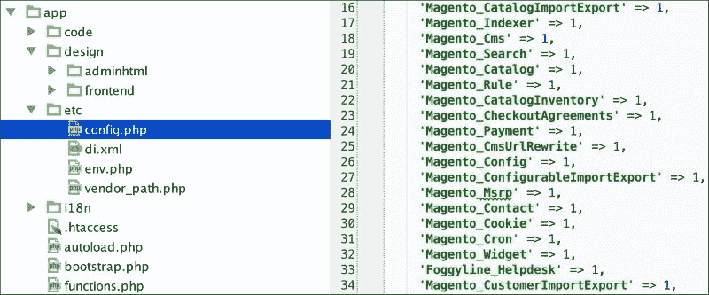
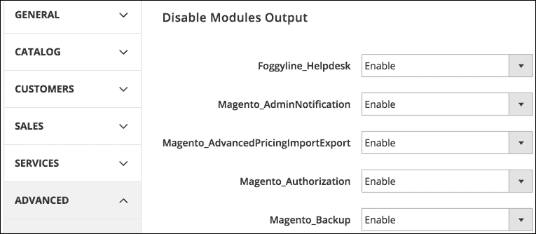
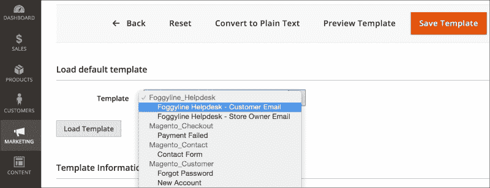
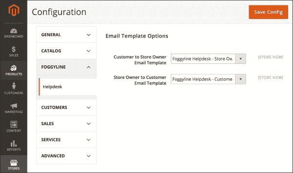
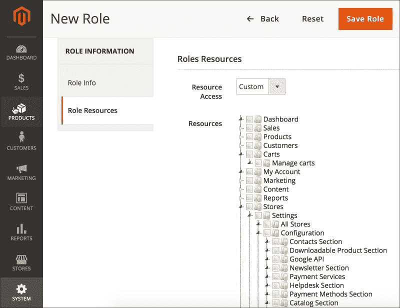
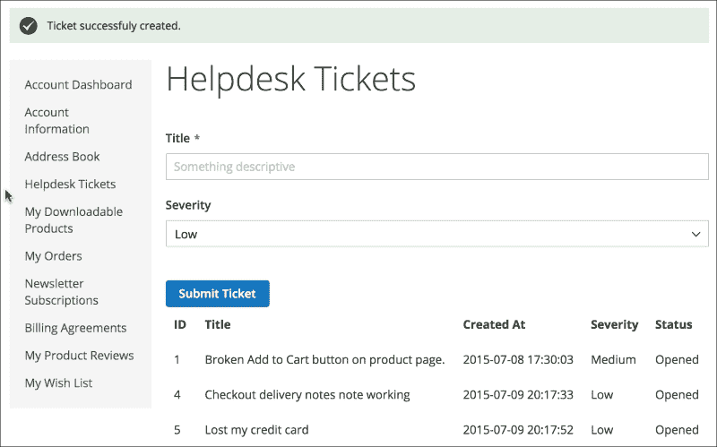
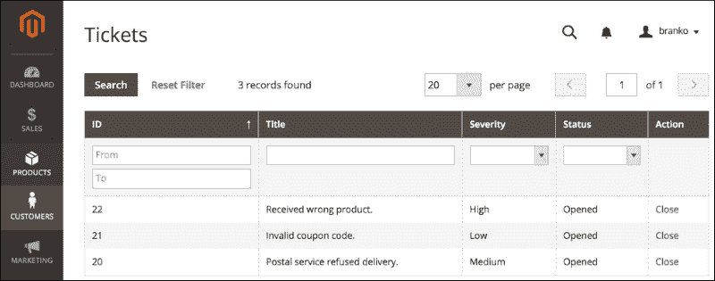
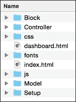
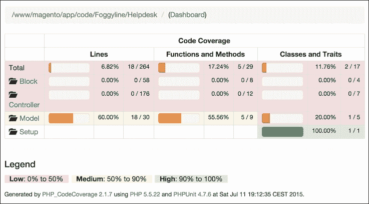

# 第十二章. 从零开始构建模块

基于前几章获得的知识，我们现在将构建一个微型`Helpdesk`模块。虽然这个模块是微型的，但我们将通过以下部分展示几个重要的 Magento 平台功能的用法：

+   注册模块（`registration.php`和`module.xml`）

+   创建配置文件（`config.xml`）

+   创建电子邮件模板（`email_templates.xml`）

+   创建系统配置文件（`system.xml`）

+   创建访问控制列表（`acl.xml`）

+   创建安装脚本（`InstallSchema.php`）

+   管理实体持久性（模型、资源、集合）

+   构建前端界面

+   构建后端界面

+   创建单元测试

# 模块要求

模块要求定义如下：

+   使用的名称，`Foggyline/Helpdesk`

+   要存储在表中的数据称为`foggyline_helpdesk_ticket`

+   工单实体将包含`ticket_id`、`customer_id`、`title`、`severity`、`created_at`和`status`属性

+   `customer_id`属性将在`customer_entity`表上作为外键

+   将有三个可用的工单严重性值：`低`、`中`和`高`

+   如果未指定，新工单的默认严重性值为`低`

+   将有两个可用的工单状态：`已打开`和`已关闭`

+   如果未指定，新工单的默认状态值为`已打开`

+   需要定义两个电子邮件模板：`store_owner_to_customer_email_template`和`customer_to_store_owner_email_template`，以便在创建工单和状态更改时推送电子邮件更新

+   客户将能够通过他们的**我的账户**部分提交工单

+   客户将能够在他们的**我的账户**部分查看他们之前提交的所有工单

+   客户将无法编辑任何现有的工单

+   一旦客户提交了新的工单，就会发送事务性电子邮件（我们可以称之为**Foggyline** – **帮助台** – **客户** | **店主**）给店主

+   需要一个可配置的选项，以可能覆盖**Foggyline** – **帮助台** – **客户** | **店主**电子邮件

+   管理员用户将能够访问**客户** | **帮助台工单**下的所有工单列表

+   管理员用户将能够将工单状态从**已打开**更改为**已关闭**，反之亦然

+   一旦管理员用户更改了工单状态，就会发送事务性电子邮件（我们可以称之为**Foggyline** – **帮助台** – **店主** | **客户**）给客户

+   需要一个可配置的选项，以可能覆盖**Foggyline** – **帮助台** – **店主** | **客户**电子邮件

根据概述的要求，我们已准备好开始我们的模块开发。

# 注册模块

我们首先开始定义`app/code/Foggyline/Helpdesk/registration.php`文件，内容如下：

```php
<?php
\Magento\Framework\Component\ComponentRegistrar::register(
    \Magento\Framework\Component\ComponentRegistrar::MODULE,
    'Foggyline_Helpdesk',
    __DIR__
);
```

我们随后定义了`app/code/Foggyline/Helpdesk/etc/module.xml`文件，内容如下：

```php
<?xml version="1.0"?>
<config  xsi:noNamespaceSchemaLocation="urn:magento:framework:Module /etc/module.xsd">
    <module name="Foggyline_Helpdesk" setup_version="1.0.0">
        <sequence>
            <module name="Magento_Store"/>
            <module name="Magento_Customer"/>
        </sequence>
    </module>
</config>
```

观察前面的文件，如果我们移除所有模块中重复的样板内容，我们在这里剩下三个重要的事情：

+   模块名称属性，定义为`Foggyline_Helpdesk`。我们需要确保在命名我们的模块时遵循一定的模式，例如`Vendor` + `_` + `Module`名称。模块名称属性只能包含字母和数字 [A-Z, a-z, 0-9, _]。

+   定义我们的模块版本的`setup_version`属性。其值只能包含数字 [0-9]。我们的示例将`setup_version`属性的值设置为`1.0.0`。

+   定义模块依赖关系的模块名称属性。我们的模块基本上表示它需要启用`Magento_Store`和`Magento_Customer`模块。

一旦这个文件就绪，我们需要转到命令行，将目录更改为 Magento 安装目录，然后简单地执行以下命令：

```php
php bin/magento module:enable Foggyline_Helpdesk
```

然而，如果我们现在在浏览器中打开前端区域的任何管理页面，我们可能会得到一个错误页面，该页面在`var/reports/`文件夹下生成以下错误：

```php
Please upgrade your database: Run "bin/magento setup:upgrade" from the Magento root directory.
```

幸运的是，错误信息相当自描述，所以我们只需简单地回到控制台，将目录更改为 Magento 根目录，并执行以下命令：

```php
php bin/magento setup:upgrade
```

执行的命令将激活我们的模块。

我们可以通过查看以下截图中的`app/etc/config.php`文件来确认这一点（在第 33 行）：



进一步地，如果我们登录到管理区域，并转到**商店** | **配置** | **高级** | **高级**，我们应该在那里看到我们的模块列表，如下面的截图所示：



# 创建配置文件（config.xml）

现在我们将创建一个包含以下内容的`app/code/Foggyline/Helpdesk/etc/config.xml`文件：

```php
<?xml version="1.0"?>
<config  xsi:noNamespaceSchemaLocation="urn:magento:module:Magento_Store: etc/config.xsd">
    <default>
        <foggyline_helpdesk>
            <email_template>
                <customer>
                    foggyline_helpdesk_email_template_customer
                </customer>
                <store_owner>
                    foggyline_helpdesk_email_template_store_owner
                </store_owner>
            </email_template>
        </foggyline_helpdesk>
    </default>
</config>
```

这可能一开始看起来很困惑，不知道`default` | `foggyline_helpdesk` | `email_template`结构从何而来。这个结构本身表示我们将映射到浏览器中**商店** | **配置**部分可见的配置值的位臵。鉴于与**商店** | **配置**部分相关的所有视觉元素都源自`system.xml`文件，我们现在在`config.xml`中的这个结构将映射到我们即将定义的另一个`system.xml`文件。

目前，只需记住`customer`和`store_owner`属性中的结构和值。这些值将进一步映射到我们即将创建的另一个`email_templates.xml`文件。

关于`config.xml`文件，还有一件更重要的事情。我们需要非常小心地处理`xsi:noNamespaceSchemaLocation`属性值。此值需要设置为`urn:magento:module:Magento_Store:etc/config.xsd`。这是一个别名，实际上指向`vendor/magento/module-store/etc/config.xsd`文件。

# 创建电子邮件模板（email_templates.xml）

我们模块的要求指定需要定义两个电子邮件模板。关于这一点，在之前定义的 `app/code/Foggyline/Helpdesk/etc/config.xml` 文件中已经给出了提示。我们模块可用的电子邮件模板的实际定义是通过 `app/code/Foggyline/Helpdesk/etc/email_templates.xml` 文件完成的，内容如下：

```php
<?xml version="1.0"?>
<config  xsi:noNamespaceSchemaLocation="urn:magento:module: Magento_Email:etc/email_templates.xsd">
    <template id="foggyline_helpdesk_email_template_customer" label="Foggyline Helpdesk - Customer Email"
              file="store_owner_to_customer.html" type="html" module="Foggyline_Helpdesk" area="frontend"/>
    <template id="foggyline_helpdesk_email_template_store_owner" label="Foggyline Helpdesk - Store Owner Email"
              file="customer_to_store_owner.html" type="html" module="Foggyline_Helpdesk" area="frontend"/>
</config>
```

查看 `email_templates.xsd`，我们可以得出结论，`id`、`label`、`file`、`type` 和 `module` 的值都是必需的。`id` 应该定义为我们模块的唯一值，给我们的电子邮件模板起一个合理且合理的代码名称，因为这个代码名称将在其他 XML 文件或代码中进一步使用。

我们在这里定义的 ID 值可以在 `app/code/Foggyline/Helpdesk/etc/config.xml` 中找到，作为 `default` | `foggyline_helpdesk` | `email_template` | `customer` 和 `default` | `foggyline_helpdesk` | `email_template` | `store_owner` 元素的值。

如果两个之间的联系还不完全清楚；当我们开始构建我们的 `system.xml` 文件时，我们将很快了解到这一点。

`label` 属性的值是稍后在 Magento 管理区域 **营销** | **通讯** | **电子邮件模板** 中可见的内容，所以请确保在这里放置一些用户友好且易于识别的内容。

此外，`file` 属性的值指向以下文件的位置：

+   `app/code/Foggyline/Helpdesk/view/frontend/email/customer_to_store_owner.html`

+   `app/code/Foggyline/Helpdesk/view/frontend/email/store_owner_to_customer.html`

文件的内容将被设置为，稍后，在代码中，我们需要传递某些变量以填充变量占位符。

`customer_to_store_owner.html` 电子邮件模板，内容如下，将在代码中稍后触发，当客户创建新的票据时：

```php
<!--@subject New Ticket Created @-->
<h1>Ticket #{{var ticket.ticket_id}} created</h1>

<ul>
    <li>Id: {{var ticket.ticket_id}}</li>
    <li>Title: {{var ticket.title}}</li>
    <li>Created_at: {{var ticket.created_at}}</li>
    <li>Severity: {{var ticket.severity}}</li>
</ul>
```

然后，我们将看到如何将 `ticket` 对象作为变量传递到模板中，以便在 HTML 模板中启用 `{{var ticket.title}}` 这样的调用。

`store_owner_to_customer.html` 电子邮件模板，内容如下，将在代码中稍后触发，当店主更改票据状态时：

```php
<!--@subject Ticket Updated @-->
<h1>Ticket #{{var ticket.ticket_id}} updated</h1>

<p>Hi {{var customer_name}}.</p>

<p>Status of your ticket #{{var ticket.ticket_id}} has been updated</p>

<ul>
    <li>Title: {{var ticket.title}}</li>
    <li>Created_at: {{var ticket.created_at}}</li>
    <li>Severity: {{var ticket.severity}}</li>
</ul>
```

如果我们现在登录到 Magento 管理区域，进入 **营销** | **通讯** | **电子邮件模板**，点击 **添加新模板** 按钮，我们应该能够在 **模板** 下拉菜单中看到我们的两个电子邮件模板，如图所示：



如果我们回顾一下我们的 `config.xml` 和 `email_templates.xml`，仍然没有明确的联系，不清楚 `default` | `foggyline_helpdesk` | `email_template` | `customer` 和 `default` | `foggyline_helpdesk` | `email_template` | `store_owner` 在 `config.xml` 中实际上代表什么。这是因为我们仍然缺少两个将它们联系起来的关键成分：`app/code/Foggyline/Helpdesk/etc/adminhtml/system.xml` 和 `app/code/Foggyline/Helpdesk/etc/acl.xml` 文件。

# 创建系统配置文件（system.xml）

`system.xml` 文件本质上是一个 **商店** | **配置** 接口构建器。我们在模块的 `system.xml` 文件中定义的条目将在 Magento 管理区域下的 **商店** | **配置** 接口中渲染某些部分。

与前两个 XML 文件不同，此配置文件位于一个额外的子文件夹中，因此其完整路径为 `app/code/Foggyline/Helpdesk/etc/adminhtml/system.xml`，内容如下：

```php
<?xml version="1.0"?>
<config  xsi:noNamespaceSchemaLocation="urn:magento:module: Magento_Config:etc/system_file.xsd">
    <system>
        <tab id="foggyline" translate="label" sortOrder="200">
            <label>Foggyline</label>
        </tab>
        <section id="foggyline_helpdesk" translate="label" type="text" sortOrder="110" showInDefault="1"
                 showInWebsite="1" showInStore="1">
            <label>Helpdesk</label>
            <tab>foggyline</tab>
            <resource>Foggyline_Helpdesk::helpdesk</resource>
            <group id="email_template" translate="label" type="text" sortOrder="1" showInDefault="1" showInWebsite="1" showInStore="1">
                <label>Email Template Options</label>
                <field id="customer" translate="label" type="select" sortOrder="1" showInDefault="1" showInWebsite="1" showInStore="1">
                    <label>
                        Store Owner to Customer Email Template
                    </label>
                    <source_model>
                        Magento\Config\Model\Config\Source\ Email\Template
                    </source_model>
                </field>
                <field id="store_owner" translate="label" type="select" sortOrder="1" showInDefault="1" showInWebsite="1" showInStore="1">
                    <label>
                        Customer to Store Owner Email Template
                    </label>
                    <source_model>
                        Magento\Config\Model\Config\Source\ Email\Template
                    </source_model>
                </field>
            </group>
        </section>
    </system>
</config>
```

尽管这个文件中有很多事情，但都可以总结为几个重要点。

### 注意

确定我们想要显示我们的模块配置选项的位置是一个选择问题。要么我们定义并使用自己的标签，要么我们使用核心模块中的一个现有标签。这实际上取决于我们决定将配置选项放在哪里。

`system.xml` 定义了一个标签，正如分配了 `id` 属性值为 `foggyline` 的标签元素所示。我们可以在单个 `system.xml` 文件下定义多个标签。标签元素属性 `id` 需要在所有标签中都是唯一的，而不仅仅是我们在模块中定义的标签。在 `tab` 元素内，我们有一个 `label` 元素，其值为 `Foggyline`。这个值是显示在 Magento 管理界面 **商店** | **配置** 区域的内容。

最终结果应如图所示：



### 小贴士

Magento 在其核心模块中定义了六个预存在的标签（**通用**、**服务**、**高级**、**目录**、**客户**、**销售**）。我们只需通过搜索 `tab` 字符串，仅过滤名为 `system.xml` 的文件，就可以轻松地获取 Magento 中所有定义的标签列表。

在 `tab` 元素旁边，我们有 `config` | `system` | `section` 元素。这个元素是我们进一步定义将成为接受配置选项的 HTML 输入字段的元素，如前一张图所示。

我们可以在单个 `system.xml` 文件中定义多个部分。实际的 `section` 元素属性要求我们指定 `id` 属性值，在我们的例子中设置为 `foggyline_helpdesk`。其他重要的 `section` 元素属性是 `showInWebsite` 和 `showInStore`。这些可以取 `0` 或 `1` 作为值。根据我们的模块业务逻辑，我们可能会找到一个很好的理由来选择其中一个值而不是另一个。

进一步观察，我们 `section` 元素中包含的元素有：

+   `label`: 这指定了我们在 Magento 管理员 **Store** | **Configuration** 区域下将看到的标签。

+   `tab`: 这指定了我们希望此部分出现的标签页的 ID 值，在我们的例子中等于 `foggyline`。

+   `resource`: 这指定了 ACL 资源 ID 值。

+   `group`: 这指定了字段的组。类似于 `section` 元素，它也有 `id`、`sortOrder`、`showInWebsite` 和 `showInStore` 属性。此外，组元素有子字段元素，这对应于在 Magento 管理员 **Store** | **Configuration** 区域下的 HTML 输入字段。

我们定义了两个字段，`customer` 和 `store_owner`。类似于 `section` 和 `group`，`field` 元素也有 `id`、`sortOrder`、`showInWebsite` 和 `showInStore` 属性。

注意 `field` 元素如何进一步包含定义其选项的子元素。鉴于我们的 `field` 元素类型属性被设置为 `select`，并且两个字段都如此，我们需要在每个 `field` 中定义 `source_model` 元素。两个字段都有相同的 `source_model` 值，它指向 Magento 核心类，`Magento\Config\Model\Config\Source\Email\Template`。查看该类，我们可以看到它实现了 `\Magento\Framework\Option\ArrayInterface` 并定义了 `toOptionArray` 方法。在渲染管理员 ** Stores** | **Configuration** 区域时，Magento 将调用此方法以填充选择 HTML 元素的值。

### 小贴士

理解我们可以使用 `system.xml` 做什么，归结于理解在 `vendor/magento/module-config/etc/system_file.xsd` 下定义了什么，并研究现有的 Magento 核心模块 `system.xml` 文件以获取一些示例。

如前所述，我们的 `system.xml` 有一个指向 `app/code/Foggyline/Helpdesk/etc/acl.xml` 文件的资源元素，我们现在将查看它。

# 创建访问控制列表（acl.xml）

`app/code/Foggyline/Helpdesk/etc/acl.xml` 文件是我们定义模块访问控制列表资源的地方。当点击 **Add New Role** 按钮时，访问控制列表资源在 Magento 管理员 **System** | **Permissions** | **User Roles** 区域可见，如以下截图所示：



查看前面的截图，我们可以看到在 **Stores** | **Settings** | **Configuration** 下的 **Helpdesk Section**。我们是如何将其放置在那里的？我们已经在 `app/code/Foggyline/Helpdesk/etc/acl.xml` 文件中定义了它，内容如下：

```php
<?xml version="1.0"?>
<config  xsi:noNamespaceSchemaLocation="urn:magento:framework:Acl/ etc/acl.xsd">
    <acl>
        <resources>
            <resource id="Magento_Backend::admin">
                <resource id="Magento_Customer::customer">
                    <resource id="Foggyline_Helpdesk:: ticket_manage" title="Manage Helpdesk Tickets" />
                </resource>
                <resource id="Magento_Backend::stores">
                    <resource id="Magento_Backend:: stores_settings">
                        <resource id="Magento_Config::config">
                            <resource id= "Foggyline_Helpdesk::helpdesk" title="Helpdesk Section" />
                        </resource>
                    </resource>
                </resource>
            </resource>
        </resources>
    </acl>
</config>
```

通过查看提供的代码，可以立即得出结论，资源可以嵌套在彼此之中。不清楚我们应该如何知道如何将具有`Foggyline_Helpdesk::helpdesk` ID 值的自定义定义资源嵌套在哪里。简单的答案是，我们遵循了 Magento 的结构。通过查看几个 Magento 核心模块的`system.xml`文件及其`acl.xml`文件，出现了一种模式，其中模块将资源嵌套在`Magento_Backend::admin` | `Magento_Backend::stores` | `Magento_Backend::stores_settings` | `Magento_Config::config`之下。这些都是核心 Magento 中定义的现有资源，所以我们只是引用它们，而不是定义它们。我们在`acl.xml`文件中定义的唯一资源是我们自己的，然后我们从`system.xml`文件中引用它。我们可以在`acl.xml`中定义其他资源，并不一定所有资源都会嵌套在`Foggyline_Helpdesk::helpdesk`相同的结构中。

我们分配给资源元素的`title`属性值在管理区域中显示，如前一个截图所示。

### 小贴士

一定要使用描述性的标签，以便我们的模块资源易于识别。

# 创建安装脚本（InstallSchema.php）

`InstallSchema`，或安装脚本，是我们设置数据库中用于后续持久化我们模型所需表的一种方式。

如果我们回顾模块需求，以下字段需要在`foggyline_helpdesk_ticket`表中创建：

+   `ticket_id`

+   `customer_id`

+   `title`

+   `severity`

+   `created_at`

+   `status`

我们的`InstallSchema`定义在`app/code/Foggyline/Helpdesk/Setup/InstallSchema.php`文件中，其（部分）内容如下：

```php
<?php

namespace Foggyline\Helpdesk\Setup;

use Magento\Framework\Setup\InstallSchemaInterface;
use Magento\Framework\Setup\ModuleContextInterface;
use Magento\Framework\Setup\SchemaSetupInterface;

/**
 * @codeCoverageIgnore
 */
class InstallSchema implements InstallSchemaInterface
{
    public function install(SchemaSetupInterface $setup, ModuleContextInterface $context)
    {
        $installer = $setup;

        $installer->startSetup();

        $table = $installer->getConnection()
            ->newTable($installer-> getTable('foggyline_helpdesk_ticket'))
            /* ->addColumn ...  */
            /* ->addIndex ...  */
            /* ->addForeignKey ...  */
            ->setComment('Foggyline Helpdesk Ticket');
        $installer->getConnection()->createTable($table);

        $installer->endSetup();
    }
}
```

`InstallSchema`类通过实现单个`install`方法符合`InstallSchemaInterface`。在这个方法中，我们启动安装程序，创建新表，创建新字段，向表中添加索引和外键，最后结束安装程序，如下面的（部分）代码所示：

```php
->addColumn(
    'ticket_id',
    \Magento\Framework\DB\Ddl\Table::TYPE_INTEGER,
    null,
    ['identity' => true, 'unsigned' => true, 'nullable' => false, 'primary' => true],
    'Ticket Id'
)
->addColumn(
    'customer_id',
    \Magento\Framework\DB\Ddl\Table::TYPE_INTEGER,
    null,
    ['unsigned' => true],
    'Customer Id'
)
->addColumn(
    'title',
    \Magento\Framework\DB\Ddl\Table::TYPE_TEXT,
    null,
    ['nullable' => false],
    'Title'
)
->addColumn(
    'severity',
    \Magento\Framework\DB\Ddl\Table::TYPE_SMALLINT,
    null,
    ['nullable' => false],
    'Severity'
)
->addColumn(
    'created_at',
    \Magento\Framework\DB\Ddl\Table::TYPE_TIMESTAMP,
    null,
    ['nullable' => false],
    'Created At'
)
->addColumn(
    'status',
    \Magento\Framework\DB\Ddl\Table::TYPE_SMALLINT,
    null,
    ['nullable' => false],
    'Status'
)
->addIndex(
    $installer->getIdxName('foggyline_helpdesk_ticket', ['customer_id']),
    ['customer_id']
)
->addForeignKey(
    $installer->getFkName('foggyline_helpdesk_ticket', 'customer_id', 'customer_entity', 'entity_id'),
    'customer_id',
    $installer->getTable('customer_entity'),
    'entity_id',
    \Magento\Framework\DB\Ddl\Table::ACTION_SET_NULL
)
```

提供的代码显示了如何使用`addColumn`方法调用将模块需求中的每个字段添加到数据库中，并传递某些参数，例如`字段类型`和`可空`状态。熟悉`addColumn`、`addIndex`和`addForeignKey`方法是有价值的，因为这些方法在指定我们模块的新表时最常用。

### 小贴士

我们可以通过研究其他核心模块如何处理`InstallSchema.php`文件来进一步深化对安装脚本的理解。遵循良好的数据库设计实践，我们应该始终在我们的表上创建索引和外键，当我们从其他表引用数据时。

# 管理实体持久性（模型、资源、集合）

在`InstallSchema`到位后，我们现在有实体持久性的条件。我们的下一步是定义`Ticket`实体的模型、资源和集合类。

`Ticket`实体模型类定义在`app/code/Foggyline/Helpdesk/Model/Ticket.php`文件中，其内容如下：

```php
<?php

namespace Foggyline\Helpdesk\Model;

class Ticket extends \Magento\Framework\Model\AbstractModel
{
    const STATUS_OPENED = 1;
    const STATUS_CLOSED = 2;

    const SEVERITY_LOW = 1;
    const SEVERITY_MEDIUM = 2;
    const SEVERITY_HIGH = 3;

    protected static $statusesOptions = [
        self::STATUS_OPENED => 'Opened',
        self::STATUS_CLOSED => 'Closed',
    ];

    protected static $severitiesOptions = [
        self::SEVERITY_LOW => 'Low',
        self::SEVERITY_MEDIUM => 'Medium',
        self::SEVERITY_HIGH => 'High',
    ];

    /**
     * Initialize resource model
     * @return void
     */
    protected function _construct()
    {
        $this->_init('Foggyline\Helpdesk\Model\ ResourceModel\Ticket');
    }

    public static function getSeveritiesOptionArray()
    {
        return self::$severitiesOptions;
    }

    public function getStatusAsLabel()
    {
        return self::$statusesOptions[$this->getStatus()];
    }

    public function getSeverityAsLabel()
    {
        return self::$severitiesOptions[$this->getSeverity()];
    }
}
```

阅读前面的代码，我们看到它扩展了`\Magento\Framework\Model\AbstractModel`类，该类进一步扩展了`\Magento\Framework\Object`类。这为我们`Ticket`模型类带来了许多额外的方法，例如`load`、`delete`、`save`、`toArray`、`toJson`、`toString`、`toXml`等等。

对于我们来说，唯一实际的要求是定义`_construct`方法，通过调用`_init`函数，指定模型在持久化数据时将使用的资源类。我们已将该值设置为`Foggyline\Helpdesk\Model\ResourceModel\Ticket`，这将是我们将要定义的下一个类，所谓的资源类。

我们还进一步定义了几个常量，`STATUS_*`和`SEVERITY_*`，作为良好的编程实践标志，并且不是将我们将在代码中使用的值硬编码，我们可以将这些值集中到类常量中。这些常量在某种程度上映射到我们的模块需求。

此外，我们还有三个额外的方法（`getSeveritiesOptionArray`、`getStatusAsLabel`和`getSeverityAsLabel`），我们将在后续的块类和模板文件中使用。

`Ticket`实体资源类在`app/code/Foggyline/Helpdesk/Model/ResourceModel/Ticket.php`下定义，内容如下：

```php
<?php

namespace Foggyline\Helpdesk\Model\ResourceModel;

class Ticket extends \Magento\Framework\Model\ResourceModel\Db\AbstractDb
{
    /**
     * Initialize resource model
     * Get table name from config
     *
     * @return void
     */
    protected function _construct()
    {
        $this->_init('foggyline_helpdesk_ticket', 'ticket_id');
    }
}
```

我们可以看到代码扩展了`\Magento\Framework\Model\ResourceModel\Db\AbstractDb`类，该类进一步扩展了`\Magento\Framework\Model\ResourceModel\AbstractResource`类。这为我们`Ticket`资源类带来了许多额外的方法，例如`load`、`delete`、`save`、`commit`、`rollback`等等。

对于我们来说，唯一实际的要求是定义`_construct`方法，通过这个方法我们调用接受两个参数的`_init`函数。`_init`函数的第一个参数指定表名`foggyline_helpdesk_ticket`，第二个参数指定在该表中识别`ticket_id`列，我们将在此列中持久化数据。

最后，我们在`app/code/Foggyline/Helpdesk/Model/ResourceModel/Ticket/Collection.php`下定义了`Ticket`实体集合类，内容如下：

```php
<?php

namespace Foggyline\Helpdesk\Model\ResourceModel\Ticket;

class Collection extends \Magento\Framework\Model\ ResourceModel\Db\Collection\AbstractCollection
{
    /**
     * Constructor
     * Configures collection
     *
     * @return void
     */
    protected function _construct()
    {
        $this->_init('Foggyline\Helpdesk\Model\Ticket', 'Foggyline\Helpdesk\Model\ResourceModel\Ticket');
    }
}
```

集合类代码扩展了`\Magento\Framework\Model\ResourceModel\Db\Collection\AbstractCollection`类，该类进一步扩展了`\Magento\Framework\Data\Collection\AbstractDb`类，该类进一步扩展了`\Magento\Framework\Data\Collection`。最终的父集合类实现了以下接口：`\IteratorAggregate`、`\Countable`、`Magento\Framework\Option\ArrayInterface`和`Magento\Framework\Data\CollectionDataSourceInterface`。通过这种深层次的继承，大量方法变得可用给我们的集合类，例如`count`、`getAllIds`、`getColumnValues`、`getFirstItem`、`getLastItem`等等。

关于我们新定义的集合类，我们唯一实际的要求是定义`_construct`方法。在`_construct`方法中，我们调用`_init`函数，并向其传递两个参数。第一个参数指定`Ticket`模型类`Foggyline\Helpdesk\Model\Ticket`，第二个参数指定`Ticket`资源类`Foggyline\Helpdesk\Model\ResourceModel\Ticket`。

我们刚刚定义的三个类（`model`、`resource`、`collection`）作为一个整体的单一实体持久机制。根据当前定义的代码，我们能够保存、删除、更新、带有过滤的查找以及列出我们的`Ticket`实体，我们将在接下来的部分中演示。

# 构建前端界面

现在我们已经定义了数据持久性功能所需的最小必要条件，我们可以继续构建前端界面。模块要求表明，客户应该能够通过他们的**我的账户**部分提交工单。因此，我们将在客户的**我的账户**部分下添加一个名为**帮助台工单**的链接。

为了实现一个完全功能的前端，以下内容是必需的：

+   一个将映射到我们控制器的路由

+   一个将捕获来自映射路由的请求的控制器

+   一个控制器动作，将加载布局

+   将更新视图以使其看起来像我们处于**我的账户**部分，同时提供我们自己的内容

+   一个用于驱动我们的模板文件的块类

+   一个我们将渲染到页面内容区域的模板文件

+   一个控制器动作，当表单提交时将保存**新工单**表单

## 创建路由、控制器和布局处理程序

我们首先在`app/code/Foggyline/Helpdesk/etc/frontend/routes.xml`文件中定义一条路由，其内容如下：

```php
<?xml version="1.0"?>
<config  xsi:noNamespaceSchemaLocation="urn:magento:framework:App/ etc/routes.xsd">
    <router id="standard">
        <route id="foggyline_helpdesk" frontName="foggyline_helpdesk">
            <module name="Foggyline_Helpdesk"/>
        </route>
    </router>
</config>
```

注意，路由元素`id`和`frontName`属性具有相同的值，但它们并不服务于相同的目的，正如我们很快将看到的。

现在我们定义我们的控制器`app/code/Foggyline/Helpdesk/Controller/Ticket.php`文件，其内容如下：

```php
<?php

namespace Foggyline\Helpdesk\Controller;

abstract class Ticket extends \Magento\Framework\App\Action\Action
{
    protected $customerSession;

    public function __construct(
        \Magento\Framework\App\Action\Context $context,
        \Magento\Customer\Model\Session $customerSession
    )
    {
        $this->customerSession = $customerSession;
        parent::__construct($context);
    }

    public function dispatch(\Magento\Framework\App \RequestInterface $request)
    {
        if (!$this->customerSession->authenticate()) {
            $this->_actionFlag->set('', 'no-dispatch', true);
            if (!$this->customerSession->getBeforeUrl()) {
                $this->customerSession->setBeforeUrl($this-> _redirect->getRefererUrl());
            }
        }
        return parent::dispatch($request);
    }
}
```

我们的控制器通过其构造函数加载客户会话对象。然后，在 dispatch 方法中使用客户会话对象来检查客户是否已认证。如果客户未认证，所有导致此控制器的 Internet 浏览器中的前端操作都将导致客户被重定向到登录屏幕。

一旦控制器就位，我们就可以定义从它扩展的动作。每个动作都是一个独立的类文件，从父类扩展而来。现在，我们将在`app/code/Foggyline/Helpdesk/Controller/Ticket/Index.php`文件中定义我们的 index 动作，即渲染**我的账户** | **帮助台工单**下的视图的动作，其内容如下：

```php
<?php

namespace Foggyline\Helpdesk\Controller\Ticket;

class Index extends \Foggyline\Helpdesk\Controller\Ticket
{
    public function execute()
    {
        $resultPage = $this->resultFactory->create(\Magento \Framework\Controller\ResultFactory::TYPE_PAGE);
        return $resultPage;
    }
}
```

控制器操作代码位于其类中的 `execute` 方法内。我们简单地扩展了 `\Foggyline\Helpdesk\Controller\Ticket` 控制器类，并在 `execute` 方法中定义必要的逻辑。简单地调用 `loadLayout` 和 `renderLayout` 就足以在前端渲染页面。

前端 XML 布局位于 `app/code/Foggyline/Helpdesk/view/frontend/layout` 文件夹下。拥有路由 ID、控制器和控制器操作就足以让我们确定处理名称，该名称遵循公式 *{route id}_{controller name}_{controller action name}.xml*。因此，我们在 `app/code/Foggyline/Helpdesk/view/frontend/layout/foggyline_helpdesk_ticket_index.xml` 文件中定义了一个索引操作布局，内容如下：

```php
<?xml version="1.0"?>

<page  xsi:noNamespaceSchemaLocation="urn:magento:framework:View/Layout /etc/page_configuration.xsd">
    <update handle="customer_account"/>
    <body>
        <referenceContainer name="content">
            <block class="Foggyline\Helpdesk\Block\Ticket\Index" name="foggyline.helpdesk.ticket.index" template= "Foggyline_Helpdesk::ticket/index.phtml" cacheable="false"/>
        </referenceContainer>
    </body>
</page>
```

注意我们如何立即调用更新指令，并传递 `customer_account` 处理程序属性值。这就像说，“将 `customer_account` 处理程序中的所有内容包含到我们的处理程序中。”我们进一步引用内容块，在其中我们定义了自己的自定义块类型 `Foggyline\Helpdesk\Block\Ticket\Index`。尽管块类可以指定自己的模板，但我们使用模板属性和模块特定的路径 `Foggyline_Helpdesk::ticket/index.phtml` 来分配一个模板给块。

仅包含 `customer_acount` 处理程序是不够的；我们需要一些额外的东西来定义在 **我的账户** 部分下的链接。我们在 `app/code/Foggyline/Helpdesk/view/frontend/layout/customer_account.xml` 文件中定义了这个额外的东西，内容如下：

```php
<?xml version="1.0"?>

<page  xsi:noNamespaceSchemaLocation="urn:magento:framework:View/ Layout/etc/page_configuration.xsd">
    <head>
        <title>Helpdesk Tickets</title>
    </head>
    <body>
        <referenceBlock name="customer_account_navigation">
            <block class="Magento\Framework\View\Element\Html \Link\Current" name="foggyline-helpdesk-ticket">
                <arguments>
                    <argument name="path" xsi:type="string"> foggyline_helpdesk/ticket/index </argument>
                    <argument name="label" xsi:type="string"> Helpdesk Tickets </argument>
                </arguments>
            </block>
        </referenceBlock>
    </body>
</page>
```

这里发生的情况是我们正在引用一个名为 `customer_account_navigation` 的现有块，并在其中定义了一个新的块，其类为 `Magento\Framework\View\Element\Html\Link\Current`。这个块接受两个参数：设置为我们的控制器操作的路径和设置为 **帮助台票据** 的标签。

## 创建块和模板

从 `foggyline_helpdesk_ticket_index.xml` 中引用的 `Foggyline\Helpdesk\Block\Ticket\Index` 块类定义在 `app/code/Foggyline/Helpdesk/Block/Ticket/Index.php` 文件中，内容如下：

```php
<?php

namespace Foggyline\Helpdesk\Block\Ticket;

class Index extends \Magento\Framework\View\Element\Template
{
    /**
     * @var \Magento\Framework\Stdlib\DateTime
     */
    protected $dateTime;

    /**
     * @var \Magento\Customer\Model\Session
     */
    protected $customerSession;

    /**
     * @var \Foggyline\Helpdesk\Model\TicketFactory
     */
    protected $ticketFactory;

    /**
     * @param \Magento\Framework\View\Element\Template\Context $context
     * @param array $data
     */
    public function __construct(
        \Magento\Framework\View\Element\Template\Context $context,
        \Magento\Framework\Stdlib\DateTime $dateTime,
        \Magento\Customer\Model\Session $customerSession,
        \Foggyline\Helpdesk\Model\TicketFactory $ticketFactory,
        array $data = []
    )
    {
        $this->dateTime = $dateTime;
        $this->customerSession = $customerSession;
        $this->ticketFactory = $ticketFactory;
        parent::__construct($context, $data);
    }

    /**
     * @return \Foggyline\Helpdesk\Model\ResourceModel \Ticket\Collection
     */
    public function getTickets()
    {
        return $this->ticketFactory
            ->create()
            ->getCollection()
            ->addFieldToFilter('customer_id', $this-> customerSession->getCustomerId());
    }

    public function getSeverities()
    {
        return \Foggyline\Helpdesk\Model\ Ticket::getSeveritiesOptionArray();
    }
}
```

我们定义 `Foggyline\Helpdesk\Block\Ticket` 块类而不是仅仅使用 `\Magento\Framework\View\Element\Template` 的原因是我们想定义一些可以在我们的 `index.phtml` 模板中使用的辅助方法。这些方法是 `getTickets`（我们将用于列出所有客户票据）和 `getSeverities`（我们将用于在创建新票据时创建一个可供选择的严重性下拉列表）。

模板进一步在 `app/code/Foggyline/Helpdesk/view/frontend/templates/ticket/index.phtml` 文件中定义，内容如下：

```php
<?php $tickets = $block->getTickets() ?>

<form
    id="form-validate"
    action="<?php echo $block-> getUrl('foggyline_helpdesk/ticket/save') ?>"
    method="post">
    <?php echo $block->getBlockHtml('formkey') ?>

    <div class="field title required">
        <label class="label" for="title"><span> <?php echo __('Title') ?></span></label>

        <div class="control">
            <input
                id="title"
                type="text"
                name="title"
                data-validate="{required:true}"
                value=""
                placeholder="<?php echo __('Something descriptive') ?>"/>
        </div>
    </div>
    <div class="field severity">
        <label class="label" for="severity"><span><?php echo __('Severity') ?></span></label>

        <div class="control">
            <select name="severity">
                <?php foreach ($block->getSeverities() as $value => $name): ?>
                    <option value="<?php echo $value ?>"><?php echo $this->escapeHtml($name) ?></option>
                <?php endforeach; ?>
            </select>
        </div>
    </div>

    <button type="submit" class="action save primary">
        <span><?php echo __('Submit Ticket') ?></span>
    </button>
</form>

<script>
    require([
        'jquery',
        'mage/mage'
    ], function ($) {
        var dataForm = $('#form-validate');
        dataForm.mage('validation', {});
    });
</script>

<?php if ($tickets->count()): ?>
    <table class="data-grid">
        <?php foreach ($tickets as $ticket): ?>
            <tr>
                <td><?php echo $ticket->getId() ?></td>
                <td><?php echo $block->escapeHtml($ticket-> getTitle()) ?></td>
                <td><?php echo $ticket->getCreatedAt() ?></td>
                <td><?php echo $ticket->getSeverityAsLabel() ?> </td>
                <td><?php echo $ticket->getStatusAsLabel() ?></td>
            </tr>
        <?php endforeach; ?>
    </table>
<?php endif; ?>
```

尽管这是一大块代码，但由于它被分成了几个非常不同的角色扮演块，因此很容易阅读。

`$block`变量实际上等同于我们写的`$this`，它是对`Foggyline\Helpdesk\Block\Ticket`类实例的引用，我们在其中定义了实际的`getTickets`方法。因此，`$tickets`变量首先被定义为属于当前登录客户的工单集合。

我们指定了一个具有`POST`方法类型和指向我们的`Save`控制器动作的 action URL 的表单。在表单中，我们有一个`$block->getBlockHtml('formkey')`调用，它基本上返回一个名为`form_key`的隐藏输入字段，其值是一个随机字符串。在 Magento 中，表单密钥是一种防止**跨站请求伪造**（**CSRF**）的手段，因此我们确保在定义的任何表单上使用它们。作为表单的一部分，我们还定义了一个标题输入字段、严重性选择字段和提交按钮。注意那些被抛来抛去的 CSS 类，它们保证了我们的表单外观将与其他 Magento 表单相匹配。

在表单标签关闭后，我们有一个 RequireJS 类型的 JavaScript 包含，用于验证。鉴于我们的表单 ID 值设置为**form-validate**，JavaScript `dataForm`变量绑定到它，并在我们按下**提交**按钮时触发验证检查。

然后，我们有一个计数检查和一个`foreach`循环，用于渲染所有可能存在的客户工单。

模板代码的最终结果可以在以下图像中看到：



## 处理表单提交

为了完成我们的前端功能，我们还缺少一个组件——一个控制器动作，用于在表单提交后保存**新工单**。我们在这个`app/code/Foggyline/Helpdesk/Controller/Ticket/Save.php`文件中定义了这个动作，内容如下：

```php
<?php

namespace Foggyline\Helpdesk\Controller\Ticket;

class Save extends \Foggyline\Helpdesk\Controller\Ticket
{
    protected $transportBuilder;
    protected $inlineTranslation;
    protected $scopeConfig;
    protected $storeManager;
    protected $formKeyValidator;
    protected $dateTime;
    protected $ticketFactory;

    public function __construct(
        \Magento\Framework\App\Action\Context $context,
        \Magento\Customer\Model\Session $customerSession,
        \Magento\Framework\Mail\Template\TransportBuilder $transportBuilder,
        \Magento\Framework\Translate\Inline\StateInterface $inlineTranslation,
        \Magento\Framework\App\Config\ScopeConfigInterface $scopeConfig,
        \Magento\Store\Model\StoreManagerInterface $storeManager,
        \Magento\Framework\Data\Form\FormKey\Validator $formKeyValidator,
        \Magento\Framework\Stdlib\DateTime $dateTime,
        \Foggyline\Helpdesk\Model\TicketFactory $ticketFactory
    )
    {
        $this->transportBuilder = $transportBuilder;
        $this->inlineTranslation = $inlineTranslation;
        $this->scopeConfig = $scopeConfig;
        $this->storeManager = $storeManager;
        $this->formKeyValidator = $formKeyValidator;
        $this->dateTime = $dateTime;
        $this->ticketFactory = $ticketFactory;
        $this->messageManager = $context->getMessageManager();
        parent::__construct($context, $customerSession);
    }

    public function execute()
    {
        $resultRedirect = $this->resultRedirectFactory->create();

        if (!$this->formKeyValidator->validate($this-> getRequest())) {
            return $resultRedirect->setRefererUrl();
        }

        $title = $this->getRequest()->getParam('title');
        $severity = $this->getRequest()->getParam('severity');

        try {
            /* Save ticket */
            $ticket = $this->ticketFactory->create();
            $ticket->setCustomerId($this->customerSession-> getCustomerId());
            $ticket->setTitle($title);
            $ticket->setSeverity($severity);
            $ticket->setCreatedAt($this->dateTime-> formatDate(true));
            $ticket->setStatus(\Foggyline\Helpdesk\Model\ Ticket::STATUS_OPENED);
            $ticket->save();

            $customer = $this->customerSession->getCustomerData();

            /* Send email to store owner */
            $storeScope = \Magento\Store\Model\ScopeInterface::SCOPE_STORE;
            $transport = $this->transportBuilder
                ->setTemplateIdentifier($this->scopeConfig-> getValue('foggyline_helpdesk/email_template/ store_owner', $storeScope))
                ->setTemplateOptions(
                    [
                        'area' => \Magento\Framework\App\ Area::AREA_FRONTEND,
                        'store' => $this->storeManager-> getStore()->getId(),
                    ]
                )
                ->setTemplateVars(['ticket' => $ticket])
                ->setFrom([
                    'name' => $customer->getFirstname() . ' ' . $customer->getLastname(),
                    'email' => $customer->getEmail()
                ])
                ->addTo($this->scopeConfig->getValue( 'trans_email/ident_general/email', $storeScope))
                ->getTransport();

            $transport->sendMessage();
            $this->inlineTranslation->resume();

            $this->messageManager->addSuccess(__('Ticket successfully created.'));
        } catch (Exception $e) {
            $this->messageManager->addError(__('Error occurred during ticket creation.'));
        }

        return $resultRedirect->setRefererUrl();
    }
}
```

首先，我们查看`__construct`方法，看看传递给它了哪些参数。鉴于我们在`execute`方法中运行的代码需要检查表单密钥是否有效，在数据库中创建一个工单，将工单和一些客户信息传递给发送给商店所有者的电子邮件；然后，我们可以了解正在传递的哪些类型的对象。

`execute`方法首先检查表单密钥的有效性。如果表单密钥无效，我们将通过重定向到引用 URL 返回。

通过表单密钥检查后，我们获取表单传递的标题和严重性变量。然后，我们通过工单工厂的创建方法实例化工单实体，并逐个设置`ticket`实体的值。请注意，`Ticket`实体模型`Foggyline\Helpdesk\Model\Ticket`本身并没有像`setSeverity`这样的方法。这是其`\Magento\Framework\Object`父类继承的属性。

一旦保存了票务实体，我们就初始化`运输构建器`对象，传递所有成功发送电子邮件所需的参数。注意`setTemplateIdentifier`是如何使用我们的`system.xml`配置选项`foggyline_helpdesk/email_template/store_owner`的。如果没有在管理员**商店** | **配置** | **Foggyline** | **帮助台**区域中特别设置，它将在`config.xml`中定义一个默认值，该值指向`email_templates.xml`文件中的电子邮件模板 ID。

`setTemplateVars`期望传递给它的是一个数组或`\Magento\Framework\Object`的实例。我们传递整个`$ticket`对象给它，只是将其嵌套在票务键下，这样`Ticket`实体的属性，如标题，就可以在电子邮件 HTML 模板中作为`{{var ticket.title}}`可用。

当客户现在从**我的账户** | **帮助台票务**提交**新票务**表单时，`HTTP POST`请求将击中保存控制器动作类。如果前面的代码成功执行，票务将被保存到数据库，并且将重定向回**我的账户** | **帮助台票务**，在浏览器中显示**票务成功创建**的消息。

# 构建后端界面

到目前为止，我们一直在处理设置通用模块配置、电子邮件模板、前端路由、前端布局、块和模板。要完成模块要求，剩下的就是管理员界面，店主可以在那里查看提交的票务并将状态从开放更改为关闭。

以下是需要满足完全功能的管理员界面要求：

+   用于允许或拒绝访问票务列表的 ACL 资源

+   链接到列出票务的控制器动作的菜单项

+   映射到我们的管理员控制器的路由

+   映射到票务列表控制器动作的布局 XML

+   列出票务的控制器动作

+   在布局 XML 中定义的完整 XML 布局网格定义，包括网格、自定义列渲染器和自定义下拉筛选值

+   关闭票务并发送电子邮件给客户的控制器动作

## 链接访问控制列表和菜单

我们首先向先前定义的`app/code/Foggyline/Helpdesk/etc/acl.xml`文件添加一个新的 ACL 资源条目，作为`Magento_Backend::admin`资源的子项，如下所示：

```php
<resource id="Magento_Customer::customer">
    <resource id="Foggyline_Helpdesk::ticket_manage" title="Manage Helpdesk Tickets"/>
</resource>
```

单独来看，定义的资源条目不会做任何事情。这个资源将稍后用于菜单和控制器中。

链接到列出票务的控制器动作的菜单项在`app/code/Foggyline/Helpdesk/etc/adminhtml/menu.xml`文件中定义，如下所示：

```php
<?xml version="1.0"?>

<config  xsi:noNamespaceSchemaLocation="urn:magento:module: Magento_Backend:etc/menu.xsd">
    <menu>
        <add id="Foggyline_Helpdesk::ticket_manage" title="Helpdesk Tickets" module="Foggyline_Helpdesk"
             parent="Magento_Customer::customer" action="foggyline_helpdesk/ticket/index"
             resource="Foggyline_Helpdesk::ticket_manage"/>
    </menu>
</config>
```

我们使用 `menu` | `add` 元素在 Magento 管理区域下添加一个新的菜单项。一个项目在管理区域中的位置由属性 `parent` 定义，在我们的例子中意味着在现有的 **客户** 菜单下。如果省略了 `parent`，我们的项目将作为一个新项目出现在菜单上。`title` 属性值是我们将在菜单中看到的标签。`id` 属性必须唯一区分我们的菜单项与其他项。`resource` 属性引用 `app/code/Foggyline/Helpdesk/etc/acl.xml` 文件中定义的 ACL 资源。如果登录用户的角色不允许他使用 `Foggyline_Helpdesk::ticket_manage` 资源，则用户将无法看到菜单项。

## 创建路由、控制器和布局处理程序

现在我们添加一个路由，将其映射到我们的管理员控制器，通过定义 `app/code/Foggyline/Helpdesk/etc/adminhtml/routes.xml` 文件如下：

```php
<?xml version="1.0"?>

<config  xsi:noNamespaceSchemaLocation="urn:magento:framework:App/etc /routes.xsd">
    <router id="admin">
        <route id="foggyline_helpdesk" frontName="foggyline_helpdesk">
            <module name="Foggyline_Helpdesk"/>
        </route>
    </router>
</config>
```

管理员路由定义几乎与前端路由定义相同，区别主要在于路由 ID 值，在这里等于管理员。

路由定义就绪后，我们现在可以定义我们的三个布局 XML 文件，位于 `app/code/Foggyline/Helpdesk/view/adminhtml/layout` 目录下，它们映射到票务列表控制器动作：

+   `foggyline_helpdesk_ticket_grid.xml`

+   `foggyline_helpdesk_ticket_grid_block.xml`

+   `foggyline_helpdesk_ticket_index.xml`

我们定义三个布局文件而不是一个单一的动作控制器的原因是因为我们在 Magento 管理区域中使用列表控制的方式。

`foggyline_helpdesk_ticket_index.xml` 文件的内容定义如下：

```php
<?xml version="1.0" encoding="UTF-8"?>

<page  xsi:noNamespaceSchemaLocation="urn:magento:framework:View/Layout /etc/page_configuration.xsd">
    <update handle="formkey"/>
    <update handle="foggyline_helpdesk_ticket_grid_block"/>
    <body>
        <referenceContainer name="content">
            <block class="Foggyline\Helpdesk\Block \Adminhtml\Ticket" name="admin.block.helpdesk.ticket.grid.container">
        </block>
        </referenceContainer>
    </body>
</page>
```

指定了两个更新处理程序，一个用于获取 `formkey`，另一个用于获取 `foggyline_helpdesk_ticket_grid_block`。然后我们引用内容容器，并使用它定义一个新的 `Foggyline\Helpdesk\Block\Adminhtml\Ticket` 类块。

## 利用网格小部件

我们本可以使用 `Magento\Backend\Block\Widget\Grid\Container` 作为块类名。然而，鉴于我们需要一些额外的逻辑，比如移除 **添加新项** 按钮，我们选择了一个自定义类，然后扩展 `\Magento\Backend\Block\Widget\Grid\Container` 并添加所需的逻辑。

`Foggyline\Helpdesk\Block\Adminhtml\Ticket` 类定义在 `app/code/Foggyline/Helpdesk/Block/Adminhtml/Ticket.php` 文件中，如下所示：

```php
<?php

namespace Foggyline\Helpdesk\Block\Adminhtml;

class Ticket extends \Magento\Backend\Block\Widget\Grid\Container
{
    protected function _construct()
    {
        $this->_controller = 'adminhtml';
        $this->_blockGroup = 'Foggyline_Helpdesk';
        $this->_headerText = __('Tickets');

        parent::_construct();

        $this->removeButton('add');
    }
}
```

在这里的 `Ticket` 块类中并没有发生太多的事情。最重要的是，我们扩展了 `\Magento\Backend\Block\Widget\Grid\Container` 并定义了 `_controller` 和 `_blockGroup`，因为它们充当了一种胶水，告诉我们的网格在哪里可以找到其他可能的块类。由于我们不会在管理员中提供 **添加新票** 功能，所以我们调用 `removeButton` 方法从网格容器中移除默认的 **添加新项** 按钮。

返回到我们的第二个 XML 布局文件，即 `foggyline_helpdesk_ticket_grid.xml` 文件，我们定义如下：

```php
<?xml version="1.0"?>

<layout  xsi:noNamespaceSchemaLocation="urn:magento:framework:View/Layout /etc/layout_generic.xsd">
    <update handle="formkey"/>
    <update handle="foggyline_helpdesk_ticket_grid_block"/>
    <container name="root">
        <block class="Magento\Backend\Block\Widget\Grid\Container" name="admin.block.helpdesk.ticket.grid.container" template="Magento_Backend::widget/grid/container /empty.phtml"/>
    </container>
</layout>
```

注意`foggyline_helpdesk_ticket_grid.xml`的内容几乎与`foggyline_helpdesk_ticket_index.xml`相同。两者之间的唯一区别是`block`类和模板属性的值。`block`类定义为`Magento\Backend\Block\Widget\Grid\Container`，而我们之前将其定义为`Foggyline\Helpdesk\Block\Adminhtml\Ticket`。

如果我们查看`\Magento\Backend\Block\Widget\Grid\Container`类的代码，我们可以看到以下属性被定义：

```php
protected $_template = 'Magento_Backend::widget/grid/container.phtml';
```

如果我们查看`vendor/magento/module-backend/view/adminhtml/templates/widget/grid/container.phtml`和`vendor/magento/module-backend/view/adminhtml/templates/widget/grid/container/empty.phtml`文件的内容，差异可以很容易地被发现。`container/empty.phtml`只返回网格 HTML，而`container.phtml`返回按钮和网格 HTML。

由于`foggyline_helpdesk_ticket_grid.xml`将是排序和过滤期间 AJAX 加载网格列表的句柄，我们需要它在重新加载时只返回网格 HTML。

我们现在继续到 XML 布局文件中的第三个也是最大的文件，即`app/code/Foggyline/Helpdesk/view/adminhtml/layout/foggyline_helpdesk_ticket_grid_block.xml`文件。鉴于其大小，我们将将其分成两个代码块，在解释它们时逐一说明。

`foggyline_helpdesk_ticket_grid_block.xml`文件的第一部分，或初始内容，定义如下：

```php
<?xml version="1.0" encoding="UTF-8"?>

<page  xsi:noNamespaceSchemaLocation="urn:magento:framework:View/Layout /etc/page_configuration.xsd">
    <body>
        <referenceBlock name= "admin.block.helpdesk.ticket.grid.container">
            <block class="Magento\Backend\Block\Widget\Grid" name="admin.block.helpdesk.ticket.grid" as="grid">
                <arguments>
                    <argument name="id" xsi:type="string"> ticketGrid</argument>
                    <argument name="dataSource" xsi:type="object"> Foggyline\Helpdesk\Model\ResourceModel \Ticket\Collection
                    </argument>
                    <argument name="default_sort" xsi:type="string">ticket_id</argument>
                    <argument name="default_dir" xsi:type="string">desc</argument>
                    <argument name="save_parameters_in_session" xsi:type="boolean">true</argument>
                    <argument name="use_ajax" xsi:type="boolean">true</argument>
                </arguments>
                <block class="Magento\Backend\Block \Widget\Grid\ColumnSet" name= "admin.block.helpdesk.ticket.grid.columnSet" as="grid.columnSet">
                    <!-- Column definitions here -->
                </block>
            </block>
        </referenceBlock>
    </body>
</page>
```

注意`<!-- Column definitions here -->`；我们很快就会回到那里。现在，让我们分析这里发生的事情。在主体元素之后，我们有一个对`admin.block.helpdesk.ticket.grid.container`的引用，这是一个在`foggyline_helpdesk_ticket_grid.xml`和`foggyline_helpdesk_ticket_index.xml`文件下定义的内容块子元素。在这个引用中，我们定义了另一个类为`Magento\Backend\Block\Widget\Grid`的块，传递了我们选择的名称和一个别名。此外，这个块有一个参数列表，并且有一个类为`Magento\Backend\Block\Widget\Grid\ColumnSet`的块作为子元素。

通过参数列表，我们指定了：

+   `id`: 设置为`ticketGrid`的值，我们可以在这里设置任何我们想要的值，理想情况下坚持使用公式*{实体名称}*。

+   `dataSource`: 设置为`Foggyline\Helpdesk\Model\ResourceModel\Ticket\Collection`的值，这是我们的`Ticket`实体资源类的名称。

+   `default_sort`: 设置为`ticket_id`的值，这是我们想要按其排序的`Ticket`实体属性。

+   `default_dir`: 设置为`desc`的值，表示排序的降序。此值与`default_sort`一起作为一个单一单元使用。

+   `save_parameters_in_session`: 设置为`true`，这可以通过以下示例最容易解释：如果我们对`Ticket`网格进行一些排序和过滤，然后转到管理区域的另一个部分，然后回到`Ticket`网格，如果此值设置为**是**，我们看到的网格将具有那些过滤和排序设置。

+   `use_ajax`: 设置为`true`时，当网格过滤和排序被触发时，一个 AJAX 加载器会启动并仅重新加载网格区域而不是整个页面。

在网格块参数列表之后，我们有网格列设置。这使我们到达了`foggyline_helpdesk_ticket_grid_block.xml`内容的第二部分。我们只需将`<!-- Columns here -->`注释替换为以下内容：

```php
<block class="Magento\Backend\Block\Widget\Grid\Column" as="ticket_id">
    <arguments>
        <argument name="header" xsi:type="string" translate="true">ID</argument>
        <argument name="type" xsi:type="string">number</argument>
        <argument name="id" xsi:type="string">ticket_id</argument>
        <argument name="index" xsi:type="string">ticket_id</argument>
    </arguments>
</block>
<block class="Magento\Backend\Block\Widget\Grid\Column" as="title">
    <arguments>
        <argument name="header" xsi:type="string" translate="true">Title</argument>
        <argument name="type" xsi:type="string">string</argument>
        <argument name="id" xsi:type="string">title</argument>
        <argument name="index" xsi:type="string">title</argument>
    </arguments>
</block>
<block class="Magento\Backend\Block\Widget\Grid\Column" |  as="severity">
    <arguments>
        <argument name="header" xsi:type="string" translate="true">Severity</argument>
        <argument name="index" xsi:type="string">severity</argument>
        <argument name="type" xsi:type="string">options</argument>
        <argument name="options" xsi:type="options" model="Foggyline\Helpdesk\Model\Ticket\Grid\Severity"/>
        <argument name="renderer" xsi:type="string"> Foggyline\Helpdesk\Block\Adminhtml\Ticket\Grid\Renderer \Severity
        </argument>
        <argument name="header_css_class" xsi:type="string"> col-form_id</argument>
        <argument name="column_css_class" xsi:type="string"> col-form_id</argument>
    </arguments>
</block>
<block class="Magento\Backend\Block\Widget\Grid\Column" as="status">
    <arguments>
        <argument name="header" xsi:type="string" translate="true">Status</argument>
        <argument name="index" xsi:type="string">status</argument>
        <argument name="type" xsi:type="string">options</argument>
        <argument name="options" xsi:type="options"
                  model="Foggyline\Helpdesk\Model\Ticket \Grid\Status"/>
        <argument name="renderer" xsi:type="string"> Foggyline\Helpdesk\Block\Adminhtml\Ticket\Grid \Renderer\Status
        </argument>
        <argument name="header_css_class" xsi:type="string"> col-form_id</argument>
        <argument name="column_css_class" xsi:type="string"> col-form_id</argument>
    </arguments>
</block>
<block class="Magento\Backend\Block\Widget\Grid\Column" as="action">
    <arguments>
        <argument name="id" xsi:type="string">action</argument>
        <argument name="header" xsi:type="string" translate="true">Action</argument>
        <argument name="type" xsi:type="string">action</argument>
        <argument name="getter" xsi:type="string">getId</argument>
        <argument name="filter" xsi:type="boolean">false</argument>
        <argument name="sortable" xsi:type="boolean">false</argument>
        <argument name="actions" xsi:type="array">
            <item name="view_action" xsi:type="array">
                <item name="caption" xsi:type="string" translate="true">Close</item>
                <item name="url" xsi:type="array">
                    <item name="base" xsi:type="string">*/*/close</item>
                </item>
                <item name="field" xsi:type="string">id</item>
            </item>
        </argument>
        <argument name="header_css_class" xsi:type="string"> col-actions</argument>
        <argument name="column_css_class" xsi:type="string"> col-actions</argument>
    </arguments>
</block>
```

与网格类似，列定义也有定义其外观和行为的参数：

+   `header`: 必需的，我们希望在列顶部看到的标签值。

+   `type`: 必需的，可以是以下任何一种：`date`、`datetime`、`text`、`longtext`、`options`、`store`、`number`、`currency`、`skip-list`、`wrapline`和`country`。

+   `id`: 必需的，一个唯一值，用于标识我们的列，最好与实体属性名称匹配。

+   `index`: 必需的，数据库列名。

+   `options`: 可选的，如果我们使用像`options`这样的类型，那么对于`options`参数，我们需要指定一个类，例如`Foggyline\Helpdesk\Model\Ticket\Grid\Severity`，该类实现了`\Magento\Framework\Option\ArrayInterface`，这意味着它提供了`toOptionArray`方法，然后在网格渲染期间填充选项值。

+   `renderer`: 可选的，因为我们的`Ticket`实体将严重性和状态作为整数值存储在数据库中，列会渲染这些整数值，这实际上并不太有用。我们希望将这些整数值转换为标签。为了做到这一点，我们需要重写单个表格单元的渲染部分，我们通过`renderer`参数来完成。传递给它的值，`Foggyline\Helpdesk\Block\Adminhtml\Ticket\Grid\Renderer\Severity`，需要是一个扩展`\Magento\Backend\Block\Widget\Grid\Column\Renderer\AbstractRenderer`并对其`render`方法进行自己实现的类。

+   `header_css_class`: 可选的，如果我们希望指定一个自定义标题类。

+   `column_css_class`: 可选的，如果我们希望指定一个自定义列类。

## 创建网格列渲染器

定义在`app/code/Foggyline/Helpdesk/Block/Adminhtml/Ticket/Grid/Renderer/Severity.php`文件中的`Foggyline\Helpdesk\Block\Adminhtml\Ticket\Grid\Renderer\Severity`类如下：

```php
<?php

namespace Foggyline\Helpdesk\Block\Adminhtml\Ticket\Grid\Renderer;

class Severity extends \Magento\Backend\Block\Widget\Grid \Column\Renderer\AbstractRenderer
{
    protected $ticketFactory;

    public function __construct(
        \Magento\Backend\Block\Context $context,
        \Foggyline\Helpdesk\Model\TicketFactory $ticketFactory,
        array $data = []
    )
    {
        parent::__construct($context, $data);
        $this->ticketFactory = $ticketFactory;
    }

    public function render(\Magento\Framework\DataObject $row)
    {
        $ticket = $this->ticketFactory->create()->load($row-> getId());

        if ($ticket && $ticket->getId()) {
            return $ticket->getSeverityAsLabel();
        }

        return '';
    }
}
```

在这里，我们将票据工厂的实例传递给构造函数，然后在`render`方法中使用该实例根据从当前行获取的 ID 值加载票据。鉴于`$row->getId()`返回票据的 ID，这是一种很好的方式来重新加载整个票据实体，然后通过使用`$ticket->getSeverityAsLabel()`从票据模型中获取完整的标签。从这个方法返回的任何字符串都将在网格行下方显示。

在`foggyline_helpdesk_ticket_grid_block.xml`文件中引用的另一个渲染器类是`Foggyline\Helpdesk\Block\Adminhtml\Ticket\Grid\Renderer\Status`，我们将其内容定义在`app/code/Foggyline/Helpdesk/Block/Adminhtml/Ticket/Grid/Renderer/Status.php`文件中如下：

```php
<?php

namespace Foggyline\Helpdesk\Block\Adminhtml\Ticket\Grid\Renderer;

class Status extends \Magento\Backend\Block\Widget\Grid\Column \Renderer\AbstractRenderer
{
    protected $ticketFactory;

    public function __construct(
        \Magento\Backend\Block\Context $context,
        \Foggyline\Helpdesk\Model\TicketFactory $ticketFactory,
        array $data = []
    )
    {
        parent::__construct($context, $data);
        $this->ticketFactory = $ticketFactory;
    }

    public function render(\Magento\Framework\DataObject $row)
    {
        $ticket = $this->ticketFactory->create()->load($row-> getId());

        if ($ticket && $ticket->getId()) {
            return $ticket->getStatusAsLabel();
        }

        return '';
    }
}
```

由于它也用于渲染器，`Status`类的内文几乎与`Severity`类的内文相同。我们通过构造函数传递票务工厂对象，以便在`render`方法内部使用。然后我们使用票务工厂和从`$row`对象获取的 ID 值加载`Ticket`实体。因此，该列将包含状态标签值而不是其整数值。

## 创建网格列选项

除了引用渲染器类之外，我们的`foggyline_helpdesk_ticket_grid_block.xml`文件还引用了`Severity`字段的`options`类。

我们在`app/code/Foggyline/Helpdesk/Model/Ticket/Grid/Severity.php`文件下定义了`Foggyline\Helpdesk\Model\Ticket\Grid\Severity`选项类如下：

```php
<?php

namespace Foggyline\Helpdesk\Model\Ticket\Grid;

class Severity implements \Magento\Framework\Option\ArrayInterface
{
    public function toOptionArray()
    {
        return \Foggyline\Helpdesk\Model \Ticket::getSeveritiesOptionArray();
    }
}
```

来自 XML 布局的`options`值指的是一个必须实现`toOptionArray`方法的类，它返回一个数组，例如以下示例：

```php
return [
    ['value'=>'theValue1', 'theLabel1'],
    ['value'=>'theValue2', 'theLabel2'],
];
```

我们的`Severity`类简单地调用我们在`Ticket`类上定义的静态方法`getSeveritiesOptionArray`，并传递这些值。

## 创建控制器动作

到目前为止，我们已经定义了菜单项、ACL 资源、XML 布局、块、`options`类和`renderer`类。要连接所有这些，我们需要控制器。我们需要三个控制器动作（`Index`、`Grid`和`Close`），它们都扩展自同一个管理`Ticket`控制器。

我们在`app/code/Foggyline/Helpdesk/Controller/Adminhtml/Ticket.php`文件下定义了管理`Ticket`控制器如下：

```php
<?php

namespace Foggyline\Helpdesk\Controller\Adminhtml;

class Ticket extends \Magento\Backend\App\Action
{
    protected $resultPageFactory;
    protected $resultForwardFactory;
    protected $resultRedirectFactory;

    public function __construct(
        \Magento\Backend\App\Action\Context $context,
        \Magento\Framework\View\Result\PageFactory $resultPageFactory,
        \Magento\Backend\Model\View\Result\ForwardFactory $resultForwardFactory
    )
    {
        $this->resultPageFactory = $resultPageFactory;
        $this->resultForwardFactory = $resultForwardFactory;
        $this->resultRedirectFactory = $context-> getResultRedirectFactory();
        parent::__construct($context);
    }

    protected function _isAllowed()
    {
        return $this->_authorization-> isAllowed('Foggyline_Helpdesk::ticket_manage');
    }

    protected function _initAction()
    {
        $this->_view->loadLayout();
        $this->_setActiveMenu(
            'Foggyline_Helpdesk::ticket_manage'
        )->_addBreadcrumb(
            __('Helpdesk'),
            __('Tickets')
        );
        return $this;
    }
}
```

这里有几个需要注意的事项。`$this->resultPageFactory`、`$this->resultForwardFactory`和`$this->resultRedirectFactory`是用于子类（`Index`、`Grid`和`Close`）的对象，因此我们不需要在每个子类中单独初始化它们。

`_isAllowed()`方法在每次我们有一个自定义定义的控制器或控制器动作，并希望对其进行自定义 ACL 资源检查时非常重要。在这里，我们是在`\Magento\Framework\AuthorizationInterface`类型的对象`($this->_authorization)`上调用`isAllowed`方法。传递给`isAllowed`方法调用的参数应该是我们自定义 ACL 资源的 ID 值。

然后我们有`_initAction`方法，这个方法用于设置子类之间共享的逻辑，通常包括加载整个布局、设置活动菜单标志和添加面包屑。

在前进的过程中，我们在`app/code/Foggyline/Helpdesk/Controller/Adminhtml/Ticket/Index.php`文件中定义了`Index`控制器动作如下：

```php
<?php

namespace Foggyline\Helpdesk\Controller\Adminhtml\Ticket;

class Index extends \Foggyline\Helpdesk\Controller\Adminhtml\Ticket
{
    public function execute()
    {
        if ($this->getRequest()->getQuery('ajax')) {
            $resultForward = $this->resultForwardFactory-> create();
            $resultForward->forward('grid');
            return $resultForward;
        }
        $resultPage = $this->resultPageFactory->create();

        $resultPage-> setActiveMenu('Foggyline_Helpdesk::ticket_manage');
        $resultPage->getConfig()->getTitle()-> prepend(__('Tickets'));

        $resultPage->addBreadcrumb(__('Tickets'), __('Tickets'));
        $resultPage->addBreadcrumb(__('Manage Tickets'), __('Manage Tickets'));

        return $resultPage;
    }
}
```

控制器动作在其自己的类中执行，在 `execute` 方法中。我们的 `execute` 方法首先检查传入的请求是否包含 AJAX 参数。如果有 AJAX 参数，请求将被转发到同一控制器的 `Grid` 动作。

如果没有 AJAX 控制器，我们只需创建 `\Magento\Framework\View\Result\PageFactory` 对象的实例，并在其中设置标题、活动菜单项和面包屑。

在这个阶段，一个逻辑问题可能是这一切是如何工作的，我们能在哪里看到它。如果我们登录到 Magento 管理区域，在 **客户** 菜单下，我们应该能够看到 **帮助台工单** 菜单项。这个项目，在 `app/code/Foggyline/Helpdesk/etc/adminhtml/menu.xml` 中预先定义，表示菜单 `action` 属性等于 `foggyline_helpdesk/ticket/index`，这基本上等同于我们 `Ticket` 控制器的 `Index` 动作。

一旦我们点击 **帮助台工单** 链接，Magento 将击中其 `Ticket` 控制器中的 `Index` 动作，并尝试找到具有匹配路由 *{id}+{controller name }+{controller action name }+{xml file extension }* 的 XML 文件，在我们的例子中这等同于 *{foggyline_helpdesk}+{ticket}+{index}+{.xml}*。

在这一点上，我们应该能够看到屏幕，如下面的截图所示：



然而，如果我们现在尝试使用排序或过滤，我们会得到一个损坏的布局。这是因为基于在 `foggyline_helpdesk_ticket_grid_block.xml` 文件下定义的参数，我们缺少 `Grid` 控制器动作。当我们使用排序或过滤时，AJAX 请求击中 `Index` 控制器并请求转发到我们尚未定义的 `Grid` 动作。

我们现在在 `app/code/Foggyline/Helpdesk/Controller/Adminhtml/Ticket/Grid.php` 文件中定义 `Grid` 动作如下：

```php
<?php

namespace Foggyline\Helpdesk\Controller\Adminhtml\Ticket;

class Grid extends \Foggyline\Helpdesk\Controller\Adminhtml\Ticket
{
    public function execute()
    {
        $this->_view->loadLayout(false);
        $this->_view->renderLayout();
    }
}
```

`Grid` 控制器动作类中只有一个 `execute` 方法，这是预期的。`execute` 方法中的代码简单地调用 `loadLayout(false)` 方法以防止整个布局加载，使其只加载在 `foggyline_helpdesk_ticket_grid.xml` 文件下定义的部分。这有效地将网格 HTML 返回给 AJAX，从而刷新页面上的网格。

最后，我们需要处理我们在网格中看到的 `关闭` 动作链接。这个链接在 `foggyline_helpdesk_ticket_grid_block.xml` 文件中的列定义部分定义，指向 `*/*/close`，这表示“从当前 URL 相对的路由器 / 从当前 URL 相对的控制器 / 关闭动作”，这进一步等同于我们的 `Ticket` 控制器的 `Close` 动作。

我们在 `app/code/Foggyline/Helpdesk/Controller/Adminhtml/Ticket/Close.php` 文件下定义 `Close` 控制器动作如下：

```php
<?php

namespace Foggyline\Helpdesk\Controller\Adminhtml\Ticket;

class Close extends \Foggyline\Helpdesk\Controller\Adminhtml\Ticket
{
    protected $ticketFactory;
    protected $customerRepository;
    protected $transportBuilder;
    protected $inlineTranslation;
    protected $scopeConfig;
    protected $storeManager;

    public function __construct(
        \Magento\Backend\App\Action\Context $context,
        \Magento\Framework\View\Result\PageFactory $resultPageFactory,
        \Magento\Backend\Model\View\Result\ForwardFactory $resultForwardFactory,
        \Foggyline\Helpdesk\Model\TicketFactory $ticketFactory,
        \Magento\Customer\Api\CustomerRepositoryInterface $customerRepository,
        \Magento\Framework\Mail\Template\TransportBuilder $transportBuilder,
        \Magento\Framework\Translate\Inline\StateInterface $inlineTranslation,
        \Magento\Framework\App\Config\ScopeConfigInterface $scopeConfig,
        \Magento\Store\Model\StoreManagerInterface $storeManager
    )
    {
        $this->ticketFactory = $ticketFactory;
        $this->customerRepository = $customerRepository;
        $this->transportBuilder = $transportBuilder;
        $this->inlineTranslation = $inlineTranslation;
        $this->scopeConfig = $scopeConfig;
        $this->storeManager = $storeManager;
        parent::__construct($context, $resultPageFactory, $resultForwardFactory);
    }

    public function execute()
    {
        $ticketId = $this->getRequest()->getParam('id');
        $ticket = $this->ticketFactory->create()->load($ticketId);

        if ($ticket && $ticket->getId()) {
            try {
                $ticket->setStatus(\Foggyline \Helpdesk\Model\Ticket::STATUS_CLOSED);
                $ticket->save();
                $this->messageManager->addSuccess(__('Ticket successfully closed.'));

                /* Send email to customer */
                $customer = $this->customerRepository-> getById($ticket->getCustomerId());
                $storeScope = \Magento\Store\Model\ ScopeInterface::SCOPE_STORE;
                $transport = $this->transportBuilder
                    ->setTemplateIdentifier($this->scopeConfig-> getValue('foggyline_helpdesk/email_template /customer', $storeScope))
                    ->setTemplateOptions(
                        [
                            'area' => \Magento\Framework\App\Area::AREA_ADMINHTML,
                            'store' => $this->storeManager- >getStore()->getId(),
                        ]
                    )
                    ->setTemplateVars([
                        'ticket' => $ticket,
                        'customer_name' => $customer-> getFirstname()
                    ])
                    ->setFrom([
                        'name' => $this->scopeConfig-> getValue('trans_email/ident_general /name', $storeScope),
                        'email' => $this->scopeConfig-> getValue('trans_email/ident_general /email', $storeScope)
                    ])
                    ->addTo($customer->getEmail())
                    ->getTransport();
                $transport->sendMessage();
                $this->inlineTranslation->resume();
                $this->messageManager->addSuccess(__('Customer notified via email.'));

            } catch (Exception $e) {
                $this->messageManager->addError(__('Error with closing ticket action.'));
            }
        }

        $resultRedirect = $this->resultRedirectFactory->create();
        $resultRedirect->setPath('*/*/index');

        return $resultRedirect;
    }
}
```

`Close`动作控制器有两个不同的角色要履行。一个是更改票据状态；另一个是使用适当的电子邮件模板向客户发送电子邮件。类构造函数传递了许多参数，它们都是我们将要处理的对象的实例。

在执行动作中，我们首先检查`id`参数的存在，然后根据提供的 ID 值尝试通过票据工厂加载一个`Ticket`实体。如果票据存在，我们将它的状态标签设置为`\Foggyline\Helpdesk\Model\Ticket::STATUS_CLOSED`并保存它。

在保存票据之后是发送电子邮件的代码，这与我们在客户**新票据**保存操作中已经看到的是非常相似的。不同之处在于这次电子邮件是从管理员用户发送给客户的。我们将模板 ID 设置为路径`foggyline_helpdesk/email_template/customer`上的配置值。这次`setTemplateVars`方法传递给成员数组的是`ticket`和`customer_name`，因为它们都在电子邮件模板中使用。`setFrom`方法传递了通用商店用户名和电子邮件，然后调用`transport`对象的`sendMessage`方法。

最后，使用`resultRedirectFactory`对象，用户被重定向回票据网格。

通过这样，我们最终完成了模块的功能需求。

虽然我们已经完成了模块的功能需求，但对于我们开发者来说，剩下的工作就是编写测试。有几种测试类型，例如单元测试、功能测试、集成测试等等。为了保持简单，在本章中，我们只将涵盖单个模型类的单元测试。

# 创建单元测试

本章假设我们已经配置了 PHPUnit 并在命令行上可用。如果不是这种情况，可以使用[`phpunit.de/`](https://phpunit.de/)网站上的说明安装 PHPUnit。

要使用 PHPUnit 测试框架构建和运行测试，我们需要通过 XML 文件定义测试位置和其他配置选项。Magento 在`dev/tests/unit/phpunit.xml.dist`下定义了这个 XML 配置文件。让我们在`dev/tests/unit/phpunit-foggyline-helpdesk.xml`下创建一个该文件的副本，并进行以下调整：

```php
<?xml version="1.0" encoding="UTF-8"?>

<phpunit  xsi:noNamespaceSchemaLocation="http://schema.phpunit.de/4.1 /phpunit.xsd"
         colors="true"
         bootstrap="./framework/bootstrap.php"
        >
    <testsuite name="Foggyline_Helpdesk - Unit Tests">
        <directory suffix="Test.php"> ../../../app/code/Foggyline/Helpdesk/Test/Unit </directory>
    </testsuite>
    <php>
        <ini name="date.timezone" value="Europe/Zagreb"/>
        <ini name="xdebug.max_nesting_level" value="200"/>
    </php>
    <filter>
        <whitelist addUncoveredFilesFromWhiteList="true">
            <directory suffix=".php"> ../../../app/code/Foggyline/Helpdesk/*</directory>
            <exclude>
                <directory> ../../../app/code/Foggyline/Form/Helpdesk </directory>
            </exclude>
        </whitelist>
    </filter>
    <logging>
        <log type="coverage-html" target="coverage_dir/Foggyline_Helpdesk/test- reports/coverage" charset="UTF-8" yui="true" highlight="true"/>
    </logging>
</phpunit>
```

### 小贴士

我们为我们的模块单独创建了一个特殊的 XML 配置文件，因为我们想快速运行模块中包含的一些测试，而不是整个 Magento 的`app/code`文件夹中的所有测试。

由于编写单元测试的实际艺术超出了本书的范围，并且为这个简单的模块编写 100%代码覆盖率的完整单元测试至少需要额外十几页，我们将只编写一个测试，一个覆盖`Ticket`实体模型类的测试。

我们在`app/code/Foggyline/Helpdesk/Test/Unit/Model/TicketTest.php`文件下定义了我们的`Ticket`实体模型类测试，如下所示：

```php
<?php

namespace Foggyline\Helpdesk\Test\Unit\Model;

class TicketTest extends \PHPUnit_Framework_TestCase
{
    protected $objectManager;
    protected $ticket;

    public function setUp()
    {
        $this->objectManager = new \Magento\Framework\TestFramework\Unit\Helper \ObjectManager($this);
        $this->ticket = $this->objectManager-> getObject('Foggyline\Helpdesk\Model\Ticket');
    }

    public function testGetSeveritiesOptionArray()
    {
        $this-> assertNotEmpty(\Foggyline \Helpdesk\Model\Ticket::getSeveritiesOptionArray());
    }

    public function testGetStatusesOptionArray()
    {
        $this->assertNotEmpty(\Foggyline \Helpdesk\Model\Ticket::getStatusesOptionArray());
    }

    public function testGetStatusAsLabel()
    {
        $this->ticket->setStatus(\Foggyline\Helpdesk \Model\Ticket::STATUS_CLOSED);

        $this->assertEquals(
            \Foggyline\Helpdesk\Model\Ticket::$statusesOptions [\Foggyline\Helpdesk\Model\Ticket::STATUS_CLOSED],
            $this->ticket->getStatusAsLabel()
        );
    }

    public function testGetSeverityAsLabel()
    {
        $this->ticket->setSeverity(\Foggyline \Helpdesk\Model\Ticket::SEVERITY_MEDIUM);

        $this->assertEquals(
            \Foggyline\Helpdesk\Model\Ticket::$severitiesOptions [\Foggyline\Helpdesk\Model\Ticket::SEVERITY_MEDIUM],
            $this->ticket->getSeverityAsLabel()
        );
    }
}
```

测试文件的定位应该映射被测试文件的定位。测试文件的命名也应该遵循被测试文件的命名，并在其后面附加 `Test` 后缀。这意味着如果我们的 `Ticket` 模型位于模块 `Model/Ticket.php` 文件下，那么我们的测试应该位于 `Test/Unit/TicketTest.php`。

我们的 `Foggyline\Helpdesk\Test\Unit\Model\TicketTest` 扩展了 `\PHPUnit_Framework_TestCase` 类。我们需要定义一个 `setUp` 方法，它类似于构造函数，其中我们设置变量和所有需要初始化的内容。

使用 Magento `ObjectManager`，我们实例化 `Ticket` 模型，然后在测试方法中使用它。实际的测试方法遵循一个简单的命名模式，其中 `Ticket` 模型的方法名称与 `TicketTest` 类中的 `{*test}+{方法名称}*` 相匹配。

我们定义了四个测试方法：`testGetSeveritiesOptionArray`、`testGetStatusesOptionArray`、`testGetStatusAsLabel` 和 `testGetSeverityAsLabel`。在测试方法中，我们只使用了 PHPUnit 测试框架库中的 `assertEquals` 和 `assertNotEmpty` 方法来进行基本检查。

现在，我们可以打开一个控制台，将目录更改为我们的 Magento 安装目录，并执行以下命令：

```php
phpunit -c dev/tests/unit/phpunit-foggyline-helpdesk.xml
```

命令执行后，控制台应该显示如下输出：

```php
PHPUnit 4.7.6 by Sebastian Bergmann and contributors.
....

Time: 528 ms, Memory: 11.50Mb

OK (4 tests, 4 assertions)

Generating code coverage report in HTML format ... done
```

回顾我们的 `dev/tests/unit/phpunit-foggyline-helpdesk.xml` 文件，在 `phpunit` > `logging` > `log` 元素的 `target` 属性下，我们可以看到测试报告被输出到相对于 XML 文件的 `coverage_dir/Foggyline_Helpdesk/test-reports/coverage` 文件夹中。

如果我们打开 `dev/tests/unit/coverage_dir/Foggyline_Helpdesk/test-reports/coverage/` 文件夹，我们应该会看到那里生成了很多文件，如下面的截图所示：



在浏览器中打开 `index.html` 文件应该会给我们一个如下截图所示的页面：



我们可以看到代码覆盖率报告显示我们的 `Model` 文件夹的行和方法为 60%，其余部分为 0%。这是因为我们只为 `Ticket` 实体模型类编写了测试，而其余部分尚未经过测试。

# 摘要

本章提供了一个完整的、逐步的指南，用于编写一个简单但功能齐全的 Magento 模块。从功能的角度来看似乎很简单，但我们可以看到模块代码在多个 PHP、XML 和 PHMTL 文件中分布得相当分散。

通过这个简单的模块，我们涵盖了 Magento 平台的各种部分，包括路由、ACL、控制器、块、XML 布局、网格、控制器操作、模型、资源、集合、安装脚本、与会话的交互、电子邮件模板、电子邮件传输和布局对象。

最后，我们为我们的模型编写了一些简单的单元测试。尽管通常的做法是为所有 PHP 代码编写单元测试，但我们选择了简短版本，否则我们需要更多页面来涵盖所有内容。

完整的模块代码可在以下链接获取：[`github.com/ajzele/B05032-Foggyline_Helpdesk`](https://github.com/ajzele/B05032-Foggyline_Helpdesk).

作为最后一章，让我们简要回顾一下全书所学的内容。我们的旅程从掌握 Magento 平台架构开始，我们对它背后的技术栈有了深刻的洞察。然后我们转向环境管理。尽管这可能看起来像是事物的错误顺序，但我们选择这一步是为了快速为我们开发做好准备。然后我们探讨了编程概念和约定，这为实际动手开发奠定了基础。通过模型、资源、集合类和索引器展示了实体持久化的细节。我们还进一步介绍了依赖注入和拦截的重要性及其实际细节。后端和前端相关开发各自在两章中进行了介绍，概述了为我们的 Magento 平台进行定制时最常见的一些内容。然后我们深入研究了 Web API 的细节，展示了如何进行认证的 API 调用甚至定义我们自己的 API。在这个过程中，我们还覆盖了一些主要的功能区域，如客户、报告、导入导出、购物车等。测试和 QA 占据了相当大的篇幅，因为我们简要地介绍了所有可用的测试形式。最后，我们利用所学知识构建了一个功能齐全的模块。

虽然我们在旅途中已经走过了相当长的路，但这仅仅是一个第一步。鉴于其庞大的代码库、多样的技术栈和功能列表，Magento 并不是一个容易掌握的平台。希望这本书能提供足够的动力，让我们进一步深入，成为真正的 Magento 专家。
