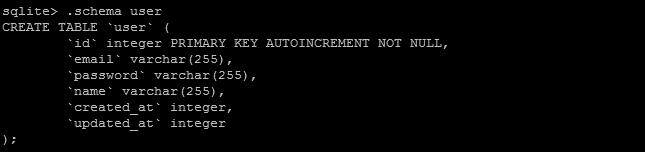

# 第三章。迁移、DAO 和查询构建

编写现代 Web 应用程序的最基本方面之一是与数据库一起工作。通过 PHP 的 PDO 驱动程序，Yii2 可以与许多不同类型的关联数据库一起工作。在本章中，我们将介绍如何连接到不同的数据库，编写数据库迁移以实例化我们的数据库，使用**数据库访问对象**（**DAO**），以及使用 Yii2 内置的查询构建器。我们还将介绍数据提供者和数据小部件等强大工具的基础知识，以及如何使用 Yii2 复制和负载均衡对数据库的访问。

# 连接到数据库

为了与数据库一起工作，所需的主要组件是 `yii\db\Connection` 类。通过这个类，我们可以连接到各种不同的数据库类型，从本地的 SQLite 数据库到集群化的 MySQL 数据库。建立数据库连接的最简单方法就是创建一个 SQLite 数据库连接，如下所示：

```php
$connection = new \yii\db\Connection([
    'dsn' => 'sqlite:/' . \Yii::getAlias('@app') . '/runtime/db.sqlite',
    'charset' => 'utf8'
]);

$connection->open();
```

然而，通常我们希望在应用程序的整个范围内使用单个数据库连接。我们可以通过将数据库配置放入 Web 或控制台配置文件的 `db` 组件中来使我们的应用程序保持 *DRY*。按照前几章中的示例，此组件将引用 `config/env/<ENV>/db.php` 文件。例如，在此文件中建立 SQLite 连接将如下所示：

```php
<?php return [
    'dsn' => 'sqlite:/' . \Yii::getAlias('@app') . '/runtime/db.sqlite',
    'class' => 'yii\db\Connection',
    'charset' => 'utf8'
];
```

通过将我们的数据库配置存储在我们的应用程序的 `db` 组件中，它可以很容易地在我们的 Web 和控制台应用程序之间共享，而无需我们做任何额外的工作。此外，由于 Yii2 仅在需要时加载组件，它可以保持我们的应用程序精简且性能良好。

### 小贴士

在 Yii2 中，组件仅在需要时才会被加载。这个过程通常被称为**延迟加载**。除非组件被预先加载，否则 Yii2 不会在首次使用之前创建该组件的实例。一旦被初始化，Yii 将在整个应用程序中重用相同的组件，而不是创建该组件的多个实例。延迟加载是 Yii 性能出色的主要原因之一。

将我们的数据库配置存储在我们的配置文件中后，我们现在可以访问数据库连接，如下所示：

```php
\Yii::$app->db;
```

此连接也将共享到我们应用程序中使用的任何 Active Record 模型，我们将在第四章*Active Record，模型和表单*中讨论。

如前所述，Yii2 可以连接到多种不同的数据库类型。因为 Yii2 是基于 PHP 的 PDO 库构建的，所以它可以连接到原生 PDO 驱动程序可以连接到的相同来源。以下是 Yii2 支持的一些**数据源名称**（**DSN**）的示例：

| 数据库类型 | DSN 方案 |
| --- | --- |
| MySQL、Percona、MariaDB 等等 | `mysql:host=localhost;dbname=mydatabase` |
| SQLite | `sqlite:/path/to/database/file.sqlite` |
| PostgreSQL | `pgsql:host=localhost;port=5432;dbname=mydatabase` |
| CUBRID | `cubrid:dbname=demodb;host=localhost;port=33000` |
| MS SQL Server (via the sqlsrv driver) | `sqlsrv:Server=localhost;Database=mydatabase` |
| MS SQL Server (via the dblib driver) | `dblib:host=localhost;dbname=mydatabase` |
| MS SQL Server (via the mssql driver) | `mssql:host=localhost;dbname=mydatabase` |
| Oracle | `oci:dbname=//localhost:1521/mydatabase` |

### 提示

如果你正在连接到 MS SQL 服务器，你需要在你的系统上安装 sqlsrv、dblib 或 mssql PHP 驱动程序。有关这些基础驱动程序的更多信息可以在 PHP 手册中找到，链接为 [`php.net/manual/en/pdo.drivers.php`](https://php.net/manual/en/pdo.drivers.php)。

此外，Oracle 连接将需要安装 Oracle 的 OCI8 驱动程序。有关此驱动程序的更多信息可以在 PHP 手册中找到，链接为 [`php.net/manual/en/book.oci8.php`](https://php.net/manual/en/book.oci8.php)。

注意，除非适当的 PHP 驱动程序已正确安装和配置，否则 Yii2 将无法连接到任何数据库。如果你不确定已安装了哪些驱动程序，原生的 `phpinfo()` 函数可以输出所有当前已安装的 PHP 扩展列表。

除了前面列出的基础驱动程序之外，Yii2 还可以连接到通过 **开放数据库连接**（**ODBC**）的数据库。当你通过 ODBC 连接到数据库时，你需要在你的 `db` 连接组件中指定 `$driverName` 属性，以便 Yii2 能够正确连接到你的数据库：

```php
'components' => [
    // [...]
    'db' => [
        'class' => 'yii\db\Connection',
        'driverName' => 'mysql', 'dsn' => 'odbc:Driver={MySQL};Server=localhost;Database=test',
        'username' => 'username',
      'password' => 'password',
  ]
]
```

如前所述，某些数据库配置可能需要你指定用户名或密码才能连接到它们。在 `db` 组件中，只需指定适合你数据库的 `username` 和 `password` 属性。

## 额外的配置选项

除了前面列出的基本 `db` 组件选项之外，Yii2 还提供了几个额外的选项，这些选项可以用来提高你应用程序的性能或解决原生 PHP 驱动程序中的已知问题。虽然许多这些选项可以在 Yii 指南和 API 文档中找到，但其中一些可能会比其他选项更频繁地使用。这些属性是 `$emulatePrepare`、`$enableQueryCache` 和 `$enableSchemaCache`。

### 提示

`yii\db\Connection` 类的所有可用方法和属性的完整列表可以在 [`www.yiiframework.com/doc-2.0/yii-db-connection.html`](http://www.yiiframework.com/doc-2.0/yii-db-connection.html) 找到。

第一个常见的属性`$emulatePrepare`可以用来减轻 Yii 团队在准备数据库语句时发现的一些常见问题。默认情况下，Yii2 将尝试使用内置在原生 PDO 驱动程序中的原生准备支持。为了帮助减轻与一些原生 PDO 驱动程序（主要是 MS SQL 驱动程序）的问题，可能需要将`$emulatePrepare`属性设置为`true`，以便允许 Yii2 处理准备语句。

在我们的`db`组件中通常启用的下一个常见属性是`$enableQueryCache`。为了提高应用程序的性能，我们可以将其设置为`true`，并允许 Yii 缓存常用查询。在一个主要执行读取操作的应用程序中，启用此属性可以显著提高应用程序的性能。

然而，要完全启用此组件，我们现在将提到的附加属性也必须设置。第一个属性是`$queryCache`，它指定查询缓存应使用的命名缓存对象。如果未设置，则默认为应用程序中的缓存组件。第二个属性是`$queryCacheDuration`，它决定了任何数据库查询结果将被缓存多长时间。默认情况下，查询缓存将有效期为 3,600 秒，即 60 分钟：

```php
'components' => [
  //[...
  'db' => [
        'dsn' => 'sqlite:/' . \Yii::getAlias('@app') . '/runtime/db.sqlite',
        'class' => 'yii\db\Connection',
        'charset' => 'utf8',
 'enableQueryCache' => true,
 'queryCache' => 'filecache',
 'queryCacheDuration' => 60
    ],
    'filecache' => [
        'class' => 'yii\caching\FileCache',
    ],
]
```

最后一个常见的属性，通常会被添加到我们的`db`组件中是`$enableSchemaCache`。在 Yii 访问数据库之前，它通常需要确定数据库模式。此模式信息用于帮助 Yii 在运行验证器和处理关系模型（如相关 Active Record 模型）时。我们不必让 Yii 在每次请求时都尝试确定我们的数据库模式，我们可以通过将`$enableSchemaCache`设置为`true`来告诉它我们的模式不会改变。

与之前概述的`$enableCache`参数类似，我们还需要定义`$schemaCache`参数，这将告诉 Yii 使用哪个缓存组件。我们还需要定义`$schemaCacheDuration`参数，以便 Yii2 知道模式缓存在秒内有效的时间：

```php
'components' => [
  // [...]
  'db' => [
        'dsn' => 'sqlite:/' . \Yii::getAlias('@app') . '/runtime/db.sqlite',
        'class' => 'yii\db\Connection',
        'charset' => 'utf8',
 'enableSchemaCache' => true,
 'schemaCache' => 'filecache',
 'schemaCacheDuration' => 3600
    ],
    'filecache' => [
        'class' => 'yii\caching\FileCache',
    ],
]
```

由于我们的大多数控制器操作很可能会导致数据库操作，启用这些属性可以大大提高应用程序的性能。

### 小贴士

记住，因为`$enableSchemaCache`和`$enableQueryCache`已被启用，Yii2 将不会对数据库执行常见检查。您数据库中底层数据或模式的任何更改都可能使您的应用程序返回错误数据或完全崩溃。如果您直接更改数据库中的数据而不是通过 Yii2，或者更改数据库模式，请确保刷新由`$enableSchemaCache`或`$enableQueryCache`定义的相关缓存组件，以确保您的应用程序正常运行。

# 编写数据库迁移

当构建和维护现代网络应用程序时，我们数据库的底层结构可能需要根据需求或范围的变化而改变。为了确保我们的数据库模式可以与源代码同步发展，Yii2 提供了内置支持来管理数据库迁移。使用数据库迁移，我们可以将数据库视为源代码的扩展，并在源代码更改时轻松地对其进行更改。

## 概述模式

当与数据库迁移一起工作时，我们通常会使用 `yii\db\Schema` 类。当正确配对时，我们通常可以编写迁移，以便它们能够在各种数据库类型上运行。例如，当本地工作时，我们可能需要使用本地 SQLite 数据库，即使我们的应用程序最终将在 MySQL 数据库上运行。

这个类的核心是多种不同的模式类型，Yii2 将能够正确地将它们映射到我们数据库中的适当数据类型。这些包括 `INT`、`DATETIME` 和 `TEXT` 等数据类型。

### 小贴士

要获取 Schema 类提供的所有可用常量的完整列表，请确保您参考 Yii2 指南 [`www.yiiframework.com/doc-2.0/yii-db-schema.html#constants`](http://www.yiiframework.com/doc-2.0/yii-db-schema.html#constants)。

在我们的迁移中，我们可以通过运行以下命令来调用这些常量：

```php
Schema::<CONSTANT>
```

在整数的示例中，我们可以使用以下内容：

```php
Schema::TYPE_INTEGER
```

在我们的迁移中使用这些常量，我们可以确保我们的迁移映射到数据库中的适当数据类型，并在各种数据库类型上工作。

## 编写迁移

如前一章所示，我们可以通过从 `yii` 命令行工具调用 `migrate/create` 命令来创建一个新的迁移。以前一章的源代码作为起点，我们将在命令行中运行以下操作：

```php
./yii migrate/create init

```


运行此命令将在我们应用程序的 `migrations` 文件夹中创建一个新的迁移。

### 小贴士

根据您系统的文件权限，如果 `migrations` 文件夹不存在，Yii2 可能无法创建它。如果 `migrations` 文件夹尚未存在，请在运行 `migrate/create` 命令之前确保创建它。

当运行迁移时，Yii2 将按照它们创建的顺序执行它们。为了确定这个顺序，Yii2 将查看文件名或包含从 `migrate/create` 命令指定的迁移名称以及迁移创建的确切时间的迁移。

在我们的例子中，文件名是 `m150523_194158_init.php`，这意味着这个迁移是在 2015 年 5 月 23 日晚上 7:41:58 UTC 创建的。

### 小贴士

由于这种命名约定，你创建的任何迁移都将具有独特且唯一的文件名。如果你正在跟随教程，请确保你在由 `./yii` 命令创建的文件中工作。

运行`migrate/create`命令后，Yii2 为我们提供了一个类似以下代码块的骨架迁移：

```php
<?php

use yii\db\Schema;
use yii\db\Migration;

class m150523_194158_init extends Migration
{
    public function up() {}

    public function down()
    {
        echo "m150523_194158_init cannot be reverted.\n";
        return false;
    }

    /*
    // Use safeUp/safeDown to run migration code within a transaction
    public function safeUp() {}

    public function safeDown() {}
    */
}
```

在 Yii2 中，迁移可以以两种方式操作：我们可以将迁移提升，或者将其降级。这两个操作对应于四个函数之一：`up()`、`safeUp()`、`down()`和`safeDown()`。`up()`和`down()`方法是运行迁移所需的基本方法，即使有错误，也会执行它们内部发出的任何数据库命令。或者，我们可以使用`safeUp()`和`safeDown()`方法，这两个方法在功能上与`up()`和`down()`方法相同，唯一的区别是整个操作都被包裹在一个事务中。如果我们的数据库支持事务，使用安全方法运行迁移可以帮助我们在错误导致整个数据库出现问题之前在运行时捕获迁移错误。

### 小贴士

由于它们提供的额外安全性，`safeUp()`和`safeDown()`应该是我们编写迁移时的首选方法。此外，如果使用了`safeUp()`或`safeDown()`，则不能使用不安全的方法。

让我们从向我们的数据库添加一个简单的表开始，以便存储我们的用户信息。我们将从简单地存储一个 ID、电子邮件地址、密码、用户名以及一些时间戳元数据开始，这些元数据表示我们的用户何时被创建以及最后更新。在我们的迁移中，我们可以这样写：

```php
class m150523_194158_init extends Migration
{
    public function safeUp()
    {
         return $this->createTable('user', [
            'id'           => Schema::TYPE_PK, // $this->primaryKey()
            'email'        => Schema::TYPE_STRING, // $this->string(255) // String with 255 characters
            'password'     => Schema::TYPE_STRING,
            'name'         => Schema::TYPE_STRING,
            'created_at'   => Schema::TYPE_INTEGER, // $this->integer()
            'updated_at'   => Schema::TYPE_INTEGER
        ]);
    }

    public function safeDown()
    {
        return $this->dropTable('user');
    }
}
```

### 小贴士

如前所述，Yii2 支持两种不同的方式来声明列的架构类型。我们可以直接使用由`Schema`类定义的常量，或者使用原生的迁移方法，如`primaryKey()`、`integer()`、`string()`和`text()`。使用迁移方法更受青睐，因为它允许我们向列添加额外的属性，例如列的大小和长度。有关迁移类提供的所有方法的完整列表，请参阅 Yii2 指南[`www.yiiframework.com/doc-2.0/yii-db-migration.html`](http://www.yiiframework.com/doc-2.0/yii-db-migration.html)。

在前面的例子中，我们概述了两种方法：`createTable()`，它将在我们的应用程序中创建一个新的数据库表，以及`dropTable()`，它将从我们的数据库中删除表。

### 小贴士

在与数据库一起工作时，一个常见的约定是使用下划线编写字段名，并为表和列名使用单数名称。虽然 Yii2 足够智能，可以处理你指定的任何字段名，但遵循此约定可以使你的代码更易于阅读，与数据库的交互也更简单。虽然你不必明确遵循此约定，但遵循约定可以在未来为你节省大量时间。

## 运行迁移

我们可以通过`yii`命令运行我们的迁移，如前一章所示：

```php
./yii migrate/up

```


由于我们在示例中使用的是 SQLite 数据库，我们可以轻松地探索运行 `migrate/up` 命令后发生了什么。使用 `sqlite` 命令行工具，我们可以探索我们的 SQLite 数据库：

```php
sqlite3 /path/to/runtime/db.sqlite

```

### 小贴士

如果您的包管理器不提供 sqlite3，您可以从 [`www.sqlite.org/download.html`](https://www.sqlite.org/download.html) 下载二进制可执行文件。

通过从我们的 SQLite 提示符运行 `.tables` 命令，我们可以看到在运行 `migrate/up` 命令时创建了两个表，`migration` 和 `user`：

```php
sqlite> .tables

```


第一个表，`migration`，包含所有已应用迁移的列表以及它们被应用的时间。


第二个表，`user`，显示了 Yii 从我们的迁移类创建的结果模式。



例如，通过指定我们的 `ID` 属性的 `TYPE_PK` 模式，Yii2 知道它需要向我们的 SQLite 模式添加 `AUTOINCREMENT` 和 `NOT NULL` 属性。

### 小贴士

虽然数据库迁移适用于大多数数据库更改，但针对大型数据集运行它们可能会导致您的数据库对应用程序不可用，从而导致停机时间。确保在您通过 Yii2 运行数据库迁移之前，您的应用程序应该能够处理临时停机时间。如果即使是临时的停机时间也不适合您的应用程序，您可能需要考虑以其他方式将数据迁移到更新的模式。

## 修改数据库模式

在本地开发时，我们可以简单地使用 `migrate/down` 命令来撤销特定的迁移（假设我们实现了 `down()` 或 `safeDown()` 方法）。然而，在我们提交并将代码推送到我们的分布式版本控制系统（DCVS）系统，如 Git 或 SVN 之后，其他人可能会使用或与我们合作代码。在这种情况下，我们希望在不会损害他们本地实例的情况下更改我们的迁移；我们可以创建新的迁移，以便我们的代码用户可以应用这些迁移，以使他们的应用程序保持最新。

以我们为我们创建的用户模式为例：

```php
CREATE TABLE `user` (
        `id` integer PRIMARY KEY AUTOINCREMENT NOT NULL,
        `email` varchar(255),
        `password` varchar(255),
        `name` varchar(255),
        `created_at` integer,
        `updated_at` integer
);
```

而不是为我们的用户名设置一个单独的字段，我们可能希望有两个字段：一个用于他们的名字，另一个用于他们的姓氏。我们可能还希望对其他字段进行一些更改，例如我们的 `email` 字段，以防止它们为 `NULL`。我们可以通过编写一个新的迁移并更改数据库本身的模式来实现这一点。

我们将首先创建一个新的迁移：

```php
./yii migrate/create name_change --interactive=0

```

### 小贴士

记住，`--interactive=0` 标志告诉 Yii 在没有提示的情况下运行我们的控制台命令。

在我们的新 `migrations/…name_change.php` 迁移中，我们可以编写一个 `safeUp()` 方法来为我们更改这些列：

```php
public function safeUp()
{
    $this->renameColumn('user', 'name', 'first_name');
    $this->alterColumn('user', 'first_name', SCHEMA::TYPE_STRING);
    $this->addColumn('user', 'last_name', SCHEMA::TYPE_STRING);
    $this->alterColumn('user', 'email', SCHEMA::TYPE_STRING . ' NOT NULL');
    $this->createIndex('user_unique_email', 'user', 'email', true);
}
```

在 Yii2 中，迁移命令在执行时具有自解释性。例如，第一个方法 `renameColumn()` 将简单地将 `name` 列重命名为 `first_name`。同样，`addColumn()` 将在数据库中添加一个具有指定名称和模式的新的列，`alterColumn()` 将修改指定列的模式，而 `createIndex()` 将在我们的数据库中的电子邮件字段上创建一个唯一索引，这将确保不会有两个用户共享相同的电子邮件地址。

### 小贴士

可以在 Yii2 指南 [`www.yiiframework.com/doc-2.0/yii-db-migration.html`](http://www.yiiframework.com/doc-2.0/yii-db-migration.html) 中找到可以在迁移调用中运行的命令的完整列表。

但是，如果我们尝试在 SQLite 数据库上运行这些迁移，我们会遇到类似于以下错误的错误，表明 SQLite 不支持这些方法：

```php
./yii migrate/up

```

这是输出结果：

```php
*** applying m150523_203944_name_change
 > rename column name in table user to first_name \
...Exception: yii\db\sqlite\QueryBuilder::renameColumn is not \
 supported by SQLite. \
(/var/www/ch3/vendor/yiisoft/yii2/db/sqlite/QueryBuilder.php:201)

```

虽然之前列出的迁移可以在 MySQL 或 PostgreSQL 上工作，但我们的 SQLite 驱动程序不提供对这些命令的支持。然而，由于我们使用 SQLite，因此我们必须重写我们的初始迁移命令，并通知应用程序用户关于更改的信息。对于 SQLite，我们可以将新创建的 `migrations/…name_change.php` 迁移重写如下：

```php
public function safeUp()
{
    $this->dropTable('user');

    $this->createTable('user', [
        'id'           => Schema::TYPE_PK,
        'email'        => Schema::TYPE_STRING . ' NOT NULL',
        'password'     => Schema::TYPE_STRING . ' NOT NULL',
        'first_name'   => Schema::TYPE_STRING,
        'last_name'    => Schema::TYPE_STRING,
        'created_at'   => Schema::TYPE_INTEGER,
        'updated_at'   => Schema::TYPE_INTEGER
    ]);

    $this->createIndex('user_unique_email', 'user', 'email', true);
}

public function safeDown()
{
    return true;
}
```

### 小贴士

`yii\db\Migration` 没有我们可以用来检索数据的 `query()` 方法。因此，如果我们需要在迁移中查询数据，我们需要使用 Yii2 的查询构建器来完成此操作，我们将在本章后面介绍。如果我们的应用程序被广泛采用，可能最好使用查询构建器查询所有用户并将它们临时存储在内存中（或者如果我们有大量记录，则存储在临时存储中）。然后，在为我们的用户表创建新的表模式之后，我们可以使用 `insert()` 方法将它们重新插入到我们的数据库中。

在更新了我们的新迁移之后，我们可以重新运行我们的迁移命令。由于我们的第一次迁移已经应用，当执行 `migrate/up` 命令时，该迁移将被跳过，并且只会运行我们的 `migrations/m150523_203944_change.php` 迁移：

```php
./yii migrate/up

```


运行我们的迁移后，我们可以查询我们的数据库以查看在 SQLite 中我们的完整模式看起来是什么样子：

```php
sqlite3 /path/to/runtime/db.sqlite

```


### 小贴士

Yii2 中的迁移功能非常强大。请查看 Yii2 文档 [`www.yiiframework.com/doc-2.0/yii-db-migration.html`](http://www.yiiframework.com/doc-2.0/yii-db-migration.html)，了解您可以使用 `yii\db\Migration` 做到的一切。

# 数据库访问对象

Yii 数据库访问对象，通常称为 DAO，提供了一个强大的面向对象 API，用于与关系数据库一起工作。作为更复杂数据库访问（如查询构建器和活动记录）的基础，DAO 使我们能够通过 SQL 语句和 PHP 数组直接与数据库交互。因此，与使用活动记录或查询构建器相比，使用 DAO 语句的性能要高得多。

DAO 的核心是我们的 `yii\db\Connection` 类，或者更常见的是我们的 `db` 组件 `\Yii::$app->db`。由于我们的 `db` 组件已经为 SQLite 正确配置，我们将继续使用它。使用 DAO，我们可以运行两种类型的查询：返回数据的查询，如 `SELECT` 查询，以及执行数据的查询，如 `DELETE` 或 `UPDATE`。

### 提示

如果你直接使用 `yii\db\Connection` 类，你需要在运行任何针对该连接的查询之前显式调用 `open()` 方法。

## 查询数据

我们可以使用 DAO 的第一种方式是查询数据。用于查询数据的主要方法有四个：`queryAll()`、`queryOne()`、`queryScalar()` 和 `queryColumn()`。

第一种方法，`queryAll()`，用于根据 `createCommand()` 方法中使用的 SQL 语句查询特定表中的所有数据。以我们的用户表为例，我们可以通过运行以下命令来查询我们数据库中的所有用户：

```php
$users = \Yii::$app->db
        ->createCommand('SELECT * FROM user;')
        ->queryAll();
```

运行此命令后，我们的 `$users` 变量将填充一个用户数组：

```php
Array
(
    [0] => Array
    (
        [id] => 1
        [email] => test@example.com
        [password] => test123
        [first_name] => test
        [last_name] => user
        [created_at] => 0
        [updated_at] => 0
    )
)
```

下一种方法，`queryOne()`，用于从数据库中检索单个记录。

```php
$user = \Yii::$app->db
        ->createCommand('SELECT * FROM user WHERE id = 1;')
        ->queryOne();
```

`queryOne()` 方法返回单个元素的数据数组。如果没有找到数据，此方法将返回 `false`：

```php
Array
(
    [id] => 1
    [email] => test@example.com
    [password] => test123
    [first_name] => test
    [last_name] => user
    [created_at] => 0
    [updated_at] => 0
)
```

第三种方法，`queryScalar()`，用于返回返回单个值的 `SELECT` 查询的结果。例如，如果我们想计算我们数据库中用户的数量，我们可以使用 `queryScalar()` 来获取值：

```php
$count = \Yii::$app->db
        ->createCommand('SELECT COUNT(*) FROM user;')
        ->queryScalar();
```

运行此命令后，我们的 `$count` 变量将填充我们数据库中用户的数量。

最后一种方法，`queryColumn()`，用于查询我们数据库中的特定列。例如，如果我们想了解我们数据库中所有用户的电子邮件地址，我们可以使用 `queryAll()` 来获取所有这些数据，或者我们可以使用 `queryColumn()`，这将更高效，因为它将查询更少的数据：

```php
$user = \Yii::$app->db
        ->createCommand('SELECT email FROM user;')
        ->queryColumn();
```

与 `queryAll()` 类似，`queryColumn()` 将返回结果数组：

```php
Array
(
    [0] => test@example.com
)
```

如果没有找到结果，`queryColumn()` 将返回一个空数组。

在了解这些方法之后，作为一个练习，让我们回到我们之前的迁移并将它们重写以保留我们的用户跨模式更改：

1.  首先，让我们回滚我们的迁移以正确模拟场景：

    ```php
    ./yii migrate/down

    ```

1.  然后，我们将使用 `migrate/to` 命令迁移我们的初始迁移：

    ```php
    ./yii migrate/to m150523_194158_init

    ```

1.  接下来，让我们用一些测试数据填充我们的数据库：

    ```php
    sqlite3 /path/to/runtime/db.sqlite INSERT INTO user (email, password, name) VALUES ('test@example.com', 'test1', 'test user');
    INSERT INTO user (email, password, name) VALUES ('test2@example.com', 'test2', 'test user 2');

    ```

1.  如果我们查看我们的数据库，我们会看到初始模式和数据现在已经就绪。

1.  然后，让我们重写我们的`migrations/…name_change.php`迁移，在运行我们创建的初始迁移之前从数据库中获取我们的用户，然后将我们的用户重新插入到数据库中。我们将使用`queryAll()` DAO 方法来获取数据，并使用`yii\db\Migration`的`insert()`方法将其放回数据库。新的代码块已被突出显示以便于查看：

    ```php
    public function safeUp()
    {
        $users = \Yii::$app->db
                  ->createCommand('SELECT * FROM user')
                  ->queryAll();

        $this->dropTable('user');

        $this->createTable('user', [
            'id'           => Schema::TYPE_PK,
            'email'        => Schema::TYPE_STRING . ' NOT NULL',
            'password'     => Schema::TYPE_STRING . ' NOT NULL',
            'first_name'   => Schema::TYPE_STRING,
            'last_name'    => Schema::TYPE_STRING,
            'created_at'   => Schema::TYPE_INTEGER,
            'updated_at'   => Schema::TYPE_INTEGER
        ]);

        $this->createIndex('user_unique_email', 'user', 'email', true);

        foreach ($users as $user)
        {
            $this->insert('user', [
                'id'         => $user['id'],
                'email'      => $user['email'],
                'password'   => $user['password'],
                'first_name' => $user['name'],
                'created_at' => $user['created_at'],
                'updated_at' => $user['updated_at']
            ]);
        }
    }
    ```

1.  现在，我们可以重新运行我们的迁移。如果成功，我们应该看到我们的原始迁移运行，并且为数据库中的每个用户执行一个插入调用。

    ```php
    ./yii migrate/up –interactive=0

    ```

    

1.  最后，我们可以查询我们的 SQLite 数据库以预览更新的模式并查看更新的用户：

    ```php
    sqlite3 /path/to/runtime/db.sqlite

    ```

    

如您所见，DAO 的查询方法为我们提供了快速有效地从数据库中获取数据的能力。

### 引用表和列名

当编写数据库无关的 SQL 查询时，正确引用字段名可能会出现问题。为了避免这个问题，Yii2 提供了自动为您使用特定数据库的正确引用规则来引用表和列名的功能。

要自动引用列名，只需将列名放在方括号中：

```php
[[column name]]
```

要自动引用表，只需将表名放在花括号中：

```php
{{table name}}
```

下面展示了这两个工具在操作中的示例：

```php
$result = \Yii::$app->db
          ->createCommand("SELECT COUNT([[id]]) FROM {{user}}")
          ->queryScalar();
```

## 执行查询

虽然查询方法提供了从我们的数据库中选择数据的能力，但我们经常需要执行`UPDATE`或`DELETE`命令，这些命令不会返回数据。为了执行这些命令，我们通常可以使用`execute()`方法：

```php
\Yii::$app->db
    ->createCommand('INSERT INTO user (email, password) VALUES ("test3@example.com", "test3");')
    ->execute();
```

如果成功，`execute()`方法将返回`true`，如果失败，则返回`false`。

Yii2 还提供了`insert()`、`update()`和`delete()`的便捷包装器，这使得我们能够编写命令而无需编写原始 SQL。这些方法代表您正确转义和引用表和列名以及绑定参数。

例如，我们可以按照以下方式将新用户插入到数据库中：

```php
// INSERT ( tablename, [ attributes => attr ] )
\Yii::$app->db
    ->createCommand()
    ->insert('user', [
      'email'      => 'test4@example.com',
      'password'   => 'changeme7',
      'first_name' => 'Test',
      'last_name'  => 'User',
      'created_at' => time(),
      'updated_at' => time()
    ])
   ->execute();
```

我们可以使用`update()`方法更新我们数据库中的所有用户：

```php
// UPDATE (tablename, [ attributes => attr ], condition )
\Yii::$app->db
    ->createCommand()
    ->update('user', [
        'updated_at' => time()
    ], '1 = 1')
   ->execute();
```

### 小贴士

我们更新命令中列出的最后一个参数定义了查询命令的`where`条件，我们将在本章后面更详细地介绍。`1=1`是一个常见的 SQL 成语，用于更新所有记录。

我们也可以使用`delete()`方法从我们的数据库中删除用户：

```php
// DELETE ( tablename, condition )
\Yii::$app->db
    ->createCommand()
    ->delete('user', 'id = 3')
    ->execute();
```

此外，如果您需要同时插入多行，可以使用`batchInsert()`方法，这比逐行插入要高效得多：

```php
// batchInsert( tablename, [ properties ], [ rows ] )
\Yii::$app->db
    ->createCommand()
    ->batchInsert('user', ['email', 'password', 'first_name', 'last_name', 'created_at', 'updated_at'], 
    [
        ['james.franklin@example.com', 'changeme7', 'James', 'Franklin', time(), time()],
        ['linda.marks@example.com', 'changeme7', 'Linda', 'Marks', time(), time()]
        ['roger.martin@example.com', 'changeme7', 'Roger', 'Martin', time(), time()]
    ])
    ->execute();
```

### 小贴士

Yii2 没有提供`batchUpdate()`或`batchDelete()`方法，因为批量更新和删除可以通过`update()`和`delete()`方法使用常规 SQL 来处理。

## 参数绑定

与用户提交的数据打交道时，最重要的规则是永远不要信任用户提交的数据。任何通过我们的数据库传递并来自最终用户的数据都需要在执行数据库操作之前进行验证、清理和正确绑定到我们的语句中。

以以下查询为例：

```php
\Yii::$app->db
    ->createCommand("UPDATE user SET first_name = 'Tom' WHERE id  = " . $_GET['id'])
    ->execute();
```

在正常情况下，Yii 会生成以下 SQL，假设`$_GET['id']`的值为`1`：

```php
UPDATE user SET first_name = 'Tom' WHERE id = 1;
```

虽然这看起来是无害的，但任何可以操作`$_GET['id']`变量的用户都可以将我们的查询重写为更危险的内容。例如，他们可以通过将`$_GET['id']`替换为`1; DROP TABLE user; --`来删除我们整个用户表：

```php
UPDATE user SET first_name = 'Tom' WHERE id = 1; DROP TABLE user; --

```

这种攻击被称为 SQL 注入。为了帮助防止 SQL 注入，Yii2 提供了几种不同的方法来将参数绑定到我们的查询中，从而过滤注入的 SQL。这三种方法是`bindValue()`、`bindValues()`和`bindParam()`。

第一种方法，`bindValue()`，用于将单个参数绑定到我们的 SQL 语句中的标记上。例如，我们可以将之前的查询重写如下：

```php
\Yii::$app->db
    ->createCommand("UPDATE user SET first_name = :name WHERE id  = :id)
    ->bindValue(':name', 'Tom')
    ->bindValue(':id', $_GET['id'])
    ->execute();
```

或者，我们可以使用`bindValues()`方法在单个调用中绑定多个参数：

```php
\Yii::$app->db
    ->createCommand("UPDATE user SET first_name = :name WHERE id  = :id)
    ->bindValues([ ':name' => 'Tom', ':id' => $_GET['id'] ])
    ->execute();
```

为了方便，可以将之前的查询重写，使参数与`createCommand()`方法一致：

```php
$params = [ ':name' => 'Tom', ':id' => $_GET['id'] ];
\Yii::$app->db
    ->createCommand("UPDATE user SET first_name = :name WHERE id  = :id, $params)
    ->execute();
```

最后一种方法，`bindParam()`，通过引用绑定参数而不是通过值绑定：

```php
$id = 1;
$name = 'Tom';
$q = \Yii::$app->db
    ->createCommand("UPDATE user SET first_name = :name WHERE id  = :id)
    ->bindParam(':name', $name)
    ->bindParam(':id', $id);
```

由于`bindParam()`通过引用绑定参数，我们可以更改绑定的值以执行多个查询。在先前的例子中，我们可以写出以下内容来更新多个用户，而无需每次都重写查询：

```php
$q->execute();
$id = 2;
$name = 'Kevin';
$q->execute();
```

### 小贴士

记住，与用户数据打交道时最重要的规则是永远不要信任用户提交的数据。即使在您 100%确信 SQL 注入不会发生的情况下，也建议您使用参数绑定而不是直接编写 SQL 语句。这将保护您免受未来代码更改的影响。

## 事务

当连续运行多个查询时，我们通常希望确保数据库状态在这些查询之间保持一致。大多数现代数据库都支持使用事务来实现这一点。在事务中，更改以这种方式写入数据库，如果一切顺利则可以提交，如果事务中的任何给定查询失败则可以无后果地回滚。在 Yii2 中，这看起来如下所示：

```php
$transaction = \Yii::$app->db->beginTransaction();

try {
    \Yii::$app->db->createCommand($sql)->execute();
    \Yii::$app->db->createCommand($sql)->execute();
    //[ … more queries …]
    $transaction->commit();
} catch (\Exception $e) {
    $transaction->rollBack();
}
```

# 查询构建器

在 DAO（数据访问对象）奠定基础之上，诞生了 Yii 的查询构建器。Yii 的查询构建器允许我们以编程方式编写数据库无关的查询。因此，通过查询构建器编写的查询比其 DAO 对应物要易于阅读得多。

查询构建器的基本原理包括创建 `yii\db\Query` 实例、构建语句，然后执行该查询语句。例如，我们可以在查询构建器中使用以下代码简单地查询我们数据库中的所有用户：

```php
$users = (new \yii\db\Query())
    ->select(['id', 'email'])
    ->from('user')
    ->all();
```

### 小贴士

当使用查询构建器时，我们实际上使用的是 `yii\db\Query` 类而不是 `yii\db\QueryBuilder`。虽然 `yii\db\QueryBuilder` 可以生成与 `yii\db\Query` 类似的 SQL 语句，但 `yii\db\Query` 允许这些语句对数据库不可知。通常，当使用查询构建器时，你将想要使用 `yii\db\Query`。

## 查询构建方法

查询构建器的基本原理涉及将多个查询方法链接在一起。这些方法名称直接对应于它们命名的 SQL 部分。当使用查询构建器时，你将最常使用的方法将是 `select()`、`from()` 和 `where()` 方法。

今后，我们将使用以下变量来表示我们的查询构建器对象：

```php
$query = (new \yii\db\Query());
```

## 选择方法

`select()` 方法直接对应于我们的 SQL 查询的 `SELECT` 部分，接受列名字符串或列数组，以指定我们想要从数据库中选择的列。例如，以下查询是相同的：

```php
$query->select('id, first_name)->from('user');
$query->select(['id', 'last_name'])->from('user');
```

### 小贴士

当使用 `select()` 方法时，数组格式通常易于阅读和操作。如果你选择将列名作为字符串列出，确保你在整个应用程序中保持一致性。在以下示例中，我们将使用数组格式。

`select()` 方法还支持列别名和表前缀，如下一个示例所示：

```php
$query->select([
    'id' => 'user_id', 
    'user.first_name' => 'fName']
)->from('user');
```

除了列名外，`select` 方法还支持表达式。例如，如果我们想检索用户的完整姓名作为一个单独的字段，我们可以执行以下查询：

```php
$query->select([
    "id", 
    "CONCACT(first_name, ' ', last_name)" => 'full_name'
])->from('user'); 
```

`select` 方法还可以用来执行子查询，例如 `COUNT()`：

```php
$query->select('COUNT(*)')->from('user');
```

最后，`select` 语句可以与 `distinct()` 方法链接，以检索唯一记录。例如，如果我们想列出我们用户数据库中的所有第一个名字，我们可以执行以下查询：

```php
$query->select('first_name')->distinct()->from('user');
```

### 小贴士

如果你的查询中省略了 `select()` 方法，将执行 `SELECT *` 查询。

### `from` 方法

我们之前的示例已经展示了 `from()` 方法的基本用法。`from()` 方法也可以用来指定表别名，如下面的示例所示：

```php
$query->select('first_name')->from(['u' => 'users']);
```

### 小贴士

与 `select()` 方法类似，`from()` 方法也可以接受字符串作为输入，而不是数组。前面的查询可以重写为 `$query->select('first_name')->from(['users u']);`。

### `where` 方法

`where()` 方法指定了我们的 SQL 查询的 `where` 部分，可以使用字符串格式、哈希格式或运算符格式。

#### 字符串格式

`where()`方法的字符串格式应始终与`addParams()`方法链式连接，以防止 SQL 注入：

```php
$query->select(['first_name', 'last_name'])
           ->from('user')
      ->where('id = :id')
      ->addParams([':id' => 1]);
```

或者，可以将参数重写为`where()`方法的第二个参数：

```php
$query->select(['first_name', 'last_name'])
      ->from('user')
      ->where('id = :id', [':id' => 1]);
```

### 小贴士

记住，为了避免 SQL 注入，不要在`where()`方法中直接添加 PHP 变量。

#### 哈希格式

哈希格式提供了一种更好的方法来在`where`语句中链式连接多个`AND`条件。而不是传递一个字符串作为参数，我们可以传递一个表示列名和值的键值对的数组。当使用哈希格式时，所选字段将通过 SQL `AND`连接在一起。

例如，我们可以通过运行以下查询来找到所有名为 John 的用户，他们在 20 多岁，并且没有列出宠物名称：

```php
$query->from('user')
      ->where([
       'first_name' => 'John',
       'pets_name' => NULL,
       'age' => [20, 21, 22, 23, 24, 25, 26, 27, 28, 29],
       ]);
```

### 小贴士

我们当前的数据库中没有`age`或`pets_name`字段。我们将不得不通过迁移调整我们的模式来向数据库中添加这些字段。

这将导致以下查询：

```php
SELECT * 
FROM user 
WHERE first_name = "John" AND 
        pets_name IS NULL AND 
        age IN (20, 21, 22, 23, 24, 25, 26, 27, 28, 29);
```

### 小贴士

如前所述，哈希格式允许您生成更复杂的`WHERE`查询，例如在指定值数组时使用`IN`，以及在传递数组值为 null 时使用`IS NULL`。

#### 操作符格式

使用`where()`方法的最后一种方式是使用操作符格式。操作符格式允许我们构建包含条件如`LIKE`、`OR`、`BETWEEN`和`EXISTS`等更复杂的 SQL 查询，仅举几个例子。

通常，`operator`格式采用以下格式：

```php
where([ operator, condition1, condition2 ]);
```

例如，如果我们想从我们的数据库中获取所有名为 John 或 Jill 的用户，我们可以执行以下操作：

```php
$query->where(['or', 'John', 'Jill']);
```

### 小贴士

要查看操作符格式支持的完整操作符列表，请查看 Yii2 API 文档中的[`www.yiiframework.com/doc-2.0/yii-db-query.html#where()-detail`](http://www.yiiframework.com/doc-2.0/yii-db-query.html#where()-detail)。

如您所想象，`where()`方法可能会迅速变得非常庞大和复杂。与其使用操作符，您可能会发现使用`andWhere()`或`orWhere()`方法来链式连接多个条件会使代码更易读：

```php
$query->andWhere(['in', 'id', [1,2,3,4,5]);
```

### 排序结果

查询构建器还可以使用`orderBy()`方法根据给定字段对结果进行排序。例如，为了按年龄对数据库中的所有用户进行排序，我们可以构建以下查询：

```php
$query->from('user')
      ->orderBy('age ASC');
```

### 限制和偏移数据

通常与`where()`方法一起使用的是`limit()`和`offset()`方法，这些方法用于限制结果数量并偏移给定数量的结果。当这两个方法正确使用时，它们构成了通过结果分页的基本方法：

```php
$query->from('user')
      ->limit(5)
      ->offset(5);
```

### 分组和聚合

在处理多样化的数据集时，我们通常需要对我们的数据进行一些分析。聚合函数如 `GROUP BY` 和 `HAVING` 可以极大地帮助我们从数据中提取更多信息。Yii2 通过 `groupBy()` 和 `having()` 方法支持这些方法。

例如，如果我们想列出我们数据库中每个年龄组的用户数量，我们可以执行以下查询：

```php
$query->select(['age', 'COUNT(*)' => 'users'])
      ->from('user')
      ->groupBy('age');
```

这将生成以下 SQL 语句：

```php
SELECT age, COUNT(*) AS users FROM user GROUP BY age;
```

`groupBy()` 方法的行为类似于 `select()` 方法，因为它接受一个数组或字符串作为参数；然而，当使用数据库表达式时，你需要使用数组语法。

在使用 `groupBy()` 对我们的结果进行分组后，我们可以使用 `having()` 方法来过滤我们的结果，该方法的行为与 `where()` 方法相同。以下示例将仅显示我们数据集中年龄超过指定年龄的用户数量：

```php
$query->select(['age', 'COUNT(*)' => 'users'])
      ->from('user')
      ->groupBy('age')
      ->having('>', 'age', 30');
```

### 连接和并集

当在多个表上工作时，你可能经常需要在你的数据集上执行连接或并集。可以通过查询构建器使用 `join()` 和 `union()` 方法来执行连接和并集。

连接方法具有以下方法语法：

```php
$query->join( $type, $table, $on, $params );
```

第一个参数 `$type` 指定了你想要执行的连接类型（例如，`INNER JOIN`、`LEFT JOIN` 或 `OUTER JOIN`）。`$table` 参数指定要连接的表。第三个参数 `$on` 指定了表应该连接的条件，并采用 `where()` 方法的语法，而 `$params` 参数指定了要绑定到连接的可选参数。

例如，假设我们有一个帖子表和用户表。我们可以使用 `join()` 方法将它们连接如下：

```php
$query->join('LEFT JOIN', 'post', 'post.user_id = user.id');
```

假设我们的数据库中既有用户表又有帖子表，这将返回一个包含所有用户及其帖子的连接。结果将包括所有与所有他们拥有的帖子连接的用户。

也可以通过类型使用快捷方法 `rightJoin()`、`leftJoin()` 和 `innerJoin()` 来执行连接。

同样地，可以通过首先构建两个不同的 `yii\db\Query` 对象，然后使用它们上的 `union()` 方法来构造两个不同查询的并集，如下所示：

```php
$query1->union($query2);
```

### 执行查询

在使用查询构建器构建我们的查询后，我们需要指定查询的执行。Yii2 提供以下查询方法来执行使用查询构建器构建的查询。查询方法简单地链接到现有的 `$query` 对象，这将立即导致它们的执行。

在使用查询构建器的大多数情况下，我们希望获取数据库中的所有记录。这可以通过将 `all()` 方法链接到我们的查询对象来完成，这将检索满足我们的 `$query` 对象要求的所有记录：

```php
$results = $query->all();
```

`$result` 变量将填充一个包含行的数组，每个行包含一个与结果数据关联的名称-值键对数组。

### 提示

如果你有大量数据集，请仔细考虑使用`all()`方法，因为查询执行可能需要很长时间才能完成，并且可能会导致你的应用程序挂起或出错。

在其他情况下，可能只需要获取查询的第一行。要获取第一行，我们可以使用`one()`方法：

```php
$row = $query->one();
```

在其他时候，我们可能只想知道查询是否会返回任何数据。为了实现这一点，我们可以使用`exists()`方法，它将返回`true`或`false`，指示结果查询将返回数据。

例如，如果我们想知道我们的数据库中是否有任何用户，我们可以使用`exists()`查询来检查我们在执行任何更复杂的查询之前是否有用户：

```php
$areUsersInDb = (new \yii\db\Query)
              ->from('user')
              ->exists();
```

或者，我们可以在运行查询之前使用`count()`方法来确定我们数据库中存在多少用户。`count()`方法将在`SELECT`片段中执行`COUNT(*)`方法，并将返回一个标量值：

```php
$count = (new \yii\db\Query)
       ->from('user')
       ->count();
```

当处理数据库表达式，如`MIN()`和`MAX()`，或更复杂的查询时，你可能发现从查询构建器中检索标量值而不是关联数组是有用的。要使用查询构建器检索标量值，我们可以使用`scalar()`方法。例如，如果我们想使用`MAX()` SQL 方法知道我们数据库中最年长的用户有多老，我们可以使用以下代码返回代表他们年龄的整数：

```php
$age = (new \yii\db\Query)
     ->select('MAX(age)')
     ->from('user')
     ->scalar();
```

最后，我们可能发现检索数据库结果的第一个列是有益的，例如在使用`groupBy()`或`having()`方法的情况下。要获取结果的第一行，我们可以使用`column()`方法：

```php
$result = (new \yii\db\Query)
        ->from('user')
        ->column();
```

在上一个示例中，我们用户表的第一个列是`ID`字段。因此，将返回我们数据库中所有 ID 的数组。

### 小贴士

选择所有列（`*`）将导致所有记录被加载到内存中，这取决于表的大小，可能会导致性能下降。在查询数据时，请记住你只查询你需要的数据。如果你需要所有数据，你可以以迭代方式查询，例如限制每个查询所需的内存。

### 查询检查

在构建查询后，你可能想检查生成的查询。为此，可以使用`createCommand()`方法将查询构建器对象转换为 DAO 命令：

```php
$command = $query->select(['first_name', 'last_name'])
                 ->from('user')
                 ->where('id = :id', [':id' => 1])
                 ->createCommand();

// Show the generated SQL statement
echo $command->sql;

// Show the bound parameters
var_dump($command->params);

// Execute the query via normal DAO commands
$rows = $command->queryAll();
```

### 遍历查询结果

通常在处理大量数据集时，结果数据集可能太大而无法加载到内存中。为了保持内存消耗低并防止我们的应用程序挂起，我们可以使用`batch()`或`each()`方法。默认情况下，这两种方法将从数据库中检索 100 行。要更改要检索的行数，只需更改每个方法的第一参数：

```php
$query->from('user');

// $users will ben an array of 100 or fewer rows from the database
foreach ($query->batch() as $users) {}

// Whereas the each() method allows you to iterate over the first 50 or fewer users one by one
foreach ($query->each(50) as $user) {}
```

`batch()` 方法支持分批获取数据，这可以降低内存消耗。将此方法视为附加了限制和偏移参数的查询，这将限制返回的行数。`batch()` 查询的每次迭代将包含多个结果。与`batch()` 方法类似，`each()` 方法也可以用来减少内存消耗，但它将逐行迭代查询，这意味着该方法的每次迭代将只产生我们数据的一个实例。

# 数据提供者和数据小部件

在 Yii2 中，数据提供者是辅助类，用于通过查询构建器提取数据，并将其传递给数据小部件。使用数据提供者和数据小部件而不是通过查询构建器构建查询的好处是，它们提供了一个接口来自动处理排序和分页。

与数据提供者一起工作的最常见方式是使用`yii\data\ActiveDataProvider`类。通常，`yii\data\ActiveDataProvider`将与 Active Record 模型一起使用：

```php
$provider = new ActiveDataProvider([
    'query' => User::find(),
    'pagination' => [
        'pageSize' => 20,
    ],
]);
```

### 提示

我们将在第四章中介绍如何创建和使用 Active Record 和模型，*活动记录、模型和表单*。

活动数据提供者也可以通过查询构建器填充，如下例所示：

```php
$query = new yii\db\Query();
$provider = new ActiveDataProvider([
    'query' => $query->from('user'),
    'pagination' => [
        'pageSize' => 20,
    ],
]);
```

### 注意

Yii2 提供了两种额外的数据提供者类型：`yii\data\ActiveDataProvider` 和 `yii\data\SqlDataProvider`。有关这些数据提供者的更多信息，请参阅 Yii2 指南中的[`www.yiiframework.com/doc-2.0/guide-output-data-providers.html`](http://www.yiiframework.com/doc-2.0/guide-output-data-providers.html)。

一旦我们使用数据提供者获取了数据，我们可以将结果数据传递给数据小部件。Yii2 中的数据小部件是可重用的构建块，用于在视图中创建与数据交互的复杂界面。最常见的数据小部件是`DetailView`、`ListView`和`GridView`，它们的行为类似于它们的 Yii1 对应物。

例如，我们可以将之前的数据提供者输出到`GridView`中，如下所示：

```php
$query = new yii\db\Query();
$provider = new yii\data\ActiveDataProvider([
    'query' => $query->from('user'),
    'pagination' => [
        'pageSize' => 2, 
    ],  
]);

echo yii\grid\GridView::widget([
    'dataProvider' => $provider
]);
```

仅就其本身而言，我们的结果`GridView`小部件将显示我们数据库表中的所有字段。在某些情况下，可能存在我们不希望在页面上显示的敏感数据。或者，可能数据太多，无法在`GridView`中显示。为了限制在`GridView`小部件中显示的字段数，我们可以使用`columns`属性：

```php
echo yii\grid\GridView::widget([
    'dataProvider' => $provider,
    'columns' => [
        'id',
        'email',
        'first_name',
        'last_name',
        'created_at',
        'updated_at'
    ]
]);
```


我们可以使用`yii\data\Sort`类进一步增强我们的数据提供者，该类为我们提供数据提供者的排序功能。要向我们的数据提供者添加排序，我们需要在`yii\data\ActiveDataProvider`中指定`yii\data\Sort`实例，该实例指定了可以排序的属性：

```php
$query = new yii\db\Query();
$provider = new yii\data\ActiveDataProvider([
    'query' => $query->from('user'),
    'sort' => new yii\data\Sort([
        'attributes' => [
            'email',
            'first_name',
            'last_name'
        ]
    ]),
    'pagination' => [
        'pageSize' => 2,
    ],  
]);
```


如上图所示，`sort` 属性中列出的属性现在可以通过我们的数据提供者进行点击和排序。

### 小贴士

更多有关输出数据小部件的信息可以在 Yii2 指南中找到，请参阅[`www.yiiframework.com/doc-2.0/guide-output-data-widgets.html`](http://www.yiiframework.com/doc-2.0/guide-output-data-widgets.html)。

虽然一些小部件，如 `GridView`，允许我们处理和显示多行，但我们也可以使用数据提供者和数据小部件来显示单行的信息。使用 `DetailView` 小部件，我们可以动态配置一个简单的界面来显示数据库中特定用户的信息。我们数据提供者的 `getModels()` 方法将数据提供者拆分为 `DetailView` 小部件可以理解的单独模型：

```php
echo yii\widgets\DetailView::widget([
    'model' => $user,    
    'attributes' => [
        'id',               
        'first_name',
        'last_name',
        'email',
        // Format the updated dates as datetime object
        // Rather than an integer
        'updated_at:datetime'
    ]
]);
```

### 小贴士

通常在处理 `DetailView` 小部件时，我们会向其提供一个 Active Record 实例，而不是从数据提供者生成的模型，这将在第四章中介绍，*Active Record，模型和表单*。

这将在我们的屏幕上显示：


除了简单地显示数据库中的结果外，`DetailView` 小部件还支持某些行的自定义格式化。在我们的上一个示例中，我们能够通过在更新字段中指定 `:datetime` 格式化器，将存储在 `updated_at` 字段中的 Unix 时间戳格式化为可读的日期和时间字段：

```php
'attributes' => [
    [...],
    'updated_at:datetime'
]
```

### 小贴士

这里列出的格式化器是一个强大的工具，它允许我们快速将原始数据转换为有用的可读信息。有关格式化器的更多信息，请参阅[`www.yiiframework.com/doc-2.0/yii-i18n-formatter.html`](http://www.yiiframework.com/doc-2.0/yii-i18n-formatter.html)。

# 数据复制和负载均衡

当我们开始处理更大和更复杂的系统时，我们经常发现需要在系统中构建额外的冗余，以便实现高可用性和防止意外停机。当处理大型系统时，我们将数据库拆分为一个读写主数据库和一组从数据库的只读从数据库。通常，我们的应用程序对我们的数据库架构一无所知，这可能会在需要从新主数据库迁移时引入问题。使用 Yii2，我们可以配置我们的数据库连接，使其不仅了解我们的主从数据库配置，而且可以智能地处理从数据库不可用的情况。

在 Yii2 中，我们可以使用以下数据库配置来配置单个主数据库和多个从数据库。这将导致所有写入操作都发送到我们声明的主数据库，所有读取操作都发送到我们声明的从数据库之一：

```php
$config = [
    'class' => 'yii\db\Connection',

    // configuration for the master
    'dsn' => '<master_dns>',
    'username' => 'master',
    'password' => '<master_password>',

    // common configuration for slaves
    'slaveConfig' => [
        'username' => 'slave',
        'password' => '<slave_password>',
        'attributes' => [
            // Use a small connection timeout
            PDO::ATTR_TIMEOUT => 10,
        ],
    ],

    // List of slave configurations.
    'slaves' => [
        ['dsn' => '<slave1_dsn>'],
        ['dsn' => '<slave2_dsn>'],
        ['dsn' => '<slave3_dsn>'],
    ]
];

$db = Yii::createObject($config);

// Would execute against an available slave
$users = $db->createCommand('SELECT * FROM user')->queryAll();

// Would execute against the master
$db->createCommand('UPDATE user SET updated_at = NOW()')->execute();
```

### 小贴士

通常，使用 `execute()` 方法执行的查询将针对主数据库运行，而所有其他查询将针对从数据库之一运行。

在此配置中，Yii 将会对主节点执行写查询（如 `UPDATE`、`INSERT` 和 `DELETE`），并对可用的从节点之一执行读查询（如 `SELECT`）。当与从节点协同工作时，Yii 将会尝试连接列表中的从节点，直到从节点响应，并对每个可用的从节点进行查询的负载均衡。通过将 `PDO::ATTR_TIMEOUT` 设置为 10 秒，如果 Yii 在 10 秒内没有收到从节点的响应，它将终止尝试从从节点检索数据，并且会记住从节点的状态，直到配置生效期间。

或者，使用以下配置，我们可以配置我们的应用程序同时与多个主节点和多个从节点协同工作。当使用多个主节点时，Yii 将会对任何可用的主节点执行写操作，并在可用的主节点之间进行写操作的负载均衡：

```php
$config = [
    'class' => 'yii\db\Connection',
    'masterConfig' => [
        'username' => 'master',
        'password' => '<master_password>',
        'attributes' => [
            // use a smaller connection timeout
            PDO::ATTR_TIMEOUT => 10,
        ],
    ],

    // list of master configurations
    'masters' => [
        ['dsn' => '<master1_dsn>'],
        ['dsn' => '<master2_dsn>'],
    ],

    'slaveConfig' => [...],
    'slaves' => [...]
];
```

### 小贴士

如果 Yii2 无法连接到任何可用的主节点，将会抛出异常。

当与主从拓扑结构协同工作时，我们可能希望对某个主节点发起一个读查询。为此，我们需要明确告诉 Yii2 将我们的查询运行在主节点上而不是从节点上：

```php
$rows = $db->useMaster(function ($db) {
    return $db->createCommand('SELECT * FROM user')->queryAll();
});
```

当与事务协同工作时，Yii2 默认会尝试在我们的主节点上运行事务。如果我们需要在从节点上发起一个事务，我们需要在从节点上显式地开始事务，如下所示：

```php
$transaction = $db->slave->beginTransaction();
```

# 摘要

在本章中，我们介绍了使用 Yii2 处理数据库的基础。通过使用数据库访问对象，我们展示了如何执行针对数据库的原始 SQL 语句，以及如何使用事务来保护数据库的完整性。我们还展示了如何使用查询构建器，它能够以编程方式使我们能够编写数据库无关的查询。然后我们发现如何使用查询构建器构建智能数据提供者，这些提供者用于向可重用的数据小部件提供数据。最后，我们学习了如何配置 Yii2 以识别主从和多主数据库集群配置，以及如何在这些连接之间进行负载均衡。

在下一章中，我们将发现使用 Yii2 处理数据库的基石——Active Record，这是一个强大的工具，用于处理我们的数据和建模数据库结构。我们还将深入了解 Active Record 的相关内容，基本模型和表单，并学习如何使用一个名为 Gii 的强大工具来自动化构建现代应用程序将使用的大部分代码。
