# 第四章：Active Record、模型和表单

与许多现代 Web 框架一样，Yii2 自带了一些强大的类来表示数据库内外部的数据。这些类使我们能够将数据管理代码从 DAO 和查询构建器中抽象出来，进入一个易于使用的程序接口。在本章中，我们将介绍 Active Record 的使用和实现，学习如何创建数据模型和自定义表单。我们还将介绍如何配置一个名为**Gii**的强大代码生成工具，以自动化 Active Record 模型和表单的创建。

# 配置 Gii

虽然 Active Record 模型和表单可以手动生成，但在大多数情况下，我们希望自动化这一代码的创建。为了实现这一点，Yii2 提供了一个名为 Gii 的代码生成工具，它可以从命令行和 Web 界面执行，以创建与我们的数据库结构兼容的 Active Record 模型以及与我们的基础模型和 Active Record 模型兼容的表单。

与 Yii1 不同，Gii 在 Yii2 中不是预打包的。在 Yii2 中，几乎每个模块都可以作为一个独立的 Composer 包提供，可以从命令行界面进行安装。因此，我们必须使用 Composer 将 Gii 包含到我们的应用程序中。由于 Gii 作为一个 Composer 包提供，我们可以通过在命令行中运行以下命令来将其包含到我们的应用程序中：

```php
$ composer require yiisoft/yii2-gii --dev

```

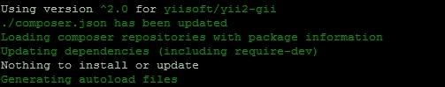

### 小贴士

由于 Gii 是一个开发工具，并且具有向我们的应用程序写入新代码的能力，因此我们应该使用`--dev`标志，以便 Composer 将其添加到`composer.json`文件的`require-dev`部分。通常，在我们的部署过程中，我们将使用`--no-dev`标志，以确保开发包不会被部署到我们的生产环境中。

安装 Gii 后，我们现在需要配置它，使其既能与 Yii2 控制台协同工作，也能在我们的 Web 浏览器中运行。

## Gii 用于 Web 应用程序

要启用 Gii 的 Web 界面，我们需要在`config/web.php`配置文件中的`module`部分指定，并引导 Gii 模块，以确保它正确加载：

```php
return [
    'bootstrap' => ['gii'],
    'modules' => [
        'gii' => [
                'class'        => 'yii\gii\Module', 
                'allowedIPs'   => ['*']
        ]
        // [...]
    ],
    // [...]
];
```

### 小贴士

默认情况下，Gii 仅在您的机器的 loopback 接口上可用。如果您正在使用远程开发服务器或虚拟机，您需要将您的宿主 IP 地址添加到`allowedIPs`块中，或者将`allowedIPs`块设置为通配符字符`*`，以便授予您的计算机访问 Gii 的权限。

虽然这个基本配置可以正确加载 Gii 模块，但它并不遵循我们关于环境感知的约定。例如，如果我们带着这个配置进入生产环境，并使用前面描述的`composer install --no-dev`进行部署，那么我们的应用程序将会崩溃，因为 Composer 没有在我们的 vendor 文件夹中安装 Gii 模块。

幸运的是，因为我们之前在我们的引导文件中定义了 `APPLICATION_ENV` 常量而不是返回包含我们的配置文件的静态数组，我们可以将配置存储为变量，并根据我们正在工作的环境有条件地修改它以包含 Gii 模块：

```php
<?php

$config = [
    'id' => 'basic',
    'basePath' => dirname(__DIR__),
    'bootstrap' => ['log'],
    'components' => [
        'request' => [
            'cookieValidationKey' => '<random_key>',
        ],
        'cache' => [
            'class' => 'yii\caching\FileCache',
        ],
        'user' => [
            'identityClass' => 'app\models\User',
            'enableAutoLogin' => true,
        ],
        'errorHandler' => [
            'errorAction' => 'site/error',
        ],
        'log' => [
            'traceLevel' => YII_DEBUG ? 3 : 0,
            'targets' => [
                [
                    'class' => 'yii\log\FileTarget',
                    'levels' => ['error', 'warning'],
                ],
            ],
        ],
        'db' => require(__DIR__ . '/db.php'),
    ],
    'params' => require(__DIR__ . '/params.php'),
];

if (APPLICATION_ENV == "dev")
{
    $config['bootstrap'][] = 'gii';
    $config['modules'] = [
        'gii' => [
            'class' => 'yii\gii\Module',
            'allowedIPs' => ['*']
        ]
    ];
}

return $config;

```

### 小贴士

作为 `APPLICATION_ENV` 的替代方案，您可以使用通常在您的引导文件中定义的 `YII_ENV_DEV` 常量有条件地加载 Gii：

```php
if (YII_ENV_DEV) // YII_ENV_DEV = true. Define in ./yii
{                // to enable this constant
    $config['bootstrap'][] = 'gii';
    $config['modules'] = [
        'gii' => 'yii\gii\Module'  
    ];
}
```

对于我们的配置文件，使用任一常量都是合适的。然而，大多数开发者发现，允许他们的 Web 服务器或命令行定义 `APPLICATION_ENV` 常量比手动管理 `YII_ENV_DEV` 常量需要更少的维护。

现在可以通过在 Web 浏览器中导航到我们的应用程序路径并将 URI 更改为 `/index.php?r=gii` 来访问 Gii。

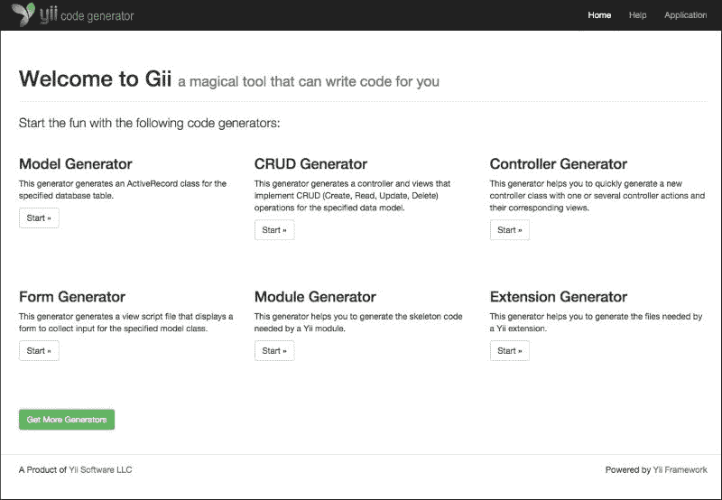

### 小贴士

如果您已经为您的应用程序启用了美观的 URL，可以通过导航到 `/gii` 端点来访问 Gii。

## 控制台应用的 Gii

与 Yii1 不同，Yii2 的 Gii 提供了一个新的命令行界面来与 Gii 一起工作。在 Yii2 中，我们现在可以从命令行界面生成活动记录模型、表单甚至扩展的源代码。

启用 Gii 的最简单方法是将我们的 `config/console.php` 文件修改为在配置文件的 `module` 部分包含 Gii 模块，然后启动 Gii 模块本身，如下所示：

```php
return [
    'bootstrap' => ['gii'],
    'modules' => [
        'gii' => 'yii\gii\Module',
        // [...]
    ],
    // [...]
];
```

与我们的 Web 应用程序一样，这种基本配置并不能确保我们的应用程序在所有环境中都能正常工作。我们可以以与我们的 Web 配置文件相同的方式重新配置我们的 `config/console.php` 文件，以确保 Gii 模块仅在开发环境中加载：

```php
<?php

Yii::setAlias('@tests', dirname(__DIR__) . '/tests');

$config = [
    'id' => 'basic-console',
    'basePath' => dirname(__DIR__),
    'bootstrap' => ['log'],
    'controllerNamespace' => 'app\commands',
    'components' => [
        'cache' => [
            'class' => 'yii\caching\FileCache',
        ],
        'log' => [
            'targets' => [
                [
                    'class' => 'yii\log\FileTarget',
                    'levels' => ['error', 'warning'],
                ],
            ],
        ],
        'db' => require(__DIR__ . '/db.php'),
    ],
    'params' => require(__DIR__ . '/params.php'),
];

if (APPLICATION_ENV == "dev")
{
    $config['bootstrap'][] = 'gii';
    $config['modules'] = [
        'gii' => 'yii\gii\Module'
    ];
}

return $config;

```

如前一个代码块所示，如果不需要在我们的模块中注册其他选项，我们可以使用更短的语法来加载配置文件的 `module` 部分，这通常是加载模块的首选方式：

```php
$config['modules'] = [
    'gii' => 'yii\gii\Module'
];
```

在配置我们的控制台环境后，现在我们可以通过在 `./yii` 命令中调用帮助命令来从命令行运行 Gii：

```php
$ ./yii help gii

```

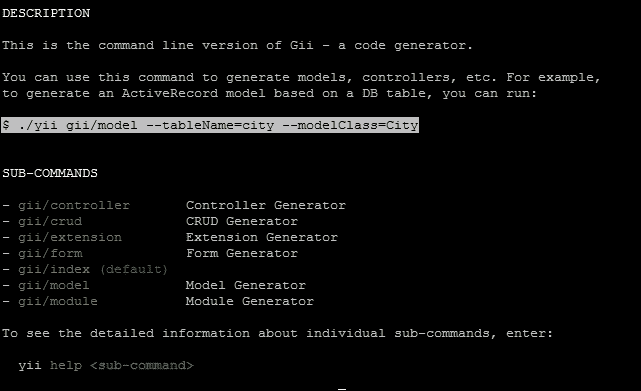

在配置我们的控制台应用程序使用 Gii 后，我们现在可以使用 Gii 工具来创建代码。在我们继续本章的其余部分时，我们将介绍如何从 Web 界面以及控制台界面使用 Gii。

# 活动记录

在构建丰富的 Web 应用程序时，最重要的任务之一是确保我们在代码中正确地建模和表示我们的数据。从简单的博客网站到像 Twitter 这样的大型应用程序，数据建模和表示对于确保我们的应用程序易于使用并且可以按需扩展至关重要。为了帮助我们建模数据，Yii2 实现了活动记录模式，也称为 `yii/db/ActiveRecord` 类中的活动记录。

## 活动记录模式

由马丁·福勒在他的 2003 年出版的《企业应用架构模式》一书中命名，Active Record 模式是一种 **对象关系映射**（ORM）模式，用于在对象中表示数据库行和列。在 Active Record 模式中，每个数据库列都由一个单独的 Active Record 类表示。实例化后，该对象提供了一个简单的接口来管理我们代码中的单个行或行集合。可以创建新行，删除旧行，以及更新现有行——所有这些都在一个简单且一致的 API 中完成。Active Record 还使我们能够以编程方式引用和交互相关数据，这些数据通常由外键关系在我们的数据库中表示。

在 Yii2 中，Active Record 由 `yii/db/ActiveRecord` 类实现，通常被认为是表示和操作数据库中数据的首选类。虽然许多框架和 ORM 只为关系数据库实现 Active Record，但 Yii2 还为搜索工具（如 Sphinx 和 ElasticSearch）以及 NoSQL 数据库（如 Redis 和 MongoDB）实现了 Active Record。在本节中，我们将介绍如何创建新的 Active Record 类，如何在我们的代码中实现它们，以及一些与 Active Record 一起工作的常见陷阱。

在我们开始使用 Active Record 之前，我们首先需要创建一些我们可以工作的表。本章的项目资源中包含一个基础迁移，它将创建几个新表并将一些示例数据填充到它们中：

```php
$ ./yii migrate/up –interactive=0

```


运行迁移后，您可以通过从 sqlite3 工具运行 `.schema` 命令来验证以下模式是否存在于我们的数据库中。

## 创建 Active Record 类

要在 Yii2 中开始使用 Active Record，我们首先需要在我们的应用程序中声明一个 `yii/db/ActiveRecord` 的实例。由于 Yii2 中的 Active Record 实例是从 `yii/base/Model` 类扩展出来的，并且被视为模型，因此我们通常将它们存储在我们的应用程序的 `models/` 目录下，并在 `app/models` 命名空间下。

### 注意

在 Yii2 中，`@app` 是一个预定义的别名，它指向我们的应用程序基本路径。因此，我们应用程序中声明的任何命名空间通常采用 `app<文件夹>` 的形式，这使得 Yii2 的内置自动加载器能够自动引用在 `/文件夹/ClassName.php` 中找到的类。如果我们想的话，我们可以声明额外的别名，例如 `@frontend` 和 `@backend`，将我们的应用程序划分为不同的部分，这将使我们能够在不同的命名空间中创建多个 Active Record 实例。

在本章中，为了保持简单，我们只声明位于 `app\models` 命名空间内的那些 Active Record 类。

为了说明一个例子，让我们为我们在 第三章 中创建的 `user` 表创建一个 Active Record 类，*迁移、DAO 和查询构建*：

1.  首先，我们需要在我们的应用程序的 `models/` 目录中创建一个新文件，命名为 `User.php`：

    ```php
    touch models/User.php

    ```

1.  接下来，我们需要声明 Active Record 实例将存在的命名空间，并扩展 `yii/db/ActiveRecord` 类：

    ```php
    <?php

    namespace app\models;

    use yii\db\ActiveRecord;

    class User extends ActiveRecord {}
    ```

1.  最后，我们需要在我们的类中实现静态方法 `tableName()`，它定义了我们的 Active Record 模型将使用的表名。由于我们的 Active Record 模型将使用 `user` 表，我们将定义此方法如下：

    ```php
    /**
     * @return string    the string name of the database table
     */
    public static function tableName()
    {
        return 'user';
    }
    ```

### 使用 Gii 创建活动记录类

虽然我们可以手动创建 Active Record 实例，但通常我们希望使用 Gii 来为我们创建这些类。使用 Gii 创建我们的 Active Record 类有几个优点：除了创建类之外，它还会为我们的字段创建属性标签，根据我们的数据库模式创建验证规则，并根据我们数据库的外键结构生成与另一个 Active Record 类的模型关系。

#### 使用 Gii 的网页界面

与 Yii1 类似，Gii 提供了一个友好且易于使用的网页界面来创建我们的 Active Record 实例。要开始使用 Gii，请导航到我们应用程序的 `/gii` 端点，并在 **模型生成器** 部分下点击 **开始** 按钮。


从这个页面，我们可以根据我们的数据库模式生成 Active Record 类。例如，让我们为我们的 `user` 表创建一个 active record 实例：

1.  首先，我们需要在数据库中的 `user` 表的名称字段中填写 `user`，这是我们的数据库中 `user` 表的名称。随着你输入，Gii 将尝试显示与我们的文本输入匹配的可能数据库表，这在处理大型数据库时非常有用。

1.  接下来，我们需要按键盘上的 *Tab* 键，或者将鼠标焦点放在 `模型名称` 字段上，该字段应自动填充为 `User`，这将是我们将生成的类的名称。

1.  然后，我们需要确保选中 **生成关系** 复选框。这将自动将所需的代码添加到我们的类中，以便为我们在下一节中创建的 `Post` 和 `Role` 类生成模型关系。在选中此框后，我们的表单应填写如下：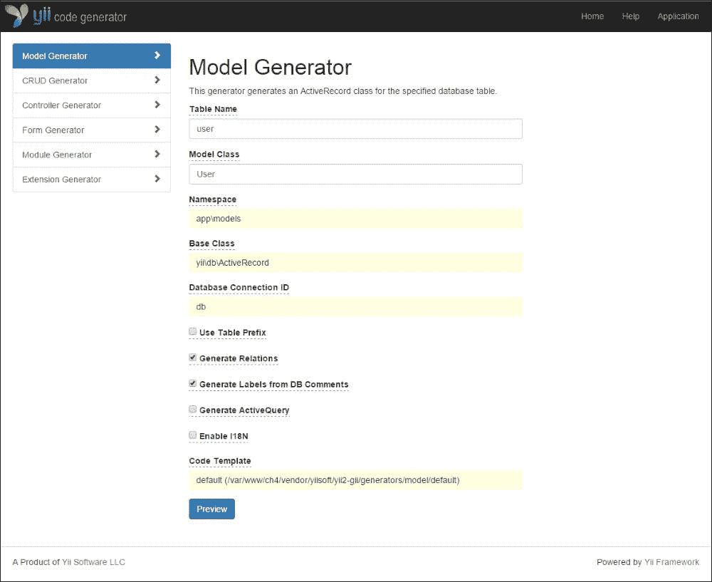

1.  然后，我们可以在页面底部的 **预览** 按钮上点击，这将允许我们在确认创建我们的类之前预览 Gii 将为我们生成的代码。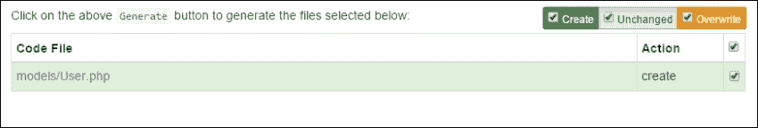

1.  在预览了类之后，我们可以点击 **生成** 按钮来生成我们的 `User` 类，该类将位于 `models/User.php`。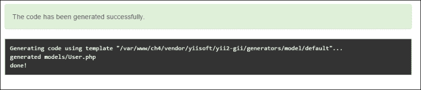

### 小贴士

为了为我们创建新的类，运行我们服务器的网络用户需要对我们`models/`目录有写权限。如果 Gii 返回错误，表明它无法写入`models/`目录，您需要调整目录的权限。在我们的 Linux 环境中，这可以通过将`www-data`组添加到文件夹并调整权限，使用户能够写入它来完成：

```php
chown –R <me>:www-data /path/to/models/
chmod –R 764 /path/to/models/

```

作为一种替代方案，您可以使用`chmod`工具调整`models/`目录的权限为`777`。只需确保在使用 Gii 创建模型后，将权限重新调整到一个更合理的值。

默认情况下，Gii 被配置为将新模型添加到我们应用程序的`models/`文件夹中，并在`app/models`命名空间下创建模型。此外，`yii/db/ActiveRecord`类被配置为自动使用我们应用程序的`db`组件。所有这些字段都可以在 Gii 网页界面中配置，以便我们进行更改。

#### 使用 Gii 的命令行界面

作为 Gii 网页界面的替代方案，Gii 可以从命令行生成 Active Record 类。当从命令行运行 Gii 时，我们只需提供两个属性：我们正在处理的表名和模型名。这具有以下形式：

```php
./yii gii/model --tableName=<tablename> --modelClass=<ModelName>

```

例如，我们可以通过运行以下命令创建我们的帖子表类：

```php
./yii gii/model --tableName=post --modelClass=Post

```

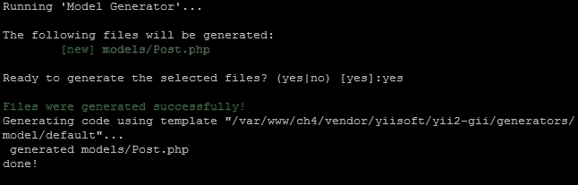

当我们在这里时，让我们也为我们`role`表创建一个类：

```php
./yii gii/model --tableName=role --modelClass=Role

```

## 与 Active Record 一起工作

现在我们已经生成了模型，让我们看看 Gii 实际上写入磁盘的内容。我们将首先打开`models/User.php`，它应该与以下代码块相同：

```php
<?php

namespace app\models;

use Yii;

/**
 * This is the model class for table "user".
 *
 * @property integer $id
 * @property string  $email
 * @property string  $password
 * @property string  $first_name
 * @property string  $last_name
 * @property integer $role_id
 * @property integer $created_at
 * @property integer $updated_at
 *
 * @property Post[] $posts
 * @property Role $role
 */
class User extends \yii\db\ActiveRecord
{
    /**
     * @inheritdoc
     */
    public static function tableName()
    {
        return 'user';
    }

    /**
     * @inheritdoc
     */
    public function rules()
    {
        return [
            [['email', 'password'], 'required'],
            [['role_id', 'created_at', 'updated_at'], 'integer'],
            [['email', 'password', 'first_name', 'last_name'], 'string', 'max' => 255],
            [['email'], 'unique']
        ];
    }

    /**
     * @inheritdoc
     */
    public function attributeLabels()
    {
        return [
            'id'            => 'ID',
            'email'         => 'Email',
            'password'      => 'Password',
            'first_name'    => 'First Name',
            'last_name'     => 'Last Name',
            'role_id'       => 'Role ID',
            'created_at'    => 'Created At',
            'updated_at'    => 'Updated At',
        ];
    }

    /**
     * @return \yii\db\ActiveQuery
     */
    public function getPosts()
    {
        return $this->hasMany(Post::className(), ['author_id' => 'id']);
    }

    /**
     * @return \yii\db\ActiveQuery
     */
    public function getRole()
    {
        return $this->hasOne(Role::className(), ['id' => 'role_id']);
    }
}
```

### 模型验证规则

在我们生成的 Active Record 类中，我们应该注意的第一个部分是`rules()`方法，这是 Gii 为我们生成的。由于`yii/db/ActiveRecord`扩展了`yii/base/Model`，它继承了`yii/base/Model`所有的验证逻辑和工具：

```php
public function rules()
{
    return [
        [['email', 'password'], 'required'],
        [['role_id', 'created_at', 'updated_at'], 'integer'],
        [['email', 'password', 'first_name', 'last_name'], 'string', 'max' => 255],
        [['email'], 'unique']
    ];
}
```

当 Gii 创建我们的模型时，它扫描我们的数据库模式以确定任何我们认为默认需要的验证规则。如前一个代码块所示，它已将`email`和`password`属性标记为`required`，将`email`字段标记为`unique`，并且正确地识别了我们的名称字段以及时间戳的适当数据类型。

Yii 中的`rules()`方法包含一个验证规则数组，其格式如下：

```php
[
    // Specifies which attributes should be validated, REQUIRED
    ['attr', 'attr2', ...],

    // Specifies the validator to be used, REQUIRED
    // Can be either a built in core validator, 
 // a custom validator method name, or a validator alias
    'validator',

    // Specifies the scenarios that the validator should 
 // run on, OPTIONAL
    'on' => ['scenario1', 'scenario2', ...],

    // Specifies additional properties to be passed 
 // to the validator, OPTIONAL
    'property1' => 'value1', 'property2' => 'value2'
]
```

### 小贴士

内置验证器的完整列表可以在 Yii2 指南中找到，网址为[`www.yiiframework.com/doc-2.0/guide-tutorial-core-validators.html`](http://www.yiiframework.com/doc-2.0/guide-tutorial-core-validators.html)。

### 添加自定义验证器

除了 Yii2 内置的许多核心验证器外，我们可能还需要为我们自己的类编写自定义验证器。自定义验证器可以是使用匿名函数编写的内联代码，也可以是在我们的类中作为单独的方法编写的。

例如，假设我们只想在业务的核心时段允许更改我们的用户信息。作为一个匿名函数，这可以写成如下：

```php
public function rules()
{
    return [
        // [... other validators ..],

        // an inline validator defined as an anonymous function
        ['email', function ($attribute, $params) {
                $currentTime = strtotime('now');
                $openTime    = strtotime('9:00');
                $closeTime   = strtotime('17:00');

                if ($currentTime > $openTime && $currentTime < $closeTime)
                    return true;
                else
                     $this->addError('email', 'The user\'s email address can only be changed between 9 AM and 5 PM');
        }],
    ];
}
```

或者，我们可以通过提供一个验证器的名称来将其作为单独的方法编写，然后在我们的类中使用该名称作为方法：

```php
public function rules()
{
    return [
        // [... other validators ..],

        // a custom validator
        ['email', 'validateTime']
    ];
}

public function validateTime($attributes, $params)
{
    $currentTime = strtotime('now');
    $openTime = strtotime('9:00');
    $closeTime = strtotime('17:00');

    if ($currentTime > $openTime && $currentTime < $closeTime)
        return true;
    else
        $this->addError('email', 'The user\'s email address can only be changed between 9 AM and 5 PM');
}
```

此外，可以通过创建和扩展 `yii\validators\Validator` 类，并在该类中实现 `validateAttribute($model, $attribute)` 方法来编写自定义验证器：

```php
// app/models/User.php::rules()
public function rules()
{
    return [
        // [... other validators ..],

        // a custom validator
        ['email', 'EditableTime']
    ];
}

// app/components/EditableTimeValidator.php
<?php

namespace app\components;

use yii\validators\Validator;

class EditableTimeValidator extends Validator
{
    public function validateAttribute($model, $attribute)
    {
        $currentTime = strtotime('now');
        $openTime = strtotime('9:00');
        $closeTime = strtotime('17:00');

        if ($currentTime > $openTime && $currentTime < $closeTime)
            return true;
        else
            $this->addError($model, $attribute, 'The user\'s email address can only be changed between 9 AM and 5 PM');
        }
    }
}
```

### 自定义验证器错误消息

几乎所有的 Yii2 验证器都自带内置的错误消息。然而，如果我们想更改特定属性的错误消息，我们可以通过为特定验证器指定消息参数来实现。例如，我们可以通过更改验证器的最后一行来调整我们唯一验证器的错误消息，如下所示：

```php
[['email'], 'unique', 'That email address is already in use by another user!']
```

### 与验证错误一起工作

Yii2 提供了多种方式来交互和自定义错误，这些错误会在发生时出现。正如你可能在前面的示例中注意到的，我们可以使用 `yii/base/Model` 方法以及 `addError()` 在我们的工作流程中为模型属性添加新的错误。正如前一个示例所示，这通常采取以下形式：

```php
$this->addError($attribute, $message);
```

此外，我们可以使用 `getError()` 方法来检索我们模型的全部错误或特定属性的错误。此方法将返回一个包含适用于每个属性的错误消息数组的错误数组：

```php
[
    'email' => [
        'Email address is invalid.',
        'The user\'s email address can only be changed between 9 AM and 5 PM'
    ],
    'password' => [
        'Password is required.' 
    ],
]
```

### 手动执行验证规则

在 Yii2 中，验证规则是在调用 `yii/db/ActiveRecord` 上的 `validate()` 方法时执行的。虽然这可以在我们的控制器中手动完成，但通常是在 `save()` 方法执行之前执行的。验证器方法将返回 `true` 或 `false`，指示验证是否成功。

`validate()` 方法可以通过覆盖 `beforeValidate()` 和 `afterValidate()` 方法或监听 `yii\base\Model::EVENT_BEFORE_VALIDATE` 或 `yii\base\Model::EVENT_AFTER_VALIDATE` 事件来扩展。

### 小贴士

我们将在第八章路由、响应和事件中更详细地介绍事件。

### 模型属性标签

Gii 为我们自动实现的下一个方法是`attributeLabels()`方法。`attributesLabels()`方法使我们能够用更描述性的名称命名我们的模型属性，这些名称可以用作表单标签。默认情况下，Gii 会根据我们的列名自动为我们生成标签。此外，通过遵循在我们的`user`表中使用下划线的约定，Gii 已经自动为我们创建了标题化和可读的属性标签：

```php
public function attributeLabels()
{
    return [
        'id'            => 'ID',
        'email'         => 'Email',
        'password'      => 'Password',
        'first_name'    => 'First Name',
        'last_name'     => 'Last Name',
        'role_id'       => 'Role ID',
        'created_at'    => 'Created At',
        'updated_at'    => 'Updated At',
    ];
}
```

由于我们的`attributeLabels()`方法仅仅返回一个键值对数组，我们可以通过使用`\Yii::t()`方法将我们的属性标签翻译成多种语言来增强我们的应用程序：

```php
public function attributeLabels()
{
    return [
        'id'            => 'ID',
        'email'         => \Yii::t('app', 'Email'),
        // [ ... other attribute labels ... ]
    ];
}
```

假设我们的应用程序已经正确配置以使用翻译，我们可以使用`getAttributeLabel()`方法为我们的`email`属性获取翻译后的文本：

```php
$user->getAttributeLabel('email'); // returns "Email"
```

如果我们的应用程序配置为英语区域设置，它将简单地返回字符串`"Email"`；然而，如果我们的应用程序在不同的语言中运行，比如说西班牙语，这个方法将返回字符串`"Correo"`而不是`"Email"`。

### 小贴士

我们将在第十一章国际化与本地化中介绍`Yii::t()`方法以及一般化的国际化与本地化。

### Active Record 关系

假设我们已经正确配置了数据库模式，包括主键和外键，Yii2 也会为我们生成模型关系。与 Yii1 不同，Yii2 已经废弃了`relations()`方法，并用魔法`__getter()`方法取代了它们。我们的`User`模型展示了`Post`和`Role`关系：

```php
/**
 * @return \yii\db\ActiveQuery
 */
public function getPosts()
{
    return $this->hasMany(Post::className(), ['author_id' => 'id']);
}

/**
 * @return \yii\db\ActiveQuery
 */
public function getRole()
{
    return $this->hasOne(Role::className(), ['id' => 'role_id']);
}
```

Yii2 也简化了关系方法，现在它只支持两种类型的关系：由`hasOne()`方法使用的单对一关系，以及由`hasMany()`方法定义的多对一关系。尽管如此，与 Yii1 一样，可以通过简单地调用`__getter()`方法来访问相关数据。例如，如果我们想获取我们正在处理的一个用户的角色名称，我们可以简单地执行以下操作：

```php
$user = new User::findOne(4);  // Fetch a user in our db
echo $user->role->name;    // "Admin"
```

### 小贴士

Gii 根据你的数据库模式做出几个推断来创建模型关系。在执行代码之前，请检查你的关系是否映射到正确的类，并且具有正确的关联类型。

### 使用 Active Record 的多数据库连接

默认情况下，所有活动记录实例都将使用`db`组件连接到我们的数据库。在我们有多个数据库连接到我们的应用程序的情况下，我们可以通过在 Active Record 类中定义静态方法`getDb()`来配置活动记录以使用备用数据库：

```php
public static function getDb()
{
    // the "db2" component
    return \Yii::$app->db2;
}
```

### Active Record 中的行为

Yii2 支持多种行为，这些行为可以用来自动处理模型管理中的一些更繁琐的任务，例如管理创建和更新时间、自动为我们的应用程序创建 URL 拼接，以及记录哪个用户创建了特定记录。

要在 Yii2 中使用行为，我们只需在 PHP 文件顶部指定我们想要使用的行为类，然后将行为添加到模型的 `behaviors()` 方法中。例如，由于我们的 `User` 和 `Post` 类都有 `created_at` 和 `updated_at` 属性，我们可以添加以下内容，让 Yii2 为我们管理这些属性：

```php
<?php

use Yii;
use yii\behaviors\TimestampBehavior
class User extends yii\db\ActiveRecord
{
    /** 
     * Allow yii to handle population of
     * created_at and updated_at time
     */
    public function behaviors()
    {   
            return [
                TimestampBehavior::className(),
            ];  
    }
    // [... other methods ...]
}
```

默认情况下，`yii\behaviors\TimestampBehavior` 类将使用从原生 PHP `time()` 函数提取的当前时间填充 `created_at` 和 `updated_at` 属性。像 Yii2 中的大多数事情一样，这是完全可配置的。例如，如果我们的数据库中创建了使用 MySQL `TIMESTAMP` 列类型的创建和更新字段，我们可以按以下方式调整行为：

```php
public function behaviors()
{
    return [
        [
            'class' => TimestampBehavior::className(),
            'createdAtAttribute' => 'created',
            'updatedAtAttribute' => 'updated',
            'value' => new \yii\db\Expression('NOW()'),
        ],
    ];
}
```

### 小贴士

更多关于行为的信息可以在位于 [`www.yiiframework.com/doc-2.0/guide-concept-behaviors.html`](http://www.yiiframework.com/doc-2.0/guide-concept-behaviors.html) 的 Yii2 指南中找到。

## 使用 Active Record

现在我们已经了解了 Gii 在创建新的 Active Record 类时为我们自动提供了什么，以及我们可以向我们的类添加哪些附加选项来增强它们，让我们看看我们如何可以使用 Active Record 实例来执行基本的创建、读取、更新和删除（CRUD）操作。

### 查询数据

要使用 Active Record 查询数据，我们可以使用 `yii/db/ActiveRecord::find()` 方法来查询数据，这将返回一个 `yii/db/ActiveQuery` 实例。由于 `yii/db/ActiveQuery` 扩展了 `yii/db/Query`，我们可以利用我们在 第三章 中学习到的几乎所有方法和查询对象，即 *迁移、DAO 和查询构建*。让我们看看使用 `yii/db/ActiveRecord::find()` 方法的几个不同示例。

```php
// Find the user in our database with the ID of 1\. 
// one() returns an instance of User model, for the user with id=1
$user = User::find()->where(['id' => 1])
                    ->one();

// Find all users in our database and order them by ID
// Returns an array of User objects
$users = User::find()->orderBy('id'])
                     ->all();

// Returns the number of users in our database
$userCount = User::find()->count();
```

作为 `yii/db/ActiveQuery` 的替代方案，`yii/db/ActiveRecord` 还提供了两个额外的查询数据方法，`findOne()`，它将返回查询的第一个 Active Record 实例，以及 `findAll()`，它将返回 Active Record 实例的数组。这两个方法都接受一个标量参数、一个标量参数数组或一个关联对数组来查询数据：

```php
// Fetches user with the ID of 1
User::findOne(1);

// Fetches users with the ID of 1, 2, 3, and 4
User::findAll([1, 2, 3, 4]);

// Fetches admin users (role_id = 2 from migration)
// with the last name of Doe
User::findOne([
    'role_id' => 2,
    'last_name' => 'Doe'
]);

// Retrieves users with the last name of Doe
User::findAll([
    'last_name' => 'Doe'
]);
```

### 注意

`yii/db/ActiveRecord::findOne()` 方法不会将 `LIMIT 1` 添加到生成的 SQL 查询中，这可能会导致查询运行时间更长，因为 `yii/db/ActiveRecord::findOne()` 将简单地从查询结果中获取第一行。如果您在使用 `yii/db/ActiveRecord::findOne()` 时遇到性能问题，请尝试使用 `yii/db/Activequery::find()` 方法，并配合 `limit()` 和 `one()` 方法，如下所示：

```php
User::find()->limit(1)->one();
```

有时使用`yii/db/ActiveQuery`可能会非常消耗内存，这取决于正在访问的记录数量。绕过这种限制的一种方法是将我们的结果数据转换为数组格式，使用`asArray()`方法：

```php
$users = User::find()->asArray()
                     ->all();
```

与返回 Active Record 实例的数组相比，`asArray()`方法将返回包含 Active Record 数据属性的数组数组。

### 小贴士

虽然`asArray()`方法可以用来提高大型查询的性能，但它有几个缺点。返回的数据将不是 Active Record 的实例，因此它将没有与之相关的任何方法或有用的属性。此外，由于数据是直接从 PDO 返回的，数据将不会自动类型转换，而是以字符串的形式返回。

#### 数据访问

当使用 Active Record 时，数据库查询的每一行都会生成一个 Active Record 实例。Active Record 实例的列值可以通过该 Active Record 实例的模型属性来访问：

```php
$user = User::findOne(1);
echo $user->first_name; // "Jane"
echo $user->last_name; // "Doe"
```

此外，可以通过相关对象的属性访问关系信息。例如，要从给定的帖子中检索作者的姓名，我们可以运行以下代码：

```php
$post = Post::findOne(1);
echo $post->id; // "1"

// "Site Administrator"
echo $post->author->first_name . ' ' . $post->author->last_name;
```

### 注意

Active Record 属性以列名命名。如果您不希望 Active Record 属性包含下划线，不符合您的编码风格，您应该重命名您的列名。

我们的数据也可以通过在 Active Record 类中创建自定义获取器和设置器方法来操作。例如，如果我们想显示用户的完整姓名而不更改我们的数据库模式，我们可以在我们的 User Active Record 类中添加以下方法：

```php
/**
 * Returns the user's full name
 * @return string
 */
public function getFullName()
{
    return $this->first_name . ' ' . $this->last_name;
}
```

然后，可以直接通过`getFullName()`方法或作为伪属性直接访问这些数据：

```php
$user = User::findOne(1);
echo $user->fullName;      // "Jane Doe"
echo $user->getFullName(); // "Jane Doe"
```

同样地，我们也可以创建自定义设置器。例如，以下方法接受用户的完整姓名作为输入，并为我们填充`first_name`和`last_name`属性：

```php
/**
 * Set the users first and last name from a single variable
 * @param boolean
 */
public function setFullName($name)
{
    list($firstName, $lastName) = explode(" ", $name);
    $this->first_name = $firstName;
    $this->last_name = $lastName;

    return true;
}
```

然后，我们的设置器使我们能够将用户的完整姓名视为可设置的属性：

```php
$user = User::findOne(1);
$user->fullName = 'Janice Doe'; // or $user->setfullName('Janice Doe');
echo $user->first_name; // "Janice"
echo $user->last_name;  // "Doe"
```

### 保存数据

一旦我们对 Active Record 实例进行了更改，我们可以通过在实例上调用`save()`方法来将这些更改保存到数据库中，如果模型成功保存到数据库中，它将返回`true`，如果发生错误，它将返回`false`。

```php
$user = User::findOne(1);
$user->first_name = "Janice";
$user->last_name = "Doe";
$user->save();
```

### 小贴士

如果在保存或验证过程中发生错误，您可以通过`yii/db/ActiveRecord::getErrors()`方法检索错误。

如果我们再次从数据库中检索用户信息，我们会看到结果被存储：

```php
$user = User::findOne(1);
echo $user->first_name; // "Janice"
echo $user->last_name;  // "Doe"
```

数据也可以通过`yii/db/ActiveRecord::load()`方法批量分配。通常当使用`load()`方法时，我们会提供来自表单提交的数据，我们将在本章后面介绍。

```php
$user = User::findOne(1);
$user->load(\Yii::$app->request->post());
$user->save(); 
```

### 小贴士

`\Yii::$app->request` 表示请求对象，并在我们的 `config/web.php` 文件中进行配置。`post()` 方法表示通过 `POST` 请求提交的任何数据。

#### 创建新记录

在我们的数据库中创建新记录可以通过使用 `new` 关键字实例化一个活动记录类的实例，用数据填充模型，然后在模型上调用 `save()` 方法来完成。

```php
$user = new User;
$user->load(\Yii::$app->request->post());
/**
    $user->attributes = [
        'first_name' => 'Janice',
        'last_name'  => 'Doe',
        // ... and so forth
    ];
*/
$user->save();
```

### 删除数据

也可以通过在模型上调用 `delete()` 方法从我们的数据库中删除数据。`delete()` 方法将从数据库中永久删除数据，并在删除成功时返回 `true`，如果发生错误则返回 `false`。

```php
$user = User::findOne(1);
$user->delete(); // return true;
```

可以通过调用 `yii/db/ActiveRecord::deleteAll()` 静态方法来删除多行数据：

```php
Post::deleteAll(['author_id' => 4]);
```

### 小贴士

使用 `deleteAll()` 方法时要小心，因为它将永久删除任何由条件语句指定的数据。条件语句中的错误可能导致整个表被截断。

### Active Record 事件

作为创建 `beforeSave()` 和 `afterDelete()` 等前后方法处理程序的替代方案，Yii2 支持我们的应用程序可以监听的不同事件。Active Record 支持的事件在以下表中概述：

| 事件 | 描述 |
| --- | --- |
| `EVENT_INIT` | 当通过 `init()` 方法初始化 Active Record 实例时触发的事件 |
| `EVENT_BEFORE_UPDATE` | 在记录被更新之前触发的事件 |
| `EVENT_BEFORE_INSERT` | 在记录被插入之前触发的事件 |
| `EVENT_BEFORE_DELETE` | 在记录被删除之前触发的事件 |
| `EVENT_AFTER_UPDATE` | 在记录被修改后触发的事件 |
| `EVENT_AFTER_INSERT` | 在记录被插入后触发的事件 |
| `EVENT_AFTER_DELETE` | 在记录被删除后触发的事件 |
| `EVENT_AFTER_FIND` | 在记录被创建并用查询结果填充后触发的事件 |

### 小贴士

我们将在第八章（Chapter 8）中介绍事件的确切含义以及如何使用它们，*路由、响应和事件*。

# 模型

在 Yii1 中，基础模型和表单模型是两个分离的类（`CModel` 和 `CFormModel`）。在 Yii2 中，这两个类已经被合并为一个单一的类，`yii/base/Model`。这个类在 Yii2 中用于数据表示，并且当我们无法使用 `yii/db/ActiveRecord` 表示数据时，它应该是我们的首选类。

### 小贴士

由于 `yii/db/ActiveRecord` 扩展了 `yii/base/Model`，我们已经熟悉了 `yii/base/Model` 提供的大多数方法和属性，例如 `getAttributes()`、`rules()`、`attributeLabels()` 和 `getErrors()`。有关 `yii/base/Model` 支持的所有方法的完整列表，请参阅 Yii2 API 文档，链接为 [`www.yiiframework.com/doc-2.0/yii-base-model.html`](http://www.yiiframework.com/doc-2.0/yii-base-model.html)。

## 模型属性

在 `yii/db/ActiveRecord` 中，数据属性和属性名称直接从我们的数据库列名称中获取。在 `yii/base/Model` 中，数据属性和属性名称被定义为模型类中的公共属性。例如，如果我们想创建一个名为 `UserForm` 的模型来收集用户信息，我们可以编写以下类：

```php
<?php

use Yii;

class UserForm extends yii/base/Model
{
    public $email;
    public $password;
    public $name;
}
```

与活动记录实例不同，存储在基本模型中的信息不会被持久化。在类上调用 `unset()` 或创建该类的新实例不会授予用户访问其他模型实例中存储的数据的权限。由于我们的模型属性是 PHP 类的公共属性，我们可以像访问任何公共属性一样访问它们。

### 场景

当与模型或活动记录类一起工作时，我们可能希望在不同情况下重用相同的模型，例如登录用户或注册用户。为了帮助我们编写更少的代码，Yii2 提供了 `scenarios()` 方法来定义每个场景应执行哪些业务逻辑和验证规则。默认情况下，场景由我们的验证规则使用 `on` 属性确定：

```php
public function rules()
{
    return [
        [['email', 'password'], 'required'],
        [['email'], 'email'],
        [['email', 'password', 'name'], 'string', 'max' => 255],
        [['email', 'password'], 'required', 'on' => 'login'],
        [['email', 'password', 'name'], 'required', 'on' => 'register'],
    ];
}
```

这种行为可以通过覆盖 `scenarios()` 方法并使用我们的自定义逻辑来定制：

```php
public function scenarios()
{
    return [
        'login'    => ['email', 'password'],
        'register' => ['email', 'password', 'name']
    ];  
}
```

或者，如果我们想在模型中添加新的场景而不更改模型验证规则中定义的当前场景，我们可以通过获取类的父场景，添加我们想要添加的新场景，然后返回更新后的场景数组来简单地添加它们：

```php
public function scenarios()
{
    $scenarios = parent::scenarios();
    $scenarios['login'] = ['email', 'password'];
    $scenarios['register'] = ['email', 'password', 'name'];
    return $scenarios;
}
```

然后，我们可以在实例化我们的模型或定义模型在运行时的场景属性时控制哪个场景是活动的：

```php
// Instantiate a model with a specific scenario
$model = new UserForm(['scenario' => 'login']);

// Set scenario at runtime
$model = new UserForm;
$model->scenario = 'register';
```

### 小贴士

当在运行时或模型实例化期间未指定场景时，将使用默认场景。默认场景将所有模型属性标记为对大量赋值和模型验证都处于活动状态。

# 表单

在 Yii2 中，我们可以使用 `yii/widgets/ActiveForm` 类根据我们的模型动态生成丰富的 HTML5 表单。与手动管理表单相比，`yii/widgets/ActiveForm` 类具有多个优势。除了提供几个有用的辅助方法并与 HTML 辅助类 `yii/helpers/Html` 配合良好外，我们还可以使用 Gii 工具通过我们的模型数据生成表单。当与模型和活动记录实例一起工作时，这是生成表单的首选方式。

## 使用 Gii 生成表单

与 Active Record 类一样，表单可以从网络 Gii 工具和控制台 Gii 工具自动为我们生成。让我们看看如何生成一个用于身份验证的表单，我们将它称为 `LoginForm`，以及一个用于处理注册的表单，我们将它称为 `RegisterForm`。

### 使用 Gii 网络界面生成表单

对于我们的 `LoginForm` 表单，让我们首先通过导航到应用程序的 `/gii` 端点并点击 **表单生成器** 部分下方的 **开始** 按钮来打开 Gii 网络工具。

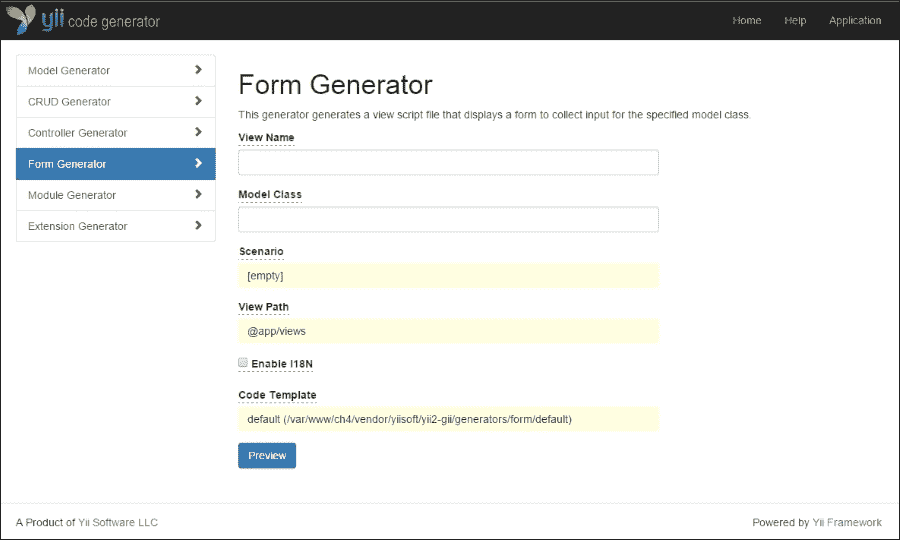

与我们的模型生成器一样，要生成表单，我们只需要提供一些字段。对于表单，我们只需要知道视图名称（它将转换为文件名）和模型类。对于我们的视图名称，让我们使用 `site/forms/LoginForm`，对于我们的模型类，我们可能想要使用我们之前生成的 `UserForm` 类。由于我们只想使用表单进行登录，我们还应该指定我们想要使用 *登录* 场景。

### 小贴士

当指定模型类时，我们需要指定命名空间和类名，以便 Yii 能够找到我们的类。对于我们的 `UserForm` 类，我们需要提供 `app\models\UserForm`。

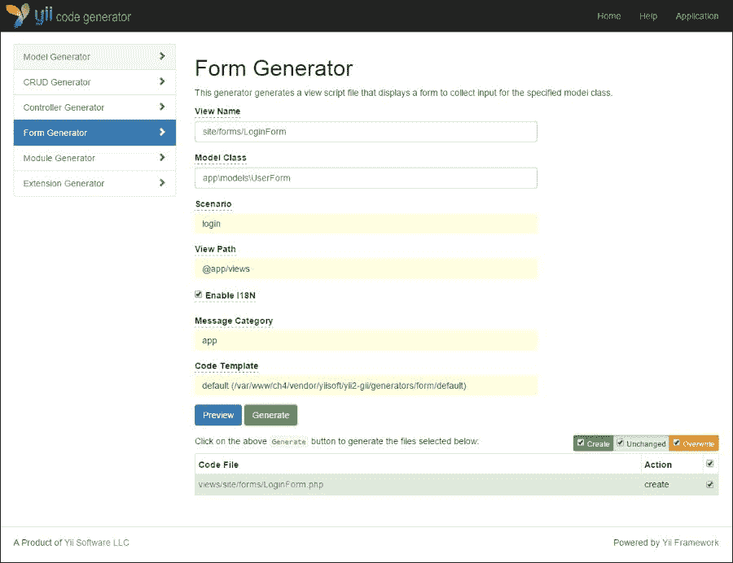

一旦我们指定了所有必要的属性，我们就可以点击 **预览** 按钮来预览我们的表单，然后我们可以点击 **生成** 按钮来生成源代码。


与我们的模型生成器不同，在生成后，我们的表单生成器还将为我们提供一个模板操作，我们可以将其放入我们的控制器中：

```php
<?php

// app\controllers\SiteController.php::actionLogin()
public function actionLogin()
{
    $model = new \app\models\UserForm(['scenario' => 'login']);

    if ($model->load(Yii::$app->request->post())) {
        if ($model->validate()) {
            // form inputs are valid, do something here
            return;
        }
    }

    return $this->render('LoginForm', [
        'model' => $model,
    ]);
}
```

### 使用 Gii 控制台界面生成表单

作为使用 Gii 网络界面生成表单的替代方案，我们还可以使用 Gii 的控制台界面为我们的模型类生成基本表单。要使用控制台界面生成表单，我们可以运行 `gii/form` 工具，如下例所示：

```php
./yii gii/form --modelClass=app\\models\\UserForm --viewName=site/forms/RegisterForm --scenarioName=register --enableI18N=1

```

### 小贴士

大多数控制台外壳将反斜杠字符视为转义字符。为了将反斜杠字符传递给 Gii，我们需要用第二个反斜杠转义反斜杠字符。

这是输出：

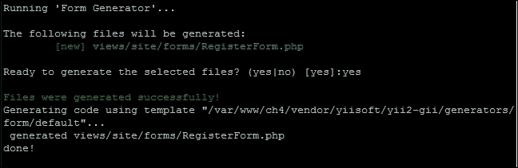

我们生成的 `RegisterForm` 视图将如下所示：

```php
<?php

use yii\helpers\Html;
use yii\widgets\ActiveForm;

/* @var $this yii\web\View */
/* @var $model app\models\UserForm */
/* @var $form ActiveForm */
?>
<div class="site-forms-RegisterForm">

    <?php $form = ActiveForm::begin(); ?>

        <?= $form->field($model, 'email') ?>
        <?= $form->field($model, 'password') ?>
        <?= $form->field($model, 'name') ?>

        <div class="form-group">
            <?= Html::submitButton(Yii::t('app', 'Submit'), ['class' => 'btn btn-primary']) ?>
        </div>
    <?php ActiveForm::end(); ?>

</div><!-- site-forms-RegisterForm -->
```

### 小贴士

记住，Gii 的控制台界面只提示你提供生成类所需的最基本信息。请记住使用 `help` 工具来发现其他命令行参数以进行额外定制。

## 使用表单

现在我们已经创建了表单，让我们简要地看看它们是如何工作的。如前所述，我们的 `yii\widgets\ActiveForm` 类期望有一个模型来与之一起工作。在大多数情况下，这将定义在我们的控制器中，然后传递到我们的视图中：

```php
$model = new app\models\UserForm(['scenario' => 'login']);
```

你可能会注意到我们生成的表单只包含核心表单逻辑，不包含额外的 HTML，例如 `html`、`head` 和 `body` 标签。在 Yii2 中，生成的表单旨在作为部分视图渲染，而不是完整视图。我们不是直接在我们的控制器中指定我们的表单 `LoginForm`，而是将我们的模型传递给父视图，然后该视图将渲染我们的表单。例如，我们控制器中的登录操作将更改为以下内容：

```php
// app\controllers\SiteController::actionLogin()
return $this->render('login', [
    'model' => $model,
]);
```

然后，我们将在 `views/site/login.php` 创建一个新的视图文件，该文件将渲染我们的 `LoginForm`：

```php
// views/site/login.php
<div class="site-login" style="margin-top: 100px";>
    <div class="body-content">
        <?php echo $this->render('forms/LoginForm', [ 'model' => $model ]); ?>
    </div>
</div>
```

### 小贴士

与 Yii1 不同，Yii2 没有用于渲染部分视图的 `renderPartial()` 方法。相反，它有两个独立的 `render()` 方法：一个在 `yii/base/Controller` 中，另一个在 `yii/base/View` 中。我们之前示例中调用的 `render()` 方法是从 `yii/base/View` 调用的，用于渲染任何视图文件，无论我们是否将其视为部分视图或完整视图。

如果我们导航到应用程序的 `site/login` 端点，我们的渲染链产生的视图将如下所示：

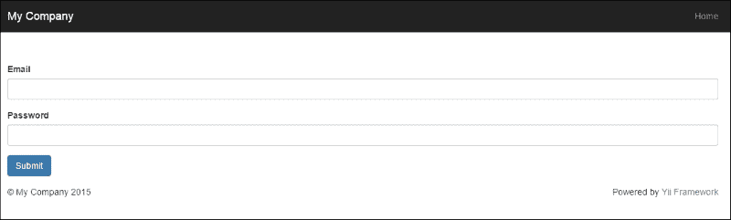

### 小贴士

第八章，*路由、响应和事件*，将帮助我们更好地理解 Yii2 中的路由工作原理以及我们如何轻松地找出哪些控制器操作与哪些视图操作匹配。

### ActiveForm 和输入类型

现在我们知道了如何渲染我们的表单，让我们分解我们的表单视图。由于在 Yii2 中视图文件和控制器是分开的，我们首先需要确保我们在视图文件中使用我们的活动表单类：

```php
<?php use yii\widgets\ActiveForm; ?>
```

我们的活动表单元素随后被包含在 `ActiveForm` 类的静态调用 `begin()` 和 `end()` 方法中。

```php
<?php $form = ActiveForm::begin(); ?>
<?php ActiveForm::end(); ?>
```

默认情况下，我们的 `begin()` 方法会为我们提供一些内置的 HTML 默认值，例如 ID 和类属性。要自定义这些，我们可以向 `begin()` 方法提供一个参数数组以手动指定这些属性：

```php
$form = ActiveForm::begin([
    'id' => 'login-form',
    'options' => [
'class' => 'form-horizontal'
 ]
]) ?>
```

我们需要注意的下一个关于我们的表单的事项是，模型属性被包裹在 `$form->field()` 的调用中：

```php
<?= $form->field($model, 'email') ?>
<?= $form->field($model, 'password') ?>
```

`field()` 方法是一个可链式方法，用于指定模型属性的 `<input>` 标签，添加一些基本的客户端验证（例如 `required` 属性），并在模型验证错误实例的 `POST` 提交中填充 `form` 字段。由于该方法可链式，我们可以将其他属性附加到我们的表单上。例如，如果我们想为我们的 `email` 字段添加客户端验证，以便我们的浏览器可以验证我们的文本字段是否为电子邮件地址，我们可以链式以下内容：

```php
<?= $form->field($model, 'email')->input('email') ?>
```

除了我们的必需验证器外，我们的视图现在还会验证我们的电子邮件是否为有效的电子邮件地址。

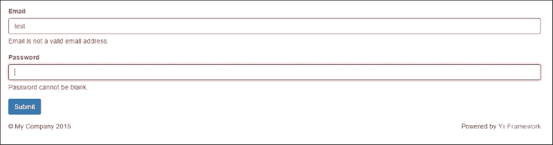

同样，我们可以自定义我们的 `password` 字段，通过指定该字段应为密码输入来遮挡我们的密码：

```php
<?= $form->field($model, 'password')->passwordInput() ?>
```

使用 `ActiveForm`，我们还可以使用 `hint()` 方法和 `label()` 方法为任何属性添加内联提示或修改标签：

```php
<?= $form->field($model, 'name')->textInput()->hint('Please enter your name')->label('Your Name') ?>
```

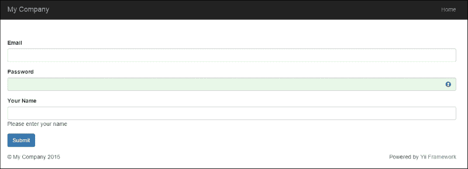

### 小贴士

虽然 `$form` 属性是 `yii/widgets/ActiveForm` 的一个实例，但 `field()` 方法返回的是 `yii/widgets/ActiveField` 的一个实例。有关 `yii/widgets/ActiveField` 所有的可用方法和选项的列表，请参阅 Yii2 文档中的[`www.yiiframework.com/doc-2.0/yii-widgets-activefield.html`](http://www.yiiframework.com/doc-2.0/yii-widgets-activefield.html)。

# 摘要

在本章中，我们涵盖了大量的信息！我们介绍了如何正确设置和配置 Gii，这是 Yii2 的代码生成工具。然后，我们介绍了如何使用 Gii 的网络和命令行界面自动创建基于我们数据库模式的 Active Record 类，以及我们可以绑定到我们的 Active Record 类的许多常见方法和属性，例如验证规则、属性标签和行为。接下来，我们介绍了如何创建不依赖于我们数据库的基本模型，以及如何向我们的模型和 Active Record 类添加场景。最后，我们介绍了如何使用 Gii 工具根据我们的模型创建 HTML 表单，并探讨了 `ActiveForm` 类附带的一些功能。

在下一章中，我们将扩展我们对 Yii2 所提供的可用帮助器和组件的了解。我们还将深入研究 Yii2 的模块，并探讨我们如何使用它们来创建可重用的自包含应用程序，这些应用程序将在整本书中不断构建。

随着我们继续前进，我们将基于我们迄今为止所获得的大部分知识进行构建。在继续前进之前，请确保您已经回顾了我们所学的类和信息。
