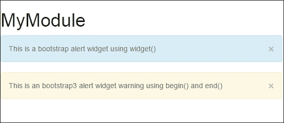

# 第五章：模块、小部件和辅助工具

与其前身一样，Yii2 提供了几个有用的工具和可重用的代码块，帮助我们快速开发应用程序，这些工具和代码块被称为小部件和辅助工具。Yii2 还为我们提供了构建和包含称为模块的迷你应用程序的能力，这使我们能够快速向应用程序添加新功能，同时在我们的主要应用程序和任何扩展功能中保持关注点的清晰分离。在本章中，我们将介绍在我们的应用程序中构建和使用模块的基本知识。我们还将介绍 Yii2 的一些内置小部件和辅助工具，并学习我们如何实现自己的定制小部件。

# 模块

在 Yii2 中，模块被视为包含完整 MVC 栈的迷你自包含软件包。当与应用程序配对时，模块通过在不向我们的主要代码库中添加代码的情况下添加新功能和工具，为扩展应用程序提供了一种方法。因此，模块是创建和重用代码的绝佳方式。在用 Yii2 创建应用程序时，你很可能会使用预构建的模型，例如 Gii 或 Yii2 开发模块；然而，模块也可以是专门为构建特定目的而创建的定制应用程序，用于在特定目的上构建和分离代码。在本节中，我们将介绍 Yii2 中的基本模块，以及如何在我们的应用程序中创建和实现它们。

## 模块组件

与 Yii1 相比，Yii2 中的模块变化不大。在核心上，它们仍然由相同的结构组成，并共享许多相同的思想。在 Yii2 中，模块存储在我们的应用程序根目录的`modules`目录中，并通过我们的网络或控制台配置文件与我们的应用程序注册。如果我们分解一个基本模块，其目录结构和核心文件如下：

```php
app/
    modules/
        mymodule/
            Module.php
            controllers/
                DefaultController.php
            models/
            views/
                layouts/
                default/
                    index.php
```

我们应用程序中注册的每个模块都位于其自己的专用模块文件夹中，该文件夹默认通过其对应的路由与我们的 URL 管理器注册（在本例中，`mymodule`文件夹将对应于`/mymodule` URI 路由）。因此，除非在 URL 管理器中另行注册，否则模块中的任何控制器都将作为模块本身的专用控制器路由可用。例如，`DefaultController.php`控制器将映射到我们模块的根路由（`/mymodule`），而任何其他控制器将映射到`/mymodule` URI 中的控制器名称。

此外，模块在 Yii2 中提供了对基本 MVC 架构的全面支持。每个模块可能都有自己的模型、视图、控制器，甚至组件。像完整的应用程序一样，模块也有自己的视图和布局的支持，允许它们以不同于我们的主要应用程序的方式被样式化和管理。作为 Yii2 应用程序的一部分，它们也完全访问我们主要应用程序中实现的模型和类。

### 模块类结构

模块最重要的部分是在我们模块根目录下的`Module.php`文件中定义的模块类。在最基本层面上，一个模块必须简单地扩展`yii\base\Module`类：

```php
<?php

namespace app\modules\mymodule;

class Module extends \yii\base\Module {}
```

然而，就像 Yii2 中的所有内容一样，模块可以通过覆盖我们类中的公共`init()`方法来定义它们自己的初始化代码和配置文件。至少，当我们覆盖这个方法时，我们想要确保调用父类`yii\base\Module`中的`init()`方法。

```php
public function init()
{
    parent::init();

    // Set custom parameters
    $this->params['a'] = 'b';

    // Register a custom Yii config for our module
    \Yii::configure($this, require __DIR__ . '/config/config.php');
}
```

我们还可以通过向`yii\base\Module::$params`数组中添加值来定义我们模块的附加自定义参数。此外，可以使用`Yii::configure()`静态方法将自定义配置注册到我们的模块中。这种配置可以是一个简单的键值对，也可以是一个完整的配置文件，例如我们在 Web 和控制台配置文件中使用的那些。

### 小贴士

可以在位于[`www.yiiframework.com/doc-2.0/guide-concept-configurations.html`](http://www.yiiframework.com/doc-2.0/guide-concept-configurations.html)的 Yii2 指南中详细了解 Yii2 的配置语法。

### 控制器

在一个模块中，控制器被放置在主模块的`controllers/`目录中，并且根据 Yii2 的约定，它们位于模块的命名空间中。例如，为了创建我们`mymodule`模块的默认控制器，我们会在`app/modules/mymodule/controllers/DefaultController.php`中添加以下内容：

```php
<?php

namespace app\modules\mymodule\controllers;

class DefaultController extends \yii\web\Controller
{
    public function actionIndex()
    {
        return $this->render('index');
    }
}
```

就像我们项目中的其他控制器一样，我们控制器中的默认操作是索引操作。由于我们模块中的控制器扩展了`yii\web\controller`，我们可以通过设置`yii\web\controller::$defaultAction`参数来调整我们的默认操作。

默认情况下，Yii2 会将`/mymodule` URI 路由路由到`DefaultController`类。但是，如果我们想改变这个设置，我们可以调整我们`Module`类的`$defaultRoute`参数。例如，如果我们有一个名为`UserController`的控制器来处理用户，我们可以使默认路由映射到我们的控制器，如下所示：

```php
<?php

namespace app\modules\mymodule;

class Module extends \yii\base\Module
{
    public $defaultRoute = 'user'; // user maps to UserController
}
```

因此，在模块内导航到`/mymodule`将导致我们的`UserController`类被执行而不是`DefaultController`。

### 小贴士

记住，除非另有说明，否则控制器将始终在其命名的 URI 中可用。在我们的例子中，`/mymodule`和`/mymodule/user`都将映射到相同的控制器并执行类似操作。如果您在调整`$defaultRoute`参数后不希望启用命名的控制器路由，请相应地调整您的路由器。

### 视图和布局

由于模块中的控制器扩展自`yii\web\controller`，我们可以利用模块中的视图和布局渲染。要开始渲染我们的视图，我们首先需要定义我们想要使用哪个布局。默认情况下，模块将使用父模块的布局文件，直到达到主布局文件，然后它将默认到`app/views/layouts`中定义的布局文件。

如果我们不想使用我们应用程序的布局文件，我们可以通过设置`yii\base\Module::$layout`属性来为我们的模块定义一个自定义布局文件，如下所示：

然后，我们将在`app/modules/mymodules/views/layouts`文件夹中定义一个名为`main.php`的布局文件：

```php
<?php use yii\helpers\Html; ?>

<?php $this->beginPage() ?>
<!DOCTYPE html>
<html lang="en">
    <head>
        <meta charset="UTF-8"/>
        <?php echo Html::csrfMetaTags() ?>
        <title><?php echo Html::encode($this->title) ?></title>
        <?php $this->head() ?>
    </head>
    <body>
        <?php $this->beginBody() ?>
        <?php echo $content ?>
        <?php $this->endBody() ?>
    </body>
</html>
<?php $this->endPage() ?>
```

### 小贴士

在布局文件中渲染我们的视图文件所需的唯一组件是`<?php echo $content ?>`。然而，当与视图一起工作时，你可能会发现许多你期望在视图中工作的事情却不会工作，除非使用`beginPage()`、`endPage()`、`beginBody()`、`endBody()`和`head()`方法定义一个完整的 HTML 文档，这些方法来自`yii\base\view`。有关这些方法的更多信息，请参阅 Yii2 文档中的布局部分[http://www.yiiframework.com/doc-2.0/guide-structure-views.html#layouts]和`yii\base\view`类[http://www.yiiframework.com/doc-2.0/yii-base-view.html]。

定义我们的布局后，我们需要定义我们的`DefaultController::actionIndex()`方法的视图文件，其中我们之前声明了我们要渲染索引视图。在模块中，视图是与我们的`render()`方法中请求的视图同名的 PHP 文件，并且它们映射到`app/modules/mymodule/views/<controller>`路径。在我们的例子中，这个视图映射到`app/modules/mymodule/views/default/index.php`。现在，让我们简单地添加以下内容到这个视图文件中：

```php
<?php echo "MyModule: Hello World!"; ?>
```

### 注册模块

一旦我们创建了我们的模块，我们需要通过在`app/config/web.php`文件中定义一个`modules`部分来将其注册到我们的配置文件中：

```php
'modules' => [
    'mymodule' => 'app\modules\mymodule\Module'
],
```

或者，如果我们想向我们的模块传递额外的参数，我们可以定义我们的配置如下：

```php
'modules' => [
    'mymodule' => [
        'class' => 'app\modules\mymodule\Module',
        'foo' => 'bar' // Maps to app\modules\mymodule\Module::$foo, assuming $foo is declared
    ]
]
```

### 小贴士

与 Yii2 中的许多配置选项一样，模块可以通过之前提到的配置文件接收额外的参数。任何键值对都会将数组中列出的值填充到指定类的公共属性中。

#### 动态注册模块

在处理大型项目时，通常会将几个组件分解成需要注册到我们的应用程序中的模块。此外，可能存在只有某些模块需要在特定时间注册的情况。一次自动注册多个不同模块的过程的一种方法是为我们的应用程序创建一个动态配置脚本，并让我们的应用程序为我们扫描模块。

要做到这一点，我们首先需要调整`app/config/web.php`文件中的模块部分，为我们的模块加载自定义配置，如下所示：

```php
'modules' => require(__DIR__ . '/module.php'),
```

然后，我们将定义`app/config/module.php`，如下所示：

1.  首先，我们将想要设置我们想要扫描的目录，以及尝试加载一个预先缓存的配置文件，如果存在的话。

    ```php
    <?php

    // Set the scan directory
    $directory = __DIR__ . DS . '..' . DS . 'modules';
    $cachedConfig = __DIR__.DS.'..'.DS.'runtime'.DS.'modules.config.php';
    ```

1.  然后，我们将尝试返回我们的缓存配置文件，如果它存在的话。

    ```php
    // Attempt to load the cached file if it exists
    if (file_exists($cachedConfig))
        return require_once($cachedConfig);
    ```

1.  如果我们没有预先缓存的配置文件，我们将迭代我们的`app/modules`目录中的所有文件夹，然后动态构建一个模块配置数组。此外，我们还将尝试加载位于`app/modules/<module>/config/main.php`的模块特定配置文件。这将使我们能够将配置与我们的模块打包在一起，而无需更改我们的`app/config/web.php`文件：

    ```php
    else
    {
        // Otherwise generate one, and return it
        $response = array();

        // Find all the modules currently installed, and preload them
        foreach (new IteratorIterator(new DirectoryIterator($directory)) as $filename)
        {
            // Don't import dot files
            if (!$filename->isDot() && strpos($filename->getFileName(), ".") === false)
            {
                $path = $filename->getPathname();

                if (file_exists($path.DS.'config'.DS.'main.php'))
                {
                    $config = require($path.DS.'config'.DS.'main.php');
                    $module = [ 'class' => 'app\\modules\\' . $filename->getFilename() . '\Module' ];

                    foreach ($config as $k=>$v)
                        $module[$k] = $v;

                    $response[$filename->getFilename()] = $module;
                }
                else
                    $response[$filename->getFilename()] = 'app\\modules\\' . $filename->getFilename() . '\Module';
            }
        }
    ```

1.  最后，我们生成生成配置文件的缓存版本，以消除每个请求上的重复工作。现在，当向我们的应用程序添加新模块时，我们只需简单地删除`runtime/modules.confg.php`文件，而不是繁琐地更新我们的网络配置文件：

    ```php
        $encoded = serialize($response);
        file_put_contents($cachedConfig, '<?php return unserialize(\''.$encoded.'\');');

        // return the response
        return $response;
    }
    ```

总体而言，我们的动态配置文件将如下所示：

```php
<?php

// Set the scan directory
$directory = __DIR__ . DS . '..' . DS . 'modules';
$cachedConfig = __DIR__.DS.'..'.DS.'runtime'.DS.'modules.config.php';

// Attempt to load the cached file if it exists
if (file_exists($cachedConfig))
    return require_once($cachedConfig);
else
{
    // Otherwise generate one, and return it
    $response = array();

    // Find all the modules currently installed, and preload them
    foreach (new IteratorIterator(new DirectoryIterator($directory)) as $filename)
   {
        // Don't import dot files
        if (!$filename->isDot() && strpos($filename->getFileName(), ".") === false)
        {
            $path = $filename->getPathname();

            if (file_exists($path.DS.'config'.DS.'main.php'))
            {
                $config = require($path.DS.'config'.DS.'main.php');
                $module = [ 'class' => 'app\\modules\\' . $filename->getFilename() . '\Module' ];

                foreach ($config as $k=>$v)
                    $module[$k] = $v;

                $response[$filename->getFilename()] = $module;
            }
            else
                $response[$filename->getFilename()] = 'app\\modules\\' . $filename->getFilename() . '\Module';
        }
    }

    $encoded = serialize($response);
    file_put_contents($cachedConfig, '<?php return unserialize(\''.$encoded.'\');');

    // return the response
    return $response;
}
```

通过使用配置文件和模块注册过程，我们可以大幅减少我们的配置文件管理开销，并使我们的应用程序极其灵活，如果我们将功能打包到可能或可能不会同时安装的单独模块中。

#### 引导模块

一些模块，如`debug`模块，在启用时需要在每个请求上执行。为了确保这些模块在每次请求上运行，我们可以通过将它们添加到配置文件的引导部分来引导它们。如果你熟悉 Yii1，`bootstrap`选项的使用方式与 Yii1 的预加载配置选项类似：

```php
[
    'bootstrap' => [
        'debug',
    ],

    'modules' => [
        'debug' => 'yii\debug\Module',
    ],
]
```

### 小贴士

由于 Yii2 按需懒加载新对象的方式，你可能会遇到 Yii2 自动加载类和实际填充该对象之间的竞争条件。我们的配置选项的`Bootstrap`参数将确保 Yii2 在执行流程的早期自动加载并注册对象，而不是等待所需的类。

然而，在`bootstrap`部分添加项目时要小心，因为强制 Yii2 在需要之前注册对象可能会降低你的应用程序的性能。

## 访问模块

当与模块一起工作时，你可能需要获取当前正在运行的模块的实例，以便访问模块 ID 和参数或与模块关联的组件。要检索当前活动的模块实例，可以直接在模块类上使用`getInstance()`方法：

```php
$module = \app\modules\mymodule\Module::getInstance();
```

或者，如果你知道模块的名称，你可以通过`\Yii`实例来访问它：

```php
$module = \Yii::$app->getModule('mymodule');
```

此外，如果你在一个控制器中工作，你可以使用以下方法在运行中的控制器内访问一个模块：

```php
$module = \Yii::$app->controller->mymodule;
```

一旦你有了模块的实例，你可以访问与该模块相关的任何公共属性、参数和组件：

```php
echo $module->foo;
var_dump($module->params);
```

## 使用 Composer 管理模块

在打包项目时，通常有益于独立于我们的主应用程序来管理和版本化我们的模块。使用 Composer 和语义版本化，我们可以管理我们的模块，使它们在我们的应用程序中的特定时间点进行版本化，同时仍然允许开发者与我们合作。此外，我们还可以配置我们的主项目，在部署时自动为我们安装模块，这可以大大减少管理模块的开销：

1.  要开始使用 Composer 管理我们的模块，我们首先需要将我们的模块源代码从主应用程序中移出，并将其推送到我们的 DCVS 仓库。

1.  接下来，我们需要在我们新模块的仓库中创建一个 `composer.json` 文件：

    ```php
    {
        "name": "masteringyii/chapter5-mymodule",
        "description": "The mymodule module for Chapter 5 of the book Mastering Yii",
        "license": "MIT",
        "type": "drupal-module",
        "keywords": [
            "mastering yii",
            "book",
            "packt",
            "packt publishing",
            "chapter 5"
        ],
        "authors": [
            {
                "name": "Charles R. Portwood II",
                "homepage": "https://www.nasteringyii.com"
            }
        ],
        "support": {
            "source": "https://github.com/masteringyii/chapter5-mymodule"
        },
        "homepage": "https://www.masteringyii.com"
    }
    ```

    ### 小贴士

    我们用来管理模块安装的工具称为 composer-installers。为了自动将模块安装到我们的模块目录中，我们需要明确声明我们的 Composer 包的类型。composer-installers 项目目前不支持 Yii 特定的模块；然而，为了我们的目的，`drupal-module` 类型可以满足我们的需求。

1.  接下来，我们需要对我们的主项目的 `composer.json` 文件进行一些修改。我们需要做的第一个修改是在 `composer.json` 文件的 require 块中包含 composer-installers 依赖项。我们可以通过在 `composer.json` 文件的 require 块中添加以下内容来实现：

    ```php
    "composer/installers": "v1.0.21"
    ```

1.  我们需要对主项目的 `composer.json` 文件进行的第二个修改是引用我们模块的 DCVS 仓库。我们可以通过创建一个包含我们模块 `repository` 的 DCVS 信息的 repositories 块，然后将模块添加到我们的 `require` 块中来实现：

    ```php
    "repositories": [
            {
                "type": "vcs",
                "url": "https://github.com/masteringyii/chapter5-mymodule"
            },
        ],
    "require": {
        "php": ">=5.4.0",
        "yiisoft/yii2": "*",
        "yiisoft/yii2-bootstrap": "*",
        "yiisoft/yii2-swiftmailer": "*",
        "composer/installers": "v1.0.21",
        "masteringyii/chapter5-mymodule": "dev-master"
      },
    ```

1.  然后，我们需要将安装信息添加到 `composer.json` 文件的 extras 部分。这为 composer-installers 包提供了所需的信息：

    ```php
    "installer-paths": {
        "modules/mymodule/": [
            "masteringyii/chapter5-mymodule"
        ],
    }
    ```

1.  然后，我们想要确保我们的模块目录被排除在我们的 DCVS 仓库之外。我们可以通过在我们的模块目录中添加一个包含以下信息的 `.gitignore` 文件来实现：

    ```php
    *
    ```

1.  最后，我们可以运行 Composer 来更新和自动安装我们的模块：

    ```php
    composer update –o

    ```

    ### 小贴士

    由于我们指定了想要使用 `mymodule` 仓库的 `dev-master` 分支，Composer 将将项目克隆到我们的应用程序中，这将允许我们像往常一样独立于主应用程序开发它。然而，在部署期间，你应该对模块进行语义版本化，以便下载模块的版本化副本而不是克隆。

我们的主模块现在已通过 Composer 安装。

## 模块概述

模块最适合在大型应用程序中使用，在这些应用程序中需要创建某些功能或可重用的组件。正如本节所展示的，模块非常强大，可以用来扩展我们的应用程序。

# 小部件

在 Yii2 中，小部件是可重用的代码块，用于在视图中以面向对象的方式添加可配置的用户界面逻辑到我们的应用程序中。Yii2 自带了多种不同类型的小部件，其中一些我们在前面的章节中已经见过。也可以创建自定义小部件来创建可以在多个项目中重用的工具。在本节中，我们将介绍小部件的基本类型、如何使用它们以及如何在我们的应用程序中实现它们。

## 使用小部件

作为表示层工具，小部件通常在我们的视图文件中使用。在 Yii2 中，小部件可以通过两种不同的方式使用。使用小部件的第一种方式是在视图中的一个支持小部件上调用`yii\base\Widget::widget()`方法。此方法接受一个配置数组作为选项，并返回一个渲染的小部件作为结果。例如，要在我们的页面上显示 Twitter Bootstrap 3 样式的警报，我们可以使用以下`yii\bootstrap\Alert`小部件：

```php
<?php use yii\bootstrap\Alert; ?>

<?php echo Alert::widget([
    'options' => [
        'class' => 'alert-info',
    ],
    'body' => 'This is a bootstrap alert widget using widget()',
]);
```

或者，我们可以使用`yii\base\widget::begin()`和`yii\base\widget::end()`来构造特定的小部件实例。使用我们之前的例子，这将如下所示：

```php
<?php use yii\bootstrap\Alert; ?>

<?php $widget = Alert::begin([
    'options' => [
        'class' => 'alert-warning',
    ],
]);

echo 'This is an bootstrap3 alert widget warning using begin() and end()';

$widget->end();
```



两个警报小部件渲染后的样子

### 小贴士

作为视图对象，小部件负责注册和加载它们自己的资产以确保它们被正确呈现。这就是为什么我们可以创建`yii\bootstrap\Alert`的实例并看到带有所有适当样式和功能的警报被渲染。

## 常用内置小部件

为了帮助快速开发应用程序，Yii2 内置了几个强大的小部件，我们可以使用它们来加速开发。

### Bootstrap 小部件

Yii2 提供的主要小部件类型之一是针对 Twitter Bootstrap 3 样式的，它为我们提供了快速简单地向应用程序添加功能的方法。当使用 Bootstrap 小部件时，Yii2 会自动将必要的 HTML、CSS 和 JavaScript 对象注入 DOM 中。然而，这可以通过在我们的应用程序的资产管理者`AppAsset.php`中包含核心 Bootstrap 资产来优化，该文件位于您的`@app/assets`目录中：

```php
public $depends = [
    'yii\web\YiiAsset',
    'yii\bootstrap\BootstrapAsset', // this line
];
```

### 小贴士

我们将在第六章中更详细地介绍`AssetManager`，*资产管理*。

所有 Bootstrap 特定的小部件都属于`\yii\bootstrap`命名空间。这些核心小部件如下：

| 小部件 | 结果 |
| --- | --- |
| ActiveForm | 一个样式化的 ActiveForm 实例 |
| 警报 | 一种样式警报 |
| 按钮 | 一个样式化的按钮 |
| 按钮下拉 | 一个按钮下拉组 |
| 按钮组 | 一个按钮组 |
| 轮播 | 图片或文本轮播 |
| 折叠 | 一个手风琴折叠 JavaScript 小部件 |
| 下拉菜单 | 一个下拉菜单 |
| 模型 | 一个模型 |
| 导航 | 一个导航菜单 |
| NavBar | 一个导航顶部栏 |
| 进度条 | 一个样式化的进度条 |
| 标签页 | 一个样式化的标签页 |

### 小贴士

更多关于 Bootstrap 特定小部件的信息可以在 Yii 指南中找到，链接为 [`www.yiiframework.com/doc-2.0/guide-widget-bootstrap.html`](http://www.yiiframework.com/doc-2.0/guide-widget-bootstrap.html)。更多关于 Twitter Bootstrap 3 的信息可以在 [`getbootstrap.com`](http://getbootstrap.com) 找到。

### jQuery UI 小部件

通过官方 Yii2 扩展，Yii2 还提供了一些 jQuery-UI 特定的小部件。可以通过在我们的应用程序中包含 `yii2-jui` Composer 包来将 jQuery UI 小部件的支持添加到我们的应用程序中：

```php
php composer.phar require --prefer-dist yiisoft/yii2-jui "*"

```

安装完成后，jQuery UI 包在 `\yii\jui` 命名空间下提供了以下小部件的支持：

| 小部件 | 结果 |
| --- | --- |
| 折叠面板 | 一个折叠面板元素 |
| 自动完成 | 一个自动完成元素 |
| 日期选择器 | 一个日期时间选择器对象 |
| 对话框 | 一个对话框 |
| 可拖动 | 一个可拖动元素 |
| 可丢弃 | 一个可丢弃元素 |
| 菜单 | 一个菜单 |
| 进度条 | 一个样式化的进度条 |
| 可调整大小 | 一个可调整大小的元素 |
| 可选择 | 一个可选择元素 |
| 滑块 | 一个滑块 |
| 滑块输入 | 一个输入滑块 |
| 可排序 | 一个可排序元素 |

### 提示

更多关于 jQuery-UI 特定小部件的信息可以在 Yii 指南中找到，链接为 [`www.yiiframework.com/doc-2.0/guide-widget-jui.html`](http://www.yiiframework.com/doc-2.0/guide-widget-jui.html)。更多关于 jQuery UI 的信息可以在 [`jqueryui.com`](https://jqueryui.com) 找到。

### Yii 特定小部件

Yii2 支持熟悉的 Yii1 小部件，如 ActiveForm 和 GridView，这两个小部件我们在前面的章节中都有探讨。所有特定于 Yii2 的小部件都命名空间在 `\yii\widget` 下。

| 小部件 | 结果 |
| --- | --- |
| ActiveForm | 用于显示 Yii2 表单的 ActiveForm 实例 |
| 网格视图 | 一个用于在网格表格视图中显示模型和数据提供者数据的小部件 |
| 详细视图 | 一个用于显示特定模态数据的视图 |
| 列表视图 | 一个列表视图，用于在单个页面上显示多个模态框 |
| Ajax 表单 | 一个用于构建 Ajax 表单的小部件 |
| 链接分页器 | 一个用于显示多个记录的分页小部件 |
| 链接排序器 | 一个用于对数据提供者中的数据进行排序的小部件 |
| Pjax | Yii2 中 jQuery 的 pjax 功能的实现 |
| 面包屑 | 用于显示面包屑路径的小部件 |
| 内容装饰器 | 内容装饰器小部件用于捕获 `begin()` 和 `end()` 方法之间的所有输出，并将其传递到 `$content` 变量中对应的视图中。 |
| 片段缓存 | 用于缓存视图片段 |
| 输入小部件 | 用于显示输入字段的 小部件。 |
| 马赛克输入 | 一个输入小部件，用于强制用户输入格式正确的数据 |
| 菜单 | 用于显示 Yii 菜单的小部件 |
| 空间删除 | 一个用于删除 HTML 标签之间空白字符的小部件 |

### 提示

还存在一些在线项目，旨在扩展 Yii2 的 widget 集合。在尝试实现自己的小部件之前，请尝试搜索 Yii2 的扩展，看看是否有人已经实现了你所需要的功能。

## 创建自定义小部件

在某些情况下，创建我们自己的小部件来处理特定任务可能更有意义。要在 Yii2 中创建自定义小部件，我们需要创建一个扩展 `yii\base\Widget` 并实现 `init()` 或 `run()` 方法的类。例如，假设我们想要创建一个根据一天中的时间显示带有用户名字符的小部件。我们可以通过实现以下内容来创建这个小部件：

```php
<?php
namespace app\components;

use yii\base\Widget;
use yii\helpers\Html;

class GreetingWidget extends Widget
{
    public $name = null;

    public $greeting;

    public function init()
    {
        parent::init();

        $hour = date('G');

        if ( $hour >= 5 && $hour <= 11 )
            $this->greeting = "Good Morning";
        else if ( $hour >= 12 && $hour <= 18 )
            $this->greeting = "Good Afternoon";
        else if ( $hour >= 19 || $hours <= 4 )
            $this->greeting = "Good Evening";
    }

    public function run()
    {
        if ($this->name === null)
            return HTML::encode($this->greeting);
        else
            return HTML::encode($this->greeting . ', ' . $this->name);
    }
}
```

然后，我们可以在视图文件中添加以下内容来实现我们的小部件：

```php
<?php
use app\components\GreetingWidget;
echo GreetingWidget::widget( 'name' => ' Charles' ); 
```

![创建自定义小部件

我们还可以编写我们的小部件，使其使用 `begin()` 和 `end()` 格式。作为一个例子，让我们创建一个输出 HTML `div` 元素中 `begin()` 和 `end()` 标签内任何内容的小部件。我们可以将这个类编写如下：

```php
<?php

namespace app\components;

use yii\base\Widget;
use yii\helpers\Html;

class EchoWidget extends Widget
{
    public function init()
    {
        parent::init();
        ob_start();
    }

    public function run()
    {
        $content = ob_get_clean();
        echo Html::tag('div', $content, ['class' => 'echo-widget']);
    }
}
```

然后，我们可以在视图中如下使用我们的小部件：

```php
<?php use app\components\EchoWidget; ?>

<?php EchoWidget::begin(); ?>
    <?php echo "Echo this!"; ?>
<?php EchoWidget::end(); ?>
```

当使用小部件时，你可能需要将信息传递给视图文件以处理更复杂的视图逻辑。在 Yii2 中，小部件原生支持 `render()` 方法，允许我们渲染视图文件。

```php
public function run()
{
    return $this->render('greeting');
}
```

默认情况下，视图文件应存储在 `WidgetPath\views` 文件夹中。在我们的例子中，由于 `GreetingWidget` 类位于 `app\components` 命名空间下，我们的问候视图文件将位于 `@app\components\views\greeting.php`。

## 小部件总结

小部件是强大的面向对象的可重用代码块，我们可以将其添加到视图中，以快速轻松地为应用程序添加额外的功能。作为自包含的对象，小部件遵循 MVC 模式，并处理小部件功能所需的任何和所有资产和外部脚本的依赖管理。

# 辅助函数

Yii2 有几个内置的辅助类，用于简化常见的编码任务，如 HTML、数组和 JSON 操作。这些辅助函数以静态类（这意味着它们应该静态调用而不是实例化）的形式存在，并位于 `\yii\helpers` 命名空间下。在本节中，我们将介绍几个更常见的辅助函数。

### 小贴士

所有 Yii2 支持的辅助函数的完整文档可以在 [`www.yiiframework.com/doc-2.0/`](http://www.yiiframework.com/doc-2.0/) 的辅助函数部分下的 Yii2 API 文档页面找到。

## URL 辅助函数

在 Yii2 中最常用的第一个辅助函数是 URL 辅助函数。URL 辅助函数帮助我们检索特定的 URL，例如基本 URL 和主页 URL，并生成到特定路径的 URL 路由。URL 辅助函数位于 `yii\helpers\Url` 命名空间下。

要检索应用程序的主页 URL，请使用 `home()` 静态方法。可以通过传递不同的参数来获取不同类型的 URL：

```php
$relativeHomeUrl = Url::home();
$absoluteHomeUrl = Url::home(true);
$httpsAbsoluteHomeUrl = Url::home('https');
```

或者，您可以使用`base()`方法来检索您应用程序的基本 URL：

```php
$relativeBaseUrl = Url::base();
$absoluteBaseUrl = Url::base(true);
$httpsAbsoluteBaseUrl = Url::base('https');
```

### 小贴士

`home()`方法返回我们应用程序的首页路由，而`base()`方法返回我们应用程序的基本 URL，用于内部使用。

URL 辅助工具也可以使用`toRoute()`和`to()`方法生成应用程序其他部分的路线。通常，`toRoute()`方法具有以下形式：

```php
// Generate a relative URL to controller/action
$url = Url::toRoute(['controller/action', 'foo' => 'bar', 'let' => 'asl']);
```

或者，`toRoute()`可以通过在第一个数组参数前添加一个斜杠来生成绝对 URL：

```php
// Generate an absolute URL to controller/action with multiple params.
$url = Url::toRoute(['/controller/action', 'foo' => 'bar', 'let' => 'asl']);
```

此外，如果不需要额外的参数，方法可以简化为一个单字符串：

```php
// Navigate to controller/action
$url = Url::toRoute('controller/action');
```

作为`toRoute()`方法的替代，可以使用`to()`方法。`to()`方法与`toRoute()`方法相同，只是它始终期望一个数组而不是一个字符串：

```php
// Generates a URL to controller/action
echo Url::to(['controller/action']);

// Generates a URL to controller/action with params
// controller/action?foo=bar#name
echo Url::to(['controller/action', 'foo' => 'bar', '#' => 'name']);

// the currently requested URL
echo Url::to();
```

此外，如果我们想检索当前 URL，可以使用`current()`方法。如果没有传递参数，将返回当前 URL。传递给方法的任何数组参数都将生成带有其参数的当前 URL：

```php
// The current URL
echo Url::current();

// The current URL with params
echo Url::current([ 'foo' => 'bar' ]);
```

## HTML 辅助工具

在 Yii 中，另一个常见的辅助工具是 HTML 辅助工具。HTML 辅助工具提供了许多不同的静态方法来生成安全的 HTML 标签。通常，可以通过调用`tag()`方法来生成 HTML 标签，如下所示：

```php
use \yii\helpers\Html; // HTML Helper namespace
// Generates an HTML encoded span tag with the class name, and the users name HTML encoded.
// <span class="name">Charles</span>
Html::tag('span', Html::encode($user->name), ['class' => 'name']);
```

如前一个示例所示，数据也可以使用`Html::encode()`方法进行 HTML 编码，使其在客户端查看时安全：

### 小贴士

任何由最终用户提交的数据都应该用`encode()`方法包装，以防止 XSS 注入。

我们 HTML 标签的 CSS 样式也可以通过`removeCssClass()`和`addCssClass()`方法由我们的 HTML 辅助工具管理。`addCssClass()`方法可以与字符串或类定义的数组一起工作，并且如果类已存在，则不会添加该类：

```php
$options = ['class' => 'btn btn-default']; 

Html::removeCssClass($options, 'btn-default');
Html::addCssClass($options, 'btn-success');
Html::addCssClass($options, 'btn'); // Has no effect

Html::tag('span', Html::encode($user->name), $options);
```

HTML 辅助工具也可以用来生成链接：

```php
// Generate a link to the user's profile
// <a href="profile/view/id/$id" class="profile">My Profile</a>
Html::a('My Profile', ['profile/view', 'id' => $id], ['class' => 'profile']);

Html::mailto('Contact me', 'admin@masteringyii.com');
```

辅助工具也可以用来生成图像标签：

```php
// Generates an IMG tag
// 
Html::img('@web/images/logo.png', ['alt' => 'masteringyii logo']);
```

此外，HTML 辅助工具可以用来包含内联 CSS 样式和 JavaScript：

```php
// <style>.greeting { color: #2d2d2d; }</style>
Html::style('.greeting { color: #2d2d2d; }');

//<script defer>alert("Hello World!");</script>
Html::script('alert("Hello World!");');
```

CSS 文件和 JavaScript 也可以通过 HTML 辅助工具包含：

```php
//<link href="@web/css/styles.css" />
Html::cssFile('@web/css/styles.css');

// <!--[if IE 9]>
//     <link href="http://example.com/css/ie9.css" />
// <![endif]-->
Html::cssFile('@web/css/ie9.css', ['condition' => 'IE 9']);

// <script type="text/javascript src="img/main.js"></script>
Html::jsFile('@web/js/main.js');
```

### 小贴士

HTML 辅助工具也可以用来生成许多不同类型的 HTML 标签。完整的方法列表可在[`www.yiiframework.com/doc-2.0/yii-helpers-html.html`](http://www.yiiframework.com/doc-2.0/yii-helpers-html.html)找到。

## JSON 辅助工具

与 JSON 对象一起工作通常很复杂。为了帮助减轻复杂 JSON 对象的一些问题，Yii2 提供了`yii\helpers\Json`类，该类提供了对复杂 JSON 对象的编码和解码的支持：

```php
$data = [
    'foo' => 'bar,
    'a', => 'b',
    'param' => [
        'param2' => [ 'a' => 'b'],
        'foo' => 'bar'
    ]
];

// Encodes an array to JSON
$json = Json::encode($data);

// Decodes JSON to a PHP array
$decoded = Json::decode($json);
```

### 小贴士

`yii\helpers\Json`类基于原生的 PHP `json_encode()`和`json_decode()`类，为复杂 JSON 对象提供更强大的支持。在 Yii 中使用时，建议使用此类而不是原生 PHP 函数。

## Markdown 辅助工具

Markdown 是一种将文本转换为 HTML 的工具，用于在网络上写作。旨在取代有问题的 WYSIWYG 编辑器，Markdown 已经迅速成为全球专业人士首选的写作方法。为了帮助您使用 Markdown，Yii2 提供了`yii\helpers\Markdown`辅助类，支持一些最常用的 Markdown 风味，包括 GitHub 风味 Markdown 和 Markdown Extra。

```php
use \yii\helpers\Markdown;
$html = Markdown::process($markdown); // use original markdown flavor
$html = Markdown::process($markdown, 'gfm'); // use github flavored markdown
$html = Markdown::process($markdown, 'extra'); // use markdown extra
```

## 变量转储

经常在调试时，我们需要探索给定的数组或对象。大多数开发者会使用原生的 PHP 函数`var_dump()`或`print_r()`，这两个函数在大数组或对象中可能会存在问题。为了帮助处理对象和数组，Yii2 在`yii\helpers\VarDumper`命名空间中提供了 VarDumper 辅助类。

虽然这个类复制了`var_dump()`和`print_r()`的大部分功能，但它可以识别递归结构以避免重复显示相同的对象。VarDumper 可以使用如下：

```php
yii\helpers\VarDumper;
VarDumper::dump($var);
```

## 抽象化

经常在处理字符串时，我们需要对字符串应用抽象化以获得适当的时态或复数形式。`yii\helpers\Inflector`类使我们能够做到这一点。以下是一些抽象化示例：

```php
use \yii\helpers\Inflector;

// WhoIsOnline
echo Inflector::camelize('who is online?');

// person => people
echo Inflector::classify('person');

// Who is online
echo Inflector::humanize('WhoIsOnline');

// 26 => 26th
echo Inflector::ordinalize(26);

// person => People
echo Inflector::pluralize('person');

// People => Person
echo Inflector::singularize('People');

// SendEmail => send_email
echo Inflector::underscore('SendEmail');

// SendEmail => Send Email
echo Inflector::titlize('SendEmail');
```

### 小贴士

抽象类将仅与英语单词一起工作。

## FileHelper

为了帮助我们处理文件，Yii2 提供了`yii\helpers\FileHelper`类。要搜索给定目录中的文件，我们可以使用`FileHelper`，如下所示：

```php
use \yii\helpers\FileHelper;
$files = FileHelper::findFiles('/path/to/search/');
```

现在，你已经在`$files`变量中以数组的形式列出了所有文件。

使用查找文件方法，我们可以指定我们想要有或排除的文件类型：

```php
// Only .php and .txt files
FileHelper::findFiles('.', ['only' => ['*.php', '*.txt']]);

// Exclude .php and .txt files
FileHelper::findFiles('.', ['except' => ['*.php', '*.txt']]);
```

默认情况下，`fileHelper()`将执行递归搜索。要禁用此行为，我们可以将`recursive`属性设置为`false`：

```php
FileHelper::findFiles('.', ['recursive' => false]);
```

`FileHelper`也可以用来确定特定文件或文件扩展名的 MIME 类型：

```php
// image/jpeg
FileHelper::getMimeType('/path/to/img.jpeg');

// image/jpeg
FileHelper::getMimeTypeByExtension('jpeg');
```

# 摘要

在本章中，我们介绍了许多可以帮助我们在 Yii2 中更快地开发应用程序并扩展 Yii2 的不同工具。我们首先介绍了模块的基础知识、其 MVC 结构以及如何将其集成到我们的主应用程序中。我们还介绍了如何使用 Composer 来自动化模块在我们项目中的包含，无论是开发还是部署。然后，我们介绍了 Yii2 中的小部件，并学习了如何在我们的应用程序中使用它们。我们还介绍了如何创建我们自己的小部件。最后，我们介绍了 Yii2 中的一些内置辅助类，并学习了如何使用它们。

在下一章中，我们将探讨在 Yii2 中如何管理资源以及如何使用`yii\web\AssetManager`来优化我们资源的用法。我们还将介绍如何集成其他工具，例如 Grunt、Node 和 Bower，以简化我们在 Yii2 中资源的使用。
