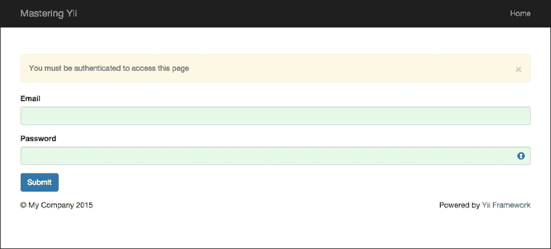

# 第七章. 认证和授权用户

当与现代 Web 应用一起工作时，我们经常需要认证我们的用户，以确保他们是他们所声称的那个人，并且他们拥有访问信息的适当权限（授权）。在本章中，我们将介绍使用 Yii2 认证用户的基础知识，并探讨如何使用基本访问控制过滤器以及更复杂的基于角色的访问控制过滤器，让他们访问我们应用中的特定页面。

### 小贴士

在本章中，我们将基于我们在第四章中创建的迁移脚本和模型，即*活动记录、模型和表单*。在开始本章之前，请确保您已经很好地理解了在该章中创建的模型和迁移。

# 用户认证

几乎对于每一个足够规模的 Web 应用，我们最终都需要我们的应用支持用户存储和认证，以确保与我们的应用一起工作的用户是他们所声称的那个人。在 Web 应用中，我们通常通过公开的身份（如电子邮件地址）和用户知道的秘密（如密码）来处理认证。根据我们数据的安全性和我们的威胁模型，我们还可以扩展我们的认证过程，包括通过短信文本消息或 Authy 或 Google Authenticator 等双因素认证应用发出的双因素认证代码。在本节中，我们将介绍如何使用 Yii2 实现基本认证，并探讨我们如何通过认证过程增强我们用户的网络安全。

在 Yii2 中，认证是通过用户组件管理的，并在我们的`config/web.php`应用配置文件中定义。在我们开始在我们的应用中认证用户之前，我们首先需要在配置文件中定义此组件。具体来说，我们需要告诉 Yii2 它可以在哪里找到我们将用于处理应用内认证逻辑的身份类。在下面的代码块中，我们已经将我们的身份类定义为我们在第三章中创建的用户模型，即*Migrations, DAO, and Query Building*：

```php
return [
    // [...],

    'components' => [
        'user' => [
            'identityClass' => 'app\models\User',
        ],
    ],

    // [...],
];
```

在接下来的章节中，我们将介绍如何扩展我们的`User`类以支持认证。

## 实现用户身份接口

要实现具有所需认证逻辑的我们的身份类，我们首先必须让我们的身份类（`app\models\User`，在`models\User.php`中定义）实现`yii\web\IdentityInterface`。

### 小贴士

记住，在 PHP 5+中，接口是 PHP 构造，用于定义实现类必须包含哪些方法。

在 PHP 5+中，我们可以通过在我们的类中使用`implements`关键字来增强我们的`User`对象，如下所示：

```php
class User extends \yii\db\ActiveRecord implements \yii\web\IdentityInterface
```

然后，我们可以实现`IdentityInterface`接口中概述的方法。这些方法是`findIdentity($id)`、`findIdentityByAccessToken()`、`getId()`、`getAuthKey($token, $type)`和`validateAuthKey($authKey)`：

1.  我们需要实现的第一种方法是`findIdentity($id)`。此方法负责找到具有指定`$id`属性的`identity`类的实例，并且主要用于当 Yii2 需要从会话数据中验证用户时。

1.  要实现此方法，我们需要定义静态方法并返回我们的`User`类的一个实例，如下面的示例所示：

    ```php
    /**
     * @inheritdoc
     */
    public static function findIdentity($id)
    { 
        return static::findOne($id);
    }
    ```

1.  在`yii\web\IdentityInterface`中定义的下一个我们需要定义的方法是`findIdentityByAccessToken($token, $type)`。在 Yii2 中，认证可以通过前端网页表单、Cookie（如果我们使用基于 Cookie 的认证）或 RESTful API 来处理。`findIdentityByAccessToken`方法用于我们使用 RESTful 认证时。由于我们的应用程序还没有 REST API，我们可以简单地定义此方法为空体，如下所示：

    ```php
    /** 
     * @inheritdoc
     */
    public static function findIdentityByAccessToken($token, $type=null) { }
    ```

    ### 提示

    如果我们想要添加基于令牌的认证的基本支持，我们需要执行以下步骤：

    1. 添加一个新的迁移来存储与我们的用户数据一起的访问令牌。

    2. 创建一个基于 API 的认证方法，该方法生成访问令牌并将其存储在我们的用户数据旁边

    3. 实现以下`findIdentityByAccessToken()`方法：

    ```php
        public static function findIdentityByAccessToken($token, $type=null)
        {
            return static::findOne(['access_token' => $token]);
        }
    ```

    我们将在第九章中更详细地介绍 RESTful API 认证，*RESTful APIs*。

1.  接下来，我们需要明确定义`getId()`方法，它将返回我们用户的 ID：

    ```php
    /**
     * @inheritdoc
     */
    public function getId()
    {
        return $this->id;
    }
    ```

    ### 提示

    虽然`yii\base\Object`，`yii\base\ActiveRecord`从中扩展，为我们在`ActiveRecord`实例中定义的所有公共属性定义了一个魔法方法`__getter`，但 PHP 5+中的接口要求显式定义接口中列出的所有方法。

1.  最后，我们需要在我们的应用程序中实现`getAuthKey()`和`validateAuthKey()`方法。如前所述，这两个方法专门用于基于 Cookie 的认证。由于我们本章不会使用基于 Cookie 的认证，我们可以简单地定义这两个方法，如下所示：

    ```php
        /**
         * @return string current user auth key
         */
        public function getAuthKey() {}

        /**
         * @param string $authKey
         * @return boolean if auth key is valid for current user
         */
        public function validateAuthKey($authKey)
        {
            return true;
        }
    ```

### 基于 Cookie 的认证

当与用户一起工作时，我们经常需要在我们的应用程序中包含一个类似于*记住我*功能的功能，以便我们的用户在离开一段时间后可以无缝地登录到我们的应用程序。为了使基于 Cookie 的认证在 Yii2 中工作，我们需要对我们的应用程序进行一些更改：

1.  首先，我们需要在我们的网络配置文件中将用户组件的 `enableAutoLogin` 属性设置为 `true`。这将允许 Yii2 在用户设置了适当的 cookie 后自动登录：

    ```php
    return [
        'components' => [
            // [...],
            'user' => [
                'identityClass' => 'app\models\User',
                'enableAutoLogin' => true,
            ],
            // [...],
        ]
    ];
    ```

1.  接下来，我们需要定义一个位置来存储和持久化我们的基于 cookie 的认证令牌。一种实现方式是添加一个额外的迁移，为我们的用户表添加一个 `auth_key` 列。在创建我们的用户时，我们可以设置此值，如下所示：

    ```php
    public function beforeSave($insert)
    {
        if (parent::beforeSave($insert))
        {
            if ($this->isNewRecord)
            {
                $this->auth_key = \Yii::
                $app->security->generateRandomString();
            }
            return true;
        }

        return false;
    }
    ```

    ### 提示

    或者，我们可以将此值持久化到二级存储系统中，例如 Memcached 或 Redis。我们将在 第十二章 中介绍如何使用 Redis 和 Memcached 缓存数据，*性能和安全*。

1.  最后，当我们定义我们的登录表单方法以实例化我们的 `IdentityInterface` 对象时，我们需要以如下方式记录用户的登录时长：

    ```php
    Yii::$app->user->login($identity, 3600*24*30);
    ```

    Yii2 将创建一个 cookie，它将用于内部操作，并且只要 cookie 有效，就会自动登录用户。如果没有设置时长，将使用基于会话的认证而不是基于 cookie 的认证，这意味着当用户关闭浏览器时，我们的用户会话将过期，而不是当用户的 cookie 过期时。

### 与用户身份交互

现在我们已经定义了我们的身份接口所需的方法，让我们更详细地看看 `yii\web\User` 对象。

### 提示

记住，`yii\web\User` 类与 `app\models\User` 类是不同的。

`yii\web\User` 对象在 Yii2 中通过 `\Yii::$app->user` 来引用，它包含了当前用户的信息。我们可以通过 `\Yii::$app->user->identity` 属性来检索我们用户的信息。如果一个用户未认证，这个属性将是 `NULL`。然而，如果一个用户已认证，它将包含当前用户的信息。例如，如果我们想获取用户在 第四章 中定义的完整姓名，即 *活动记录、模型和表单*，我们可以这样做：

```php
$name = \Yii::$app->user->identity->getFullName(); // "Jane Doe";
```

或者，我们可以通过检查 `yii\web\User` 的 `isGuest` 属性来检测用户是否已登录。如果用户未认证，此属性将返回 `true`；如果已认证，则返回 `false`：

```php
\Yii::$app->user->isGuest;
```

此外，如果我们想获取用户的 ID，我们可以通过我们在 `User` 类中定义的 `getId()` 方法来访问它：

```php
\Yii::$app->user->getId();
```

最后，我们可以使用`Yii::$app->user`中的相应`login()`和`logout()`方法在我们的应用程序中登录和注销用户。要登录用户，我们首先需要创建我们之前建立的标识实例。在下面的示例中，我们正在从用户的电子邮件地址获取标识信息。如前所述，我们还可以将持续时间参数作为`login()`方法的一部分提供，用于基于 cookie 的认证：

```php
$identity = User::findOne([ 'email' => $emailAddress ]);
Yii::$app->user->login($identity);
```

在我们认证之后，我们可以通过调用`\Yii::$app->user->logout()`来将用户从我们的应用程序中注销。默认情况下，此参数将销毁与当前用户关联的所有会话数据。如果我们想保留这些数据，我们可以将`false`作为`logout()`方法的第一个参数传递。

## 使用表单验证用户

现在我们已经实现了我们的身份接口，并且了解了`yii\web\User`组件的基础知识，让我们将这些组件与我们在第三章中创建的用户数据、*迁移、DAO 和查询构建*以及我们在第四章中创建的`UserForm`类和场景组合在一起。作为提醒，以下是我们在第四章中开始的`UserForm`类：

```php
<?php

namespace app\models;
use Yii;

class UserForm extends \yii\base\Model
{
    public $email;
    public $password;
    public $name;

    public function rules()
    {
        return [
            [['email', 'password'], 'required'],
            [['email'], 'email'],
            [['email', 'password', 'name'], 'string', 'max' => 255],
            [['email', 'password'], 'required', 'on' => 'login'],
            [['email', 'password', 'name'], 'required', 'on' => 'register']
        ];
    }

    public function scenarios()
    {
        return [
            'login' => ['email', 'password'],
            'register' => ['email', 'password', 'name']
        ];
    }
}
```

为了增强我们的`UserForm`类以方便登录，我们需要进行一些更改：

1.  首先，由于我们将在多个地方使用我们的身份对象，我们应该创建一个私有变量来存储它。这将有助于减少我们在使用表单时对数据库进行的查询次数。我们还将想要定义一个方法来检索这个属性：

    ```php
    private $_user = false;
    /**
    * Finds user by [[email]]
    * @return User|null
    */
        public function getUser()
        {
            if ($this->_user === false)
                $this->_user = User::findOne(['email' => $this->email]);

            return $this->_user;
        }
    ```

1.  接下来，我们需要实现一个方法来验证用户的密码。如第三章中所述，*迁移、DAO 和查询构建*，我们使用 PHP 5 的`password_hash`方法对用户的密码进行散列。为了验证以这种方式散列的密码，我们可以使用 PHP 5 的`password_verify`方法。对于我们的应用程序，让我们在我们的`app\models\User`类中添加一个`verifyPassword()`方法：

    ```php
    /**
     * Validates password
     *
     * @param  string  $password password to validate
     * @return boolean if password provided is valid for current user
     */
    public function validatePassword($password)
    {
        return password_verify($password, $this->password);
    }
    ```

1.  要调用此方法，我们将向我们的`UserForm`类的`rules()`方法添加一个新的验证器，该验证器仅在之前定义的登录场景中执行：

    ```php
    public function rules()
    {
      return [
        // [...],
        [['password'], 'validatePassword', 'on' => 'login'],
      ];
    }
    ```

1.  回想我们在第四章中介绍的信息，即*Active Record, Models, and Forms*，我们知道在登录场景中，`validatePassword`方法将被调用以满足我们添加到`rules()`方法中的新验证规则。我们可以定义此方法如下：

    ```php
    /**
     * Validates the password.
     * This method serves as the inline validation for password.
     *
     * @param string $attribute the attribute currently being validated
     * @param array $params the additional name-value pairs given in the rule
     */
    public function validatePassword($attribute, $params)
    {
        if (!$this->hasErrors())
        {
            if (!$this->getUser() || !$this->getUser()->validatePassword($this->password)) {
                $this->addError($attribute, 'Incorrect email or password.');
            }
        }
    }
    ```

1.  我们将通过添加一个`login()`方法来最终化我们的`UserForm`类，该方法将验证用户提交的电子邮件和密码，然后登录用户。

    ```php
    /**
     * Logs in a user using the provided email and password.
     * @return boolean whether the user is logged in successfully
     */
    public function login()
    {
        if ($this->validate())
    {
        if (Yii::$app->user->login($this->getUser()))
             return true;
    }

        return false;
    }
    ```

1.  在我们的表单最终化后，我们可以在控制器中实现登录操作，以完成工作流程。在我们的情况下，让我们让登录操作将用户重定向到一个页面，在用户登录后显示一些关于用户的信息。由于我们已经在第四章中定义了此操作的绝大部分，因此对此操作只需要进行小的修改：

    ```php
    public function actionLogin()
    {
        $model = new \app\models\UserForm(['scenario' => 'login']);

        if ($model->load(Yii::$app->request->post()))
        {
            if ($model->login())
                return $this->redirect('secure');
        }

        return $this->render('login', [
            'model' => $model,
        ]);
    }
    ```

    为了说明目的，让我们也在这页上显示`\Yii::$app->user->identity`的信息，以便我们可以看到它。我们可以通过创建之前提到的安全操作，然后使用`VarDumper`辅助程序来打印这些信息。

    ```php
    public function actionSecure()
    {
        echo "<pre>";
        \yii\helpers\VarDumper::dump(\Yii::$app->user->identity->attributes);
        echo "</pre>";
    }
    ```

由于我们已经在第四章中创建了我们的登录视图，即*Active Record, Models, and Forms*，因此我们可以使用该章节中列出的凭据来验证我们的应用程序。例如，我们可以使用以下凭据登录为管理员：

+   用户名：`admin@example.com`

+   密码：`admin`

如果身份验证成功，我们将被重定向到显示我们用户属性的安全页面。

```php
[
    'id' => 4
    'email' => 'admin@example.com'
    'password' => '$2y$13$f.1jE/cSFP42bHbqjtmJ5.6VkcOtKPp7Vu3UBC6clL7cHj84fltUC'
    'first_name' => 'Site'
    'last_name' => 'Administrator'
    'role_id' => 2
    'created_at' => 1439233885
    'updated_at' => 1439233885
] 
```

# 授权

虽然我们现在能够对我们的数据库进行身份验证，但我们需要实现必要的方法以确保正确的人可以访问正确的页面。为此，我们需要实现访问控制过滤器或基于角色的访问控制过滤器。

## 访问控制过滤器

控制对某些页面的访问的一种方法是通过创建访问控制过滤器。在 Yii2 中，访问控制过滤器是我们可以绑定到我们的控制器上的行为，以确保正确的人有权访问正确的内容。访问控制过滤器通过`yii\filter\AccessControl`实现，主要用于需要简单访问控制的情况，例如需要确保用户是否已登录（尽管它可以配置为更复杂的规则）。作为一个过滤器，`yii\filter\AccessControl`在我们的控制器中的`behaviors()`方法中实现，如下例所示：

```php
<?php

namespace app\controllers;

use yii\web\Controller;
use yii\filters\AccessControl;

class SiteController extends Controller
{
    public function behaviors()
    {
        return [
            'access' => [
                'class' => AccessControl::className(),
                'only' => ['login', 'logout', 'register'],
                'rules' => [
                    [
                        'allow' => true,
                        'actions' => ['login', 'register'],
                        'roles' => ['?'],
                    ],
                    [
                        'allow' => true,
                        'actions' => ['logout'],
                        'roles' => ['@'],
                    ],
                ],
            ],
        ];
    }
}
```

之前提到的代码执行了几个操作，让我们来分解一下：

1.  如前几章所述，行为返回一个选项数组。在这种情况下，我们返回的第一个行为是访问行为，它指定了`yii\filter\AccessControl`过滤器作为此行为应使用的类：

    ```php
    return [
      'access' => [
        'class' => AccessControl::className(),
        // [...]
      ]
    ];
    ```

1.  接下来，我们定义我们希望我们的过滤器应用的操作。在这种情况下，我们只想将`yii\filter\AccessControl`应用于我们的`SiteController`对象的登录、注销和注册操作。

    ```php
    'only' => ['login', 'logout', 'register'],
    ```

1.  最后，我们定义我们的过滤器应遵守的规则。在下面的代码片段中，我们声明我们希望未经认证的用户（在角色部分由特殊字符`?`指定）可以访问登录和注册操作，并允许任何已认证的用户（在角色部分由特殊字符`@`指定）可以访问注销操作：

    ```php
    'rules' => [
        [
            'allow' => true,
            'actions' => ['login', 'register'],
            'roles' => ['?'],
        ],
        [
            'allow' => true,
            'actions' => ['logout'],
            'roles' => ['@'],
        ],
    ]
    ```

默认情况下，如果用户未认证，我们的访问控制过滤器将重定向用户到我们的登录页面，如果他们没有访问权限，将抛出`yii\web\ForbiddenHttpException`。由于这并不总是期望的，我们可以通过设置过滤器的`denyCallback`参数来修改我们的过滤器。此外，我们可以在过滤器的规则部分中，通过设置`matchCallback`属性来定义错误可能发生的情况。例如，如果我们想使我们的安全操作仅对管理员可访问，我们可以编写以下代码：

```php
<?php

namespace app\controllers;

use Yii;
use yii\filters\AccessControl;
use yii\web\Controller;
use yii\web\HttpException;
use yii\helpers\Url;

class SiteController extends Controller
{
    public function behaviors()
    {
        return [
            'access' => [
                'class' => AccessControl::className(),
                // Specifies the actions that the rules should be applied to
                'only' => ['secure'],
                // The rules surrounding who should and should not have access to the page
                'rules' => [
                    [
                        'allow' => true,
                        'matchCallback' => function($rule, 
$action) {
                            return !\Yii::$app->user->isGuest && 
\Yii::$app->user->identity->role->id === 2;
                        }
                    ],
                ],
                // The action that should happen if the user shouldn't have access to the page
                'denyCallback' => function ($rule, $action) {
                    if (\Yii::$app->user->isGuest)
                        return $this->redirect
(Url::to('/site/login'));
                    else
                        throw new HttpException('403', 'You are 
not allowed to access this page');
                },
            ],
        ];
    }
}
```

在本节中，用户只有在其角色为`2`（这是我们将在第三章中指定的管理员角色）时才能使用安全操作。如果他们未认证，我们将重定向他们到登录页面；如果他们已认证但权限不足，我们将抛出 HTTP 403 错误。

### 小贴士

之前显示的示例是为了说明我们可以使用访问控制过滤器的`matchCallback`和`denyCallback`属性做什么。

通过访问控制过滤器，我们可以在规则部分设置`ips`参数来通过 IP 地址限制对某些操作的访问，如下所示。IP 地址可以通过特定的 IP 或使用通配符字符的子网进行限制，如下面的示例所示：

```php
return [
    'access' => [
        'class' => AccessControl::className(),
        // [..]
        'rules' => [
            [
                'allow' => true,
                'ips' => [
                    '10.0.0.5', // Allow 10.0.0.5
                    '192.168.*' // Allow 192.168.0.0/24 subnet
                ]
            ]
        ]
    ],
];
```

此外，我们可以通过指定允许的 HTTP 动词来限制对操作的访问，使用`yii\filter\VerbFilter`过滤器。例如，如果我们想确保只有`GET`请求可以针对我们的安全操作运行，我们可以定义以下行为：

```php
<?php

namespace app\controllers;

use Yii;
use yii\web\Controller;
use yii\filters\VerbFilter;

class SiteController extends Controller
{
    public function behaviors()
    {
        return [
            // [...]
            'verbs' => [
                'class' => VerbFilter::className(),
                'actions' => [
                    'secure' => ['get'],
                ],
            ],
        ];
    }
}
```

默认情况下，我们的访问控制过滤器将尝试将自身应用于我们控制器中的每个操作。为了指定我们的过滤器应限制的操作，我们可以设置过滤器的`only`属性：

```php
'only' => ['secure'],
```

此外，我们可以通过设置`rules`数组的`actions`属性来指定我们的访问控制规则应应用的操作：

```php
'rules' => [
    [
        'allow' => true,
        'actions' => [ 'secure' ],
        'matchCallback' => function($rule, $action) {
            return !\Yii::$app->user->isGuest && \Yii::$app->user->identity->role->id === 2;
        }
    ],
    [
        'allow' => true,
        'actions' => [ 'authenticated' ],
        'roles' => ['@']
    ]
],
```

类似于`only`参数，我们可以通过设置`except`过滤器来排除某些操作从身份验证过滤器：

```php
'except' => ['secure'],
```

### 提示

访问控制过滤器被分解为规则，如前一个示例所示。每个规则仅适用于一组特定的操作，这允许我们为这些规则指定自定义的允许或拒绝回调。然而，`only`和`except`的父选项指定了父访问控制过滤器何时应用。

## 基于角色的访问控制

作为使用用户身份对象管理访问的替代方案，我们也可以通过在我们的应用程序中配置**基于角色的访问控制**（**RBAC**）来管理对操作的访问。在 Yii2 中，RBAC 通过创建代表一组权限的角色，然后将这些角色分配给特定用户来实现。角色通过检查来确定给定的角色或权限是否适用于相关用户。在本节中，我们将介绍在 Yii2 中配置和使用 RBAC 的基本知识。

### 提示

Yii2 对 RBAC 的实现通过`authManager`组件遵循 NIST RBAC 模型。NIST RBAC 模型的完整实现细节位于[`csrc.nist.gov/rbac/sandhu-ferraiolo-kuhn-00.pdf`](http://csrc.nist.gov/rbac/sandhu-ferraiolo-kuhn-00.pdf)。

## 配置 RBAC

要开始使用 RBAC，我们首先需要为 RBAC 配置我们的`authManager`组件并定义我们想要使用的授权管理器。Yii2 提供了两种不同的授权管理器，第一种是`yii\rbac\PhpManager`，它使用 PHP 脚本来存储授权数据，第二种是`yii\rbac\DbManager`，它利用应用程序数据库来管理授权数据。对于具有非动态权限和角色的简单应用程序，`yii\rbac\PhpManager`可能更受欢迎。

要配置`authManager`，我们只需定义我们想要使用的类，如下所示：

```php
return [
    // [...],
    'components' => [
        'authManager' => [
            'class' => 'yii\rbac\PhpManager',
        ],
    ],
    // [...],
];
```

### 提示

默认情况下，`yii\rbac\PhpManager`将授权数据存储在`@app/rbac`目录中，该目录必须可由您的 Web 服务器写入。

或者，如果我们使用数据库来管理我们的授权数据，我们将按如下方式配置`authManager`：

```php
return [
    // [...],
    'components' => [
        'authManager' => [
            'class' => 'yii\rbac\DbManager',
        ],
    ],
    // [...],
];
```

当使用我们的数据库来管理我们的授权数据时，我们需要运行 RBAC 迁移来适当地配置我们的数据库，这可以通过从我们的命令行界面运行以下命令来完成：

```php
./ yii migrate --migrationPath=@yii/rbac/migrations

```

这将导致输出类似于以下内容：

```php
Yii Migration Tool (based on Yii v2.0.6)
Total 1 new migration to be applied:
 m140506_102106_rbac_init
*** applying m140506_102106_rbac_init
 > create table {{%auth_rule}} ... done (time: 0.006s)
 > create table {{%auth_item}} ... done (time: 0.005s)
 > create index idx-auth_item-type on {{%auth_item}} (type) ... /
 done (time: 0.006s)
 > create table {{%auth_item_child}} ... done (time: 0.005s)
 > create table {{%auth_assignment}} ... done (time: 0.005s)
*** applied m140506_102106_rbac_init (time: 0.050s)
Migrated up successfully.

```

配置 RBAC 后，我们可以通过`\Yii::$app->authManager`访问`authManager`组件。

## 创建权限和权限关系

在配置我们的`authManager`组件之后，我们需要定义我们希望用户拥有的权限以及它们之间的关系。对于大多数具有固定权限层次结构的应用程序，这可以通过编写 RBAC 控制台命令来初始化数据库中的数据来实现。在以下示例中，我们将为虚构的问题管理应用程序创建三个权限：一个用户创建新问题的权限，支持新创建的问题，一个监督员监督监督员，以及管理员权限：

```php
// Save to @app/commands
<?php
namespace app\commands;

use Yii;
use yii\console\Controller;

class RbacController extends Controller
{
    public function actionInit()
    {
        $auth = \Yii::$app->authManager;

        // Create the user permissions
        $user = $auth->createPermission('createIssue');
        $user->description = 'A permission to create a new issue within our incident management system';
        $auth->add($user);

        // Create the supporter permissions
        $supporter = $auth->createPermission('supportIssue');
        $supporter->description = 'A permission to apply supporter specific actions to an issue';
        $auth->add($supporter);

        // A supporter should have all the permissions of a user
        $auth->addChild($supporter, $user);

        // Create a permission to manage issues
        $supervisor = $auth->createPermission('manageIssue')
        $supervisor->description = 'A permission to apply management specific actions to an issue';
        $auth->add($supervisor);

        // A supervisor should have all the permissions of a supporter and a end user
        $auth->addChild($supervisor, $supporter);
        $auth->addChild($supervisor, $user);

        $admin = $auth->createRole('admin');
        $admin->description = 'A permission to perform admin actions on an issue';
        $auth->add($admin);

        // Allow an admin to perform all related tasks.
        $auth->addChild($admin, $supervisor);
        $auth->addChild($admin, $supporter);
        $auth->addChild($admin, $user);
    }
}
```

然后，我们可以通过从我们的命令行运行`rbac/init`命令来初始化我们新创建的权限方案：

```php
./yii rbac/init

```

在定义了我们的角色之后，我们可以在注册步骤或管理仪表板中将其应用于我们的用户，如下所示。在这个例子中，我们正在获取管理员角色并将其分配给具有用户 ID `4`的管理员用户：

```php
$auth = \Yii::$app->authManager;
$role = $auth->getRole('admin');
$auth->assign($role, User::findOne([ 'email' => 'admin@example.com' ]));
```

或者，我们可以在`authManager`组件中定义一个隐含的默认角色。这样，我们就不需要明确地将新用户分配到最低级别的用户角色。这可以通过以下方式实现：

```php
return [
    // [...],
    'components' => [
        'authManager' => [
            'class' => 'yii\rbac\PhpManager',
            'defaultRoles' => ['user'],
        ],
       // [...],
    ],
];
```

## 自定义授权规则

除了基本的身份验证角色和权限之外，我们还可以通过扩展`yii\rbac\Rule`并实现`execute()`方法来定义自定义规则，如下所示：

```php
// Save to @app/rbac
<?php
namespace app\rbac;

use yii\rbac\Rule;

/**
 * Checks if a user can edit their own issue
 */
class SupervisorRule extends Rule
{
    public $name = 'isAuthor';

    /**
     * @param string|integer $user the user ID.
     * @param Item $item the role or permission that this rule is associated with
     * @param array $params parameters passed to ManagerInterface::checkAccess().
     * @return boolean a value indicating whether the rule permits the role or permission it is associated with.
     */
    public function execute($user, $item, $params)
    {
        return isset($params['issue']) ? $params['issue']->author == $user : false;
    }
}
```

我们可以将自定义规则添加到我们的`authManager`组件中，如下所示：

```php
$auth = Yii::$app->authManager;

// Add a rule
$rule = new \app\rbac\SupervisorRule;
$auth->add($rule);

// Create a permission and associate the rule to it
$modifyOwnIssue = $auth->createPermission('modifyOwnIssue');
$modifyOwnIssue->description = 'Modify a issue that was self submitted';
$modifyOwnIssue->ruleName = $rule->name;
$auth->add($modifyOwnIssue);
// Assign the supervisor role to the superviseIssue permissions
$superviseIssue = $auth->getRole('superviseIssue');
$auth->addChild($modifyOwnIssue, $superviseIssue); 
```

## 检查用户是否有访问角色的权限

在配置了 RBAC、创建了所需的角色并将用户分配到这些角色之后，我们可以使用`yii\web\User::can()`方法来检查用户是否有访问特定角色的权限，如下所示：

```php
if (\Yii::$app->user->can('createIssue'))
{
    // Create a new issue
}
```

我们也可以通过检查父角色并传递所需数据来验证我们的新创建的规则是否可访问，如下所示：

```php
if (\Yii::$app->user->can('superviseIssue', ['issue' => Yii::$app->request->post('Issue')]))
{
    // Can modify an issue that they created
}
```

### 小贴士

虽然通过角色和规则的命名更加明确，但使用 RBAC 可能会很快变得令人困惑。当使用 RBAC 时，请彻底记录权限、关系和规则以供以后参考。

# 闪存消息

而不是盲目地重定向用户而不提供信息，我们可以利用 Yii2 中的闪存消息向用户显示一次性有用的信息，例如他们需要执行什么操作才能完成另一个操作（例如，他们必须登录才能查看受保护的页面）。

在 Yii1 中，用户指定的闪存消息可以直接绑定到用户组件。在 Yii2 中，它们完全由会话对象管理。在本节中，我们将通过增强我们的登录视图来举例说明如何使用闪存消息。我们还将利用我们在前几章中介绍的其他小部件和辅助工具。

如前节所示，当用户是访客且尝试访问受保护页面时，我们只需将他们重定向回登录页面，不提供任何信息。为了提供良好的用户体验，我们可以在重定向用户之前设置一个闪存消息，然后在登录视图中显示该消息。例如，我们控制器的`behaviors()`方法将变为以下内容。注意`setFlash()`方法的使用：

```php
public function behaviors()
{
    return [
        'access' => [
            'class' => AccessControl::className(),
            'denyCallback' => function ($rule, $action) {
                if (\Yii::$app->user->isGuest)
                {
                    \Yii::$app->session->setFlash('warning', 'You must be authenticated to access this page');
                    return $this->redirect(Url::to('/site/login'));
                }
                else
                    throw new HttpException('403', 'You are not allowed to access this page');
            },
            'only' => ['secure'],
            'rules' => [
                [
                    'allow' => true,
                    'matchCallback' => function($rule, $action) {
                        return !\Yii::$app->user->isGuest && \Yii::$app->user->identity->role->id === 2;
                    }
                ],
            ],
        ],
    ];
}
```

在我们的登录视图文件中，我们可以使用`hasFlash()`方法检查是否存在特定类型的闪存消息，然后使用`getFlash()`方法显示特定的闪存消息，如下所示：

```php
<?php use yii\bootstrap\Alert; ?>

<div class="site-login">
    <?php if (\Yii::$app->user->isGuest): ?>
        <div class="body-content">
            <?php if (\Yii::$app->session->hasFlash('warning')): ?>
            <?php echo Alert::widget([
                    'options' => [
                    'class' => 'alert alert-warning'
                    ],
                    'body' => \Yii::$app->session->getFlash('warning')
                ]); ?>
                <?php endif; ?>
            <?php echo $this->render('forms/LoginForm', [ 'model' => $model ]); ?>
        </div>
    <?php else: ?>
        <?php echo Alert::widget([
            'options' => [
                'class' => 'alert alert-info'
            ],
            'body' => 'You are already logged in. To login as a different user, logout first'
        ]); ?>
    <?php endif; ?>
</div>
```

现在，如果我们未经过认证就导航到 site/secure，我们会看到以下内容。此外，如果我们再次刷新页面，闪存消息会消失，因为闪存消息只打算显示一次。



# 哈希和加密

在处理用户信息时，必须注意最佳安全实践，以确保用户信息（如密码）以某种方式存储，如果您的数据库被破坏，用户的明文密码不会被暴露。如第三章所示，“迁移、DAO 和查询构建”，我们正在使用原生的 PHP `password_hash()`和`password_verify()`函数来加密和解密我们的用户密码。虽然这些标准易于使用，但在您应用程序的开发过程中，您可能会发现利用 Yii2 安全组件来哈希用户密码和加密敏感数据更容易：

```php
Yii::$app->getSecurity();
```

## 哈希和验证密码

使用 Yii2，我们可以通过安全组件的`generatePasswordHash()`和`validatePassword()`方法来哈希和验证用户密码。与`password_hash()`和`password_verify()`函数一样，`generatePasswordHash()`和`validatePassword()`方法使用`bcrypt`来哈希用户密码：

```php
$hash = \Yii::$app->getSecurity()->generatePasswordHash($password);
```

然后，密码可以按以下方式验证：

```php
if (Yii::$app->getSecurity()->validatePassword($plainTextPassword, $hashedPassword))
{
    // Valid Password
}
else
{
    // Invalid Password
}
```

默认情况下，Yii2 将使用 PHP 的`crypt()`函数生成密码哈希，但可以通过设置应用程序配置中安全组件的`passwordHashStrategy`属性，选择性地配置为使用原始的`password_hash()`方法，使用`PASSWORD_DEFAULT`算法：

```php
return [
    // [...],
    'security' => [
        'passwordHashStrategy' => 'password_hash'
    ],
    // [...],
];
```

### 提示

强烈建议您使用`password_hash`策略而不是加密，因为 PHP 将继续增强`PASSWORD_DEFAULT`的哈希算法，以增加 PHP 的安全性。

然而，Yii2 实现的密码哈希方法是原生 PHP 函数的包装。原生函数和 Yii2 实现将相互保持向后兼容。为了更面向对象的方法，建议您使用 Yii2 方法。

## 数据加密和解密

为了方便起见，Yii2 提供了一种使用密钥或用户密码来加密和解密数据的方法。要使用 Yii2 加密数据，我们可以使用安全组件的`encryptByPassword()`方法，如下例所示：

```php
$encrypted = \Yii::$app->getSecurity()->encryptByPassword($data, $secretPassword);
```

可以使用`decryptByPassword()`方法解密数据：

```php
$data = \Yii::$app->getSecurity()->decryptByPassword($encrypted, $secretPassword);
```

### 小贴士

用于加密和解密方法的秘密密码应仅对用户唯一，并以一种格式存储，如果我们的数据库遭到破坏，秘密密码本身不会受到损害。一个好的秘密是使用用户提交的单独密码。

## 数据散列

除了散列密码和加密数据外，我们还可以使用`hashData()`和`validateData()`方法对数据进行散列以进行完整性验证。这些方法将有助于展示和验证文件或原始数据的校验和：

```php
$hash = Yii::$app->getSecurity()->hashData($data, $secretKey);
$data = Yii::$app->getSecurity()->validateData($hash, $secretKey);
```

### 小贴士

与加密数据不同，散列数据无法恢复到其原始状态。散列在验证信息未被篡改方面很有益处，并且确保文件或数据在传输后的一致性。

# 摘要

在本章中，我们介绍了验证用户身份的基本知识，以及根据我们在用户身份界面中设置的属性授予他们访问某些页面的权限，以及如何实现 Yii2 的基于角色的分层认证。我们还探讨了如何使用闪存消息来增强用户体验。此外，我们还探讨了安全组件的一些组件，使我们能够散列用户的密码、散列和验证数据，以及使用用户的密码加密和解密信息。

在下一章中，我们将介绍我们应用程序中更复杂的路由，如何使用和修改我们的响应，以及监听和响应事件的基础知识。
