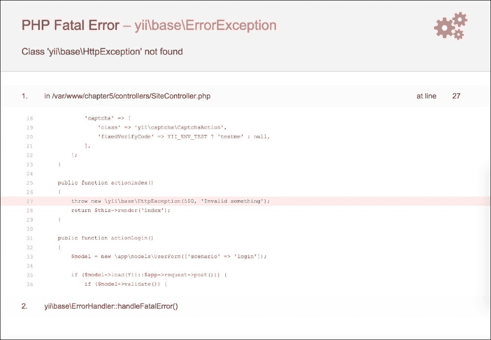
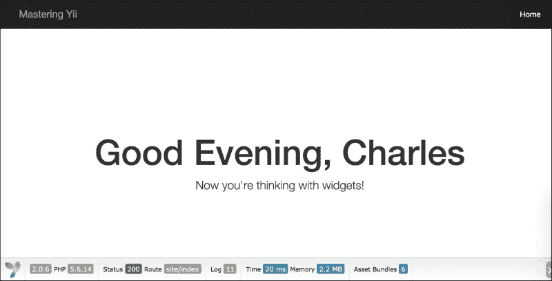
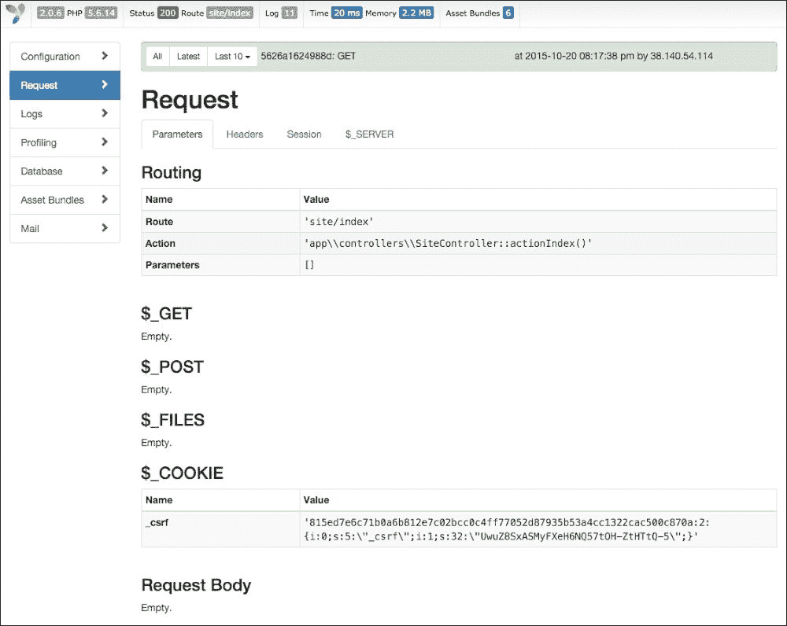
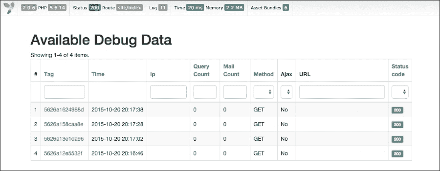

# 第十三章 调试和部署

在处理现代 Web 应用程序时，最重要的任务之一是确定在应用程序的开发和运行过程中出了什么问题。如果不了解出了什么问题，就无法确定纠正问题的正确步骤。Yii2 提供了几个工具和组件，使我们的应用程序调试变得轻松简单。在本章中，我们将探讨几种不同的调试应用程序的方法。我们还将概述完成开发后部署 Yii2 应用程序的一些最佳实践。

# 调试

**调试**是一个重要的过程，通过这个过程我们可以发现我们的应用程序出了什么问题。无论我们是解决本地的问题还是试图在生产环境中识别问题，我们的应用程序都需要配置为提供所需的信息，以便快速有效地识别和解决出现的问题。在本节中，我们将介绍如何在我们的应用程序中启用日志记录，如何基准测试代码的某些部分和处理错误，以及一般的调试工具和指南。

## 日志记录

为了帮助我们调试应用程序，Yii2 内置了几个不同的日志组件和日志方法，我们可以在应用程序中实现。要开始使用 Yii2 的日志记录，我们首先需要在应用程序中实现一个日志组件。Yii2 提供了几个不同的组件，我们可以将它们一起或独立地实现。

| 日志类 | 描述 | 类参考 |
| --- | --- | --- |
| `yii\log\DbTarget` | 将信息记录到数据库表 | [`www.yiiframework.com/doc-2.0/yii-log-dbtarget.html`](http://www.yiiframework.com/doc-2.0/yii-log-dbtarget.html) |
| `yii\log\EmailTarget` | 在记录事件时，向指定的电子邮件地址发送电子邮件 | [`www.yiiframework.com/doc-2.0/yii-log-emailtarget.html`](http://www.yiiframework.com/doc-2.0/yii-log-emailtarget.html) |
| `yii\log\FileTarget` | 将事件记录到文件 | [`www.yiiframework.com/doc-2.0/yii-log-filetarget.html`](http://www.yiiframework.com/doc-2.0/yii-log-filetarget.html) |
| `yii\log\SyslogTarget` | 使用 PHP 的`syslog()`函数记录事件 | [`www.yiiframework.com/doc-2.0/yii-log-syslogtarget.html`](http://www.yiiframework.com/doc-2.0/yii-log-syslogtarget.html) |

### 小贴士

列出的每个日志记录器在其配置上都有细微的差异。有关如何具体配置每个日志目标的更多信息，请参阅该日志记录器类的类参考。

要在应用程序中启用日志目标，我们首先需要引导日志组件，然后在应用程序配置的组件部分指定我们想要使用的日志记录器目标，如下例所示：

```php
return [
    // [...],
    'bootstrap' => ['log'],

    // [...],
    'components' => [
        // [...],
        'log' => [
 'targets' => [
 [
 'class' => 'yii\log\FileTarget',
 'levels' => ['error', 'warning'],
 ]
 ],
 ],
    ],
];
```

### 小贴士

在前面的示例中，我们通过自身启用了`yii\log\FileTarget`以处理任何错误和警告日志事件。请注意，可以通过在`targets`数组中指定额外的记录器来同时启用多个记录器。

每个日志目标都可以配置为监听某些事件。Yii2 提供了五个不同的事件，我们可以将它们记录到，以及几个可以添加到我们代码中的日志方法：

+   **错误**：当发生常规错误或致命错误时，由`Yii:error()`触发。这些类型的事件应立即处理，因为它们表明应用程序中存在失败。

+   **警告**：这是由`Yii::warning()`触发的。这些事件表明应用程序中出现了问题。

+   **信息**：这是由`Yii::info()`触发的。通常，这些事件用于记录发生的有用或有趣的事情。

+   **跟踪**：这是由`Yii::trace()`触发的，通常在开发期间用于跟踪特定的代码片段。

+   **性能分析**：这是由`Yii::beginProfile()`和`Yii::endProfile()`触发的。

### 注意

大多数这些方法只是`Yii::log()`的包装器。

每个日志目标都可以通过指定该日志目标对象的`level`属性来配置它监听特定的事件集，默认情况下，如果未指定`level`属性，Yii2 将处理任何严重性的消息。

每个日志方法具有类似的方法签名：

```php
function($message, $category='application')

```

Yii2 的日志方法将通过`yii\helpers\VarDumper::export()`方法允许字符串和复杂的数据对象或数组。在记录信息时，指定一个类别非常重要，因为这个类别可以在我们的日志中进行搜索和过滤。正如方法签名所示，Yii2 默认将信息记录到`application`类别。在指定类别时，通常最好以分层的方式指定，例如以类似斜杠的格式：

```php
app\components\MyEvent
```

另一种有效的格式是使用 PHP 魔法方法`__METHOD__`，它将返回调用日志记录器的命名空间和方法：

```php
app\components\MyEvent::myMethod
```

在我们的记录器组件中，我们可以通过指定`categories`参数来指定我们希望记录器处理的类别。类别参数可以配置为监听特定的类别，如`yii\db\Connection`，但它也可以使用通配符进行配置。例如，如果我们想在`yii\db`中的任何类别被调用时发送电子邮件，我们可以配置以下记录器目标：

```php
return [
    // [...],
    'bootstrap' => ['log'],

    // [...],
    'components' => [
        // [...],
        'log' => [
            'targets' => [
                [
                    'class' => 'yii\log\EmailTarget',
                    'categories' => ['yii\db\*'],
                    'message' => [
                       'from' => ['systems@example.com'],
                       'to' => ['administrator@example.com'],
                       'subject' => 'Database errors for example.com',
                    ],
                ]
            ],
        ],
    ],
];

```

### 小贴士

如果你决定使用电子邮件日志记录，你可能会迅速收到多个消息，甚至可能被你的电子邮件提供商限制速率。强烈建议你只为电子邮件日志记录指定最关键的类别。

在我们需要记录多个类别的情况下，例如`yii\web\HttpException`，我们还可以通过指定`except`属性来排除某些类别不被记录。例如，如果我们想记录所有非 HTTP 404 异常，我们可以按照以下方式配置我们的记录器以实现这一点：

```php
return [
    // [...],
    'bootstrap' => ['log'],

    // [...],
    'components' => [
        // [...],
        'log' => [
            'targets' => [
                [
                'class' => 'yii\log\FileTarget',
                'levels' => ['error', 'warning', 'info'],
                'categories' => ['yii\web\HttpException:*'],
                'except' => [
                    'yii\web\HttpException:404',
                ],
            ]
            ],
        ],
    ],
];
```

最后，在我们的应用程序中，可以通过设置日志目标对象的 `enabled` 属性来开启或关闭记录器。要程序化地禁用日志目标，我们首先需要指定我们的日志目标键：

```php
return [
    // [...],
    'bootstrap' => ['log'],

    // [...],
    'components' => [
        // [...],
        'log' => [
            'targets' => [
                'file' => [
 'class' => 'yii\log\FileTarget',
 'levels' => ['error', 'warning', 'info'],
 'categories' => ['yii\web\HttpException:*'],
 'except' => [
 'yii\web\HttpException:404',
 ],
 ]
            ],
        ],
    ],
];
```

然后，在我们的代码中，我们可以使用以下代码临时禁用之前示例中指定的 `file` 目标：

```php
Yii::$app->log->targets['file']->enabled = false;
```

## 基准测试

我们还可以使用分析器工具来调试我们的应用程序。分析器工具允许我们了解特定代码片段执行所需的时间。要使用分析器，我们只需将以下代码块包裹我们要检查的代码即可：

```php
Yii::beginProfile('myProfile');
    // Code inside this will be profiled
Yii::endProfile('myProfile');
```

### 小贴士

`beginProfile()` 和 `endProfile()` 方法可以嵌套在其他分析器部分中。这些方法内的代码将被输出到您的日志目标以进行分析。在生产环境中，您应该禁用分析。

## 错误处理

默认情况下，Yii2 具有一个相当全面的错误处理程序，它将自动捕获并显示所有非致命 PHP 错误。在开发过程中，错误处理程序可以是一个极其强大的工具，因为它可以在出现故障时提供完整的堆栈跟踪。



### 小贴士

默认情况下，错误处理程序作为我们应用程序的一部分自动启用，但可以通过在引导文件中将 `YII_ENABLE_ERROR_HANDLER` 常量设置为 `false` 来禁用。

错误处理程序配置在我们的主要应用程序配置文件中，并支持多个不同的配置选项，如下例所示：

```php
return [
    // [...],
    'components' => [
        // [...],
        'errorHandler' => [
            'maxSourceLines' => 20,
            'errorAction' => 'site/error',
            'maxTraceSourceLines' => 13,
            // [...]
        ],
    ],
];
```

### 小贴士

关于错误处理及其属性的更多信息可以在 Yii2 类参考页面上找到，网址为 [`www.yiiframework.com/doc-2.0/yii-web-errorhandler.html`](http://www.yiiframework.com/doc-2.0/yii-web-errorhandler.html)。

默认情况下，错误处理程序将使用两个视图来显示错误：

+   `@yii/views/errorHandler/error.php`：此视图将用于显示不带调用堆栈的错误，并且是当 `YII_DEBUG` 设置为 `false` 时的默认视图。

+   `@yii/views/errorHandler/exception.php`：当错误显示完整的调用堆栈时将使用此视图。

我们可以通过指定错误处理程序的 `errorView` 和 `exceptionView` 属性来自定义错误视图文件。

作为默认错误页面的替代方案，如前一个屏幕截图所示，可以通过指定错误处理程序的 `errorAction` 属性将错误重定向到不同的操作。然后，我们可以通过向 `actions()` 方法添加错误操作并在指定的控制器中定义 `actionError()` 操作来从我们的应用程序中单独处理错误：

```php
<?php
namespace app\controllers;

use Yii;
use yii\web\Controller;

class SiteController extends Controller
{
    public function actions()
    {
        return [
            'error' => [
                'class' => 'yii\web\ErrorAction',
            ],
        ];
    }

   public function actionError()
    {
        $exception = Yii::$app->errorHandler->exception;
        if ($exception !== null) {
            return $this->render('error', ['exception' => $exception]);
        }
    }
}
```

然后，我们可以在 `views/site/error.php` 文件中创建我们自定义的错误处理页面。

### 处理非 HTML 响应中的错误

当处理非 HTML 响应，如 JSON 或 XML 时，Yii2 将显示简化的错误响应，如下例所示：

```php
{
    "name": "Not Found Exception",
    "message": "The requested resource was not found.",
    "code": 0,
    "status": 404
} 
```

如果你想在非生产环境中显示更多调试信息，你可以通过覆盖响应组件的 `on beforeSend` 事件来创建一个自定义响应处理程序。我们的响应处理程序可以重写如下以实现此目的：

```php
<?php 
return [
    // [...],
    'components' => [
        // [...],
        'response' => [
            'format' => yii\web\Response::FORMAT_JSON,
            'charset'        => 'UTF-8',
            'on beforeSend'  => ['app\components\ResponseEvent', 'beforeSend']
        ],
        // [...]
    ]
];
```

我们位于 `@app/components/ResponseEvent.php` 的响应处理类可以编写如下，以更改当 `YII_DEBUG` 设置为 `true` 时的错误行为：

```php
<?php

namespace app\components;

use Yii;

/**
 * Event handler for response object
 */
class ResponseEvent extends yii\base\Event
{
    /**
     * Before Send event handler
     * @param yii\base\Event $event
     */
    public function beforeSend($event)
    {
        $response = $event->sender;

        if (\Yii::$app->request->getIsOptions())
        {
            $response->statusCode = 200;
            $response->data = null;
        }

        if ($response->data !== null)
        {
            $return = ($response->statusCode == 200 ? $response->data : $response->data['message']);

            $response->data = [
                'data'  => $return
            ];

            // Handle and display errors in the API for easy debugging
            $exception = \Yii::$app->errorHandler->exception;
            if ($exception && get_class($exception) !== "yii\web\HttpException" && !is_subclass_of($exception, 'yii\web\HttpException') && YII_DEBUG)
            {
                $response->data['success'] = false;
                $response->data['exception'] = [
                    'message'   => $exception->getMessage(),
                    'file'      => $exception->getFile(),
                    'line'      => $exception->getLine(),
                    'trace'     => $exception->getTraceAsString()
                ];
            }
        }
    }
}
```

现在当发生错误时，将显示类似以下内容的输出，节省了我们切换浏览器和应用程序日志所需的时间：

```php
{
    "data": "<message>",
    "success": false,
    "exception": {
        "message": "Invalid",
        "file": "/path/to/SiteController.php",
        "line": 48,
        "trace": "#0 [internal function]: app\\controllers\\SiteController->actionIndex()\n# ... {main}"
    }
}
```

## 使用 Yii2 调试扩展进行调试

我们可以用来调试应用程序的另一个强大工具是 `yii2-debug` 扩展。启用后，调试扩展提供了对请求每个方面的深入了解，从日志、配置、性能分析、请求、资产包，甚至我们的应用程序发送的电子邮件。使用此工具，我们可以确切地了解在特定请求期间发生了什么。

要开始使用 `yii2-debug` 扩展，我们首先需要将其作为我们的 composer 依赖项安装：

```php
composer require --dev --prefer-dist yiisoft/yii2-debug

```

安装包并运行 composer update 后，我们可以通过向我们的 `config/web.php` 配置文件添加以下内容来配置调试扩展：

```php
if (YII_DEBUG)
{ 
    $config['bootstrap'][] = 'debug';
    $config['modules']['debug'] = [
       'class' => 'yii\debug\Module',
       'allowedIPs' => ['*']
    ];
}
```

启用扩展后，我们将在应用程序的每个视图中底部看到它。



默认情况下，扩展将显示我们应用程序的一些基本信息；然而，如果我们点击它，我们可以深入了解针对特定请求的应用程序各个方面。



或者，我们可以导航到应用程序的 `/debug` 端点来查看扩展捕获的所有调试请求。



# 部署

与任何 Yii2 应用程序一起工作的最后一步是将它移至生产环境并创建一个部署策略。我们可以使用许多不同的工具来部署我们的代码，从 Bamboo、TravisCI、Jenkins、Capistrano，甚至手动 SSH 部署——仅举几例。

然而，一般来说，在部署我们的代码时，我们应该牢记几个关键概念：

+   部署应该是自动化的，无需人工干预。为了保持一致性，你的部署应该由一个工具或服务运行，该工具或服务可以每次运行相同的任务。这消除了部署过程中可能出现的任何人为错误，并确保了一致性。

+   部署应该是快速的，为你提供快速推出新功能和修复错误的能力。

+   您应用程序的实际构建（如合并和压缩 JavaScript、CSS 和其他配置）应该在构建服务器上完成，然后以预构建的方式推送到您的生产服务器。这确保了您的生产服务器上没有额外的工具，这些工具可能包含安全漏洞，同时也确保了每次构建项目时都使用相同的工具。

+   部署应该是可逆的。如果我们部署了代码并且我们的应用程序崩溃了，我们应该能够轻松地回滚到之前的版本。

+   在部署时，我们应该删除任何开发工具、脚本以及我们的 DCVS 仓库信息。这确保了如果我们的代码或我们的 Web 服务器中存在错误或安全漏洞，这些信息不会被泄露。

+   包含我们其他信息日志的目录（如`runtime`）应该存储在持久目录中，然后将其符号链接回我们的项目。这确保了我们的日志和其他数据可以在多个部署之间持续存在。

+   我们的部署应该以这种方式结构化，以确保服务中断。通常，这是通过将我们的部署存储在特定的文件夹中，然后重命名或创建符号链接到我们的 Web 服务器指向的目录来实现的。这确保了当我们进行更改时，我们的网站不会出现中断。

+   在部署新代码时，我们应该清除任何应用程序特定的缓存，例如我们的模式缓存、配置缓存和 PHP OPCache，以确保我们的新代码更改生效。

+   配置文件绝不应该提交到我们的 DCVS 中，因为它们包含数据库用户名、密码和其他机密信息。考虑将这些数据存储在服务器上的环境变量中，或者以只有生产服务器才能解密和使用数据的方式加密它们。

通过遵循这些通用指南，我们可以确保我们的 Yii2 应用程序能够无缝且容易地部署。

# 摘要

在本章中，我们介绍了调试和部署我们应用程序的基础知识。我们介绍了如何设置日志和基准测试，以及如何使用`yii2-debug`扩展来调试我们的应用程序，同时详细介绍了通用的指南和一些我们可以用来将我们的应用程序部署到生产的工具。

如您所预期的那样，Yii2 的内容远不止本书所涵盖的。在开发 Yii2 应用程序时，请记住，位于[`www.yiiframework.com/doc-2.0/`](http://www.yiiframework.com/doc-2.0/)的 Yii2 API 文档提供了优秀的类参考文档，以及关于如何使用许多类的卓越文档。随着本书的结束，您应该对自己的 Yii2 知识和掌握感到自信，并且应该准备好用 Yii2 承担任何项目。
