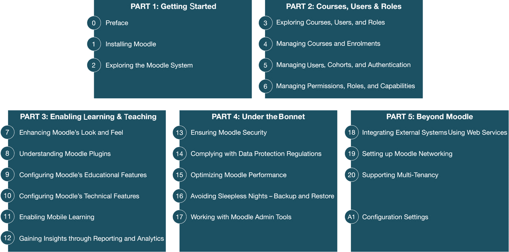

# 前言

自 2002 年推出以来，Moodle 已成为衡量每个学习管理系统基准的标杆。它赢得了广泛的国际赞誉，并确立了自己作为教育工具和服务的生态系统的地位。

Moodle 有两种版本：**Moodle LMS**和**Moodle Workplace**。

Moodle LMS 是 Moodle 的原始版本，针对教育机构，如学校、学院、大学和培训机构。Moodle Workplace 是为企业和组织培训设计的，从而成为一个强大且灵活的工作场所学习平台。

虽然这本书涵盖了 Moodle LMS 的管理，但它也可以与 Moodle Workplace 一起使用，因为后者是前者的扩展。本书将提供有关 Moodle Workplace 的参考和示例。

以地铁/地下/地铁地图的形式展示各种 Moodle 主题是一种有趣的方式，其中任何图标式站点都代表仅适用于 Moodle Workplace 的功能（您可以从[www.openumlaut.com](http://www.openumlaut.com)下载多种语言的高质量版本和最新功能）：


图 P.1 – Moodle 和 Moodle Workplace 地图

《Moodle 4 管理指南》是一本全面、实用的 Moodle 站点管理指南。它涵盖了设置 Moodle、配置、日常管理任务以及高级选项以自定义和扩展 Moodle。

作者自 Moodle 问世以来一直处于前沿，他采用了问题解决的方法，使内容与你的日常操作保持一致。实际例子将帮助你为大型组织和小型实体 alike 设置 Moodle。

这是一个一站式参考，涵盖了你在管理任何形状和大小的 Moodle 站点时可能遇到的任务。它不仅涵盖了 Moodle 的核心功能，还包括一些第三方工具和插件，这些工具和插件将进一步增加你在处理管理任务时的灵活性和效率。

本书的第四版是从头开始编写的，以与 Moodle 的最新版本保持一致。它还增加了超过 120 个图表、清单和工作流程。希望你在管理你的 Moodle 系统时，会发现其内容有用。祝您 Moodling 愉快！

# 这本书是为谁而写的

这本书是为技术人员、系统管理员以及学术人员所写 – 也就是说，基本上是任何需要管理 Moodle 系统的人。无论你是在处理小规模的本地 Moodle 系统还是大规模的多站点**学习管理系统**（**LMS**），这本书都将帮助你完成任何管理任务。

一些基本的 Moodle 知识会有所帮助，但不是必需的。

## LMS 工作职能

Moodle 管理员是管理 Moodle 系统的 LMS 管理员。通过专门从事教育行业的招聘机构进行快速搜索，可以发现与 LMS 管理密切相关且数量不断增长的专用职位。以下是一些例子：

+   LMS 管理员（或 VLE 管理员或 MLE 管理员）

+   LMS 支持官员

+   LMS 架构师

+   LMS 工程师

+   LMS 协调员

此列表不包括在行政职能中定期执行的功能，例如 IT 支持。它也不包括在教育学领域经常承担 LMS 管理员工作的角色，例如学习技术专家或电子学习协调员。

LMS 管理员通常与负责 IT 系统、数据库和网络的工作人员紧密合作。在这些领域具备一些基本技能已被证明是有益的。此外，在拥有内容管理系统、学生信息管理系统和其他相关基础设施的较大组织中，与其他部门的联系更有可能。

鉴于与 LMS 管理相关的角色数量不断增加，让我们来看看一些关键的工作职能义务以及哪些技能是基本和可取的。

## LMS 管理员的义务和技能集

LMS 管理员的职责因组织而异。然而，一些义务在安装和设置中是共同的：

+   用户管理（学习者、教师和其他人员）

+   课程管理（课程规划）

+   模块管理（提供给用户的功能）

+   LMS 的外观和感觉（通常由网页设计师执行）

+   年末维护（如适用）

+   年初设置（如适用）

+   支持教学人员和学习者

除了这些通用的 LMS 特定功能外，您必须确保您的系统安全、稳定且性能良好。必须实施备份，必须设置监控，必须生成使用报告，并且必须定期进行系统维护。

如果您托管自己的系统，您将负责所有列出的任务以及更多。如果您的 LMS 托管在托管环境中，托管提供商将执行一些更接近系统级别的任务，因此他们必须对 Moodle 有很好的理解。无论如何，如果出现任何问题，如果他们需要新的功能，或者需要进行某些行政任务，您将是首先被员工和学习者联系的人。

*权力越大，责任越大！*

# 本书涵盖的内容

本书分为五部分，如下图所示：



图 P.2 – 书籍结构

## 第一部分：入门

这两个初始章节将帮助您入门。您将学习如何安装 Moodle 以及如何保持其更新。您将进一步熟悉 Moodle 系统和其用户界面。本部分包括以下章节。

*第一章*，*安装 Moodle*，介绍了最适合您组织的 Moodle 设置，包括软件和硬件要求。您将学习如何在 Moodle 更新选项详细说明之前，在 LAMP 环境中安装 Moodle。在整个章节中，您将学习如何使用 Moodle 的**命令行界面**（**CLI**）、Git 和第三方 Moodle Shell（Moosh）执行所描述的操作。

*第二章*，*探索 Moodle 系统*，涵盖了学习平台的基本构建块。首先，我们介绍了 Moodle 架构——即主要 Moodle 组件——以及其数据和代码的存储位置。然后，您将获得通过其直观的用户和管理界面在 Moodle 中找到路径的技能，以及如果需要在哪里寻求帮助。最后，您将学习 Moodle 的文件管理是如何工作的以及如何配置回收站。

## 第二部分：课程、用户和角色

课程、用户和角色是 Moodle 的骨架。您将学习如何管理课程和类别，以及将用户注册到课程的不同选项。然后，我们将处理用户和群体的管理以及如何设置不同的身份验证方法。最后，您将学习如何通过在不同环境中应用角色和能力来管理权限。本部分包括以下章节。

*第三章*，*探索课程、用户和角色*，为您提供了对 Moodle 课程、用户和角色的概述。它涵盖了关键概念的基础知识，并展示了三个核心元素是如何内在交织在一起的。

*第四章*，*管理课程和注册*，展示了如何设置新的课程（手动和批量）并将它们组织到类别中。您将学习如何添加自定义课程字段和处理课程请求。本章的其余部分涉及一系列注册选项，包括 Moodle 的内部注册（手动、自助和访客）、群体注册和同步，以及数据库驱动的注册——例如，通过 LDAP、元课程和支付驱动的注册。

*第五章*，*管理用户、群体和身份验证*，解释了如何在您的系统中管理用户。我们首先介绍用户资料的样子以及它们可以如何扩展，然后介绍（手动和批量）标准用户操作。然后，我们解释如何手动添加用户到 Moodle——即一个接一个地以及通过批量上传——然后处理群体。然后，我们将了解 Moodle 为我们配备的众多身份验证机制。最后，我们将讨论用户命名方案的最佳实践。

*第六章*，*管理权限、角色和能力*，指导您进行权限管理。这涉及将角色和能力应用于不同环境中的用户。在处理任何与行政角色和上下文相关的设置（包括上下文冻结）之前，我们将介绍角色的分配、现有角色的修改和新角色的创建。

## 第三部分：启用学习和教学

本部分是关于您作为管理员如何确保为您的学习者教师提供最佳的学习环境。您将了解 Moodle 外观和感觉的不同增强选项以及如何管理 Moodle 插件，涵盖教育和技术功能。本部分包括以下章节。

*第七章*，*增强 Moodle 的外观和感觉*，告诉您如何调整您的 Moodle 系统以符合您组织的公司品牌。我们将介绍系统外观的定制，您将学习如何在处理不同的登录流程和调整页眉之前如何更改关键页面的布局。我们还将进一步处理一些影响整个网站外观和感觉的工具：块抽屉、Atto HTML 编辑器、视频和音频，最后是用户导览。在您学习如何支持有辅助需求的用户之前，我们将简要介绍主题定制。

*第八章*，*理解 Moodle 插件*，详细解释了插件是什么以及如何通过第三方插件扩展您的 Moodle 系统。我们将介绍如何管理 Moodle 插件，包括它们的安装、配置和删除。最后，在介绍一些流行的扩展之前，您将能够区分好的插件和不太好的插件。

*第九章*，*配置教育功能*，处理您的 Moodle 系统的教育配置。涵盖的教学主题包括协作工具（博客、评论和标签）、内容创建功能（内容库和 H5P、LTI 平台和工具、过滤器、抄袭预防措施和许可证）、成绩和评估以及技能和激励措施的管理（能力、学习计划、徽章和证书）。

*第十章*，*配置技术功能*，处理您的 Moodle 系统的技术配置。涉及的技术主题包括同步和异步通信（聊天和 BigBlueButton、消息、通知和 RSS 订阅）、本地化（语言、日历和时间区）、存储库和作品集。

*第十一章*，*启用移动学习*，教您如何准备、配置和定制 Moodle 应用程序。在处理您的学习者可以使用应用程序之前必须采取的预备步骤之前，我们将涵盖 Moodle 提供的不同订阅，包括品牌移动应用程序。应用程序配置包括移动功能、通知、应用程序政策以及应用程序的外观和感觉。

*第十二章*，*通过报告和分析获得洞察力*，为您提供所需的工具来解释和分析 Moodle 收集的大量使用数据。我们将首先关注 Moodle 的自定义报告生成器，涵盖数据源、报告构建、报告受众和计划。在详细概述了底层的 Moodle 日志框架及其组件、事件和日志存储之后，您将学习如何与 Moodle 日志交互。最后，我们将处理两种使用日志作为其基础的报告技术：Moodle 统计和 Moodle 分析。

## 第四部分：内部结构

本部分涵盖了学习者和技术人员通常看不到但确保 Moodle 系统平稳运行至关重要的所有主题。您将学习如何确保安全性、遵守数据保护法规、优化 Moodle 性能、实施坚实的备份和恢复策略，以及使用有用的管理工具。本部分包括以下章节。

*第十三章*，*确保 Moodle 安全性*，专注于确保您的 Moodle 系统中的数据免受任何滥用。您将了解安全通知、用户安全、内容安全和系统安全。

*第十四章*，*遵守数据保护法规*，涉及数据隐私和个人数据的保护。您将了解 Moodle 对通用数据保护条例的实施，包括指定隐私官、管理政策、配置数据登记和应对主题访问请求。

*第十五章*，*优化 Moodle 性能*，确保您的 Moodle 系统发挥其全部潜力。我们将涵盖配置、监控和微调您的学习管理系统以实现最大速度。您将了解如何优化 Moodle 功能性能，并讨论提高速度与可能降低功能之间的权衡。然后，我们将介绍强大的**Moodle 通用缓存**（**MUC**），包括缓存类型、存储和定义。最后，您将学习如何配置各种系统相关性能设置，即会话处理、cron 管理、计划任务、全局搜索和系统路径。

*第十六章*，*避免失眠之夜 – Moodle 备份与恢复*，专注于确保在灾难发生时您的数据不会丢失。我们将涵盖课程备份、站点备份、系统备份以及从已备份的数据存档中恢复数据。您将了解两种使用备份和恢复功能的过程：规划年终流程和实施课程模板。

*第十七章*，*使用 Moodle 管理工具*，涵盖了帮助您完成特定管理任务的 Moodle 工具。这些包括站点管理员预设、数据库工具以及 CLI 脚本。我们还将探讨一些插件，特别是强大的 Moodle Shell，Moosh。

## 第五部分 – Moodle 之外

没有 Moodle 是孤岛。虽然许多 Moodle 系统是独立运行的，但在某些情况下，您的 LMS 必须与外部实体合作，无论是通过 Web 服务与其他系统交换数据，连接不同的 Moodle 实例，还是支持多个租户。本部分处理设置此类拓扑，并包括以下章节。

*第十八章*，*使用 Web 服务集成外部系统*，探讨了通过 Web 服务将 Moodle 与其他系统集成的途径。在学习如何设置外部系统和控制 Moodle 的用户之前，我们将提供有关 Moodle Web 服务基本概念的信息。

*第十九章*，*设置 Moodle 网络*，告诉您如何通过对等设置或通过 Moodle 中心连接不同的 Moodle 系统。您还将进一步了解如何启用 MoodleNet，这是一个用于查找、分享和整理开放教育资源的平台。

*第二十章*，*支持多租户*，讨论了在 Moodle 中设计和实现多租户的不同方法和模型。我们区分了不同的多租户设置：按类别多租户、按隔离系统多租户和 Moodle Workplace 中的多租户。

*附录*，*配置设置*，为您提供可以修改 Moodle 配置文件中的参数列表以及每个值的影响。涵盖的领域包括管理设置和系统设置。

# 为了充分利用这本书

对于 Moodle，您必须在您的服务器上运行以下组件（截至撰写时为 4.0 版本）：

+   **数据库**：MySQL（版本 5.7 或更高版本，使用符合 ACID 的 InnoDB 存储引擎）、PostgreSQL 10+、MariaDB 10.2.29+、Aurora MySQL（在 Amazon Web Services 上）、Microsoft SQL Server 2017+和 Oracle 11.2+。

+   **Web 服务器**：Apache 是首选的 Web 服务器选项，但 Moodle 与支持 PHP 的任何其他 Web 服务器都兼容，例如 Microsoft IIS。

+   **PHP** 7.3.0 是运行 Moodle 4 的最低 PHP 版本；从 Moodle 4.1 开始，最低版本为 PHP 7.4.0。PHP 8 也得到支持。

+   `curl`、`ctype`、`dom`、`fileinfo`、`gd`、`hash`、`iconv`、`intl`、`json`、`mbstring`、`openssl`、`pcre`、`simplexml`、`spl`、`xml`、`xmlreader`、`zip`和`zlib`。

根据您的具体设置，可能需要额外的软件。

如果您无法访问前面的组件，请确保您对 Moodle 系统有完整的管理员访问权限。您将无法执行任何系统级操作，但可以通过其 Web 界面完全管理 Moodle。

# 下载彩色图像

我们还提供了一份包含本书中使用的截图和图表的彩色图像的 PDF 文件。您可以从这里下载：[`packt.link/PnRUP`](https://packt.link/PnRUP)

# 使用的约定

本书使用了多种文本约定。

`文本中的代码`：表示文本中的代码单词、数据库表名、文件夹名、文件名、文件扩展名、路径名、虚拟 URL、用户输入和 Twitter 昵称。以下是一个示例：“为了防止`dataroot`可访问，将目录移出 Web 目录，并相应地修改`config.php`，通过更改`$CFG->dataroot`条目。”

代码块设置如下：

```php
/* Change toolbar background color to orange */
```

```php
.toolbar-background
```

```php
{
```

```php
  background: orange;
```

```php
}
```

**粗体**：表示新术语、重要单词或屏幕上看到的单词。例如，菜单或对话框中的单词在文本中显示如下。例如，“转到**常规** | **高级功能**并勾选**启用移动设备 Web 服务**选项。”

小贴士或重要注意事项

看起来是这样的。

# 联系我们

我们始终欢迎读者的反馈。

**一般反馈**：如果您对本书的任何方面有疑问，请通过 customercare@packtpub.com 给我们发邮件，并在邮件主题中提及书名。

**勘误表**：尽管我们已经尽最大努力确保内容的准确性，但错误仍然可能发生。如果您在这本书中发现了错误，我们将不胜感激，如果您能向我们报告，我们将不胜感激。请访问[www.packtpub.com/support/errata](http://www.packtpub.com/support/errata)并填写表格。

**盗版**：如果您在互联网上以任何形式发现我们作品的非法副本，我们将不胜感激，如果您能提供位置地址或网站名称，我们将不胜感激。请通过 copyright@packt.com 与我们联系，并提供材料的链接。

**如果您有兴趣成为作者**：如果您在某个领域有专业知识，并且您有兴趣撰写或为书籍做出贡献，请访问[authors.packtpub.com.](http://authors.packtpub.com.)

# 分享您的想法

一旦您阅读了《Moodle 4 管理指南》，我们很乐意听听您的想法！请[点击此处直接访问此书的亚马逊评论页面](https://packt.link/r/1801816727)并分享您的反馈。

您的评论对我们和科技社区非常重要，并将帮助我们确保我们提供高质量的内容。

# 下载这本书的免费 PDF 副本

感谢您购买这本书！

您喜欢在旅途中阅读，但无法携带您的印刷书籍到处走？您的电子书购买是否与您选择的设备不兼容？

别担心，现在，每购买一本 Packt 书籍，您都可以免费获得该书的 DRM 免费 PDF 版本。

在任何地方、任何时间、任何设备上阅读。直接从您最喜欢的技术书籍中搜索、复制和粘贴代码到您的应用程序中。

优惠不会就此停止，您还可以获得独家折扣、时事通讯和每日免费内容的每日访问权限

按照以下简单步骤获取福利：

1.  扫描下面的二维码或访问以下链接


https://packt.link/free-ebook/9781801816724

1.  提交您的购买证明

1.  就这样！我们将直接将您的免费 PDF 和其他福利发送到您的邮箱
