# 1

# 安装 Moodle

在本章的第一部分，我们将开始安装 Moodle。

在提供概述描述最合适的设置之后，我们将概述必要的软件和硬件要求，然后再介绍以下安装：

+   在 LAMP 环境中安装 Moodle

+   通过**命令行****界面**（**CLI**）安装 Moodle

+   手动和通过 CLI 以及 Git 升级 Moodle

我们不会涵盖除 Linux 以外的操作系统的安装，但我们将提供一些针对 Windows 和 macOS 的资源指南。

Moodle 可以从单个讲师扩展到整个机构。我们只会涵盖*基本*安装，并介绍一些常见问题的解决方案。我们还将假设您熟悉基本的 Linux 系统管理。

在本章中，我们将涵盖以下主题：

+   准备您的 Moodle 安装

+   在 LAMP 环境中安装

+   通过命令行界面安装

+   更新 Moodle

# 准备您的 Moodle 安装

在开始安装 Moodle 之前，您必须决定哪种设置最适合您的组织。一旦您做出了决定，在您开始之前，您必须满足一些硬件和软件先决条件。

## 选择您的最佳设置

您可以在许多不同的环境中设置 Moodle。以下三个主要标准将帮助您确定正确的设置：

+   **灵活性**：如果您希望完全控制自己的系统，安装插件，能够调整系统设置，并频繁更改设置，您应该托管自己的服务器。然而，如果您更愿意只管理 Moodle，而其他人则负责操作系统、Web 服务器和备份，那么选择专业托管设置会更好，尤其是由授权 Moodle 合作伙伴提供的方案。

+   **可扩展性**：这完全取决于同时登录到 Moodle 的活跃学习者和教育者的数量。小型服务器上的 Moodle 将无法应对数百个同时登录的用户。另一方面，对于只有几十个学习者的小型机构来说，负载均衡集群将是过度配置。以下表格提供了一些针对不同类型教育组织的指示性设置：

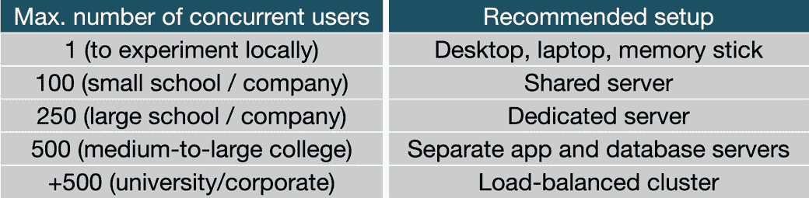

图 1.1 – 根据用户数量确定的 Moodle 设置

请记住，这些只是指示性数字，并非一成不变，还取决于这里提到的其他因素。

每个 Moodle 实例都必须安装在专用或共享服务器上，无论是内部托管还是外部托管。如果您决定走托管路线，强烈建议避免选择便宜的托管套餐，因为这些系统没有针对 Moodle 使用进行优化；它们的“一刀切”方法将显著影响系统的性能，尤其是在并发用户数量增加的情况下。

Moodle HQ 提供在 [moodlecloud.com](http://moodlecloud.com) 上的托管服务；然而，这些套餐有一些限制（具体数字取决于选择的计划）：用户限制、存储限制、无法安装插件或自定义主题，以及无法修改一些硬编码的管理设置。如果这些限制可以接受，那么在 [moodlecloud.com](http://moodlecloud.com) 上托管可能适合您的组织。

+   **成本**：预算限制无疑将发挥重要作用。除非您已经建立了适当的基础设施，否则将您的 Moodle 系统外部托管可能更经济有效，因为它可以节省您购买服务器和租赁 24/7 满足用户需求的数据连接的费用。如果您使用的是商业操作系统、Web 服务器和数据库系统而不是开源解决方案，许可费用将显著更高。无论如何，Moodle 都旨在支持适合您组织 IT 政策的广泛可能的底层基础设施。

除了这些三个影响底层基础设施决策的标准之外，其他因素，如**内部专业知识**、**与其他系统的兼容性**、**IT 政策**、**个人偏好**和**现有资源**，也会影响您的决策。

我们将介绍托管 Moodle 最受欢迎的操作系统——Linux。对于其他操作系统或配置，例如在虚拟化环境中或在多服务器集群上，请咨询您当地的 Moodle 合作伙伴（[moodle.com/solutions/certified-service-providers](http://moodle.com/solutions/certified-service-providers)）。一些托管公司提供一键快速安装；虽然由此产生的 Moodle 系统足以用于实验性站点，但它绝对不适合生产环境。

## 满足 Moodle 预先条件

在我们开始安装 Moodle 之前，必须满足一些硬件和软件要求。

### 硬件要求

这些要求适用于您自己托管 Moodle 或在外部服务器（共享、虚拟、专用或集群）上托管的情况。在更便宜的托管套餐中，硬件配置通常不足以高效运行 Moodle：

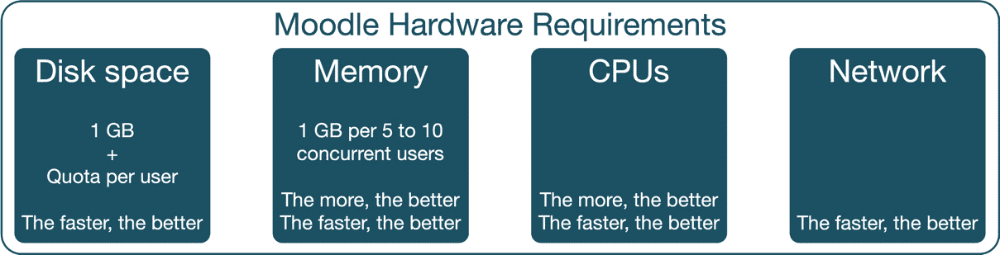

图 1.2 – Moodle 硬件

让我们更详细地看看这些要求：

+   **磁盘空间**：Moodle 本身大约占用 1 GB 的磁盘空间。然而，这仅为您提供一个裸系统，并不考虑您所需的任何学习资源空间。磁盘越快越好。RAID 磁盘推荐，但在较小安装中不是必需的。

+   **内存**：一个很好的经验法则是为每 5 到 10 个**并发**用户配备 1 GB 的 RAM。在基于 Windows 的系统上，由于操作系统的高开销，您必须将此计算加倍。在所有硬件组件中，RAM 对 Moodle 的性能影响最大。

重要提示

内存越多越好；内存越快越好。

+   **CPU**：处理器类型和速度也很重要，但不如内存重要。一如既往，CPU 越快越好，CPU 的核心越多，性能越强大。

+   **网络**：虽然 Moodle 可以在独立机器上运行，但其全部潜力在于网络环境中。快速的网络卡是必不可少的，如果 LMS 通过互联网访问，则良好的上传和下载速度也是必要的。

现在，让我们看看软件要求。

### 软件要求

虽然建议安装最新版本，但对于 Moodle 4，您必须在您的服务器上运行以下组件（有关特定版本的说明，请参阅 moodledev.io/general/releases）：

+   **数据库**：Moodle 正式支持以下数据库系统：MySQL（版本 5.7 或更高版本，使用符合 ACID 的 InnoDB 存储引擎）、PostgreSQL 10+、MariaDB 10.2.29+、Aurora MySQL（在亚马逊网络服务上）、Microsoft SQL Server 2017+ 和 Oracle 11.2+。

+   **Web 服务器**：Apache 是首选的 Web 服务器选项，但 Moodle 与支持 PHP 的任何其他 Web 服务器都兼容，例如 Microsoft IIS。

+   `php.ini` 或 `.htaccess` 文件（更多详情请参阅 docs.moodle.org/en/Installing_Moodle）。

+   `curl`, `ctype`, `dom`, `fileinfo`, `gd`, `hash`, `iconv`, `intl`, `json`, `mbstring`, `openssl`, `pcre`, `simplexml`, `spl`, `xml`, `xmlreader`, `zip`, 和 `zlib`

+   `exif`, `soap`, `sodium`, `tokenizer`, 和 `xmlrpc`

+   `mysql`, `odbc`, 和 `pgsql`（根据数据库）以及 `ldap`, `ntlm` 和其他（根据所使用的身份验证机制）

根据您的具体配置，可能需要额外的软件。假设数据库、Web 服务器、PHP 和扩展已经正确安装，因为这不是 LMS 管理员的任务。一旦这样，我们就可以开始了。

重要提示

要访问 Moodle，需要一个现代的 Web 浏览器（Firefox、Google Chrome、Edge 或 Safari 的最新版本）。

在开始安装过程之前，熟悉 Moodle 的发布和版本是有益的。

## 理解 Moodle 版本

Moodle 版本遵循严格的日历，该日历定期在 [moodledev.io/general/releases](http://moodledev.io/general/releases) 上发布和更新。如果计划中的功能尚未准备好进行即将发布的版本，它将被移至下一个版本；也就是说，发布日期永远不会改变，但引入功能的时间可能会变化。

**主要版本**（4.0、4.1 等）的发布频率为每年两次（五月的第二个星期一和十一月的第二个星期一）。

Moodle 在三月的第二个星期一、五月的第二个星期一、七月的第二个星期一、九月的第二个星期一和十一月的第二个星期一发布 **次要版本**（4.1.1、4.1.2 等）。在严重安全问题或重大回归被修复的情况下，也适用于非计划发布。

Moodle 区分两种类型的发布：

+   **标准支持版本**：将修复 12 个月的错误，并提供 18 个月的安全支持

+   **长期支持版本**：将修复 12 个月的错误，并提供 36 个月的安全支持

简化的发布日历如下所示；更详细版本可在 [moodledev.io/general/releases](http://moodledev.io/general/releases) 找到：

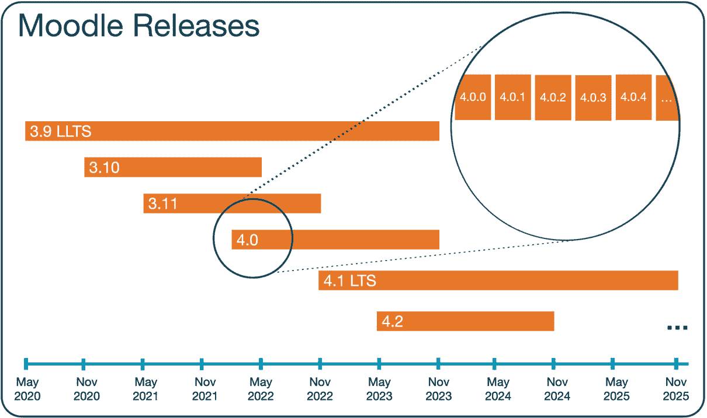

图 1.3 – Moodle 发布

当 Moodle 4.0 在 2022 年 4 月发布时，版本 3.9 到 3.11 仍然受到支持。到 Moodle 4.1 发布时，只有版本 3.9 将受到支持，因为其生命周期已被延长（因此有长期支持标签），以便管理员有更多时间升级到 4 分支。

如果你希望了解未来的发布情况，请查看 Moodle 的路线图 [moodledev.io/general/community/roadmap](http://moodledev.io/general/community/roadmap)，在那里你可以找到所有 Moodle 产品和服务的未来技术发展的当前计划。

好的，版本号和发布日期就说到这里。让我们学习如何安装（最新版本的）Moodle。

# 在 LAMP 环境中的安装

Moodle 使用 Apache、MySQL 和 PHP（称为 **LAMP 堆栈**）在 Linux 上开发。如果你有选择，这是首选的环境。关于 PostgreSQL 是否是更合适的数据库选项，目前存在持续的争论，但我们将坚持使用 MySQL/MariaDB，因为这是大多数管理员熟悉的系统。此外，一些组织可能绑定在 Microsoft SQL 或 Oracle 上。如果这种情况适用，请参阅相应的安装指南，因为这超出了本书的范围。

高级安装过程在以下流程图中展示：

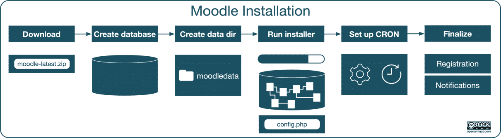

图 1.4 – Moodle 安装过程

我们将在接下来的子节中逐一介绍每个阶段，涵盖 Linux 环境中的每个安装步骤。对于其他操作系统，我们不会涉及；以下是一些应该能帮助你开始的提示：

+   对于用户数量较少的 Windows 服务器，基于 **XAMPP** 的 Moodle 发行版是合适的。XAMPP 是一个免费的 Apache 发行版，包含 MySQL 和 PHP（以及 Perl），适用于多个操作系统。Windows 的 Moodle 发行版充分利用了 XAMPP，位于 [download.moodle.org/windows](http://download.moodle.org/windows)。该安装适用于所有最新的 Windows PC 和服务器版本。

+   对于较大的 **Windows** 安装，您必须手动安装 Moodle，这涉及到安装数据库服务器（MS SQL 或任何其他支持的系统）、一个网络服务器（Microsoft IIS 或 Apache）和 PHP。您可以在 [docs.moodle.org/en/Windows_installation](http://docs.moodle.org/en/Windows_installation) 找到有关此过程的详细信息。

+   **MAMP** 是一个免费的发行版，包含 Apache（以及 Nginx）、MySQL 和 PHP，适用于 macOS。与它的 Windows 版本类似，macOS 的 Moodle 发行版仅适用于本地安装，而不适用于生产环境。Moodle4Mac 通过 MAMP 提供通用二进制文件，位于 [download.moodle.org/macosx](http://download.moodle.org/macosx)。

现在，让我们通过下载 Moodle 开始安装过程。 

## 下载 Moodle

访问 [download.moodle.org](http://download.moodle.org) 并选择最新版本：

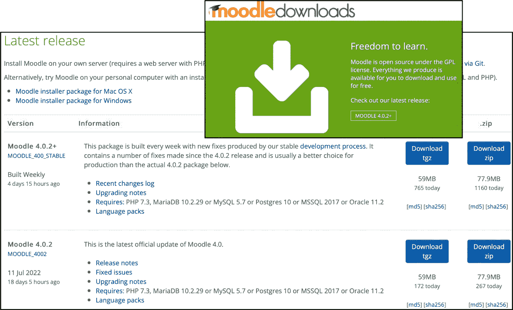

图 1.5 – Moodle 下载

新版本可能在您阅读此内容时已经可用。如果您想使用本书所写的 4.0.x 版本，请选择 **其他支持的版本**；否则，您可以自由选择最新的稳定构建；本书中的大多数内容仍然适用。

Moodle 的下载站点上有五种类型的构建版本可供选择：

+   **最新版本**：当前 Moodle 版本有两个版本：最新的稳定构建和最新的官方版本。最新的稳定版本每周（每周三）创建一次，是新建服务器的最佳选择。最新的官方版本包含稳定构建和新修复，但该版本尚未经过每周代码审查，可能包含未解决的问题。

+   **其他支持的版本**：Moodle 开发团队维护比当前版本更早的版本，如前面的发布计划中所述。

+   **仅支持安全的版本**：影响安全或数据丢失的关键修复将提供给下一个版本，但不会回滚其他错误修复。请参阅之前提供的 Moodle 版本信息。

+   **旧版本**：对于旧版本，将提供最后一个构建。然而，这些版本不再维护。

+   **开发版本**：Moodle 还提供了下载软件的测试版（如果可用）和最新开发版本的选项。这些版本仅应下载用于测试或开发目的，绝不应在生产环境中使用！

每个版本都提供两种压缩格式：TGZ（使用`tar`命令解压）和 ZIP（使用`unzip`命令提取）。您可以通过点击相应的链接下载它们，或者如果您有（安全的）shell 访问权限，可以使用`wget`命令直接检索文件：

```php
wget http://download.moodle.org/moodle/moodle-latest.zip
```

重要提示

您安装 Moodle 的位置被称为**dirroot**。

如果您使用**Moodle Shell**（**MOOSH**），这在*第十七章*中详细描述，*使用 Moodle 管理工具*，您可以使用以下命令下载 Moodle 的最新稳定分支：

```php
moosh download-moodle
```

一旦您将文件移动到您想在 Web 服务器上安装的位置（`dirroot`），请使用`unzip`命令或`tar`（如果您下载了 TGZ 版本）提取文件：

```php
unzip moodle-latest.zip
```

```php
tar xvfz moodle-latest.tgz
```

如果您将整个文件夹放置在您的 Web 服务器文档目录中，网站将位于 www.yourwebserver.com/moodle。要从 www.yourwebserver.com 访问您的网站，请直接将内容复制到主 Web 服务器的文档目录中。

重要提示

通过该 URL 访问 Moodle 被称为**wwwroot**。

下载步骤完成后，您必须创建 Moodle 用于存储其数据的数据库。

## 创建 Moodle 数据库

Moodle 需要一个数据库来存储其信息。虽然共享现有数据库是可能的，但为 Moodle 创建一个单独的数据库强烈推荐。添加新数据库可以通过托管服务器提供的 Web 界面完成，或者通过命令行。

### 使用托管服务器

大多数托管提供商都提供了一个专用的 Web 界面来执行基本的数据库操作。或者，您可以使用**phpMyAdmin**，这是一种开源软件，允许您通过 Web 管理 MySQL 数据库。phpMyAdmin 是大多数 Linux 发行版和许多控制面板的一部分，但它通常配置为不允许创建新数据库。如果这种情况发生，您必须从控制面板中的数据库管理器创建数据库。

phpMyAdmin 允许您在单个操作中执行两个步骤——创建数据库和添加新用户，如下面的屏幕截图所示。我们将创建一个用户`packt`，并检查**使用相同名称创建数据库并授予所有** **权限**选项：

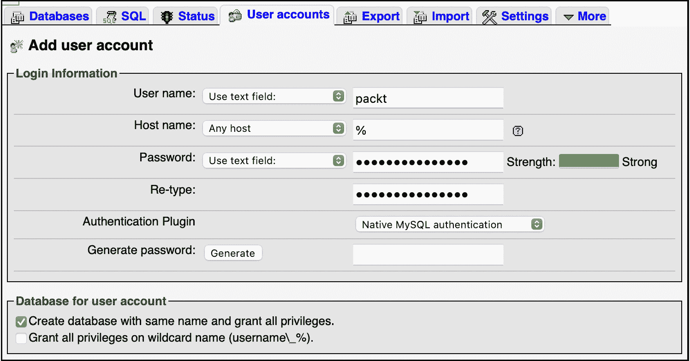

图 1.6 – 在 phpMyAdmin 中创建 Moodle 数据库和用户

虽然您可以使用现有的数据库用户账户，但为 Moodle 数据库创建一个专用用户是良好的实践。

重要提示

不要使用 MySQL root 账户为您的 Moodle 数据库！

您不需要创建任何表；Moodle 将在安装过程中填充数据库。

通过 Web 界面创建 Moodle 数据库很简单，但大多数技术管理员更喜欢通过命令行工作。

### 使用命令行

如果您没有访问创建 MySQL 数据库和用户账户的 Web 界面，或者如果您更喜欢使用 Linux shell，您可以通过命令行执行这些步骤：

1.  通过输入 `mysql -root -p` 启动数据库命令行工具，并在提示符下输入密码。

1.  通过输入 `CREATE DATABASE packt;`（所有 MySQL 命令都必须以分号结尾）创建一个数据库（称为 `packt`）。

1.  通过输入 `ALTER DATABASE packt DEFAULT CHARACTER SET utf8 COLLATE utf8_unicode_ci;` 将默认字符集和校对顺序设置为 `UTF8`。

1.  创建一个用户和密码（此处为 packt@localhost 和 password），并通过输入 `GRANT SELECT, INSERT, UPDATE, DELETE, CREATE, CREATE TEMPORARY TABLES, DROP, INDEX, ALTER ON packt.* TO packt@localhost IDENTIFIED BY 'password';` 授予数据库访问权限。

1.  通过输入 `QUIT` 退出 MySQL 命令工具。

必须使用以下命令行重新加载授权表：

```php
mysqladmin -u root -p reload
```

通过这样，您已经设置了数据库。现在您需要做的就是创建 Moodle 的数据目录。然后，您就可以开始安装 Moodle 本身了。

## 创建 Moodle 数据目录

Moodle 将其大部分信息存储在您刚刚创建的数据库中。然而，上传的文件，如作业、课程图片或用户图片，则存储在单独的目录中。Moodle 中的此数据目录通常被称为 **moodledata**。

重要提示

存放您的 Moodle 数据文件的地址被称为 `dataroot`。

之后，Moodle 安装程序将尝试创建此目录，但在某些配置中，由于安全限制，此操作可能会失败。为了安全起见，最好手动创建 `moodledata` 或通过某些系统提供的基于 Web 的文件管理器创建。

重要提示

在您的服务器上创建 `moodledata` 的位置至关重要，这样它就不能被公开访问——也就是说，在您的网页目录之外。

`moodledata` 是所有课程作者和学习者上传的文件存储的地方，因此请确保其尺寸足够。您还可以考虑在单独的分区中创建 `moodledata`。

任何 `moodledata` 权限应该是 `rwxrwx---`（`chmod –R 0770 moodledata`）。如果您使用 `0777`，服务器上的每个人都将能够访问这些文件。

通过输入 `chown –R apache:nobody moodledata` 将目录的用户和组更改为您的 Web 服务器（通常将是 `apache` 或 `www-data` 和 `nobody` 或 `www-data`）。

如果您没有权限在安全位置创建数据目录，请在您的家目录中创建 `.htaccess` 文件，并确保它包含以下两行：

```php
order deny,allow
```

```php
deny from all
```

这两个设置可以防止用户在没有相应权限的情况下访问文件。

我们已经完成了前三个步骤——下载 Moodle、创建数据库和准备 `moodledata`——这些是运行安装脚本的前提条件。

## 运行安装脚本

安装脚本执行两个主要操作 – 填充数据库和创建配置文件 `config.php`。通过在您的网页浏览器中输入 `wwwroot`（您复制 Moodle 的位置）的 URL 来启动 Moodle 安装程序；Moodle 将识别它尚未安装，并自动开始此过程。

Moodle 安装程序必须设置一个会话 cookie。如果您的浏览器已被配置为触发警告，请确保您接受该 cookie。

第一个屏幕允许您选择安装过程中要使用的语言 – 这不是 Moodle 所使用的区域设置，只是安装的语言：

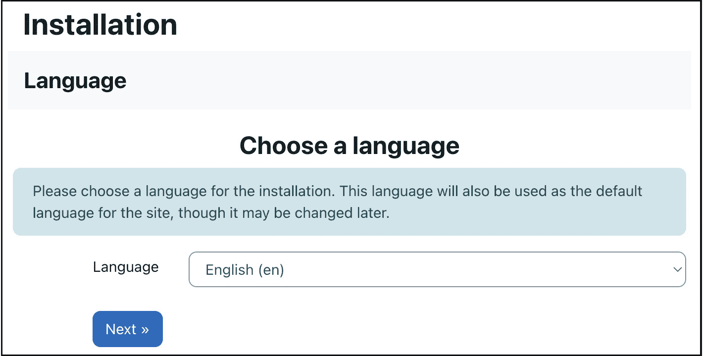

图 1.7 – Moodle 安装 – 选择语言

以下截图显示了 `wwwroot`（`dirroot`）条目和 `dataroot` 条目的预期值；您可能需要修改 `moodledata` 的不同之处：

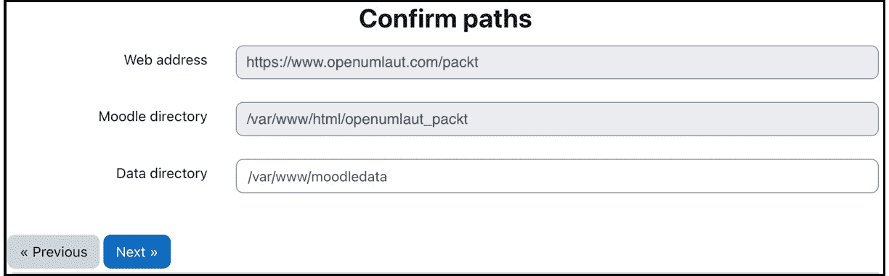

图 1.8 – Moodle 安装 – 确认路径

如果 `dataroot` 无法找到或没有正确的权限，将显示包含详细信息的错误消息。如果 `dataroot` 可以直接通过网页访问且不安全，也适用同样的情况。

您必须在以下屏幕上选择您希望使用的数据库。在我的系统上仅安装了 MySQL、MariaDB、Aurora MySQL 和 PostgreSQL 驱动程序。如果您想使用 Oracle 或 MS SQL Server 等其他数据库系统，则必须首先安装相应的 PHP 扩展：

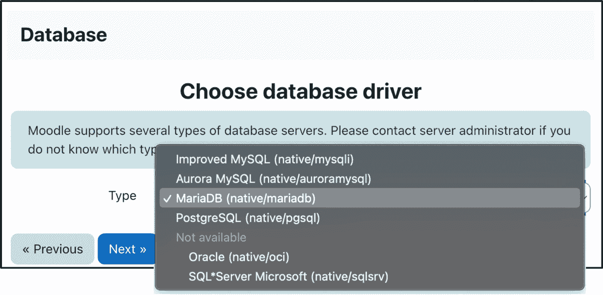

图 1.9 – Moodle 安装 – 选择数据库驱动

此界面使用之前已建立的配置详情。以下截图显示了所需的字段，但如果您选择了除 MySQL 之外的其他数据库驱动程序，则外观可能略有不同：

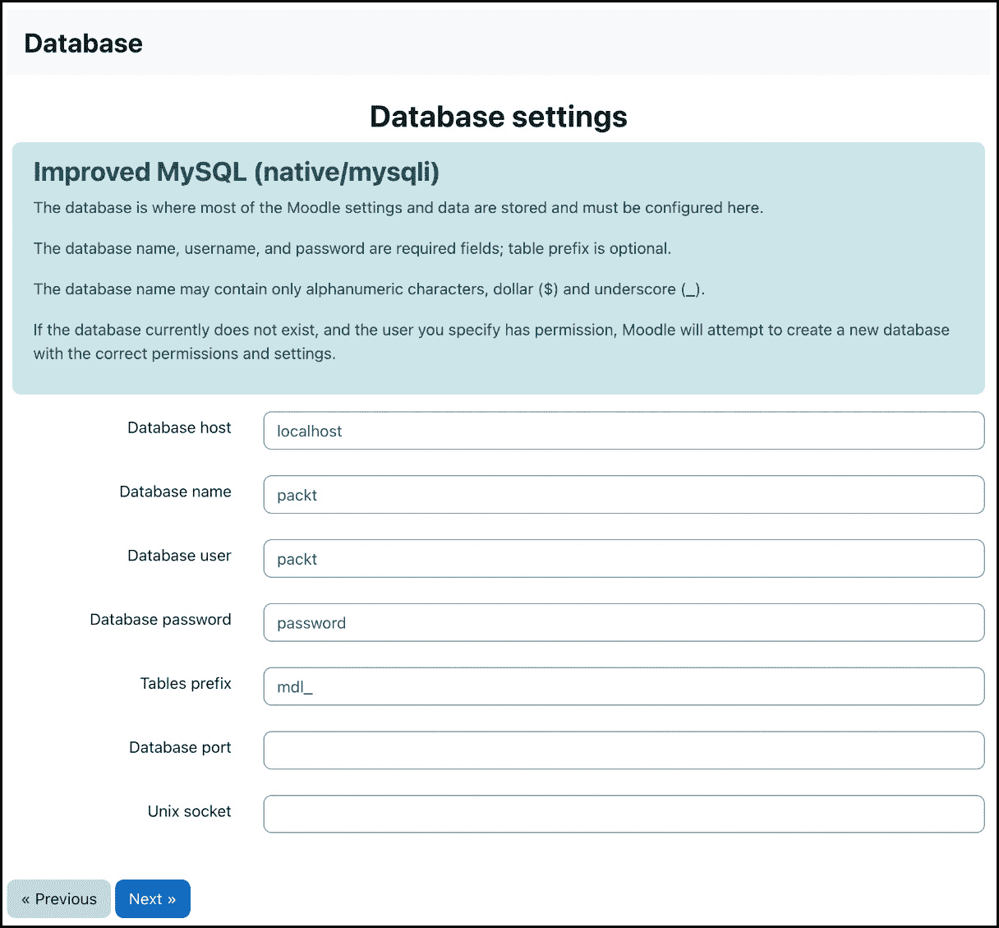

图 1.10 – Moodle 安装 – 数据库设置

`localhost` (`127.0.0.1`)，如果数据库位于与网页服务器相同的服务器上，这是正确的。如果它位于不同的服务器上，请指定 IP 地址（最好不解析以提高性能）。

Moodle 安装程序将创建的所有表都将以前缀 `mdl_` 开头。只有当您使用同一数据库运行多个 Moodle 安装时，才应更改 `Tables prefix` 条目。

接下来，Moodle 安装程序会检查某些组件是否已安装。并非所有模块都是必需的 – 请参阅本章的 *Moodle 系统要求* 部分，以及屏幕上的通知。安装程序还会验证关键的 PHP 设置。如果任何测试未通过，您必须返回到 *软件要求* 部分，解决任何问题，并在问题解决后重新启动安装过程。否则，某些功能可能无法正常工作，或者安装程序将不会继续，具体取决于模块的重要性：

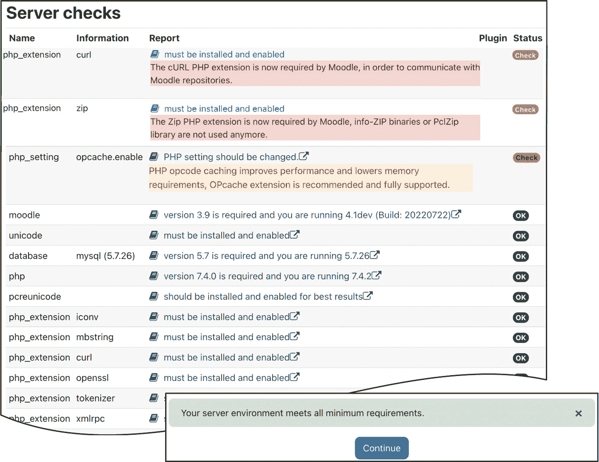

图 1.11 – Moodle 安装 – 服务器检查

当您确认了服务器检查屏幕后，安装程序将显示 Moodle 的版权声明，您必须确认。此屏幕的出现还意味着 Moodle 配置文件 `config.php` 已成功创建。如果创建失败（通常是因为权限不正确），安装程序将显示配置文件的内容。您将不得不从屏幕上复制文本，并将其手动粘贴到您的 `dirroot` 中的 `config.php`。

一旦您接受了协议（您可以在 [docs.moodle.org/dev/License](http://docs.moodle.org/dev/License) 找到完整的 GPL 许可证全文），所有数据库表都将创建。这个过程可能需要几分钟。

一旦创建并填充了表格，您将看到可以设置管理员账户的屏幕。默认的 **用户名** 是 admin，出于安全原因应将其更改。您必须填写以下自解释字段：**新密码**、**名字**、**姓氏**和**电子邮件地址**。在 *第五章*，*管理用户、班级和身份验证* 中，所有其他字段将详细解释：

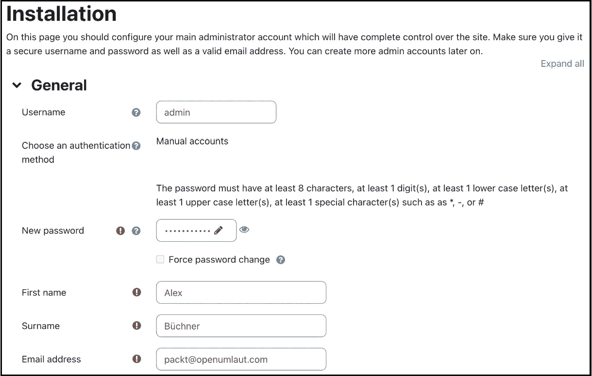

图 1.12 – Moodle 安装 – 设置管理员账户

安装脚本的最后一步要求您输入一些主页设置；即 **完整站点名称**、**站点简称**和**站点主页摘要**。这些主页设置可以在以后修改（请参阅 *第七章*，*增强 Moodle 的外观和感觉*）。

将 **默认时区** 项更改为您的服务器位置，而不是您的位置。安装程序允许您开启 **自动注册**。现在请暂时禁用此功能，直到您阅读了 *第五章*，*管理用户、班级和身份验证*。您还必须提供一个 **支持电子邮件**（用于您的用户查询）和一个 **无回复地址**（以避免电子邮件问题）。

一旦输入了这些信息并确认了屏幕，您就可以开始使用 Moodle 了。但是，首先，您必须设置 Moodle 维护脚本的执行。

## 设置 cron 进程

Moodle 必须定期执行大量后台任务。

重要提示

由**cron 进程**执行的**cron 脚本**执行 Moodle 的后台任务。

Moodle 文档中已经有一个关于 cron 的整个页面；您可以在[docs.moodle.org/en/Cron](http://docs.moodle.org/en/Cron)找到它。您必须设置 cron 进程；否则，任何定时 Moodle 功能，如计划备份、发送论坛通知、统计处理等，将无法工作。

脚本`cron.php`位于 admin 目录中，可以通过网络浏览器手动触发（如果安全设置允许）。一旦执行，脚本输出（`<yoursite>/admin/cron.php`）将显示在屏幕上，然后您需要手动导航回您的 Moodle 系统。

有几种方法可以调用 cron 脚本。最受欢迎的选项是通过`wget`命令：

```php
wget –q –O /dev/null http://<yoursite>/admin/cron.php
```

然而，如果这不符合您的设置，请查看[docs.moodle.org/en/Cron](http://docs.moodle.org/en/Cron)以获取替代方案。

大多数控制面板都允许您通过 cron 作业管理工具设置计划任务。请注意，这不是 Moodle 的一部分，而是您托管套餐的一部分。或者，您也可以创建一个 crontab 条目，这是一个位于`/etc`目录中的文件，其中包含所有系统范围的 cron 条目。此文件也可以使用`crontab -e`手动编辑，但请确保语法正确！

要每分钟运行 CLI cron 脚本，请添加以下行，将`<yourpath>`替换为您的 Moodle 系统所在的目录（`dirroot`）：

```php
* * * * * /usr/bin/php <yourpath>/cron.php >/dev/null
```

重要提示

强烈建议每分钟运行 cron 进程！

就这些了。Moodle 现在已准备好使用。下一节将介绍您应该快速完成的两个可选步骤。

## 完成安装

要确保 Moodle 运行无问题，请转到**常规**标签页的**站点管理**菜单中的**通知**：

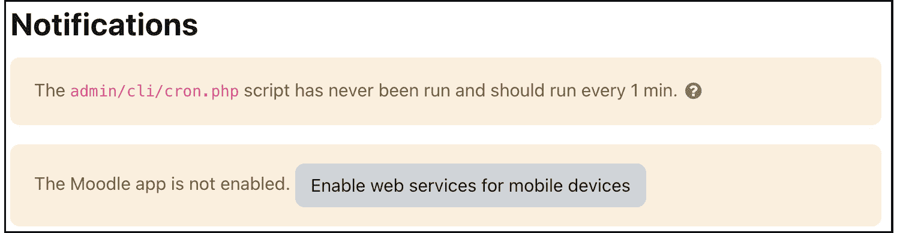

图 1.13 – Moodle 安装 – 检查系统通知

在我的安装中，有两个问题 – cron 脚本尚未配置，移动应用尚未启用。我需要修复前者问题；后者可以等到*第十一章*，*启用移动学习*。**通知**区域可能会出现其他消息，您应立即解决它们。

Moodle 在其[moodle.net/stats](http://moodle.net/stats)上提供了一些关于其使用的统计数据，要包含在这些数字中，您必须通过**站点管理** | **常规** | **注册**注册您的 Moodle 站点。Moodle 注册是可选的且免费的，您可以选择公开哪些信息。

重要提示

即使您选择不提供您站点的任何使用模式，仍然强烈建议您注册以接收有关新 Moodle 版本、安全警报和其他重要新闻的信息。

以下为注册表单，以及来自公共统计数据的屏幕截图：

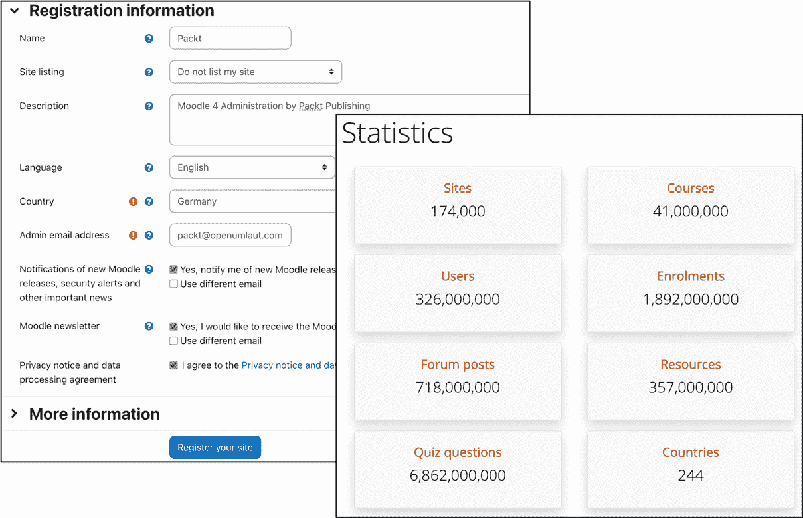

图 1.14 – Moodle 注册和统计数据

这完成了在 LAMP 环境中 Moodle 的安装过程。如果您在这些说明中没有遇到任何问题，或者您的设置与描述的不同，请访问 [docs.moodle.org/en/Installing_Moodle](http://docs.moodle.org/en/Installing_Moodle)，在那里提供了更多安装细节，并且详细说明了例外情况。

通过网页界面安装 Moodle 的另一种方法是使用 **命令行界面**（**CLI**），这是下一节的主题。

# 通过命令行界面安装

Moodle 提供了一个 CLI，让您可以从 Unix 命令行提示符执行多个管理任务。Windows 系统没有 CLI。基于 CLI 的安装对于需要自动设置的环境很有用，例如，在托管多个 Moodle 实例的环境中。

CLI 不适合胆小的人，所以使用时要小心。您必须以网络服务器用户身份执行安装脚本，通常是 `www-data` 或 `apache`。您可以在交互模式下运行安装脚本 `install.php`（您将需要手动输入任何参数）或非交互模式，其中脚本将静默运行。

从您的 `dirroot`，您可以按照以下方式启动交互式脚本：

```php
sudo –u www-data /usr/bin/php admin/cli/install.php
```

更有趣的是 CLI 的非交互模式，因为这样可以用于脚本和自动化目的。可以使用 `--help` 命令显示所有可用参数的列表：

```php
sudo –u www-data /usr/bin/php admin/cli/install.php --help
```

执行命令的输出显示在下述屏幕截图中：

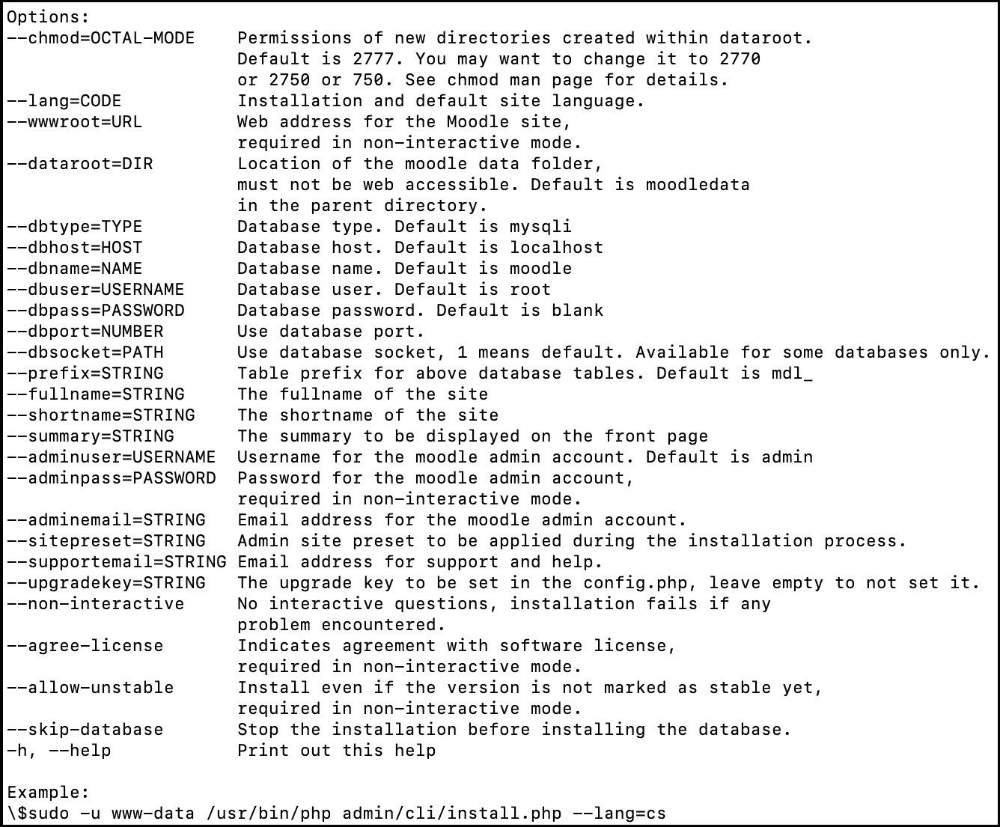

图 1.15 – 通过 CLI 安装 Moodle

一个示例命令行可能看起来像以下这样，您将需要根据您的本地设置调整参数：

```php
sudo -u www-data /usr/bin/php admin/cli/install.php --wwwroot=http://123.54.67.89/moodle --dataroot=/var/moodledata/ --dbtype=mysqli --dbhost=localhost --dbname=moodle --dbuser=moodle --dbpass=password --fullname=moodle4 --shortname=moodle4 --adminpass=Password123! --non-interactive --agree-license
```

可以通过 CLI 管理更多 Moodle 任务，例如重置密码或将 Moodle 设置为维护模式。我们将在本书的适当位置展示相关语法，并在 *第十七章* *与 Moodle 合作* *管理工具* 中专门介绍 CLI。

一旦您的 Moodle 系统启动并运行，您需要确保它保持最新。以下章节将介绍手动和通过命令行更新 Moodle。

# 更新 Moodle

我们在本章前面提供了 Moodle 发布日历的概述。通常不需要安装每个小版本发布；然而，有几个场景您应该升级您的 Moodle 系统：

+   已发布安全补丁

+   已添加新功能

+   已修复影响您设置的 bug

+   已发布一个主要版本

+   您的设置支持周期即将结束

Moodle 系统主要可以通过两种方式更新：你可以手动运行更新（使用 Web 界面或 CLI）或者使用 Git 命令保持更新。这两种过程将在本节中描述。

无论哪种方式，在开始之前，请确保将 Moodle 置于维护模式，以确保在更新期间没有其他用户登录。转到**站点管理** | **服务器** | **维护模式**，选择**启用**维护模式，并输入维护信息：

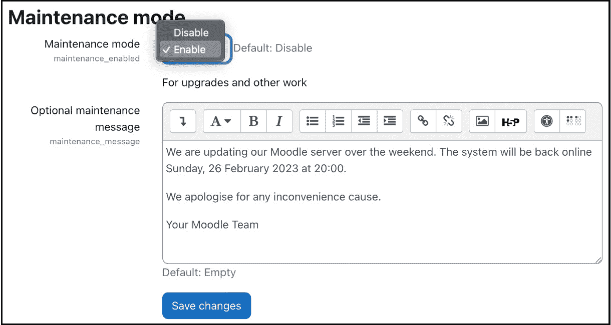

图 1.16 – 启用维护模式

您也可以使用 Moodle 的 CLI 将其置于维护模式，如下所示：

```php
sudo –u www-data /usr/bin/php admin/cli/maintenance.php --enable
```

使用`--enablelater=MINUTES`标志，您可以在进入 CLI 维护模式之前指定时间段，这在运行自动更新时很有用。

要切换回正常模式，请使用`--disable`参数而不是`--enable`，如下所示：

```php
sudo –u www-data /usr/bin/php admin/cli/maintenance.php –disable
```

一旦 Moodle 被置于维护模式，您就可以更新您的 Moodle 系统了。

## 手动更新 Moodle

手动更新 Moodle 的高级过程如下：

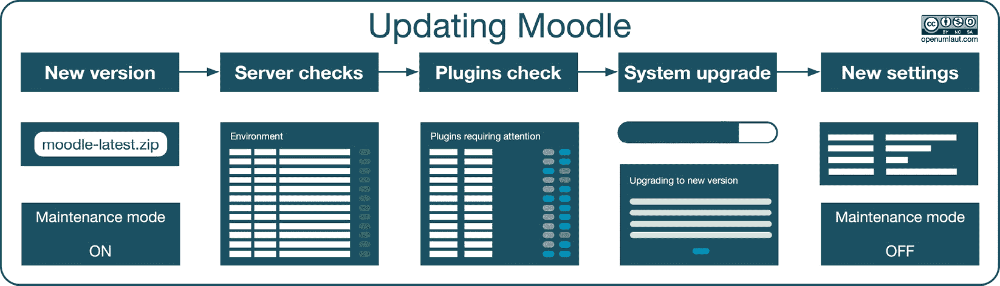

图 1.17 – 更新 Moodle

如果您从 Moodle 的先前版本更新，过程相同。但是，请务必查阅[docs.moodle.org/en/Upgrading](http://docs.moodle.org/en/Upgrading)中的升级文档，以了解任何特定版本的问题。

重要提示

您至少需要版本 3.6 才能直接更新到 Moodle 4。如果您是从更早的版本升级，您必须首先升级到 3.6。

在您安装新更新之前，强烈建议您运行`moodledata`和`dirroot`（特别是`config.php`）。

现在，让我们一步一步地通过更新工作流程：

1.  **新版本**

一旦您创建了备份，就是时候用最新代码替换旧版本的`dirroot`了。只需将新文件复制到现有文件上；现有文件将被覆盖，除了`config.php`，它不是下载包的一部分。

或者，您可以重命名旧的`dirroot`文件夹并创建一个新的目录。但是，您必须从旧目录复制以下文件和目录到新的`dirroot`：

+   `config.php`

+   `.htaccess`（如果存在）

+   任何已创建的主题文件夹

+   任何修改过的语言包

+   本地目录的内容

+   任何不在`local`中的第三方模块和自定义代码

一旦您前往 Moodle 站点的位置并以管理员身份登录，系统将识别到有新版本可用并自动启动安装程序。

第一屏显示新版本的构建（这里为 4.0.2）并要求您确认是否要继续升级：

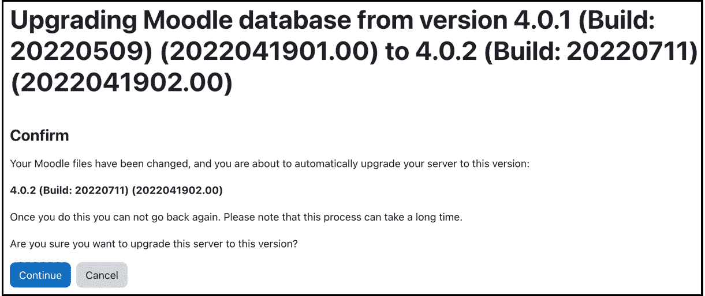

图 1.18 – 更新 Moodle – 新版本

1.  **服务器检查**

接下来，会显示一个屏幕，它链接发布说明并执行与安装期间描述的相同的服务器检查。

1.  **插件检查**

Moodle 插件，无论是核心（**标准**）还是第三方（**附加**），在升级 Moodle 时有时会引起问题。**源/状态** 列突出显示任何需要采取的行动或发现的问题，你应该解决任何问题。有关更多详细信息，请参阅 *第八章*，*理解 Moodle 插件*：

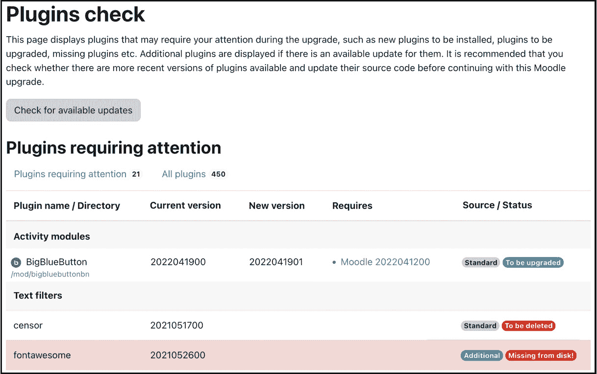

图 1.19 – 更新 Moodle – 插件检查

1.  **系统升级**

一旦确认此屏幕，实际的系统升级就开始了，在此过程中会创建新的数据库字段，并在必要时修改数据。

1.  **新设置**

Moodle 中添加的任何新系统设置都会显示出来，并且可以立即更改。例如，在以下屏幕截图中，已添加一个新的 **每页参与者数量** 参数：

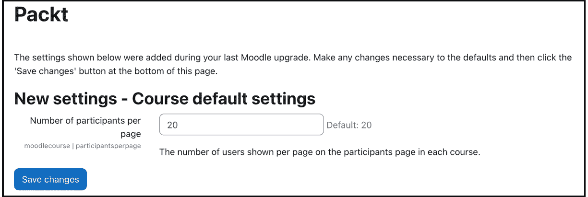

图 1.20 – 更新 Moodle – 新设置

一旦升级过程完成，请检查 **通知** 页面。同时，别忘了关闭 **维护模式**！

手动更新 Moodle 的一个替代方法是利用 CLI，我们将在下一小节中介绍。

## 通过 CLI 更新 Moodle

如预期的那样，Moodle 更新也可以使用已经讨论过的 CLI 来运行。一旦你备份了数据并更新到最新版本，你只需要运行以下脚本：

```php
sudo –u www-data /usr/bin/php admin/cli/upgrade.php --non-interactive
```

通过 CLI 更新 Moodle 与 Git 对 Moodle 源代码的检出相结合时更加强大。这正是我们将要探讨的内容。

存在一种替代方法来保持当前版本的更新，它使用开源版本控制系统 **Git**。所有已签入的 Moodle 代码都通过此方法提供，它只允许你更新已更改的模块。

设置 Git 是一个繁琐的过程，这超出了本书的范围。你可以在 [docs.moodle.org/en/Git_for_Administrators](http://docs.moodle.org/en/Git_for_Administrators) 找到详细信息。然而，一旦设置完成，Git 就是一个非常高效的系统，尤其是在与前面提到的 CLI 结合使用时。以下是一个示例脚本，它获取最新的源代码版本，将 Moodle 设置为维护模式，合并旧代码与新代码，运行升级脚本，并禁用维护模式：

```php
git fetch
```

```php
sudo -u www-data /usr/bin/php admin/cli/maintenance.php
```

```php
--enable
```

```php
git merge origin/cvshead
```

```php
sudo -u www-data /usr/bin/php admin/cli/upgrade.php
```

```php
sudo -u www-data /usr/bin/php admin/cli/maintenance.php
```

```php
--disable
```

`git fetch` 命令的执行可以在以下屏幕截图中看到：

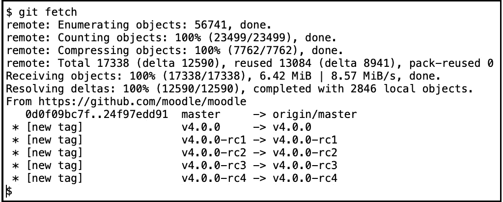

图 1.21 – 获取新的 Moodle 版本

如果你修改了任何核心代码，可能会出现潜在冲突，必须解决（Git 会提示你这样做）。

大多数商业 Moodle 提供商使用 Git 来保持他们的 Moodle 实例更新。如果你熟悉使用 shell 脚本，这应该是你的首选方法，因为它简化了更新工作流程并减少了可能出现的问题数量。

还有一个我们尚未解决的问题：你如何知道有更新可用？这正是更新通知的作用所在。

## 更新通知

Moodle 可以通过电子邮件或消息通知你关于新版本的信息。为了支持此功能，**网站管理** | **服务器** | **更新通知**下的**自动检查可用更新**设置必须保持启用，如下所示：

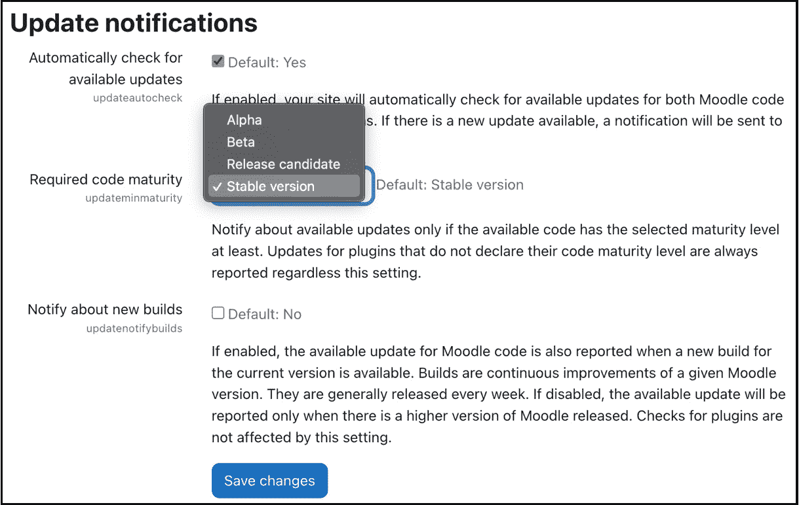

图 1.22 – 更新通知

在你的生产网站上，**所需代码成熟度**选项应设置为**稳定版本**；其他成熟度级别应仅在测试实例上考虑。对于**通知新****构建**参数也是如此。

或者，你可以通过访问 **网站管理** | **常规** | **通知** 来检查更新（核心和插件）。这些信息通过你之前设置的 cron 进程每 24 小时更新一次，并考虑了更新通知设置。你也可以通过 **检查可用** **更新** 按钮来启动请求：

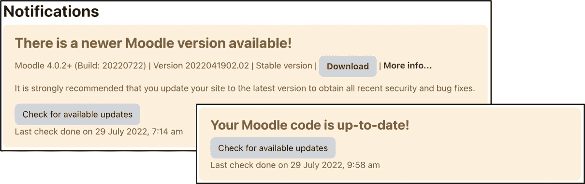

图 1.23 – 更新通知

这部分关于手动和通过命令行更新 Moodle 网站的说明到此结束。

# 摘要

本章教了你如何安装和更新 Moodle。

在提供概述描述最合适的设置后，我们概述了必要的软件和硬件要求，并描述了 Moodle 的版本策略和发布日历。

然后，我们介绍了通过网页和强大的 CLI 安装 Moodle，以及对于 Moodle 升级，我们简要介绍了 Git。

Moodle 使用便携式软件架构并便于使用标准开源组件，这使得它可以在多个平台上安装。然而，这也意味着在不同环境中必须考虑不同的特性和怪癖。

现在系统已经运行起来，在下一章中，我们将探讨 Moodle 的组件，这将帮助你更好地理解系统以及如何管理它。
