# 2

# 探索 Moodle 系统

现在您的 Moodle 系统已经启动并运行，我们将查看构成学习平台的组件。将这些视为 Moodle 构建的基础。

在本章中，您将了解 Moodle 的架构，Moodle 的主要组件是什么，以及其数据存储在哪里。Moodle 拥有现代直观的用户界面，需要一点时间来适应。您将了解其主要导航以及需要帮助时如何找到帮助。在基于 Web 的应用程序中处理文件并不总是直接的。因此，您将学习 Moodle 的文件管理机制以及如何配置回收站。

在本章中，我们将涵盖以下主题：

+   理解 Moodle 架构

+   以管理员身份导航 Moodle

+   Moodle 中的文件管理

+   回收站

到本章结束时，您将更多地了解 Moodle 的内部结构，如何作为管理员与之协作，以及文件是如何管理的。

# 理解 Moodle 架构

首先，在介绍 LMS 应用层的内部组件之前，我们将查看 Moodle 所基于的整体架构。

我们将采取自上而下的方法，首先查看整体架构，然后再深入探讨 Moodle 核心的结构。我们将从最低级别开始，那里我们将处理文件及其管理。

## LAMP 架构

Moodle 是在开源的 LAMP 框架上开发的，该框架由 Linux（操作系统）、Apache（Web 服务器）、MySQL（数据库）和 PHP（编程语言）组成。由于这些组件的可移植性和 Moodle 本身的模块化（这就是“M”的含义），支持广泛的操作系统、数据库系统和 Web 服务器。然而，尽管 Moodle 可以在其他技术堆栈上运行，但我们将专注于 LAMP，因为它在 Moodle 管理员中证明是最受欢迎的设置。

下面的图表展示了整体架构的简单概述：

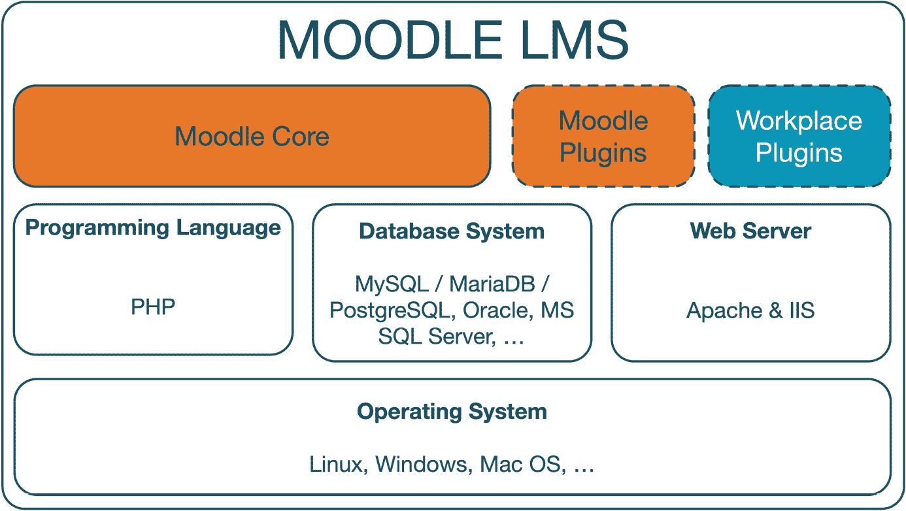

图 2.1 – Moodle 的整体架构

让我们更详细地看看 Moodle 整体架构的组件：

+   **Moodle 核心**是人们谈论 Moodle 时经常提到的内容。这也是我们在上一章中安装的，并将在本章中介绍。

+   **Moodle 插件**：虽然 Moodle 核心是一个强大而全面的 LMS，但很少有网站仅依赖于基本系统。相反，附加模块补充了标准 Moodle 的功能集，以定制平台以满足个别需求。这些附加模块被称为 Moodle 插件，它们主要是社区贡献的，是对标准 Moodle 的扩展，以适应特定的用例。在撰写本文时，官方 Moodle 插件数据库中有近 2000 个(!)条记录，在[moodle.org/plugins](http://moodle.org/plugins)。

重要提示

**Moodle LMS** 是有效的标准 Moodle 加上 – 可选地 – 一个或多个 Moodle 插件。

Moodle HQ 提供了一系列令人兴奋的插件。**Moodle Workplace** 是为企业和组织培训设计的商业产品，结果是一个强大且灵活的工作场所学习平台。有关 Moodle Workplace 的更多信息，请访问 [moodle.com/workplace](http://moodle.com/workplace) 或阅读 Packt Publishing 出版的《使用 Moodle Workplace 的企业学习》。

+   **PHP** 是 Moodle 所使用的编程语言（伴随 HTML、JavaScript 和 CSS 文件）。它是唯一不能被任何其他替代品替换的组件。必须安装特定的 PHP 库 – 请参阅*第一章*，*安装 Moodle*。

+   **MySQL** 是大多数开源应用的首选数据库，但其他系统，如 Microsoft SQL Server、Oracle 和 PostgreSQL，也完全得到支持。在 Oracle 收购 MySQL 之后，MySQL 的分支 MariaDB 在 Moodle 管理员中变得非常流行。

+   **Apache** 已成为大型 Web 应用的默认标准，紧随其后的是 Microsoft IIS。这两个 Web 服务器都像支持 PHP 的其他服务器一样得到支持，例如 nginx。本书将专注于 Apache，这是 Moodle 设置中最受欢迎的选项。

+   **操作系统**：最低级别是操作系统。虽然**Linux**是首选平台 – 因为所有代码都在这里开发和测试 – 但也支持其他操作系统，如 Windows、Mac OS X 和各种 Unix 衍生品。

下面的图示展示了 Moodle 架构中各元素之间的交互：

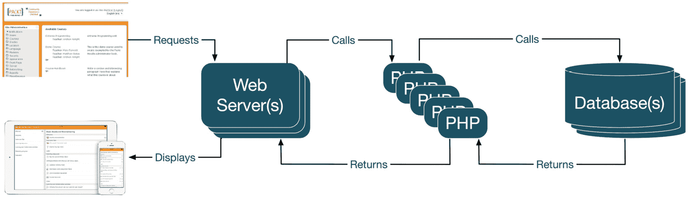

图 2.2 – Moodle 底层组件之间的交互

用户通过网页浏览器界面或移动 Moodle 应用程序发出请求。网页浏览器将请求传递给网页服务器（们），然后调用负责该请求的 PHP 模块。PHP 模块通过一个动作（查询、更新、插入或删除操作）调用数据库（们），返回所需的数据。基于这些信息，PHP 模块将数据（通常是 HTML 或 JavaScript）返回给网页服务器（们），然后传递要显示的信息回用户的浏览器或应用程序。

我们最感兴趣的组件是 Moodle 核心，我们将在下一部分更详细地探讨。

## Moodle 核心

现在，让我们更详细地看看 Moodle 核心层。以下图示展示了 Moodle 的主要构建块：

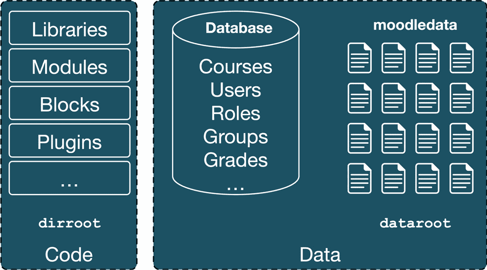

图 2.3 – Moodle 的构建块

Moodle 区分代码（主要用 PHP、HTML 和 CSS 编写）和数据（主要通过 Moodle 界面添加的值和文件）。

Moodle 库、模块（如资源和活动）、块、插件、管理工具和其他实体在代码中表示。它始终存储在称为 `dirroot` 的 Moodle 目录中，该目录在上一章的安装过程中指定。代码包括处理后端（服务器）和前端（用户界面）操作的所有元素。

Moodle 课程、用户、角色、组、能力、学习计划、成绩以及其他数据，例如教育者添加的学习资源、学习者添加的论坛帖子以及管理员添加的系统设置，主要存储在 Moodle 数据库中。然而，如用户图片或上传的作业等文件存储在另一个称为 `moodledata` 的 Moodle 目录中，位于名为 `dataroot` 的目录中。有关文件的信息（如名称、位置、最后修改时间、许可证和大小等元数据）存储在数据库中，并引用相应的文件。

重要提示

Moodle 在内部管理其文件，重要的是要强调，干扰 `moodledata` 中的任何文件都将破坏应用程序。

即使是将文件从一个文件夹复制到另一个文件夹或手动添加文件，也会破坏您系统的完整性，这意味着无法预测后续行为。内部，Moodle 使用称为 SHA1 哈希的机制。Moodle 完全支持 Unicode 文件名，并在同一文件被两次使用（即使是由不同的用户使用）时避免冗余存储。再次强调，您不得在系统级别修改任何 Moodle 文件！

现在，让我们更详细地看看 Moodle 文件区域 – 目录结构 – 是如何组织的。

## 代码和数据位置

尽管 Moodle 负责组织其代码和数据，但通常了解文件在您的学习系统中的位置是有益的，例如在安装附加组件或手动应用补丁时。

系统文件 – 运行 Moodle 所需的文件 – 位于 `dirroot`（您的 Moodle 安装根目录）下的几个目录中。以下表格显示了文件夹名称、简要描述以及本书中涵盖该主题的章节：

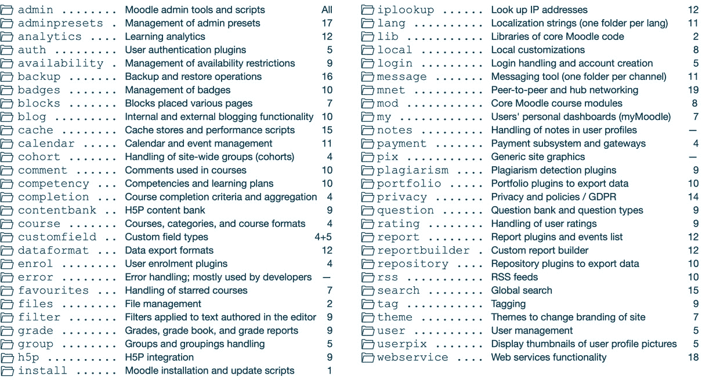

图 2.4 – 代码和数据位置

`moodledata` 目录（`dataroot`）的组织结构如下：

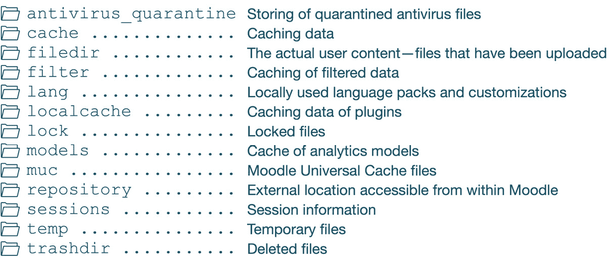

图 2.5 – moodledata 目录

在执行更新之前出现问题时，有时需要删除缓存数据和 Moodle 创建的任何临时信息。这些数据位于前表中所示结构中的相应目录中。换句话说，一旦所有人都登出，您就可以安全地删除名为`cache`、`filter`、`localcache`、`lock`、`models`、`muc`、`sessions`、`temp`和`trashdir`的目录中的任何文件。清除可以通过手动完成，或者更好的是通过 Moodle 界面中的**网站管理** | **开发** | **清除缓存** | **清除所有缓存**来完成。

这部分关于 Moodle 架构的介绍到此结束，它处理了 LAMP 框架和 Moodle 的主要组件，然后我们深入到 Moodle 核心和代码和数据文件的位置。

# 作为管理员导航 Moodle

在本节中，您将学习如何使用 Moodle，包括网站管理部分的横向导航以及如管理员搜索、书签以及访问各种帮助和支持网站和渠道的实用工具。

管理员的基本导航项如下：

+   **网站菜单**：贯穿所有页面的主菜单；**网站管理**项将打开管理员菜单。

+   **管理员菜单**：访问所有管理员部分和子部分。作为管理员，您将在这里执行大多数任务。我们将在本书的剩余部分介绍这些菜单和子菜单的所有方面。

+   **用户菜单**：访问个人设置，例如用户资料、偏好设置或选定的语言。

+   **管理员搜索**：搜索功能，我们将在后面介绍。

+   **编辑模式切换**：在编辑模式和非编辑模式之间切换。

+   **块抽屉**：Moodle 块放置于此；要更改块抽屉，必须激活编辑模式。

以下截图突出了以下导航元素：

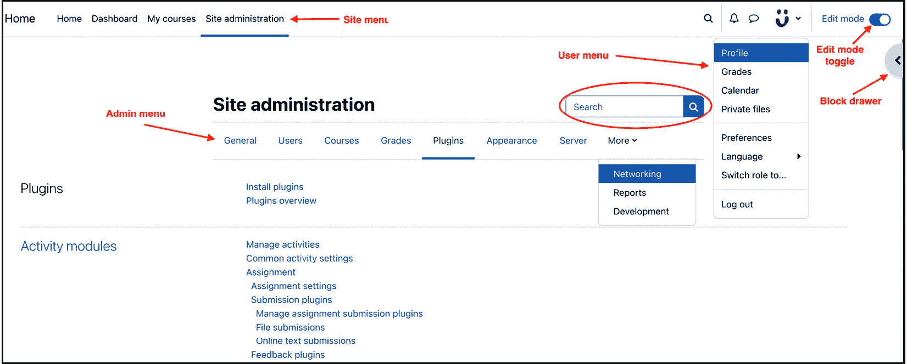

图 2.6 – Moodle 导航

前一张截图显示的项目可能因您的系统而异。根据激活的功能、使用的主题和屏幕大小，一些管理员菜单项可能移动到**更多**下拉菜单，或者**语言**设置可能出现在用户菜单中。

Moodle 的用户界面是从版本 4 开始从头构建的——导航路径已消失，之前无处不在的块已降级为块抽屉。这次重新开发也影响了导航管理功能，我们将在下一节中介绍。

## 管理员搜索功能

提供了一个搜索功能，帮助您识别位于“**网站管理**”菜单（如前一张截图所示，已圈出）上方的管理部分中的任何设置。

当搜索任何允许您立即更改设置的术语时，Moodle 会以展开的形式显示结果。例如，当搜索“日历”时，会出现多个部分作为结果，您可以直接在每个部分中更改，而无需导航到每个单独的部分进行更改。

在升级到较旧版本的 Moodle 时，配置设置已被重新组织，其位置有时难以追踪，此时搜索功能也非常有益。

接下来是管理员书签，这可能会减少对管理员搜索功能的使用。

## 管理员书签

书签显示在**管理员书签**块中，可以通过开启**编辑模式**，打开块抽屉，并从**添加一个块**列表中选择该块来添加。它们允许您将任何管理员菜单添加为书签，以便轻松访问经常需要的页面。选择**添加此页书签**来添加书签，选择**取消此页书签**来删除它。当您在书签页面上时，Moodle 会自动显示后者选项：

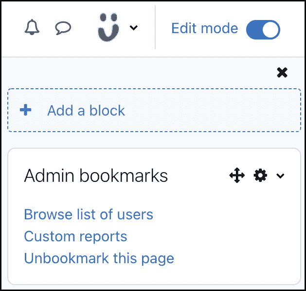

图 2.7 – 管理员书签

在前面的屏幕截图中，已经有两个页面被添加为书签（**浏览用户列表**和**自定义报告**），并提供提到的链接来取消当前标记。

当您知道您要找什么时，管理员搜索和书签非常有用。接下来是 Moodle 文档，当您在使用功能或需要进一步支持时，它将为您提供帮助。

## Moodle 文档和帮助

整个 Moodle 文档都在线，可在[docs.moodle.org](http://docs.moodle.org)找到。如果您想提供自己的文档，请通过访问**站点管理** | **外观** | **Moodle 文档**来修改**Moodle 文档根目录**设置。您还可以在文档页面链接中选择**文档使用的语言**选项，并在该屏幕上启用**在新窗口中打开**选项。

在每个页面的底部，您将看到一个**支持图标**。一旦选择，它将显示以下帮助相关链接：

+   **帮助和文档**：参考 Moodle 文档中的相关页面。

+   **服务和支持**：链接到[moodle.com/help](http://moodle.com/help)，在那里提供来自 Moodle 认证服务提供商的专业服务。

+   **联系站点支持**：将打开标准电子邮件客户端，并将支持联系人的收件人填写好。您可以通过访问**站点管理** | **服务器** | **支持联系人**来更改支持电子邮件地址。此功能对您的用户来说更为相关，而不是作为管理员您自己。

除了在线文档外，一些功能还提供内联帮助，以问号符号表示。点击后，将出现一个帮助窗口，提供与相应主题或设置相关的帮助：

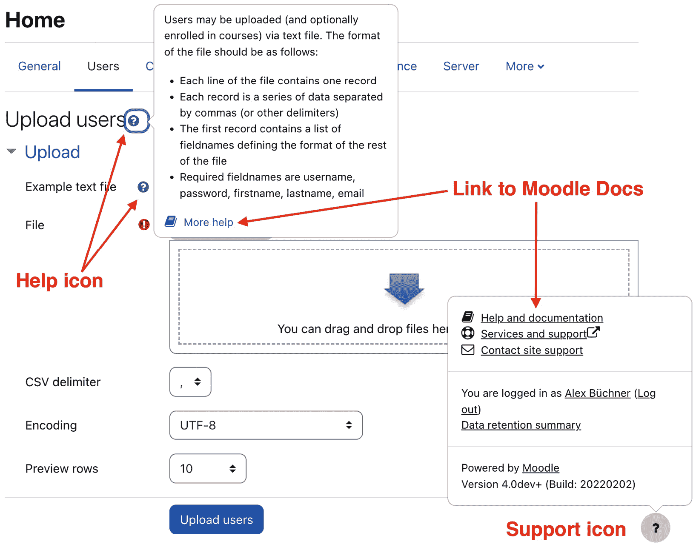

图 2.8 – Moodle 帮助

例如，当在**上传用户**部分点击**帮助和文档**链接时，以下文章将被打开：[docs.moodle.org/400/en/Upload_users](http://docs.moodle.org/400/en/Upload_users)。对于 Moodle 的每个版本，都会发布单独的 Moodle 文档。上述链接来自 4.0 版本，其中大多数页面的文档存在多种语言。

当您首次访问某些页面时，Moodle 将显示所谓的用户导游。例如，当您导航到**我的课程**时，以下弹出窗口将显示：

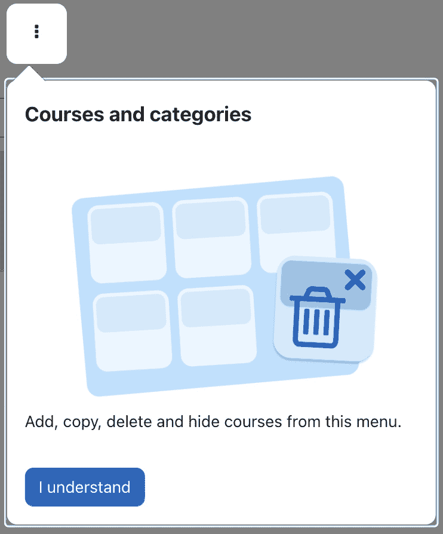

图 2.9 – 用户导游

我们将在*第七章*中详细介绍用户导游，*增强 Moodle 的外观和感觉*。

Moodle 社区正在持续增长，在撰写本文时，已有超过 100 万注册用户（是的，是 100 万！），其中超过 5%是活跃的。如果您在 Moodle 文档中找不到 Moodle 问题的解决方案，请使用屏幕顶部的**搜索**功能在[moodle.org](http://moodle.org)。按照优先级顺序，搜索将提供已提到的 Moodle 文档、最活跃的用户论坛和 Moodle Tracker，它跟踪所有问题和功能请求([tracker.moodle.org](http://tracker.moodle.org))。在 Moodle 论坛中进行搜索通常会得到大量的链接。使用**搜索论坛**块中的**高级搜索**区域来缩小搜索范围。如果您仍然找不到问题的解决方案，这种情况相对较少，请在相关论坛上发帖提问；很可能有人会进一步帮助您。

一个可能也感兴趣的流行网站是 Moodle 学院([moodle.academy](http://moodle.academy))，它包括一个管理员学习路径，涵盖关于基本 Moodle 管理的短小、自定步调的课程。

这部分内容介绍了 Moodle 的导航，其中包括了网站管理菜单和各种有用的工具，如管理员搜索、管理员书签和 Moodle 文档。

# Moodle 文件管理

这部分内容全部关于文件：如何访问它们，它们如何在文件夹中组织，如何上传它们，如何配置私有文件，复制和链接之间的区别，文件类型，增加上传文件限制，以及如何通过回收站处理已删除的文件。这需要很多内容，所以让我们开始吧。

在基于网络的程序中处理文件并不总是直接的。虽然 Moodle 提供了一个用户界面来执行此任务，但有时作为管理员，您可能需要绕过此机制并使用其他方法。首先，让我们看看内置的文件处理，这是学生和教师也会使用的。

## Moodle 文件管理界面

Moodle 提供了一个基本的文件管理界面，允许您上传、移动、删除和重命名文件和目录。您还可以从 Dropbox 等第三方服务复制或链接到文件；同样，Moodle 不是一个内容管理系统。

我们已经讨论了 Moodle 在系统级别上存储文件的方式——那些我们不应该触碰的文件！在应用级别上，它根据 Moodle 的结构来组织文件：

重要提示

在 Moodle 中，一个文件始终与使用它的特定 Moodle 内容相关联。

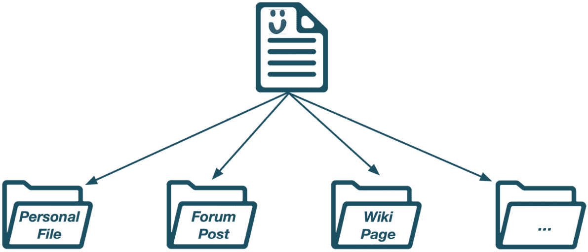

图 2.10 – Moodle 文件

文件以树状结构组织，主要有三种主要分支：

+   分类/课程/活动和资源

+   用户（私有文件和个人备份）

+   网站首页（Moodle 的首页）

我们将在后续阶段处理所有这些概念，所以现在，让我们先假定它们是正确的。课程按类别（和子类别）排列，包括活动和资源，通常在活动和资源内部还有进一步的子目录。

在您的系统中有多位用户，每位用户都有一个专用的文件区域，可以从 Moodle 的任何地方访问，但只有一个网站首页。记住，一个文件始终与使用它的特定 Moodle 内容相关联，这体现在类似目录的结构中：

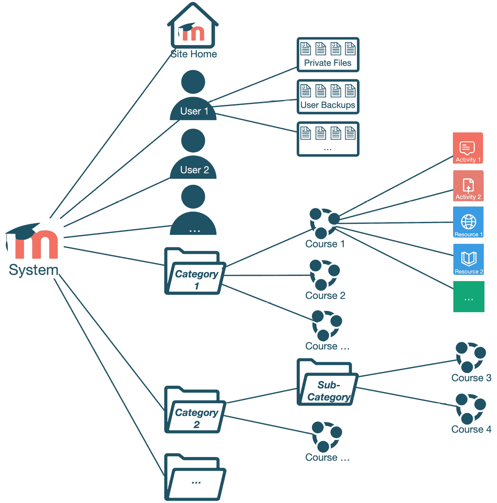

图 2.11 – Moodle 文件夹

现在我们已经了解了文件和文件夹的组织方式，让我们看看如何上传数据和创建目录。

## 上传文件

文件的上传通常通过拖放完成。虽然这个功能对于学习和培训人员至关重要，但作为管理员，您也必须不时上传文件，例如，通过 CSV 文件批量上传用户。

添加单个或多个文件非常简单：只需在您的资源管理器（Windows）或 Finder（Mac）中选择文件，然后将它们拖放到以下截图所示虚线框内的指定区域：

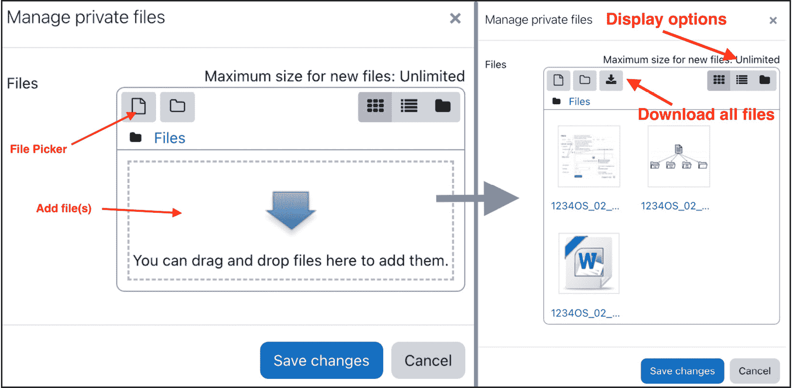

图 2.12 – Moodle 文件和文件夹

当文件上传后，点击一次，您可以选择**下载**或**删除**文件。如果选中的文件是压缩归档，您可以选择**解压**它。此外，文件的相关元信息（名称、作者、许可、路径、图标、最后修改时间、创建时间和大小）将在窗口底部显示，如下截图所示：

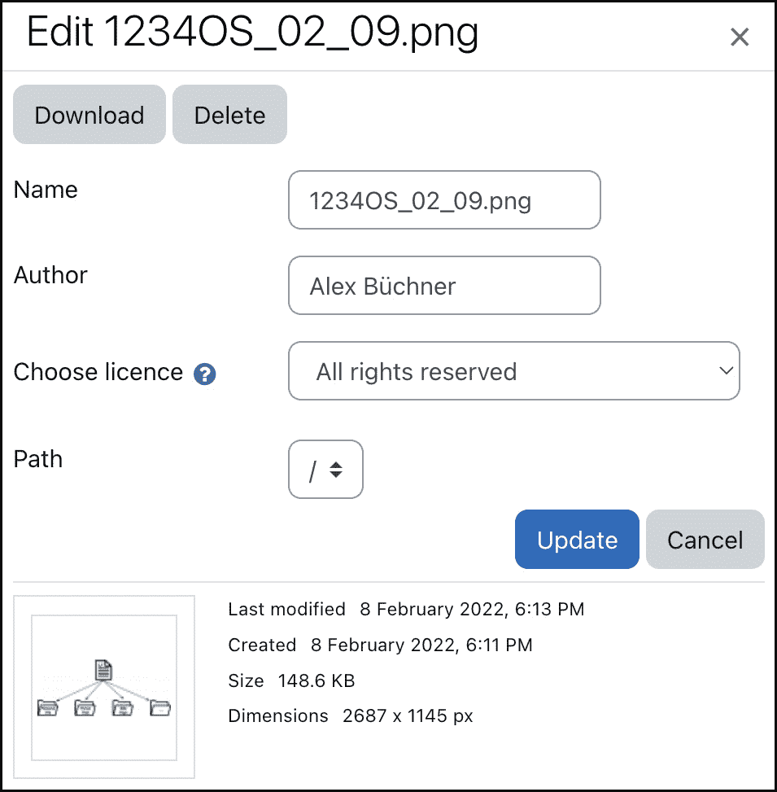

图 2.13 – Moodle 文件详情

对于某些文件操作，必须使用**文件选择器**，这是一个在需要将文件添加到 Moodle 中特定对象时使用的工具。用户可以从多个文件源中选择，这些文件源被称为存储库。可以通过文件区域左上角的**添加…**按钮访问文件选择器。我们将在*第十章* *配置* *技术功能* 中处理存储库。

与上传文件密切相关的是配置上传限制。

## 上传限制

您的网站默认设置了 2 MB 的文件上传限制。如果您需要支持大于 2 MB 阈值的文件，您必须提高限制。

在您的 `php.ini` 文件中（使用 `php -i` 命令找到其位置，并定位到 `Loaded Configuration File` 条目），修改以下两行；`<value>` 表示最大限制（支持多种输入格式，例如，20M 或 20971520）：

+   `upload_max_filesize = <``value>`

+   `post_max_size = <``value>`

如果您无法访问 `php.ini` 文件，请在您的 Moodle 主目录中创建一个 `.htaccess` 文件，并添加以下两行：

+   `php_value upload_max_filesize = <``value>`

+   `php_value post_max_size = <``value>`

您还必须在某些系统上增加 `LimitRequestBody` 参数，通常在 Apache `httpd.conf` 配置文件中找到。您可能还需要修改数据库配置，例如 `max_allowed_packet` 的大小：

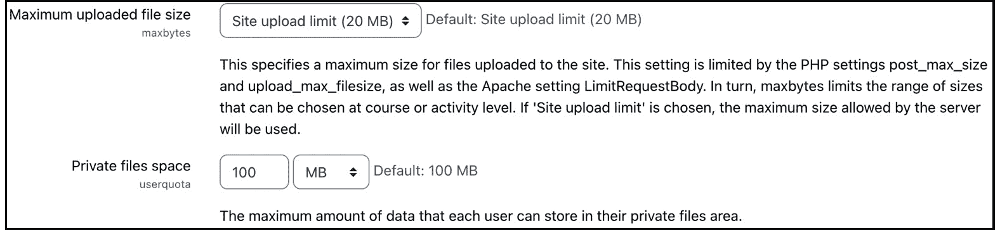

图 2.14 – Moodle 上传限制

一旦应用了这些更改，请确保在 **站点管理** | **安全** | **站点安全设置** 下的 **最大上传文件大小** 参数已设置为 **站点上传限制**。您还可以通过 **私有文件空间** 参数更改私有文件的配额。在更改这两个值时，请记住，它们可能会分别影响带宽和磁盘空间。

对于像高质量学习资源这样的非常大的文件，能够通过（安全）FTP 上传内容然后使用文件选择器内置的解压缩功能将非常有帮助。然而，无法直接通过 FTP 上传文件。相反，您必须使用文件系统存储库，这将在*第十章* *配置* *技术功能* 中详细讨论。

现在您已经熟悉了上传文件，让我们来处理属于个人用户个人的个人文件。

## 私有文件

每个用户都有一个区域，可以在此处存储和管理个人文件。这些文件只对拥有私有文件的用户可见。在此受保护区域中存储的任何项目都可以在整个网站上使用。私有文件可以通过文件选择器、**私有文件**块或通过用户菜单中的**私有文件**链接直接访问：

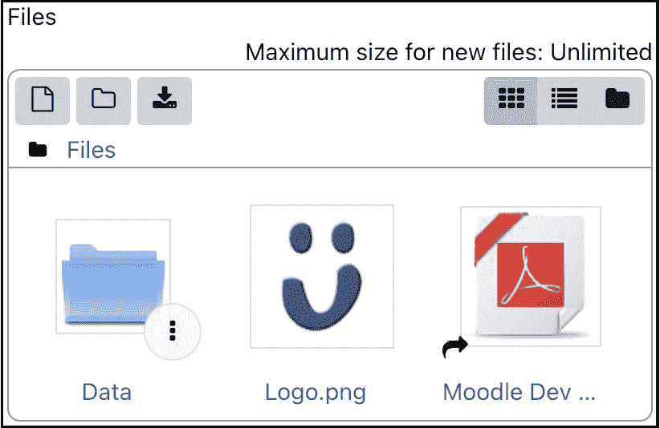

图 2.15 – Moodle 文件选择器

处理文件和目录与其他文件的处理方式相同。然而，您可能已经在前面的屏幕截图中的 PDF 文件中注意到了**链接**图标，这很自然地引出了以下小节。

## 链接还是复制？

默认情况下，Moodle 中的文件会被复制。当您从源（例如，您的计算机或您的私人文件）添加文件时，它将被复制，这意味着源文件和结果文件在逻辑上会被分离。例如，如果您在您的私人文件中存储了一个图像，并在三个不同的课程中使用它，那么这三个图像在逻辑上会有三个副本。如果您更改私人文件中的源文件，这三个图像将不会受到影响。

Moodle 还支持链接文件，也称为文件别名。让我们继续使用相同的例子，但这次是三个图像被链接。如果源文件被更改，课程中的三个文件也会相应更改。请注意，链接文件有一些访问限制；例如，讲师 A 可能无法链接到讲师 B 的文件。

当您从一个支持链接的源（存储库）中选择文件时，会提供一个选项来**链接到****该文件**：

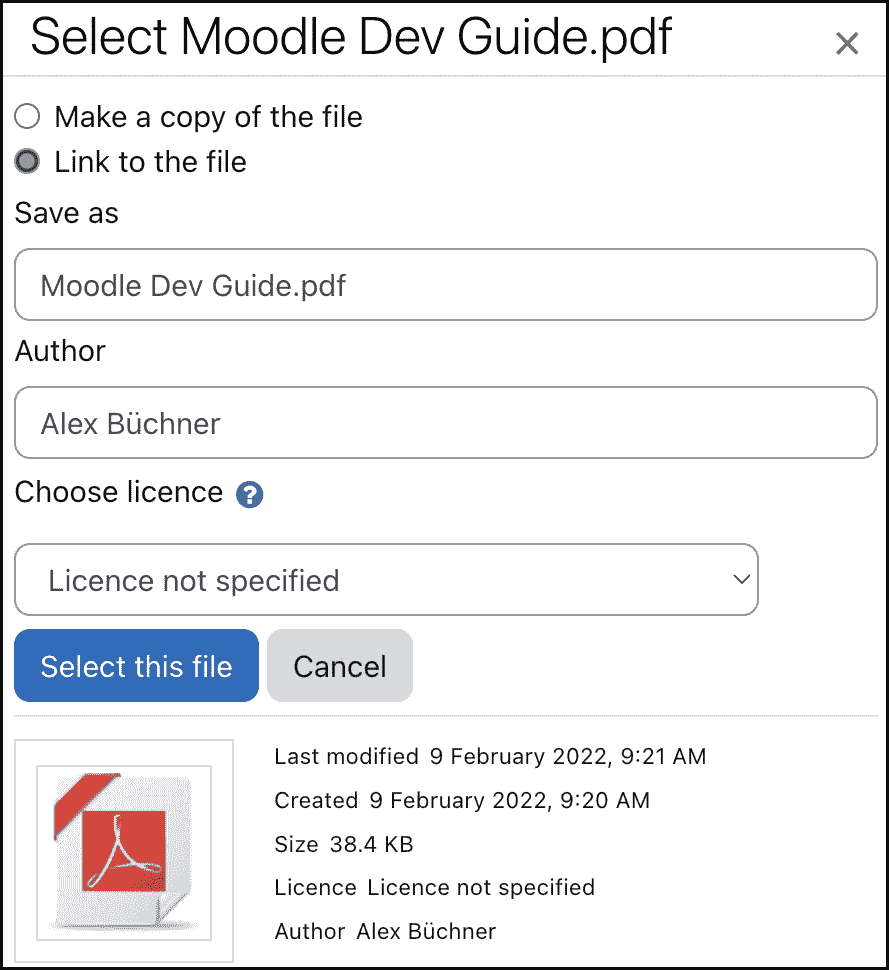

图 2.16 – Moodle 文件 – 复制和链接

Moodle 会跟踪链接文件，并保证不会出现不一致的情况：

+   当删除链接文件时，每个链接都会创建文件副本

+   当链接文件被覆盖时，所有链接都会更新

+   当文件覆盖链接时，文件会被“分离”

链接和复制是关于文件内部处理方式的问题；接下来是文件类型，它决定了用户下载文件时的处理方式。

## 文件类型

Moodle 不限制用户可以上传的文件类型，例如，课程中的作业。Moodle 为最常见的文件类型预定义了图标显示和将打开的程序，例如 PDF 文件或 PowerPoint 文档。然而，如以下屏幕截图所示，您可以通过访问**站点管理** | **服务器** | **文件类型**来添加新的文件类型并查看、修改和删除现有文件类型：

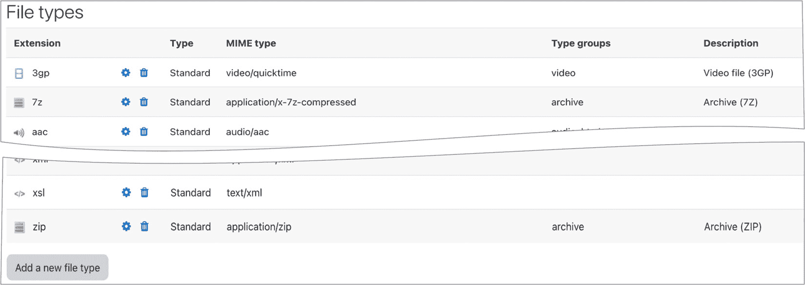

图 2.17 – Moodle 文件类型

当您通过屏幕底部的按钮添加新的文件类型时，您必须提供文件的**扩展名**和其**MIME 类型**。此外，您可以选择选择**文件图标**、**类型组**（例如图像或文档）、**描述类型**、**自定义描述**（如果**描述类型**是**在此表单中指定的自定义描述**）、**替代语言字符串**（如果选中**描述类型**）和**MIME 类型的默认图标**。

到目前为止，我们已经介绍了文件在 Moodle 中的存储、组织和添加方式。现在，让我们看看当文件被删除（意外删除）时会发生什么。

# 回收站

作为管理员，我们都有过这样的经历：用户意外删除了一个文件、一个包含所有提交的作业，甚至是一个完整的课程——当然，通常是在紧急截止日期附近。恢复丢失的数据始终是最高优先级，您将在接下来的一个小时内或更长时间内翻阅昨晚的备份，以帮助您的惊慌失措的同事。

为了避免类似描述的场景，Moodle 提供了一个回收站，允许用户恢复误删除的课程元素和课程。该功能默认开启，但作为管理员，您有一系列选项来配置工具的行为。

要访问**回收站**配置，请转到**网站管理** | **插件** | **管理工具** | **回收站**，您将看到三组设置：

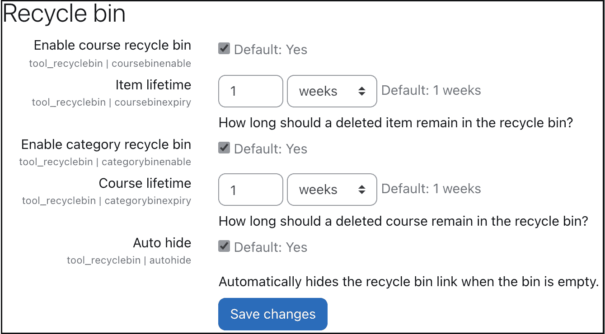

图 2.18 – Moodle 的回收站设置

**回收站**选项如下：

+   **启用课程回收站**选项收集课程内删除的任何资源和活动。这些项目将保留在**项目****生命周期**参数设置的时间内。

+   **启用分类回收站**选项收集分类内删除的任何课程。这些课程将保留在**课程****生命周期**参数设置的时间内。

+   当选择**自动隐藏**复选框时，相应的菜单项只有在用户的回收站包含任何元素时才会显示；否则，它将从课程或类别的**更多**菜单中隐藏。

当相应的生命周期到期日期过去后，项目和课程将从回收站永久删除。删除的课程项目或课程类别的生命周期在以下图中表示：

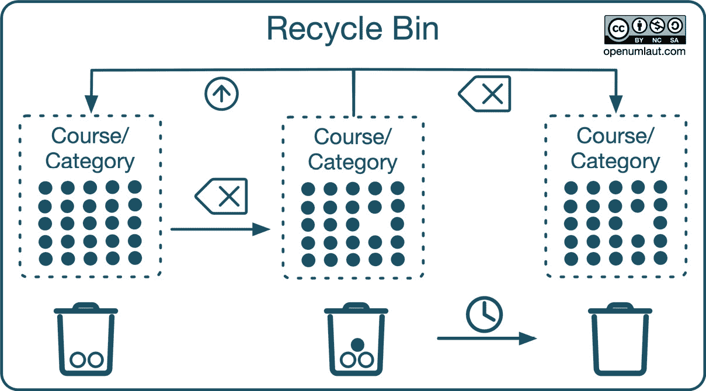

图 2.19 – Moodle 回收站

初始时，回收站可能是空的，或者可能已经包含已删除的项目或课程（在我们的例子中，有两个）。当一个元素被删除时，它会被移动到用户的回收站，可以恢复或永久删除。假设在此期间，元素的指定生命周期已过期。在这种情况下，文件或课程将被永久删除，以及其他任何到期日期已达到的元素。

如前所述，回收站是即插即用的；如果您的回收站没有按预期工作，请检查以下三个配置：

+   回收站的大多数流程都是由 cron 进程触发的，例如，我们刚才提到的常规清除机制。因此，确保 cron 进程正确设置并且每分钟运行一次至关重要（请参阅*第一章*，*安装 Moodle*中专门的*设置 cron 进程*部分）。

+   内部，回收站使用 Moodle 的备份和恢复功能。特别是，必须在`backup_auto_activities`)和`backup_auto_users`)上启用以下两个设置。此外，在**通用恢复**默认页面必须勾选`restore_general_users`)。关于这些设置的更详细信息，请参阅*第十六章*，*避免失眠之夜 – Moodle 备份* *和恢复*。

+   如果您的用户在使用回收站时遇到困难，请确保他们的角色中未撤销任何必需的能力。这些是**tool/recyclebin:viewitems**、**tool/recyclebin:restoreitems**和**tool/recyclebin:deleteitems**。关于角色和能力的内容将在*第六章*，*管理权限、角色* *和能力*中提供。

学习如何使用回收站结束了关于文件及其管理的这一节。

# 摘要

在本章中，我们学习了 Moodle 核心的构建块看起来是什么样子以及它们的位置。此外，我们还从管理员的角度探讨了新的直观用户界面。最后，我们处理了文件、文件夹和回收站。

如我们在上一章所学，Moodle 可以安装在多种操作系统上，支持广泛的数据库，并且可以与不同的 Web 服务器一起使用。由于 Moodle 的开放性，其所有组件都可以无限制地访问。同样，Moodle 可以处理任何类型的文件，无论其类型或大小。为学习者、教育者和管理员提供直观且现代的用户界面。

现在您的系统已经启动并运行，您也知道了它的内部结构，是时候在下一章处理课程、用户和角色了。
