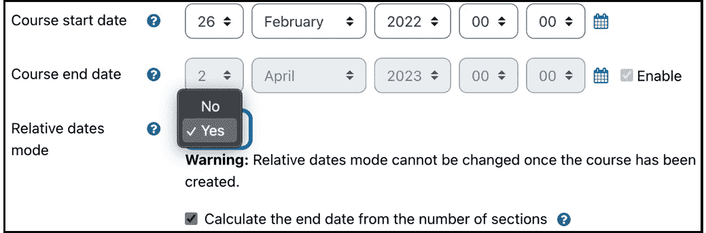

# 4

# 管理课程和注册

Moodle 将学习资源和活动存储在课程中，这是本章的主题，已被分为两个主要部分：**课程管理**和**课程注册**。

在本章的第一部分，您将了解以下关于课程和课程类别管理的方面：

+   将课程组织到类别和子类别中

+   创建和管理课程

+   添加自定义课程字段

+   处理课程请求

+   批量管理课程

在本章的第二部分，我们将介绍不同的用户注册课程的方法。将要介绍的注册机制包括以下内容：

+   内部注册（手动、自助和访客）

+   群体注册和同步

+   数据库驱动的注册（LDAP、外部数据库、平面文件和 IMS 企业文件）

+   元课程

+   以支付为驱动的注册（支付账户和网关，如 PayPal）

以下图表展示了所提及的主题（课程、类别和注册方法）之间的高层次概览：


图 4.1 – 课程、类别和注册 – 高层次概览

到本章结束时，您将了解关于课程和类别管理的所有内容。此外，您将能够为您的组织中的 Moodle 系统选择和配置正确的注册方法（们）。

让我们从一般课程管理，特别是课程类别管理开始吧。

# 将课程组织到类别中

Moodle 管理员的职责是管理类别和课程。本节提供了课程类别的概述，并在介绍类别管理的所有方面之前，先介绍一个运行示例：**创建**、**排列**和**删除**。

## 提供课程类别的概述

在上一章中，我们简要介绍了类别的概念，它们作为课程的容器。它们可以有子类别，子类别还可以进一步有子子类别，依此类推。

有不同的方式来组织课程和类别层次结构 – 例如，按部门、学科领域或学期。以下图表显示了代表同一组织的两个不同的类别层次结构：


图 4.2 – 示例类别层次结构

如您所见，每个层次结构都代表相同的信息，但以不同的形式。组织您的类别和课程没有对错之分。结构取决于以下参数：

+   您组织的规模

+   您提供的课程数量

+   您运行的课程类型

+   课程开始的频率（每学期一次、每年一次、滚动开始/结束等）

非常建议第一次就正确设置结构，因为更改它既耗时又可能让用户感到困惑。此外，尽量提前规划，考虑结构在未来是否适用——例如，从一年级到另一学年的变化（也请参阅 *第十六章*，*避免失眠之夜——Moodle 备份和恢复*，其中我们探讨了年末程序）。

如前所述，不同的组织采用不同的分类方法。以下是一些分类级别的示例：

+   **校园** | **系/学校** | **年份** | **科目**

+   **入学年份** | **主题** | **科目**

+   **客户** | **科目** | **熟练程度**

+   **培训师** | **模块**

+   **课程库** | **主题**

有时，深层次的分类可能会让人望而却步，因为它们的管理很繁琐。然而，请记住，只有作为管理员的你才会看到整个分类结构。学生和教师通常只会看到他们注册的课程或分配给他们的课程，除非他们浏览完整的课程索引。

重要提示

为课程和分类制定合适的命名约定非常推荐——它简化了维护并减少了不必要的复杂性。

如果你需要完全分离组织部门，例如，客户或企业中的独立业务实体，课程分类通常不是一个合适的工具。相反，你可能想考虑 Moodle Workplace，它支持多租户，包括具有自己外观、感觉、结构、用户和学习空间的完全隔离实体（有关详细信息，请参阅 *第二十章*，*支持多租户*）。有关 Moodle Workplace 的更多信息，请访问 [moodle.com/solutions/workplace](http://moodle.com/solutions/workplace) 或 Packt Publishing 的标题为 *使用 Moodle Workplace 进行企业学习* 的书籍。

现在我们已经展示了分类层次结构的灵活性和多功能性，创建和管理你的课程分类是下一步。

## 管理课程分类

一旦你规划了分类层次结构，就是时候在 Moodle 中表示组织结构了。分类在 **网站管理** | **课程** | **管理课程和分类** 中进行管理，如下面的截图所示：


图 4.3 – 课程分类

初始时，Moodle 包含一个名为 **类别 1** 的单个分类。前面的截图显示，默认分类已被重命名为 **计算机**，并为第一到三年级创建了三个子分类。

除了屏幕上的**课程类别**部分外，还有多达两个更多部分：一个显示所选类别的**课程**列表，另一个在选中课程后显示**课程详情**。这种排列在以下图中表示：


图 4.4 – 管理课程和类别

在非常窄的屏幕（平板电脑或智能手机）上，这三个部分将并排显示。您可以通过**查看**下拉菜单在三个视图之间切换，并显示**课程类别和课程**（默认），仅显示**课程类别**，或仅显示**课程**：


图 4.5 – 管理课程和类别

现在您已经熟悉了类别管理界面，让我们将第一个课程类别添加到您的 Moodle 网站中。

### 添加课程类别

点击**创建新类别**按钮或直接转到**网站管理** | **课程** | **添加类别**，在**类别名称**字段中输入新名称以添加新类别。**父类别**下拉菜单指示课程在层次结构中的位置。我们将将其设置为**顶级**，稍后回来。提供可选的**类别 ID 号**和**描述**信息是良好的实践；前者用于自动化某些任务，例如用户上传，而后者例如在课程索引中显示：


图 4.6 – 添加课程类别

接下来是创建课程子类别以创建类别层次结构。

### 创建课程子类别

如前所述，为了提高课程的组织性，Moodle 允许创建子类别。您可以通过选择一个现有类别，然后从选项中的下拉菜单中选择**创建新子类别**，或者添加一个新类别（如前一张截图所示），并使用**课程类别**页面上的下拉菜单将其移动到父类别中，来创建一个子类别。例如，在**计算机**类别下创建**计算机一年级**、**计算机二年级**和**计算机三年级**子类别，然后使用下拉菜单将它们移动到**计算机**类别下。或者，您可以在创建子类别时选择正确的父类别。

到目前为止，我们已经创建了类别和子类别。现在，让我们看看如何重新排列类别，以防您需要修改您的层次结构。

### 组织课程和类别

类别的逻辑排列有三个主要目的：

+   类别层次结构或类别顺序在 Moodle 的多个页面上显示 – 例如，当您需要指定课程需要恢复到的类别时。

+   可以授予类别及其所有子类别的访问权限——例如，数学系的所有用户都有访问数学类别的权限。

+   更容易维护类别结构。这仅适用于网站管理员和类别管理员。

有两种操作来（重新）组织类别：**排序**和**移动**。

让我们从**移动**类别开始。改变类别位置的最简单方法是使用标准上下箭头。一种更灵活的方法是选择一个或多个类别，然后从**移动选定类别到**下拉菜单中选择一个新位置，在按下**移动**按钮之前。当您移动一个父类别时，所有子类别都会随之移动：


图 4.7 – 排序和移动类别及课程

您有多种排序类别的选项。从**排序**菜单中，您可以选择按**所有类别**、**选定类别**或**当前类别**（代表当前类别）排序。类别可以按其**名称**或**ID 号**升序或降序排序，也可以不排序（即，您可以将它们放回创建时的原始顺序）。一旦您选择了选项，请按**排序**按钮。

或者，您可以通过为每个父类别选择下拉菜单中的排序选项来加速此过程。从选项菜单中，可以触发几个操作，如下表所示：


图 4.8 – 类别选项

您还可以使用眼睛图标（例如`moodle/course:viewhiddencourses`权限）隐藏类别。

一旦您选择一个类别，它就会在课程区域显示所有课程，具体位置取决于您的设备和屏幕大小，可能是位于类别区域的右侧或下方。

虽然您可以使用上下箭头重新组织课程，但您可以使用左侧的横杠并将每个课程拖到其新位置——这是一个非常实用的功能。课程可以按其**全名**、**简称**、**ID 号**和**创建时间**信息升序或降序排序，您还可以选择修改每页显示的课程数量。隐藏和移动选定课程的方式与类别相同：


图 4.9 – 移动和排序课程

要跨类别排序课程，您必须从**课程类别**部分的**排序**菜单中选择**所有类别**选项。排序选项与之前截图中的上下文菜单中的选项相同。

现在我们已经处理了创建、修改和重新排列课程类别，只剩下一个操作：删除。

### 删除课程类别

当使用下拉菜单中的相应选项删除课程类别时，您必须决定如果存在课程和子类别，**如何处理它们**：

+   **将内容移动到另一个类别**：您需要从**移动到**选项中选择一个。

+   **删除所有 – 无法撤销**：此步骤无法撤销！


图 4.10 – 删除课程类别

这就结束了关于管理课程类别的部分。下一步是从类别级别向下移动到课程，以及如何创建它们，我们将在下一节中处理。

# 创建课程

在 Moodle 中，课程是基础。学习者和管理员大部分时间都在课程中度过，因为教学、学习和协作都发生在这里。

重要提示

我们之前已经提到过，但鉴于它对管理 Moodle 至关重要，所以我们再次强调：Moodle 是一个以课程为中心的系统！

在我们开始创建第一个课程之前，让我们简要地看看一个典型的课程创建工作流程。

## 课程创建工作流程

不同的组织类型提供不同类型的课程。学校中的课程通常与课程大纲相关联，而商业在线提供商提供的课程则由目录驱动或根据需要提供。然而，大多数课程创建工作流程中都有几个共同步骤，如下面的图表所示，其中顶部行显示要执行的任务，底部行显示通常负责的角色：


图 4.11 – 典型的课程创建工作流程

步骤如下：

1.  **课程请求**：有人请求一个新的课程，这通常由课程大纲驱动，或者可以是由教师提出的临时需求。

1.  **创建课程**：课程框架可以是手动或自动创建的；这两种选项将在介绍完此课程创建工作流程后处理。

1.  **通知教师**：让请求者知道课程已被添加。同样，这可以是手动或自动完成的。

1.  **调整设置**：负责课程的新的课程所有者将添加任何缺失的信息——例如，课程描述。

1.  **填充课程**：课程请求者被交给一个空课程或基于课程模板的框架。教师负责用学习内容、活动和相互依赖性填充课程。

1.  **注册用户**：有各种选项可以将用户添加到课程中。这可以是管理员驱动的自动化过程，由教师手动完成，或者根据您的设置，由学习者自己完成。我们已经在本章的第二部分专门讨论了课程注册，所以现在请耐心等待。

1.  **开始课程**：在某个阶段，课程将被释放到野外，要么是从特定的开始日期（例如，学期的开始）或更灵活的动态设置（例如，自定步调的在线课程）。

这个过程并不是一成不变的，可能在您的组织中看起来不同。可能已经添加了额外的步骤，或者特定任务的顺序可能不同，例如在注册时。然而，概述的步骤通常存在于大多数课程创建工作流程中。好的，足够的过程和程序；让我们将第一个课程添加到您的 Moodle 系统中。

## 创建新课程

一旦按下**创建新课程**按钮，Moodle 将您引导到设置页面，在此页面必须输入课程详细信息。当我们创建第一个课程时，我们已经在这个屏幕上遇到了*第三章*，*探索课程、用户和角色*。

以下设置在**常规**和**描述**部分可用：


图 4.12 – 课程设置

默认情况下，使用**过滤器**框的`moodle/course:change`（见*第六章*，*管理权限、角色和能力*）将更详细地处理这个问题。

### 课程格式

在课程设置中的下一节允许您选择**课程格式**选项。课程格式决定了课程内容将以何种方式呈现给学习者。Moodle 随带提供四种格式，但可以安装更多（见*第八章*，*理解 Moodle 插件*）中的*安装第三方插件*部分）。一旦选择了课程格式，屏幕将刷新以加载相应的课程格式设置：

+   **单一活动格式**：这仅显示课程中的所选活动 – 例如，SCORM 包、作业、论坛、测验等

+   **社交格式**：这是一个主要（社交）论坛，列在主课程页面上 – 例如，公告板

+   **主题格式**：这与周格式类似，但每个周被称为一个主题，没有时间限制

+   **周格式**：在这个格式中，课程按周组织，有开始和结束日期

您可以通过访问**网站管理** | **课程** | **课程默认设置**来指定新课程的默认课程格式。

### 课程日期

虽然大多数课程字段几乎是自我解释的，但日期相关设置可能需要更多解释，尤其是在与刚刚提到的**周格式**选项结合使用时：



图 4.13 – 课程日期设置

有点令人惊讶的是，Moodle 课程日期不允许或限制课程访问；相反，**课程开始日期**和**课程结束日期**会影响课程日志的显示、在**周格式**下运行时每个主题的标题以及用户课程的状态（进行中、未来或过去）。

默认情况下，课程日期是绝对的；每个用户的开始和结束日期相同。Moodle 还支持相对课程日期，其中每个用户都给定一个单独的开始和结束日期：相对开始日期等于用户的注册日期，除非注册发生在课程开始之前，在这种情况下，个人开始日期是已手动指定的那个，即课程开始日期。

重要提示

**相对日期模式**一旦创建课程后就不能更改。

以下表格总结了课程中讨论的与日期相关的设置：


图 4.14 – 课程日期设置

个人**课程状态**的计算如下，考虑到我们讨论的日期和模式：

+   `开始日期 ≤ 今天 [≤` `结束日期]`

+   `今天 >` `结束日期`

+   `今天 <` `开始日期`

**从课程节数计算结束日期**选项仅在您以**周格式**运行课程时出现。如果启用，课程结束日期将自动根据课程开始日期（相对或绝对）和节数或周数计算。如果添加或删除课程节或周，课程结束日期将自动调整。如果勾选此复选框，则无法手动设置课程结束日期。

注意，在撰写本文时，**相对日期模式**是一个实验性设置，因为它尚未在所有活动（例如测验）或功能（例如限制访问）中实现。它必须通过**站点管理** | **开发** | **实验** | **实验设置**中的**启用课程相对日期**设置来启用。

### 其他课程字段

**外观**、**文件和上传**、**完成跟踪**和**分组**部分剩余的选项如下：


图 4.15 – 课程设置

一旦创建课程，您可以将用户分配到课程中的各种角色（例如注册学生和分配教师）；我们已在*第三章*“探索课程、用户和角色”中简要介绍了这一点，并在*第六章*“管理权限、角色和能力”的整个**角色管理**部分中进行了专门介绍，因此现在将忽略**角色重命名**部分。同样，可选的**标签**部分在*第九章*“配置教育功能”中进行处理。

在内部，每个课程都有一个 ID。如前所述，课程始终属于一个单一类别，不能属于多个类别或没有类别。然而，主页（`课程 ID = 1`）是这一规则的例外。在内部，主页被视为一个既不属于任何类别也不能被删除的课程。

在创建新课程时，你可以为大多数参数指定课程默认设置；你可以在**网站管理** | **课程** | **课程默认设置**中找到这些设置。字段和值与前面截图中所描述的相同。

你迄今为止遇到的所有课程设置都是核心 Moodle 的一部分。自定义课程字段可以添加到下一节中涵盖的选项列表中。

## 自定义课程字段

Moodle 中的课程字段组织到课程类别中，例如**常规**、**课程格式**或**外观**。可以创建额外的类别，然后可以将用户定义的字段放置在这些新类别中，教师可以配置这些类别。你可以通过导航到**网站管理** | **课程** | **课程** **自定义字段**来找到这个功能：


图 4.16 – 自定义课程字段

在我们的演示系统中，我们已经创建了一个名为**课程大纲**的类别，包含四个课程字段：**理论学习小时数**、**课程类型**、**链接到教学大纲**和**课程更新**。要创建一个新类别，点击**添加新类别**按钮，并使用标准**编辑**图标重命名默认名称（**其他字段**）。一旦创建了一个类别，就可以通过**添加新自定义字段**下拉菜单添加五种类型的配置文件字段：

+   **复选框**：值是“真”或“假”

+   **日期和时间**：包含日期和一个可选的时间字段

+   **下拉菜单**：从预定义列表中选择单个值

+   **短文本**：一行文本或一个数字

+   **文本区域**：多行格式化文本

在**网站管理** | **插件** | **自定义字段** | **管理自定义字段类型**中，你可以隐藏或卸载自定义字段类型。后者仅推荐用于已安装的字段类型；对于这些类型，你也可能找到不存在于五种描述的核心类型中的设置。

一旦你选择了字段类型，你将被带到该字段的设置屏幕，其中包含三个部分：

+   **常规**设置适用于所有自定义字段

+   **字段设置**包含仅适用于所选字段类型的参数

+   **常见课程自定义字段设置**处理权限和可见性

让我们更详细地看看这三个部分。

**通用**部分包含以下字段：**名称**字段是在课程设置中显示的标签，**短名称**字段是唯一的字段标识符。可以提供一个可选的**描述**字段，该字段在课程设置中的字段下方显示。如果字段是必填的，则必须将**必填**选项设置为**是**。如果输入的值需要唯一，则必须相应地更改**唯一数据**字段：


图 4.17 – 自定义课程字段（通用和常见）

除了通用字段设置外，还需要为每个配置文件字段类型提供特定设置：

+   **复选框**：此类型只有一个设置。它指定复选框在新用户配置文件中是否默认**选中**。

+   **日期和时间**：可以启用并指定**最小值**（开始日期，默认为今天）和**最大值**（结束日期，默认也为今天）设置。可以通过勾选**包含** **时间**选项来包含一个可选的时间字段。

+   **下拉菜单**：对于此类型，必须提供一个**菜单选项（每行一个）**列表和一个可选的**默认值**。列表由每行一个项目组成。如果您希望允许空值，请留出第一个条目为空。在下面的屏幕截图中，已输入三个选项（**课程大纲**、**课外**和**无**），其中**课程大纲**是默认值：


图 4.18 – 下拉设置中的自定义课程字段

+   `$$` 代表将被输入文本替换的参数。在下面的屏幕截图中，我们已指定 [`yourorganization/syllabus/$$`](https://yourorganization/syllabus/%24%24)。转换后的链接将在可用课程列表或所有课程中显示。**链接目标**指定一旦选择此链接将打开的位置：


图 4.19 – 短文本字段设置中的自定义课程字段

+   **文本区域**：此类型允许用户在自由格式文本框中定义一个可选的**默认值**。

在**通用课程自定义字段**设置中只有两个设置。字段可以被**锁定**；这意味着教师被阻止修改它。当您有一个包含如内部课程代码等数据的中枢课程管理系统时，此选项非常有用，没有人应该更改这些数据。锁定通常与以下三个**可见** **到**选项之一结合使用：

+   **所有人**（默认）：此选项用于教师和学生可以查看的课程信息，以及可能位于课程之外的用户

+   **教师**：包含学生不应看到敏感信息的字段，这可以像教师的课程准备资源一样简单

+   **无人**: 这通常由想要在课程上保存数据的管理员设置，例如上述内部课程代码

一旦添加了所有必需的字段，就可以使用上下箭头更改它们在用户资料中显示的顺序。

在此处已详细描述了自定义课程字段的 管理。相同的机制也适用于其他自定义参数，例如用户资料或预约自定义字段（仅限 Moodle Workplace）。

到目前为止，我们已手动创建课程，这是一个可能耗时且易出错的过程。为了解决这些缺点，您有两个选项 – 课程请求和批量上传 – 我们将在接下来的两个子节中介绍。让我们首先通过课程请求部分委托给教师这项任务。

## 课程请求 – 允许教师请求新课程

只有管理员或课程创建者（或任何具有课程创建权限的其他角色）才有权创建新课程。Moodle 提供了一个课程请求功能，以简化请求课程的程序，尤其是在大型组织中。此功能必须通过访问**站点管理** | **课程** | **课程请求**来启用。

您必须指定**课程请求默认类别**设置，该设置控制请求创建的课程将被放置的位置。如果您用户熟悉课程类别结构，您还可以禁用**防止类别选择**。由于课程必须经过批准，您可以指定**课程请求****通知**接收者：


图 4.20 – 课程请求

一旦启用此功能，每位教师都可以请求新课程（通过**我的课程**屏幕上的**请求课程**选项）。请求者必须提供的信息如下：

+   **课程** **全名**

+   **课程** **简称**

+   **课程类别**（如果在上文已选择）

+   **摘要**

+   **课程请求原因**

在**站点管理**部分出现了一个新的项目，**课程** | **待处理请求**。选择后，将显示请求的课程列表，你可以通过选择适当的按钮来**批准**或**拒绝**：


图 4.21 – 课程批准

当你批准一门课程时，熟悉的课程设置屏幕会出现。此屏幕已包含系统设置中指定的提供的课程值。此外，已请求该课程的用户将被自动注册，并且默认情况下，他们将分配教师角色。如果你拒绝一门课程，必须给出理由，并将此理由通过电子邮件发送给请求者。

课程请求仅部分自动化课程创建过程，因为您仍然需要手动批准或拒绝它们。批量上传课程提供了一种灵活的方式来创建、修改和删除课程，而无需进一步干预。

## 批量管理课程

到目前为止，本章中所有操作都是手动执行的。然而，在拥有许多课程和类别的组织中，此过程应该自动化。在 **站点管理** | **课程** | **上传课程** 中，Moodle 为我们提供了一个强大的工具来批量管理课程。这不仅让我们能够创建新课程，还适用于更新和删除课程、导入课程以及从备份和课程模板中恢复课程。

要批量创建课程，您需要创建一个包含以下字段的 CSV 文件（完整列表可在 [docs.moodle.org/en/Upload_courses](http://docs.moodle.org/en/Upload_courses) 找到）：

+   `customfield_<shortname>` – 例如，`customfield_duration`。

要指定课程必须放置的类别，您有三个选项（按优先级顺序）：`category`（内部 ID）、`category_idnumber`（ID 号码）和 `category_path`，其中必须使用空格包围的正斜杠分隔子目录（`[category]<space>/<space>[subcategory]…`）。

以下是一个演示所有三种选项的示例文件：

```php
shortname,fullname,category,category_idnumber,category_path
course1,Course One,4,,
course2,Course Two,,COMP-1,
course3,Course Three,,,Computing / Computing - Year 1
```

重要提示

类别不能在批量模式下创建；它们必须存在！或者，使用 MOOSH，一个 Moodle Shell，在 *第十七章* *使用 Moodle 管理员工具* 中更详细地解释。

+   **注册字段**：这些允许您启用和配置注册插件。我们将在本节后面进一步处理注册，以下是一个配置自助注册的示例：

    ```php
    shortname,fullname,category,enrolment_1,enrolment_1_startdate
    course1,Course One,4,self,06/10/14
    course2,Course Two,4,manual,06/10/14
    course3,Course Three,4,manual,06/10/14
    ```

在撰写本文时，只有手动、自助、访客和班级注册方法由课程上传支持。要监控此缺失子功能的进度，请监控 bug 跟踪数据库中的 `MDL-73838`。

+   **角色重命名**：这提供了一种重命名标准角色的方法。我们将在 *第五章* *管理用户、班级和身份验证* 中处理角色。

除了这些三种字段类型之外，还可以指定所谓的课程操作字段以执行除创建课程之外的操作：

+   **删除**：将“1”用于删除课程。

+   **重命名**：添加一个新的课程简短名称。

+   `.mbz`），用作源。这可能导致性能问题（请参阅 *附录* *配置设置* 中的 `$CFG-> keeptempdirectoriesonbackup`）。

+   作为源使用的现有课程的`shortname`。

+   **重置**：将“1”用于重置课程并删除任何用户数据。

一旦文件已上传，如果设置不正确，您将不得不更改 **CSV 分隔符** 和 **编码** 文件格式设置。然后，您可以进一步指定 **预览行数**。然后，可以配置以下导入选项（根据选择的上传模式，某些设置将显示或隐藏）：


图 4.22 – 上传课程

屏幕上的对应内容如下：


图 4.23 – 上传课程

在预览模式下，您将再次看到这些导入选项以及**课程流程**设置、**默认课程值**，以及如果已添加自定义课程字段，则每个自定义课程类别的**默认值**。后两者是如果 CSV 文件中没有提供并且选择了支持默认值的更新模式时使用的值。课程流程支持两种类型的模板，这需要一些解释：

+   `shortname` 列，您可以使用模板语法来设置名称，根据 `idnumber (%i)` 或 `fullname (%f)`。例如，给定的 `Packt %i` 将生成 `Packt_1`、`Packt_2` 和 `Packt_3`，使用我们之前使用的输入文件。

+   `.mbz`。假设选择了任一选项并且您已选择更新现有课程。在这种情况下，您应选择**允许重置**和**上传后重置课程**选项，以删除在源课程中添加的任何用户数据：


图 4.24 – 上传课程

在选择**预览**按钮后，屏幕顶部的预览列表将根据所选值更新，这是在上传之前通过试错法测试您的 CSV 文件的一个极好方法。一旦上传了课程，您将看到结果摘要：


图 4.25 – 上传课程

此外，还有一个 CLI 工具可以从命令行执行课程上传。您可以在 `admin/tool/uploadcourse/cli/uploadcourse.php` 中找到它。通过调用 `help` 模式，您将看到所有支持的参数：

```php
sudo /usr/bin/php admin/tool/uploadcourse/cli/uploadcourse.php --help
```

这里是其使用的一个示例：

```php
sudo /usr/bin/php admin/tool/uploadcourse/cli/uploadcourse.php --mode=createall –-updatemode=dataordefaults –-file=./courses.csv -–delimiter=comma
```

关于 Moodle CLI 的整个部分在*第十七章* *使用 Moodle 管理工具*中。

这完成了本章的第一部分，其中我们处理了课程和类别的管理。第二部分将讨论用户如何通过注册获取课程访问权限。

# 理解课程注册

在介绍性章节*第三章* *探索课程、用户和角色*中，我们已经提到了注册。现在，我们将更深入地探讨并查看可以设置的不同机制，以授予用户课程访问权限。您可能还记得第三章中提出的基本注册工作流程。让我们看看一个更详细的版本：


图 4.26 – 注册形式

让我们从左上角开始，那里用户尝试访问课程。如果选课已经发生，将授予访问权限。如果用户被暂停，将拒绝访问。如果选课已过期，用户将被取消选课；否则，将授予访问权限。如果用户未被选课，Moodle 将检查是否允许访客或自助选课访问。如果任一情况成立，将检查选课密钥。如果密钥正确或不需要密钥，将进行自助选课，并授予访问权限。作为最后的选项，Moodle 将检查是否接受支付，如果批准，用户将被选入课程。在处理特定的选课机制时，您可能需要回到这个图。 

在允许学生使用课程之前，需要给他们提供课程访问权限——或者，用 Moodle 的话说，用户需要在课程上下文中分配一个角色。他们可以通过群体或外部选课设施自动分配角色，通过自助选课，或者通过课程内的**参与者**标签手动分配。

重要提示

通过选课机制执行课程访问权限的授予。

实际的学生选课不需要管理员权限，这是教师可以执行的任务。管理员的职责是设置网站范围内可用的选课机制。Moodle 支持广泛的选课选项，这些选项将在本章的剩余部分讨论。

您可以通过**网站管理** | **插件** | **选课** | **管理选课插件**访问课程选课配置页面。每个支持的选课机制都由一个可以单独启用和配置的选课插件表示：


图 4.27 – 选课插件

对于每个插件，都会显示其实例数和选课数。每个插件都可以单独启用或禁用。

重要提示

Moodle 支持多选课；也就是说，可以同时启用多个插件。

插件的排列顺序决定了当用户尝试进入课程时，检查用户选课的顺序。建议将大多数用户使用的插件优先级高于偶尔使用的插件，因为这会提高系统性能。

所有活动插件都必须进行配置；我们将在介绍单个选课机制时处理这些设置。虽然可以卸载插件，但并不推荐这样做。如果以后需要，它们将不得不重新安装，而首选的做法是简单地禁用它们。

重要提示

用户在能够被选入课程之前需要拥有一个用户账户。

每种注册类型都进行了详细说明，除了 MNet 远程注册，它将在*第十九章* *设置 Moodle 网络*和**发布为 LTI**工具中介绍，我们在*第九章* *配置教育功能*中处理。我们也没有介绍两个遗留解决方案**分类注册**（由群体同步取代）和**PayPal**（现在作为**支付注册**的网关）。您选择的注册机制完全取决于您现有的基础设施 – 即学习者的注册数据存储的位置和格式。

一旦设置好注册表单，就必须在它将要使用的课程内进行配置。从**参与者**标签页上的下拉菜单中选择**注册方法**选项，您将看到所有活动（显示）和未活动（隐藏）的注册插件列表。每种注册方法都附带一些设置，我们将在插件本身的部分进行介绍：


图 4.28 – 课程级别的注册方法

在站点级别启用并配置的任何非数据库注册方法都可以通过**添加方法**下拉菜单添加。一个插件是否自动出现在新课程列表中取决于**将实例添加到新课程**参数。一些插件，例如**自助注册**和**PayPal**，可以在同一课程中添加多次，这在需要支持多个角色时很有帮助。

到目前为止，我们已经介绍了注册插件的一般情况。现在，是时候开始介绍第一种课程注册类型：内部注册。

## 内部注册

内部注册意味着 Moodle 处理所有注册，不涉及任何其他系统。Moodle 支持三种内部注册类型：

+   **手动注册**

+   **自助注册**

+   **访客访问**

我们将分别用小节来介绍这三种内部注册类型。

### 手动注册

手动注册是 Moodle 安装时的默认注册机制。全局设置在**网站管理** | **插件** | **注册** | **手动注册**中进行配置：


图 4.29 – 手动注册选项

一旦设置好插件，您将在课程内的**注册方法** | **手动注册** | **设置**下看到一个非常相似的屏幕：


图 4.30 – 课程级别的手动注册选项

实际的用户注册发生在**参与者**中，正如我们在上一章中已经讨论过的。我们还没有讨论的是注册的暂停和过期。您可以通过您已注册课程用户的**状态**列中的**编辑**符号单独更改这些设置：


图 4.31 – 注册的暂停和过期

要修改多个用户的注册数据，请在参与者列表中选择他们，并从**与选定的用户…**下拉菜单的正确部分选择**编辑选定用户注册**。同样，通过标准的**删除**图标或批量通过**删除选定用户注册**选项取消个别用户的注册。

教师可以执行所有这些步骤，但您可能决定将这些任务集中执行以保持一致性，并简化他们的工作流程。如果是这种情况，他们的角色应该被修改，以便只有管理员或专门的用户可以处理注册。

### 自动注册

自动注册的概念相对简单：用户选择他们想参与的课程。课程可以包含一个密码，称为注册密钥。知道这个密钥的人可以将自己添加到课程中。对于允许无密码访问的课程的旁边会显示一个开放的门图标；否则，将显示一个关闭的门图标。

注册密钥在课程级别设置。教师必须通知学生密钥，并理想情况下将注册期限限制在适当的时间范围内，以避免滥用。

一旦设置了注册密钥，学习者首次尝试访问课程时必须输入它。如果输入正确，将允许访问；否则，将拒绝访问。

重要提示

自动注册需要启用手动注册。

您可以在**网站管理** | **插件** | **注册** | **自动注册**中找到全站自动注册的设置：


图 4.32 – 自动注册选项

一旦设置了插件，您将能够在课程内的**参与者**标签页上的**注册方法** | **自动注册** | **设置**中进行实例化：


图 4.33 – 课程级别的自动注册选项

这些设置与前面表格中描述的全站设置基本相同。每个参数旁边的帮助图标会显示每个设置的更多详细信息。

您可以创建多个自动注册方法的实例，这就是为什么您需要分配一个区分性的**自定义实例名称**。如果您需要向不同的用户组提供对同一课程的访问权限，这很有用——例如，不同批次的或来自多个客户的学员。

### 客户端访问

客户端访问可以被视为临时注册。无论是否在系统上认证，用户都将被授予受控（只读）访问课程的权限。未经认证的用户将通过登录屏幕上的**以访客身份登录**按钮进入。内部，他们将被分配一个临时用户 ID，之后将被丢弃。允许客户端访问的课程旁边会显示访客图标。

客户端访问的全站设置位于**网站管理** | **插件** | **注册** | **客户端访问**：


图 4.34 – 客户端访问选项

您可以在课程设置中为客户端访问指定密码。如果您希望强制要求，请选择**要求客户端访问密码**。对于新创建的课程，将生成一个随机密码（在课程设置中取消密码遮罩以查看它）。从课程中移除客户端访问密码是不可能的，但它们可以被修改。

**注册实例默认设置**与手册和自助注册方法的前两种相同。

您可以在课程内的**参与者**标签页上的**注册方法** | **客户端访问** | **设置**中允许或禁止客户端访问。在这里，您还可以指定之前提到的密码：

重要提示

为了使访客访问对未登录的用户有效，请确保在**网站管理** | **插件** | **身份验证** | **管理身份验证**中将**访客登录**按钮设置为**显示**。否则，客户端访问将仅对认证用户有效。

在[docs.moodle.org/en/Guest_access](http://docs.moodle.org/en/Guest_access)上有两个关于客户端访问的 Moodle 学院视频。有关自动登录访客等主题的更多信息也可用。

这就结束了关于内部注册方法的子节。接下来是关于在多个课程中注册相同用户组的有趣注册方法：班级注册和同步。

## 班级注册和同步

班级是全站或全局组。我们将在*第五章*，*管理用户、班级和身份验证*中详细讨论班级，所以现在我们只需假设它们是一组用户的集合。

一旦创建了班级并分配了成员，就可以在课程中注册整个班级或同步班级的成员与课程。以下图表显示了这两种变体：


图 4.35 – 班级注册与班级同步

让我们用一个例子来解释这个图，从**注册**开始：假设你有一个名为 7c 的班级，有 30 名学生，在一个学校里。这个班级必须在八门不同的课程中注册，其中每门课程代表一个科目。我们只需创建一次班级 7c，然后我们可以逐个将班级成员注册到每门课程中。

或者，我们可以通过八门课程激活班级**同步**，Moodle 将处理其余部分。如果新学生加入班级，我们只需将他们的账户添加到班级中，注册将自动完成。同样，如果班级成员被移除，学生也将被取消注册。

那么，何时使用一次性注册，何时使用永久同步？如果班级可能保持静态且注册是一次性的，则班级注册就足够了。然而，如果班级可能人员流动较大且课程需要保持同步，则使用同步会更好。请注意，移除班级成员不仅会触发从课程中取消注册，还会删除某些学习进度数据。

班级同步对于组织来说也非常好，例如，在小学中，小组在班级间移动。你只需处理用户群体，这比移动单个用户更节省时间，也更容错。

**班级同步**插件（**网站管理** | **插件** | **注册** | **班级同步**）仅包含两个参数——当用户被注册时给予的**默认角色**值以及当用户从外部注册源被移除时采取的操作：


图 4.36 – 班级同步选项

我们必须创建一个班级并分配一些成员，以便看到班级同步的实际操作。转到**网站管理** | **用户** | **账户** | **班级**，通过点击**添加新班级**标签页添加一个班级。给出班级**名称**（在我们的例子中，**7c**），然后从**上下文**下拉菜单中选择所有课程属于班级**7c**的类别。如果不适用的，选择**系统**。**班级 ID**和**描述**是可选字段；确保**可见**被勾选。一旦保存，你必须通过选择旁边的**分配**图标将成员分配到班级中。

一旦成功，我们就可以将班级（即所有班级成员）注册到我们的课程中。在课程内，转到**参与者**标签页，点击**注册用户**按钮，并选择班级**7c**：


图 4.37 – 班级注册

一旦选择**注册选定的用户和批次**，所有批次成员都将注册到课程中，类似于手动注册。然而，不会进行进一步的同步 - 这实际上与手动注册所有 30 个用户相同，但只需一步。

作为一次性练习的替代方案，我们可以建立一个永久性的安排，通过**参与者**标签中的熟悉**注册方法**链接设置注册方法实例，然后从**添加****方法**下拉菜单中选择**批次同步**：


图 4.38 – 批次同步

一旦添加，批次的所有用户都将被注册。Moodle 将自动跟踪批次，如果用户被添加到批次中，他们也将注册到课程中；如果用户从批次中移除，他们将取消注册。与自助注册一样，批次同步允许在课程内存在多个实例。

如果你有必须注册多个课程的组，则批次同步是组织用户的一个很好的方法。另一种避免手动注册的方法是数据库驱动注册，我们将在下一节中介绍。

## 数据库驱动注册

在较大的组织中，将某些与用户相关的信息存储在单独的数据库或目录中是很常见的。如果这些信息包含课程相关信息，应将其用于注册。这样做可以最小化使用手动注册时所需的努力。

重要提示

与内部注册方法不同，数据库驱动注册不能在课程级别进行配置。一旦设置，它们将在整个站点上应用。

有四种注册方法属于数据库驱动注册类别，我们将按以下顺序介绍：LDAP、外部数据库、平面文件和 IMS 企业文件。

### LDAP

**轻量级目录访问协议** (**LDAP**) 是一种用于查询和修改目录服务应用程序标准。许多组织用它来存储学习者的详细信息，因此非常适合作为 Moodle 的注册来源。

重要提示

服务器上必须安装 PHP LDAP 扩展，以便注册工作。

如果没有安装，Moodle 将显示错误消息。该模块支持微软的 LDAP 实现，称为**活动目录**，以及 OpenLDAP，这是一种开源的认证机制实现。对于使用 LDAP 进行注册的网站，也通常使用 LDAP 进行认证，这在*第五章*中详细讨论，*管理用户、批次和认证*。

注册方法的原理相当简单但有效。数据源中存储的学生、教师和课程信息映射到 Moodle 的对应部分。当用户登录时更新注册。我们只需要提供映射。

Moodle 在处理 LDAP 注册时做出了一些假设：

+   您的 LDAP 树包含映射到课程的组

+   每个组都有多个成员条目以映射到学生

+   用户有一个有效的**ID** **号**字段

LDAP 设置位于**站点管理** | **插件** | **注册** | **LDAP 注册**。它们已经附有详细说明，因此我们不会重复它们；相反，在适用的情况下，我们将提供更多信息。如果您不确定如何找到一些所需信息，请联系系统管理员。

需要提供七个参数部分：

+   **LDAP 服务器设置**建立与目录的连接。也支持具有 TLS 加密的 LDAP 服务器。

+   **绑定设置**指定访问 LDAP 服务器所需凭据的详细信息——即提供的用户名和密码。

+   **角色映射**指定用户相关信息如何在 LDAP 服务器上存储。角色必须设置，包含上下文（通常与服务器设置相同）和成员属性（用户 ID）。正确设置**搜索子上下文**至关重要。如果设置为**否**，则不会搜索子上下文，但搜索可能更快，反之亦然。同时，确保**用户类型**设置与您使用的服务器类型匹配——例如，**MS** **Active Directory**。

+   **课程注册设置**指定课程和模块信息如何在 LDAP 服务器上存储。它还提供了不同形式的退订选项。

+   **自动课程创建**是一个可能节省时间的功能。为 LDAP 服务器上指定类别中的每个条目创建一个课程。为了加快流程并确保课程之间的一致性，您应该创建一个具有首选设置的课程，并使用它（其课程 ID）作为所有新创建课程的模板。

+   运行`enrol/ldap/cli/sync.php`。

+   **嵌套组设置**允许您配置在您的 LDAP 服务器内支持组内组：


图 4.39 – LDAP 注册选项

与 LDAP 注册一起工作通常需要一定的试错过程。在将机制应用于生产服务器之前，建议在沙盒中创建多个示例课程和注册。

如果您需要使用不同设置的多个 LDAP 系统，有两种选择：

+   您需要在系统级别复制注册插件并相应地修改源代码。程序员必须执行此任务，因为需要在复制的模块中进行源代码更改。

+   您需要升级到支持多租户身份验证的 Moodle Workplace。有关此强大功能的详细信息，请参阅[docs.moodle.org/en/Multi-tenancy_authentication](http://docs.moodle.org/en/Multi-tenancy_authentication)。

### 外部数据库

许多组织使用一个管理信息系统，无论是专有的还是内部开发的，它包含有关员工和学员以及他们所注册的课程的信息。将此数据用于 Moodle 注册是完全合理的。因为所有信息系统在其核心都使用数据库，我们只需要获取相关数据即可。

坏消息是，有许多数据库系统需要支持，从两个大型的商业玩家 Oracle 和 Microsoft SQL Server，到流行的开源系统 Maria DB 和 Postgres。好消息是存在一个名为**ActiveX 数据对象**（**ADO**）的层，它为我们做了所有艰苦的工作。我们只需要与 ADO 层交谈，它的内部将处理其余部分，无论它与哪个数据库交谈。

数据库必须包含有关课程 ID 和用户 ID 的信息。这两个字段将与您在本地课程和用户表中选择的对应字段进行比较。

重要提示

建议您让数据库管理员设置相关数据的只读视图。这样，您的注册机制就可以很好地与数据库本身解耦。

要配置数据库驱动注册，请转到**站点管理** | **插件** | **注册** | **外部数据库连接**：


图 4.40 – 外部数据库注册选项

数据库连接设置已在屏幕上用良好的说明进行了注释，我们在此不再重复。如果您不确定如何找到一些所需信息，请联系您的数据库管理员。

重要提示

一些数据库，如 Oracle，是区分大小写的；也就是说，必须提供正确的首字母大小写来确保数据库链接正确工作。

您可以通过**站点管理** | **插件** | **注册** | **管理注册插件**中的相应链接测试您的外部数据库设置。抛出的错误信息将帮助您调试设置，直到建立有效的连接。

### 平面文件

Moodle 提供了一个配置在**站点管理** | **插件** | **注册** | **平面文件（CSV）**的平面文件注册机制。该方法将反复（通过 Moodle cron 进程）检查并处理您指定的位置中的特殊格式 CSV 文件。文件的格式如下：


图 4.41 – CSV 注册文件格式

以下是一个示例文件片段：

```php
add, teacher, 5, Psychology1
```

```php
add, student, 12, Psychology1
```

```php
del, student, 17, English2
```

```php
add, student, 29, English, 1207008000, 1227916800
```

开始和结束时间必须一起提供。建议使用在线转换器生成自纪元以来的数字。

在**站点管理** | **插件 | 注册** | **平面文件（CSV）**的文本文件设置中，您必须提供服务器上的绝对文件位置。Moodle 必须能够读取文件并在处理完毕后删除它！您可以选择将日志文件发送给管理员，并将通知发送给负责注册和学生的用户。**外部取消注册操作**指定当用户从源文件中删除时会发生什么。同样，**注册过期操作**指定一旦用户的注册过期，会发生什么。如果需要，**平面文件角色映射**部分中的默认角色可以被其他值覆盖：


图 4.42 – CSV 注册选项

### IMS 企业文件

IMS 全球学习联盟已经指定了一种 XML 文件格式，用于表示学生和课程信息。Moodle 可以使用符合该格式的任何文件作为其注册源。与平面文件格式一样，Moodle 会定期检查其存在；如果找到，它将处理文件并删除它。您可以在[docs.moodle.org/en/IMS_Enterprise](http://docs.moodle.org/en/IMS_Enterprise)中找到其基本结构的详细信息。

该插件还可以在尚未创建时创建用户账户，或者根据请求更改用户详细信息。此外，如果它们在 Moodle 中找不到，还可以创建新课程。

包括角色映射在内的所有其他字段都在屏幕上进行了详细说明，并且可以在**站点管理** | **插件** | **注册** | **IMS 企业文件**中访问。

这部分关于数据库驱动注册的内容到此结束。接下来是所谓的元课程的一种独特注册形式。

## 元课程 – 在课程间共享注册

元课程是从其他课程中获取注册的课程。它们可以从一个注册中填充多个课程，或者从一个注册中填充一个课程。当这种情况有用时，主要有两种场景：

+   多门课程想要共享信息或资源（元课程）

+   一门课程是资格认证的一部分，学生必须注册一定数量的课程；每门课程都设置为元课程

下面的图中展示了这两种场景：


图 4.43 – 元课程场景

前往**网站管理** | **插件** | **注册** | **课程元链接**。列表包含任何未同步的角色；也就是说，在子课程中具有这些角色的用户也将被授予访问其父课程的权利。**同步所有注册用户**意味着如果用户在任何父课程中没有角色，他们也将被注册。**外部取消注册操作**指定当用户从外部注册源（例如 CSV 文件或 LDAP）中删除时会发生什么。**排序课程列表**参数确定课程是否按**网站管理** | **课程** | **管理课程和分类**中指定的顺序排序，或者按选定的排序标准之一排序：


图 4.44 – 课程元链接注册选项

教师有权在课程的“用户”部分下“注册方法”中的**课程元链接**下设置元课程并管理其依赖项。虽然管理元课程是教师的工作，但经验表明，管理员经常被要求代表他人设置这些课程。

重要提示

子课程将其注册信息提供给父课程。从父课程创建到子课程的链接。

为了设置如图所示的第一种场景，其中元课程包含共享资源，您必须首先创建所有四门课程，并在**计算机科学资源**课程内（通过**参与者**标签上的**注册方法**）创建一个新的课程元链接实例。此实例必须链接到所有子课程——在我们的案例中，是提到的三个编程课程：


图 4.45 – 配置子课程

为了模拟第二种场景，您需要创建所有 13 门课程（一门用于**软件工程硕士**和一门用于每个单元的课程），并在 12 个父课程中添加一个课程元链接方法到**软件工程硕士**课程。

元课程是同步跨课程用户的好方法。在某些情况下，您可以使用群体和群体同步达到相同的效果。如果情况如此，通常首选与群体一起工作，因为它们更容易管理，尤其是在大型网站上。

元课程的另一种选择是 Moodle Workplace 中的**项目**，其中课程可以通过集合灵活捆绑，包括对课程分层序列的支持。您可以在 [docs.moodle.org/en/Programs](http://docs.moodle.org/en/Programs) 找到关于项目的良好介绍。

到目前为止，所有注册方法都是由组织参数驱动的，例如课程访问、密码或时间。我们想要花时间讨论的最后一种注册类型是支付。

## 支付注册

Moodle 附带一个基本的支付机制，允许您通过不同的支付系统向用户收费。Moodle 支付背后的概念如下：

+   **支付网关**代表一个支付服务 – 例如，PayPal、Stripe 或支付宝

+   **支付账户**支持一个或多个支付系统

+   **付费课程注册**与支付账户相关联

下表可视化了提到的三种机制：


图 4.46 – Moodle 支付

要创建您的第一个支付账户，请转到**网站管理** | **常规** | **支付** | **支付账户**，然后点击**创建支付账户**按钮。您必须提供一个将在稍后设置注册实例时使用的**账户名称**。可选地，您还可以提供一个**ID 号**，当账户与外部系统匹配时才需要。

如果您的组织需要为不同的课程使用不同的支付网关，您可以创建多个支付账户。在我们的系统中，我们还创建了一个测试账户，该账户已被禁用：


图 4.47 – 支付账户

Moodle 附带一个支付网关，即 PayPal。可以通过[moodle.org/plugins/?q=type:paygw](http://moodle.org/plugins/?q=type:paygw)安装额外的网关。我们将在*第八章* *理解 Moodle 插件* 中处理插件的安装。

对于每个支付账户，都会显示所有支付网关，包括勾选或叉号，以指示是否已配置网关。那么，您如何配置支付网关呢？您只需点击网关的名称，这将带您进入特定支付账户的配置。在这里，我们只将涵盖随 Moodle 一起提供的 PayPal 网关：


图 4.48 – PayPal 网关配置

**品牌名称**是可选的，并覆盖 PayPal 网站上的企业名称。PayPal 通过[developer.paypal.com/api/rest](http://developer.paypal.com/api/rest)提供**客户端 ID**和**密钥**信息。您登录后将会看到这两个值。请记住，您需要一个 PayPal 企业账户才能上线。最后，您可以将**环境**从**实时**更改为**沙盒**以进行测试。

在可以使用支付插件进行注册之前，您必须在**网站管理** | **插件** | **注册** | **管理注册插件**中启用它们。技术上，作为管理员，您只需完成这些操作来设置支付账户和网关。

为了完整性，以下是创建课程内支付实例的最终步骤（如往常一样，通过**参与者**中的**注册方法**选项**支付注册**在**参与者**中进行）：


图 4.49 – 支付注册配置

唯一偏离其他注册方法标准字段的是以下字段：

+   **支付账户**：选择您已设置的其中一个支付账户。

+   **注册费**：您对课程收取的金额。

+   **货币**：您的费用货币。您必须为每种货币创建单独的注册方法实例，以便向使用不同货币的用户收费。

可以为**支付注册**方法创建多个实例。如果您希望在不同货币、角色或如果您有付费和非付费学习者的混合，这种设置很有用。

一旦用户想要注册付费课程，以下对话框将出现（我们选择的支付账户还包括第三方支付网关 Stripe）：


图 4.50 – 用户支付选择

付款成功后，用户将被注册到课程中。你可能已经注意到底部显示的 2% 附加费。您可以在**网站管理** | **插件** | **支付网关** | **管理支付网关** | **设置**中指定每个支付网关的附加费。在此屏幕上，您还可以看到每个支付网关支持的货币。

**通过支付注册**提供了一种灵活的方式，可以提供收费和非收费课程的组合。如果您需要将更先进的购物车解决方案集成到 Moodle 中，您可能需要考虑像 Course Merchant 或 Magento 这样的商业服务。这些系统支持更复杂的流程，例如批量购买、税务发票支付和价格区间。

这就结束了关于注册的全面章节，其中我们介绍了注册原则并涵盖了注册插件。到现在为止，你应该能够设置和配置适合您组织和个人 Moodle 系统的注册机制组合。

# 摘要

呼！这真是太多了。课程复杂性、管理以及各种注册方面展示了典型的 Moodle 难题：功能非常强大且灵活，但这种多功能性以复杂性为代价。Moodle 在掌握这种平衡术方面做得很好，但无论如何，通常需要克服一个陡峭的学习曲线。

在本章中，你了解了关于课程和类别的所有内容。正如我们所发现的，课程对 Moodle 来说是基本的，因为它们包含了教师准备并由学生使用的所有学习活动和内容。甚至 Moodle 的主页也是一个课程，但我们将在稍后当我们定制 LMS 的外观和感觉时再处理这个问题。

虽然可以将许多与课程相关的任务委托给非管理员 – 我们将在*第六章*，*管理权限、角色和能力*中处理这一点 – 但作为管理员，你通常需要设置整体课程和类别结构。此外，还有许多与课程和类别相关的设置，我们在此节中故意没有涉及，但将在整本书中涵盖。例如，在**站点管理** | **外观** | **导航**中的各种选项，这些选项决定了导航栏中显示的内容，以及**站点管理** | **外观** | **课程**，其中包含有关课程目录结构的信息。这两个主题都将在*第七章*，*增强 Moodle 的外观和感觉*中进行讨论。

与课程紧密相关的是用户的注册；理解注册（我们已在本章中介绍）与身份验证（我们将在下一章详细讨论，该章涉及用户管理）之间的区别是很重要的。
