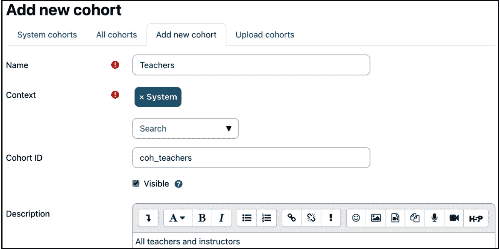

# 5

# 管理用户、群体和身份验证

本章将教你如何在 Moodle 系统中管理用户。我们首先将查看每个用户存储的信息以及我们如何扩展他们的个人资料。然后，在处理群体之前，我们将执行几个标准用户操作。最后，我们将处理一系列用户身份验证机制。我们将涵盖以下主题：

+   理解用户个人资料

+   执行标准用户操作（手动和批量）

+   手动创建用户账户（包括批量上传）

+   管理群体（包括批量上传）

+   配置用户身份验证（内部、外部、服务提供商和系统）

以下图表显示了上述主题（用户、群体和身份验证）的高级概述以及它们是如何相互关联的：

图 5.1 – 用户、课程和身份验证 – 高级概述

到本章结束时，你将能够管理用户账户和用户身份验证的所有方面。这需要吸收很多信息，所以我们最好早点开始！

# 理解用户个人资料

除了访客外，每个用户都有一个包含其信息的个人资料。我们首先将处理每个用户存储的信息以及它在 Moodle 中的组织方式。

你可以通过在屏幕顶部的姓名旁边的下拉菜单中选择**个人资料**项来查看自己的个人资料。点击**用户详情**部分的**编辑个人资料**链接来更改个人资料详情。要修改其他用户的个人资料，请导航到**网站管理 | 用户 | 账户 | 浏览用户列表**，然后点击他们名字旁边的**编辑**图标。

## 个人资料字段

Moodle 用户个人资料被分为预定义的类别，这些类别不能通过 Moodle 用户界面进行更改：

+   **通用**：标准用户字段

+   **用户图片**：用户的图片

+   **附加姓名**：音译名、中间名和别名

+   **兴趣**：用于网络活动的标签

+   **可选**：额外用户信息

除了这些静态的个人资料字段类别之外，Moodle 还允许我们创建用户自定义的个人资料类别和字段。在处理自定义个人资料字段之前，我们将介绍上述类别分组预定义的字段。

### 用户个人资料字段 – 通用

以下截图显示了**通用**类别的个人资料字段：

图 5.2 – 用户个人资料字段 – 通用

大多数这些项目都是不言自明的，但有一些关于每个项目的细节你需要了解。以下是每个个人资料元素的简要描述，以及如何有效地使用它们的提示：

+   **用户名**：必须提供一个唯一的用户名。默认情况下，仅允许使用字母数字小写字符、下划线（_）、连字符（-）、点（.）或*at*符号（@）。假设您还希望在用户名中使用其他字符，例如重音符号（¨），在这种情况下，您必须通过访问**站点管理 | 安全 | 站点安全设置**并开启**允许用户名中使用扩展字符**来启用这些字符。重要的是要记住，您需要有管理员权限来更改用户名。

如果您希望使用电子邮件地址作为用户名，请考虑**允许通过电子邮件登录**选项（在**站点管理 | 插件 | 认证 | 管理认证**）。这样，用户有两个登录选择，即他们的用户名和他们的电子邮件地址。

重要提示

如果您的用户还没有可以作为 Moodle 用户名（可重复）使用的唯一标识符，例如电子邮件地址或员工 ID，强烈建议为用户名制定一个一致的命名方案，例如，对于较小的机构使用`firstname.lastname`，对于较大的组织使用`startyear.firstname.lastname.index`。

+   主管理员账户的`auth`方法。我们将在本章的后半部分详细探讨认证方法。

重要提示

错误的认证方法会阻止用户登录，甚至可能完全删除他们的账户！

+   **挂起账户**：选择此选项以阻止用户登录。这作为一个纪律措施或在更长时间缺席的情况下（例如，休假学期）非常有用。挂起没有到期日期，因此您必须手动将其更改回来。

重要提示

账户挂起与注册挂起不同。前者影响用户，后者影响单个课程的注册。

+   **新密码**：在创建手动账户时，出于安全考虑必须提供一个密码。如果用户在首次登录时需要更改提供的密码，必须选择**强制密码更改**选项。您可以揭示（显示）自己的密码，但不能揭示其他用户的密码。然而，管理员可以覆盖用户的现有密码。

如果**密码策略**已启用（在**站点管理 | 安全 | 站点安全设置**），密码必须遵守此策略。有关密码策略的更多详细信息，请参阅*第十三章*，*确保 Moodle 安全*。

+   **名字**和**姓氏**：这些是用户的必填字段，对于带重音符号的字符（ä、â、à、á、…）完全支持。

+   **电子邮件地址**：这是一个必填字段，并且应该是唯一的。请确保地址正确，因为 Moodle 会定期使用它，例如，通知忘记用户名或密码的用户。

一些组织仍然没有使用电子邮件地址。由于这是一个必填字段，在这种情况下有两种典型的解决方案。

第一种选择是开发独特的虚拟电子邮件地址方案或仅用于识别目的的电子邮件地址。虽然从技术上解决了问题，但会显著限制用户体验，因为用户之间的通信或 Moodle 生成的通知无法发送。

第二种选择是激活**重复电子邮件地址**（在**网站管理 | 插件 | 认证 | 管理认证**中启用**允许具有相同电子邮件的帐户**），并为具有电子邮件地址的用户负责学习小组，例如，一个教师负责一个班级或一个主管负责工人。虽然从隐私角度来看这种方法并不理想——特定用户的消息可能会被多个人阅读——但至少有人知道发生了什么，然后可以将其传达给预期的收件人。

+   **电子邮件显示**：可以选择谁可以看到用户的电子邮件地址。不言自明的选项有**从非特权用户隐藏我的电子邮件地址**、**允许每个人查看我的电子邮件地址**和**仅允许其他参与者查看我的电子邮件地址**（默认）。管理员和教师（具有编辑权限）将始终看到电子邮件地址，即使它们被隐藏。

+   **MoodleNet 个人资料**：链接到用户的 MoodleNet 个人资料，它必须是一个符合 WebFinger URI 的链接。我们将在*第十九章* *设置 Moodle 网络*中处理 MoodleNet。

+   **城市/镇**和**选择一个国家**：这些用于通过用户的地理位置进一步识别用户。

+   **时区**：此功能用于将系统中的时间相关消息（例如作业截止日期）从本地时间（通常是服务器时间）转换为用户所选时区的正确时间。由于您的用户可能分布在全球多个时区，因此这是必要的。默认的城市、国家和时区可以通过导航到**网站管理 | 位置 | 位置设置**来指定。

+   **描述**：此选项提供有关用户的额外信息。作为管理员，您可以保留该字段为空。

用户个人资料中可能会出现其他字段，例如**首选主题**或**电子邮件字符集**，但这需要更改其他位置的设置。当处理相关主题时，我们将提及这些内容。

### 用户个人资料字段 – 用户图片

第二类被称为**用户图片**，正如其名所示，它处理附加到用户个人资料上的图片。

简单地将它拖到**新图片**面板或从文件选择器中选择图片以上传新图片。图片的大小不能超过列出的最大尺寸；如果您的图片太大，建议将其大小减少到至少 100 x 100 像素。支持的格式是 GIF、PNG 和 JPEG 系列；然而，请注意透明背景，因为它们可能在某些浏览器中引起问题。

**图片描述**字段用作 alt 标签，为非视觉浏览器提供图片描述；它符合无障碍指南。

图 5.3 – 用户资料字段 – 用户图片

一旦分配了图片，它将显示在**无**标签的位置。要删除图片，请勾选**删除**复选框，当更新资料信息时，图片将被删除。

Moodle 将自动裁剪图片成方形，并将其调整到 100 x 100 像素用于大视图和 35 x 35 像素用于小缩略图视图。

重要提示

在上传过程中自动创建两个缩略图，这可以将文件大小减少到大约 4 KB。管理员可以通过 `<moodleurl>/userpix` URL 查看所有上传的用户图片。

Moodle 也支持**Gravatar**，所谓的全球认可的头像。一旦你在**网站管理 | 用户 | 权限 | 用户策略**上选择**启用 Gravatar**选项，Moodle 将尝试从 [gravatar.com](http://gravatar.com) 获取用户资料图片，如果用户没有上传图片。

如果你怀疑你的学习者可能会通过上传不适当的图片来滥用这个功能，你可以禁用此功能。前往**网站管理 | 安全 | 网站安全设置**并勾选**禁用用户资料图片**复选框。请记住，一旦此功能被禁用，图片将无法分配给任何用户（除了管理员），教师也无法在课程中使用图片代表小组。

### 用户资料字段 – 其他名字

此**其他名字**部分包括以下字段：

+   **名字 – 音译**和**姓氏 – 音译**：该字段对的使用场景主要在远东语言中，用户有原始版本和罗马化版本或音译名字显示（例如，拼音）。

+   **中间名**：在某些文化中，有显示三个或更多名字的情况很常见。

+   **别名**：这可以是一个昵称、一个处理名或特定教学环境中的别名，例如，在游戏化或角色扮演场景中。

### 用户资料字段 – 兴趣

兴趣，如爱好或职业活动，可以逐个输入。要删除标签，选择其标签。所提供的**兴趣列表**代表在用户资料中显示的标签。你可以在 [docs.moodle.org/en/Tags](http://docs.moodle.org/en/Tags) 和 *第九章*，*配置教育功能*中找到更多关于标签的信息。

图 5.4 – 用户资料字段 – 兴趣

### 用户资料字段 – 可选

更多个人详细信息被归类在**可选**类别下：

+   **ID 号**可以包含学生号或员工号，通常用于同步工具，如人力资源系统。

+   **机构**和**部门**可能用于大学的校园和学院。如果您使用 Moodle Workplace，不要将这些字段与组织结构中的部门混淆，包括部门框架、职位、工作分配和管理员。

+   **电话**、**移动电话**和**地址**应该很容易理解。

一些组织将未使用的字段重命名为其设置中所需的字段。有关此信息，请参阅*第十章*中的*本地化*部分，*配置技术功能*。

这就完成了预定义用户资料字段的解释。列表可以通过以下章节中介绍的定制字段进行扩展。

## 创建用户自定义资料字段

Moodle 允许将新的任意字段添加到用户资料中。我们已经在上一章中描述了用户自定义字段的 管理，当时我们处理了自定义课程字段。由于使用了相同的机制来处理用户资料字段，我们只处理与账户相关的特殊问题。

我们刚刚了解到资料字段被组织成类别（例如，**通用**、**用户图片**、**兴趣**和**可选**）。可以创建额外的类别，并将用户自定义字段放置在这些新类别中。您可以通过导航到**网站管理 | 用户 | 账户 | 用户资料字段**来找到这个功能。

与自定义课程不同，已经存在一个默认类别，称为**其他字段**，可以通过标准 Moodle 图标进行删除或重命名。在添加资料字段后，点击用户资料底部的**创建新资料类别**按钮即可创建新类别。

课程中的五个资料字段类型（复选框、日期/时间、下拉菜单、文本区域和文本输入）适用于用户，还有一个额外的类型：社交。让我们来了解一下字段特定设置中的差异：

+   **复选框**：这与自定义课程字段相同。

+   **日期/时间**：而不是最小值和最大值，两个日期边界分别是**开始年份**和**结束年份**。还有一个**包含时间？**选项，尽管您不能指定默认时间。

+   **下拉菜单**：这与自定义课程字段相同。

+   **社交**：这种新的字段类型允许您指定社交网络 ID，例如用户的 Skype 昵称。您在**网络类型**列表中看到的选项以前是硬编码在用户资料中的。让我们希望这个列表很快就能更新到 21 世纪，以支持 Facebook、Twitter、Instagram 和 TikTok 等社交媒体平台，而不是过时的服务如 ICQ 和 AIM。

如果您从 Moodle 3.x 升级，并且这些服务中有任何内容，它们将被保留并自动转换。

图 5.5 – 社交类型用户资料字段

+   **文本区域**：这与自定义课程字段中的完全相同。

+   **文本输入**：这与课程中的**短文本**字段相同，但一些字段已被重命名：**表单输入大小**现在是**显示大小**，而**最大字符数**现在是**字符限制**。为什么？我完全没有头绪！

用户资料字段中的每个字段类型都有与自定义课程字段相同的参数，但有三个显著的不同点：

+   字段排列略有不同，常见的字段设置**锁定**和**可见**已被移动到**常规**部分。

+   **谁可以看到字段**的选项已被调整为如下。不再是**教师**，现在有两个选项可供选择，即**对用户可见**和**对用户、教师和管理员可见**。

+   唯一可用的附加设置是**在注册页面上显示？**。当启用自助注册时，必须在注册时提供几个默认字段。如果自定义字段也应显示在注册页面上，则必须将选项设置为**是**。此功能在商业培训设置中可能很有用，当需要额外信息，如学习者的地址或先前资历时。

为了展示用户资料字段的工作方式，让我们假设一个学校，你希望通过一个名为**家长责任**的新资料类别扩展用户资料，包括**联系人**和**关系**等字段：

图 5.6 – 用户资料字段示例

这完成了关于自定义用户资料字段的子节处理，扩展了标准用户资料。用户资料的第三和最后一个组成部分是用户偏好，我们将在下一节中介绍。

## 用户偏好

一些字段在技术上属于用户资料，但它们已被放置在`moodle/user:editownprofile`能力中，并允许他们通过专用表单指定偏好：

+   **首选语言**：系统默认语言显示，可以更改为用户的偏好语言。我们将在*第十章* *配置技术功能*中处理本地化。

+   **论坛偏好**：**邮件摘要类型**确定用户如何接收存在订阅的论坛帖子。有三个可能的选择，即**无摘要（每个论坛帖子一个单独的电子邮件）**，这是默认设置，**完整（包含完整帖子的每日电子邮件）**或**主题（仅包含主题的每日电子邮件）**。**论坛自动订阅**设置规定用户是否自动订阅他们发帖的论坛。**使用实验性嵌套讨论视图**选项提供了一种新的讨论视图；在印刷时，该功能仍在试验模式中。

+   如果**论坛跟踪**已启用，未阅读的帖子将被突出显示，这提高了论坛的可用性。在发送论坛帖子通知时，用户可以选择是否标记帖子为已读，以影响论坛跟踪。

+   **编辑器偏好设置**：此选项确定在文本区域中输入信息时应使用哪个编辑器。除非用户有特殊要求或偏好，否则应保留为**默认编辑器**选项。在*第七章*“增强 Moodle 的外观和感觉”中，您将了解更多关于编辑器的信息。

+   **日历偏好设置**：用户选择的日历和事件相关设置。日历将在*第十章*“配置技术功能”的专用部分中进行讨论。

+   **内容库偏好设置**：此设置确定用户创建的内容的可见性（公开或未列出）。我们将在*第八章*“理解 Moodle 插件”部分的*H5P 集成*部分中介绍内容。

+   **消息偏好设置**：这些设置控制隐私和通知偏好。我们将在*第十章*“配置技术功能”部分的*通讯*部分中处理消息。

+   **通知偏好设置**：用户可以选择不同通知类型的通道。我们将在*第十章*“配置技术功能”部分的*通讯*部分中处理消息。

可以通过导航到**网站管理 | 用户 | 账户 | 用户默认偏好**来指定一些设置（电子邮件、论坛和内容库）的默认偏好。

这完成了用户配置文件部分的介绍，其中我们介绍了标准和自定义配置文件字段，并简要地查看了一些用户偏好。现在，既然我们已经知道了用户配置文件的样子，让我们开始与用户互动。

# 执行标准用户操作

到目前为止，您已经了解了 Moodle 保存的用户信息类型以及如何扩展每个配置文件中存储的数据。现在，是时候与系统中的现有用户一起工作了，这包括浏览和筛选用户账户以及应用批量操作。

## 浏览用户

查看您的 Moodle 用户账户的最快方法是导航到**网站管理 | 用户 | 账户 | 浏览用户列表**。最初，会显示一个按**姓名**排序的用户列表。一次显示三十个用户，如果适用，您可以通过**<<**和**>>**链接进行导航，或者通过选择一个数字直接跳转到另一页。可以通过点击列标题按升序或降序对每一列进行排序。

图 5.7 – 浏览用户账户

您可以通过点击用户姓名来查看个人的资料。除了我们在本章第一部分介绍的字段外，您还可以看到**登录活动**，显示**首次访问网站**、**最后访问网站**以及登录时发生的**最后 IP 地址**。

您可以指定在列表和其他位置显示有关用户的哪些身份信息（用户名、ID 号、电子邮件地址、电话号码、部门、机构、城市和国家）。转到 `moodle/site:viewuseridentity` 能力。

重要提示

要伪装成另一个用户，请使用用户资料中的**登录为**选项。

当您查看另一个用户账户的资料时，您将在**管理**面板中看到一个**登录为**链接，这允许您伪装成另一个用户。当您作为管理员找不到问题时，此功能非常有用。要查看用户的全部资料字段或修改其中任何一个，如前所述，请点击**编辑资料**链接。要修改用户的任何偏好设置，请选择相应的链接。

返回用户列表，并在最右侧列中点击标准**删除**图标来删除用户。在用户被不可逆地删除之前，必须回答确认屏幕。实际上，用户只是从 Moodle 的用户界面中删除。内部上，用户保留在数据库中，并且已将删除标志打开，这是必要的，以便某些用户贡献不会消失，例如论坛帖子。技术上，可以通过在数据库中手动更改删除标志来恢复用户账户。

要**暂停**用户账户，切换**显示/隐藏**图标，这将触发账户暂停，如*用户资料字段*部分所述。

与浏览账户相关的是过滤，这可以缩小您正在处理的用户条目数量。这种细化机制在拥有大量用户账户的网站上尤其有用。

## 过滤用户

我们可能经常需要搜索特定的用户或一组用户。Moodle 提供了一个灵活的过滤机制来细化显示的用户列表。在基本模式下，您可以按用户的完整姓名进行过滤，这是姓名和姓氏的组合。以下过滤操作可用，所有这些操作均不区分大小写：

+   **包含**：提供的文本必须包含在字段中

+   **不包含**：这是包含的反面

+   **等于**：提供的文本必须与字段的值相同

+   **以...开始**：字段必须以提供的文本开头

+   **以...结束**：字段必须以提供的文本结束

+   **为空**：字段必须为空

例如，当添加一个过滤器，如**用户全名以“cl”开头**，所有以 *cl* 开头的用户都会显示。请查看以下屏幕截图：

图 5.8 – 过滤用户账户 I

您可以看到，现在添加的过滤器已激活，一旦添加了多个过滤器，它将变得更加有用（通过**显示更多…**链接切换到高级模式）。现在，我们可以将过滤器应用于广泛的字段：

图 5.9 – 过滤用户账户 II

例如，在前面的屏幕截图中，我们寻找所有用户名以**22**开头的用户（假设命名方案以入学年份开头）以及账户已被挂起。使用此机制，可以添加所需的任何数量的过滤器。

每次添加过滤器时，它都会显示在**活动过滤器**框架中，并应用于 Moodle 中的用户数据。

图 5.10 – 过滤用户账户 III

在这里，已添加了三个一目了然的过滤器。现在可以删除单个过滤器（选择过滤器并点击**删除所选**按钮）或**删除所有过滤器**。

文本字段的筛选标准在本节前面已描述。根据字段类型，可以使用一些额外的操作，如下表所示：

图 5.11 – 过滤操作

**认证**标准提供所有支持认证方法的选择。我们将在本章后面处理这些内容。如果指定了用户配置文件字段，则还会显示额外的**用户配置文件字段**标准，提供所有用户定义字段的选择（如之前所述）。

当前筛选设置被保存，可以在下次登录时使用。不仅如此，它们还被保存在下一节中将要介绍的批量用户操作中。

## 批量用户操作

批量操作允许管理员对多个用户执行单个操作，例如，强制更改密码或发送消息。为了说明批量用户操作的工作原理，请查看以下图中描述的用户操作筛选器：

图 5.12 – 批量用户操作筛选器

筛子模型的三个层级具有以下特点：

+   顶层显示系统中的所有用户（Moodle Workplace 中的租户）

+   中间层包含应用了活动过滤器后的所有用户

+   底层包含通过手动选择用户缩小列表后留下的任何用户

可以通过访问**网站管理 | 用户 | 账户 | 批量用户操作**来对所选用户账户组应用各种批量操作。

图 5.13 – 批量用户操作 I

屏幕包含三个主要部分。前两部分是熟悉的**新过滤器**和**活动过滤器**部分。有趣的是，已创建的过滤器也会显示在此屏幕上，因为它们已被保存。

第三部分显示**所有过滤**列表中符合指定过滤器标准的用户。在您可以对用户进行任何操作之前，您必须使用**添加到选择**按钮将他们移动到**所有选择**列表。在前面的屏幕截图中，除了一个用户外，所有用户都已移动。要将他们移回**所有过滤**列表，请选择用户并点击**从选择中移除**按钮。存在两个快捷按钮，允许您将**所有过滤**列表中的所有用户添加到**所有选择**列表，并使用**全部移除**来反向移动它们。

这种方法的优点是您可以连续应用多个过滤器并选择相应的用户，例如，在用户名以入学年份开头的设置中。假设您想选择 2022 年和 2023 年的所有用户，过滤出所有以`23`开头的用户名。

当点击**With selected users...**下拉菜单的**Go**按钮时，所选操作将对**所有选择**列表中的用户执行。以下表格显示了可用的操作：

图 5.14 – 批量用户操作 II

现在我们已经了解了如何处理现有用户，让我们看看他们是如何被添加到系统中的。

# 手动创建用户账户

有两种方式可以手动为用户提供账户以访问您的系统：

+   添加单个用户

+   批量上传用户，包括他们的用户图片

在以下三个部分中，您将了解如何执行和支持每种类型。

## 添加单个用户

要手动添加用户账户，请转到**网站管理 | 用户 | 账户 | 添加新用户**。或者，您也可以浏览用户列表，并在屏幕底部选择**添加新用户**按钮。您将看到与您之前编辑用户资料时相同的表单。

重要提示

手动添加用户应该是例外，而不是规则。强烈建议自动化此过程。

您应尽可能避免手动添加单个用户，因为这是一个非常耗时、繁琐且可能存在错误的过程。然而，在某些情况下，您无法避免这样做，例如，当学生在一学期中途加入学校或外部培训师需要访问 Moodle 但不是组织员工数据库的一部分时。

如果您要添加多个用户，请使用 Moodle 的批量上传功能，我们将在下一部分进行探讨。

## 批量上传和更新用户数据

批量上传用户允许从文本文件中导入多个用户账户或更新系统中已存在的用户账户。

学习者信息通常存在于现有应用程序中，例如内部学生管理系统或人力资源数据库，可以将数据导出为 Excel 电子表格或直接导出为文本文件。CSV 文件中的数据随后被加载到 Moodle 数据库中，如果指定，用户将被注册到课程中，并添加到班级成员中。此过程在以下工作流程图中显示：

图 5.15 – 批量用户上传

您可以在[docs.moodle.org/en/Upload_users](http://docs.moodle.org/en/Upload_users)找到有关批量上传和更新用户的优秀和详细说明。我们将关注关键元素和上传工作流程，以补充已充分记录的功能。

### 文本文件格式

在上传用户之前，您必须生成一个符合特定格式的文本文件。其一般格式是**逗号分隔值**（**CSV**）文件，一种平面文本文件格式。虽然手动创建 CSV 文件（使用纯文本编辑器或电子表格应用程序）是可能的，但这些文件通常由托管用户数据的系统自动生成。

文本文件的格式如下：

+   文件的每一行必须包含一个单独的记录

+   每条记录必须是一系列由分隔符分隔的数据

+   文件的第一条记录必须包含定义文件其余部分结构的字段列表

一个有效的输入文件示例如下：

`username, password, firstname, lastname, email`

`galmond, pwd, Graham, Almond, galmond@openumlaut.com`

`earmstrong, pwd, Eleanor, Armstrong, earmstrong@openumlaut.com`

`jarnold, pwd, Joanne, Arnold, jarnold@openumlaut.com`

第一行包含提供的字段列表，而其余三行代表要上传的单独用户。

Moodle 的上传功能支持以下类型的数据字段：

+   **必需**：必须包含的必填字段

+   **密码**：密码字段

+   **可选**：如果没有提供值，将使用指定的默认值

+   **自定义**：用户定义的个人资料字段

+   **注册**：处理课程、角色和组

+   **班级**：将用户添加为班级成员

+   **系统**：将系统角色分配给用户或从用户中取消分配

+   **特别**：修改和删除用户账户

我们将逐一介绍每种字段类型，以更好地了解 Moodle 的用户批量上传工作原理以及如何在您的设置中使用它。

#### 必需字段

当添加新用户时，只需`firstname`和`lastname`是必填项。当更新记录时，只需`username`。你可能还记得用户资料中还有一些其他必填字段，例如用户名或电子邮件地址。如果这些字段没有提供，必须通过模板指定默认值。我们将在本章后面处理模板。

示例文件是一个包含五个字段的输入文件示例，包括必需的`firstname`和`lastname`。

#### 密码

除非`cron`进程运行，否则需要`password`值。

注意

如果将`password`设置为`changeme`，则用户在首次登录时将被强制更改密码。更好的方法是使用**强制密码更改**选项。

#### 可选字段

如其名所示，可选字段不必指定——如果它们未包含在文本文件中，则如果存在，则使用默认值。以下为这些可选字段：

图 5.16 – 用户上传（可选字段）

当必须使用默认设置时，必须包含空字段。即使在每个记录的最后一个字段，这些字段也必须保持为空。空字段由两个连续的逗号表示，如下所示，在示例文件中：

`username, password, firstname, lastname, email, city`

`galmond, changeme, Graham, Almond, galmond@openumlaut.com, Kyiv`

`earmstrong, , Eleanor, Armstrong, ermstrong@openumlaut.com,`

`jarnold, , Joanne, Arnold, jrnold@openumlaut.com, Doha`

在前面的示例文件中已添加`city`字段，并将默认城市设置为`city`值。对于`password`字段，默认值也已设置为空。

#### 自定义配置文件字段

您指定的任何用户定义字段（在我们的案例中，那些用于家长责任）也可以作为批量上传过程的一部分使用。每个字段必须以`profile_field_`开头；例如，代表 Skype ID 的字段将被标记为`profile_field_skype_id`。

自定义字段的处理方式与可选字段完全相同。如果指定了值，则使用这些值；如果没有指定，如果存在，则使用默认值。

#### 报名字段

报名字段允许您将角色分配给用户；您可以在课程中注册他们并将他们分配到组。角色将在*第六章*中详细说明，*管理权限、角色和能力*。

每门课程必须通过`course1`、`course2`、`course3`等单独指定。课程名称是课程的简称，并且是唯一的强制报名字段。每个相应的类型、角色、组、报名开始时间、报名期限和报名状态必须具有相同的后缀：`type1`、`role1`、`group1`、`enroltimestart1`、`enrolperiod1`和`enrolstatus1`对应于`course1`。

还可以设置用户在课程中的角色。每个角色都有一个角色简称和角色 ID，可以指定其中之一。如果类型留空或未指定课程，则用户将被注册为学生。报名期限以天为单位设置报名期限；当设置为`1`时，报名状态将暂停用户参加课程。

如果您想将用户分配到课程中的组（例如，`course1`中的`group1`，`course2`中的`group2`等），您必须指定组名或 ID。如果指定的组不存在，它将被自动创建。

以下示例演示了一些登记功能：

`username, course1, role1, course2`

`galmond, Advanced, editingteacher, Staff`

`earmstrong, Advanced, examiner, Staff`

`jarnold, Basic, 3, Staff`

`course1`字段及其对应的`role1`和`course2`是可选的登记字段。Graham Almond (`galmond`)将被分配到`Advanced`课程的`editingteacher`角色，Eva Armstrong (`earmstrong`)将被分配到`examiner`角色。Jonny Arnold (`jarnold`)将在`Basic`课程中担任`editingteacher`（角色 ID 为`3`）。所有三位用户都将被分配到`Staff`课程的`student`角色（未指定角色，因此默认设置为）。

#### 群体字段

群体字段允许您将用户添加为群体的成员。与课程中的登记和分组一样，字段名必须后缀一个计数器：`cohort1`、`cohort2`等等。以下是一个示例文件片段：

`username, firstname, lastname, cohort1, cohort2`

`pupil1, Pupil, One, 7a, drama`

`pupil2, Pupil, Two, 7a, archery`

用户可以被添加到系统群体以及上下文群体。群体将在本节主要部分之后处理。

#### 系统角色

如果您需要分配用户系统角色，您必须通过`sysrole1`、`sysrole2`等指定此角色。字段的值必须是角色的`shortname`，例如`manager`或`coursecreator`。

您还可以通过在角色名称前加减号来从用户中取消分配系统角色，例如`-manager`或`-coursecreator`。

#### 特殊字段

支持以下特殊字段：

+   `oldusername`：当更改用户名时，您必须提供当前值

+   `deleted`: 当删除用户时，您将`deleted`设置为`1`

+   `suspended`: 当暂停用户时，将`suspended`设置为`1`；要激活，设置为`0`

特殊字段是文本文件格式的最后一类文本。一旦您创建了用户文件，就是时候将用户上传到 Moodle 了，我们将在下一部分讨论。

### 上传用户

上传用户是一个四步过程，如下面的图所示：

图 5.17 – 用户上传工作流程

工作流程包括以下四个步骤：

1.  创建或生成 CSV 文件

1.  上传文件，指定元数据和查看数据预览

1.  配置上传设置和默认值

1.  检查上传结果

我们已经在上一小节中介绍了*步骤 1*，所以让我们直接跳到第二和第三阶段。要批量上传或更新用户，请转到**网站管理 | 用户 | 账户 | 上传用户**，其中以下设置可用：

+   **文件**：文本文件的名称。

+   **CSV 分隔符**：指定分隔符是逗号（默认）、分号、冒号还是制表符。例如，在大多数欧洲地区，如德国、法国和荷兰，默认分隔符是分号！

+   **编码**：您上传文件的编码方案指定了它被保存的 locale（默认为**UTF-8**）。

+   **预览行**：预览屏幕上显示的行数。

图 5.18 – 上传用户配置

一旦确认此屏幕，您将看到以下四个部分：

+   **上传用户**预览：预览屏幕上显示的指定行数的预览。要跳过的记录将不会显示。

+   **设置**：取决于所选上传类型的不同选项。

+   **默认值**：可以设置默认值的所有用户字段。

+   **自定义值**：如果有，按类别分组的任何用户定义字段。

记住，并非所有设置都适用于所有上传类型；如果它们不适用，它们将保持隐藏。以下表格显示了哪些设置适用于哪些上传类型：

图 5.19 – 上传用户设置

这里是每个**上传用户**设置的简要说明：

+   如果未指定，`cron`进程将自动生成一个一次性密码（**如有需要创建密码并通过电子邮件发送**）。

+   **现有用户详情**：指定在账户更新时对现有用户详情执行的操作。选项包括**无更改**、**用文件覆盖**、**用文件和默认值覆盖**以及**从文件和默认值中填写缺失[字段]**。

+   **现有用户密码**：指定当用户详细信息更新时用户密码会发生什么。密码可以保持不变（**无更改**）或被覆盖（**更新**）。

+   **强制密码更改**：指定何时标记需要用户更改密码的账户（**拥有弱密码的用户**、**无**和**所有**）。

+   `oldusername`字段。

+   `deleted`字段。

+   `suspended`字段。

+   **防止电子邮件地址重复**：多个用户可以拥有相同的电子邮件地址（如*理解用户配置文件*部分所述）。此设置仅在**站点管理 | 插件 | 认证 | 管理认证**上启用了**允许具有相同电子邮件的账户**时才会显示。

+   **标准化用户名**：从用户名中删除任何无效字符（除非允许，则为扩展字符以及空格）并确保所有字符都是小写。

+   **选择批量用户操作**：您可以指定是否选择**新用户**、**更新用户**或**所有用户**进行批量操作。您将在用户列表中看到**批量用户操作**的名称。

到目前为止已经提到了几次默认值；现在，是时候与模板一起处理它们了。

### 设置默认值和模板

Moodle 的用户批量上传功能支持默认值，如果未设置值，则使用这些默认值。默认值涵盖所有可以上传的用户配置文件字段以及用户定义的自定义字段。

每个基于文本的字段都可以使用模板进行填充。此功能对于可选字段很有帮助，例如学生的网站 URL，如果它们在 CSV 文件中未指定，则对于必填字段是强制性的，例如 `username` 和 `email`。如果后者是这种情况，Moodle 将会警告您。例如，在下面的屏幕截图中，**用户名模板**尚未提供，这由红色警告信息表示：

图 5.20 – 模板缺失

模板（或模式）将根据其他字段的值和您指定的标准字符创建一个值。模板可以包含以下内容：

+   **替换值**：值由相应的配置文件字段替换

+   **模板修饰符**：根据修饰符转换或截断值

+   **标准文本**：包含没有任何修改的纯文本

下表可能有助于澄清前面的概念：

图 5.21 – 模板内容

有四个替换值，由百分比表示。例如，如果用户名应该是用户的名字，后面跟着一个点，然后是姓氏，模板看起来就像 `%f.%l`。

在 `%` 符号和三个代码字母（`l`、`f` 和 `u`）中的任何一个之间可以包含四个修饰符，其中井号代表十进制数字。最后一个模板是一个示例，它将替换值嵌入到其他文本中；在这种情况下，它是一个代表用户主页的 URL。

这完成了我们用户上传工作流程的第三步。最后一步是加载和审查实际的用户数据。

### 数据加载

一旦所有设置都已指定，默认值已提供，并且已按下**上传用户**按钮，Moodle 将最终开始实际的导入过程。

重要提示

强烈建议您首先创建一个包含较少虚拟记录的测试文件，以确保语法正确。

Moodle 显示一个包含所有已添加和/或更改的用户字段的大表。它还显示每个字段的状况，包括发生的任何问题或错误。

结果屏幕底部会显示一条消息，总结上传过程。它包含创建和更新的用户数量，那些有弱密码（根据密码策略），以及错误数量。请看以下屏幕截图：

图 5.22 – 审查上传结果

建议您立即识别无效的用户账户，并手动修改它们的用户设置或修复上传文件并重新运行。

批量用户操作提供了一种灵活的方法来创建和更新文本用户数据。然而，CSV 文件无法处理的一种用户信息类型是：个人资料图片。Moodle 提供了一个专门处理用户图片的功能。让我们在下一节中看看它。

## 上传用户图片

如前所述，上传用户的过程不支持个人资料图片；相反，用户图片必须单独上传。上传用户图片的工作流程简单而有效，如下面的图所示：

图 5.23 – 用户图片上传工作流程

上传用户图片工具可以在 `attribute.ext` 找到。

`ext` 是文件扩展名（`.jpg`、`.gif` 或 `.png`）。图片文件名不区分大小写。

图 5.24 – 上传用户图片

例如，如果用户名由名字的首字母和姓氏组成（如果以模板风格表达为 `%1f%l`），则有效的文件名是 `psmith.png`、`lcohen.png` 和 `mstripe.png`。如果用户存在，图片将被添加到他们的个人资料中；否则，将被忽略。如果用户的个人资料中已经存在图片，只有当您启用了**覆盖现有用户图片？**选项时，它才会被替换。

到目前为止，我们只按账户逐个查看单个用户。Moodle 作为一个支持学习者与教师之间沟通和协作的学习系统而蓬勃发展。为了支持协作，用户可以以两种方式排列：课程级别的组和分组，以及系统或类别级别的群体。我们已经在上一章和用户批量上传期间遇到了组，现在让我们更详细地看看群体。

# 管理群体

我们已经在 *第四章* *管理和注册课程* 以及本章的简介图中遇到了群体。

重要提示

群体是用于逻辑上聚集相关用户的组。

到目前为止，我们主要在注册的背景下提到了群体；然而，Moodle 在多个地方使用群体，如下所示：

+   课程注册和同步

+   群体主题为预定义的用户群体提供用户体验，例如，视觉障碍学习者

+   报告受众以限制报告对群体的访问

+   自动执行操作，例如作为动态规则（仅限 Moodle Workplace）的一部分通知或颁发证书给群体

放大查看群体元素，我们可以看到其结构和属性：

图 5.25 – 群体（高级）

让我们更详细地看看如何创建和管理群体。为此，导航到 **网站管理 | 用户 | 账户 | 群体**。

图 5.26 – 可用班级

提供了每个班级的详细信息及其标准操作（隐藏、删除、编辑和分配）。**所有班级**标签提供几乎相同的视图，显示系统和类别班级。

要创建班级，请选择**添加新班级**标签并指定班级属性。**上下文**是班级的范围，表示班级可以使用的位置；选项是**系统**（全局或站点范围）和所选类别。**班级 ID**是可选的，但将其设置为良好实践，因为它将在不同的操作中使用，例如在添加批量用户时。

图 5.27 – 添加班级

一旦添加了班级，你将返回所有班级的列表。现在，你应该通过选择**分配**图标来添加成员，这将显示熟悉的用户选择屏幕以添加或删除班级成员资格。

重要提示

从班级中删除用户将取消他们在所有已启用班级同步的课程中的注册！

您可以通过**上传班级**标签批量执行此任务，而不是手动添加班级。这与上一节中描述的批量添加用户的原则相同。以下是一个表示之前使用的班级的示例文件：

`name, contextid, idnumber, description, visible`

`7a, 1, 7a, 7a 班的所有学生，1`

`7b, 1, 7b, 7b 班的所有学生，1`

`7c, 1, 7c, 7c 班的所有学生，1`

`Temp, , , 用作占位符，0`

您可以在[docs.moodle.org/en/Upload_cohorts](http://docs.moodle.org/en/Upload_cohorts)上找到有关上传班级的详细信息，包括可选和附加字段。

现在您已经了解了有关用户账户及其存储的信息的所有内容，让我们看看如何使用 Moodle 进行用户认证。

# 配置用户认证

认证是获取系统访问权限的过程。Moodle 支持大量的认证类型。此外，Moodle 支持**多认证**，即来自不同认证源的并发认证。例如，您的组织可能使用包含所有员工信息的 LDAP 服务器，并为学生使用 OAuth2，但希望本地管理兼职用户。

在本章的后半部分，我们将探讨用户认证和认证插件的总体管理，然后介绍常见的认证设置。然后，我们将处理所有认证方法，这些方法已被分为四类：内部、外部、提供者和系统。

## 探索用户认证

记住我们在*第三章*“探索课程、用户和角色”中查看的基本认证工作流程。现在，我们可以查看一个更完整的图景，如下所示：

图 5.28 – 认证工作流程

让我们从顶部开始，用户在此输入他们的用户凭据，例如，用户名和密码。请注意，这可能会自动完成，例如，在单点登录设置或通过服务提供商登录。Moodle 会检查是否存在该用户的个人资料。如果存在并且账户通过内部机制进行认证，Moodle 只需检查凭据是否有效。

如果用户个人资料不存在，这通常是用户第一次尝试登录时的情况，Moodle 会检查任何启用和配置的外部提供者基于的认证机制。如果存在有效条目，将创建一个账户，任何存在映射的现有数据将被复制到本地用户个人资料，并授予访问权限。

一旦个人资料存在并且认证是外部或通过提供者，Moodle 会检查凭据是否适用于设置的认证方法。如果是这种情况，源中的任何修改数据将被更新，并授予访问权限。

## 管理用户认证

要访问所有认证插件，请转到 **站点管理 | 插件 | 认证 | 管理认证**。您将看到可用的认证插件列表。每个插件可以通过切换 **显示/隐藏** 图标来激活/停用。本节中讨论的每种类型的设置可以通过其相应的链接或一旦认证方法激活，直接通过插件菜单中的链接访问。

您还可以通过上下箭头更改 Moodle 尝试通过认证用户的顺序。

重要提示

认证插件应用的顺序将影响用户登录所需的时间，所以请确保主要插件位于顶部。

**用户** 列提供了每个认证机制的注册用户数量的指示。

图 5.29 – 认证插件

通过外部插件支持额外的认证方法，例如 [moodle.org/plugins/?q=type:auth](http://moodle.org/plugins/?q=type:auth) 上的 **OpenID** 和 **SAML2**。一旦安装（请参阅 *第八章* 中的 *安装第三方插件* 部分，*理解 Moodle 插件*），它们将出现在列表中，并列在所有核心认证方法旁边。不建议您通过 **卸载** 选项删除插件——而是在系统级别删除它们。

以下图表展示了 Moodle 认证插件的聚类：

图 5.30 – 认证插件分组

此分组也形成了本章剩余部分的结构，从所有机制共享的常见认证设置开始。

## 常见认证设置

首先，让我们看看常见的身份验证设置，您将在可用的插件列表下看到这些设置。无论您首选的身份验证系统（们）是什么，都有几个常见的设置适用于所有方法：

+   **自注册**：指定是否使用任何插件进行自注册（有关详细信息，请参阅下一节）。

+   **允许通过电子邮件登录**：用户可以通过用户名或电子邮件地址登录，只要电子邮件地址是唯一的。

+   **允许具有相同电子邮件的账户**：在某些设置中，用户将不得不共享相同的电子邮件地址。我们在*理解用户配置文件*部分讨论了此话题。

+   **在身份验证时防止创建账户**：一些身份验证机制（例如，LDAP）支持创建新账户。如果阻止了这一点，您必须确保通过其他方式创建账户。

+   **自动聚焦登录页面表单**：当启用时，如果登录页面上的光标为空，它将始终直接跳转到用户名输入字段；否则，跳转到密码字段。

+   **访客登录按钮**：默认情况下，允许访客访问您的 Moodle 系统。如果您禁用此功能，这是大多数教育和商业网站推荐的做法，访客登录按钮将不会显示在登录屏幕上。

重要提示

确保禁用您的 Moodle 系统的访客访问，以防止不想要的注册。

+   **限制并发登录**：您可以指定同时登录的浏览器数量。一旦超过这个数量，最旧的会话将被终止。这种限制在考试场景中很有用，您可能只允许单个并发登录。

+   **备用登录 URL**：默认情况下，用户必须通过标准登录屏幕登录到 Moodle。但是，为了更改登录凭据（用户名和密码）的来源，请在此处输入正确的 URL。如果您希望在单独的网页（如主页）上有一个登录块，则需要此重定向。此机制的详细信息在*第七章*的*自定义登录*子节中展示，*增强 Moodle 的外观和感觉*。

+   **忘记密码 URL**：Moodle 有一个内置机制来处理丢失或忘记的密码。如果您使用具有自己的密码恢复系统的身份验证方法，请在此处输入其 URL。

+   **说明**：提供有关如何注册系统以及用户名应具有的格式的信息是一种好习惯（这仅适用于自注册）。如果留空，则存在默认说明。

+   `openumlaut.com` 或 `.edu`。

+   **更改电子邮件时限制域名**：如果启用，允许/拒绝的电子邮件域名设置也将应用于更改电子邮件地址时。

+   **ReCAPTCHA 公共/私有密钥**：这是在注册表单上显示 reCAPTCHA 元素或与 reCAPTCHA 服务器通信的密钥（请参阅*基于电子邮件的自注册*部分）。

一旦我们处理了它们影响的认证方法，一些常见的认证设置将更有意义。让我们从内部认证方法开始。

## 内部认证方法

内部认证方法处理 Moodle 内的所有认证；没有连接到其他系统。有两种内部认证方法：手动账户和基于电子邮件的自注册。

### 手动账户

手动账户认证简单来说就是在登录时验证输入的用户凭据（用户名和密码）是否正确存储在 Moodle 中。

重要提示

主要的 Moodle 管理员账户始终是手动账户。

所有手动创建的账户都有两种类型的设置：密码过期和用户字段的锁定。两者都可以通过导航到**站点管理 | 插件 | 认证 | 手动账户**进行更改。

图 5.31 – 手动账户设置

密码过期允许您通过**密码持续时间**设置选择密码有效的时间长度，在此期间用户必须更改密码。**通知阈值**允许您指定何时通知用户进行密码轮换。

您可以为手动创建或通过批量文件上传的账户锁定字段。这种锁定机制在您不希望用户更改其用户资料中的特定数据时非常有用——年轻学生可能会滥用**描述**字段，ID 号可能用于内部链接到其他系统，公司可能已提供电子邮件地址，等等。

默认情况下，所有字段都是**未锁定**的。如果字段被**锁定**，用户将无法更改其值。如果您锁定任何必填字段，您必须确保它们被正确填写，或者将它们的锁定状态设置为**如果为空则解锁**。后者将强制用户在下次登录时输入值，然后锁定该字段。

通过手动认证方法验证的账户通常是通过手动创建或通过用户批量上传创建的。这两种操作在本章的第一部分已有详细描述，其中后者有效地自动化了手动账户创建。还有两种其他认证机制模仿手动添加用户账户：网络服务，我们将在后面的**系统认证方法**部分处理，以及**基于电子邮件的自注册**，我们将在下一部分进行介绍。

### 基于电子邮件的自注册

Moodle 支持一种机制，允许用户在不干预或无需管理员知识的情况下创建账户。当新用户通过登录屏幕上的**创建新账户**按钮注册 Moodle 时，他们可以选择新的用户名和密码。一旦完成此步骤，就会向用户的电子邮件地址发送一封确认邮件，其中包含一个必须确认以激活账户的安全链接。注册屏幕看起来像这样：

图 5.32 – 自助注册注册屏幕

我们解释了如何通过**显示在注册页面**选项向注册屏幕添加更多项目（处理用户定义的个人资料字段时）。在商业培训设置中，当需要收集额外的数据，如学习者的地址、参与者的饮食要求或客户编号时，这个功能通常非常有价值。

Moodle 支持在图片所示的注册屏幕上激活的**reCAPTCHA**机制。该功能用于防止机器人自动注册。要启用此功能，您必须在[www.google.com/recaptcha](http://www.google.com/recaptcha)上注册一个账户，在**管理认证**区域的**常规设置**中添加公钥和私钥，并启用**reCAPTCHA**元素。

重要提示

为了 reCAPTCHA 能够工作，必须安装 PHP cURL 扩展。

可以像手动账户一样为自助注册设置相同的锁定设置（转到**站点管理 | 插件 | 认证 | 基于电子邮件的自助注册**）。此外，还适用前面描述的限制。另外，您还有**启用 reCAPTCHA 元素**选项。

当您导航到**站点管理 | 用户 | 隐私和政策 | 策略设置**时，如果指定了用户策略，注册屏幕上会显示一个带有确认复选框的协议链接。我们将在*第十四章*“遵守数据保护法规”部分作为 GDPR 设置的一部分处理更复杂的用户同意处理。

如果确认电子邮件无法发送，例如，由于技术问题，请转到用户列表，在那里您将在账户条目旁边找到两个链接：一个用于确认账户，一个用于重新发送电子邮件。

在我们继续到下一个认证方法之前，这里有一个设置自助注册的简要清单（除了启用之外，所有步骤都是可选的）：

图 5.33 – 自助注册清单

允许用户在您的网站上注册账户伴随着一定程度的风险，因为您无法控制谁——人类或机器人——正在访问您的网站（假设它是公开可访问的）。因此，强烈建议您彻底测试自助注册并定期检查新用户列表。

现在我们已经涵盖了内部认证，是时候越过（Moodle）的围栏，处理外部方法了。

## 外部认证方法

外部认证方法需要一个单独的、连接的系统来处理认证。我们将详细介绍两种外部认证方法（LDAP 和数据库），以及另外两种我们只简要描述的方法（CAS 和 Shibboleth）。

### LDAP 服务器

在上一章中，我们已经看到了在处理课程注册时对 LDAP 的基本介绍。现在，让我们看看它如何被用于**单点登录（SSO**）认证。我们只会涵盖基本的 LDAP 设置，不包括高级设置，如多个 LDAP 服务器和安全的 LDAP。这些配置在[docs.moodle.org/en/LDAP_authentication](http://docs.moodle.org/en/LDAP_authentication)中有详细的文档。

LDAP 认证方法的原理相对简单但有效——如果输入的用户名和密码有效，Moodle 会在其数据库中创建一个新的用户账户，如果它之前不存在。一旦存在，即从第二次登录开始，凭证将针对 LDAP 进行有效性检查。

重要提示

服务器上必须安装 PHP LDAP 扩展，以便 LDAP 认证能够工作。

前往**站点管理 | 插件 | 认证 | LDAP 服务器**以查看设置，这些设置还包括**活动目录**（Microsoft 对 LDAP 的实现）。您必须设置许多参数才能与 LDAP 服务器通信。设置已经经过详细说明（我将不会重复），而是在适用的地方提供了额外信息。如果您不确定如何找到一些所需信息，请联系您的系统管理员。

为了使 Moodle 在您的 LDAP 设置中工作，必须填写两个部分：**服务器设置**和**数据映射**，将在以下段落中讨论。

必须提供十个**LDAP 服务器设置**部分：

+   **LDAP 服务器设置**：这些建立与目录的连接。也支持具有 SSL 加密的 LDAP 服务器。

+   如果`ou=Students`和`ou=Staff`以及您的学生占登录的 90%，建议您将它们放在讲师之前，除非工作人员被赋予优先权。

+   **用户查找设置**：这些描述了用户详细信息在您的 LDAP 目录中如何以及在哪里存储。确保您选择了正确的用户类型。对于多个上下文中的绑定设置中的区分名也是如此。正确设置**搜索子上下文**至关重要。如果设置为**否**，则不会搜索子上下文，但搜索可能更快，反之亦然。

+   **强制更改密码**：这指定了用户首次访问 Moodle 时是否以及如何更改密码。

+   **LDAP 密码过期设置**：这些涉及密码过期以及如何处理这个问题。

+   **启用用户创建**：这允许您激活一个类似于自助注册的机制，但除此之外，还会使用您的 LDAP 中的值创建一个账户。

+   **系统角色映射**：这指定了哪些 LDAP 用户组将在 Moodle 中分别拥有管理者和课程创建者权限。

+   **用户账户同步**：此设置指定当 LDAP 服务器上删除了这些本地用户账户时，Moodle 应该如何处理这些账户。

+   **NTLM 单点登录**：这描述了在基于 Windows 的环境中使用 MS-AD 和 NTLM 激活时，用户如何通过 Windows 域登录，在访问 Moodle 时无需重新输入凭据。有关详细信息，请参阅[docs.moodle.org/en/NTLM_authentication](http://docs.moodle.org/en/NTLM_authentication)。

实际上非常长的屏幕的第二部分包含 LDAP 数据映射。用户配置信息通常存储在 LDAP 服务器上。为了连接用户配置文件字段和活动目录，必须为 Moodle 中每个字段（包括用户定义的配置文件字段）指定其在目录中的对应项，从而提供映射。所有字段都是可选的。如果您留空任何字段，将使用默认值：

图 5.34 – LDAP 身份验证（数据映射）

如果您提供字段信息，您将为每个数据字段设置四个参数，如下所示：

+   **数据映射**：这是外部数据库中代表 Moodle 中值的字段名称。

+   **更新本地**：对于每个外部用户，信息存储在本地。您可以使用**创建时**（这更快，但可能不是最新的）或**每次登录时**（这稍微慢一些，但总是最新的）来更新此信息。

+   **更新外部**：如果用户在 Moodle 中更新数据字段的值，您可以决定是否要将此信息写回外部数据库（**更新时**）或不会（**从不**）。通常，外部数据库是一个只读视图，防止 Moodle 更新其中的数据。

+   **锁定值**：您可以指定用户是否可以修改值。如前所述，设置（**未锁定**、**为空时未锁定**和**锁定**）与锁定字段设置相同。

如果您使用 Microsoft 的 Active Directory MS-AD，请参阅[docs.moodle.org/en/LDAP_authentication](http://docs.moodle.org/en/LDAP_authentication)中的数据映射部分以获取详细信息。

设置 LDAP 身份验证可能需要一些试错。通过位于可用身份验证插件列表中的**测试设置**功能可以辅助验证连接是否正常。将显示更详细的错误消息，这将帮助您识别任何 SSO 连接问题。

当使用 LDAP 时，您可能会遇到一种情况，即在用户首次登录系统之前，您希望将课程分配给用户。这种情况通常在学年开始前适用。问题是本地用户账户尚不存在，您无法访问这些信息，因为它们仅存储在外部目录中。有两种方法可以解决这个问题：

+   通过批处理文件创建用户账户并将`auth`字段设置为`ldap`；这样，您实际上模仿了每个用户的初始登录。

+   设置**LDAP 用户同步作业**计划任务。任务在*第十五章*，*优化 Moodle 性能*中有所介绍。

LDAP 实际上是一个用于认证目的的专用和轻量级数据库。对 LDAP 的认证与对外部数据库的认证非常相似，这是下一小节的主题。

### 外部数据库

大多数大型组织使用一个学生或管理信息系统——无论是开源（好），专有（坏），还是内部开发（最差）——它包含有关员工和学习者的信息。利用这些数据为 Moodle 进行授权是完全合理的。由于所有信息系统在其核心都使用数据库，我们只需要获取相关数据的访问权限。

IT 部门通常不希望外部系统直接连接到他们的数据库。一个已被证明很有价值的机制是**只读视图**，它具有几个优点：

+   可以准备一个用于 Moodle 使用的视图；只显示所需的字段，并按照所需格式显示

+   没有对数据库的写访问权限

+   如果信息系统的数据库模式发生变化，只需调整视图，而不需要调整 Moodle 配置

外部数据库认证方法包含两种类型的参数，您需要通过访问**站点管理 | 插件 | 认证 | 外部数据库**来提供：**连接设置**和**数据映射**。

图 5.35 – 外部数据库认证

数据库连接设置已经进行了良好的说明。如果您不确定如何找到一些所需信息，请联系您的数据库管理员。

重要提示

一些数据库，如 Oracle，是大小写敏感的，字段名称必须提供正确的首字母大小写，以便数据库链接能够正确工作。

设置屏幕的第二部分包含数据映射。用户配置文件信息存储在外部数据库中。为了连接 Moodle 中的用户配置文件字段和数据库，必须提供一个映射，其中外部存储库中必须为 Moodle 中的每个字段提供一个对应字段。所有字段都是可选的，如果您留空任何字段，则使用默认值。

在 LDAP 部分中涵盖的大多数功能也适用于外部数据库认证：

+   通过批处理文件创建用户账户（将`auth`字段设置为`db`）

+   通过任务计划程序自动化同步，**同步用户任务**

+   测试数据库连接

总结本主题，以下是一个外部认证方法的清单：

图 5.36 – 外部数据库身份验证清单

希望前两个小节能让你对 Moodle 中外部身份验证机制的工作方式有所了解。还有两种方法属于同一类别：CAS 和 Shibboleth。

### 其他外部身份验证机制

Moodle 支持一些额外的外部 SSO 身份验证方法，这些方法不像 LDAP、外部数据库和 OAuth 2 那样常用；我们只简要地提及它们：

+   **CAS 服务器（SSO）**：**中央认证服务（CAS**）是一个基于 Tomcat 的开源身份验证服务器，支持在 Web 环境中的单点登录。CAS 在包含多个身份验证源和消费者的环境中特别受欢迎。它使用 LDAP，因此需要安装 PHP LDAP 模块。

+   `<YOURSITE>/auth/shibboleth/README.txt`。有关 Shibboleth 的更多信息，请访问 www.internet2.edu/products-services/trust-identity-middleware/shibboleth。

到目前为止所涵盖的所有身份验证机制要么是 Moodle 内部的（手动账户和自助注册），要么通常是组织内部的但外部于 Moodle（LDAP 或数据库）。Moodle 还支持通过 **OAuth 2** 的基于提供者的身份验证服务，我们将在下一节中介绍。

## 基于服务提供者的身份验证（OAuth 2）

OAuth 2.0 是事实上的行业标准用户授权协议。OAuth 2 身份验证使用户能够通过登录页面上的按钮使用来自流行服务提供商（如 Google、Microsoft、Facebook 和 LinkedIn）的凭据访问 Moodle。

图 5.37 – 通过 OAuth 2 服务提供者进行身份验证

在我们深入到基于服务提供者的身份验证配置之前，先看看交互图，它说明了 OAuth 2 在 Moodle 环境中的工作方式：

图 5.38 – OAuth 2 交互

OAuth 服务提供者是提供身份（通过授权服务器）和 API 访问（通过资源服务器）的外部系统（“在云端”），通过向客户端（Moodle）颁发 OAuth 访问令牌来实现。让我们从上到下了解这些交互：

1.  用户发送一个 **授权请求**；即用户通过客户端登录到服务提供商。这一步骤是通过 Moodle 登录屏幕上的服务提供商按钮触发的。

1.  如果输入的凭据有效，授权服务器将颁发一个 **授权码**。一旦发生这种情况，用户将通过 Moodle 进行身份验证。如果启用了账户创建（**在身份验证时防止创建账户**设置），将创建一个新账户。否则，用户将被提示将授权链接到具有相同电子邮件地址的现有账户。可以在用户的偏好设置中的 **已链接登录** 部分找到条目。

1.  `\core\oauth2\refresh_system_tokens_task`）。

1.  Moodle 使用此访问令牌来访问任何需要从服务提供商获取**资源**的内部服务，例如，从存储库中的文件链接。一些内部服务需要连接到系统账户。

上述交互过程是对 Moodle 中 OAuth 2 认证工作原理的非常粗略的总结，但这应该足以理解整体概念。好的，关于高级内容就到这里；让我们开始设置服务提供商认证。

第一步是在**网站管理 | 服务器 | 服务器 | OAuth 2 服务**中配置 OAuth 2 服务。

图 5.39 – OAuth 2 服务

在底部，您可以查看所有支持的服务提供商。选择相应的按钮以添加预配置的服务，这将带您到创建新服务的表单。服务规范已经填写完毕——您只需添加相应服务提供商的**客户端 ID**和**客户端密钥**详情。

您如何获取客户端 ID 和密钥？发行者提供这些，因此设置必须在他们的端完成，而不是在 Moodle 中。屏幕顶部有一个**服务提供商设置说明**链接，用于六个受支持的突出 OAuth 2 提供商。

重要提示

建议对于预定义的服务提供商，保留所有字段在默认值，除了**客户端 ID**、**客户端密钥**和**服务基本 URL**。

如果您想设置未列出的服务提供商，您可以创建一个**自定义**服务。表单与预定义的服务相同，但没有预先填写任何值。您可以在[docs.moodle.org/en/OAuth_2_services](http://docs.moodle.org/en/OAuth_2_services)找到有关每个参数目的的详细信息。

一旦创建了服务（预定义或自定义），在**编辑**列中可用的标准操作，以及两个需要更多解释的额外操作：

+   `authorization_endpoint`、`token_endpoint`和`userinfo_endpoint`。

+   `userinfo_endpoint`应映射到 Moodle 用户字段。建议至少配置`firstname`、`lastname`和`email`，因为这些是 Moodle 用户资料中的必填字段。

一旦服务提供商配置正确，它就可以通过 OAuth 2 认证插件使用，该插件必须在**网站管理 | 插件 | 认证 | 管理认证**处启用。像所有其他认证插件一样，OAuth 2 允许您配置任何锁定字段，并且没有额外的配置选项，因为服务提供商的设置控制了所有行为。

就像其他认证方法一样，让我们用一个清单来结束本节，希望它在您配置 OAuth 2 认证时有所帮助：

图 5.40 – OAuth 2 认证清单

我们现在已经涵盖了所有随 Moodle 一起提供的认证机制，这些机制属于我们认证插件分组的第一个三个支柱。第四个类别包括系统认证方法，这是我们接下来要讨论的内容。

## 系统认证方法

Moodle 包含一些认证方法，这些方法是某些功能正常工作所必需的：

+   **无登录**：此插件没有设置，无法禁用或卸载。它的唯一目的是暂停用户登录到你的 Moodle 系统，这通过在用户的个人资料中选择**选择认证方法**下拉列表中的认证方法来实现。

+   **无认证**：当此方法启用时，用户可以创建无需任何认证或基于电子邮件的确认的账户。强烈建议你不要使用此方法，因为它会创建一个非常不安全的 Moodle 站点，并且仅应用于测试或开发目的。只能以与前面描述相同的方式锁定用户字段。

+   **MNet 认证**：Moodle 网络允许以对等或中心式连接多个 Moodle 站点。详见*第十九章*，*设置 Moodle 网络*，获取详细信息。

+   **LTI**：此插件的唯一目的是促进 LTI 生产者的登录。LTI 将在*第九章*，*配置教育功能*中讨论。

+   **Web 服务认证**：此插件通过外部客户端与 Moodle 通过 Web 服务进行通信来认证用户（详见*第十八章*，*使用 Web 服务集成外部系统*，获取详细信息）。认证插件没有设置。

这就结束了关于用户认证的部分。虽然内容很多，但你很可能只需要关于手动账户以及你在组织中使用的认证方法的信息。由于没有两个认证设置是相同的，你很快就会熟悉你认证基础设施的所有怪癖和特性以及连接它的插件。

最后一条建议：与你的系统、数据库和网络管理员保持良好关系。他们将授予你访问 LDAP 目录或组织认证数据库系统的权限，并为你打开连接到服务提供商和 Web 服务的端口。给他们买杯咖啡或者用其他小恩小惠来贿赂他们吧！

# 摘要

呼吁！这一章的内容很多。

本章的第一部分展示了 Moodle 提供管理用户的不同方式。我们首先查看每个用户账户存储的信息以及如何扩展他们的个人资料。然后我们执行了几个标准的手动和批量用户操作，最后处理了群体。

在第二部分，我们讨论了不同类型的用户认证，即内部、外部、服务提供商（通过 OAuth 2）和系统。由于认证方法的多样性和复杂性，我们详细介绍了比其他插件更突出的插件。

认证已经成为一个复杂的话题，我们只简要介绍了 Moodle 核心支持的方法。其他方法，如 Microsoft Azure AD 或 Open ID，以及如双因素认证、一次性密码和用户密钥认证等机制，超出了本章的范围，并且通过[moodle.org/plugins/?q=type:auth](http://moodle.org/plugins/?q=type:auth)上的插件来提供支持。

我们完全没有提到的一个认证方面是`SAML_internal`，以及通过`SAML_external`的客户和合作伙伴。为此提供了两种实现方式：

+   在系统级别复制认证插件并相应地修改源代码。程序员必须执行此任务，因为复制的模块需要源代码更改。注意这种方法，因为当 Moodle 更新到新版本时，这可能不起作用。

+   考虑 Moodle 的大哥，Moodle Workplace，它支持多租户认证。为了了解这是如何工作的，请查看[docs.moodle.org/en/Multi-tenancy_authentication](http://docs.moodle.org/en/Multi-tenancy_authentication)。在撰写本文时，以下认证方法支持多租户：手动、基于电子邮件的自注册、OAuth 2 和 SAML 2（作为第三方插件）。

下一步是授予用户角色，即他们被允许做什么以及不被允许做什么的权利。这将在下一章中讨论。
