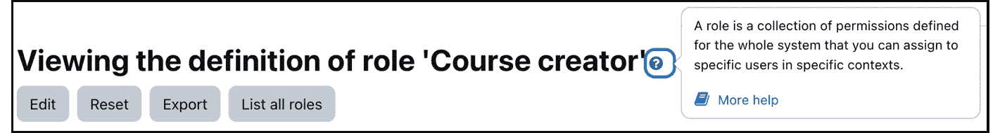

# 6

# 管理权限、角色和能力

权限复杂而强大，可以看作是 Moodle 的骨架。在本章中，我们将涵盖上下文、角色和能力，这些定义了用户在 Moodle 系统中可以和不可以看到以及执行的操作。

在本章中，我们将涵盖以下主题：

+   探索 Moodle 的预定义角色

+   理解上下文

+   将角色分配给用户

+   理解能力

+   角色和上下文管理

我们将从一个简短的定义开始，这个定义在管理权限时应该牢记在心。

重要提示

角色是一组具有相应权限和风险的能力集合。角色被分配给上下文中的用户。

在我们详细介绍所有与权限相关的主题之前，让我们先看看以下高级图表，它可视化了我们之前的定义：

图 6.1 – 高级权限概述

在您的 Moodle 系统中，每个用户都被分配了一个或多个角色，一个角色包含许多能力以及相关的权限和风险。每个角色分配都在特定的上下文中进行，代表一个层次结构组织起来的封闭区域。

我们将首先探索 Moodle 的标准角色，然后再涵盖稍微抽象的上下文概念。当我们在不同上下文中分配角色时，它将变得更加实用。接下来，我们将查看角色的结构和修改方式，然后创建我们自己的角色。我们将以角色管理和一些最佳实践建议结束本章。

到本章结束时，您将理解 Moodle 权限系统的核心概念，该系统包括角色、上下文、能力及其管理。

# 探索 Moodle 的预定义角色

Moodle 随附了几个预定义的角色。这些标准角色适用于大多数教育设置，但某些机构需要修改角色系统以定制 Moodle 以满足其特定需求。

每个角色都有执行几个操作的能力。例如，管理员和课程创建者可以创建新课程，而其他所有角色都被拒绝这项权利。同样，教师可以管理论坛，而学生只能对其做出贡献。

每个标准角色的描述以及内部和操作中使用的简称，例如用户批量上传，列在以下表格中（来自 **网站管理** | **用户** | **权限** | **定义角色**）：

图 6.2 – Moodle 的预定义角色

Moodle Workplace 为其面向商业的受众提供了各种额外角色，例如租户管理员、认证经理、动态规则经理、组织结构经理、项目经理和报告构建器经理。

在我们可以对角色进行任何操作之前，我们需要理解上下文的概念，这将在下一部分进行讨论。

# 理解上下文

一个角色（记住，一组具有相应权限的能力）可以在不同的上下文中分配。那么，什么是上下文呢？

重要提示

**上下文**是 Moodle 中可以分配给用户的区域。

用户在任何给定的上下文都有一个角色。

一个上下文可以是一个课程、一个类别、一个活动、一个用户、一个块，或者是 Moodle 本身。Moodle 自带七个上下文，每个上下文都有特定的范围：

+   **系统**：Moodle 本身 – 即整个系统，也称为核心或全局上下文

+   **课程类别**：一个类别及其子类别

+   **课程**：一个单独的课程

+   **活动模块**：一个课程活动或资源

+   **块**：一个侧边栏块

+   **用户**：一个用户账户

+   **站点（首页）**：主页和可以访问课程外的文件（通常称为首页上下文）

重要提示

每个上下文都有一个**范围**。范围是在其中可以执行特定操作的封闭区域或边界

这种布局可以比作一座多层楼和多个房间的建筑。楼层管理员对同一层的每个房间都有一定的权利和责任，但这些权利不适用于该财产其他楼层的房间。

角色分配必须在正确的上下文级别进行，以实现这样的结构。例如，教师角色应在**课程**上下文级别分配，特定论坛的调解员应在**活动**上下文级别分配，管理员应在**系统**上下文级别分配，依此类推。虽然从技术上讲可以在任何上下文中分配任何角色，但某些角色并不合理。不幸的是，Moodle 不会警告你这一点，因为它无法区分有意和无意分配。

上下文是分层的；也就是说，权限是从高上下文继承到低上下文的。高上下文中的权利更一般，而低上下文中的权利更具体。这一点也适用于我们的建筑类比 – 建筑级别的管理员在楼层或房间级别会有相同的权利，而反之则不然。

下面的图表显示了 Moodle 中存在的上下文以及它们如何按层次排列：

图 6.3 – Moodle 上下文层次结构

**系统**上下文是层次结构的根节点；在此上下文中分配的每个角色都将应用于其下任何其他上下文。下一级的**课程类别**上下文充当**课程**上下文的父节点。如果创建了**子类别**和**子子类别**等，相应的上下文将存在。您可以在最低级别看到**模块**和**块**上下文。与**课程**上下文一样，**站点**上下文有一个**模块**和**块**子上下文。**站点**指的是主页，通常被称为**首页**上下文，出于历史原因。在内部，**站点**被视为一个课程（课程 ID 为 1）。**用户**上下文是一个独立的实体，在层次结构中没有子节点。

例如，Jim 是某门课程中的教师。他在相关上下文中（他教授的班级）被分配了**教师**角色，并且在整个课程中都将保持这个角色，包括块和活动模块（活动和资源）。然而，如果 Jim 在**课程类别**上下文中被分配了**教师**角色，他将在该类别及其所有子类别中的所有课程中拥有相同的权利。Jim 将收到所有课程中所有作业的电子邮件，即使他不是这些课程的教师。不仅如此，他还将成为该类别中所有未来创建的课程中的教师！

将上下文分层组织具有几个优势，这些优势对于那些了解面向对象技术的人来说听起来很熟悉：

+   **继承**：在一级设置的权限和权限将传递到较低级别，这简化了维护工作

+   **覆盖**：可以在较低级别更改权限和权限

+   **可扩展性**：在 Moodle 的未来版本中，如果需要，可以添加新的上下文，而无需更改系统中现有的任何角色

现在我们已经了解了角色的样子以及 Moodle 附带哪些角色，是时候分配一些角色了。

# 为用户分配角色

角色分配的过程对每个上下文都是相似的。不同的是每个上下文的位置及其访问方法。在概述如何在各个上下文中分配角色之前，我们将首先描述为用户分配角色的过程：

1.  导航到任何**分配角色**屏幕以获取所需上下文 - 例如，在下拉菜单的**权限**部分中的**主页** | **参与者** | **分配的角色**。在我们的系统中，您可以看到已分配了**2**名教师和**18**名学生（只能显示最多 10 个名字）：

图 6.4 – 为用户分配角色

1.  通过单击角色名称来选择您希望分配给用户的角色。如果有超过 10 个分配者，请单击**超过 10 个**链接。您将在 Moodle 中看到*图 6.4*所示的屏幕，无论何时您想要分配用户到角色（除了在课程中，那里已经开发了一个不同的模态界面）。

1.  通过从**潜在用户**列表中选择用户名称并使用**添加**按钮将他们移动到相应的类别来分配角色给用户。

1.  按住**Shift**键以选择一系列用户，并按住**Ctrl**键（在 macOS 上为**Command**键）以选择多个用户。

1.  要撤销用户的角色分配，从**现有用户**列表中选择人员，并通过点击**移除**按钮将他们移回**潜在用户**组。

重要提示

一旦用户被分配了角色，权限将立即授予。无需保存任何更改。

如果您的潜在用户列表包含超过 100 个条目，则不会显示用户名，您将不得不使用**搜索**框来过滤账户列表（您可以通过在**网站管理 | 用户 | 权限 | 用户选项**中的**maxusersperpage**设置更改此值）。Moodle 使用实时搜索；一旦您开始输入，用户列表就会立即更新。在左边的**搜索**框下方有三个自解释的**搜索选项**。如果该区域已折叠，您可能需要将其展开：

+   **即使所选用户不再匹配** **搜索**

+   **如果只有一个用户匹配搜索，则自动选择** **他们**

+   **在用户的名称中任何位置匹配搜索文本**

您可以通过底部的下拉菜单切换到当前上下文中另一个角色的分配。

重要提示

在错误上下文中分配角色是常见的问题来源。强烈建议您定期检查当前上下文，以确保没有授予未预期的权限。换句话说，彻底测试您的角色分配。

到目前为止，我们已经处理了上下文的一般概念，并查看如何在上下文中分配用户角色。现在，我们将处理每个上下文，按照我们的 Moodle 上下文层次结构。让我们从顶部的**系统**上下文开始。

## 系统上下文

**系统**上下文涵盖了整个 Moodle 系统。分配从**网站管理** | **用户** | **权限** | **分配系统角色**进行。在我们的系统中，只有两个可以分配的角色。我们已经提到，在某些上下文中分配某些角色是没有意义的。在角色内部，可以指定在哪些上下文中可以分配角色。只有**管理员**和**课程创建者**角色被选中，这也是选择有限的原因：

图 6.5 – 系统上下文

您将看到一个熟悉的屏幕，允许您为用户分配角色。与前面概述的通用屏幕唯一的区别是警告，我只能重复一遍：**您从该页面分配的任何角色将应用于整个系统中的指定用户，包括首页和所有** **课程**。

在大多数具有预定义角色的 Moodle 系统中，如果您希望允许用户对所有课程进行只读访问，例如检查员、业务经理或学校校长，则只有分配**管理员**角色才有意义。将**课程创建者**角色分配给用户允许您在任何类别中创建新课程。例如，如果在**系统**上下文中分配了**教师**角色，则用户将被允许访问网站上每个课程以及未来创建的所有课程！

有时全球角色是合理的场景，例如在非常小的组织或 Moodle 仅托管所有用户都参加的少量课程时。此外，一些新的用户定义角色，如学校检查员，被设计为在全局级别分配。

只能在系统级别分配的一个角色是**管理员**角色。这项任务在**网站管理** | **用户** | **权限** | **网站管理员**下有一个专门的区域。在安装 Moodle 时创建了一个主要管理员，无法修改或删除。但是，您可以创建额外的管理员账户。此过程与在任何其他上下文中分配用户相同，除了您必须确认分配。此外，您可以将任何网站管理员设置为主要的网站管理员（通过**设置主要** **管理员**按钮）。

重要注意事项

确保将 Moodle 管理员数量保持在最低！这种限制提高了系统的连贯性，增加了安全性，并避免了网站潜在的管理不当。

在上下文层次结构中向下移动一级，我们到达**课程类别**上下文，这是以下子节的主题。

## 课程类别上下文

**课程类别上下文**涵盖了类别及其子类别中的所有课程。角色分配发生在**网站管理** | **课程** | **管理课程和类别**下。您必须在相应的**设置**下拉菜单中选择**权限**，并从熟悉的下拉菜单中选择**分配角色**。相同的机制适用于子类别、子子类别等等。

在**课程类别**上下文中分配的典型角色是**课程创建者**角色。它允许指定用户在指定的类别内创建新课程，通常是部门或部门。标准的**课程创建者**角色不包括教师能力；也就是说，课程创建者不能编辑任何课程内容。在较小的组织中，可能需要授予**教师**角色访问类别内所有课程的权限。

向下移动一个级别，我们到达**课程**上下文。

## 课程上下文

如其名所示，课程中的所有角色分配都是在**课程**上下文中授予的。分配发生在实际的课程中，我们在*第四章*，“管理课程和注册”中已经遇到，当时我们讨论了注册。

重要注意事项

在**课程**上下文中，课程注册被视为角色。

由于注册包含一些独特的选项（开始日期、结束日期和暂停选项），并且因为这些注册通常由（非技术性）教学人员执行，因此已经实现了不同的用户界面。然而，在课程内，当您转到**参与者**|**注册方法**，然后点击**手动注册**方法编辑列中的**注册用户**图标时，您将看到一个看起来熟悉的屏幕。我们已经在讨论注册时覆盖了屏幕中央显示的附加过期选项：

图 6.6 – 课程上下文 I

当学生通过自我注册或任何其他注册机制注册课程时，Moodle 会自动在相关的**课程**上下文中分配**学生**角色。这也适用于您批量上传用户并指定用户必须注册的课程的情况。

如果您必须为未注册但已在课程中拥有角色的用户分配角色，请从**参与者**菜单中的下拉列表中选择**其他用户**，然后点击**分配角色**按钮。这适用于**管理员**角色，例如，或一个新创建的角色，如主管教师。您将看到未注册课程但已继承或分配角色的用户列表：

图 6.7 – 课程上下文 II

在上下文级别层次结构中缺失一个级别，它处理模块和块。

## 模块上下文

一旦您进入一门课程，就可以为个人模块分配用户角色——即资源和活动。当您选择一个模块时，在**更多**菜单中有一个**权限**链接，包含三个与角色相关的选项。**本地分配的角色**将引导您进入熟悉的**分配角色**屏幕。**权限**和**检查权限**允许您更改继承的角色并验证个别用户的角色。我们将在本章后面讨论这个问题：

图 6.8 – 模块上下文

教师经常在**模块上下文**中使用角色分配来授予或撤销学生的额外权利。一个经常引用的例子是论坛管理员。如果您希望让学生负责论坛以帮助他们学习如何管理讨论，他们需要编辑和删除帖子（以及其他）的权利。这些权利是**教师**角色的一部分，并且将**教师**角色分配给单个活动中的学生是完全可行的。只需确保他们不能评分任何考试！

默认情况下，具有**教师**角色的用户有权在**模块**上下文中分配角色。然而，由于角色系统的复杂性，通常由 Moodle 管理员代表他们执行此任务。同样适用于**块**上下文，将在下一节中介绍。

## 块上下文

**块**上下文允许在块级别分配权限，它位于课程的块抽屉内。您将在下拉菜单中看到**在<blockname>块中分配角色**链接（必须开启编辑模式）：

图 6.9 – 块上下文

默认情况下，您的系统不包含一个在**块**上下文中被授予分配权限的角色；因此，链接将被隐藏。我们将在稍后处理修改角色的问题。

可以控制可以查看块的用戶。假设有一个不允许访客查看的块。要隐藏该块，访问`moodle/block:view`能力。或者，您可以从**高级角色覆盖**下拉列表中选择**访客**角色，并将提到的能力设置为**阻止**。我们将在本章稍后处理能力。

同样的机制也适用于整个系统中的块，无论是在仪表板、个人资料页面、课程中还是在活动内部。它也适用于主页上的块，这些块由**首页**上下文覆盖。

## 首页上下文

在 Moodle 中，主页由**首页**上下文覆盖。首页就像一门课程，同时又不完全像一门课程。换句话说，它是一门特殊的课程！这种独特性也是为什么**首页**上下文被称为**站点****课程**上下文的原因。

**首页**上下文以**系统**上下文为父上下文，类似于**课程**上下文，**模块**和**块**为子上下文。这个熟悉的界面可以通过**参与者**部分中的**权限**下拉菜单中的**分配的角色**链接访问。

在**首页**上下文中的典型用户是设计师，他们负责 Moodle 系统首页的布局和内容。当分配时，只有**首页**菜单及其子菜单是可访问的。大多数网站应用**教师**角色或创建一个专门的设计师角色。

## 用户上下文

**用户**上下文是一个独立的上下文，只有**系统**上下文作为其父上下文。它处理与课程外的所有用户相关的问题，包括用户的个人资料、学习计划、论坛帖子、博客条目、笔记、报告、日志和成绩。

角色是在用户的个人资料中分配的，您必须从**管理**面板中选择**偏好设置**。**相对于此用户分配角色**链接**默认情况下不会出现**！您需要拥有可以在**用户**上下文中分配的角色。没有任何预定义的角色适用于这种方式，这就是为什么这仅适用于用户定义的角色。一个常被引用的、在**用户**上下文中应用的自定义角色示例是**家长/导师**角色，我们将在本章后面的**创建自定义角色**部分处理它：

图 6.10 – 用户上下文

在**用户**上下文中分配的角色将只能访问从用户屏幕可访问的信息。他们将无法访问任何课程。

Moodle 还支持将角色分配给群体（**站点管理** | **用户** | **权限** | **将用户角色分配给群体**），这实际上在**用户**上下文中手动分配角色。这个功能在主管负责学习小组的设置中非常有用。

## 多个角色

用户被分配到多个角色是很常见的。例如，一个班级教师也被指定为负责的年级组的课程创建者（**课程类别**上下文），他们负责 Moodle 管理（**站点**），他们在不同的班级中担任支持教师（**课程**），或者他们是孩子的家长（**用户**）。每个登录用户都会自动在**系统**上下文中被分配**认证用户**角色。我们将在本章后面处理这个问题。

Moodle 的角色基础设施的一个重要部分是能够同时将多个角色分配给一个用户。在我们最初的建筑示例中，等效的是负责特定楼层水平的楼层经理，在假期期间临时负责一楼。

如前所述，必须选择实际上下文以指定一个额外的角色。然后，您将能够根据需要分配额外的角色。

问题在于潜在的冲突，Moodle 必须解决这些冲突。例如，如果一个角色可以删除论坛帖子，而另一个角色不能，但一个用户在同一个上下文中被分配了这两个角色，哪个权利适用？虽然 Moodle 内置了解决这些冲突的机制，但最好完全避免此类场景。

在同一个上下文中将两个或多个角色分配给同一个用户在技术上是有可能的。很难想象出这种设置会有意义的场景。

小贴士

内置权限解析机制的内部工作原理在[docs.moodle.org/en/Override_permissions](http://docs.moodle.org/en/Override_permissions)的*权限冲突解决*部分有很好的文档记录。

这就结束了关于角色分配的部分。角色由能力组成，我们将在下一部分处理。

# 理解能力

到目前为止，我们已经将现有角色分配给了不同 Moodle 上下文中的用户。在接下来的几页中，我们将深入了解一个角色，其中能力决定了允许和禁止的功能。记住，角色是一组具有相应权限的能力。一旦我们理解了能力，我们就可以修改现有角色并创建全新的角色。

## 角色定义

可以通过**站点管理** | **用户** | **权限** | **定义角色**访问现有角色。显示的屏幕是我们之前探索 Moodle 预定义角色时的屏幕。当你点击一个角色名称时，会显示其组成。你可能还记得*图 6**.1*中显示的角色元素。让我们放大角色，看看它的元素：

图 6.11 – 角色结构

每个角色包含一个唯一的**短名称**（用于批量操作）、一个**自定义完整名称**和一个可选的**自定义描述**。**角色原型**字段指定如果将角色重置为其默认值，将设置哪些权限。此设置进一步确定在 Moodle 未来版本中引入任何新权限时将具有哪些值。这些设置将在更新过程中应用。

**此角色可能被分配的上下文类型**字段设置为允许将角色作为选项的上下文。这种限制减少了在不应分配角色的上下文中分配角色的风险。当我们尝试在**块**或**用户**上下文中分配角色时，Moodle 阻止了我们这样做。

接下来的四个字段（**允许角色分配**、**允许角色覆盖**、**允许角色切换**和**允许角色查看**）显示当前角色被分配的用户可以分别分配、覆盖、切换和查看哪些角色。**角色风险**字段指示当前角色具有六个可用风险中的哪一个。一旦我们更详细地处理了角色，所有这些信息都将更有意义。

除了这些参数之外，每个角色还包含大量能力。Moodle 的角色系统目前大约有 450 个（！）个，Moodle Workplace 增加了 50 多个。如果你安装了插件，这个数字可能更高。

重要提示

能力是特定 Moodle 功能的允许动作。

每个能力代表一个合法的 Moodle 操作，并在所有能力的列表中以单行显示。为了简化对能力的搜索，请使用**筛选**选项，以便只显示与筛选标准匹配的能力（包括名称和描述）：

图 6.12 – 能力

每个能力都有以下组件：

+   **描述**：例如，**从文件上传新用户**的描述提供了对能力的简短解释。点击能力将在单独的浏览器窗口中打开该能力的在线 Moodle 文档。

+   `moodle/site:upload users`遵循严格的命名约定，`level/type:function`，这标识了能力在整个角色系统中的位置。级别表示能力属于 Moodle 的哪个部分（例如`moodle`、`mod`、`block`、`tool`、`enrol`或`wp`）。类型是能力类，而功能标识了实际的操作。

+   **权限**：每个能力的权限必须具有以下表中解释的四个值之一：

图 6.13 – 权限

重要提示

主要来说，低层级的权限会覆盖高层级的权限。例外的是**禁止**，根据定义，在低级别无法覆盖。

+   **风险**：Moodle 显示与每个能力相关的风险 – 即每个能力可能引发的风险。它们可以是以下六种风险类型的任何组合：

图 6.14 – 风险

重要提示

风险仅显示；由于它们仅作为警告，因此无法更改这些设置。当点击**风险**图标时，**风险**文档页面将在单独的浏览器窗口中打开。

Moodle 的默认角色已考虑到以下能力风险而设计：

+   **管理员**：所有能力，除少数例外

+   **教师**：某些具有 XSS 和隐私风险的能力，主要是添加和更新内容

+   **学生**：某些具有垃圾邮件风险的能力

+   **访客**：只有无风险的能力

现在我们已经涵盖了角色的成分，让我们开始修改它们。

## 修改角色

要编辑角色，请点击查看角色详情屏幕顶部的**编辑**按钮或在主角色屏幕的**编辑**列中选择适当的图标：

图 6.15 – 角色操作

在编辑角色时，您可以更改标准字段及其权限。例如，一些学校将**学生**角色名称更改为**小学生**，而一些培训机构将**教师**更改为**讲师**。在 Moodle Workplace 中，这两个角色分别被重新标记为**学习者**和**培训师**。请注意，这仅更改了角色的名称，并没有更改 Moodle 中使用的相应标签。您将在第十章的*管理本地化*部分中学习如何做到这一点，*配置* *技术功能*。

当您更改从`moodle/user:viewdetails`能力派生的角色的功能，并将其从**允许**更改为**未设置**。现在，**未设置**被选中，但**允许**值仍然突出显示；一旦应用，不要忘记保存您的角色更改：

图 6.16 – 角色操作

如果您不熟悉角色修改，建议首先复制一个角色（通过*图 6.16*顶部屏幕的**导出**功能以及创建以下部分中描述的新角色）然后进行编辑。保持默认角色不变，如果多个管理员在同一系统上工作或第三方提供支持，则维护会更加容易。

重要提示

无法通过 Moodle 界面修改**管理员**角色。

通过角色的覆盖机制，通常可以避免修改角色，我们将在下一节中介绍这一机制。

## 覆盖角色

在给定上下文中，可以覆盖角色的权限。想象一下上下文层次结构，其中角色定义发生在顶级。在较低级别，例如类别或课程，您现在希望修改该角色的权限。角色覆盖正是为此而设计的。

重要提示

覆盖是设计来更改特定上下文中的角色的权限，允许您根据需要调整权限。调整涉及授予额外权限或撤销现有权限。

使用与名称相同的熟悉下拉菜单中的**权限**链接，您可以查看当前上下文（在此处，模块上下文中的作业）的任何功能已被授予或继承了哪些角色权限：

图 6.17 – 覆盖角色 I

括号中显示的数字表示每个角色的覆盖次数。在**具有权限的角色**列中，您可以为每个功能（使用标准的**删除**图标）删除一个角色，或选择要添加到允许的角色列表中的角色（通过**+**符号）。同样适用于**禁止**列。

一旦您从`mod:assign/grade`)将其继承的**未设置**值更改为**允许**：

图 6.18 – 覆盖角色 II

任何对角色系统的更改都会在屏幕顶部突出显示，并显示时间戳。

覆盖也可以用于在该上下文中拒绝功能并从用户中移除权限。例如，在课程中具有学生角色的学习者通常允许在论坛中开始新的讨论，但有一个特定的论坛你想限制这种能力：你可以设置一个覆盖，防止学生在这个论坛中开始新的帖子（`mod/forum:startdiscussion`）。

到目前为止，我们已经了解了角色的组成，并学习了如何在上下文层次结构的不同级别中修改和覆盖功能。现在，是时候创建我们的第一个自定义角色了。

## 创建自定义角色

Moodle 允许你创建新的角色。在教育环境中，这些自定义角色的例子包括家长、教学助理、秘书、检查员和图书管理员；在商业环境中，则包括培训协调员、评估员、导师或员工经理。你可以通过访问**网站管理** | **用户** | **权限** | **定义角色**并使用**添加新角色**按钮来定义新角色。

在你到达熟悉的角色编辑屏幕之前，你有三个选项可以选择：

+   **使用角色或原型**：使用现有的角色或角色原型作为基础是创建新角色时常用的方法。这可以最大限度地减少所需的工作量并减少创建新角色时的错误。

+   **使用角色预设**：导入一个（以 XML 格式）已导出在你的 Moodle 实例或另一个系统中的角色（使用查看角色详细信息时的**导出**按钮）。

+   **无选择**：从头开始创建一个没有任何预设或继承原型的角色：

图 6.19 – 添加新角色

确保你指定**此角色可能分配的上下文类型**。如果你遗漏了某个上下文，将无法分配该角色。如果你允许不适合该角色的上下文，你可能会面临潜在问题的风险。

让我们看看一些你可能想要添加到你的 Moodle 系统中的示例角色。

### 示例角色

Moodle Docs 提供了几个可能与你的组织相关的示例角色（[docs.moodle.org/en/Creating_custom_roles](http://docs.moodle.org/en/Creating_custom_roles)）。如果没有，它们为你创建其他角色提供了一个良好的起点。以下是一些有价值的示例：

+   **日历编辑器**：此角色允许用户将网站事件添加到日历中（更多详情，请参阅 [docs.moodle.org/en/Calendar_editor_role](http://docs.moodle.org/en/Calendar_editor_role)）

+   **演示教师**：此角色用于为演示教师提供一个账户，该账户具有无法更改的密码和资料（[docs.moodle.org/en/Demo_teacher_role](http://docs.moodle.org/en/Demo_teacher_role)）

+   **论坛管理员**：此角色用于特定论坛，允许用户编辑或删除论坛帖子、分割讨论并将讨论移动到其他论坛([docs.moodle.org/en/Forum_moderator_role](http://docs.moodle.org/en/Forum_moderator_role))

+   **学习计划查看器**：此角色允许教师查看学生的学习计划([docs.moodle.org/en/Learning_plan_viewer](http://docs.moodle.org/en/Learning_plan_viewer))

+   **问题创建者**：此角色使学生能够创建用于测验的问题([docs.moodle.org/en/Question_creator_role](http://docs.moodle.org/en/Question_creator_role))

+   **问题分享者**：此角色允许教师访问和分享在类别或网站级别的问题([docs.moodle.org/en/Question_creator_role](http://docs.moodle.org/en/Question_creator_role))

列表中缺少的一个突出条目是臭名昭著的家长或导师角色，我们将在以下小节中逐步创建。

### 家长/导师角色

Moodle 中最受欢迎和最受欢迎的自定义角色之一是家长、监护人或导师的角色。其想法是授予用户查看某些个人资料信息的权限，例如活动报告、成绩、学习计划、博客条目和关于他们的孩子、受抚养人或指导者的论坛帖子。它还允许受托人代表某人同意政策（见*第十四章*，*遵守数据保护法规*）。此外，特别引入的**受指导者**块必须放置在首页上，以便分配了该角色的用户能够访问**用户**上下文。

要创建新角色，请按照以下步骤操作：

1.  前往**网站管理** | **用户** | **权限** | **定义角色**。

1.  点击**添加新角色**，继续到下一屏幕，并将其命名为**家长**或**导师**。提供适当的**简称**和**自定义描述**。

1.  将**角色原型**类型设置为**无**，并选择**上下文类型**字段中的**用户**复选框，其中此角色可以**分配**。

1.  将以下截图中的功能设置为**允许**：

图 6.20 – 修改后的家长角色功能

1.  使用**创建此角色**按钮保存角色。

1.  每个家长都需要一个单独的用户账户，该账户必须手动创建或批量创建。在我们的例子中，关爱和慈爱的父亲是**Ozzy Harris**，他的孩子是**Kelly Harris**和**Jack Harris**：

图 6.21 – 家长和子账户

1.  每个家长都必须与每个孩子（再次，手动或批量）关联。要这样做，请按照以下步骤操作：

    1.  访问第一个孩子的个人资料页面，在**管理**面板中选择**偏好设置**链接，然后点击**相对于此用户**分配角色。

    1.  选择**家长**作为要分配的角色。

    1.  从**潜在用户**列表中选择父亲（**Ozzy Harris**），并将其添加到**现有用户**列表中。为所有孩子重复这些步骤。

如果一个导师有多个指导学员，你可以将他们添加到一个群体中，并自动分配角色（**站点管理** | **用户** | **权限** | **将用户角色分配给群体**）。虽然这种情况在家庭环境中不太可能发生，但在其他设置中，如监督中，可能会有所帮助。我们在之前处理用户环境时已经覆盖了此选项。

1.  为了方便访问用户信息，引入了一个特殊的**指导学员**块：

    1.  前往您的首页并切换到**编辑模式**。

    1.  将**指导学员**块添加到块抽屉（它也可以添加到默认仪表板）中，并通过**配置**图标将其标题更改为**家长访问**。

    1.  以**Ozzy Harris**的身份登录；你应该会看到以下块：

图 6.22 – 指导学员块

当点击一个名字时，将显示相应的用户资料，包括发送到论坛的帖子、学习计划、博客条目和活动报告，包括日志和成绩。

父亲角色的创建不仅展示了其潜力，还展示了自定义角色的多功能性和复杂性。因此，你必须勤奋地测试新角色。

### 测试新角色

在创建新角色后，建议您创建一个测试账户，并在所有支持的环境中将其新角色分配给它。以管理员身份注销并作为新创建的用户登录以测试新角色，或使用**登录为**功能来伪装成测试用户。或者，使用不同的浏览器测试角色，而无需以管理员身份注销。

重要提示

在将新角色分配给任何用户之前，强烈建议彻底测试新角色。

如果你修改了一个预定义的角色，并希望将其回滚到出厂设置，请转到**站点管理** | **用户** | **权限** | **定义角色**，选择（不要编辑）一个角色，然后点击**重置**按钮。这将用内置功能中的值替换其现有值。

角色系统的复杂性和在多个环境中将多个角色分配给多个用户的能力，需要一种机制来验证权限设置的准确性。由于权限可以继承并在较低级别再次覆盖，这个问题变得更加严重。

Moodle 有一个内置的**权限检查器**，它显示检查器启动上下文中任何能力的值。您可以通过特定上下文中的**检查权限**链接访问此功能。例如，在以下截图中，我们在**凯莉·哈里斯**的**用户**上下文中调用了权限检查器，并显示了用户**奥斯齐·哈里斯**的权限（转到凯莉的个人资料，在**管理**块中跟随**偏好设置**链接，然后在**角色**块中选择**检查权限**链接。然后，选择奥斯齐并**显示此用户的权限**）。它确认了之前创建的**家长**角色的设置：

图 6.23 – 权限检查器

在站点级别，两种额外的机制有助于识别角色中可能出现的任何潜在问题。能力报告（**站点管理** | **用户** | **权限** | **能力概述**）显示，对于所选能力，它在一个或多个选定角色的定义中有什么权限。它还显示能力是否在任何地方被覆盖，这在您试图定位本地修改时非常有帮助。

在示例截图中，我选择了`mod/assign:grade`能力，选择了**所有**角色，并筛选结果以**仅显示差异**。以下报告显示了所有角色中的能力值。特别值得注意的是在分配上下文中的**学生**角色，其中它已被覆盖：

图 6.24 – 能力概述

第二个工具可以在**站点管理** | **用户** | **权限** | **不支持的角色分配**中找到。正如其名所示，它列出了在从先前版本的 Moodle 升级时可能出现的任何无效角色分配。如果列出了任何分配，您将必须手动修改或删除它们。

这结束了创建和测试新角色的本节。我们将以一些与角色相关的杂项功能结束本章，这些功能不适合之前的任何部分。

# 角色和上下文管理

我们现在已经处理了基本工具，这样我们就可以使用、修改和创建角色。Moodle 在广泛使用角色时提供了一些关键功能，我们将在本节中介绍。在分配默认角色之前，我们将处理角色分配和覆盖允许，然后我们将了解上下文冻结，并以最佳实践建议结束。

## 允许角色分配和覆盖

默认情况下，某些角色有权允许其他角色分配角色。例如，教师可以分配**非编辑教师**和**学生**角色，而管理员可以分配除了**访客**、**认证用户**和**站点首页认证用户**之外的所有角色（这些角色在用户首次登录时自动分配）。在某些情况下，您可能希望更改默认设置；例如，应该允许教师将角色分配给其他教师，或者当新创建的角色需要管理时。为了实现这一点，请通过导航到**站点管理** | **用户** | **权限** | **定义角色**选择**允许角色分配**选项卡：

图 6.25 – 允许角色分配

在前面的屏幕截图中，修改后的权限已被突出显示。教师可以分配**教师**角色，课程创建者和教师都可以分配新的**家长**角色。

对于角色覆盖、角色切换和角色查看也存在相同的机制。它们可以通过同一屏幕上的**允许角色覆盖**、**允许角色切换**和**允许角色查看**选项卡分别访问。

## 分配默认角色

在某些情况下，标准角色会自动分配。这些可以在**站点管理** | **用户** | **权限**下的**用户策略**部分进行指定：

图 6.26 – 默认角色分配

前面的屏幕截图显示了默认**访客角色**（未登录的用户）和**访客角色**的分配。

Moodle 自带一个预定义的角色，称为**认证用户**——即**所有用户的默认角色**。它分配给**每个**已登录的用户，除了其他任何角色。这个角色是为了授予用户访问某些功能而创建的，例如发布博客条目、管理个人日历条目、更改个人资料字段等，即使他们没有注册任何课程。

您可以进一步指定自动分配的角色（通过**新课程创建者角色**下拉列表）给那些创建了课程但尚未获得课程权限的用户。对于从备份中恢复课程的用户，也存在一个类似的设置，称为**课程恢复者角色**（见*第十六章*，*避免失眠之夜 – Moodle 备份* *和恢复*）。

重要提示

更改**用户策略**设置可能会显著影响新用户在您的 Moodle 系统上可以执行的操作，因此在应用之前请务必检查默认角色！

除了 **用户策略** 部分的默认角色外，还可以指定默认主页角色，这可以通过前往 **网站管理** | **常规** | **网站主页** | **网站主页设置** 来设置。**默认网站主页角色** 字段可以设置为允许登录用户参与首页活动，通常是 **学生** 或 **教师**。也可以通过设置认证用户角色覆盖来允许登录用户参与这些活动。

接下来是环境冻结，它有效地将内容置于只读模式中。

## 环境冻结

**环境冻结** 允许管理员或具有相关能力的人将课程类别、块、课程或模块设置为 **只读**；也就是说，用户不能再修改或添加内容。

前往 **网站管理** | **开发** | **实验** | **实验设置** 并启用此功能以启用环境冻结。除非启用了 **环境冻结适用于管理员** 设置，否则管理员可以始终修改冻结内容：

图 6.27 – 环境冻结和解冻

一旦用户被授予 `moodle/site:managecontextlocks` 能力，他们就可以在课程、首页和分类上下文中使用环境冻结功能。例如，教师可以在课程结束后锁定课程，或者当讨论结束时关闭论坛。这种锁定也可以通过解冻选项来解除。

在撰写本文时，环境冻结是一个实验性功能，但预计很快将结束其试验阶段。

## Moodle 角色分配 – 最佳实践

角色有时会在 Moodle 网站中引起问题，因此建议遵循有关角色的以下建议：

+   只有在你彻底理解了它们之后，才去触碰角色

+   永远不要授予用户超出其能力的角色

+   在可能的情况下，避免将多个预定义角色分配给用户

+   尽可能避免使用系统角色

+   避免创建过多的新角色

+   避免不合理的角色分配

+   跟踪角色分配，以确保未来的可维护性

+   不要更改预定义角色的权限

+   严格测试角色修改和新角色的应用

此列表也是本章的良好总结，因为它涉及了最常讨论的主题。

# 摘要

在本章中，你学习了角色是什么以及它们在不同上下文中的应用。我们介绍了在创建自定义角色（如家长、检查员和图书管理员）之前修改现有角色的方法。最后，我们探讨了管理与角色相关的行政设置，包括环境冻结。

理解角色的概念对于你想要为特定用户组添加、修改或删除功能至关重要。这样一个系统的复杂性和灵活性之间总是存在权衡。虽然你可以争论角色系统的用户友好性，但它无疑已被证明是 Moodle 中最强大的概念之一。

课程、用户和角色之间的相互关联至关重要。一旦这一设置和配置正确完成，您的 Moodle 在技术上就准备好起飞了。然而，在那之前，你可能首先想要改变它的外观和感觉。这正是下一章要讲述的内容。
