# 7

# 提升 Moodle 的外观和感觉

您的系统现在已完全运行，用户、课程和角色已就位。现在是时候改变其外观和感觉，以创建更具吸引力的用户体验并确保符合您的企业品牌。

如以下图表所示，有许多构建块会影响您的 Moodle 系统的外观和感觉：

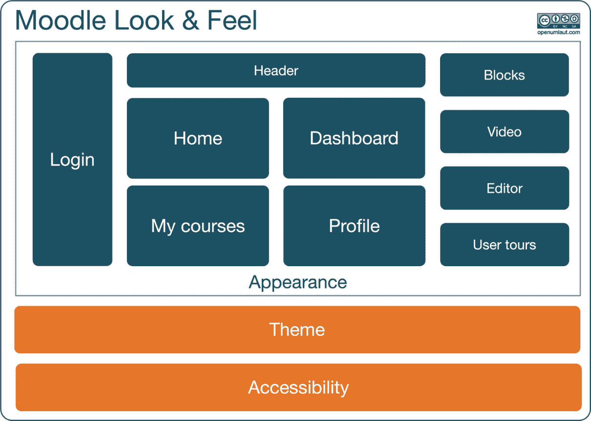

图 7.1 – Moodle 的外观和感觉组件

我们将 Moodle 的外观和感觉组件分为三个部分，这些部分也构成了本章的结构：

+   **外观**：这些是在管理设置中可以配置的修改。在我们处理不同的登录流程和如何调整页眉之前，您将学习如何更改关键页面的布局（主页、仪表板、我的课程和用户资料）。然后，我们将介绍一些影响整个网站外观和感觉的外观工具：块抽屉、Atto HTML 编辑器、视频和音频，最后是用户之旅。

+   **主题**：这些是需要 CSS 样式修改的修改。主要内容包括主题选择、主题类型和主题自定义。

+   **可访问性**：这些是需要符合与您相关的可访问性法规的修改。为了支持不同类型的可访问性问题用户，我们将为您提供工具以确保系统、主题和内容可访问性。

小贴士

主题创建在本书中没有涉及，因为这不仅是管理员的任务，还需要具备良好的 CSS 技能的设计师。由 *Silvina Paola Hillar* 编著的 *Moodle 主题开发* 是一本了解 Moodle 主题和设计基础的好书。

在本章中，我们将涵盖以下主要主题：

+   探索 Moodle 的外观和感觉元素

+   自定义 Moodle 的外观

+   Moodle 视频和音频

+   使用用户之旅创建教程

+   Moodle 主题

+   可访问性

到本章结束时，您将熟悉可以通过管理员界面自定义的 Moodle 视觉元素。在我们开始自定义网站的外观之前，让我们首先探索 Moodle 的外观和感觉元素。

# 探索 Moodle 的外观和感觉元素

Moodle 在布局、品牌和设备支持方面可以完全自定义。必须强调，改变外观和感觉的某些方面需要高级设计技能。虽然作为管理员，您可以进行一些调整，但在涉及到样式时，需要聘请专业的前端设计师，尤其是当涉及到样式时。

在介绍 Moodle 的外观和感觉的三个支柱之前，让我们探索一些关键视觉元素。并非总是明显哪些页面元素可以通过设置（外观）进行调整，哪些则需要样式（主题）。请看以下主页的截图：

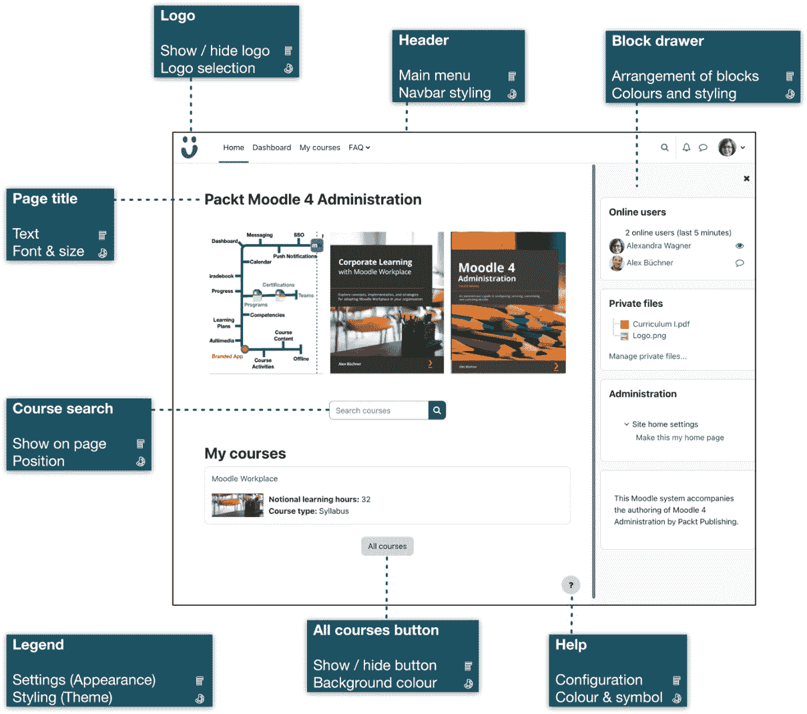

图 7.2 – 示例主页（Boost 主题）

我们突出了一些选定的视觉元素，并用可以通过外观设置定制的功能进行了注释，以及可以通过主题调整的元素（用颜色调色板符号表示）。虽然这个列表远非完整，但它希望能给你一个各种元素驱动网站外观和感觉的想法。它也应该给你一个关于可以通过外观设置修改的元素以及需要主题更改的元素的想法。

简而言之，外观（例如主页设置和菜单配置）决定了用户将看到哪些内容。相比之下，主题负责设计方案或品牌，即页眉和页脚、颜色、字体、图标等。

既然你已经熟悉了 Moodle 的外观和感觉的一些关键元素，让我们开始通过自定义我们网站的外观来开始吧。

# 自定义 Moodle 的外观

我们将通过介绍 Moodle 系统的外观元素来开始对其自定义的定制。如章节引言概述所示，我们将这部分分为六个我们将定制的元素：登录、主页、我的课程、仪表板、用户资料和页眉。

## 自定义登录

有三条（半条）路径可以登录到 Moodle。这与 LMS 的外观和感觉有什么关系？选择的流程可能会影响主页的布局和设计，因为它可以在登录前后显示。

看看以下图表中显示的路径：

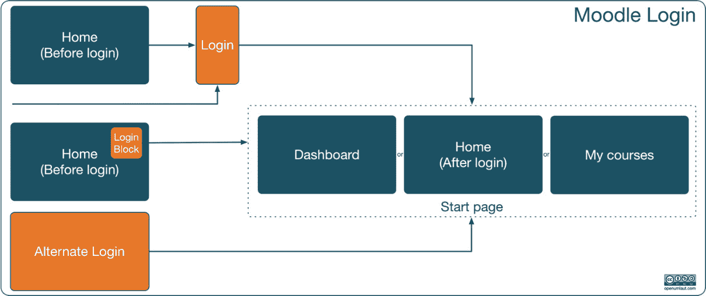

图 7.3 – Moodle 登录路径

在 `<yoursite>/login/index.php`。我们在 *第五章* 中讨论了各种登录机制，*管理用户、小组和认证*，当处理认证时，包括绕过 **登录前** 页面并强制显示 **登录** 页面的选项。

第二种登录选项是将 **登录块** 放入块抽屉中，有效地将专门的登录页面移动到主页内部。一旦认证成功，用户将被引导到起始页面。

**备用登录** 选项是从不同的网站登录到 Moodle，可能是你组织的首页，有效地避免了 Moodle 的内置登录屏幕。为了实现这一点，你必须在用户想要登录的远程页面上添加一些 HTML 代码：

```php
<form class="loginform" name="login" method="post"
```

```php
  action="https://[yourmoodlesite]/login/index.php">
```

```php
  <p>Username <input size="10" name="username" /> </p>
```

```php
  <p>Password <input size="10" name="password"
```

```php
     type="password" /> </p>
```

```php
  <p><input name="Submit" value="Login"
```

```php
     type="submit" /></p>
```

```php
</form>
```

表单将把凭证传递到你的 Moodle 系统中。你必须将 `[yourmoodlesite]` 的 URL 替换为你的 Moodle 实例的 URL；这个地址必须通过导航到 **网站管理 | 插件 | 认证 |** **管理认证** 来输入到 **备用登录 URL** 字段中。

默认情况下，经过身份验证的用户登录后将看到**仪表板**屏幕。您可以在**网站管理 | 外观 | 导航**中更改**起始页面**，在那里您可以选择**用户起始页面**。选项有**网站**、**仪表板**（默认）、**我的课程**和**用户偏好**。如果选择后者，用户可以在用户个人资料的**偏好设置**中的**起始页面**设置中进行选择。

最好的登录路径取决于您现有的基础设施和个人偏好。无论您选择哪种选项，用户始终可以访问主页，我们将在下一步对其进行定制。

## 自定义主页

主页对所有用户都是相同的。嗯，它的结构是静态的，而内容则根据登录的用户而变化。例如，每个主页可能都包含一个显示用户所注册课程的区块，这不太可能对每个用户都相同。这个页面也被称为**网站主页**或，出于历史原因，称为首页。

正如我们刚才提到的，Moodle 的主页在用户登录之前显示，在认证发生后发生变化。登录前后页面的内容和布局可以自定义。看下面的截图。这是与前面截图相同的网站，但用户尚未登录：

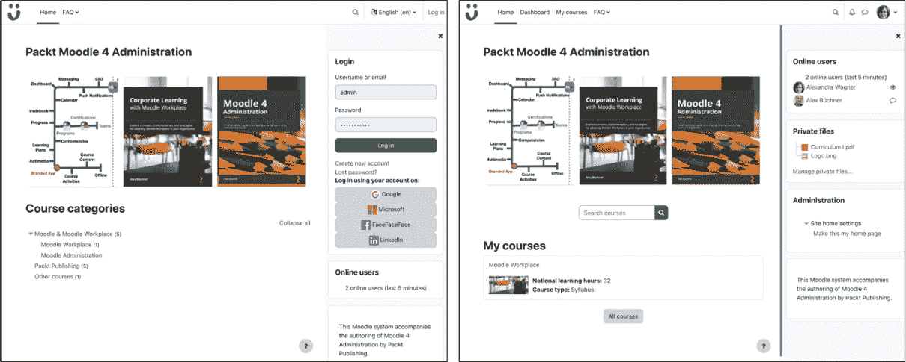

图 7.4 – 登录前后示例主页

在这个特定的例子中，**登录**区块显示在区块抽屉中，**课程类别**显示在中央。一旦登录，**登录**区块将被隐藏，**私有文件**区块将被显示，语言选择器被用户个人资料菜单所取代，主菜单中还会出现两个更多项目。我相信您能发现更多差异！

要更改登录前后主页的外观，我们需要更改网站主页设置。

### 修改网站主页设置

要自定义主页，请在家页上选择**设置**或转到**网站管理 | 通用 | 网站主页 | 网站主页设置**：

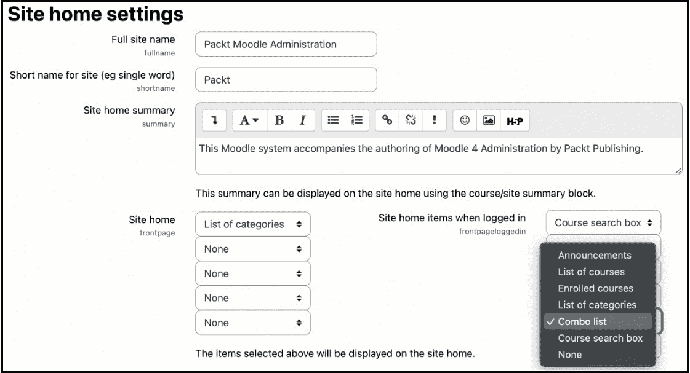

图 7.5 – 主页设置

在**网站主页设置**页面上可用的以下参数：

+   **完整网站名称**：这是在主页和浏览器标题栏中显示的名称。通常是您组织的名称或您的 Moodle 系统名称。

+   **网站的简称**：这是您网站在各个地方使用的内部名称，例如，作为备份名称的一部分或当网站联网时。

+   **网站主页摘要**：此网站描述可以通过**课程/网站摘要**区块显示。如果允许，描述文本也会被谷歌搜索引擎爬虫抓取。

+   **站点主页**：当未登录时，Moodle 可以在主页的中心列显示最多五个元素：**公告**、**课程列表**、**分类列表**、**组合列表**（分类和课程）以及**课程搜索框**。元素的顺序与下拉菜单中选择的顺序相同。

+   **登录时站点主页项**：这与**站点主页**相同，但它在用户登录后使用。提供了一个第六项用于显示，即**已选课程**，在用户认证之前这没有任何意义。

+   **最大分类深度**：此设置指定在显示课程分类时显示的层次级别数量。如果你的分类层次深度超过三或四个，建议限制此设置。

+   **最大课程数**：此设置确定在主页上显示的课程数量。如果还有更多课程可用，将显示**更多课程**链接。

+   **包含主题部分**：如果选中，将在主页的中心列中显示一个额外的主题部分（就像课程中的主题块一样）。它可以包含 Moodle 中可用的任何资源或活动的混合。它通常用于提供有关站点的信息或显示图片或预告片视频。

+   **公告数量**：这包括显示的新闻条目数量。

+   **每页显示的评论数**：此设置决定了如果在前页使用时，**评论块**中显示的条目数量。

+   **默认站点主页角色**：如果登录用户需要被允许参与主页活动，应设置一个默认的前页角色。

Moodle 的主页被当作一个课程处理（内部上，它有课程`ID=1`）。因此，大多数可用的设置都与它们的课程对应设置相同：报告、题库、内容库、过滤器以及课程复用。对于**参与者**菜单项也是如此：主页有其自己的上下文，可以在其中创建组，并将角色分配给用户。这允许一个专门的用户设计和维护主页，而无需访问 Moodle 中的任何其他元素。由于主页被当作课程处理，通常一个**教师**角色就足够了。

Moodle 提供了一套很好的工具来自定义主页。有时，你可能想用自定义的前页来替换它，我们将在下一个小节中处理这个问题。

### 替换主页

要替换主页，Moodle 允许你添加一个自定义脚本。要实现这个功能，你需要在你的`config.php`文件中添加以下行：

```php
$CFG->customfrontpageinclude="<dirroot>/local/<yourfrontpage>";
```

请记住，这将显示内容区域顶部`<yourfrontpage>` PHP 文件的输出，以及主页的任何元素。这样，你就可以兼得两者之优：Moodle 元素（禁用你不需要的）和你的自定义元素。

虽然用户无法修改主页本身，但其内容为每个用户进行了个性化设置，例如日历条目或私人文件。同样，**我的课程**页面也是如此，我们将在下一个小节中进行自定义。

## 自定义我的课程

如其名所示，**我的课程**标签通过在内容区域（页面中心）显示**课程概览**块来显示用户已注册的课程。在**我的课程**视图中，用户可以对课程进行星标和存档；他们还可以通过应用以下任何组合的过滤器来减少显示的已注册课程数量：

+   **状态**：**全部**、**进行中**、**未来**、**过去**、**星标**和**存档**

+   **文本**

+   **排序**：**按课程名称排序**和**按** **最后访问**排序

+   **详情**：**卡片**、**列表**和**摘要**

以下截图显示了我在 Packt 演示系统上看到的**我的课程**页面：

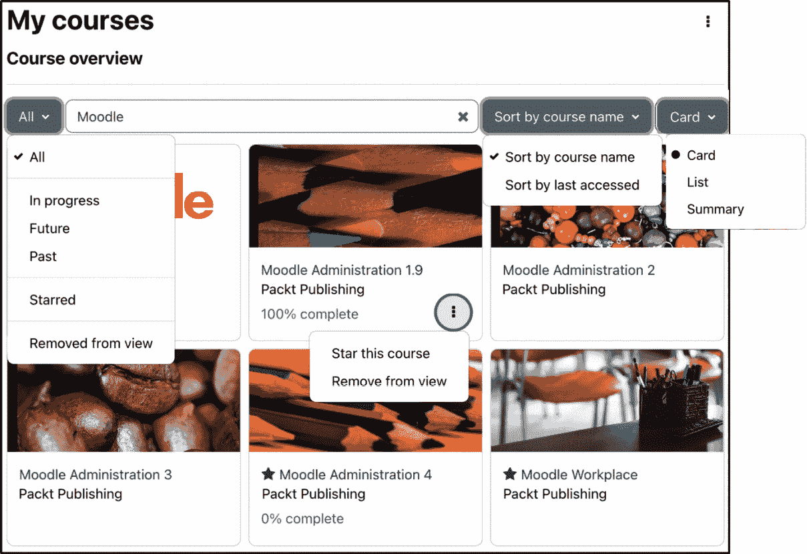

图 7.6 – 我的课程视图

您可以通过导航到**网站管理 | 插件 | 块 | 课程概览**来指定外观设置和可用过滤器。**显示类别**设置会在课程名称下方显示课程类别名称。您可以进一步自定义**可用布局**和**可用过滤器**。指定**自定义字段**选项可以让您将您自己的项目添加到**状态**过滤器中，这是一种将用户体验与您组织教授的主题对齐的绝佳方式。

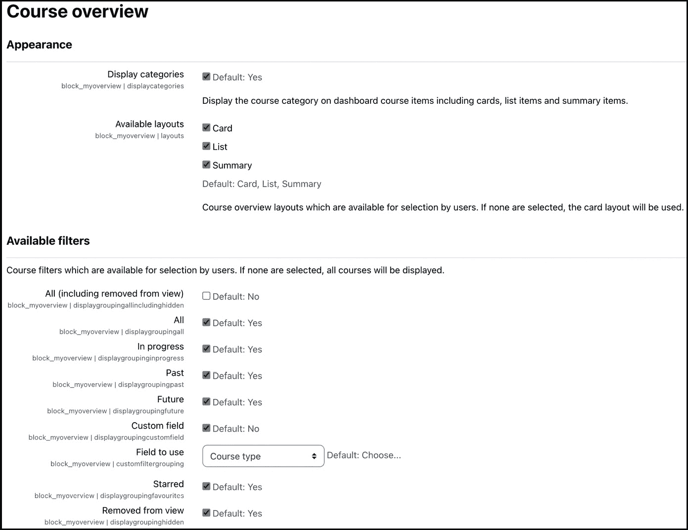

图 7.7 – 课程概览块设置

**未来**和**过去**状态可以通过**网站管理 | 外观 | 导航**中的两个宽限期设置进行调整：**未来课程的宽限期**和**过去课程的宽限期**。

课程可以（理想情况下应该）有一个课程图片。如果缺少可选图片，它将被图案化的课程卡片所替代。这些卡片中使用的颜色可以在**网站管理 | 外观 | 课程** **卡片颜色**中指定：

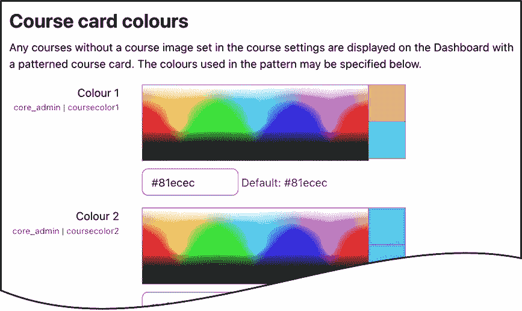

图 7.8 – 课程卡片颜色

您可以使用标准颜色选择器选择十种颜色，这些颜色将以随机顺序应用于课程图片。

在**网站管理 | 外观 | 课程**中，一些设置允许您指定课程如何呈现给用户以及显示的课程详细程度：

+   **课程联系人**：显示在课程描述旁边的用户。**教师**是最常用的选择。

+   **显示扩展课程名称**：如果启用，将显示短名称和长名称；否则，只显示长名称。

+   **每页课程数**：这是一个阈值设置，用于在分类内显示课程时使用。如果一个分类中的课程数量超过指定数量，则将在页面顶部显示页面导航。此外，当使用组合列表时，只有当数量小于指定阈值时，才会显示课程名称。

+   **课程图片文件限制**：默认情况下，只能将一个文件附加到课程上；您可能需要增加此限制，尤其是如果您想将 PDF 添加到有效的**课程图片文件扩展名**列表中，例如，以附加课程大纲。

**我的课程**页面涉及用户已注册的课程。那么如何导航到用户未注册的课程和分类呢？我们将在下一个小节中探讨这个问题。

### 课程导航

在 Moodle 中看到的课程列表可能会让人感到不知所措，用户可能难以导航整个分类层次结构。用户可以看到课程和分类的例子包括**课程**块中的**所有课程**链接、在网站页面设置中选择**分类列表**或**组合列表**，或者在**导航**块中的**课程**列表。

在**网站管理 | 外观 | 导航**中的一些设置涉及课程和分类中显示的详细程度。请注意，这些主要适用于**导航块**和基于**经典**主题的一些导航功能：

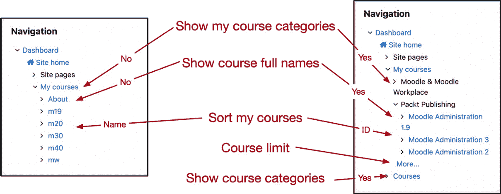

图 7.9 – 课程导航设置

一旦完成课程选择——无论是通过**我的课程**还是通过**导航**——用户将进入一个课程，在那里可以配置两个外观和感觉元素。

### 在课程内部

课程是学习发生的地方，课程创建者负责其内容、结构和布局。您应该设置两个工具以确保内容创建者的愉快体验：

+   **课程格式**：课程格式决定了课程内容将以何种方式呈现给学习者；我们已经在*第四章*，*管理和注册课程*中讨论过它们。您可以在**网站管理 | 插件 | 课程格式 | 管理课程格式**中配置或禁用课程格式。还可以安装额外的课程格式，我们将在*第八章*，*理解 Moodle 插件*中介绍。流行的课程格式有**瓷砖**、**折叠主题**和**设计师**。

+   **活动选择器**：当在课程内编辑模式下，内容创建者希望添加活动或资源时，活动选择器会出现。您可以在**站点管理 | 课程 | 活动选择器 | 活动选择器设置**中确定应显示哪些选项卡。在这里，您还可以在**活动选择器页脚**中显示或隐藏 MoodleNet 的链接。可以通过**站点管理 | 课程 | 活动选择器 | 推荐活动**将流行的活动和资源添加到**推荐**选项卡。请注意，这些设置适用于系统中的所有（编辑）用户。

为了确保课程之间的一致性并简化课程创建，建议实施课程模板机制。提供此类课程骨架有两种方式：

+   **通过板载工具创建课程模板**：Moodle 没有提供专门的设施，但您可以使用几个不同的工具来模拟课程模板工作流程，即课程备份、课程恢复和课程上传。这三个操作已在**第四章**的*批量管理课程*部分中介绍，*管理和注册课程*。

+   **通过第三方插件创建课程模板**：有各种选项可用，Kickstart ([moodle.org/plugins/format_kickstart](http://moodle.org/plugins/format_kickstart))是我的首选。

管理员（或具有适当权限的用户）预定义了主页和**我的课程**。目的是这两个页面对所有用户都是静态且相同的。另一方面，仪表板和资料页已被设计为用户可以根据个人偏好进行调整。接下来，让我们看看仪表板。

## 定制仪表板

仪表板就像每个用户都可以定制的个人主页。出于历史原因，这个顶级页面有时被称为`<YOURSITE>/my`）。

重要提示

**仪表板**是每个用户都可以定制的个人页面。

那么，当用户有权限创建自己的仪表板时，管理员的作用是什么？你有两个主要的职责：

+   创建默认仪表板

+   设置和配置用户无法更改或删除的仪表板元素

用户登录后，可以通过向相应区域添加块和更改已默认添加的任何块来编辑仪表板。他们还可以重新定位某些元素。作为管理员，您可以指定这些默认块是什么以及它们的位置，并控制可以执行多少定制。当用户定制仪表板时，他们可以将相应的页面重置到这些默认设置。

默认情况下，仪表板显示三个区块：**时间线**、**日历**和**最近访问的项目**。默认的**仪表板**页面可以通过导航到**网站管理 | 外观 | 默认仪表板页面**找到，在那里您必须切换到**编辑模式**。您放置在默认页面上的任何区块都将出现在用户的页面上。使用标准的**移动**处理程序，您可以在页面上自由放置区块；允许的位置（左、中、右）取决于活动主题——关于区块处理的更多内容将在稍后介绍。

可能存在您希望在每一页上显示的区块，这实际上使它们成为强制性的区块，不能修改或删除。为了方便这些**粘性区块**，请转到区块配置并更改**选择页面**设置，从**此特定页面**更改为**任何匹配上述条件的页面**。该区块将出现在所有子页面上，即所有用户仪表板，并且不能被删除，从而使其成为粘性区块。

一个有影响的功能是**为所有用户重置仪表板**。正如其名所示，您系统中的所有用户仪表板都将重置为默认布局。如果您已更改默认仪表板并希望将其推送给所有用户，此操作非常有用。

要防止用户编辑他们的仪表板，请调整**认证用户**角色中的`moodle/my:manageblocks`功能。要完全禁用仪表板，请取消选中**网站管理 | 外观 | 导航**中的**启用仪表板**参数。要防止访客访问仪表板，您必须取消选中**允许访客访问****仪表板**参数。

用户可以修改的第二页是个人资料页面，其自定义方式与仪表板类似。让我们在以下小节中看看它。

## 自定义用户个人资料页面

**用户个人资料页面**提供了有关用户的信息。我们在查看用户个人资料详细信息时已经遇到了这个视图，见*第五章*，*管理用户、群体和身份验证*。

要更改个人资料页面布局，请转到**网站管理 | 外观 | 默认个人资料页面**并开启编辑模式。默认情况下，此页面为空，您可以决定要添加哪些区块（如果有的话）。

用户个人资料页面（用户详细信息、课程详细信息等）上显示的信息不能更改。这些伪区块是硬编码的，不能像标准区块那样修改。

有三个功能会影响用户个人资料的自定义程度。以下是在**认证用户**角色中显示的以下过滤功能列表中的自解释值：

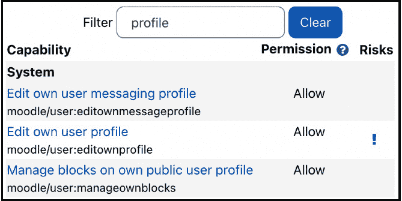

图 7.10 – 用户个人资料功能

我们现在已经涵盖了 Moodle 中的主要非课程页面：**主页**、**我的课程**、**仪表板**和**用户个人资料**。以下表格从用户的角度提供了一个快速总结：

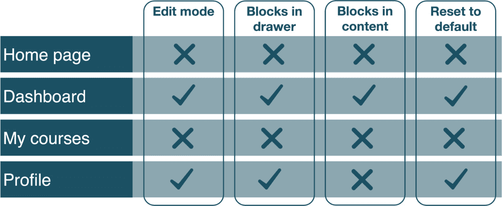

图 7.11 – 首页 vs 仪表板 vs 我的课程 vs 用户资料

缺少一个关键布局元素：标题。

## 自定义标题

Moodle 标题显示在 Moodle 的每一页上，并包含不同的导航元素，如下所示注解的工具栏：

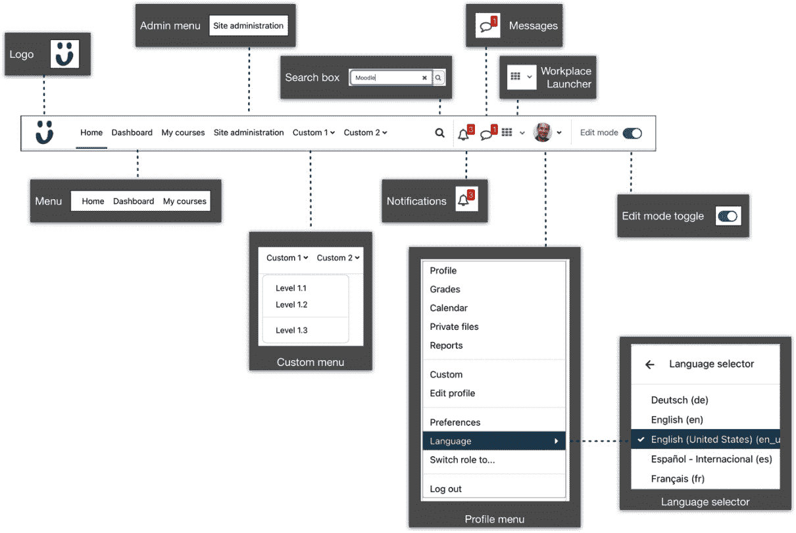

图 7.12 – Moodle 标题

不同的标题项包括以下内容（从左到右），包括更改它们外观的提示：

+   （紧凑）您的网站标志（在**网站管理 | 外观 | 标志**中），您还可以指定**网站图标**。如果没有提供标志，则显示网站名称（在**网站管理 | 一般 | 网站首页 | 网站首页设置**中**网站首页设置**）。

+   主要菜单项（当在**网站管理 | 外观 | 导航**中禁用时，**仪表板**将隐藏）。

+   管理菜单（只有网站管理员能看到此菜单）。

+   自定义菜单（可以通过 `<Indent><Text>[|<URL>][|<Tooltip>][|<Language>]` 添加附加菜单项）。

`<缩进>` 是一系列短横线：没有短横线表示顶级菜单；一个短横线表示子菜单；两个短横线表示子子菜单；依此类推。Boost 主题不支持子菜单；其他主题可能克服这一限制。《文本》是菜单项的标签，《URL》是内部或外部链接，《提示》是可选的气球帮助。您可以将《语言》代码或作为最后一项的分离代码列表添加，如果用户当前已选择列出的语言，则将仅显示。`###` 创建分隔符。

+   以下示例**自定义菜单项**条目将生成 Moodle 标题图像中显示的菜单：

`自定义 1`

`-` `级别 1.1|URL`

`-` `级别 1.2|URL`

`-###`

`-` `级别 1.3|URL`

`自定义 2`

`- 语言 2.1|URL EN||en, en_us`

`- Sprache 2.1|URL DE||de, de_du, de_kids`

`- 级别 2.2|URL|在 Boost 中显示` `in Boost`

`-- 级别 2.2.1|URL|在 Boost 中不显示` `in Boost`

`-- 级别 2.2.2|URL|在 Boost 中不显示` `in Boost`

+   搜索框（在**网站管理 | 一般 | 高级功能**中启用**全局搜索**）。

+   通知指示器和通知菜单切换（始终显示）。

+   消息指示器和消息切换抽屉（始终显示）。

+   工作空间启动器（仅适用于 Moodle Workplace）。

+   个人资料菜单（可以通过 `<Item><URL>` 隐藏菜单项）。

`<Item>` 是文本输入（在我们的示例中，`<langstringname><componentname>`。前者是语言包条目，后者是 Moodle 组件的名称，例如，提供直接链接编辑用户资料：`editmyprofile,core|/user/edit.php`）。

+   语言选择器（在**网站管理 | 一般 | 语言 | 语言设置**中**显示语言菜单**和**语言菜单上的语言**）。

+   编辑模式切换。

这就完成了外观页面和页眉的定制。接下来是整个系统中出现的视觉元素，首先是块。

# 配置块

我们迄今为止遇到的每个页面都包含块。实际上，除了少数例外，Moodle 中的每个页面都可以包含块。您必须切换到**编辑模式**并打开块抽屉来配置块。一旦开启，您将看到**添加块**项，这允许您将所有可用的块添加到主页上（除了已经添加的块，并且只允许一个实例）：

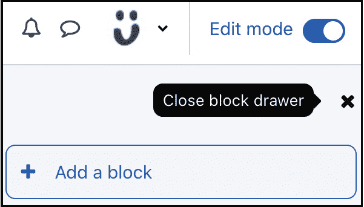

图 7.13 – 向块抽屉添加块

每个块都有一个目的，通常与特定的 Moodle 功能相关联，例如在日历中显示截止日期、获取对用户私有文件的访问权限，或显示最新的公告。一个例外是**文本**块，它允许您添加任何 HTML 代码，对于无法使用标准 Moodle 块显示的内容非常有用。

在整本书中，我们会在相关主题时处理特定的块。在这里，我们专注于块配置。

块最多有三种类型的设置，可以通过**配置**图标访问：

+   **块设置**：这些设置是针对块的，并非所有块都提供配置参数。例如，我们在上一章创建“家长”角色时使用的“学员”块允许您指定块标题。

+   **此块出现的位置**：块将显示的位置以及默认属性。

+   **在此页面上**：当前环境中的属性。

下面的截图显示了块配置的示例（“学员”块）：

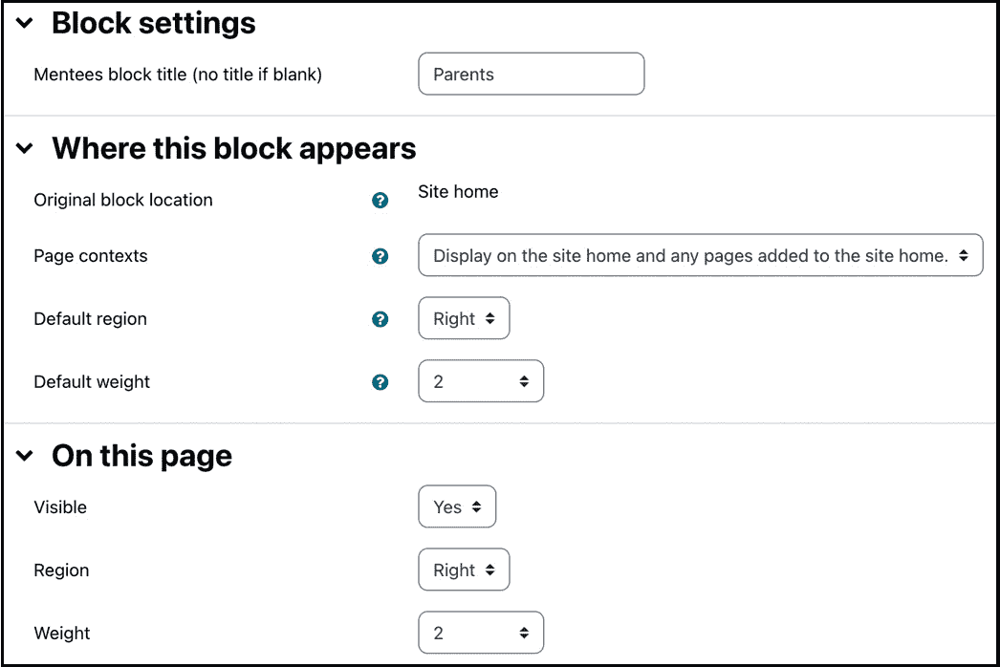

图 7.14 – 块配置

以下参数可用：

+   **原始块位置**：这显示了块被创建的环境（此处为**网站主页**）。与角色一样，页面可能从父上下文继承块。

+   **页面上下文**（并非所有上下文都可用）：此设置确定块将在哪些页面上显示；可用的选项是显而易见的：**仅在网站主页上显示**、**在网站主页和添加到网站主页的任何页面上显示**，以及**在整个网站上显示**。在其他上下文中，例如课程，根据原始块位置和您的当前位置，还有其他（上下文相关）选项可用。

+   **页面类型上的显示**（主页上不可用）：可用的选项取决于块的环境。在**课程**环境中的示例有**任何页面**、**任何课程页面**和**任何类型的课程****主页**。

+   **默认区域**：这决定了块的位置，可用的选项取决于它们在主题中的定义。通常，选项是**左侧**（或**侧边栏前**）、**内容**和**右侧**（或**侧边栏后**）。

+   **默认重量**（-10 至 10）：将块想象成一个气球 – 块的重量越轻，其位置越高，重量越重，则放置得越低。

+   **可见**（**是**或**否**）：这决定了块是显示还是隐藏。

+   **区域**（**左侧**或**右侧**）：这与**默认区域**相同。在允许在中心列中定位块的页面，例如仪表板和用户个人资料页面，**内容**被提供为第三个选项。

+   **重量**（-10 至 10）：这与**默认重量**的原理相同。

块的重量和区域的概念已在以下（块）图中说明：

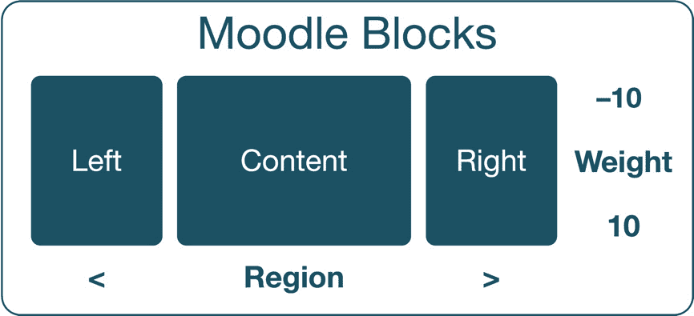

图 7.15 – Moodle 块的重量和区域

虽然教师有权在其课程内配置块，但由于重量和区域的概念并不直观，这通常需要一些支持。

接下来介绍的编辑器是用户将在整个网站上使用的另一个视觉元素。

# Moodle 编辑器

在 Moodle 中，编辑器是用户体验的核心，因为它在整个网站上用于广泛的操作。这些包括在论坛中发布（学习者）、对提交提供反馈（教师）以及编辑内容（编辑教师）。作为管理员，您应确保编辑器配置得当，以满足用户的需求。

Moodle 的默认编辑器称为**Atto**，这是 Moodle 为 Moodle 开发的。Atto 被设计为与响应式主题一起工作，支持从左到右以及从右到左的字符串，提供无障碍支持，并且完全可配置。

**TinyMCE**曾是 Moodle 的标准编辑器，尽管仍然得到支持，但使用的是过时的版本。Moodle HQ 已经传达了以下文本编辑器策略：TinyMCE 的最新版本将被纳入 Moodle，并且所有 Atto 插件都将迁移。一旦这个过程完成，预计 Atto 将在未来的版本中逐步淘汰。因此，在这本书中，我们只会介绍 Atto，因为这是目前最好的 Moodle 编辑器；不久，您将处理 TinyMCE，所有基本功能都预计将可用，并且希望有更多功能。 

此外，Moodle 包含一个内置的纯文本编辑器，用于输入不需要格式化的任何文本，例如源代码。

要访问可用的编辑器和它们的设置，请转到**网站管理 | 插件 | 文本编辑器 |** **管理编辑器**：

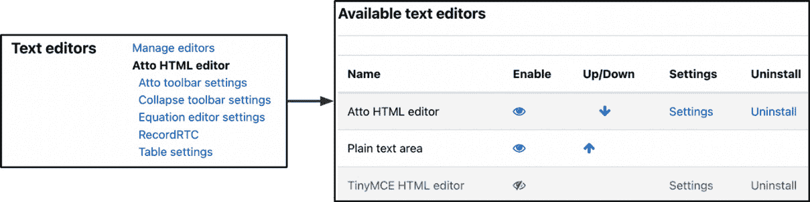

图 7.16 – 管理文本编辑器

**文本编辑器** 插件区域的想法是可以在 Moodle 中安装和利用额外的编辑器（参考 *第八章*，*理解 Moodle 插件*）。这些可以是默认编辑器的替代品，或者可以输入特定内容的编辑器。此外，Atto 中的每个按钮都实现为一个 Moodle 子插件，这允许灵活扩展编辑器功能。

小贴士

建议您使用 Atto 作为默认编辑器，因为这是未来将得到维护的编辑器，并且完全支持移动设备。

您可以通过 **设置** 链接启用/禁用每个编辑器，更改顺序（它们在选择编辑器时将按此顺序显示），并调整编辑器的设置。

默认情况下，编辑器工具栏配置为如下所示（当展开时）：

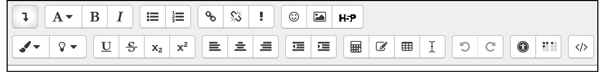

图 7.17 – Atto 编辑器工具栏（默认）

工具栏可以在 Atto 插件列表下的 **工具栏配置** 设置中进行配置：

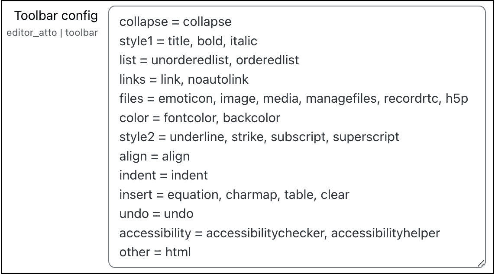

图 7.18 – Atto 工具栏配置

工具栏按钮按组组织，例如，`collapse`、`style1` 和 `list`。组名必须是唯一的，并且顺序决定了按钮组排列的顺序。每个条目的格式如下：

`group =` `button1[, button2][,button3][…]`

例如，`color` 组包含两个按钮：`前景` 和 `背景`。

当您导航到 **站点管理 | 插件 | 文本编辑器 | Atto HTML 编辑器 | 折叠工具栏设置** 时，您可以通过 **显示折叠时第一个组** 选项指定在编辑器工具栏未展开时显示哪些按钮。

您可以安装 Atto 的编辑器插件，为您的编辑器添加额外的按钮。例如，单词计数器、行内纠正和 MS Word 导入。

Atto 在预定义的时间间隔自动保存其内容，这对于用户意外关闭页面很有帮助，因为内容将在他们下次返回同一表单时恢复。您可以通过导航到 **站点管理 | 插件 | 文本编辑器 | Atto 工具栏设置** 来调整此 **自动保存频率** 设置。请注意，非常高的频率，如每秒一次，可能会损害您系统的性能。

存在着许多选项可以扩展 Atto 的功能，而无需安装任何附加组件：

+   **扩展表格功能**：Atto 包含一个强大的表格模式，支持表格的格式化和自定义。为了使您的用户具备完整的功能，您可能需要通过访问 **站点管理 | 插件 | 文本编辑器 | Atto HTML 编辑器 | 表格设置** 来开启可用的功能。

+   **支持数学方程式**：如果您的某些用户经常使用数学方程式，您有两个选择。第一个是**通过 TeX 的方程式**，这是一种支持广泛数学运算的排版语言。第二个是**通过 MathJax 的方程式**；MathJax 是一个 JavaScript 库，它使用各种标记（包括 TeX）在网页浏览器中显示数学符号。您需要在**网站管理 | 插件 | 过滤器 | 管理过滤器**中启用过滤器。一旦您激活了一个或两个过滤器，您可以通过导航到**网站管理 | 插件 | 文本编辑器 | Atto HTML 编辑器 | 方程式** **编辑器设置**来指定它们的详细信息。

+   **带来一丝微笑 ;-)**：无论您是否喜欢，表情符号已经成为了常态，教育环境也不例外。要配置或添加表情符号，请前往**网站管理 | 外观 | HTML 设置**，在那里您将找到表情符号值的列表，以及表格底部的良好解释。确保在**网站管理 | 一般 | 高级功能**中启用了**表情符号选择器**设置。

+   **添加一些酷炫功能**：**FontAwesome**是一个包含超过 2,000 个完全可缩放矢量图标的字体图标工具包。为了支持这一系列出色的功能，您需要从[moodle.org/plugins/filter_fontawesome](http://moodle.org/plugins/filter_fontawesome)安装**Font Awesome Icon Filter**插件。有关如何操作的说明，请参阅*第八章*，*理解 Moodle 插件*。或者，您也可以通过 Mustache 模板添加**FontAwesome**。一旦您在**网站管理 | 插件 | 过滤器 | 管理过滤器**中激活了过滤器，您的用户就可以通过类似这样的文本输入添加图标：

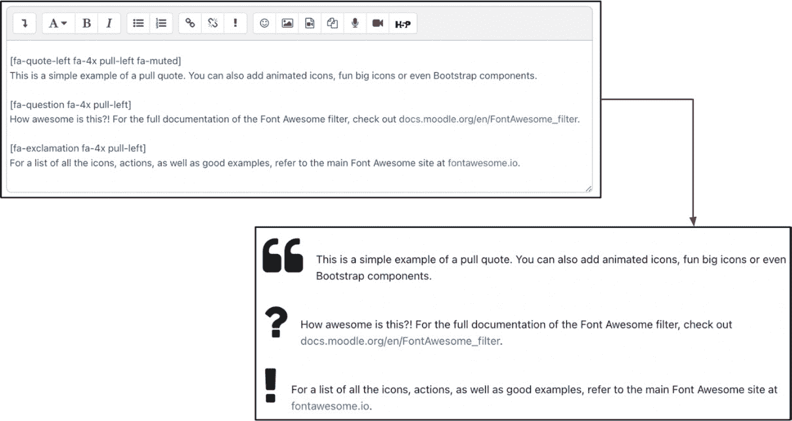

图 7.19 – 过滤器 FontAwesome

在 Moodle 中，每当需要输入内容时都会使用 Atto。到目前为止，我们主要关注文本内容，而忽略了多媒体；在接下来的章节中，当我们处理视频和音频时，这种情况将会改变。

# 启用 Moodle 视频和音频

视频和音频内容对于构建引人入胜的学习体验至关重要。Moodle 支持**播放**各种媒体格式，以及音频和视频的**录制**。

我们将涵盖两种模式：首先，我们将查看媒体播放器，然后再处理媒体录制器。

## 媒体播放器

现在的用户期望将媒体格式融入他们的教学和学习内容中。无论是教师提供视频作为学习资源，还是学习者将音频剪辑嵌入到他们的作业中，不同媒体格式的支持都是理所当然的。作为 Moodle 管理员，您的任务是确保这些媒体文件能够正确播放。

那么，Moodle 是如何处理不同格式的媒体内容的呢？简单来说，每次 Moodle 检测到一个指向多媒体资源或`<video>`和`<audio>`HTML 标签的链接时，它都会用适当的媒体播放器代码替换它们。多媒体过滤器用于简化这一转换过程（更多关于过滤器的内容请参阅*第十章*，*配置技术功能*），如下面的可视化所示：

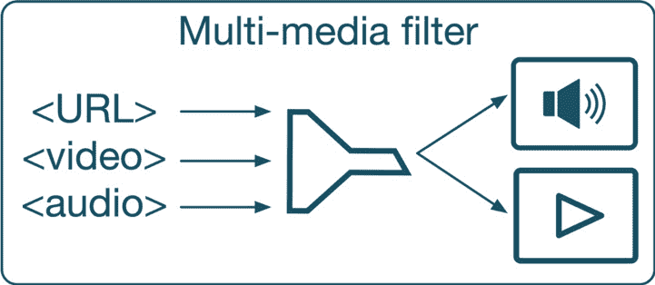

图 7.20 – 多媒体过滤器在工作

Moodle 在播放媒体格式方面做得相当不错，大多数设置几乎不需要调整。您可以在**网站管理 | 插件 | 媒体播放器 | 管理** **媒体播放器**中查看支持的播放器：

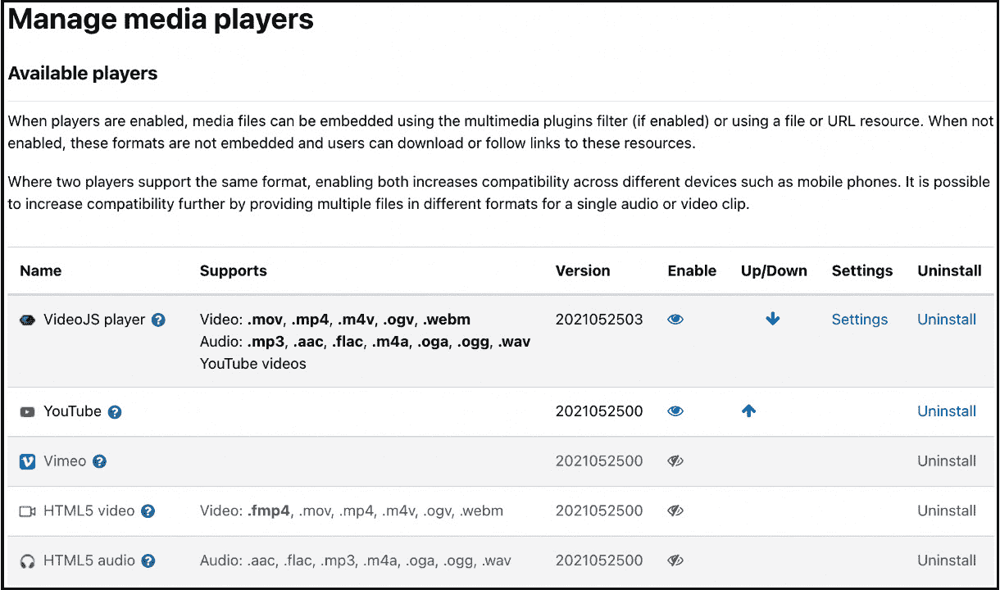

图 7.21 – 媒体播放器

默认情况下，Moodle 使用**VideoJS**，这是一个流行的开源播放器，支持 HTML5 视频、音频和流媒体服务，如 YouTube 和 Vimeo。VideoJS 还向有访问障碍的用户提供内容。由于其可插拔性和易于定制的样式，它已成为网络应用的默认标准。除非您的用户有特定的媒体格式要求，否则 VideoJS 足以播放所有内容。

为了确保您的网站上可以播放媒体，您应该执行以下几项检查：

+   确保在**网站管理 | 插件 | 过滤器 | 管理** **过滤器**中启用**多媒体过滤器**。

+   仔细检查**VideoJS 设置**。在**视频文件扩展名**和**音频文件扩展名**中，您可以指定哪些文件格式受支持。虽然有一个专门的 YouTube 媒体播放器，但 VideoJS 也支持**YouTube 视频**。如果您的用户不使用播放列表，您可以禁用独立播放器。**视频 CSS 类**和**音频 CSS 类**允许您自定义播放器。查看[docs.videojs.com](http://docs.videojs.com)上可用的类。**限制大小**选项定义了在没有指定尺寸或视频拉伸到最大可能宽度时是否应用**默认宽度**和**默认高度**。

+   如果使用流媒体服务，请在可用播放器列表中启用 Vimeo 支持。

有多种方法可以通过视频相关的第三方插件来丰富您的网站。一个高度推荐的选择是**Video Time** ([moodle.org/plugins/mod_videotime](http://moodle.org/plugins/mod_videotime))。Video Time 产品系列包含一系列插件，可以将视频集成到 Moodle 中。视频可以本地托管在 Moodle 中，也可以在外部或 YouTube 或**Vimeo**上托管。支持的功能包括简化视频嵌入、可调整和自定义的标签界面、活动完成、视频跟踪、恢复、交互式字幕等。

## 媒体录制器

在 Moodle 中，每个人都可以成为内容创建者。教师可以通过语音录制作业反馈，学生可能希望将录制视频添加到论坛帖子中。一些用户将使用他们的台式 PC 或 Mac；其他人可能希望使用他们的移动设备进行录制。

Moodle 完全支持通过其 Atto 文本编辑器进行媒体录制。内部使用**RecordRTC**，这是一个使用 WebRTC 进行音频和视频录制的开源 JavaScript 库。您可以在**网站管理 | 插件 | 文本编辑器 | Atto HTML 编辑器 | **RecordRTC**中配置其设置：

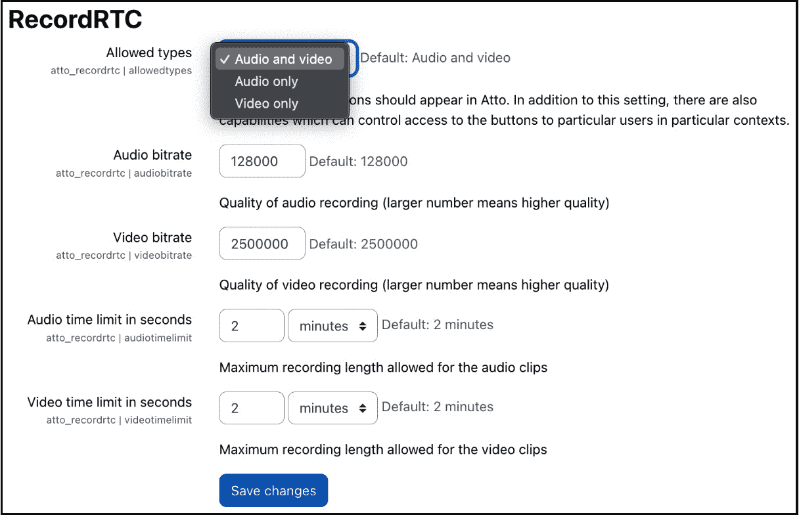

图 7.22 – 媒体播放器

这些选项值得一看，因为它们会影响服务器资源，包括带宽和磁盘使用：

+   `atto/recordrtc:recordaudio`和`atto/recordrtc:recordvideo`。

+   **音频比特率**和**视频比特率**：比特率越低，文件大小越小，反之亦然。录制音频的默认比特率（**128000**）应生成每分钟约 15 KB 的文件；录制视频的默认比特率（**2500000**）生成每分钟约 20 MB 的文件。

+   **音频时间限制（秒）**和**视频时间限制（秒）**：音频和视频录制的默认时间限制为**2 分钟**。同样，最大录制长度越长，生成的文件就越大。

录制存储在`$CFG->dataroot>/filedir`的子目录中。您可能需要再次检查*第二章*中关于文件和上传限制的部分，*探索 Moodle 系统*。

重要提示

确保配置`post_max_size`和`upload_max_filesize`与您预期的最大录制大小一致。

这部分关于音频和视频的内容到此结束。接下来是用户导游，以帮助学习者和教师在第一次遇到页面或功能时熟悉它们。

# 使用用户导游创建演示

用户导游允许您创建简单的演示，突出关键区域，或通过屏幕上的逐步指南演示新功能。以下是我们将在本节中创建的示例迷你导游：

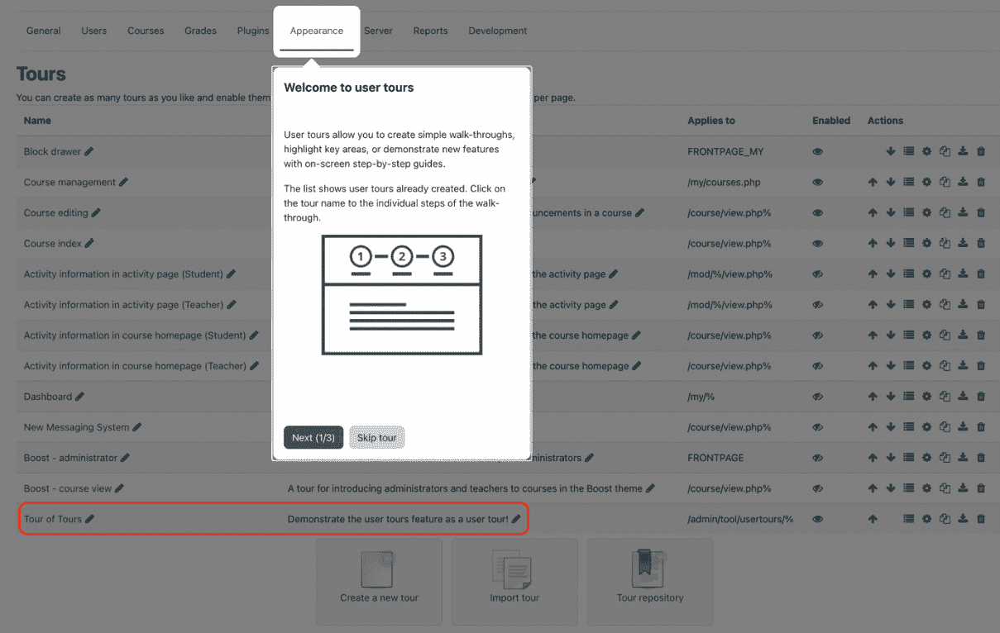

图 7.23 – 管理用户导游

**导游**由多个**步骤**组成，每个步骤都与一个**目标**相关联。目标是一个页面元素，它属于以下三种**目标类型**之一：

+   **块**：一个 Moodle 块，用于在其旁边显示步骤

+   **选择器**：在步骤显示的页面上的 CSS 选择器

+   **页面中间**：与页面上的任何元素都不相关的通用信息

每个导游步骤都有一个标题、一些内容和目标。每个目标都与一个块、一个 CSS 选择器或页面中心相关联。导游中的页面数量没有限制。用户导游的结构在以下图中显示：

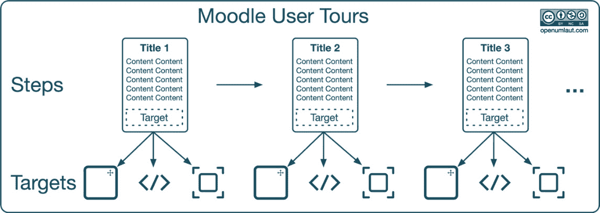

图 7.24 – 用户旅游概述

我们的示例旅游包含三个步骤，其中第一个与**外观**菜单相关联，其目标类型为**选择器**。

理论就到这里吧；让我们创建您的第一个用户旅游。

## 创建旅游

要访问用户旅游功能，请转到**网站管理 | 外观 | 用户旅游**。Moodle 附带了一些用户旅游，您将看到它们列出来。让我们使用**创建新的** **旅游**按钮来制作我们的第一个指南。

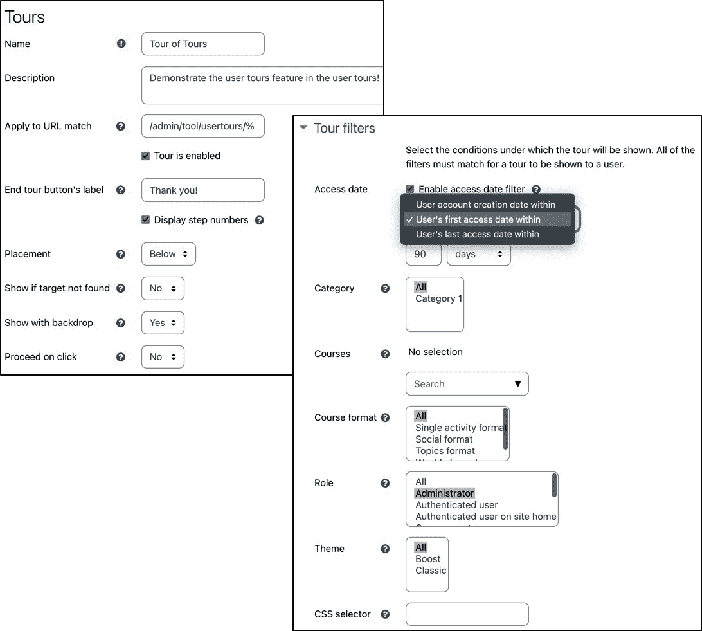

图 7.25 – 创建用户旅游

虽然**名称**和**描述**应该是自解释的，但其他设置需要一些解释：

+   在我们的“旅游之旅”旅游中，`/admin/tool/usertours/%`。通配符也可以与任何 URL 片段一起使用，例如，`%add=scorm%`，用于解释设置 SCORM 活动的各个方面。

其他要匹配的有用的 URL 是`/my/%`（仪表板）、`/course/view.php%`（所有课程）、`/course/view.php?id=x`（ID 为`x`的课程）和`/user/profile.php%`（用户资料）。要匹配主页，必须使用`FRONTPAGE`值。

+   **旅游已启用**：最初，旅游是禁用的。您可以为同一页面目的地拥有多个旅游，但一次只能启用一个页面。

+   **结束旅游按钮的标签**：默认情况下，最后一步的按钮标签为单步的**明白了**，多步旅游的**结束旅游**。如果您愿意，可以指定一个自定义标签。

+   **显示步骤编号**：是否显示步骤计数器，如 2/4，以指示旅游长度。这样的指示器在较长的旅游中很有用。

+   **位置**：步骤可以放置在目标（匹配块或 CSS 选择器）的**上方**、**下方**、**左侧**或**右侧**。应避免使用两个水平选项，因为这可能在移动设备上引起问题。如果大小超过可用空间，Moodle 将自动定位步骤。

+   **显示如果目标未找到**：有时指定的目标不会显示，例如，当用户的权限不允许时。在这种情况下，除非更改此设置，否则不会显示步骤。

+   **显示背景**：当勾选此选项时，此选项将导致目标被突出显示，其余屏幕变暗。我们在示例中应用了此设置。一些部分不支持背景，例如，主菜单栏。

+   **点击继续**：如果启用，当用户点击目标时，将显示下一步，模仿一种通过实践学习的功能。

此外，您还可以指定几个**旅游过滤器**，这些条件必须满足才能显示旅游。可用的过滤器如下：

+   **访问日期**：该过滤器根据账户创建、首次访问和最后访问来限制用户旅游。如果您希望将旅游限制为新用户或一段时间未访问网站的用户，这将很有用。

+   **分类**：只在所选分类的课程内的页面上显示巡览。

+   **课程**：只在所选课程内的页面上显示巡览。

+   **课程格式**：只在应用了所选课程格式的课程内的页面上显示巡览。

+   **角色**：只有向具有巡览显示上下文中选定角色的用户显示巡览。

+   **主题**：只有当用户正在使用所选主题时才显示巡览。

+   **CSS 选择器**：只有当页面上存在指定的 CSS 选择器时才显示巡览。有关 CSS 选择器的更多信息，请参阅我们添加步骤时的说明，我们将在下一部分进行介绍。

## 向您的巡览添加步骤

巡览包括多个步骤，模拟简单的浏览过程。在屏幕截图中，您可以看到我们“巡览巡览”巡览的三个步骤：

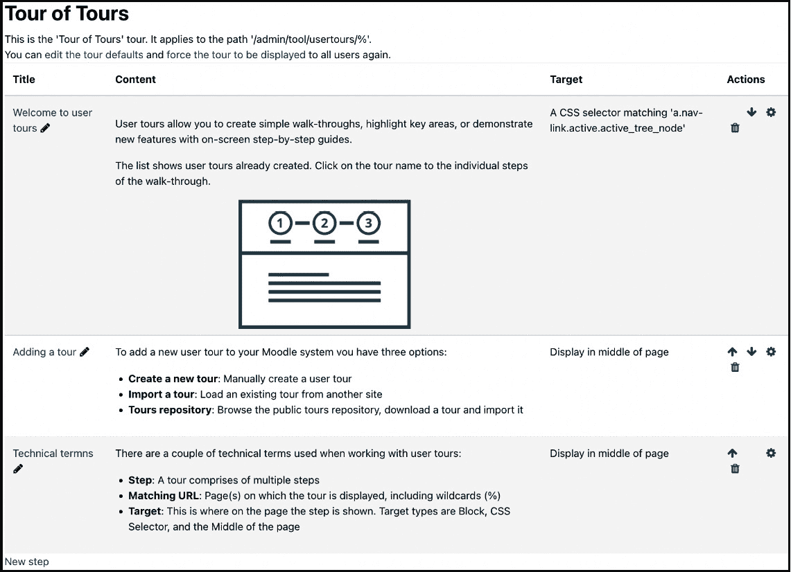

图 7.26 – 巡览步骤

一个步骤包含以下三个主要元素：

+   `a.nav-link.active.active_tree_node`，代表管理菜单的激活标签页。

+   使用**页面中间**选项显示与任何元素无关的一般信息。我们“巡览巡览”巡览的最后两个步骤使用此目标类型。

+   **内容**：此元素包含标题和步骤的解释性文本；后者还可以包含图像甚至教学视频。两个必填字段都将显示给用户。

要在用户选择的语言中显示您的步骤，请使用 `identifier,component`（有关详细信息，包括如何在字符串文本中包含图像，请参阅*第十章*中的*管理本地化*部分，*配置技术功能*），

Moodle 附带的所有巡览都使用了语言字符串功能。请注意，当修改这些内置巡览中的任何内容时，它们可能在下一次升级期间被覆盖。

+   **选项**：可用的步骤设置（**位置**、**如果找不到目标则显示**、**显示背景**和**点击后继续**）与巡览设置中指定的相同。您可以覆盖每个设置，例如，当背景不正确显示时，或者坚持使用继承的默认值。

当您通过底部的**新建步骤**链接添加新的步骤到您的巡览时，您将在以下表单中找到提到的元素：

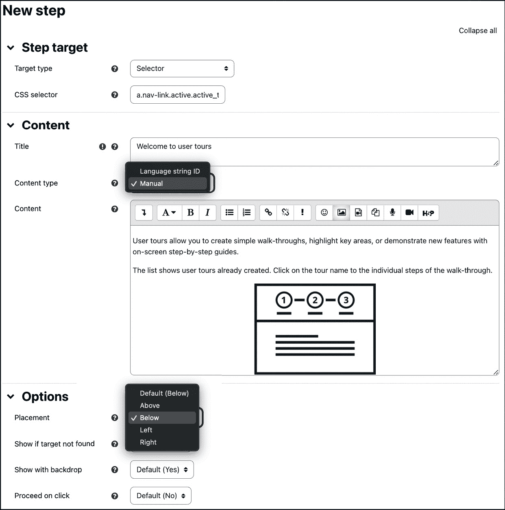

图 7.27 – 添加巡览步骤

保存表单后，您可以添加所需数量的步骤到您的用户巡览中。您还可以在以后修改巡览或简单地修改任何现有内容。当巡览的结构发生变化时，Moodle 将识别这一点并向所有用户显示巡览，包括那些已经查看过先前版本的用户。当您只更改巡览的小部分时，您可以使用屏幕顶部的**强制显示巡览**链接来重置记录已查看巡览的内部存储。

现在你已经熟悉了创建多步骤的导览，让我们看看通过导入和导出共享导览。

## 导入和导出导览

你可以使用列表中的 **导出** 按钮下载导览。Moodle 创建一个 JSON 文件，可以导入到另一个 Moodle 网站。**导入导览** 按钮会带你到 Moodle 的标准上传功能。

**导览存储库** 是一个高质量用户导览的有价值资源。一旦你点击了它的按钮，你将被引导到 [moodle.net](http://moodle.net) 上的公共 **用户导览** 网站。在撰写本文时，大约有 100 个不同语言的用户导览，可能会引起你的兴趣。你需要做的就是选择你选择的文件，并点击 JSON 文件名，这将下载用户导览，然后你可以使用前面解释的导入机制将其加载到你的 Moodle 网站上。确保用户导览与你的 Moodle 版本匹配，以避免任何不一致。

如果你觉得自己创建了一个可能对他人感兴趣的有用用户导览，请随时在导览存储库中分享它。你需要做的就是导出你的导览，并使用你的 Moodle 账户，将其上传到 [moodle.net](http://moodle.net) 上的存储库。

这部分关于用户导览的内容到此结束，这是外观元素的最后一块基石。接下来是 Moodle 主题，它对整个 Moodle 网站都有影响。

# 使用 Moodle 主题

Moodle 提供了一个灵活的皮肤机制，以品牌你的网站并遵循企业设计指南。如介绍中所述，我们只会涵盖可以从 Moodle 管理菜单访问的主题设置。有关如何创建 Moodle 主题的详细信息，请参阅 *Silvina Paola Hillar，Packt Publishing* 的 *Moodle 主题开发*，或联系你的 Premium Moodle 合作伙伴，他们将能够提供专业的主题设计服务。在 [docs.moodle.org/dev/Themes](http://docs.moodle.org/dev/Themes) 上也有一些很好的提示，它假设你已很好地理解了 HTML 和 CSS。

虽然 Moodle 支持固定宽度和流体主题，但使用（或开发）响应式主题是非常推荐的。我们在这里专门介绍响应式主题。

重要提示

Moodle 反映出电子学习的未来是移动的，它只提供了两个响应式主题：Boost 和 **经典**。

响应式主题会自动适应设备、屏幕分辨率和屏幕方向。此外，响应式主题还会根据显示的学习内容和使用的导航进行调整。Moodle 主题基于 **Bootstrap 4** 并完全支持 SASS。

重要提示

所有现代浏览器（Firefox、Edge、Chrome 和 Safari 的最新版本）都完全支持 Moodle。

不支持 Internet Explorer 11 和其他旧版浏览器！

在这个主题部分，我们首先为您选择一个主题，然后再查看不同的主题类型。然后，我们自定义您的主题，这是一个分为一般、高级和功能主题设置的分类主题。

## 选择 Moodle 主题

可以通过访问 **网站管理 | 外观 | 主题 | 主题选择器** 来选择标准或自定义主题。在我们的网站上，您可以看到两个核心主题（**Boost** 和 **Classic**）以及根据 moodle.org 上的统计数据，最受欢迎的两个第三方主题 **Moove** 和 **Adaptable**：

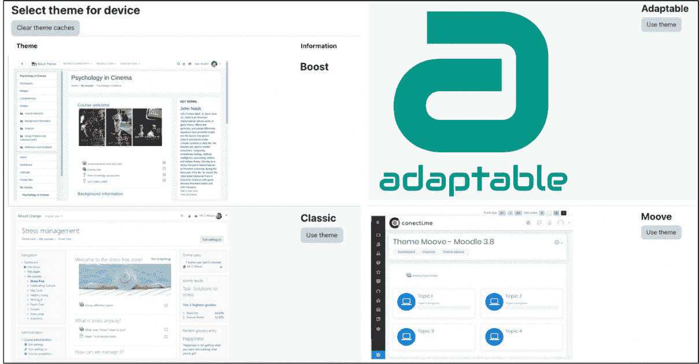

图 7.28 – 主题选择

通过选择 **使用主题** 按钮选择一个主题，新皮肤将立即应用。然而，一些用户在更换主题后可能会遇到问题，因此建议在应用新主题或更新现有主题时清除主题缓存。

重要提示

确保所选主题与您的 Moodle 版本兼容。较旧的主题不会被 Moodle 4 主题引擎正确渲染。

到目前为止，我们已经为整个 Moodle 系统应用了一个单一的主题。要在不同的环境中应用不同的主题，我们需要掌握主题类型的概念，这是下一小节的主题。

## 理解主题类型

要理解大多数主题设置，我们需要一点背景知识。像角色一样，主题在不同的环境中分配：**网站**（系统）、**用户**（包括 **群体**）、**分类** 和 **课程**。Moodle 还支持两个附加区域：**会话** 和 **页面**。以下表格解释了这些 **主题类型**：

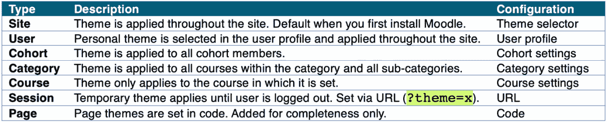

图 7.29 – 主题类型 I

表格简要描述了每个主题的作用域以及配置位置。作为旁注，您可以通过修改 `config.php` 中的 `$CFG->themeorder` 参数来更改主题的优先顺序（优先级）。默认设置为 `array('course', 'category', 'session', 'user', 'cohort', 'site'`。

要强制在不同区域应用主题，必须执行两个配置：

+   必须启用不同的主题类型，这发生在 **网站管理 | 外观 | 主题 | 设置**。您将看到每个主题类型的复选框，除了网站主题，它不能被禁用，以及页面主题，它已被保留供开发者使用。

+   必须通过 **强制主题** 选项为相应的主题类型选择一个主题。在此环境中拥有足够权限的用户可以进行此选择；例如，编辑教师被允许更改课程主题。

以下图中展示了这两种配置：

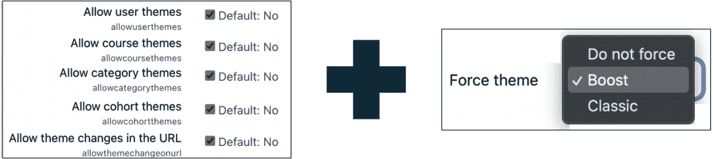

图 7.30 – 主题类型 II

当允许除网站主题之外的其他主题类型时，存在权衡：虽然允许不同的主题类型，但需要额外的处理，这将增加您的系统开销并增加对服务器的需求。然而，不允许这些主题会限制您网站上可以执行的自定义程度。为了帮助您解决这种统一性与个性化之间的平衡问题，以下是一些可能有助于主题选择功能的场景：

+   为有可访问性问题的用户提供主题（用户资料中的高分辨率主题）

+   对资格课程进行品牌化（分类主题）

+   创建主题库（会话主题通过 URL：`<yoursite>/?theme=<themename>`）

在**网站管理 | 外观 | 主题 | 主题设置**中，还有两个与主题类型相关的剩余主题参数值得提及：

+   **主题列表**：要限制可用的主题数量，请在文本框中输入主题名称，用逗号分隔，且不要有空格。

+   **主题设计师模式**：此设置适用于设计师和开发者，实际上会关闭主题缓存。请不要在生产网站上使用此设置，因为它会显著减慢您的系统速度！

现在我们已经掌握了处理主题的技能，是时候自定义现有主题了。

## 自定义主题

作为管理员，您不太可能参与创建完整的自定义主题，因为这个任务需要强大的设计技能和对 CSS 和 HTML 的深入了解。然而，您将能够对现有主题进行基本修改。

主题自定义可以分为三类。虽然并非所有主题都遵循这种方法，但它能很好地说明您可以通过主题设置执行哪些类型的自定义：

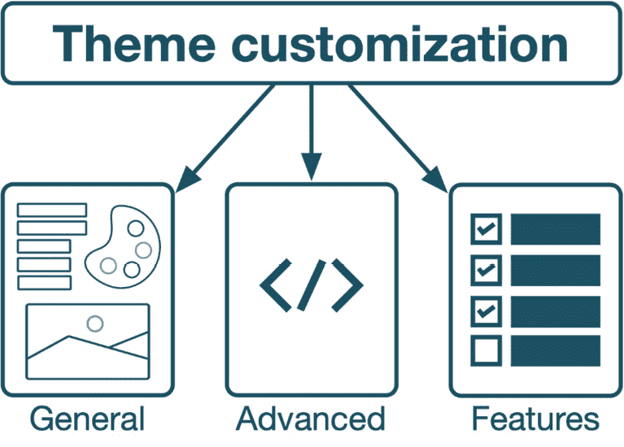

图 7.31 – 主题自定义

基本设置处理一些基本参数、图像和颜色；高级设置允许您添加自定义 CSS 代码，而功能设置则向您的系统添加新功能。我们将在以下子节中介绍这三种类型。

### 通用主题设置

通用主题设置允许您指定一些基本选项、背景图像和品牌颜色。我们介绍了两个核心主题（它们的设置几乎相同），因为许多自定义主题都是基于它们的。第三方主题可能具有额外的设置，例如更多的颜色字段、字体大小或按钮样式。

前往**网站管理 | 外观 | 主题**并选择**经典**或**增强**，您可以在那里配置以下选项：

+   **使用深色风格导航栏**：在经典主题中，在深色和浅色风格导航栏之间切换。

+   **不必要的块**：某些块在某些主题中不需要或不被支持。在这里，您可以禁用它们，而无需为其他主题隐藏它们。

+   **主题预设**和**附加主题预设文件**：预设包含用于生成主题新样式表的 SCSS 指令。有关预设和 SCSS 的更多信息，请参阅以下小节。

+   **背景图片**和**登录页面背景图片**：这两个设置应该不言自明。

+   **品牌颜色**：菜单项和按钮将更改为所选颜色。

通用主题设置通常不足以根据您的需求设计网站。CSS 提供了更多的灵活性，我们将在下一节中介绍。

### 高级主题设置

Moodle 使用**层叠样式表**（**CSS**）来描述显示的每个元素的呈现方式。CSS 定义了 HTML 呈现的不同方面，包括颜色、字体、布局等。

要了解更多关于主题基础的信息，请访问[docs.moodle.org/dev/Themes_overview](http://docs.moodle.org/dev/Themes_overview)，在那里您将找到一个文档齐全且详细的帮助部分。确保您熟悉浏览器中的**检查**工具，以识别 CSS 样式和属性。

Moodle 在命名样式时始终使用一致的普通英语。对于以下两个屏幕截图显示的登录页面元素，一些样式样本已被标注（左侧为原始版本，右侧为修改版本）：

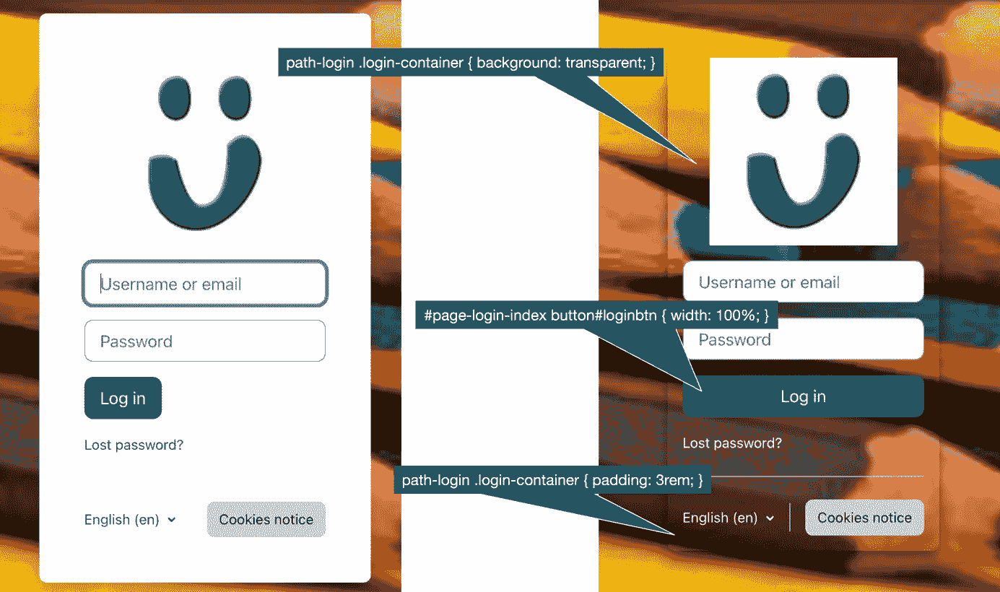

图 7.32 – CSS 样式样本

您可以看到，样式代表 Moodle 的每个元素。Moodle 中实际上有成千上万的样式，这为设计师提供了高度的自由度。

Moodle 支持**Sassy CSS**（**SCSS**），它是 CSS 的超集，提供了变量和嵌套等额外功能。SCSS 是一种预处理语言，在应用于任何网站之前将其转换为 CSS。为了简化，我们将在本章中坚持使用 CSS。

小贴士

如果您已经拥有任何 SCSS 代码或库，请随意使用这些代码进行视觉定制。

您希望注入站点的任何代码都应直接在主题中应用，在**网站管理 | 外观 | 主题 | <主题>**。在**高级设置**选项卡中，您将找到两个设置，允许您覆盖初始 SCSS 变量并向主题添加新的 SCSS，而无需修改后端中的任何代码：**原始初始 SCSS**（在所有其他代码之前注入）和**原始 SCSS**（在样式表末尾注入）。在以下示例中，我们添加了三个变量，以在整个网站上为所有字体添加一些权重：

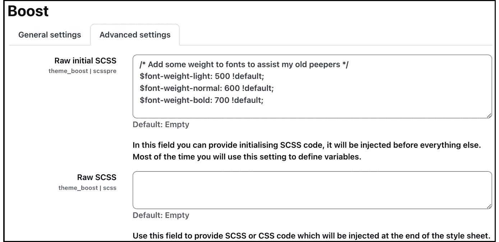

图 7.33 – 高级主题设置

我们在常规设置中已经遇到过的第二个概念是**主题预设**。根据开发者文档，预设是一个设计用来添加到 Boost 主题或其子主题中的 SCSS 文件。它将 Bootstrap 4 SCSS 文件与所需的 Moodle SCSS 文件相结合，并添加了一层定制。预设文件可以上传到主题的管理设置中，然后从已安装预设列表中选择。

Moodle 还支持**Mustache**模板来渲染 HTML 输出。有关 Moodle 对 Mustache 的使用更多信息，请查看 Moodle 开发者文档[docs.moodle.org/dev/Templates](http://docs.moodle.org/dev/Templates)。

从技术上讲，您可以使用 SCSS 和主题预设来定制整个网站。然而，除非只有少数调整，否则其使用起来繁琐，维护可能也相当棘手。第三方或自定义主题克服了这一缺点，并有可能引入新功能。

### 特色主题设置

主题的美丽之处在于，它们不仅可以控制外观和感觉元素，还可以添加新功能。所有流行的主题都利用了这种能力，并添加了新功能。

在[moodle.org/plugins/?q=type:theme](http://moodle.org/plugins/?q=type:theme)上有很多主题。还有许多设计和开发公司通过他们的网站提供付费的 Moodle 主题。根据[moodle.org](http://moodle.org)上的统计数据，最受欢迎的三个主题是**Moove**、**Adaptable**和**Fordson**。为了给您一个专业主题配置选项的直观印象，请查看**Adaptable**主题的片段：

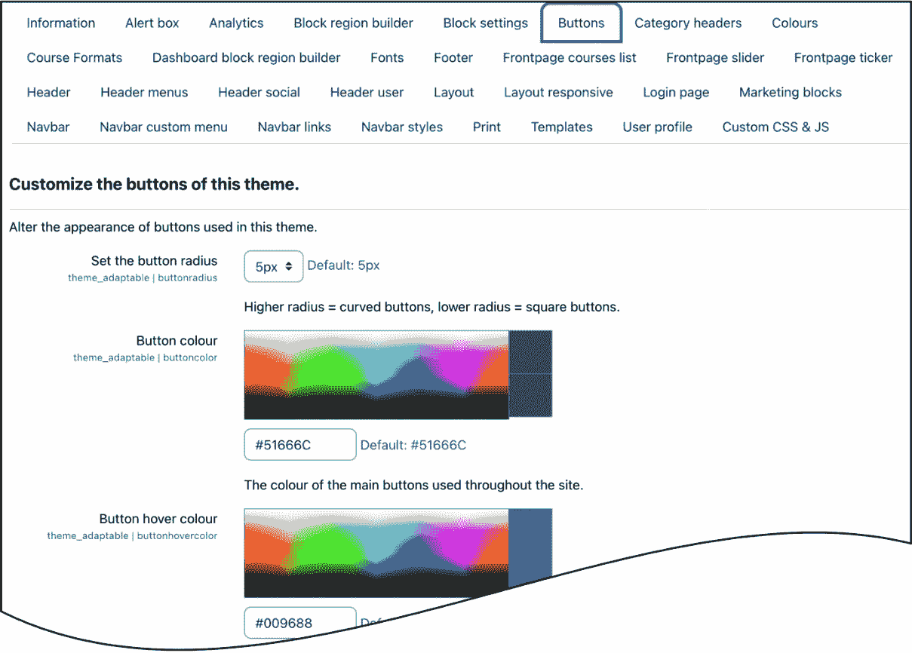

图 7.34 – Adaptable 主题

只需看看菜单项的数量！该主题提供了大量的定制选项，从自定义菜单、首页幻灯片、新闻滚动条和营销位置到社交网络图标和分析支持。请参阅*第八章*，*理解 Moodle 插件*，了解如何安装第三方主题。

主题和定制的话题非常复杂，Moodle 管理员通常不参与设计和品牌过程。我们已经介绍了可以通过管理界面定制的主题基础知识，并希望这为您对这个话题提供了一些洞察。与主题定制密切相关的是可访问性，这必须在您的网站上得到保证。

# 确保可访问性

在大多数教育设置中，可访问性现在是法律要求。因此，确保您的系统符合相关标准至关重要。

重要提示

可访问性是某些残疾用户访问 Moodle 功能的能力。

Moodle Docs 中已专门为 Moodle 可访问性设立了一个区域，您可以在 [docs.moodle.org/en/Accessibility](http://docs.moodle.org/en/Accessibility) 访问它。它提供了到标准、指南、立法以及与主题相关的工具和资源的有用链接。

三个主要可访问性区域影响了 Moodle 中的可访问性：

+   系统可访问性

+   主题可访问性

+   内容可访问性

我们将在以下子节中涵盖所有三种可访问性类型。

## 系统可访问性

Moodle 完全符合主要可访问性标准，并获得了 WCAG 2.1 级别 AA 认证。Moodle 强制执行 XHTML 1.0 Strict，这仅允许使用符合标准的 HTML 构造和 Moodle 表单库的实现。这些限制保证了页面之间的连贯性，并确保在不进行进一步配置的情况下支持标准屏幕阅读器。

Moodle 提供了指向外部验证网站的链接，检查当前页面的标准合规性。转到 **站点管理 | 开发 | 调试** 并勾选 **显示验证器链接** 框以激活这些链接。**验证 HTML** 和 **Web 内容可访问性指南 (WCAG) 检查** 链接将显示在您的页面底部（如果您的主题支持）：

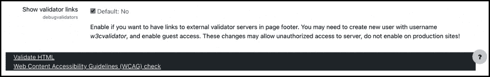

图 7.35 – 验证器链接

在选择相应的链接时，外部验证网站将以 URL 作为参数打开。为了使验证网站能够检查您的 Moodle 系统上的页面，您需要创建一个用户名为 `w3cvalidator` 的新用户，并启用您网站的访客访问权限。仅在测试或预发布站点上执行此操作，因为这些设置可能会损害您系统的安全性。

验证网站不仅检查页面上的任何问题，还检查主题问题，这些将在下一部分介绍。

## 主题可访问性

CSS 是 Moodle 的表示层，独立于系统层，以 XHTML 1.0 Strict 表示。因此，主题本身也必须确保可访问性。

在您直接在主题中或通过自定义 CSS 实现可访问性样式后，请确保这些样式已针对任何问题进行了验证。

一个流行的选择是将可访问性选项集成到主题中，并以选项的形式提供，例如不同的配色方案、字体样式、文本大小和可读性选择。您可以从 [github.com/sharpchi/moodle-local_accessibilitytool](http://github.com/sharpchi/moodle-local_accessibilitytool) 安装**可访问性工具**，以下选择将通过所有用户的**偏好**菜单（如果您的主题支持）对所有用户可用：

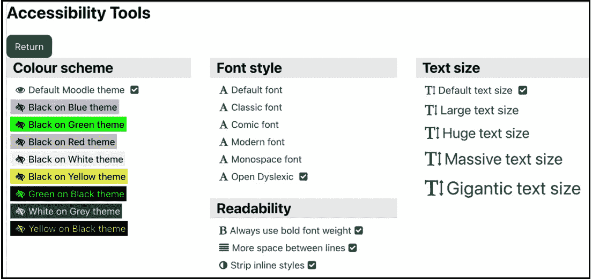

图 7.36 – 可访问性工具

系统和主题的无障碍性是您作为管理员完全控制的；另一方面，内容无障碍性更难实现，因为您依赖于内容创作者。如何帮助他们将在以下子节中介绍。

## 内容无障碍性

无障碍合规性仅适用于 Moodle 页面（假设主题遵循所有标准），但不适用于教师和讲师新创建和上传的内容。

Moodle 提供了一些基本的内置工具，以帮助内容创作者：

+   `libtidy`选项。

+   Atto 中的**无障碍检查器**按钮对输入的 HTML 代码执行一些基本检查，以确保符合无障碍指南。

+   Atto 中的**屏幕阅读器助手**按钮检查图像是否已正确标记以确保屏幕阅读器兼容性。

虽然这些工具提供了一些基本帮助，但它们在帮助内容创作者确保无障碍合规性方面是不够的。为了实现完全的无障碍合规，应促进**无障碍工具包**的使用。要了解工具背后的原理，请查看以下图表：

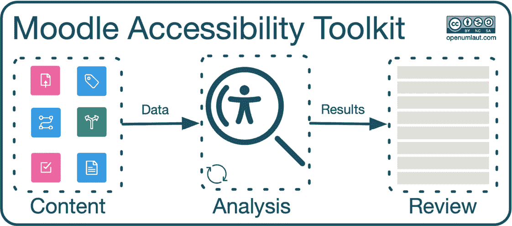

图 7.37 – 无障碍工具包流程

无障碍工具包包括以下步骤：

1.  课程内容被预处理，并提取分析所需的数据。这些数据包含任何相关的分析内容以及有关内容的信息，例如 HTML 标签。

1.  数据分析在您的 Moodle 服务器后台进行；没有内容从您的站点转移出去。（从 Moodle 站点转移出去的唯一数据仅用于一个目的：发送关于总体数据的定期摘要，用于统计和进度目的，例如课程数量、用户数量、分析检查错误等。）

1.  结果可通过**无障碍审查**块获得，并在工具包的不同数据拆分页面上提供更详细的信息。

系统的优点在于，每次内容更新时，仅分析数据的增量。这种机制减少了您的 Moodle 站点的负载，并在您的服务器上更快地执行分析。

作为管理员，您必须确保工具已正确配置，这需要以下步骤：

1.  确保在**网站管理 | 一般 | 高级功能**中启用了无障碍工具。

1.  在 Brickfield 教育实验室注册无障碍工具包。前往**网站管理 | 插件 | 管理工具 | 无障碍 | Brickfield 注册**并遵循注册链接。您需要创建一个账户并添加您的站点详细信息，然后才能收到您的 API 密钥和密钥。这些密钥将在您的 Moodle 站点上的注册页面上提交后启用您的工具包。

1.  进入**网站管理 | 插件 | 管理工具 | 可访问性 | 可访问性工具包设置**并**启用分析请求**。分析会自动更新，以便在持续的基础上对请求的课程进行内容编辑；**删除历史检查结果**允许工具包删除被较新记录取代的旧分析记录。**批量限制**设置计划任务定期运行的分析批次的限制：

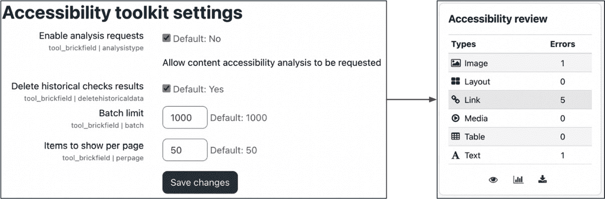

图 7.38 – 可访问性工具包设置和审查块

1.  进入**网站管理 | 插件 | 块 | 可访问性审查**并确保**在课程页面上显示的内容**、**以这种格式显示错误**和**要显示的工具包页面**设置已正确配置。

1.  进入 `tool_brickfield`，并将前四个任务改为每分钟运行一次（将**分钟**设置改为*****）。默认设置为 5 分钟，以避免在初始分析期间可能出现的过载。有关更多详细信息，请参阅*第十五章*中的*Cron 管理和计划任务*部分，*优化 Moodle 性能*。

随 Moodle 一起提供的可访问性入门工具包包含一些有用的工具，以帮助内容创作者制作符合可访问性标准的[学习材料]。**企业可访问性工具包**（[`www.brickfield.ie/brickfield-accessibility-toolkit`](http://www.brickfield.ie/brickfield-accessibility-toolkit)）提供了一套完整的特性，以帮助您的组织提高课程的可访问性。有关详细信息，请访问[www.brickfield.ie/brickfield-accessibility-toolkit](http://www.brickfield.ie/brickfield-accessibility-toolkit)。

这标志着关于复杂任务的可访问性部分的结束，也标志着配置 Moodle 外观的章节的结束。

# 摘要

在本章中，我们处理了 vanilla Moodle 网站的并不那么吸引人的外观和感觉，并触及了大量支持定制的区域。

我们首先查看管理员可以定制的页面：登录、主页、仪表板、我的课程和用户资料。然后我们涵盖了在整个网站上可见或可用的外观元素：页眉、块、视频和音频、Atto 编辑器和用户之旅。

本章的第二部分关注的是主题的定制。在通过一般、高级和功能主题设置定制您的主题之前，我们查看了几种不同的主题类型。

最后讨论的主题是可访问性，这是大多数教育环境中的法律要求。我们处理了系统、主题和内容可访问性。

重要提示

在您未登录时，请再次检查您网站的外观。确保没有信息可见，这些信息只应供登录用户访问。

适应您的 Moodle 系统的外观和感觉的主要目标是确保用户体验的一致性，同时易于使用。然而，定制的程度受到以下三角图中所示的两个因素的约束：

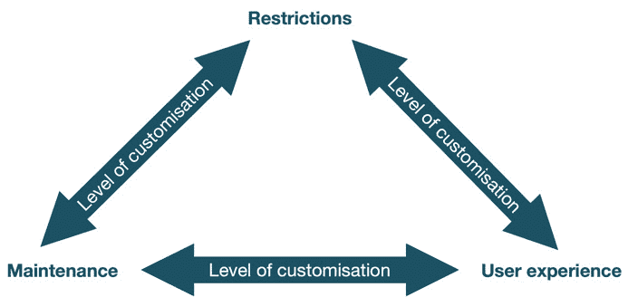

图 7.39 – 定制化程度

您网站的呈现受到限制，通常包括您组织的公司设计指南和可访问性规定。此外，定制的程度越高，在您升级网站到新版本时所需的潜在维护工作量也越大。在修改任何视觉 Moodle 元素或将任务外包给 Moodle 合作伙伴时，建议您考虑这些方面。

现在您的 Moodle（希望）看起来正是您想要的样子，是时候启用您希望提供给用户的全部功能了。插件是向您的 Moodle 系统添加新功能的灵活方式，我们将在下一章中讨论这个问题。
