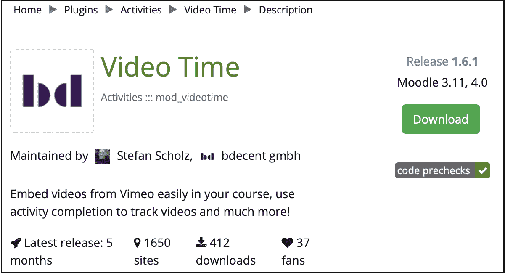

# 8

# 理解 Moodle 插件

您的系统完全运行正常，其外观和感觉反映了您组织的品牌。与所有复杂的基于 Web 的应用程序一样，可以执行大量配置活动，以使 Moodle 符合您组织的需要和要求。

在本章中，我们首先将提供插件概述。然后，我们将探索一些第三方插件并了解它们的强大功能。在结束之前，我们将了解如何安装、更新和删除插件，最后讨论插件评估标准、流行插件和组织决策。

Moodle 的许多优点之一是其可插拔架构。Moodle 支持广泛的插件，我们将通过以下主题来阐明：

+   Moodle 插件——概述

+   第三方插件的强大功能

+   管理第三方插件（安装、更新和删除）

+   优秀的插件和糟糕的插件（插件评估标准、流行插件和组织决策）

关于术语：在本章中，我们将互换使用插件、模块和附加组件。

让我们从插件和集成概述开始。

# Moodle 插件——概述

Moodle 是一个（非常）模块化系统——毕竟，Moodle 中的*M*就代表模块化——Moodle 的大部分功能都作为模块实现，称为插件。

重要提示

Moodle 插件是提供某些特定、通常封闭的功能的模块。

导航到**插件**标签页，位于**站点管理**区域。在所有插件类型下方显示之前，您将找到两个处理安装和管理插件的菜单项。

让我们从**插件概述**开始，它显示所有已安装插件的列表。每个插件显示的信息包括以下内容：

+   **插件名称**：插件的官方名称。

+   **组件名称**：一个唯一的内部标识符，显示在插件名称下方。

+   **版本**：插件版本号，以日期格式显示。一些第三方插件还显示支持的 Moodle 版本。

+   **可用性**：启用或禁用。

+   **操作**：如果可用，链接到插件设置。

+   **卸载**：删除插件的选择；对于某些核心插件不可用。

+   **备注**：附加信息，通常是依赖项或错误的形式。

如**图 8.1**.1 所示，**插件概述**窗口有助于快速了解您的系统上已安装的内容以及可用的功能。您还可以通过屏幕顶部的按钮执行可用更新的检查。

选择**附加插件**链接以查看已安装的第三方插件。我的 Moodle 系统上有 16 个附加插件。我们在*第七章*“增强 Moodle 的外观和感觉”中使用了其中一些；我们将在本章后面安装其他插件。


图 8.1 – 已安装的插件

你还可以看到每个插件都被放置在一个类别中，即所谓的插件类型，这在搜索第三方插件时是一个很好的筛选标准，正如我们稍后将会看到的。

小贴士

插件被分为**插件类型**和**插件子类型**。有关更多信息，请参阅[docs.moodle.org/dev/Plugin_types](http://docs.moodle.org/dev/Plugin_types)。

如你所见，从你实例的长列表中，Moodle 已经预装了超过 400 个插件。大多数插件在 Moodle 本身的环境中工作；也就是说，它们不需要与其他系统通信。然而，一些插件——**集成插件**——需要与其他系统或服务进行某种形式的数据交换。在光谱的另一端，我们有**系统插件**，它们需要一些内部配置才能正确运行。

我们的插件概览图表遵循与 Moodle 插件类型列表相同的结构和顺序：


图 8.2 – Moodle 插件概览

一些插件类型在此图表中未列出。它们可能代表一种利基类型，例如文档转换器和开发工具，如网络服务协议，或者被处理得不同，例如主题。

在*图 8.2*中每个插件旁边附带的微小气泡表示插件涵盖的章节。*E*气泡将在*第九章*“配置教育功能”中处理，而*T*气泡在*第十章*“配置技术功能”中处理。

重要提示

在任何插件中修改设置时请谨慎。不适当的值可能导致整个系统出现问题。

我们还没有提到一种名为`readme.txt`文件的插件类型，它位于`dirroot`目录下的`local`目录中。

插件将数据存储在最多三个位置：

+   它始终存储`dirroot`。这是插件本身。

+   它可能在**数据库**中存储数据，例如配置设置或用户数据。

+   它可以存储`dataroot`，例如，图片或视频。

以下图表展示了这些依赖关系：


图 8.3 – 插件数据

如果你删除了 Moodle 中任何位置使用的插件——无论是核心插件还是自定义插件——所有已创建的实例都将被删除，包括任何相关的用户数据！删除插件是不可逆的；必须从头开始安装。

重要提示

除非你 100%确定你永远不会再次需要它们，否则不要删除任何核心插件。如果你希望防止使用核心插件，最好是隐藏它而不是删除它。

在发出如此严厉的警告后，让我们扩展你的 Moodle 系统，添加第三方插件。

# 第三方插件的力量

存在着大量的第三方 Moodle 软件，它们增加了新功能、修复了不足，或将 Moodle 与外部系统和云服务集成。让我们从第三方软件的概述开始。

Moodle 随带一套全面的内置插件。虽然提供的功能足以满足大多数用例，但仍有越来越多的软件需求。此外，随着时间的推移，对 Moodle 系统的新功能需求也在增加。

由于 Moodle 的开源性质和模块化，对于开发者来说，添加新功能或修改现有功能相对简单。这些可以从小的修改（补丁）或黑客攻击到完整的模块。你可以通过访问 [moodle.org/plugins](http://moodle.org/plugins) 来访问 **插件目录**，其中包含所有经过批准的非核心插件（和主题）。

你有三个选项来浏览插件目录：

+   使用 **搜索** 功能，通过关键词进行帮助

+   使用 **插件类型** 结合其他标准，如版本或目的

+   使用 **导航** 在侧边块中，你还可以贡献新的插件

无论哪种方式，你都应该最终得到一个附加组件列表。一旦你点击插件名称，你将看到详细信息，例如描述、安装说明、统计数据和翻译。

在撰写本文时，有超过 2,000 个第三方 Moodle 插件，并且这个数字正在持续增长。你将找到各种附加组件，从古怪而奇妙到非常强大。

现在我们知道了插件的位置，让我们在下一节中看看如何安装、更新和删除它们。

# 管理第三方插件

第三方插件的管理包括基本的添加、更改和删除标准操作。有四种不同的方式来安装、更新和卸载插件，我们将在本节中介绍：

+   通过 **网页界面** 安装

+   **手动**安装

+   通过 **Git** 安装

+   通过 **命令行** 安装

一旦你通过任何四种方法之一添加、修改或删除了插件，你需要从 `moodledata` 触发 Moodle 更新器。以下图表显示了这些过程：


图 8.4 – 插件管理

如果更新器添加了任何可配置的设置，它们将在单独的 **新设置** 页面上显示。如果插件不包含任何新参数，则将跳过此屏幕。

重要提示

在维护模式下安装、更新和删除插件，维护模式可以通过 **站点管理** | **服务器** | **维护模式** 激活。虽然在使用 Moodle 的同时添加大多数插件是可能的，但并不推荐这样做，因为这可能导致不可预见的问题。

在以下小节中，我们将通过安装一些流行的第三方插件来处理安装、更新和删除插件的三种标准管理操作。

## 安装第三方插件

在您的 Moodle 系统中安装插件可以极大地增强功能集，从而提高用户的使用体验。然而，我们建议不要在生产站点上对新插件进行实验。大多数组织都会设置一个与实时服务器相对应的影子站点，用作沙盒。一旦安装成功，该过程将在生产站点上重新应用。

重要提示

在安装新插件之前，首先在一个测试或预发布站点上试用新插件。在安装新插件之前，备份您的生产站点。

此外，建议在安装任何第三方软件之前进行完整的站点备份。这样，在发生灾难时可以回滚。我们将在 *第十六章*，*避免失眠之夜 – Moodle 备份* 和 *恢复* 中处理备份。

重要提示

确保插件版本与您正在运行的 Moodle 版本兼容。

大多数插件的结构非常相似。然而，一些模块可能不遵循这种标准化方法，或者需要其他步骤，尤其是在模块与其他软件系统通信时。每个插件都应该包含一个（通常是）名为 `README` 的文件，在开始安装过程之前阅读其中的说明非常重要。

我们将通过添加一个流行的插件来演示每种安装类型（网页界面、手动、Git 和命令行），从之前章节提到的视频时间插件开始。

### 通过网页界面安装视频时间插件

安装插件的最简单方法是转到 **站点管理** | **插件** | **安装插件**。然而，您必须确保服务器上的目标目录可写，这在生产站点上出于安全原因不建议这样做，但在测试站点上通常是可以接受的。使用基于网页的插件安装器有两种选项：

+   **从** **Moodle 插件** **安装插件**

此选项将带您进入熟悉的插件部分 [moodle.org/plugins](http://moodle.org/plugins)，在那里您必须登录以执行安装。此外，请注意，您的站点全名、URL 和 Moodle 版本将被传输以确保安装过程顺利。一旦您找到了您想要安装的插件（这里为视频时间），您将看到一个额外的 **立即安装** 按钮：



图 8.5 – 从 Moodle 插件安装插件 I

选择后，将显示您的站点列表，您需要再次选择**现在安装**。您将被重定向回您的 Moodle 站点，其中一条消息将指示插件是否可以安装或出现了问题；例如，目标目录不可写。一旦确认，将执行插件验证，并在安装之前必须确认已熟悉的**插件检查**屏幕。


图 8.6 – 从 Moodle 插件 II 安装插件

点击**现在升级 Moodle 数据库**后，更新程序将被启动，标准安装过程将开始。

+   **从 ZIP 文件安装插件**

或者，您可以通过导航到**站点管理** | **插件** | **安装插件**界面下载并上传插件。在安装之前，您必须确认验证屏幕。


图 8.7 – 从 ZIP 文件安装插件

安装程序会自动检测正确声明其组件名称的插件类型。如果自动检测失败，请手动选择正确的插件类型。如果指定了错误的插件类型，安装过程可能会失败！如果您需要更改插件安装的根目录，请更改**重命名根目录**设置。

通过 ZIP 文件安装让您不仅可以从[moodle.org](http://moodle.org)上的公共插件存储库添加插件，还可以从其他来源添加，例如受信任的开发者或（高级）Moodle 合作伙伴。

两种已涵盖的基于 Web 的安装方法的优点是它们的简单性；需要付出的代价是牺牲了站点安全性。以下插件安装方法克服了这一限制。

### 手动安装 Zoom 会议插件

您可以通过手动执行这些安装任务作为通过管理界面安装插件的替代方案。为了演示这些步骤，我们选择了**Zoom 会议**插件，在疫情期间，当在家办公成为许多人的常态，视频会议的需求显著增加时，该插件变得非常流行。

在插件存储库([moodle.org/plugins/mod_zoom](http://moodle.org/plugins/mod_zoom))中找到附加组件后，下载适合您 Moodle 系统版本（此处为 4.0）的软件版本。接下来，将 Moodle 置于维护模式（**站点管理** | **服务器** | **维护模式**）。

该模块遵循标准的插件结构；它使用 Moodle 预定义的目录层次结构和命名约定。最好将 ZIP 文件复制到`$CFG->dirroot/mod`目录，并通过`unzip`命令解压文件。你可能需要更改文件夹的用户和组属性。根据它们的类型，其他插件必须放置在`$CFG->dirroot`中的其他目录中。

现在，转到**网站管理** | **常规** | **通知**，页面背后的模块将识别出需要安装新模块，并启动更新器。


图 8.8 – 手动安装插件

你将在`/mod/zoom`中看到一个新条目，状态为**待安装**。一旦你通过**现在升级 Moodle 数据库**按钮确认，就会创建并填充字段的数据表，显示安装的整体成功情况。

如果新插件包含可以通过管理界面配置的设置，它们将显示在模块的单独的`apikey`、`apisecret`和`zoomurl`上，以便模块能够运行。

就这些了！你现在需要确保模块按预期工作。在**Zoom 会议**的情况下，转到**网站管理** | **插件** | **活动模块** | **Zoom 会议**，你将看到新安装的附加组件的条目。你可以在[github.com/ncstate-delta/moodle-mod_zoom/wiki](http://github.com/ncstate-delta/moodle-mod_zoom/wiki)找到详细信息。

最后，别忘了禁用 Moodle 的维护模式，并通知用户新功能现已可用！

手动安装第三方插件的一个替代方案是通过 Git 安装和更新它们，我们将在下一个小节中介绍。

### 通过 Git 安装和更新工作场所证书管理器

鼓励开发者维护他们个人的 Git 仓库，这些仓库可能包含多个 Moodle 扩展。我们将使用流行的**工作场所证书管理器**来演示如何从其 Git 仓库安装贡献的扩展。正如其名称所暗示的，该插件是 Moodle 工作场所的一部分，并且已被提供以在 Moodle LMS 中工作。查看 Moodle 文档页面[docs.moodle.org/en/Certificates](http://docs.moodle.org/en/Certificates)和*第九章*中的*管理证书*部分，以获取有关该工具的详细信息。

当你浏览插件页面时，你会看到一个指向**源控制 URL**的链接，这将带你到插件的 GitHub 条目。GitHub（现在由微软拥有）是管理 Git 仓库的事实标准网站。


图 8.9 – 通过 Git 安装插件 I

工作场所证书管理器是一个管理工具。要安装插件，你必须执行以下步骤：

1.  切换到 `$CFG->dirroot/admin/tool` 目录（这是存储管理工具的地方）。

1.  执行以下 `git` 命令，该命令将添加一个名为 `certificate` 的新子目录，并创建插件代码仓库的本地副本：

    ```php
    git clone https://github.com/moodleworkplace/moodle-tool_certificate.git certificate
    ```

当执行 `git` 命令时，进度会像以下截图所示：


图 8.10 – 通过 Git 安装插件 II

1.  前往 **站点管理** | **常规** | **通知** 页面，并运行要添加到您的 Moodle 系统中的插件的升级屏幕。一旦成功执行最后一步，您可以通过导航到 **站点管理** | **常规** | **证书** | **管理** **证书模板** 来访问该插件。

另一个插件与 **工作场所证书管理器** 协同工作。**工作场所课程证书** 活动模块 ([moodle.org/plugins/mod_coursecertificate](http://moodle.org/plugins/mod_coursecertificate)) 会自动向课程参与者发放数字证书。您可以自由安装此插件并查看其文档，请参阅 [docs.moodle.org/en/Course_certificate_activity](http://docs.moodle.org/en/Course_certificate_activity)。

通过 Git 安装的优势在于您有一个版本历史，并且可以在出现任何问题时回滚。另一个好处是将 Git 命令放入 shell 脚本中可以自动化插件维护。然而，有些人可能觉得 Git 语法有点晦涩，或者使用 Git 过于复杂。Git 的直观替代品是 MOOSH 命令行工具，它可能在某些环境中工作得更好。

### 通过命令行安装插件

Moodle 本身不支持通过其 CLI 安装插件，但有一个名为 **MOOSH** 的实用程序可以做到这一点。您可以在 Moodle 插件数据库中找到这个工具（[moodle.org/plugins/view.php?id=522](http://moodle.org/plugins/view.php?id=522)）。要安装 MOOSH，解压缩下载的包，并在您的程序文件夹中设置一个符号链接：

```php
sudo ln -s $PWD/moosh.php /usr/local/bin/moosh
```

现在，您应该能够从命令行执行 MOOSH。有关进一步的安装选项，请查看 [moosh-online.com](http://moosh-online.com)。

MOOSH 有点不同；也就是说，它不是一个插件，而是一个支持超过 150 个命令的命令行工具，其中有两个与安装插件相关：

+   `moosh plugin-list`：此命令列出所有可用的插件（全名、简称、支持的 Moodle 版本和简短描述），这些插件可在 [moodle.org/plugins](http://moodle.org/plugins) 上找到；由于列表非常庞大，应用一些过滤器，如模块名称，是有意义的。

+   `moosh plugin-install mod_coursecertificate 1`：此命令下载并安装当前版本的 `plugin-list` 命令（`moosh plugin-list | grep "``Course certificate"`）。

您可以使用 `config_plugins` 命令来配置插件的设置。要查看您 Moodle 实例上安装的所有插件的概览，请使用 `info-plugins` 命令。

您将在本书的多个地方遇到 MOOSH，并且有一个完整的章节专门介绍这个工具，见 *第十七章*，*与 Moodle 合作* *管理工具*。

到目前为止，我们已经了解了替代插件安装程序。大多数插件都会发布常规更新，下一小节的主题是如何保持您的附加组件更新。

## 保持插件更新

Moodle 管理员面临的一个主要挑战是保持插件更新。前面的步骤对于一次性安装是足够的，但并不适用于插件维护。

您如何知道有新的插件可用？您可以自动通过电子邮件接收通知（前往 **站点管理** | **服务器** | **更新通知**，如 *第一章*，*安装 Moodle* 中所述），您可以在 **站点管理** | **插件** | **插件概览** 中手动检查更新（见图 *图 8**.1），或者您可以去 **站点管理** | **常规** | **通知**，在那里您可能会看到以下通知：


图 8.11 – 是否需要插件升级？

保持插件更新取决于您最初选择的安装方法：

+   **网页界面**：前往 **站点管理** | **插件** | **插件概览**，在这里的 **安装可用更新** 按钮将启动任何可用插件的更新过程（下载和安装）。

+   **手动**：您需要下载最新版本至 [moodle.org/plugins](http://moodle.org/plugins) 并重新安装，如前所述。

+   **Git**：为了在一段时间内保持插件的更新，您需要创建与 GitHub 上远程分支同步的本地模块分支。您可以在 [docs.moodle.org/en/Git_for_Administrators](http://docs.moodle.org/en/Git_for_Administrators) 找到如何操作的详细说明。

+   `moosh plugin-install <插件> <moodle_version>`。

插件可能会变得过时，或者可能会发布更好的替代品。在下一小节中，我们将讨论如何从您的 Moodle 系统中删除插件。

## 卸载第三方插件

Moodle 插件通常包含两部分：插件代码，位于 `$CFG->dirroot` 的子目录中，以及与插件相关的数据，位于数据库和/或 Moodledata 中。当删除插件时，您必须确保这两部分都已删除。如果代码被删除，但数据库或文件系统中仍有数据，可能会出现不一致；如果数据已删除，但插件仍然存在，则在下次更新器启动时将重新安装。

插件的移除再次取决于您最初选择的安装方法：

+   **Web 界面**：前往**网站管理** | **插件** | **插件概览**，在那里您必须点击**卸载**链接。一旦确认删除，与插件相关的所有数据都将被删除。为了防止插件重新安装，必须从您的服务器上删除其代码，这可以通过确认第二个屏幕来完成。

+   **手动**：该程序与通过 Web 界面卸载的程序相同。唯一可能不起作用的一步是删除 Moodledata 中的插件代码，因为权限不足。如果是这种情况，您必须在 shell 级别删除文件夹（s）。

+   **Git**：要删除插件代码，您必须运行以下命令：

    ```php
    git rm <plugin>
    ```

+   虽然此命令使您的本地 Git 存储库保持最新状态，但它不会删除与插件相关的数据。与之前一样，您需要通过**网站管理** | **插件** | **插件概览**中的**卸载**选项手动执行此操作。

+   `plugin_uninstall`命令：`moosh plugin-uninstall <plugin>`。此命令删除插件代码和插件数据。

您不需要绑定到维护插件的单一方法；您可以通过命令行安装附加组件并手动删除它。唯一需要一致性的方法是 Git，因为存储库必须与 Moodle 实例的代码库保持同步，以避免不一致性。

重要提示

删除附加组件也将不可逆地删除与该模块相关的所有用户数据！

这就结束了关于管理第三方插件的部分。以下表格提供了四种描述的插件管理类型的总结，突出了关键功能和限制：


图 8.12 – 插件管理选项

到目前为止，我们还没有区分优秀和不太优秀的插件，这是下一节的主题。

# 优秀的插件和糟糕的插件

每个构成 Moodle 核心的模块都经过了一项彻底的质量保证程序。Moodle 对其数据库中接受第三方插件实施了一个严格的过程。虽然这种做法不能保证附加组件的功能、安全性和完整性，但它会在高级别评估代码。一旦通过这一阶段，它将被接受到插件数据库中。第三方附加组件的潜在问题是您对软件的质量一无所知。

虽然如果模块不符合您的目的，您可以将模块卸载，但您必须确保您不会为未来的更新设置障碍。如果附加组件没有得到正确的维护，它可能无法支持任何即将推出的 Moodle 版本。您必须删除已使用的模块，否则您将无法升级您的系统。此外，一个模块可能满足某些所需功能，但可能会损害您系统的安全性。

## 插件评估标准

几个标准可以表明一个插件是否值得信赖。它们如下：


图 8.13 – 插件评估标准

以下列举为图中的每个项目提供简要说明：

+   **流行度**：Moodle 维护有关使用和下载的统计数据，这些数据可以在每个插件的**统计**标签页中找到。虽然没有保证，但一个模块越受欢迎，它达到高标准的可能性就越大。

+   **评分**：每个插件页面允许用户将插件标记为他们的最爱。同样，这里没有保证，但越多的管理员是某个插件的粉丝，那么这个插件很可能是好的插件。

+   **支持级别**：一些最有价值的第三方附加组件已经消失，因为它们没有得到支持。如果您的主要利益相关者在 Moodle 中支持该附加组件，即（高级）Moodle 合作伙伴，那么这是您的最佳选择。维护者应在过去 60 天内积极参与社区。

+   **论坛帖子**：鼓励用户就每个模块发布评论、问题和赞扬。阅读这些帖子以了解其他用户所经历的情况。对于完全没有讨论的模块要持怀疑态度。此外，检查**评论**部分是否有任何负面评价。

+   **文档**：每个附加组件应在 Moodle Docs 中有一个专门的页面。如果页面不存在或只是一个维基草稿，通常这不是一个好兆头。此外，如果为开发软件保留变更日志，这也是一个好的做法。

+   **独立**：第三方附加组件不得修改任何核心代码（称为以补丁文件形式提供的补丁）。这个限制是必要的，因为每次 Moodle 更新都会覆盖这些更改，并且必须重新应用这些修改。

+   **支持的版本**：支持当前和所有支持的 Moodle 版本表明该软件正在积极维护。您可以在**版本**标签页中查看任何现有版本。

+   **备份和恢复支持**：如果适用，该附加组件应支持课程备份和恢复功能。否则，如果活动不包括在您的存档中，那么它有什么好处？

+   **数据隐私**：如果插件存储任何数据，Moodle 的数据隐私功能（数据请求、数据登记和数据删除）必须得到完全支持。更多详细信息可以在*第十四章*中找到，*遵守数据保护法规*。

+   **代码**：如果您能阅读 PHP 代码，请查看附加组件的实际源代码。尝试回答以下问题：代码结构良好，并且易于跟踪吗？源代码有良好的注释吗？该模块遵循 Moodle 编码指南（[docs.moodle.org/dev/Coding](http://docs.moodle.org/dev/Coding)）吗？如果对这些问题的任何回答是否定的，请小心。

+   **官方批准**: 存储在官方 Moodle 插件存储库之外的插件，例如在开发者的主页上，只有来自知名来源的插件才应被信任。

+   **开发者**: 一些开发者以编写高质量的 Moodle 插件而闻名。与（高级）Moodle 合作伙伴有关联的程序员通常是不错的选择，核心开发者、Moodle 文档编写者和特别有帮助的 Moodlers 也是如此。

音质是一个不可协商的标准，但仍有许多优秀的第三方插件可用。我们已经整理了一份流行插件的列表，您将在以下小节中看到。

## 流行插件

以下是一些流行的第三方 Moodle 插件列表，可通过[moodle.org/plugins](http://moodle.org/plugins)插件目录获取，附带简要描述（不包括主题和课程格式，这些我们在*第七章*，*增强 Moodle 的外观和感觉*中已经介绍过）：

+   **Adminer**: 这是一个 Adminer 的重新打包版本。安装后，您将在**服务器**菜单中看到一个新的**Moodle Adminer**项目。此工具可以处理所有数据库相关操作，包括创建数据库备份。

+   **出勤**: 该插件允许在混合学习环境中记录出勤日志，并包括一个便于访问相关功能的模块。

+   **Checklist**: 此插件包含一个活动模块和一个块，允许教师创建清单以帮助学生。教师可以监控所有学生完成清单上每个项目的进度，项目可以缩进并标记为可选。学生将看到一个进度条，他们可以将私人项目添加到列表中。

+   **完成进度**: 此块是学生的一个时间管理工具，可以直观地显示学生在课程中应该与哪些活动和资源互动。

+   **Dash**: Dash 是一个界面和报告构建器，允许您创建灵活的课程目录、团队仪表板和进度报告等。

+   **Level Up**: 这为向您的 Moodle 系统添加各种游戏化元素提供了很好的方式，支持（经验）点、（可配置）级别、排行榜、目标、奖励等。

+   **Microsoft Office 365**: 微软开发了一套插件，允许在 Moodle 中使用 Microsoft Office 365。该套件包括通过 OpenID 登录、访问 OneDrive、与 Office 资源的集成以及 Outlook 日历同步。

+   **Zoom**: 为了加强我们对 Zoom 的爱恨交加的关系，我们可以将插件添加到我们的 Moodle 实例中，如本章前面所述。我们将在*第十章*，*配置* *技术功能*中详细讨论内置的 Web 会议系统 BigBlueButton。

持续监控`@moodleplugins`列表。总有一些新插件可能会对你的网站有所帮助。然而，在将每个可能对某些用户在未来某个时间有用处的插件添加到你的网站之前，请考虑一些组织标准，我们将在下一节讨论。

## 关于插件的组织决策

在你疯狂地给你的 Moodle 系统添加数十个插件之前，请坐下来反思以下问题：

+   *这个插件是为谁准备的？*

插件是否满足广泛用户的需求，或者只是满足少数具有非常特定需求的培训师的需求？它是锦上添花的噱头，还是必不可少的特性？两者都不是问题；只是要意识到这一点。

+   *你的用户有什么需求？*

从代表用户群体收集你员工的需示已被证明非常有用。数学教师的需求与语言教练不同，新手需要与专家分开的工具，课程作者请求的功能与课程协调员所需的不同。首先收集所有需求，然后决定需要哪些插件来满足大多数用户。

+   *你的用户会受到什么影响？*

添加新的活动、问题类型和课程格式是给教师提供新工具以构建引人入胜的学习内容的好方法。然而，要考虑到你员工的技能以及他们需要投入多少时间来掌握这些附加功能。

+   *你的基础设施会受到什么影响？*

一些插件需要访问其他系统，例如，身份验证插件或云服务。其他插件依赖于商业服务，例如，视频会议工具或剽窃检测系统。确保插件适合你的基础设施，并且如果需要支付定期费用，有持续的预算。

+   *有没有替代方案？*

确保内置工具无法满足需求。如果不是这样，请在 Moodle 插件目录中寻找替代选项。

在你的系统中添加插件时要非常谨慎选择——你维护的附加组件越少，长期来看你面临的工作和潜在麻烦就越少。

# 摘要

在本章中，我们学习了有关 Moodle 插件的基本知识。我们首先提供了插件概述，然后介绍了管理第三方 Moodle 附加组件的要点。插件管理包括安装、更新和删除；对于每个操作，我们提供了四种方法：网络界面、手动、Git 和命令行。

之后，我们提供了一些关于好插件和不太好的插件的建议。我们提供了一些你可能想要应用的插件评估标准，介绍了一些流行的插件，并给你列出了一些你应该考虑的组织决策。

你可能已经体验到了 Moodle 可用附加功能的广度和深度。它展示了开源软件的可扩展性和显著优势，即根据用户需求编程增强系统。插件实施的一致性展示了 Moodle 的模块化架构，并在未来添加并管理额外模块时简化了学习曲线。

现在，让我们继续配置 Moodle 插件。由于可用的插件数量众多，我们将这个主题分为两章：教育配置和技术配置。
