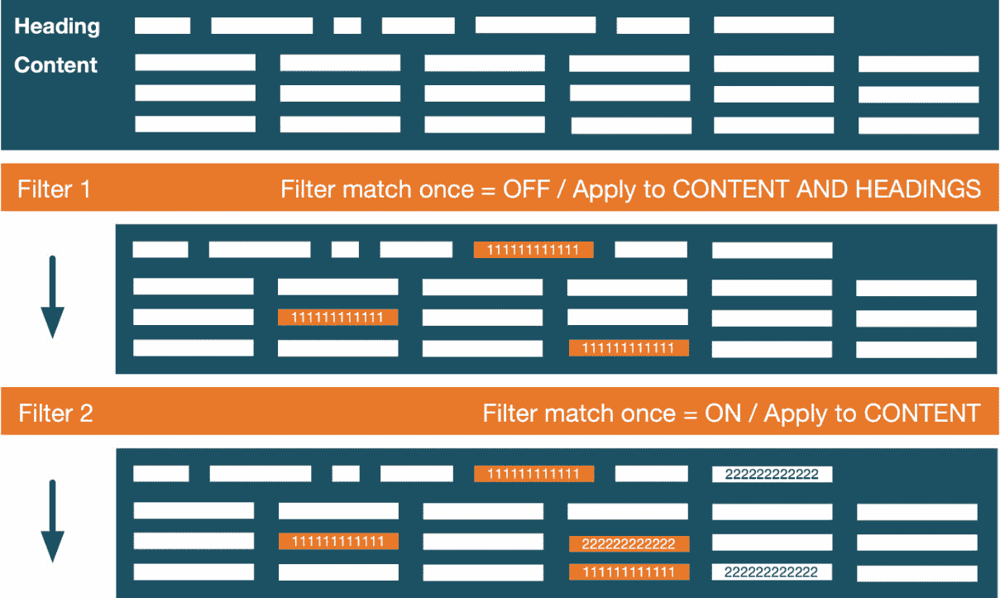

# 9

# 配置教育功能

Moodle 支持一系列需要管理员注意的工具和功能，有些只需要一次，有些则需要定期。由于配置区域数量众多，我们将主题分为教育和技术配置，每个都由专门的章节代表：


图 9.1 – 教育配置主题

本章处理配置教育设置。因此，我们将涵盖以下主题：

+   配置协作工具

+   配置内容创建功能

+   配置成绩和评估

+   管理技能和激励

配置教育设置通常需要来自领域专家的输入，例如课程规划者、内容创建者或评估者。与这些专家保持联系以确保 Moodle 系统的最佳设置已被证明是有益的。

到本章结束时，您应该能够向同事提出正确的问题，并实施他们的要求。

# 配置协作工具

Moodle 的许多优点之一是其内置的对学习者和教师之间协作的支持。这包括几个协作课程活动，如**论坛**、**维基**、**词汇表**和**数据库**，以及在组模式下运行活动的功能，以及对分组的支持。此外，Moodle 中有三种社交工具需要管理员进行配置：**博客**、**评论**和**标签**。我们将在以下小节中讨论这些内容。

## 配置博客

Moodle 提供给用户的一个博客机制允许他们创建与课程相关的个人和公开条目和帖子。

重要提示

博客是用户表达自己的方式，无论是以学习日志的形式还是作为个人事件的个人账户。

作为管理员，您必须确保在**网站管理** | **常规** | **高级功能**中**启用博客**被打开。接下来，您应该导航到**网站管理** | **外观** | **博客**来配置以下设置，这些设置适用于所有博客用户：


图 9.2 – 配置博客

您应该仔细检查以下四种类型的设置：

+   `moodle/blog:associatecourse`和`moodle/blog:associatemodule`功能。

+   **博客可见性**：您在这里的选择取决于您组织的政策以及博客作为学习过程一部分的使用方式。

+   **外部博客**：Moodle 支持外部博客，如 WordPress 博客。如果启用，用户可以通过**偏好设置**菜单中的**注册外部博客**链接链接外部博客。条目将显示为似乎已在 Moodle 博客中输入，但不能进行修改。

+   **博客评论**：如果启用，其他人可以对博客文章进行评论；例如，教师可以在日记条目上留下私人或公开的反馈。您还可以进一步指定是否应显示评论计数。

我们刚刚在博客中遇到了评论，这是第二个需要配置的协作工具。

## 配置评论

Moodle 附带了一个通用的评论功能，与博客工具中的功能独立。它允许您在任何系统上下文中放置**评论**块，例如在课程或单个活动中。

重要提示

评论是可以附加到各种 Moodle 工件上的备注。

此功能默认启用，但可以通过**站点管理** | **常规** | **高级功能**下的**启用评论**参数进行禁用。

有几个区域可以设置额外的评论相关设置；例如，当它们包含在备份中或由某些活动支持时。您还可以通过转到**报告** | **评论**来查看报告，您将看到系统中的所有评论。您可能需要经常检查，以防有任何冒犯或不适当的内容被输入。

您可以使用**搜索**框搜索`评论`来查看这些设置。像往常一样，这些选项可以通过相应的角色能力在本地进行覆盖。

Moodle 中的第三个也是最后一个协作活动是标签，我们将在以下小节中处理。

## 配置标签

标签是将关键词用于描述工件或用户的过程。然后利用这些标签进行搜索、共享和执行各种协作活动以匹配兴趣。

重要提示

标签是将关键词用于描述工件或用户的过程。

用户创建代表他们个人或教育兴趣的标签。然而，作为教育机构，您可能希望创建全站标签，这些标签可以与用户定义的标签一起使用，甚至限制标签为一系列标准标签。全局标签的例子包括与组织相关的关键词、您的实体专长的主题、公司运行的宣传活动以及与您的机构相关的新闻价值主题。

就像博客和评论一样，标签可以通过**站点管理** | **常规** | **高级功能**下的**启用标签功能**参数在整个站点上启用（默认）和禁用。以下图表说明了标签在 Moodle 中的组织方式：


图 9.3 – Moodle 标签

标签组织在**标签集合**中。一个标签属于一个集合；一个标签不能属于多个集合。有几个预定义的标签区域，每个代表支持标签的 Moodle 功能。每个**标签区域**都有一个相关的标签集合；一个标签集合可以与多个标签区域关联。要查看标签、标签区域和标签集合的实际操作，请导航到**网站管理** | **外观** | **管理标签**，在那里你会看到以下内容：


图 9.4 – 管理标签 I

屏幕顶部有两个标签集合，其中一个是通过**添加标签集合**链接添加的。要将标签集合与标签区域关联，你需要在标签区域表的相关列中选择它。**标准标签使用**设置指示在标签区域输入标签时如何处理标签：它们可以在开始输入时提出（**建议**），只能选择标准标签（**强制**），或者不显示任何标签（**不推荐**）。

禁用标签区域（通过标准眼睛符号）将完全隐藏此组件的打标签功能。例如，当关闭**用户兴趣**中的标签时，相应的条目将不再出现在用户资料中。

当你选择一个标签集合的名称时，你将看到该集合中所有的标签：


图 9.5 – 管理标签 II

对于每个标签，以下设置/操作都是可用的：

+   **标签名称**：当选择时，你会看到哪些用户被标记了这个标签。

+   **名字/姓氏**：标签创建者。

+   **计数**：这是标签在整个网站上被使用的次数。这将被用作**标签**块中标签云大小的依据。

+   **标记**：这显示了标签是否被标记为不适当，以及括号中的次数。

+   **修改时间**：这显示了标签最后被编辑的时间。

+   **标准**：标准标签对所有用户可用。

+   **编辑**：你可以更改标签的名称，更改其描述，并选择任何相关标签。

+   **删除**：这将从系统中删除该标签。

你可以通过**添加标准标签**链接添加标准标签。如果你发现任何应该合并的标签，例如当标签名称拼写错误时，请使用**合并所选**按钮并选择应该保留的标签。

如果你需要阻止用户打标签，你需要创建一个单独的角色并调整两个相关的能力，`moodle/tag:create` 和 `moodle/tag:edit`。如果你想保留用户创建标签时的原始大小写，确保在**网站管理** | **常规** | **安全** | **网站安全设置**下勾选了**保留标签名称大小写**。

这就结束了关于配置标签的子节，因此也结束了关于管理协作 Moodle 工具的章节。接下来是配置内容创建者所需的功能。

# 配置内容创建功能

课程作者高度依赖他们可获得的内容创建工具。Moodle 允许您使用内置工具创建内容，从外部应用程序中整合内容，并在内容项之间添加结构和条件。

在本节中，您将学习如何配置不同的内容创建功能，即内容库和 H5P、LTI 平台和工具、过滤器、抄袭预防以及许可证。首先，让我们配置一些通用的内容创建设置。

## 配置内容创建设置

一些网站范围的设置会影响内容创建，如下所示：

+   **要求活动描述**：活动和资源默认不需要描述。为了强制执行描述性解释，您必须在**网站管理** | **插件** | **活动模块** | **通用活动设置**中启用该参数。

+   **完成跟踪**：课程和活动完成允许作者为活动和课程设置完成标准。建议在**网站管理** | **常规** | **高级功能**中启用此功能，您还可以在此找到**默认完成跟踪**选项。

+   **限制访问**：在 Moodle 课程内，课程作者可以限制对单个活动或资源的访问。可以通过导航到**网站管理** | **插件** | **可用性限制** | **管理限制**来配置可用的限制类型：


图 9.6 – 管理可用性限制

您只能选择显示和隐藏每个限制；默认情况下，所有插件都已启用。某些限制需要其他元素存在或配置。例如，只有当组在特定课程中存在时，组别和分组才会出现在课程的**访问限制**中。请确保在**网站管理** | **常规** | **高级功能**中已开启**启用受限访问**。

一个流行的第三方可用性限制是**按语言限制**([moodle.org/plugins/availability_language](http://moodle.org/plugins/availability_language))，它将在第十章 *管理本地化*部分的*配置技术功能*中更详细地描述。

+   **隐形活动**：这些活动是可用的但不可见的，之前被称为孤儿活动。如果课程创建者希望隐藏活动并从其他地方提供链接，例如页面资源或文本块，这些活动很有用。

每个活动或资源在**网站管理** | **插件** | **活动模块**中都有一个设置页面。大多数设置是默认值，如果适用，通常还会伴随以下附加值状态：

+   **启用**：如果设置，则标准设置将被勾选；否则，将取消勾选

+   **高级**：如果设置，教师必须选择**显示更多…**链接才能查看它们，这适用于不常使用的设置

+   **锁定**：如果设置，教师无法更改设置；例如，如果您希望在整个系统中强制所有活动的描述

以下是从**作业**活动中摘录的示例，其中显示了右侧的所有三个状态：


图 9.7 – 启用、高级和锁定状态

一旦您检查并配置了这些通用课程和活动设置，我们就可以配置内容库（特别是 H5P）。

## 配置内容库和 H5P

H5P 允许课程创建者创建、分享和重用丰富、交互式且移动友好的 HTML5 内容。在 Moodle 中，已实现内容库以整合 H5P 内容，如下图所示：


图 9.8 – 内容库和 H5P

Moodle 支持内容集成的概念，其中每个集成都表示为一个单独的实体。在撰写本文时，仅实现了单个内容集成 – H5P。前往**网站管理** | **插件** | **内容库** | **管理内容类型**以管理内容集成。预计未来将在 [moodle.org/plugins/?q=type:contenttype](http://moodle.org/plugins/?q=type:contenttype) 发布更多类型。

每个内容集成包含一个或多个**内容类型**，其中每种类型代表一个功能。在 H5P 的情况下，您可以通过访问**网站管理** | **常规** | **H5P** | **管理 H5P 内容类型**来查看所有可用的内容类型：


图 9.9 – H5P 内容类型

H5P 内容可以通过不同的方式嵌入到课程中：

+   **直接通过 H5P 活动**：确保在**网站管理** | **插件** | **活动模块** | **管理活动**中启用了活动。

+   **在通过 Atto 编辑器编写的文本中**：确保在**网站管理** | **插件** | **文本编辑器** | **Atto HTML 编辑器** | **Atto 工具栏设置**中安装了**插入 H5P** 插件。

+   **使用表示 H5P 内容的 URL（默认情况下，来自 [h5p.com](http://h5p.com)）**：必须在**网站管理** | **插件** | **过滤器** | **管理过滤器**中启用**显示 H5P** 过滤器。

+   `.h5p` 存储在此。

+   **从存储库中**：H5P 内容是从存储库中复制或链接的。有关更多详细信息，请参阅*第十章*的*配置* *技术功能*部分中的*管理存储库*。

在**网站管理** | **常规** | **H5P** | **H5P 概览**中有一个简短的清单，其中包含到相应配置页面的链接，如下面的截图所示：


图 9.10 – H5P 概览

我们已经提到了前两个条目；最后一个条目 – `*`，触发`cron.php`，并将任何更改恢复到默认值。关于任务的内容将在*第十五章*的*计划任务*部分进行详细说明，*优化 Moodle 性能*。如果无法使用此计划任务，那么**网站管理** | **常规** | **H5P** | **管理 H5P 内容类型**允许您手动上传必要的文件。

H5P 代表在 Moodle 中存储、编辑和创建的交互式内容。另一种类型的内容集成是 LTI，将在下一个小节中讨论。

## 配置 LTI 平台和工具

根据 IMS，**学习工具互操作性**（**LTI**）是一个学习工具互操作性的标准，允许远程工具和内容集成到学习管理系统。Moodle 支持已弃用的 LTI 版本和最新的**LTI Advantage**（核心 LTI 1.3 捆绑了一些基本服务）。Moodle 可以作为 LTI 平台（外部内容可以在 Moodle 中使用）和 LTI 工具（Moodle 内容可以在其他 LTI 平台中使用）。

重要提示

旧版 LTI 使用术语**消费者**和**提供者**，而 LTI Advantage 使用**平台**和**工具**。

我们将使用这些新术语，从 Moodle 作为 LTI 平台操作开始。

### Moodle 作为 LTI 平台

为了使 Moodle 作为 LTI 平台，课程作者必须使用**外部工具**活动。以下图表展示了 Moodle（LTI 平台）和外部系统（LTI 工具）之间简化的数据流：


图 9.11 – Moodle 作为 LTI 平台 I

工具必须通过 URL 和一些凭证连接到 Moodle；后者可以是一个消费者密钥/共享密钥对、RSA 密钥或密钥集 URL。一旦建立连接，学习内容将通过上述外部工具活动嵌入。可能还会传输其他数据，通常是结果，通常会在成绩册中本地存储。

作为管理员，您必须配置外部内容提供者，这些提供者将随后出现在课程内的活动中的**预配置工具**下拉菜单中。前往**网站管理** | **插件** | **活动模块** | **外部工具** | **管理工具**，在这里您有多种选项来添加新的提供者：

+   **添加 LTI Advantage**：如果提供者支持此工作流程，请输入 **工具 URL**；您将被引导到工具注册页面，在那里您将完成注册步骤。

+   **添加旧版 LTI**：Moodle 支持已弃用的 LTI 版本；根据当前版本，可能需要提供密钥/密钥对（版本 1.1），或者启动类似于 LTI Advantage 的注册过程（版本 2.0）。

+   **手动配置工具**：如果前两种选项都不起作用，您必须手动提供工具参数。外部工具设置在 [docs.moodle.org/en/External_tool_settings](http://docs.moodle.org/en/External_tool_settings) 上有很好的文档说明。

添加的工具将首先处于待定状态，这允许您审查工具配置和授予的隐私和服务，并在通过 **管理预配置工具** 链接激活工具之前进行可能的修改。

重要提示

要使工具在活动选择器中作为一个单独的项目出现，将 **工具配置使用** 设置更改为 **在活动选择器中显示并作为** **预配置工具**。

在我们的演示系统中，已经成功注册了两个 LTI 工具：


图 9.12 – Moodle 作为 LTI 平台 II

现在我们已经配置 Moodle 作为 LTI 平台，让我们看看相反的情况，即 Moodle 是 LTI 工具，为其他系统提供内容。

### Moodle 作为 LTI 工具

对于 Moodle 作为 LTI 工具运行，了解外部平台（LTI 消费者）和 Moodle（LTI 生产者）之间的简化数据流至关重要，如下所示：


图 9.13 – Moodle 作为 LTI 工具 I

LTI 工具和 LTI 平台必须相互注册；它们实际上签订了一个安全合同，允许两个系统之间的通信和数据交换。内容（整个课程或单个活动）以及可选的成绩由 LTI 工具共享，并在 LTI 平台上使用。当两个 LTI 站点都是 Moodle 系统时，此过程与 Moodle 作为 LTI 平台的工作流程相同。为了使 LTI 平台的用户能够访问 LTI 工具中发布的内容，必须激活身份验证和注册机制。这两个步骤以及启用 Moodle 作为 LTI 工具的进一步配置在此处概述：

1.  前往 **网站管理** | **插件** | **身份验证** | **管理身份验证** 并启用 **LTI** 插件。

1.  前往 **网站管理** | **插件** | **注册** | **管理注册插件** 并启用 **发布为 LTI 工具**。在插件设置中配置用户默认值，使用您的详细信息。

1.  前往 **网站管理** | **插件** | **注册** | **发布为 LTI 工具** | **工具注册** 并选择 **注册** **平台**。

提供名称后，Moodle 将自动生成工具详情，这些详情必须输入到 LTI 平台中。一旦在平台上设置了工具，必须在**平台详情**选项卡上记录详细信息以完成注册。对于动态注册，这些信息将自动输入；对于手动注册，必须手动复制并输入。

在以下截图的右侧，我们注册了两个平台（一个激活状态和一个待定状态）。您可以在左侧看到动态注册和手动注册的工具详情：


图 9.14 – Moodle 作为 LTI 工具 II

1.  在课程内，教师可以通过**发布为 LTI 工具**发布内容（整个课程或单个活动）。在这里，必须配置成绩和用户同步。**用户同步模式**决定了如何处理远程用户的注册。

1.  当远程用户首次访问共享活动或课程时，Moodle 将使用现有账户或创建新账户。如何执行此用户账户配置（自动或用户提示）由**教师首次启动配置模式**和**学生首次启动** **配置模式**中的设置决定。

当教师在执行**步骤 4**和**步骤 5**时，他们通常需要帮助完成这一部分技术性的程序。前面的列表只是粗略地概述了使用动态注册时 LTI 工具的设置步骤。在[docs.moodle.org/en/Publish_as_LTI_tool](http://docs.moodle.org/en/Publish_as_LTI_tool)上，您可以找到关于其他 LTI 设置的非常详细的文档，例如手动注册、共享访问和用户配置，以及关于遗留 LTI 的信息。

小贴士

建议通过访问**站点管理** | **常规** | **安全** | **HTTP 安全**启用**允许框架嵌入**设置，以便工具在框架内显示而不是在新窗口中。

LTI 是一个强大的标准，它使您的 Moodle 系统能够对外部内容进行访问和授权。我们将在下一节中介绍过滤器，它们会转换您 Moodle 实例中的内容。

## 配置过滤器

过滤器会扫描通过 Atto 编辑器输入的任何文本，并将其自动转换为不同的形式，通常是更复杂的形式。例如，术语表中的条目或概念会在文本中自动创建超链接，指向 MP3 文件的 URL 将变成嵌入的音频播放器，数学方程式将以视觉公式表示，上传的视频将提供播放控制，等等。

Moodle 提供了几个过滤器，可以通过导航到**站点管理** | **插件** | **过滤器** | **管理过滤器**来访问：


图 9.15 – 过滤器配置

默认情况下，所有过滤器都是禁用的。您可以通过更改 `moodle/filter:manage` 能力来启用它们，该能力默认允许 **管理员** 和 **教师** 角色。

应在 LMS 中以及大多数用户使用的过滤器上启用。典型的候选者包括 **多媒体插件**、**显示 H5P**、**将表情符号显示为图像** 和 **多语言内容**。仅由一些用户使用的过滤器不应激活，但应在本地提供，例如 **TeX 符号**，以处理数学或科学符号。启用的过滤器也可能在活动级别暂时关闭，例如在线考试中的 **术语表自动链接**。激活某些过滤器可能会触发编辑器按钮的出现，例如 **将表情符号显示为图像**（表情符号选择）或 **TeX 符号**（方程式编辑器）。

您可以使用 **顺序** 列中的上下箭头更改过滤器应用于文本的顺序。如果某个过滤器不起作用，请尝试将其向上移动列表。

重要提示

过滤机制按先到先服务的原则操作；如果过滤器检测到需要转换的文本元素，它将在应用下一个过滤器之前进行转换。

每个过滤器都可以配置为应用于 **内容和标题** 或仅 **内容**；也就是说，过滤器将忽略活动模块的名称。

重要提示

将过滤器应用于标题以及内容可以显著增加服务器的负载，因此请谨慎使用。

一些过滤器提供设置，这些设置要么指示过滤器应应用于哪种文本格式，要么是特定于过滤器的；后者在各自的 Moodle Docs 中有详细描述。除了过滤器特定的设置外，Moodle 还提供了一些所有过滤器共用的设置。这些设置可以通过 **网站管理** | **过滤器** | **通用过滤器设置** 访问，如下所示：

+   **过滤器上传的文件**：默认情况下，只有通过 Moodle 编辑器输入的文本被过滤。如果您希望包括上传的文件，您可以从 **仅 HTML 文件** 和 **所有** **文件** 选项中选择任何一个。

+   **过滤器对页面匹配一次**：如果过滤器应在找到匹配项后停止分析文本，请启用此设置；即，只有第一次出现将被转换。

+   **过滤器对文本匹配一次**：如果过滤器应只为每个页面上的每个文本项中找到的第一个匹配文本实例生成单个链接，请启用此设置。如果启用了 **过滤器对页面匹配一次** 参数，则此设置将被忽略。

+   **过滤器在系统上下文中的导航**：过滤器是上下文相关的，当启用标题过滤时可能会引起性能问题。选择此选项应减少对页面的过滤操作次数。

以下图表总结了如何应用过滤器，考虑了过滤器的顺序、匹配方式和过滤器应用于哪些文本（内容和标题或仅内容）：



图 9.16 – 应用过滤器

**过滤器 1** 已关闭匹配（所有匹配项都被转换）并应用于内容和标题。**过滤器 2** 已开启匹配（只有第一个匹配项被转换）并且仅应用于内容；也就是说，标题中的匹配文本被忽略。

抄袭预防是内容创建主题列表中的下一个（长）需要管理员注意的话题。

## 配置抄袭预防

抄袭预防背后的理念是检查学生提交的内容与其他人的工作之间的重叠程度——重叠度越高，内容被抄袭的可能性就越大。这种检测可以是针对 Moodle 中的用户内容或通过公共资源。

必须通过在**站点管理** | **常规** | **高级功能**中选择**启用抄袭插件**参数来启用抄袭预防。一旦这样做，您可以在导航到**站点管理** | **插件** | **抄袭** | **管理** **抄袭插件**时访问任何已安装的抄袭预防插件。

在撰写本文时，大约有十几个插件可在 [moodle.org/plugins/?q=type:plagiarism](http://moodle.org/plugins/?q=type:plagiarism) 上找到，用于抄袭预防。最受欢迎的两个是 **Turnitin** 和 **Ouriginal**（之前称为 **Urkund**）。这两个系统都是商业工具，需要付费订阅。一旦安装和配置，抄袭预防功能将作为课程内**作业**和**论坛**模块的一部分提供。

另一个需要在站点和组织之间达成一致的话题是您的 Moodle 系统中可用的许可证；这是下一小节的主题。

## 管理许可

在通过**文件选择器**添加文件时可以选择许可证。然后，此信息将被附加到文件的元数据中。要配置用户可用的许可证，请转到**站点管理** | **常规** | **许可证** | **许可证管理器**，其中列出了所有可用的许可证：


图 9.17 – 管理许可

您可以通过**创建许可证**按钮创建新的许可证，在那里您必须提供以下信息：

+   **许可证简称**：内部许可证名称

+   **许可证全名**：显示许可证名称

+   **许可证来源**：可以找到许可证条款和条件的位置的 URL

+   **许可证版本**：正在使用的许可证版本的发布日期

许可证管理器可以手动编辑和删除添加的许可证；随 Moodle 一起提供的许可证则不能。除了默认站点许可证外，所有许可证都可以被禁用（隐藏）。

重要提示

附在上传文件上的许可证不会影响其可见性；它只是在其他地方重新使用时创建默认值。

您可以在“**网站管理**” | “**常规**” | “**许可证**” | “**许可证设置**”下选择“**默认网站许可证**”。默认情况下，用户最后选择的许可证在通过文件选择器上传文件时会被预先选中。如果禁用了“**记住用户许可证偏好**”设置，则默认网站许可证会被预先选中。

这部分关于内容创建功能的介绍到此结束，我们涵盖了配置内容库和 H5P、LTI 平台和工具、过滤器、抄袭预防以及许可证。到目前为止，我们忽略了一种特定类型的内容——评估及其评分，这将在以下专门章节中进行介绍。

# 配置成绩和评估

除了学习本身之外，评估在教育环境中是一个关键要求。Moodle 提供了一系列工具来促进形成性、中间和总结性评估，并处理随之而来的不可避免的成绩。

在我们处理评估之前，我们将在此部分介绍成绩册的管理元素，其中我们将介绍如何配置作业、测验和问题库以及 SCORM 包。

## 配置成绩和成绩册

成绩册是任何 LMS 中最重要结构之一，Moodle 也不例外。Moodle 成绩册是一个强大、灵活且准确的成绩管理系统。其灵活性和可定制性导致了一个非常高的复杂度。因此，您有相当多的管理设置可供使用，这些设置会影响教师、培训师和评估者在整个系统中使用成绩的方式。

大多数参数都与成绩册紧密相关，并且课程级别的教师处理相关的报告。对于您的组织，应实施关于成绩默认值和全局设置的网站范围协议。

重要提示

**成绩册**是一个容器，用于存储 Moodle 中所有学习者的成绩。

**成绩**是成绩册中的一个条目。

以下是对成绩和所有相关成绩册元素的高级概述：


图 9.18 – 成绩和成绩册

此外，每个设置的在线帮助都非常全面，正如在 Moodle 文档中的[docs.moodle.org/en/Grader_report](http://docs.moodle.org/en/Grader_report)所提供的配套区域一样，该区域包含了几页专门针对管理员的页面。我们只会简要描述“**成绩**”标签中的每个元素，并突出一些关键参数，如下所示：

+   **常规设置**: 这些参数影响成绩册和成绩。**启用发布**（通过外部 URL 发布结果的能力）是一个默认关闭的设置，并且需要定期启用。另一个经常更改的设置是**导航方法**，其中大多数用户更喜欢**标签页**选项，因为它与 Moodle 的其他部分保持一致。

+   **评分类别设置**: 成绩被组织到类别中；您可以在这里设置相关设置。可以通过成绩册的汇总系统利用不同的评分策略，例如总分或百分比类别。

+   **评分项设置**: 这些是影响单个成绩和评分项的设置。

+   **评分标准**: 在这里，您可以指定用于评分和评级的全局评分标准。全局评分标准通常与您组织提供的资格认证相关联。

+   **成果**: 成果被大多数职业教育和一些学术课程用于指定正在教授的学科预期的能力或目标。必须通过访问**网站管理** | **常规** | **高级功能**来启用成果。大多数组织更喜欢使用更强大的能力而不是成果。

+   **信件**: 许多教育体系使用字母（A，A-，B+，……，以及 F）来评定项目。在这里，您指定哪个百分比范围对应哪个评定字母。

Moodle 附带几个预定义的成绩册报告。**报告设置**确定报告的外观和内容。如果安装了额外的用户定义报告（插件），则此列表可能为每种报告类型（有关创建自定义报告的良好教程，请参阅[docs.moodle.org/dev/Gradebook_reports](http://docs.moodle.org/dev/Gradebook_reports)）提供一个单独的配置页面。不同的报告类型如下：

+   **评分者报告**: 此设置包括是否显示计算、显示或隐藏图标、列平均值等。教师可以在**我的报告****首选项**标签中覆盖大多数设置。

+   **成绩历史**: 成绩册跟踪对成绩册条目所做的所有更改。在这里，您可以指定页面上将显示多少条目。您可以通过访问**网站管理** | **服务器** | **清理**来**禁用成绩历史**。在同一页上，您还可以指定成绩历史应保留的时间长度（**成绩****历史寿命**）。

+   **概览报告**: 这包括两个设置，分别确定是否显示排名信息以及如何处理包含隐藏成绩的总数。

+   **用户报告**: 这显示了确定是否显示排名信息和如何处理隐藏项目的设置。

我们只是简要介绍了成绩册的定制选项，因为完整成绩册管理在很大程度上取决于您组织部署的评分策略。

接下来，我们将处理管理 Moodle 中最常用的三种评估工具：作业、测验和 SCORM。

## 配置作业

根据 MoodleDocs，**作业活动**允许学生将作业提交给教师进行**评分**。以下图表显示了简化的作业工作流程：


图 9.19 – 作业工作流程

作业工作流程包括以下三个步骤：

1.  当教师设置作业时，必须提供一系列作业设置，包括说明（**什么**）、各种可用日期（如开始日期、截止日期和截止日期）（**何时**）、提交类型、提交设置以及是否支持小组提交（**如何**），以及各种**其他**设置，例如通知。

1.  学生将通过所需的提交类型之一提交他们的工作：在线文本、上传的文件（夹）和/或辅助评论。

1.  最后，教师将通过支持的渠道之一提供反馈：评论、PDF 批注、离线评分表和通过文件提供的反馈。如前所述，任何给定的分数将自动转移到学生的成绩册以供审查。

需要管理员输入的元素包括作业设置、提交插件和反馈插件：

+   **作业设置**：在**网站管理** | **插件** | **活动模块** | **作业** | **作业设置**中，您应根据您的权限要求指定字段 - 例如，提交语句的措辞。在屏幕的第二部分，您可以指定作业活动的默认值。

+   **提交插件**：激活的提交插件决定了学生如何提交他们的工作。默认情况下，可用的选项包括在线文本、文件和评论。要配置每种类型，请转到**网站管理** | **插件** | **活动模块** | **作业** | **提交插件** | **管理作业提交插件**。

+   **反馈插件**：激活的反馈插件决定了教师如何评分、评级和评论提交的作业。默认情况下，可用的选项包括评论、PDF 批注、离线评分表和文件。要配置每种类型，请转到**网站管理** | **插件** | **活动模块** | **作业** | **提交插件** | **管理作业提交插件**。

可以在 [moodle.org/plugins/?q=
type:assignfeedback](http://moodle.org/plugins/?q=type:assignfeedback) 和 [moodle.org/plugins/?q=type:assignsubmission](http://moodle.org/plugins/?q=type:assignsubmission) 分别找到额外的提交和反馈插件。还可以安装其他插件，将上传的作业提交转换为 PDF 格式，以便教师进行批注。可用的转换器列表可在 **站点管理** | **插件** | **文档转换器** | **管理文档转换器** 中找到。在撰写本文时，有两个 **文档转换器** 作为标准插件可用：Google Drive（需要启用 OAuth 2 Google 服务）和 Unoconv（需要在服务器上安装 Unoconv）。

重要提示

为了使 PDF 注释正确工作，必须在 **站点管理** | **服务器** | **系统路径** 中设置 **ghostscript 路径**。

Moodle 中第二受欢迎的评估模块是测验活动，这是以下小节的主题。

## 配置测验

测验活动使教师能够创建包含各种类型问题的测验，包括多项选择、匹配、简答题、数值题和拖放题。

创建测验是一个两步过程。在第一步中，内容作者将问题填充到题库中。在第二步中，教师创建测验活动，设置其选项以指定与测验交互的规则，并从题库中添加问题。

重要提示

Moodle 将用于测验的问题存储在题库中。在题库中，问题被组织到类别中。

学习者可以在标准浏览器中参加测验，如果配置了，也可以在安全考试浏览器中参加。指定的问题行为决定了提交的问题如何处理。评分自动进行（除了论文类型问题），结果按常规推送到成绩册。以下图表显示了简化的测验工作流程：


图 9.20 – 问答流程

此过程的两个部分需要管理员进行配置：定制题库和测验活动以及启用安全考试浏览器。

### 定制题库和测验活动

Moodle 拥有一个功能强大的问题引擎，支持广泛的功能、问题类型和问题行为。这三个元素可以分别配置：

+   **题库功能**：在 **站点管理** | **插件** | **题库插件** | **管理题库插件**，您可以查看所有可用的题库功能。如果需要，您可以更改列排序顺序并添加问题自定义字段。

+   **问题类型**：在 **站点管理** | **插件** | **问题类型** | **管理问题类型**，您应该禁用任何未使用的问题类型，并可能需要更改多项选择题的默认值。

+   **试题行为**：在**网站管理** | **插件** | **试题行为** | **管理试题行为**中，你应该隐藏任何在您的组织中未使用的处理提交问题的方法。

在以下图中，你可以（希望）看到三个与问题相关的元素的部分：


图 9.21 – 试题库插件、试题类型和试题行为

在真正的 Moodle 风格中，所有三个结构都作为插件处理，并且可以向系统中添加额外的试题库插件、试题类型和试题行为。

还有一个设置你应该查看，即在**网站管理** | **插件** | **活动模块** | **测验** | **常规设置**中的**自动保存延迟**参数。指定的值决定了学生在测验尝试期间工作自动保存的频率。

重要提示

短暂的**自动保存延迟**会增加服务器负载，但减少了学生丢失工作的可能性。

此屏幕上的所有其他设置都是测验活动的默认值，无需进一步解释。安全考试浏览器通常在测验用于考试时使用，如以下小节所述。

### 启用安全考试浏览器

**测验**活动常用于考试。根据物理设置和考试的重要性，可能需要不同级别的安全性。**测验**活动在**尝试的额外限制**部分提供一些内置设置：

+   **要求密码**：在授予测验访问权限之前必须输入密码

+   **要求网络地址**：测验访问权限仅限于您局域网或互联网上指定的 IP 地址（们）

+   **浏览器安全**：当启用**全屏弹出带有一些 JavaScript 安全**选项时，测验只能在启用 JavaScript 的浏览器中运行，以全屏显示，并且在技术上可能的情况下，禁止某些操作，如复制和粘贴

如果这些设施不足以满足特定的考试设置，无论是基于课堂的还是在线监考的，Moodle 提供**安全考试浏览器**（**SEB**）支持。根据其网站[safeexambrowser.org](http://safeexambrowser.org)，SEB 如下：

“一个安全的网络浏览器环境来执行电子评估。该软件将任何计算机临时转变为安全工作站。它控制对系统功能、其他网站和应用程序等资源的访问，并在考试期间防止使用未经授权的资源。”

以下示意图显示了 SEB 与 Moodle 的架构和组件（部分借鉴自[safeexambrowser.org](http://safeexambrowser.org))：


图 9.22 – 安全考试浏览器架构和组件

**亭台应用**锁定电脑或平板电脑，并启动 SEB 以及可选的第三方应用程序。**配置**文件指定浏览器的行为，例如禁用功能，如快捷键、停止音频或隐藏屏幕元素，以及可以启动哪些外部应用程序。**SEB 浏览器**使用预设的 URL 加载并显示 Moodle 测验，并隐藏任何导航元素，如地址栏、搜索引擎字段等。**SEB 插件**是 Moodle 的扩展，用于简化 SEB 与**测验**活动之间的交互。

从 Moodle 管理员的角度来看，您需要配置以下组件以确保测验的 SEB 支持：

+   **安全考试浏览器模板**：一个 SEB 模板实际上是一个配置文件。创建 SEB 文件的最简单方法是创建一个测验，手动配置 SEB 设置，然后下载配置文件。然后，转到**网站管理** | **插件** | **活动模块** | **测验** | **安全考试浏览器模板**，在那里您可以创建新的模板（使用下载的 SEB 文件）并管理现有的模板：


图 9.23– 安全考试浏览器模板

任何启用的 SEB 模板都将可在**测验**活动中使用。

+   **安全考试浏览器访问规则**：在**网站管理** | **插件** | **活动模块** | **测验** | **安全考试浏览器访问规则**中，您可以指定几个通用 SEB 设置，所有这些设置都在[docs.moodle.org/en/Safe_Exam_Browser](http://docs.moodle.org/en/Safe_Exam_Browser)中得到了很好的文档记录。

重要提示

SEB 要求学生在自己的电脑或平板电脑上下载浏览器。在重要考试前几分钟进行试运行，以避免恐慌发作是推荐的。

Moodle 中第三种流行的评估模块是 SCORM 活动，这是下一个小节的主题。

## 配置 SCORM

**可共享内容对象参考模型**（**SCORM**）是跨不同学习管理系统交换学习对象的既定标准。像作业和测验一样，SCORM 包通过专用活动集成到课程中。与其他两种评估工具不同，SCORM 活动需要很少的管理员配置。

在**网站管理** | **插件** | **活动模块** | **SCORM 包**中，有两种类型的参数：

+   **默认设置**：这些已被分为三个类别（显示、评分和其他），并在[docs.moodle.org/en/SCORM_settings](http://docs.moodle.org/en/SCORM_settings)中详细描述。

+   **管理员设置**：前四个设置直接影响用户可用的功能，并且默认情况下都是禁用的。SCORM 标准模式强制与版本 1.2 的严格兼容性，而其他三个设置允许/禁止不同类型的包：


图 9.24 – SCORM 配置

剩余的行政设置显示内部数据（会话、超时、用户 ID）或调试功能。只有当您的用户在使用 SCORM 包时遇到技术问题时，才调整这些设置。

这完成了关于配置作业、测验和 SCORM 的设置部分。其他活动被归类为教育性活动，如书籍、数据库、研讨会和词汇表，这里没有涉及。几乎所有行政设置都是默认值、外观设置或文件上传限制。Moodle 管理员棘手的工作是找到所有员工对这些参数达成共识。我们建议除非有具体要求调整它们，否则将这些与活动相关的设置保留在默认值。

技能和激励与评估密切相关，我们将在下一节中讨论。

# 管理技能和激励

技能和激励是每个评估策略的核心。由于 Moodle 是现代学习环境的一个战略构建块，我们认为这两个概念值得一个专门的章节。

重要提示

**技能**是执行特定动作以解决给定问题的能力。在 Moodle 中，技能以能力的形式表示。

**激励**是获取技能的动机。在 Moodle 中，激励以成绩、反馈、徽章和证书的形式表示。

我们现在将重点关注 Moodle 提供的三个技能和激励工具，如下所示：


图 9.25 – Moodle 技能和激励

图表左侧部分涵盖了不同级别（如活动和课程，或 Moodle Workplace 中的项目和认证）的完成情况，以**成就**的形式呈现。各种组件支持一系列奖励机制；例如，在测验中获得一定数量的分数后附加一个**能力**，完成课程时颁发一个**徽章**，或在完成项目后颁发**证书**。

本节重点介绍上述组件（能力、徽章和证书）的行政任务。

## 管理能力

能力描述了学习者在特定学科相关技能中的熟练程度或理解水平。Moodle 拥有强大的能力管理功能，完全支持建模和颁发能力。能力的主要组件和颁发机制如下图表所示：


图 9.26 – Moodle 能力

**能力**具有特定的属性，例如名称、尺度（例如，不具备能力、在指导下具备能力、具备能力），所属的能力框架，以及用于构建能力层级的父能力。能力通常与课程和/或活动的完成情况相关联。能力可以是分配给用户或群体的**学习计划**（模板）的一部分。Moodle 支持不同的奖励机制，即完成后的**自动**奖励，在提供额外**证据**后的**审查**过程，或**手动**奖励。在 Moodle Workplace 中，能力也可以通过动态规则进行奖励，其中能力可以通过规则操作进行配置。

关于能力的详细信息可以在[docs.moodle.org/en/Competencies](http://docs.moodle.org/en/Competencies)找到。我们将重点关注如何建模能力和配置奖励机制的主要机制，因为这是在网站范围内进行的，因此需要管理员权限。

我们将使用**欧洲共同参考框架**（**CEFR**）作为示例能力框架，因为它在欧洲以及越来越多的其他国家被用来衡量学习者的语言技能集。首先，您需要在**站点管理** | **常规** | **能力** | **能力框架**处创建一个能力框架，如下面的截图所示：


图 9.27 – 能力框架

为了简化，我们已经从公共 Moodle**能力框架存储库**（通过顶部的相应按钮）导入了**CEFR**框架。以下截图显示了框架及其能力（**A1**、**A2**、**B1**、**B2**、**C1**和**C2**），以及其子能力：


图 9.28 – CEFR 能力框架

一旦在能力框架中建模了能力，下一步就是配置如何奖励用户，一旦他们熟练掌握了要获得的能力。关于如何奖励学习者能力有两种选择：

+   通过**课程和活动完成**，通过完成定义的任务来实现熟练度。最直接的选择是能力**完成**，这标志着用户实现能力的流程结束。附加**证据**允许用户提交在 Moodle 之外接受的培训的证明 – 例如，指向公开网络研讨会或外部研讨会参与证书的链接。最后一个选择是学习者请求指导员的**审查**。

作为管理员，您不需要配置课程和活动完成情况，因为教师或课程作者会这样做。所需的所有内容都是能力框架内的上述能力。

+   通过**学习计划**，确保用户群体达到胜任力水平——例如，所有数据保护官员。**学习计划**是一种确保所有学习者基于他们的目标和培训需求进行有针对性的学习，并且以基于学习计划模板的结构化方式提供，这些模板本身基于胜任力。您可以根据学习计划模板创建学习计划，无论是手动为单个用户创建，还是通过群体自动创建。

重要提示

学习计划模板定义了一组分配给用户的胜任力。

前往**网站管理** | **常规** | **胜任力** | **学习计划模板**，并选择**添加新学习计划模板**按钮以添加学习计划模板。我们已经创建了一些模板，如下面的截图所示：


图 9.29 – 学习计划模板

当您选择学习计划模板时，您将看到已经熟悉的胜任力视图，并且还有通过**添加胜任力到学习计划模板**按钮添加更多胜任力的选项。

一旦学习计划模板完成，您可以通过**编辑**菜单中的**创建学习计划**选项逐个创建个人学习计划，或者通过**添加群体以同步**自动创建。用户可以通过他们各自的用户资料中的**学习计划**链接查看他们的学习计划，在那里他们也有提供先前学习证据的选项——例如，先前学习的文件记录。

Moodle Workplace 通过动态规则支持第三种选项，根据灵活的准则颁发胜任力，例如群体成员资格。这种颁奖机制在[docs.moodle.org/en/Dynamic_rules](http://docs.moodle.org/en/Dynamic_rules)中有详细描述。

这就结束了我们对 Moodle 强大且灵活的胜任力实施的快速概述，其中包括了建模胜任力框架和通过活动和课程完成以及通过学习计划配置颁奖机制。接下来是第二种激励类型：徽章。

## 管理徽章

徽章是庆祝成就和展示学习进步的好方法。Moodle 允许您管理徽章，并提供不同的方式来颁发徽章。Moodle 徽章与 Open Badges 完全兼容，并可以发布在任何 Open Badges 兼容的背包中。

徽章是根据各种选择的准则颁发的，并将显示在用户的个人资料上。徽章的主要组成部分和颁发机制在以下图中展示：


图 9.30 – Moodle 徽章

徽章具有特定的属性，如名称、过期日期和颁发者。此外，徽章有一个或多个需要满足以触发其授予的**标准**。某些标准仅存在于**课程级别**，而其他标准存在于**网站级别**。**授予**本身是自动的，除了手动分配。

关于徽章的详细信息可以在[docs.moodle.org/en/Badges](http://docs.moodle.org/en/Badges)找到。我们现在将关注徽章管理和授予的主要机制。

一旦你或你营销部门的一些有创意的年轻人创建了要授予学习者的徽章，你将需要在你的学习管理系统内添加和管理这些徽章。在 Moodle 中，有两种类型的徽章：

+   **课程徽章**是在课程级别分配的，与课程内的活动和完成情况相关

+   **网站徽章**是在整个网站上分配的，与成就相关，例如在 Moodle 中完成一系列课程或在 Moodle Workplace 中的认证

作为管理员，你只关心网站徽章，这些徽章在**网站管理** | **常规** | **徽章** | **管理徽章**下管理。一旦你添加了徽章并提供了其属性，你必须指定**徽章标准**。有不同类型的课程徽章标准和网站徽章标准，如下面的截图比较所示：


图 9.31 – 课程徽章标准与网站徽章标准对比

以下徽章标准可供选择：

+   **课程完成**（课程）：用户已完成了当前课程

+   **已授予徽章**（两者）：用户已被授予所选徽章（们）

+   **能力**（两者）：用户已被授予所选能力

+   **手动按角色发布**（网站）：由网站或课程中具有特定角色的用户手动授予

+   **完成一系列课程**（网站）：用户已完成了所选课程（们）

+   **个人资料完成**（网站）：用户个人资料字段具有特定值

+   **班级成员资格**（网站）：用户是所选班级（们）的成员

就像能力一样，关于如何向学习者授予徽章有两个选项：

+   **自动**: 所有先前的标准，除了**手动按角色发布**，都会触发向成功满足相应标准的用户授予徽章

+   **手动**: 当选择**手动按角色发布**标准时（仅限网站徽章），具有正确权限的用户可以向其他用户授予徽章

在 Moodle Workplace 中，徽章也可以通过动态规则授予，其中徽章可以通过规则操作进行配置。这种授予机制在[docs.moodle.org/en/Dynamic_rules](http://docs.moodle.org/en/Dynamic_rules)中详细描述。

用户可以在他们的用户资料**徽章**部分查看他们已授予的徽章。

这完成了我们对徽章的简要介绍，其中我们涵盖了 Moodle 的管理和奖励机制。接下来是第三种也是最后一种激励类型：证书。

## 管理证书

证书是正式和非正式培训的绝佳激励措施。然而，在撰写本文时，它们（尚未？）是 Moodle 的一部分，但它们是 Moodle Workplace 的一部分。然而，该模块在 Moodle 中运行得毫无故障。我们在*第八章*，*理解 Moodle 插件*中安装了**Workplace 证书管理器**。Moodle HQ 开发了此插件，因此可以安全地假设它将保留。一如既往，我们将专注于工具的管理元素。您可以在[docs.moodle.org/en/Certificates](http://docs.moodle.org/en/Certificates)找到完整的文档。

证书管理器允许您设计引人入胜的证书，并以不同的方式将其授予用户。该工具包含一个证书生成器，它允许您设计模板，以便可以颁发文凭或参与证书。基本工作流程如下所示：


图 9.32 – 基本证书工作流程

**证书模板**充当蓝图，包含**静态元素**（组织名称或标志）、**动态元素**（用户名或认证标题）和**验证元素**（代码或数字签名）。基于模板，将生成并分配给用户的单个**证书**，这可以手动完成或通过课程证书活动完成。Moodle Workplace 还支持通过动态规则颁发证书。

我们将主要处理证书模板管理的基础知识，因为教师或讲师通常通过上述课程证书活动来触发奖励。大部分内容都是从*第七章*，*使用 Moodle Workplace 的企业学习*，由 Packt Publishing 出版的*技能与激励*中借用的。

您可以通过**站点管理** | **常规** | **证书** | **管理证书模板**来管理证书模板，在那里您将看到一个证书模板列表。在我们的演示实例中，我们已经创建了三个证书模板。在每个项目的右侧，您将看到几个操作，其中一些是常用的 Moodle 图标（**编辑**、**详情**、**预览**、**复制**和**删除**），而其他则是特定于证书的（**已颁发证书**和**颁发证书**）。我们将在适当的时候讨论这些内容：


图 9.33 – 证书模板

要创建一个新的证书模板，请选择**+ 新证书模板**按钮；然后您将看到一个弹出窗口和以下大部分自解释的设置：

+   **名称**：这不必是唯一的，但建议不要重复使用相同的名称。

+   **课程类别**：证书在所选课程类别中可用；如果启用选项，它也在**子类别和课程**中可用。如果没有选择课程类别，证书将在整个网站上可用。

+   **页面宽度**和**页面高度**：默认值取决于您的服务器区域设置。为了参考，A4 的尺寸为 297 毫米和 210 毫米；信纸尺寸的分别是 279 毫米和 216 毫米。

+   **左页边距**和**右页边距**：这些是左和右边缘的宽度，单位为毫米。默认值为 0。

保存证书模板后，您将被定向到证书设计师，这是我们接下来要工作的。

### 证书设计师

**证书设计师**允许您交互式地创建多页、多语言的证书模板。已经（设计得非常糟糕）设计的证书画布具有以下用户界面：


图 9.34 – 证书设计师

证书设计师中可用的以下控件：

1.  **向证书模板添加元素**。这些将在后面介绍。

1.  **添加新页面**。您将需要设置页面高度和宽度，以及页面边距。默认值是当前页面的值。

1.  **展开**和**折叠**当前页面。

1.  **页面操作**。在这里，您可以选择**向上/向下移动**（仅限多页证书），访问各种**设置**（页面尺寸），以及**删除**（仅限多页证书）。

1.  **证书画布**，完全支持拖放元素。

一旦将一些元素添加到模板中，每个项目将列在左侧。每个项目可以通过元素名称旁边的**行内编辑**选项或简单地单击标签来重命名。**设置**符号打开每个项目的参数弹出窗口，而**删除**图标删除条目。使用标准**移动**图标更改元素顺序将改变哪个元素显示在另一个元素之前。

小贴士

要修改元素值，只需在画布上单击元素。

现在，让我们来看看可以添加到证书模板中的不同元素。

### 添加证书元素

要向证书模板添加元素，从**添加元素**下拉菜单中选择它，该菜单打开一个包含元素选项的弹出菜单。每个元素包含以下设置：

+   **元素名称**：在编辑证书时用于标识元素。请注意，这不会在证书上显示。

+   **元素特定设置**：这些选项大多可以自我解释，取决于添加的元素类型。例如，文本字符串有字体和大小，而日期字段也有格式。

+   **元素尺寸**：每个元素都有一个**宽度**，而一些元素（例如，图像）还有一个**高度**。

+   **元素位置**：当您选择**显示更多…**时，将显示另外两个设置——**位置 X**和**位置 Y**，其顶点位于证书模板的左上角。通常，您通过拖放将图像放置在画布上；然而，有时手动定位元素很有用，尤其是当您需要水平或垂直对齐多个项目时。

我们已将可用的元素特定证书设置分为三个类别——静态、动态和验证，这些将在以下小节中介绍。

#### 添加静态证书元素

**静态元素**对于从证书模板发布的每个证书都是固定的，并且它们将在生成的每个证书上都是相同的。可用的三个静态元素是**边框**、**图像**和**文本**：

+   **证书边框**是画布上唯一不能移动的元素。

+   您需要上传一个在其他地方准备的**证书图像**。支持的图像文件类型有 GIF、JPE、JPG、JPEG、PNG、SVG 和 SVGZ。或者，您可以选择一个**共享图像**，它由中央管理，并作为在多个证书上使用的资产的简单存储库；例如，您的公司标志或证书签署者的签名。您可以通过访问**站点管理** | **常规** | **证书** | **证书图像**来管理共享图像。如果您勾选**用作背景图像**框，图片将拉伸至整个证书并显示在其他所有元素之后。建议您使用添加了透明度的图像作为背景。

+   **证书文本**实际上是一个标签，您可以指定**字体**、**大小**（以**pt**为单位）和**颜色**。您还有三个**文本对齐**选项：**左对齐**、**居中对齐**和**右对齐**。文本右对齐意味着元素的坐标**位置 X**和**位置 Y**将指向文本框的右上角；在居中对齐中，它们将指向顶部中间，而在左对齐中，它们将指向顶部左角：


图 9.35 – 证书文本元素

文本支持多语言内容，可以通过所谓的 lang 标签生成用户语言的证书。请确保在**站点管理** | **常规** | **证书** | **证书设置**中勾选**在用户语言中发布证书**设置，启用多语言内容过滤器，并且文本字段包含多语言标签。这个通用功能将在*第十章*的*管理本地化*部分中处理；您可以在示例截图中看到一个简要示例。

现在我们已经添加了所有必需的静态元素，即**边框**、**图片**和**文本**，让我们来看看可以在证书模板上放置的不同动态元素。

#### 添加动态证书元素

**动态元素**将被替换为从证书模板发出的每个证书的具体数据。因此，每个动态元素在证书模板上充当一个迷你占位符。典型的动态值包括接收者的姓名、课程标题，或者简单地是证书将颁发的日期。可用的四个动态元素是**日期**、**动态字段**、**用户字段**和**用户图片**：

+   **证书日期**元素将日期字段添加到模板中，可以是**颁发日期**（PDF 生成时）或**过期日期**（证书有效期结束）。您还可以从七个可用的**日期格式**选项中选择。请注意，在编辑证书模板时，**日期格式**选项将根据活动语言包进行调整。虽然您可以在证书模板上放置的日期元素数量没有限制，但通常只放置一个项目在文档上。

+   **证书动态字段**元素类型实际上是为几个课程字段提供了一个占位符：简称、全名、URL、完成成绩，以及如果有，自定义课程字段。在我们的示例中，我们选择了课程的全名，它将在生成的 PDF 上显示。在 Moodle Workplace 中，您还可以使用额外的计划和认证字段。

+   **证书用户字段**在证书上显示文本信息，支持用户资料中的所有纯文本字段（即，没有富文本/HTML 文本字段），包括自定义资料字段。我们在我们的证书上添加了用户的全名，这通常是个性化证书的一部分。

+   **证书用户图片**类型将用户的图片添加到模板中。用户图片的处理方式与**图片**类型的元素相同；唯一的区别是图片不能选择，因为它已经在用户资料中设置好了。

这部分内容是关于动态证书元素的子节，我们涵盖了**日期**、**动态字段**、**用户字段**和**用户图片**。接下来是验证元素。

#### 添加验证证书元素

在证书的有效性至关重要的设置中，证书通常会被定期颁发；例如，文凭、合规文件和资格凭证。为了确保证书是由 Moodle 系统生成的，提供了两种验证机制：

+   **证书代码**：每个颁发的证书都包含一个唯一的**代码**，由 10 位数字加上两个大写字母组成；例如，0123456789AB（最后两个字母是用户的首字母）。此代码可以以四种不同的格式显示在证书上：**仅代码**（默认），**带链接的代码**，**验证 URL**（不带链接的代码），以及**二维码**（如我们示例中所示）。

要验证证书的有效性（代码），Moodle 提供了一个专用表单，可以通过四种描述的显示选项之一访问。也可以通过**站点管理** | **常规** | **证书** | **验证证书**手动输入代码，如下面的截图所示：


图 9.36 – 证书验证

一旦选择**验证**，将显示有关证书元数据的信息。您还可以通过选择底部的**查看证书**链接来访问文档的 PDF 版本。

+   **数字签名**可以根据遵循 X.509 标准的自签名 CRT 证书添加到证书（模板）中。它们通过使用自签名证书电子签名生成的 PDF 文件来防止伪造和证书的篡改，比代码元素提供更高的安全性。

在文档中使用标志、签名或印章来签署图像是很常见的，尽管创建没有文档可视化的已签署 PDF 文件也是可能的。唯一必填字段是数字签名本身，表示为 CRT 文件。您要么必须使用您组织中的现有 CRT 文件，要么生成一个自签名证书。通过 Linux 命令行执行以下三个步骤：

```php
openssl req -x509 -nodes -days 365000 -newkey rsa:1024 -keyout moodle.crt -out moodle.crt
openssl pkcs12 -export -in moodle.crt -out moodle.p12
openssl pkcs12 -in moodle.p12 -out moodle.crt -nodes
```

第一个命令创建了一个有效期为 10 年（365,000 天）的自签名签名，使用 1,024 字节的 RSA 加密，包含私钥和证书部分。第二步是在将其转换为 PEM 文件之前，导出 CRT 文件。您需要提供 CRT 文件——在这里是`moodle.crt`——到您的证书上的数字签名，该签名使用标准密钥部分来标记证书为有效并可验证。内部，PDF 生成器使用 TCPDF 库的功能。

有了这些，我们已经列出了支持的证书元素，所有这些都在我们的示例证书中得到了应用，如下面的图所示：


图 9.37 – 证书元素

默认情况下，所有可用的证书插件按字母顺序显示在证书设计器菜单中。如果您希望更改元素的顺序或隐藏在您的组织中未使用的任何元素，请转到**网站管理** | **插件** | **管理工具** | **管理证书元素插件**并按需配置列表。开发人员还可以创建新的证书元素插件，这些插件将出现在此列表中，并像核心元素一样处理。

现在我们已经处理了创建证书模板的问题，让我们来看看证书颁发的管理任务。

### 颁发证书

证书的关键目标是当用户完成特定任务或解决给定问题时颁发给他们。证书可以手动颁发或通过课程证书活动颁发。

要**手动颁发证书**，您必须选择证书模板右侧的**从此模板颁发证书**图标。这将打开一个弹出表单，您必须至少选择一个用户，并且可选地指定到期日期或期限。在下面的屏幕截图中，已选择了两个用户：


图 9.38 – 手动颁发证书

对于每张颁发的证书，无论其生成方式如何，元数据都将存储在底层 Moodle 数据库中。选择证书模板旁边的**已颁发证书**图标以查看这些数据。除了自解释的标准字段外，表格还显示了证书代码和验证页面的链接。在**操作**列中，可以查看生成的 PDF 文件的**预览**，可以即时重新生成 PDF 文件并将其重新颁发给用户（奖项日期和时间保持不变），并且可以撤销证书。

要使用**课程证书活动**，您必须从[moodle.org/plugins/mod_coursecertificate](http://moodle.org/plugins/mod_coursecertificate)安装**mod_coursecertificate**模块。此活动允许教师从证书模板中选择。然后，学习者可以自行下载证书的 PDF 副本，并且有自动发送 PDF 副本的选项。由于所有这些操作都在课程级别进行，因此作为管理员，您不必担心这一点。有关此活动的更多详细信息，请参阅[docs.moodle.org/en/Course_certificate_activity](http://docs.moodle.org/en/Course_certificate_activity)。

最后，一个与证书相关的管理设置可能也很有用：用户可以在其用户资料的**我的证书**页面查看他们的证书。如果**在 LinkedIn 上显示**选项在**网站管理** | **常规** | **证书** | **证书设置**中被勾选，则将显示一个额外的列，标记为**在 LinkedIn 上分享**。当用户选择 LinkedIn 图标时，证书将被添加到他们的动态中。您需要遵循显示的说明来接收用于此功能的**LinkedIn 组织 ID**。

这完成了我们对本章所涵盖的三种技能和激励的审视，其中我们涵盖了能力管理、徽章配置以及创建和颁发证书。

# 摘要

本章向您介绍了如何管理任何被归类为教育类的 Moodle 工具和功能。

首先，我们在介绍博客、评论和标签时配置了协作工具。接下来，我们处理了各种内容创建功能，并查看了 Moodle 内容库和 H5P、LTI 平台和工具、过滤器、抄袭预防以及许可证。然后，我们配置了成绩和评估，即成绩册和三种活动类型的配置——作业、测验和 SCORM。最后，我们以能力、学习计划、徽章和证书的形式管理技能和激励。

现在，您应该能够向所有组织利益相关者提出相关意见，以确保教育组件的适当设置。

由于配置区域数量众多，我们将配置主题分为两个单独的章节——教育配置，这是我们本章处理的，以及技术配置，我们将在下一章中介绍。
