# 10

# 配置技术功能

Moodle 支持一系列需要管理员注意的工具和功能——有些只需要一次，有些则需要定期。由于配置区域数量众多，我们将此主题分为教育和技术配置，每个配置都由专门的章节代表：

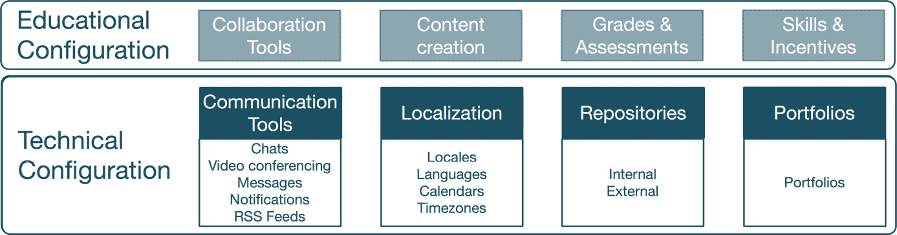

图 10.1 – 技术配置主题

本章涉及配置技术设置。

首先，我们将配置同步和异步**通信工具**，涵盖聊天、视频会议（BigBlueButton）、消息（消息和通知）以及 RSS 源。

接下来，我们将学习如何配置**本地化**功能，同时处理表示为语言包、多语言、日历和时区的不同地区。

然后，我们将配置内部和外部**存储库**，使用户能够通过文件选择器将文件添加到课程和其他位置。

最后，我们将配置**投资组合**，允许数据导出到外部（投资组合）系统。

在本章中，我们将涵盖以下主题：

+   配置通信工具

+   管理本地化

+   管理存储库

+   管理投资组合

配置技术设置通常需要其他技术人员的输入，例如邮件、系统或网络管理员。与这些专家协商以确保 Moodle 系统的最佳设置已被证明是有益的。

到本章结束时，你应该能够接近你的同事，收集所需的技术信息，并相应地实施。

# 配置通信工具

通信是 Moodle 的一个关键功能，因为它增强了所有参与用户的学学习体验。Moodle 支持同步和异步通信，这需要管理员进行配置，也是本节的主题。我们还增加了一个关于联系支持的小节，因为在 Moodle 管理环境中，它被视为一个相关的通信主题。让我们从同步通信开始。

## 同步通信

我们将在 Moodle 中介绍两种同步通信类型：**即时消息**和**网络会议**，这两种通信方式将在以下子节中进行讨论。

### 配置即时消息（聊天）

Moodle 内置的即时消息功能是**聊天**活动，它用于课程或主页上。该模块的配置以 Moodle 聊天形式呈现——我忍不住要这么做：

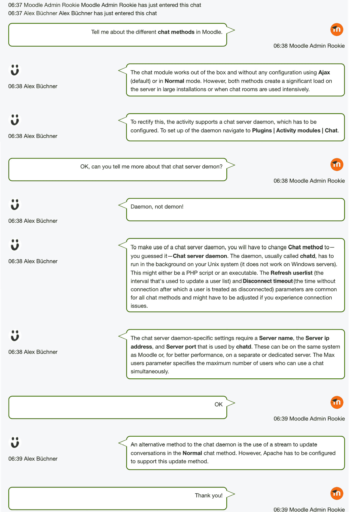

图 10.2 – 聊天配置

当大量使用时，**聊天**活动会显著影响服务器性能。我们在*第十五章*的[*优化 Moodle 活动*](https://wiki.example.org/Optimizing_Moodle_activities)部分中提出了一些聊天优化策略，*优化* *Moodle 性能*。

**聊天**活动足以满足基本的团体交流；然而，对于更高级的协作活动，需要使用网络会议工具，我们将在下一小节中介绍。

### 设置网络会议（BigBlueButton）

由于 COVID-19 大流行使得居家办公成为新常态，网络会议已成为每个工作和学习环境中的必需品。典型需求包括用于直播在线课程、虚拟办公时间或与远程学习者进行团体协作的会议室。

**BigBlueButton**（**BBB**）是一个开源的网络会议系统，用于在线学习。根据其网站 [www.bigbluebutton.org](http://www.bigbluebutton.org) 的描述，其关键特性是“*实时共享音频、视频、演示文稿和屏幕 – 以及聊天（公共和私人）、白板、共享笔记、投票和分组会议室等协作工具。BigBlueButton 可以录制您的会话以供* *后续回放。*”

BBB 已集成到 Moodle 中，并提供了由 Blindside Networks 提供的免费服务，但有以下限制：

+   每个会话的最大时长为 60 分钟

+   每个会话的最大并发用户数为 25

+   录制内容在 7 天后过期，且不可下载

+   学生网络摄像头仅对管理员可见

BBB 是一个由教师在一个课程内设置和配置的 Moodle 活动。作为管理员，您应确保网站范围的配置与网络会议工具的典型使用相符。BBB 提供了大量的配置选项，这反映在 **网站管理** | **插件** | **活动模块** | **BigBlueButton** 的菜单项数量上：

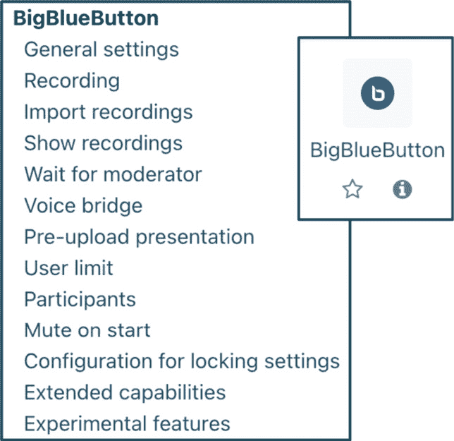

图 10.3 – BigBlueButton 配置

每个子菜单中的配置选项都有详细的描述和注释。为了避免重复，我们将简要描述每个设置区域的用途：

+   **常规设置**：除了默认的欢迎信息外，还指定了 BBB 服务器的详细信息。如果提供的免费服务对您的组织来说过于限制性，您可以选择安装本地 BBB 实例、与 Moodle 合作伙伴合作，或使用商业 BBB 托管提供商以进行更高级的设置，并相应地更新服务器设置。

+   **录制**：各种与录制相关的设置和默认值。

+   **导入录制**：启用这些设置，以便可以从其他课程导入录制。

+   **显示录制**：指定如何向学习者展示录制会话 – 例如，带预览或不带预览。

+   **等待主持人**：定义在主持人加入会话之前 BBB 活动的行为。

+   **语音桥接**：在 BBB 设置中如何处理语音桥接。

+   **上传前演示**：BBB 允许管理员以各种格式预先上传演示文稿。在这里，您可以配置此功能。

+   **用户限制**：指定会话中允许的用户数量。

+   **参与者**：当添加新房间时默认使用的规则。

+   **开始时静音**：设置加入会话时麦克风是否静音。

+   **锁定设置的配置**：启用和禁用各种 BBB 功能，如摄像头、麦克风、聊天（私人和公共）或共享笔记。

+   **扩展功能**：指定是否在录制链接可用时发送通知。

+   **实验性功能**：在撰写本文时，唯一可用的测试版功能是自动支持 BBB 的活动完成。

更多关于 BBB 的信息，请参阅 [docs.moodle.org/en/BigBlueButton](http://docs.moodle.org/en/BigBlueButton)。

如果您的组织已经使用 Zoom 或 WebEx 等替代网络或视频会议系统，则可以在 [moodle.org/plugins](http://moodle.org/plugins) 找到第三方插件；其安装已在 *第八章*，*理解 Moodle 插件* 中介绍。

这完成了关于同步通信的部分。接下来是它的对应部分，异步通信。

## 异步通信

Moodle 中有两种异步通信选项 – 消息和 **RSS** 订阅源。我们将介绍这两个工具，为您提供配置异步通信所需的信息。

### 消息配置

Moodle 随附一个灵活的消息功能，可以被视为一个基本的跨渠道通信系统，支持 **消息** 和 **通知**。

重要提示

**消息系统 = 消息 +** **通知**

**消息**包含信息，并从发送者发送到接收者。**通知**让用户知道已发送消息或已触发事件。

学习者可能向教师发送消息，教师收到通知（用户到用户）。活动或 Moodle 本身也可能发送消息：作为管理员，您可能会在更新可用时收到通知，学习者可能会在作业截止时收到通知。不仅如此，用户还可以通过电子邮件回复论坛帖子或将附件发送到他们的私有文件。以下表格总结了不同的消息渠道：

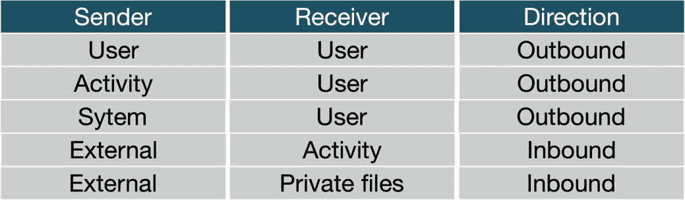

图 10.4 – 消息通信渠道

从 Moodle 的角度来看，我们可以区分**入站**和**出站**消息：从一个（Moodle）用户发送给另一个（Moodle）用户的消息被视为出站，因为发送是在 Moodle 内部进行的。学习者通过电子邮件发送到其私有文件中的文件被视为入站，因为 Moodle 接收了附件。我们将处理这两种方向类型，从出站消息开始。

#### 出站消息

在配置出站消息之前，请确保在**站点管理** | **常规** | **高级功能**中勾选了**启用消息系统**复选框。对于每种通知类型（如订阅的论坛、帖子或反馈提醒），以下消息输出是可用的：

图 10.5 – 消息输出

让我们更详细地看看这些：

+   **Web**: 这使用内置的通知机制，不需要任何自定义。默认主题在工具栏中显示通知指示器。

+   **电子邮件**: 消息将被转发到电子邮件地址。Moodle 的电子邮件使用其基于 PHP 的内部方法无需配置即可工作。为了提高其性能并利用您现有的电子邮件基础设施，请转到**站点管理** | **服务器** | **电子邮件** | **发件配置**，在那里您可以找到所有相关的邮件设置。页面分为以下六个类别：

    +   **SMTP**: 发送电子邮件的设置

    +   **无回复和域名**: 无回复地址和允许的电子邮件域名

    +   **邮件转发**: 用于开发环境

    +   **DKIM**: 电子邮件签名

    +   **测试发件配置**

    +   **电子邮件显示设置**: 您可以在[docs.moodle.org/en/Mail_configuration](http://docs.moodle.org/en/Mail_configuration)找到详细的说明。

+   **移动设备**: 消息将被发送到移动 Moodle 应用。设置在*第十一章*的*配置移动通知*子节中更详细地描述，*启用* *移动学习*。

+   **其他**: 对于每个安装的第三方消息输出，都会显示一个单独的列。您可以在[moodle.org/plugins/?q=type:message](http://moodle.org/plugins/?q=type:message)找到额外的通知插件，包括 Jabber、Telegram、Slack 和 SMS。

用户可以通过（在他们的**偏好设置**中的**用户账户**部分的**通知偏好**）配置如何接收通知，这取决于他们是否在线或离线。可以通过访问**站点管理** | **常规** | **消息** | **通知设置**来配置每种通知类型和通道的默认值。您还可以锁定每种通知类型的设置；在以下屏幕截图中，我们已经锁定了**Web**和**电子邮件**通道的**作业通知**，以确保没有人声称他们不知道即将到来的截止日期：

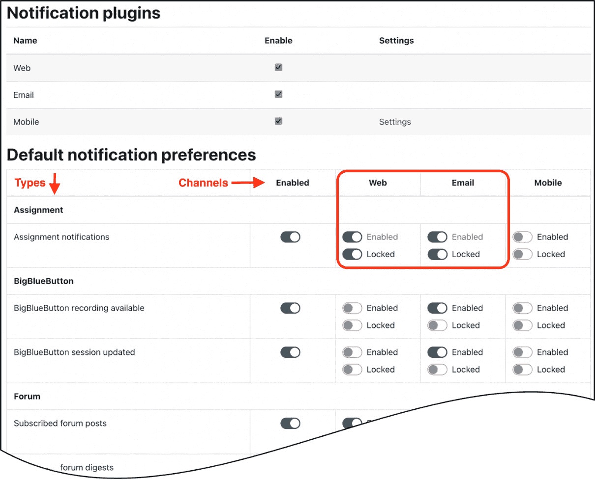

图 10.6 – 通知偏好

**系统**通知仅适用于您，管理员；所有其他通知适用于所有用户，包括**入站消息配置**中的三种通知类型，这是以下子节的主题。

#### 入站消息

Moodle 允许用户通过电子邮件回复论坛帖子并将附件发送到他们的私有文件。入站消息由 **消息处理器** 处理，如下图所示：

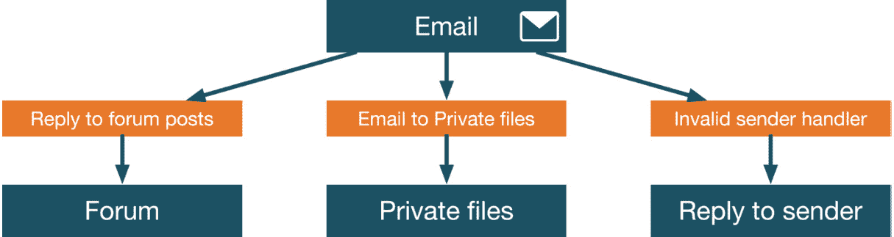

图 10.7 – 入站消息

要支持入站消息，必须配置以下设置：

+   确保在 **站点管理** | **服务器** | **电子邮件** | **入站邮件配置** 中 **启用入站邮件处理** 已开启。

+   `packt@openumlaut.com`，前者为 `packt`，后者为 `openumlaut.com`。

重要提示

强烈建议您为入站消息使用专用地址，而不是日常电子邮件。

+   **入站邮件服务器设置**：在同一页面上配置您的 IMAP 服务器 – 请与您的邮件管理员核实详细信息。

+   **配置消息处理器**：要指定哪些类型的电子邮件将由 Moodle 处理，请转到 **站点管理** | **服务器** | **入站邮件配置** | **消息处理器**。在此，您需要配置已作为插件实现的邮件处理器。

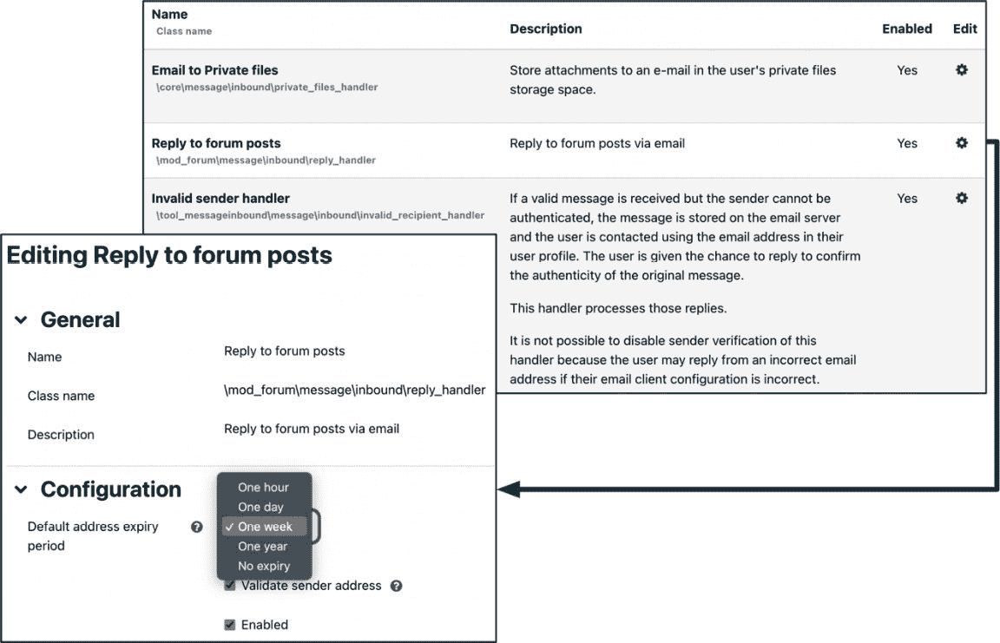

图 10.8 – 消息处理器

Moodle 随带提供了三个消息处理器：**电子邮件到私有文件**、**回复论坛帖子**和**无效接收者处理器**。前两个已经提到，应该很容易理解。无效接收者处理器处理来自与用户电子邮件地址不匹配的发送者的消息，并且不能被禁用。

在 **编辑** 列中选择 **配置** 图标，勾选 **启用** 设置以启用其他两个处理器之一。建议您保持过期设置不变。您可以在 [docs.moodle.org/en/Mail_configuration](http://docs.moodle.org/en/Mail_configuration) 找到关于入站电子邮件配置的详细解释以及其他电子邮件服务器的提示。

Moodle 的消息功能为用户提供灵活的入站和出站通信，同时也支持系统实体之间的通信。作为管理员，您必须确保所有支持通道都能正确且符合您组织的指南工作。您可能需要与邮件管理员协商以确保适当的配置。

Moodle 支持的第二种异步通信类型是 RSS 源，将在下一个小节中介绍。

### 配置 RSS 源

**真正简单的聚合** (**RSS**) 是一种基于 XML 的格式，用于分发和聚合网络内容，如新闻标题。Moodle 支持消费和生成 RSS 源，如下图所示：

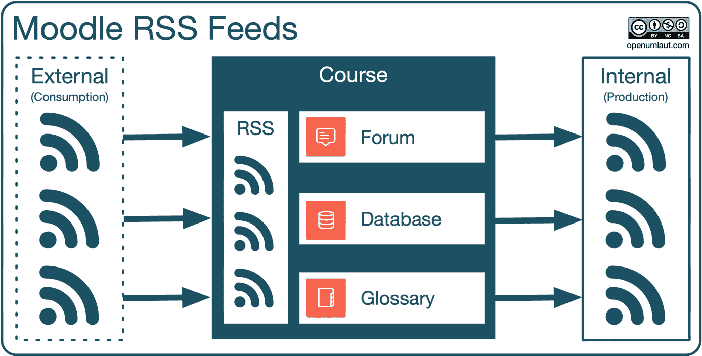

10.9 – Moodle RSS 源

通过在 **站点管理** | **通用** | **高级功能** 中的 **启用 RSS 源** 设置来开启 RSS 源。

外部 RSS 源通过 Moodle 课程中的**远程 RSS 源**块或仪表板进行消费。该块在**网站管理** | **插件** | **块** | **远程 RSS 源**中进行配置和预填充。可用的参数包括**每源条目**（加载和显示的原子数）和**超时**（缓存中源过期前的时间）。

三个 Moodle 活动 – **论坛**、**数据库**和**术语表** – 可以设置为 RSS 生产者；它们的源可以在其他课程中使用。每个模块在其各自的插件设置中都有一个**启用 RSS 源**选项。出于安全和隐私考虑，每个 RSS 源 URL 都包含为用户自动创建的令牌。如果有理由怀疑这已被破坏，用户可以通过**偏好**中**用户账户**部分的**安全密钥**链接重置此令牌。

RSS 源对于消费外部源和提供某些课程数据作为内部源非常有价值。为了结束这一节关于通信的讨论，我们将介绍用户如何联系您的支持渠道。

## 联系支持

一个与通信远程相关的话题是您的 Moodle 系统用户寻求帮助。当您转到**网站管理** | **服务器** | **支持联系**时，Moodle 允许您指定**支持名称**、**支持电子邮件地址**和**支持页面**：

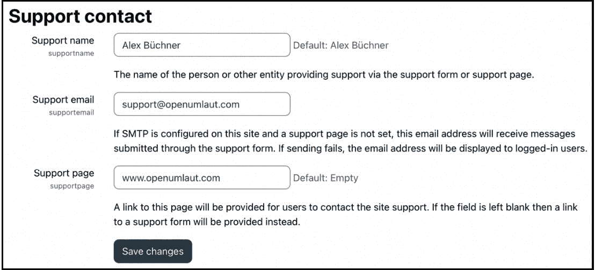

10.10 – 支持联系

您的联系方式在 Moodle 的多个位置显示，例如在自我注册期间。您无法在前页上放置支持块，但您可以使用**文本**块轻松地模拟这一功能。

这部分关于通信工具的讨论到此结束，我们讨论了同步工具（聊天和网络会议）、异步工具（消息和 RSS）以及为 Moodle 支持设置通信渠道。在下一节中，我们将介绍 Moodle 本地化，以促进您 LMS 在不同地区的使用。

# 管理本地化

本地化涉及将软件适应用于不同的地区。地区与一个适用某些文化方面的区域相关联，例如语言、日期和时间的格式化、日历表示等。

由于 Moodle 在全球范围内使用，并且许多教育机构跨越大陆和文化，因此本地化必须得到全面支持。

重要提示

如果您的 Moodle 系统的主要语言不是（英国或美国）英语，请确保在安装过程中选择它。这样，地区设置以及角色名称和描述都将得到充分的本地化。

在 Moodle 中可以配置的关键区域是语言相关设置和日历信息。语言和日历是以下两个子节的主题。

## 语言、idiomas、语言和تاغللا

Moodle 支持超过 80 种语言，包括拉丁语和世界语！Unicode 标准已被采用来表示多种语言的字符集，因为它涵盖了世界上大多数现代脚本。Moodle 支持从左到右的书写系统，如本书中使用的，以及从右到左的书写系统，例如阿拉伯语：

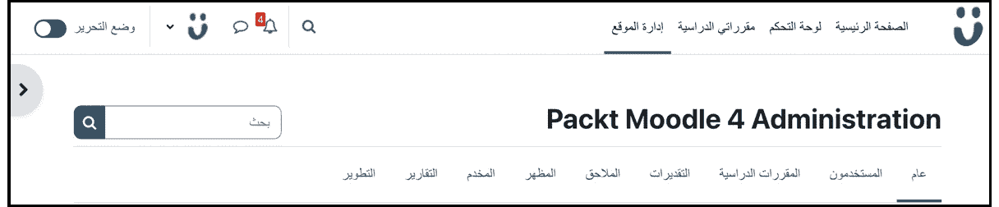

图 10.11 – 支持从右到左书写

语言包被用于支持不同的地区。

### 理解语言包

在 Moodle 中，一个 **语言包** 包含有关地区和所有翻译的信息。技术上，术语“语言包”有点误导 – 它们应该被称为“地区包”。

重要提示

每个地区都表示为一个语言包。

以下图表说明了语言包的基本概念：

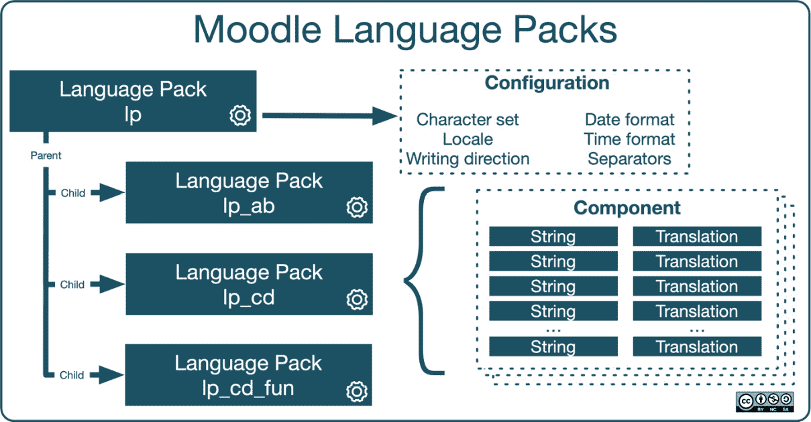

图 10.12 – 语言包

每个语言包包含两个基本部分：

+   **语言配置**：这包含有关地区的本地化信息 – 例如，要使用的字符集、书写方向、各种日期和时间格式以及不同数据类型的分隔符

+   **语言字符串**：这些按 Moodle 组件（例如，核心、模块、第三方）分组，并为每个语言字符串提供翻译。

标准化的两位字母区域代码表征地区。例如，**pt** 代表葡萄牙语，在葡萄牙使用，而 **pt_br** 代表巴西葡萄牙语。在内部，**pt** 是父语言，而 **pt_br** 是子语言，它只包含与父语言包不同的字符串。这种方法显著减少了子语言包的大小。

一些非标准化语言的语言包已经进入 Moodle，这部分解释了为什么有超过 200 (!) 个语言包可供选择。对于这些专业包，其创建者已经编造了新的代码，包括 **de_kids**、**en_us_k12** 和 **es_mx_kids**（针对年轻学习者）、**da_rum**（课程已被重命名为房间），最重要的是，**en_ar**（海盗语言 – 嘿！）。您还可能遇到带有 **wp** 后缀的语言包；它们代表 Moodle Workplace 的字符串。

要支持某个地区，您必须安装其语言包，Moodle 将自动从 [download.moodle.org](http://download.moodle.org) 下载。前往 **站点管理** | **常规** | **语言** | **语言包**，通过 Moodle 的语言导入工具添加新包：

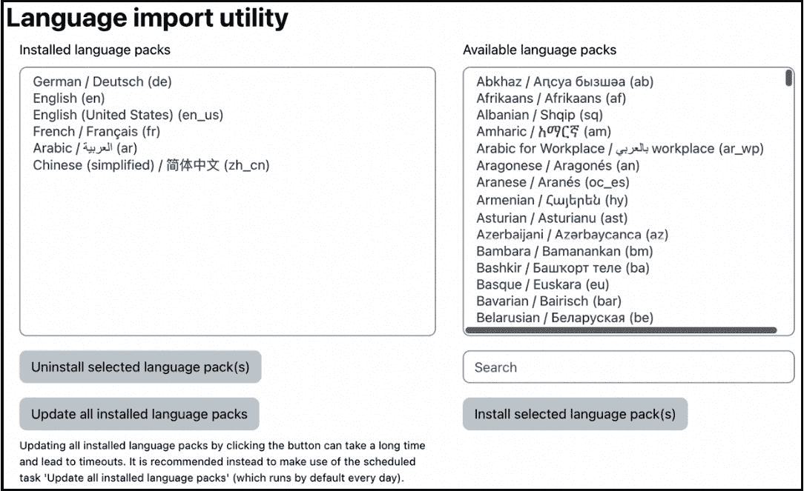

图 10.13 – 语言导入工具

在前面的截图中已安装了六个语言包，包括阿拉伯语、英语（**en** 和 **en_us**）、法语、德语和简体中文。在右侧选择一个或多个区域，然后点击**安装选定的语言包**按钮以添加更多语言包。要执行相反的操作，请在左侧列表中选择单个或多个语言包，然后点击**卸载选定的语言包**按钮。

小贴士

如果您的防火墙不允许连接到 Moodle 的下载服务器，您需要从[download.moodle.org/langpack](http://download.moodle.org/langpack)下载所需的语言包，将它们复制到`$CFG->wwwroot/lang`，然后手动解压缩文件。

**英语（en）**语言包不能卸载。在未翻译其他语言的字符串的情况下，它用作参考语言。有些语言包是不完整的，有时，只有非管理员功能被翻译。

安装完成后，用户可以从配置文件菜单中的语言菜单中选择一种语言（如果已配置）。请注意，只有 Moodle 中的术语和短语会发生变化。除非配置了使用多语言功能，否则创建的内容不会翻译（请参阅本章的*自定义语言*小节）：

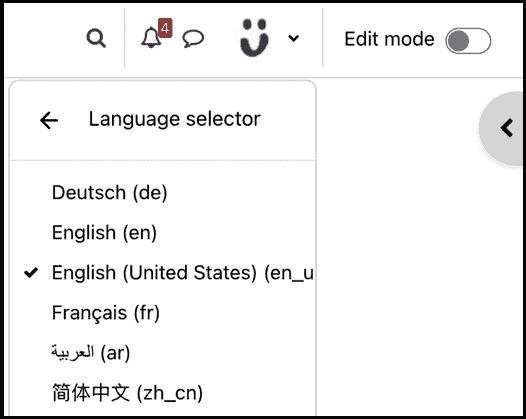

图 10.14 – 语言选择器

语言包保存在[download.moodle.org/langpack/4.x](http://download.moodle.org/langpack/4.x)（其中**x**是当前发布版本号）。有些包更新频率高于其他包，Moodle 会自动每天更新语言包。如果您像我一样不耐烦，点击**更新所有已安装的语言包**按钮可以立即执行此任务。

安装所有必需的语言包后，您应配置与语言相关的设置。

### 配置语言设置

Moodle 提供了一些与语言相关的参数，您可以在**网站管理** | **常规** | **语言** | **语言设置**中找到：

+   **语言自动检测**：默认情况下，Moodle 会从使用的网络浏览器区域检测语言。如果您希望覆盖此设置并使用默认网站语言，请取消选中此复选框。

+   **默认语言**：这允许您选择整个网站使用的语言，除非个别用户通过语言菜单或个人资料覆盖它。只有已安装语言包的语言会显示在语言菜单中。

+   **在账户创建时将用户的浏览器语言设置为首选语言**：如果启用，它将执行其说明的功能；否则，将使用配置的默认语言。如果用户的浏览器语言未安装，也将设置默认语言。

+   **显示语言菜单**：如果启用，语言菜单将显示在个人资料菜单中。用户始终可以在个人资料中更改语言，无论设置如何。请注意，某些主题不支持此功能。

+   **语言菜单上的语言**：如果留空，所有已安装的语言都将出现在语言菜单中。要减少可用语言的数量，请指定以逗号分隔的 locale 代码列表。

+   **缓存语言菜单**和**缓存所有语言字符串**：除非您添加或删除语言包，否则建议您保留这两个设置启用，因为它们分别缓存语言菜单项和字符串，而不是动态加载。

+   `en_US.UTF-8`。相应的文件必须在系统级别安装。

+   **Excel 编码**：Moodle 在下载 Microsoft Excel 中的数据（如成绩单报告或日志文件）时使用 Unicode 格式。除非您的教师或学习者使用 Excel 的恐龙版本，否则请保持此设置不变。

+   **任务状态**：此条目仅用于信息目的，无法修改。它通知您已安装的语言包是否通过计划任务定期更新（有关任务的更多信息，请参阅*第十五章*，*优化* *Moodle 性能*)。

三项额外的语言相关设置放置在其他位置：

+   在**站点管理** | **用户** | **权限** | **用户策略**中的**全名格式**选项定义了当显示全名时名称的显示方式。如果输入了**语言**占位符，则全名的格式由当前语言包决定。这样，您可以满足对名字的本地敏感性。

+   `moodle/site:viewfullnames`能力。

+   `alex.büchner`。

到目前为止，我们已使用 Moodle 及其基于社区的翻译者提供的语言包。接下来，让我们处理自定义语言字符串和短语。

### 自定义语言

在 Moodle 中使用的每个短语、术语和字符串都在语言文件中表示，与特定的 Moodle 模块（位于`lang`目录中）相关联。有超过 30,000 个（！）语言字符串，展示了系统的规模。您可以更改任何单词或短语；例如，您可能想将成绩改为分数，成果改为工作指标，教师改为讲师，等等。

要自定义语言文件，请转到**站点管理** | **常规** | **语言** | **语言自定义**，您首先必须选择要自定义的语言。点击**打开语言包进行编辑**按钮将进入检出步骤；这可能需要几秒钟。一旦完成，您就可以点击**继续**按钮。

重要提示

Moodle 在`$CFG->dataroot`内部创建一个`local`目录，其中存储您编辑的短语。请确保您有对`lang`目录的写入权限，以避免错误信息。

Moodle 为每个模块保留一个单独的语言文件。这种分离是有益的，因为它使底层代码（由程序员开发）从本地化（由翻译人员工作）中解放出来。然而，缺点是你需要知道相应的字符串位于哪里（即哪个 PHP 模块）。然而，Moodle 提供了一个良好的过滤机制，以简化对要修改的字符串的搜索。

假设你想将术语*Guest*改为*Visitor*。由于*Guest*这个术语可能出现在多个模块中，因此安全起见，可以选择**这些组件**的**显示字符串**列表中的所有项目。

你可以选择的过滤器条件包括**仅自定义**，用于之前会话中已更改的字符串，**仅帮助**，用于气球帮助提示，以及**仅当前会话中更改**，用于当前会话中已更改的短语。**仅包含字符串**参数需要你正在寻找的单词或短语（在我们的例子中是*Guest*）。内部，Moodle 使用字符串标识符，也可以用来搜索内容。只需在**字符串标识符**文本框中输入字符串 ID 即可进行此操作。一旦搜索成功，以下信息将显示与过滤器匹配的每个字符串：

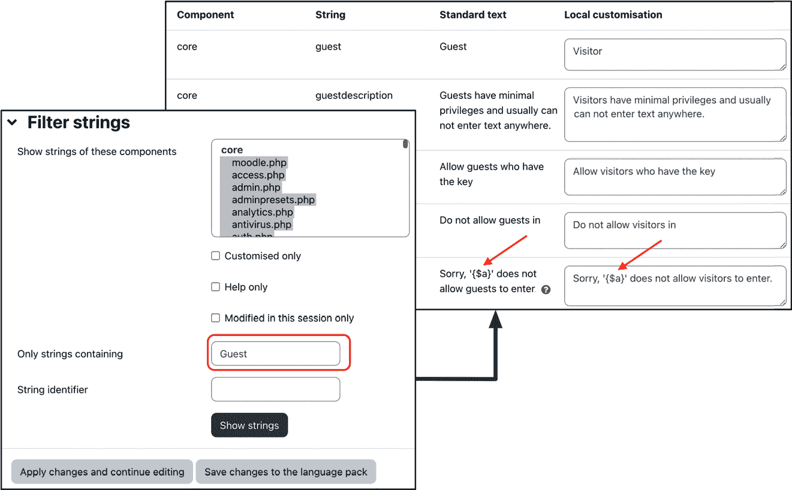

图 10.15 – 语言自定义

你可能已经注意到了从顶部第五个短语中的`$a`参数。这是一个占位符，它会在运行时被替换；在这种情况下，它被替换为课程的名称。这些代码必须在本地自定义中包含 – 你必须保留它们以避免任何问题。一些占位符将包含一个参数，例如`$a->id`或`$a->query`。

确保你点击**保存语言包更改**按钮，以便在 Moodle 网站上反映更改。这些修改将在你更新网站时得到保留。

你可以授予用户访问`report/customlang:edit`和`report/customlang:view`角色能力的权限。

有一个有用的设置叫做`?strings=1`或`&strings=1`附加到页面 URL 上，如下示例所示：

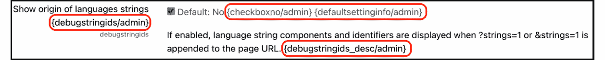

图 10.16 – 显示语言字符串组件和标识符

如果你希望向语言包贡献翻译的字符串，请访问 Moodle 语言门户[lang.moodle.org](http://lang.moodle.org)。你将找到有关使用 AMOS 翻译工具和 AMOS Moodle 块的信息（详情请参阅[docs.moodle.org/dev/AMOS_manual](http://docs.moodle.org/dev/AMOS_manual))。

现在我们已经本地化了用户界面的一些文本元素，让我们来处理多语言内容。

### 支持多语言内容

如果你的用户处理多语言内容，可以开启``标签，这允许你的课程设计者和内容创建者在通过 Atto 编辑器输入的所有文本区域中支持多种语言。

多语言 HTML 语法在一段时间前已经改变，并且不再被支持。如果你的用户中还有人仍在使用旧格式，你需要运行一次`admin/tool/multilangupgrade`)。你可以在*第十七章*，*使用 Moodle* *管理工具*中找到更多关于管理工具的详细信息。

在上一章讨论可用性限制时提到的附加插件是**按语言限制**([moodle.org/plugins/availability_language](http://moodle.org/plugins/availability_language))。一旦安装了此附加组件，用户就可以根据所选语言限制个别活动和资源。除了可用的标准限制（如活动完成情况）之外，课程作者还可以指定语言作为标准。

这就结束了 Moodle 中关于语言相关主题的部分。本地化的第二部分是日历信息，将在接下来的子部分中介绍。

## 日历信息

不同的文化以不同的格式表示日历信息——日期、时间和时区。以下高级图示说明了 Moodle 日历的主要组件：

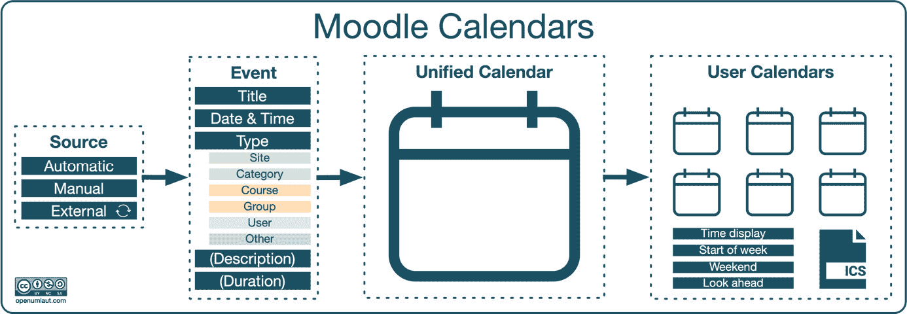

图 10.17 – Moodle 日历

内置日历由多个来源提供数据，这些来源可以是**自动的**（例如，作业截止日期或评分截止日期），**手动的**（例如，消防演习公告），或者一个更新频率较高的**外部日历源**。

每个日历条目都表示为一个**事件**，它包含几个字段：标题、日期、时间、描述、持续时间和类型。根据日历类型（站点、类别、课程、组、用户或其他），可能还会有其他字段。

**统一日历**集中了系统中的所有事件，并作为用户日历的来源。**用户日历**会以所选区域（语言包）中指定的格式和日历设置中指定的参数显示事件。

重要提示

对于非英语日历，必须安装区域设置才能正确工作。在 Unix 系统中，你可以使用`locale -a`命令来检查这一点。否则，你的日历中的日期将以英语显示。

在我们处理 Moodle 中的时区之前，我们将首先配置日历。

### 配置日历

默认情况下，Moodle 根据设定的公历地区格式化日期和时间。其他日历也受到支持，但它们必须作为插件安装。要这样做，请遵循*第八章*中的说明，“理解 Moodle 插件”，并在 [moodle.org](http://moodle.org) 的公共插件数据库中浏览**日历**部分。

可以通过访问**网站管理** | **外观** | **日历**来更改日历设置：

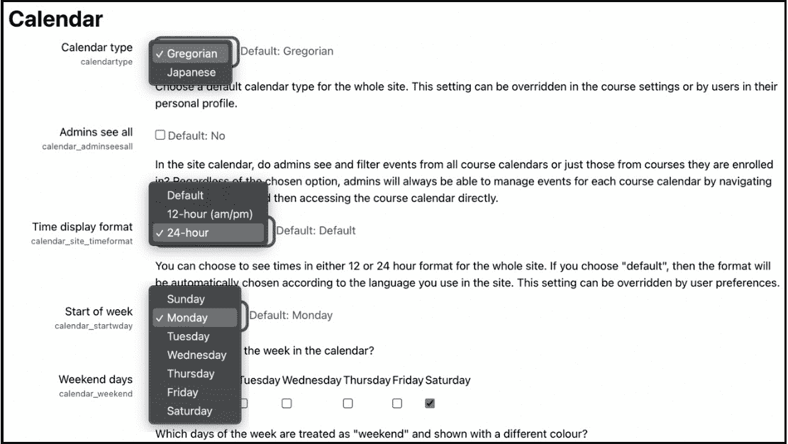

图 10.18 – 日历配置

之前屏幕截图中最相关的字段显示在日历本地化中（我已安装了日本日历插件）：

+   **日历类型**是网站及其用户的默认设置，可以在用户的**偏好**部分通过**首选****日历**选项进行覆盖。

+   如果您需要查看所有日历事件，请启用**管理员查看所有**；否则，您将只能看到您的事件。

+   时间根据所选地区显示；**时间显示格式**可以通过 12 小时或 24 小时时钟来覆盖。

+   不同国家有不同的周起始日——例如，在北美，周从周日开始，而在欧洲，周从周一开始（**周开始**）。

+   并非所有国家都将周六和周日作为周末。例如，在伊斯兰国家，周末是周五和周六，而周日是正常的工作日。这可以通过**周末****天数**选项来指定。

此页面上的一些更多设置主要涉及前瞻值和日历导出选项。这些设置在屏幕上有很好的解释。

### 配置时区

Moodle 支持跨越时区的系统，这发生在三种场景中：

+   在覆盖多个时区的国家

+   在有来自多个国家/时区的学习者的网站上

+   在服务器托管在组织时区之外的情况中——例如，通过互联网服务提供商

要修改默认时区参数，请访问**网站管理** | **常规** | **位置** | **位置设置**：

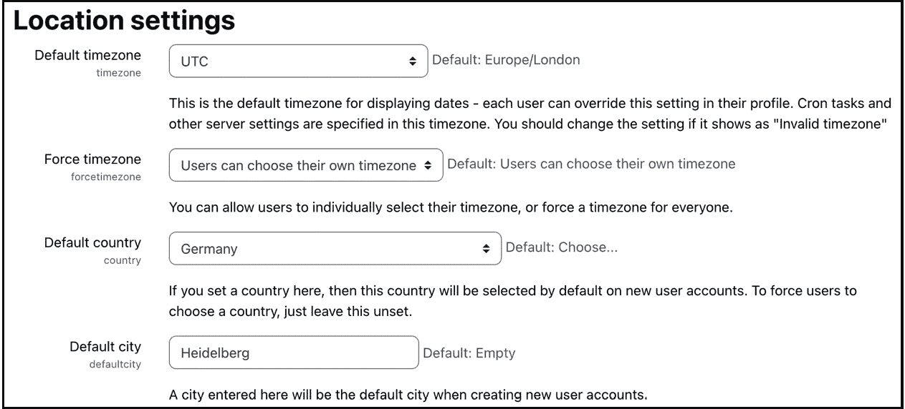

图 10.19 – 时区配置

在**默认时区**参数中选择的值在整个系统中使用。默认值在安装时设置，但这可能不会反映您的本地时间。除非已设置**强制时区**，否则每个学习者都可以在其用户配置文件中更改此设置。显示的时间，如作业截止日期，将调整到所选时区。如果指定，**默认国家**和**默认城市**用于新用户帐户。

某些时区的规则时不时地会发生变化——例如，夏令时的调整。在这种情况下，您应该更新您的系统，因为 Moodle 的新版本总是包含最新的时区规则。

这完成了本节关于本地化的内容。接下来，我们将探讨存储库及其管理。

# 管理存储库

**文件选择器**是 Moodle 中大多数文件操作的核心。可以从各种来源选择文件，在 Moodle 中称为**存储库**。

重要提示

存储库使用户能够将文件添加到 Moodle 中的课程和其他位置。

以下图表显示了 Moodle 核心中可用的存储库以及它们与文件选择器协同工作的概述：

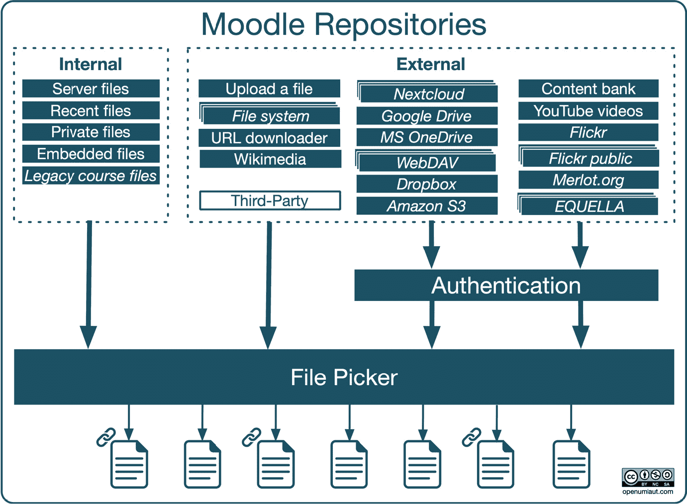

图 10.20 – Moodle 存储库

为了简化，我们将区分内部和外部存储库。**内部存储库**访问内部 Moodle 文件。**外部存储库**位于 Moodle 外部，在某些本地或远程媒体上，在其他应用程序的数据存储中，或在云中。所有存储库都通过文件选择器访问——一些直接访问，其他则添加了认证层。文件可以被复制或链接，尽管并非所有存储库类型都支持链接。

您可以通过访问**站点管理** | **插件** | **存储库** | **管理存储库**（您系统上的存储库顺序可能与此视图不同）来配置 Moodle 存储库：

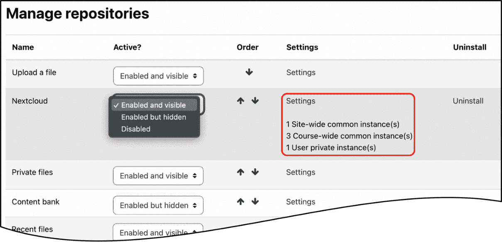

图 10.21 – 管理 Moodle 存储库

每个存储库插件都有以下三种状态之一：

+   **启用且可见**：存储库插件始终可通过文件选择器访问

+   **启用但隐藏**：存储库插件无法通过文件选择器访问，但已创建的实例将被保留

+   **禁用**：存储库在您的 Moodle 系统中不可用，所有实例都将被删除

重要提示

当您禁用存储库插件时，其设置和所有实例都将被删除。您可以选择下载任何内容或对 Moodle 的引用。

存储库的列表顺序反映了它们在文件选择器中出现的顺序。此顺序可以通过上下箭头进行更改。一旦启用存储库，几乎所有存储库类型都会显示一个**设置**链接。每个存储库都有一个**存储库插件名称**参数，允许您覆盖其默认名称。一些存储库还具有额外的特定于插件的设置，这些将在适当的时候讨论。

所有存储库类型都支持**复制**文件，但只有一些也支持**链接**文件。如果您想启用链接，请确保在**站点管理** | **插件** | **存储库** | **通用存储库设置**中勾选了**允许外部链接**。出于数据完整性和安全性的原因，一些机构不允许链接。

在以下小节中，我们将更详细地介绍内部和外部存储库的不同类型。

### 内部存储库插件

可供选择的内部存储库插件有：

+   **服务器文件**：这些是用户可以访问的 Moodle 系统上的文件。文件按 Moodle 上下文分层排列（参考*第二章*，*探索 Moodle 系统*）。

+   **近期文件**：这些是最近使用和上传的文件。您可以在设置中指定**近期文件数量**（默认为**50**）和**时间限制**。

+   **私有文件**：这些是用户的个人文件，可以在 Moodle 中访问。您可以通过访问**站点管理** | **常规** | **安全** | **站点安全设置**来通过**私有文件空间**参数指定用户配额。

+   **嵌入式文件**：这允许用户重用当前文本区域中嵌入的文件。

+   **旧课程文件**：这允许访问从（古老的）Moodle 1.9 迁移后的文件。您可以在[docs.moodle.org/en/Legacy_course_files](http://docs.moodle.org/en/Legacy_course_files)找到有关此存储库类型的详细信息。旧课程文件旨在作为临时措施，目标是所有文件迁移完成后停止使用。您可以在**站点管理** | **插件** | **存储库** | **通用存储库设置**中找到与旧文件相关的两个自解释设置：**新课程中的旧课程文件**和**允许添加到旧课程文件**。

内部存储库插件由 Moodle 处理，通常不需要任何配置或管理。而它们的外部对应插件则不是这样，我们将在下一部分进行介绍。

### 外部存储库插件

外部存储库插件将允许您的用户将（复制、流式传输或链接）新文件或数据添加到您的 Moodle 系统中。内容可以从本地计算机、U 盘、网络驱动器、云存储或外部应用程序（包括流媒体服务）上传。像往常一样，可以通过插件数据库在[moodle.org/plugins/?q=type:repository](http://moodle.org/plugins/?q=type:repository)安装额外的存储库类型。

以下表格列出了所有作为 Moodle 核心部分的外部存储库插件：

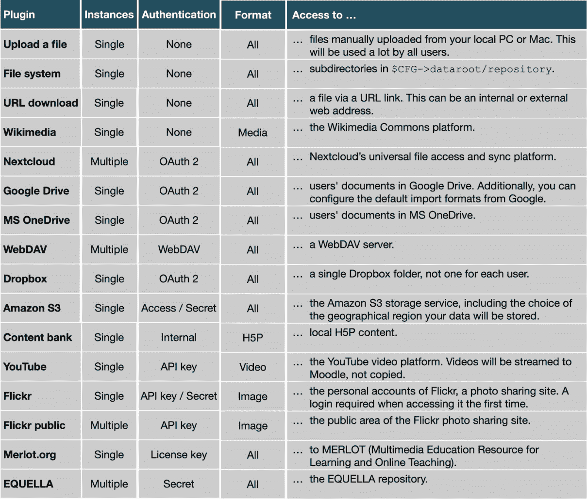

图 10.22 – 外部存储库类型

一些外部存储库类型支持多个**实例**。现有的全局、课程和私有用户实例的数量显示在插件**设置**链接下。这些可以在相关上下文中进行配置：

+   **全局实例**：作为管理员，您可以创建所有系统用户都可以访问的全局实例。全局实例是在管理插件时作为**设置**的一部分创建的——例如，**Nextcloud**存储库：

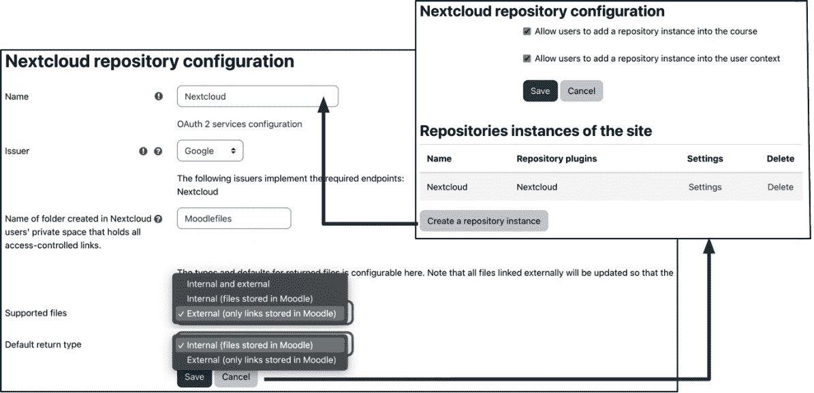

图 10.23 – 创建全局实例

+   `repository/filesystem:view`能力可以访问文件选择器中的实例。

一个流行的例子是**文件系统**存储库类型，每个实例必须选择一个可读目录。一个典型的用例是为文件上传创建一个专用目录，然后可以在特定课程中访问。以下截图展示了如何设置课程存储库：

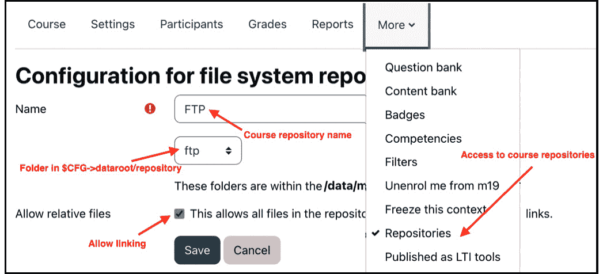

图 10.24 – 配置课程存储库

+   **用户私有实例**：如果选择了**允许管理员为个人使用添加<存储库插件>实例**选项，您可以通过**偏好设置**中**存储库**面板的**管理实例**链接创建个人实例。

在配置外部存储库插件时，您可以找到以下三种类型的**认证**：

+   **无需认证**：文件或内容可以直接访问，无需任何凭证。

+   **OAuth 2 服务**：访问存储库需要通过 OAuth 2 进行认证。如何在**第五章**中配置其服务已在**基于服务提供者的认证**部分介绍，*管理用户、群体和认证*。Nextcloud 截图（*图 10**.23*）显示了通过 OAuth 2 完成的存储库插件的典型设置。

+   **插件依赖**：不支持 OAuth 2 的存储库类型已实现了自己的认证机制。这可能是一对访问/秘密密钥，一个 API 密钥，或者只是一个许可证。

虽然大多数外部存储库类型支持所有**文件格式**，但有些只托管特定的格式；例如，YouTube 只提供视频流，内容库（目前）只存储 H5P 文件。流媒体内容存储库（例如，YouTube 和 Vimeo 的第三方插件）仅在从 Atto 的音频/视频图标启动时出现在文件选择器中。

所有提到的 Moodle 存储库的附加信息可以在[docs.moodle.org/en/Repositories](http://docs.moodle.org/en/Repositories)找到。

提示

一旦完成存储库的设置，最好从多个上下文（用户、站点和课程）测试访问权限，并确保没有用户能够访问他们不应访问的资源，反之亦然。

为了总结本节，让我们看看一个完全填充的文件选择器，它支持大量的存储库类型：

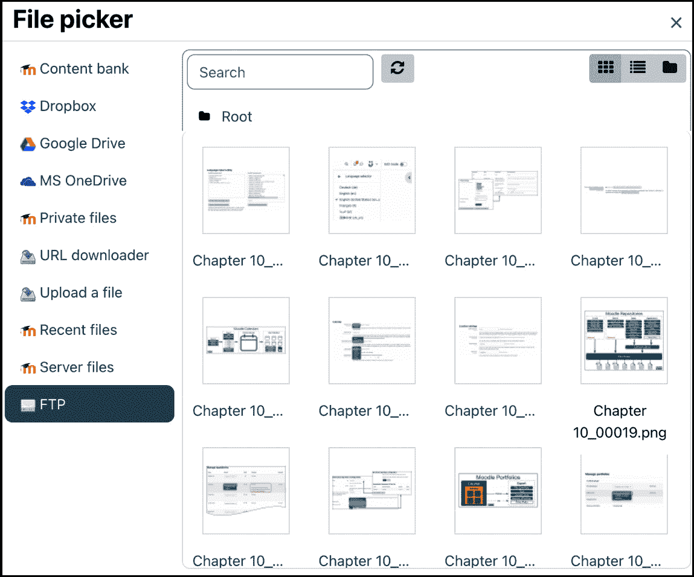

图 10.25 – 带有各种存储库的文件选择器

存储库涉及将内部和外部内容引入 Moodle。为了实现相反的效果 – 将内容从 Moodle 中推出去 – 您可以使用个人作品集，这是本章最后部分的主题。

# 管理个人作品集

根据 Moodle Docs，Moodle 个人作品集允许数据，如论坛帖子或作业提交，导出到外部系统。以下图表说明了此流程的高级工作流程：

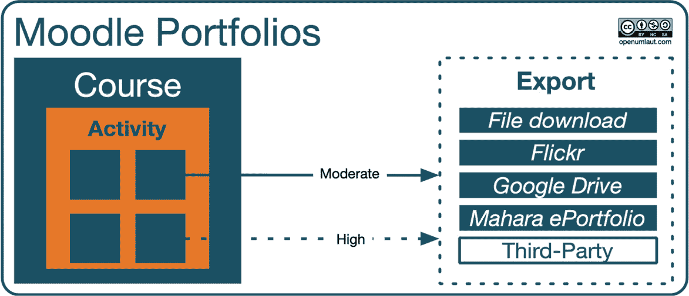

图 10.26 – Moodle 个人作品集

用户可以导出的数据非常详细 – 例如，一个聊天会话、一个词汇表条目或一个单独的论坛帖子。根据要导出的文件大小，个人作品集导出将立即执行（文件大小适中）或排队（文件大小较大）。

重要提示

支持的导出格式包括 HTML、LEAP2A、图片、文本和文件。

通过访问**网站管理** | **常规** | **高级功能**来选择**启用个人作品集**参数，以启用 Moodle 个人作品集。完成后，您可以在**网站管理** | **插件** | **个人作品集** | **管理个人作品集**处访问所有可用的个人作品集插件：

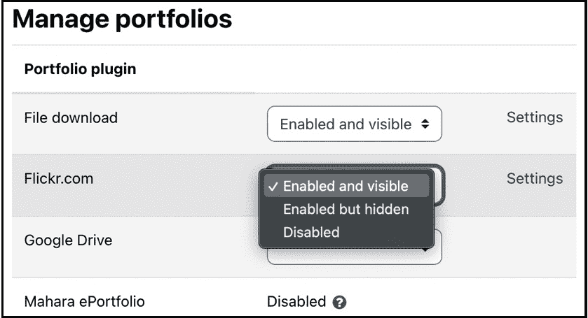

图 10.27 – 管理个人作品集

每个个人作品集都有以下三种状态之一：

+   **启用且可见**：个人作品集将在整个系统中可用

+   **启用但隐藏**：个人作品集必须被激活才能使用

+   **禁用**：您的 Moodle 系统中不可用个人作品集

与存储库一样，每个个人作品集插件都有一个**名称**设置，其中可以更改默认插件标签。与存储库不同，不存在多个实例，也无法更改插件的顺序。

以下核心个人作品集插件可以激活和配置：

+   **文件下载**：支持的导出格式是 HTML 和 LEAP2A（电子作品集可移植性的规范）。

+   **Flickr.com**：按照屏幕上的说明获取**API 密钥**和**密钥字符串**。首次使用时需要授权。

+   **Google Drive**：按照屏幕上的说明使用 OAuth 2.0 将您的站点注册到 Google，以获取**客户端 ID**和**密钥**详情。首次使用时必须授予权限。将在用户的**文档**区域自动创建一个 HTML 文件。

+   **Mahara ePortfolio**：此存储库类型仅在已建立到开源电子档案系统 Mahara 的有效网络连接并启用 **MNet 认证** 插件时才可用。在 *第十九章*，“设置 Moodle 网络”，我们将简要介绍 MNet。

+   **第三方**：可以在 [moodle.org/plugins/?q=type:portfolio](http://moodle.org/plugins/?q=type:portfolio) 找到更多插件 – 例如，Box。

一旦设置至少一种档案类型，用户将在他们课程中的活动内部看到 **导出到档案** 选项。选择此选项时，他们必须从 **可用导出格式** 下拉菜单中选择一个现有目的地。根据选择的档案类型，可能需要采取额外的操作 – 例如，登录网站、确认文件类型或授予外部应用程序访问权限。

用户可以选择在他们的 **导出到档案** 列表中显示哪些可用的档案。一旦他们导航到 **偏好** 中的 **档案** 选项卡中的 **配置** 选项，他们就有权隐藏任何配置的档案插件。

此外，当他们导航到 **档案** 选项卡中的 **传输日志** 时，他们将看到任何 **当前排队传输** 和 **先前成功传输** 的列表。前者列出所有挂起的导出，可以使用播放按钮继续或通过停止按钮取消。后者显示所有最近进行的传输的详细信息。

以下截图展示了提到的三个用户操作 – 管理档案、导出档案和查看传输日志：

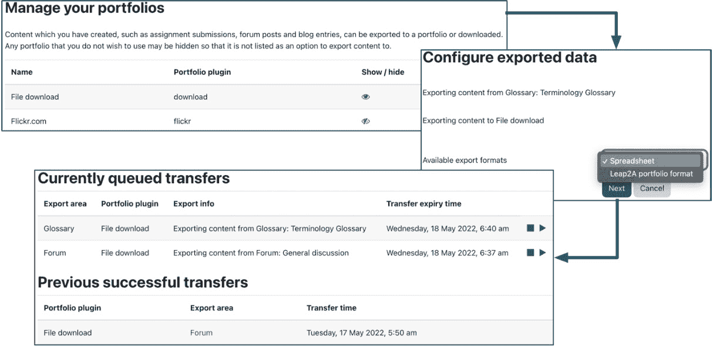

图 10.28 – 档案用户操作

一些设置适用于所有档案，并且可以在 **网站管理** | **插件** | **档案** | **通用档案设置** 中访问。它们包括两个文件大小阈值（**适度传输文件大小** 和 **高度传输文件大小**）以及两个数据库记录数阈值（**适度传输数据库大小** 和 **高度传输数据库大小**）。如果实际值超过阈值值，用户将收到警告，指出导出可能需要一些时间。

提示

所有提到的 Moodle 档案的更多信息可以在 [docs.moodle.org/en/Portfolios](http://docs.moodle.org/en/Portfolios) 找到。

档案是构成此技术配置章节的四个构建块中的最后一个。虽然使用不多，但它们是学习者将数据导出到外部（档案）系统的一个宝贵功能。

# 摘要

本章教您如何管理所有被归类为技术的 Moodle 工具和功能。

首先，我们通过涵盖聊天、视频会议（BigBlueButton）、消息（消息和通知）以及 RSS 订阅，配置了同步和异步通信工具。接下来，我们处理了各种本地化创建功能、区域设置、多语言、日历和时区。然后，我们配置了内部和外部存储库，以便用户可以通过文件选择器将文件添加到课程和其他位置。最后，我们配置了作品集，以便学习者可以将数据导出到外部（作品集）系统。

现在，你应该处于一个很好的位置，可以接触你组织中的所有利益相关者，并收集任何相关输入，以确保所有技术组件都已适当设置。

现在，让我们继续进入另一个令人兴奋的章节，我们将介绍移动学习和 Moodle 应用程序。
