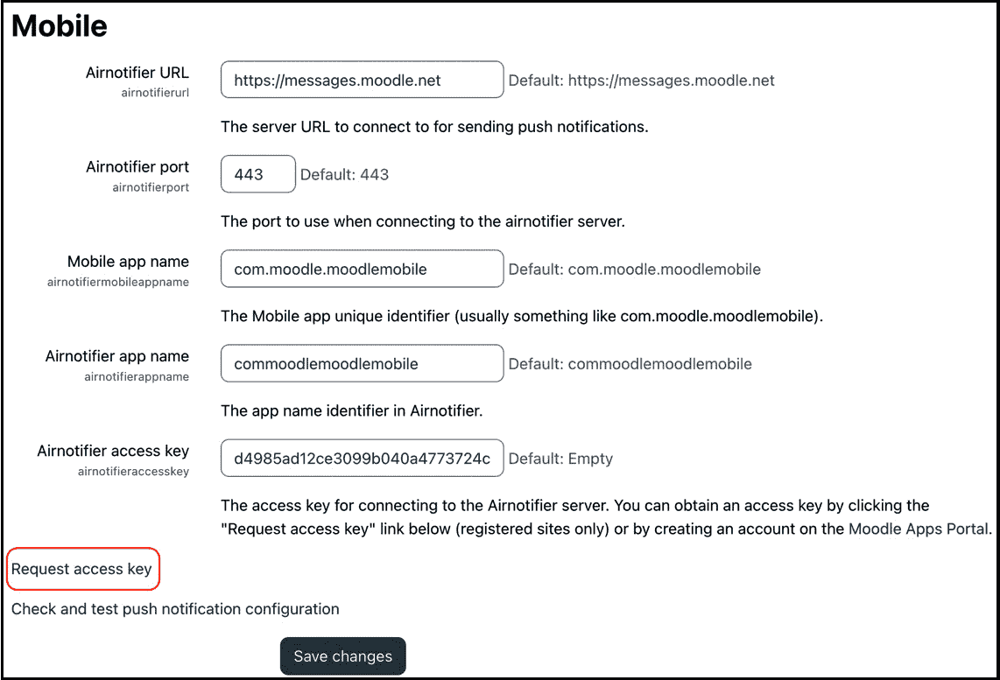

# 启用移动学习

在大多数组织中，移动学习已成为电子学习的标准，并构成了课程交付的关键部分。移动学习使学习者在任何时间、任何地点都能获得更多灵活性；它提供自我导向和独立学习，支持在职培训，并促进微学习。移动设备通常用于消费和通信，而不是创作和管理。

Moodle 已发布适用于 iOS 和 Android 的应用，允许用户与 Moodle 系统互动。该应用最适合学习者，支持参与者访问课程内容、接收通知、上传数据、监控进度以及与其他用户互动的关键功能。该应用是智能手机或平板电脑上通过网页浏览器访问 Moodle 的替代品，并且具有专门为移动使用（在线和离线）设计的优势。

到本章结束时，您将了解如何准备、配置和自定义 Moodle 应用。本章包括以下主要部分：

+   **理解 Moodle 的应用计划**：您将熟悉 Moodle 提供的不同订阅方案，包括品牌移动应用。

+   **准备使用 Moodle 应用**：您将了解在您的学习者可以使用应用之前必须采取的预备步骤。我们将区分通过移动浏览器访问 Moodle 和应用。然后我们将通过集中管理的设置来启用应用并配置不同的身份验证类型。我们还将简要介绍如何在移动设备上安装应用。

+   **配置 Moodle 应用**：我们将探讨如何配置 Moodle 应用以提供适合学习者的移动学习体验，包括移动功能、通知和应用策略。

+   **自定义 Moodle 应用的外观**：您将学习如何调整应用的外观和感觉，包括更改登录标志、修改应用主题和配置应用横幅。

# 理解 Moodle 应用计划

在本节中，您将了解 Moodle 提供的不同应用订阅方案。选择取决于您需要的功能、活动设备的数量，以及，一如既往的，您的预算。

重要提示

Moodle 的 iOS 和 Android 应用免费，没有任何应用内购买或隐藏费用。

Moodle 提供四种计划以支持不同的功能和限制：

+   **免费版**：基本功能集，几乎无自定义选项，每月最多 50 个活动设备用于推送通知，每个设备最多可下载两个离线课程，且无品牌选项。

+   **优点**：完整的功能集，一些自定义选项，每月最多 500 个活动设备用于推送通知，每个设备最多可下载四个离线课程，且无品牌选项。

+   **高级**：完整的功能集和自定义选项，每个设备无限推送通知和离线课程，以及基本的品牌选项。位于 [moodlecloud.com](http://moodlecloud.com) 的站点以及由 Moodle 合作伙伴托管的实例都属于这一级别。

+   **品牌 Moodle 应用程序**：正如其名所示，其主要目的是提供一个外观和感觉与您的企业品牌一致的应用程序。然而，除了支持您的组织视觉身份外，品牌应用程序还带来了一些额外的优势：

    +   在 Apple 和 Google Play 应用商店中有一个单独的条目。

    +   应用程序中嵌入了一个静态 URL 网站，因此用户在首次使用应用程序时无需输入 Moodle 实例的 URL。

    +   提供单独的托管空间，并在 Moodle 的符合 **通用数据保护条例**（**GDPR**）的推送通知基础设施中确保高级隐私。

    +   跟踪移动参与度分析，以更好地了解行为并改善您的移动友好型学习体验。它还可以深入了解学习者如何使用您的应用程序，并提供个性化的移动参与度数据访问。

带有品牌的应用程序是由 Moodle 提供的订阅服务。请联系您当地的 Premium Moodle 合作伙伴或查看 [moodle.com/app](http://moodle.com/app) 了解更多详情。

您可以在 [apps.moodle.com](http://apps.moodle.com) 找到包含最新价格的完整功能比较表。

要了解您站点的计划，请转到 **站点管理** | **常规** | **移动应用程序** | **移动应用程序订阅**。以下是 **免费** 和 **高级** 计划的截图，并列出了所有功能，除了品牌应用程序的功能：


图 11.1 – Moodle 应用程序计划

在本章中，我们将描述**高级**计划的特性，因为它们涵盖了管理员可以执行的所有自定义设置。在开始之前，必须采取一些准备工作步骤，具体内容将在以下部分中解释。

# 准备使用 Moodle 应用程序

在用户能够从移动设备访问学习内容、与他人合作或监控进度之前，有一些事情需要考虑。首先，必须决定通过 LMS 访问的方式，是使用移动网络浏览器还是专用应用程序。本章重点介绍移动应用程序，它必须在中央启用。其次，用户必须在首次登录之前下载并安装应用程序。第三，用户必须通过移动应用程序进行身份验证。本节将涵盖所有这些内容，从关于如何从移动设备访问 Moodle 应用程序的简要介绍开始。

## 从移动设备访问 Moodle

通常，学习者可以通过两种方式通过移动设备访问 Moodle——直接通过手机或平板电脑上的网络浏览器，或者通过 Moodle 的 iOS 和 Android 应用程序。

**网络浏览器**视图实际上与我们全书所看到的一样，只是它通过响应式设计针对较小的屏幕尺寸进行了优化。与通过移动浏览器使用 Moodle 相关有三个主要论点——用户在移动设备上拥有与桌面设备相同的可用功能，处理方式相同，并且用户不需要在他们的移动设备上安装额外的应用程序。

**Moodle 应用程序**提供了相同数据的另一种视图，并且交互已经针对移动使用进行了优化。此外，支持离线使用和同步，由一个小云符号表示。与浏览器视图相比，移动应用程序的另一个优点是支持推送通知，这是我们所有人都习惯了的功能。

以下两个屏幕截图显示了在访问相同仪表板时两种使用类型的区别，浏览器视图在左侧，应用程序视图在右侧：


图 11.2 – 浏览器视图与应用程序视图

下面的图示展示了从移动设备访问 Moodle 时发生简化的过程（关于网络浏览器访问的详细信息在顶部，关于应用程序访问在底部）：


图 11.3 – 通过浏览器和应用程序访问 Moodle

让我们从左到右再从右到左回顾一下前面的图示。当用户通过网络界面发出请求时，浏览器将请求传递给网络服务器，网络服务器调用负责的 PHP 模块。PHP 模块通过一个动作（查询、更新、插入或删除操作）调用数据库，并返回所需的数据。基于这些信息，PHP 模块将数据（通常是 HTML 或 JavaScript）返回给网络服务器，网络服务器将需要显示的信息传递回用户的浏览器。

当通过应用程序访问 Moodle 实例时，过程与通过浏览器访问完全相同，除了第一步，它涉及调用网络服务从网络服务器请求数据。同样适用于返回的信息，它也通过网络服务传递。网络服务是网络和移动应用程序之间的标准通信协议。您可以在*第十八章*中找到更多关于此主题的信息，*使用网络服务集成外部系统*。

我们将在本章中专门关注 Moodle 应用程序。然而，在您的学习者可以使用应用程序之前，以下先决条件必须得到满足：

+   必须在您的网站上启用应用程序使用

+   用户必须在他们的移动设备上下载并安装应用程序

+   用户必须通过应用程序进行身份验证

我们将逐步介绍所有三个步骤，从启用应用程序开始。

## 启用应用程序

启用 Moodle 应用程序与您的 Moodle 站点交互的过程已经大大简化。转到**站点管理** | **常规** | **高级功能**并勾选**为移动设备启用网络服务**选项，如果尚未勾选，它还会在该页面上激活**启用网络服务**设置：


图 11.4 – 启用 Moodle 应用程序

就这些了。不需要其他步骤。嗯，几乎是这样。您还应该启用**移动**通知选项，您可以在**站点管理** | **常规** | **消息** | **通知设置**下找到它。我们将在应用程序配置部分稍后介绍移动通知插件的设置。

重要提示

强烈建议您启用带有有效证书的 HTTPS。Moodle 应用程序将始终尝试首先使用安全连接。

现在应用程序使用已被启用，让我们看看您的用户如何在他们的时尚移动设备上安装应用程序。

## 安装 Moodle 应用程序

您的学习者必须从 Apple 的 App Store 或 Google Play 下载并安装应用程序。应用程序无需付费。以下是在 Apple App Store（在平板电脑上）和 Google Play（在手机上）上两个应用程序的截图：


图 11.5 – iOS 和 Android 的 Moodle 应用程序

要安装应用程序，用户需要在他们的移动设备上遵循常规步骤（从 iOS 上的**GET**和 Android 上的**安装**开始）。

注意，还有一个 Moodle Workplace 应用程序，它基于官方 Moodle 应用程序。它具有相同的功能，并增加了针对 Workplace 特定功能的一些额外功能，例如计划和团队。

重要提示

Moodle 应用程序仅与 Moodle 一起使用。Moodle Workplace 应用程序仅与 Moodle Workplace 一起使用。

不要因为负面评论而气馁，因为几乎所有负面反馈都来自期望应用程序独立工作而不需要访问现有 Moodle 系统的用户。这种误解很好地引出了下一个启用步骤——通过应用程序和认证访问您的 Moodle 系统。

## 在 Moodle 应用程序上进行认证

一旦安装并首次启动应用程序，每个用户都必须通过 Moodle 实例进行认证。Moodle 支持三种不同的登录类型，管理员必须在**站点管理** | **常规** | **移动应用程序** | **移动认证**中进行选择，如下截图所示：


图 11.6 – 认证类型

**登录类型**字段提供了以下三个选项：

+   **通过应用程序**（默认）：这是适用于所有手动账户的默认认证机制。

+   **通过浏览器窗口（用于 SSO 插件）**：如果您的网站使用**SSO**身份验证方法，例如**Microsoft Active Directory**（**MS-AD**）、**轻量级目录访问协议**（**LDAP**）或**开放授权**（**OAuth**），则此机制将打开一个单独的浏览器窗口，在该窗口中必须提供登录凭证。

+   **通过嵌入式浏览器（用于 SSO 插件）**：这实际上与上一个选项相同，但提供了更好的用户体验。然而，并非所有身份验证插件都适用于嵌入式浏览器——例如，当需要 JavaScript 弹出窗口时。

**二维码访问**是让用户通过扫描矩阵条形码来访问网站的一种替代方式。免费计划上不可用二维码登录。此模式可以通过网站 URL（用户必须输入其凭证）或自动登录进行配置。**二维码身份验证密钥持续时间**参数确定用户个人资料中显示的二维码的有效期。如果勾选了**二维码身份验证与 IP 检查相同**设置，则用户被迫使用相同的网络生成和扫描二维码进行登录。除非用户报告问题，否则应保持此附加安全措施启用：


图 11.7 – 二维码登录

如果您的组织使用自定义品牌应用，并且**登录类型**字段设置为两种单点登录类型之一，则可以设置**URL 方案**选项。这将导致只有自定义品牌应用适用于该网站，而官方 Moodle 应用将不起作用。

**所需的最小应用版本**选项通常可以留空，并且只有在您希望或需要强制用户更新到 Moodle 应用的最新版本时才应设置。

**自动登录请求之间的最短时间**参数允许您为当前用户指定创建自动登录密钥的阈值。如果此阈值设置得太高，安全措施将不断提醒用户使用其登录凭证。

三种不同的登录类型将以不同的方式显示给用户，如下面的截图序列所示：


图 11.8 – 不同的移动登录类型和身份验证

在初始启动时，必须输入 URL；在后续启动中，这将预先填写。除非管理员已在**网站管理** | **常规** | **移动应用** | **移动功能**中选择了**强制注销**设置，否则登录凭证也是如此。品牌应用无需输入 URL，因为它已硬编码。

通过应用程序登录会显示登录窗口，作为应用程序的一部分。当通过浏览器登录时，将显示通知告知用户，在重定向之前将打开移动设备上的默认浏览器。一旦输入凭据，Moodle 将用户重定向回应用程序。嵌入式浏览器视图看起来相同，但不会打开外部浏览器。

这部分内容是关于在使用 Moodle 应用程序之前必须采取的预备步骤。我们首先讨论了从移动设备访问 Moodle 系统的两种选项，然后专注于 iOS 和 Android 的移动应用程序。接下来，我们启用了应用程序并配置了身份验证。我们还简要介绍了在用户设备上安装应用程序的过程。现在这些步骤已经完成，我们将从 Moodle 内部自定义应用程序。

# 配置 Moodle 应用程序

Moodle 应用程序的美丽之处在于它可以“从外部”进行自定义——也就是说，仅通过配置。在本章中，您将学习如何根据学习者的需求定制应用程序。定制的三个主要领域如下：

+   移动功能

+   移动通知

+   移动应用程序策略

还可以通过开发扩展移动应用程序的功能，但这超出了本书的范围，因为需要编程技能。更多详细信息可以在[docs.moodle.org/dev/Mobile_support_for_plugins](http://docs.moodle.org/dev/Mobile_support_for_plugins)找到。让我们开始了解移动应用程序功能。

## 配置移动功能

Moodle 应用程序允许您在**站点管理** | **常规** | **移动应用程序** | **移动功能**下自定义一些基本功能，如下面的截图所示：


图 11.9 – 移动功能

**禁用功能**列表允许您从移动应用程序中删除功能。建议您隐藏任何未使用的功能，以减少应用程序的复杂性并提高学习者的学习体验。

与删除功能相反的是向应用程序主菜单添加项目。这些项目必须使用**自定义菜单项**指定。每个条目的格式如下（所有条目都必须由管道符号分隔）：

`item text|link|opening` `method|[language code]|[icon]`

`item text`是将在应用程序中显示的标签。`link`参数设置用户将被定向到的 URL。应用程序支持四种不同的**打开方法**：

+   **应用程序**：用于链接到应用程序支持的项目。例如，到**徽章**的链接是支持的，因为徽章也可以通过用户的个人资料访问。

+   **inappbrowser**：用于在不离开应用程序的情况下在浏览器中打开链接。

+   **浏览器**：用于在应用程序外部使用设备默认浏览器打开链接。

+   **嵌入式**：用于在应用程序的新页面上显示链接的**iframe**（不可滚动）。

可选的**语言**字段仅向指定语言的用户显示。我们的示例中德语也提供了证书链接。

可选的`icon`字段是来自[ionicons.com](http://ionicons.com)的图标名称。

以下是从 Moodle 应用中截取的屏幕截图，其中已移除网站博客和标签，并添加了三个自定义菜单项。前后截图展示了自定义菜单更改的影响：


图 11.10 – 移动自定义菜单

**文件排除列表**设置允许您指定如果学习者在课程内尝试打开哪些文件时应该显示警告。

应用标准术语针对的是教育机构，可能不适合您的设置。例如以下截图中的“学生”到“学习者”或“课程”到“模块”：


图 11.11 – 自定义语言字符串

应用中显示的单词和短语可以通过为每个条目添加单独的行并使用以下标记进行自定义：

`string identifier|custom` `string|language code`

完整的**字符串标识符**列表可以在[docs.moodle.org/en/Moodle_app_guide_for_admins](http://docs.moodle.org/en/Moodle_app_guide_for_admins)的*自定义语言字符串*部分找到。**自定义字符串**是用于通过**语言代码**设置的替换文本。

确保同步应用以应用配置的更改（**网站管理** | **菜单** | **应用设置** | **同步**）。

我们已经提到了应该激活的内置推送通知机制，我们将在下一小节中介绍。

## 配置移动通知

Moodle 应用支持移动平台的推送通知。我们在第一部分激活应用时已经启用了移动通知，在**网站管理** | **常规** | **消息** | **通知设置**中进行。要配置移动通知，通过**网站管理** | **常规** | **消息** | **移动**导航到以下截图所示表单：



图 11.12 – 移动消息设置

默认值连接到公共 Moodle 消息服务器。您只需点击**请求访问密钥**（位于底部的链接），这要求您的网站在[Moodle 应用门户](http://apps.moodle.com)上注册。

选择**检查和测试推送通知配置**链接以测试您的移动消息配置。您将看到一个清单，指示所有必需步骤的状态，如下面的截图所示：


图 11.13 – 移动消息检查和测试推送通知

清单上有八项内容：

+   **启用移动设备的网络服务**：我们已在本节开始时完成了这项操作

+   **$CFG->noemailever 禁用**：禁用发送任何通知和消息的配置设置不得启用

+   **启用移动通知**：我们在本节开始时启用了这些功能；在我的系统中，它们仅在配置期间被关闭

+   **通知服务器（Airnotifier）配置**：我们刚刚完成了其配置

+   **Airnotifier URL**：指示消息服务器是否处于活动状态

+   **Airnotifier 访问密钥**：我们再次请求了这项

+   **默认通知偏好设置**：我们已在*第十章*的*消息*子节中处理了这些问题，*配置技术功能*，在那里您可以启用和锁定**移动**通道中的所有或某些通知类型

+   **用户设备**：至少有一个用户必须从移动设备登录到您的网站

一旦没有关键状态，您可以向连接到网站的设备发送测试推送通知，如下面的截图所示。请确保您的设备已连接到互联网，并且移动应用未打开，因为推送通知通常仅在后台接收时显示：


图 11.14 – 推送通知测试

以下是对推送通知工作原理的示意图概述。**Apple Push Notification service**（**APNS**）和**Google Cloud Messaging**分别是 iOS 和 Android 设备上中继推送通知的网关：


图 11.15 – 通过 Airnotifier 的 Moodle 应用通知

Moodle 的消息服务器是一个公共 Airnotifier 系统，因此存在（小）风险。这种方法可能不会被一些注重隐私的组织接受，因此您可以设置自己的通知基础设施，这包括设置本地 Airnotifier 服务器。您将在[docs.moodle.org/en/Moodle_app_notifications](http://docs.moodle.org/en/Moodle_app_notifications)找到如何操作以及相关资源的链接。

无论您使用公共还是本地通知服务器，您都应该让您的用户知道消息服务设施传输哪些数据，这应该是您移动应用政策的一部分，将在以下子节中介绍。

## 配置移动应用政策

当用户首次登录时，必须同意任何指定的网站政策。当发布新版本的网站政策时，情况也是如此。此数据保护功能在 Moodle 的网页版和应用程序中工作方式相同。有关数据隐私的更多详细信息，请参阅*第十四章*的*遵守数据保护法规*。

在 **网站管理** | **常规** | **移动应用程序** | **移动设置** 中，您配置用户在应用程序中导航到 **关于** 页面时将看到的内容。如果 **应用程序策略 URL** 字段留空（默认），则显示主站点的策略；如果设置，如以下截图所示，将列出指定的页面：


图 11.16 – Moodle 应用程序策略

这完成了对定制 Moodle 应用程序的章节，该章节涉及各种移动功能、设置移动通知和配置移动应用程序策略。

接下来是应用程序外观和感觉的定制。

# 定制 Moodle 应用程序的外观

大多数组织使用应用程序的原样，但有些希望更改应用程序的外观和感觉。Moodle 应用程序的美妙之处在于，其外观也可以从外部进行适应——即从 Moodle 本身。以下三个方面可以进行调整：

+   应用程序的登录标志

+   通过远程主题改变应用程序的外观和感觉

+   通过移动浏览器访问网站时应用程序横幅的行为

## 更改应用程序的登录标志

应用程序的登录屏幕显示标准的 Moodle 标志。如果网站的标志已在 **网站管理** | **外观** | **标志** 中配置，它将显示在用户的登录屏幕上。要比较两个版本，请查看以下截图：


图 11.17 – Moodle 应用程序登录标志（标准与自定义）

请记住，此功能仅在 **Pro** 和 **Premium** 应用程序计划中分别可用。

## 通过远程主题更改应用程序的外观和感觉

应用程序使用 **远程主题**；也就是说，样式是在其他地方指定的——在 Moodle 本身——并且动态加载到每个移动设备。

必须提供一个单独的 CSS 文件，名为 `packt.css` 的文件已创建并上传到我们的 `theme` 文件夹：


图 11.18 – 移动外观

这里有一个示例 CSS 文件，它只更改一个样式来修改应用程序工具栏的背景色为橙色：

```php
/* Change toolbar background color to orange */
```

```php
.toolbar-background
```

```php
{
```

```php
  background: orange;
```

```php
}
```

您如何知道在您的移动 CSS 文件中要样式化哪些元素？对于基本的定制，请查看 [moodledev.io/general/app/customisation/remote-themes](http://moodledev.io/general/app/customisation/remote-themes)，其中描述了一些常见的定制。对于更严肃的应用程序主题开发，您需要创建一个可以在浏览器中运行应用程序的环境——例如，Chromium。使用浏览器的开发者工具允许您检查 HTML 并识别您希望更改的样式。

重要提示

您必须清除缓存并重新启动应用程序以应用新样式。

与 Moodle 浏览器版本的定制 CSS 一样，在移动 CSS 中可以做的事情几乎没有任何限制。为了进一步调整您的应用程序，最好涉及一位经验丰富的 Moodle 设计师或 Premium Moodle 合作伙伴。

## 配置应用横幅

**应用横幅**让用户在通过移动浏览器访问网站时知道有专门的移动应用可用。在下面的屏幕截图中，您可以看到两个 Moodle iOS 应用的应用横幅——左侧的横幅在应用尚未安装时显示；右侧的横幅在应用已安装时显示：


图 11.19 – 应用横幅的实际应用

应用横幅默认是禁用的。要激活它们，请在**站点管理** | **常规** | **移动应用** | **移动外观**中勾选**启用应用横幅**复选框。请注意，目前在 iOS 中，应用横幅仅在 Safari 网络浏览器中显示。Android 设备的应用横幅仅在应用未安装且满足其参与启发式条件时在 Chrome 浏览器中显示。

如果您正在使用品牌移动应用，您需要为 iOS 和 Android 应用提供一个**唯一标识符**；如果您正在使用 Moodle 应用，设置可以保留在默认值，如下面的屏幕截图所示：


图 11.20 – 应用横幅配置

**应用横幅**部分的最后一个设置标记为**应用下载页面**，并指示页面页脚和用户配置文件中显示的 URL。如果您有品牌 Moodle 应用，强烈建议在您的网站上创建一个链接到 iOS 和 Android 应用下载的专用页面。

这部分内容涵盖了自定义应用的外观和感觉，包括登录标志、远程主题和应用横幅。

# 摘要

本章向您介绍了如何准备、配置和自定义 Moodle 应用。

首先，我们熟悉了 Moodle 提供的不同订阅计划，包括品牌移动应用。

接下来，我们完成了学习者在使用应用之前所需的准备工作。我们审查了启用应用的设置，并配置了不同的身份验证类型。我们还简要地查看在移动设备上安装应用。

然后，我们配置了应用，为学习者提供合适的移动学习体验，这包括移动功能、通知和应用政策。

最后，我们自定义了应用的外观，通过更改登录标志、修改应用主题和配置应用横幅来调整应用的外观和感觉。

付费应用版本比免费版本具有显著更多的功能，因此如果您的组织鼓励移动学习，那么为年度费用预算是很值得的。如果您将电子学习作为学习文化的重要组成部分，您可能需要考虑品牌应用。豪华版的一个特点是提供使用统计信息，这引出了下一章的主题：报告和分析。
