# 第十二章：通过 Moodle 报告和分析获得洞察

Moodle 从用户登录到登出期间收集各种活动的使用数据。这些数据可用于各种报告和分析活动，所有这些活动都将在本章中处理。

要了解将要涵盖的主题概述，请查看以下图表：

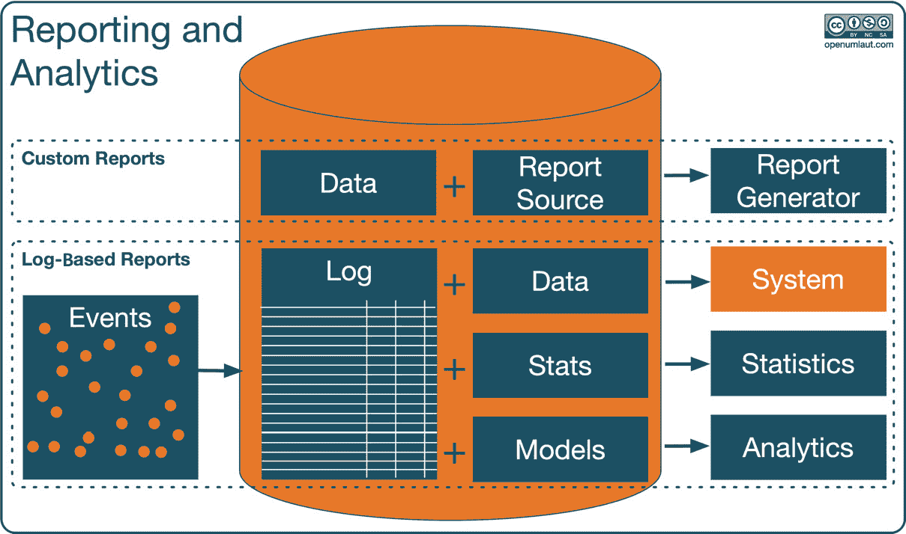

图 12.1 – 报告概述

Moodle 中有两种类型的报告：使用报告生成器创建的**自定义报告**和硬编码在 Moodle 中的**基于日志的报告**。

本章的第一部分将概述**报告生成器**，并涵盖数据源、报告构建、报告受众和计划。我们还将简要介绍一个更技术性的第三方报告生成器：可配置报告。

本章的第二部分讨论基于日志的报告。在详细概述了底层**Moodle 日志框架**及其组件、事件和日志存储之后，您将学习如何与 Moodle 日志进行交互。

最后，我们将处理两种使用日志作为其基础的更多报告技术：**Moodle 统计数据**和**Moodle 分析**。

我们在本章中不会涵盖**系统报告**——即处理特定主题的报告；它们将在相关主题被覆盖时处理。例如，备份报告将在*第十六章*中描述，*避免失眠之夜——Moodle 备份和恢复*。

在本章中，我们将涵盖以下主题：

+   使用报告生成器创建自定义报告

+   理解 Moodle 的日志框架

+   与基于日志的报告交互

+   收集统计数据

+   使用 Moodle 分析进行预测

好的，让我们从本章的第一部分开始，并使用报告生成器创建自定义报告。

# 使用报告生成器创建自定义报告

**报告生成器**最初作为 Moodle Workplace 的一部分实现，这是 Moodle 强大的灵活的学习平台，适用于企业培训和职场学习。由于其 Moodle 商业版中的流行以及其在各行业的适用性，决定将报告生成器移植到 Moodle 4。简化版已被 Moodle 采用，并已被证明是创建自定义报告的有价值补充。

因此，在我们处理数据源和报告构建之前，让我们探索报告生成器。

## 探索报告生成器

您可能没有意识到，您已经在之前的 11 章中使用了报告！如何？嗯，Moodle 做了一些非常聪明的事情：它使用内部报告来处理 Moodle 中的关键功能。例如，在第九章 *配置教育功能* 的 *技能和激励* 部分的证书模板列表是一个报告。配置更改的报告？您猜对了，又是另一个报告。每次您在任何 Moodle 工具中看到表格列表视图时，它很可能是一个内置的系统报告。

Moodle 区分两种类型的报告：

+   **内部报告**：嵌入的、预定义的报告，是 Moodle 的一部分。内部报告不能被修改或删除，因为 Moodle 依赖于它们。

+   **自定义报告**：由用户生成并向其他用户提供的报告。

本节专门讨论自定义报告，让我们看看 Moodle 的报告构建器是如何工作的。以下图表说明了报告工作流程的高级元素：

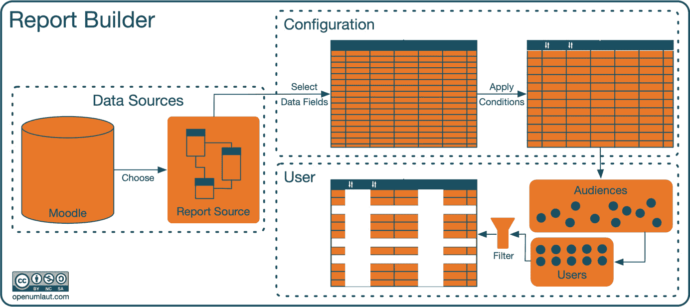

图 12.2 – 报告构建器工作流程

Moodle 将与其报告相关的数据存储在 **Moodle 数据库** 中。未来版本可能会添加外部数据源，但在撰写本文时，这是唯一可用的数据源。

最灵活的报告工具将允许您从底层数据库的每个实体中选择单个字段。然而，这要求用户熟悉整个数据库模型，该模型包含超过 100 个表以及它们之间更多的关系。相反，Moodle 提供了一些报告来源以简化报告构建器的使用。

重要提示

**报告来源**包含在构建报告时可用的一组预定义字段和关系。

根据所选的记录来源，将提供一定量的数据，可以通过以下机制进一步减少：**选择数据字段**让报告创建者决定哪些列可供使用 – 例如，学生姓名、课程名称和完成状态。**应用条件**让报告创建者决定哪些行可供使用 – 例如，来自特定学院的全部记录。报告的访问权限通过受众授予 – 例如，所有具有管理员角色的用户或所有属于特定班级的用户。

报告查看器可以通过筛选进一步减少数据量。**筛选**必须由报告创建者配置，允许您选择一个或多个标准 – 例如，按课程类别或按国家。

重要提示

报告不是静态的；它是您数据的交互式视图。

以下小节专门介绍报告工作流程的每个构建块。让我们从图表的第一部分开始：数据和报告来源。

## 选择数据和报告来源

在本小节中，我们将处理报告构建器的输入选项——您将了解它们是什么以及何时使用每个选项。

数据库是 Moodle 存储其数据的底层 **数据源**。课程、用户、课程完成情况、成绩以及其他数据，例如作者添加的学习资源信息、学习者贡献的论坛帖子以及管理员配置的系统设置，大部分都存储在数据库中。

**报告源**隐式定义了数据源中哪些元素（表和关系）将在报告中使用。可用的报告源集合包括用户配置文件信息、课程数据或群体成员资格。Moodle 开发者可以通过编程方式创建额外的报告源，预计记录源的数量将在未来的版本中增加。

在探索报告构建器之前，请确保在 **站点管理** | **常规** | **高级功能** 下启用了 **启用自定义报告** 设置。

让我们看看 Moodle 到目前为止可用的报告源。您可以通过 **站点管理** | **报告** | **报告构建器** | **自定义报告** 来管理报告，在那里您将看到一个可用报告的列表——实际上，您将看到的是一个报告。一个报告的列表！在我们的示例实例中，我们已经创建了一些报告，如图所示：

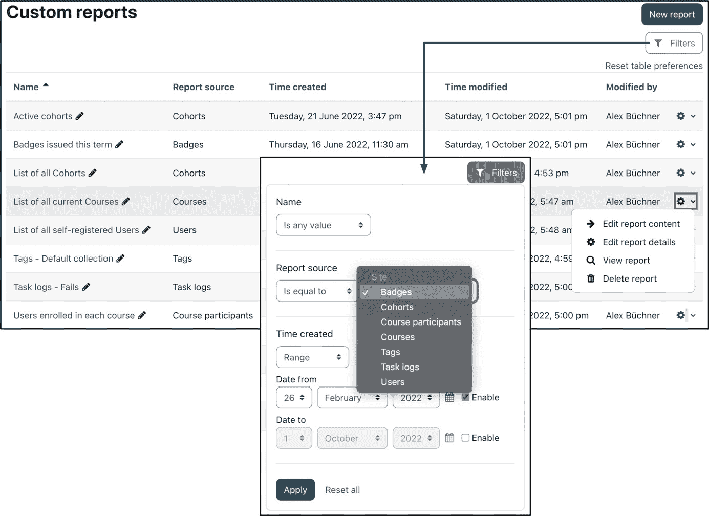

图 12.3 – 自定义报告和过滤器

报告表中显示的直观字段是 **名称**、**报告源**、**创建时间**、**修改时间**和**修改者**。可用的标准操作包括**编辑报告内容**、**编辑报告详情**、**查看报告**和**删除报告**。右侧有可用的过滤器，允许您通过**名称**、**报告源**和**创建时间**来限制显示的报告数量。

重要提示

每个报告都有一个报告源。

创建报告后，所选的报告源不能更改。要使用不同的报告源，必须创建一个新的报告。

在 **报告** 页面上选择 **新建报告** 按钮，以创建一个新的报告。随后，你将看到一个弹出窗口，如图所示：

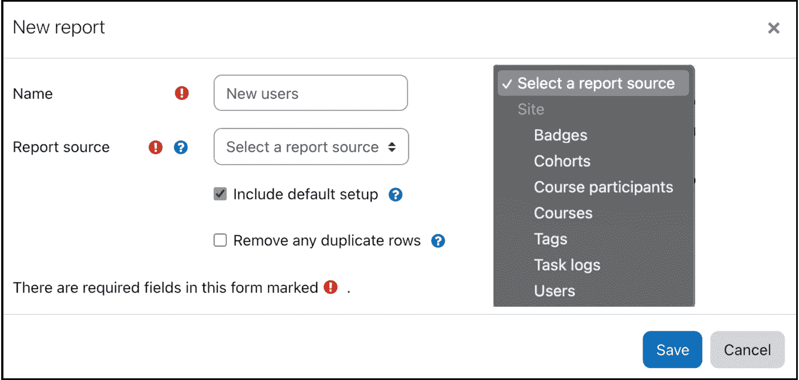

图 12.4 – 创建新的报告

一个报告包含以下两个必填设置：**名称**（在报告对用户可用时显示）和**报告源**（定义报告数据将来自哪里）。以下是在 Moodle 中当前可用的报告源：

+   **徽章**：与接收者（用户）和课程关联的徽章详情

+   **群体**：群体数据和用户成员详情

+   **课程参与者**：课程、用户以及他们的注册和课程完成情况

+   **课程**：课程和类别详情

+   **标签**：标签和标签类别

+   **任务日志**：有关计划性和临时任务的数据

+   **用户**：用户详情

以下报告源已在管道中，并且在你阅读这本书的时候可能已经可用：笔记、博客、群组、评论和文件。现有的报告源也可以通过添加更多数据字段、与其他实体的关系、条件和过滤器进行扩展。

在创建新报告时，还有两个需要关注的设置：

+   **包含默认设置**：当启用时，报告将自动填充几个预定义的列、条件和过滤器。当你开始时，建议你勾选此选项，因为它简化了构建报告的过程，我们将在下一部分进行介绍。

+   **移除任何重复行**：当启用时，任何重复行将从报告中移除。

默认情况下，你或任何具有`reportbuilder:edit`（编辑自己的自定义报告）或`reportbuilder:editall`（编辑所有自定义报告）能力的人可以创建的报告数量没有限制。如果你需要限制自定义报告的数量，请转到**网站管理** | **报告** | **报告构建器** | **自定义报告设置**并相应地调整**自定义报告限制**设置。

在同一屏幕上另一个可能提高性能的设置是**自定义报告实时编辑**。如果禁用，则在编辑报告时数据预览将被停用；否则，它将保持更新：

图 12.5 – 自定义报告设置

当你**保存**报告时，你将被重定向到实际的报告构建器，我们将在下一部分进行介绍。

## 构建报告

在本小节中，我们将处理报告构建器提供的各种功能。你将了解这些功能是什么以及如何在现实世界场景中应用它们。

报告生成器允许你通过拖放、即时预览、行内列编辑、分组和聚合来构建和自定义报告。以下带注释的屏幕截图显示了 Moodle 报告生成器的关键元素：

图 12.6 – 报告构建器界面

报告生成器中可用的以下操作：

+   **A – 数据字段面板**：按实体分组的数据字段列表

+   **B – 数据字段面板**：实时搜索字段

+   **C – 预览面板**：列名和标题的行内编辑

+   **D – 预览面板**：选择字段聚合方法

+   **E – 预览面板**：预览切换

+   **F – 设置面板**：**条件**

+   **G – 设置面板**：**过滤器**

+   **H – 设置面板**：**排序**

+   **I – 设置面板**：**卡片视图**

+   **J – 报告构建器菜单**：访问报告标签页

对于你们中的数据库专家，将报告元素映射到它们的 SQL 对应项可能会有所帮助：

+   选择的数据字段：**SELECT … FROM …**

+   条件：**WHERE**

+   聚合和分组：**GROUP BY**

+   排序：**ORDER BY**

现在您已经对报告创建界面有了初步的了解，让我们仔细看看各种元素，这些元素可以分为两类：配置字段（列）和配置设置（行）。

### 配置字段（列）

本小节处理自定义报告列的可用选项。

在 Moodle 报告生成器的左侧面板中，您将看到所选报告源的所有可用字段，它们已按实体分组。每个实体都可以展开或折叠以提高可用性。您还可以搜索字段条目以限制显示的项目数量。这些项目在之前的屏幕截图中被标记为**A**和**B**。

要将列添加到报告中，请点击左侧列表中选定的字段。列将自动作为表格中最右侧的列添加。然后您可以通过标准的**移动**手柄重新排列列顺序。要删除列，请点击标准的删除图标。

报告中可用的字段类型有几种，可以添加为列：

+   **文本字段**：例如，姓氏、部门或课程名称

+   **图像字段**：例如，用户图片或徽章图片

大多数文本字段反映了底层 Moodle 数据库中的值。然而，一些文本字段在报告生成器中预先处理以支持附加功能：

+   **超链接文本字段**：主要用于直接查看数据条目 - 例如，用户资料或课程

+   **计算文本字段**：提供数值 - 例如，类别中的课程数量

+   **分组文本字段**：为了将多个数据点作为一个单元格提供 - 例如，队列中的成员

报告生成器完全支持自定义字段，如自定义用户资料字段或自定义课程字段。它们将像任何内置变量一样出现在可用字段列表中。

报告生成器最强大的功能之一是其对**聚合**的支持。看看以下三个报告，它们具有相同的字段，但应用于**徽章接收者**列的聚合方法不同：

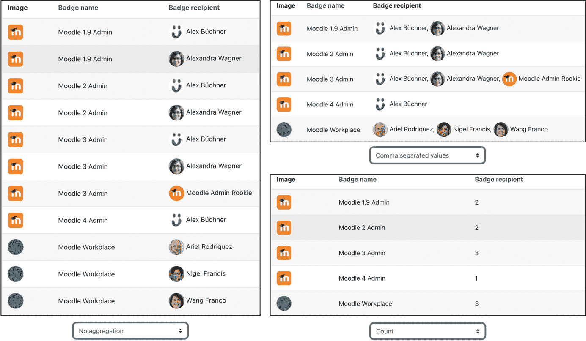

图 12.7 – 聚合

在第一个报告中，未应用**无聚合**，因此显示所有数据条目。在第二个报告中，选择了**逗号分隔值**选项，它在一个单元格中显示多个用户名。在最后一个报告中，选择了**计数**方法，显示了每个徽章的接收者数量。

根据选择的数据字段，您有多种方法可供选择，如下表所示，包括内部使用的 SQL 函数：

图 12.8 – 聚合操作

聚合函数计算一组值并返回单个值。例如，**计数**接受一组值并返回——您猜对了——项目数量。**移除任何重复行**设置在列聚合时没有效果。

结合**课程参与者**记录源和聚合方法，你可以创建强大的报告，例如以下内容：

+   每门课程注册的用户数量：**课程全名**（**不聚合**），**用户全名**（**数量**）

+   每门课程注册的用户：**课程全名**（**不聚合**），**用户全名**（**逗号分隔的独立值**）

+   每门课程的完成次数：**课程全名**（**不聚合**），**课程完成**（**独立计数**）

对于哪种字段类型有哪些可用方法，没有系统化的分类。对于每个数据字段，Moodle 提供了一组可能的聚合方法。

观众也有选项下载表格数据为各种格式，即 CSV、XLSX、HTML、JSON、ODS 和 PDF。您可以通过转到**网站管理** | **插件** | **数据格式** | **管理数据格式**来减少或重新排列该列表中的选项。XLSX 格式对于使用 Excel 的图表工具可视化数据很有用。

现在我们已经用完了在报告中自定义列的所有选项，让我们看看如何配置表格中的第二个维度：行。

### 配置设置（行）

本小节讨论了自定义或限制报告中的行的可用选项。这可以通过右侧的**设置**面板完成，在那里您可以访问**条件**、**过滤器**、**排序**和**卡片视图**折叠面板。以下四个小节将描述这些配置选项。

#### 条件

条件允许您限制报告观众所看到的数据量。例如，您可能希望从报告中排除任何已挂起的用户。

重要提示

条件是一组预定义的标准，在查看报告时始终应用。在查看模式下，无法更改条件。

根据所选的报告源，可用条件列表可能略有不同。

大多数报告源中有一个有趣的条件可用，即**选择用户**，它有三个选项：

+   **任何用户**：显示所有用户。

+   **当前用户**：报告只显示关于报告观众的数据。使用这种强大的模式，您可以创建显示个性化数据的报告，具体取决于谁在查看报告。例如，如果您希望创建一个显示报告观众在每个课程中进度的报告，请选择**课程全名**和**学生进度**字段，并将**选择用户**条件设置为**当前用户**。当学生查看报告时，他们只会看到他们注册的课程中的进度。

+   **选择**：与**当前用户**相同的原理，但你可以选择一个或多个用户。

两个更多条件让你选择值：**选择课程**和**选择类别**，包括一个**查看所有子类别**的选项。

#### 过滤器

以下两个截图显示了配置过滤器（左侧）以及从用户视角查看报告时前三个条目看起来像什么（右侧）：

图 12.9 – 报告过滤

我们在**选择用户**过滤器中描述了**当前用户**选项，它为每个查看者创建一个独特的报告。此类过滤器也会影响自动创建并按计划发送给用户的报告（请参阅下面的*安排报告部分*）。

你可以添加你想要的任意数量的过滤器。此外，过滤器列表不仅限于报告中显示的字段。例如，在用户报告中，你可能添加一个过滤器来缩小搜索范围，仅限于个别认证方法，即使该字段在报告中本身不可用。

#### 排序

四个设置中的倒数第二个设置处理数据呈现的顺序。

重要提示

排序定义了字段排序的初始顺序。

在以下截图中，数据按**类别名称**（升序排列）、**课程简称**（降序排列）和**课程全名**（升序排列）排序：

图 12.10 – 报告排序

在查看模式下，前面的顺序将最初被应用。一旦用户点击列名，数据将按此字段排序；当再次点击同一列时，排序顺序将反转。

#### 卡片视图

卡片视图功能支持报告构建器中的响应式布局设计。卡片视图允许你在块在侧边栏或使用较小设备时配置报告布局。当在小型屏幕上显示时，报告将自动切换到卡片视图。

## 报告受众

报告受众表明哪些用户有权访问报告。它们也可以用作计划报告的收件人。要访问受众，请选择报告的**受众**选项卡，在那里你可以创建以下受众：

+   **所有用户**：使用此受众群给所有用户授权

+   **分配的系统角色**：选择至少一个系统角色

+   **手动添加的用户**：选择至少一个用户（通过姓名或电子邮件地址）

+   **队列成员**：选择至少一个队列

+   **网站管理员**：Moodle 管理员 – 即你以及所有也是管理员的人

要确认现在哪些用户有权访问报告，切换到**访问**选项卡，正如你可能已经猜到的，这又是另一个系统报告。现在我们知道谁被授予了访问报告的权限，让我们配置报告发送到指定受众的时间。

## 安排报告

默认情况下，所有报告都作为拉取报告提供；也就是说，用户必须主动选择和查看报告。本节提供了配置通过报告调度器自动发送报告（称为推送报告）的说明。让用户登录查看报告不如让报告直接进入他们的收件箱有效。

要访问调度器，请选择报告的**调度**选项卡。是的，调度列表又是另一个具有预定义过滤器的系统报告：

图 12.11 – 调度报告 I

点击右上角的**新建调度**按钮以创建新的报告调度。然后您将看到一个包含以下四个部分的弹出窗口：

图 12.12 – 调度报告 II

这四个部分包含以下设置：

+   屏幕的**常规**部分包含有关调度的信息，包括要发送的报告、报告应发送的格式以及时间设置。

**名称**仅在调度列表中使用。**格式**下拉菜单允许您选择报告的文件格式。选项包括 CSV、XLSX、HTML、JSON、ODF 和 PDF。您可以通过访问**站点管理** | **插件** | **数据格式** | **管理数据格式**来减少或重新排列该列表中的选项。

`cron`进程触发发送报告的执行。

本节最后的设置`reportbuilder:scheduleviewas`能力决定了报告是否可以调度为他人查看。

+   在**受众**部分，您指定收件人是谁。您需要选择至少一个受众，如前所述。如果尚未指定任何受众，将显示警告。

+   **调度**部分包含自定义消息，其中包含任何电子邮件消息的两个标准元素：**主题**和**正文**。在撰写本文时，不支持占位符，因此您必须相应地调整消息文本。

+   在**高级**部分，只有一个选项，允许您指定**如果报告为空时**会发生什么。直观的选项有**发送空报告的消息**、**不发送报告的消息**和**不发送消息**（默认）。

有了这些，我们已经提供了报告生成器的概述，这是一个生成自定义报告的潜在强大工具。然而，它有一些限制，我们将在下一节中讨论。

## 报告生成器的限制和替代方案

报告构建器是一个基于预定义报告源创建报告的强大工具。在撰写本文时，可用的报告源数量相当有限，但预计这种限制将在不久的将来得到改变。Moodle Workplace ([docs.moodle.org/en/Report_builder](http://docs.moodle.org/en/Report_builder)) 已经包含比 Moodle 更多的报告源，所以请留意新源很快将被添加。

我们之前提到，报告创建者的主要优势是您不必熟悉 Moodle 的底层数据库模式。然而，一些管理员发现报告源的概念过于限制性，希望创建更灵活的报告。"**可配置报告**"([moodle.org/plugins/block_configurable_reports](http://moodle.org/plugins/block_configurable_reports)) 是一个流行的 Moodle 第三方插件，一旦安装，就会作为一个块出现。该插件支持以下五种类型的报告：

+   **课程报告**：使用课程数据的报告

+   **类别报告**：使用类别数据加上可选嵌入课程报告的报告

+   **用户报告**：使用用户数据及其课程活动的报告

+   **时间线报告**：针对课程、用户及其活动的跨时间报告

+   **SQL 报告**：可以使用任何有效的 SQL 语句来查询 Moodle 数据库

根据选择报告的类型，提供不同的选择标准（字段、条件、排序和计算）。此外，可以指定用于深入分析的过滤器，可以创建布局，并可以设置允许运行报告的权限。此外，插件可以绘制不同类型的图表。

可配置报告的独特之处在于您可以根据**自定义 SQL**创建报告。如果您熟悉 SQL 语言和底层 Moodle 数据库模式，您可以添加查询，例如以下屏幕截图安排中所示：

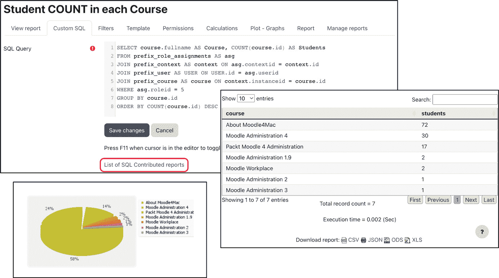

图 12.13 – 可配置报告样本

在前面的屏幕截图中，您还可以看到一个链接到**SQL 贡献报告列表**，这是一个创建报告的非常好的起点（这就是我获取示例报告的 SQL 查询的地方）。

这就结束了基于 Moodle 报告构建器的自定义报告部分，我们在这里介绍了工具的工作流程、可用的数据源和配置。除了创建灵活的自定义报告外，Moodle 还附带了一些预定义的报告，这些报告利用了本章引言中提到的日志框架。

# 理解 Moodle 的日志框架

Moodle 有一个功能强大的内置日志框架，正如预期的那样，它是完全可定制和可扩展的。日志机制背后的理念如下：

+   用户执行一个动作，触发一个**事件**。一个例子是学生在论坛上发帖。

+   **日志管理器**实体监控事件并决定是否将其记录或忽略。网站范围的日志管理器设置确定此行为。

+   日志管理器将数据发送到活动的**日志存储插件**，该插件过滤或丰富信息。传递的数据可能包含 IP 地址和时间戳。

+   然后将数据写入配置的**日志存储**。

图表的上半部分显示了此日志工作流程：

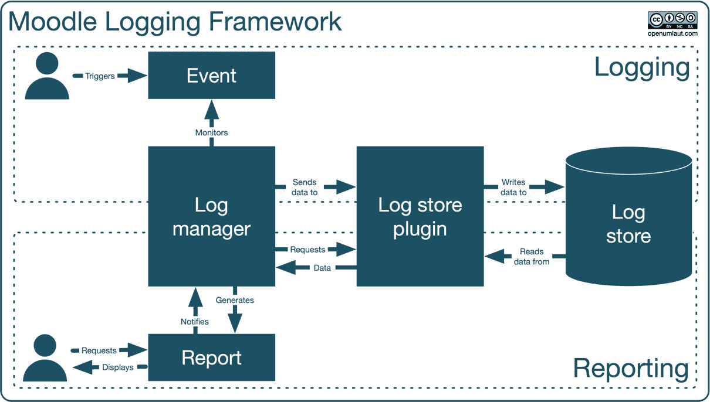

图 12.14 – 从事件到报告

现在，让我们看看当用户请求报告时会发生什么，这在上半部分的图中表示：

+   报告模块通知日志管理器，日志管理器将请求传递给日志存储插件。如果已设置多个日志存储，则用户必须选择一个。

+   日志存储插件从日志存储中读取相关数据，并将其传递回日志管理器。

+   报告模块生成报告，然后将其显示给用户。

现在，让我们更详细地查看 Moodle 日志框架的各个组成部分，从事件开始。

## 理解事件

两个紧密相关的元素处理 Moodle 中的事件 – 事件列表和事件监控规则：

图 12.15 – 事件、事件列表和事件监控规则

这些概念已在先前的图中说明，将在本小节的剩余部分详细描述，从事件列表开始。

### 事件列表

Moodle 中的大多数操作都会触发一个事件。您可以通过访问**网站管理** | **报告** | **事件列表**来查看所有可用事件的列表。随着时间的推移，该列表将增长，包括内部和外部事件。每个事件都包含以下元素：

+   **事件名称**：事件的名称和唯一的内部标识符

+   **组件**：事件所属的 Moodle 组件；例如，核心、课程模块或某些其他部分，如统计数据或日志

+   **教育水平**：有三个级别：**参与**、**教学**和**其他**

+   **数据库查询类型**：可能发生四种查询类型，即**创建、读取、更新和删除**（**CRUD**）

+   **受影响的表**：正在受影响的数据库表

+   **自**：引入事件时的 Moodle 版本

+   **遗留事件**：在遗留日志存储中触发的事件（这仅包含从 2.6 版本引入事件时的事件）

以下截图显示了按**用户**过滤的一些事件：

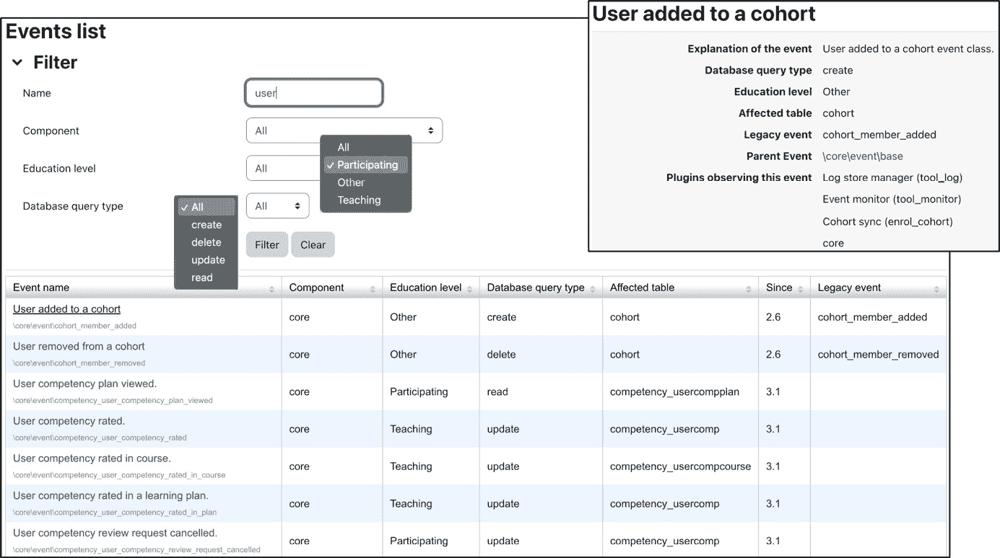

图 12.16 – 事件列表（按用户过滤）

您可以通过**名称**、**组件**、**教育水平**和**数据库查询类型**来过滤列表。通过点击事件名称，您将看到相同信息的更详细展示。在截图排列中，我们已选择**用户添加到班级**事件。除了来自事件列表中已熟悉的字段外，截图还显示了两个额外的信息项：

+   **父事件**：在内部，事件是按层次结构组织的，但信息主要与开发者相关。

+   `tool_log`); 事件监控本身；班级同步模块，确保每次用户被添加到班级时，他们也将被注册到相关课程；以及核心系统本身。

事件信息主要针对管理员，主要用于信息目的。然而，在设置事件监控规则时，它是有相关性的。

### 事件监控规则

管理员（以及具有`tool/monitor:managerules`能力的用户）可以定义您可以订阅的事件。这些活动模式表示为包含事件以及频率的规则。一旦检测到这种模式，就会触发事件，向所有订阅者发送消息。

虽然具有编辑教师权限的用户可以在课程级别设置自己的规则，但您作为管理员，更有可能定义一组必需的规则，教育工作者将订阅这些规则。

首先，您必须通过导航到**网站管理** | **报告** | **事件监控规则**来启用事件监控。

让我们通过**添加新规则**按钮添加我们的第一个事件规则。一旦您输入了**规则名称**，请选择**监控区域**。列表中的值与您在**组件**下拉菜单中遇到的值相同，如前述事件列表所示。一旦选择，**事件**列表将填充该组件支持的所有可用事件。描述是可选的，但建议您为此提供信息，以便潜在订阅者。**通知阈值**…**分钟**组合指定在指定时间段内需要多少事件才能发送**通知消息**属性。此消息的正文可以包括以下截图所示示例消息文本中的任何或所有占位符：

图 12.17 – 事件监控规则和订阅

任何具有`tool/monitor:subscribe`能力的用户都可以通过**偏好**下的**杂项**部分的**事件监控**链接订阅事件规则。一旦事件规则有订阅，则规则编辑将受到限制。

在订阅课程之前，您必须**选择一个课程**进行监控（**网站**覆盖所有课程）。从现在起，当订阅的规则被触发时，将发送通知消息。

现在我们已经详细介绍了事件，让我们来看看我们图表的日志组件。

## 日志和日志存储

日志涉及三个组件：日志管理器、日志存储插件和物理日志存储。

**日志管理器**是一个内部组件，它监控事件并将数据传递给所有启用的日志存储插件。Moodle 自带一个预定义的日志管理器；然而，将来这可能会被其他日志管理器插件所取代。目前，作为管理员，你无法配置日志管理器本身。

**日志存储插件**与一个物理日志存储相关联，并确定存储和读取哪些数据。导航到**网站管理** | **插件** | **日志** | **管理日志存储**，以查看 Moodle 的三个核心日志存储插件：**标准日志**、**外部数据库日志**和**旧版日志**。我们将忽略旧版日志，因为随着时间的推移，它们将被停止使用。

**标准日志存储**已取代了旧版日志；它支持所有新的日志概念，并提供了更好的性能。在其**设置**中，你可以指定是否**记录访客访问**，是否以**JSON 格式**（而不是序列化的 PHP）存储，以及**保留日志的时间**和其**写入缓冲区大小**。

如果你希望将日志信息写入与 Moodle 分开的数据库，你可以配置一个**外部数据库日志存储**。这种额外的数据存储对于你希望收集数据进行更详细的分析或数据仓库操作非常有用。这在下图中显示：

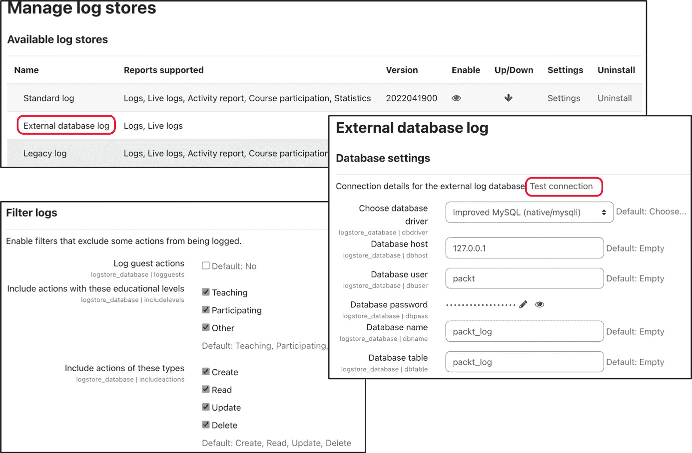

图 12.18 – 配置外部数据库日志存储

默认情况下，支持与安装 Moodle 时相同的数据库。数据库主机、用户、密码和名称设置与我们在*第一章*“安装 Moodle”中介绍的一致。此外，你必须指定一个`mdl_logstore_standard_log`。确保你测试连接（链接在屏幕顶部）；如果成功，检查将显示外部表包含的列。如果你网站上的日志流量很大且性能是问题，你也可以指定持久数据库连接的各种设置。

现在是外部日志存储插件的精彩部分。你可以指定过滤器，这些过滤器将在存储数据时被应用：

+   **记录访客操作**：这会告诉你访客操作是否被存储。通常情况下，除非你希望记录所有用户的流量，否则不需要这样做。

+   **教育水平**：这些是我们事件部分遇到的三种类型，即**教学**、**参与**和**其他**。

+   **数据库查询类型**：这些是我们事件部分遇到的四种 CRUD 类型，即**创建**、**读取**、**更新**和**删除**。

当隐私法规不允许您存储某些用户或类型的操作时，过滤日志很有用（参看*第十四章*，*遵守数据保护法规*），以及当从日志存储报告中报告不需要特定操作时；这也会对性能产生积极影响。

重要提示

外部数据库日志补充了标准日志，而不是替代它们。禁用标准日志将导致基于日志的系统报告出现故障。

您可以从[moodle.org/plugins/?q=type:logstore](http://moodle.org/plugins/?q=type:logstore)添加额外的日志存储。一个有趣的选项是**Logstore xAPI**，它将 xAPI 语句（也称为 Tin Can）发送到您选择的 LRS。

这就结束了关于日志组件的子节，它涵盖了日志存储管理器、日志存储插件以及日志存储本身。我们流程图中的最后一个元素是日志报告，我们将在下一节中介绍。

# 与基于日志的报告交互

Moodle 中有两种内置报告类型：一种是从日志存储提供数据的报告，另一种是在没有日志存储输入的情况下即时生成的报告。您可以通过访问**站点管理** | **插件** | **报告** | **管理报告**来查看报告列表，如下面的注释截图所示（左侧的图标表示它是一个课程、系统或其他类型的报告）：

图 12.19 – 系统报告

在这里，您可以查看报告何时需要日志存储，如果需要，哪些是受支持的。我们将重点关注（实时）日志，因为它们是日志报告的基础，然后再转向统计和分析。

请记住，从基于日志的报告中检索的大部分信息在课程级别也对教师可用。虽然教育工作者主要在教学方法中使用这些信息（以监控进度和衡量表现），但作为管理员，您的角色是在整个站点范围内查看这些数据。此外，如果发生任何索赔、问题或其他异常情况，例如，如果学生坚持声称提交了系统上没有的作业或教师无法从家中登录，您很可能会被找到。鉴于此类数据的敏感性和您组织的政策，必须通过角色和能力（如果可用，添加到每个报告的右侧）来停用某些操作的访问权限。

根据您的设置和配置，Moodle 会记录用户执行的每个操作的详细日志。默认情况下，标准日志中的每个记录（或点击）包含以下数据：

+   **谁**（用户）

+   **什么**（操作）

+   **何时**（日期和时间）

+   **在哪里**（IP 地址）

通过访问**网站管理** | **报告** | **日志**可以访问网站范围内的日志。在页面顶部，您可以通过过滤器交互式地深入到数据中，这在需要定位有关个人、活动或课程的数据时很有用。例如，如果学生声称他们提交了无法找到的作业，跟踪日志将能够提供线索。可用的过滤器如下：

+   **课程**：选择特定的课程或整个 Moodle 网站（网站日志）。

+   **组**：选择特定的组或**所有组**。此过滤器仅在所选课程中启用了组模式时显示。

+   **参与者**：选择特定的用户或**所有参与者**。

+   **日期**：指定特定的某一天或所有活动日。不幸的是，目前尚不能指定日期范围。

+   **活动**：选择是否要运行**所有活动**或**网站错误**的报告 – 当选择课程时，此列表会发生变化。

+   **操作**：您可以选择**所有操作**、**创建**、**查看**、**更新**、**删除**和**所有更改**。

+   **教育水平**：您可以从**所有事件**、**教学**、**参与**和**其他**中选择。我们在查看事件时遇到了后三个选项。

+   **日志存储**：如果已设置多个日志存储，您必须选择数据正在从中读取的那个。

一旦您选择了课程并点击了**获取这些日志**按钮，每个下拉菜单的内容会根据上下文敏感地改变。例如，**参与者**菜单包含在课程中有角色的所有用户的姓名，而**活动**菜单则填充了活动和资源。如果您查看 Moodle 的下拉菜单，您将看到内部发生的情况。Moodle 临时重定向到所选课程内的报告工具，其中课程日志查看器被调用，外观相同。一旦您选择了过滤条件，就会显示报告，如下所示：

图 12.20 – 日志数据

此表格信息以用户访问日期和时间的逆序显示；也就是说，最后访问的记录首先显示。表格的列代表以下信息：

+   **时间**：击中的时间。

+   **用户全名**：用户的名字 – 如果选择了特定用户，则每个行将显示相同的值。

+   **受影响用户**：如果操作影响其他用户，将显示此信息。

+   **事件上下文**：事件被触发的上下文。一个链接会引导您到上下文，例如，一个课程。

+   **组件**：事件组件（参考本章前面的*事件*部分）。

+   **事件名称**：被触发的那个事件。当选择时，将打开一个包含事件的弹出窗口。

+   **描述**：用户所做事情的简要描述——这对于查看正在访问的资源或检查个人是否查看过课程非常有用。使用内部 ID，如用户 ID、课程 ID 或论坛 ID。

+   `cli`），恢复操作（`restore`），Moodle 本身（`web`），网络服务（`ws`），或任何其他来源（`other`）。

+   **IP 地址**：未解析的 IP 地址；这对于确定用户访问页面的位置很有用（例如，从家中或组织内部）。

在结果页面底部，您可以以多种格式（CSV、XLSX、HTML、JSON、ODS 或 PDF）下载表格数据。您可以通过转到**网站管理** | **插件** | **数据格式** | **管理数据格式**来减少或重新排列该列表中的选项。

当您点击日志中的 IP 地址时，将打开一个新页面，显示用户 IP 的注册位置作为世界地图上的一个标记（这不适用于本地或私有 IP 地址），如下所示：

图 12.21 – IP 地址的地理位置

默认的查找工具称为**NetGeo**（www.geoplugin.com）。为了获得更准确的结果，您需要安装**MaxMind GeoLite**数据库的本地副本（[dev.maxmind.com](http://dev.maxmind.com)）或指定 Google Maps API 密钥。这两个设置都可以在**网站管理** | **常规** | **位置** | **位置设置**中的 IP 地址查找部分找到。

Moodle 提供过去一小时的**实时日志**，可以通过导航到**网站管理** | **报告** | **实时日志**来访问。这是一个预先准备的报告，显示了前 60 分钟内发生的活动；它每 60 秒自动更新一次。您可以通过日志阅读器选择器旁边的按钮**暂停实时更新**。实时日志在您更改了配置（例如，身份验证或注册插件）并希望确保其正确工作时很有帮助。或者，您也可以坐下来观察网站上发生的事情。屏幕格式与先前的标准日志相同。请注意，实时日志中的第一条记录是您查看实时日志的情况！

当从活动下拉菜单中选择**网站错误**时，将显示所有错误（主要是失败的登录尝试）。例如，以下屏幕截图显示的两个无效登录尝试，以及两次尝试向用户发送电子邮件失败：

图 12.22 – 错误日志

定期检查错误日志是一个好习惯，以便识别网站上的问题和潜在的未授权访问尝试。这些报告也可以设置为通过电子邮件发送给网站管理员（参考*第十三章*，*确保 Moodle 安全*）。

现在，你应该已经准备好完全与 Moodle 日志交互。本节中提到了几次统计；我们将在下一节中查看 Moodle 支持的统计分析以及我们如何从中受益。

# 收集统计

本节将教你如何设置和解释**Moodle 统计**。

Moodle 内置了一个统计模块，默认情况下是禁用的，因为该组件在磁盘空间使用和，更重要的是，内存使用方面非常消耗资源。

重要提示

只有在你需要这些信息并且可以接受一些可能显著的性能降低时，才使用统计模块。

在**网站管理** | **常规** | **高级功能**下选择**启用统计**，并通过导航到**网站管理** | **服务器** | **统计**来配置它，以下参数将可用：

+   **最大处理间隔**：启用统计模块后，Moodle 利用日志来推导统计信息。在此，你需要指定 Moodle 应该回溯多长时间来收集统计。请注意，这是一个相当消耗资源的操作。

+   **最大运行时间**：你可以限制统计收集过程允许运行的时间；这是另一种帮助你避免对系统造成过大负担的机制。

+   **处理天数**：每次统计执行中将处理的天数。

+   **用户阈值**：在此，可以指示统计模块忽略注册用户数量少于一定数量的课程。

统计计算通过`\core\task\stats_cron_task`计划任务在后台进行。强烈建议其执行时间不要与网站备份冲突，因为这两个操作都可能非常消耗资源。

让我们通过访问**网站管理** | **报告** | **统计**来查看一些统计信息。一旦你选择了**课程**、**报告类型**（视图、帖子、登录或所有这些），以及**时间段**，就会显示一个图表和一些表格信息。显示的数据表示特定一天上的*点击量*，按角色细分：

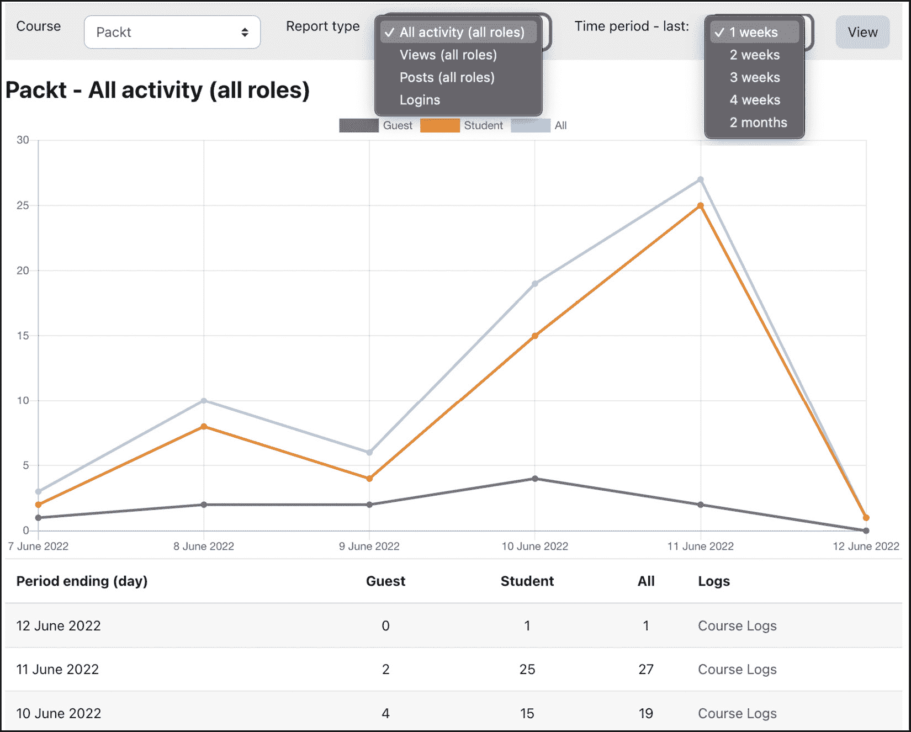

图 12.23 – 统计报告

如果没有数据显示，你可能需要重新调整你的统计设置。此外，在统计收集过程中，可能会显示一条消息，说明模块处于追赶模式。如果是这种情况，你必须等待处理完成。

一个报告显示了在一段时间内关于课程的某些基本统计信息，并使用了统计数据，位于**网站管理** | **报告** | **课程概览**。选项如下（你可以在[docs.moodle.org/en/Course_overview_report](http://docs.moodle.org/en/Course_overview_report)找到报告度量计算）：

+   **最活跃的课程**

+   **最活跃的课程（加权）**

+   **参与度最高的课程（注册）**

+   **参与度最高的课程（查看/帖子）**

每个报告都显示一个表格，并通过图表可视化课程数据。

我不知道你们的情况如何，但这两个统计报告提供的信息非常令人不满意。考虑到模块对我们系统的负担以及可用的数据量，这似乎是一个非常简单——有些人可能会说无用的——显示统计信息的方式。

统计模块的一个扩展是一个名为**概览统计**（[moodle.org/plugins/report_overviewstats](http://moodle.org/plugins/report_overviewstats)）的插件，它为您提供了关于登录用户、用户国家、首选语言以及一些课程统计的更多分析。虽然这比统计功能有所改进，但它仍然远非理想。

如果描述的统计功能不能满足您对使用数据的渴望，您可以考虑使用**Matamo**、**Piwik**（两者都注重隐私且开源）和**Google Analytics**等工具。这些网络日志分析器是功能丰富的服务，可以跟踪您 Moodle 站点的任何流量，并提供关于访客、流量来源、内容、用户定义的目标以及更多统计信息。

您有两个选项可以将网络流量分析支持添加到您的 Moodle 系统中：

+   一个专门支持之前提到的任何或所有工具的插件，例如，**Web Analytics** ([moodle.org/plugins/tool_webanalytics](http://moodle.org/plugins/tool_webanalytics))。

+   一个支持网络日志分析器的主题。在*第七章*“增强 Moodle 的外观和感觉”中提到的两个最受欢迎的第三方主题，提供不同级别的集成：**Moove**仅支持您的 Google Analytics V4 代码，而**Adaptable**有一个专门的**分析**选项卡，您可以在其中分别自定义 Google Analytics、Matamo 和 Piwik 设置。

Piwik、Matomo 和 Google Analytics 对历史浏览数据进行复杂的统计分析。另一方面，Moodle Analytics 则应用机器学习技术和模型来预测未来的结果，这是本章最后部分的主题。

# 使用 Moodle Analytics 进行预测

在本节中，您将了解**Moodle Analytics**，包括如何创建学习分析模型。

自定义和基于日志的报告是描述性的；它们告诉观众发生了什么，但不知道为什么，也不预测结果或建议用户如何改进。虽然报告告诉我们关于*谁*、*什么*、*何时*和*何地*的信息，但学习分析旨在解释*为什么*以及*效果如何*。

重要提示

Moodle Analytics 根据（历史）日志数据和当前行为预测或检测学习中的未知方面。

Moodle Analytics 支持两种类型的模型：

+   **基于机器学习的模型**：复杂的模型使用数学工具进行预测；例如，有很高可能挂科的课程

+   **静态模型**：简单模型基于假设，不需要复杂的分析；例如，未选修课程的

以下图表说明了 Moodle 分析工作流程的关键组件（改编自[docs.moodle.org/dev/Analytics_API](http://docs.moodle.org/dev/Analytics_API)）：

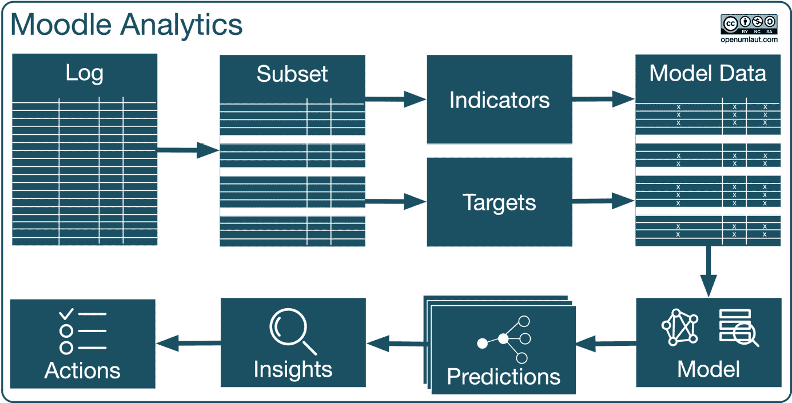

图 12.24 – Moodle 分析组件和工作流程

让我们从左上角开始回顾工作流程：

1.  **日志**是我们之前提到的所选日志文件。将根据分析模型和所选分析间隔创建日志的**子集**。

1.  **指标**，也称为预测器或特征，是你认为会导致准确目标预测的因素。一个指标可能是论坛参与度或教师可用性。**目标**，也称为类别，代表模型试图预测的事件。一个流行的目标是“有辍学风险的学生”。

1.  前三个步骤的过滤和增强结果产生**模型数据**，该数据用于当前预测模型。

1.  **模型**本身是通过使用**机器学习**（**ML**）算法创建的，这些算法执行所有幕后复杂的计算。我们可以将这个元素视为一个黑盒，并依赖于机器学习后端正确运行。

1.  **预测**是数据中的模式 – 模型数据越大、越多样化，预测就越准确。一个预测可能是一个规则，例如“如果论坛参与度低且教师可用性低，那么有辍学风险的学生就高。”

1.  当达到某些阈值时，通过预测生成**见解**。基于这些见解，应采取**行动**。

最受欢迎的机器学习技术之一是**分类**。分类的目标是通过基于训练数据集构建模型来预测目标，然后利用该模型在测试数据中预测目标。在我们的学习分析环境中，一个典型的目标是对学生是否会通过或失败，或者他们是否可能辍学的预测。

这种学习方式被称为监督学习，因为学习过程在构建模型的同时被引导向目标。以通过/不通过的场景为例，模型构建者（你！）会决定哪些数据应被视为指标；例如，课程进度、成绩和参与度水平。

一些典型的分类应用包括贷款审批、流失预测、医疗诊断和垃圾邮件检测。学习分析通常处理具有一个待预测目标（例如，通过或失败）的分类问题。Moodle 分析目前仅支持这种二进制分类。

我们只是触及了 Moodle 分析内部运作的非常基础的部分。如果你希望深入了解这个迷人的主题，一些优秀的在线资源可供参考，例如 docs.moodle.org/en/Using_analytics 和 docs.moodle.org/dev/Analytics_API。

好了，关于所有抽象的机器学习和学习分析理论的讨论就到这里。然而，在我们能够创建第一个 Moodle 分析模型之前，需要进行一些初始配置，我们将首先介绍这些配置。

## 设置 Moodle 分析

首先，确保在**站点管理** | **常规** | **高级功能**下**分析**选项已开启。设置 Moodle 分析需要配置两种类型的设置：教育领域知识和一些技术参数。

在**站点管理** | **常规** | **分析** | **站点信息**下，你应该提供有关大多数教育者和学习者如何使用你的 Moodle 站点的信息。这种教育领域知识可以被机器学习算法考虑。以下截图显示了需要配置的说明性字段：

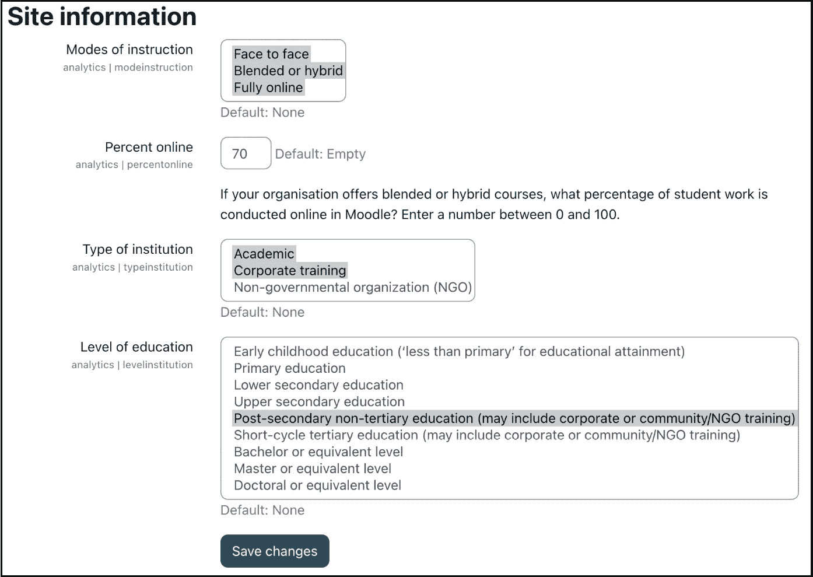

图 12.25 – 分析站点信息

你可以通过访问**站点管理** | **常规** | **分析** | **分析设置**来找到技术配置，其中参数已经详细解释：

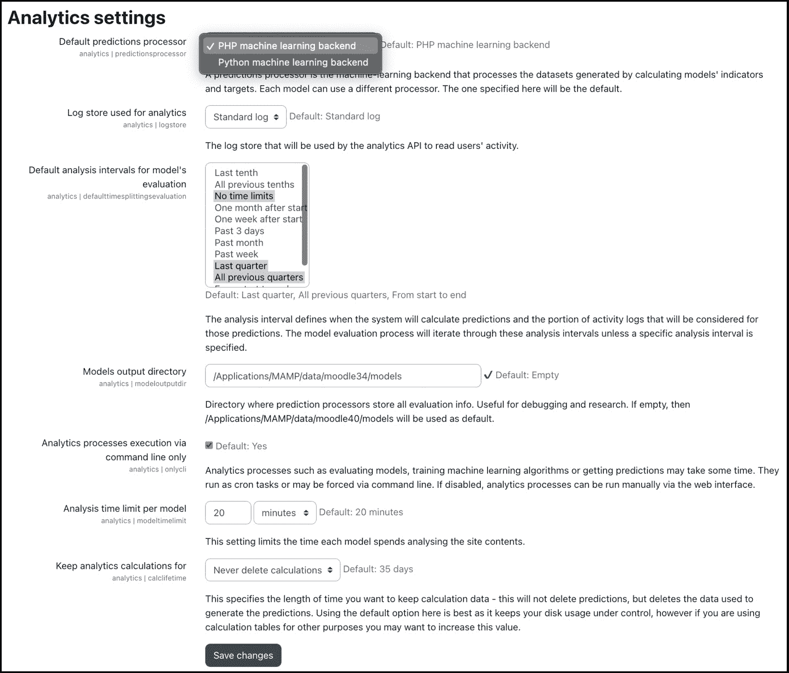

图 12.26 – 分析设置

大多数这些设置可以轻松映射到之前展示的 Moodle 分析工作流程中。两个计划任务`(\tool_analytics\task\train_models`和`\tool_analytics\task\predict_models`)分别遍历启用的模型以训练模型和生成预测。虽然你可以通过禁用**仅通过命令行执行分析过程**设置来手动执行这些过程，但这仅推荐用于测试目的，不适用于生产环境。

一旦完成领域和技术设置，我们就可以创建分析模型。

## 创建分析模型

分析模型在**站点管理** | **常规** | **分析** | **分析模型**下进行管理，如下截图所示：

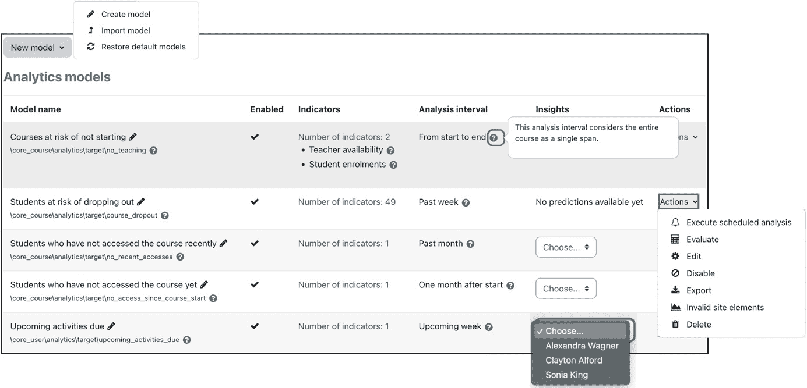

图 12.27 – 分析模型

对于每个模型，三个相关字段是**指标**、**分析间隔**和**洞察**：

+   **指标**：基于许多 Moodle 实例和一些 Moodle 合作伙伴站点中的学生参与经验模型，有近 60 个预定义的指标可用。这些指标分为两种类型：认知深度和社会广度。您可以在[docs.moodle.org/en/Learning_analytics_indicators](http://docs.moodle.org/en/Learning_analytics_indicators)上找到有关 Moodle 分析指标的更多详细信息。

+   **分析间隔**：这种时间分割方法定义了 Moodle 何时计算预测以及将考虑用于这些预测的日志部分。

+   **洞见**：这些是“有趣”的预测结果。选择取决于模型类型，例如，有退课风险的用户。这些洞见也会触发事件，例如，向课程教师发送通知或向学生发送消息。以下是一个提供给课程教师的**洞见**样本，他们也可以提供反馈，这些反馈将在后续分析中予以考虑：

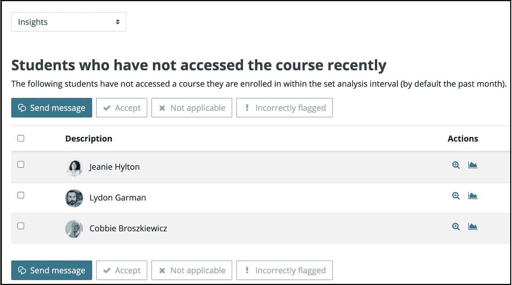

图 12.28 – 洞见示例

要调整模型的设置，请选择**操作**菜单中的标准**编辑**选项。以下是一个**有退课风险的学员**模型的示例：

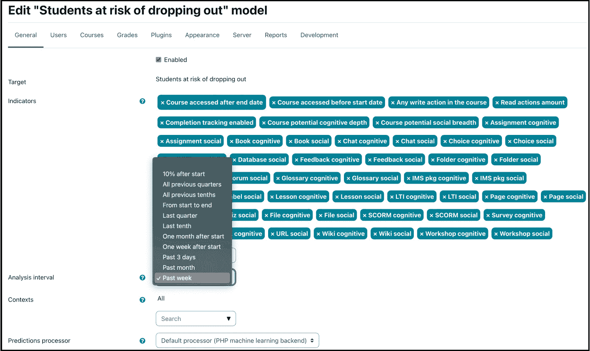

图 12.29 – 分析模型详情

您可以修改**指标**和**分析间隔**的列表。此外，您可以将模型构建限制在**上下文**中 – 即选定的课程类别和课程。

重要提示

当模型被修改时，所有之前的预测将被删除。

在选择目标后创建新模型时，您必须配置相同的参数。以下是在 Moodle 中可用的以下目标（模型将预测的内容）：

+   有可能无法达到课程分配能力的学员（机器学习）

+   有可能无法满足课程完成条件的学员（机器学习）

+   有退课风险的学员（机器学习）

+   有可能无法达到课程最低通过分数的学员（机器学习）

+   有可能不开设的课程（静态）

+   最近未访问课程的学员（静态）

+   尚未访问课程的学员（静态）

+   即将到期的活动（静态）

在本节开头，我们提到 Moodle 分析支持基于机器学习和静态模型。在静态模型中，指标是固定的；您无法像在基于机器学习的模型中那样修改这些指标。

在**操作**菜单中还有其他几个特定于分析的命令（其中一些选项仅在**站点管理** | **常规** | **分析** | **分析设置**下的**仅通过命令行执行分析过程**设置被禁用时才会出现）：

+   **执行计划分析**：使用系统上可用的新数据训练机器学习算法，并为正在进行的课程获取预测

+   **洞察报告**: 根据模型的不同，将显示已发现的洞察以及关于个别目标的信息

+   **导出**: Moodle 分析模型可以以 JSON 格式导出，并在选择 **新建模型** 按钮后通过 **导入模型** 选项导入

+   **无效站点元素**: 列出无法由该模型分析的元素

+   **清除预测**: 清除所有模型预测和训练数据

Moodle 分析是 Moodle 中最强大的工具之一，但同时也是使用最少的一个。无论是由于其复杂性还是对机器学习算法缺乏信任，我不清楚。希望我们已经在这方面提供了一些启示，并为你提供了向学习者和教育者提供 Moodle 分析技能。

# 摘要

Moodle 为教师和管理员提供了一系列的报表功能。在本章中，我们专注于管理员交互或需要配置并提供给用户的报表工具。即使你不是数据狂热者，我也希望所提供的报表功能能帮助你在日常管理工作中。

新引入的报告生成器是一个灵活且交互式的自定义报告工具。你已了解了报告生成器，包括数据源、报告构建、受众和计划。未来可提供的报告源越多，你将越不需要第三方工具，例如我们简要介绍的配置报告。

在本章的第二部分，你了解了 Moodle 记录框架的各个方面，包括其组件、事件和日志存储。你还与 Moodle 日志进行了交互，这是管理员日常工作中最常用的工具之一。

记录框架为统计和学习教育分析提供了基础，我们已在专门的章节中进行了介绍。

Moodle 报表，尤其是新引入的报告生成器，最近经历了一次重大改观。预计很快将引入更多功能。另一个不断改进的主题是 Moodle 的安全性，这是下一章的主题。
