# 优化 Moodle 性能

基于网络的系统性能是一个关键问题，管理员配置、监控和微调 LMS 以实现最大速度是关键责任。虽然 Moodle 有潜力扩展到数以万计的并发用户，但良好的性能管理是保证足够可扩展性的必要条件。

在概述了主题之后，我们将涵盖与 Moodle 性能和优化最相关的主题：

+   **优化 Moodle 功能性能**：我们将探讨 Moodle 函数和 Moodle 活动中的性能问题。优化它们的性能通常是在提高速度和可能减少功能之间进行权衡，这一点将在讨论中涉及。

+   **Moodle 通用缓存 (MUC)**：我们将介绍强大的 MUC 的不同元素，即缓存类型、缓存存储和缓存定义。然后我们将向您介绍一些 MUC 性能测试和不同的缓存选项。

+   **优化 Moodle 系统性能**：我们将处理一系列与系统相关的性能设置，包括会话处理、cron 管理和计划任务、配置全局搜索以及设置系统路径。

我们将在本章的末尾简要介绍 Moodle 性能分析和监控部分。

# 理解 Moodle 性能

通用网络应用程序，尤其是 Moodle，具有非常明显的应用层，包括操作系统、Web 服务器、数据库服务器以及用编程语言开发的应用程序。每一层在优化方面都有其独特之处。我们将专门关注 *应用层*，这是本书的重点，如下图所示：

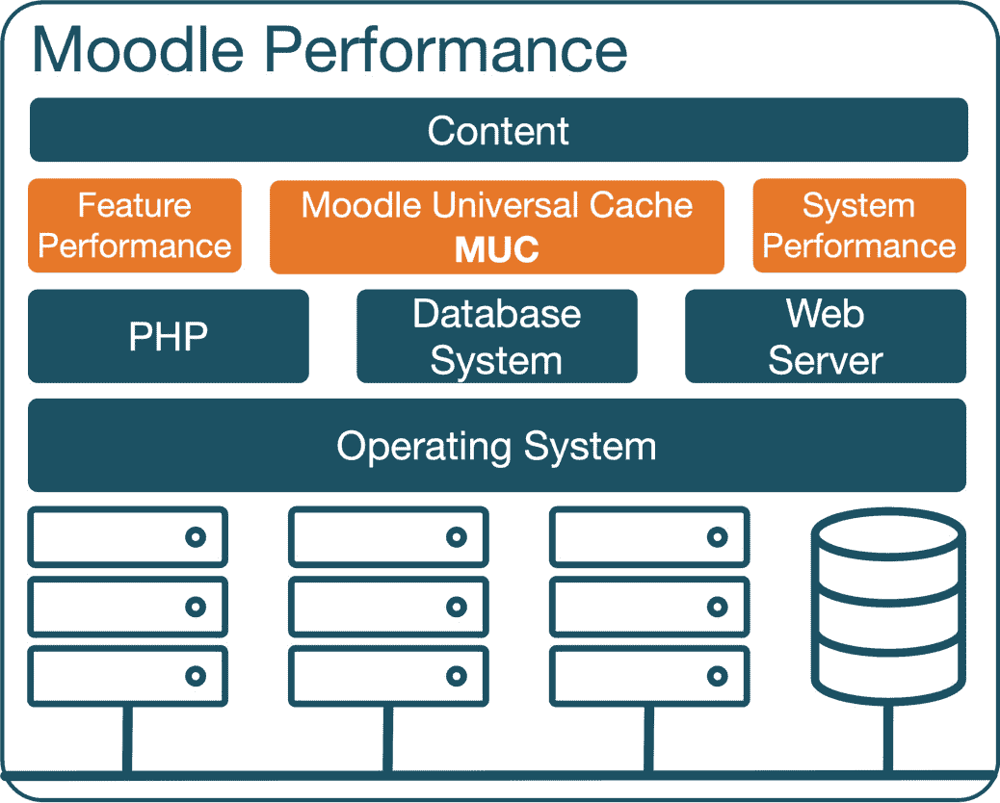

图 15.1 – Moodle 性能

以下方面没有详细讨论，有必要参考有关性能和优化问题的相应文档：

+   **操作系统性能**：操作系统的选择和配置将显著影响 Moodle 的性能。原则上，Linux 或任何其他 Unix 衍生系统比任何其他操作系统表现更好。PHP 应用程序，如 Moodle，在 Windows 环境中的运行速度比在 Linux 环境中慢得多。这方面的某些内容在 *第一章*，*安装 Moodle* 中有所涉及，当时我们讨论了 Moodle 的安装。

+   将 `config.php` 中的 `$CFG->dbhost` 条目从 `localhost` 更改为数据库的 IP 地址。后者要复杂得多，需要强大的数据库管理技能。

关于哪种数据库最适合 Moodle 的讨论也有很多。虽然开源阵营在 MySQL、MariaDB 和 PostgreSQL 之间分裂，企业则在 MS SQL Server 和 Oracle 之间分裂。无论您选择哪种系统，一个设置良好并经过调优的数据库总是比使用默认设置的数据库性能更好——“最好的数据库系统是你所了解的系统”。

+   **Web 服务器性能**：每个 Web 服务器（Apache、**互联网信息服务**（**IIS**）、nginx 等）都提供了一系列优化设置，包括内存处理、缓存、进程管理和其他小调整。

+   **PHP 性能**：有几种方法可以强制 PHP 以显著更快的速度执行代码。做到这一点的关键是使用 PHP 加速器，结合良好的内存管理和缓存技术。Moodle 支持**Zend OPcache**，默认情况下是预编译的。Zend OPcache 通过代码缓存和优化加快 PHP 执行速度。它将预编译的脚本字节码存储在共享内存中。您可以通过访问**站点管理** | **服务器** | **环境**来检查 OPcache 是否正常工作，如下面的截图所示：

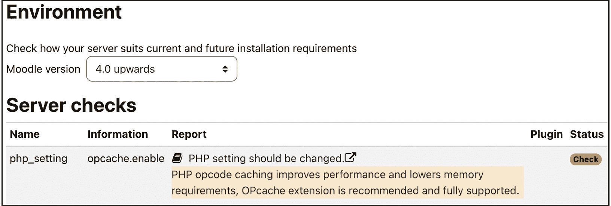

图 15.2 – Zend OPcache 检查

您的 `php.ini` 文件可能包含以下条目（有关详细信息，请参阅[docs.moodle.org/en/OPcache](http://docs.moodle.org/en/OPcache)):

```php
[OPcache]
  opcache.enable = 1
  opcache.memory_consumption=128
  opcache.interned_strings_buffer=8
  opcache.max_accelerated_files=8000
  opcache.revalidate_freq=60
  opcache.fast_shutdown=1
  opcache.enable_cli=1
; Required for Moodle
opcache.use_cwd = 1
opcache.validate_timestamps = 1
opcache.save_comments = 1
opcache.enable_file_override = 0
```

在[moodle.org/plugins/tool_opcache](http://moodle.org/plugins/tool_opcache)有一个方便的插件可用，它为 Moodle 添加了一个 PHP OPcache 管理 GUI，一个用于重置 PHP OPcache 的 CLI 工具，以及一个用于 PHP OPcache 的 Nagios 检查。

+   **硬件性能**：我们在*第一章*，*安装 Moodle*中提到，没有一种适合所有情况的理想硬件配置方法。对于单服务器系统，关键是 RAM：越多越好。就这么简单。一旦并发级别超过一定水平，在负载均衡环境中使用多个 Web 服务器是不可避免的。

+   **网络性能**：网络是大多数 IT 基础设施的骨干，因此可能成为性能瓶颈。您的拓扑、软件和硬件必须正确配置，以确保网络性能良好，没有典型的如数据包丢失等问题。

+   **内容性能**：由您的课程创建者或主页设计师创建和上传的内容将对您的系统性能产生影响。虽然您不能指定哪些学习资源被添加到 Moodle 中，但您可能希望推荐两种主要策略来减少内容对系统的影响：首先，课程和主页中的内容量应保持在一个可管理的范围内，避免著名的*死亡滚动*。其次，内容应进行优化，特别是办公文档（例如，PDF 文件而不是 Word 文件）、图像（分辨率和颜色深度）以及音频/视频（采样率和分辨率）。

虽然所有上述标准都适用，但某些元素可以即时更改。例如，在考试周，您可能考虑增加 Moodle 可用的内存，而在暑假期间，您可以减少服务器数量以进行维护。更复杂的设置允许您指定负载和使用阈值，这些阈值可以动态触发资源分配。

对于每个提到的区域，都有配置文件工具、监控系统、基准测试和压力测试可用，以帮助您判断哪些性能瓶颈存在，以及优化后是否已减少。

Moodle 文档中有一个专门针对性能和优化的区域。您可以在[docs.moodle.org/en/Performance](http://docs.moodle.org/en/Performance)找到大部分相关信息和相关网站的链接。

您应该记住，Moodle 的性能不能独立看待。例如，提高安全性在性能降低方面是有代价的；在整个站点上运行 HTTPS 高度推荐，但它会减慢某些操作。这里展示的跷跷板显示了某些典型权衡：


图 15.3 – 与世界其他地区的性能比较

您将经常面临的一个权衡是性能与功能，某些功能会损害系统运行的快速性。Moodle 随附一个基本的性能报告（**站点管理** | **报告** | **性能概述**），显示了这些权衡的一些例子。

我们将通过查看一些可以优化但会影响一些或所有用户的一些 Moodle 功能来启动性能优化的列表。

# 优化 Moodle 功能性能

本节标题略有误导性，因为优化 Moodle 功能实际上意味着限制其功能。本节中的建议对性能有积极影响，但可能对用户功能有负面影响。虽然某些功能可能是可废弃的（例如，统计数据），但其他功能应该是不可协商的，如备份。

我们已经将 Moodle 功能在性能优化背景下分为 Moodle 函数和 Moodle 活动。

## 优化 Moodle 函数

在本小节中，我们收集了一些影响您 LMS 性能的 Moodle 工具。以下大多数功能已在本书的其他部分处理，我们提供了相应章节的链接：

+   **课程备份**：正如您将在下一章中了解到的那样，课程备份在执行过程中会影响性能，尤其是在大型系统中。如果可能，请在整体系统负载较低时安排备份程序。如果您关闭了网站范围内的课程备份并改用系统级备份，可以减少性能问题，但会失去恢复单个项目的能力。一种折衷方案是仅包含必要数据，并省略不太相关的信息，例如日志文件。所有这些内容将在*第十六章* *避免失眠之夜 – Moodle 备份和恢复*中处理。

+   **日志文件**：在*第十二章* *通过 Moodle 报告和分析获得洞察力*中，我们探讨了 Moodle 的日志记录、报告和分析。跟踪用户行为可能会损害您的服务器性能，因为必须创建并保持日志的更新。建议的做法是仅记录将进行分析和报告的数据。三个参数决定了日志的量：日志存储的数量、存储的字段数量以及日志保留的时间。

+   **统计信息**：如果您已启用统计功能，请注意，每当更新统计信息时，它可能会对您系统的性能产生深远影响。请回到*第十二章* *通过 Moodle 报告和分析获得洞察力*中的*收集统计信息*部分，并确保配置对您系统的最小影响。

+   **主页课程**：主页可能会被所有用户频繁访问。在拥有众多课程的网站上，每次调用主页时都显示所有课程不太可能提供良好的用户体验。您可以通过访问**网站管理** | **常规** | **网站主页** | **网站主页设置**来限制**最大课程数**和**最大分类深度**参数。

+   **角色和用户**：我们专门用一章来介绍角色(*第六章* *管理权限、角色和能力*)。Moodle 角色系统的强大灵活性是有代价的，那就是在上下文层次结构中需要大量查找时（避免全局角色）以及频繁应用覆盖机制时，性能会有轻微下降。

+   **用户选择器**：用户选择器在 Moodle 的各个地方都有显示。如果您在拥有大量用户的课程中遇到速度问题，可以通过导航到**网站管理** | **用户** | **权限** | **用户策略**来调整**每页最大用户数**设置。

接下来是 Moodle 活动，它提供了一些性能调整设置。

## 优化 Moodle 活动

在优化 Moodle 活动时，虽然会对性能产生积极影响，但只有在用户可以接受功能损失的情况下才应实施。以下是一些可以调整的模块：

+   **成绩册优化**

由于成绩册的复杂性，**成绩**菜单中的某些设置会影响性能。一般来说，当需要进行更多聚合和其他计算时，成绩册数据存储的填充会变慢。例如，**包含子类别的聚合**参数在**网站管理** | **成绩** | **成绩类别设置**中会增加计算成绩的轻微开销。

影响性能的第二个与成绩册相关的区域是成绩册历史记录，它迫使 Moodle 跟踪任何成绩的变化。转到**网站管理** | **服务器** | **清理**，您将在底部看到两个成绩册历史记录设置：

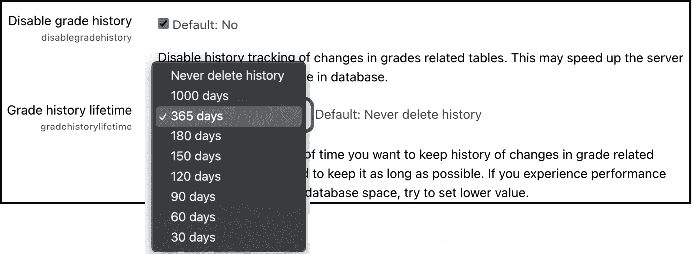

图 15.4 – 成绩册历史设置

成绩册历史记录默认开启，并且值永久保留。您可以选择完全关闭该功能或限制您希望保留成绩条目的时间。

您可以在*第九章*的*配置成绩和成绩册*部分找到有关成绩册的更多详细信息，*配置* *教育功能*。

+   **聊天优化**

默认情况下，Moodle 聊天使用**AJAX**方法，与**正常**方法一样，会定期联系所有参与客户端。这两种方法的优势在于它们无需配置且可在任何系统上运行；劣势是它们对服务器性能有显著影响，尤其是在聊天活动经常使用时。一种解决方案是使用**聊天服务器**守护进程，它确保聊天环境可扩展。然而，该守护进程，一个在后台运行的小型系统级程序，必须在操作系统级别安装，并且仅在 Unix 系统上工作（请参阅您的管理指南了解如何进行此操作）。

要更改 Moodle 使用的聊天方法并配置一些性能参数，请转到**网站管理** | **插件** | **活动模块** | **聊天**。我们在*第十章*的*同步通信*部分讨论了这些问题，*配置* *技术功能*。

以下表格列出了与性能相关的设置及其应用方法：

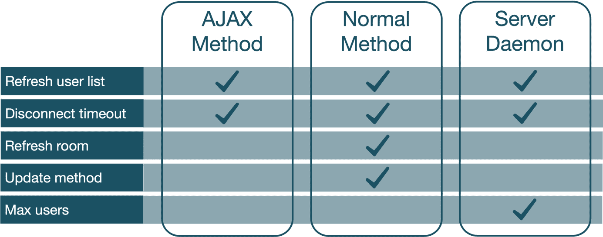

图 15.5 – 聊天性能设置

+   **论坛优化**

在拥有大型论坛的系统上，跟踪未读帖子可能会减慢活动速度。尽管影响相对较小，但可以通过转到**网站管理** | **插件** | **活动模块** | **论坛**来关闭跟踪，在那里您将找到**跟踪未读帖子**和**允许强制阅读**跟踪参数。

+   **Moodle** 的 **过滤器设置**

当我们查看 *第九章* 中关于 *配置教育功能* 的功能时，我们关注了过滤器功能。现在，让我们再次查看过滤器，突出一些性能问题。以下是一个按优先级排序的列表，当通过访问 **站点管理** | **插件** | **过滤器** | **管理过滤器** 来设置过滤器时：

1.  激活课程创建者所需的全部过滤器，但不能超过这些。过多的活动 Moodle 过滤器会影响服务器负载，尤其是在低端系统上。活动过滤器的数量会增加扫描每一页所需的时间，因为过滤器是按顺序应用的，而不是并行应用。

1.  使用 **关闭，但可用** 设置尽可能多地配置活动过滤器。然后它们可以在任何课程或活动级别本地激活。

1.  将最常用的过滤器（通常是多媒体插件）放在列表的顶部，因为过滤器是按先到先服务的原则应用的。

1.  缓存应用于使用文本过滤器的页面，这一主题将在 *MUC* 部分后面讨论。此外，您应该优化 **站点管理** | **插件** | **过滤器** | **通用过滤器设置** 中的通用过滤器设置：仅在需要时开启 **过滤器上传文件**。此外，如果结果行为可接受，将 **每页匹配一次**、**每文本匹配一次** 和 **系统上下文内的导航匹配** 设置为 **开启**。我们已在 *第九章* 的 *配置过滤器* 部分讨论了这些参数，*配置* *教育功能*。

在 Moodle 活动和模块中还有其他一些小的调整——例如，超时值——您在遇到任何性能问题时需要调整这些设置。

比功能性能更大的问题是可扩展性，这是由并发用户引起的。我们将在本章的剩余部分处理这个问题，从探索强大的 MUC 开始。

# Moodle 通用缓存 (MUC)

缓存将频繁访问的数据存储在临时存储中，并使用缓存副本而不是预先获取（从磁盘）或重新计算（在内存）的数据来加速其访问。

注意

缓存已被证明是最有效的性能优化技术之一，Moodle 也不例外。

Moodle 包含一个名为 MUC 的强大缓存框架，它允许某些功能利用不同的配置缓存服务 ([docs.moodle.org/en/Caching](http://docs.moodle.org/en/Caching))。

## 理解 MUC

在我们查看 MUC 的工作原理之前，让我们探索一些基本概念：缓存类型（模式）、缓存存储和缓存定义。以下图表显示了这三个概念以及它们如何在 MUC 中协同工作：

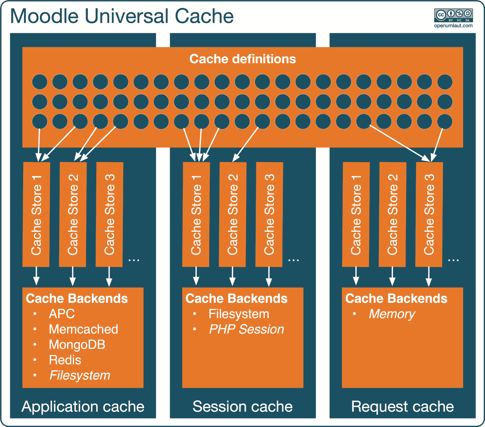

图 15.6 – Moodle 通用缓存

Moodle 有近 100 个缓存定义——例如，获取语言字符串、配置设置或处理过的 CSS。缓存定义映射到缓存存储，这些存储作为不同缓存类型的缓存后端的连接器。到本节结束时，这一切都将更加清晰。

让我们逐一介绍每个组件，从缓存类型开始。

### 缓存类型

Moodle 中有三种不同的**缓存类型**，通常被称为缓存模式：

+   **应用程序缓存**：应用程序缓存处理 Moodle 特定的操作——例如，语言字符串或配置设置的缓存。这是最常用的缓存，因为它对 Moodle 性能的影响最大。

+   **会话缓存**：这基本上与您的 PHP 会话缓存相同。它只在极少数场景中使用；我们不需要进一步详细说明这一点。

+   **请求缓存**：正如其名所示，这种类型的缓存仅存储在请求的生命周期内，允许开发者优化代码。再次强调，这不是我们作为管理员必须担心的缓存类型。

下面是不同缓存类型的概述：

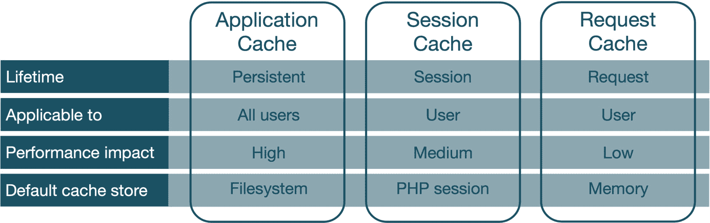

图 15.7 – 缓存类型（模式）

**图 15**.7 的最后一条条目描述了默认的缓存存储。这些是什么以及为什么它们在 Moodle 中至关重要将在以下小节中介绍。

### 缓存存储

在 Moodle 中，缓存存储是连接到 MUC 后端的插件。

重要提示

**缓存存储**连接 Moodle 到物理存储，其中缓存的 数据被存储。

如前所述，默认的缓存存储形式为文件系统（应用程序缓存）、PHP 会话（会话缓存）和内存（请求缓存）。对于大多数设置，这些是足够的，但对于大型网站，考虑一个专用应用程序缓存存储是有益的。

Moodle 附带以下四个应用程序缓存存储插件（描述大多取自各自的网站，而不是一些技术术语的彩票游戏）：

+   **APC 用户缓存（APCu）**：替代 PHP 缓存是 PHP 的内存键值存储

+   **Memcached**：用于存储来自数据库调用、API 调用或页面渲染结果的小块数据的内存键值存储

+   **MongoDB**：一种可以配置为运行得像内存数据库的 NoSQL 数据库系统

+   **Redis**：一个内存数据结构存储，用作可选持久性的分布式、内存、键值数据库、缓存和消息代理

其他缓存后端的插件可以在[moodle.org/plugins/?q=type:cachestore](http://moodle.org/plugins/?q=type:cachestore)的**缓存存储**部分找到。

所有支持的缓存存储都可以在**站点管理** | **插件** | **缓存** | **配置**中找到。在我们的系统中，除了 APCu 之外，所有缓存存储都已安装和配置在系统级别，因此在**就绪**列中有勾选标记。**支持**列指示缓存存储支持哪些功能；选项包括**ttl**（生存时间）、**数据保证**、**键感知**、**多个标识符**和**按键搜索**，如以下截图所示：

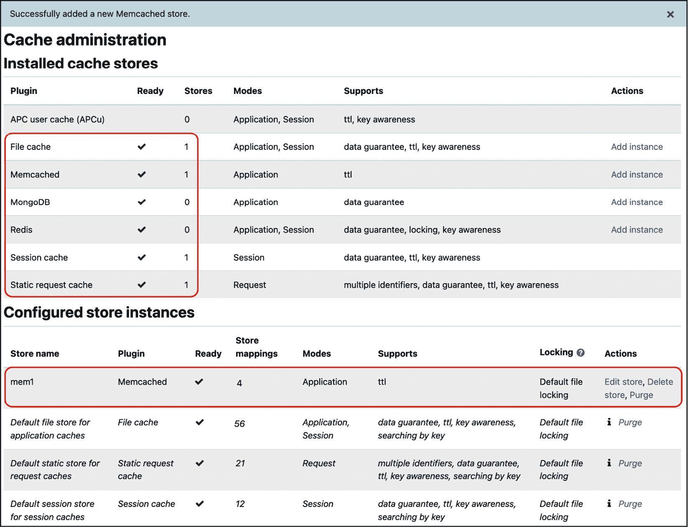

图 15.8 – 缓存存储

对于每个配置的缓存类型，您可以通过**操作**列中的相应链接添加实例。每个缓存存储有不同的设置，这取决于缓存后端支持的功能。以下是流行的**Memcached**存储的参数，这些参数在[docs.moodle.org/en/Caching#Memcached](http://docs.moodle.org/en/Caching#Memcached)中有文档说明：

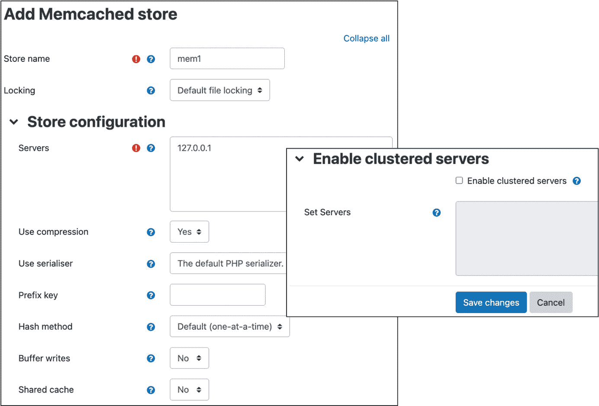

图 15.9 – 添加 Memcached 缓存存储

一旦您设置了您的缓存存储和缓存实例，您必须添加**存储映射**，这是我们将在下一部分讨论的缓存定义的一部分。

### 缓存定义

Moodle 中的不同功能支持缓存。多年前，有一个单一的、统一的缓存，要么被某个功能利用，要么没有被利用。现在，通过 MUC，每个功能都通过**缓存定义**来表示，这些定义可以单独配置。在撰写本文时，有超过 90 个缓存定义可用，预计这个数字会随着每个版本的发布而增加。对于每个定义，以下信息是可用的：

+   **定义**：被缓存的特性的名称。

+   **模式**：缓存类型（**应用**、**会话**或**请求**）。

+   **组件**：定义所属的 Moodle 组件（**核心**或模块）。

+   **区域**：功能所属的章节——仅对开发者相关。

+   **存储映射**：如果没有进行自定义，这将默认为缓存模式的默认缓存存储；否则，新设置的值。

+   **共享**：默认情况下，这将设置为**站点标识符**。当修改时，可能的值是**所有人**、**版本**和**自定义键**（见下一条项目符号列表）。

+   **可以使用本地存储**：仅在多服务器系统上相关。

在**操作**列中，您有**编辑映射**、**编辑共享**选项，以及一个**清除**选项来清除此特定定义的缓存。

**编辑** **映射**允许您指定哪个缓存存储被用作主存储，对于某些定义，也用作最终存储。这是您指定特定功能（缓存定义）使用的存储的地方。

默认情况下，每个缓存定义都在站点的实例之间共享。然而，在某些情况下，您可能希望将其更改为以下任何共享选项：

+   **所有人**：系统中的每个用户。

+   **具有相同 ID 的网站**：如果您在单个服务器上运行单个版本的 Moodle，这与前面的点相同。如果您在多服务器设置上运行 Moodle，所有系统都将包括在内。

+   `wwwroot`，只有具有相同版本号的网站将被包括。

+   `wwwroot`，您可以通过自定义键将它们分组。例如，您可能希望将一个国家的所有实例缓存在一个存储中。

要清除特定定义的缓存，只需选择**清除**选项。以下截图显示了一些缓存定义和描述的值：

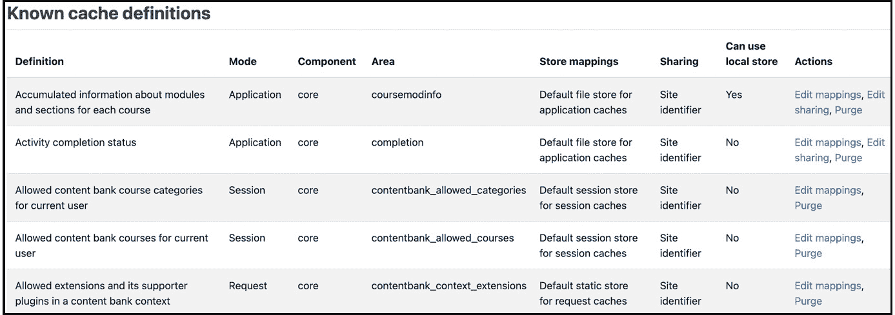

图 15.10 – 缓存定义和映射

在**网站管理** | **插件** | **缓存** | **配置**页面上还有两个我们没有介绍过的元素：

+   **缓存锁实例摘要**：在共享环境中存在不同的锁定机制，缓存也不例外。默认情况下，Moodle 附带默认的文件锁定机制，并且可以安装额外的锁实例。然而，截至印刷时，在[moodle.org/plugins](http://moodle.org/plugins)上没有为 Moodle 4.x 提供此类插件。

+   **无映射时使用的存储**：您可以指定哪些默认映射将用于哪种缓存类型。

现在我们已经涵盖了 MUC 的所有相关概念，让我们看看在优化您的 Moodle 网站时需要考虑的项目。

## 配置和测试 MUC

我们已经探讨了 MUC 的复杂性。虽然这在粒度优化方面提供了巨大的灵活性，但它使得制定一个通用的配置变得不可能。Moodle 社区中有人将 MUC 控制面板比作音乐会上的大型调音台：它提供了许多可以操作的旋钮，但除非您知道每个旋钮的作用以及它们如何协同工作，否则您不太可能得到好的结果。

几个因素会影响 MUC 的配置：

+   系统的使用（数量、多样性、功能、类型）

+   基础设施（单个服务器、多个服务器、虚拟化等）

+   使用的缓存存储类型

尤其是在谈论系统使用时，几乎不可能量化这一点，因为它始终在变化。在暑假期间，使用量将最小；在考试时间，系统负载可能会上升，等等。

性能优化是一项持续进行的练习，伴随着定期的性能测试。Moodle 为不同的缓存类型提供了基本的性能测试（**网站管理** | **插件** | **缓存** | **测试性能**）。以下是一个示例，您可以查看 10 万个唯一请求的结果；文件缓存比会话缓存慢得多，这种表现并不令人意外：

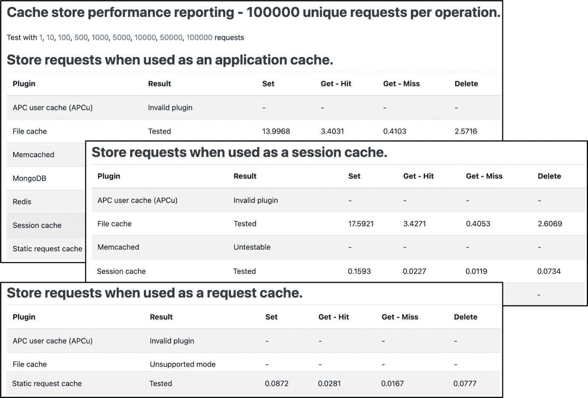

图 15.11 – 缓存存储性能测试

虽然在 Moodle 中有一个内置的性能测试工具很方便，但它有两个显著的缺点：首先，一些插件被归类为**不可测试**，例如**Redis**和**Memcached**；其次，测试运行仅模拟一些独特的请求，但不会在用户位于您的系统上时反映其行为。为了克服这些缺点，需要进行适当的性能分析和监控，这将在本章末尾讨论。

在管理区域中分散着几个与缓存相关的设置，您应该根据需求进行定制：

+   **语言缓存**：我们在*第十章*，“配置技术功能”中详细讨论了本地化问题，其中我们介绍了 Moodle 处理多种语言的配置。除了将语言数量保持在最小值外，还应利用语言缓存。

语言包被缓存以提高语言字符串的检索速度。您可以通过访问**网站管理** | **语言** | **语言设置**来找到**缓存语言菜单**和**缓存所有语言字符串**参数。除非您修改了语言包，否则强烈建议您保持这两个设置启用，因为它们缓存了所有语言字符串而不是动态加载。

+   **主题缓存**：Moodle 将主题的图片和样式表缓存到本地，无论是在网页浏览器中还是在服务器上。除非您正在设计或修改主题（实际上您也不应该在运行中的系统上这样做），否则在**网站管理** | **外观** | **主题** | **主题设置**中的**主题设计师模式**设置应保持关闭状态。

您可以通过访问**网站管理** | **外观** | **主题** | **主题选择器**来使用**清除主题缓存**按钮清除主题缓存。

+   **JavaScript 缓存**：Moodle 使用 JavaScript 和 AJAX。除非您是开发者，否则应保持**网站管理** | **外观** | **AJAX 和 JavaScript**中的**缓存 JavaScript**设置开启。同样，同一页面上的**YUI 组合加载**也适用。

+   **RSS 缓存**：RSS 源被本地缓存。您可以通过更改**网站管理** | **插件** | **块** | **远程** **RSS 源**中的**超时**参数来修改缓存刷新后的时间。

+   **网络缓存**：Moodle 使用 cURL 从远程站点获取数据。您可以通过访问**网站管理** | **服务器** | **性能**来修改**cURL 缓存 TTL**设置。生存时间值越大，性能越好。更多关于网络的内容请参阅*第十九章*，“设置 Moodle 网络”。

+   **仓库缓存**：当浏览外部仓库，如 Nextcloud 或 Google Drive 时，文件列表将保存在本地缓存中。列表保留的时间可以通过访问 **站点管理** | **插件** | **仓库** | **通用仓库设置** 中的 **缓存过期** 参数来更改。我们已在 *第十章* 中介绍了仓库，*配置* *技术功能*。

您可以通过按 `$CFG->dataroot/cache` 来一次性清除所有这些缓存。虽然这个功能对开发者来说更为相关，但在安装更新或系统行为异常时推荐使用。您可以在以下屏幕截图中看到这个功能的示例：

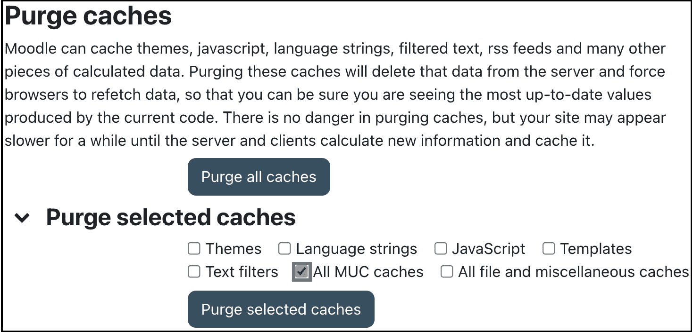

图 15.12 – 清除缓存

还有一个 CLI 脚本可以清除缓存：`php admin/cli/purge_caches.php`。

一旦您已设置缓存存储并正确配置所有可用的缓存选项，您应继续检查与性能相关的系统设置是否已正确配置。

# 优化 Moodle 系统性能

在本节中，我们将可能影响性能但不会损害任何 Moodle 功能的设置分组。涵盖的主题包括会话处理、Cron 管理、预定任务、全局搜索和系统路径。

## 处理会话

对于每个通过 Moodle 进行身份验证的用户（包括访客），都会启动一个会话。在性能优化的背景下，有几个相关的设置解释得很好，可以通过访问 **站点管理** | **服务器** | **会话处理** 来找到：

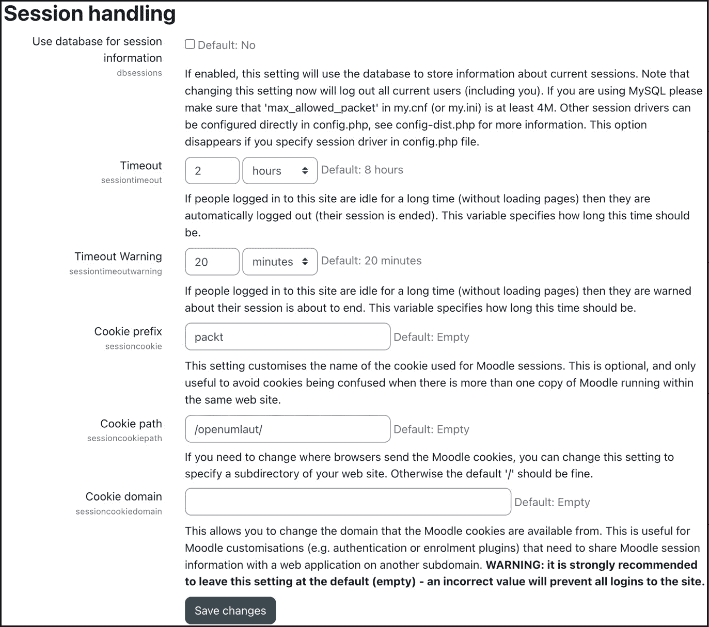

图 15.13 – 会话处理

Moodle 管理会话和 Cookie 非常出色。然而，当出现问题时，有时需要手动干预。如果特定用户遇到问题（清除缓存和 Cookie），则应在本地网页浏览器中执行此操作；如果问题影响多个用户，则应在服务器上执行，这可以通过清除数据库中存储的 `mdl_sessions` 表或清空 `$CFG->dataroot/sessions` 目录（如果会话存储在文件中）来实现。请注意，所有已登录用户都将被注销。

您还可以通过执行前面步骤的单个命令来通过 CLI 脚本终止所有用户会话：`php admin/cli/kill_all_sessions.php`。

清理旧会话是通过所谓的预定任务在后台完成的。Cron 管理和预定任务是以下小节的主题。

## 管理 cron 和预定任务

Moodle 定期执行大量后台任务。执行这些任务的系统脚本被称为 **cron 脚本**，并由 **cron 进程**执行。

重要提示

Moodle 的 cron 脚本在不同的预定时间间隔运行不同的任务。

以下图表说明了 Moodle 中计划任务执行的时间：

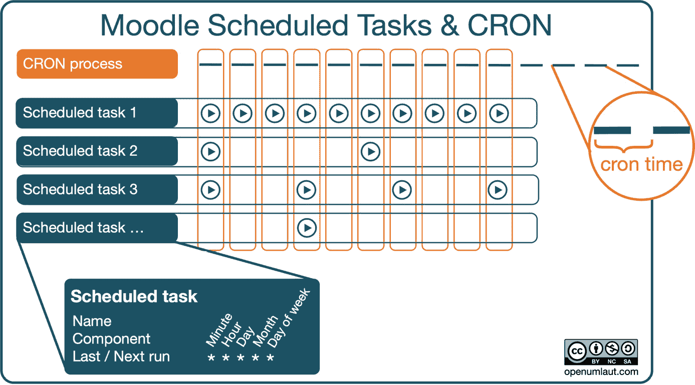

图 15.14 – 计划任务和 cron 进程

Cron 是一个系统进程，它触发 Moodle 的 cron 脚本，该脚本确定在特定时间槽执行哪些任务。

重要提示

cron 进程应该每分钟运行一次。

Moodle 附带一个任务调度器（**站点管理** | **服务器** | **计划任务**），允许您精确配置哪些常规工作何时以及多久运行一次。以下截图显示了某些选定的任务（希望您的视力比我好）：

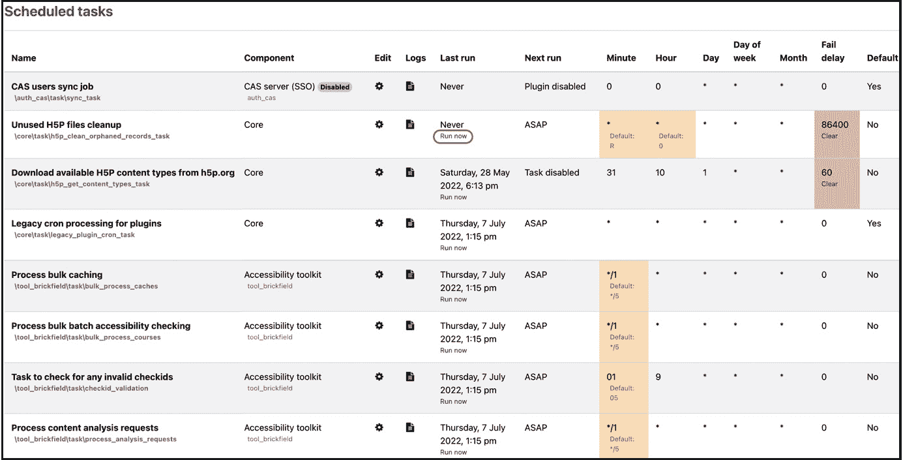

图 15.15 – 计划任务

对于每个计划任务，以下信息是可用的：

+   **名称**: 任务的名称和内部位置

+   **组件**: 触发任务的 Moodle 组件

+   **日志**: 每个任务执行的详细信息，包括持续时间以及数据库的读取/写入

+   **上次运行**: 上次任务执行的日期和时间或**从未**

+   **下次运行**: 下次任务执行日期和时间或**尽快**

+   **分钟**、**小时**、**天**、**星期**、**月**: Unix cron 格式的计划信息：

    +   *****: 每分钟、每小时、每天、每周的每一天和每个月

    +   ***/x**: 每*x*分钟、每小时等

    +   **x-y**: 每小时*x*到*y*分钟之间的每分钟或每小时，从*x*到*y*之间

    +   **0** = 星期日，**1** = 星期一，以此类推

+   **失败延迟**: 在重新尝试失败的任务之前等待的秒数

+   **默认**: 指定任务是否已被修改

如果您想更改任何任务的计划，必须在**编辑**列中选择配置图标。例如，我们选择了**检查更新**任务，该任务每天、每月和每周的每天在 10:48 执行：

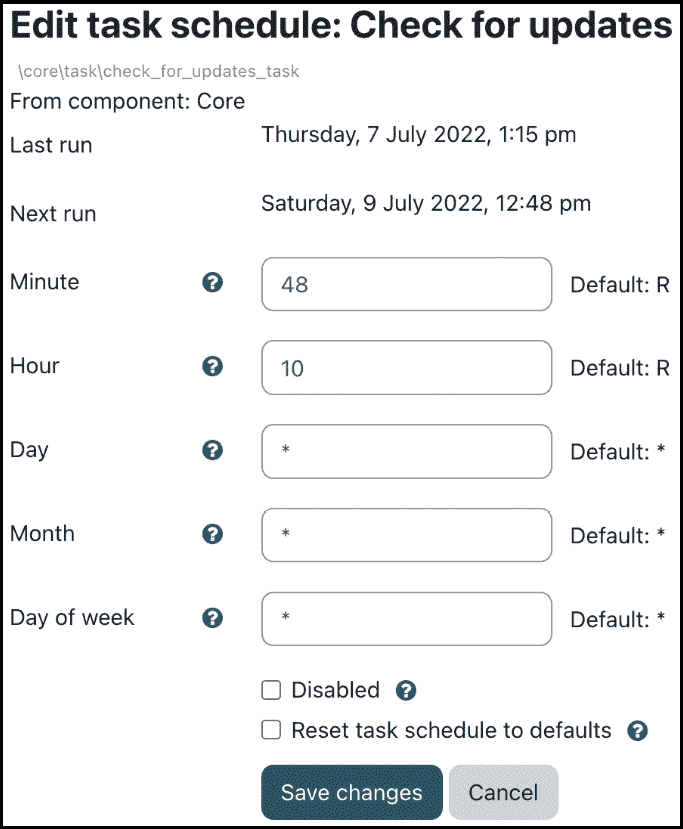

图 15.16 – 编辑任务计划

除了已经覆盖的计划设置外，您还可以暂停任务（**禁用**）并恢复原始设置（**将任务计划重置为默认值**）。默认设置已考虑到性能。然而，您可能希望根据您的设置中的任何特殊要求进行微调。

在处理计划任务和 cron 进程时，有一些值得注意的事项：

+   可以使用**立即运行**选项手动启动任务。要使此操作出现在每个启用的任务下方，必须在**站点管理** | **常规** | **安全** | **站点安全设置**中设置**允许“立即运行”计划任务**选项，并且必须在**站点管理** | **服务器** | **系统路径**中正确配置**PHP CLI 路径**。

+   多个任务可以并行运行。计划任务和临时任务的并发限制可以在**站点管理** | **服务器** | **任务** | **任务处理**中进行配置。

+   如果 cron 运行时间超过两次执行之间的指定时间，新任务将在下一次运行时排队并执行。在任务释放之前，任务的生命周期也可以进行安排，并且可以在**网站管理** | **服务器** | **任务** | **任务处理**中配置临时任务：

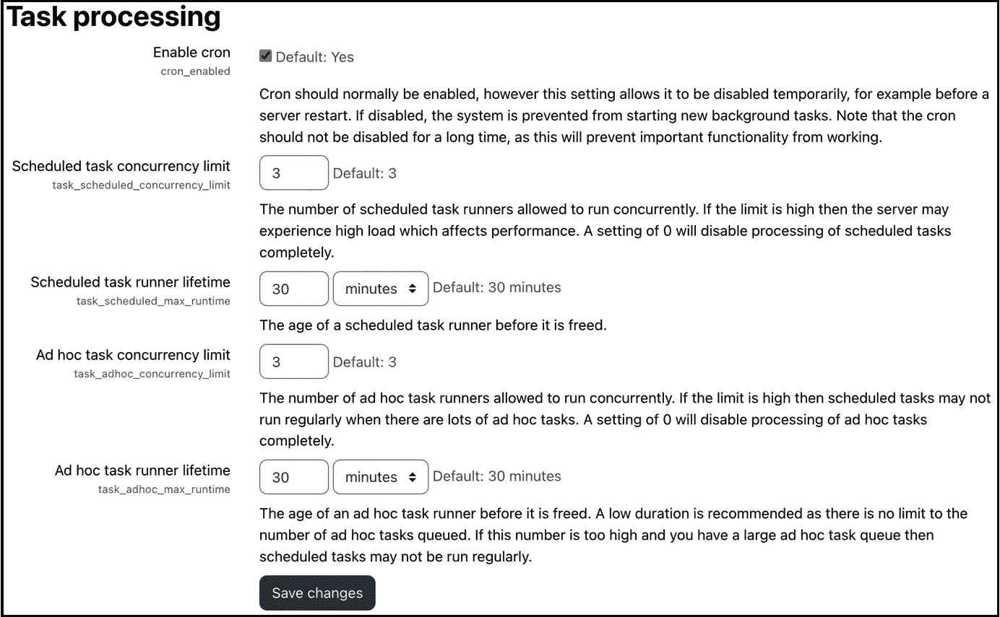

图 15.17 – 任务处理设置

要查看正在运行的任务，请转到**网站管理** | **服务器** | **任务** | **当前运行的任务**。任何正在进行的进程都将列出，包括进程已经运行的时间。

每个任务的详细信息都记录在 Moodle 中，可以在**网站管理** | **服务器** | **任务** | **任务日志**中查看。通过报告过滤器，您可以深入到耗时较长的进程或未能完成的任务。在**网站管理** | **服务器** | **任务** | **任务日志配置**中的设置可以让您减少写入日志表中的日志条目数量：

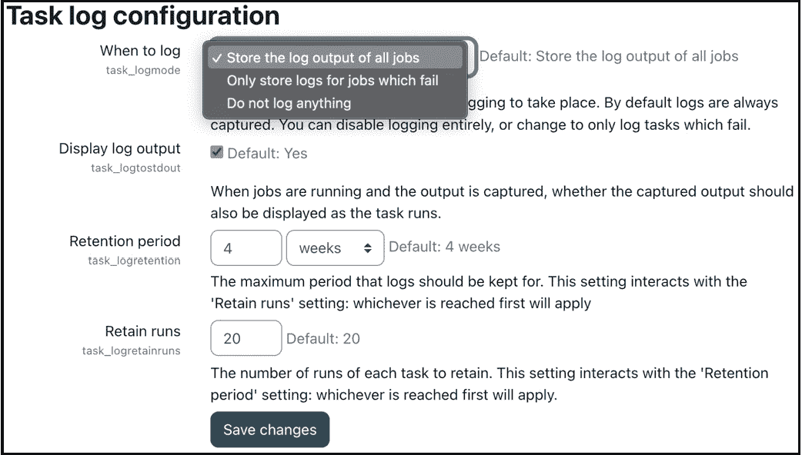

图 15.18 – 任务日志配置

我们已经在安装过程中介绍了这一点，但值得重申的是，您调用 Moodle cron 作业的方法可能会对您的系统性能产生重大影响，尤其是在大型安装中。如果通过 HTTP（无论是使用`wget`还是`curl`）调用`cron.php`脚本，与直接通过 php –f 命令调用相比，将使用更多的内存。

Moodle 的内存管理已被证明非常高效。然而，在执行复杂的 PHP 脚本时，可能需要额外的内存，cron 就是这样的一个候选脚本。要增加内存限制，请通过转到**网站管理** | **服务器** | **性能**来更改**额外 PHP 内存限制**设置。

依赖于计划任务并且可能对系统性能产生重大影响的操作是全局搜索，我们将在以下小节中进行配置。

## 配置全局搜索

Moodle 自带强大的全局搜索功能，支持不同内容类型、内容区域、访问权限和可插拔的搜索引擎。

重要提示

全局搜索允许用户搜索 Moodle 中他们有权访问的任何地方。

以下图表是 Moodle 中全局搜索工作原理的简化说明：

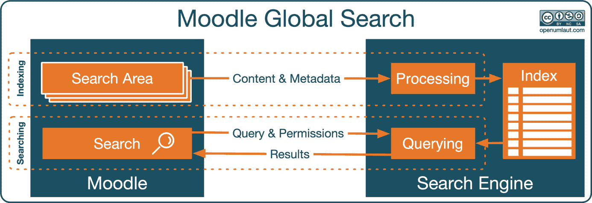

图 15.19 – Moodle 全局搜索

**索引**过程（顶部）是由计划任务触发的，在此期间，自上次运行以来创建、更新或删除的任何**内容和元数据**都会发送到搜索引擎。搜索引擎从不从 Moodle 请求任何内容；没有内容爬取。Moodle 全局搜索可以限制为**搜索区域**，例如作业活动信息、文本块内容或收到的消息。搜索引擎处理接收到的数据并将其存储在其索引中。

**搜索**过程（底部）是由用户输入搜索词或短语触发的。查询与用户的访问权限一起发送到搜索引擎，这些权限由搜索引擎的**查询**机制考虑。最后这一点至关重要，以确保用户只能看到他们有权访问的结果。结果返回到 Moodle 并显示给用户。

Moodle 附带一个内部和一个外部搜索引擎插件：

+   **简单搜索**：一个内置的搜索引擎，支持基本的搜索操作。

+   **Solr**：根据[solr.apache.org](http://solr.apache.org)，“*Apache Solr 是基于 Apache Lucene 的流行、快速、开源的企业级搜索引擎平台*。”**Solr**支持文件搜索和高级搜索操作，例如布尔运算符、通配符、前缀、邻近搜索和提升。

你可以在[moodle.org/plugins/?q=type:search](http://moodle.org/plugins/?q=type:search)找到额外的搜索引擎插件，例如**Elastic**或**Azure Search**。

要管理全局搜索，请转到**站点管理** | **插件** | **搜索** | **管理全局搜索**，在那里你应该看到一个需要通过的设置步骤表：

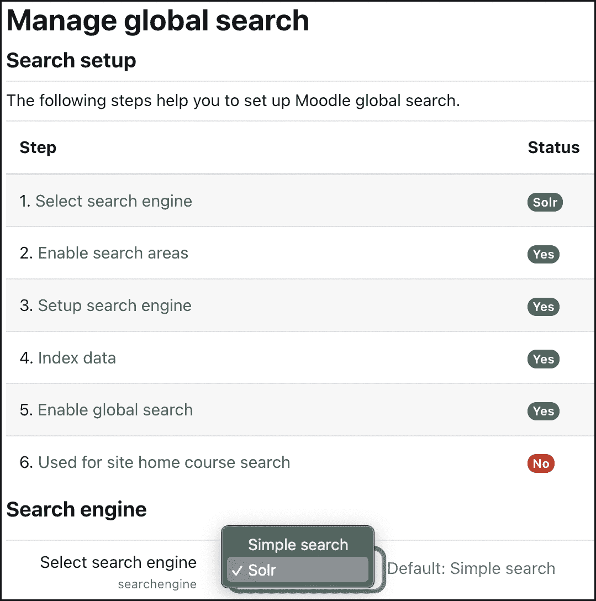

图 15.20 – Moodle 全局搜索设置

让我们一步一步地通过六个动作：

1.  **选择搜索引擎**：选项是**简单搜索**和**Solr**，除非你已经安装了第三方搜索引擎插件。

1.  **启用搜索区域**：搜索区域是分别索引的内容组。默认情况下，全局搜索索引所有搜索区域；然而，你可以在**站点管理** | **插件** | **搜索** | **搜索区域**中启用和禁用单个搜索区域。通过禁用搜索区域，你可以提高搜索速度，但会排除其内容出现在搜索结果中。你可能选择禁用**用户**搜索区域，以排除用户个人资料链接从全局搜索中。

1.  **设置搜索引擎**：简单搜索不需要任何配置；其他则需要。

1.  **索引数据**：索引是由**全局搜索索引**计划任务触发的。或者，在**站点管理** | **插件** | **搜索** | **搜索区域**中有多项索引操作，即更新、重新索引和删除整个索引或单个搜索区域的索引。

1.  **启用全局搜索**：您可以在“**站点管理**” | “**常规**” | “**高级功能**”中启用全局搜索。在启用此功能之前，您应首先配置全局搜索并索引站点内容。否则，搜索可能会返回不完整的结果。

1.  **用于站点主页课程搜索**：如果启用，搜索结果将包括用户可见的课程信息，即使他们没有访问课程内容。

您将在各种配置选项中找到最后一个设置，这些选项涉及搜索选项、搜索范围（例如，仅用户注册的课程）和显示偏好。这些设置在屏幕上有很好的解释，所以我们在这里不再重复。

一些更多参数被分组在全局搜索配置屏幕底部的“**搜索管理**”下。当在具有大量搜索索引且重建时间较长的站点上进行更改时，这些选项很有帮助。

由于**Solr**插件随 Moodle 一起提供，以下是一些有助于您将强大的搜索引擎作为设置一部分使用的提示：

+   Solr 必须单独安装，无论是在同一服务器上还是在专用服务器上。

+   Moodle 中的 Solr 配置位于“**站点管理**” | “**插件**” | “**搜索**” | “**Solr**”。有三个参数组：配置（Solr 主机信息和**SSL**支持）、文件索引和仅查询的备用设置。

+   Moodle 中的 Solr 安装和配置已在[docs.moodle.org/en/Global_search](http://docs.moodle.org/en/Global_search)上进行了很好的记录。

系统性能部分的最后配置选项是系统路径，我们将在以下小节中设置。

## 设置系统路径

Moodle 定期执行的操作是列出目录。此操作可以通过 Moodle 内部用 PHP 编写的常规程序运行，或者使用宿主操作系统的本地版本的功能。后者方法显著更快，因为它减少了服务器负载，但仅支持 Unix 环境。

您可以通过导航到`/usr/bin/du`来指定`du`命令的路径。一旦正确指定，这将加速目录内容的显示，尤其是如果它包含许多文件：

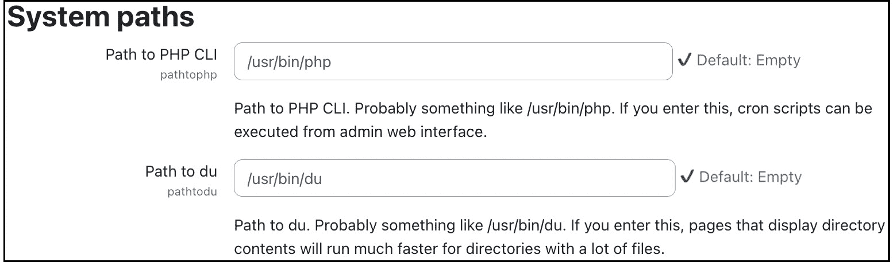

图 15.21 – 系统路径

这就完成了系统性能部分的介绍。为了确保任何优化都能带来更好的性能和用户体验，您需要分析和监控您的 Moodle 系统，我们将在本章的最后部分处理这个问题。

# Moodle 性能分析和管理

当您设置 Moodle 系统时，您可以采取一些初步预防措施来优化您的 LMS 性能。然而，真正的测试是在 Moodle 完全运行时——也就是说，当系统处于负载之下时（“没有比生产更好的测试了！”）。

我们将查看 Moodle 的内置性能分析工具，以便您定期监控您的 Moodle 系统。虽然应用监控不能被视为一个独立的练习，但我们不会处理系统性能分析，因为这超出了本书的范围。

我们将介绍三种支持的工具：**性能信息**、Tideways 和 JMeter。

## 性能信息

Moodle 提供了一些基本性能分析信息，您可以在**网站管理** | **开发** | **调试**中激活这些信息。在此处，您必须启用**性能信息**选项。此功能显示执行时间、RAM 使用情况、正在使用的文件数量、CPU 使用率和负载、会话大小以及各种过滤和缓存措施（基于 Windows 的安装将显示较少的信息）。

**性能信息**进一步显示了特定页面上使用的缓存信息。对于每个缓存，显示**命中**、**未命中**和**设置**。缓存使用交通灯颜色突出显示：红色消耗最多，橙色消耗一些，绿色（或无颜色）消耗最少资源。这些信号是识别潜在性能问题的良好指标。

只要使用的主题支持，数据将显示在 Moodle 页脚中——例如，**Boost**。

您可以在以下屏幕截图中查看**性能信息**的概述：

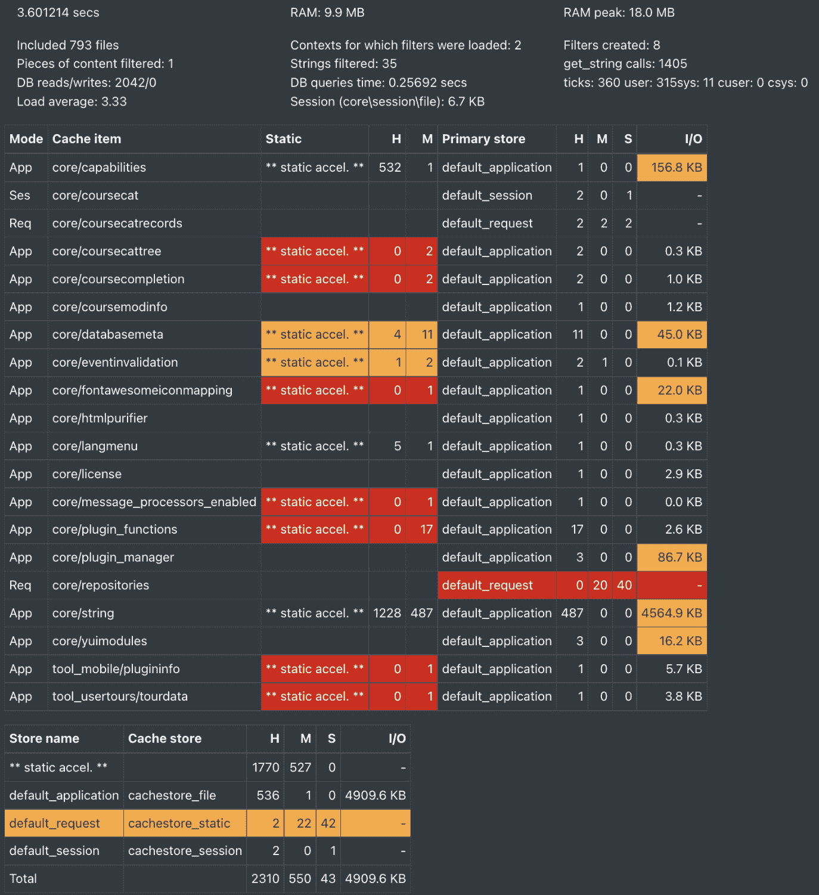

图 15.22 – 性能信息

**性能信息**提供了有关整体 Moodle 系统和其缓存项的数据。如果您需要更深入的信息，Tideways 性能分析可能有所帮助。

## Tideways 性能分析

Moodle 支持 PHP 级别的性能分析。虽然这主要是针对开发者的，但它可能有助于您识别系统中的瓶颈。内部性能分析建立在**Tideways**之上，它是**XHProf**的替代品，允许以相对较低的性能成本对 PHP 页面进行性能分析。

一旦您安装了`php-tideways`和`php-graphviz`PHP 扩展，当您导航到**网站管理** | **开发** | **性能分析**时，您将看到一个新菜单项：

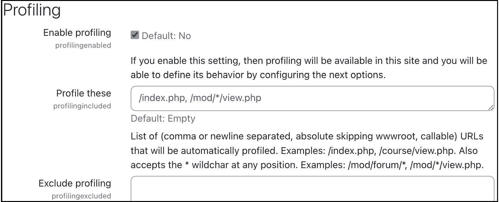

图 15.23 – 性能分析配置

性能分析器可以配置为自动运行（将**自动性能分析**频率设置为除 0 以外的任何值，并在**分析这些**字段中指定 URL）或手动运行。后者可以是**选择性的**（您必须启动性能分析）或**连续的**（一旦开始，您必须停止它）。

一旦启用性能分析，当您进入**网站管理** | **开发** | **性能分析运行**时，将出现另一个菜单项，列出了已执行的所有性能分析运行的摘要信息：

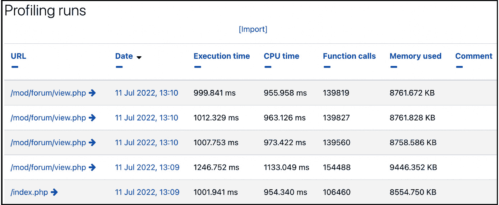

图 15.24 – 性能分析运行

当你点击单个运行的 URL 或日期时，你可以将该运行标记为参考并提供注释。你还可以查看其性能分析详情，其中每个函数调用的执行时间和内存使用以表格形式展示。从这张表中，你可以查看调用图。然而，这需要安装 dot（Graphviz 包的一部分）并在**站点管理** | **服务器** | **系统路径**中指定**Path to dot**。结果是看起来令人恐惧的图表，显示了每个函数调用的顺序、依赖关系和详细信息。

在处理性能分析时的一般策略是确定执行时间最长的函数，调整你的设置，并检查时间是否已经减少。做这件事的困难在于确保测试运行是在相同或至少非常相似的条件下的。你可以在[docs.moodle.org/dev/Profiling_PHP](http://docs.moodle.org/dev/Profiling_PHP)找到更多关于 PHP 性能分析的信息。

Tideways 有助于在 PHP 级别识别问题。Moodle 支持的其他外部性能分析工具是 JMeter，如以下小节简要介绍的。

## JMeter 支持

**Apache JMeter**是另一个面向开发者的工具，但在定位 Moodle 瓶颈时可能很有帮助。要创建测试计划文件，请在**站点管理** | **开发** | **调试**中将**调试消息**设置为**DEVELOPER**，然后转到**站点管理** | **开发** | **创建 JMeter 测试计划**。在创建测试计划之前，你需要遵循以下截图中的说明：

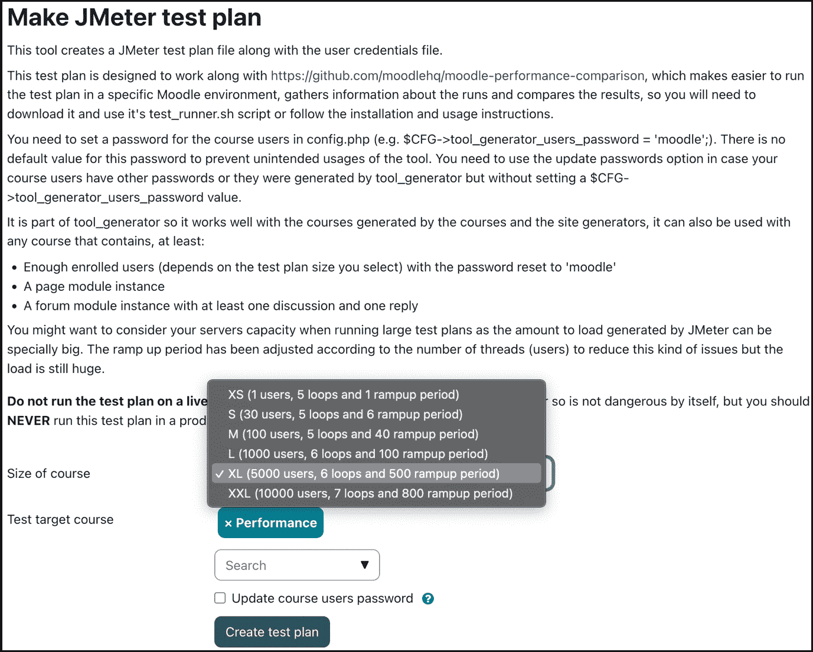

图 15.25 – 创建 JMeter 测试计划

在 Moodle 课程上运行的性能测试的结果是一个 JMX 格式的文件，然后可以在需要单独安装的 JMeter 工具中加载和分析。

Moodle 附带了一个不受支持的工具，允许你生成随机课程数据，这在创建 JMeter 测试计划时很有帮助。你必须手动在`<yoursite>/admin/tool/generator`处调用脚本，在那里你可以模拟拥有数百门具有不同级别和类型的活动的课程。你可以在这里查看概述：

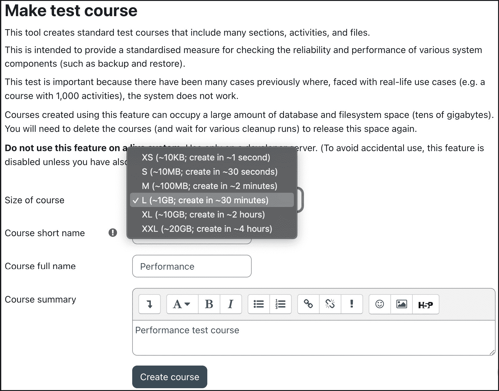

图 15.26 – 创建 JMeter 测试计划

你可以选择**课程大小**以及**课程简称**、**课程全名**和**课程摘要**选项。请注意，生成大型课程可能需要数小时，并且会显著影响你的系统性能。不要在生产环境中执行此操作。

现在你已经配备了某些性能分析和监控工具，你可以根据本章中描述的进行调整。看看它们对你的 Moodle 系统性能有何影响，无论是积极的还是消极的。

# 摘要

您在本章中学习了如何优化和监控 Moodle 的性能。我们首先提供了 Moodle 性能的概述，并简要提到了优化硬件、网络、数据库、Web 服务器和课程内容。关键 Moodle 性能主题已分组到以下部分：

+   **Moodle 功能性能**：我们涵盖了 Moodle 函数和 Moodle 活动中的性能问题。

+   **Moodle 通用缓存**：我们处理了强大的 MUC，配置了缓存类型、缓存存储和缓存定义，在测试 MUC 性能和激活各种缓存选项之前。

+   **Moodle 系统性能**：我们优化了会话处理、cron 管理、计划任务、全局搜索和系统路径。

本章以一个简短的 Moodle 性能分析和监控部分结束。

如您从本章中可能已经了解到的那样，优化并不总是直截了当的。它取决于各种情况，例如 Moodle 运行的系统、它所使用的硬件、网络、登录到系统的并发用户数量、执行的活动类型等等。虽然基本优化通常是直截了当的，但微调本身也是一种艺术。为了达到您 Moodle 系统的理想设置，可能需要进行大量的尝试和错误（即性能分析）。

现在您的系统已经准备好发挥其最大潜力，让我们确保您已经实施了一个专业的备份和恢复策略，这将在下一章中介绍。
