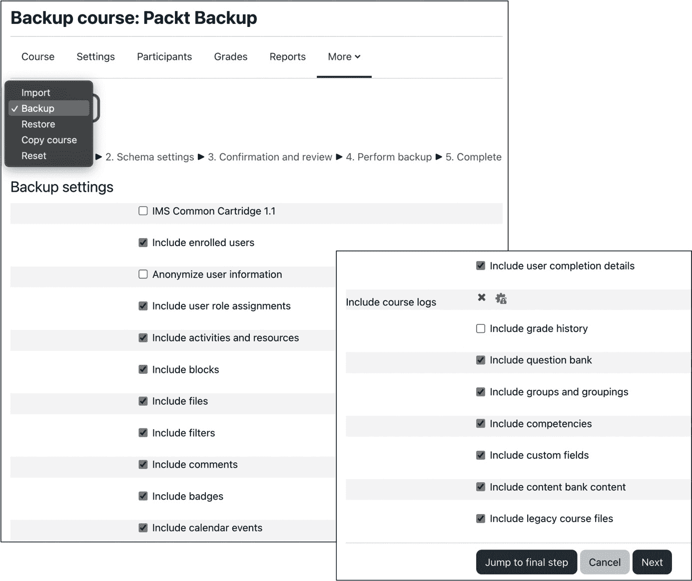

# 16

# 避免失眠之夜 – Moodle 备份和恢复

您的 Moodle 应用程序将包含重要数据，例如课程作业、作业、成绩以及所有管理数据，例如用户、群体和角色。因此，您必须制定良好的备份策略。

在处理信息系统时，为意外情况做好准备总是一个好的策略，并且拥有良好的备份可以确保在意外硬件或软件故障后完全恢复应用程序。我们并不期望系统会失败，但总是存在失败的可能性，而快速恢复的良好策略可以确保对用户的影响最小。本章介绍了管理备份和自动备份数据策略和选项。

Moodle 本身支持两种类型的备份：

+   **课程级备份**：课程备份通常是临时的，并且仅归档所选课程。您将学习如何创建课程备份、恢复课程以及使用相关的课程导入功能复制课程内容。

+   **站点级备份**：站点备份选项定期将所有课程和相关数据保存到指定的位置。您将学习如何设置此选项并从中恢复数据。

在我们查看**系统级备份**之前，包括 Moodle 备份（涵盖 Moodle 软件及其中的数据）和快照创建（完整系统镜像）之前，我们将详细介绍这两种机制。以下图表显示了三种备份类型，并构成了本章的核心：


图 16.1 – Moodle 备份

我们将通过查看两个使用备份和恢复功能的应用程序来结束本章：规划年终程序和实施课程模板。

本章将涵盖以下主要内容：

+   管理课程级备份

+   管理站点级备份

+   管理系统级备份

+   使用备份和恢复进行替代任务

# 管理课程级备份

课程级备份允许教师和管理员创建课程副本以备安全或传给同事。如果配置得当，课程备份可以为管理员节省大量麻烦和时间。

重要提示

课程备份包括课程的一些或全部项目。

首先，在详细讨论恢复操作期间的数据恢复细节之前，我们将查看备份过程。

## 创建课程备份

要备份单个课程，最好是在该课程内部，在那里您需要在课程菜单中选择**课程重用**选项，然后从下拉菜单中选择**备份**。

备份过程包括以下五个步骤，如图所示的工作流程：


图 16.2 – 课程备份工作流程

您可以通过屏幕顶部的流程链接或底部的导航按钮导航回任何步骤。我们将在以下子节中逐一介绍这些步骤。

### 初始设置

几个设置决定了备份将如何执行以及将包含哪些类型的信息：



图 16.3 – 课程备份 – 初始设置

一些设置仅在其他设置已被激活时才可用；例如，**包含用户角色分配**只能在已注册用户被包含时勾选。大多数选项都是自我解释的，但有两个选项需要一些说明：

+   如果`Jonny Walker`可能会变成`anonfirstname69 anonlastname69`。

+   除了标准的 Moodle 备份格式外，**IMS 通用课程包 1.1**是一个受支持的特定格式。有关 IMS CC 的更多信息，请参阅 Moodle 文档[docs.moodle.org/en/IMS_Common_Cartridge_import_and_export](http://docs.moodle.org/en/IMS_Common_Cartridge_import_and_export)。

默认情况下，所有用户都可以选择具有适当权限的课程环境中的所有选项。如果您希望更改默认值和/或锁定特定设置（如前一个屏幕截图所示的**包含课程日志**），请转到**网站管理** | **课程** | **备份** | **常规备份默认值**：


图 16.4 – 课程备份默认设置

对于每个设置，都有两个复选框。第一个代表参数的默认值，而第二个值表示是否锁定。锁定允许您强制特定设置，例如，排除用户。

通常您可能会执行两种类型的课程备份：

+   **内容仅备份**

如其名称所示，此类备份仅包含可以传递给他人而无需转移任何关于其用户、角色、成绩等信息的内容。要执行内容仅备份，您必须取消选择**包含已注册用户**，这是所有与用户相关的备份选项的前提条件。

如果您希望将课程传递给其他教育工作者或使其可供下载，内容仅备份是最佳选项。另一个用例是为您自己创建一个课程的全新实例，例如，从一个学期备份课程以用于不同的学期。当您在社区中心或 MoodleNet 上发布课程时（参考*第十九章*，*设置 Moodle 网络*），您也将创建一个内容仅备份。

重要说明

默认情况下，具有教学权限的用户只能执行内容仅备份。此限制可以通过`moodle/backup:userinfo`能力进行更改，但应谨慎操作。

+   **完整课程备份**

如果您希望为潜在恢复目的备份课程，您应该创建完整的课程备份，包括用户数据（例如，论坛帖子）、课程数据和用户信息。为此，您可以保留所有设置在默认值，并使用 **跳转到最终** **步骤** 按钮。

如果您希望备份课程日志，必须启用 **包含课程日志** 设置。请记住，日志可能非常大，在备份多个课程时通常超过多个吉字节。

在我们进入下一个屏幕之前，请注意：一些第三方课程级别插件（活动、块或过滤器）可能不支持备份。如果您遇到任何问题，您将不得不从备份中排除这些插件创建的项目，或者更好的是，完全避免使用该插件。

### 架构设置

所有学习资源和活动都按照它们在课程中出现的顺序显示。资源仅在 **包含活动** 参数在上一屏幕未被禁用的情况下可用。默认情况下，所有可用元素都被选中；如果您希望排除任何单个项目，您必须取消选中它们。此外，您可以通过选择/取消选择节名称本身来排除/包含该节的所有项目：


图 16.5 – 课程备份 – 架构设置

Moodle 区分 **课程内容** 和 **用户数据**。例如，论坛描述及其所有设置在论坛活动中被归类为课程内容。相比之下，所有论坛主题、帖子和对论坛的回复都被归类为用户数据。如果 **包含已注册用户** 选项在初始设置屏幕上被激活，可以为每个选定的活动和资源包含/排除用户数据。

选择 **下一步** 按钮将带您进入最后一个课程备份配置屏幕。

### 确认和审查

第三屏幕允许您选择备份文件名并审查要包含在存档中的项目。默认 **文件名** 的格式如下：

```php
backup-<type>-<format>-<course name/id>-<date>-<time>[-nu|-an].mbz
```

在撰写本文时，`<type>` 总是设置为 `<format>`，其中 `–nu` 参数表示无用户，而 `-an` 是匿名用户的指示符。

如果您选择创建 `.imscc` 扩展名，将使用 `.mbz` 扩展名：


图 16.6 – 课程备份 – 确认和审查

Moodle 为备份创建了一个专有的文件格式，称为 `.mbz` 扩展名。Moodle 备份文件是一个压缩文件（`.tgz` 格式），由一个 XML 文件（描述文件内容）和实际内容、用户、日志数据等组成。

附加的**备份设置**部分显示了在初始设置屏幕上选择了哪些项和未选择哪些项。**包含项**部分通过绿色勾选标记显示所有将被包含的资源、活动以及任何将成为课程备份一部分的用户数据。红色叉号表示该项已被取消选择，而红色叉号后面跟着一个锁表示由于没有满足先决条件，无法选择该项。

一旦您按下**执行备份**按钮，Moodle 课程存档将被创建。

### 完成备份

创建的存档文件保存在**课程备份**区域。这个过程可能需要几分钟，具体取决于备份的数据量。如果最初选择了**匿名化用户数据**设置，备份文件将放置在**用户私有** **备份**区域。

重要提示

Moodle 备份包括课程配置，其中包含课程设置、活动安排和块位置。

完成后，会显示一条简短的状态消息；如果其中包含任何错误或警告，您将需要采取适当的行动。

备份有时会在大型课程上失败，原因通常是备份过程耗尽时间或内存。如果发生这种情况，您有两个选项，这两个选项不是互斥的：

+   首先，您可以通过访问**服务器** | **性能**来增加**额外 PHP 内存限制**设置。

+   其次，您可以通过访问**网站管理** | **课程** | **备份** | **异步备份/恢复**来选择**启用同步备份**，这将触发 Moodle 以单独的后台进程执行备份（和恢复）：


图 16.7 – 异步备份/恢复

异步备份每次只允许用户为同一资源有一个待处理的备份。同一资源的多个异步备份不能排队，因为这可能会导致包含相同内容的多个备份。

如果您希望在过程完成后通知启动课程备份的用户，请选择**启用消息通知**并自定义将要发送的通知的**主题**和**消息**属性。

这就结束了关于创建课程备份的部分。相反的操作——恢复课程备份——是下一节的主题。

## 恢复课程备份

要完全或部分恢复之前备份的课程，最好是在该课程内部进行，在那里您需要在课程菜单中选择**课程重用**选项，然后从下拉菜单中选择**恢复**。或者，您可以导航到**网站管理** | **课程** | **恢复课程**。

一旦您选择了一个`.mbz`文件，恢复过程包括以下七个步骤，如图所示：


图 16.8 – 课程恢复工作流程

与备份工作流程类似，您可以通过屏幕顶部的流程链接或使用底部的导航按钮返回到任何步骤。我们将在以下子节中逐一介绍这些步骤。

### 文件选择和确认

Moodle 将其备份文件存储在不同的 `.mbz` 文件中以便恢复，如下截图所示：


图 16.9 – 课程备份区域

Moodle 存档的四个位置如下：

+   **导入备份文件**：通常存储在 Moodle 之外并通过文件选择器或拖放选择的存档

+   **课程备份区域**：使用默认设置创建的存档存储在此区域

+   **用户私有备份区域**：存储匿名用户的存档

+   **自动备份**：自动创建的存档（见 *站点* *备份* 部分）

在前面的示例中，课程备份区域中只有一个课程，称为 `backup-moodle2-course-14-packt_backup-20220712-2001.mbz`。从其文件名中，我们已知道课程 ID 是 14，其名称是 Packt Backup，并且它在 2022 年 7 月 12 日 20:01 进行了备份。

选择 `.mbz` 文件）、**备份设置**（与备份中的初始设置相同）和**课程详情**。一旦确认了这个仅包含信息屏幕，您就必须指定您希望恢复备份的位置。

### 选择恢复目标

恢复课程备份有多种选项：

+   **作为新课程恢复**

+   **恢复到本课程**并将备份合并到本课程中

+   **恢复到本课程**，删除本课程的内容，然后恢复它

+   **恢复到现有课程**并将备份合并到所选课程中

+   **恢复到现有课程**，删除其内容，然后恢复：


图 16.10 – 课程恢复 – 目标

如果您希望**作为新课程恢复**，您将不得不选择一个新课程将被创建的分类。如果分类数量超过 20 个，您必须使用提供的搜索功能。或者，您可以选择当前课程作为目标（**恢复到本课程**）。您可以选择将当前课程内容与备份合并（**将备份课程合并到现有课程中**）或替换它（**删除本课程的内容然后恢复**）。如果您选择合并选项，并且存在同名活动或资源，两者都将被保留，不会覆盖。第三种选项是将课程恢复到另一个现有课程，您必须选择它。在当前课程中恢复备份时，也存在相同的选项（合并和替换）。在继续之前，请确保点击正确的**继续**按钮。

### 恢复设置

**恢复设置**屏幕显示了在备份过程中选择的所有可用选项（参见图 16.1 节中的*初始设置*）。如前所述，这里所做的选择决定了将要恢复的数据类型以及将提供哪种类型的内容供进一步选择。此外，大多数选项都有与备份相对应的先决条件。

如果您想更改默认值和/或锁定特定设置，请转到**站点管理** | **课程** | **备份** | **通用恢复默认值**。对于每个参数，都有两个复选框。第一个代表设置的默认值，而第二个值表示是否锁定。锁定允许您强制特定设置，例如，排除用户。

### 备份架构

根据前两个屏幕上的选择，架构步骤允许您指定几个课程设置。如果您将备份恢复到现有课程，您可以选择覆盖其设置。这些是**课程名称**、**课程简称**和**课程开始日期**。您还可以选择**保留当前角色和注册**（如果这些是备份的一部分），**保留当前分组和分组**（如果存储在备份中），以及使用备份文件的课程设置而不是当前设置（**覆盖** **课程配置**）：


图 16.11 – 课程恢复 – 架构

您还必须选择在恢复过程中包含哪些内容和用户数据。选择机制与前面描述的备份类似。默认情况下，所有现有数据都被选中。如果您想缩小要恢复的数据，您必须手动取消选中项目。

### 完成恢复

在最终的看起来熟悉的**审查**屏幕之后，一旦按下**执行恢复**按钮，就会启动恢复过程。任何选定的数据都将恢复到所选目的地。完成后，将显示一个总结消息。

如果恢复的课程包含任何在您的 Moodle 系统中不存在的角色，将显示一个角色映射步骤，您必须手动映射角色以确保一致性：


图 16.12 – 课程恢复 – 恢复角色映射

这完成了关于恢复课程备份的这部分内容。在我们继续到站点备份之前，让我们了解一下与课程恢复密切相关的功能：课程导入。

## 导入课程数据

有时需要从一个课程复制数据到另一个课程。为了实现这一点，Moodle 提供了**导入课程数据**功能。然而，与备份功能不同，它不会导入用户数据，如作业提交或论坛帖子——它只会导入活动、块和过滤器的结构。例如，您可能希望从一个课程导入一个单独的测验到另一个课程。

教师可以导入他们有编辑权限的课程内容；作为管理员，此限制不适用。此机制绕过了从一门课程复制内容到另一门课程且不需要用户数据时的备份和恢复程序的要求。

要复制课程数据，您必须位于接收课程内，在那里您必须在课程菜单中选择**课程重用**选项，然后从下拉菜单中选择**导入**。

导入过程包括六个步骤，如下所示的工作流程所示：


图 16.13 – 课程导入工作流程

与备份和恢复工作流程一样，您可以通过屏幕顶部的流程链接或底部的导航按钮返回到任何步骤。由于课程导入功能实际上是课程备份和恢复功能的一个子集，因此我们只需简要提及过程中的每个步骤：

+   **课程选择**：您必须选择一个您希望从中导入内容的课程。如果列表超过 10 门课程（默认值），请使用提供的搜索功能。您还可以选择当前课程；这样，您可以复制多个活动。

+   **初始设置**：选择您希望导入的课程项目。注意用户相关选项的缺失。

+   **模式设置**：一个用于选择主题和活动的熟悉屏幕。

+   **确认和审查**：显示导入设置和包含的项目。

+   **执行导入**：去，去，去！

+   **完成**：显示摘要信息。

如果您想更改默认值并/或锁定特定设置，请转到**网站管理** | **课程** | **备份** | **通用导入默认值**。每个设置都有两个复选框，并且与备份和恢复默认值的逻辑相同。在此屏幕上，您还可以指定**导入**选项的**最大课程列表数量**。

导入结束本节关于课程级存档的内容，本节重点在于创建和恢复单个课程备份。为了跨课程自动化此过程，需要网站级备份，我们将在下一节中介绍。

# 管理网站级备份

到目前为止，我们已经处理了备份单个课程。网站级备份对您系统中的每个课程执行相同的操作，包括隐藏课程和主页。

在我们查看备份报告和通知之前，我们将配置自动备份。我们将以一些备份策略结束本节。

## 配置自动备份

前往**网站管理** | **课程** | **备份** | **自动备份设置**以安排网站备份。在这里，您将看到以下设置：


图 16.14 – 自动备份配置

配置页面的其余部分涵盖了**自动备份设置**，这些设置指定了哪些元素将包含在备份中。这些设置与初始备份设置相同，除了匿名化选项已被排除。

为了使备份在指定的时间自动开始，必须正确配置`cron`进程，这在*第一章*，*安装 Moodle*中已介绍。或者，您可以通过 CLI 启动备份过程，CLI 执行与`cron`进程相同的脚本。从 shell 或用于脚本中的命令执行如下（假设 Apache 用户是`www-data`）：

```php
sudo –u www-data /usr/bin/php admin/cli/automated_backups.php
```

从自动备份中恢复课程与从课程级备份存档中恢复数据相同。

为了确保备份运行正确，Moodle 提供了一个备份报告和通知，我们将在下一个小节中解释。

## 备份报告和通知

作为 Moodle 管理员，您必须确保备份执行已成功。为此，Moodle 提供了一个备份报告，您可以通过访问**网站管理** | **报告** | **备份**来找到它。它显示了上次执行的日志：


图 16.15 – 自动备份配置

报告提供了每个正在备份的**课程**的详细信息，即**耗时**（开始和结束时间）、**状态**以及其**下一次备份**的日期和时间。

30 天内没有任何活动的课程（即课程内容没有变化，也没有用户使用课程）将被排除在自动备份之外，状态显示为**跳过**。

在计划中的站点级备份完成后，作为 Moodle 管理员，您将收到一封电子邮件。它提供了备份课程总数以及课程备份是否正常、包含错误、未完成或被跳过的详细信息。请确保您的电子邮件设置已正确配置（参考*第十章*，*配置技术功能*）。强烈建议您每天检查这封电子邮件的内容。

为了确保自动备份的平稳和可靠执行，您必须有一个适当的备份策略，我们将在下面讨论。

## 备份策略

在运行自动的全站 Moodle 备份时，有几个问题需要考虑：

+   **备份内容**：确保存档中包含的每一项都是必需的，并且任何不必要的内容都被排除。您是否需要每晚备份整个日志和成绩册历史记录？

+   **备份大小**：备份文件的大小可能非常大（多个吉字节）。请确保您只保留所需的备份数量，并且您的设置可以处理。

+   **备份时间**：备份操作是一个 CPU 和硬盘密集型操作。确保您在网站负载相对较低时安排其执行。如果您在同一服务器上运行多个网站，建议错开备份时间或创建一个使用所述 CLI 的脚本。另一种方法是设置一个专门的备份服务器。

+   **备份频率**：您需要每天备份七次，还是每周备份就足够了？是否存在可以完全关闭备份设施的时间段（例如周末）？

+   **备份位置**：默认情况下，所有备份文件都保存在相应的课程中，这意味着备份存储在与 Moodle 相同的服务器上。如果您必须恢复多个课程，您必须分别定位每个存档，这可能是一项令人头疼且耗时的任务。

您可能希望考虑将备份存储在外部设备上（外部硬盘、NAS 驱动器、SAN 等）。此方法的替代方法是挂载备份设备并将其内容包含在组织范围内的备份中。

站点级别的备份是自动化课程备份和简化教育工作者生活的好方法。然而，它们只备份课程，而不是整个系统。虽然如果您需要恢复单个课程或某些活动时这已经足够，但在整个系统需要恢复的灾难场景中就不够了。

重要提示

您不应将课程备份设施作为您唯一的备份系统。

相反，应将系统级别的备份用作补充，我们将在下一部分探讨。

# 管理系统级别的备份

系统级别的备份不能从 Moodle 内部配置或执行。相反，它们必须在系统级别设置。如果您的系统托管在外部，您可能无法访问系统级别，这将阻止您执行此类备份。除非托管方已经代表您运行系统级别的备份，否则是时候更换提供商了！

有两种类型的系统备份，它们不是互斥的：

+   **Moodle 备份**：这些创建 Moodle 本身、应用程序数据和任何应用程序配置的存档。

+   **快照**：这些创建系统的镜像，如果系统需要完全回滚，则用于灾难恢复。

我们将在接下来的两个小节中简要介绍这两种方法。

## Moodle 备份

Moodle 区分了存储在其中的应用程序软件和其中存储的数据。当创建备份时，这种分离的优势变得明显：只有当安装了更新或正在进行定制时才需要软件备份，而数据应更频繁地备份。

备份 `moodle`。大多数管理员会创建一个目录的单个存档以方便处理（在 Unix 中，只需使用 `tar -cvf <backupfile>`）。这一步通常只在系统升级之前或需要存档整个系统时才需要。

Moodle 将其数据存储在两个不同的位置：

+   用于 MySQL 和 MariaDB 创建单个备份文件的`mysqldump` shell 命令：

    ```php
    mysqldump -u <username> -p [-h <databasehost>] -C -Q -e -a <database> > <backup-file>.sql
    ```

`<username>`必须替换为数据库用户名，`-p`将提示你输入密码，而`-h <databasehost>`仅在数据库位于单独的服务器上时才需要。《database》选项是数据库名称，而`<backup-file>`是要创建的存档的名称。使用`.sql`扩展名是常见做法。

要恢复数据库转储，请使用以下`mysql` shell 命令：

```php
mysql -p <database> < <backup-file>.sql
```

对于其他数据库类型，请参阅相应的管理指南。

+   **Moodle 数据目录（$CFG->dataroot）**：这是所有贡献文件所在的地方——例如，提交的作业、语言定制、用户个人资料图片、视频等等。就像 Moodle 系统一样，你只需要创建目录及其所有子目录的副本。在执行备份时停止 Apache 至关重要，以确保内容不会不同步。

这种方法的优点是它资源消耗较少，可以脚本化，并且恢复整个 Moodle 系统要简单得多。然而，如果不设置临时服务器，就无法检索单个活动，这与课程备份不同。

## 快照创建

为了完整性，这里简要提及创建快照，因为它不是 Moodle 管理员角色，而是系统管理员任务。然而，你应该确保在硬件故障或其他系统问题发生时设置了这样的机制。

快照是包含 Moodle 软件本身以及所有数据（数据库和数据目录）的整个硬盘分区（s）的镜像。快照的优点是整个系统可以回滚到创建镜像时的点。然而，从那时起添加或修改的数据将被覆盖。快照不能用于恢复单个课程或其部分，而是完全替换系统。

重要提示

无论你选择哪种备份组合，都要经常验证备份过程是否正常工作。没有什么比虚假的安全感更糟糕了——也就是说，假设你的所有数据都已备份，而实际上并没有！

这部分关于网站范围备份的讨论到此结束，涵盖了 Moodle 备份和快照。以下清单提供了一个关于备份和恢复配置的快速总结，应该注意以下事项：


图 16.16 – 备份清单

我们将通过查看两个利用 Moodle 备份和恢复功能的用例来结束本章。

# 使用备份和恢复进行其他任务

虽然备份的主要目的是在数据丢失的情况下恢复数据，但可以使用本章中介绍的技术执行一些应用程序。我们将简要描述其中两个：年终程序和课程模板。

## 规划年终程序

大多数组织都有一套年终程序，这可能是学年末、学期末、财年末，或者在滚动进出设置的情况下，每月一次。鉴于程序的性质和重要性，每个步骤都应该提前做好规划。关键考虑因素如下：

+   您何时运行年终程序？

+   需要做什么？

+   谁参与其中？

+   归档将存放在哪里？

以下是一系列典型的步骤，这些步骤可能适用于也可能不适用于您的设置。它为您提供了此类程序可能看起来如何的思路，并展示了备份功能的重要性：

1.  **归档**：创建所有课程的完整备份，并考虑包括系统备份。确保归档存储在单独的介质上。

1.  **成绩导出**：按课程导出成绩以存储在您的学生管理信息系统上。

1.  **课程重置**：使用课程级别的重置功能来删除任何用户数据。（重置课程也可以批量进行。请参阅*第四章*中的*批量管理课程*部分，*管理和注册课程*。）

1.  **删除用户**：删除已离开组织的用户或禁用他们的账户。

1.  **下一年的准备**：隐藏或删除过时的课程，并添加新课程。添加新用户并为课程分配角色。

这只是一个粗略的任务清单，供您考虑。在启动年终程序之前，请确保您有一个详细的计划。

## 实施课程模板

常常需要创建课程模板，这些模板用作创建多个课程的基础。这个过程可能是在强调课程结构和布局同质化的组织中，或者是在希望简化其课程创建者工作的教育机构中。实现这一目标的步骤如下：

1.  创建将成为您课程模板的课程。

1.  将所有元素（活动、资源、过滤器、块等）添加到课程中，更改其设置，并按要求安排内容。

1.  创建课程的内容备份。

1.  您现在可以使用恢复机制从这个模板中创建尽可能多的课程。（此操作也可以批量进行。请参阅*第四章*中的*批量管理课程*部分，*管理和注册课程*。） 

1.  或者，您可以在课程级别的**课程重用**菜单中使用**复制课程**功能，而不是执行*步骤 3*和*步骤 4*。然而，课程复制不能批量进行。

1.  可选地，您可以授予用户对课程的适当权限，以便他们可以使用导入功能。

上述列表要求您执行一些手动步骤以实现课程模板机制。您可以在 Moodle 插件数据库 [moodle.org/plugins](http://moodle.org/plugins) 中找到更多用户友好的方法，例如 **Kickstart** ([moodle.org/plugins/format_kickstart](http://moodle.org/plugins/format_kickstart))。

# 摘要

在本章中，我们讨论了各种 Moodle 备份替代方案。您学习了如何创建课程级别、站点级别和系统级别的备份，以及如何从每种类型中执行数据恢复。您的 Moodle 备份策略必须与您组织的整体灾难恢复计划相匹配。我们还看到了一些使用所涵盖的备份和恢复功能的应用程序。

Moodle 提供了一系列良好的备份和恢复选项。确保它们配置正确，并运行测试恢复以确保安全。没有什么比虚假的安全感更糟糕了——也就是说，假设当数据实际上没有备份时，所有数据都已备份！

在下一章中，我们将介绍一系列有用和不太有用的 Moodle 管理工具。
