# 17

# 使用 Moodle 管理工具

Moodle 预装了几个未分配给特定主题的管理工具；其中一些甚至不能通过熟悉的行政网页界面直接访问。

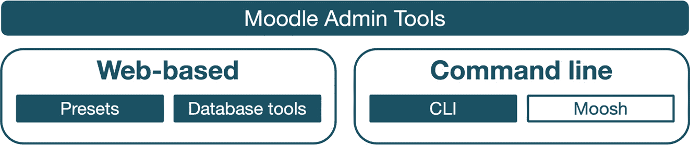

图 17.1 – Moodle 管理工具

我们将管理工具分为以下类别，每个类别都在单独的章节中介绍：

+   **站点管理员预设**：预设允许您创建站点设置的备份，以便在出现问题时可以回滚。

+   **数据库工具**：这些工具允许您应用特定的数据库操作。除了 Moodle 核心部分的部分工具外，我们还将介绍一个有用的外部工具 **Adminer**，它允许您直接从 Moodle 内部管理底层数据库。

+   **命令行界面 (CLI)**：CLI 是一个内置机制，允许我们通过命令行或 shell 脚本来自动化管理过程。

+   **Moosh**：CLI 的强大替代品，Moosh 是第三方 Moodle Shell。我们将学习 Moosh 的工作原理并提供一些实际示例。

在我们详细介绍这些管理工具之前，让我们探索它们在 Moodle 中的组织方式。

# 探索 Moodle 管理工具

Moodle 对构成管理工具的分类有些模糊。当您导航到 **站点管理** | **插件** | **管理工具** | **管理管理工具** 时，会显示一个长长的插件列表：

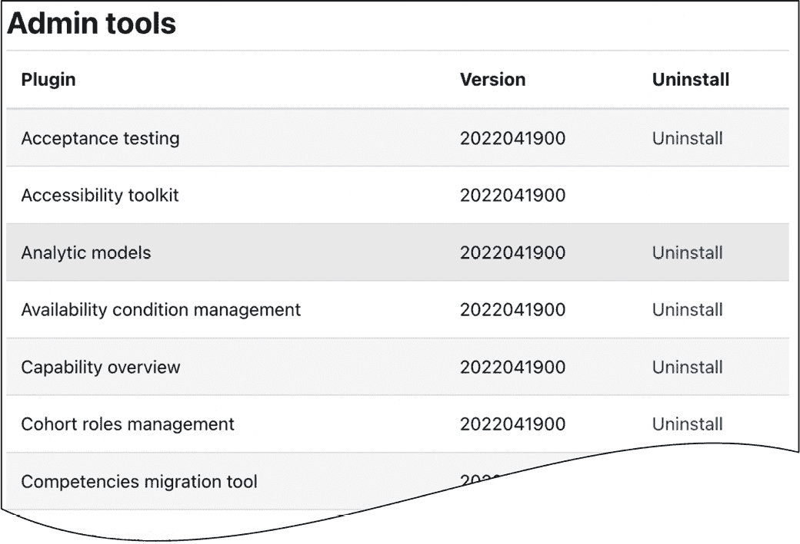

图 17.2 – Moodle 管理工具

我们可以将管理工具分为以下类别：

+   **转换工具**：这些工具通常只应用一次，用于将功能从旧状态迁移到当前状态。例如，**HTTPS 转换工具**（见 *第十三章* 的 *确保 Moodle 安全性*）和 **多语言升级**（见 *第十章* 的 *配置技术功能*）。

+   **数据库工具**：这些工具用于与 Moodle 的底层数据库进行工作。在本章中，我们专门用一节来介绍数据库工具。

+   **开发工具**：这些工具针对 Moodle 程序员——例如，**验收测试**（Behat）、**PHPUnit 测试**和 **XMLDB 编辑器**。您在 *第十五章* 的 *优化 Moodle 性能* 中遇到了开发工具，当时我们处理了性能分析并使用了课程生成器。我们在这里不会处理开发工具。

+   **设计工具**：这些工具针对主题设计师——例如，**模板库**或**UI 组件库**。我们也不会处理设计工具。

+   **标准 Moodle 功能**：一些管理功能已作为管理工具实现，例如回收站、学习计划或任务调度器。这样，如果不需要，它们可以从 Moodle 中卸载，尽管这不被推荐。

前四个类别的许多工具在 Moodle 管理员网络界面中是隐藏的，只能通过直接通过 URL 调用它们来访问：`<yoursite>/admin/tool/<tool>`。所有核心管理工具都位于`$CFG->dirroot/admin/tool`的子目录中。有关大多数非标准管理工具的详细信息，请参阅[docs.moodle.org/en/Admin_tools](http://docs.moodle.org/en/Admin_tools)。

我们不涵盖任何被归类为标准 Moodle 功能的行政工具，因为它们要么在本书的其他地方有所涉及，要么在管理员环境中不相关。然而，有一个例外是网站管理员预设，这是唯一不属于网站管理菜单任何类别的功能。因此，让我们从我们的第一个管理工具开始。

# 网站管理员预设

预设允许您创建网站设置的备份，然后可以恢复。有几个用例中，这个功能非常有用：

+   尝试一组系统设置，并在它们不起作用时回滚

+   将相同的配置集应用于多个网站

+   将一个 Moodle 网站的设置迁移到另一个网站 – 例如，您的测试实例到您的生产系统

Moodle 管理员预设的工作流程如下所示 – 一个简单但非常强大的工具：

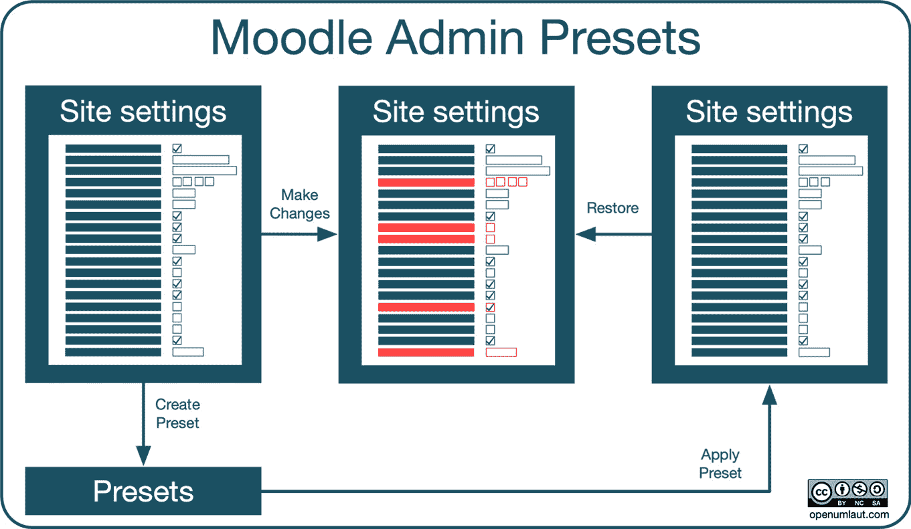

图 17.3 – 网站管理员预设工作流程

您可以在**网站管理**区域的**常规**部分找到**网站管理员预设**工具。这是唯一没有被放置在菜单类别的 Moodle 功能，因此在本章中对其进行了介绍。

Moodle 附带两个预配置的预设，分别标记为**入门**和**完整**。其内容的详细信息在相应的描述中提供，如下面的截图所示，其中包含我们将在此部分创建的第三个预设。

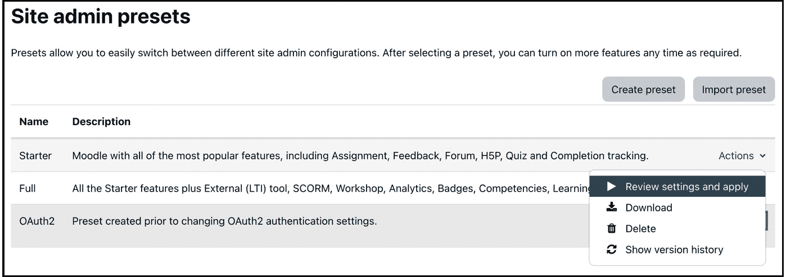

图 17.4 – 网站管理员预设

要创建您的第一个预设，请点击**创建预设**按钮，然后您必须提供一个名称、可选的描述和一个作者，该作者预先填写了您的姓名：

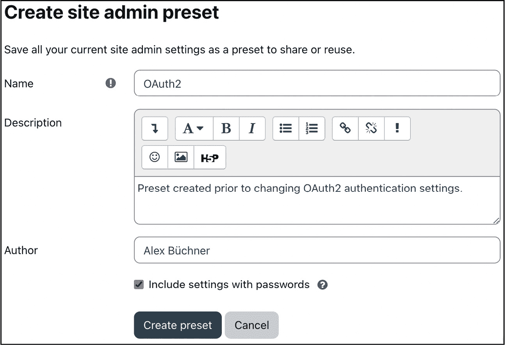

图 17.5 – 创建网站管理员预设

**包含带密码的设置**选项将把您网站的任何敏感信息（密码、密钥和 IP）添加到预设中，因此请确保这只会应用于内部。您可以在**网站管理** | **常规** | **安全** | **网站** **安全设置**中的**带密码的设置**字段中查看和修改要排除的字段列表。

创建预设后，它将出现在列表中，与两个默认预设并列。每个预设都可用以下操作：

+   **审查设置并应用**：预设的详细信息显示，包括有关创建预设的人（作者）、何时（日期和时间）、在哪里（站点 URL）以及哪个 Moodle 版本的信息。一旦应用管理员预设，任何与预设不同的站点设置都将应用，如下列设置更改列表所示。

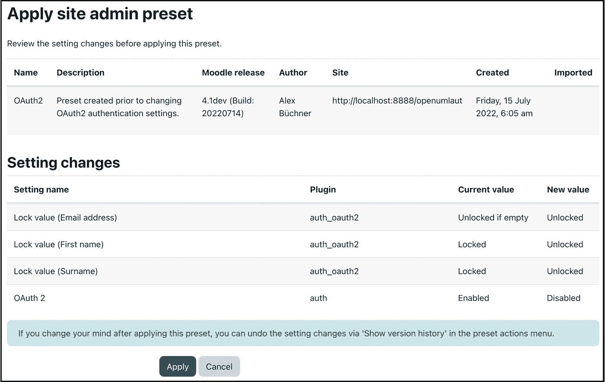

图 17.6 – 应用站点管理员预设

+   **下载**：Moodle 将设置导出为 XML 文件。您可以通过 **导入** **预设** 按钮加载已导出的文件。

+   **删除**：永久删除预设。两个默认预设不能被删除。

+   **显示版本历史**：如果您在应用预设后改变主意，可以通过此操作撤销设置更改。

站点管理员预设是在设置、维护以及尝试新功能时的一种强大工具。

小贴士

将生产站点的预设作为系统文档的一部分存储是良好的实践。

管理员预设处理您站点的配置，这些配置存储在底层数据库中。以下章节将讨论一些专门的数据库工具。

# 数据库工具

Moodle 的数据库工具可以将数据库从一个服务器传输到另一个服务器，在整个数据库中对文本字符串执行搜索和替换操作，并允许您查看或更改数据库中的任何数据。

## 迁移您的 Moodle 数据库

如果您必须将 Moodle 实例的数据库从一个服务器移动到另一个服务器或迁移到另一个 Moodle 系统，您有两个主要选项。您可以选择手动创建数据库转储（或通过稍后介绍的 Adminer 工具）或使用内置的 **数据库** **迁移** 功能。

数据库迁移工具位于 `<yoursite>/admin/tool/dbtransfer`。在撰写本文时，此功能也可以通过 **站点管理** | **开发** | **实验** | **数据库迁移** 访问。正如类别名称所暗示的，该工具是实验性的，可能在未来的版本中进入核心或从管理员界面中消失。

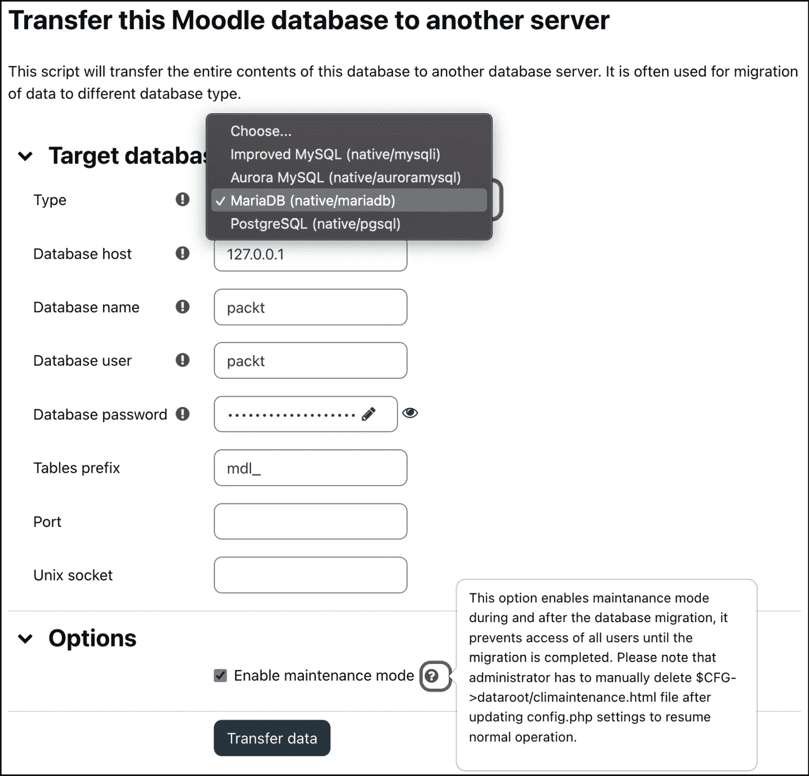

图 17.7 – 数据库迁移

您必须提供数据库的详细信息，该数据库将复制当前数据库的内容。这些设置与安装期间应用的设置相同（参见 *第一章*，*安装 Moodle*）。

您随后可以通过手动或通过 **站点管理** | **服务器** | **服务器** | **维护模式** 来手动或通过 **站点管理** | **服务器** | **服务器** | **维护模式** 来处理 `$CFG->dataroot/climaintenance.xhtml` 文件。

## 搜索和替换数据库内容

与数据库迁移功能相关的工具是 `<yoursite>/admin/tool/replace`。

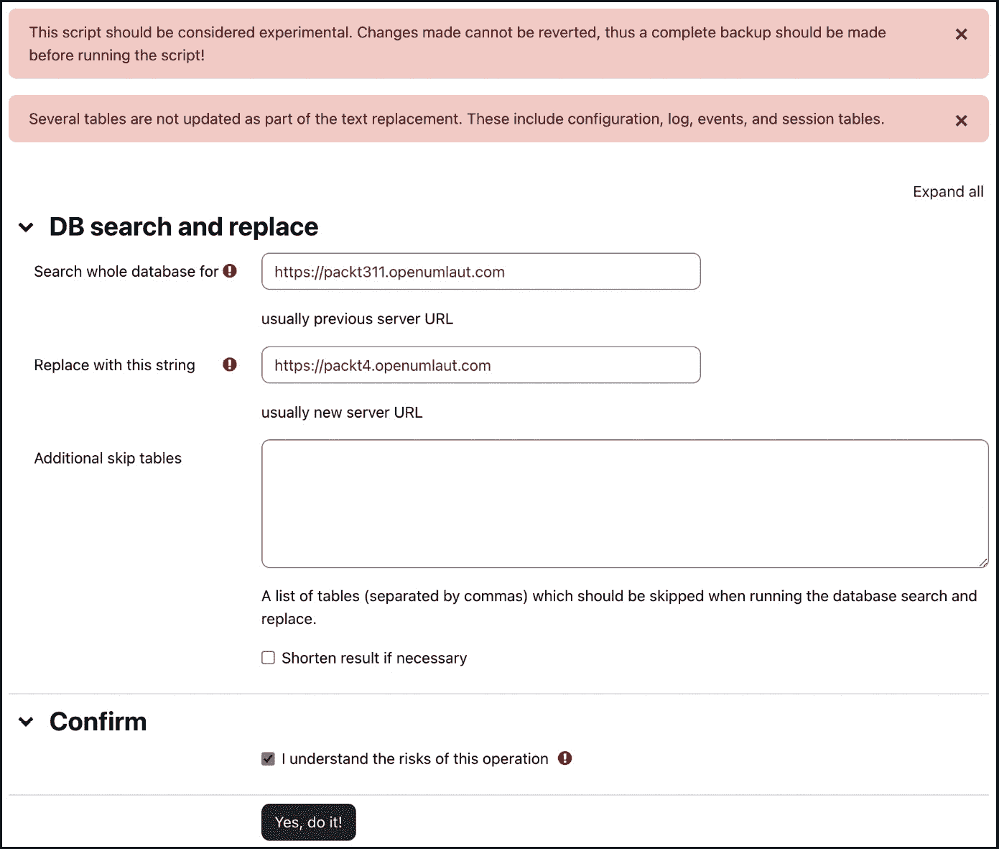

图 17.8 – 数据库搜索和替换

最后一个选项，标记为**我了解此操作的潜在风险**，表明执行的潜在风险——除非你 100%确信替换不会对系统有任何影响，否则你最好不要接近它。一旦完成，脚本将显示所有执行的 SQL 查询。

## Moodle Adminer

Adminer 是一个开源工具，用于管理不同类型的 SQL 数据库。已经创建了一个包装器，让你可以直接从 Moodle 中访问该工具。Moodle Adminer 必须安装在你的`local`插件部分（有关详细信息，请参阅*第八章*“理解 Moodle 插件”）。你可以在[moodle.org/plugins/local_adminer](http://moodle.org/plugins/local_adminer)找到安装程序。

一旦安装，你通过**站点管理** | **服务器** | **Moodle Adminer**访问数据库管理控制台，它将在模态窗口中打开工具：

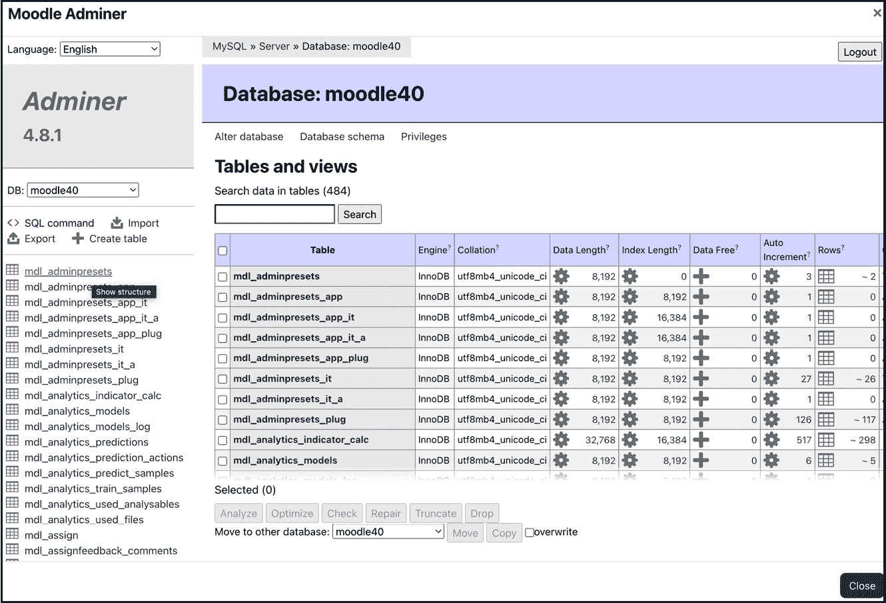

图 17.9 – Moodle Adminer 界面

默认情况下，你必须选择一个数据库。但是，如果你在**站点管理** | **插件** | **本地插件** | **Moodle Adminer**中启用**以当前数据库启动 adminer**设置，则可以跳过此步骤。

一旦打开（Moodle）数据库，你就可以执行操作（如查询、更改数据或创建 SQL 转储）而无需任何 SQL 知识。

重要提示

确保你只有在了解自己在做什么的情况下才更改数据；否则，你可能会引入数据库不一致性，Moodle 将无法按预期工作。

我们不会详细介绍如何使用 Adminer，因为这超出了本章的范围。你可以在[www.adminer.org](http://www.adminer.org)找到你所需的所有信息。

这就结束了数据库工具部分，我们介绍了数据库迁移、数据库搜索和替换以及 Moodle Adminer。我们忽略了一个仅适用于 MySQL/MariaDB 的工具，并且只有在迁移仍在使用旧版 MyISAM 格式的数据库时才需要。这个工具可以在`<yoursite>/admin/tool/innodb`找到，它可以将任何表从 MyISAM 转换为 InnoDB 存储引擎。

此外，还有一些支持数据库相关操作的 CLI 脚本，例如`mysql_engine`和`check_database_schema`。什么是 CLI 脚本？在下一节中找出答案。

# CLI

我们在书中和在第*第一章*“安装 Moodle”时已经遇到了 CLI 的选择性使用，当时我们处理了 Moodle 升级。然而，CLI 还有一些额外的技巧，我们将在本节中处理。

首先，让我们看看如何调用 CLI 脚本，这些脚本位于`admin/cli/*`或提供 CLI 选项的插件的子文件夹中——例如，`auth/ldap/cli`。要调用 CLI 脚本，请遵循以下标记：

```php
sudo –u <apache_user> /usr/bin/php admin/cli/<script>.php [--params]
```

你的`<apache_user>`通常是`www-data`、`httpd`或`apache`。

重要提示

总是在网络服务器用户的身份下运行 Moodle CLI 脚本。

每个 CLI 脚本都有一个`--help`参数，它提供额外的信息，并描述调用选项和参数。以下是一些有用的 CLI 命令及其所在的章节编号。查看它们各自的 CLI 目录或访问[docs.moodle.org/en/Administration_via_command_line](http://docs.moodle.org/en/Administration_via_command_line)以获取所有其他命令。这里没有列出任何参数，因为这些在`--help`选项中解释得很好。

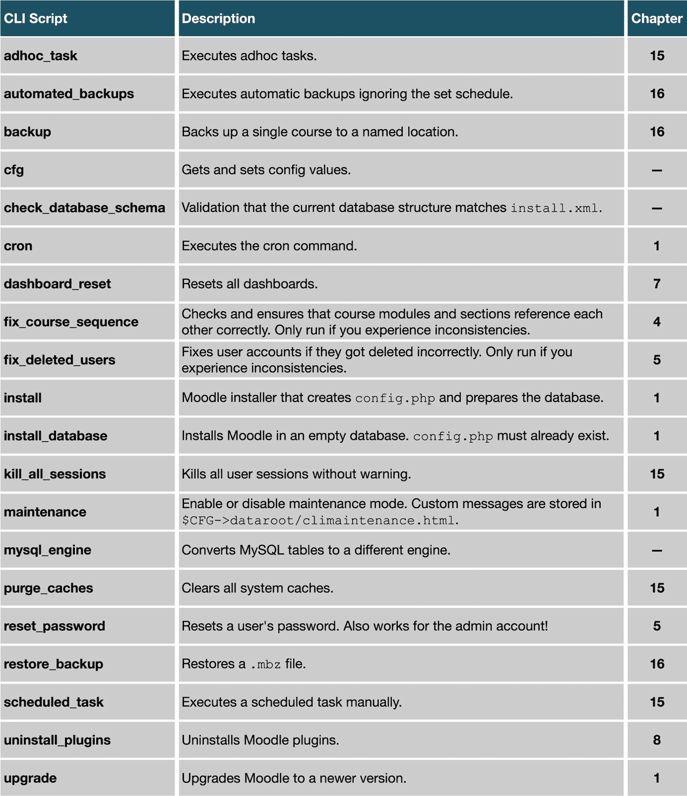

图 17.10 – 一组 Moodle CLI 脚本

CLI 的真正力量在于能够将 CLI 命令嵌入到 shell 脚本中，这使得对通常耗时或易出错的常规程序进行强大的**自动化**成为可能。我们在*第一章*，“安装 Moodle”中展示了一个小的安装脚本。以下是一个另一个示例脚本，它终止所有用户会话并清除缓存，利用了一些 CLI 脚本：

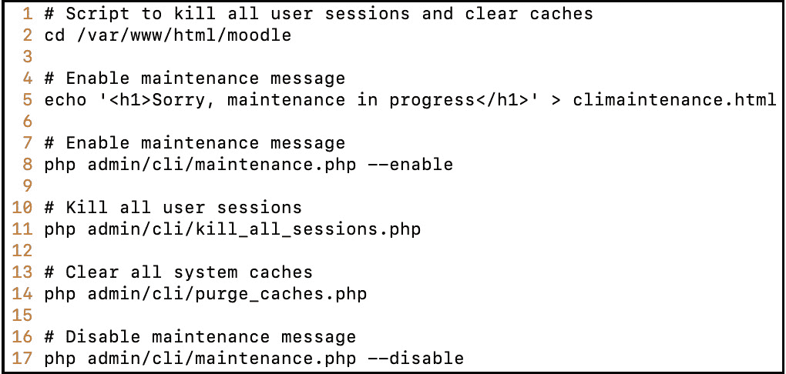

图 17.11 – 使用 Moodle CLI 的示例 Bash 脚本

虽然对于支持的运算很有用，但 CLI 提供的命令集相对有限。我们将要介绍的 Moosh 可以克服这一限制。

# Moosh – Moodle Shell

Moosh 代表 Moodle Shell，是一个命令行工具，允许您执行最常见的学习管理系统任务。

在您可以使用 Moosh 之前，您必须安装它（参见*第八章*，“理解学习管理系统插件”）。安装后，您将拥有大量的命令（截至编写时，超过 150 个！）可供使用。

Moosh 的一般语法如下：

```php
moosh <-params> <command> <options>
```

为了让您了解可以使用 Moosh 做哪些事情，这里有一些示例：

+   `moosh user-create test`：创建用户名为 `test` 的用户。

+   `moosh user-create test{1..10}`：创建 10 个用户。这种枚举类型可以与许多 Moosh 命令一起使用。

+   `moosh user-create --email packt@openumlaut.com --city "Heidelberg" --country DE --firstname "Alex" --lastname "Büchner" packt`：所有用户配置文件值都受支持；这只是一个示例。

+   `moosh info-plugins`：显示所有已安装插件及其位置的列表。

+   `moosh file-list course=42`：输出 ID 为 `42` 的课程中所有文件的信息。还有更多与文件相关的命令，例如显示文件的系统路径或直接上传文件的能力。

+   `moosh plugin-install mod_videotime`：下载并安装多功能 Videotime 插件的最新版本。这有多酷？

一旦你通过管道和流将 Moosh 命令与标准 shell 命令结合使用，你将手头拥有一套强大的命令库。例如，你可能想要找到所有大于 10 GB 的备份，归档它们，并回收空间。

以下示例展示了三个 Moosh 命令的执行和输出：

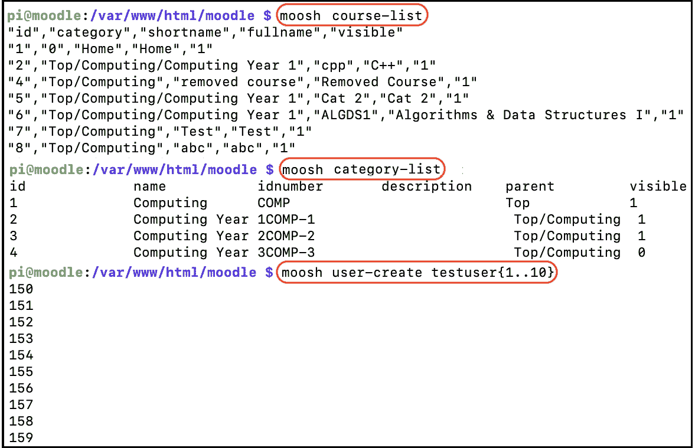

图 17.12 – 与 Moosh 玩耍

第一个(`moosh course-list`)显示了所有课程的信息；第二个(`moosh category-list`)对类别做了同样的操作；最后一个(`moosh user-create test{1..10}`)显示了创建后的 10 个用户账户的 ID。

要获取超过 150 个命令和数百个选项的完整列表，请参考 Moosh 网站[moosh-online.com/commands](http://moosh-online.com/commands)。该列表不断增长，请确保你已经安装了最新版本。

这部分关于 Moosh 和 Moodle 管理员工具的章节到此结束。希望其中的一些功能能够简化你的日常工作，并优化你需要执行的某些常规任务。

# 摘要

在本章中，我们介绍了一系列管理员工具，其中一些是隐藏的且不受支持的，但仍然非常有用。我们首先探讨了管理员工具的组织方式，然后介绍了站点管理员预设和一些数据库工具，包括外部 Adminer、Moodle CLI 和强大的第三方 Moosh 工具。

扩展 Moodle 的其他方式是网络服务，我们将在下一章中介绍。
