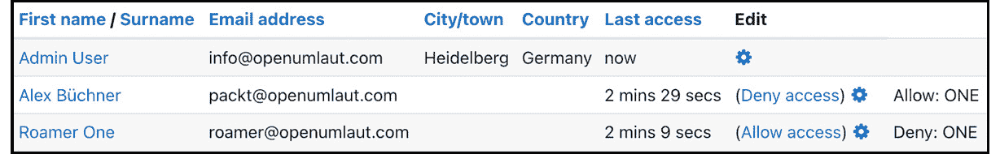
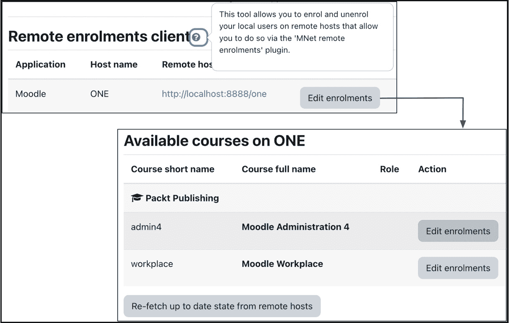

# 19

# 设置 Moodle 网络连接

Moodle 提供了一个独特功能，允许您将多个 Moodle 站点联网。这种联网功能在多个场景中非常有用——例如，当您想与远程 LMS 共享资源、与另一家组织合作，或者拥有一个多校区设置，其中每个站点都有自己的 Moodle 实例时。

在概述了 **Moodle 网络连接** (**MNet**) 之后，我们将学习所需的联网组件以及如何启用联网。接下来，我们将学习如何链接两个 Moodle 站点，这包括设置对等连接、跨实例漫游、配置远程身份验证和注册，以及使用网络服务器块。最后，我们将学习如何将多个 Moodle 站点连接到中央 MNet 枢纽。

我们将以一个与 MNet 密切相关的全新平台结束本章，该平台被称为 **MoodleNet**，这是一个用于查找、共享和整理开放教育资源的平台。您将学习如何启用 MoodleNet，以便您的教育工作者可以利用它。

本章将涵盖以下主要主题：

+   配置 Moodle 网络先决条件

+   设置对等网络

+   设置 Moodle 枢纽

+   启用 MoodleNet

# 理解 Moodle 网络连接

学习管理系统通常是独立系统。但学习很大一部分是关于沟通和协作的，MNet 通过提供在多个 Moodle 站点之间建立逻辑链接的强大功能来克服这一限制。

Moodle Docs 包含一篇关于 MNet 的非常优秀的页面，本章部分遵循该文档：[docs.moodle.org/en/MNet](http://docs.moodle.org/en/MNet)。

支持以下两种联网拓扑：

+   **对等连接**：这种布局直接连接两个 Moodle 系统。如果您有两个合作伙伴组织或一个提供课程且希望其他站点的学生注册的站点，这种拓扑结构是有利的。

+   **Moodle 枢纽**：枢纽是一个配置为接受其他 Moodle 服务器连接并为这些远程服务器用户提供服务的 Moodle 服务器（称为 **MNet 枢纽**）。如果您有一个用于共享学习资源或课程的门户网站，这种拓扑结构是有利的。

这两种拓扑结构不是互斥的，可以在同一个网络中混合使用，如下面的图示所示。所有参与的 Moodle 实例都连接到一个中心枢纽，左侧的两个 Moodle 系统已经建立了对等连接：

图 19.1 – Moodle 网络拓扑

MNet 支持 **单点登录** (**SSO**)，它提供了多个 Moodle 系统的无缝集成。通过完全加密身份验证和内容交换，确保了安全性。

信息

**MNet** 是为 Moodle-Moodle 配对设计的。计划在未来用 OAuth2（用于身份验证）和 Web 服务（用于通信和数据交换）来替换 MNet。

现在我们已经讨论了一些网络先决条件和安全问题，让我们学习如何设置对等网络和 MNet 中心。

# 配置 Moodle 网络先决条件

MNet 需要在所有参与安全通信和安全数据交换的服务器上安装三个额外的组件。

## 检查所需的 PHP 扩展

以下元素必须在所有参与网络的 Moodle 服务器上安装：

+   在运行`configure`时使用`--with curl`。

+   `--with openssl`）。

+   `--with xmlrpc`）。

可以向 Moodle 添加受信任的主机，这允许它们通过 XML-RPC 调用 Moodle API 的任何部分。受信任的主机可能非常危险，仅适用于开发者；我们在此不会处理此功能：

图 19.2 – Moodle 网络先决条件

要检查是否已安装所需的 PHP 扩展，请转到**站点管理** | **服务器** | **环境**并确保所有三个组件的状态为**OK**。

## 启用 Moodle 网络

所述 PHP 扩展确保了安全通信以及参与站点之间数据的安全传输。Moodle 将生成一个证书来加密通信，这是通过使用前面提到的证书通过 PHP 完成的。

一旦启用网络，Moodle 将使用 OpenSSL 生成一个公钥/私钥对。当您稍后连接到另一个 Moodle 站点（该站点也有一组密钥）时，将交换公钥，您将需要确认您的站点将信任此公钥。当两个站点交换数据时，发送方将使用其私钥对每个请求进行签名，并使用接收方的公钥加密消息。接收方，即持有发送方公钥及其私钥的人，将能够解密消息并执行请求。理论部分到此结束。现在，回到现实世界。

要激活 Mnet，请转到**站点管理** | **常规** | **高级功能**并启用**网络**，这将向站点管理员菜单添加**网络**菜单。此步骤必须在 Moodle 网络的所有参与服务器上执行。

转到**站点管理** | **网络** | **设置**，您将看到由 OpenSSL 创建的公钥：

图 19.3 – Moodle 网络公钥

该密钥的有效期从创建之日起为 28 天；在此之后，将创建一个新的密钥（**密钥轮换**）。可以通过在同一屏幕上使用**删除**选项手动更新密钥。

重要提示

密钥过期时间无法通过 Moodle 参数更改；然而，可以通过配置设置进行更改（见*附录*，*配置设置*）。将`$CFG->mnetkeylifetime=365`添加到`config.php`中，将过期期限增加到整整一年，以避免定期需要续签密钥。

现在，MNet 已启用且公钥已生成，是时候让服务器相互通信了。

# 设置对等网络

本节讨论的是对等网络，其中两个 Moodle 服务器相互连接。

为了演示目的，我们已设置两个本地站点（两个对等体）；一个位于`localhost:8888/one`，另一个位于`localhost:8888/two`。

这两个站点不必位于同一域名或组织中。例如，两所大学或两所高中可能希望提供协作课程。它们各自在其域中都有自己的 Moodle 系统，并且它们都控制谁可以访问其网站的哪个部分。

如果您的两个站点托管在同一顶级域名中，并且您同时从同一网络浏览器访问这两个站点，请更改一个站点的 cookie 前缀（**站点管理** | **服务器** | **会话处理**），以避免任何冲突。

## 添加网络对等体

前往`localhost:8888/one`；为了建立与远程服务器的连接，我们必须输入`localhost:8888/two`。然后，在另一个主机上执行等效步骤：

图 19.4 – 添加对等体 I

下拉菜单提供额外的**应用程序类型**：**mahara**。我们在此不涵盖与 Mahara 的集成，并将此设置保持为默认值（**moodle**）。

信息

Mahara 是一个开源的电子作品集系统，可以通过 MNet 进行集成。Moodle 和 Mahara 之间的集成被亲切地命名为**Mahoodle**，在[wiki.mahara.org/wiki/System_Administrator’s_Guide/Moodle//Mahara_Integration](http://wiki.mahara.org/wiki/System_Administrator%E2%80%99s_Guide/Moodle//Mahara_Integration)中有详细的文档记录。

一旦主机已添加，**站点**、**主机名**和**公钥**的详细信息将自动检索。**SSL 验证**参数决定了安全级别；建议将其保留为其默认值**验证主机和客户端**。可选地，选择**强制主题**，该主题将在漫游时使用：

图 19.5 – 添加对等体 II

一旦保存了对等体的详细信息，远程服务器的证书详细信息将显示出来。您还将看到屏幕顶部的以下三个标签页：

+   **审查主机详情**：我们刚刚处理了对等连接的详情。您可以通过选择**站点管理** | **网络** | **对等体**下的相应主机始终返回此屏幕。

+   **服务**：对等服务定义了站点之间启用了哪些 SSO。

+   **个人资料字段**：这决定了当用户从本地站点漫游到远程站点时哪些字段被填充。

重要提示

已删除的对等服务保留在系统中，当您尝试添加具有相同地址的新主机时可以重新激活。

现在两个站点开始互相通信，让我们通过配置对等服务来开始配置用户漫游。

### 配置对等服务

MNet 支持的 SSO 避免了在漫游到远程站点时需要登录的需求。**服务**标签包含四个区域。我们将重点关注最后两个，它们涉及 SSO；注册和资料服务将在稍后处理。

两个 SSO 服务代表一个双向过程，并且两个服务都必须由相应的管理员在两个 Moodle 站点上设置。

重要提示

对等服务可以发布和订阅。

重要的是要注意，本地管理员完全控制发布和订阅。其他站点的管理员永远无法修改您站点上的任何这些设置。

您必须发布身份提供者服务，以便您的用户无需再次登录即可漫游到其他站点。订阅身份提供者服务以允许来自其他站点的已验证用户无需再次登录即可访问您的站点。

您必须发布服务提供者服务，以便来自其他站点的已验证用户无需再次登录即可访问您的站点。订阅服务提供者服务以允许您的用户无需再次登录即可漫游到其他站点：

图 19.6 – 对等服务

让我们看看两个合作大学的例子。大学 A 将发布身份提供者，而大学 B 将订阅它。现在，大学 A 的学生可以无需再次登录即可访问大学 B 站点上的受限区域。

每个服务与其他服务器都有相互依赖关系，如前表所示。例如，本地站点上订阅的 SSO（服务提供者）需要远程站点上已发布的 SSO（服务提供者）。为了允许双向漫游，您的 Moodle 网络中两个对等点的所有四个框都必须由相应的管理员检查。

### 配置个人资料字段

当一个站点的用户首次漫游到另一个站点时，将创建一个本地用户帐户，并通过从远程站点获取数据来填充特定的个人资料字段。您可以通过选择提供的列表中显示的任何个人资料字段来覆盖默认字段。此设置存在于**要导入的字段**（从远程站点漫游到本地站点的用户）和**要导出的字段**（反之亦然）：

图 19.7 – 个人资料字段

默认字段可以在**站点管理** | **网络** | **配置文件字段**下更改。包含在您的导入列表中但排除在远程站点导出列表中的字段将被忽略。

请记住，远程服务器上不会存储密码。由于认证机制将设置为**MNet 认证**，Moodle 每次用户登录时都会检查凭证。我们将在下一节处理认证。

## 启用 MNet 认证

要启动漫游，您必须在两个站点上启用 Moodle 网络认证插件。转到**站点管理** | **插件** | **认证** | **管理认证**并启用**MNet 认证**选项。每当远程站点的用户登录到本站点时，会自动创建一个用户账户。

当您选择认证插件旁边的**测试连接**链接时，您将看到允许用户漫游到您的站点和允许本地用户漫游出去的主机列表：

图 19.8 – MNet 认证

只有当用户在从一个站点漫游到另一个站点时遇到间歇性超时问题时，才在**设置**屏幕上更改**RPC 协商超时**参数。

## 允许漫游

只有被分配了具有`moodle/site:mnetlogintoremote`能力的角色的用户才能漫游到其他站点。默认情况下，此`漫游到远程 Moodle`能力是关闭的，并且必须为每个角色允许。请回顾*第六章*，*管理权限、角色和能力*，了解如何进行此操作。

要为登录到您站点的所有用户启用漫游，允许**认证用户**角色的权限。除非所有用户都被允许漫游，否则值得考虑创建一个单独的漫游角色。或者，如果您希望授予（或拒绝）来自远程主机的单个用户的访问权限，请转到**站点管理** | **网络** | **SSO 访问控制**。您必须指定用户名、远程主机（**所有主机**选项仅适用于社区中心模式，稍后将讨论）和访问级别（**允许**或**拒绝**）。

新添加的用户名不必存在于任一 Moodle 站点！远程中心 ID 显示在用户列表中，这是内部 ID。这类似于用户 ID、组 ID 或角色 ID：

图 19.9 – 允许漫游

网络用户也可以通过 CSV 批量上传分配，我们已在*第五章*，*管理用户、小组和认证*中详细描述了此方法；CSV 文件中的相关字段是`mnethostid`。

## 添加网络服务器块

Moodle 提供了一个之前提到的`moodle/site:mnetlogintoremote`能力，设置为**允许**：

图 19.10 – 网络服务器块

块作为跳板，用于访问远程站点。在这里，除了我们的 Moodle 同伴，我们还设置了一个链接到 Mahara 实例。一旦您点击远程服务器，您将被重定向到所选站点，在那里您可以注册远程课程。

这样，您的第一个点对点网络就已经设置好了！

Moodle 在用户图标上方显示您登录的主机，类似于您伪装成其他用户时的情况。当您点击您的名字时，您将访问远程服务器上新创建的用户资料，该资料不能更改。将显示**远程 Moodle 用户 – 从<同伴>获取的资料**消息。

如果您想拒绝远程用户访问——例如，由于不当行为——请转到**站点管理** | **用户** | **账户** | **浏览用户列表**；您会看到用户列表中已添加了一个额外的列。远程用户不能在本地编辑；只显示他们登录的站点。在右侧列中，您可以选择**拒绝访问**来撤销对站点的访问。要撤销操作，请选择**允许访问**：

图 19.11 – 远程用户

**网络服务器**块为 Moodle 网络难题添加了最后一项强制性组件：主机可以相互通信，用户可以漫游到远程站点。Moodle 网络包中还有一个名为远程注册的好东西，我们将在下一小节中介绍。

## 配置网络注册

最后这一步是可选的，仅当您希望在一个 Moodle 系统中授予管理员权限以注册远程课程中的本地用户，反之亦然时才需要。如果您在服务器上运行共享课程，但远程站点的学习者应该是参与者，远程注册将很有帮助。为了最小化您这边的行政工作量，您可以授予远程管理员执行此任务的权限，这仅限于您指定的课程。

首先，在本地站点（即授予远程站点权利的站点），转到**站点管理** | **插件** | **注册**并启用**MNet 远程注册**插件，该插件允许本地服务器接收来自其远程对应服务器的注册。您可以在**设置**屏幕上更改 MNet 注册的默认角色（**学生**）。

现在，转到**站点管理** | **网络** | **同伴**，选择远程主机，然后点击**服务**选项卡。**发布**和**订阅****远程注册服务**，分别授予远程管理员在您的站点注册学生的权利，并允许本地学生在远程站点注册课程。这一步骤需要在同伴处重复。

两个 Moodle 站点现在都已配置完毕，允许两个服务器之间的通信，并且已经设置了课程以注册远程学生。请确保在您的课程中激活**MNet 注册**方法（有关详细信息，请参阅*第四章*，*管理课程和注册*）。

当您进入**站点管理** | **网络** | **远程注册客户端**时，您将看到本地用户注册的远程主机列表。当您点击一个主机时，将显示为远程注册提供的课程。然后您可以像管理本地课程中的用户一样编辑注册：

图 19.12 – 远程注册

这就结束了关于在 Moodle 主机之间设置对等连接的漫长章节。接下来，我们将探讨另一种受支持的网络安全拓扑：Moodle 中心。

# 设置 Moodle 中心

Moodle 或 MNet 中心类似于对等网络，唯一的区别是它接受来自多个 Moodle（和 Mahara）服务器的连接。虽然这可以通过使用多个对等连接手动设置，但中心模式会自动接受任何尝试连接到它的主机。这可能会节省大量时间和维护成本，但代价是使您的站点对其他 Moodle 实例开放。

通常使用中心模式实现一个公共学习门户，该门户的资源可以在多个站点之间共享。每个希望访问门户的 Moodle 实例都必须配置为连接到中心。

一旦启用网络，请选择将充当中心的 Moodle 站点，并转到**站点管理** | **网络** | **管理对等**以启用**注册所有主机**（混杂模式）。实际上，中心是一个以特殊模式运行的常规 Moodle 站点。

所有主机都被视为对等站点，除了**审查主机详细信息**标签为空。所有其他设置都与对等参数相同。您可能决定流量（即认证和注册）只能单向进行：从不同的 Moodle 站点到中心。您可以使用**服务**标签下的**SSO-Publish**和**SSO-Subscribe**选项来控制这一点：

图 19.13 – Moodle 中心与连接对等

设置 MNet 中心的初级用例是作为跨站点共享资源的门户。MNet 的一个更现代的替代方案是 MoodleNet，我们将在下一节中介绍。

# 启用 MoodleNet

MoodleNet 是 Moodle 为教育工作者提供的开源社交媒体平台，专注于共享开放许可的学习资源。MoodleNet 是 Moodle 生态系统的重要组成部分，可以从 Moodle 内部或直接通过[moodle.net](http://moodle.net)访问。

重要提示

MoodleNet 旨在寻找、共享和整理开放教育资源。

尽管该平台针对的是教师和内容创作者，但作为管理员，您必须确保您的同事能够内部共享（适当且合法）资源，并与全球同行共享。

MoodleNet 集成的流程在以下图中展示：

图 19.14 – MoodleNet 集成

假设您是一位课程创建者，已经开始开发关于特定主题的模块。在课程内部（通过活动选择器），调用 MoodleNet 并浏览资源。当选择一个元素（从简单的学习要点到整个课程）时，将使用 Moodle 的标准恢复过程将资源导入到您的课程中。这些步骤可以重复多次，并支持有效的内容整理。

MoodleNet 连接默认开启，因此请确保在**站点管理** | **常规** | **高级设置**下已勾选**启用 MoodleNet 集成**选项。

拥有创建或管理活动权限的用户可以从活动选择器浏览[moodle.net](http://moodle.net)的公共目录，并将资源导入到他们的课程中。请确保在**站点管理** | **课程** | **活动选择器 | 活动选择器设置**下已选择**MoodleNet**选项，以便在活动选择器的底部显示链接：

图 19.15 – MoodleNet 配置

如果您希望更改提供给用户的 MoodleNet 实例的名称，请转到**站点管理** | **常规** | **MoodleNet** | **MoodleNet 设置**，在那里您将看到两个参数，**MoodleNet 实例名称**和**MoodleNet URL**。只有当您运行自己的实例或希望连接到替代的 MoodleNet 系统时，才更改后者选项。

Moodle 允许您部署自己的安全且可扩展的 MoodleNet 实例。MoodleNet 是使用 Node.js 和 ArrangoDB 开发的。您可以在 www.npmjs.com/package/@moodlenet/ce-platform 找到如何设置本地实例的详细信息。

Moodle 与 MoodleNet 之间的集成计划在未来将得到增强。值得期待的关键功能是教育工作者能够轻松地将活动分享到 MoodleNet。查看即将发布的版本说明，以了解您将能够配置此即将推出的功能的哪些管理任务。

这部分关于通过 MoodleNet 使您的教师和内容创作者能够共享资源的行政方面到此结束。

# 摘要

在本章中，您学习了如何将不同的 Moodle 系统联网。设置过程需要几个步骤，以下是一个总结的清单：

图 19.16 – MoodleNet 清单

在概述了 MNet 之后，我们介绍了所需的组件以及如何启用网络功能。

我们链接了两个 Moodle 网站，这涉及到设置对等连接，跨实例漫游，配置远程身份验证和注册，以及使用网络服务器块。

然后，我们介绍了中央 MNet 中心的概念，用于连接多个 Moodle 网站。

最后，我们启用了 MoodleNet，这是一个用于查找、共享和整理开放教育资源的平台。

Moodle 的网络功能为学习管理系统引入了一个新的维度。不同的系统可以逻辑上连接起来，从一个 Moodle 网站漫游到另一个网站可以得以简化。网络化的 Moodle 主机为组织内部实体或外部网站之间开辟了全新的机会。

另一个代表多个实体的设置是多租户模式，这是本书最后一章的主题。
