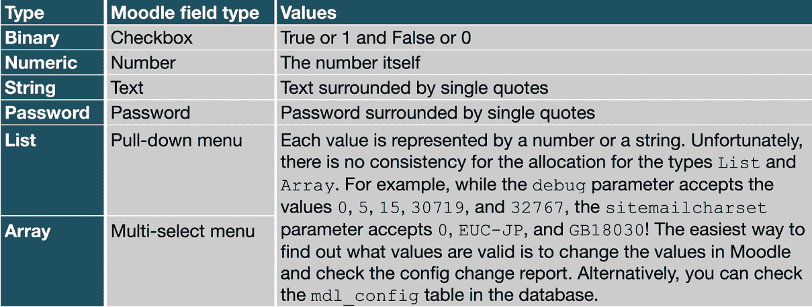

# 支持多租户

本章讨论了在 Moodle 中设计和实现多租户的不同方法。如果以下任何场景对您感兴趣，那么本章就是为您准备的：

+   一个代表一个地区或国家多个学校或学院的权威机构希望为每个学校或学院提供独立的 Moodle 系统，但需要集中管理这些系统

+   一个拥有多个客户、每个客户都需要自己的封闭区域的私人培训机构

+   一个拥有地区办事处、每个办事处都需要自己的学习空间的公司

首先，我们将概述多租户是什么以及为什么没有一种一刀切解决方案，然后再介绍三种不同的实现类型。

第一种方法，通过分类的多租户，使用一个带有特定定制课程类别和权限的单个 Moodle 实例。

第二种实现方式，通过集中代码库的多租户，提供独立的独立 Moodle 实例并将所有责任委托给本地管理员。

最后，我们将描述多租户如何在 Moodle Workplace 中实现。

本章将涵盖以下主题：

+   理解 Moodle 多租户

+   通过分类支持多租户

+   通过集中代码库支持多租户

+   支持 Moodle Workplace 中的多租户

# 理解 Moodle 多租户

多租户究竟是什么？在 Moodle 环境中，多租户可以定义为以下内容。

重要提示

在 Moodle 多租户设置中，独立的实体或实例（租户）被集中管理，其中特定功能被下放并本地管理。

下面的径向图展示了 Moodle 多租户的简化高级视图：


图 20.1 – Moodle 多租户：高级视图

在多租户方面，有两个关键的高级问题需要回答：

+   哪些功能是在**集中**处理的，哪些是委托的 – 即在**租户级别**处理的？

+   哪些元素可以在租户之间**共享**（如果有的话）？

这些问题至关重要，因为答案决定了哪种类型的多租户适合您的组织。

让我们进一步深入到 Moodle 环境中的两个维度 – 功能和共享 – 如以下图所示：


图 20.2 – Moodle 多租户：功能和共享

当查看可能受多租户影响的具体 Moodle 功能时，会引发更多问题：

+   **用户**：用户账户是集中管理并分配给租户，还是租户管理员可以本地管理用户？关于身份验证呢？每个租户是否有单独的身份验证机制，或者登录是全局管理的？用户名是否必须在所有租户中唯一？用户能否在多个租户中？每个租户是否都有自己的访客账户？租户感知的用户配置文件字段怎么办？是否应该为每个租户设置用户配额？还有租户群体和租户角色呢？

+   **课程**：课程（和类别）将集中管理、本地管理还是两者兼而有之？课程能否在租户之间共享？来自多个租户的用户是否能够注册同一课程，反之，用户能否在多个租户中注册课程？

+   **插件**：所有租户都有相同的插件，还是可以在租户级别激活和停用？每个插件的配置是否可以针对每个租户不同，或者对所有租户都是相同的？

+   **管理员设置**：哪些全局设置可以单独配置（如果有）？是否应该允许主管理员锁定特定的配置设置，以防止个别租户管理员更改这些值？

+   **管理员功能**：哪些管理员工具，如报告和备份，可以被租户管理员配置和操作？关于安全和隐私设置呢？是否允许跨租户报告？

+   **主题**：主要主题适用于所有租户，还是每个租户都可以有自己的设计？关于一个可以针对每个租户进行品牌化的白标主题呢？

+   **Moodle 代码**：代码库对所有租户都是相同的，还是个别租户可以有他们自己的代码（即，进行修改）？

列表可以一直继续下去。从问题中可以看出，对于多租户来说，不可能有一种一刀切的方法。当你让三位 Moodle 顾问提出一个多租户清单时，你很可能会收到四个不同的版本。

现在我们已经提出了几个问题，让我们看看三种（非常）不同的多租户方法，希望能回答其中的一些问题。

# 通过类别支持多租户

多租户最简单的形式是将 Moodle 系统配置为使一个类别代表一个租户。以下图表说明了这种方法：


图 20.3 – 通过类别实现多租户

一个类别代表一个隔离区域（租户），在这里课程是本地管理的。用户可以通过类别群体分配；也就是说，用户可以是多个租户的成员。

您可以为每个类别分配一个专用主题，就像我们在*第七章*中看到的，*增强 Moodle 的外观和感觉*。然而，用户在登录之前不会看到这个品牌。应该创建一个新的类别管理员角色，并相应地授予适当的权限——例如，添加子类别和课程的权限。

基于类别的这种方法的一个主要缺点是插件只能在整个站点范围内配置，而不能在租户（即类别）级别配置。您可以通过使用每个模块的 *addinstance* 能力来绕过这种限制，这允许您控制哪些活动可以添加到哪些课程中。然而，这种能力仅适用于活动，不适用于其他插件，如身份验证、注册或剽窃。*addinstance* 也只能应用于课程级别，而不能应用于类别级别。

以下清单总结了这种穷人的多租户方法：


图 20.4 – 清单：通过类别实现的多租户

通过类别实现的多租户主要适用于用户集中管理且部门、学院或其他实体仅控制课程内容的网站。这种方法不适用于需要更高程度租户级别自主权的网站。通过集中化代码库实现的多租户克服了这种限制，如下一节所示。

# 通过集中化代码库支持多租户

这种多租户方法的主要思想是拥有一个单一的代码库，但多个独立的 Moodle 实例。

这种模型适用的一种例子是，每个租户代表该地区的学校或学院，每个学校或学院都有自己的 Moodle 管理员、主题和管理设置，用于管理用户、课程、隐私和成绩。

以下图示说明了这种联邦方法：


图 20.5 – 通过集中化代码库实现的多租户

此解决方案需要两个主要配置步骤：

1.  **Web 服务器配置**：

对于每个 Moodle 实例，都需要一个单独的虚拟主机，其中 `ServerName`、`ErrorLog` 和 `CustomLog` 参数指向单个实例（租户），但 `DocumentRoot` 变量必须在所有虚拟主机中保持一致，以确保使用相同的代码库（`CFG->dirroot`）。虚拟主机可以是单独的 `vhost` 文件，也可以是 `httpd.conf` 中的 `<VirtualHost>` 条目。

1.  **Moodle 设置**：

存在一个主要的 `config.php` 文件，作为所有其他由单个 `config.php` 文件表示的实例的启动平台。这些本地 `config.php` 文件必须存储在单独的位置，并必须遵循严格的命名约定（在我们的例子中，为 `<域名>_config.php`）。这些配置文件的安装和维护通常通过脚本实现，以确保一致性。

要使此方案生效，主 `config.php` 文件必须按以下方式修改，假设您的本地 `config.php` 文件存储在专门的 `/tenants` 文件夹中：

```php
<?php // Moodle configuration file
$moodle_host = $_SERVER['HTTP_HOST'];
require_once('/tenants/'.$moodle_host.'_config.php');
```

在每个本地 `config.php` 文件中，`$CFG->dirroot` 必须设置为在此 `vhost` 中指定的 `DocumentRoot` 的相同值。

可以进一步自定义本地配置文件，以适应特定租户的任何特殊需求。例如，您可能希望冻结租户管理员不得修改的特定管理参数。

使用这种设置，您只需维护单个代码库，并为每个租户提供一个独立的、独立的 Moodle 实例。该实现也适用于您必须根据需要提供 Moodle 实例的环境，例如在培训或开发环境中。

以下清单总结了这种集中式的多租户方法：


图 20.6 – 概述：通过集中式代码库实现多租户

目前提出的方案为多租户提供了非常不同的解决方案：一个方案使用单个 Moodle 实例，并配置了课程类别和权限，而另一个方案则提供独立的独立实例，并将所有责任委托给本地管理员。以下章节中提出的实现方案位于这两种方案之间：一个具有内置租户功能的单个 Moodle 实例。

# 在 Moodle Workplace 中支持多租户

本书是关于 Moodle 管理和其所有内容也适用于 Moodle Workplace。由于 Moodle Workplace 提供独特的功能来满足多租户需求，我们将做出例外，并在这里介绍仅适用于 Moodle Workplace 的功能。本节的部分内容来自（广告警告！）Packt Publishing 出版的我的书《Moodle Workplace 企业学习》中的“租户、组织和团队”章节。

Moodle Workplace 中的多租户有两个关键部分：

+   **租户**：租户是完全隔离的实体，拥有自己的外观和感觉、结构、用户和学习实体

+   **共享实体**：支持在租户之间共享课程和证书，也支持共享数据，如计划、报告或组织结构

我们将在以下两个子节中介绍 Moodle Workplace 多租户的两个方面，通过描述它们的一般工作方式。有关 Moodle Workplace 强大而通用的多租户功能的实现细节，请参阅[docs.moodle.org/en/Multi-tenancy](http://docs.moodle.org/en/Multi-tenancy)，该文档也由作者编写和维护。

## 理解 Moodle Workplace 租户

在 Moodle Workplace 中，租户是隔离的实体，拥有自己的用户、层次结构、角色、动态规则、主题设置、报告、自定义页面和学习实体（课程、计划和认证）。

所有 Moodle Workplace 工具都支持多租户感知 – 根据功能，支持不同级别的多租户。以下图表展示了租户和多租户感知元素的高级视图：


图 20.7 – Moodle Workplace 多租户

在安装期间或从 Moodle LMS 升级到 Moodle Workplace 之后，将创建单个默认租户。每个租户都有以下属性：

+   **租户名称**和**ID 号**：租户的名称和唯一的租户标识符。

+   **站点名称**和**站点简称**：这两个租户设置分别覆盖**站点管理** | **常规** | **站点** **主页设置**中的**完整站点名称**和**站点简称**设置。

+   `workplace.openumlaut.com?tenant=packt`。

+   **课程类别**：属于特定租户的课程必须位于租户类别中。我们将在处理跨租户共享内容时详细介绍该功能。

在处理 Workplace 中的**租户用户**时，有两个关键规则——有些人可能称之为限制：

重要提示

用户始终被分配给一个租户；账户不能没有租户。

用户不能被分配给超过一个租户；账户始终只属于一个单一租户。

当创建新的用户账户时，无论是通过自我注册、手动输入、批量上传还是通过网络服务，除非另有说明，否则总是附加到默认租户。以下图表说明了用户如何分配给租户：


图 20.8 – Moodle Workplace：用户和租户

每个用户恰好属于一个租户，尽管这可能在将来发生变化。Moodle Workplace 支持租户用户配额，并允许您指定允许的最大租户数量。

Moodle 的用户配置文件字段已扩展，允许为每个租户定义不同的用户配置文件字段。当配置文件字段属于特定租户的类别时，它们将只出现在该租户用户的配置文件中；这也包括注册和编辑表单。

每个租户可以有零个、一个或多个**租户管理员**，他们拥有下放的管理功能，允许您微调他们的责任级别。除了处理租户用户外，租户管理员默认有权管理租户角色、配置租户认证设置、调整租户品牌和创建租户仪表板：

+   **租户角色**:

可以分别为每个租户独立管理用户角色的分配——因此，处理租户几乎就像是一个上下文。

+   **租户认证**：

Moodle Workplace 支持多租户认证；您可以为不同的租户配置不同的认证选项。在撰写本文时，支持的认证方法有*手动*、*基于电子邮件的自我注册*和*OAuth 2*。*SAML*是一个明确支持的第三方认证方法。有关更多详细信息，请参阅[docs.moodle.org/en/Multi-tenancy_authentication](http://docs.moodle.org/en/Multi-tenancy_authentication)。

+   **租户品牌**：

您可以通过配置多租户感知的 Workplace 主题来自定义租户的外观和感觉。品牌元素、图像、颜色、自定义 SCSS 和页脚在 Moodle Docs 中有详细描述，请参阅[docs.moodle.org/en/Workplace_theme](http://docs.moodle.org/en/Workplace_theme)。

+   **租户仪表板**

默认情况下，所有租户仪表板都链接到默认站点仪表板中定义的内容，并且对任何租户的新用户来说，对这一页的任何修改都会显示出来。任何具有适当权限的用户（默认为站点和租户管理员）都可以定义一个具有与主仪表板相同编辑能力的特定租户仪表板。租户管理员可以管理其租户的仪表板并重置租户用户的配置。

所有 Moodle Workplace 工具，如程序、认证、自定义页面、动态规则和组织结构（部门、职位和职位），都完全支持多租户。除了按租户定义和管理这些功能外，Moodle Workplace 还支持在租户之间共享内容和数据，如以下子节所述。

## 理解 Moodle Workplace 共享实体

Moodle Workplace 支持两种方式来促进租户之间的共享：

+   **共享内容**：共享课程和证书

+   **共享空间**：共享 Moodle Workplace 数据，例如程序或组织结构

让我们简要看看这两种选项。

### 在 Moodle Workplace 中共享内容

通常，每个租户都有自己的课程类别，因此也有自己的课程。手动注册方法已修改，因此用户选择器仅显示当前租户的用户。然而，在某些情况下，您可能希望在不同租户之间共享特定的课程，这可以通过将课程放置在*共享* *课程*类别中来实现。

多租户不适用于课程内容，这意味着如果学习者或培训师注册了课程，他们在浏览课程时将看到来自其他租户的用户。这种行为是有意为之的：假设您的组织有一些共享课程。可以假设您希望学习者一起学习，并且来自一个租户的培训师对所有学习者来说都是培训师，无论他们的租户是什么。

如果您在不同租户之间共享课程，并且希望每个租户的用户独立学习，他们必须属于不同的组。当共享课程是程序的一部分时，自动将分配到不同的组。

我们在*第九章*“配置教育功能”部分中“技能和激励”部分介绍的证书工具，使用了前面描述的共享课程类别功能。如果证书模板放置在租户课程类别中，它仅限于这个特定的租户；否则，它将在所有租户之间共享。

自定义页面允许站点和租户管理员通过轻松添加新页面到导航中，为不同的受众创建个性化的体验。这些页面上的内容可以使用标准的 Moodle Workplace 块进行定制。虽然租户自定义页面是针对单个租户的，但全局自定义页面是在所有租户之间共享的。

### 使用共享空间在 Moodle Workplace 中共享数据

**共享空间**功能使得可以在所有租户之间共享实体。它就像一个特殊的租户，用户可以创建在其他租户中可用的受支持实体。

重要提示

**共享空间**是一个特殊的租户，用于在**所有**租户之间共享 Moodle Workplace 实体。

目前，以下 Workplace 工具在**共享空间**中受到支持：

+   项目和认证

+   组织结构（部门、职位和职位）

+   动态规则

+   报告

在以下屏幕截图中，您可以看到一个自定义报告列表，以演示**共享空间**功能。Moodle Workplace 的报告生成器与在第*第十二章*中描述的相同，*通过 Moodle 报告和分析获得洞察力*，只是有更多的报告来源和**共享空间**的支持：


图 20.9 – Moodle Workplace：用户和租户

两个报告（**已颁发证书**和**新用户（所有）**）旁边有一个小标记，表示它们是在租户之间共享的，而其他两个报告仅在本地租户中可用。

这就完成了对 Moodle Workplace 中多租户的概述，这也适用于 Moodle Workplace 应用程序。为了总结，我们创建了一个熟悉的清单，如下图所示：


图 20.10 – Moodle Workplace 中多租户的总结

要了解更多关于 Moodle Workplace 中多租户的有趣阅读，请查看[moodle.com/news/lms-multi-tenancy](http://moodle.com/news/lms-multi-tenancy)上的文章。

# 总结

本章讨论了支持 Moodle 多租户的不同方法。我们首先定义了什么是多租户，并说明了为什么需要不同类型的多租户实现。我们介绍了三种不同的方法，其中之一可能符合您的需求。

第一种模型，通过类别实现的多租户，使用了一个配置了课程类别和权限的单个 Moodle 实例。

第二种方法，通过集中式代码库实现的多租户，提供了独立的独立实例，并将所有责任委托给本地管理员。

最后，我们介绍了 Moodle Workplace 中的多租户功能，这是目前可用的最灵活的即装即用实现。

我们介绍了三种代表性的实现，以促进 Moodle 的多租户功能。当然，这些解决方案可以根据您的个别需求进行扩展或进一步修改。

# 我们感兴趣的 `config.php` 值是以美元符号开头的。每个参数都有以下信息格式：

# 我们将首先检查 `config.php` 并探讨 Moodle 支持哪些类型的参数。在提供这个概述之后，我们将查看两种类型的配置设置：


`<value>` 参数必须是参数接受的类型，这取决于设置的类型。以下表格提供了每种类型的详细信息：

+   配置设置

+   重要提示

# 本附录旨在提供您可以在 `config.php` 中修改的参数列表以及每个值将产生的影响。

`config.php` 配置文件包含多个设置和变量，这些变量极大地影响了 Moodle 的运行方式。它位于您的 Moodle 系统主目录中 (`$CFG->dirroot`)，可以使用任何文本编辑器进行编辑。

修改 `config.php` 时请小心！Moodle 严重依赖于其内容，任何错误都可能导致软件故障。



在修改配置文件之前，您应该创建其备份，以便在出现问题时可以回滚到它。此外，请确保文件权限设置正确，因为该文件包含纯文本数据库用户名和密码。在 Linux 环境中，所有者应为 `root`，组也应该是 `root`，权限设置为 `644`。以下截图显示了示例配置文件：

`config.php`。

图 A.1 – 示例 config.php 文件

`<parameter>` 是配置设置的名称。每个设置都有一个唯一的标识符。

```php
$<object>-><parameter> = <value>;
```

图 A.2 – 配置设置中支持的数据类型

配置参考——概述

**系统设置**：我们区分默认和补充配置值。前者将由安装程序创建，对于 Moodle 的运行通常是必需的；后者是改变 Moodle 行为的参数。

`<object>` 参数是 Moodle 中使用该参数的部分 (`$CFG` 或 `$THEME`)。第三方模块或自定义发行版可能引入了它们自己的对象——例如，`$TOTARA`。我们将重点关注 `$CFG` 对象，因为这些与管理员最相关。

每个参数都必须以分号结尾。要注释掉一个参数，请在其前面加上两个反斜杠。

实现多租户的一些方面可能看起来技术性强、令人畏惧且劳动密集，但如果遵循一个稳固的策略，可能还需要专业和经验丰富的 Moodle 合作伙伴的帮助，那么这将是一个相对无痛苦的过程。

在我们处理不同的设置之前，我们将讨论一些可能有用的工具。由于没有可用的设置列表，你必须自己生成。为此，请在你的 `$CFG->dirroot` 中执行以下 shell 命令：

```php
grep -r -h -o '\$CFG->[a-z][[:alnum:]_]*' . | sort -u
```

这一系列连接的命令将生成一个按字母顺序排列的所有可用 `$CFG` 变量的列表。`moosh config-get` 命令（见*第十七章*，*使用 Moodle 管理工具*）仅提供给你可以通过 Moodle 管理界面设置并存储在 `mdl_config` 中的所有配置变量列表；它排除了我们感兴趣的 *隐藏* 变量。

Moodle 提供了一个报告，允许你通过管理界面监控任何配置设置的所有更改。你可以在 **网站管理** | **报告** | **配置更改** 中找到该报告。


图 A.3 – 配置更改报告

表格显示了在 **网站管理** 部分对设置所做的任何更改。对于每个修改，**日期**、**名字/姓氏**、**插件**、**设置**、**新值**和**原始值**都会显示。

如果你正在尝试配置变量，请考虑使用我们在*第十七章*，*使用 Moodle 管理工具*中讨论的网站管理员预设。该工具允许你创建网站设置的备份，如果出现问题，可以回滚。

# 配置参考 – 管理设置

`config.php` 中的每个参数。如果值已通过此方法设置，则它实际上是硬编码的，无法通过 Moodle 界面更改，即使是管理员也无法更改。

例如，你可能想确保管理员不会在内部网站上打开 HTTPS 登录，即使是不小心。如果没有安装 SSL 证书，激活此设置将使所有人无法访问网站。为此，请在 `config.php` 中输入以下行：

```php
$CFG->loginhttps=false;
```

你如何知道参数的名称？前往 Moodle 中相应的设置（在这种情况下，**网站管理** | **安全** | **HTTP 安全**），你将在标签下方看到参数的名称。

小贴士

你可以在管理菜单的搜索框中搜索任何参数。

如果值在 `config.php` 中指定，Moodle 将在参数旁边显示 **定义在 config.php 中**，这表明该设置不能通过管理界面更改。对于这些固定设置，也会显示无效值。在以下屏幕截图中，**调试消息**的值是不正确的，而**显示调试消息**的值是正确的：


图 A.4 – 固定配置设置

如果你希望强制插件设置，你必须将它们放入一个名为 `forced_plugin_settings` 的特殊数组中（稍后参考可选参数的说明）。

# 配置参考 – 系统设置

本节包含配置设置的实际情况；解释来自帮助页面、论坛帖子以及源代码中的注释。

## 默认参数

默认参数是由安装程序创建的设置，来源于`config-dist.php`。大多数设置对于 Moodle 的运行是必需的，因此修改它们时要小心。参数按它们在`config.php`中默认出现的顺序列出：


图 A.5 – config.php 默认参数

除了默认参数外，还有数百个可选参数，其中一些我们将在以下小节中处理。

## 可选参数

有超过 300 个`config.php`参数不能通过 Moodle 管理员界面进行修改。这些隐藏设置允许您在不更改任何代码的情况下修改 Moodle 的行为。

我们只涵盖了一组代表性的设置，忽略了那些仅与开发人员和设计师相关的设置。我们还忽略了过时和晦涩的参数以及与管理员设置中相对应的参数。参数已按字母顺序列出，并且为了简化，一些参数已被分组。

可用的类型是**数组**、**二进制**、**数字**、**列表**和**字符串**：

| **名称** | **类型** | **描述** |
| --- | --- | --- |
| adhoctaskageerroradhoctaskagewarn | N | Moodle 检查临时队列中任务有多久，在 10 分钟时警告，在 4 小时时出错。 |
| admineditalways | B | 当设置为 true 时，允许管理员在任何时候编辑任何帖子。 |
| apacheloguser | N | 记录 Apache 日志：`0` = 关闭，`1` = 用户 ID，`2` = 全名，`3` = 用户名。 |
| apachemaxmem | N | Apache 子进程在完成请求服务后，超过此内存阈值将被回收。 |
| backuptempdir | S | 可以指定不同的备份临时目录。对于普通 Web 服务器，请使用本地（快速）文件系统。服务器集群必须使用共享文件系统进行`backuptempdir`。目录不得通过 Web 访问。 |
| bounceratio | N | 默认值为`20`。参见`$CFG->handlebounces`。 |

| customfiletypes | A | 在**站点管理** &#124; **服务器** &#124; **文件类型**中添加条目，例如。

&#124;

```php
$CFG->customfiletypes = array(
```

&#124;

&#124;

```php
    (object)array(
```

&#124;

&#124;

```php
        'extension' => 'mobi',
```

&#124;

&#124;

```php
        'icon' => 'document',
```

&#124;

&#124;

```php
        'type' => 'application/x-mobipocket-ebook',
```

&#124;

&#124;

```php
        'customdescription' => 'Kindle ebook'
```

&#124;

&#124;

```php
    )
```

&#124;

&#124;

```php
);
```

&#124;

|

| customfrontpageinclude | S | 您可以用自己的版本替换主页。[moodle.org](http://moodle.org)使用这种方法。只有中心区域将被替换，不包括页眉、页脚或块。 |
| --- | --- | --- |
| **名称** | **类型** | **描述** |
| customscripts | S | 启用此设置将允许自定义脚本（通过完整路径名指定）替换现有的 moodle 脚本。例如，如果 `$CFG->customscripts/course/view.php` 存在，则将使用它而不是 `$CFG->wwwroot/course/view.php`。目前，这仅适用于包含 `config.php` 并作为 URL 部分调用（`index.php` 是隐含的）的文件。自定义脚本不应包含 `config.php`。警告：替换标准 Moodle 脚本可能存在安全风险，并且可能不与升级兼容。然而，当需要修补特定页面而不实际覆盖核心代码时，这很有用。 |
| debugimapdebugsmtp | B | 在向 IMAP/SMTP 服务器发送电子邮件消息时启用详细调试信息（需要 `$CFG->debug` 设置为 `DEBUG_DEVELOPER`）。 |
| debugusers | S | 以逗号分隔的用户 ID 列表，这些用户总是看到调试消息。 |
| defaultblocks | A | 新课程的默认块变量，例如，`participants`、`activity_modules`、`search_forums`、`admin`、`course_list`、`news_items`、`calendar_upcoming`、`recent_activity`。此设置可以针对不同课程类型进行覆盖，例如 `defaultblocks_social`、`defaultblocks_weeks` 和 `defaultblocks_topics`。 |
| disablemycourses | B | 此设置将防止在用户登录时显示“我的课程”页面。主页将始终显示相同的（未登录）视图。 |
| disableonclickaddoninstall | B | 禁用插件安装功能，并从服务器管理用户界面中隐藏它。 |
| disablestatsprocessing | B | 阻止统计处理并隐藏 GUI。 |
| disableupdateautodeploy | B | 禁用更新部署。当通过 Git 检出进行部署时很有用。 |
| disableupdatenotifications | B | 禁用更新通知。当通过 Git 检出进行部署时很有用。 |
| **名称** | **类型** | **描述** |
| disableusercreationonrestore | B | 在恢复课程时完全禁用用户创建。启用此设置会导致在尝试恢复需要创建用户的课程时，恢复过程停止。 |
| divertallemailsto | S | 将所有发出的电子邮件重定向到此地址以测试和调试电子邮件功能。 |
| emailconnectionerrorsto | S | 将数据库连接错误发送给某人。如果 Moodle 无法连接到数据库，请将通知发送到此地址的电子邮件。 |
| expectedcronfrequency | N | Moodle 检查 cron 是否频繁运行。如果 cron 运行之间的时间超过此值（以秒为单位），则在管理页面上会显示警告。此设置仅控制是否显示警告；没有其他效果。 |
| filedir | S | 你可以指定 `dataroot` 的替代路径。 |
| filelifetime | N | 文件在缓存中保留的时间（默认为 `86400`，即 24 小时）。如果你担心学生被服务到过时的上传文件版本，请减少此值。 |
| filepermissions |  | 与默认参数中的`directorypermissions`相同，但用于创建的文件。 |
| forced_plugin_settings | A | 插件设置必须指定为一个数组数组：`array('plugin1' => array('param1' => 'value1', ('param2' => 'value2', …), ('plugin2' => array('param1' => 'value1', ('param2' => 'value2', …), …);` |
| forcedefaultmymoodle | B | 如果设置，则 My Moodle 页面不能由用户自定义。 |
| forcefirstnameforcelastname | S | 为了匿名化所有学生的用户名。如果设置，则所有非教师将始终看到每个人的此信息。 |
| gradeoverhundredprocentmax | N | 如果`unlimitedgrades`被设置，可以指定一个最大值（`1` = 100%，默认 = `10`）。 |
| handlebounces | B | 用于处理邮件退信。与`minbounces`和`bounceratio`一起使用。 |
| httpswwwroot | S | SSL 页面的`wwwroot`。 |
| **名称** | **类型** | **描述** |
| includeuserpasswordsinbackup | B | 允许在备份文件中包含用户密码。只有在你能够保证所有备份文件保持私密的情况下使用，因为密码散列可以是未加密的。 |
| keeptempdirectoriesonbackup | B | 在备份和恢复过程中保留临时目录，直到过程结束时才删除。有关详细信息，请参阅*第四章**，批量管理课程*和*注册*中的*批量管理课程*部分。 |
| langlocalroot | S | `$CFG->dataroot/lang`的替代目录。 |
| localcachedir | S | 可以指定不同的缓存和临时目录。对于普通 Web 服务器，使用本地（快速）文件系统。服务器集群必须使用共享文件系统作为`cachedir`。`localcachedir`是为服务器集群设计的；集群节点不需要共享。这些目录不能通过 Web 访问。 |
| maildomain | S | 您的电子邮件域名。 |
| mailprefix | S | `mdl+`是 Exim 和 Postfix 的分隔符，`mdl-`是 qmail 的分隔符。 |
| minbounces | N | 默认为`10`。有关详细信息，请参阅`$CFG->handlebounces`。 |
| mnetkeylifetime | N | 网络密钥到期前的天数。有关详细信息，请参阅*第十九章**，设置 Moodle 网络*。 |
| noemailever | B | 当在测试服务器上处理生产数据时，不应向真实用户发送任何电子邮件或其他消息。 |
| opensslcnf | S | `openssl.cnf` 文件的位置。 |
| passwordsaltmain | S | 添加到 md5 密码散列中的随机字符串。有关详细信息，请参阅*第十三章**，确保 Moodle 安全*。 |
| pdfexportfont | S | 导出 PDF 文件中使用的字体。在生成 PDF 时，Moodle 将字体子集嵌入到 PDF 文件中，以便在广泛的设备上可读（默认为`freesans`）。 |
| preferlinegraphs | B | 此设置将使某些图表（例如，用户日志）使用线条而不是条形图。 |
| preventscheduledtaskchanges | B | 禁止在**站点管理** **&#124;** **服务器** **&#124;** **计划任务**中编辑任务。 |
| reverseproxy | B | 在设置高级反向代理负载均衡配置和端口转发时启用。 |
| showcrondebugging | B | 将调试信息添加到 cron 输出。 |
| showcronsql | B | 在 cron 执行期间显示执行的 SQL 查询。 |
| **名称** | **类型** | **描述** |
| skiplangupgrade | B | 禁用自动语言更新，并允许翻译者（语言包维护者）保留其`moodledata/lang/*`以手动更新。 |
| sslproxy | B | 在出于性能原因使用外部 SSL 设备时启用。 |
| supportuserid | N | 支持的电子邮件可以重定向到另一个用户。 |
| tagsort | S | 按指定字段对标签云中的标签进行排序；默认为`name`。 |
| themedir | S | 在`$CFG->dirroot`之外添加额外的主题目录。 |
| themeorder | A | 从最高到最低的主题优先级。默认为`array('course', 'category', 'session', '``user', 'site')`。 |
| themerev | B | 防止主题缓存。 |
| tracksessionip | B | Moodle 将跟踪当前用户的 IP 地址，以确保在会话期间没有发生变化。这将防止通过 XSS 攻击劫持会话的可能性，但可能会破坏使用频繁更改代理的用户。 |
| trashdir | S | `$CFG->dirroot/trashdir`的替代位置。 |
| undeletableblocktypes | A | 此列表中的块受到删除保护，例如，`navigation,settings`。 |
| uninstallclionly | B | 这将阻止管理员从管理用户界面卸载插件，并强制仅通过命令行工具（位于`admin/cli/plugin_uninstall.php`）卸载插件。 |
| upgradekey | S | 升级过程中的密码保护。有关详细信息，请参阅[docs.moodle.org/en/Upgrade_key](http://docs.moodle.org/en/Upgrade_key)。 |
| upgraderunning | B | 假装 Moodle 更新正在运行。 |
| upgradeshowsql | B | 在升级期间显示执行的 SQL 查询。 |
| usezipbackups | B | 在备份中使用 ZIP 压缩而不是默认的 TGZ。 |
| wordlist | S | Moodle 的单词审查过滤器使用的单词列表。 |
