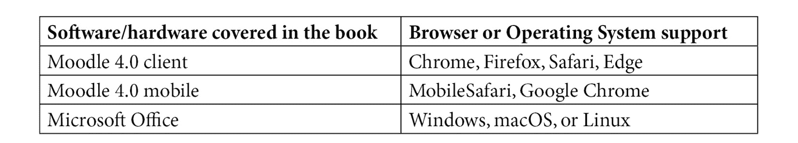

# 前言

Moodle 4.0 保持其灵活、强大和易于使用的平台，并增加了许多新功能，以增强学生成功的学习体验。

本版针对这次重大更新 Moodle 4.0 带来的机遇。您将学习如何将有效的教学设计融入 Moodle 的强大工具中，以实现您的课程目标和学习目标。这样做，您的课程将对学生、教师、课程开发者、项目管理者、助教和系统管理员都同样有效。您将学习如何制定一个有效的课程计划，结合最佳的资源组合和吸引人的评估，真正展示学习者的学习成果，并保持他们参与并取得成功。您将学习如何确保学生享受他们的协作，并真正从彼此那里学到东西。您将学习如何生成报告，并确切了解课程进展情况以及如何使它们回到正轨。在此过程中，您可以使用 Moodle 4.0 的新导航功能帮助学生避免迷失方向。到本书结束时，您将能够构建和部署您的教育项目，使其与学习目标一致，并包含全面的教学内容。您将能够整合“功能增强器”，并适应我们不断变化的世界中的变化需求和目标。

# 本书面向的对象

本书面向新手和有经验的课程开发者，他们希望整合 Moodle 4.0 的强大功能，并使学生的、教师的和行政人员的生活更加轻松。该程序还有助于认证和跨设备部署，服务于各种不同情况的人。

# 本书涵盖的内容

*第一章*，*Moodle 指南*，解释了 Moodle 可以做什么，以及当学生和教师使用 Moodle 时将有什么样的用户体验。您还将了解 Moodle 的哲学以及它是如何塑造用户体验的。有了这些信息，您将准备好决定如何充分利用 Moodle 的众多功能，并规划您的在线学习网站。

*第二章*，*安装 Moodle 和配置您的网站*，向您展示如何为您的组织启动 Moodle 并运行，重点介绍基于云的 Moodle。我们将通过为您选择合适的 Moodle 安装设置来帮助您创建您想要的用户体验。通过配置您的网站以增强用户体验，您也将提升他们的学习体验。

*第三章*，*创建类别和课程*，解释了如何创建课程，根据您的课程目标选择最佳的课程格式，并将学生注册到课程中。此外，我们将确保课程设计良好，并持续关注学习将如何进行。

*第四章*，*管理资源、活动和条件访问*，概述了课程中包含的内容，并解释了如何在课程级别上管理它们。

*第五章*，*将资源添加到您的 Moodle 课程中*，向您展示了如何识别要添加的适当资源以实现课程学习目标，管理资源，然后有效地使用它们。

*第六章*，*添加作业、课程、反馈和选择*，解释了如何构建既能提供教学材料又能通过激励学习者和给予反馈以及指出他们在实现学习成果成功路径上的位置来激发学习者的课程内容。

*第七章*，*通过测验评估学生*，检查了 Moodle 强大的解决方案，该方案允许设计良好且放置得当的测验，以及将测验与掌握学习、能力框架、证书和徽章相结合的能力。

*第八章*，*通过聊天和论坛进行社交*，教你如何将 Moodle 的通信活动添加到课程中，以及如何充分利用它们。它包括聊天、论坛和其他社交媒体形式。

*第九章*，*通过维基和术语表进行协作*，解释了如何通过在课程中添加维基和术语表来开发有效的协作活动，以帮助实现学习目标。

*第十章*，*举办研讨会*，向您展示了如何在 Moodle 中创建一个包含学生同行评审作为互动核心的协作研讨会。

*第十一章*，*小组和班级*，从它们与电子学习者的关系角度探讨了小组和班级的定义。然后我们将讨论组织学生加入小组和班级的最佳时间和最佳方式以实现课程学习目标。

*第十二章*，*通过添加块扩展您的课程*，描述了许多 Moodle 的块，帮助您决定哪些块将满足您的目标，并告诉您如何实施它们。

*第十三章*，*教师功能：日志、报告、指南*，涵盖了如何在 Moodle 4.0 中生成和使用许多日志、报告和指南。

# 要充分利用这本书

# 下载彩色图像

我们还提供了一份包含本书中使用的截图和图表彩色图像的 PDF 文件。您可以从这里下载：[`packt.link/Hit3O`](https://packt.link/Hit3O)。

# 使用的约定

本书使用了多种文本约定。

`文本中的代码`: 表示文本中的代码单词、数据库表名、文件夹名、文件名、文件扩展名、路径名、虚拟 URL、用户输入和 Twitter 昵称。以下是一个示例：“你可以输入任何字符。如果你输入`@`，它将被转换为连续字母。如果你输入`#`，它将被转换为连续数字。”

**粗体**: 表示新术语、重要单词或你在屏幕上看到的单词。例如，菜单或对话框中的单词以**粗体**显示。以下是一个示例：“选择**站点管理 | 注册 | 自我注册**。**自我注册**允许用户选择他们想要参与的课程。”

小贴士或重要注意事项

看起来像这样。

# 联系我们

我们始终欢迎读者的反馈。

**一般反馈**: 如果你对本书的任何方面有疑问，请通过客户关怀@packtpub.com 给我们发邮件，并在邮件主题中提及书名。

**勘误**: 尽管我们已经尽一切努力确保内容的准确性，但错误仍然可能发生。如果你在这本书中发现了错误，我们将不胜感激，如果你能向我们报告这一点。请访问[www.packtpub.com/support/errata](http://www.packtpub.com/support/errata)并填写表格。

**盗版**: 如果你在互联网上以任何形式遇到我们作品的非法副本，如果你能提供位置地址或网站名称，我们将不胜感激。请通过版权@packt.com 与我们联系，并提供材料的链接。

**如果你有兴趣成为作者**: 如果你有一个你擅长的主题，并且你对撰写或为书籍做出贡献感兴趣，请访问[authors.packtpub.com](http://authors.packtpub.com)。

# 分享你的想法

一旦你读过，我们很乐意听到你的想法！扫描下面的二维码，直接进入这本书的亚马逊评论页面并分享你的反馈。

https://packt.link/r/180107903X

你的评论对我们和科技社区都至关重要，并将帮助我们确保我们提供高质量的内容。
