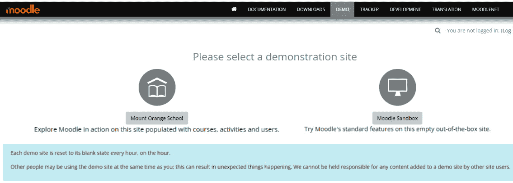
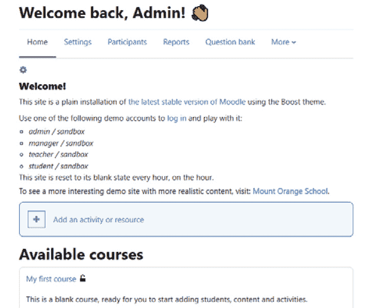
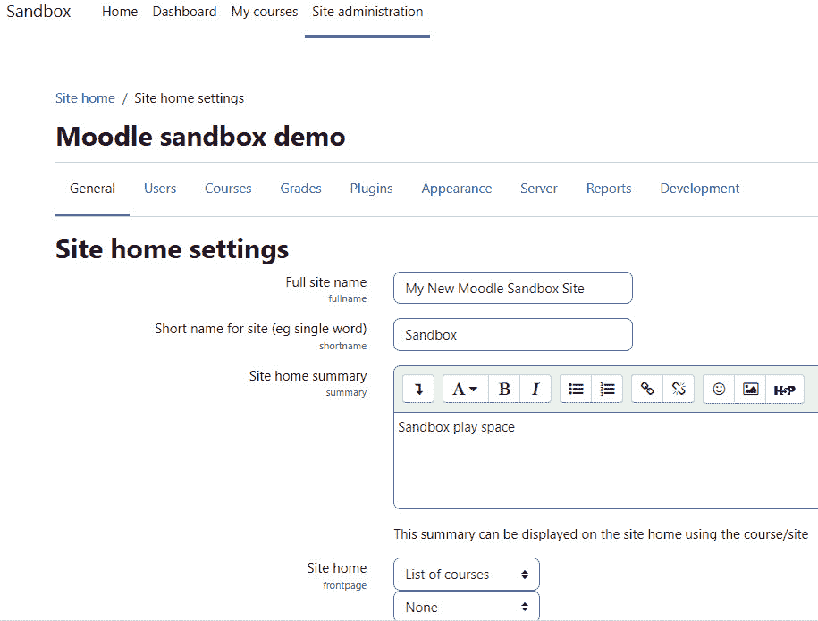

# 第一章：*第一章*：Moodle 导览

在全球大流行、供应链问题以及政治和经济动荡导致学校和工作的中断的情况下，当今世界对有效的在线教育和培训的需求急剧增加。在线项目是否跟得上？他们使用的**学习管理系统（LMS**）是否能够满足可能需要在手机或平板电脑上相对孤立地完成工作的数千名首次电子学习者？在许多情况下，答案是响亮的“不”。在线教育体验因无效而受到抨击，教育工作者和培训提供者公开担心“失败的过渡”会浪费“失去的岁月”。

主要问题是什么？总的来说，对于新接触电子学习且远程工作的学生和教师来说，当学习体验复杂、难以跟随，并且仅以单一格式（如纯文本）提供时，他们往往不会成功。几乎无一例外，当他们感觉不到与任何人联系，而是孤独漂泊，互动稀少甚至没有互动时，他们会失败。

即使是自 2002 年成立以来就强调学习者互动、协作和参与的 Moodle，也遭到了批评者的攻击。尽管 Moodle 发布了频繁的更新，并且在 2022 年初已经升级到 3.11 版本，但这还远远不够。因此，Moodle 经历了一次重大的更新，版本号为 4.0，重点在于用户体验。为了解决迷失方向的问题，Moodle 使导航变得容易。新的设计引人入胜且新颖，通过更新的活动保持学生的参与和进度，并让教师得到信息。Moodle 4.0 拥有全新的用户体验，并具有新功能，例如集成的仪表板，内置日历和进度表，它们以简单、一目了然、可点击的界面拉取所有截止日期和重要日期。对活动和资源进行了许多改进，并且所有这些改进都比以往任何时候都更好地与响应性更强的主题相结合，以便在平板电脑、笔记本电脑、智能手机和台式机上都能同样良好地工作。

Moodle 被设计成易于使用，其在线帮助文档写得很好。它很好地告诉您如何使用其每个功能。Moodle 的帮助文件没有告诉您何时以及为什么使用每个功能，以及它将对学生的体验产生什么影响，这正是本书提供的内容。

因此，我们将开始对 Moodle 进行有指导性的游览。本章的目的是为您提供一个概述，了解 Moodle 作为世界上最受欢迎和广泛使用的学习平台之一，其巨大的灵活性和可定制性。在本章之后，我们将学习如何设计和开发以结果为导向的学习项目，这些项目可用于培训和教育活动，并遵循教学设计原则，适应教育心理学，以最大化学习效果。

Moodle 是一个免费的开源学习管理系统（LMS），它使您能够创建强大、灵活和引人入胜的在线学习体验。我故意使用“在线学习体验”这个短语，而不是“在线课程”。短语“在线课程”通常意味着一系列按顺序排列的网页，一些图片，可能还有一些动画，以及一个在线的测验。教师和学生之间可能会有一些电子邮件或公告板通信。然而，在线学习可以比这更有吸引力，尤其是在我们越来越习惯于将“实时”（也称为“同步”）体验与“按需”（也称为“异步”）内容相结合，尽可能多地复制面对面学习的互动。随着 Moodle 4.0 的推出，用户体验比以往版本更加流畅和直观，您可以使用笔记本电脑、平板电脑、智能手机或台式设备更轻松地进行交互。对于教师和管理员来说，Moodle 4.0 提供了比以往任何时候都多的功能和选项，这为您设计能够让学生满意并证明他们实现了课程目标的学习体验提供了更多机会。

在本章中，我们将涵盖以下主题：

+   Moodle 的历史

+   Moodle 的哲学

+   创建学习网站的计划

+   使用 Moodle 的逐步说明

+   应用模块化哲学

+   Moodle 体验

在本章中，您将了解 Moodle 的功能以及学生和教师在使用 Moodle 时将拥有的用户体验。您还将了解 Moodle 的哲学以及它是如何塑造用户体验的。有了这些信息，您将准备好决定如何最大限度地利用 Moodle 的众多功能并规划您的在线学习网站。首先，我们将了解 Moodle 的历史。

# Moodle 的历史

在我们准备开始这段旅程之前，让我们退一步，了解 Moodle 名字的由来以及它是如何发展的。

Moodle 的名字揭示了其对电子学习的处理方法。官方 Moodle 文档在[`docs.moodle.org`](http://docs.moodle.org)中陈述如下：

Moodle 这个词最初是“模块化面向对象动态学习环境”（Modular Object-Oriented Dynamic Learning Environment）的缩写，这对程序员和教育理论家来说很有用。它也是一个动词，描述了懒散地漫步于某物之中，按你想到的事情去做，这是一种愉快的尝试，往往会导致洞察力和创造力。因此，它既适用于 Moodle 的开发方式，也适用于学生或教师可能采取的在线课程学习或教学方法。任何使用 Moodle 的人都是 Moodler。

术语“在线学习体验”意味着学生和教师将扮演更加积极、投入的角色。它暗示了诸如可以按任意顺序探索的网页、学生和教师之间可以进行实时聊天的课程、用户可以对消息的相关性或洞察力进行评分的论坛、允许学生评估彼此工作的在线研讨会、让教师评估学生对课程进度看法的即兴投票，以及为教师预留的上传和共享文件的目录。所有这些功能都创造了一个充满不同类型的学生间和学生与教师间互动的活跃学习环境。这正是 Moodle 擅长的用户体验，也是本书将帮助你创建的用户体验。

下一个部分将描述**连接主义**，这是 Moodle 的基本学习哲学，并解释人们如何以及为什么相互学习。

# Moodle 的学习哲学

对于有兴趣的人来说，Moodle 的潜在学习哲学是“连接主义”。这意味着人们相互学习，Moodle 的框架结构旨在最大化与其他学生和内容本身的互动性。当 Moodle 首次推出时，其哲学通常涉及论坛，并有一些实时聊天的潜力。然而，随着包括 BigBlueButton 和其他插件在内的网络研讨会功能的加入，同步（实时）和异步互动的可能性得到了扩展。

在你开发将连接主义作为学习哲学的课程时，需要记住的一件事是，你将同时与情感（情感）和认知领域（认知）打交道。这意味着你将激发情感（这对动机有好处）。连接主义还意味着你可以鼓励分享经验，并允许人们建立在前知识和经验的基础上。构建允许学生通过经验和先前学习构建知识框架的课程可以产生一个非常稳固的方法。你的学生将能够用他们的知识做更多的事情，尤其是如果课程与应用知识和技能有关。

在您开发课程时，请记住如何推进学习目标。您将有什么样的学生？他们是在群体中学习还是单独学习？多少互动是有效的？现在，让我们学习如何为您的学习网站制定计划。尽管 Moodle 是为协作互动而设计的，但它是一个非常灵活的平台，您也可以设计适合个人自我引导学习的课程。

# 创建您的学习网站的计划

无论您是网站创建者还是课程创建者，您都可以使用这本书来制定构建您课程和课程大纲的计划。随着您逐章阅读，您将学习如何做出符合您学习网站目标的决定。

这将帮助您创建您为您的教师（如果您是网站创建者）或学生（如果您是教师）所希望的学习体验。您也可以将这本书用作传统的参考手册，但它的主要优势是其逐步的、以项目为导向的方法以及它关于创建互动学习体验的指导。

Moodle 最令人兴奋的新发展之一是，Moodle 现在拥有一个基于云的**虚拟学习环境**（**VLE**），称为**MoodleCloud**。如果您注册的用户（学生、讲师等）少于 50 人，那么您可以使用它两周免费。您仍然可以自定义课程，并且可以构建大量的灵活性和功能性。它没有像您可以使用一些 Moodle 合作伙伴自定义的自托管站点那样多的选项，但它简单、经济实惠且易于使用。MoodleCloud 允许您尝试不同的设计，并从构建一个较小的网站或课程群集开始，这些您打算扩展。它还使个人和组织能够开发新的培训、协作和教育方式，并在需要时进行扩展。此外，MoodleCloud 通过其内置活动 BigBlueButton 提供的网络研讨会或链接到外部网络研讨会提供商（如 Zoom、GoToMeeting、Google Meet、Teams 等）都十分有效。

下一个部分概述了每章包含的内容。

# 使用 Moodle 的逐步说明

当您创建 Moodle 学习网站时，您通常会遵循一系列定义的步骤。这本书的编排是为了支持这个过程。每一章都会向您展示如何充分利用每个步骤。本节中的每个步骤都列有支持该步骤的章节的简要描述。

随着您逐章学习，您的学习站点将在范围和复杂性上不断增长。当您完成这本书时，您应该拥有一个完整、互动的学习站点。随着您对 Moodle 能做什么以及您的课程如何成形了解得更多，您可能想要改变之前章节中的一些做法。Moodle 提供了这种灵活性。这本书还将帮助您确定这些更改将如何影响您的整个站点。

## 第一步 – 了解 Moodle 体验

每个学习管理系统（**LMS**）都有一个范式或模型，它塑造用户体验并鼓励某种类型的用法。一个 LMS 可能通过提供强制给定顺序的每个课程的功能来鼓励非常顺序化的学习。它可能通过提供很少支持学生之间互动的功能来阻止学生之间的互动，同时通过提供许多学生与课程材料互动的机会来鼓励独立学习。

在本章中，您将了解 Moodle 能做什么，以及学生和教师在使用 Moodle 时将有什么样的用户体验。您还将了解 Moodle 的哲学以及它是如何塑造用户体验的。有了这些信息，您将准备好决定如何充分利用 Moodle 的众多功能并规划您的在线学习站点。

## 第二步 – 安装 Moodle 和配置您的站点

*第二章*，*安装 Moodle 和配置您的站点*，更深入地介绍了如何安装 Moodle、与 Moodle 合作伙伴定制解决方案，或使用标准云安装，如 MoodleCloud。本章将帮助您确定适合您需求的正确托管服务。它还将帮助您安装和配置 Moodle，使其以您期望的方式运行。

**功能增强器**：如果您想找到最新的定制您的 Moodle 安装或添加新应用程序的方法，您可以访问 Moodle 文档。以下是 4.0 版 Moodle 文档的链接：[`docs.moodle.org/400/en/Main_page`](https://docs.moodle.org/400/en/Main_page)。

## 第三步 – 为您的学习站点创建框架

在 Moodle 中，每个课程都属于一个类别。*第三章*，*创建类别和课程*，将指导您创建课程类别，然后创建课程。就像您在安装和配置期间选择全局设置一样，您可以在创建每个课程时选择课程级设置。本章将向您说明各种课程设置的含义，以便您可以为每个课程创建您想要的经验。它还将向您展示如何将教师和学生添加到课程中。

## 第四步 – 决定常见设置

在 Moodle 中，课程材料要么是资源，要么是活动。资源是学生查看、收听、阅读或下载的项目。活动是学生与之互动或允许学生与教师或其他学生互动的项目。*第四章* *管理资源、活动和条件访问*，你将了解所有资源共有的设置以及如何将资源和活动添加到课程中。

## 第 5 步 – 添加基本课程材料

在大多数在线课程中，核心材料由学生查看的网页组成。这些页面可以包含文本、图形、电影、声音文件、游戏、练习——任何可以在**万维网**（**WWW**）上出现的内容都可以出现在 Moodle 网页上。*第五章* *向你的 Moodle 课程添加资源*，你将了解如何添加这类材料，以及找到链接到其他网站、媒体文件、标签和文件目录的链接。这一章还将帮助你确定何时使用这些材料类型中的每一种。

## 第 6 步 – 使你的课程互动

在这个背景下，互动意味着学生和教师之间，或者学生和活跃网页之间的互动。学生之间的互动在第*第五章*中介绍，*向你的 Moodle 课程添加资源*。这一章涵盖了涉及学生和活跃网页之间，或学生和教师之间互动的活动。互动课程材料包括指导学生通过定义路径的课程，基于他们对复习问题的回答以及学生上传并由教师评分的作业。*第六章* *添加作业、课程、反馈和选择*，将告诉你如何创建这些互动以及它们如何影响学生和教师体验。

## 第 7 步 – 评估你的学生

在*第七章* *通过测验评估学生*中，你将学习如何通过测验评估学生的知识。这一章详细介绍了创建测验问题、与其他课程共享测验问题、向问题和测验添加反馈等内容。

## 第 8 步 – 使你的课程社交

社会课程材料能够促进学生之间的互动。Moodle 允许你在课程中添加聊天和论坛。这些类型的互动对许多学生来说都很熟悉。*第八章*，*通过聊天和论坛进行社交*，将向你展示如何创建和管理这些社交活动。

## 第 9 步 – 添加协作活动

Moodle 使学生能够共同创建新内容。例如，您可以创建适用于整个网站的词汇表和针对单个课程特定的词汇表。学生可以添加到这些词汇表中。您还可以允许学生在课堂上对维基进行贡献和编辑。

Moodle 还提供了一种强大的研讨会工具，使学生能够查看和评估彼此的工作。

这些互动使课程更加有趣，但也使教师的管理变得更加复杂。结果是，一个鼓励学生贡献、分享和参与的课程。*第九章*，*通过维基和词汇表进行协作*和*第十章*，*举办研讨会*将帮助您应对管理学生协作工作的挑战。

## 第 10 步 – 管理和扩展您的课程

*第十一章*，*组和群体*将向您展示如何使用组来分离课程中的学生。您还将学习如何使用群体，或全站组，来批量注册学生进入课程。

每个模块都为您的网站或课程增加了功能。*第十二章*，*通过添加模块扩展您的课程*，将介绍许多 Moodle 的模块，帮助您决定哪些模块能满足您的目标，并告诉您如何实施它们。您可以使用模块来显示日历、启用评论、启用标签、显示导航功能，等等。

## 第 11 步 – 了解课程脉搏

Moodle 提供了一些工具来帮助教师管理和提供课程。它保存了详细的访问日志，使教师能够确切地看到学生访问了哪些内容，以及何时访问。它还使教师能够建立自定义评分标准，这些标准可以在整个网站上或针对单个课程使用。学生成绩可以在线访问，也可以以各种格式（包括电子表格）下载。最后，教师可以在仅为他们保留的特殊论坛（公告板）中进行协作。这将在*第十三章*，*教师功能：日志、报告和指南*中介绍。

当您构建课程网站时，您将融入 Moodle 哲学，该哲学结合了关于人们如何学习的连接主义思想以及社会建构主义，两者都强调互动性。

# 应用 Moodle 哲学

Moodle 被设计用来支持一种称为 **社会联结主义** 的学习风格。这种学习风格是互动的。社会联结主义哲学强调协作，并认为人们在与其他学习材料互动、为他人构建新材料以及与其他学生就材料进行互动时学习得最好。传统哲学与社会联结主义哲学之间的区别是讲座与讨论之间的区别。

## 添加资源

Moodle 不要求您在课程中使用社会联结主义方法。然而，它最好地支持这种方法。例如，Moodle 使您能够添加几种学生可以与之交互并用于其基础教学材料，然后在协作、评估等中进行交互的资源。Moodle 4.0 中有多种资源。我们将在后面的章节中介绍每种资源的使用和功能。请注意，Moodle 4.0 具有重新设计的图标：

![图 1.1 – Moodle 4.0 中展示的新图标的资源

![img/Figure_1.01_B17288.jpg]

图 1.1 – Moodle 4.0 中展示的新图标的资源

让我们更详细地看看这些图标：

+   **书籍**: 包含章节和子章节的多页资源。

+   **文件**: 可以包含支持文件的数字内容。

+   **文件夹**: 将文件捆绑在一起。

+   **IMS 内容包**: 根据一个协议的标准打包的文件集合，可以在不同的系统中重复使用。

+   **标签**: 插入在其他资源或活动链接之间的信息

+   **页面**: 使用文本编辑器创建的网页资源。

+   **URL**: 一个网页链接

### 活动

Moodle 使您能够添加更多种类的交互式和社会化课程材料。这是学生通过回答问题、输入文本、上传文件等方式与课程材料互动的材料。以下截图显示了 Moodle 4.0 中更新的各种 Moodle 活动，以及它们的新图标。我们将在本书的后面部分更详细地探讨这些内容。这里只需做一个简要介绍：

![图 1.2 – Moodle 4.0 中展示的新图标的活动

![img/Figure_1.02_B17288.jpg]

图 1.2 – Moodle 4.0 中展示的新图标的活动

让我们更详细地看看这些图标：

+   **作业**: 允许您上传文件供教师审阅。

+   **BigBlueButton**: 具有多种功能的网络研讨会。

+   **聊天**: 提供学生之间的实时在线聊天。

+   **选择**: 多选题，以及互动的“你知道吗？”参与元素。

+   **数据库**: 一系列条目/记录的集合。

+   **外部工具**: 使您能够与资源和网站进行交互。

+   **反馈**: 包含多种问题类型的自定义调查。

+   **论坛**: 异步讨论。

+   **术语表**: 学生和/或教师可以向网站范围内的术语表贡献术语。

+   **H5P**: 一个包含从 Moodle 内部启动的交互式内容的 HTML5 包。

+   **课程**: 一个条件分支活动。

+   **测验**：这里提供了多种不同类型的问题，包括多项选择、匹配、简答题和数值题。

+   **SCORM 包**：一组按照协议标准打包的文件，专注于学习对象。

+   **调查**：经过验证的调查工具，可用于多种不同目的。

+   **维基**：这是大多数年轻学生和许多年长学生熟悉的协作工具。

+   **研讨会**：这支持学生上传作业的同行评审和反馈。

此外，一些称为“**块**”的 Moodle 插件附加模块增加了更多类型的交互。例如，一位开发者创建了一个名为“**预约**”的块，为教师提供了一个表格，以便他们可以预订与学生一对一的预约。学生可以被通知，并且可以添加到教师和学生的日历中。请注意，日历也是一个块。现在，让我们学习如何使用 Moodle 塑造学习体验。

# Moodle 体验

由于 Moodle 鼓励互动和探索，学生的学习体验通常是非线性的。Moodle 可以使用称为**条件活动**的功能来对课程施加特定顺序。条件活动可以按顺序排列。您的课程可以包含条件和非线性活动的混合。

在本节中，我将带您游览一个 Moodle 学习网站。您将看到学生从到达网站、进入课程到在课程中学习一些材料的过程。您还将看到一些学生之间的互动以及教师用来管理课程的某些功能。

## 通过演示网站学习和实践

Moodle.org 包含两种类型的演示网站，您可以从头开始创建课程或尝试使用已经部分完成并填充的课程。它们都在 Moodle 4.0 版本中。您可以选择您的角色，以便您可以尝试扮演学生、教师、管理者、管理员等。要进入网站并开始，请访问[`moodle.org/demo`](https://moodle.org/demo)：

图 1.3 – Moodle 演示网站有两个选项：从头开始通过 Moodle 沙盒或通过橙山学校使用部分完成并填充的课程

小贴士

沙盒选项有更多角色，如果您想练习使用插件，通常更容易使用。它位于[`sandbox.moodledemo.net/`](https://sandbox.moodledemo.net/)。您需要以管理员身份登录。

### 演示网站 – 橙山学校

让我们看看网站是如何设置的。注意，屏幕顶部有一个菜单。它提供了包括**首页**、**仪表板**、**我的课程**和**网站管理**在内的几个菜单项。在右侧，您将看到一个标有**主菜单**的菜单项列。这是一个“块”，已被设置以帮助学生快速找到课程路径并前往已设置的地点。这一方面是 Moodle 4.0 中的新功能：

![图 1.4 – 可以定制的 Mount Orange 学校演示]

](img/Figure_1.04_B17288.jpg)

图 1.4 – 可以定制的 Mount Orange 学校演示

以下是对屏幕顶部导航栏的特写：

![图 1.5 – 导航栏的特写]

](img/Figure_1.05_B17288.jpg)

图 1.5 – 导航栏的特写

让我们逐一回顾每个选项：

+   **首页**: 您现在就在这个页面上。要编辑它，请向上到右上角并点击**编辑模式**滑块按钮。一旦您打开它，您会看到到处都会弹出小铅笔图标和齿轮图标，准备让您开始编辑。

+   **仪表板**: 这是一个非常有用的工具，帮助学生组织任务、管理时间，并跟踪他们课程的进度。任何您上传的资源或活动，只要有一个截止日期，就会出现在日历和时间轴上。

+   **我的课程**: 此屏幕列出了您已报名的课程。它与网站**首页**上的课程列表不同，后者将列出网站上的所有课程。

+   **网站管理**: 对于具有管理员权限的人来说，当您点击链接时，将打开一个包含不同配置类别的页面。一旦您打开**网站管理**页面，您将看到一个带有链接列表的水平导航栏。它们包括以下内容：

    +   **常规**: 这包含所有常规设置和实用工具，从分析、能力、徽章到许可证和安全。记住这个列表的重要事情是，所有设置都是通用的，网站范围内的设置。您可以自定义不同的课程，使它们具有独立的设置。

    +   **用户**: 这里您可以管理网站范围内的用户账户、权限、隐私等设置。

    +   **课程**: 这里您可以管理和访问网站上的所有课程和分类，上传新的课程，设置活动选择器设置，以及设置备份。

    +   **成绩**: 在这里，您可以设置网站范围内的成绩、评分标准、成绩类别等设置。您还可以设置网站范围内的评分报告和成绩历史。

    +   **插件**：Moodle 4.0 拥有广泛的插件，它们也是活动和控件。如果您想让您的站点做某事，那么您很可能可以在插件中找到它。请记住，插件可以是全站点的，也可以是特定于课程或课程类别的。要快速查看不同插件的默认设置和可用性，您可以点击**插件概述**。

    +   **外观**：这是您可以设置您的站点外观并融入主题的地方。演示站点中的默认主题是**Boost**和**Classic**。

    +   **服务器**：除非您是管理员，否则您很少有理由去篡改服务器设置。但是，您可能需要查看任务、电子邮件配置和 Web 服务。

    +   **报告**：这个区域包含软件和 Moodle 活动的各种性能报告。

    +   **开发**：这个区域包含为创建新代码或增强和定制 Moodle 安装的开发者提供的链接。有一个模板库，可以轻松开始。Moodle 存储库和 GitHub 上广泛可用的是食谱。

为了好玩，让我们以 Moodle 沙盒演示管理员身份登录，看看我们开始配置站点和课程时它看起来像什么。

### 在沙盒演示站点上以管理员身份登录

您已注册为管理员并已登录。现在，您可以尝试您的第一门课程。一旦登录，您会发现您可以切换角色或保持管理员角色。向下滚动，您会看到一个链接到**我的第一门课程**：

图 1.6 – 选择演示体验的角色

### 使用 moodlecloud.com 进行基于云的托管

Moodle 已创建了一个基于云的 Moodle 版本，允许您设置课程、开发沙盒和启动课程。它位于[`moodlecloud.com/app/en/login`](https://moodlecloud.com/app/en/login)。定价取决于用户和课程数量。MoodleCloud 由 Moodle 托管，始终拥有最新版本并支持多个主题。然而，它并不提供所有不同的主题，并且可能不如拥有专用服务器的解决方案那样强大。我经常使用它，并且喜欢它。唯一的缺点是有时会有时间延迟。

### 主菜单

登录 MoodleCloud 或沙盒站点。务必在右上角开启**编辑模式**。对于沙盒演示站点，请访问 sandbox.moodledemo.net。注意以下截图左边的**Moodle 沙盒演示**。下面，您会看到一个水平菜单项行：

图 1.7 – 设置新的 Moodle 站点

一旦您设置了您的网站，您会看到在顶部行有几个菜单项。在 Moodle 4.0 中，它们已经改变，使您更容易访问 Moodle 中最常用的类别。您将看到**首页**、**设置**、**参与者**、**报告**、**题库**和**更多**：

![Figure_1.08_B17288.jpg]

![Figure_1.08_B17288.jpg]

图 1.8 – 在课程级别设置 Moodle 4.0

让我们更详细地看看这些类别：

+   **首页**：这是您的网站首页，可以配置为描述学校、列出课程等。

+   **设置**：这个类别允许您设置网站的首页名称、摘要和公告，以及添加如日历块和时序块等块。

+   **参与者**：在这里，您可以注册、退课和管理用户。在管理用户时，您可以创建分组、分组、管理权限并分配角色。

+   **报告**：在 Moodle 4.0 中，报告功能得到了扩展。您可以添加能力分解、上传指南和评分标准。此外，您还可以生成用户日志并查看用户活动的实时日志。您甚至可以创建活动报告、跟踪课程参与度、生成统计数据并设置监控事件的规则。

+   **题库**：题库出现在网站主页的菜单中是 Moodle 4.0 的新功能。这样设置是为了让您更容易开发和管理将被用于测验活动的问题。各种类型的测验构成了许多课程的核心，而 Moodle 网站管理员或教师的工作之一就是开发、分类、管理和部署这些问题。我们将在本书的后面部分学习如何编写有效的测验问题，并展示如何与测验和测验问题一起工作。

+   **更多**：这个下拉菜单包含三个与您网站的内容和功能相关的链接。这些链接是：**内容库**、**过滤器**和**课程重用**。

### 修改课程和菜单项

和往常一样，要编辑课程或菜单项，您需要点击页面右上角的**编辑模式**。之后，您可以添加活动、资源、插件等。我们将在本书的整个过程中详细介绍这些内容。现在，让我们看看 Moodle 4.0 如何增强了 Moodle 体验。请注意，**我的课程**仍然列出了您的课程，但现在，它显示了哪些课程正在进行中，以及每个课程完成了多少：

![Figure_1.09_B17288.jpg]

![Figure_1.09_B17288.jpg]

图 1.9 – Moodle 4.0 的“我的课程”页面，显示了每个课程的完成百分比概览

然后，为了进一步提升用户体验、增强时间管理和培养自我效能感，Moodle 4.0 对课程时间线以及课程日历进行了改进，以便它们能够显示学生的截止日期，如果需要的话，还可以与组员结合使用：

![图 1.10 – Moodle 4.0 更新的时间线和日历

![图 1.10 – Moodle 4.0 更新的时间线和日历

图 1.10 – Moodle 4.0 更新的时间线和日历

# 总结

Moodle 鼓励学生和教师之间的探索和互动。Moodle 4.0 的新设计图标、增强的导航和改进的用户体验对协作、互动和反思产生了积极影响，从而打造了一个增强其核心社会建构主义教学法的平台。如果你以这种方式工作，作为课程设计师和教师，你将拥有最多的工具可供使用，这将使你的学习体验尽可能互动。使用论坛、同伴评估工作坊、调查和互动课程来创建课程，比从一系列静态网页创建课程要费劲得多。然而，它也更具吸引力和有效性，你会发现使用 Moodle 的许多互动功能是值得的。Moodle 的设计专注于增强学习，你将享受那些使自学和协作学习有效的功能。

在本章中，我们学习了 Moodle 的历史、发展和其背后的哲学。我们还学习了如何开始设计一个网站，在其中构建课程，然后包括其中的活动和资源。

请记住，如果你使用基于云的 VLE 版本的 Moodle，即 MoodleCloud，你将拥有内置选项，可能无法以你从 Moodle 合作伙伴或自托管安装中定制安装的方式修改课程。

现在，是时候学习 Moodle 架构的基础知识了，并且至少阅读一下在*第二章*中提供的安装和配置信息，*安装 Moodle 和配置您的网站*。不要害怕技术。如果你能掌握教学这门困难的艺术，你就能充分利用 Moodle。
