# 第二章：*第二章*：安装 Moodle 和配置您的站点

在当今云计算的世界里，对于组织来说，选择使用由 Moodle 合作伙伴或[Moodlecloud.com](http://Moodlecloud.com)提供的云基础 Moodle 安装是最有效和经济的。您的学生将从各种不同的设备访问 Moodle，Moodle 4.0 全新的默认主题，基于 Boost，完全响应式，具有新的**站点首页**选项和易于遵循的仪表板。结果是提供了一种帮助您保持组织有序、永远不会错过截止日期、始终知道如何回到您最后访问的页面的用户体验。

在本章中，我们将专注于为您的组织部署 Moodle，重点放在云基础 Moodle 上。我们将通过为您 Moodle 安装选择正确的设置来帮助您创建您想要的用户体验。通过配置您的站点以增强用户体验，您也将增强用户的学习体验。在本章中，您将学习如何配置您的 Moodle 站点。具体来说，您将学习以下内容：

+   配置 Moodle。

+   设置权限并选择默认选项。

+   启用站点管理，配置权限，并注册学生。

本章将涵盖以下主要内容：

+   一个勇敢的新 Zoom 世界 – 规划混合/混合同步和异步交付

+   探索站点管理菜单

+   在云基础 Moodle 中使用的不同语言

+   配置仪表板和**站点首页**页面

完成本章后，您将能够将 Moodle 4.0 部署并运行起来，不仅适用于您的组织，也适用于您个人的“沙盒”使用。为此，我们专注于云基础 Moodle，并回顾您在计划“实时”和“按需”交付以及通过精心规划的互动、协作和评估进行的学习时需要考虑的因素。

# 主题和外观

注意，在这本书中，我将使用新的 Moodle 4.0 主题，以及 MoodleCloud *经典*主题。Moodle 4.0 继续增强用户体验，包括设置 Moodle。以下是一个使用 Moodle 4.0 Boost 主题的截图，显示了新的 4.0 仪表板，顶部是时间线，底部是“一目了然”的日历，右侧是**最近访问的项目**：

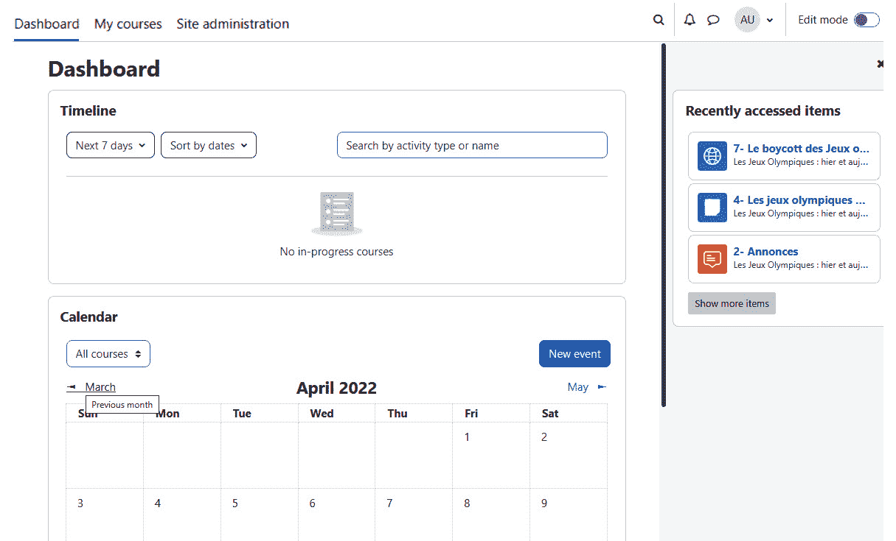

图 2.1 – 基于 4.0 Boost 主题的 Moodle

Moodle 提供了非常方便的标准，这使得您能够轻松创建具有吸引力的统一课程。它们可以用于在当今环境中变得流行的所有类型的交付模式，机构通常需要提供同步、异步和“混合”交付模式的课程。

# 本地托管安装

我们建议大多数用户使用基于云的 Moodle 安装，因为我们假设您的主要关注点是开发和管理在线课程，您的学生、教师和管理员能够有效地开发和使用这些课程，即使在您几乎没有准备时间的情况下。

尽管如此，可能存在需要本地安装 Moodle 的情况，因为您可能希望节省每月的托管费用、开发定制解决方案或使用安装进行实验。

在某些情况下，您可能希望在独立机器上安装 Moodle。如果是这种情况，建议您访问 Windows 和 macOS 的“一键”安装程序。请注意，它们不适用于生产服务器。

您可能希望使用的完整安装包可以在 Moodle.org 的 Windows 下载页面找到：[`download.moodle.org/windows/`](https://download.moodle.org/windows/)。每个包都是为独立计算机设计的，并使用 XAMPP Apache Friends 包([`download.moodle.org/windows/`](https://download.moodle.org/windows/))和 OS X 包。您可以下载 Moodle 4.1 的最新开发版本，以及 Moodle 4.0 的稳定版本。您还可以下载 Moodle 3.11.6+。在本书中，我们使用的是 Moodle 4.0 的稳定版本。

Moodle 不断扩展其选项，Moodle 4.0 专注于为您提供选择。您可以选择本地安装版本，这是一个标准版本。然后，您可以通过选择 1,982（截至本书撰写时）个插件来扩展它。最后，Moodle 现在有一个可下载的应用。我们将在下一节中向您展示如何找到每个选项。

# 安装标准 Moodle，通过插件增强它，并添加 Moodle 应用

本书不涉及如何在自己的服务器上安装和运行 Moodle 的详细说明。然而，本节将向您展示如何获取具体说明，并指出有其他选项。您可以在[`download.moodle.org/`](https://download.moodle.org/)的 Moodle 下载页面上找到所有这些选项。标准 Moodle 是 Moodle 的基础版本。要能够添加功能，如日历，您需要通过插件来增强它。

## 标准 Moodle

我们将从标准 Moodle 开始。要开始，您需要一个像 Apache 这样的网络服务器以及像 MySQL、MariaDB 或 PostgreSQL 这样的数据库。您还需要配置 PHP，因为 Moodle 需要许多 PHP 扩展。

对于具体的安装说明，请访问 Moodle 下载页面 [`download.moodle.org/`](https://download.moodle.org/)。

在撰写本书时，最新的版本是 Moodle 4.0.1。以下截图显示了下载软件包或通过 Git 下载 Moodle 的链接。请注意，版本每周都会更新：

![Figure 2.2 – Moodle 的下载页面

![img/Figure_2.02_B17288.jpg]

Figure 2.2 – Moodle 的下载页面

如前一个截图所示，此页面包括安装包链接和有关最新版本的信息。

在成功安装 Moodle 的最新标准版本后，您可能希望使用插件来增强它。您可以单独为课程或课程组添加插件，并且您可以将插件系统化在您自己服务器上托管 Moodle 的版本中。您可以在此处搜索插件的位置：[`moodle.org/plugins/`](https://moodle.org/plugins/)。插件包括活动、主题和块。以下截图显示了重新设计的插件下载界面，以及您可以按目的、受欢迎程度、下载次数等进行搜索的事实：

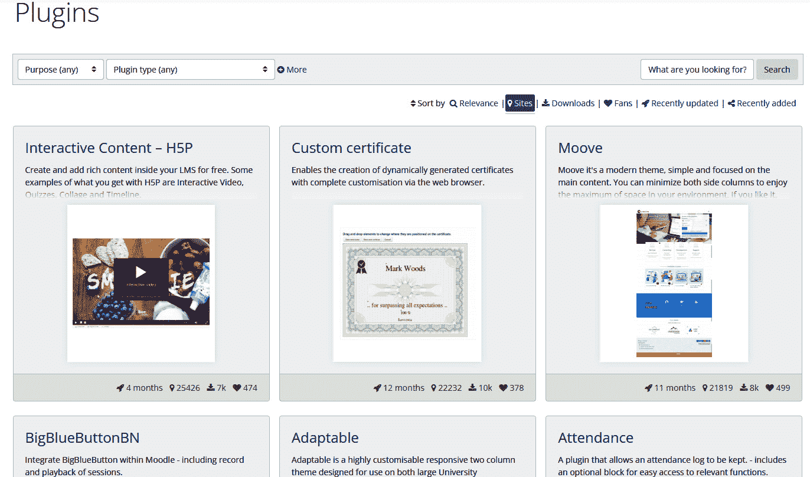

图 2.3 – Moodle 的可搜索页面，用于在您的服务器上下载插件

## Moodle 移动应用

Moodle 移动应用使在 Android 设备上使用 Moodle 比始终从互联网访问要容易得多。

具体来说，Moodle 应用具有以下功能：

+   即使离线也能浏览课程内容。

+   在您的课程中寻找并与其他人建立联系。

+   接收消息、提交和评分通知。

+   从您的移动设备提交作业（包括上传文件）。

+   跟踪课程完成进度。

+   即使离线也能完成活动。

该应用适用于 Android 系统，可以从 Google Play 商店下载，或者您也可以下载**Android Package Kit**。应用程序文档和下载链接在此：[`download.moodle.org/mobile/`](https://download.moodle.org/mobile/).

网站管理员需要在本地安装或 MoodleCloud 中启用移动服务。

现在我们已经学习了如何安装 Moodle，并回顾了如何使用插件增强 Moodle 的功能，我们将探讨在当今在线、混合、混合、同步和异步交付的世界中使用它的最佳方式。

# 勇敢的新 Zoom 世界 – 规划在线、混合和混合同步及异步交付

在 2020 年，全球大流行迫使教育机构提供在线课程时，许多机构选择了同步解决方案，其中大部分教学是通过网络会议应用程序进行的。然后，学习管理系统（如 Moodle）被用作数字文档、评估和成绩册的存储库。以前在面对面环境中专门学习的学生在现在必须熟悉在线教室和学习管理系统的未知领域。虽然能够通过 BigBlueButton、Microsoft Teams 或 Zoom 等网络会议软件在线查看讲师或同学是一个积极的事情，但仅仅网络会议是不够的。最佳设计是将同步与异步、协作、互动和动手指导实验结合到学习管理系统中。

同时，同步在线教学的巨大转变使得基于网络会议的同步教学和协作学习（在分组讨论室中的讨论和团队项目）与异步体验相比，差异更加明显。没有“实时”讲师的参与，学习体验会有所不同，学生无法实时看到彼此。从积极的一面来看，异步教学更加灵活，因为它可以自主安排进度，并且可以按需获取材料。使用 Moodle，您可以提供同步、异步和混合解决方案。有关更深入的理论背景和研究发现，请参阅*质量标准*（[`www.qualitymatters.org/`](https://www.qualitymatters.org/)）或英国*教育研究所*（[`eppi.ioe.ac.uk/cms/Default.aspx?tabid=3847`](https://eppi.ioe.ac.uk/cms/Default.aspx?tabid=3847)）的评分标准和研究结果。

当您考虑用户体验时，请花点时间思考它如何影响学生的学习能力。您希望将学习目标和成果放在学习者的心中，即使您在设置网站和思考学生应该看到什么时也是如此。然后，您希望确保他们知道接下来应该做什么以及这与课程有何关联。指导您决策的是您希望学生达成的目标。具体来说，这意味着您正在提前考虑如何将学习目标明确地映射到课程内容、活动和评估中。使用故事板可以增强学习目标的映射。整体视图应该是有意义的，您的学习者应该对活动或内容如何导致执行任务和展示技能或掌握能力有一个概念。

以下截图显示了**活动**菜单，并为您提供了在同步和异步交付中可以执行的活动范围和多样性的想法：

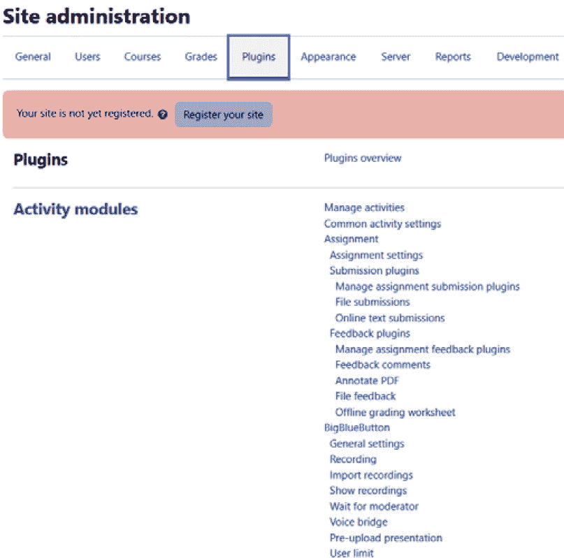

图 2.4 – 活动模块页面

这些活动模块与同步和异步课程设计相对应。同步（例如，使用 BigBlueButtonBN 的网络会议）和异步（例如，论坛）的结合可以非常有效。

维持对用户体验的关注的一个简单方法是使用 **CORN** 这个助记符：

+   **C** – **清晰**：您的成果应该是清晰的，课程的学习过程也应该如此。想想地图是如何引导你到达最终目的地的。一张清晰的地图包含恰到好处的大量信息，不是多余的，并在需要时提供帮助。

+   **O** – **以成果为导向**：确保您始终与学习成果保持联系，这些成果在开始时已经明确陈述。然后，确保每个单元或模块也包含目标。还确保以提供足够支架的方式组织您的课程，以便顺序合理。

+   **R** – **相关性**：虽然包含与课程不完全相关的参考块、材料或活动作为*补充*可能很有趣，但请记住，这可能会让学生困惑或偏离方向。材料应直接与学习成果相关联，并帮助学生成功完成评估。同样，评估也必须是相关和有意义的。如果你的课程包含同步元素，确保你的讨论保持正轨，不要被相关话题分散注意力。

+   **N** – **基于需求**：为学生提供完成任务所需的工具。确保这些工具易于访问，并通过增强学习体验来提高学生的信心。同时，确保认可他们的学习偏好，并专注于满足他们的需求。用户满意度的首要决定因素是学生感到自己掌握命运的程度，这需要他们培养高度的自我效能感和“我能做到！”的态度。此外，为了激励学生，你需要满足他们的需求。他们可能需要一种认可感，因此，在配置网站时，将奖励和认可纳入其中将是其中的一部分。

在本章中，我们专注于设置。稍后，我们将更深入地探讨如何设计和安排内容、活动和评估。

在所有这些设置中，您都有选择权。您在设置中做出的许多选择都将很容易决定。例如，您是否允许用户选择自己的时区？其他选择可能不那么明显。您可能会花费大量时间尝试不同的设置，以了解它们如何影响用户体验。这些是我们将在本章中关注的设置。目标是通过向您展示关键设置对网站的影响来节省您的时间。

小贴士

如果你的系统管理员或网站管理员已经为你安装了 Moodle，你可能想只是接受默认配置并跳过这一章。不要这样做！

即使你没有安装 Moodle 或者使用的是像 MoodleCloud 这样的基于云的提供商而不是自托管安装，我们也鼓励你阅读本章中的配置部分。如果你想的话，可以与你的系统管理员合作选择你想要的设置。你的管理员可以为你创建一个网站管理员账户，你可以用它来配置 Moodle，或者他们可以为你选择这些配置设置。

在下一节中，我们将描述如果你使用的是像 MoodleCloud 这样的基于云的解决方案，如何设置 Moodle。

# 使用 MoodleCloud

本章从自托管解决方案开始。然而，如果你使用的是 Moodle 的云解决方案 MoodleCloud，那会怎样呢？好消息是 MoodleCloud 非常可定制，你将在网站管理区域拥有很大的灵活性。有众多的 Moodle 托管提供商和合作伙伴。然而，MoodleCloud 是唯一由 Moodle 开发和运营的。尽管如此，还有许多 Moodle 合作伙伴，他们提供了一系列定制化的解决方案，通常是为了满足特定的需求。Moodle 合作伙伴是 Moodle 认可的组织，它们为学校、机构和其他可以从 Moodle 独特的学习管理系统受益的组织提供服务。

在撰写本文时，有超过 100 家 Moodle 合作伙伴提供作为 Moodle 专家的服务，并可以帮助你配置你的网站。在许多情况下，Moodle 合作伙伴还提供带有定制的托管服务。要获取最新的列表，请访问 Moodle 认证 Moodle 合作伙伴列表：[`moodle.com/solutions/certified-service-providers`](https://moodle.com/solutions/certified-service-providers)。

MoodleCloud ([`moodlecloud.com/app/en/login`](https://moodlecloud.com/app/en/login))非常经济，是教师、课程设计师和教学技术专家开发模板、尝试新设计以及试点全新的课程或方法的完美平台。Moodle 的价格根据用户数量而变化。

MoodleCloud 是基于云的，正如其名称所示，因此你不需要在你的电脑或服务器上安装任何东西。你需要使用最新版本的浏览器（Chrome、Microsoft Edge、Firefox 或 Safari）。请确保你的网站启用了 cookies。MoodleCloud 被设计得非常高效，并且它也是响应式的，这意味着它被设计成可以在所有设备上看起来很好，从笔记本电脑到平板电脑和智能手机。

MoodleCloud 的一个优点是，你总是拥有最新的 Moodle 版本，当新功能出现时，你将能够使用它们。例如，你现在可以配置你的课程与智能手机、平板电脑、笔记本电脑和计算机兼容，以实现真正的移动解决方案。

MoodleCloud 的一个潜在缺点是，由于内置主题数量有限，你拥有的设计选项数量并不相同，这与本地解决方案形成对比。此外，MoodleCloud 也不再是最便宜的版本，也不是免费的。想了解更多信息，请访问 MoodleCloud：[`moodlecloud.com/app/en/login`](https://moodlecloud.com/app/en/login)。

尽管有一些限制，但 MoodleCloud 包括对所有设计师都有价值的特性，你可以添加各种多媒体资源和活动，包括评估和自动徽章和证书生成。在下一节中，我们将学习如何在网站管理菜单中设置基本配置。

# 探索网站管理菜单

安装 Moodle 后，设置一些基本配置选项是个好主意。其中一些设置决定了网站的功能，例如用户如何进行身份验证、网站保留哪些统计数据以及哪些模块被开启或关闭。其他设置仅影响用户体验，例如可用的语言、配色方案以及首页和仪表板上的显示内容。所有这些设置都可通过**网站管理**菜单访问。MoodleCloud 的**网站管理**菜单类似，但它还包括一个用于移动应用的设置，以便用户可以轻松使用他们的手机或平板电脑。如果你的本地安装不包括**移动应用**菜单，请确保你选择一个响应式主题，这意味着它将自动在所有设备上工作。

Moodle 演示的默认主题是 Boost，而对于 MoodleCloud，则是 Classic。在这个例子中，我们将使用 4.0 版本。

要访问**网站管理**菜单，你必须以管理员身份登录。在**管理**菜单下，点击**网站管理**以展开菜单：

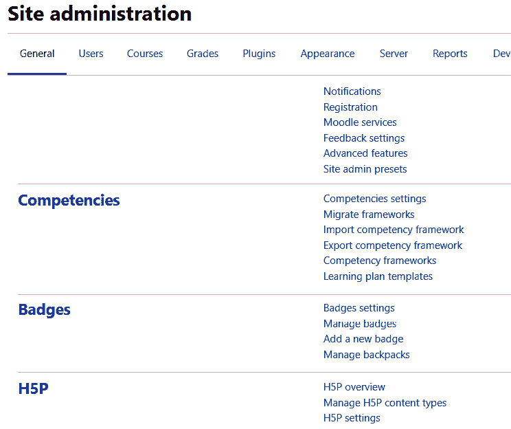

图 2.5 – 网站管理菜单

在本章中，我们将介绍配置网站时在**网站管理**菜单下的某些设置。其他设置将在我们构建课程、教学、计算成绩和更新网站时进行介绍。

提示

这里的重要思想是，与许多其他应用不同，在 Moodle 中，**网站管理**菜单并不是你可以设置后置之不理的东西。随着网站的发展，你需要返回配置设置。

现在，让我们查看用于配置您希望创建的用户体验的网站设置的选项。

## 配置身份验证方法

身份验证是用户登录您网站时发生的事情。当创建用户时，必须为该用户选择一个身份验证方法。这可以在以后更改。

Moodle 提供了多种用户身份验证方式。以下应启用：

+   **MoodleCloud**：在使用时启用 MoodleCloud 的身份验证

+   **基于电子邮件的自助注册**：允许用户通过登录页面上的**创建新账户**按钮创建自己的账户

您可以在**管理** | **网站管理** | **插件** | **身份验证** | **管理身份验证**下找到这些选项。您可以通过点击特定选项的**设置**来找到每个选项的简要说明：

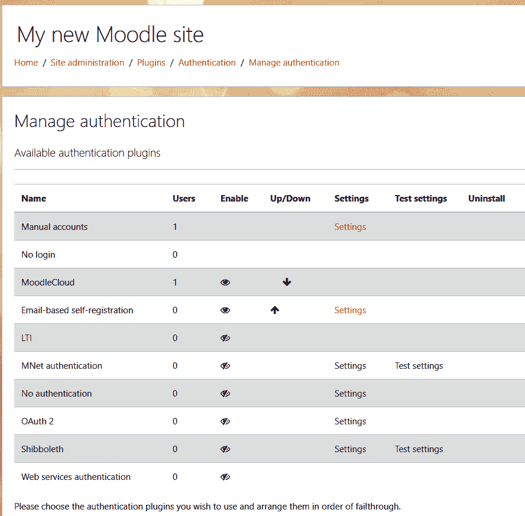

图 2.6 – 管理身份验证菜单

在下一节中，我们将讨论如何创建新用户。

### 手动创建新用户

要创建新用户，请按照以下步骤操作：

1.  使用您的管理员账户登录。

1.  转到左侧面板并点击**网站管理**。

1.  点击**用户**选项卡。

1.  点击**添加新用户**。

1.  添加用户详细信息。

1.  点击**创建用户**。

以下截图显示了添加用户的对话框，管理员需要分配用户名、密码、身份验证方法、应显示的用户信息以及 MoodleNet 个人资料：

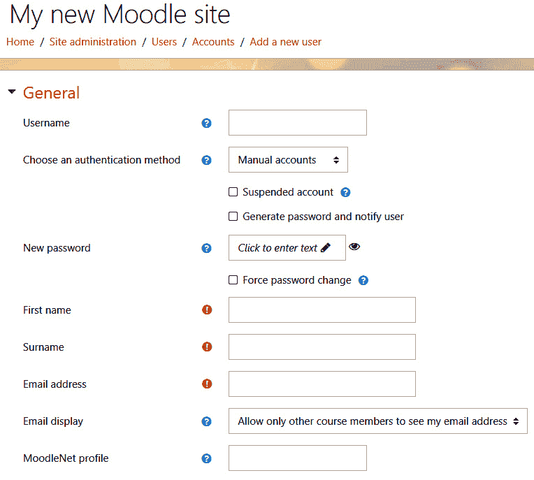

图 2.7 – 添加用户的对话框

### 暂停用户账户

如果用户未支付学费，您可能需要暂停其账户。此程序的结果是用户的身份验证方法更改为“无登录”：

1.  在页面左侧的**管理**菜单中，点击**网站管理** | **用户** | **账户** | **浏览用户列表**。将显示**用户**页面。在此页面上，搜索用户。

1.  在**新过滤器**区域中，输入用户的全名或部分名称。

1.  点击**添加过滤器**按钮。用户将出现在页面底部的列表中。

1.  在用户名旁边，您将看到一个“眼睛”图标。将鼠标悬停在其上以激活“暂停用户”命令，然后点击它。激活后，眼睛图标上会出现一条线，表示它不可见。一旦眼睛上有一条线，用户的账户就已经被暂停。

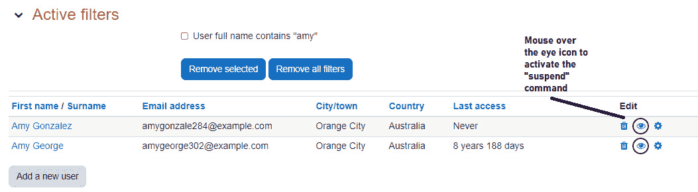

图 2.8 – 用户和账户

### 用户角色

存在多个用户角色。Moodle 允许您启用并配置它们。

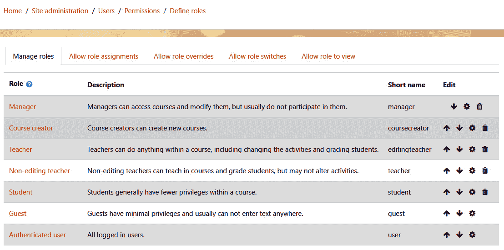

图 2.9 – 用户角色配置

Moodle 在添加新用户方面相当灵活。您可以给用户一个与机构唯一 ID 相对应的用户名，例如用户的电子邮件地址，您还可以设置身份验证方法、密码和独特的个人资料。设置用户名协议以及在整个机构的所有课程和项目中统一设置身份验证方法是个好主意。

这里是 Moodle 中的标准角色：

+   **站点管理员**: 有权在站点上做任何事情。

+   **管理员**: 是管理员但权限较少。

+   **课程创建者**: 可以创建课程。

+   **教师**: 可以管理和向课程添加内容。

+   **非编辑教师**: 可以评分学生作业并发布。

+   **学生**: 可以访问和参与课程。

+   **访客**: 可以观察课程但不能参与。

+   **认证用户**: 所有已登录用户都有此角色。

您的 Moodle 站点有一个名为**访客**的特殊用户类别。这是一个实用的名称，因为它允许人们出于多种不同目的进入您的课程。此用户可以授予访问课程的权利，而无需他们注册。本质上，您是在允许匿名用户访问您的站点和/或课程。

在下面的屏幕截图里，"**访客**"按钮表示已为该站点启用了访客访问。如果您禁用访客访问，则此按钮不会显示：

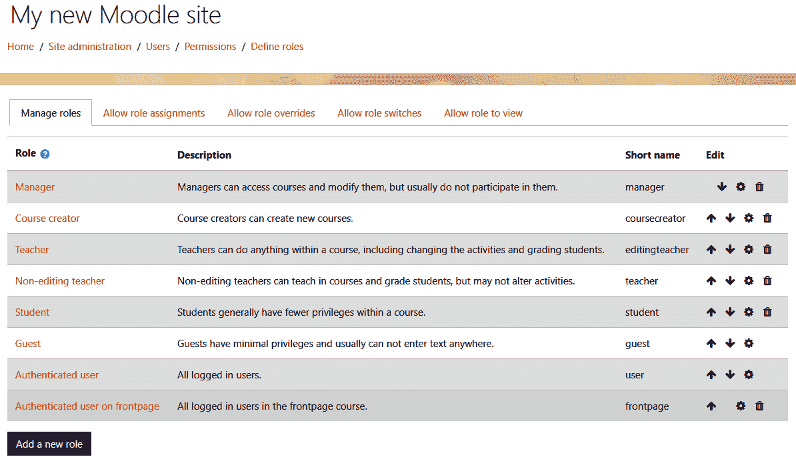

图 2.10 – 在权限屏幕上，启用访客登录

这是哪个访客？

您的访客访客是谁？虽然您无法通过名字识别访客，但您通常会知道访客是谁，因为您会为特殊短期目的提供访问权限。避免有太多访客是个好主意。访客位置应保留用于特殊目的。请记住，在显示访客活动的日志中，您正在查看使用访客账户的每位访客执行的活动。

访客访问的**权限**页面允许您设置角色：

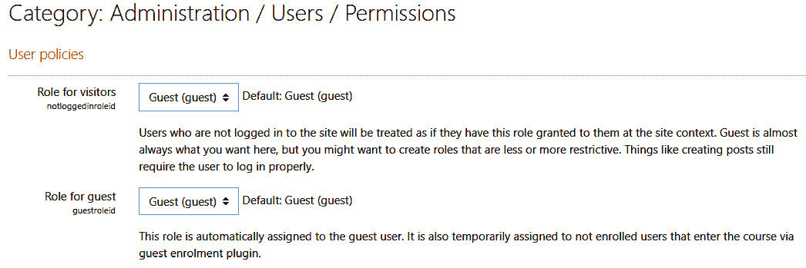

图 2.11 – 设置访客访问权限

现在您已添加用户，他们可以注册课程。

### 注册方法

在 Moodle 中，注册被称为“注册”。这是一种指明用户角色的方式，以便他们可以在课程的不同级别参与。此过程通过插件完成，有几种选项。要访问所有这些选项，请转到**站点管理** | **插件 | 注册**。

**手动注册**应在全站启用，以便学生可以手动添加。要配置首选项，请转到**站点管理 | 插件 | 注册 | 手动注册**

**访客访问**对于需要访问但未实际注册为用户的课程观察者可能很有用。要配置**访客****访问**，请转到**网站管理 | 插件 | 报名 | 访客访问**。

**班级同步**如果您正在使用班级，则很有用。您可以在**网站管理 | 插件 | 报名 | 班级同步**处访问此功能。

**自我报名**如果希望用户能够自行报名，请转到**网站管理 | 插件 | 报名 | 自我报名**。

**管理报名插件**允许管理员启用上述描述的所有插件以及许多其他插件。深入了解报名插件（称为“报名插件”）的内容超出了本书的范围，但了解**支付报名**和**PayPal**是可选的选项是有用的。一旦启用（通过点击眼睛图标），可以通过点击**设置**来更改设置。您可以通过导航到**网站管理 | 插件 | 报名 | 管理报名插件**来完成此操作。

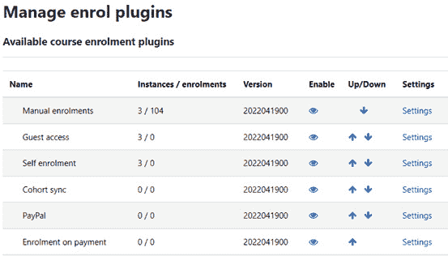

图 2.12- 通过“管理报名插件”可见的已启用报名方法列表

### 自我报名

这允许用户自行报名课程。与访客访问一样，您必须在**网站管理**下为您的整个网站启用此方法，并针对特定课程激活它。

在**自我报名**的**设置**页面，您可以选择要求报名密钥：

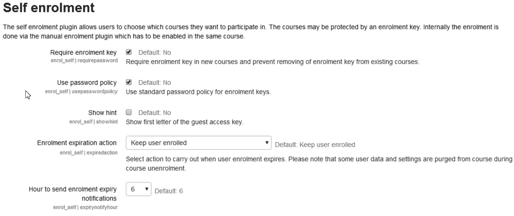

图 2.13 – 具有为新用户自定义功能的自我报名屏幕

对于自我报名选项，从**插件**开始，然后打开**网站管理** - **插件** -> **报名** – **自我报名**。

**报名密钥**是用户在报名课程时必须输入的代码。您可以通过向下滚动并找到菜单上标记为**报名实例默认值**的部分来管理报名密钥。一旦用户报名，报名密钥就不再需要了。现在我们已经报名了学生，我们可以继续学习其他关键设置，这些设置将影响网站的功能。在下一节中，我们将学习如何配置首页和默认仪表板。

小贴士

报名密钥确保只有您给予密钥的人才能进入您的课程。您可能希望添加双因素认证以避免密钥被传递给他人。

# 配置首页和默认仪表板

在 Moodle 4.0 中，仪表板已被更新和简化，使其更容易配置和使用，这使得在 Moodle 中工作更加轻松和愉快。**默认仪表板**页面包含一个时间线，它由已分配截止日期的活动组成，因此可以显示在日历上。请注意，默认情况下，只有未来 7 天内发生的活动会显示出来。还有按日期排序以及按活动类型或名称搜索的选项。日历允许您一次查看所有课程，或者一次查看一个课程，以便能够规划和保持对作业和其他活动的更新。

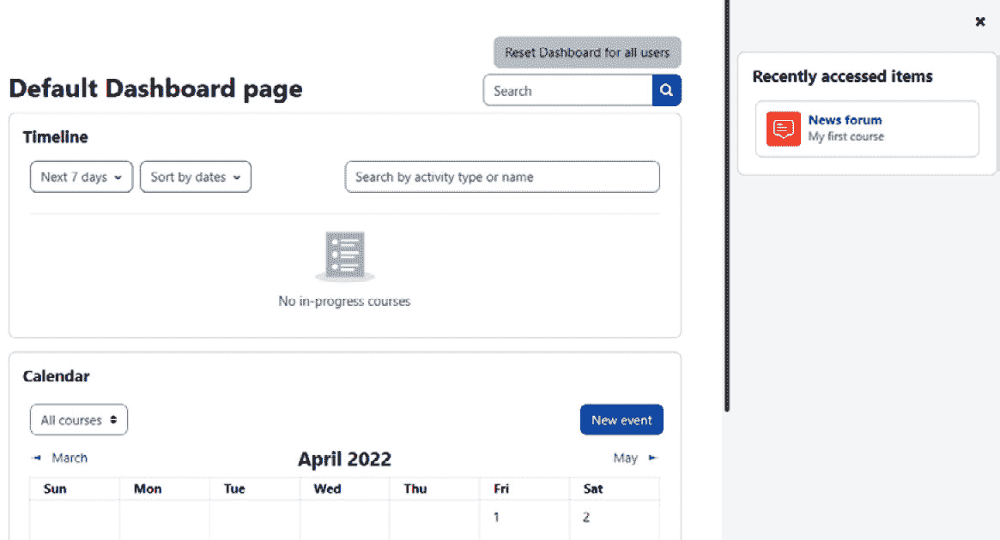

图 2.14 – 自定义默认仪表板页面

Moodle 4.0 的一个新功能是右侧列中的**最近访问项**功能。该功能的目的是为您提供一个“面包屑路径”，以便快速有效地返回到最近访问的项目，而无需返回主菜单并逐个屏幕点击。这个功能是 Moodle 4.0 用户体验改进中最有用的一项，因为它提高了导航性。

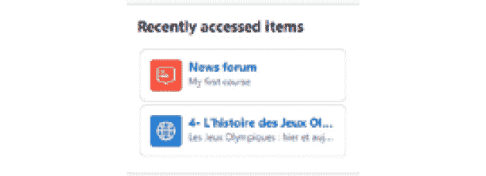

图 2.15 – 默认仪表板页面上的最近访问项

请记住，除非您已将默认起始页面设置为**网站主页**页面，否则学生可能看不到您的网站首页。如果您将网站主页设置为起始页面，您可以使用**网站主页**下拉菜单，这些菜单允许您修改首页上显示的内容。

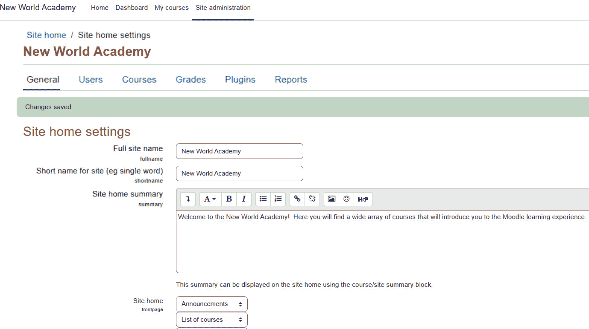

图 2.16 – 自定义网站主页（首页）的配置

在构建您网站的过程早期，您可以就网站主页的外观和功能做出一些决定。本节讨论了在您首次构建网站时应该选择的设置。然而，在网站主页上的一些配置设置在您创建了一些课程并了解了 Moodle 的工作方式之前可能没有意义。

## 首页设置页面

在 Moodle 4.0 中，首页现在被称为网站主页。因此，您网站首页的设置可以在**网站管理** | **网站主页** | **网站主页设置**下找到。

#### 完整的网站名称

完整的网站名称出现在网站主页顶部、浏览器的标题栏中，以及使用选项卡浏览时的页面标签上。

您可以创建一个网站摘要。在**网站首页摘要**框中输入您的摘要，它将显示在您的网站首页（首页）。在 MoodleCloud 上，您将看不到这个。您需要手动设置您的首页。说明可以在以下位置找到：[`docs.moodle.org/400/en/Change_your_front_page`](https://docs.moodle.org/400/en/Change_your_front_page)。您可能还希望在这里包含您机构的使命宣言：

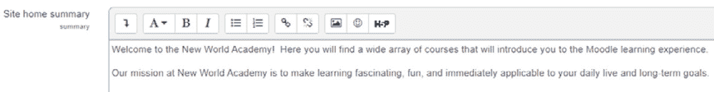

图 2.17 – 添加将显示给用户的网站摘要

此摘要显示在您网站首页的左侧或右侧列。在您编写课程描述和关键词时，考虑您希望如何连接到特定的社交媒体网站。这将帮助您确定要包含的术语和链接。

# 摘要

Moodle 4.0 通过添加新的导航选项并在仪表板侧边放置活动历史记录，使学生们、教师和行政人员更容易导航平台。想要在自己的服务器上安装标准版本的个人和组织仍然可以这样做，并且他们可以通过插件增强全球功能。我们还讨论了 Moodle Mobile，这是一个为 Android 用户设计的应用程序，使他们即使在离线状态下也能访问和使用 Moodle。在本章中，我们学习了如何开始使用 Moodle，从配置开始，然后选择用户可用的角色。我们讨论了仪表板的新功能，以及 Moodle 4.0 如何增强用户体验。我们涵盖了从经验来看，您最有可能更改的设置。许多这些设置会影响整个站点的行为。您不需要一开始就做出完美的选择，因为您可以随时返回这些设置并随意编辑它们。在您继续构建网站的过程中，您可能会想要尝试其中的一些。您会发现 Moodle 4.0 比以往任何时候都更加可定制。

在下一章中，我们将为我们的 Moodle 网站创建课程和类别。

一个勇敢的新 Zoom 世界 – 规划在线、混合和同步异步的交付
