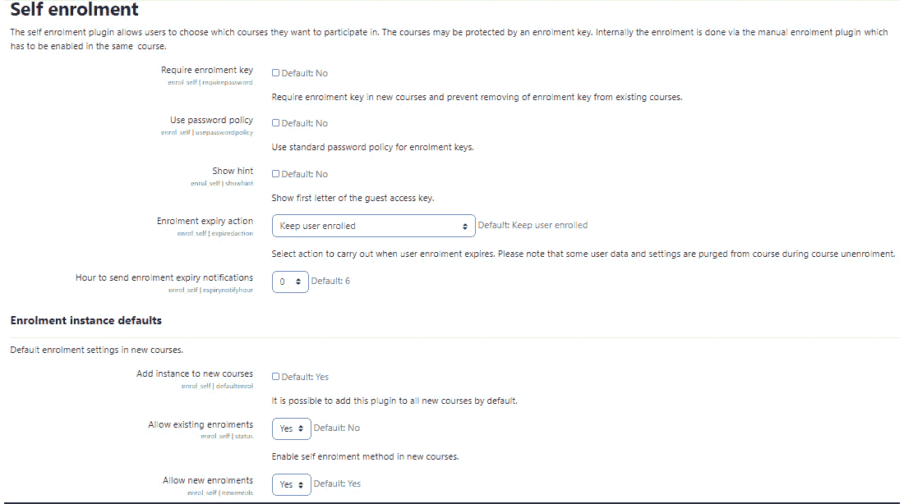

# *第三章*：创建类别和课程

本章向您展示如何创建一个新的空白课程。在本章中，您将了解如何创建课程，根据您的课程目标选择最佳的课程格式，并将学生注册到课程中。此外，我们将确保课程设计良好，并让您持续了解学习将如何进行。

Moodle 4.0 提供了主要的**用户体验**（**UX**）改进，从您开始创建课程的那一刻起就显而易见。首先，有导航改进，让您可以一目了然地看到您的课程，导航回您最后访问的地方，并在改进的仪表板上一次性查看所有课程，该仪表板合并了所有课程的日历和时间线。您还将学习如何创建课程类别，并使用这些类别来组织您的课程目录。遵循当前的教学方法，这些方法通常涉及 Zoom、Teams、BigBlueButton 和其他网络会议软件，您还可以明确指出哪些课程是完全在线的，或者哪些课程是混合交付的，包含同步和异步元素。它们应与您机构的使命和愿景保持一致，以确保您保持一致的存在。您还将能够使用这些结果来营销和推广您的项目和您的机构。

本章将涵盖以下主要主题：

+   基于您机构的使命和愿景进行规划

+   认证考虑事项

+   创建课程

+   注册教师和学生

在本章结束时，您将能够设置空白课程，然后将它们分组到 Moodle 4.0 中您的新课程类别中。

# 基于您机构的使命和愿景进行规划

许多学习机构提供类似的课程，但他们的学生反馈的经验和结果却截然不同。如果内容相同，这怎么可能呢？现实是，您课程的内容只是学习方程式的一部分，因为它全部关乎学习，而不是教学。一个很大的部分与内容是如何被框架化、情境化以及随后应用的有关。每一部分都与您机构的主要使命和愿景紧密相连。

当您的组织决定它想在世界上成为什么样子以及它想如何产生影响时，它必须制定其核心使命——也就是说，这是对“我们将如何做到”这一总体问题“我们的理想世界是什么样的”的回答。如果您认为这听起来有点乌托邦，您是对的。它确实是。最好的学习机构希望创造一个更美好的世界，即使这个乌托邦在现实世界中永远不会真正存在，为了达到这个目标，他们需要确定行动步骤，这些步骤转化为通过战略和战术实施的使命，具体实施如下：

+   **框架**：将框架视为支撑你的使命和愿景的支柱。定义它们。然后，随着你的实践，它们将帮助你创建组织提供的结构和类别。

+   **情境**：你将谁识别为主要的学生群体？你的主要目标是什么？你的学习者是谁？他们在哪里？他们的主要优势、能力和文化背景是什么？如果你想拥有一个有效的学习组织，你需要定义你的受众以及你的教师。你还需要对你的学习者、学习环境和限制/促进技术有一个概念，以便对课程进行排序，并确保它们处于正确的水平，并以正确的顺序呈现。

+   **应用**：积极参与的学生是那些积极与内容互动的人。他们是那些专注于能够做更多的事情，而不仅仅是记忆事实、回答问题，然后忘记一切的人。应用涉及调用经验学习和与真实世界的情况和问题相联系。因此，当你创建课程并对它们进行分类时，务必考虑你的学习者如何能够在整个课程中组合学习模块，并为自己准备完全自主的能力。

你可能认为框架、情境和应用现在考虑得太多。毕竟，你不是只是在整理课程列表吗？是的，也不是。如果你不知道它的最终目的、水平以及你希望你的学生如何使用这些知识，列表就无法正确分类。这在你开始考虑如何建立知识并让学生发展具有实际世界影响的知识时尤其如此。

此外，你整理课程列表的方式将帮助你为组织的认证审查做准备。正如你将在下一节中看到的那样，你在 Moodle 上建立的存在方式将对你在认证和认证审查中的看法产生重大影响。

# 认证考虑因素 – 组织和对齐

为了保持认证，学院和大学必须定期进行审查。随着在线课程的激增，明确规划整体课程和课程目标比以往任何时候都更重要，并确保课程与机构的使命和愿景、长期目标和目标保持一致。此外，由于需要灵活同步和异步课程交付，重要的是要证明你包括了教师培训。大多数提供在线教学的认证组织要求教师至少完成一门相关课程的培训，并成功完成。他们还可以参加涵盖教学设计和学生动机基础知识的课程。

证明您的课程和课程体系是有计划设计的，并且遵循一个使命的最好策略之一是创建分类和子分类，然后它们将出现在您的 Moodle 网站上。如果您使用允许学生在掌握概念或技能后提升到更高学习水平的个性化学习，这是绘制能力框架的时候了。基本上，每个学习目标都与一个评估相对应，当评估以及格分数完成时，该能力就得到了满足，学生可以继续到下一部分。

每个 Moodle 课程都必须至少分配给一个课程分类。这些分类应与您机构的课程目录相对应，这是您为自我审查学习准备的文件，然后是您提交给认证团队的文件。这是一个很好的例子，说明了 Moodle 的组织如何帮助您在显示课程的各个地方实现一致性，从课程目录到战略规划文件。Moodle 可以作为您的基石。

## 选择最适合您首页或仪表板的选项

当您决定使用哪个选项作为您的首页时，尽量将自己置于学生的位置：

![图 3.1 – 仪表板选项

![图片/B17288_03_Table_3.1.jpg]

图 3.1 – 仪表板选项

现在我们已经讨论了每个选项如何影响学生查看和使用网站的方式，让我们创建课程分类。在您规划时，请确保创建一个分类和课程的列表。

## 创建课程分类

您必须成为网站管理员才能创建、编辑和删除课程分类。在本章中，我们假设您是课程管理员或经理。执行以下步骤以创建课程分类：

1.  如果您不是以管理员用户身份登录，请现在登录。使用页面右上角的**登录**链接。

1.  您应该查看您新 Moodle 网站的主页。

1.  在页面左侧的**管理**菜单中，点击**网站管理** | **课程** | **管理课程和分类**。这将显示**课程分类**页面。在此页面上，您可以创建新的分类和课程。在这里，您还可以安排分类在首页上显示的顺序。

1.  点击**创建新分类**链接。将显示**添加新分类页面**。

1.  选择这个分类将在分类层次结构中的位置。在以下关于新分类**创业**的示例中，我们将进入父分类，即顶级：

![图 3.2 – 编辑分类设置

![图片/Figure_3.02_B17288.jpg]

图 3.2 – 编辑分类设置

1.  在**分类名称**字段中，输入分类的名称。您的用户将在分类列表中看到这个名称。

1.  在**描述**字段中，输入类别的描述。如果你配置你的首页以显示类别列表，用户在选择特定类别时将看到此描述。输入一些信息，以帮助你的用户决定这是否是他们需要的类别。

类别描述可以具有任何 Moodle 网页相同的特征。例如，你可以在类别描述中添加一个图形，如下面的截图所示：


图 3.3 – 添加类别描述

在*第四章* *管理资源、活动和条件访问* 中，我们将向您展示如何使用 Moodle 的网页编辑器。这与您在前面截图中所看到的编辑器相同。

1.  点击**创建类别**按钮。Moodle 创建类别并将你重定向到**管理课程和类别**屏幕。

## 重新排列课程类别

你必须是网站管理员才能重新排列课程类别。你在这页上放置它们的顺序就是用户将看到的列表顺序。

如果你没有以网站管理员的身份登录，请现在登录。使用页面右上角的**登录**按钮。以下是需要遵循的步骤：

1.  你应该正在查看你新 Moodle 网站的首页。

1.  从页面左侧的**管理**菜单中，点击**网站管理** | **课程** | **管理课程和类别**。这显示**课程类别**页面。

要在列表中上移或下移类别，点击类别旁边的箭头按钮：


图 3.4 – 上移或下移课程类别

1.  要将类别转换为子类别，选择类别然后使用**将选定的类别移动到**下拉列表：


图 3.5 – 将类别转换为子类别

1.  你不需要保存你的更改。你在这页上所做的更改在点击相应的按钮时将自动保存。

现在你已经学会了如何创建类别，接下来你将学习如何创建用于填充类别的课程。你还将学习如何对课程进行分类、创建描述并开发它们，以便它们既容易找到又可以在 Moodle 网站的不同部分放置。

## 在仪表板和首页上显示课程和类别

仪表板为你提供了一个地方，可以集中所有你经常访问的项目，并避免你需要通过许多链接进行导航。例如，你可以在一个屏幕上看到**学习计划**、**最近访问的课程**、**在线用户**、**最近访问的项目**和**时间线**，如下面的截图所示：


图 3.6 – 新网站仪表板的组合列表

如果您有大量类别和课程，或者它们很复杂，组合列表可能太长，不适合您的首页。在这种情况下，您可以选择只显示课程类别。然后，用户可以选择一个类别，并查看该类别下的课程，就像它们出现在下拉菜单或简单列表中一样。

您可以选择创建新的类别，并且还可以按照您希望的顺序组织它们。请记住，这些类别将出现在左侧的一个块中。如果您觉得课程名称太长，占据了空间，您也可以编辑课程名称。


图 3.7 – 选择管理课程和类别选项

要设置一个新的课程类别，您需要填写字段。您可能希望将课程包含在现有的类别下，或者像以下截图所示，从无父类别的类别开始：


图 3.8 – 创建和管理课程类别

注意，当您打开**课程和类别管理**页面时，您有机会自定义类别本身。您可以编辑类别，添加描述（通过**编辑**），分配角色，创建权限，创建在 Moodle 中注册的学生群体，并创建过滤器。您还可以上传学习计划模板和胜任力框架。**插件**库中有许多胜任力框架可供选择，或者您可以开发自己的：


图 3.9 – 选择要修改类别的菜单项

在您的 Moodle 网站首页（前页）上显示类别的方式有几种。请注意，有些人将前页称为首页（如 Moodle 文档中所述），而其他人可能将其称为课程仪表板。首先，查看您的仪表板左侧，您将看到一个菜单：

1.  点击**网站管理**然后点击**插件**。块位于**插件**下，所以在点击**插件**后，请确保导航到**块**。


图 3.10 – 块页面

要将课程类别包含在最近访问的块项中，以便更容易导航，请点击**最近访问的课程**，然后点击**默认：是**旁边的复选框。然后，点击**保存更改**。

1.  您还可以通过点击**块**部分菜单中的**课程概览**来确保仪表板包含课程类别、摘要、卡片和列表，如*图 3.9*所示，然后检查以下选项：


图 3.11 – 配置仪表板上将显示的内容

1.  一旦你创建了一个**课程**块，该块将在经典主题的右上角以菜单形式出现。一旦你有了**课程**块，你就可以从右侧菜单中向其中添加项目，如下面的截图所示：


图 3.12 – 从你的课程中添加一个块

显示课程类别和课程的列表被称为**组合列表**。你可以配置课程块，使其在经典主题中在屏幕的左侧或右侧可见，如下所示：


图 3.13 – 在版本 4.0 的仪表板上显示最近访问的课程

## 功能增强

当你创建类别和子类别时，考虑创建两个新的类别——异步课程和混合同步与异步课程。如果你不希望这些类别显示在首页上，你可以通过转到**网站管理** | **首页** | **首页设置** | **最大类别深度**来隐藏这些子类别。

## 在你的首页上显示未分类的课程列表

在首页上显示课程的另一种选项是以未分类的列表形式。如果你的网站只有少量课程或你正在尝试建立一个新的品牌或包含不寻常课程组合的证书项目，这是一个不错的选择。如果你包含一个未分类的列表，你可能希望描述提供这些课程的原因，并将它们与你的项目整体愿景联系起来。

请记住，你的类别可以与主题、科目、研究领域甚至交付模式对齐。你可以有 100%异步、混合同步与异步，或者混合面对面和异步。一些机构将类别分类为在线课程（100%异步）、混合课程（异步加 Zoom）和“实时”网络课程（同步交付）。

下面的截图显示了一个简单的课程列表，其中包含课程描述：


图 3.14 – 显示带有描述的可用课程

在本节中，我们了解了设置网站范围类别和课程分类的方法，以便当我们创建课程时，我们可以很好地组织它们。现在，我们将学习如何创建课程。

# 创建课程

如前所述，每个课程都属于一个类别。如果你不小心将课程放入了错误的类别，请不要担心。

创建一个课程并填充内容是两个不同的功能。在本节中，我们将讨论创建一个空白课程，没有任何内容。在后面的章节中，我们将学习如何向课程中添加材料。

要创建课程，用户必须拥有网站管理员或管理员的网站范围角色。要向课程添加材料，用户必须是网站管理员、课程创建者、管理员或教师（通常，教师添加材料）。以下表格显示了不同角色可以做什么。

**Moodle 网站角色**：

![图 3.15 – Moodle 网站角色

![图片/B17288_03_Table_3.15.jpg]

图 3.15 – Moodle 网站角色

**Moodle 课程角色**：

![图 3.16 – Moodle 课程角色

![图片/B17288_03_Table_3.16a.jpg]![图 3.16 – Moodle 课程角色

![图片/B17288_03_Table_3.16b.jpg]

图 3.16 – Moodle 课程角色

在本节中，我们学习了网站范围内的角色和课程特定角色。接下来，我们将探讨创建一个新空白课程。

## 创建一个新空白课程

当您创建空白课程时，您的大多数选择和设置将在课程的设置页面上完成。此页面上 Moodle 的**帮助**图标很好地解释了每个设置的用途。然而，说明没有指定您在此页面上做出的选择的含义。

在接下来的说明中，我添加了一些评论内容，以帮助您确定您的选择将如何影响您课程的运行以及学生/教师如何受到影响。我的目标是帮助您做出正确的选择，以便创建您想要的教师/学生体验。

此过程的成果是创建了一个新的课程，准备好添加课程材料。要创建一个新的空白课程，请按照以下步骤操作：

1.  以网站管理员、管理员或课程创建者的身份登录网站。

1.  选择**网站管理** | **课程** | **管理课程和类别**。

1.  点击**创建新课程**链接。显示**编辑课程设置**页面。

1.  在页面顶部的下拉列表中，选择课程的类别。您可以使用下拉列表随时更改类别。列表显示了可见和隐藏的类别。

随着您的网站增长并添加更多类别，您可能想要重新组织您的网站。然而，如果您在创建类别和移动课程的过程中有学生登录，他们可能会感到困惑。您可以在创建类别时隐藏它们来加快重新组织的时间。这让您有更多时间思考使用哪些类别。然后，将课程移动到类别中。

每个课程都将消失，直到您最终揭示新的类别。

1.  为课程输入完整名称和简短名称。

1.  当查看课程时，课程的完整名称显示在页面顶部，并在课程列表中。简短名称显示在页面顶部的面包屑或导航栏中。在以下示例中，完整名称是`Bob Ross 的欢乐小树：流行艺术和 Kitsch`，简短名称是`BobRossPopArt`。

1.  您可以在**描述**中添加课程摘要。

![图 3.17 – 添加新课程

![图片/Figure_3.17_B17288.jpg]

图 3.17 – 添加新课程

完整名称也出现在页面的标题和元数据中，这影响了它在搜索引擎中的显示方式。对于某些课程创建者来说，元数据可能并不重要，但对于那些在推广课程并希望它们出现在搜索结果中的人来说，它很重要。以下是由 Moodle 生成的用于前面示例的`HTML`代码：

```php
<head>
<title>Course: The Happy Little Trees of Bob Ross: Pop Art and Kitsch </title>
<link rel="shortcut icon" href="http://localhost/moodle/theme/image.php/standard/theme/1359480837/fav icon" />
<meta http-equiv="Content-Type" content="text/html; charset=utf-8" />
<meta name="keywords" content="moodle, The Happy Little Trees of Bob Ross: Pop Art and Kitsch " />
```

注意在`<title>`和`<meta>`标签中的完整课程名称。许多搜索引擎非常重视`title`标签。如果您的 Moodle 系统对搜索引擎开放，请考虑这一点来选择课程标题。

1.  输入课程 ID 号码。*第二章*，*安装 Moodle 和配置您的网站*，讨论了使用外部数据库进行注册信息。如果您正在使用外部数据库进行学生注册，您在此字段中输入的 ID 号码必须与外部数据库中课程的 ID 号码匹配。如果您不使用外部数据库进行注册信息，您可以留空此字段。

1.  输入课程摘要。如果您选择在首页显示课程列表，课程摘要将与课程名称一起显示，如下面的屏幕截图所示：


图 3.18 – 显示课程摘要

您可以通过课程摘要添加课程描述。它出现在**描述**部分的文本框中，与**课程摘要**并排显示，如下所示。您可以以多种方式格式化它，包括选择特殊字体、使用粗体、斜体，甚至包括多媒体内容：


图 3.19 – 格式化课程摘要

1.  如果您允许访客在不登录的情况下查看您的首页，他们可能会在注册之前阅读您的课程摘要。请将摘要视为课程的简历。您的课程摘要需要提供足够的信息，以帮助访客决定是否注册，并从最佳角度描述课程。摘要可以包括学习目标和课程时长。

1.  选择课程格式。您可以选择以下格式之一：


图 3.20 – 选择课程格式

+   **主题**：主题格式是用于课程的直观格式。因为它将课程的每一部分显示为编号的主题，这种格式鼓励大多数学生按顺序完成课程。然而，默认情况下，Moodle 不会强制执行此顺序，因此学生可以自由地在课程中跳来跳去。

图 3.21 – 主题格式

+   **每周**：除非网站管理员更改此设置，否则这是新课程的默认格式。


图 3.22 – 周格式

+   **社交**：**社交**格式将整个课程变成一个讨论论坛。讨论主题显示在课程的首页上。通过点击**添加讨论主题**来添加和阅读主题的回复。**社交**格式与传统、顺序性的课程非常不同。它无法在主要课程区域添加活动和资源，这在**主题**和**周**格式中是有的。然而，由于**社交**格式将整个课程变成一个讨论论坛，它为您提供了将讨论论坛直接放入课程列表的机会。然后，您可以在网站首页的课程列表中看到讨论。

图 3.23 – 社交格式

+   **单个活动**：单个活动格式看起来像**社交**格式，通常围绕一个讨论线程或论坛展开。

    我何时应该使用可共享内容对象参考模型（SCORM）格式？

    如果您想将 SCORM 包作为课程的一部分使用，请使用**主题**或**周**格式。然后，您可以将 SCORM 包作为课程中的活动添加。

在上一节中，我们学习了如何设置和格式化新课程。现在，我们可以通过选择内容模块的组织方式来微调课程结构。模块被标记为周或主题，您可以调整您拥有的数量。在以下步骤中，您将学习如何配置您的模块。

在开始之前，最好概述您的课程结构，以确保它们与您的课程目标一致。课程规划对于实现课程目标至关重要。因此，为了开始，您需要查看您的学习目标，然后在整个课程中进行映射。为此，每个模块至少与一个学习目标相关联。每个模块将包含课程内容和活动，我们将在后面的章节中介绍。


目前，请确保您的模块与您组织的进度表和学术结构一致。例如，如果您使用学期结构，您可能希望使用周格式。然后，您可以确保以全面覆盖内容的方式分配工作（教学材料、评估和活动）。

课程地图可以简单地是一个电子表格，在其中列出学习目标，然后将其与模块和内容对齐。

这里是如何格式化您的模块：

1.  在课程窗口中选择周数/主题数量。如果你为课程选择了**主题**或**每周**格式，你必须指定课程将包含多少主题或周数。你可以在任何时候更改课程中的周数或主题数量。如果你增加数量，将添加空白周数/主题。如果你减少数量，周数/主题将被删除，或者看起来是这样的。Moodle 的一个特点是，当你减少课程中的部分数量时，被删除的主题实际上并没有被删除；它们只是没有显示给学生。如果你增加主题数量，那些隐藏的主题将再次显示给学生，内容保持不变。此外，处于编辑模式的教师会将删除的主题视为灰色，在名为**孤儿**的部分中。教师仍然可以访问和编辑这些孤儿主题。

1.  注意，这与从学生那里隐藏周数/主题不同。当你隐藏主题或周数时，学生看不到它们，但教师可以看到。当一个部分因为课程中的周数/主题数量减少而消失时，对每个人来说都是不可见的，甚至对教师也是如此。唯一恢复它的方法是将周数/主题的数量增加。


图 3.24 – 配置课程格式

+   对于**每周**课程，此字段设置显示的起始日期。它对**主题**或**社交**课程的显示没有影响。学生可以在你显示课程后立即进入课程；课程开始日期不会关闭或隐藏课程，直到开始日期。此字段的唯一其他影响是，课程活动日志从该日期开始。

+   如果你想要限制学生可以注册课程的日期，请查看**课程管理** | **已注册用户** | **注册方法**。启用**自我注册**注册方法。然后，在**自我注册**的设置中，设置注册持续时间。

+   如果你想要测试课程而不创建用户记录，请在**注册持续时间**中输入未来的日期。在你测试课程时，你的活动将不会包含在日志中。管理员和教师也是如此。

1.  选择课程如何显示隐藏部分。你可以将你正在工作的部分隐藏起来，完成后再将其显示出来。如果你想修改现有的部分，你可以创建该部分的隐藏副本，对其进行编辑，然后通过几秒钟内的几个点击，隐藏旧部分并显示新部分。例如，如果你将部分隐藏起来以保持学生的集中，务必在每个部分的末尾添加一个路标，告诉他们还有更多内容即将到来。例如，你可以祝贺他们成功完成模块，并告知他们根据日程表或教学大纲，将有更多内容提供。

    小贴士

    您可以在课程的不同部分之间移动资源。这使得隐藏部分成为一个方便的地方来存放您可能想要稍后使用或存档的资源。例如，如果您在网上找到一个可能想要在课程中稍后使用的网站，但不确定，您可以在隐藏部分创建到该网站的链接。如果您最终决定想要使用该网站，您只需将那个链接从隐藏部分移动到使用稍后堆叠中的某个部分。

1.  指定在**公告**块中显示多少新闻条目。该块将显示的新闻条目最大数量为 10。

1.  如果**向学生显示成绩册**设置为**是**，学生可以通过点击**站点管理**块中的**成绩 | 成绩项设置**链接来查看他们课程中所有成绩的列表，如下面的截图所示：


图 3.25 – 配置成绩项设置

如果课程允许**访客访问**，访客将无法获得成绩。因此，如果您的站点有一个免费样本课程，并且您希望人们看到 Moodle 如何显示他们的成绩，您可能希望鼓励人们注册那个免费样本。

最大上传大小的设置限制了学生可以上传到本课程的文件大小。在**站点管理** | **安全** | **站点策略**下也设置了一个全局限制。这两个设置中较小的一个 – 全局或课程 – 在这里具有优先权。


图 3.26 – 选择最大上传大小

Moodle 使用的颜色和图标由其主题决定。通常，您会在整个站点上使用相同的主题。在下面的截图中，您可以看到选择 Boost 或经典主题的选项。


图 3.27 – 选择主题

小贴士

主题不仅可以提供令人愉悦的色彩方案。例如，您可以为每位教师分配具有独特主题的课程，或者将相同的主题分配给同一类别中的所有课程。主题是在**站点管理**菜单中由站点管理员选择的。有关主题的更多信息，请查看官方 Moodle 网站[`moodle.org/`](https://moodle.org/)。

1.  选择**分组模式**。

在本书的后面部分，您将学习如何将课程中的学生分组。此设置确定课程中个别活动如何对组的存在做出反应。如果您在课程中不使用组，则此设置没有效果。

当设置为**否**时，课程中的所有学生被视为一个大组。当设置为**分开**时，组内的学生无法看到任何其他组的名称 – 即，不同组完成的工作是分开的。当设置为**可见**时，不同组的学生可以互相看到。

你可以为单个活动更改此设置。例如，假设你想要将小组分别通过课程运行。然而，你有一个项目，你希望所有小组的所有学生都能看到彼此的工作。你可以为课程选择**分离**，并为那个项目，使用**可见**覆盖设置。现在，只有针对那个项目，每个小组才能看到其他小组的工作。

功能增强器 – 如果是混合课程，请明确指示网络会议

确保你的小组可以访问网络会议链接。如果你使用 BigBlueButton，控制面板通过 Moodle 很容易访问。然而，如果你使用 Teams 或 Zoom，你需要确保你在清晰的地方提供链接和访问信息。如果你使用小组，务必确保网络会议信息清晰可用并更新，以便学生在 Moodle 中或直接访问网络会议。

1.  通常，课程的分组模式可以针对每个活动进行覆盖。当课程创建者添加活动时，教师可以选择与课程默认设置不同的分组模式。然而，当**强制分组模式**设置为**是**时，所有活动都将被强制采用与课程相同的分组模式。

![Figure_3.28 – 配置分组模式]

![Figure_3.28_B17288.jpg]

图 3.28 – 配置分组模式

1.  课程默认的分组设置决定了在成绩册中如何过滤小组。除非你使用分组，否则此设置没有效果。分组是一组小组。它可以由课程中的一个或多个小组组成。然后所有小组都可以作为一个单独的小组进行管理。

1.  在你正在制作一门课程时，你可能希望将**课程可见性**设置为**隐藏**。这将完全将你的课程从学生视图中隐藏。教师和行政人员仍然可以看到课程，因此你可以与他们合作课程内容。

![Figure_3.29 – 使课程可见或不可见]

![Figure_3.29_B17288.jpg]

图 3.29 – 使课程可见或不可见

1.  选择**强制语言**的设置。选择**不强制**允许学生从语言下拉列表中选择任何语言。

记住，下拉列表中的语言受你在**网站管理** | **语言** | **语言设置** | **显示语言菜单和语言菜单上的语言**下选择的设置限制。此外，你必须为任何你想要使用的语言安装语言包。另外，记住，只有当学生选择不同的语言时，标准 Moodle 菜单和消息才会自动翻译。

1.  如果你想要为课程中的角色使用不同的术语，你可以使用`teacher`与`instructor`、`leader`或`facilitator`。对于学生，你可以使用`participant`或`member`等术语。

![Figure 3.30 – 重命名角色]

![Figure_3.30_B17288.jpg]

图 3.30 – 重命名角色

1.  你可以添加元标签以帮助课程更容易被搜索到。


图 3.31 – 添加元标签

1.  课程自定义字段允许你分配学分数量。要查找课程自定义字段，你需要回到**网站管理**页面，然后点击课程。你将在**管理课程和分类**选项列表中看到**课程自定义字段**。


图 3.32 – 确定学分数量

1.  最后，在页面底部，点击**保存更改**按钮。

恭喜！你现在有一个新的空白课程。你准备好开始配置并填充它了。在下一节中，你将学习如何注册学生并分配角色，给予他们定制的访问级别和权限。

# 注册教师和学生

谁将教授你的课程？学生如何注册？你为课程注册选择的设置将决定这一点。在本节中，我们将学习如何在 Moodle 中注册教师和学生。

## 指派教师

在网站管理员、经理或课程创建者创建了一个空白课程之后，他们可以指派一位教师来构建该课程。

要将教师分配给课程，请执行以下步骤：

1.  以管理员或经理的身份进入课程。

1.  在课程内部，选择**我的课程** | **参与者** | **已注册用户**。

1.  在页面左上角，点击**注册用户**按钮。显示**已注册用户**窗口，如下截图所示：


图 3.33 – 注册用户

1.  要查找用户，将用户名的任何部分输入到搜索字段中，然后按下键盘上的*Enter*或*Return*键：

图 3.34 – 查找已注册用户

1.  从**分配角色**下拉列表中选择**教师**。

1.  在用户名旁边，点击**注册**按钮。该用户名的显示将改变以表明他们已注册。

1.  当你完成用户注册后，点击此窗口的关闭框。返回到**已注册用户**页面，你将看到用户被添加到已注册用户列表中。

### 如何设置注册方法

教师可以启用、禁用和排列仅交互式注册方法。交互式注册发生在用户尝试注册课程时。用户必须做些什么才能注册，例如选择课程并确认他们想要注册，或者为课程付费。非交互式注册方法在用户尝试登录课程时进行检查——例如，外部数据库或轻量级目录访问协议（LDAP）服务器。只有站点管理员可以启用或禁用登录时注册方法。这些是在站点级别而不是课程级别进行管理的。有关注册方法的深入指导，请访问 Moodle 文档[`docs.moodle.org/400/en/Main_page`](https://docs.moodle.org/400/en/Main_page)。

然而，您可能需要针对特定课程自定义方法。因此，对于每个课程，您都可以启用或禁用这些注册方法中的任何一种或全部。以下步骤将引导您：

1.  以站点管理员或教师的身份进入课程。

1.  选择**站点管理** | **插件** | **注册** | **自我注册**。**自我注册**页面允许用户选择他们想要参与的课程，如下面的屏幕截图所示：



图 3.35 – 显示自我注册方法

1.  要为课程启用或禁用注册方法，请单击眼睛图标。当它打开时，该注册方法可以用于该特定课程。当眼睛关闭时，该注册方法对该课程不可用。

1.  将注册方法按照您希望此课程使用的顺序排列。通过单击每个注册方法旁边的上下箭头来完成此操作。

许多注册方法都有一个单独的设置页面，您可以在其中配置方法，如下所示：


图 3.36 – 配置自我注册选项

如果您启用了注册方法，您至少应该查看该方法的设置页面，并确定是否需要更改任何设置。

# 摘要

在本章中，我们学习了如何开始构建课程的过程。我们首先确定了如何处理类别，然后以几种不同的方式配置课程。

Moodle 4.0 包含了一些增强功能，以给管理员提供更多灵活性，以便在仪表板和**站点主页**上显示信息，这大大增强了用户体验。新的选项和灵活性意味着管理员有更多选择，这反过来又意味着在配置站点和课程时更加复杂。

在本章中，我们介绍了如何自定义课程的外观，使其符合我们学习者的需求，并使用 Moodle 作为创建认证审查所需文档的强大工具。

我们还讨论了在同步和混合同步/异步课程中包含网络会议链接的重要性。

通常情况下，当你首次创建课程时，尽你所能做出最佳猜测，不要让任何这些设置的任何不确定性阻止你。随着你将在接下来的章节中添加静态、交互式和社交材料，你可以回顾本章中的课程结构和设置，并根据需要更改它们。在下一章中，我们将学习有关 Moodle 中的资源以及如何使用它们的内容。
