# *第四章*: 管理资源、活动和条件访问

在一个同步网络会议交付是内容交付主要部分的世界上生活，意味着你的按需资源和活动需要易于访问，清晰映射到课程目标，并在需要时纳入网络会议。此外，随着你在 Moodle 中开发和制定课程和课程体系，良好的规划非常重要，以确保在组织和展示上保持一定的一致性。不仅你会标准化你的课程体系，你也会标准化你的课程。虽然很容易认为最耀眼的内容或评估应该被展示出来，但现实是你应该将注意力集中在课程学习目标上。你所有的内容和评估都应该直接映射到学习目标上。本章不专注于特定的资源或活动；这些内容将在后面的章节中介绍。我们本章的目标是概述课程中包含的内容以及如何在课程层面进行管理。我们将介绍资源和活动，但不会在后面的章节中详细说明每一个。目前的目标是能够看到整体情况，以便规划你的课程。

在我们开始之前，请记住 Moodle 4.0 已经重新设计了资源和活动的图标，这使得融入脚手架变得更容易，使学生能够以构建他们所获得知识的方式在课程中前进，给他们一个以更有可能成功的方式应用知识的机会。

本章的目标是向你展示如何添加提供指导和评估的内容。你还将学习如何控制学生访问资源、活动和评估。

本章将涵盖以下主题：

+   准备内容

+   映射你的方法

+   确定课程目标和学习目标

+   常见设置

+   学习的通用设计

+   添加资源或活动

+   输入名称和描述

+   显示和隐藏资源

+   设置资源的可用性

+   在课程主页上重新排列项目

到本章结束时，你将能够列出 Moodle 提供的资源类型和活动，并确定它们的用途。你将能够组合具有广泛内容的教学，并将它们与学习目标对齐。你还将能够使用资源和活动来吸引学习者，并保持他们对学习的专注和活力。

# 课程材料 – 资源和活动

在 Moodle 中，课程材料要么是资源，要么是活动。**资源**表示学生使用的以数字文件形式存在的教学材料。它们可以被查看、阅读、收听或保存。它们可以包括网页、链接、文件、图形、视频、音频和嵌入的社会媒体。

**活动**可以包括交互式应用程序，包括民意调查、测验、作业、测试、讨论论坛和维基。它们都涉及交互，无论是独立还是与其他学生一起。请记住，活动是交互式的，而资源不是。学习者积极参与活动，而资源则是被动的。

活动可以是评估，因此可以进行评分。请记住，如果你正在开发一个证书或学位课程的课程大纲，你需要确保它们以一致的方式呈现。你可能希望在**课程设计文档**（**CDD**）中创建一套指南，你可以与所有参与创建课程或为其制作材料的教师和教学设计师/技术人员分享。CDD 可以转化为一个模板，为所有课程和课程体系定制。你的 CDD 可以包括你的课程地图，它将资源和活动与相应的学习目标联系起来。

现在我们已经介绍了资源和活动，并且讨论了使用如课程设计文档（CDD）等规划文档的重要性，我们将回顾在准备课程内容时需要遵循的步骤。

# 准备内容

创建一个你将使用的资源列表，并在你的课程大纲和电子表格中包含它们是个好主意。你可能希望以故事板的形式创建一个计划，特别是如果你有一个清晰的内容顺序并计划融入不同类型的媒体。你的资源和活动是学习对象，这意味着你可以将它们作为对象上传或链接，并将它们放置在最方便的位置。如果你的任何资源需要插件，请确保它们已安装。

# 映射你的方法

将你的课程材料（资源和评估）映射到你的学习目标将帮助你避免创建一个让学生感到困惑的课程，并帮助他们实现他们的学习目标。

最适合映射的顺序是遵循一个简单的流程，如下所示：

1.  确定你的学习目标。

1.  创建课程序列（章节或单元）。

1.  为每一章或单元编写具体的学习目标，并将它们与你的主要学习目标联系起来。

1.  对于每个单元或章节，你将拥有以下内容：

    +   章节学习目标

    +   课程内容（直接与学习目标相关联）

    +   活动（应该是可衡量的，并且直接与你的学习目标相关联）

创建课程地图的一个流行方法是通过开发一个电子表格，创建一个“一目了然”的规划指南。以下是一个非常简单的初始课程地图示例。我们稍后会进一步构建它，并将其用作 CDD 的基础：

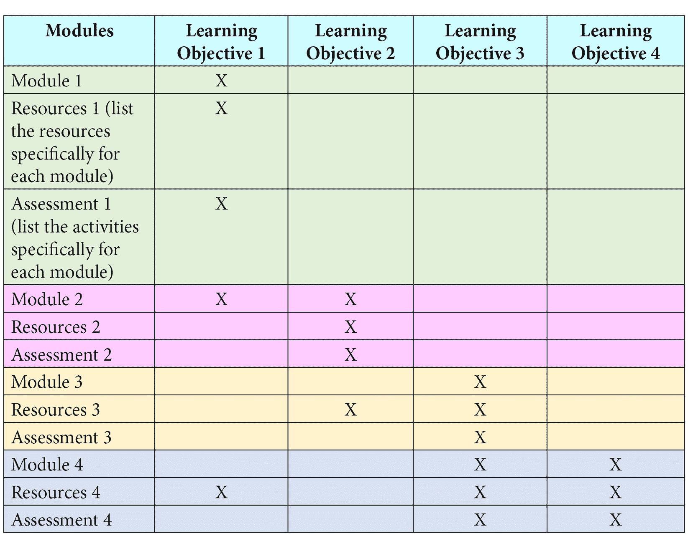

一旦你将课程材料映射到你的学习目标上，你就可以继续制定课程设计计划，这可以是一个模板类型的文档。有些人发现故事板方法最为方便；其他人则更喜欢保持课程图。

# 确定课程目标和学习目标

课程的学习目标对应于你希望在课程结束时让学生能够完成的可衡量绩效。课程目标和学习目标通常可以互换使用，尽管从技术上讲，它们不应该如此。学习成果是描述学生在特定作业、课程、课程或项目结束时应该获得的知识或技能的陈述，帮助学生理解为什么这些知识和技能对他们是有用的。

学习目标类似于目标陈述，但它们更具体，通常与布卢姆分类法相关。它们描述了学生在学习活动结束时能够做什么，使用与认知水平相关的动词：

+   它们是具体和可衡量的。

+   它们是以学生为中心的。

+   动词与认知技能的层次结构相关联，例如布卢姆分类法。

最佳方法是开发一个 CDD，它既是一个模板，也是一个清单，列出了每个课程中要包含的事项，以及离线/纸质格式。CDD 围绕整体学习目标组织，然后是更具体的学习目标，这些目标随后与课程教学材料和评估相一致。

当你开发你的模板（CDD）时，你需要问一些问题。你如何在课程和单元级别上实际制定学习目标？你如何确保它们是可衡量的，并且处于正确的认知水平？

布卢姆分类法是编写学习目标的标准，尤其是在认知领域。布卢姆分类法用于将教育学习目标分类为复杂性和具体性的级别。最初由本杰明·布卢姆于 1948 年开发，后来经过修改，这个工具提供了一个框架，用于选择描述结果时使用的动词，然后将它们映射到活动中。

如以下图表所示，在布卢姆分类法中，梯子的最低端是最简单的，它最终达到最复杂的水平：

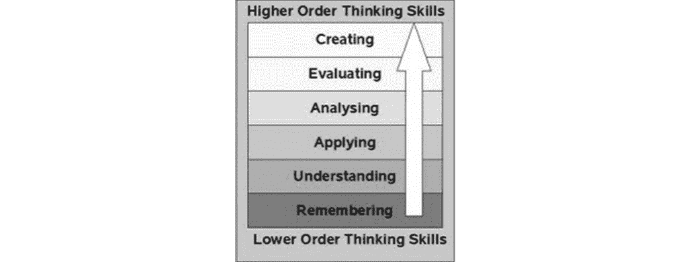

图 4.1 – 布卢姆分类法的表示

使用布卢姆分类法来开发课程以及教学策略的价值在于，它确保了设计上的清晰性和一致性。

此外，通过使用布卢姆分类法，你可以确保学生遵循从简单到复杂的顺序，并适当地构建学习框架，以便概念和技能在递增的复杂性和难度级别上相互构建。

现在你已经绘制了课程图并确定了学习目标，你就可以学习如何在课程中添加和管理资源及活动了。

# 地图 - CDD

我们提到了课程规划和绘制地图。现在，我们将更详细地介绍。如果你在学校工作，你很可能已经被要求制定计划并遵循学校确立的格式。然而，如果你负责企业培训，你可能不需要制作规划文件。尽管如此，这仍然是一个极好的主意，尤其是如果你要求员工完成培训以符合规定。

让我们回到你课程的概念图。这被称为**课程设计文档**（**CDD**）。它也常被称为**教学设计文档**。这是一份包含基本组织、结构、格式和风格元素，以确保所有单元都是统一和一致的文档。它还包含了教学策略，该策略将描述何时何地融入旨在吸引学习者、与课程学习目标相联系、练习掌握和保留知识的活动和项目。

你将使用 CDD 作为指导，在你的组织中开发课程，确保它们的一致性。以下是需要包含的项目示例：

1.  课程的主要学习目标

1.  课程的学习目标（不超过七个或八个）

1.  关于谁应该参加这门课程的信息

1.  单元学习目标

1.  单元吸引者（“你知道吗？”问题）

1.  单元教学内容（阅读材料、视频、音频讲座和图形）

1.  学习活动类型等

1.  单元评估类型等

1.  带有格式的模板

CDD 不仅可以帮助你设计课程，还可以在准备认证访问时提供帮助。CDD 可以以基于课程图的电子表格的形式出现。在下面的表格中，你可以看到第一个模块的设计，它包含更多元素以使课程更有效和吸引人。这个例子只包含**模块 1**，因为所有其他模块都会包含相同的元素。请注意，我已经涵盖了一个场景，其中模块中的一些内容和活动实际上可以满足多个学习目标：

**课程第一个模块的 CDD**

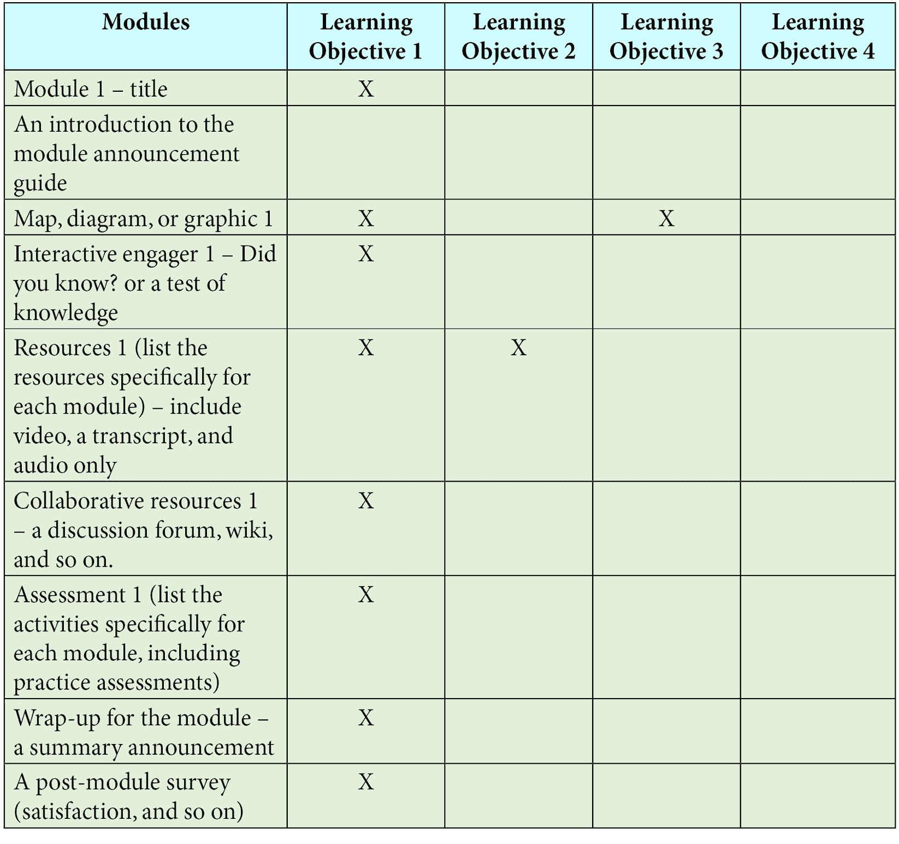

你的 CDD 可以是自我审查的一部分，在其中你讨论课程内容准备和实施的各个方面，并解释你保持一致性的策略。

## 学习的通用设计

当你开始开发课程材料时，将通用学习设计作为指南，确保你的学习者无论有任何身体或认知限制都能获得访问。**通用学习设计**（**UDL**）旨在使所有学习者都能学习，并利用三个不同的核心领域——情感、认知和身体性。以下是一个网站链接：[`udlguidelines.cast.org/`](https://udlguidelines.cast.org/)。

使用通用学习设计将有助于吸引各种学习风格，并满足那些具有音频、视觉或动觉学习偏好的学习者的需求。通用学习设计的三个主要领域是参与、表征和行动与表达。

此外，通用学习设计还寻求确保将多种呈现材料的方式融入其中，以便那些可能具有低活动能力、低视力、低听力或认知挑战的人能够参与：

通用学习设计的目的是确保使用多种方式来实现以下目标：参与、表征、行动和表达。我们现在将逐一描述：

+   **参与**：通用学习设计要求课程设计者确保有多种参与方式。通用学习设计提供了一系列不同的策略来吸引兴趣，并在兴趣被激发后，维持努力和坚持。最后，通用学习设计提供了策略来开发一个能够自动建立自我调节的课程。例如，你可以采用积木式方法，将大任务分解成更小的活动，这样学生可以在旅途中逐步取得进步，并获得奖励。

+   **表征**：通用学习设计提供了设计课程的策略，这些课程材料可以通过多种方式访问，并使用不同的感官。例如，如果你有一个音频录音，确保包括文本转录。同样，如果你有一个文本，确保它可以通过应用程序转换为语音。确保在开发你的课程时，包括专业词汇和符号的词汇表，并确保你的演示清晰。确保你可以促进跨语言的理解，可能通过包括翻译功能。最后，确保使用支架方法，通过提供背景知识来促进理解，使学习者容易看到大概念。你可以使用此类资源，例如内容文件，你还可以结合“检查你的知识”的交互式活动。

+   **行动和表达**：UDL 要求您思考当学习者遇到内容或活动时他们会做什么。您如何确保他们即使缺乏身体活动能力也能轻松导航并完成任务？如果他们视力或听力不佳，您将如何确保他们能够访问并做出适当的调整？确保尽可能构建辅助技术，并提供获取它们的链接。表达和沟通对于 UDL 非常重要，确保您能够适应多样性和不同的文化理解内容的方式。使用多种媒体进行沟通，随着布卢姆分类法难度级别的提升，设计课程时应逐步提升，而不是在不同难度级别之间跳跃。最后，通过构建目标设定活动来帮助学习者成功。您可以包括清单或一套明确的指南。您可以构建一个框架，用于定期发布有助于学生保持进度。您可以构建一个模板，供讲师填写，以帮助提供支持性任务，例如在线图书馆中数据库搜索的指南，或设计讨论提示的快速提示，以鼓励学生分享他们的生活经历，使虚拟课堂成为一个社区和支持性的地方。

当你开始思考课程材料时，了解你的学习者是谁。他们的背景是什么？他们是忙碌的工作成年人吗？他们是某个学位课程、证书或企业培训小组的一部分吗？一旦他们拥有这些知识，他们打算如何使用它们？

当我们继续进行课程地图和 UDL 策略时，让我们熟悉一下设置。

# 适用于所有资源和活动的设置

一旦您绘制了课程图，并列出了您想添加的资源活动列表，您就可以开始查看设置。

对于所有不同类型的资源和活动，添加它们的前几个点击操作是相同的。此外，还有一些共同的设置，您需要为添加的所有资源和活动选择。以下章节将详细介绍这些共同设置。

## 添加资源或活动

这是在添加资源或活动时开始的方式。这适用于您可能希望添加的所有资源和活动。

首先，以管理员、课程创建者、经理或教师的身份登录。然后，点击位于主页右上角或**管理**菜单中的**开启编辑**。

添加资源或活动的步骤如下：

1.  在你想添加资源的主题或周，点击**添加活动或资源**。您可以创建占位符活动或资源。您可以在稍后移动它们到课程中。

1.  要选择要添加的资源或活动的类型，请点击**添加活动或资源**对话框中的资源或活动类型。

1.  点击**添加**按钮。

1.  接下来，您可以添加更多特定于每个资源或活动的详细信息：

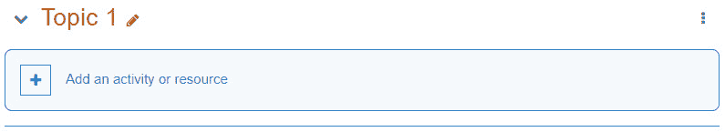

图 4.2 – 添加活动或资源

## 输入名称和描述

对于您添加的每个资源或活动，您必须输入一个名称和描述。您还将选择是否以及何时显示描述。由于这些字段适用于您添加的每个资源或活动，让我们在相应的部分中介绍它们。

当您点击**添加活动或资源**时，您将看到以下内容。如果您熟悉 Moodle 的早期版本，您会立即注意到菜单显示图标而不是名称列表。它还包括**i**链接，这些链接将带您到资源或活动的信息描述，以及有关有效使用它们的实用提示。Moodle 4.0 已更新并现代化了图标，以便它们易于识别和使用各种设备。

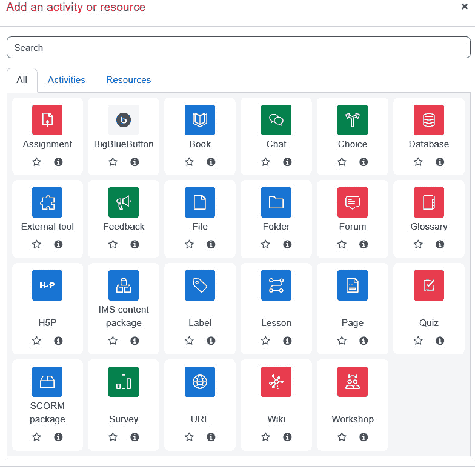

图 4.3 – 添加活动或资源屏幕的截图，其中您选择要添加的活动或资源的类型

要给资源或活动命名和描述，请按照以下步骤添加页面：

1.  在**名称**块中输入名称：

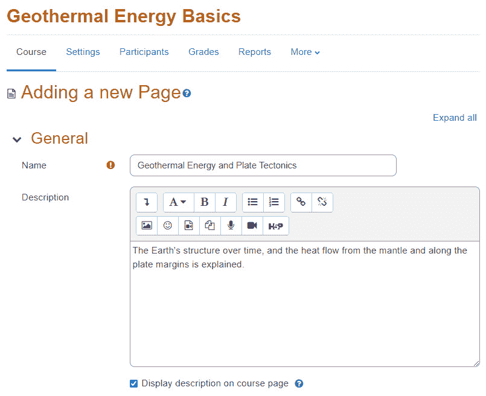

图 4.4 – 如何更新页面

当您完成编辑和保存资源或活动后，此名称将作为链接出现在课程页面上。

1.  在**描述**块中输入描述：

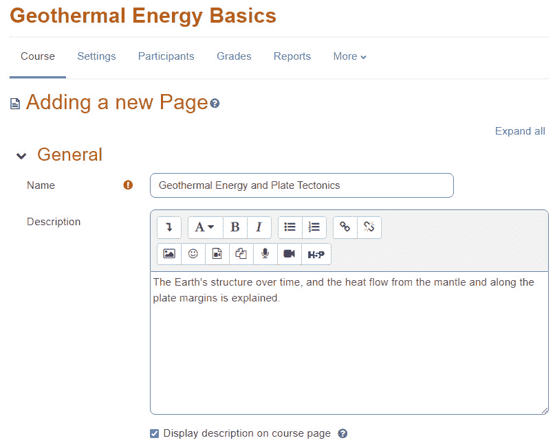

图 4.5 – Moodle 中显示如何在描述块中输入描述的屏幕

项目的描述可以出现在课程主页上，也可以在项目出现在课程资源列表中时显示。

## 显示和隐藏资源或活动

当您将资源或活动添加到课程中时，您可以设置项目对学生不可见，直到您准备好让他们看到它。例如，您可能希望将网页隐藏起来，直到您完成写作。或者，您可能希望随着课程的完成，以小组的形式揭示一系列活动。

当您隐藏一个项目时，它仍然对教师、课程管理员和网站管理员可见。它仅对学生和访客隐藏。

要显示或隐藏一个项目，请点击其旁边的眼睛图标。

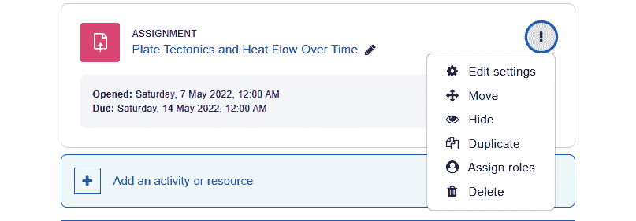

图 4.6 – 显示和隐藏项目

## 设置资源或活动的可用性

您添加的每个资源或活动都将具有**通用模块**设置。如果网站启用了条件访问和/或完成跟踪，还会添加**限制访问**设置。由于每个项目都包含这些设置，我们将在以下部分中逐一介绍。

## 使用可见性设置来显示或隐藏资源

在**通用模块设置**下，这些是配置任何资源或活动时您会看到的设置，可见性设置决定了资源或活动是否对学生们可见，如图所示：

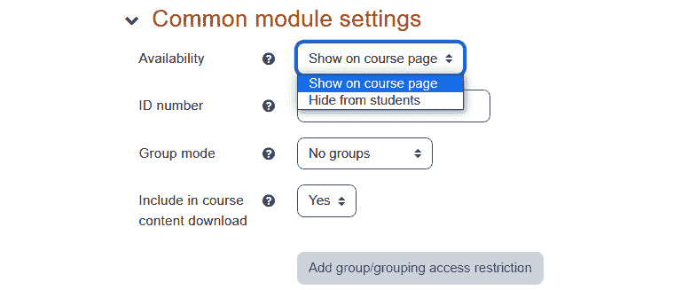

图 4.7 – 如何添加通用模块设置

教师和网站管理员**始终**可以看到项目。将此设置为**对学生隐藏**将如预期的那样，将项目从学生那里隐藏起来。教师可以在课程开始时隐藏一些资源和活动，并在课程进行中揭示它们。或者，您可以在开发过程中保持项目隐藏，并在完成时才揭示。这与课程主页上的**显示**和**隐藏**设置相联系。要确定项目对学生是可见还是隐藏的，请查看眼睛图标。如果眼睛图标上有一条线穿过，则表示不可见。

## 成绩册

您可以使用课程成绩册收集和跟踪成绩。成绩册汇集了您在课程中设置的评估结果。请记住，成绩册显示为一个包含课程、类别和每个评分活动的列的电子表格。

让我们来看看课程显示。报告顶部的行对应于**作业**、**测验**和**课程**。然后，每一行将包含与每个特定评分活动对齐的列。

您可以以不同的方式显示类别：

+   仅显示成绩（不显示总计列）

+   折叠（仅类别总计列）

+   全视图（每个类别的总计列）

请记住，您可以隐藏列或单个成绩。这取决于您需要多少细节来跟踪您的课程，以及您需要创建组织报告的信息类型。

以下屏幕截图显示了您可以自定义成绩册及其显示方式的选项。Moodle 4.0 给您提供了比以往更多的选项，并且它还使您能够更容易地访问所有成绩册和成绩设置。请注意，外观是以直观的方式布局的，这样即使您忘记了每个选项的含义，您也可以点击下拉菜单并发现您的选项。

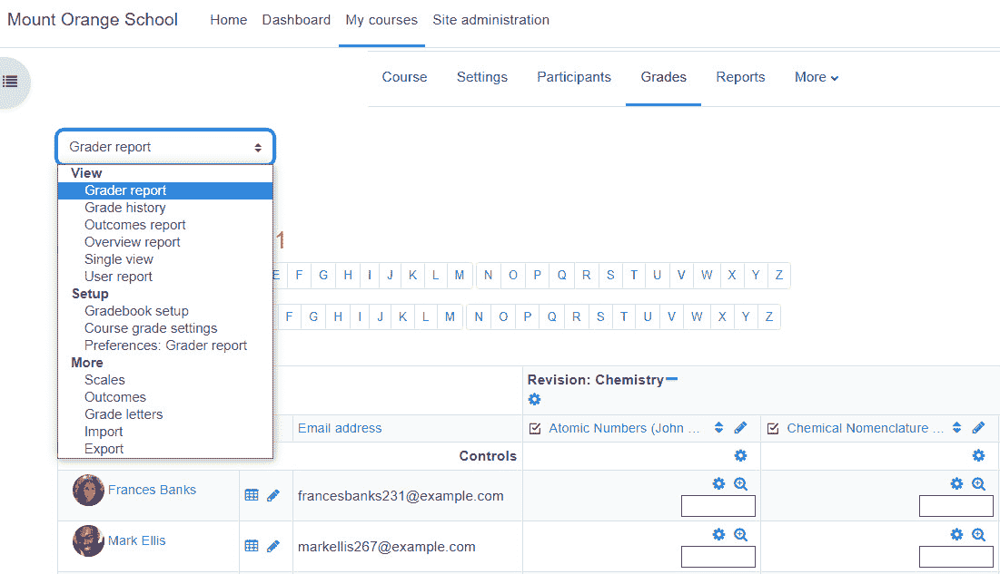

图 4.8 – 如何修改成绩册和评分报告的计算和显示方式

# 在课程主页上重新排列/移动项目

在您创建了资源和活动之后，您可能需要更改它们在学生面前显示的顺序。这样做很简单，因为您可以在主页上轻松地重新排列和移动项目，以便它们以对他们（以及讲师）最方便的方式显示。

在您构建课程的过程中，您将向课程页面添加资源和活动。Moodle 允许您轻松地重新定位这些项目。重新定位它们如此简单，以至于我建议您甚至不必担心在创建时将它们放在正确的位置。只需继续创建，您可以在稍后重新排列它们。

在课程页面上重新排列项目可以这样做：

1.  以教师或网站管理员的身份登录您的课程。

1.  在页面的右上角，如果您看到一个写着**开启编辑**的按钮，请点击该按钮。如果它写着**关闭编辑**，您不需要点击此按钮。

1.  在您想要移动的项目旁边，将鼠标指针放在十字准线图标上。

1.  将项目拖动到课程页面上您想要放置的位置，然后释放鼠标。

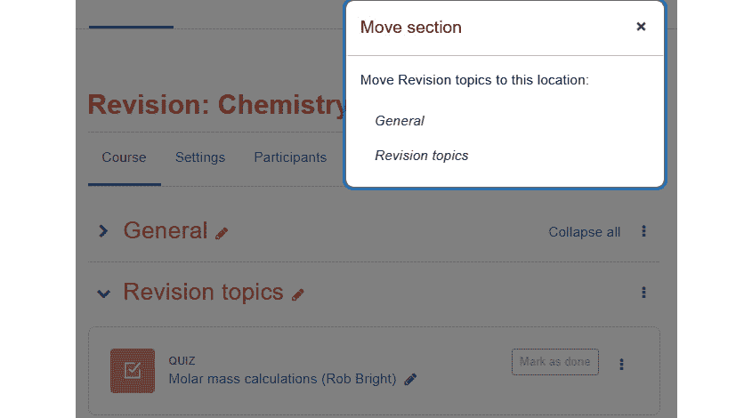

图 4.9 – 如何移动章节

## 限制访问

**限制访问**设置允许您设置控制学生是否可以看到此资源的条件。您可以使用四种类型的条件——日期、成绩、用户资料和自定义字段。限制访问可以是一种确保学生以建立他们所获得知识的方式通过课程的好方法，从而设置有效的支架。我们将在稍后查看更具体的例子，但现在您对这种功能有一个概念是很好的。

此外，请注意，我们谈论的是课程中资源的访问权限，而不是课程本身。在下面的屏幕截图中，我们可以看到访问资源的限制和条件：

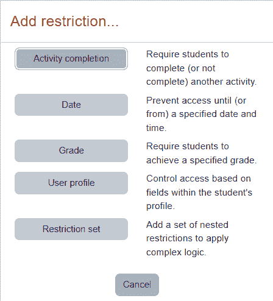

图 4.10 – 为访问资源添加限制和条件

在以下屏幕截图中，用户正在向资源添加日期限制。您何时想限制访问？如果想要确保学生或团队成员以同步的方式完成课程，以便他们能够清晰沟通，限制访问通常是一个好主意。如果您想通过要求学生在评估中达到最低及格分数来推进，这也是非常重要的。当一个活动或资源尚未对用户开放时，您可以防止用户在课程主页上看到它。以下示例显示了访问条件旁边的眼睛图标。如果眼睛图标是打开的，那么即使用户没有访问权限，学生也能在课程主页上看到活动/资源列表。活动/资源将以灰色字体显示。如果眼睛图标是关闭的，项目将在用户访问之前对用户隐藏：

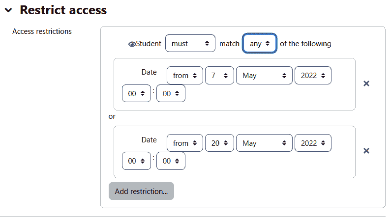

图 4.11 – 用户添加日期限制

添加一个**从**限制使资源从该日期和时间开始可用。如果您不添加**从**限制，资源将立即可用。

添加一个**至**限制设置一个日期和时间，资源将变得不可用。如果您不添加**从**限制，资源默认为您设置第一个日期的时间，因此立即关闭。

如果您的学生报告说他们看不到一个活动或资源，请务必返回并检查您的设置。可能您没有给他们提供访问权限。

**成绩**条件设置允许您指定学生在本课程中的另一项活动之前必须达到的等级，才能访问该项目。

在以下屏幕截图中，您可以看到，只有在学生至少在课程中获得 70% 的分数后，项目才会对学生可用。您可能希望参考*第二章**，安装 Moodle 和配置您的网站*，以获取更多详细信息。请注意，课程已设定开始日期和最后可用日期。

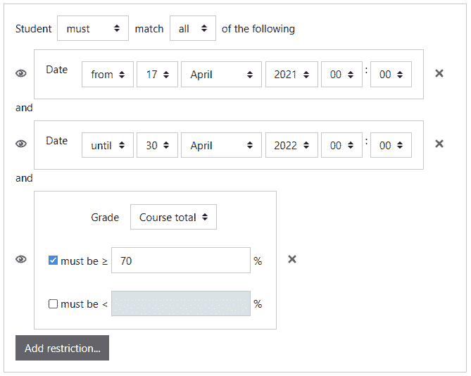

图 4.12 – 如何配置它，以便必须获得 70% 的分数才能继续前进

### 创建活动完成设置

根据活动类型，需要设置条件和完成要求：

1.  选择一个活动或资源。

1.  在活动或资源的**管理**菜单下，选择**编辑设置**。以下示例中，我们正在处理课程中的论坛。

1.  **设置**页面显示。向下滚动到标记为**活动完成**的部分。

1.  **完成跟踪**字段确定此活动或资源如何被标记为完成。

学生可以选择故意将其标记为已完成（**学生可以手动将活动标记为已完成**）或者学生做了某些事情后活动会自动标记为已完成（**当满足条件时显示活动已完成**）。在此阶段不必担心具体是哪些活动。只需记住，Moodle 拥有丰富的活动种类，我们将在未来的章节中更详细地探讨。

如果你选择让学生手动标记活动或资源为已完成，学生将从课程的首页进行标记。

如果你选择让活动或资源自动标记为已完成，请选择以下导致其被标记为已完成的条件：

1.  如果你选择了**当满足条件时显示活动已完成**，你必须选择导致活动或资源被标记为已完成的条件。

如果这是一个资源，学生无法为其获得分数。只有**学生必须查看此活动才能完成**这一选项将可用。

如果这是一个活动，**学生必须查看此活动才能完成**和**学生必须获得分数才能完成此活动**两个选项都将可用。

1.  在某个时候，你可能想运行一个报告。你将在章节的后面学习如何运行报告，但为了让你尽早熟悉一些功能，我们在这里提到它们。例如，你可能想运行**活动完成报告**。如果你认为你将需要使用那个报告，那么请启用预期完成日期的设置。这不会向学生显示预期完成日期。你并不是通过这个设置设置截止日期。只有教师会在活动完成报告中看到这个日期。如果你想告诉学生必须在特定日期完成此活动或资源，你需要使用其他方法来做到这一点。

1.  一旦你完成了设置完成条件，你可以保存活动或资源，或者继续在**设置**页面上修改其他设置，然后保存。

### 创建将被限制的活动或资源

现在你已经创建了需要完成的活动并设置了它们的完成条件，你就可以创建一个受限的活动了。

如前所述，后面的章节将向你展示如何创建资源和活动。一旦你创建了将被限制的资源或活动，请继续执行下一组指令。为此，你可以参考课程地图和 CDD，如本章前面所示。

### 设置能力条件

最后，在我们试图限制的资源或活动中，让我们选择它何时可用，如下所示：

1.  选择一个活动或资源。

1.  在活动或资源的**管理**菜单下，选择**编辑设置**。

1.  显示的是**设置**页面。向下滚动到标记为**能力**的章节。

1.  对于**活动完成条件**字段，选择必须完成的活动或资源。

1.  选择**发送供审阅**条件。

1.  你可以通过点击**活动完成时**按钮添加更多完成条件。

1.  要么保存活动或资源，要么继续在**设置**页面上修改其他设置。

以下截图是一个包含许多活动的课程示例，教师希望学生遵循特定的顺序，而不是随意跳转。

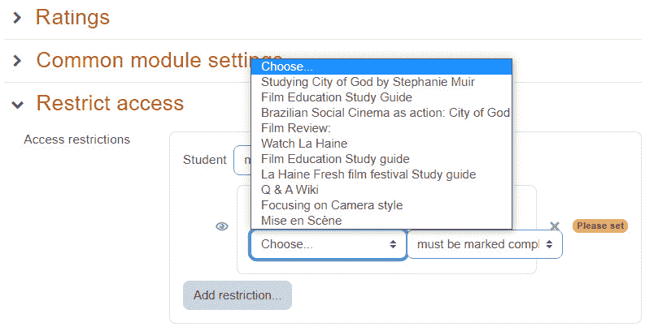

图 4.13 – 要求学生在获得对受限访问部分的访问权限之前完成活动

此设置对于测验特别有用。你可以确保学生在参加测验之前复习所需材料，并在测验可用之前了解要求。这是一个停下来反思如何提高学生学习和保留知识能力的好地方。

小贴士

你还可以拖放整个主题。如果你看到主题旁边有一个瞄准器图标，你就知道你可以这样做。只需拖动瞄准器图标并将其放置到你希望主题出现的位置。

确保学生能够无缝地完成课程并准备好进入下一级别最有效的方法是将前进进度与成功完成章节、单元或模块联系起来。务必考虑整体课程设计，并确保活动和资源按照布鲁姆分类法的层次递增。同时，在创建课程流程时，确保参考课程地图和 CDD。

# 摘要

在本章中，你学习了如何规划课程，以便将资源和活动映射到课程学习目标。你了解到 CDD 可以作为课程开发的蓝图，并构成教学策略的基石和认知基础。本章还涵盖了资源和活动之间的区别以及将它们添加到课程中的基本知识。你还了解了不同类型资源和活动的常见设置。

Moodle 4.0 重新设计的**资源**和**活动**图标易于识别，有助于用户快速识别活动或资源，并出现在用户的时间轴上，便于导航。

在接下来的几章中，你将了解特定资源和活动的具体设置以及如何充分利用它们。当你学习如何处理这些项目时，可以回过头来参考本章，以提醒如何使用常见设置。
