# *第五章*：将资源添加到您的 Moodle 课程中

资源是学生用来实现课程学习和表现成果的教学材料。在一个面对面教学经常受到严重限制的世界里，同步网络会议和异步交付通常是混合的，阅读材料、视频、地图、播客和其他类型的文档是每个课程中使用的关键构建块。Moodle 为你提供了一种组织材料的方式，使它们按照你的课程计划流动，你可以根据你的学习目标以合理的方式提供资源。Moodle 提供的灵活性在当今混合同步和异步学习环境中变得越来越重要。本章将教你如何将那些资源添加到课程中，以及如何最大限度地利用它们。我们还将讨论如何选择、排序和部署资源，以便它们有助于学生在实现成果方面取得成功。

在本章中，我们将涵盖以下主题：

+   将资源与课程成果联系起来

+   添加不同类型的资源

+   添加 URL 和嵌入资源

+   添加页面

+   为学生添加可下载的文件

+   添加媒体 – 视频 和音频

+   组织资源

到本章结束时，你将能够识别要添加的适当资源，实现课程学习目标，管理资源，然后有效地使用它们。

# 将资源与课程成果联系起来

这是时候回顾你的课程计划了，这包括课程地图和**课程设计文档**（**CDD**），我们在*第三章*，“创建类别和课程”中讨论过。你可能还记得，课程地图和 CDD 构成了一个故事板和学习成果。在 Moodle 中，“资源”指的是你将在课程中包含的内容。交互式评估和参与活动被称为“活动”，但我们将这在*第六章*，“添加作业、课程、反馈和选择”中讨论。现在，让我们考虑最佳方式来开发与课程目标最佳对齐的课程材料。

拥有大量资源是很好的，特别是那些与课程中各种学习者相匹配的资源。然而，除非它们组织得很好，并且与课程成果明确联系起来，否则你会产生挫败感而不是信心。

规划和组织是选择、排序和部署资源成功的关键。始终将它们首先与学习成果联系起来，然后确保它们按复杂度升序分组，这样你就能构建一个坚实的基础，并在更高层次上构建支架。

因此，第一步始终应该是列出课程成果，然后创建一个课程大纲，开始识别你需要哪些资源：

1.  列出课程成果。

1.  复习您的课程大纲。

1.  确定您需要的资源。

1.  将资源映射到您的成果，并识别可能存在的任何差距。

1.  开发您的剧本或 CDD，以按顺序放置材料。

以下是一个规划网格或框架，您可以使用它来跟踪您的资源，并确保在学习目标和布鲁姆分类法级别上没有差距。请记住，以下表格只是一个框架，而我所包含的条目只是为了帮助您开始。为了更容易地概念化，我使用了名为*英语 1102：文学写作*的课程示例：

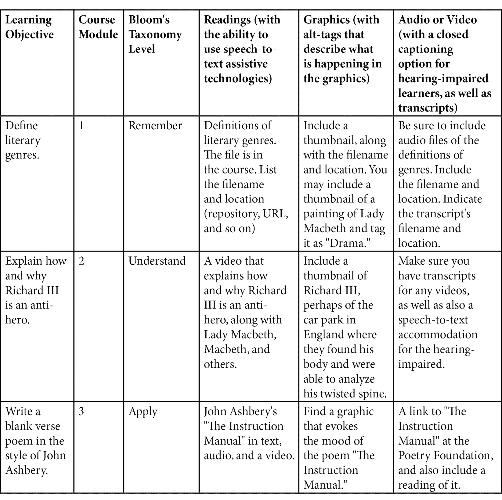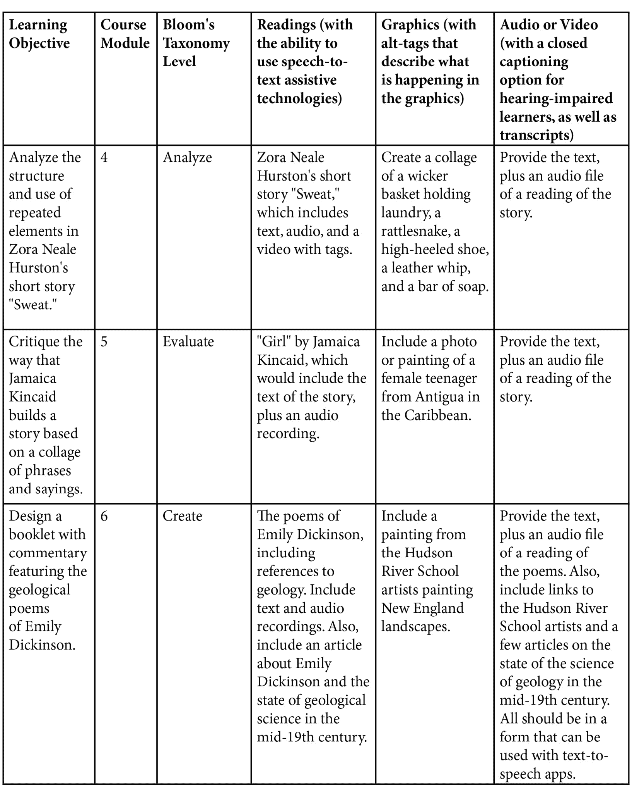

图 5.1 – 课程地图（规划网格）

将课程资源与交付方式（同步、异步、混合教学法等）联系起来也是一个好主意，这样您可以优化它们的部署方式。例如，90 分钟的录像可能适合异步或*按需*课程，但不适合同步课程，因为在同步课程中，*实时*互动是学习的主要场所。

现在您已经学会了如何将资源与学习成果相连接，您将学习如何将资源添加到课程中，以便您能够有效地使用它们。

# 添加不同类型的资源

下表列出了 Moodle 中可用的资源类型。您可以从**添加活动或资源**下拉菜单添加资源。使用此菜单，您可以添加以下资源：

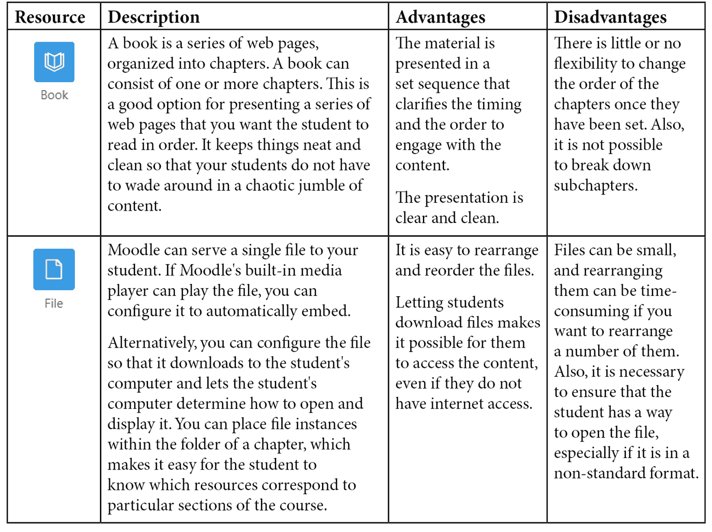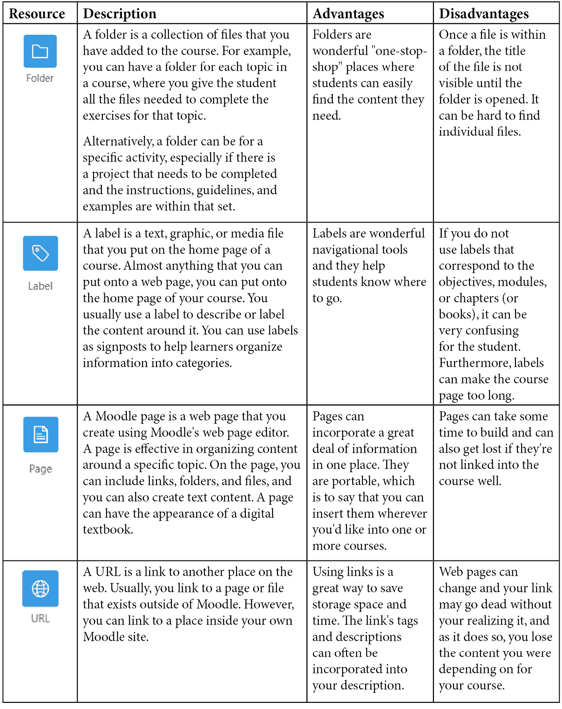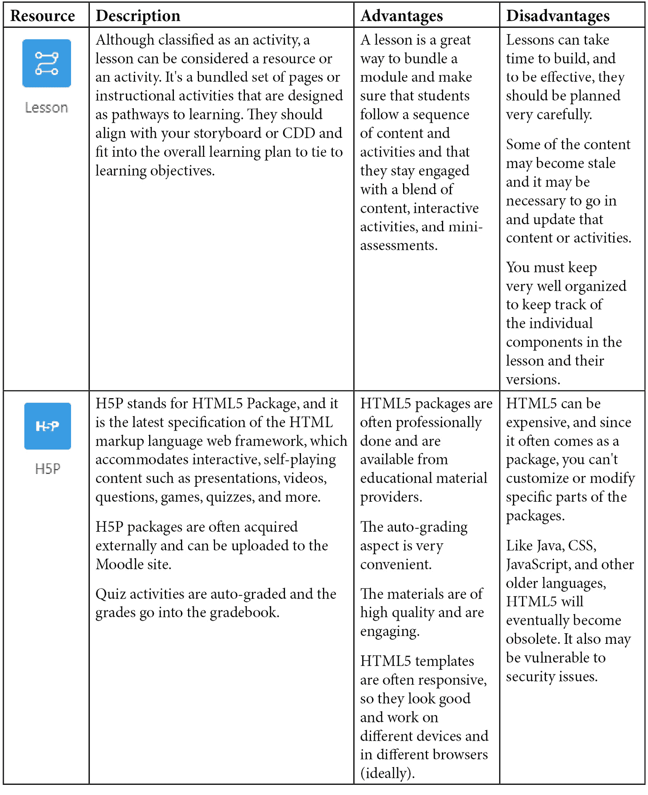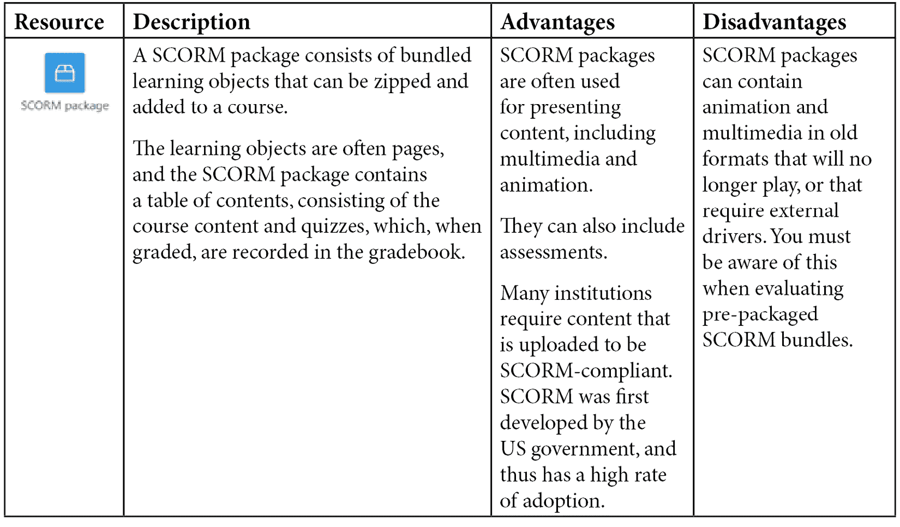

图 5.2 – 不同类型的资源

拥有一系列构成您的教学材料和与学习目标相连的资源，将有助于您成功开设课程，同时也有助于您的学生获得非常积极的用户体验。现在您已经知道了可能的做法，您将学习如何链接到它们并嵌入它们以实现最大功能。

# 添加 URL 和嵌入式资源

在您的 Moodle 网站上，您可以使用链接显示来自网络任何地方的内容。您将此链接添加到课程的首页。当学生点击链接时，链接项将被显示。

当使用来自外部网站的内容时，你需要考虑使用链接的合法性和可靠性。在你的 Moodle 网站上显示材料是否合法？当你的课程运行时，材料是否仍然存在？如果有疑问，请链接到资源。花点时间审查创意共享许可，以及根据 FAIR 指南可用于教育用途的资源：[`creativecommons.org/licenses/`](https://creativecommons.org/licenses/).

## 显示选项 – 嵌入、打开和在弹出窗口中

你可以选择页面如何显示；有三个选项：

图 5.3 – 配置 URL 或嵌入资源的显示外观

你可以将链接页面嵌入到 Moodle 页面中。你的学生将看到**导航栏**；你添加到课程中的任何块和导航链接将显示在页面顶部，就像他们在 Moodle 中查看任何其他页面时一样。页面的中心将被链接页面占据。

**打开**将学生从你的网站带走，并在 Moodle 占用的窗口中打开链接页面。

最后，**在弹出窗口中**将在 Moodle 页面上启动一个新窗口，包含链接页面：

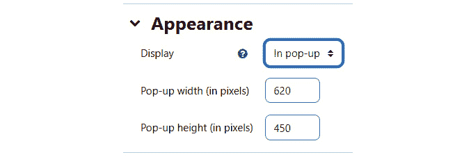

图 5.4 – 配置资源以创建弹出窗口

我们将在以下章节中详细探讨这些选项。

### 嵌入

要嵌入页面或播放器，你需要在选择要包含的资源时复制并粘贴**嵌入**HTML 代码。你会看到选项，当嵌入窗口打开时，你只需将代码粘贴到框中即可。

### 打开

当用户点击课程主页上的资源链接时，Moodle 将显示页面，包括链接描述和外部页面链接：

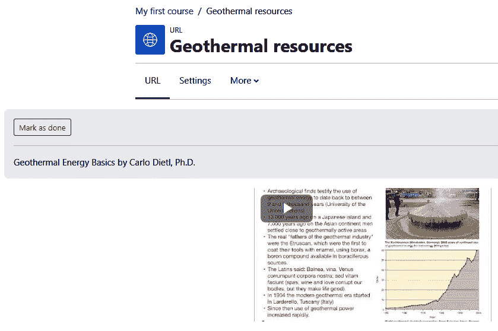

图 5.5 – Moodle 中嵌入页面的示例

点击链接将激活播放器，现在它已经嵌入到你的页面中。学习者现在可以在 Moodle 中（在这种情况下，是一个 YouTube 视频）查看资源。然而，有时视频可能太小，无法看清细节，学习者可能希望全屏观看。在这种情况下，他们可以点击*放大*的方块，这将学习者带出 Moodle 并直接进入 YouTube 视频：

全屏查看将扩展视图到全页

图 5.6 – 在嵌入的 YouTube 视图中点击括号方块将扩展视图到全页

### 在弹出窗口中

当学习者点击课程主页上的资源链接时，Moodle 将显示包含链接描述和外部页面链接的页面：

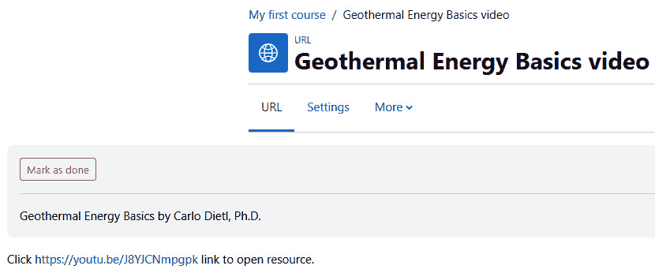

![图 5.7 – 设置为弹出模式的资源链接

点击链接将打开一个包含外部页面的弹出窗口。它显示在显示您的 Moodle 站点的窗口之上：

![图 5.8 – 弹出模式

![图 5.8_B17288.jpg]

图 5.8 – 弹出模式

当您使用**弹出模式**时，点击链接将在窗口顶部打开外部网站页面。

以下部分包含在您的课程主页上创建链接以及使用这些选项的说明。

# 添加链接

要将链接添加到网页上的资源，请按照以下步骤操作：

1.  在您想要添加资源的主题或周次中，点击**添加活动或资源**。如果您不确定在哪里添加链接，只需尽您所能猜测。您可以在课程中稍后移动它。

1.  将会显示**添加活动或资源**对话框。点击**URL**旁边的单选按钮。

1.  点击**添加**按钮。

1.  输入链接的**名称**和**描述**。要了解更多关于名称和描述如何影响学习体验的信息，请参阅*第四章*，*管理资源、活动和条件访问*。

1.  在**外部 URL**字段中，输入此链接的网页地址。

1.  在**外观**下，从**显示**下拉菜单中选择 Moodle 在显示链接页面时希望使用的方法 – 即**嵌入**、**打开**或**在弹出窗口中**。选择**自动**将使 Moodle 选择显示链接页面的最佳方法。

关于这些显示选项的更多信息，请参阅之前解释的*显示选项 – 嵌入、打开和在弹出窗口中*部分。

**显示 URL 描述**复选框会影响页面的显示，但仅当选择**嵌入**作为显示方法时。如果选中，则**描述**细节将在嵌入页面下方显示。

1.  在**外观**下，您可以设置弹出窗口的大小。如果您未选择**在弹出窗口中**作为显示方法，这些字段将不起作用。

1.  在**参数**下，您可以向链接添加参数。在网页链接中，参数将向链接添加有关课程或学生的信息。

1.  **通用模块设置**、**ID 号**字段以及**限制可用性**设置已在*第四章*中介绍，*管理资源、活动和条件访问*。

1.  点击页面底部的**保存**按钮之一以保存您的更改。

除了来自外部网站的 URL 和嵌入页面外，还可以向课程添加额外的页面。在下一节中，您将学习如何添加页面，然后添加它们的内容。

# 添加页面

Moodle 使您能够编写网页并将其添加到课程中。您添加的页面将在您的 Moodle 站点上创建和存储。在添加 Moodle 页面时，请务必有策略。如果不小心，您可能会造成混淆。以下是使用页面的最佳方式：

+   **添加与课程大纲相关的内联内容**：您可能有简短的故事或整章内容。创建页面而不是文件，允许您还包括链接，使导航非常流畅，以便学生始终保持在 Moodle 中。

+   **添加带有简介的门户页面，包括链接、文件和书籍**：您可能希望为课程中特定单元或章节的内容提供一个长篇介绍。您可以创建一个页面，添加您的介绍（包括图形和文本），然后有一个有组织的链接、文件、文件夹甚至书籍的集合。

当您将页面添加到课程中时，Moodle 会显示一个文本编辑器。使用此编辑器，您可以将几乎任何内容放入 Moodle 网页，就像普通网页可以包含的内容一样。

您创建的页面的链接将出现在课程首页上。

如果您可以使用基本的文字处理软件，您就可以使用大多数网页编辑器的功能。关于编辑器功能的全面讨论超出了本节的范围。相反，我们将检查 Moodle 编辑器中可用的几个关键功能。请注意，您可以在其中包含数学和化学符号，以及 HTML。

## 添加页面到课程

要将页面添加到您的课程中，请按照以下步骤操作：

1.  在您想要添加资源的主题或周中，点击**添加活动或资源**。如果您不确定要将链接添加到何处，只需尽您所能猜测。您可以在课程中稍后移动它。

1.  将会显示**添加活动或资源**对话框。点击**页面**旁边的单选按钮。

1.  点击**添加**按钮。

1.  Moodle 将显示此资源的**设置**页面。

1.  为页面输入**名称**和**描述**。名称将成为此页面的链接，并出现在您在课程首页添加它的部分。

如果您选中**在课程页面上显示描述**复选框，描述将出现在课程的首页上。您可以使用此功能告诉学生在查看页面时可以期待什么，并告诉他们页面的用途：

图 5.9 – 选择复选框以在课程页面上显示描述

要了解更多关于名称和描述如何影响用户体验的信息，请参阅*第四章*，*管理资源、活动和条件访问*。

在**设置**页面上，您可以编写网页。向下滚动到**内容**部分；您将看到一个用于编写页面和编辑页面内容的文本编辑器：

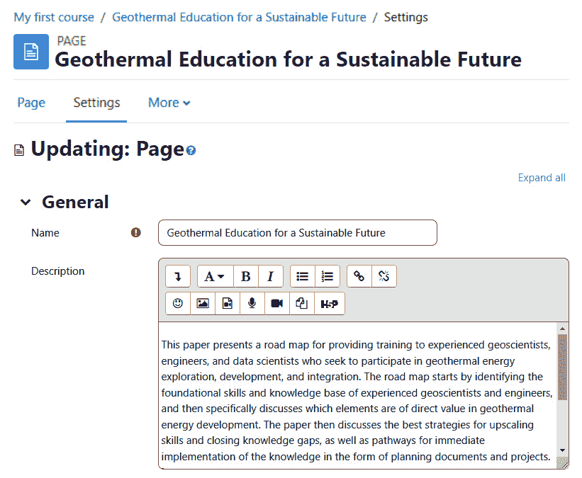

图 5.10 – 设置页面中的文本编辑器，允许您编写新页面

## 添加图像

当您选择要添加到 Moodle 页面的图像时，您可以从您已上传到 Moodle 的图像中选择，或者您可以上传新的图像。上传大图像文件可能会占用空间并减慢页面加载时间。优化您的图像是一个好主意。

一个不太明显的功能是链接到另一个网站上托管的照片。如果您正在使用另一个网站托管的照片，您可以添加链接，但请注意链接地址经常更改。此外，务必给予适当的信用。

### 插入图像文件

此过程用于插入您已存档在电脑或外置硬盘或闪存驱动器上的图像文件。在此示例中，用户有一个他们想要插入到页面中的图表，如下所示：

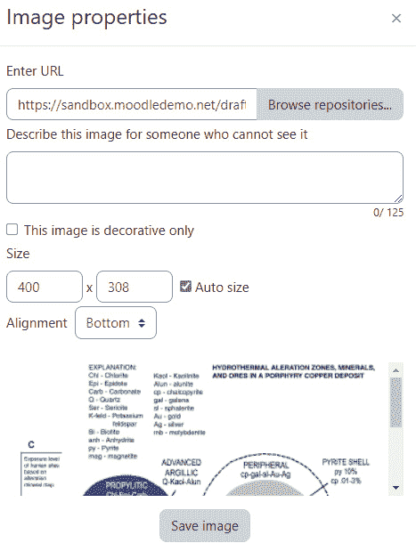

图 5.11 – 插入图像文件时添加详细信息

要插入图像文件，请按照以下步骤操作：

1.  在 Moodle 页面上，点击放置图像出现的位置。

1.  点击此处所示的**选择文件**图标：

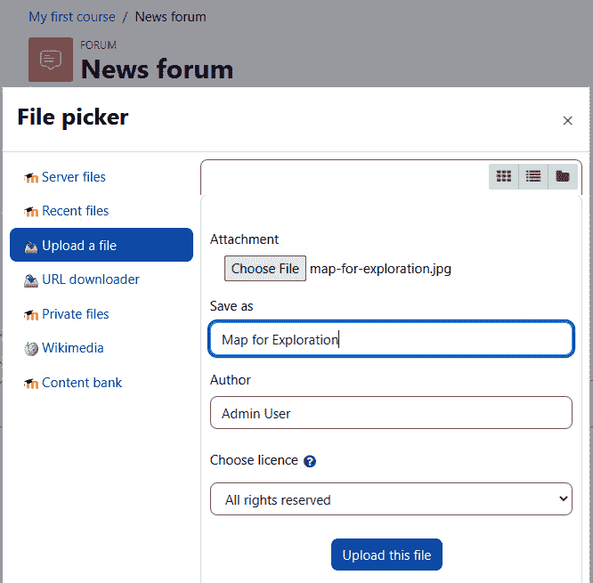

图 5.12 – 通过点击插入图像图标在新闻论坛中插入图像

1.  **插入/编辑图像**窗口将出现。在此窗口中，点击**查找或上传图像**按钮。

1.  **文件选择器**窗口将显示。在此窗口中，点击**上传文件**链接。

1.  点击**选择文件**按钮。

1.  在您的电脑上找到文件并选择它。

1.  点击**打开**或**确定**按钮。

1.  在**另存为...**字段中，给文件一个用户友好的名字。您可以使用特殊字符和空格。

1.  **作者**字段将自动填写您的名字。如果其他人拥有此文件，请在此处输入他们的名字。

1.  从下拉列表中选择此文件的**许可证**。这允许您告知其他想要使用此文件的 Moodle 教师他们可以合法做什么。

1.  点击**上传此文件**按钮。文件将被上传到您的 Moodle 系统，然后您将返回到**插入/编辑图像**窗口。

1.  填写**图像描述**字段是一个好习惯。这被视觉障碍用户和搜索引擎用来索引图像。

1.  如有必要，填写**外观**下的字段。您可能需要调整图片大小，因为 Moodle 默认会以原始大小显示图片。

1.  点击**插入**按钮。图片将被插入到页面中。

## 粘贴文本

许多时候，我们更喜欢在我们的喜欢的文字处理器中编写文本，而不是在 Moodle 中编写，或者我们找到可以合法复制粘贴到 Moodle 中的文本。Moodle 的文本编辑器允许您这样做。

然而，请确保您记住，Microsoft Word 的不同版本可能会对格式造成奇怪的影响。您可能希望移除所有创建非常干净文本的宏。您可以使用记事本，甚至记事本++([`notepad-plus-plus.org`](https://notepad-plus-plus.org))。一旦移除了 Microsoft 的宏，您将需要返回并格式化（粗体、下划线等），并且您需要使 URL 生效。

要将文本粘贴到页面中，您可以使用键盘快捷键。尝试使用 Windows PC 上的*Ctrl* + *V*和 Mac 上的*Command* + *V*。如果您使用此方法，文本的格式将被保留。

### 从 Microsoft Word 粘贴文本时移除格式

当您将文本从 Microsoft Word 文档粘贴到网页上时，通常包含大量非标准 HTML 代码。在其他文字处理程序中，如 Google Docs，也会发生同样的事情。这种代码在所有浏览器中都不太适用，并且使得编辑您页面上的 HTML 代码变得更加困难。许多高级网页编辑器可以清理 Word HTML 代码。请记住，编辑器会清理任何可能危险的代码，并可能被黑客利用的漏洞。所以，如果您的文本看起来与预期不同，请不要感到惊讶。

Moodle 的网页编辑器也可以清理 Word HTML 代码。您还可以使用 Moodle 的编辑功能来包含数学和化学符号。

当粘贴从 Word 复制的文本时，请使用**清除格式**图标。这将移除 Word 的大部分非标准 HTML 代码：

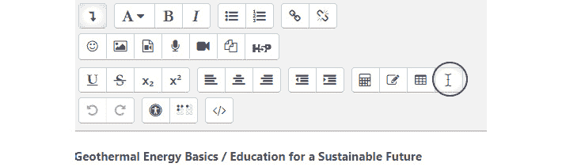

Figure 5.13 – The Clear Formatting icon

要从 Microsoft Word、Google Docs 或其他程序中移除多余的编码，请点击**清除格式**图标。

### 可访问性检查器 – 您需要为辅助技术添加标题吗？

为了确定是否需要在您的文本中添加更多标题，以便依赖辅助技术的用户能够访问内容，请点击带有张开双臂的人物的按钮，如以下截图所示。这样做将帮助您符合*通用学习设计*原则：

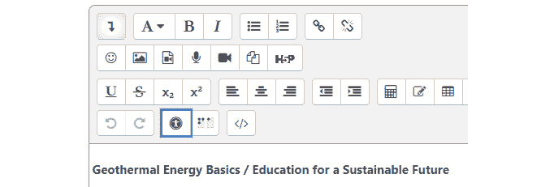

要确保您的文本对辅助技术可访问，请点击**清除格式**图标。

## 在 HTML 编辑器中编写并上传到 Moodle

依赖于 Moodle 移除 Microsoft Word 宏有几个缺点。首先，间距很少完全正确，要纠正它需要相当多的时间。然而，可能不可能一直在线，因此您可能希望离线工作，而不是在 Moodle 中工作。因此，您可能希望使用像 **Adobe** **Dreamweaver** 或甚至免费的基于网络的 HTML 编辑器 **SeaMonkey** 来编写您的网页。如果您想利用这些编辑器将高级功能插入到您的网页中，这一点尤其重要。那么，您如何将那个页面放入您的 Moodle 课程中呢？您可以将网页编辑器中的 HTML 代码复制并粘贴到 Moodle 页面编辑窗口中。为此，您必须执行以下操作：

1.  在您的网页编辑器中选择 HTML 视图。例如，在 Dreamweaver 中，您会选择 **视图** | **代码**，在首页上，您会选择 **视图** | **显示代码**：

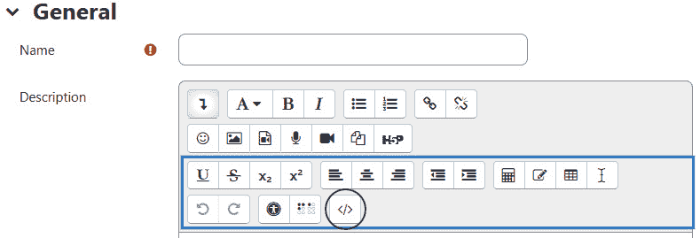

图 5.15 – HTML 图标

要在 Moodle 中显示 HTML 代码并进行编辑，请点击 **HTML** 图标。

1.  在您的网页中，选择两个 body 标签之间的 HTML 代码 – 即，从靠近顶部的 `<body>` 标签之后开始拖动，到靠近结尾的 `</body>` 标签之前。使用 **编辑** | **复制** 或按 *Ctrl* + *C* 复制代码。然后，执行以下操作：

    1.  切换到 Moodle 并创建新的网页。

    1.  通过点击图标来显示 HTML 代码。

    1.  按 *Ctrl* + *V* 粘贴代码。

第二种方法是发布您的网页到 Moodle 之外的地方，并从您的课程中创建到它的链接。链接到您的网站是个好主意，因为当您将文本粘贴到编辑器中时，Moodle 会移除它识别为“危险”的任何内容。

### 学习更多关于 HTML

要了解更多关于 HTML 代码的信息，您可以从负责定义标准的组织开始。*万维网联盟* 在 [`www.w3.org/standards`](https://www.w3.org/standards) 上在线维护 HTML 的完整标准。它还提供了一个基本教程 [`www.w3schools.com/html/html_intro.asp`](https://www.w3schools.com/html/html_intro.asp)。本基本指南中涵盖的所有内容都可以在 Moodle 的正常模式下使用其编辑器完成。高级 HTML 指南 [`www.w3.org/MarkUp/Guide/Advanced.html`](http://www.w3.org/MarkUp/Guide/Advanced.html) 涵盖了一些您需要进入 HTML 视图才能添加的功能，例如在图像内定义可点击区域和使用悬停效果。

除了添加包含内容的页面外，还可以添加学生可以下载的文件。请注意，Moodle 通常在 Moodle 上托管内容（无论是在本地还是在云端）的空间有限。因此，您可能考虑让学生从基于云的文件共享网站（如 OneDrive、Dropbox 或 Google Drive）下载文件。

在下一节中，您将学习如何为学生添加可下载的文件，以及如何确保他们既能下载也能打开这些文件，以便他们可以使用它们。

# 为学生添加可下载的文件

您可以将文件添加到课程中，以便学生可以将它们下载到他们的个人电脑上。您可能希望学生拥有的文件示例包括填写表格、课前阅读材料和可编辑的文档处理文件。

## 当学生从课程中选择一个文件时

当学生从您的课程中选择一个文件时，学生的电脑将尝试打开该文件。Moodle 只会将文件传递给学生的电脑。例如，如果它是一个 PDF 文件，学生的电脑可能会尝试使用 Adobe Reader 或预览应用来打开文件。如果它是一个文档处理文件，学生的电脑可能会尝试使用 Word 或其他文字处理软件来打开它。如果学生的电脑没有可以打开该类型文件的程序，它可能会提示学生保存文件。在图形或声音文件的情况下，他们的电脑将使用最方便的本地应用。这通常不是理想的选择。

您可以通过一个名为**强制下载**的设置来覆盖此行为。当您选择此设置时，学生的电脑将不会尝试打开文件。相反，它将下载文件并提示学生保存文件。

如果您希望学生在访问文件后立即使用该文件，请保持默认行为。如果您希望学生保存文件以供将来使用，请选择**强制下载**设置。

您将在下一节中看到此设置，当我们查看将文件添加到课程说明时。

## 文件存储库

您上传到 Moodle 课程的每个文件都存储在 Moodle 存储库中。在我们将文件添加到课程之前，我们需要了解存储库的工作原理以及如何为我们的课程选择正确的类型。

### 存储库类型

存储库是 Moodle 可以访问的存储区域。存储库不需要在您的服务器上 – 它只需要对您的 Moodle 系统可访问。有关如何增加功能并自定义 Moodle 的更多信息，您可能希望阅读一本关于 Moodle 管理的书籍，例如《Moodle 3 管理员指南》，[`www.packtpub.com/product/moodle-3-administration-third-edition/9781783289714`](https://www.packtpub.com/product/moodle-3-administration-third-edition/9781783289714)

存储库需要由网站管理员在**网站管理** | **插件 | 存储库** | **管理存储库**下启用。以下是一些文件存储库的示例：

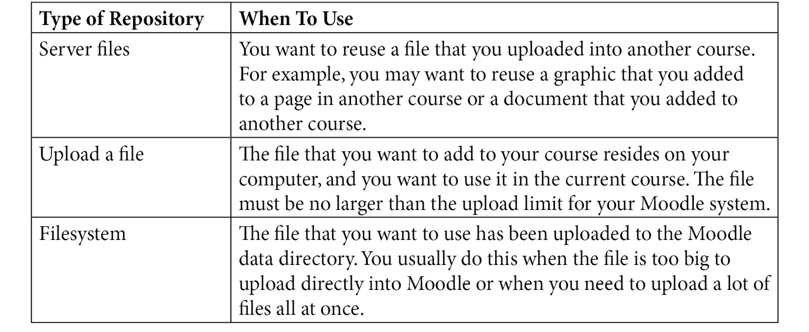

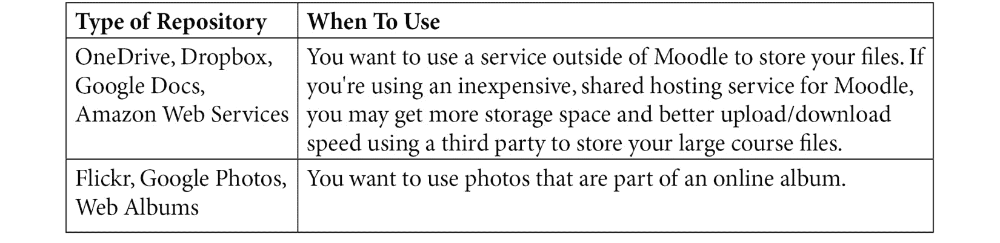

图 5.16 – 何时使用不同类型的存储库

现在我们已经审查了不同类型的存储库，让我们讨论何时以及如何使用它们。

## 使用文件共享服务进行协作

当你使用像 Dropbox、Google Drive 或 OneDrive 这样的文件存储库时，你是在 Moodle 之外存储你的文件。这是一种很好的协作方式。当协作超出课程的时间和范围时，使用文件共享服务也是一个好主意。

## 使用存储库来克服 Moodle 对文件大小的限制

可以上传到你的 Moodle 系统的文件大小有限制。这个限制因不同的 Moodle 站点而异。如果你使用 MoodleCloud，那么使用存储库的理由就更加充分了。在这里，你可以创建一个包含指向课程外内容的链接的主文档。

有三个设置限制了可以上传到 Moodle 的文件大小。其中两个设置在你的 Web 服务器上。你的 Web 服务器管理员需要更改它们。如果你使用的是共享托管服务，你可能无法更改这些设置。第三个设置在 Moodle 中；它可以由系统管理员更改。

上传文件的大小限制是这三个设置中最小的一个。

在 Moodle 中，在`php.ini`文件下。你可以设置一个比这更低的限制，但不能设置更高的限制。为此，请咨询您的网站管理员或查看 Packt 的书籍《Moodle 管理》，链接为[`www.packtpub.com/product/moodle-4-administration-fourth-edition/9781801816724`](https://www.packtpub.com/product/moodle-4-administration-fourth-edition/9781801816724)。

当你将文件上传到 Moodle 时，它将被放置在文件存储库中。默认情况下，它将出现在**服务器文件**存储库中。如果启用了**最近文件**存储库，文件也可能出现在那里。如果文件太大，Moodle 将不允许上传。

## 功能增强器

在今天混合同步和异步交付的环境中，Moodle 可以救命。如果你使用 BigBlueButton 或其他网络会议平台，你可以在 Moodle 中的**资源**中发布资源，并在 Zoom 聊天室中包含链接，从而立即使资源可用。

你还可以录制 Zoom 会议。稍后，你可以下载你喜欢的`.mp4`视频文件版本。你还可以下载文本记录。下载后，你可以将`.mp4`视频文件上传到你偏好的视频托管服务，这可能包括 YouTube、Vimeo 或其他服务。

音频的文本记录可以是一个重要的工具，尤其是对于那些可能听力受损或母语不是英语（或网络研讨会使用的语言）的人。拥有音频文本记录可以帮助你遵守通用设计原则。请记住，你可能需要进行一些复制编辑。

一旦你添加了媒体的描述和字幕，你就可以添加媒体本身。你将在下一节课中学习如何这样做。

# 添加媒体 – 视频和音频

如果你想在课程中添加视频或音频，你有三种选择：

+   首先，你可以将其作为资源或文件添加。如果你这样做，当学生选择文件时，以下两种情况之一会发生：要么媒体文件将被下载到学生的电脑上并由他们的电脑上的软件播放，要么 Moodle 将尝试使用其内置媒体播放器播放该文件。如果启用了 **站点管理** | **插件** 下的多媒体插件，Moodle 将尝试使用其内置媒体播放器播放该文件。如果没有启用多媒体插件，文件将使用学生电脑上的任何媒体播放器播放。HTML5 被设计成可以轻松地从各种设备（手机、平板电脑和笔记本电脑）和各种浏览器中播放所有类型的媒体。Moodle 适应了 HTML5。

+   第二，你可以在 Moodle 页面上嵌入媒体（请参阅 *添加页面* 部分）。这将导致媒体在网页上播放。

+   第三，你可以将代码复制并嵌入到 Moodle 页面的 HTML 中。你将看到一个包含 URL 和 **播放** 图标的缩略图。播放器看起来像是在 Moodle 中，但实际上是从主机（YouTube、Vimeo 等）播放的。你也可以通过上传 SCORM 包或通过 H5P 功能上传 HTML5 来添加包含多媒体的完整包。

## 向页面添加视频或音频

此过程会将视频、音频或小程序添加到 Moodle 页面。你必须拥有你添加的文件 – 即，该文件位于你的电脑上，而不是另一个网站上。如果你想要的文件位于另一个网站上，请参阅你将需要嵌入媒体而不是上传它。

1.  在 Moodle 页面上，点击放置媒体出现的位置。

1.  点击 **插入 Moodle 媒体** 图标：

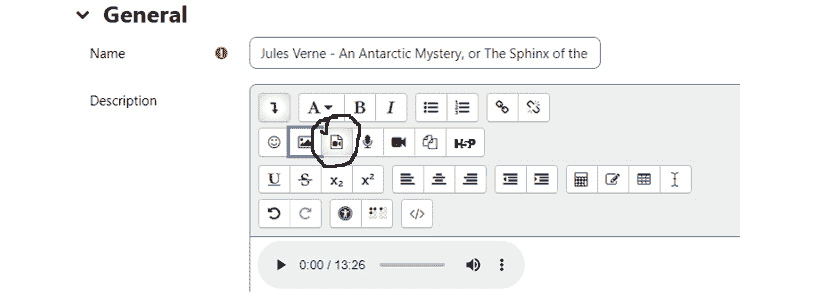

图 5.17 – 要插入媒体，请点击“插入 Moodle 媒体”图标

1.  将会出现一个弹出窗口。在这个窗口中，点击 **插入媒体** 按钮。你将有机会插入 **链接、视频或音频**。在每种情况下，你都有从 URL 上传的选项，这就是我在这里所做的。如果你不想这样做，你可以点击 **浏览存储库…** 并转到文件选择器：

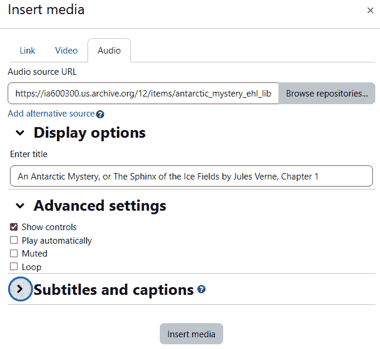

图 5.18 – 配置插入媒体资源的视图

1.  如果你的媒体在服务器上，你可以从文件选择器菜单上传它。**文件选择器** 窗口将显示。在 *文件存储库* 部分，你学习了如何从存储库添加文件。在这个例子中，我们将从你的电脑上传文件。点击 **上传文件** 链接：

图 5.19 – 要从存储库添加文件，请点击“上传文件”图标

1.  点击**选择文件**按钮。

1.  在您的计算机上找到文件并选择它。

1.  点击**打开**或**确定**按钮。

1.  可选地，给文件起一个您希望在 Moodle 中使用的名字。这位于**另存为**字段。

1.  默认情况下，**作者**字段包含您的名字。如果其他人创建了此文件，请通过将他们的名字作为作者输入来给予他们适当的认可。

1.  **选择许可**下拉列表允许您选择一个许可，这样其他教师就能知道文件有什么样的版权：

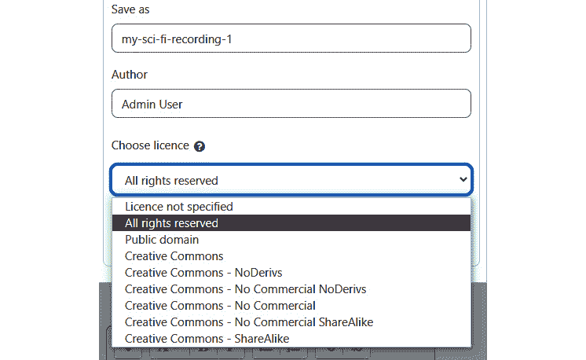

图 5.20 – 选择版权或许可选项

1.  点击**上传此文件**按钮；文件将被上传到您的 Moodle 系统中。

1.  如有必要，填写**外观**下的字段。您可能需要调整图片大小，因为 Moodle 默认会以原始大小显示媒体。

1.  点击**插入**按钮。媒体将被插入到页面中。

如果您正在插入播客，可能无法仅插入`.mp3`文件。在播客的情况下，您需要嵌入 HTML 代码。以下是一个 SoundCloud 的示例：

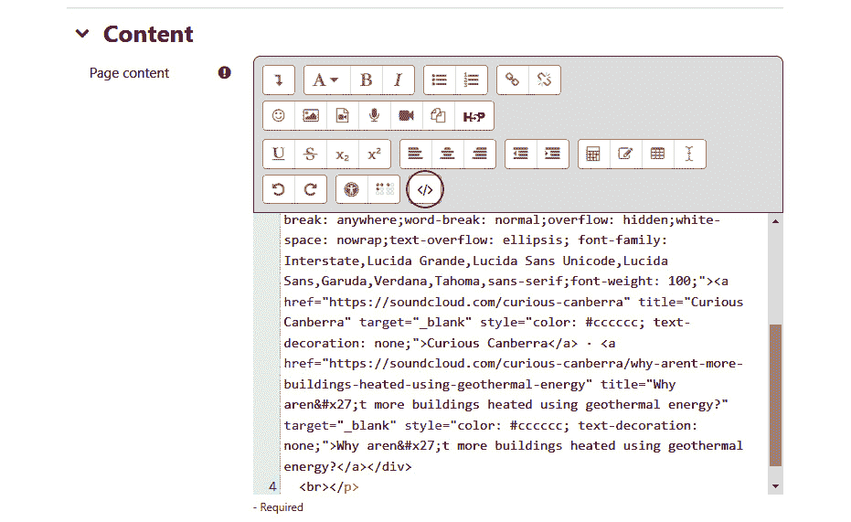

图 5.21 – 在编辑媒体描述时，您可能看不到媒体

保存粘贴的嵌入代码后，播客播放器将显示出来，它将包括播客中的任何图形：

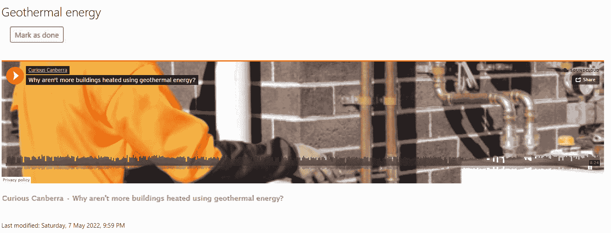

图 5.22 – 带描述的媒体播放器

保存描述后，媒体播放器和描述都将出现在窗口中。

要在页面上嵌入视频，请按照以下步骤操作：

1.  找到您想要链接的媒体。例如，您可能可以在几个不同的网站上找到视频。以下是一些：[`vimeo.com/`](https://vimeo.com/)，[`youtube.com`](https://youtube.com)，和[`www.ted.com/talks`](https://www.ted.com/talks)。

1.  检查材料的许可，以确保您有权按照您的意图使用它。

1.  页面上某个位置，您将看到一个按钮或链接，它将为您提供嵌入视频的 HTML 代码，无论是通过复制粘贴 URL 还是整个嵌入代码块：

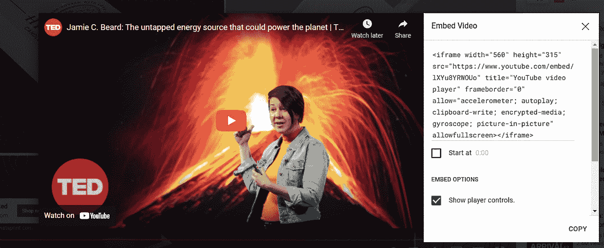

图 5.23 – 嵌入媒体

要嵌入媒体，请点击**分享**链接，然后复制并粘贴 HTML 代码，无论是链接还是完整的嵌入代码块。

1.  复制嵌入视频的代码。

1.  切换回您正在编辑的 Moodle 页面。

1.  在 Moodle 页面上，点击放置媒体出现的位置。

1.  点击**编辑 HTML 源**图标。如果您想添加文本和更多项目，可以这样做。请注意，Moodle 4.0 的 HTML 编辑器非常易于使用，并且会自动将媒体居中在页面中间：

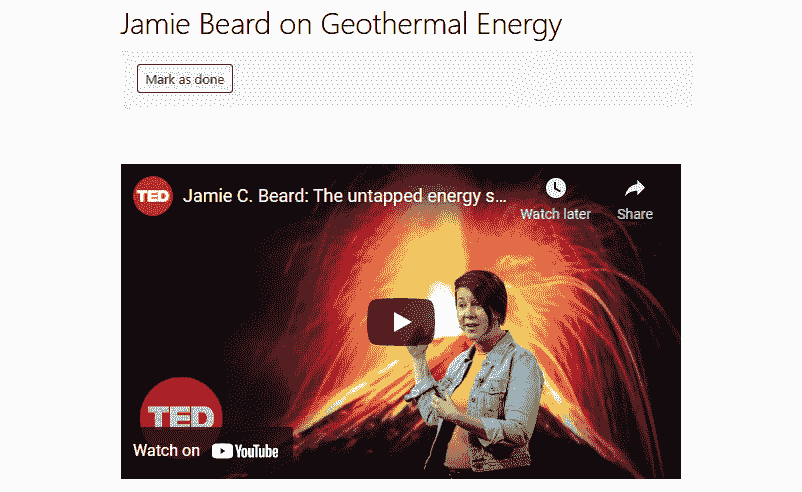

图 5.24 – 嵌入式媒体自动居中在 Moodle 页面中间

## 功能增强器

在具有同步网络直播（例如 Zoom）的混合课程中，您可能会发现人们的参与度不如您所希望的。有些人喜欢通过在**聊天**中包含定期的投票或意见问题来对抗观众冷漠。这是一个好主意，并且您可以保存响应作为历史参考和参与度。

如果您想保存投票和意见问题，您可以将它们作为 Moodle 中的选择问题构建，然后在 Zoom 的**聊天**部分简单地链接到它们。我建议学生打开两个窗口：一个用于 Zoom 会议，另一个用于 Moodle，他们可以在其中参与**选择**。通过将选择整合到 Moodle 中，观看录音的网络研讨会参与者仍然可以参与投票或意见问题。

一旦您将媒体等项添加到课程中，您可以为添加的项目添加标签，以便学生更容易识别它们。为了使导航更加方便并提高用户体验，让我们学习如何在课程页面上移动材料。

# 使用标签进一步组织您的课程

在 Moodle 中组织课程的主要工具是部分和标签。在本节中，我们将学习如何使用它们以及如何在课程页面上移动材料。

## 命名您的主题

在使用主题格式的课程中，您的主题会自动命名和编号，如下面的截图所示：

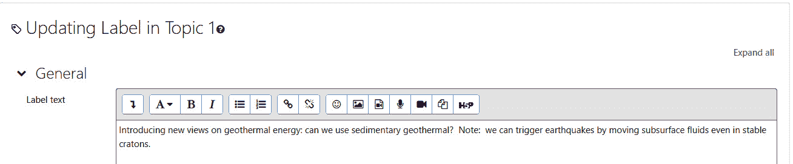

图 5.25 – 添加标签以进一步说明主题内容

您可以将标签移动到主题下方立即显示：

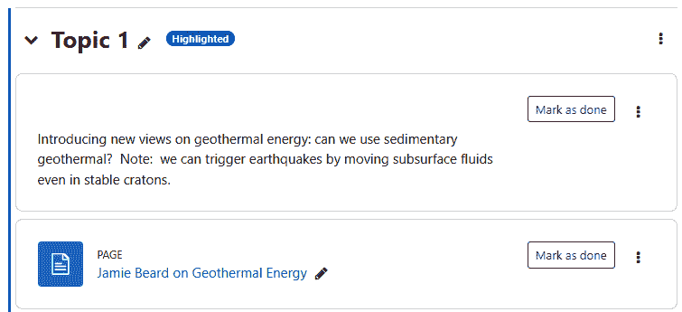

图 5.26 – 移动标签位置

您可能希望将图形添加到标签中以增加参与度。您可以通过打开标签并修改它来实现这一点。在这种情况下，我点击了`geothermal energy New Zealand`作为我的搜索词。成功了！我有相当多的选择：

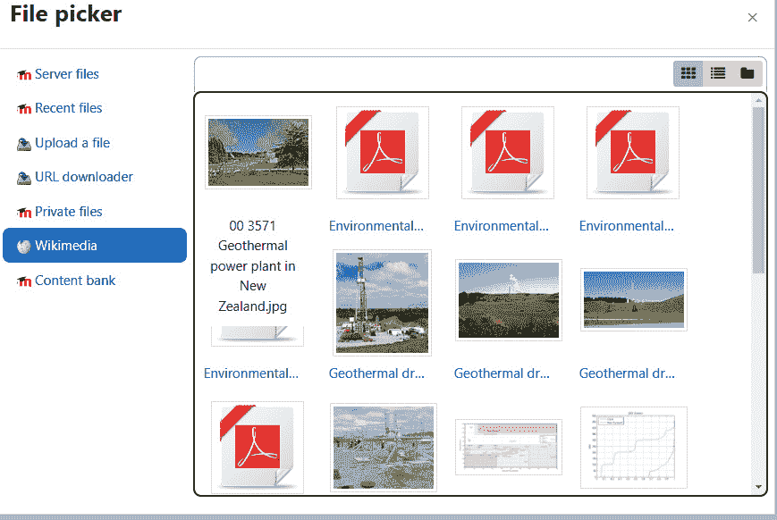

图 5.27 – 维基百科标签和图片

您可以通过添加标签并从维基百科或其他来源中选择来添加说明您主题的图形。

结果非常吸引人且引人入胜。标签看起来像是主题的一部分，这给了您添加能够吸引学习者的项目的机会：

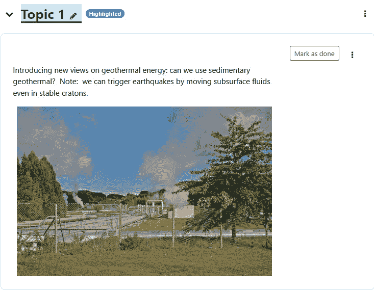

![图 5.28 – 使用标签描述图形]

在对标签进行所有必要的更改后，你可能想修改你主题的名称。要向**主题**添加名称和描述，请按照以下步骤操作：

1.  以教师或网站管理员的身份登录你的课程。

1.  在页面右上角，如果你看到一个名为**开启编辑**的按钮，点击它。如果它被称为**关闭编辑**，你不需要点击这个按钮。

1.  在主题编号旁边，点击**编辑摘要**按钮：

![图 5.29 – 要编辑摘要，请点击编辑摘要图标]

![图 5.29_B17288.jpg]

![图 5.29 – 要编辑摘要，请点击编辑摘要图标]

1.  你的**主题**的**摘要**页面将显示出来。你必须取消选择**使用默认章节名称**复选框。如果在这个字段中有复选框，你将无法编辑主题的名称或描述。

1.  在**章节名称**字段中，输入你的**主题**名称。

1.  在**摘要**字段中输入描述。这是一个功能齐全的网页编辑器，因此你可以输入文本、图形和媒体：

![图 5.30 – 配置摘要]

![图 5.30 – 图 5.30_B17288.jpg]

![图 5.30 – 配置摘要]

1.  保存你的工作。你将被返回到课程主页。主题的名称和摘要将显示出来。

## 在课程主页上重新排列/移动项目

当你构建你的课程时，你将向课程页面添加资源和活动。Moodle 允许你轻松地重新定位这些项目。它们重新定位如此简单，以至于我建议你甚至不需要担心在创建时将它们放在正确的位置。只需继续前进并创建 – 你可以稍后重新排列。

在课程页面上重新排列项目可以这样操作：

1.  以教师或网站管理员的身份登录你的课程。

1.  在页面右上角，如果你看到一个名为**开启编辑**的按钮，点击它。如果它被称为**关闭编辑**，你不需要点击这个按钮。

1.  将鼠标指针放在你想要移动的项目旁边的**十字准星**图标上。

1.  将项目拖动到课程页面上你想放置的位置，然后释放鼠标。

## “即时课程”包含公共领域的视频 – 这是一个好主意吗？

在过去几年里，教育视频的数量激增，而且它们通常质量非常高。例如，**美国农业部**（**USDA**）在其网站上提供了一系列食品检验培训视频：[`www.fsis.usda.gov/inspection/inspection-training-videos/regulatory-education-video-seminars`](https://www.fsis.usda.gov/inspection/inspection-training-videos/regulatory-education-video-seminars)。如果你是一所提供职业培训的学校，你可能会很高兴地发现存在如此高质量的资源，并且它们可以免费用于教育目的。

可能会诱使你简单地将视频上传到不同的模块中。你对自己说：“太好了！瞬间课程！”并且你告诉自己一切都很好。毕竟，视频包含了指令。但这种方法合法吗？这是一个完整的课程吗？简短的答案是“不是。”即使视频中有学习目标，你仍然需要在教学策略中构建教学视频。

因此，如果你足够幸运，找到了与你的目标完美一致的公共领域资源，你仍然需要创建一个课程地图和一个 CDD，包括本章前面讨论的元素。

# 摘要

在本章中，我们探讨了 Moodle 中可用的资源。它们是非交互式课程材料（书籍、页面、URL、文件和标签），构成了大多数在线课程的核心。

首先添加静态材料，这让你有机会思考这些材料将如何被讨论和使用。之后，你可以添加更多动态资源，并将它们与课程目标和评估联系起来。Moodle 4.0 的目的是增强你的学习体验，同时给你更多机会以触发思考和学习目标及课程目标的方式部署资源，并帮助你展示掌握程度。

本章我们强调的是选择、排序和部署资源的重要性，以确保它们始终推进课程目标并帮助学生实现学习目标。我们还讨论了如何融入包括混合异步/同步交付在内的当前实践，特别是当有意愿包括随后被记录（附有字幕）的网络研讨会时。

为学生组织资源，使他们知道哪些章节或单元与之对应，这有助于在他们心中培养自信和“我能做到！”的态度。我们还提供了功能提示，以增强学生参与混合同步和异步课程的战略。

在下一章中，你将学习如何添加一些互动材料。学生将不再只是阅读和查看你发布的材料，而是将在线完成作业并与教师和同学互动。
