# 第六章：*第六章*：添加作业、课程、反馈和选择

课程活动使学习者能够与讲师、学习系统或彼此互动。它们还允许学习者通过在完成活动时获得徽章或证书来建立自信。最重要的是，课程活动应与课程的学习目标相联系，并对应认知领域的适当知识水平，正如我们在*第四章**，管理资源、活动和条件访问*中回顾的布鲁姆分类法所示。如果你确保你的课程规划的每一步都整合了学习目标与适当的内容和活动水平，以及每一步都有可衡量的成果，那么你的指导策略将非常有效。你的机构可能需要定期对其课程、指导策略、指导交付系统（学习管理系统）、材料和评估进行审查，以维持其认证或认证状态。除了开发有效的课程内容和评估外，本章还将帮助你吸引学习者，并使他们能够坚持学习以实现他们的学习目标。

在上一章中，我们学习了如何添加资源，或静态课程材料，如网页、链接和媒体。我们看到，在选择了**开启编辑**选项后，所有活动都是从**添加活动或资源**菜单中添加的。在本章中，我们将概述所有活动，然后更详细地探讨**作业**、**课程**、**反馈**和**选择**。我们之所以从这些活动开始，是因为它们通常构成了课程的基础。

此外，我们将回顾布鲁姆分类法如何帮助你将学习目标与可衡量的评估相一致，以及如何将此知识应用于机构的认证和许可要求。

本章将涵盖以下主题：

+   指导策略

+   学习目标

+   能力和掌握学习定义

+   定义

+   理解作业

+   设置课程

+   开发反馈模块

+   探索选择

在我们学习本章的过程中，我们将学习如何添加几种类型的交互式课程材料：作业、课程、选择和反馈。我们还将讨论如何组织内容以构建微能力，然后确认微学习里程碑并生成证书（这些证书是单独安装的）和徽章。

到本章结束时，你将能够构建提供教学材料的同时，通过给予反馈和指示他们在实现学习成果的道路上的位置来激励学习者的课程内容。你还将能够开发徽章和证书，鼓励学习者坚持并完成课程。

# 指导策略

在本书的前面部分，我们讨论了教学策略，并且是以全局性的角度进行的。现在，我们将探讨教学策略如何在您开始应用原则并让学生进行活动（活动）时发挥作用。

您的教学策略涉及通过战略性地放置教学材料、参与者、课程、评估、反馈以及掌握的可分享证据（如证书和徽章）来规划如何实现学习成果。另一种思考方式是，您的教学策略是您如何将学习目标映射到课程材料、活动和评估上，以及您如何让学习者在学习过程中保持兴奋，并在他们完成模块或课程时给予奖励。

当您开始组织课程时，请遵循以下步骤：

1.  检查您课程的总体目标。

1.  检查学习目标。

1.  描述您将如何衡量成果。

1.  检查与学习成果和课程内容相关的活动。

1.  检查最适合您学习者的活动。

1.  通过开发徽章来确定您如何最好地激励您的学习者。

1.  确定您的机构是否要求您与能力框架保持一致。如果您寻求认证或批准颁发证书，这一点尤为重要。

按照这些步骤将帮助您组织作业，并创建一个您可以用于其他课程的模板。

在您为认证审查做准备时，确保您的教学策略在整个机构中保持一致。这意味着您的难度水平和教学材料的类型应该是统一的。此外，当涉及到评估本身时，确保它们不仅与布鲁姆分类法保持一致，而且反映了机构的愿景和使命。

您的教学策略应以学习目标为基础。在下一节中，我们将回顾如何使用和编写学习目标。

# 学习目标

在本书的前面部分，我们提到了学习目标。现在，我们将探讨如何将这一概念应用于活动，并专注于活动。您选择的学习目标应清晰简洁地表达您课程的绩效成果。它们还将出现在课程大纲中。请记住，有效的学习目标使用与布鲁姆分类法相关的行动动词，并导致可衡量的行动，这些行动直接与课程单元或整个课程相关。布鲁姆分类法按层次排列，基本成果如**识别形成**位于底部，更复杂和抽象的成果如**创造**位于顶部。将层次的不同级别视为构建块。

您可以使用以下过程来编写学习目标：

1.  确定您希望学习者能够做到什么。

1.  确定布鲁姆分类法的知识水平。

1.  选择一个与可衡量、可观察的行为相关的动词。

1.  添加标准以细化结果，使其具有定性或定量具体细节。

让我们回顾一下布卢姆分类法。如您所回忆的那样，布卢姆分类法被开发为一个由越来越复杂的层次结构组成的构建块序列。简单来说，它是一个层次结构，帮助你描述、映射和衡量认知领域的知识。

我们将从学习目标开始。布卢姆分类法是一个金字塔；底部是最基础的，它与记忆有关。因此，我们可以从与记忆有关的学习目标开始。例如，我们可以说，“识别世界上使用地热能的五个地方”。

如*图 6.1*所示，我们从金字塔的底部向上移动到越来越复杂的任务。每个任务都有相关的动词，这将使评估和确定个人是否达到学习目标变得更加容易。

金字塔的顶端是**创造**。它位于等级体系的顶峰，因为它汇集了较低领域的认知活动，需要综合分析和评估。对于将升至第六级别的课程的学习目标来说，可能比最初看起来要容易。关键是考虑一个活动，作为教师，你可以通过这个活动正确地评估或评估。例如，创建相应的活动可以是“开发一个项目”或“发明一种新的杂志”：

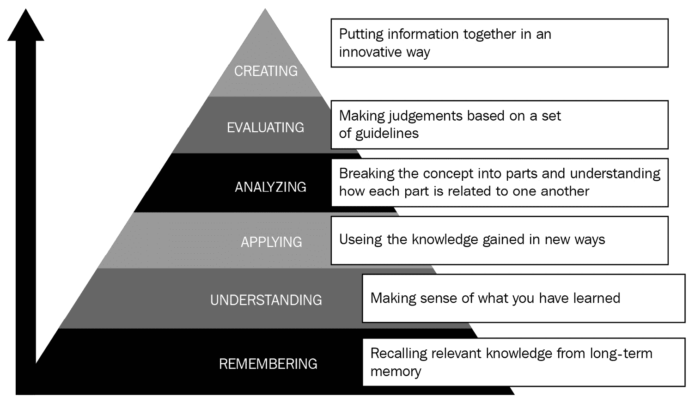

Figure 6.1 – 布卢姆分类法的金字塔形状包含最基础的动词，这些动词衡量认知领域，底部，以及顶峰处最复杂的动词

现在我们已经回顾了学习目标和布卢姆分类法作为制定教学策略的起点，我们将学习使用能力学习或掌握学习策略。

# 能力学习定义

**能力学习**（通常被称为**掌握学习**）是一种学习方法，它制定了一系列标准，这些标准是课程的学习成果，同时也对应于一个项目或计划的结果。能力框架可以被导入 Moodle。

能力学习通常由监管机构或管理机构要求，以确保学校和学习教育机构的一致性。在这种情况下，特别强调评估。很多时候，它们是标准化测试，而不是论文测试或演示项目。在确保考试心理测量有效方面，我们非常小心，因为完成考试意味着一个人已经证明了其能力，甚至是对概念的掌握。

能力学习以课程成果（与布鲁姆的分类法相关联）作为课程材料和，最重要的是，标准化测试的基础。

当能力得到外部确认时，可以以完成活动后生成的徽章的形式出现。它们也可以通过在 Moodle 中直接生成的报告，在能力框架内实现。

现在我们已经探讨了展示知识或技能掌握或能力的方式，让我们学习如何构建与学习成果相联系的任务。

# Moodle 活动

Moodle 4.0 极大地改变了可用的图标，并增强了其活动的功能，以便它们更紧密地连接到仪表板和活动日志，以及与移动应用有更多功能。在前一章中，我们探讨了资源，以及一些可以提供课程内容的活动，因为它们提供的内容包包括交互式材料。在 Moodle 中，活动是学习者可以与之互动的元素。活动用于以特定顺序提供内容，评估学习者的进度，并保持学习者的兴趣和参与度。

下表包含所有 Moodle 活动的列表，可以作为你在构建课程时的“一站式”参考点。由于活动是课程的核心，你需要仔细选择活动，并确保它们与课程目标和学习目标相一致。

你还应该记住布鲁姆的分类法。注意，下表包含 Moodle 4.0 的新图标缩略图，以及每个活动的简要描述。旁边，我们提供了每个活动的优缺点，以及一个列出它们常见用途的列（这些用途也包含在描述、优点和缺点中）。

Moodle 4.0 中的活动已经简化并扩展，这使得它们更容易使用。一些功能已经改变，这也简化了它们。例如，如果你习惯于在 MoodleCloud 中使用 Moodle 3.11（或更早版本），你会注意到有三个活动不再出现。**出勤记录**、**清单**和**自定义证书**已经消失。不用担心！这并不意味着你不能弄清楚谁参加了课程。如果你使用**课程**，你可以在活动日志中找到相关信息。至于**清单**，所有必需的活动和截止日期现在将自动显示在仪表板上，这将把所有有截止日期的事项整合到日历中。如果你希望自动生成证书，并且错过了 MoodleCloud 付费套餐中包含的**自定义证书**活动，不用担心。Moodle 4.0 已经更新了**徽章**插件，这使得生成可以在你的网站、LinkedIn 页面、社交媒体等地方显示的徽章变得更容易。

现在让我们回顾一下 Moodle 的活动，并逐一仔细查看。我们将从查看常用活动开始：

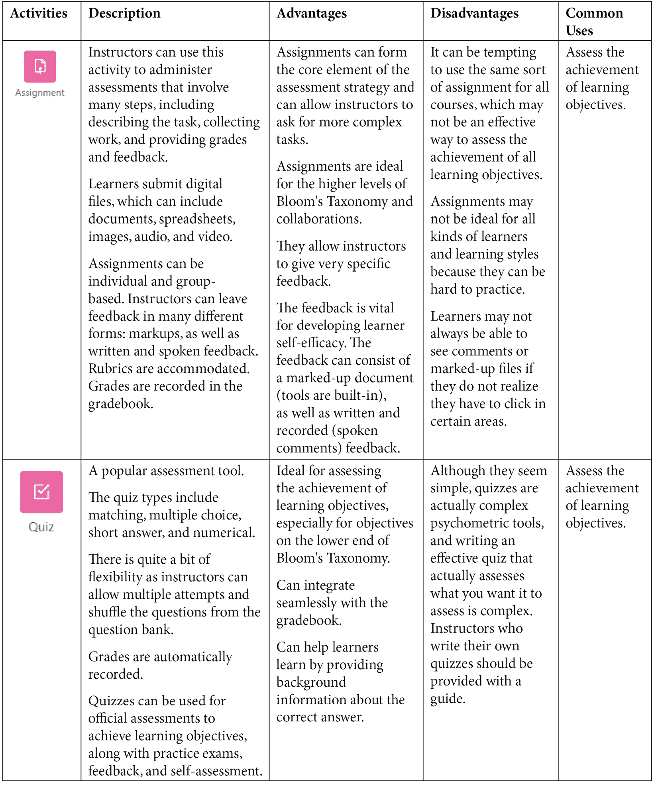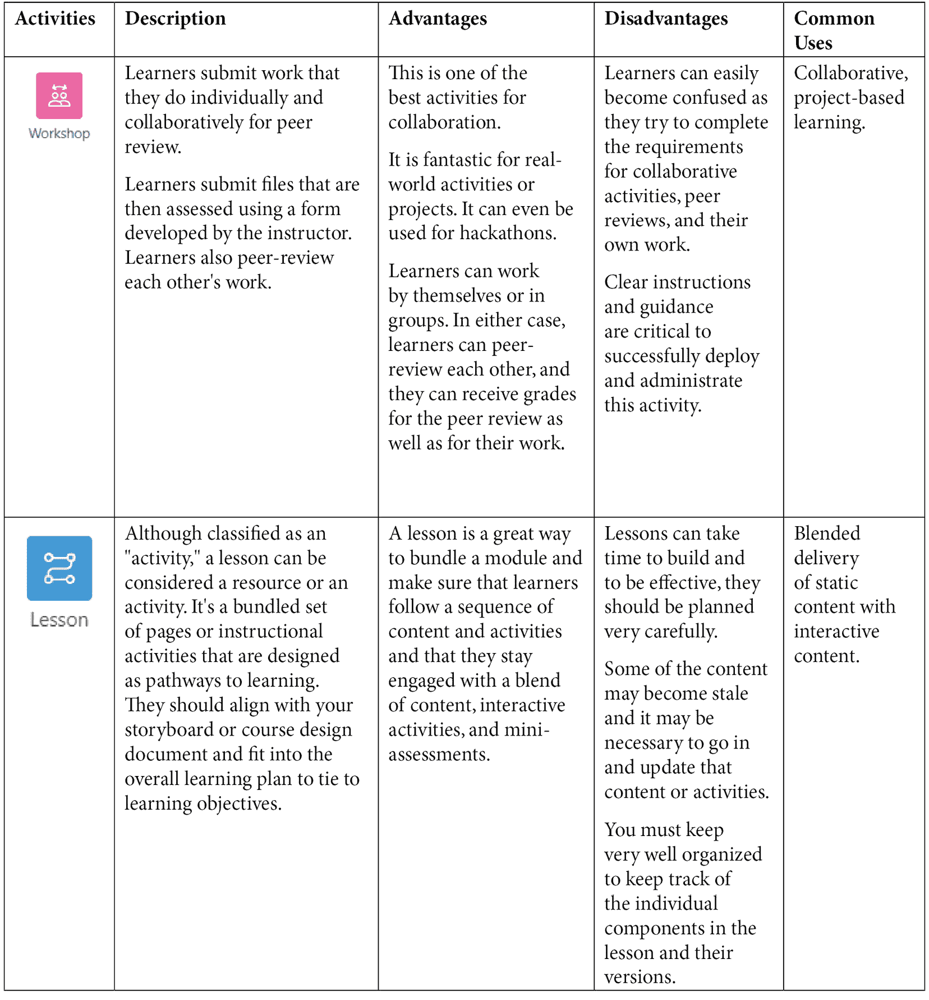

图 6.2 – 常用活动

Moodle 有许多活动强调互动交流和协作。一些活动强调互动交流，而另一些则很容易融入评分活动中，可用于评估。以下表格提供了这些活动的概述：

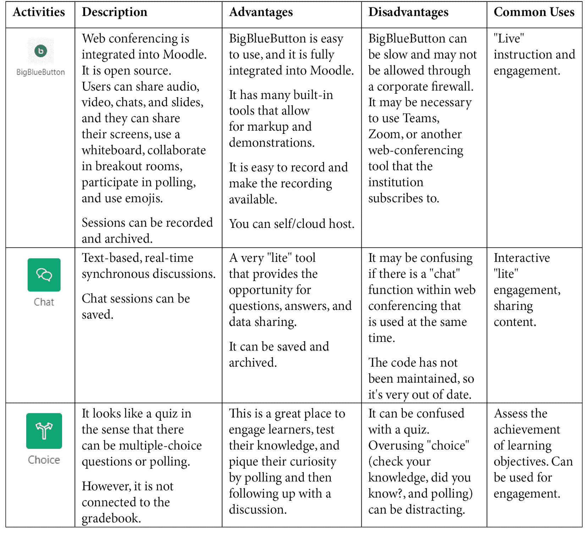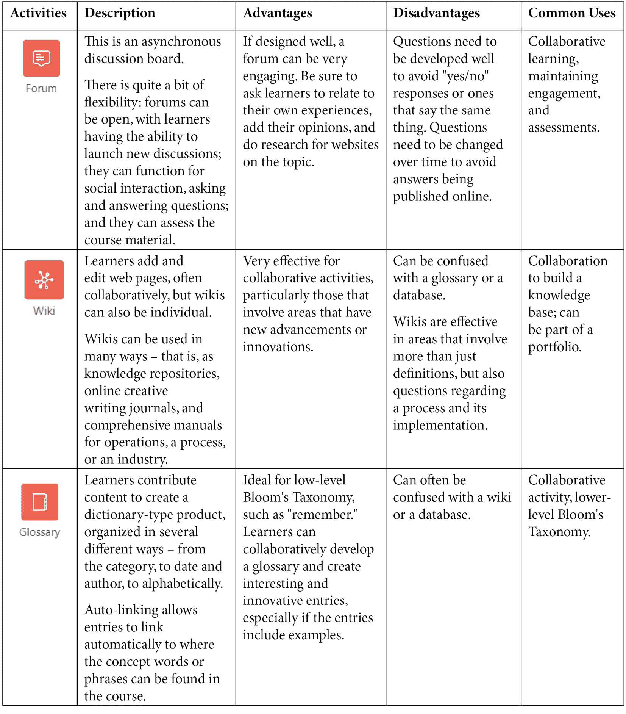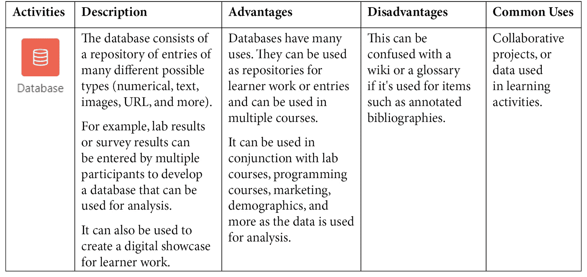

图 6.3 – 以合作为重点的活动

Moodle 有一些应用程序专注于收集用户反馈。此外，Moodle 还使导入不同预先准备好的包成为可能。以下表格提供了这些活动的概述：

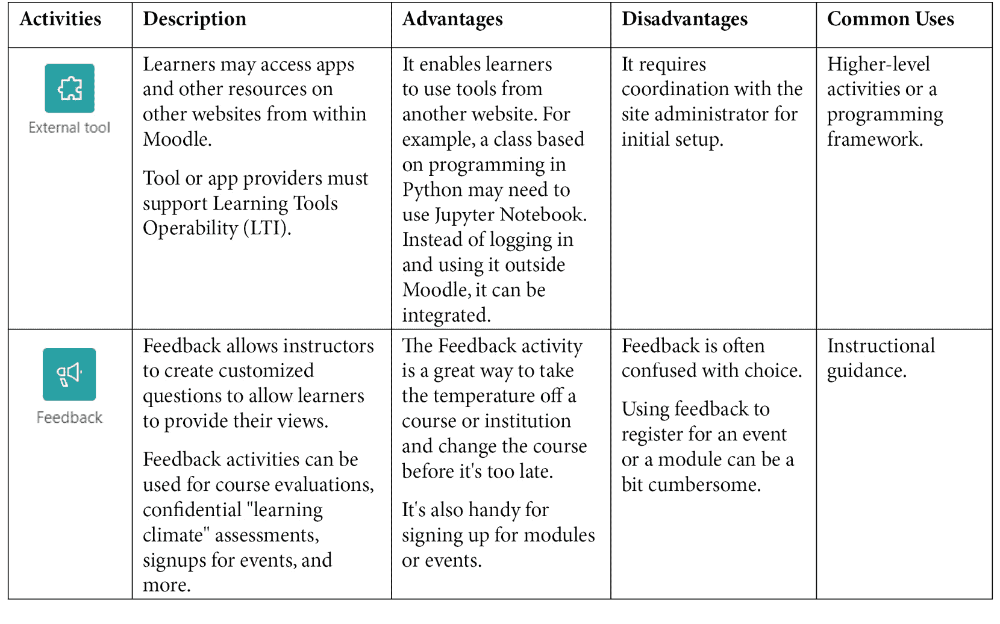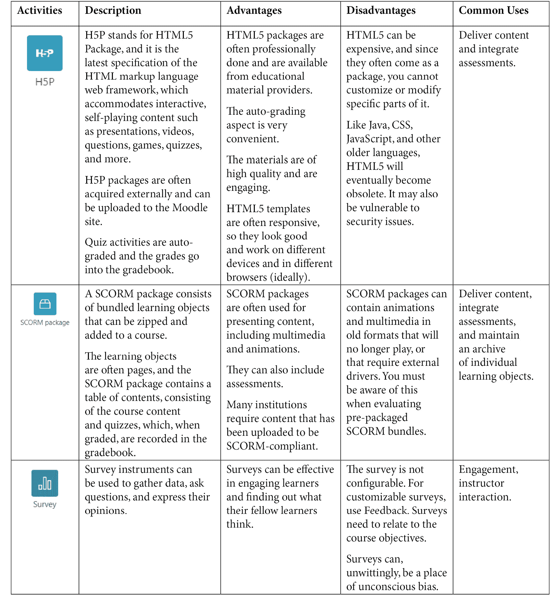

图 6.4 – 帮助导入包和获取反馈的工具

现在我们已经回顾了活动的功能，包括它们的使用以及使用它们的优缺点，让我们看看如何添加活动。

# 添加活动

添加一个活动与添加任何其他活动相同，所以现在让我们来了解一下。我们将在本节中讨论所有活动共有的内容。

让我们考虑一门名为《人人皆可学狗美容》的课程。一旦我们创建了这门课程并确定了其主题，我们就可以添加活动。

和往常一样，让我们首先在右上角打开**编辑模式**：

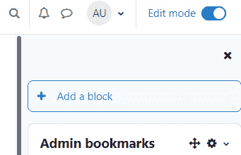

图 6.5 – 打开编辑模式

现在，让我们看看主题。点击**添加活动或资源**，然后从菜单中选择一个：

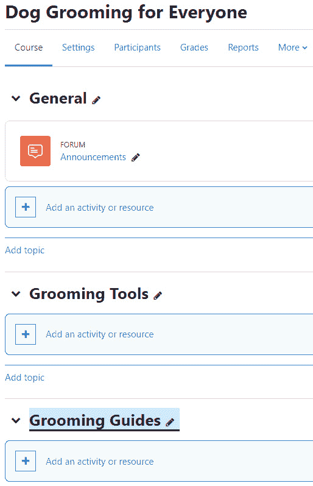

图 6.6 – 修改主题以自定义其内容

当您点击**添加活动或资源**时，相应的菜单将弹出。我已选择**活动**，这样我只能看到活动。如果您忘记了每个活动的内容，您可以点击小**i**图标以获取更多信息。请注意，它只提供信息，不包括在方便的“一站式”表中显示的优点、缺点或常见用途：

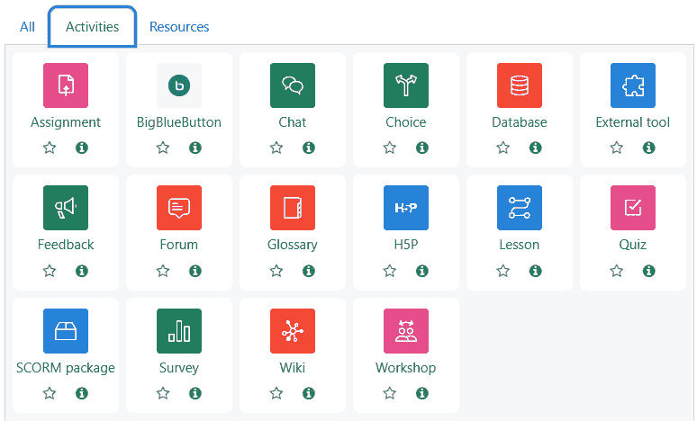

图 6.7 – 活动菜单。其中 "i" 代表信息

现在我们已经概述了所有活动，让我们学习如何选择一个并构建它。让我们从 Moodle 的作业活动开始。

# 选择作业

如果您希望学习者做或创建某些内容，然后对结果进行评分，您将需要一个作业。请注意，如果您正在开发包含同步内容（例如网络会议，例如 BigBlueButton、Teams 或 Zoom）的混合课程，您可能希望准备可以与该“现场”讲座一起完成的作业。它们可能涉及协作和小组解决方案。对于同行评审，请使用研讨会活动。

让我们从 Moodle 的作业活动开始，这将给我们一个机会将几个活动结合起来，创建一个评估策略。

# 理解 Moodle 中的作业

如果您希望您的学习者证明他们已经掌握了一组技能或知识体系，您需要开发一种评估方法。一种好的方法是开发一个作业。Moodle 中的作业活动为您提供了使用测验检查学习者知识的空间，允许学习者练习直到达到及格分数，并展示他们已经达到学习目标。

## 添加作业

让我们先创建一个作业。我们可以通过点击**添加作业**，然后从包含 Moodle 所有活动的菜单中选择**作业**来实现。在这种情况下，我们将把作业添加到**适合所有人的狗狗美容**课程中。我们将命名作业为**狗狗美容工具回顾**。

这里您可以添加作业的描述以及作业的说明。请注意，动词与布鲁姆分类法相匹配且可衡量。在这种情况下，动词是“解释”。

当你添加描述时，你可以包括一个图形来说明它。请记住，Moodle 功能强大且极其灵活。我们在这里处理基本技能，并没有涉及一些更复杂的定制方式：

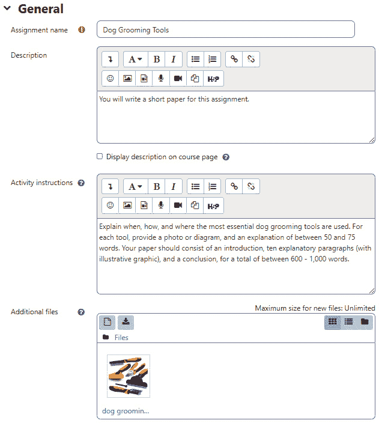

图 6.8 – 添加名称、描述、活动说明和附加文件

一旦你添加了作业，你需要对其进行自定义。你可以通过点击**设置**来完成，这将允许你编辑作业。它将指示你正在**在狗美容工具中更新作业**。一个屏幕将打开，包含一个当你点击时会展开的主题列表。每个主题都将允许你修改作业的各个方面。请记住，这种一般方法在 Moodle 4.0 中是一致的，所以一旦你在创建作业时感到舒适，你在其他活动中也会感到舒适：

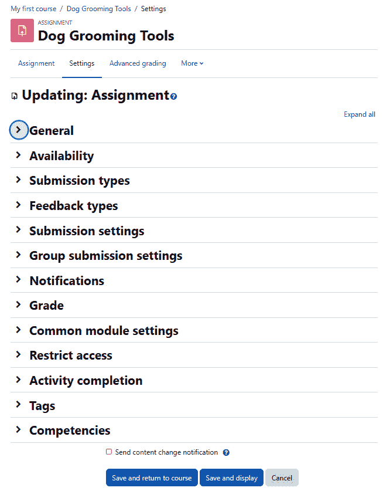

图 6.9 – 作业活动的选项菜单

当你查看你的课程设计文档或故事板，并将作业与学习目标和布卢姆分类法的水平相匹配时，你会发现作业在分类法的中间到较高水平上非常好。例如，你可能要求学习者写一篇论文，解释每个狗美容工具何时、如何以及在哪里使用。

## 作业的要求

在我们的案例中，我们将要求学习者写一篇论文，解释何时、如何以及在哪里使用狗美容工具。然而，我们也可以要求学习者提交每个工具的图片或通过视频演示来解释。简而言之，在作业中，你可以要求学习者执行以下操作：

+   提交一个或多个数字文件。

+   写些东西。

+   在 Moodle 之外做些事情。

## 可用性

理解作业的一个方面是能够使作业对学习者可用。能够在掌握后提供作业可以非常有激励性，并且还可以帮助你避免让学习者陷入内容超前的困境。学习者成功的关键是保持进度并在课程中取得进步。你如何提供作业可以帮助通过阐明工作流程并帮助他们管理时间来激励学习者，以便他们成功。因此，**可用性**设置可以是帮助你帮助学习者发展清晰方法的基石，不仅是为了保持对应该做什么的认识，也是为了优先处理任务：

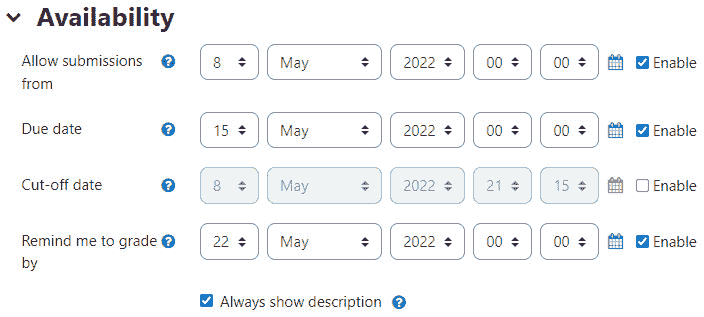

![Figure 6.10 – 可用性设置屏幕你可以使用**可用性**设置来设置学习者提交作业的时间限制。不要与**限制访问**下的**允许访问**设置混淆。**允许访问**设置确定学习者是否可以在课程页面上看到作业，或者作业是否完全对学习者隐藏。在学习者看到并选择作业后，**可用性**设置确定学习者是否可以向教师提交工作。注意，这里有一个**截止日期**和一个**截止日期**。如果您没有启用**截止日期**，作业将在截止日期停止接受工作。如果您启用并输入**截止日期**，作业将在截止日期和截止日期之间接受工作。这些工作将被标记为逾期。当学习者点击一个作业时，Moodle 会显示作业的描述。您通常使用描述来告诉学习者如何完成作业。如果您启用**始终显示描述**设置，如果学习者在任何时间进入作业，学习者将看到描述。如果您希望学习者能够提前准备和完成工作，这是可以的。如果您禁用**始终显示描述**设置，如果学习者在**允许提交日期**之前进入作业，Moodle 将隐藏作业的描述。您可以使用此功能来防止学习者提前工作。即将到期的作业将出现在**即将发生的事件**块中。如果您没有设置**截止日期**，默认情况下，它将被设置为今天（您创建作业的那天）。这将使作业在**即将发生的事件**块中显示为逾期。请确保您为作业设置一个合适的**截止日期**。## 提交类型当我们开始思考我们希望我们的学习者完成的论文或演示文稿的类型时，让我们花一点时间思考一下在**作业**下可用的提交类型：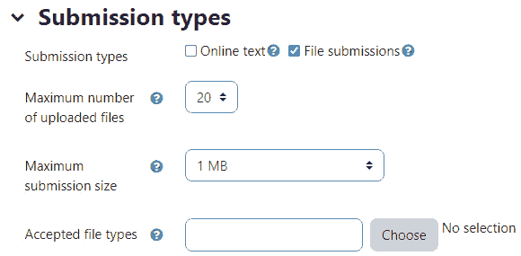

图 6.11 – 提交类型设置屏幕

注意，您可以要求人们在一个文本框中输入（**在线文本**）或者您可以启用**文件提交**。

### 提交数字文件

任何可以在计算机上上传的内容都可以上传到作业中。然而，Moodle 将对上传文件的大小进行限制。在规划课程时，这是一个需要记住的重要方面。例如，如果您要求您的学习者创建一个数字照片，这个选项可能效果很好。

记住，Moodle 站点配置了可以上传到 Moodle 的文件大小限制。如果你要求你的学习者创建一个视频，你可能需要找到另一种方式让他们发送给你他们的大型视频文件。你可以要求学习者提交上传到云（Google、Dropbox 等）的数字文件，或者你可以要求他们使用机构提供的平台（如 Zoom 或 Teams）创建音频或视频，然后从该平台查看视频或收听音频。另一个选择是他们创建一个视频，然后将其上传到他们的 YouTube 账户，并链接到它。这是一个提到防病毒软件可能会使上传失败的好时机。务必与网站管理员联系，确保一切配置得当，以避免被阻止。

### 要求学习者提交在线文本

在在线文本作业中，你需要要求学习者在一个在线文本编辑器中输入文本。这个文本编辑器是作业活动的一部分。

如果学习者更习惯在文字处理程序中编写文本，他们可以将它复制并粘贴到文本编辑器中。

你不能将图形粘贴到 Moodle 的在线文本编辑器中。每个图形都必须通过使用文本编辑器的**插入或编辑图片**图标上传并放置到文档中。或者，你可以在文本框中粘贴和复制之前，点击**管理文件**图标来提交一个文件，这样图形就可以作为单独的文件上传。这种方法的优点是你可以轻松地在框中做出评论并提供反馈。

### 通过利用 Zoom 提交现实世界中的作业

让我们看看如何使用 Moodle 来跟踪“现实生活中的”学习。你可以使用一个作业要求学习者告诉你他们已经完成了 Moodle 之外的活动。例如，你可以指示你的艺术学习者建造一个户外雕塑。然后，他们的提交将包括通知你，“它已经建成，准备好供你审阅**”。

另一种方法是他们可以拍照，然后创建一篇博客文章，其中包含他们项目的文本部分以及照片。以下是一个在*Blogger*账户上发布的例子：[`fringejournal.blogspot.com/2018/04/installation-1-i-heard-voices-of-angels.html`](http://fringejournal.blogspot.com/2018/04/installation-1-i-heard-voices-of-angels.html)。

如果学习者以团队（虚拟或现场）的形式在项目上工作，他们可以通过开始一个 Zoom 会议来记录他们的经验，在这个会议中，他们轮流讨论他们的经验，然后分享他们的屏幕，在那里他们可以包括照片、PowerPoint 演示文稿或屏幕截图。这种现实世界项目的关键是有一个被记录的 Zoom 会议。然后，可以下载并保存 MP4 视频文件，并且可以在 Zoom 内部共享视频。

## 评分作业

本节展示了 Moodle 在评分作业方面的灵活性以及如何使其在提供具体反馈和及时响应方面更加有效，从而激励学习者。

在前面的章节中，你学习了学习者如何提交作业。当作业需要评分时，Moodle 将通过在讲师的**仪表板**上显示消息来通知讲师。然后他们可以打开作业并评分。提交的作业可以打开进行评分和提供反馈。

作业还可以配置为向每位教师发送自动电子邮件以提醒他们已提交的作业。

Moodle 不直接提供需要评分的作业的链接，但提供指向课程的链接。

小贴士

系统管理员可以配置 Moodle，以便用户登录时自动转到用户的**仪表板**页面。这可以在**管理** | **站点管理** | **外观** | **导航**下完成，并选择**我的主页**作为默认主页。

作业的**评分**页面允许讲师打开所有提交并为每个提交输入成绩：

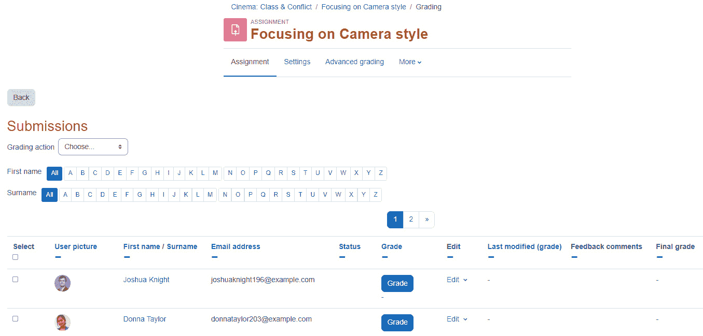

图 6.12 – 评分摘要显示了讲师对学习者工作的状态

在创建作业时，你可以启用反馈评论和反馈文件。如果你这样做，讲师在评分作业时将能够输入评论和文件。

### 反馈类型

即使在作业提交后给出反馈，你也必须预测将给出哪种类型的反馈。这通常在你设置可用性时完成，因为你不仅设置了教学材料和评估的可用性参数，而且还设置了学习者将如何接收反馈。

在前面的例子中，学习者不仅收到了成绩，还收到了来自教师的额外反馈。反馈的形式是教师写的评论，以及教师上传的文件。讲师可以给出反馈评论，注释 PDF 文件，并上传反馈文件。你还可以勾选复选框以启用离线评分表。这可以在**反馈类型**设置下启用：

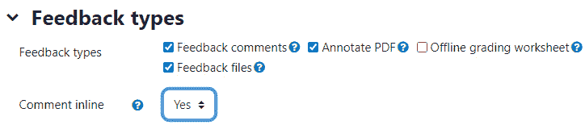

图 6.13 – 反馈类型设置

包含所有作业列表以及教师输入成绩的地方的`.csv`文件。然而，下载评分表并不会下载学习者提交的材料。如果教师想要离线查看提交，他们必须单独下载。

如果启用了离线评分，当教师点击 **提交** 时，将出现一个下拉菜单，**评分操作**。您将拥有所有选项，包括教师将在作业的评分页面看到 **下载评分工作表** 选项，如图 *图 6.12* 所示。路径是 **课程名称 | 作业名称 | 查看所有提交 | 评分操作**。

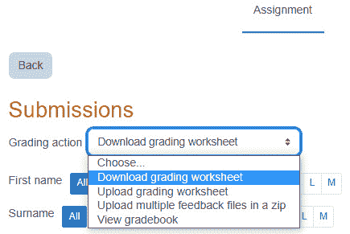

](img/Figure_6.14_B17288.jpg)

图 6.14 – 下载评分工作表选项以评分作业

### 提交设置

**提交设置** 决定了在学习者提交作品时 Moodle 的行为：

](img/Figure_6.15_B17288.jpg)

图 6.15 – 提交设置

**要求学生点击提交按钮** 设置决定学习者是否必须一次性提交作业，或者学习者是否可以将提交保存为草稿并在稍后提交。如果您选择此设置中的 **是**，当学习者创建提交时，Moodle 将显示一个 **保存** 按钮。在学习者保存提交后，当学习者进入作业时，他们可以选择编辑已保存的内容或提交。

**要求学生接受提交声明** 设置决定 Moodle 是否显示声明工作属于学习者。您可以在提交时添加自动反馈，要求学生保证学术诚信。请注意，这是一个网站范围的设置。导航路径是 **网站管理 | 插件 | 活动模块 | 作业 | 作业设置**。

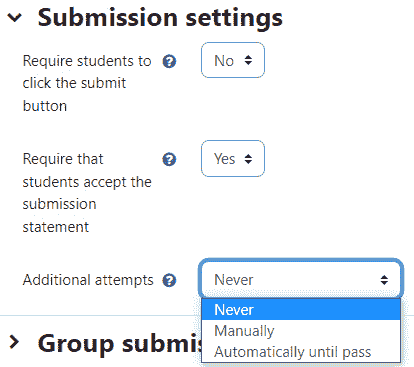

](img/Figure_6.16_B17288.jpg)

图 6.16 – 要求学习者接受提交声明，这可能包括学术诚信声明

在 **允许学习者改变主意** 部分中，我们看到了当教师重新打开作业时学习者的样子。**附加尝试** 设置决定教师是否以及如何允许学习者重新提交作业。请注意，重新提交将替换原始提交。

选择 **从不** 意味着教师不能重新打开作业以允许学习者重新提交他们的作品。**手动** 意味着教师可以重新打开作业。

**自动直到通过** 意味着作业将保持开放状态，直到学习者获得及格分数为止——也就是说，如果教师给学习者的提交评分低于及格分数，Moodle 将自动允许学习者重新提交。

要使用 **自动直到通过**，您必须为作业设置及格分数：

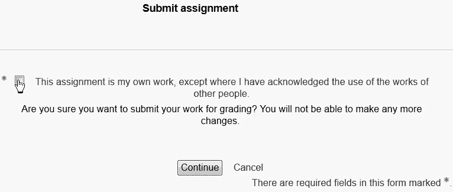

](img/Figure_6.17_B17288.jpg)

图 6.17 – 编辑评分以设置作业的及格分数

然后，选择分配的*编辑*图标（形状像齿轮）进行编辑。这将带您到一个页面，您可以在此处输入分配的及格分数。

### 组提交设置

Moodle 允许您将班级中的学习者和教师分配到不同的组。

有关更多关于组的信息，请参阅*第十一章*，*组和队列*。

在作业中，将**学习者以组为单位提交**设置为**是**意味着每个教师创建的组将作为一个组一起提交他们的工作，并且组的所有成员都将获得相同的成绩。

如果您将**要求所有组员提交**设置为**是**，则组的每个成员都需要点击**提交**按钮以最终完成提交。如果您将其设置为**否**，则组的任何成员都可以为整个组提交作业。然而，即使只有组的一个成员提交了作业，反馈和成绩也会应用于组的所有成员。

### 通知

**通知**设置确定评分者是否会在学习者（或组）提交作业时收到消息。

Moodle 中的每个用户都可以选择他们想要接收消息的方式。这是在**偏好 | 用户账户 | 消息偏好**下完成的。

然后，可以限制为仅接触并指出电子邮件偏好。

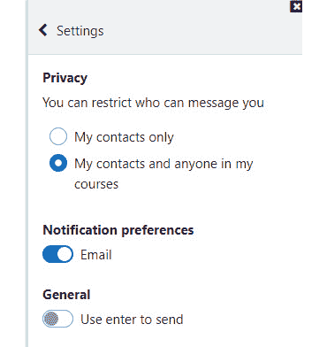

图 6.18 – 配置接收消息的方式

如果您的电子邮件应用程序允许您根据主题行和发件人过滤电子邮件，您可以使用该功能自动将有关作业提交的通知放入特定文件夹。

小贴士

电子邮件警报在允许学习者按自己的节奏学习的课程中特别有用，因为除非您检查课程并查看成绩册，否则您不知道他们完成了哪些活动。

## 常见模块设置

此屏幕将允许您确定课程是否可以在课程页面上被学习者看到。它还包括一个 ID 号，并允许您将其设置为**组模式**，这意味着作业将完全不同，适用于组。

## 限制访问

您可以通过**日期**、**成绩**或**用户配置文件**来限制学习者访问，或者通过您自己的嵌套限制集来使访问仅在特定条件下生效。

## 活动完成

此屏幕是学习成功的有用工具，因为它允许学习者手动标记活动是否完成。或者，您可以设置条件，一旦满足您设定的条件，活动就会显示为已完成。学习者通常会被通过课程看到他们的进度所激励：

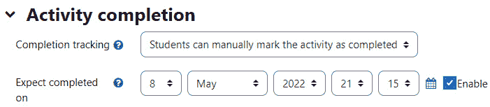

图 6.19 – 活动完成设置屏幕

## 标签

Moodle 4.0 利用元标签和社交媒体中使用的类型方法。给作业添加标签可以帮助学习者识别哪些内容项和活动与他们的学习目标和课程目标相一致：

图 6.20 – 标签配置设置屏幕。

## 技能

如果您的机构使用成果评估或要求证书或学位的技能，Moodle 4.0 允许您添加它们，并将作业与它们对齐。一旦您添加了技能并设置了及格分数，学习者将看到当作业完成后，**技能**框被勾选：

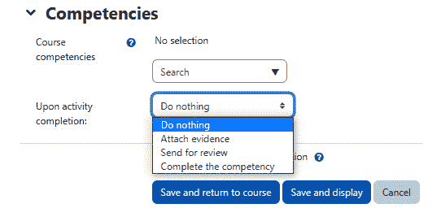

图 6.21 – 作业活动的能力设置屏幕

在整理完作业后，您可能希望组织它们，以便它们能够自适应地流动，这样学习者就可以在需要时自动复习和进行补救活动。在下一节中，您将通过设置课程来学习如何做到这一点。

# 设置课程

课程是一种复杂且强大的活动类型。本质上，课程是一系列展示信息和问题的网页。设置课程需要一些时间，但它们非常值得投资，因为它们结合了适应性学习，并且可以在学习者未能展示掌握时引导他们进行补救活动。如果他们完成了一个活动，它们将引导他们进入其他内容和活动。课程在结合同步辅导或面对面交付的混合课程中很有用，因为它们可以标记出学习者可能需要更多帮助的地方。

在您决定使用课程之前，熟悉其优缺点。

Moodle 课程可以是将指导和评估结合在一起的有力方式。课程活动提供了网页的灵活性、测验的交互性和分支功能。关键是规划您的课程并制作故事板。例如，对于我们的课程“适合所有人的宠物美容”，您可以创建一个名为“宠物美容基础：品种及其特征”的课程。您可以要求不同的内容项和活动。一旦学习者通过测验，他们就可以继续前进。

要添加**课程**，请点击**添加活动或资源**，然后从菜单中选择**课程**：

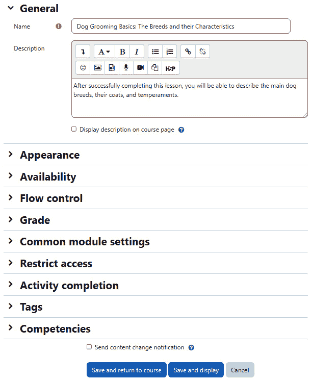

图 6.22 – 课程活动的常规设置屏幕

您将有机会为您的课程命名并添加描述。在**常规**选项卡下方是其他在点击时展开的项目。请注意，其中一些与**作业**活动中的相同。然而，**外观**和**流程控制**选项卡是不同的。

## 规划、创建页面和添加内容

一节课由一系列网页组成。通常，一节课页面包含一些教学材料和关于学习者刚刚查看的材料的问题跳转。问题跳转用于测试学习者对材料的理解。答对，你将进入下一项。答错，你将被退回到教学页面或跳转到补救页面。

如果你打算创建一个包含跳转、群组和分支的课程，绘制课程图。这种流程图或故事板可以告诉你需要创建哪些类型的页面。你还可以使用你的课程图来显示文件应在模块中的位置，以及它们如何与学习目标相一致。

然后，将你的材料整理成一个文件。之后，在课程中创建页面。

一旦页面被添加到 Moodle 课程中，你就可以创建跳转。一旦有了页面和跳转，前往**编辑课程**页面，查看课程中所有页面的列表。你可以将此列表与你在规划课程时创建的图表进行比较。

最后，你可以从学习者的角度测试课程。

## 课程页面类型

一旦你为你的课程命名并保存，菜单将关闭，你将进入另一个屏幕。在这里，你可以编辑课程并添加问题、群组、内容页面和问题页面：

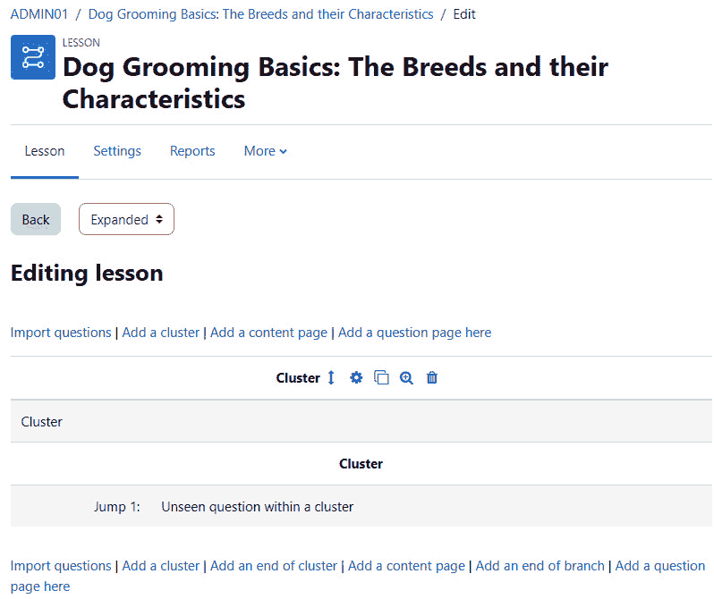

图 6.23 – 设置课程结构和其跳转

让我们看看每种类型的页面。

### 内容页面

内容页面显示一些信息，然后提供一或多个按钮供学习者点击以导航到不同的内容页面或问题页面。

这是前一节课的第二页：

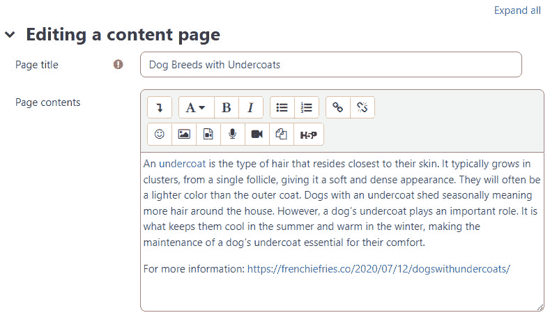

图 6.24 – 课程的内容页面

此页面的底部按钮是由课程创建者添加的。请注意，其中一个按钮将学习者带到下一页。然而，当你创建此页面时，下一页尚未创建，这不会是问题。一旦你创建了课程中的所有页面，你可以返回内容页面并添加所有跳转按钮。使用相对跳转（上一页、下一页等）可以节省大量时间。

### 带问题的群组

群组页面、群组结束页面以及它们之间的页面作为一个单一单元。在我们的例子中，我们有一个包含两个问题页面的群组。

在第一个群组页面，一个设置指示 Moodle 在此群组中显示一个未见的问答页面。你可以为群组页面选择其他选项：

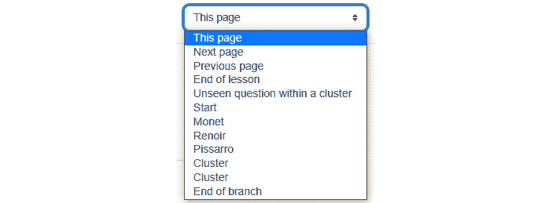

图 6.25 – 群组页面的选项下拉菜单

使用**群组内的未见问题**选项将群组变成随机问题测试。

在簇和簇的末尾之间有两个问题页面。这些问题页面将在学习者回答正确时跳出簇，回答错误时跳转到补救页面。

如果你使用像前面那样的簇，请注意不要创建一个不可能的情况。在这种情况下，如果补救页面将学习者送回簇中，并且学习者已经看到了两个问题，那么簇将无法显示未看到的问题页面。Moodle 会给学习者一个错误信息。再次强调，关键是要有计划。

而不是将学习者送回同一个簇，可以连续创建几个簇。如果一个学习者回答了一个问题正确，你可以跳过所有未看到的簇，转到下一个主题。如果一个学习者回答了一个问题错误，那么你可以直接将他们送到下一个簇。

## 配置课程设置

当你首次创建一个课程时，你会看到一个窗口，你可以选择整个课程的所有设置。在你可以向课程添加任何页面之前，你必须选择课程设置。如果你对这些设置中的任何一项都不确定，只需尽你所能猜测。你总是可以返回这个页面并更改设置。

小贴士

记住，Moodle 的一个优势是你可以轻松地实验和更改你的课程材料。习惯于采取更大胆、更实验性的方法使用 Moodle，你会更加享受它。

这个窗口被划分为以下区域：

+   外观

+   可用性

+   流程控制

+   评分

+   常见模块设置

+   限制访问

+   活动完成

+   标签

+   能力

在这个部分，我将从上到下浏览**编辑课程**页面。我将专注于课程活动特有的设置。所以，到本节结束时，你将了解**编辑课程**页面上的大多数设置是如何影响学习者的体验的。

### 一般设置

这个部分只包含课程的名称，学习者将在课程的首页看到这个名称。如果你想在学习者进入课程之前看到课程的描述，你需要完成**描述**字段，并给课程首页添加一个标签来描述课程。

### 外观

这个部分包含影响课程呈现方式的设置。

### 链接媒体

你可以将文件上传到这个字段。当学习者进入课程时，文件将在弹出窗口中显示。这使学习者能够在课程进行中参考该文件。

弹出窗口可能被学习者的浏览器阻止。为了确保学习者知道他们应该看到一个文件，考虑在课程的首页添加一条消息，告诉学习者如果文件没有自动打开，请打开该文件。

当你阅读这个课程时，他们需要参考一个图表。为了显示这个图表，在左侧菜单栏下**链接媒体**中，点击**点击此处查看链接**。

在显示图表后，继续到下一页。

### 显示当前得分

当此设置为**是**时，课程的每一页都会显示学习者的得分和到目前为止可能获得的总分数。

小贴士

这会显示学习者到目前为止已查看的页面可能获得的分数。

如果课程不是线性的并且有分支，每个学习者通过课程的路径可能会改变。这意味着每个学习者都有机会获得不同数量的分数。例如，你可以创建一个有许多分支和页面的课程，然后要求学习者在该课程中获得至少 200 分。这将鼓励学习者探索课程并尝试不同的分支，直到他们获得所需的分数。

### 显示左侧菜单和最低分数以显示菜单

**显示左侧菜单**会在幻灯片窗口的左侧显示一个导航栏。这个导航栏允许学习者导航到任何幻灯片。如果没有这个导航栏，学习者必须按照 Moodle 显示课程页面的顺序浏览幻灯片，并且必须完成课程才能退出（或者学习者可以强制关闭窗口）。

有时，你可能希望学习者完成整个课程，然后才能让他们自由地在课程中移动。**最低分数以显示菜单**设置可以实现这一点。只有当学习者达到指定的分数时，他们才会看到导航菜单。你可以使用这个设置来确保学习者第一次完全通过课程，然后再允许学习者自由地在课程中移动。

### 最大答案数量

在课程中的每个问题页面的底部，**最大答案数量**决定了每个问题可以有的最大选择数量。例如，如果这设置为**4**，每个问题最多可以有四个选择：**a**、**b**、**c**和**d**。

如果每个答案都让学习者跳转到不同的页面，答案的数量也是可能分支的数量。将其设置为任何问题可能有的最高答案数量。在创建问题页面后，你可以增加或减少这个设置，而不会影响你已创建的问题。

使用默认反馈

如果此设置为**是**，Moodle 不会看到你为问题创建的任何自定义反馈；它将显示默认消息，例如**这是正确的**或**这是错误的**，而不是。默认反馈是在 Moodle 的语言文件中设置的，所以它将被翻译成课程使用的任何语言。如果你设置为**否**，并且 Moodle 没有看到你为问题创建的任何自定义反馈，当学习者回答时，Moodle 将不会显示任何反馈。

### 跳转到下一个活动

此设置允许您在课程结束时在课程中放置指向课程中另一活动的链接。例如，您可以链接到测验。

### 先修课程

本节中的设置允许您要求学习者在打开本课程之前先观看另一门课程。其中一个设置允许您指定学习者必须花费多少时间在先前的课程上。您可以使用此设置来确保学习者在进入下一课程之前观看一定时间的视频。您可以通过在先修课程中嵌入视频来实现这一点。

预修课程设置是在所有活动都有的**限制访问**设置的基础上。使用**限制访问**设置时，您没有指定必须花费在另一项活动上的时间的选项作为访问条件。

### 流程控制

本节包含影响学习者如何通过课程的设置：

![Figure 6.26 – The Flow control screen for the Lesson activity![Figure 6.26 – The Flow control screen for the Lesson activity 图 6.26 – 课程活动的流程控制屏幕### 允许学习者复习**允许学习者复习**允许学习者在课程中向后移动并重试答错的问题。这与仅使用浏览器上的**后退**按钮不同，因为这个设置允许学习者重试问题，而使用**后退**按钮则不行。### 提供尝试再次回答问题的选项**提供尝试再次回答问题的选项**在学习者回答错误后显示一条消息。该消息邀请学习者再次尝试问题，但不会获得分数。当您在课程中创建一个问题，您可以为此问题的每个答案创建反馈。但是，如果您将**提供尝试再次回答问题的选项**设置为**是**，Moodle 将覆盖您为答案创建的反馈。相反，它将显示一条消息，要求您再次尝试问题。小贴士如果您为课程中的答案创建了自定义反馈，但 Moodle 没有显示您创建的反馈，请检查**提供尝试再次回答问题的选项**设置。它可能被设置为**是**。将其设置为**否**。### 最大尝试次数**最大尝试次数**确定学习者可以尝试任何问题的次数。这适用于课程中的所有问题。### 显示的页面数量**显示的页面数量**确定显示多少页面。如果课程包含超过此数量的页面，课程将在达到此处设置的数字后结束。如果课程包含少于此数量的页面，课程将在显示完每一页后结束。如果您将其设置为零，课程将在显示完所有页面后结束。### 评分一门课程可以是评分的或不评分的。您还可以允许学习者重修课程。虽然 Moodle 允许您对课程进行评分，但请记住，课程的主要目的是教学，而不是测试。小贴士不要使用课程来做测验或作业的工作。 课程的分数旨在提供关于每个页面有效性的反馈，并使学习者能够判断自己的进度：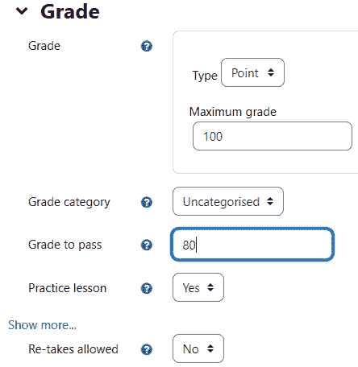

图 6.27 – 课程活动的成绩设置屏幕

### 实践课程

如果你将**实践课程**设置为**是**，则此课程将不会显示在成绩册中。在实践课程中，学习者在完成活动后可以看到成绩，但这个成绩仅供他们自己。它不会被记录或显示在成绩册中，教师也无法看到。这是一个纯粹的自学选项。

### 自定义评分

通常，正确回答一个问题值得该问题的全部分数，每个错误答案都值得零分。启用**自定义评分**允许你为每个问题的答案设置分数。如果某些答案比其他答案更正确或更错误，请使用此功能。例如，你可以开发历史测验，其中干扰项从几乎正确到完全错误不等，例如同一世纪与错误世纪。你还可以使用此功能设置问题的分数。如果一个问题更重要，请使用自定义评分来给它更多分数。

### 处理重考

此设置仅在允许学习者重复课程（设置设置为**是**）时相关。当允许学习者重考课程时，**成绩**页面显示的分数要么是重考的平均分，要么是学习者的最高分。

### 最小问题数量

**最小问题数量**设置用于计算学习者课程成绩的问题数量的下限。仅在课程将进行评分时相关。如果学习者没有回答这个最小数量的问题，则课程不会被评分。

如果你看不到此设置，可能是因为你已将**实践课程**设置为**是**。将**实践课程**设置为**否**并保存页面；你应该会看到此设置出现。

### 添加内容页面

内容页面由指向你课程中其他页面的链接页面组成。在此阶段，在你完成课程设置页面后，你的课程将没有任何页面。但是，如果你想以一个包含说明的页面开始你的课程，你可以添加一个内容页面并将其跳转到下一页。当你创建内容页面时，你会看到以下类似的内容：

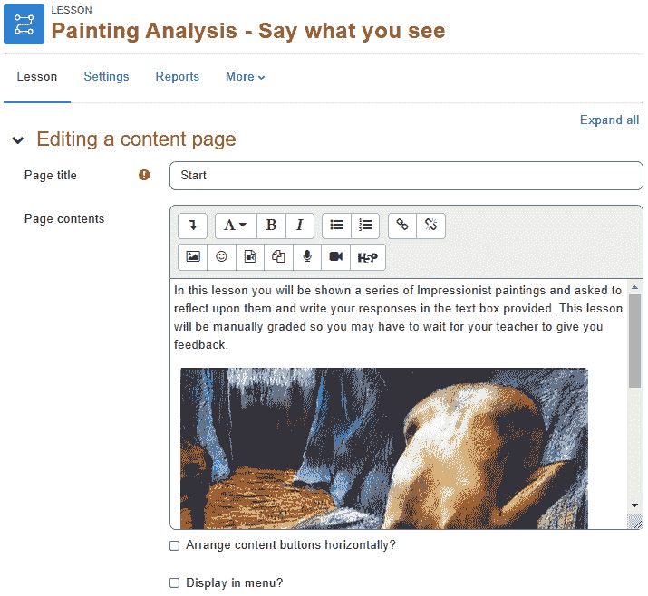

图 6.28 – 设置内容页面

当学习者运行课程时，内容页面将看起来像这样：

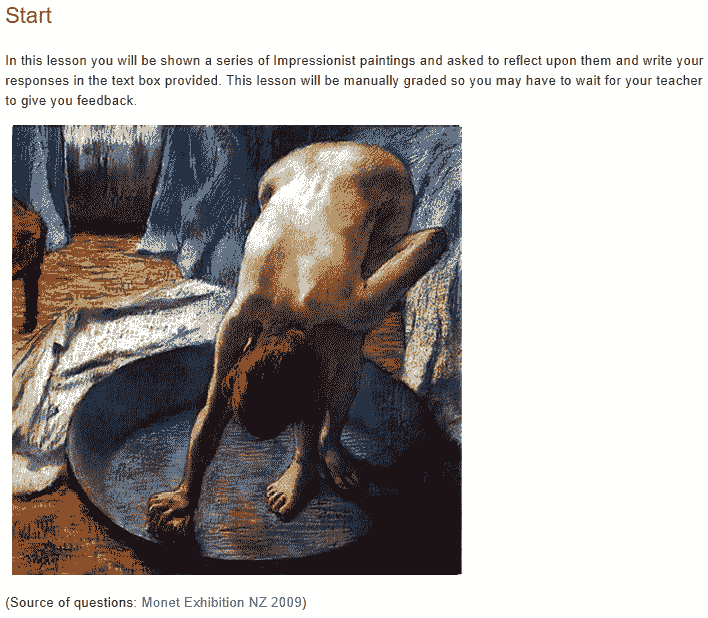

图 6.29 – 初始化课程的页面内容学习者的视图

### 添加簇

**簇**是一组问题页面。在此簇中，您可以要求学习者在允许他们离开簇之前正确回答几个问题。这使您能够在继续前进之前测试学习者是否理解了一个概念。

或者，您也可以从簇中显示一个随机页面，并从该页面开始，进入课程中的任何其他页面。这使您能够让每个学习者沿着课程中的不同随机路径前进，这样就不会所有学习者都有相同的体验。例如，您可以让他们走不同的路径来覆盖中美洲历史。

簇由一个开始簇页面、一个簇结束页面以及它们之间的页面组成。

### 添加问题页面

此选项允许您使用 Moodle 内置编辑器将问题页面添加到课程中。创建问题页面的过程将在下一节中介绍。

首先尝试添加您的问题页面。然后，在课程开始时放置一个带有说明的内容页面。如果需要，将问题页面组织成分支或簇。最后，以一个内容页面结束课程，向学习者告别。

#### 创建问题页面

一旦填写并保存了**设置**页面，就到了创建第一个问题页面的时候了。尽管它被称为**问题页面**，但该页面可以包含不仅仅是问题。它是一个网页，因此您可以添加任何内容。通常，它包含信息和问题以测试学习者的理解。您可以选择不同类型的问题：

+   多选题

+   正误

+   简答题

+   数字

+   匹配

+   论文

这些可以在**选择问题类型**下找到：

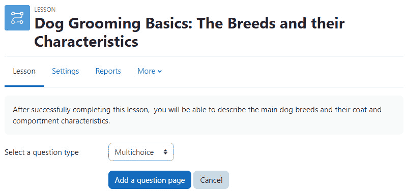

图 6.30 – 为课程活动添加问题类型屏幕

您还可以为每个问题的答案创建反馈，类似于为测验问题的答案创建反馈。此外，您可以根据学习者选择的答案使课程跳转到新页面。

在下面的屏幕截图中，您可以看到问题页面包含一个问题，允许您跳转到另一个位置。请注意，对于每个答案，都有一个学习者提交答案后立即看到的**响应**字段。还有一个**跳转**字段用于每个答案。对于您看到的错误答案，**跳转**可以将学习者带到补救页面或重新显示当前页面，以便他们可以再次尝试。对于正确答案，**跳转**可以显示课程中的下一页，如这里所示：

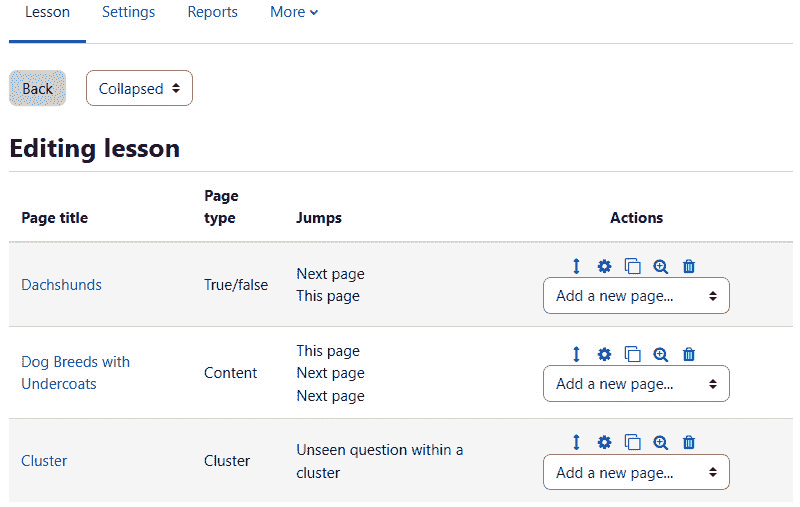

图 6.31 – 配置答案以便它们跳转到适当的页面

让我们更详细地看看这个页面上有哪些内容：

+   **页面标题**：当它在课程中显示时，将显示在页面顶部。

+   **页面内容**：正如我们之前提到的，课程页面是一个网页。它可以包含您可以在任何其他 Moodle 网页上放置的任何内容。通常，它将包含信息和测试学习者理解的问题。

+   **答案**：这将在课程页面底部**页面内容**之后显示。学习者可以在**页面内容**区域提出的问题后选择一个答案。

+   **响应**：对于学习者选择的每个答案，其响应将在学习者被带到新页面之前显示。

+   **跳转**：学习者选择的每个答案都会导致跳转到另一个页面。

+   **此页面**：如果跳转是**此页面**，则学习者将停留在同一页面上。学习者可以尝试再次回答问题。

+   **下一页或上一页**：如果跳转是**下一页**或**上一页**，则学习者将被带到下一页或上一页。在您重新排列课程中的页面后，此跳转可能会给您不同的结果。请注意，这是一个**相对**跳转。这最适合线性课程：

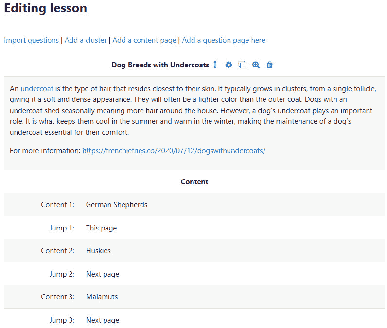

图 6.32 – 课程的编辑屏幕

+   **特定页面**：您还可以选择一个特定的页面进行跳转。下拉列表显示所有课程页面的标题。如果您选择一个特定的页面进行跳转，即使您重新排列课程中的页面，跳转也会保持不变。

对于跳转，如果您选择**未见的带有分支的问题**，学习者将被带到他们在本次会话中未正确回答的问题页面。该问题页面将与当前页面位于同一簇中。

提示

一个未见的带有分支的问题将学习者带到他们之前未正确回答的问题页面。学习者可能之前见过这个页面，但回答错误。

### 编辑课程

一旦您创建了几个课程页面，您可能想查看和编辑课程的流程。您可以在**编辑**标签下进行此操作。

### 折叠和展开

**编辑**标签是您编辑课程内容的地方。从这里，您可以添加、删除、重新排列和编辑单个课程页面。

在**编辑**标签下，当您选择**折叠**时，您将看到课程中的页面列表，如下面的截图所示：

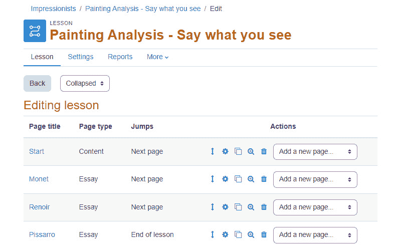

图 6.33 – 选择折叠选项后，您将看到课程中的页面列表

页面按其逻辑顺序显示，如果学习者回答了所有问题，这将是通过课程的捷径。请注意，页面内容不会显示。此屏幕的目的是不是编辑单个问题，而是帮助您看到课程的流程。

### 重新排列页面

要重新排列页面，点击想要移动的页面的*向上*/*向下*箭头，，注意，是跳转决定了 Moodle 展示页面的顺序。如果一个问题被设置为跳转到下一页，重新排列页面可能会改变跳转。一个问题也可以被设置为跳转到特定的、命名的页面。在这种情况下，页面的出现顺序并不决定跳转的着陆点，因此在这里重新排列页面不会影响该跳转。

### 编辑页面

从**编辑**选项卡，要编辑一个页面，点击*编辑*图标，它通常看起来像这样：。点击此图标将带您到该页面的编辑页面。上一节提供了编辑课程页面的详细说明。

### 添加页面

**添加页面**下拉列表允许您在课程中插入一个新页面。您可以选择几种不同的页面类型。

在本节中，您学习了如何创建自适应课程，这将通过提供补救内容来增强学习体验。在整理好课程后，通过给学习者提供反馈的机会来激励他们是一个好主意。在下一节中，您将学习如何开发反馈模块。

# 开发反馈模块

**反馈**活动允许您为您的学习者创建调查。**反馈**活动常与**调查**活动混淆。在**调查**活动中，您必须从几个预制的调查中选择；您不能构建调查。此外，不要将此与问卷模块混淆。问卷是一个附加组件，而**反馈**是 Moodle 的标准功能。

## 反馈不仅针对学习者

当然，您可以使用**反馈**活动来调查您的学习者。您还可以用它来做以下事情：

+   调查您工作场所的员工。

+   从同意成为研究对象的个人那里收集数据。

+   对您网站的访客进行民意调查。

**反馈**活动允许您创建不同类型的问题：多项选择、下拉菜单、简答题等。您可以与学习者分享反馈结果或将它们保密。

## 创建反馈活动

让我们假设我们正在开发一门名为 *Dog Grooming for Everyone* 的课程。在该课程中，我们有一个名为 *Dog Grooming Tools* 的模块。创建**反馈**活动类似于添加测验。首先，您添加活动，然后添加问题。我们将在以下各节中分别介绍。

要添加**反馈**活动，请按照以下步骤操作：

1.  从**添加活动或资源**菜单中选择**反馈**。

1.  Moodle 将显示该活动的**设置**页面。

1.  为反馈添加一个**名称**。您的学习者在课程主页上会看到这个名称：

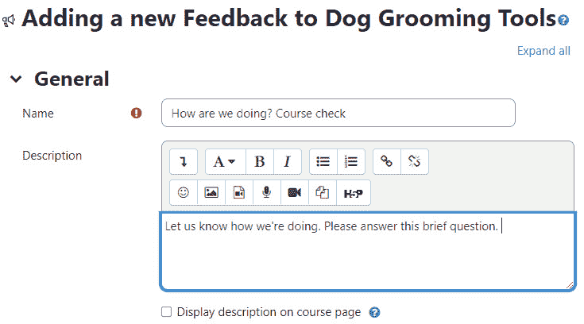

图 6.34 – 添加新的反馈活动

1.  输入到**描述**字段中的文本和图形将在学习者开始活动之前显示给他们。使用这个功能来解释活动。记住，这是一个功能齐全的 HTML 编辑器，所以你可以将文本、图形和媒体放入描述中。

1.  在**可用性**下，你可以输入打开和关闭活动的具体时间。如果你没有输入打开活动的具体时间，它将立即可用。如果你没有输入关闭活动的具体时间，它将无限期地保持开放：

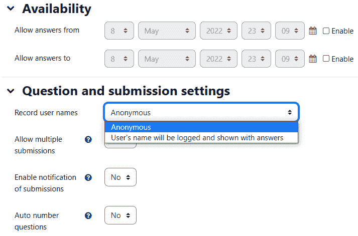

图 6.35 – 反馈活动的可用性和问题及提交设置屏幕

1.  **记录用户名**选项仅影响教师可以看到的内容。学习者看不到彼此的回答。如果**记录用户名**被设置，那么用户的姓名将被记录并显示在答案旁边。教师将能够看到完成反馈的用户及其答案的列表：

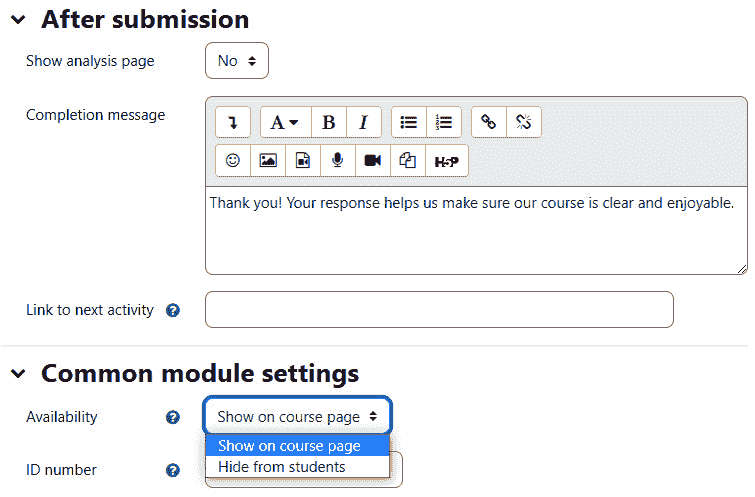

图 6.36 – 反馈活动的响应屏幕

1.  **允许多次提交**设置影响活动，但前提是你已经允许匿名回答。如果是这样，任何用户都可以多次提交反馈调查。

1.  如果**启用提交通知**设置为**是**，每当有人提交反馈时，课程管理员都会收到电子邮件。这包括教师和课程管理员。

1.  如果你希望 Moodle 为你反馈活动中的问题编号，请选择**自动编号问题**的**是**。

1.  如果**提交后显示分析页面**设置为**是**，用户提交反馈后，会显示到目前为止的结果摘要。

    第一次就设置这个设置正确

    Moodle 不允许你在有人回答了反馈活动后更改多次提交设置，否则你会丢失之前的回答。所以，在人们开始回答之前，请确保这个设置正确。如果你需要更改这个设置，你必须首先在**课程管理**菜单下设置**重置反馈回答**。

1.  如果你输入了指向下一个活动的**链接**，用户提交答案后，该页面将立即显示。你可以使用这个页面来解释活动之后会发生什么。如果你留空，Moodle 将显示一个简单的消息，告诉用户他们的答案已被保存。在此页面的底部，Moodle 显示一个**继续**按钮。

公共模块设置与其他活动一样，限制了可用性的工作方式。

请小心设置指向下一个活动的链接的 URL

你可能会想使用 URL 将用户发送到网站上另一个页面。记住，如果你将此活动移动到另一个课程或另一个 Moodle 站点，该 URL 可能会更改。

1.  点击**保存并显示**按钮以保存设置。现在，是时候开始添加问题。

要向反馈活动添加问题，请按照以下步骤操作：

1.  选择**反馈**活动。

1.  从左侧菜单中选择**反馈活动名称 | 反馈 | 编辑问题**。你会看到一个具有以下选项的下拉按钮菜单：**添加问题 | 使用模板 | 导入问题**。

图 6.37 – 在反馈活动中编辑问题

1.  从**选择**下拉列表中选择要添加的问题类型。

    小贴士

    下一节将描述特定类型的问题。本节的其余部分涵盖了几乎所有问题类型都通用的设置。对于特定于问题类型的设置，请参阅下一节。

1.  如果你将一个问题标记为**必填**，则用户必须回答它才能提交反馈。问题旁边将有一个红色的星号。

1.  **问题**字段包含问题的文本。与测验问题不同，反馈问题只能由文本组成：

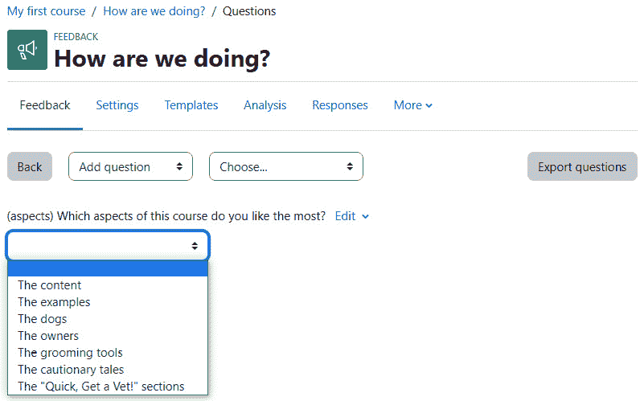

图 6.38 – 反馈问题的答案选项

1.  **标签**字段包含一个标签，只有教师在查看反馈结果时才会看到。**标签**字段最重要的原因是当你计划将反馈结果导出到 Excel 工作表时。标签会随结果一起导出。这允许你将反馈结果与数据库中的简短标签匹配。

1.  **位置**字段决定了你首次将问题添加到反馈页面时的顺序。一旦问题被添加，你可以覆盖这个数字并将问题移动到页面的任何位置。

1.  **依赖项**和**依赖值**可以用来使问题的显示依赖于前一个问题答案。例如，你可能会首先问某人，**你有一个推特账号吗？**。

如果他们回答**是**，你可能显示一个问题，例如**你多久发一次推文？**。如果他们回答**否**，你会隐藏那个问题。从**依赖项**下拉列表中选择将决定此问题是否出现的答案。然后，在**依赖值**字段中，输入使此问题出现所需的答案。

1.  对于仅适用于一种问题类型的字段，请参阅以下章节。

1.  保存问题。

### 问题类型

**反馈**活动允许你添加多种类型的问题。其中一些不是问题，但你仍然可以从相同的下拉菜单中添加它们：

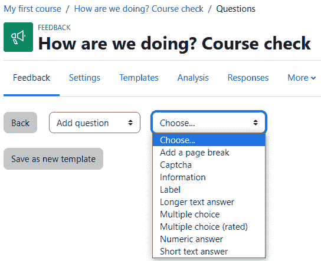

图 6.39 – 问题类型下拉菜单

#### 添加分页符

**添加分页符**在**反馈**活动中插入分页符。

#### 避免使用 CAPTCHA 防止机器人

如果您允许访客完成表单以获取访问权限，您可能需要一个安全级别来防止机器人。**CAPTCHA**是一种测试，确保有人正在填写在线表单。它显示一些文本的图片，用户必须阅读并输入该文本。如果用户输入的文本不正确，反馈表单将被拒绝。这可以防止软件机器人自动填写您的反馈并垃圾邮件您的结果。

#### 插入信息

您可以使用此选项将有关反馈的信息插入到表单中。该信息由 Moodle 添加，并随用户的答案一起提交。截至写作时，选项如下：

+   **响应时间**：用户提交反馈的日期和时间

+   **课程**：此反馈出现的课程短名

+   **课程类别**：此反馈出现的类别短名

#### 添加标签

这与在课程主页上添加标签相同。标签可以是您可以在网页上放置的任何内容。这是在活动中插入说明、指导和鼓励的好方法。

#### 为较长的文本答案创建一个文本框

使用此问题类型创建一个文本框，用户可以在其中输入答案。在这里，您可以指定文本框的宽度和高度。如果用户空间不足，Moodle 会在框中添加滚动条，以便用户可以继续输入。

#### 显示多选题

多选题显示一个答案列表。多选题有三种子类型：

+   **多选题 – 允许多个答案**：在这个问题中，Moodle 在每个答案旁边显示一个复选框。用户可以选择他们想要的任意多个答案。

+   **单选题 – 只允许一个答案**：在这个问题中，Moodle 在每个答案旁边显示一个单选按钮。用户必须只选择一个答案。

+   **单选题 – 只允许一个答案**（下拉列表）：在这个问题中，Moodle 显示一个包含所有答案的下拉列表。用户必须只选择一个答案。

您通过在**多选题值**字段中每行输入一个答案来创建多选题的答案。例如，考虑以下设置：

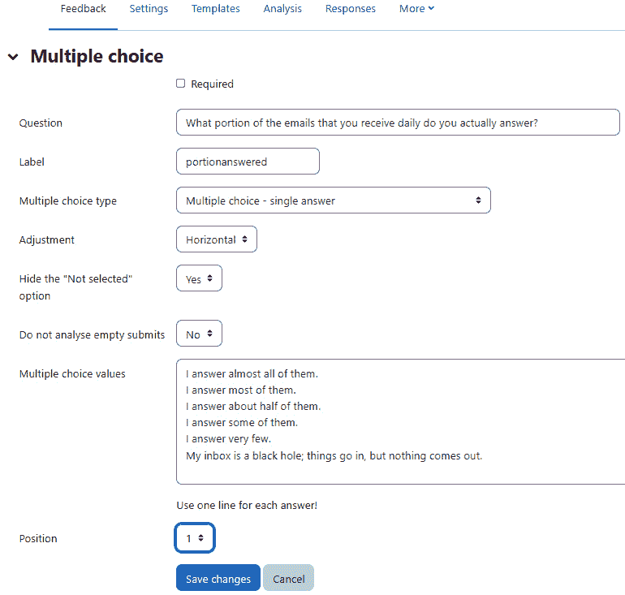

图 6.40 – 设置单选题

创建以下问题：

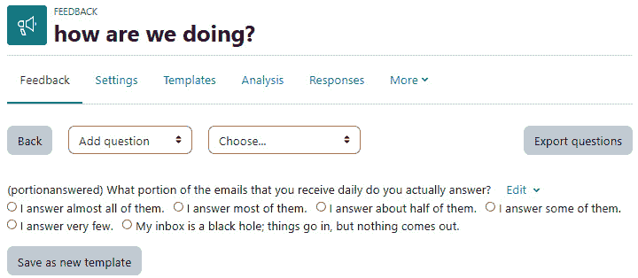

图 6.41 – 配置答案以便它们跳转到适当的页面

重要提示

注意，此问题的**调整**设置设置为**水平**。这会导致答案水平排列在页面上，而不是垂直列表。

此外，请注意**隐藏“未选择”**选项的设置。如果设置为**否**，Moodle 将在您创建的回答列表中添加一个**未选择**的回答。当设置为**是**时，Moodle 将仅显示您创建的回答。

#### 创建多选题

对于您想查看的回答类型，此类问题对用户来说看起来与多选题单答案问题相同。然而，当您查看结果时，您将看到与每个答案相关联的数字。这允许您使用收集到的数据进行平均计算和其他计算。

在此示例中，答案被评为**4**至**0**：

![Figure 6.42 – 反馈选项的文本]

![Figure_6.42_B17288.jpg]

![Figure 6.42 – 反馈选项的文本]

用户在选择答案时看不到这些数字，但当教师查看问题的分析时，会显示平均值。此外，当反馈结果导出到 Excel 时，评分数字也会导出。这使得您可以使用电子表格对结果进行高级分析。

#### 数字答案

使用此类型的问题让用户输入一个数字。您可以指定一个您将接受的数字范围。

#### 短文本答案

短文本答案问题允许您限制用户输入的文本量。您指定文本输入框的大小和框将接受的文本量。

## 查看反馈

教师和管理员可以查看**反馈**活动的回答。您可以逐个查看回答或查看所有回答的摘要。

### 查看单个回答

如果**记录用户名**设置为**用户名将被记录并随答案显示**，教师将能够看到完成反馈的用户及其答案的列表。要查看此回答列表，请按照以下步骤操作：

1.  选择**反馈**活动。

1.  从左侧菜单中选择**设置** | **反馈管理** | **显示回答**。

1.  要查看您想看的学习者的回答，请点击日期：

![Figure 6.43 – 选择学习者答案以查看]

![Figure_6.43_B17288.jpg]

Figure 6.43 – 选择学习者答案以查看

### 使用分析选项卡分析回答

在**分析**选项卡下，您可以查看所有回答的摘要。在此页面上，您还有一个**导出到 Excel**按钮，该按钮将所有数据下载到 Excel 电子表格中。

重要的是要记住，反馈不仅在学习课程或一系列作业之后很重要，在同步网络会议或辅导课后也很重要。使用 Moodle 进行反馈而不是在 BigBlueButton 或 Zoom 中使用它的优点是，您将在 Moodle 当前和存档课程中有一个更持久的记录。对于更复杂的问题或调查，理想的工具是**选择**。您可以使用**选择**进行反馈，以及用于参与者的工具，如“检查你的理解”类型的测验或参与者。

# 探索选择

Moodle 的**选择**是最简单的活动类型。在**选择**活动中，您创建一个问题并指定一组回答选项。您可以使用**选择**来完成以下操作：

+   进行快速投票。

+   要求学习者选择辩论的立场。

+   确认学习者对协议的理解。

+   收集同意。

+   允许学习者选择一个主题来撰写论文或项目。

在我们探讨如何实现这一点之前，让我们从学习者的视角来看**选择**活动，然后探索在创建**选择**时教师可用的设置。

## 学习者的视角

从学习者的视角来看，**选择**活动看起来是这样的：

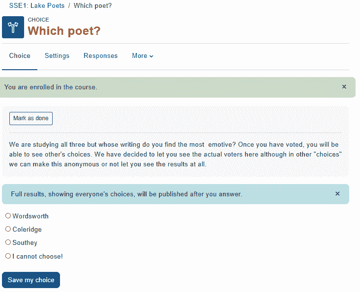

图 6.44 – 从学习者的视角看选择活动

关于这个选择活动，有几个需要注意的事项：

+   学习者可以看到有多少其他学习者选择了某个回答。

+   对每个回答可选的学习者数量有限制。

+   学习者可以取消他们的选择并重新提交。

这些是您可以为此活动设置的选项。教师还可以隐藏其他学习者的回答，不对每个回答可选的学习者数量设限，并阻止学习者更改他们的回答：

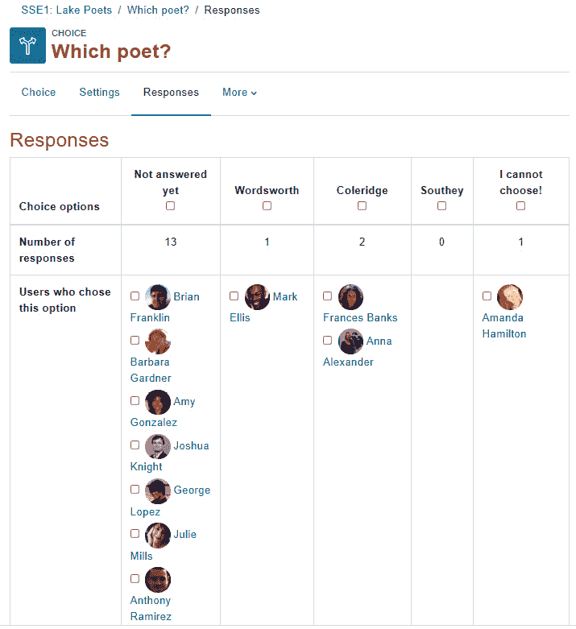

图 6.45 – 组合选择结果

## 教师的视角

在我们讨论一些**选择**活动的用途之前，让我们看看**编辑选择**页面上的可用设置。然后，我们将学习如何创造性地使用这些功能。

### 限制

每个选择旁边的**限制**选项允许您限制可以选择该选择的学习者数量。在先前的示例中，不超过四个学习者可以选择每个选择，因此当四个学习者选择了一个团队后，该选择就变得不可用。

为了使限制生效，**限制允许的响应数量**必须设置为**是**：

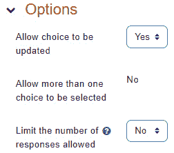

图 6.46 – 选择活动中的选项设置屏幕

### 显示模式

在本节开头的示例中，**显示模式**设置为**垂直**。您也可以水平排列选项。

### 发布结果

您可以选择是否向学习者揭示选择的结果，如果是的话，何时揭示。

在本节开头的示例中，**发布结果**设置为**始终向学习者显示结果**；这就是为什么学习者可以看到有多少学习者选择了每个回答。如果设置为**不向学习者发布结果**，则活动将不会显示有多少学习者选择了每个回答：

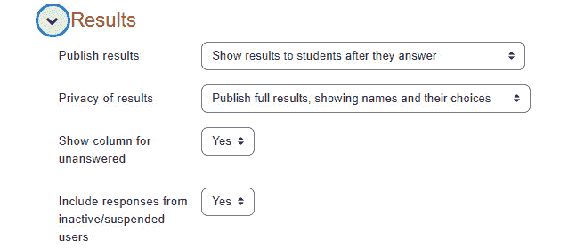

图 6.47 – 选择活动中的结果设置屏幕

如果你限制可以选择响应的学习者数量，请考虑使用**始终向学习者显示结果**。这样，学习者可以看到有多少其他人选择了该响应，以及每个响应还剩下多少空位。

### 结果的隐私性

如果你发布选择的结果，你可以选择是否发布选择每个响应的学习者姓名。在本节开头示例中，**结果的隐私性**设置为**发布完整结果**，因此学习者可以看到谁选择了每个响应。

### 允许学习者改变主意

**允许更新选择**设置确定学习者是否可以在提交后更改答案。如果设置为**是**，学习者可以重新参加**选择**活动，直到活动关闭。

在一个教师使用同步和异步交付组合的环境中，拥有包括调查和反馈工具的能力对于保持参与度和确定内容、活动和课程的有效性至关重要。

# 摘要

活动在 Moodle 框架中非常重要，因为它们允许学习者展示能力，同时保持参与和动力。它们还允许课程设计者将学习成果与监管机构可能要求的整体能力框架相联系。

在 Moodle 4.0 中，活动已经被简化，因此数量不是很多，但许多活动的功能得到了增强，以便更加协作和互动，以保持学习者的参与度和动力。Moodle 4.0 通过改进作业活动以及其他活动，使学习者更容易看到他们在课程中的位置，从而表明活动是否已完成，以及是否达到了最低及格分数。

Moodle 的**作业**和**课**活动允许你创建学习者可以与之互动的课程材料。这种互动比学习者观看的静态材料课程更具吸引力，通常也更有效。虽然你可能开始通过添加静态材料来创建课程，但下一步通常应该是问自己，“我如何使这门课程更具互动性？”

有许多方法可以构建引人入胜的作业，Moodle 提供了许多不同的活动来帮助你做到这一点。你可以定制你的解决方案，所以当你完成这个单元时，请花点时间进行实验。记住，你总是可以删除和修改你的工作。所以，在沙盒中玩耍吧！

课可以取代许多静态网页，因为它们由包含每页结尾问题的网页组成。一节课允许你向学习者展示信息，测试学习者对信息的学习，然后提供补救信息或继续到下一个主题。

**反馈**和**选择**活动允许教师评估学习者的态度、对课程的满意度以及他们的学习体验。反馈在评估课程开始时的班级态度和经验方面特别有用。您还可以使用反馈为甚至没有参加课程的人创建调查，例如员工调查或研究数据。

**选择**活动特别适用于学习者与教师之间进行结构化、持续的对话。您可以创建多个此类活动，将它们隐藏起来，并在需要衡量学习者态度时揭示它们。

在下一章中，您将学习如何使用**测验**活动评估学习者。

| **活动** | **描述** | **优点** | **缺点** | **常见用途** |
| --- | --- | --- | --- | --- |
| 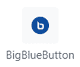 | Moodle 集成了网络会议功能。它是开源的。用户可以共享音频、视频、聊天和幻灯片，他们还可以共享屏幕、使用白板、在分组会议室中进行协作、参与投票和使用表情符号。会议可以录制并归档。 | BigBlueButton 易于使用，并且完全集成到 Moodle 中。它有许多内置工具，允许进行标记和演示。它易于录制并使录制可用。您可以选择自托管或云托管。 | BigBlueButton 可能会运行缓慢，并且可能无法通过企业防火墙。可能需要使用 Teams、Zoom 或其他机构订阅的网络会议工具。 | “现场”教学和参与。 |

|  | 基于文本的、实时同步讨论。聊天会话可以保存。| 这是一个非常“轻量级”的工具，提供了提问、回答和数据共享的机会。它可以保存并归档。| 如果网络会议中同时使用“聊天”功能可能会令人困惑。代码未得到维护，因此非常过时。| 互动“轻量级”参与，共享内容。|

|  | 它看起来像测验，因为可以有选择题或投票。然而，它并没有与成绩册连接。| 这是一个很好的地方，可以吸引学习者，测试他们的知识，并通过投票然后进行讨论来激发他们的好奇心。| 它可能会与测验混淆。过度使用“选择”（检查你的知识、你知道吗？和投票）可能会分散注意力。| 评估学习目标的达成情况。可用于参与。|

|  | 这是一个异步讨论板。它具有相当大的灵活性：论坛可以是开放的，学习者可以启动新的讨论；它们可以用于社交互动，提问和回答问题；并且可以评估课程材料。如果设计得当，论坛可以非常吸引人。请确保要求学习者联系自己的经验，发表自己的观点，并为该主题的网站进行研究。需要精心设计问题，以避免“是/否”的回答或重复的内容。随着时间的推移，需要更改问题，以避免在线发布答案。| 协作学习、保持参与度和评估。 |

|  | 学习者可以添加和编辑网页，通常是协作进行的，但维基也可以是个人使用的。维基可以以多种方式使用——也就是说，作为知识库、在线创意写作日志以及操作、流程或行业的综合手册。| 对于涉及新进展或创新的协作活动非常有效，尤其是那些涉及新进展或创新的领域。| 它可能会与术语表或数据库混淆。维基在涉及不仅仅是定义，还涉及关于流程及其实施的提问的领域非常有效。| 协作构建知识库；可以是作品集的一部分。 |

|  | 数据库由多种不同类型的条目（数值、文本、图像、URL 等）的存储库组成。例如，实验结果或调查结果可以由多个参与者输入，以开发可用于分析的数据库。它还可以用于创建学习者的数字展示。| 数据库有许多用途。它们可以用作学习者工作或条目的存储库，并可用于多个课程。它可以与实验室课程、编程课程、市场营销、人口统计等结合使用，因为数据用于分析。| 如果用于如注释文献等物品，可能会与维基或术语表混淆。| 协作项目或用于学习活动的数据。 |

| 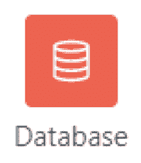 | 该数据库由多种不同类型的条目（数值、文本、图像、URL 等）的存储库组成。例如，实验结果或调查结果可以由多个参与者输入，以开发可用于分析的数据库。它还可以用于创建学习者的数字展示。| 数据库有许多用途。它们可以用作学习者工作或条目的存储库，并可用于多个课程。它可以与实验室课程、编程课程、市场营销、人口统计等结合使用，因为数据用于分析。| 如果用于如注释文献等物品，可能会与维基或术语表混淆。| 协作项目或用于学习活动的数据。 |

| **活动** | **描述** | **优点** | **缺点** | **常见用途** |
| --- | --- | --- | --- | --- |

| 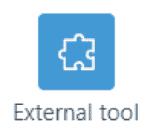 | 学习者可以在 Moodle 内访问其他网站上的应用程序和其他资源。工具或应用程序提供商必须支持**学习工具互操作性**（**LTI**）。 | 它使学习者能够使用来自另一个网站的工具。例如，基于 Python 编程的课程可能需要使用 Jupyter Notebook。无需在 Moodle 外登录和使用，它可以集成。 | 需要与网站管理员协调进行初始设置。 | 高级活动或编程框架。 |

|  | 反馈允许教师创建定制问题，以便学习者提供他们的观点。反馈活动可用于课程评估、保密的“学习氛围”评估、活动注册等。 | 反馈活动是了解课程或机构情况并及时改变课程的好方法。它也便于注册模块或活动。 | 反馈常与选择混淆。使用反馈注册活动或模块可能有些繁琐。 | 指导教学。 |

|  | **H5P**代表**HTML5 包**，它是 HTML 标记语言网络框架的最新规范，它容纳了交互式、自播放的内容，如演示文稿、视频、问题、游戏、测验等。H5P 包通常从外部获取，并可以上传到 Moodle 网站。测验活动是自动评分的，分数会进入成绩册。 | HTML5 包通常由专业人士制作，并从教育材料提供商处获得。自动评分方面非常方便。材料质量高，引人入胜。HTML5 模板通常是响应式的，因此在不同设备和不同浏览器（理想情况下）上看起来很好且能正常工作。 | HTML5 可能很昂贵，并且由于它们通常以包的形式提供，因此无法自定义或修改其特定部分。像 Java、CSS、JavaScript 和其他较老的语言一样，HTML5 最终会过时。它也可能容易受到安全问题的威胁。 | 交付内容和集成评估。 |

| 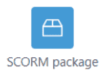 | SCORM 包由捆绑的学习对象组成，可以压缩并添加到课程中。学习对象通常是页面，SCORM 包包含目录，包括课程内容和测验，当评分时，这些评分会被记录在成绩册中。| SCORM 包通常用于展示内容，包括多媒体和动画。它们也可以包含评估。许多机构要求上传的内容必须是 SCORM 兼容的。| SCORM 包可能包含旧格式中的动画和多媒体，这些格式可能不再播放，或者需要外部驱动程序。在评估预包装的 SCORM 包时，你必须注意这一点。| 提供内容，整合评估，并维护单个学习对象的存档。|

| 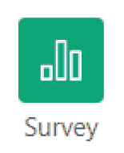 | 问卷调查工具可以用来收集数据，提问，并表达他们的观点。| 问卷调查可以有效地吸引学习者并了解他们的同学认为什么。| 问卷调查不可配置。对于可定制的问卷调查，请使用反馈。问卷调查需要与课程目标相关。问卷调查可能无意中成为无意识偏见的地方。| 参与度，教师互动。|
