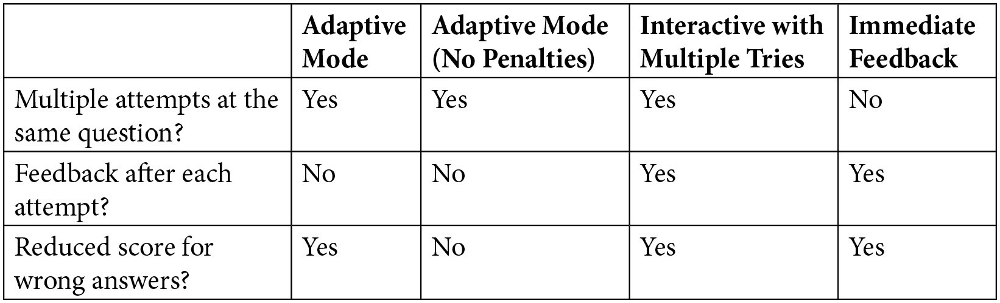

# *第七章*：使用测验评估学生

在在线课程中，任何评估策略的基础部分通常严重依赖于不同类型的自动评分测验。然而，如果设计不当，并且与整体课程学习目标结合不佳，测验往往是一个课程或教育项目的致命弱点。使用故事板进行规划至关重要。此外，在需要通过 Zoom、Teams、BigBlueButton 或其他平台进行“实时”（同步）讲座的环境中，测验往往被忽视。尽管如此，它们可以是一个理想的方式来评估学生在学习目标方面的进展和位置，并保持他们的参与度。

设计良好的测验使用可以帮助学习者实现学习目标，并且它们也符合与构建学生成功结构的**通用学习设计**（**UDL**）指南。测验可以帮助设定目标、自我调节，以及培养积极的“我能做到！”和自信的态度（自我效能感）。

Moodle 4.0 的重新设计和响应式主题使其易于在许多不同的设备上使用，包括智能手机。这一事实至关重要，因为许多学习者将依赖他们的手机来完成课程作业，尤其是在他们无法在笔记本电脑或台式机上访问 Moodle 课程的情况下。在学习者依赖手机的情况下，使用能够在小屏幕上良好显示的评估策略很重要。在这种情况下，Moodle 的测验活动是理想的，尤其是对于多项选择题。

结合一旦证明掌握后即可颁发的证书和徽章，测验可以成为学术和职业里程碑的关键组成部分。

在本章中，我们将探讨 Moodle 如何提供一种强大的解决方案，允许精心设计和适当放置的测验，以及将测验与掌握学习、能力框架、证书和徽章相结合的能力。在本章中，你将学习以下内容：

+   开发评分作业

+   使用题库创建测验

+   集成证书和徽章

完成本章后，你将了解在 Moodle 中用于测验活动的策略。你还将具备如何开发不同类型的测验以及如何编写有效问题的基础知识。

# Moodle 4.0 的测验活动

在 Moodle 4.0 中，**测验**是一个强大且高度灵活的活动，允许你通过创建从简单的多项选择题到复杂的自我评估任务（带有详细反馈）的评估工具来实现学习目标。以下截图显示了 Moodle 4.0 中重新设计的测验图标：

图 7.1 – Moodle 4.0 中测验活动的图标

就像 Moodle 中所有资源和活动一样，一旦您在右上角打开了**编辑**并选择了**添加活动或资源**，请选择**测验**。您将看到一个名为**更新：测验**的屏幕，该屏幕将包括您需要完成的字段，以添加名称和描述，如下面的截图所示：

![图 7.2 – 您可以在常规设置区域命名您的测验并描述它

![图 7.02 – 您可以在常规设置区域命名您的测验并描述它

图 7.2 – 您可以在常规设置区域命名您的测验并描述它

一旦您创建了测验描述，请向下滚动页面以查看您将配置的测验活动的其他方面。每个主题都是可点击的，并会打开一个屏幕，允许您自定义测验。当您向下滚动屏幕时，您将看到以下内容：

![图 7.3 – 您可以使用来配置测验的设置类别

![图 7.03 – 您可以在常规设置区域命名您的测验并描述它

图 7.3 – 您可以使用来配置测验的设置类别

现在我们已经知道了如何找到测验活动，它的样子以及基本选项，让我们来看看使用测验的最佳方式。

# 使用测验开发评分评估

当您整理课程和作业时，您将需要一个评估策略。在在线课程中，能够结合自评分测验非常有用。Moodle 提供了一个灵活的测验构建器。每个问题都可以包含任何有效的 HTML 代码，例如图形、格式化文本和媒体。一个问题可以包含您可以在 Moodle 资源页面上放置的任何内容。

在大多数由讲师主导的课程中，测验或测试是一个重要事件。分发测验、在课堂上进行测验和评分可能会占用教师大量的时间。在 Moodle 中，创建、进行和评分测验可以更快。这意味着您可以在课程中自由地使用测验。以下是一些您可以使用测验的例子：

+   您可以在每次阅读作业后使用简短的测验来确保学生完成了阅读。您可以随机排列问题和答案以防止学生之间共享。您还可以使测验仅在学生应完成阅读的那一周/一个月内可用。

+   您可以将测验用作练习测试。您可以允许多次尝试和/或使用自适应模式允许学生尝试一个问题，直到他们答对。然后，测验既作为练习也作为学习材料。

+   您可以将测验用作预测试来确认先前学习，以及确定知识或技能差距。您甚至可以在学生上课之前要求他们完成测验。学生可以在对他们方便的时间和地点完成这个预测试。然后，您可以将他们在预测试和最终测试中的分数进行比较，以显示学习已经发生。您将拥有的技能差距分析可以帮助您衡量课程的有效性。

+   你可以使用测验与掌握学习相结合，帮助学生达到最低分数以证明掌握。

+   你可以将测验分数/表现与能力框架联系起来，以帮助满足机构或认证要求。

+   你可以根据某些分数的成就自动生成徽章和证书。请注意，你可以限制访问进一步模块、课程、资源或活动，直到达到足够高的测验分数。

在 Moodle 中，设置新测验后，你需要开发一个问题库。你开发的问题类型取决于你决定使用的测验类型，这取决于你的教学策略。你将需要开发足够的问题，以便你可以轮换问题并确保学术诚信。

测验活动包括几种不同类型的测验，但我们将从多项选择题开始，因为这是你可能会最常使用的一种。为了有效，你应该遵循心理测量标准，这可能很复杂。我们将在这里提供易于遵循的指南，这将帮助你写出你可以自信地使用的选择题。现在，让我们开始构建问题库，在那里你将存储与计划进行的测验类型相对应的分类和标记问题。

# 构建问题库

让我们构建一个问题库。构建测验是一个三步过程。首先，创建一个测验。其次，在问题库中创建问题。第三，将问题添加到测验中。你可以先创建问题，但通常最好先制作课程的故事板并列出测验活动。

Moodle 4.0 通过通过插件访问使访问问题库全局配置变得更容易。有三个与问题相关区域：**问题库插件**、**问题行为**和**问题类型**。你可以启用网站范围的访问，并通过在**插件**页面上进行更改来配置网站范围内的行为。

Moodle 中的问题库是一个你可以按不同方式在数据库中组织的题目集合，以便你将来使用。你将在不同的“上下文”中使用你的问题——一些将在整个系统中使用。其他将在课程类别中的所有测验中使用。还有一些将在课程中使用，而其他则仅用于单个测验。你也可以将其视为一个分类的树状结构。

那么，让我们开始吧！问题库是一组问题，对应于四个上下文中的一个。上下文是*系统*、*课程类别*、*课程*和*测验*。在这种情况下，我们使用的是课程上下文：

![图 7.4 – 问题库屏幕，包括创建新问题的选项

![img/Figure_7.04_B17288.jpg]

图 7.4 – 问题库屏幕，包括创建新问题的选项

在本章中，您将学习如何创建测验并向其中添加问题。在完成此过程时，请记住，当您创建问题时，您正在将该问题添加到 Moodle 的问题库中。在前面的屏幕截图中，您可以看到，当您选择一个类别时，已经选择了一个课程（**20th-C-HUM**）。同时，您可以通过勾选**也显示子类别中的问题**来确保您的问题时搜索子类别时显示。

记住，Moodle 4.0 为 Moodle 测验活动内置了功能增强器。

小贴士

有一个新设置允许您在创建测验问题时自动保存设置，并将它们应用到下一个问题。这样可以节省时间并保持一致性。

问题库中的问题可以分类和共享。您学习网站中的真正资产不是测验，而是您和您的同事们随着时间的推移所构建的问题库。

因此，总结一下，构建测验是一个三步过程。首先，在问题库中创建问题。其次，创建测验。第三，将问题添加到测验中。

## 功能增强器

一旦您开发完测验并想要部署它，您可以将它添加到 Moodle 的日历中。在 Moodle 4.0 中，您可以给事件和活动的类别着色，并将它们直接添加到日历中。例如，您可以将测验着色为红色，将复习网络研讨会着色为绿色，以便学生更有效地规划学习。

## 问题类型

下表解释了您可以创建的问题类型，并提供了一些使用它们的技巧。这些问题类型包含在 Moodle 的默认安装中。您可以从[`moodle.org`](https://moodle.org)获取插件。这些插件会给您的系统添加更多的问题类型。本表概述了您在创建测验时可以使用的一些问题类型。以下是**插件**目录的链接：[`moodle.org/plugins/?q=type:quizaccess`](https://moodle.org/plugins/?q=type:quizaccess)。您还可以创建自己的问题类型([`docs.moodle.org/dev/Question_types`](https://docs.moodle.org/dev/Question_types))：

图 7.5 – 选择要添加的问题类型

看一下前面屏幕截图中菜单中显示的问题类型。现在，我们将描述每种问题类型并提供一些使用它们的技巧：

图 7.6 – 问题类型

注意到**嵌入答案（完形填空）**类型的问题是以一个段落的形式出现的，其中包含缺失的文本。缺失的文本块是“嵌入答案”，与多项选择不同，因为段落创建了一个语境包裹，这有助于触发学生的回忆，并正确地定位正在测试的材料。这种类型的问题也称为**完形填空**测试或**完形删除测试**。完形是一种阅读理解测试，涉及要求人们提供从一段文本中系统删除的单词：

图 7.7 – 测验中嵌入的答案类型

多选题、简答题、数值题和是非题是非常受欢迎的测验问题类型。在制定您的评估策略时，尽量限制是非题的数量，因为它们往往不成比例地奖励猜测的学生。简答题可能很难准备，因为必须与答案完美匹配。因此，通常最好使用需要数值响应或词汇术语的简答题：

图 7.8 – 问题的类型及其使用时机

一旦您创建了测验，请务必添加反馈。反馈对学习过程非常重要，因为它允许错过问题的学生学习答案，并参考提供详细解释的文本。

小贴士

在**编辑测验**页面，如果您选择打乱答案，请检查您在测验中使用的所有多项选择题。如果其中任何一项有如**所有以上选项**或**A 和 C 都正确**这样的答案，打乱答案将破坏这些问题。

相反，将它们改为多选题，并为每个正确答案给予部分分数；例如，而不是**A 和 C 都正确**，您可以说**选择所有适用的选项**，然后为 A 和 C 给予部分分数。

学习目标、布鲁姆分类法级别和测验类型之间应该有明确的联系。以下表格将帮助您匹配学习目标、布鲁姆分类法级别和测验类型。布鲁姆分类法已被广泛采用作为一种确保课程评估与特定评估类型和学习目标相一致的工具。它们在要求使用具有可衡量结果的动词方面尤其有帮助。记住，布鲁姆分类法是一个有用的工具：

图 7.9 – 确定何时何地使用测验类型的网格

在规划你的课程和测验使用时，始终考虑学习目标和学生的学习特点。调整测验类型及其内容以适应他们的学习水平和先验知识。课程需要以学习者为中心。此外，考虑到你可能会有具有不同学习偏好和不同移动能力的不同学习水平的学生。确保你的测验遵循通用学习设计概念，并且可以用来增强学生的体验和自我调节。

### 自适应模式

**自适应模式**设置允许每个问题多次尝试。这与**允许尝试次数**不同，后者允许对整个测验进行多次尝试。

在自适应测验中，当学生回答错误问题时，测验会重新显示该问题并给学生另一个机会回答正确。学生可以获得多少次尝试取决于你对学生每次错误尝试的惩罚程度。

例如，假设你对学生每次错误答案惩罚 50%。如果学生回答错误，他们可以尝试一次，得一半分数。如果学生在第二次尝试中回答正确，他们得到一半的分数。如果他们再次回答错误，系统将再从分数中扣除 50%。现在，这个问题价值为零分。系统不会重新显示该问题进行第三次尝试，因为它现在价值为零分。

如果你对学生每次错误答案惩罚 33.33%，学生将得到三次回答问题的机会。第一次尝试值 100%，第二次尝试值 66.66%，第三次尝试值 33.33%。将不会有第四次尝试，因为第三次错误答案后，问题价值为零分。

**自适应模式（无惩罚）**设置也允许学生多次尝试回答问题。然而，学生可以得到无限次的尝试，因为没有对错误答案的惩罚。

### 可多次尝试的交互式

当你将测验设置为可多次尝试时，学生可以多次尝试每个问题。每次错误尝试后，Moodle 将显示一条**检查你的答案**信息。你可以为每个问题创建这些信息。例如，如果这是一个关于地球科学课程中“caldera”一词定义的问题，你可以链接到如果课程包含术语表的话，并提供链接到涵盖该主题的文本部分。

这与**自适应模式**不同，在该模式中，学生可以获得多次尝试但没有反馈。

### 即时反馈

当你选择**即时反馈**时，学生会在回答问题时提交每个问题。测验会立即根据学生的答案显示一条信息。你可以为每个答案、任何错误答案、任何正确答案以及问题创建单独的反馈信息，无论答案如何。

在这一点上，让我们比较一下我们讨论过的选项：

图 7.10 – 允许多次尝试的自适应和交互模式设置

### 延迟反馈

如果测验使用**延迟反馈**，学生在回答所有问题后提交整个测验。然后，测验会显示学生的得分和为问题创建的任何反馈。

### 每次尝试都基于上一次

**每次尝试都基于上一次**只有在允许多次尝试的情况下才有影响。当此设置启用时，学生每次尝试都会显示他们上一次尝试的结果。学生可以看到他们如何回答以及在上一次尝试中的得分。

**允许尝试次数**选项允许学生继续尝试测验。**每次尝试都基于上一次**保留从一次尝试到另一次的答案。这两个设置结合起来，可以用来创建一个学生可以不断尝试直到答对的测验。这把测验从测试转变为学习工具。

## 从问题库添加现有问题

正如你之前看到的，你可以创建一个新的问题并将其添加到问题库中。你还可以将现有的问题添加到测验中。这些问题来自现有的问题库。因此，我们正在创建一种思考课程结果、制定评估策略，然后创建可以以最有效的方式部署在课程类别、课程和单个测验中的问题添加到问题库的方法。

要从现有的问题库中添加问题，请按照以下步骤操作：

1.  选择命名的测验后，转到**测验** | **问题**。

1.  在右下角，点击**添加**。会显示一个弹出窗口，其中包含+ **新问题** | + **从问题库** | + **随机问题**。选择从问题库。

问题库将显示。库中的问题被分类。它们可以属于这个测验，属于这个课程，属于这个课程所在的类别，或者属于整个系统。在下面的屏幕截图中，用户正在选择课程的类别

选择类别和问题，然后选择**将所选问题添加到测验中**。

## 配置测验设置

当你首次创建测验时，你需要前往**设置**页面。你选择的设置只会影响那个特定的测验。设置会影响诸如在测验的每一页显示的问题数量、学生是否可以重试测验、测验是否有时间限制等事项。设置会影响测验的外观和行为：

图 7.11 – 测验设置

一旦你选择了你的设置，你就可以向测验中添加问题；问题是测验的内容。

在 Moodle 中，将测验视为设置（显示和行为）、容器（测验页面）和问题（内容）的组合。

**设置**页面分为九个区域。让我们从上到下查看每个区域的设置。

### 通用

**通用**设置包括测验的名称和描述：

图 7.12 – 通用设置中的测验名称和描述

测验的**名称**属性显示在课程的首页上，而**描述**属性则在学生选择测验时显示。

描述应解释学生为什么要参加测验。它还应告知学生测验的任何不寻常功能，例如是否使用弹出窗口。请记住，一旦学生点击**现在尝试测验**按钮，他们就已经在测验中了，所以在点击**现在尝试测验**按钮之前，给学生提供他们需要了解为什么以及如何参加测验的一切信息。

可选地，您可以在课程的首页上显示描述。如果这样做，当学生选择测验时，它将继续显示。

### 时间设置

**开放**和**关闭**日期确定测验何时可用。如果您未选中**开启测验**的**启用**复选框，则测验将永久开放，而不是在指定日期开放。如果您未选中**关闭测验**的**启用**复选框，则一旦测验开放，它将永久开放，而不是在指定日期不可用。Moodle 3.10 包含一个内置计时器，让学生可以看到并意识到他们在测验中剩余多少时间。

小贴士

即使测验已关闭，它仍会显示在课程的首页上，学生仍然可能尝试选择它。当学生选择一个关闭的测验时，他们会看到一个消息，说明它已关闭。

如果您想隐藏一个测验，在本页面的下方，在**通用模块设置**下，您将看到**可见**设置；将此设置更改为**隐藏**。

默认情况下，测验没有时间限制。如果您想设置时间限制，请使用**时间限制**设置。当时间耗尽时，测验会自动提交已填写的答案。时间限制可以帮助防止在考试中使用参考资料。例如，如果您希望学生快速从记忆中回答问题，并与课程教科书的最小互动，设置计时器可能会鼓励学生在考试前更广泛地复习材料。

当学生参加计时测验时，他们会在测验页面上看到一个倒计时计时器。在 Moodle 4.0 中，倒计时计时器会随着学生滚动问题而移动。

如果您在测验描述中设置了时间限制，请告知学生当时间限制达到时会发生什么。例如，如果您配置测验在学生未及时提交测验时丢弃学生的答案，请告知学生这一点。

### 评分

如果您允许多次尝试，**评分方法**选项将决定在课程成绩册中记录哪个成绩：**最高分**、**平均分**、**第一次**或**最后一次**。如果您不允许多次尝试，则**评分方法**将没有效果。

**允许尝试次数**可以用来限制学生参加测验的次数。在页面下方，您可以选择要求学生在尝试之间等待的设置。时间延迟设置仅在您启用多次尝试时生效。

### 布局

**布局**下的设置控制测验中问题的顺序和每页显示的问题数量。

**问题顺序**决定问题是否按您在编辑时放置的顺序显示，或者随机显示。随机顺序会在每次显示测验时改变。这不允许学生分享测验答案，并鼓励他们在重做测验时关注措辞。

**新页面**决定分页符将出现在哪里。它决定了是否在每个问题后、每两个问题后等出现分页符：

图 7.13 – 配置每 6 个问题的布局

小贴士

**新页面**设置决定了 Moodle 自动放置分页符的位置。在创建测验时，您可以移动这些分页符到您编辑测验问题所在的页面。

默认情况下，测验中的所有问题都显示在单独的页面上。**新页面**将测验拆分为更小的页面。Moodle 会为您插入分页符。在**编辑测验**页面，您可以移动这些分页符。如果您想将测验拆分为包含相同数量问题的页面，此设置将适用于您。如果您想使测验中的每一页包含不同数量的问题，则仍然使用此设置并编辑 Moodle 为您创建的分页符。

**导航方法**设置决定学生是否可以在问题之间来回切换。如果此设置设置为**顺序**，则学生必须按顺序回答问题。如果测试末尾的问题为测试开头的问题提供线索，您可能希望将此设置更改为**顺序**。

### 复习选项

**复习选项**设置决定学生在复习测验时可以看到哪些信息。这些选项还决定了他们何时可以看到这些信息。您可以在以下屏幕截图中看到这些选项：

图 7.14 – 配置“复习选项”屏幕

下面是不同选项的含义：

图 7.15 – 复习选项及其含义

当信息被揭示时，设置具有以下含义：

图 7.16 – 揭示响应信息的时机

#### 外观

在这里，您可以自定义测验活动的外观：

图 7.17 – 配置测验的外观

**外观**下的设置会影响学生在进行测验时显示的信息。

如果**显示用户图片**设置为**小图片**或**大图片**，当学生在进行测验时，学生的图片和姓名将在测验窗口中显示。这使得考试监考员更容易确认学生是否自行登录。监考员只需从学生的肩膀上看看，就能在屏幕上看到学生的图片和姓名。

**成绩小数位数**和**问题成绩小数位数**的设置会影响显示给学生看的成绩。第一个设置影响测验的整体成绩显示，而第二个设置影响每个问题的成绩显示方式。

无论您显示多少位小数，Moodle 的数据库都会以完整的精度计算成绩。当您创建课程时，可以向左侧和右侧边栏添加块。**测验尝试时显示块**设置确定这些块是否在学生进行测验时显示。通常，此设置为**否**，以便学生在进行测验时不会被分散注意力。

### 安全考试浏览器

Moodle 4.0 允许您要求使用**安全考试浏览器**（**SEB**）。SEB 是一个网络浏览器环境，允许您以安全的方式执行电子评估。该软件将任何计算机转换为安全工作站，并控制对系统功能、网站和应用程序等资源的访问，以便在考试期间无法使用。并非每个机构都使用这种方法，因为它很容易被智能手机、书面笔记和印刷出版物规避。您可以手动配置 SEB，或者上传您自己的配置。考试配置，顾名思义，是为了考试而进行的，并包含来自最新 SEB 配置工具的大部分已知配置属性。本书的范围不包括详细说明系统管理员配置。如果您的机构使用 SEB，请从您的系统管理员那里获取配置：

图 7.18 – 安全考试浏览器配置

### 尝试的额外限制

你可能希望对你的学生设置测验尝试的额外限制。有时，如果你想控制学生的进度并增加一层安全性，添加更多限制是个好主意：

图 7.19 – 配置尝试的额外限制

如果你输入任何内容到**要求密码**字段，学生必须输入该密码才能访问测验。

使用**要求网络地址**，你可以将测验的访问限制到特定的 IP 地址/地址。例如，你可以将测验的访问限制到以下 IP 地址：

+   **146.203.59.235**：这是一个单独的 IP 地址。它将允许一台计算机访问测验。如果这台计算机充当代理服务器，那么它后面的其他计算机也可以访问测验。

+   **146.203**：这是一个 IP 地址范围。它将允许以这些数字开头的任何 IP 地址。如果这些数字属于你的公司，你实际上限制了访问测验到你的公司校园。

+   **146.203.59.235/20**：这是一个子网。它将允许该子网上的计算机访问测验。

**强制延迟**设置防止学生在尝试之间等待后尝试测验。如果你在学生提交测验后显示正确答案，你可能想要在尝试之间设置延迟。这可以防止学生在看到正确答案后，记忆仍然清晰的情况下立即再次尝试测验。

如果**浏览器安全**设置为**全屏弹出…**，测验将在新浏览器窗口中启动。它使用 JavaScript 禁用复制、保存和打印。这种安全性并非万无一失。

#### 提高安全性的技巧

你的组织可能需要监考。有几种方法可以将虚拟监考集成到 Moodle 中。例如，你可以链接到虚拟考试监考平台，如 Meazure Learning（前身为 ProctorU – [`www.meazurelearning.com/`](https://www.meazurelearning.com/)）。你需要订阅他们的服务，所有学生都需要内置摄像头和麦克风。一旦你订阅了，你就可以创建一个链接，让他们可以从 Moodle 课程内登录到该平台。

你也可以通过要求学生始终开启摄像头参加考试来设计解决方案。你可以同时要求他们登录 Zoom、Teams 或 BigBlueButton，这样班级中的所有个体都会显示在同一屏幕上。

这里有一些开发有效监考考试的策略：

+   提出大量问题，但让测验只显示其中一小部分；这使得分享问题变得不那么有用。

+   打乱问题和答案。这也使得分享问题变得更加困难。

+   设置时间限制。这使得使用参考资料变得更加困难。

+   仅开放测验几个小时。让学生安排时间进行测验。在这段时间内，您应随时准备帮助解决技术问题。

+   在测验的每一页上放置一个问题；这会阻止学生截取整个测验的屏幕截图。

#### 总体反馈

Moodle 使您可以为测验创建几种不同的反馈类型：

+   您可以为整个测验创建反馈，这会随着学生的分数变化。这被称为**总体反馈**，并使用一个名为**成绩边界**的功能：

图 7.20 – 总体反馈配置屏幕

+   无论学生对该问题的分数如何，您都可以为问题创建反馈。所有学生都会收到相同的反馈。这被称为**通用反馈**。每个问题都可以有**通用反馈**。您可以为问题创建的反馈类型会随着问题类型的不同而变化。

+   您可以为回答创建反馈。这是学生在选择问题的某个回答时收到的反馈。

以下截图显示了设置了**成绩边界**的**总体反馈**：

图 7.21 – 总体反馈详细配置屏幕

#### 公共模块设置

**分组模式**与其他资源的工作方式相同。然而，由于学生自己进行测验，测验中此分组设置的唯一实际用途是在**测验结果**块中显示小组的最高分。

**可见**功能可以显示或隐藏测验内容给学生。然而，教师或课程创建者仍然可以看到测验。现在我们已经配置了测验的反馈，让我们看看如何向测验中添加问题。

# 向测验中添加问题

一旦您从课程主页选择了测验，您就可以向用于构建测验的问题库中添加问题。首先，转到**管理** | **测验管理** | **编辑测验**。在**编辑测验**页面，您可以看到**添加问题...**按钮：

图 7.22 – 向测验中添加问题

在我们查看创建新问题的详细说明之前，让我们看看**问题库内容**按钮。此外，在**测验管理**菜单中，您可以看到**问题库**选项；这些选项使您能够与问题库一起工作。

功能增强器

论文是 Moodle 中的一种问题类型。Moodle 4.0 为论文问题集成了字数统计功能，允许您设置答案的最小和最大字数。当未满足最小字数时，将自动显示消息并提醒学习者。

## 问题库中的多项选择题

多项选择题是网络课程中最广泛使用的测验类型之一。鉴于其普遍存在，了解如何编写稳健、心理测量学上可靠的多项选择题非常重要。让我们回顾一下多项选择题，看看它们包含的内容以及它们的编写方式。每个多项选择题都包含以下内容：

+   应以问题形式表述

+   关键（正确答案）

+   干扰项（错误选项）

你的问题应该清晰简单。问题应该如下所示：

+   

+   独立有意义

+   只包含相关材料

+   避免以否定形式表述

图 7.25 – 配置答案

图 7.25 – 配置答案

图 7.23 – 添加多项选择题页面

一旦添加了多项选择题，您需要配置答案。您有几个选项，如下所示：

](img/Figure_7.24_B17288.jpg)

图 7.24 – 配置答案结构

单一的想法或概念应该是问题的基础，并且它应包含与布卢姆分类学正确水平相对应的动词。您应该将问题塑造成问题的原因是因为它允许学习者专注于回答问题。它也比要求学习者保持部分句子在工作记忆中并完成句子具有更少的认知负荷。

答案应包含关键（正确答案）和错误答案，这些错误答案应该是干扰项。干扰项应该是合理的。此外，它们还应如下所示：

+   清晰简洁

+   不包含指向答案的线索

+   不包含绝对词，如“总是”或“从不”

+   不包含重叠内容

+   不包含“所有以上”或“以上皆非”

+   以逻辑顺序呈现（例如字母顺序），以避免将其放置在优先答案位置

](img/Figure_7.25_B17288.jpg)

](img/Figure_7.26_B17288.jpg)

干扰项应该是合理的，不应荒谬或滑稽（尽管包含它们可能很有诱惑力）。它们的长度应该相似。您还应为每个错误答案或干扰项提供反馈，以便体验提供学习机会：

问题（问题本身）

图 7.26 – 配置反馈

## 猜测游戏

在您开发测验的过程中，了解参加多项选择题的学生通常采用哪些猜测游戏类型是有用的。以下是一些例子，以及应对这些策略的方法：

+   "正确答案通常是第二个或第三个。"

解决方案：确保您的答案是随机的，或者是有意义的顺序（例如字母顺序）。

+   "最长的答案总是正确的。"

解决方案：确保所有选项的长度大致相同。

+   "选择听起来最技术性的术语。"

解决方案：所有选项应具有相同的技术水平。

+   “选择你认识的关键术语的那个。”

解决方案：在所有干扰项中包含关键术语。

## 开发与布卢姆分类法高级水平相匹配的测验问题

创建与布卢姆分类法水平相对应的问题可能是开发多项选择题和选项最具挑战性的方面。为了创建高级多项选择题，你必须考虑三个关键要素：

+   顺序推理

+   结合高认知水平，包括应用、分析和综合

+   使用独特或新颖但始终真实的案例、场景、图表或图形

可能会让你感兴趣的是，如果你使用案例、场景、图表或图形，它被称为“刺激”。你可以用它来创建一系列相关的多项选择题，这在你查看课程目标时可能对你有益。你可以基于单个刺激（案例、场景、图表或图形）编写一系列问题。

另一种运用高级认知技能的策略是使用“多选多答”问题。在这种问题中，你可以要求学习者“选择所有适用的”选项，并且为了获得分数，他们必须选择所有正确的答案。其优点是你可以允许有多个正确答案，减少了猜测的机会，并且避免了“以上所有”的选项。缺点是它需要 5 个或 6 个选项，并且由于包含更多的干扰项，构建起来更困难。

如果你想了解更多关于开发心理测量学上有效的多项选择题的信息，你可能喜欢阅读科恩和沃拉克关于测试开发的指南。

科恩，A.，& 沃拉克，J. (2000). *测试开发手册：创建可靠和有效的课堂测试的有用提示*. 麦迪逊，威斯康星州：威斯康星大学，安置测试中心。检索日期：2003 年 10 月 13 日，来自[`testing.wisc.edu/Handbook%20on%20Test%20Construction.pdf`](http://testing.wisc.edu/Handbook%20on%20Test%20Construction.pdf)。

## 匹配

匹配问题由两个相关的单词、短语、图片或符号列表组成，这些列表出现在彼此相邻的列中。每个项目至少对应另一个列表中的一个项目。

匹配用于识别关系和建立关联。它与布卢姆分类法的“记忆”水平相一致，要求学习者识别、列举和建立联系。它们可以用于广泛的学科领域，并且可以用于术语、定义、符号、名称、因果关系、具有功能的部件、具有操作的过程以及适用于情境的原则。

在 Moodle 中，我们可以从配置匹配选项开始：

图 7.27 – 配置匹配选项

下一步是配置答案。确保您始终包含反馈，以便学生可以学习和强化正确答案：

图 7.28 – 配置答案

配置答案后，您可以添加反馈。请注意，编辑菜单允许您嵌入图片、视频、音频和 HTML5 内容，以便您的匹配问题可以包含更复杂的内容，例如特定的程序或情况。

分享问题

如果您希望为这次测验创建的问题可供网站上的其他用户使用，请创建问题，然后通过选择正确的上下文，同时将它们添加到问题库和测验中。请注意，您的角色决定了您管理问题的能力。

如*添加问题到测验*部分所示，您可以直接创建问题并将它们同时添加到测验和问题库中。如*添加问题到问题库*部分之前所述，您还可以稍后更改问题的类别/上下文，以便您可以使用这些问题用于多个目的。如果您急于为测验创建问题，请选择**编辑测验**并开始创建它们。您可以在问题库中稍后重新排列它们。

您还可以一次显示一个类别的问题。要选择该类别，请使用**类别**下拉列表。

如果一个问题在测验中使用时被删除，它不会被从问题库中删除；相反，该问题会被隐藏。**也显示旧问题**设置允许您看到已从类别中删除的问题。这些已删除（或隐藏或旧）问题在列表中带有蓝色方框。

小贴士

为了保持问题库的整洁，并防止教师使用已删除的问题，您可以将所有已删除的问题移动到一个名为**已删除问题**的类别中。创建**已删除问题**类别，然后使用**也显示旧问题**来显示已删除的问题。选择这些问题并将它们移动到**已删除问题**。

### 在类别之间移动问题

问题库中的每个问题都属于一个类别。如果一个问题属于课程类别，只有有权访问该课程的教师才能看到并重用该问题。如果一个问题属于系统类别，该问题可以被系统中的所有教师看到和重用。如果您希望其他教师可以使用您的问题，您可能希望将它们移动到其他教师可以访问的类别。

选择要移动的问题（多个问题），选择类别，然后点击**移动到**按钮。

### 管理问题和类别的激增

作为网站管理员，您可能想要监控新问题类别的创建，以确保它们名称合理、重叠不多，并且适合您的网站。由于这些问题类别及其中的问题是由课程创建者共享的，因此它们可以是协作的有力工具。

### 创建和编辑问题类别

每个问题都属于一个类别。您可以在**类别**标签下管理问题类别。总会存在一个**默认**类别。然而，在您创建新问题之前，您可能想要检查以确保您有一个合适的类别来放置它们。

要添加新类别，请按照以下步骤操作：

1.  在系统上下文中添加新的问题类别，请转到**课程管理** | **题库** | **类别**。

1.  将页面滚动到页面的底部至**添加类别**部分。

1.  为类别选择**父类别**。如果您选择**顶级**，该类别将成为顶级类别。或者，您可以选择您有权访问的任何其他类别。然后，新类别将成为所选类别的子类别。

1.  在**名称**字段中，输入新类别的名称。

1.  在**类别信息**字段中，输入新类别的描述。

1.  点击**添加类别**按钮。

要编辑一个类别，请按照以下步骤操作：

1.  前往**测验**（测验名称）| **题库** | **类别**。

1.  在类别旁边点击图标。将显示**编辑类别**页面。

1.  您可以在此处编辑**父类别**、**类别**和**类别信息**设置。

1.  完成后，点击**更新**按钮。您的更改将被保存，并将返回到**编辑类别**页面。

    小贴士

    关于不同类型问题的解释，请参阅**问题类型**部分。

### 问题的反馈类型

在多项选择题中，您可以创建以下表中描述的三种类型的反馈：

图 7.29 – 多项选择题的反馈

请记住，这些类型的反馈不是由于学生选择了特定的答案而被激活的——它们是由于学生选择了任何正确、部分正确或错误的答案而被激活的。

我们将在**单个响应的反馈**部分讨论创建单个响应反馈的过程。

现在，让我们学习如何向测验中添加随机问题。

# 向测验中添加随机问题

您可以向测验中添加多个随机问题。在以下屏幕截图中，请注意所选类别中有三个问题。可以添加的问题的最大数量取决于类别中的问题数量：

图 7.30 – 添加随机问题

您可以将来自几个类别的随机问题添加到同一个测验中。

在同一尝试中，学生将不会看到相同的随机问题两次。问题在尝试之间重置，因此如果学生两次尝试相同的测验，他们可以看到相同的问题。

要添加随机问题（们），请按照以下步骤操作：

1.  在选择测验后，转到**问题**。

1.  将显示一个弹出窗口；选择**添加随机问题**。

1.  将显示一个对话框。选择您想要从中抽取随机问题（们）的类别：

图 7.31 – 配置随机问题

1.  选择要添加的问题数量，然后选择**添加随机** **问题**按钮。

让我们看看在**问题**选项卡下可用的其他一些功能。

## 最高评分

测验的最高评分是测验对课程的分数贡献。在这个例子中，测验对学生课程总分的贡献是 10 分。

每个问题的评分将按测验的最高评分进行缩放。例如，如果这个测验有两个值**1**分的问题，但**最高评分**是**10**，那么每个问题将为学生课程总评分贡献**5**分。

## 每个问题的评分

每个问题都有一个分值，如下面的截图所示：

图 7.32 – 将分值添加到测验中

问题的分值按测验的最高评分进行缩放。例如，如果一个问题的评分为**2**，而测验的最高值为**10**，那么这个问题占测验评分的五分之一。

现在我们已经设置了测验，让我们学习如何结合掌握学习使用它们。

# 掌握学习

许多组织要求学习者证明他们已经掌握了知识，这意味着他们已经达到了与课程成果相关的知识和技能的最低及格分数（通常是 80%）。这在培训和合规性方面尤为重要。

Moodle 允许您开发一个针对法规、标准或合规性准则的具体问题库。务必计划序列（故事板），并提供引用文本中正确答案的响应。当您应用掌握学习时，以下步骤很重要：

1.  明确说明必须获得的评分或分数。

1.  允许学生在未达到合格分数或评分之前重复问题或测验。

1.  将法规作为链接、文件或嵌入播放器整合。

1.  提供错误答案的解释，并将他们指向提供正确答案的段落。

1.  根据代码中使用的命名法对问题进行分类和分类。

1.  确保问题的形式与测试中使用的相似，如果还有进一步的考试或必须执行的技能演示，他们将需要参加。

在证明掌握之后，是时候将它们纳入更大的一系列评估中，我们称之为“胜任力框架”。它们对于建立特定类型的学习成果至关重要，尤其是当它们与特定类型的技能或与工作相关的胜任力相关时。

## 测验和胜任力框架

Moodle 允许您与胜任力框架相关联，这些框架是外部绩效标准。例如，如果您的组织有一个列出各种胜任力的总体评分标准，您可以将问题分类，以便它们与胜任力类别保持一致。然后，当学生在测验中正确完成任务时，会收到一个积极的分数，并在胜任力框架中勾选一个框。

可以自动化此过程，以便胜任力框架自动为学生更新。然而，简单地编码问题以便它们反映胜任力类别，并独立计算胜任力框架的分数，更为简单。

试题问题可以与您可能正在使用的胜任力框架相关联。或者，整个测验可以与它们相关联，并包含框架的单一方面：

图 7.33 – 添加胜任力

## 证书

证书对于人才管理功能（大学、协会和个人记录）非常重要。证书可以是数字的，也可以是可打印的。Moodle 4.0 有几个证书插件，您可以导入。在成功完成测验或一系列测验后，可以生成证书。

## 徽章

当学生证明成功完成课程时，可以获得徽章，这也可以与掌握学习相关。因为掌握学习通常与完成测验相关联，所以通常可以推断，为了获得徽章，学生需要成功完成测验。**开放徽章**是一个可验证的、可携带的数字徽章，其中嵌入有关技能和成就的元数据。它符合开放徽章标准，可以通过社交媒体在网络上共享。每个开放徽章都与一个图像以及徽章的详细信息、颁发徽章的组织、主题内容和其他关键证据（数量等）相关联。

徽章与证书类似，但它们也可以在社交媒体上展示，这使得它们非常适合推广和宣传课程和项目。在成功完成测验或一系列测验后，可以获得徽章。证书可以具体关联到组织或委员会，而徽章则更为非正式，旨在在社交媒体上展示。

Moodle 的徽章插件允许你设计徽章，并使其可携带，以便可以在社交媒体上展示。你不必上传到所有的社交媒体网站，而是可以利用 Open Badges 项目([`openbadges.org`](https://openbadges.org))，并将社交媒体包含在 Mozilla 的 Badgr 提供的 Open Badges 背包中。Badgr 背包是一个应用程序，可以帮助你从单一地点组织和分享徽章（Badgr | 实现任何成就，认可一切，[`info.badgr.com/`](https://info.badgr.com/)）。

自从 Moodle 3.11 支持 Open Badges v2.1（Open Badges 版本 2.1）| IMS 全球学习联盟以来，加入徽章变得比以往任何时候都容易，[`www.imsglobal.org/spec/ob/v2p1/`](https://www.imsglobal.org/spec/ob/v2p1/)）。

你可以设置测验，以便学生在达到合格分数时自动生成徽章。徽章可以表示课程完成，以及认证：

![Figure 7.34 – Badgr 背包]

Figure 7.34 – Badgr 背包

你可以通过参考[`support.badgr.com/en/knowledge/using-the-badgr-backpack`](https://support.badgr.com/en/knowledge/using-the-badgr-backpack)了解更多信息：

![Figure 7.35 – Mozilla Badgr 开放徽章背包]

Figure 7.35 – Mozilla Badgr 开放徽章背包

能够成功完成评估以证明对某个主题或课程的掌握至关重要。能够生成徽章和证书将允许你满足学习者展示他们已经达到一定技能水平或特定课程、技能或工作的知识的需求。

# 摘要

Moodle 的测验活动非常灵活，可以在多种环境中使用来评估学生，尤其是那些处于布鲁姆分类法较低层次的学生。尽管如此，Moodle 4.0 的设计旨在使多种环境和多种设备以及多种交付方式的学习成为可能，测验活动通常是确保实现学习目标的便捷方法。然而，了解如何编写心理测量学上可靠的多项选择题非常重要。

Moodle 4.0 中测验活动的一个方面是它提供了丰富的反馈。不同类型的反馈可以帮助你将测验转变为学习活动。考虑将测验活动不仅仅用于测试，也用于教学。它还可以用于展示能力、掌握学习内容和遵守规定。可以使用如证书和徽章等插件自动记录和显示成就。

网站管理员和教师应共同努力组织题库中的问题，并给教师提供他们需要的题目类别访问权限。

在下一章中，你将学习如何通过论坛和聊天使课程更具社交性。
