# *第八章*：通过聊天和论坛进行社交

Moodle 的核心是学习理论，即人们通过有意义的互动从他人那里学习效果最佳。其中一些互动发生在协作活动中。然而，大部分的互动将在社交环境中发生，在同步或实时聊天中，或在异步讨论板区域，在 Moodle 中称为**论坛**。

社交课程活动鼓励学生之间的互动。同伴互动是 Moodle 提供的最强大的学习工具之一。它不仅鼓励学习，还鼓励探索。这个工具也使课程更有趣，因为学生可以分享他们的知识，这增加了学生的参与度和满意度。同伴分享是学习的社会建构主义方法的一部分，构成了 Moodle 的基础。本章将教你如何向课程中添加沟通活动，以及如何充分利用它们。这包括聊天、论坛和其他形式的社会媒体。Moodle 4.0 采用社交方法，允许像社交媒体应用一样进行通知和沟通。它还使用了重新设计、吸引人的导航图标。除了增强参与度和导航的便捷性外，Moodle 4.0 还为学生或管理者提供了更多方法，以确保学生按计划学习，不会在他们准备好之前提前前进。

在本章中，你将学习如何创建允许人们相互学习的活动。我们将涵盖以下主题：

+   设计一种结合了活跃讨论板（论坛）的教学策略

+   使用聊天进行同步沟通，并记录下来

+   为您的学习目标设计合适的论坛类型

+   提供成就的证据（就像在面对面课堂中一样）

+   通过结合协作平台来增强功能

完成本章后，你将对自己能够激发学生的兴趣并保持他们的动力感到自信，因为他们会兴奋地与他人分享他们的看法和学习经验。

# 基于互动的教学策略

在 Moodle 中，**论坛**是一种活动，允许参与者在一个较长时间段内进行异步讨论。它还可以在面对面课堂环境中可能有所保留的学习者的情况下促进更具包容性的学习。它们还可以鼓励参与和协作，是教师可以非常富有创造性的地方。在 Moodle 中，聊天是一种活动，允许实时、同步的基于文本的互动。两者都侧重于学生和教师之间的沟通，并允许共享数字材料和直接对话。在 Moodle 4.0 中，图标已经更新：

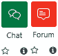

图 8.1 – Moodle 4.0 中的更新图标

让我们考虑**论坛**和**聊天**活动的最有效用途。在您审查学习目标并寻求将课程材料与课程活动相匹配时，思考您如何使课程围绕论坛和聊天构建，以便保持对学生的关注。这将激发学生对内容的探索，并分享他们的想法和印象。如果您围绕共同解决问题或探索神秘事物的某个方面创建论坛，您将创造一个难忘的学习体验。

起初可能难以想象，但在实践中，这相当简单。在您设置课程时，确保在每个单元中都包含一个论坛。然后，您可以使用论坛进行以下用途：

+   为个人或团队设置需要解决和分享的问题。营造一种神秘感，或者解决当今世界的一个实际问题，这可能包括角色扮演。它可以是本地的或全球的。例如，您可以要求学生解决流浪狗和猫的问题，这些狗和猫的业主只是简单地遗弃了它们。或者，您可以提出需要挖掘和想象的问题：*想象一下，你穿越时空到了一个你必须成为海盗才能生存的时代和地方。你会在哪里？什么时候？你的日常生活会是什么样子？你会穿什么？你会如何进行海盗活动？*

+   提供相关的教学材料。将这些材料放在论坛上的优势在于，您可以允许讲师发表评论并添加更多材料、评论等。

+   通过将问题与学习目标联系起来来展示学习目标的实现。

+   通过提出以教学材料为重点的讨论问题来确保学生对单元内容的理解。学生可以阅读材料，并立即发表评论和分享他们的印象。

+   发布草稿和同行评审。这是一个发布论文草稿或评论并包括评分标准的好地方，无论是用于同行评审还是最终评分。Moodle 使评分标准的整合变得简单。这可以与工作坊同行评审活动相结合。

+   发布当前争议、文章链接和多媒体链接。

+   设置需要协作的项目，并鼓励使用协作平台，如 Google Drive 中的 Google Docs。

考虑您希望学生做什么的优势有助于您思考他们如何相互互动，并证明他们正在实现单元学习目标。这样做，他们将相互学习。

在下一节中，我们将通过设置包含积极强化和激励内容的引人入胜的论坛和聊天模块来将相互学习付诸实践。

# 相互学习

您可以设置论坛和聊天模块，以便学生能够在最佳条件下相互学习：

+   首先，你可以确保提示具有吸引力，不会导致只有“是”或“否”的答案。要富有创意，激发一种惊奇和发现的感受。

+   第二，你可以要求学生分享他们的工作并以积极、建设性的方式评论。例如，你可以要求学生发布演示文稿的草稿。这将设置积极的强化，这非常有激励作用。

+   第三，你可以鼓励学生分享经验和当前事件中的事物。所有这些活动和提示都将非常吸引人，并且它们将作为优秀的激励因素。如果他们正在解决一个当前的地方问题，比如流浪猫狗的问题，他们甚至可能会决定组织一个宠物领养日，为那些被捕获、清洁、接种疫苗并准备好进入他们新的、快乐的“永远”家园的流浪动物组织领养活动。

+   最后，你可以提醒学生注意截止日期，并包括待办事项清单。这将帮助学生组织他们的工作并有效地管理时间。

在下一节中，我们将学习如何将论坛和聊天结合起来，以便同步和异步通信的整合。

# 设置 Chat

当你需要快速、即时的反馈时，Chat 非常有用。在 Moodle 4.0 中，Chat 可以设置为即使你不在浏览器中打开 Moodle，也能接收消息。请记住，Chat 是 Moodle 从早期版本就有的功能，它不像 Moodle 中的其他活动那样更新。尽管如此，它已经集成到 Moodle 中，因此可以很方便，尤其是如果你不想离开 Moodle（进入 Teams 等等）进行聊天或消息功能。聊天记录会自动保存，因此可以帮助讲师确保他们已经回答了学生的问题。那么，让我们开始吧：

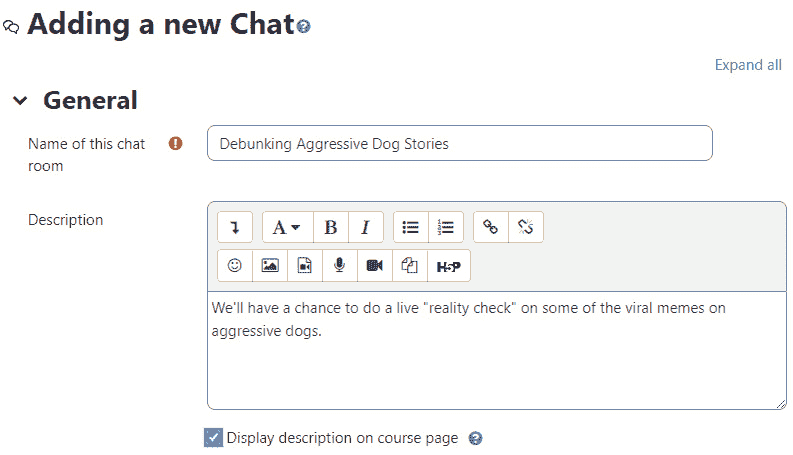

图 8.2 – 添加新的 Chat

有时，同步或实时沟通是有帮助的。当我们需要快速回答或想提出一个相对非正式的问题时，我们经常使用智能手机发短信。现在许多机构使用 Teams、Google 产品或 Zoom 进行聊天和实时视频会议，Chat 可以集成到 Moodle 中。Moodle 有自己的 Chat，但使用你所在机构的平台（如 Teams）有其优势。在这种情况下，你将登录 Moodle，但你的 Teams 应用程序将同时在你桌面、平板电脑或手机上运行（就像它通常那样）。

如果你的机构不使用 Teams 或其他基于云的生产力或协作应用，并且更喜欢所有人都只参与 Moodle，那么 Moodle 的聊天功能是一个不错的选择。例如，如果你是一个培训机构，并且正在吸引来自许多组织、团体或学校的学生，那么通过每个人的 Teams、Zoom 或 Google 账户进行沟通将是不可能的。相反，最好使用 Moodle 的聊天功能。此外，个人可能会使用 WhatsApp 或短信。然而，如果你使用 Moodle 的聊天模块，你可以在 Moodle 中保存聊天对话。保存聊天转录本对于希望确保他们正在沟通的讲师来说非常重要，同时也对于可能希望保留他们所说的话记录的学生来说非常重要。

在在线课程中生成的最流行的文本形式可能是通过实时字幕生成的，例如 Zoom 和 PowerPoint 都提供了这项功能。转录本可以保存并用作笔记。那些在授课时发现自己说出最有见地的话的讲师可以使用实时转录本的聊天文本作为他们下一篇文章或书籍的灵感来源。值得注意的是，协作聊天是撰写书籍《愤怒经济学》（[`www.gapingvoid.com/blog/2020/02/27/why-we-wrote-angrynomics-by-mark-blyth/`](https://www.gapingvoid.com/blog/2020/02/27/why-we-wrote-angrynomics-by-mark-blyth/))的方法，这本书是由两位作者记录他们的对话并使用语音转文字进行转录而诞生的。

Chat 的另一个优点是，学生们可能使用语音转文字应用（例如，Zoom、YouTube Live 和 Google 中内置的闭路电视字幕），这些应用会自动插入麦克风头像或标志。你可以将其作为辅助技术使用，因为它是一个让学生练习语音转文字的好方法，同时对于那些视力或身体活动受限的学生来说也非常有帮助。

聊天室对于小组中的学生来说可能很有用。然而，与整个班级进行聊天并不一定是好主意，因为如果人们同时评论，线程可能会很快丢失。

当你将聊天室添加到课程中时，默认情况下，课程中的任何学生都可以随时进入这个聊天室。与其他活动一样，可以设置访问限制来覆盖这个默认设置。**课程聊天室**区域可以成为课程中学生的聚会地点，他们可以在这里协作工作和交流信息。如果你布置小组作业或让学生评价其他学生的作业，考虑添加聊天室并鼓励学生使用它。此外，考虑保存聊天会话的转录本，这样它们可以作为学生的其他参考工具。

当您安排聊天会话时，预定时间会出现在**课程日历**区域，并在**即将发生的事件**块中显示：

![img/Figure_8.03_B17288.jpg]

图 8.3 – 在日历中安排聊天会话

由于聊天模块始终开放，当您在日历上设置聊天时，您并不是限制对聊天模块的访问。您只是在提醒学生何时点击聊天模块。您还可以在不需要学生进入时隐藏聊天。

如果一个五六个以上的群体想要进行交流，通常使用讨论板而不是聊天会更好。话虽如此，如果您正在启动网络研讨会，始终提供聊天功能来发送问题和评论，并在出现技术困难时提醒讲师是很好的。BigBlueButton 和 Zoom 都内置了聊天功能，这样人们可以通过聊天进行交流，同时他们也可以通过视频或纯音频进行对话。

当学生选择聊天时，他们会看到您在创建聊天时输入的描述。您可以使用这个**描述**来指导学生关于聊天的目的：

![Figure 8.4 – 为聊天开发描述

![img/Figure_8.04_B17288.jpg]

图 8.4 – 为聊天开发描述

当您进入聊天时，它将启动一个弹出窗口。您可以选择两种主题：**泡泡**或**紧凑**，我选择了**泡泡**。确保您的学生没有阻止弹出窗口：

![Figure 8.5 – 使用聊天中的泡泡主题。

![img/Figure_8.05_B17288.jpg]

图 8.5 – 使用聊天中的泡泡主题

让我们看看您将用于创建聊天室的设置。

## 聊天设置页面

**添加新聊天**页面是您创建和选择聊天设置的地方。当您第一次添加聊天时，您将被带到这个页面。要编辑现有聊天的设置，请选择聊天。然后，从水平顶部菜单栏中选择**设置**。这将带您到同一个页面，但名称将是**更新聊天**而不是**添加新聊天**。这两个页面都有相同的设置。

请记住，为聊天室输入名称会生成一个弹出窗口。当您添加聊天时，您需要将其添加到日历中，以便它从学生的**仪表板**中的**日历**块中显示出来：

![Figure 8.6 – 聊天在仪表板日历块中的显示方式

![img/Figure_8.06_B17288.jpg]

图 8.6 – 聊天在仪表板日历块中的显示方式

让我们考虑一下您在这个页面上可以设置的选项。请注意，与所有活动一样，您现在有机会将聊天与能力挂钩，以便它能够满足这些能力。您还可以为社交媒体使用标记话题，并且您还可以限制访问权限，以便聊天在组内进行。

以下截图显示了如何描述聊天室以及如何点击以限制访问。请注意，在 Moodle 4.0 中，你可以根据达到及格分数来限制访问。虽然这种限制对于像测验这样的活动可能显得更重要，但它确实阻止了学生在准备好并证明他们掌握了学习目标之前继续前进：

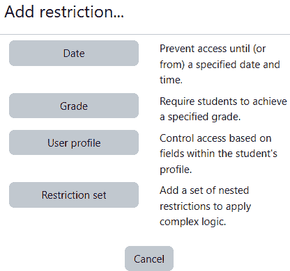

图 8.7 – 限制对聊天的访问方式

一旦你命名了聊天室，它就会出现在你的课程主页上。

### 聊天室的名字

这是学生在课程主页上看到的名字：

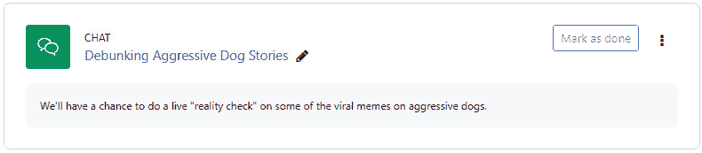

图 8.8 – 聊天室在课程主页上的显示方式

### 描述

当学生进入房间时，其**描述**将显示出来。确保描述清晰易懂，不会使学生感到困惑或分心。

当学生选择聊天时，他们将在点击聊天室之前看到介绍文本。你还可以在课程主页上显示描述。

### 安排办公时间

在重大考试或大项目之前安排虚拟办公时间通常是个好主意。这样做的一个好方法是为聊天会话创建日历条目，然后将其提供给所有课程成员。然后，你可以回答问题。请确保保存聊天记录，因为许多人可能有相同的问题，但可能无法同时参加。在这种情况下，论坛可以用作考试复习或常见问题解答网站。你可以在这里发布你的聊天记录。请记住，你的聊天室将始终开放，而不仅仅是办公时间。日历上你的办公时间通知只是意味着你将在那里等待问题。

### 下一次聊天时间和重复/发布会议

如本节开头所述，只要聊天对学生可见，他们就可以随时进入该聊天室。因此，**下一次聊天时间**和**重复会话**的设置不会打开和关闭聊天。相反，这些设置将聊天的时间和日期放在课程日历上。

聊天时间列在**日历**和**即将发生的事件**块中。请注意，聊天并不局限于这些时间；它们只是作为课程中的人安排聊天时间的一种方式。然而，这对于教师宣布在线办公时间和帮助学生通过安排时间进入聊天室讨论他们的工作和可能的协作项目来说是一个好方法。

如果课程中有许多经常访问课程主页的学生，自发的聊天更有可能发生。此外，考虑添加**在线用户**块，这样当学生访问网站时，他们就会知道谁在线，并可以邀请其他人进入聊天室。

### 保存过去会话 – 保存过去会话，所有人都可以查看过去会话

过去聊天记录会自动保存。**保存过去会话**设置允许您选择系统保存聊天记录的时间长度。**所有人都可以查看过去会话**设置确定学生是否可以查看过去的聊天记录（**是**）或只有教师可以（**否**）。

## 聊天记录

聊天室的安全措施仅限于开启分组模式，这样只有所选组的学生才能在聊天室中相互看到。您可以在**通用模块设置**下找到分组设置。

请记住，在**课程设置**页面，您可以将**注册期限**设置为**无限期**。这意味着一旦学生注册了课程，他们就会一直注册，直到您手动取消学生的注册。如果您将课程对所有曾经注册的学生开放，请考虑将聊天分组。然后，创建一个只包括当前注册学生的组：

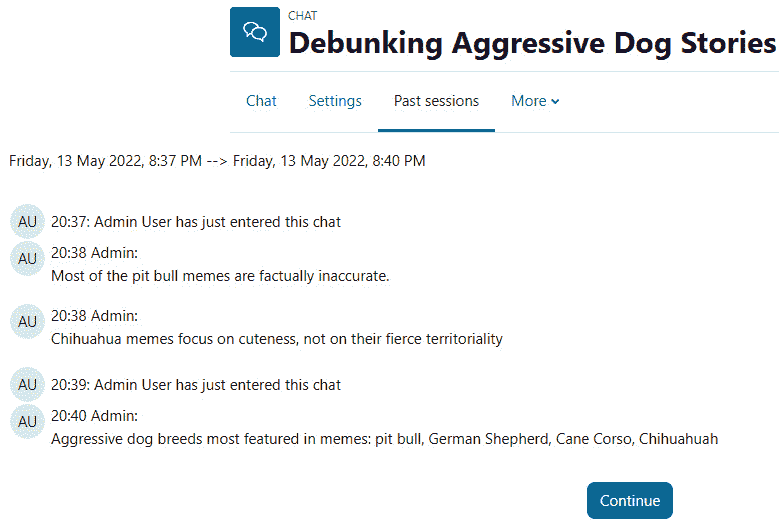

图 8.9 – 聊天记录视图

一旦您以聊天形式设置了同步通信，您就可以考虑开发异步学生参与和通信的形式，即 Moodle 中的论坛。

# 添加和运行论坛

讨论板，也称为论坛，是 Moodle 的核心，它们为您提供了一种组织和管理小组项目和研究的方法，增加学生互动，提供同行评审，分享信息和传播课程内容。您还可以使用论坛提供评估链接。许多教师将论坛作为组织课程内容的主要方法。例如，在一个八模块的课程中，您可以每周通过论坛来引导。在论坛的描述中，您可以包括阅读材料和多媒体（音频、图片和视频）的链接。然后，您可以向学生提问，让他们在论坛中回答。

我们可以通过创建**论坛**活动开始。在您从活动菜单中选择**论坛**后，您将被要求为论坛命名。

要添加**论坛**活动，我们可以遵循与其他活动相同的程序。点击**添加活动或资源**，然后选择**论坛**图标。如图所示，您可以命名并描述论坛，还可以查看不同的设置：

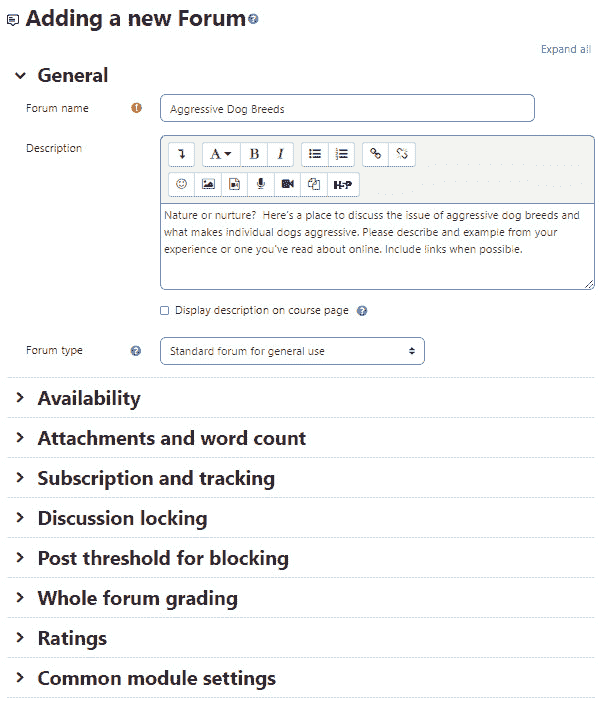

图 8.10 – 添加新论坛屏幕，包括添加名称和描述的位置

通过将课程内容与论坛联系起来，你强调了互动和参与。参与是保持人们取得令人满意的学业进步的关键，所以这是一件好事。如果你管理好论坛并激励学生积极互动，你可以激发深思熟虑的讨论并激励学生参与，这将导致意想不到且引人入胜的见解。

将通过论坛的积极和持续参与理念推向极致，你也可以创建一个只包含论坛的课程。课程的首页就是论坛。课程将只包含讨论主题。你可以通过课程设置下的**社交**课程类型来实现这一点。

使用这种结构，你需要仔细规划。讨论主题需要与单元相对应，放置课程阅读材料、视频、学生回答和评估链接时也需要保持一致性。

## 多个论坛

记住，一个班级可以拥有你想要的任意数量的论坛。如果你的课程使用分组，你可以在论坛中使用分组。此外，你可以隐藏旧论坛并创建新的论坛。如果你按计划为学生开设课程，这很有用。只需关闭旧论坛并创建新论坛，你就可以刷新课程的部分内容。

### 论坛设置

**设置**页面是选择论坛设置的地方。可以通过访问**管理** | **论坛管理** | **设置**来访问。让我们看看每个设置如何影响用户体验。

### 一般设置

一般设置影响论坛的外观和功能。

#### 论坛名称

这是学生在课程首页看到论坛时的名称。

#### 论坛描述

当学生进入论坛时，他们会在论坛页面的顶部看到**论坛描述**。这段文字应该告诉学生论坛的内容。你也可以利用这个介绍告诉学生他们是否可以评价其他学生的帖子。它还告诉学生如何链接到包含更多如何使用论坛的详细说明的文档。这是因为描述是一个功能齐全的网页，可以包含你在网页上放置的任何内容。

与其他活动一样，如果你勾选**显示描述**框，描述将在课程页面上显示。

#### 论坛类型

在 Moodle 上，你可以创建几种类型的论坛。每种类型都可以以不同的方式使用。以下截图显示了不同类型的论坛：

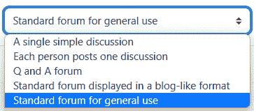

图 8.11 – 选择论坛类型的下拉菜单

以下表格更详细地审视了每种论坛类型。**通用论坛**可能是课程中最受欢迎的，然而，包含一个**问答论坛**也非常重要，尤其是对于学生的成功至关重要：

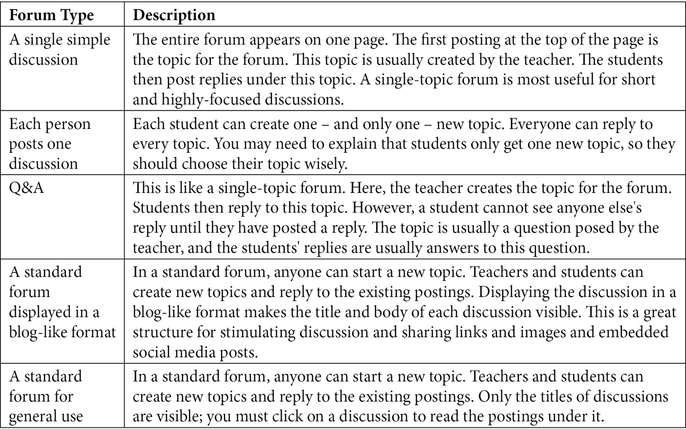

图 8.12 - 论坛类型

#### 最大附件大小

学生可以将文件附加到论坛帖子中。这设置了学生可以上传的最大文件大小。其中一个设置关闭了学生向**不允许上传**论坛上传文件的能力。

#### 最大附件数量

这设置了单个帖子可以附加的最大文件数量，而不是整个论坛的最大数量。

#### 显示单词计数选项

当设置为**是**时，论坛将显示每篇帖子中的单词数量。单词计数显示在帖子的底部，因此你只有在点击了帖子之后才会看到单词计数。这对于“用 100 个单词或更少来解释”这类活动很有用。它还可以连接到评分标准。我们将在本书的后面讨论评分标准。有关评分标准的优秀指南，请查看俄克拉荷马大学创建和使用评分标准的有用清单和指南：[`www.ou.edu/assessment/faculty-resources/creating-and-using-rubrics`](https://www.ou.edu/assessment/faculty-resources/creating-and-using-rubrics)。

#### 订阅模式

选择**强制订阅**会自动将所有学生订阅到论坛（即使是在之后时间注册的学生）。在使用此设置之前，请考虑其对曾经参加你课程的学生长期影响。

如果你为后来的学生群体重复使用相同的课程，之前的学生群体仍然会被注册。你希望之前的学生被通知当前班级论坛的新帖子吗？如果不希望，有几种解决方案：

+   不要强制所有学生都订阅。

+   使用分组来区分当前班级中的学生群体和之前的学生群体。

+   为每个新的学生群体创建一个全新的课程实例。

+   重置课程，这将取消注册过去的学生。

+   为新的学生群体创建一个新的论坛。

如果你选择**自动订阅**，课程中的每个人都会被订阅到论坛，但之后他们可以取消订阅。使用**强制订阅**，只要学生注册在课程中，他们就不能取消订阅。

#### 阅读跟踪

当开启时，这将突出显示学生尚未阅读的论坛帖子。

一旦你审查了如何设置论坛，你就可以退后一步，开始思考你论坛的用途。在下一节中，我们将学习如何使用论坛来提供内容，以及激发互动和参与。

## 使用公告论坛进行通知

Moodle 通过设置一个名为公告论坛的特殊论坛来简化了通知学生一般新闻和公告的方式。这个论坛在新课程中自动创建，通常只有一个，除非在非常特殊的情况下，它是从不同的系统中导入的。

您新创建的自动生成的公告论坛默认放置在中央部分的顶部。发帖仅限于教师、经理和管理员。默认订阅设置是“强制订阅”。您可以设置公告论坛中显示的讨论数量。

如果您不想有公告论坛，您可以通过几种方式将其删除。最简单的方法是简单地隐藏公告论坛。这是推荐的，因为您可能希望在将来某个时候发布公告。其他方法包括从课程主页删除公告论坛或删除**最新公告**模块。

如果出于某种原因，您不希望默认自动创建公告，您可以在**课程**默认设置中简单地设置`0`。如果您想在其中一个或两个课程中拥有公告论坛，您仍然可以覆盖此设置。

现在您已经知道了如何设置不同类型的聊天和论坛模块，您可以考虑如何将协作提升到一个新的层次。在下一节中，您将学习如何设置链接到您组织提供给学习者的协作平台。

## 基于论坛的内容交付

如我们之前提到的，一种非常方便的内容交付方式是创建与课程周数相对应的论坛。例如，如果您有一个 8 周的课程，您可以创建八个独立的论坛。每个论坛都可以对应您希望学生阅读的特定内容（文本、模块、视频、音频、演示文稿等）。通过在论坛帖子中放置链接，您可以确保每个人都以相同的速度完成课程并覆盖相同的内容。您可以在论坛中包含一些问题，并开启允许学生提问和反思材料的线程。这是一个添加一些反思问题的好地方。在您开发问题的时候，确保它们结构化，以便每个人都能给出独特、个人的答案。例如，您可能要求学生找到一个与主题相关的文章或网站的例子。您也可以要求他们描述自己的经历。避免可以给出是/否答案的问题，或者会导致相同回答的问题。

## 基于论坛的作业

通过在你的论坛中组织作业，你可以确保将必要的内容和评语附加到作业上。例如，你可能希望让学生写关于阅读的论文。如果你这样做，你可以在论坛中描述论文，包括期望，甚至包含评分标准。例如，如果你要求学生写一篇关于阅读的简短回应，你可以发布阅读链接、一系列指导性问题以及他们将要撰写的论文结构的描述。然后，你可以包括一个关于标准（字数、内容、结构、组织、语法、机械等）的清单。你可以为学生们开启一个发问的线程，并且可以提供一个到 Dropbox 的链接，这样他们可以一键提交他们的作业。

使用基于论坛的作业的一个优点是，如果你有任何想要做出的更改，你可以确信大多数学生会看到这些更改，因为它们将发生在每个人都在访问的同一位置。这是一个“一站式购物”的作业点。

这是一个创建作业的完美场所，鼓励学生应用知识，例如解决当前问题或问题，或对需要创造力和想象力、理解学习材料以及寻找和发现新内容（可能是在你的在线图书馆或基于网络的存储库和出版物中）的主题进行研究。

## 基于论坛的同行评审

论坛是提高学生参与度的绝佳方式，因为他们可以以有意义的方式相互交流，从而使在线体验更加人性化。使用论坛进行同行评审也是一个好主意，但你需要确保你建立了良好的规则，因为毕竟论坛是一个公共场所。如果你想有一个更详细和更细粒度的同行评审互动，并且希望能够轻松地评分每个互动，那么“升级”到 Moodle 的工作坊活动会更好。如果你将论坛用作学生开始线程、发布草稿并相互回应草稿的地方，你需要确保他们保持评论积极和富有成效。一个很好的方法是提供一个需要回应的项目清单。如果你想对每个清单项进行评分，那么使用工作坊活动而不是论坛活动会更好。例如，你可以要求学生回应一系列问题：

+   你喜欢这篇帖子中的哪些内容？

+   这篇帖子可以如何更加具体或提供更多细节？

+   当你阅读这篇帖子时，你什么时候想要了解更多信息？作者可以提供什么？

关键是保持同行评审问题简短，避免太多。毕竟，你希望激励学生互动，而不是让他们因为害怕而完全避免论坛。

## 基于论坛的评审和链接到评估

论坛是一个提供自包含的测验、考试复习和实践的好地方，在学生参加完整考试之前。为了组织论坛以进行评估复习、练习和表现，最好的方法是将论坛标题与评估中涵盖的主题联系起来。然后，您可以创建一个链接到关键内容，并描述学习目标或成果。之后，您可以包括一些复习问题。确保您的练习或复习问题与他们在最终评估中将要参加的问题格式相同。

实践论坛是学生培养自信和“我能做到！”态度的好地方。培养自信的方法是允许在实践测试中提供反馈，并允许学生多次参加测试或测验。确保您始终将链接回包含正确回复或所需信息的课程内容。

现在我们已经了解了 Moodle 论坛活动的结构和功能，我们可以深入探讨如何通过论坛开始、发帖和进行交流。请记住，在您使用论坛的过程中，您可能会希望使用工作坊而不是 Moodle 论坛。为了做出这个决定，您需要回顾课程中的目标，并评估学生管理论坛的难易程度。如果他们对论坛易于导航的结构感到舒适，但对更复杂的活动感到困惑，那么坚持使用论坛活动是最好的选择。

## 开始和发帖到论坛

当学生进入一个通用论坛时，他们会看到在创建论坛时输入的描述，如下面的截图所示：

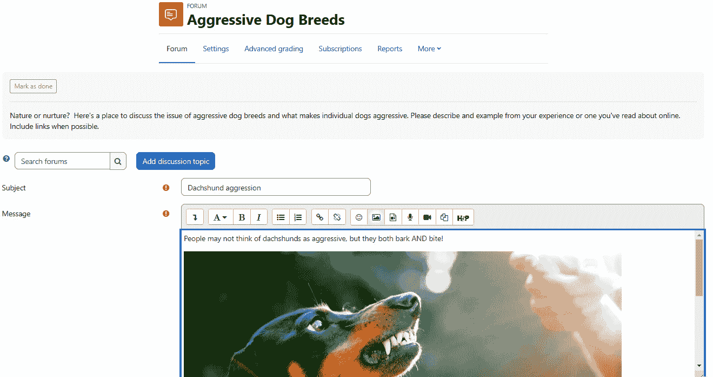

图 8.13 – 在论坛活动中发帖

一旦您点击**保存**，论坛将列在**讨论**下。其他学习者将能够点击主题并添加回复。请注意，有几个选项，包括**永久链接**、**编辑**、**删除**和**回复**。

鼓励学生通过点击主**讨论**屏幕上的**订阅**按钮来订阅论坛。当有人发帖时，他们会收到通知，这可以非常吸引人，尤其是如果学生使用平板电脑或手机，他们可以快速回复：

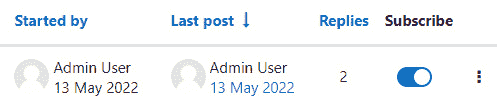

图 8.14 – 订阅论坛活动以在有人发帖时接收通知

您可以设置显示回复的方式。以下截图显示了可用选项：

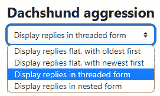

图 8.15 – 如何配置显示回复的方式

要发表回复，只需点击**回复**并输入回应。以下截图显示了文本框。要添加图片、文件、链接、表情符号、HTML5 等，你需要点击**高级**以打开完整菜单：

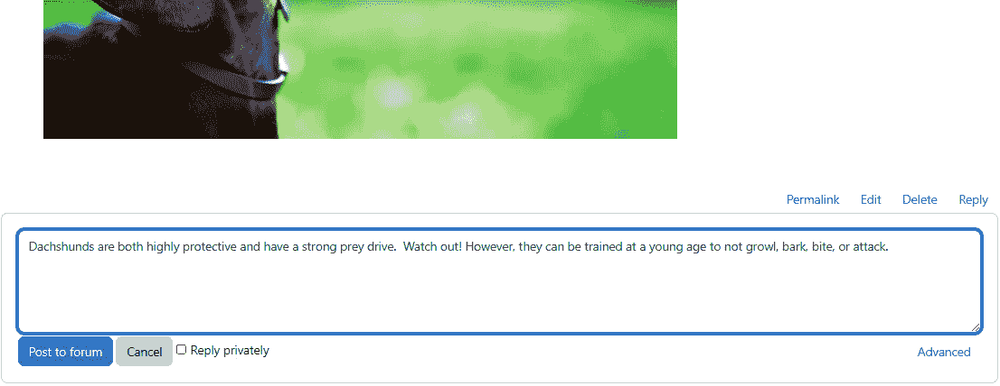

图 8.16 – 未启用格式化栏的论坛活动

点击**高级**后，将打开水平格式化栏，你可以从不同的格式和信息共享选项中选择，如下面的截图所示：

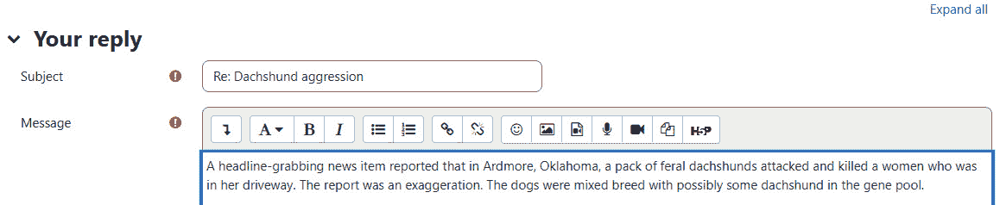

图 8.17 – 启用格式化栏的通用论坛的学生视角

如果你想要确保学生看到讨论，你可以将其标记为星标。你也可以将其固定在模块顶部。如果你不想再看到任何帖子，你可以锁定讨论。在 Moodle 4.0 中，你将自动订阅讨论，以便在有人发帖时收到通知。如果你不想接收推送通知，你可以取消订阅：

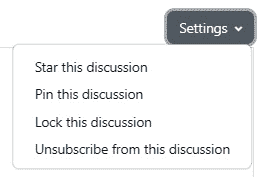

图 8.18 – 允许你对论坛活动进行操作以使其更容易查看并避免分心的讨论设置

如果你要求学生协作完成作业或要求他们互相审阅作业，考虑添加一个专门用于讨论作业的论坛。有些人可能会用研讨会来达到这个目的，但论坛效果很好，因为学生可以通过非正式的方式阅读彼此的草稿，从而对自己的作品更有信心。此外，论坛是讨论范例工作的好地方。然后，为了进行更细致的同行评审，你可以使用研讨会。

为了鼓励协作，你可能希望以平面格式显示论坛帖子，最新帖子排在最前面。这个选项显示了文本，这可能很有趣，并能激发学生的好奇心，鼓励他们参与和发帖：

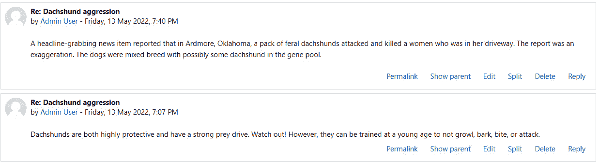

图 8.19 – 以平面格式显示的论坛

你可以将论坛与偶尔的同步讨论结合起来，以提供混合体验，这种体验结合了同步和异步的交流。这样，你将通过创建一个开放、欢迎的环境来激励学生，学生可以在论坛上预览彼此的作品，并通过论坛非正式地分享和协作完成作业。

# 链接到协作平台（功能增强器）

论坛是互动的，通常是协作活动，因此它们可以鼓励学生相互学习。有时，让学生在单个文档上协作是有用的。学生可以在共享文档中协作。在 Moodle 论坛中，拥有一个协作文档可以鼓励人们添加内容。它不像 Moodle 的工作坊那样进行细致的同行评审和评估，也不打算成为一个维基。它只是用来鼓励参与。这可能看起来很复杂，但事实上很简单，尤其是如果你的学校或组织使用 Microsoft Office 365 产品和 OneDrive，或者如果学生有一个提供他们访问 Google Drive、Docs、Sheets 等的 Google 账户。他们还可以使用其他协作空间，如 Dropbox。对于更复杂的任务，学生可能在具有时间线和关键路径的电子表格中进行协作。一些组织使用项目管理工具，如 Basecamp 或 Slack，来通知团队成员里程碑并建立自动警报。Google Drive 可能是一种更简单的方法，因为它与电子邮件和其他应用程序集成。

他们可以按照以下步骤操作：

1.  登录他们的学校共享驱动器账户。让我们以 Google 为例。

1.  前往 Google Drive。

1.  为课程设置一个文件夹。

1.  打开文件夹。

1.  在文件夹内创建一个新的 Google 文档（这可以是一个文档、表格或其他内容）。

1.  为文档命名。

1.  获取文档的链接并在论坛中发布。你可以设置任何人只要有链接就能查看文档。你也可以授权你的合作伙伴能够编辑文档。你需要他们的 Gmail 邮箱地址。非 Gmail 地址似乎与 Google Drive 不太兼容，Gmail 会自动发送一封请求权限的电子邮件。

一旦设置了文档，你可以在进展过程中让班级中的人看到你在做什么。如果你希望保持草稿和进度私密，你可以简单地更改设置，以便只有有权限的人才能查看和/或编辑文档。

使用协作平台而不是通过电子邮件来回发送文档的一个优点是，它更容易进行版本控制。此外，一旦完成一个草稿并且每个人都已贡献了自己的内容，你就可以开始一个新的文档，表明这是一个新的修订版或版本。有时，在主文件夹内保持单独的文件夹以保持一切清晰和井然有序是最容易的。

如果你的组织使用 Teams，你可以在**文件**中设置一个文件夹进行文档协作。在这里，你可以添加文档，你的团队中的任何人都可以协作。如果你使用 Google Classroom，你可以与 Moodle 结合使用，以便访问共享的 Google 文档。你只需包括一个指向 Google 或 Google Classroom 中共享文档文件夹的链接。

# 摘要

在本章中，你学习了如何通过创建学生之间互动和学习的地方，无论是在实时（同步）还是在按需（异步）的情况下，使用聊天和论坛来营造冒险和兴奋感。

在了解如何最佳地使用聊天和论坛活动来鼓励参与和激励学生方面，我们回顾了不同类型及其目的。我们还讨论了 Moodle 4.0 如何使学生在彼此之间互动以及教师确保学生在准备好的情况下不提前跳跃变得更加容易。Moodle 4.0 专注于学生成功。

在下一章中，你将学习如何使用维基和术语表来鼓励学生之间的协作。你将学习如何将协作作为一种教学策略，以及如何在 Moodle 中选择特别有效的协作活动。
