# *第九章*：使用维基和词汇表进行协作

协作可以是社会建构主义的基础，也是学生真正相互学习的地方。他们可以分享他们的见解，设定目标和目标，并将先前学习带入他们的协作中。此外，协作还允许学生开发可以应用于现实世界的知识体系或项目计划。

一种协作策略是让学生参与需要每个人为最终产品做出贡献的活动。两种流行的活动是信息维基和基于主题的词汇表。虽然维基和词汇表活动可以单独完成，但它们是协作的完美载体。关键是检查学习目标并确定如何最好地实施它们。在本章中，我们将讨论各种策略，让学生参与协作并激发他们相互学习的兴趣。

本章向您介绍如何开发有效的协作活动，通过在课程中添加维基和词汇表，让您实现学习目标。这是一种建立社会建构主义并实施心理学家列夫·维果茨基最初发展的理论的方法，他讨论了人们在群体环境中首先如何学习，然后，在个人层面上如何学习。虽然这种学习在任何互动中（如论坛、研讨会等）都会发生，但在维基和词汇表中，重点是协作的最终成果，因此互动可以更加专注。这些活动使学生能够共同工作并建立知识体系。由此产生的知识集合（完成的维基和词汇表）可以在未来的课程中被学生重新使用。随着课程的演变，过去学生创建的维基和词汇表可以保留、编辑、引用和扩展。

具体来说，在本章中，我们将学习以下主题：

+   确定在异步、同步和混合 Moodle 课程中使用最佳协作活动

+   将词汇表和维基活动与我们的学习目标相一致

+   为各种交付模式开发词汇表活动以促进协作

+   为各种交付模式开发维基活动以促进协作

在本章中，我们将结合同步、异步和混合交付的需求与协作，这是一种强大的学习策略。到本章结束时，您将能够使用 Moodle 的维基和词汇表进行有效的协作学习。

# 将协作作为一种教学策略，以复制当今的工作环境

在我们分布式的世界中，人们从一个地方移动到另一个地方，仍然相互沟通并共同开发工作产品，了解如何在虚拟环境中有效地协作是必要的。因此，对协作的强调也有其实用的一面。Moodle 的维基百科和词汇表活动复制了人们在职场中使用基于云的协作来生成报告、指南、营销材料等方式。

虽然维基百科和词汇表通常是异步的，但它们也可以结合同步网络会议。这也复制了今天的职场环境，使 Moodle 课堂在培训人员方面更加有效，不仅是在学科内容上，而且在新的工作和学习方式上。

我们使用 Moodle 正是因为其灵活的架构——一种鼓励相互学习的结构。向词汇表、维基百科和其他协作活动做出贡献的能力，使学生能够以强化和奖励的方式贡献知识。因此，这是一种将动机、自信和好奇心结合起来的教学策略，为学习创造了条件。此外，它也是一种加强先前知识并积累经验的方式，因为学生在回忆过去的学习、增加他们已知的内容并反思他人贡献的同时，这样做。它也是一种克服孤立和距离的负面影响，以及使孤立工作的体验重新人性化的策略，这可能会令人不安地困难。

因此，协作可以是一个非常有效的教学策略，并且词汇表、维基百科和其他学生可以贡献的区域可以成为他们未来将展示的知识和技能的基石。当你阅读本章时，请参考*第十三章*，*教师功能：日志、报告、指南*

同样。在第十三章中，你将学习如何在 Moodle 中连接许多不同的元素。我们将从词汇表活动开始。

# 词汇表

**词汇表**活动是 Moodle 中最被低估的活动之一。表面上，词汇表是一个学生可以访问的单词和定义列表。然而，课程创建者允许学生向词汇表添加条目。添加条目将词汇表从静态的词汇列表转变为学习目的的协作工具。它还具有自动链接功能，这意味着每次在课程中使用该单词时，它都会自动链接到词汇表条目：

图 9.1 – 词汇表图标

如果您的学习目标要求个人能够识别、定义和描述项目或现象，**词汇表**活动是理想的。例如，您可能有一个关于旅游的课程，并希望开发一个特定领域的专业术语词汇表；例如，关于*文化旅游*的术语。学生可以协作并制作一个定制的词汇表，这有助于他们在课程期间，以及后来在他们的职业生涯中。

一个名为**自动链接**的文本过滤器会在您的课程中创建指向词汇表条目的链接。当站点管理员将其打开，并且**词汇表**活动中的一个单词出现在课程中时，它会高亮显示。点击该单词会弹出一个包含该单词在词汇表中的条目的窗口。条目可以包括文本、图片、媒体和链接。这是一个专门用于定义和阐明词汇表术语的微型页面。自动链接功能使协作可能性更加丰富。例如，学生可能被分配特定的词汇表术语，他们将以这些术语为基础撰写说明性段落或文章。

您可以使用词汇表来构建班级目录、过去考试题目的集合、著名引言，甚至是一个带有注释的图片集合。

让我们看看如何在 Moodle 中启用词汇表和自动链接功能。

## 启用词汇表和自动链接

让我们从一些行政管理工作开始。在教师可以设置词汇表作业之前，需要在系统中启用它。因此，请确保站点管理员首先看到这一点。站点管理员需要在几个地方启用**词汇表**及其功能。

当**词汇表自动链接**打开时，一个词汇表术语会出现在课程中，并链接到其词汇表条目。链接看起来是这样的：

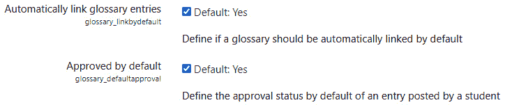

图 9.2 – 词汇表功能中的自动链接

当词汇表中的术语在位于同一课程中使用时，自动链接会创建链接。

## 为您的站点启用词汇表

首先，在**站点管理** | **插件** | **活动模块** | **管理活动**下，站点管理员必须启用**词汇表**活动。默认情况下，Moodle 上的**词汇表**活动是启用的。只有当您在**添加资源**或**活动...**菜单中看不到词汇表时，才需要启用它：

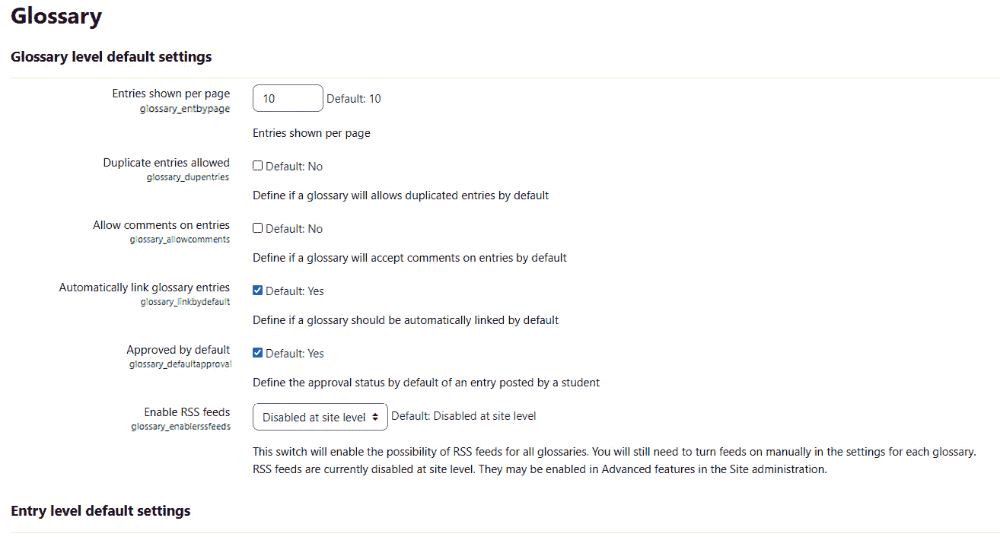

图 9.3 – 为您的整个站点启用词汇表

在您为整个站点启用词汇表之后，您可以确定它将如何使用。

## 启用自动链接

术语表自动链接需要在站点、课程和活动级别启用。如果您创建了一个术语表，但它没有自动链接到您的课程，请检查在站点、课程和活动/资源级别是否启用了术语表自动链接。随着我们的进行，每个这些级别都将被涵盖。

### 启用站点的自动链接

在**站点管理** | **插件** | **筛选器** | **管理筛选器**下，站点管理员可以开启术语表自动链接：

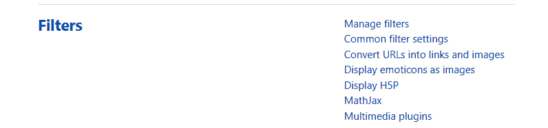

图 9.4：站点管理页面显示筛选器

当您看到筛选选项时，点击**管理筛选器**。您将能够启用术语表自动链接，如下所示：

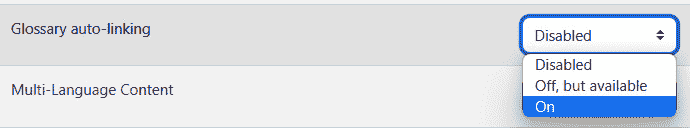

图 9.5 – 站点管理页面显示如何开启术语表自动链接

**禁用**设置移除了教师开启课程中自动链接的能力。默认情况下，**关闭，但可用**设置关闭了自动链接，但允许教师在课程期间开启它。**开启**设置在您的站点上为所有课程开启了自动链接。

在右侧列中，注意用户已选择在活动或资源的内容中启用自动链接。此外，您还可以选择**内容和标题**，这将开启活动或资源内容以及该活动或资源标题中的单词的自动链接。

### 启用课程自动链接

如果站点的自动链接设置设置为**开启**，您不需要在课程级别启用它。如果站点的自动链接设置设置为**禁用**，则在课程级别无法启用它。此设置在站点设置为**关闭，但可用**时可用且必要。

在**管理** | **课程管理** | **筛选器**下，教师必须开启**术语表自动链接**。如果此功能被禁用，则课程中的任何术语表都不会启用自动链接。

### 启用活动或资源的自动链接

如果您已为站点和课程启用了自动链接，但它仍然不起作用，请检查您所在的活动或资源的自动链接设置。在**管理**菜单中，查找您所在资源或活动的管理选项。选择**筛选器**，在筛选器页面上开启**术语表自动链接**：

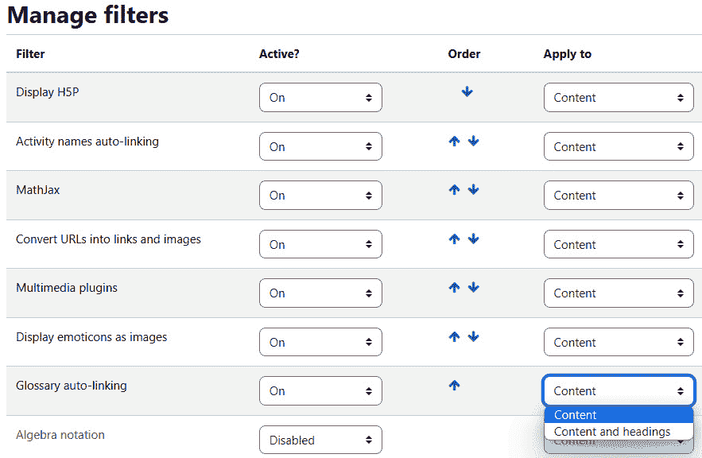

图 9.6 – 确保在站点主页设置中启用了自动链接

在站点上启用了术语表之后，您可以从添加与课程涵盖的类别或主题相匹配的个别术语表开始，这些术语表对于满足学习目标来说是必要的。

# 添加和配置术语表

现在网站管理员已经启用并配置了词汇表活动，你可以开始添加和配置词汇表了。通过点击课程页面上的**添加活动或资源**，然后选择**词汇表**来添加词汇表。当显示词汇表设置页面时，你需要选择正确的设置来创建适合你课程的词汇表类型。让我们看看词汇表特有的设置。

你可以在**管理** | **词汇表管理** | **编辑设置**下找到这些设置：

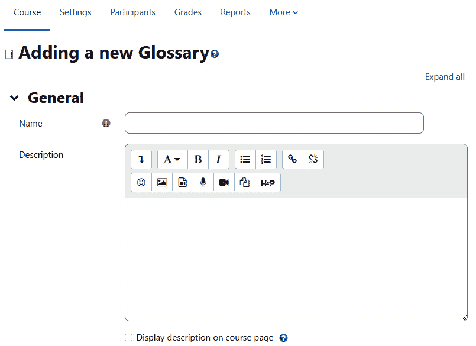

图 9.7 – 添加新词汇表并输入其名称和描述

## 全局词汇表与本地词汇表

默认情况下，词汇表仅适用于它所在的课程。但是，你可以选择使词汇表全局化。在这种情况下，该词汇表中的单词将在你网站的任何位置突出显示并可点击。这样，一个课程中的工作将可供你网站上的所有课程使用。如果你的网站主题内容高度集中，考虑使用全局词汇表。如果你的网站主题内容非常广泛，例如在一个大学范围内的学习网站上，你应该使用本地词汇表以避免混淆。例如，想象一下你有一个化学课程和一个统计学课程。两者都使用单词*granular*，但化学用它来表示粉末状物质，而统计学用它来表示精细的程度。

重要提示

只有管理员才能在全局词汇表中创建词汇表。如果你只有教师权限，请让管理员为你完成这项操作。

你可能希望赋予学生创建他们自己的词汇表和词汇表术语的权力。在这种情况下，了解二级词汇表是有好处的。

## 主要词汇表与二级词汇表

**词汇表类型**设置允许你指定词汇表为**主要**或**二级**。**主要词汇表**设置指的是将包含来自其他词汇表术语的词汇表。**二级词汇表**设置指的是独立的词汇表；它不包含来自任何其他词汇表的术语。例如，你可能有一个涵盖科学术语的整体词汇表，以及如物理、化学、生物学和地质学等作为二级词汇表的独立词汇表。如果你希望学生在协作活动中能够添加新术语，这是一个重要的区别。然而，如果你想将词汇表术语限制在与你的学习目标一致的内容上，最好避免使用二级词汇表。

如果你想让学生能够向词汇表添加条目，你必须将其设置为**二级词汇表**类型。只有教师才能向**主要词汇表**类型添加术语。

你可以从**次级术语表**类型将术语导出到**主术语表**类型，一次一个。因此，你可以创建一个次级术语表，学生可以向其中添加术语。然后，你和/或学生可以将最佳术语导出到主术语表。想象一下，每次课程运行时都有一个主术语表和一个次级术语表。主术语表将成为每个班级添加的最佳术语的存储库。

然而，有时你可能希望条目自动获得批准。在这种情况下，你可以要求 Moodle 批准它们。我们将在下一节中学习如何做到这一点。

## 默认批准的条目

如果你开启**默认批准**的设置，一旦学生向术语表添加条目，这个条目就会出现在术语表中。如果关闭，教师将需要批准每个条目。

如果你开启这个设置，并且认为学生添加的条目不合适，你总是可以删除这些条目并关闭这个设置。

如果**默认批准**被关闭，新术语将等待教师的批准才能被添加：

![图 9.8 – 配置术语表条目

![img/Figure_9.08_B17288.jpg]

图 9.8 – 配置术语表条目

如果你希望学生通过为同一术语提供定义来相互学习，你可以设置 Moodle，使他们能够贡献术语，然后协作制定最终版本。我们将在下一节中讨论如何做到这一点。

## 始终允许编辑和允许重复条目

**始终允许编辑**和**允许重复条目**是两个独立的设置。然而，它们可以以有趣的方式协同工作。

如果你开启**始终允许编辑**，学生可以编辑已经创建的条目。因此，如果有两个学生对一个术语有不同的定义，他们可以各自将他们的定义贡献给同一个条目。在这种情况下，第二个学生不需要创建重复的条目；他们只需将他们的定义添加到现有的条目中。

如果你关闭**始终允许编辑**的设置，考虑允许重复条目。然后，如果有两个学生对同一术语有不同的定义，他们可以各自为该术语创建一个条目。

## 允许评论

如果你开启**允许对条目进行评论**的设置，学生和教师可以向术语表条目添加评论。这些评论将出现在条目的底部。评论对所有术语表的读者都是可见的。

## 自动链接术语表条目

如果你开启**自动链接术语表条目**的设置，这并不总是会导致所有条目都成为课程中的链接。相反，当创建条目时，其编辑页面将有一个选项来为该条目开启自动链接。

当你开发你的术语表时，你需要考虑它们在页面上的显示方式。你希望在页面上显示多少个？这很大程度上取决于术语表条目的内容和你是如何计划用于协作的。

## 外观设置

在**外观**部分，你可以找到影响术语表示的设置。这些设置影响术语页面的布局、每页显示的条目数量、用户收到的链接等。

## 结果

结果，也称为“能力”或“目标”，是学生在活动或课程完成后所展示的描述。

Moodle 4.0 非常灵活，旨在用于任何可能的课程交付模式。**术语表**活动包括结果，这使你能够指明你是否将术语表用作课堂参与活动、面对面课程的补充或基于团队的协作。记住，要启用结果，你需要前往**网站管理**并选择**高级功能**。然后，点击**启用结果**并保存更改。要添加课程级别的结果，只需从**课程管理**链接中点击**编辑结果**。然后，点击**添加新结果**。完成表格，并选择**保存更改**。

在你设置好结果后，你可能希望设置外观。这里是在**外观**菜单内的下拉菜单：

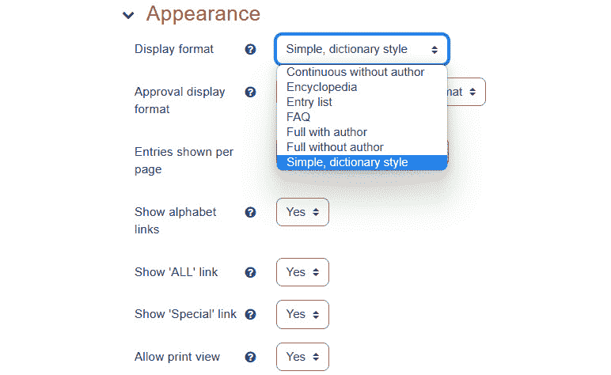

图 9.9 – 配置术语表的外观菜单

为了确定最适合你情况的设置，请按照以下步骤进行实验：

1.  以教师身份登录。

1.  创建几个术语表条目。

1.  打开另一个浏览器，以学生身份登录，并打开术语表。

1.  作为教师，尝试**外观**菜单中的不同设置。

1.  每次你作为学生更改设置时，请刷新**术语表**页面：

图 9.10 – 设置术语表的结果

包含结果可以是一个很好的激励因素。以下三种优秀的方法来确保你的学生跟上进度是：

+   将术语表与作业关联，并包含截止日期，以便它在仪表板的**日历**块中显示。

+   在你希望学生在特定日期添加术语表条目的日子，手动为**术语表**活动添加日历条目。

+   在**活动完成**中启用**完成时检查**选项，这将作为已完成的活动显示在学生的仪表板中：

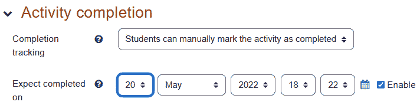

图 9.11 – 指定学生如何跟踪活动完成情况，并确保这显示在学生的仪表板日历中

## 功能增强器 – 启用评分

您可以授予学生评分词汇表条目的能力，就像他们可以评分论坛帖子一样。问题是您希望学生评分什么？词汇表条目的清晰度、其有用性，还是您创建条目的写作技巧？您需要考虑您希望学生评分的内容，并创建一个支持该评分的定制比例。标准可以与学习目标和学习计划相一致。例如，它们可以与“识别”、“描述”和“解释”相一致。您可以在**设置**页面上确定谁可以评分词汇表条目，以及使用哪个比例：

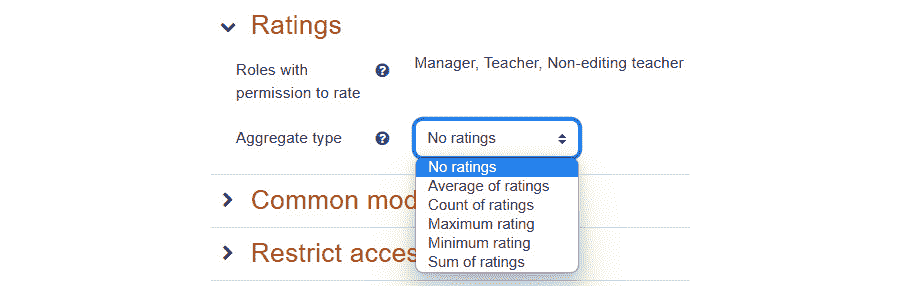

图 9.12 – 在评分设置页面上选择评分比例

注意，只有**管理员**、**教师**和**非编辑教师**角色可以评分此词汇表中的条目。在下一步中，教师修改权限以允许学生评分条目。

以下是为学生允许评分词汇表条目的过程。它包括三个部分：

+   创建评分比例

+   选择词汇表的比例

+   授予学生使用评分的权限

为了使学习者能够轻松地对条目进行评分，有必要创建一个评分比例。以下步骤显示了如何创建评分比例：

1.  选择**管理** | **评分管理** | **比例**：

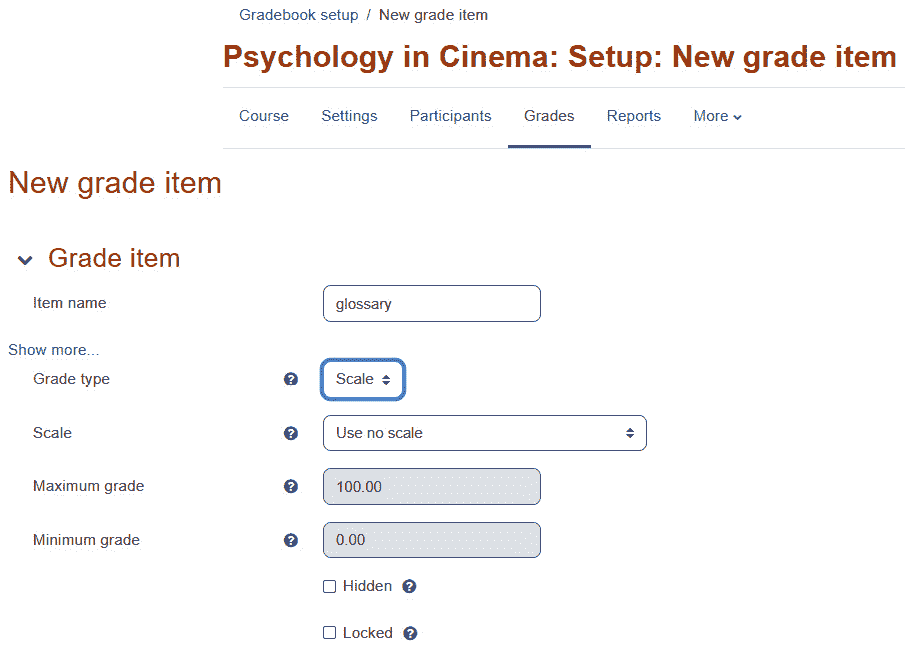

图 9.13 – 设置词汇表的评分

1.  点击**添加新比例**按钮。

1.  在新的**比例**页面上，为比例命名。请注意，只有教师可以看到此名称。

1.  在**比例**字段中，输入用户将选择的值，以便为词汇表定义评分。该比例必须包含超过两个项目。

1.  在**描述**字段中，输入简短描述。这将帮助您记住此比例的目的。

1.  **保存**您的更改。

以下步骤显示了如何选择词汇表的比例：

1.  导航到词汇表**设置**页面。

1.  在**比例**字段中，选择您刚刚创建的比例。

1.  修改此页面上您想要的其他任何设置，

1.  **保存**您的更改。

为了让学生能够实际实施评分，您需要启用权限。要授予学生使用评分的权限，请执行以下步骤：

1.  从主菜单中选择**管理** | **词汇表管理** | **权限**：

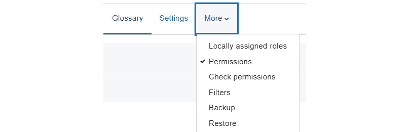

图 9.14 – 设置词汇表评分权限

1.  在**权限**页面上，滚动到**活动：词汇表**部分。

1.  点击位于**评分条目**旁边的加号：

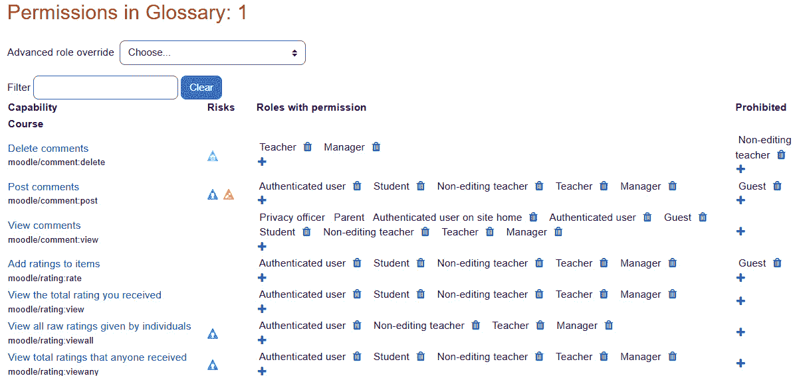

图 9.15 – 授予学生评分条目的权限

1.  选择您想添加到此权限的角色，然后点击**允许**按钮。

一旦启用了角色，学生以及有权创建词汇表条目的人现在可以开始添加词汇表条目。

# 添加词汇表条目

从课程菜单中选择**词汇表**活动显示词汇表的简介页面。从该页面，您可以编辑和浏览词汇表。

以下屏幕截图显示了**添加新条目**按钮，该按钮出现在词汇表每个标签页下方：

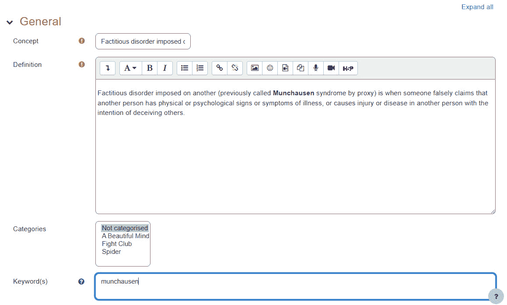

图 9.16 – 添加新条目按钮允许您创建另一个词汇表条目

通过导航到**按类别浏览**页面并点击**添加新条目**按钮来创建新的**词汇表**类别。此按钮在浏览词汇表时出现在每个标签页下方，因此始终可用。

在此页面上，**概念**是您将添加到词汇表的术语。关键词是同义词，相当于索引或词典中的*参见*部分。这些术语将与概念链接到相同的定义。

注意，您可以使用工具栏中的图标将图片或媒体文件添加到**描述**中：

您还可以将这些类型的文件作为附件上传，这正是此用户选择的做法。

如果已启用自动链接，**添加新条目**的下半部分包含设置，如图*图 9.17*所示：

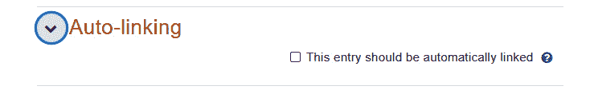

图 9.17 – 另一个自动链接屏幕

当词汇表术语出现在您的课程中时，您可以将其链接到其词汇表条目。**自动链接**选项确定何时以及是否将此单词链接到其词汇表条目。

一旦您有了许多词汇表条目，您可能希望在不同应用程序中使用它们，甚至与其他教师分享，或将它们放在其他课程上。您可以通过导入和导出条目来实现这一点，我们将在下一节中介绍。

# 导入和导出条目

**导入条目**和**导出条目**链接允许教师在不同课程和 Moodle 安装之间交换词汇表：

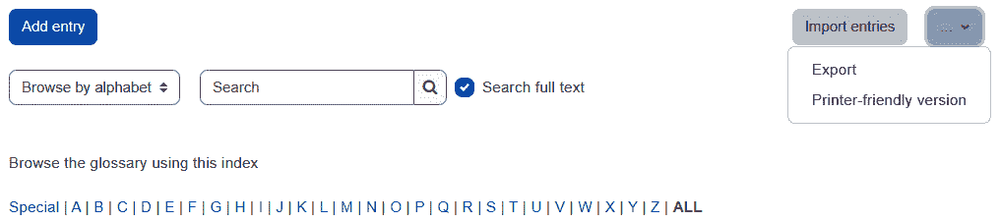

图 9.18 – 设置列表允许您在课程之间导入和导出词汇表和词汇表条目

您可能希望从一个小型词汇表开始一门课程，并让学生在发现新概念时添加内容。如果您这样做，请导出初始词汇表，以便在下一次课程中使用。下次您教授课程时，您可以选择导出已完成课程的全部内容（除学生信息和词汇表外）。在新副本中，只需创建一个新的空白词汇表并导入初始词汇表。

此外，请注意，编辑窗口允许您在定义中包含超链接（通过图标）。这可以用来链接到网络上免费可用的信息，例如[`www.wikipedia.org/`](http://www.wikipedia.org/)。

词汇表对于围绕定义进行的个人或协作学习活动都很有用。在这种情况下，满足的学习目标往往位于布鲁姆分类法的较低层次，即“记住”类别，这是金字塔的基础。为了能够满足更高层次的认知技能并展示对布鲁姆分类法更高层次的掌握，您可以选择使用维基。Moodle 有一个非常强大且灵活的维基，我们将在下一节中进行探讨。

# 维基

Moodle 维基模块使学生能够在一个小组写作项目中协作，构建知识库，并讨论课程主题。学生还可以在为比赛、团队领导活动或初创公司或组织的商业计划制定评分标准方面进行协作。

这是 Moodle 4.0 重新设计的维基图标：

图 9.19 维基图标

由于维基易于使用、交互性强且按日期组织，它鼓励参与者之间的协作。这使得它成为创建集体知识的有力工具。论坛和维基之间的关键区别在于，当用户进入论坛时，他们会看到一个专门针对主题的线程。每个条目都很短。用户逐条阅读线程。结果是讨论变得突出。在维基中，用户看到的是写作的最终结果。要查看写作的历史，他们必须选择**历史**标签。结果是写作的最终结果变得突出。

旧版维基内容永远不会被删除，并且可以被恢复。此外，维基可以像其他课程材料一样进行搜索。在下一节中，我们将探讨**编辑维基**页面上的设置以及它们如何影响用户体验。在 Moodle 中使用维基有诸多优势。使用 Google Docs 或 Teams/Sharepoint 进行协作在某种程度上是相似的，因为每个人都可以做出贡献。然而，如果学生失去了对外部平台（Google 或 Microsoft）的访问权限，他们将无法继续做出贡献。

## 使用维基进行学生的主题贡献和解释

维基可以用来帮助解释一个主题。例如，假设一门关于创业的课程计划举办一场初创比赛。包含评判标准列表将非常有用。此外，包含定义、流程和程序的维基也将非常有用。它是一种有用的教学工具，因为教师可以提供指导和指针。

## 使用维基创建用于评估比赛的评判标准列表

*鲨鱼坦克*（或在英国的*龙穴*）是一档流行的电视节目，企业家在潜在投资者的评审团面前进行展示，以吸引评审团成员投资。这是一个既娱乐又富有信息量的节目，将*鲨鱼坦克/龙穴*作为课堂项目可以同样富有信息量、娱乐性和吸引力。

计划学生*鲨鱼坦克/龙穴*项目的一个好方法是使用维基。第一步将是制定一个评判标准列表，以及一套明确的指南，表明在出色的**提案**中期望什么，这将说服投资者为项目或初创公司投入资金。然后，学生还可以在比赛中分享他们对初创公司提案的评价：

图 9.20 – 维基在课程页面上的显示方式

维基的另一个优秀用途是保持协作日志：

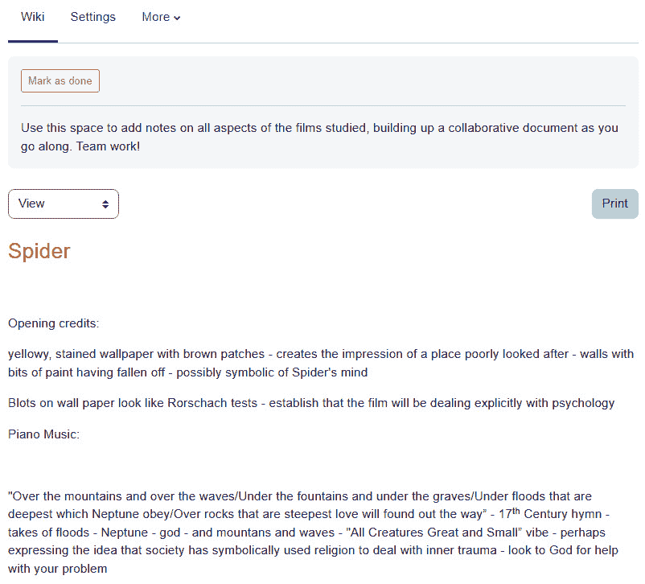

图 9.21 – 协作维基的一个示例

您可以切换到**历史**视图来查看谁何时进行了评论：

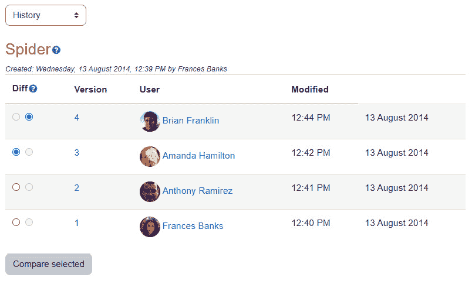

图 9.22 – 维基的历史视图允许您查看谁何时发布了内容

## 规划协作项目 – 使用维基类型和分组模式来决定谁可以编辑维基

使用维基的方式有很多，它们侧重于协作和可执行的项目，而不是创建一个简单的知识库。在*鲨鱼坦克*的情况下，一项协作活动可能是制定一个商业计划。另一个可能是开发潜在财务支持者的目录，这可能包括天使投资者、风险投资公司、私募股权公司和将帮助商业化产品的合作伙伴。

### 活动策划

维基可用于确定活动的任务、角色和资源。例如，让我们以策划婚礼的任务为例。将有许多不同的元素，从婚礼仪式中的花、装饰、招待会、餐饮、请柬等等。维基可用于确定不同的任务，然后进一步定义和细化任务，如它们被列出。在此之后，维基可以进一步用于开发包含行动步骤的时间表。

### 创业计划

如前所述，包括*鲨鱼坦克*竞赛的企业家课程将是拥有协作商业计划的完美场所。维基可以包含以下元素：

+   商业计划的关键要素

+   **优势、劣势、机会、威胁**（**SWOT**）分析

+   财务预测

+   目标和期望结果

+   产品图

+   用于市场推广产品的材料

## 使用维基类型和分组模式来决定谁可以编辑维基

维基内容对所有班级成员、一个小组、教师或单个学生都开放编辑。此外，维基还可以供整个班级、一个小组、教师或单个学生查看。请注意，教师决定谁可以查看和编辑维基内容；设置不同。

用于设置谁可以编辑维基内容的设置是通过**维基模式**下拉框完成的。

用于设置谁可以简单地查看维基内容的设置是通过**组**模式完成的。

在这种情况下，维基可以充当学习日志，这是学生发展基于反思的知识的好地方。仅允许单个学生编辑维基似乎将维基变成了个人日志。然而，单个学生维基和日志之间的区别在于，日志只能被学生和教师看到。您可以保持单个学生维基的私密性，或者您可以打开它以更改设置，使其对学生小组或整个班级的协作变得可能：

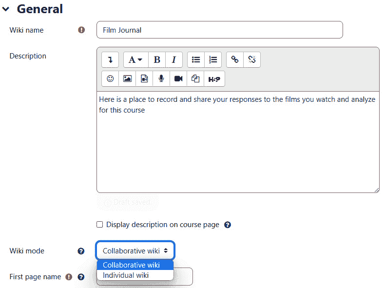

图 9.23 – 添加新的协作维基

## 第一页名称

维基第一页上的名称将从这个字段中获取。设置新维基后，将弹出添加页面的屏幕。教师和管理员可以删除页面。学生不能。

如果有一个维基是整个班级共用的，那么当第一个学生进入维基时，该学生将看到起始页面。如果第一个学生编辑了任何页面，下一个进入的学生将看到编辑后的版本，依此类推。如果每个小组都有一个维基，每个小组都将获得一个带有您创建的起始页面（s）的*全新*维基。此外，如果每个学生都有自己的维基，每个学生在进入他们的维基时将看到他们的起始页面：

图 9.24 – 为维基添加第一页名称

## 默认格式

**默认格式**设置决定了维基作者在编辑时是使用标准维基标记还是 HTML 代码。如果您将使用 HTML 编辑器进行其他学生活动，将此设置为 HTML 可以简化这一活动，对您的学生来说会更简单。他们将熟悉 HTML 编辑器，并且不需要学习维基标记语言。然而，如果您的学生已经习惯了维基，您可能希望选择**Creole**。这使他们能够使用通用的维基标记，这对于有经验的打字员来说更快。Creole 是一种轻量级标记语言，旨在成为维基的通用标记语言，便于在不同维基引擎之间传输内容。**NWiki**是一个基于 SOA 范式的维基引擎。它是一组组件和服务，可以将维基功能嵌入到任何.NET 应用程序中。

如果您没有选择**强制**格式，那么当学生进入维基时，他们将能够使用 HTML 进行编辑。在您创建了一个新的维基之后，会出现一个屏幕，允许您开始一个新页面。请查看以下截图：

![Figure 9.25 – Starting a new page with the Format options]

![Figure 9.25_B17288.jpg]

![Figure 9.25 – Starting a new page with the Format options]

如您所见，维基非常强大，可以用于需要小组项目、演示或提案的课程中。实际的协作工作可以以同步或异步的方式进行。例如，学生可以异步地向维基做出贡献，然后通过 Moodle 内置的网路会议、BigBlueButton 或通过链接到他们自己机构订阅的平台（如 Zoom 或 Teams）进行会面。

## 功能增强器

可以使用 Google Docs、Microsoft Teams 或 OneDrive 进行协作，而不是在词汇表或维基条目内进行所有协作。如果多个团队正在协作，或者如果词汇表或维基条目有不同阶段（例如，初始、修订或注释文献综述），则这强烈推荐。然而，如果来自不同机构的人，如果他们失去了对外部平台的访问，或者在那里空间不足，或者存在可能阻碍一些用户的安全功能和防火墙，那么也存在一些缺点。

例如，一个团队可以负责发布初始定义。他们可以在 Google Docs 中进行协作，然后将他们的最终文档上传到词汇表或维基条目。第二个团队可以进入并添加来自同行评审期刊的参考文献。第三个团队可以添加注释：

团队 1：输入主要定义。

团队 2：添加来自同行评审期刊的关键参考文献。

团队 3：为日志添加注释。

每个团队都会在 Moodle 之外进行协作，然后将干净、最终的版本上传以添加到适当的条目中。

现在我们已经了解了 Moodle 中词汇表和维基的工作方式，以及它们如何与学习者及其机构可以使用的基于云的平台相结合，我们准备继续前进并与之合作。

# 摘要

Moodle 为学生提供了多种协作构建知识库的选项。例如，一个班级可以共同构建一个可以导入和在未来课程中重复使用的词汇表。他们可以共同编写维基，这为他们提供了一个将知识组织成叙述的机会。Moodle 4.0 旨在提供最大灵活性，并将社交互动置于其核心哲学的核心。这意味着协作维基和词汇表是 Moodle 4.0 中的完美活动，并且它们可以与 100%在线活动以及那些结合了面对面互动的活动一起使用。

词汇表和维基都是同步和异步学习组合中非常有效的工具。例如，小组成员可以在他们制定定义（词汇表）或协作项目（维基）时互相聊天。此外，他们可以通过集成和嵌入 BigBlueButton 或链接到外部平台（如 Zoom、Google Meet 或 Microsoft Teams）来安排同步网络会议。

这种参与方式极具激励性，学生更有可能参与课程并相互学习。结合协作词汇表和维基还可以帮助学生增强学习的自信心，并轻松将他们的知识从课程内容应用到现实世界的应用中。

在下一章中，你将学习如何使用 Moodle 来运行研讨会。其中，我们将涵盖研讨会、小组项目、小组和个人项目的组合、研讨会策略以及研讨会的四个阶段。
