# *第十章*: 举办研讨会

研讨会为学生提供了一个地方，让他们可以看到一个示例项目，上传他们个人的项目，并查看和评估彼此的项目。它们非常适合包含布卢姆教育目标分类法中更高层次课程的课程，从分析、评估和创造开始。当教师要求每个学生评估几位其他学生的作品时，研讨会成为一种强大的协作评分工具。它也是一个理想的同行评审工具。

研讨会非常适合将理论或技术付诸实践。它们允许学生应用概念，并在每一步都得到指导和帮助，采用模块化方法。在本章中，你将了解以下主题：

+   确定使用研讨会的最佳时间

+   确定何时将小组项目纳入研讨会

+   实施各种研讨会策略

+   详细说明研讨会的各个主要阶段或部分

除了应用知识外，研讨会还鼓励小组项目和协作。与使用维基或术语表作为协作项目相比，研讨会的优势在于提供了更多捆绑材料和活动的选项，并且评估的选项也更多。此外，在当前同步和异步内容混合的学习环境中，研讨会可以包括“现场”或同步演示或小组讨论。

Moodle 4.0 被设计为具有最大灵活性。研讨会可以是 100%在线的，也可以与面对面的研讨会结合进行，无论是企业还是非营利活动及培训。它们可以是同步的、异步的或混合的。Moodle 4.0 重新设计的导航帮助学生们快速找到协作活动，并且更新的仪表板可以配置，以便当团队成员发布内容时，学生们能在仪表板上收到通知。只需一键，他们就能到达需要的地方。此外，研讨会允许你使用模块化方法，其中概念构成了基础支撑，而小组或个人项目、案例研究和演示构成了核心概念的应用，这些是学习成果的一部分。到本章结束时，你将能够设计和配置 Moodle 中的协作、同行评审研讨会。

# 为什么使用研讨会？

研讨会是一种快速提高小组知识和技能水平的好方法。它通过相互学习和同行评审帮助人们实施社会建构主义。Moodle 中的研讨会，如面对面设置的研讨会，非常适合让学生快速掌握并具备功能，而停机时间很少。通常，它们专注于单一成果，并将焦点缩小以确保在短时间内可以实现特定的技能或知识集。例如，假设您有一门关于创业的课程，学生正在准备就他们的初创公司进行小组展示。研讨会为他们提供了一个完美的平台，以团队形式发展和磨练他们的展示，然后作为小组向全班展示。

**研讨会**活动图标已在 Moodle 4.0 中重新设计并部署。注意新设计强调了一个以上的多人参与研讨会，以及它涉及沟通和协作的理念：

图 10.1 – 研讨会图标

在 Moodle 中，理想的研讨会是协作性的，需要学生进行同行评审并分享知识和信息。此外，它们涉及专注于课程学习目标和成果的创造力。它们具有灵活性，允许您使用同步和异步的交付方式。例如，如果您有“现场”的最终展示，并且还想将其存档，研讨会为您提供了完美的平台。个人共同合作创建他们的最终产品，如展示。然后，他们登录到机构的网络研讨会平台（例如，Zoom、Teams、BigBlueButton 或甚至 YouTube Live），每个人都可以观看、评论并在存档中保存。

如果您的学生非常富有创造力，并希望在虚拟世界中进行研讨会合作和最终展示，他们可能希望使用 Facebook 的元宇宙或通过 Google Earth VR 中的化身记录他们之间的互动。例如，研讨会可能是一次地质考察，使用 Google Earth 的“街景”查看其他地点。

在下一节中，我们将探讨何时在研讨会中融入小组项目。

# 基于小组项目的研讨会何时最佳？

尽管学生可能一开始会害怕在小组中工作，但请记住，他们的犹豫通常与对机制的不适和害羞有关。在他们感到胜任和自信之后，共同完成项目可以成为他们教育中最有成效的学习体验之一。他们不仅学习有关主题或技能的知识，而且在分布式环境中工作，就像我们在基于云的全球工作场所中今天所做的那样，他们还练习相互互动和“软技能”。

然而，为了避免挫败感，仔细选择学生何时以及如何以小组形式工作是很重要的。如果你知道你的学生有广泛不同的日程安排，住在不同的时区，并且对高速互联网的访问有变化，你可能需要给他们提供某些指南，这样他们就会非常支持彼此。

小组项目在许多不同的情况下都能发挥很好的作用。它们共同的特点是人们真正地从彼此那里学习：

+   学生需要在同一件事情上展示能力（例如，如何建造一个小屋）。

+   学生们的时间不多，成果需要非常具体和专注（例如，为赌场扩建而进行的日式水疗市场研究）。

+   成果很容易评估；例如，产品可以包括书面报告、图形、地图、演示文稿和视频，所有这些都可以上传到云端，并提供链接（以避免文件大小限制的问题）。

+   个人被激励了，他们看到了工作坊最终产品的具体价值。例如，工作坊的产品可以帮助个人找到工作、启动咨询业务或发展社交媒体影响力。

正在发展的技能需要互动和现场演示，随后是应用概念的活动。此外，如果参与者提出问题、相互交流和进行非正式的同伴评估，知识转移将最为有效。

一旦你考虑了你的课程、学习目标和可能用于小组项目的主题，就很好继续发展具体的策略，这些策略能够使学生的活动与他们的成果相一致。

## 重大问题

工作坊窗口中的字段为你提供了许多选择。无论你在每个字段中输入什么，你的许多决定可以总结如下：

+   你会要求每个学生做什么？在离线创建一个文件并将其上传到工作坊？写一篇日记？参与在线聊天？执行一些离线活动并通过电子邮件或维基报告？虽然工作坊窗口允许学生上传文件，但你也可以期望学生进行其他活动。期望什么样的作业，以及在哪里上传？例如，如果有 BigBlueButton（或 Teams 或 Zoom）中的同步演示，记录将上传到哪里？你将把链接放在哪里？

+   谁将评估作业？是老师评估所有作业吗？还是期望学生评估其他学生的作业？或者每个学生自我评估自己的工作？

+   作业将如何被评估？请记住，您可以使用评分标准来列出评估每个作业的标准、评分等级和评分类型。学生何时可以提交他们的作业和评估？一个很好的资源是 Moodle 文档，可以在[`docs.moodle.org/dev/Moodle_4.0_release_notes`](https://docs.moodle.org/dev/Moodle_4.0_release_notes)查看。

作业一旦展示出来就可用。然而，您可以预期学生在提交自己的作品之前会评估一个示例；此外，您还可以设置提交评估的截止日期。

让我们看看一个例子来展示它是如何工作的。请记住，这个例子来自 Moodle.org Mount Orange School 演示网站，您可以通过[`www.moodle.org`](http://www.moodle.org)访问。

在这种情况下，工作坊涉及以下场景：

假设你是一名编剧，并被要求为你自己的国家改编《仇恨》的背景。你的同行将评估你的改编是否合适。

这是 Moodle 4.0 中的描述看起来像什么：

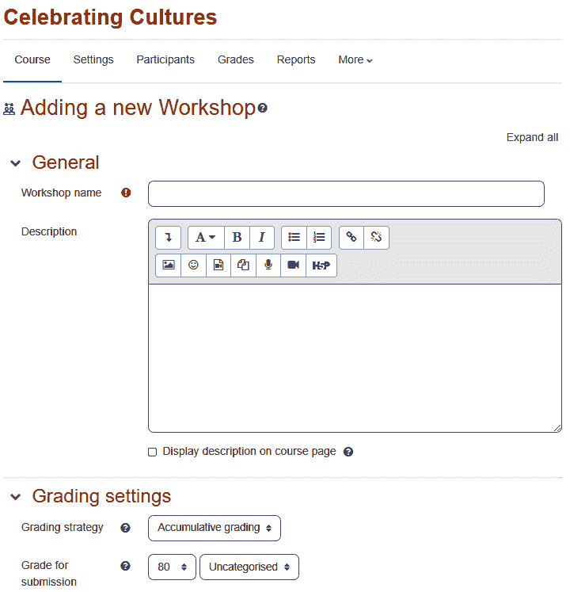

图 10.2 – 工作坊项目的示例

接下来，让我们看看工作坊策略。

# 工作坊策略

工作坊可以是未评分的、同行评分的、教师评分的，或者同行和教师评分的组合。工作坊使您能够为评分者创建非常具体的评估标准。此外，工作坊还允许您设置提交评分工作的截止日期。您可以使用这些和其他功能来制定策略，以充分利用您课程中的工作坊：

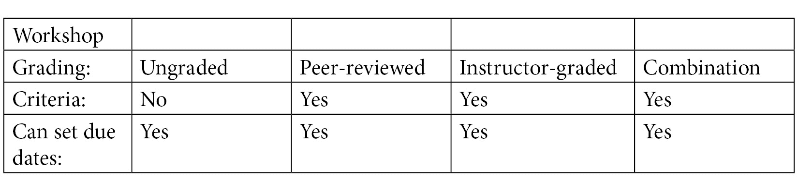

请记住，如果您包括同行评估和必要的同行互动，您将促进同行间的学习。换句话说，学生在协作和创建联合项目时将相互学习。

## 提交的同行评估

工作坊的一个策略是在同一作品提交为评分作业之前让学生相互评估。例如，您可以创建一个工作坊，让学生评估彼此的论文主题、提纲和假设，或者在他们提交给教师评分之前评估彼此的照片，以特定的技术和艺术标准。此外，您可以要求学生评估他们的同步或录制演示，特别强调实际应用。

## 提交和评估的时间

工作坊允许您设置不同的截止日期以提交作品和评估其他学生的作品。如果您将两个截止日期设置在相同的时间，许多学生可能会在提交截止日期前提交他们的作品，这样他们就不能在评估截止日期前被评估。请考虑在评估截止日期之前设置提交截止日期。因此，在向学生开放评估能力之前，检查提交的作品并确保它们接近您期望的或试图从学生那里得到的。您甚至可能想要利用提交和评估之间的时间来根据提交的作品完善评估标准。

在您开发好工作坊策略并在 Moodle 中设置好工作坊之后，您现在将进入工作坊的实际运作阶段。为了方便起见，可以将工作坊视为四个阶段或部分。它们包括设置、提交、评估和评分评价。

# 四个阶段

当您运行工作坊时，您将经历四个阶段：

+   **第一阶段**：*设置*阶段是您创建工作坊并选择工作坊如何运作的设置的时候。您将在名为“设置阶段 - 编辑设置页面”的部分中了解更多关于设置的信息。

+   **第二阶段**：*提交*阶段是学生提交他们的作品的时候。此外，每个学生都将被分配任务来评估其他学生的作品。评估可以由系统自动分配，或者教师可以手动将评估分配给学生。无论哪种方式，在提交阶段结束时，每个学生都将提交他们的作品并被告知评估一位或几位其他学生的作品。请记住，作品通常通过链接提交到云端托管位置，用于视频、音频、演示文稿等。这是为了避免 Moodle 中的文件大小限制。

+   **第三阶段**：在*评估*阶段，学生将相互评估作品。教师将创建学生用于评估彼此作品的评估表。这些表格将包括鼓励互动和相互学习的提示。他们的重点将受到学习目标的指导。

+   **第四阶段**：在*评分评价*阶段，学生将根据他们评估同伴作品的好坏给予评分。这是工作坊的最后一个阶段。评分将与评分标准相关联，并加强相应的布卢姆分类法级别，以确保您实现了课程的学习目标。

在下一节中，我们将查看工作坊的每个阶段。

## 设置阶段 – 编辑设置页面

工作坊活动是一种强大的教学工具，它有许多设置需要考虑。在以下描述中，我们只考虑重要的设置。工作坊被设计成允许学生在结构化的框架内提交作业并接受同伴评审。工作坊下有几个字段，将在以下章节中解释。它们为学生和教师在课堂中充分利用 Moodle 提供了一个场所：

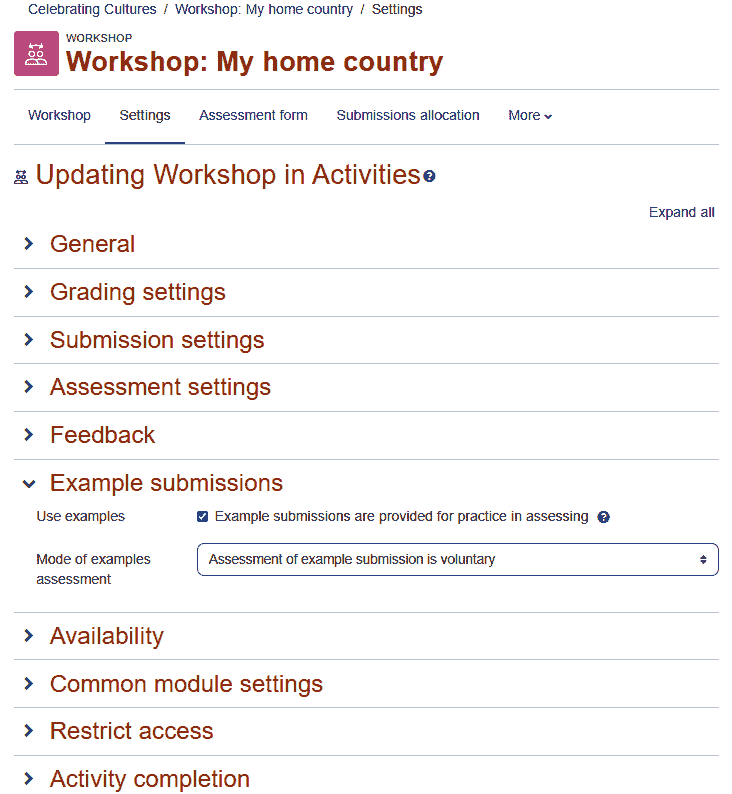

图 10.3 – 设置工作坊时的可定制字段

### 名称和描述

**常规**设置下的设置部分回答了以下问题：你将要求每个学生做什么？务必描述活动并使用与布鲁姆分类法水平相对应的动词。例如，如果你有一门创业课程，并且正在为初创企业的*鲨鱼池*提案竞赛开发演示文稿，你的描述可以是创建提案演示文稿。你可以使用动词，如设计、组装、构建、开发或制定（特别是如果你要求他们融入策略）：

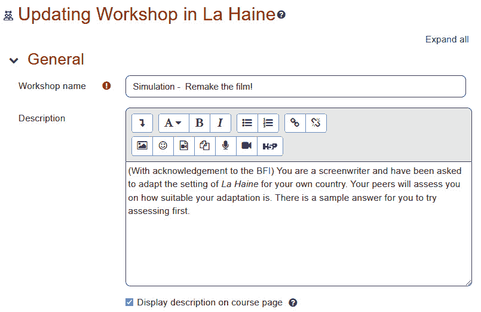

图 10.4 – 添加工作坊的名称和描述

你的学生将看到并点击**工作坊名称**字段。**描述**字段应提供完成工作坊的说明。

### 评分设置

这些字段决定了学生可以为一个工作坊获得的最大分数以及如何计算这些分数，如下面的截图所示：

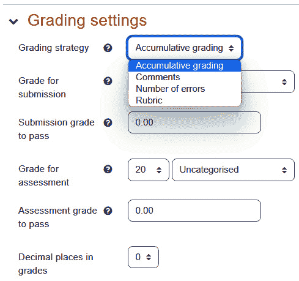

图 10.5 – 配置评分设置

#### 评分策略

工作坊作业在评分方案类型方面非常灵活。此设置决定了整体方案。如果你的组织使用同步网络会议作为学生参与和协作学习的主要策略，这将是一个巨大的“加分项”。你可以设置评分，让学生在在线（同步或异步）协作学习和最终产品中获得分数。

在**累积评分**策略中，分数被标准化，使其在 100 分之外，然后进行加权。这种评分方式使您能够向评审员提供一个数字刻度。此外，您还可以向评审员提供**是**或**否**的问题。其中一个问题是这个工作坊是否符合要求？或者，您可以向评审员提供一个评分刻度，例如**差**、**一般**、**好**和**优秀**。如果您确实使用**是**或**否**的问题或评分刻度，您将为每个回答分配一个点值。考虑通知评审员每个回答的价值。例如，不要只是写上差、一般、好和优秀，考虑写上差（1 分）、一般（2 分）、好（3 分）和优秀（4 分）。

当选择**评分策略**中的**注释**时，学生可以对每个评估要素进行评论，但他们不能选择分数。然而，教师可以对学生的评论进行评分。在这种情况下，工作坊从学生互评转变为教师对每位学生的评论进行评分。这些评论可用于协作的“实时”同步段和异步活动。

小贴士

使用**注释**的工作坊在您希望就向学生展示的材料进行结构化讨论时可能特别有用。

作为课程创建者，您可以向学生提供已上传到工作坊的材料，或使用工作坊的描述来指导学生评估必须评估的材料。学生在观看材料后，进入工作坊并根据展示的要素进行评论。由于工作坊要求学生对明确定义的评估要素进行评论，因此学生的讨论是有结构的，并保持在其轨道上。

当您选择`学生是否有多种观点？`

在撰写这些问题时，确保它们只能用**是**或**否**来回答。需要修改问题的迹象是存在“或”这个词。例如，不要写“学生是否足够详细地描述了植物，以便与其他植物区分开来？”或“对于学生描述的植物，还有疑问吗？”这样的问题不能用是或否来回答。

有时，评估问题的答案非常明确，有时则是主观的。例如，问题“学生是否足够详细地描述了植物，以便与其他植物区分开来？”就是主观的。一位评审员可能认为学生描述植物的工作做得足够好，而另一位评审员可能持不同意见。这些问题可以很好地进行主观的同行评估，评估每位学生的作品。

如果工作需要更客观的评价（例如，“学生是否包括了本课程中涵盖的所有五个识别特征？”），可能不需要研讨会。这种客观评价可以通过教师使用作业轻松完成。

对于评分标准评分策略，为项目编写几个适用的陈述。每个陈述都分配了一个评分。评审员选择最能描述项目的单个陈述。这个单一选择完成了评审。

您可以创建多个此类元素；评审员必须为每个元素选择一个陈述。

**提交评分**是评分者可以给予学生的最高分数。

**评估评分**是学生用来评分其他提交的分数。这个分数基于学生完成的评估与同一提交的所有评估平均值的接近程度。例如，学生 A 提交了作品，学生 B、C 和 D 评估了作品并给出了 10、9 和 5 分的评分。平均评估是 8 分，所以学生 B 和 C 将比学生 D 获得更高的评估分数。本质上，评估评分是对学生评估其他学生作品质量的一种评价。

### 提交设置

**提交设置**页面是您输入用户指令的地方。此外，您还可以设置限制，规定学生可以上传多少个文件到研讨会以及这些文件可以有多大。通常，最好包括一个链接，指向他们上传到 YouTube、Screencast-O-Matic 或甚至 Slideshare 的录制，如果是一个没有视频的演示文稿的话。团队演示可以通过让每个人都登录并使用 Zoom 或 Teams 创建一个录制，然后放置一个链接来完成，而不是下载视频文件。在您的用户指令中，务必参考作业指令。

以下截图是**提交设置**页面：

![Figure 10.6 – Configuring the Submission settings page]

![img/Figure_10.06_B17288.jpg]

图 10.6 – 配置提交设置页面

当用户点击研讨会时，他们将看到**提交说明**标签。

**最大提交附件数量**和**最大提交附件大小**都决定了文件的大小以及用户可以上传多少个文件。

**延迟提交**选项允许用户在截止日期后提交他们的作品。截止日期可以设置在页面下方。

### 功能增强器

你可能要求你的学生提供一个有旁白的演示文稿或视频。这些文件可能相当大；然而，在当今世界，学生需要能够创建视频内容。鼓励学生将他们的作品上传到云端，并提供链接是个好主意。例如，这可以与 Screencast-O-Matic 中的演示文稿或 YouTube 上的视频一起工作。你可以根据文件大小将视频上传到 Teams、Google Drive 或其他平台。如果你在 Zoom 这样的平台上录制，你不需要上传它，因为它已经在那里了。

然而，缺点是访问录制的内容可能会过期。在这种情况下，你可能也希望下载它。这将帮助学生避免达到文件大小限制。你可能希望将应用程序限制在 YouTube 或 Screencast-O-Matic 上，并避免 TikTok、Facebook（Meta）、Instagram 或其他替代平台，如 Rumble、Twitch、Odysee、BitChute 等。这完全取决于你的机构以及应用程序和平台是否稳定。

### 评估设置

在本节中，设置用于向用户提供如何执行评估的说明，并确定何时向用户提供评估示例。

实际评估中使用的标准不是在此页面上创建的。相反，标准是在**管理** | **研讨会管理** | **评估表**下创建的。

我们将在稍后介绍如何创建评估表的过程。然而，在本页上，我们只提供用户评估的说明：

![图 10.7 – 配置评估设置]

![img/Figure_10.07_B17288.jpg]

图 10.7 – 配置评估设置

### 反馈设置

如果启用了**总体反馈**模式，评估表底部将出现一个文本框。将执行评估的学生可以在此文本框中输入反馈。你可以使这些评论为可选或必填项。

反馈附件的设置决定了评估者是否可以上传与评估相关的文件（s）。提交作品的学生将看到评估中的附件（s）。

**结论**字段为教师提供了一个地方，可以在研讨会结束后让学生看到信息。例如，你可以指示学生根据在研讨会期间收到的反馈创作新的作品，指示他们写一篇反思活动的博客文章，或者只是祝贺他们做得很好。

### 示例提交设置

如果研讨会使用示例，用户可以评估教师提供的作品示例。然后，用户的评估与教师提供的评估进行比较。这使用户在评估他人的作品之前能够练习评估工作：

![图 10.8 – 提交设置页面]

![img/Figure_10.08_B17288.jpg]

图 10.8 – 提交设置页面

用户将根据他们的评估与教师提供的评估的一致性获得分数。然而，这个分数不计入成绩册。

### 可用性设置

此部分的设置回答以下问题：学生何时可以提交他们的作业和评估？

注意，提交和评估可以在同一天开放。然而，评估不能在提交之前开放（因为没有东西可以评估）。

如果您在提交截止日期后启用**切换到下一阶段**设置，那么在提交截止日期后，研讨会将自动切换到评估阶段。如果您不启用此设置，教师将不得不手动将研讨会推进到评估阶段：

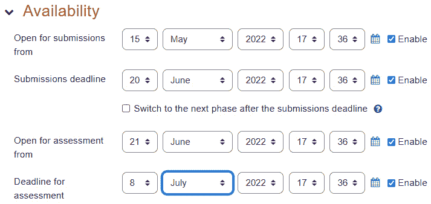

图 10.9 – 可用性

如果您自动将研讨会推进到评估阶段，您也应该自动将评估分配给学生。如果研讨会没有自动将评估分配给学生，它将推进到评估阶段；学生将没有评估要做。设置自动分配是在**管理** | **研讨会管理** | **提交分配** | **计划分配**下进行的：

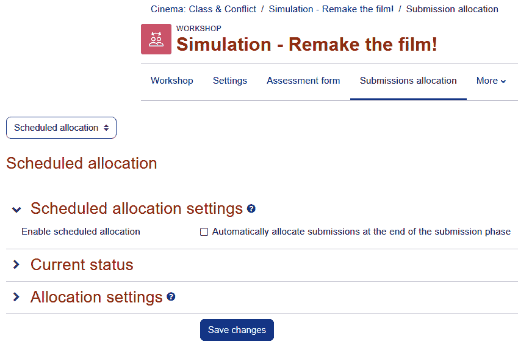

图 10.10 – 计划分配屏幕

### 编辑评估表页面

在此页面上，您输入评估标准。标准应与学习成果相对应。因此，您应参考布卢姆的分类法并使用与认知水平相对应的动词。例如，如果您要求学生创建一个展示以吸引风险投资给初创公司的研讨会，您可能希望使用“设计”或“开发”等动词来表示更高层次的创造行为。此页面的具体内容将根据您在研讨会设置页面所选的评估类型而变化。在以下屏幕截图中，研讨会评分策略设置为**累积评分**：

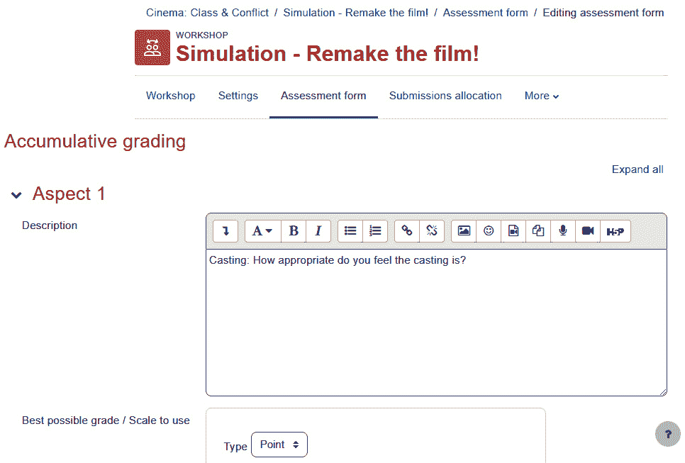

图 10.11 – 在累积评分屏幕中设置方面

将最高分设为评估要素数量的倍数，使学生更容易理解他们的分数。例如，假设一个研讨会被评估为五个要素。对于每个要素，评估者将选择以下四个陈述之一：

+   **A**：研讨会以任何方式都不满足这个要求（0 分）。

+   **B**：研讨会部分满足这个要求（1 分）。

+   **C**：研讨会满足这个要求（2 分）。

+   **D**：研讨会超过了这个要求（3 分）。

您可以为每个选择分配零分，每个 B 选择一分，每个 C 选择两分，每个 D 选择三分。然后，每个元素最多值三分。如果有五个元素，研讨会将最高得分为 15 分。这将使学生对他们的成绩更容易理解。

当学生进行评估时，评估表看起来与以下截图类似：

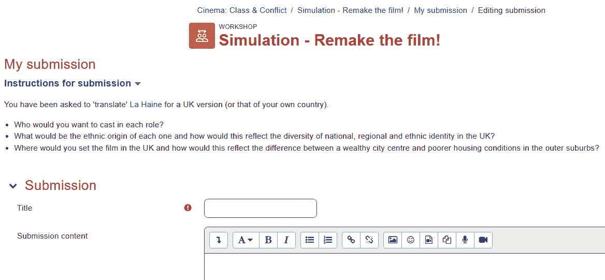

图 10.12 – 学生视图的提交表单

注意，对于每个评估标准，学生可以输入评论。

### 向研讨会添加示例

在您保存研讨会设置和评估表后，您可以将示例添加到您的研讨会中。选择一个研讨会将为您提供以下截图类似的内容：

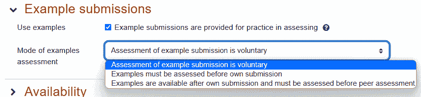

图 10.13 – 为您的研讨会设置示例

要添加示例提交，让我们先点击**添加示例提交**按钮。在这种情况下，这是团队为*鲨鱼池*研讨会共同创建的 PowerPoint 演示文稿，它是团队的“提案演示”板。这会带您到一个显示与您的用户将看到的相同的评估说明的页面。这是您上传要评估的示例的地方：

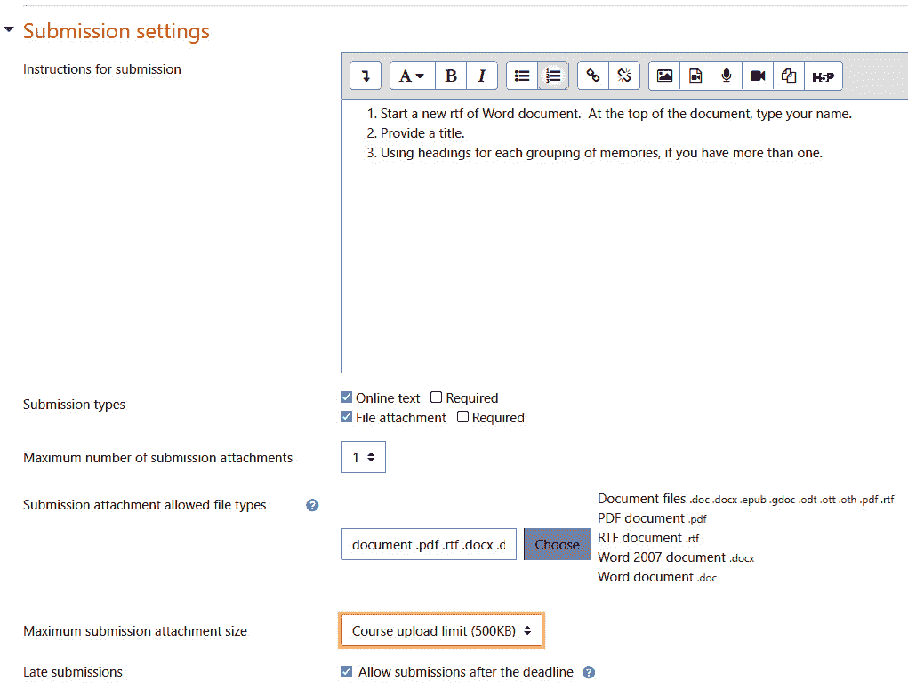

图 10.14 – 如何上传要评估的示例

要评估提交的内容，请切换到评估阶段，然后向下滚动以查看研讨会中的人员及其提交的内容。点击提交内容以打开它并开始提供反馈：

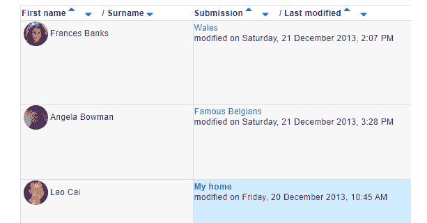

图 10.15 – 点击提交名称以评估它

在您评估示例后，Moodle 会返回到研讨会的首页。您将看到您所取得的进度，这在本页上有指示：

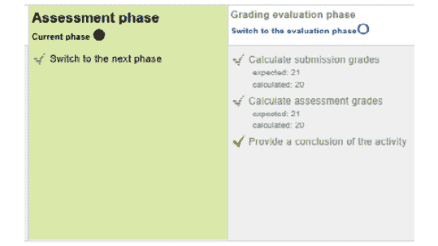

图 10.16 – 切换到评估阶段；当前阶段为金色

注意，下一步将由教师为学生提交的作业进行分配。然而，目前还没有人提交任何内容。在这个时候，教师等待学生提交他们的作品。

## 提交阶段 – 学生提交他们的作品

虽然教师已经完成了设置并准备好接受学生的提交，但学生可能会看到以下消息：**研讨会目前正在设置中。请等待切换到下一阶段**。

小贴士

教师必须手动将研讨会从一个阶段切换到下一个阶段。即使您已经完成设置并准备好接受提交，Moodle 也不知道这一点。

要切换到下一阶段，教师必须在当前阶段之前点击灯泡。在我们的例子中，教师在提交阶段之前点击了灯泡，并看到了以下信息：

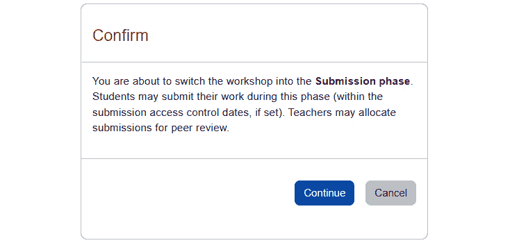

图 10.17 – 将工作坊切换回提交阶段

现在，当学生选择此工作坊时，他们将看到提交作业的提示：

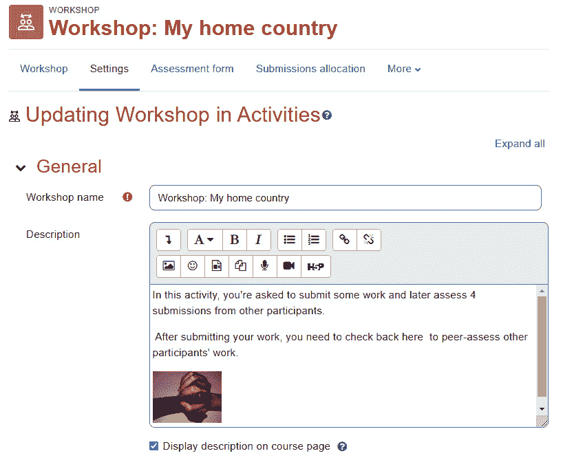

图 10.18 – 显示如何更新提交说明的屏幕

注意，学生也可以在此处评估示例。在本工作坊的**评估示例模式**设置页面中，我们选择了**自愿**；因此，此示例不是必需的：

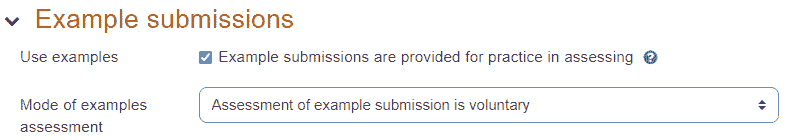

图 10.19 – 评估示例模式的选项设置为自愿

如果我们使评估示例成为强制性的，学生将收到一条消息，表明他们必须在评估示例之后才能提交作业。

### 分配提交

一旦学生开始提交他们的工作，您就可以开始将这些提交分配给其他学生进行评估。请在**工作坊管理** | **提交分配**下进行此操作。您可以手动或随机分配提交。

如果您执行随机分配，所有在此时间点之前发送的提交都将被分配给其他学生进行评估。然而，在此随机分配之后发送的提交将不会自动分配。您需要为下一次提交执行另一个随机分配，依此类推，直到工作坊完成。

## 评估阶段

当您将工作坊移动到评估阶段时，您在提交阶段所做的分配将对学生可用。在这个阶段，学生将实际上评估彼此的工作。所有提交的评估工作都显示在单个屏幕上：左侧列包括学生的姓名，中间列是提交文件的链接，右侧列包括收到的成绩和给出的成绩：

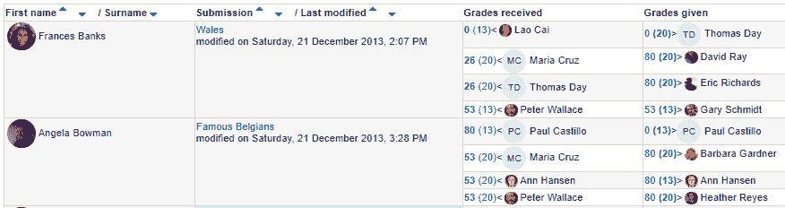

图 10.20 – 显示要评估的工作和所给评估的屏幕

## 评分评估阶段

当您将工作坊移动到这个阶段时，您可以告诉 Moodle 自动计算学生的成绩。此外，您还可以覆盖这些成绩并输入自己的成绩。

注意，在这个阶段，学生不能再修改他们已提交的作业：

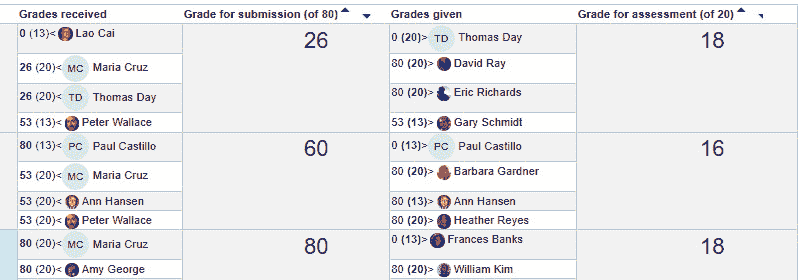

图 10.21 – 评分评估

## 关闭阶段

当你关闭研讨会时，最终成绩将被写入课程的评分册中。学生和行政人员可以检查这些成绩：

![Figure 10.22 – Message to students in the closed phase (an example)]

![Figure 10.22 – Message to students in the closed phase (an example)]

图 10.22 – 关闭阶段的学生信息（示例）

# 摘要

Moodle 为学生之间以及学生与教师之间的互动提供了多种选项。在决定使用哪种社交活动时，请考虑您希望的结构水平和学生之间/学生与教师之间的互动量。例如，聊天和维基提供了相对非结构化的环境，为学生之间的互动提供了大量机会。它们是让学生在一定程度上放手课堂控制的好方法。论坛由于条目是根据主题分类的，因此提供了更多的结构。它可以由教师进行管理，使其结构更加严谨。研讨会由于设定了学生评估他人工作时必须使用的评估标准，因此提供了最多的结构。

工作坊是协作性的。它们为学生相互学习创造了条件。不仅如此，它们还包含了形成性和总结性评估，也就是说，学生在实现学习成果的过程中可以在多个点上检查自己的进度。然后，在最后，他们有机会在一个支持性、培养性的环境中提交总结性评估——一个项目、演示、作品集或类似的东西，因为他们一直在一个培养性、支持性、鼓励性的环境中构建每一个基础块。

在下一章中，你将了解小组和群体，以及两者之间的区别。你将看到如何将课程中的学生分成团队。此外，你还将学习如何使用群体快速有效地管理注册。此外，你还将学习如何评估学生的协作工作。
