# 第十一章：*第十一章*：小组和班级

人们相互学习。Moodle 是为那些既需要异步工作又需要同步工作的团队设计的，它结合了“按需”和“实时”的网络会议。能够有效地协调活动，使小组和班级能够良好地协作，这将使你能够确保学习条件理想，特别是对在线学习至关重要的协作学习。使用小组和班级来促进学生之间的协作学习和沟通是一个简单的过程。记住，几乎所有层次的学习都能从协作中受益，从布卢姆分类法的最低层次“记忆”，这可能包括共同定义术语，到最高层次“评价”和“创造”，这可能涉及学生一起评估、评论、设计和开发。

在本章中，你将了解以下主题：

+   使用小组来构建协作和沟通的团队

+   区分小组和班级

+   如何批量将学生注册到课程中

+   如何在学生注册后管理他们

在本章的第一节中，我们将探讨小组和班级的定义，以及它们与电子学习者的关系。然后，我们将讨论何时以及如何组织学生到小组和班级中，以实现课程学习目标。到本章结束时，你将了解如何在 Moodle 中创建和管理小组和班级。

# 小组与班级的比较

这里还有另一种方法来理解：可以把班级看作是一群通过相同的学术课程一起工作的学生；例如，一群所有选修同一学位课程的学生，他们通常有很多共同课程。例如，你可能有一个班级（学生集合），他们决定一起攻读文科硕士学位。他们将一起选修所需课程。

这里还有另一种方法来理解：可以把班级看作是一群通过相同的学术课程一起工作的学生；例如，一群所有选修同一学位课程的学生，他们通常有很多共同课程。例如，你可能有一个班级（学生集合），他们决定一起攻读文科硕士学位。他们将一起选修所需课程。

一个小组与一个班级不同。小组是在课程层面，而不是在学位项目层面。可以把小组看作是选修某门课程的学生子集。小组用于管理课程内的各种活动。

例如，一个班级的成员可能一起进入学位项目，并按照相同的顺序一起选修课程。因为他们有共同的经历，随着时间的推移，他们建立了信任和长期的关系。

班级的目的是让班级的所有成员只需点击几下就能注册课程。我们可以通过班级同步来实现这一点，它将班级成员资格与课程注册同步。

您可以使用班级和组执行的操作有一小部分重叠。然而，这些差异足够大，以至于您不会想要用其中一个替换另一个。

我们将首先仔细研究班级的主要特征，并检查 Moodle 如何被修改，以便班级能够实现课程和项目学习目标。

# 班级

在本节中，我们将查看如何创建和使用班级。您可以使用班级执行许多批量操作，一次影响许多学生。一般来说，班级由同时入学并一起上所有课程的学生组成，最终一起毕业。例如，就像前一个案例中那样，20 名学生同时进入一个硕士学位课程。他们每个学期上三门课程，并且他们同时进行。学生们会在每门课程中相互交流，尽管方式不同。随着时间的推移，他们会建立信任，并相互学习。

## 创建一个班级

要创建一个班级，请执行以下步骤：

1.  从主菜单中选择**站点管理** | **用户** | **账户** | **班级**。

1.  在**班级**页面，点击**添加**按钮。将显示**添加新班级**页面：

![Figure 11.1 – 添加新班级

![img/Figure_11.01_B17288.jpg]

图 11.1 – 添加新班级

1.  为班级输入一个名称。这是您在处理班级时将看到的名称。在这种情况下，它是`Writing About Nature`。

1.  为班级输入一个 ID。

如果您批量上传学生到这个班级，您将使用此标识符来指定班级。您可以在`Nature-Writing`中使用任何您想要的字符。

1.  输入一个描述，这将帮助您和其他管理员记住班级的目的。

1.  点击**保存更改**：

![Figure 11.2 – 在社会和环境类别中描述班级

![img/Figure_11.02_B17288.jpg]

图 11.2 – 在社会和环境类别中描述班级

现在班级已经创建，您可以开始向这个班级添加用户。

## 向班级添加和删除学生

可以通过搜索和选择手动向班级添加或删除学生。他们也可以通过将文件上传到 Moodle 批量添加。让我们在下一节中查看这些方法中的每一个。

### 手动添加和删除班级中的学生

我们将在*班级同步*部分查看如何管理班级和课程注册。现在，以下是手动添加和删除学生的步骤：

1.  从主菜单中选择**站点管理** | **用户** | **账户** | **班级**。

1.  在 **班级** 页面上，对于您想要添加学生的班级，点击 **人员** 图标：

![Figure 11.3 – 人员图标

![img/Figure_11.03_B17288.jpg]

图 11.3 – 人员图标

**班级分配** 页面将显示。左侧面板显示如果有的话，已经存在于班级中的用户。右侧面板显示可以添加到班级中的用户：

![Figure 11.4 – 班级分配页面

![img/Figure_11.04_B17288.jpg]

图 11.4 – 班级分配页面

### 通过上传文件添加

除了手动将个人添加到班级外，您还可以通过上传文件来上传班级：

![Figure 11.5 – 上传班级文件

![img/Figure_11.05_B17288.jpg]

图 11.5 – 上传班级文件

1.  使用 **搜索** 字段在每个面板中搜索用户。您可以在用户名和电子邮件地址字段中搜索文本。

1.  使用 **添加** 和 **移除** 按钮将用户从一个面板移动到另一个面板。

现在我们已经看到了如何手动添加或删除学生，在下一节中，让我们看看如何批量将他们添加到班级中。

# 班级同步

通过使用班级同步注册方法，您可以一次性注册和取消注册大量学生。注册是自动的。使用班级同步涉及以下步骤：

+   创建班级

+   在班级中注册学生

+   启用班级同步注册方法

+   将班级同步注册方法添加到课程

在上一节中，您看到了前两个步骤：如何创建班级以及如何将学生注册到班级中。在本节中，我们将介绍最后两个步骤：启用班级同步方法和将班级同步添加到课程中。

现在我们将专注于启用不同类型的注册。这个方法使用的是班级同步注册方法。

## 启用班级同步注册方法

要启用班级同步注册方法，您需要以管理员身份登录。请注意，只有具有教师权限的人无法完成此操作：

1.  选择 **网站管理** | **插件** | **注册** | **管理注册插件**：![Figure 11.6 – 管理注册

    ![img/Figure_11.06_B17288.jpg]

图 11.6 – 管理注册

当您在 **插件** 页面上时，您可以点击 **管理注册插件** 来打开启用或禁用课程注册插件的屏幕：

![Figure 11.7 – 可用的课程注册类型

![img/Figure_11.07_B17288.jpg]

图 11.7 – 可用的课程注册类型

1.  点击位于 **班级同步** 旁边的 **启用** 图标。

1.  点击位于 **班级同步** 旁边的 **设置** 按钮：

![Figure 11.8 – 班级同步设置

![img/Figure_11.08_B17288.jpg]

图 11.8 – 班级同步设置

1.  从 **设置** 页面，选择当您使用 **班级同步** 将人员注册到课程时的默认角色。您可以针对每个课程更改此设置。

1.  你还将选择**外部取消注册操作**选项。当学生从班级中移除时，就会发生这种情况。

1.  如果你选择**从课程中取消用户注册**，用户及其所有成绩将从课程中移除。用户的成绩将从 Moodle 中清除。如果你要将此用户添加到班级中，该用户在这个课程中的所有活动都将变为空白，就像用户从未在课程中一样。

1.  如果你选择**禁用课程注册**并移除角色，用户及其所有成绩将被隐藏。你将不会在课程的评分册中看到此用户。然而，如果你要将此用户重新注册到班级或课程中，此用户的课程记录将被恢复。

启用班级同步方法后，现在是时候将此方法实际添加到课程中。

## 将班级同步注册方法添加到课程

要执行此操作，你需要以管理员或课程教师的身份登录。执行以下步骤：

1.  登录并进入你想要添加注册方法的课程。

1.  选择**课程管理** | **参与者** | **注册方法**：

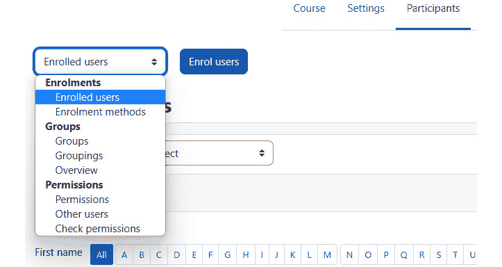

图 11.9 – 从下拉菜单中选择注册方法

1.  从**添加方法**下拉菜单中选择**班级同步**：

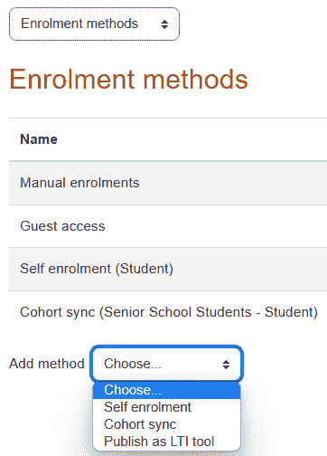

图 11.10 – 注册方法

1.  在**自定义实例名称**中，为此注册方法输入一个名称。这将使你能够在班级同步列表中识别此方法。

1.  对于**激活状态**，选择**是**。这将注册用户。

1.  选择**班级**选项：

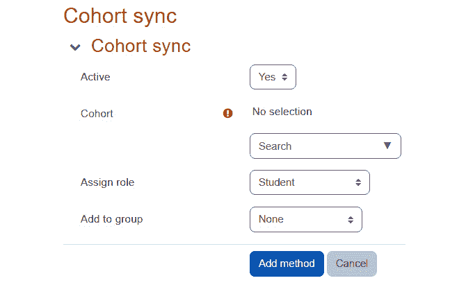

图 11.11 – 班级同步激活

1.  选择班级成员将被赋予的角色。

1.  点击**保存更改**按钮。

班级中的所有用户都将被分配一个在课程中的选定角色。接下来，我们将学习如何从课程中取消注册。

### 批量将学生添加到班级 – 上传

当你将学生上传到 Moodle 时，你可以将他们添加到班级中。

一旦所有学生都加入了一个班级，你就可以通过将班级同步到课程来快速地为他们注册和取消注册。如果你希望批量上传学生，考虑将他们放入一个班级中。这样在以后操作它们会更容易。

这里是一个班级的示例。注意，班级中有注册的学生：

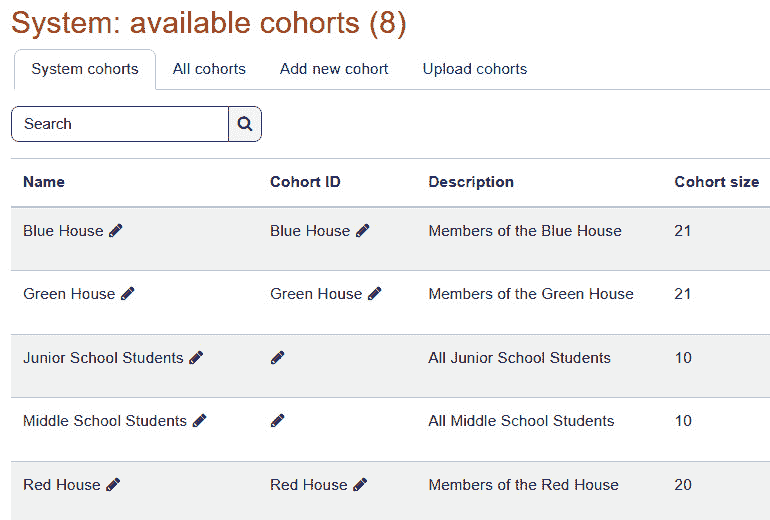

图 11.12 – 可用班级

这些学生是在**网站管理** | **用户** | **账户** | **上传用户**下上传到班级的：

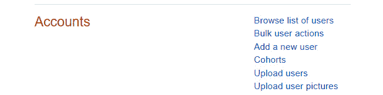

图 11.13 – 上传用户

点击**上传用户**后，以下内容将打开：

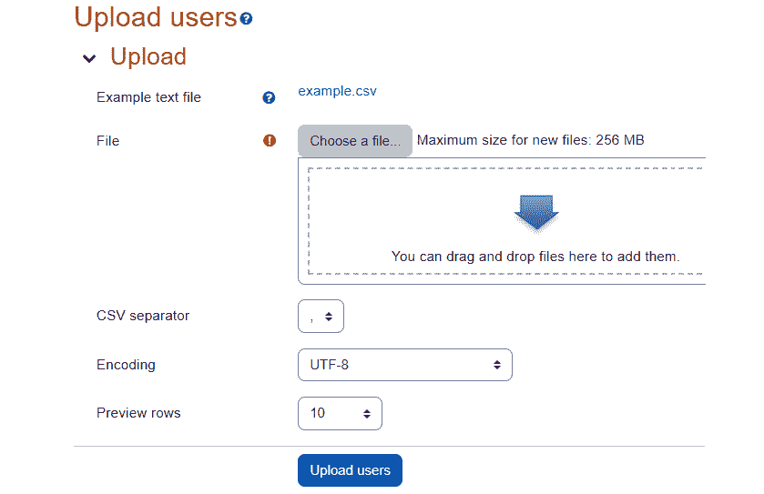

图 11.14 – 在“站点管理”下上传学生到班级

上传的 Excel 文件包含了班级中每个学生的信息。在电子表格中，文件看起来是这样的。为了确保你跟踪字段名称，你可以将它们放在第一行以标记每一列。有关如何配置文件以上传到 Moodle 4.0 的更多详细信息，请参阅以下截图，并访问[`docs.moodle.org/400/en/Upload_cohorts#Valid_upload_file_for_testing`](https://docs.moodle.org/400/en/Upload_cohorts#Valid_upload_file_for_testing)：

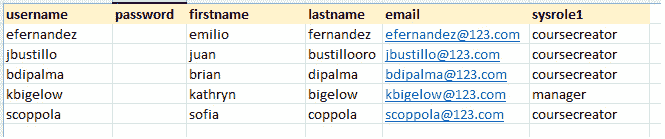

图 11.15 – 上传包含班级信息的 Excel 文件

在此示例中，我们有创建新学生所需的最小信息。它们如下列出：

+   用户名

+   电子邮件地址

+   名字

+   姓氏

此外，我们还有我们想要放置学生的班级 ID（班级的简称）。

在上传过程中，你可以看到你将要上传的文件的预览：

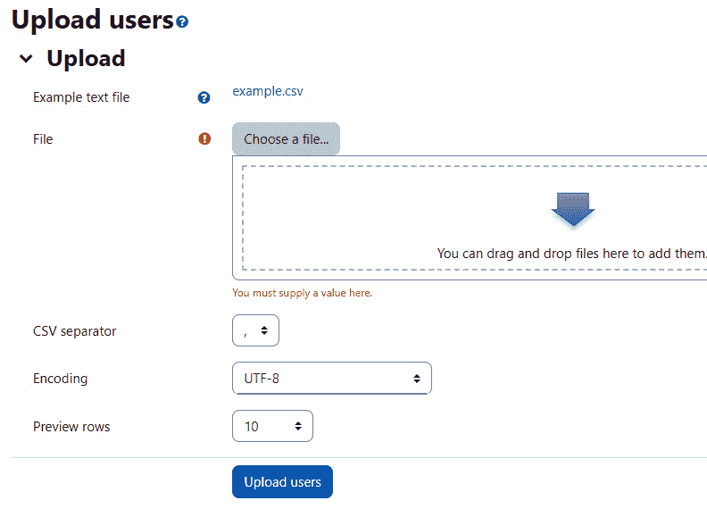

图 11.16 – 你将要上传的文件预览

通常，当我们将用户上传到 Moodle 时，我们会创建新用户。然而，我们也可以使用上传选项快速将现有用户添加到班级中。

小贴士

在“*手动添加和删除学生从班级*”部分，你学习了如何搜索并随后将用户添加到班级中。

然而，当你想要将数百名用户添加到班级时，创建一个文本文件并上传通常比搜索现有用户要快。这是因为当你创建一个文本文件时，你可以使用诸如电子表格和数据库等强大的工具来快速创建此文件。如果你要进行此操作，你将在“上传类型”字段下找到“**更新现有用户**”选项。

当你将用户上传到系统中时，你可以在上传文件中指定城市和国家，或者在上传文件中省略它们，并在文件上传期间将城市和国家分配给系统。此外，你可以上传用户图片。这是在“**用户**”页面上的“**上传用户图片**”下进行的：

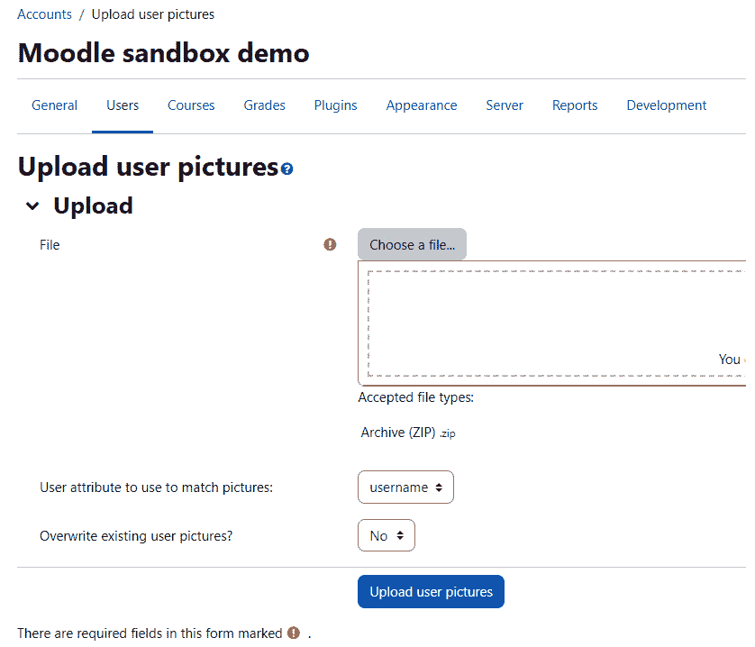

图 11.17 – 上传用户图片的屏幕

现在我们已经检查了此过程的某些功能和限制，让我们列出将班级上传到 Moodle 的步骤。

按照以下步骤将班级上传到 Moodle：

1.  在“**管理**” | “**站点管理**” | “**用户**” | “**上传用户**”下，选择你想要上传的文本文件：

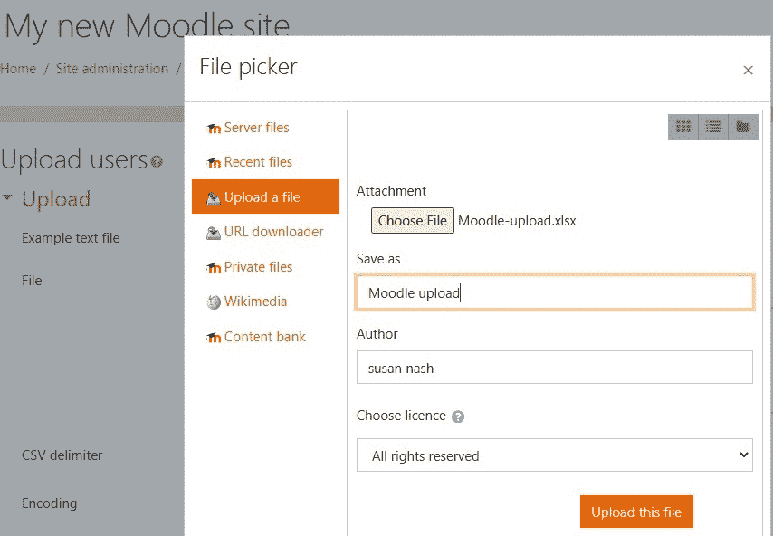

图 11.18 – 上传文件以上传用户

1.  在此页面上，选择**设置**来描述文本文件，例如分隔符（分隔符）和编码。

1.  点击**上传用户**按钮。

您将看到文本文件的前几行。此外，此页面上还提供了其他设置。

1.  在**设置**部分，有一些设置会影响您上传现有用户信息时发生的情况。您可以选择让系统覆盖现有用户的信息，忽略与现有用户冲突的信息，创建密码等。

1.  在**默认值**部分，您可以输入要输入到用户资料中的值。例如，您可以为所有用户选择一个城市、国家和一个部门。

1.  点击**上传用户**按钮开始上传。

现在我们已经在 Moodle 上上传了班级，我们将关注如何使用班级同步注册方法来同时注册和取消大量学生的注册。

## 从课程中取消一个班级的注册

有两种方法可以从课程中取消一个班级的注册。首先，您可以访问课程的注册方法页面并删除注册方法。只需点击您添加到课程中的班级同步字段旁边的**X**按钮。然而，这不仅仅会从课程中删除用户，还会删除他们所有的课程记录。

第二种方法保留了学生记录。再次，转到您添加的**班级同步**方法旁边的课程注册方法页面，并点击**设置**。在**设置**页面上，将**活动**选项选择为**否**。这将移除班级被赋予的角色。然而，班级成员仍然被列为课程参与者。因此，由于班级成员在课程中没有角色，他们不能再访问此课程。然而，他们的成绩和活动报告被保留。

小贴士 - 班级同步是所有人或没有人

当一个人被添加到或从班级中移除时，该人将被添加到或从班级同步的所有课程中移除。

班级同步的替代方法是注册一个班级，即您可以选择一个班级的所有成员并将他们一次性注册到课程中。然而，这是一个单向旅程。您不能一次性取消他们的注册；您将需要逐个取消他们的注册。

如果您一次性注册一个班级，注册后，用户将是独立的实体。您可以在任何时候取消他们的注册并更改他们的角色（例如，从学生变为教师）。

要在课程中注册一个班级，请执行以下步骤：

1.  以管理员或教师的身份进入课程。

1.  选择**管理** | **课程管理** | **用户** | **已注册用户**。

1.  点击**注册班级**按钮。一个弹出窗口出现。此窗口列出了网站上的班级。

1.  点击您想要注册的班级旁边的**注册用户**。系统将显示一个确认消息。

1.  现在，点击**确定**按钮。您将被带回到**已注册用户**页面。

    重要提示

    虽然您可以一次性将所有用户注册到班级中（一次性），但没有一次性取消注册所有用户的按钮。您需要逐个从课程中移除他们。

现在我们已经注册了学生，我们可以开始管理分组。在下一节中，我们将学习如何最好地将他们分组，以便他们的互动和协作能够集中在共同的课程目标上。

# 在分组内管理学生

在本节中，我们将学习如何在分组内管理学生。一个分组是课程上学生集合。在课程之外，分组没有意义。

当您想要将学习相同课程的学生分开时，分组非常有用。例如，如果您的组织正在为几个不同的班级或小组使用相同的课程，您可以使用分组功能来分隔学生，以便每个小组只能看到课程上的同龄人。例如，每个月，您可以为当月招聘的员工创建一个新的分组。然后，您可以一起监督和指导他们。

分组非常适合课程项目和进行同行评审。

在您让一组人完成课程后，您可能希望将此课程用于另一组。您可以使用分组功能来分隔组，这样当前组就不会看到之前组完成的工作。这将像为当前组开设一门新课程一样。

此外，您可能希望某个活动或资源仅对一组人开放。在这种情况下，您不希望班上的其他人能够使用该活动或资源。

## 课程与活动对比

此外，您还可以将分组设置应用于整个课程。如果您这样做，课程上的每个活动和资源都将被隔离到分组中。

您还可以将分组设置应用于单个活动或资源。如果您这样做，它将覆盖课程中的分组设置。

## 三种分组模式

对于一个课程或活动，有几种应用分组的方法。以下是一个包含三种分组模式的列表：

+   **无分组**：课程或活动中没有分组。如果学生已经被分到组中，请忽略它。此外，请确保每个人都能获得课程或活动的相同访问权限。

+   **独立分组**：如果学生已经被分到组中，允许他们看到其他学生以及他们自己组中其他学生的作品。其他组和作品是不可见的。

+   **可见分组**：如果学生已经被分到组中，允许他们看到其他学生以及所有组中其他学生的作品。然而，其他组的作品是只读的。

你可以在课程中的任何活动上使用**无群组**设置。在这里，你希望所有曾经上过这门课的学生都能相互交流。例如，你可能会在新闻论坛中使用**无群组**设置，以便所有曾经上过这门课的学生都能看到最新的新闻：

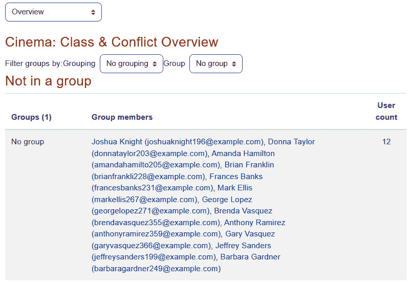

图 11.19 – 使用无群组设置以启用访问

此外，你还可以为课程使用**单独的群组**设置。在这里，你将能够在不同时间运行不同的群组。对于课程中运行的每个群组，它将像一门全新的课程一样。

你可以使用课程的**可见群组**设置。在这里，学生是大型面对面课程的一部分，因此你希望他们在网上以小群体合作。

此外，请注意，某些事情不会受到群组设置的影响。例如，无论群组设置如何，学生永远不会看到彼此的作业提交。

## 创建一个群组

为特定课程创建群组有三种方式。你可以做以下任何一项：

+   手动创建并填充每个群组。

+   根据学生的特征自动创建并填充群组。

+   使用文本文件导入群组。

我们将在以下小节中介绍这些方法。

### 手动创建并填充群组

不要因为手动将学生填充到群组中的想法而气馁。只需几点击就能将学生放入一个群组。要手动创建和填充群组，请执行以下步骤：

1.  选择**课程管理** | **用户** | **群组**。这将带你到**群组**页面：

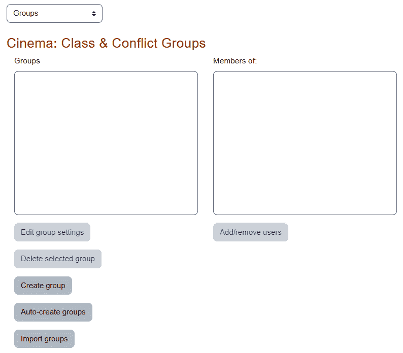

图 11.20 – 创建群组

1.  点击**创建群组**按钮。将显示**创建群组**页面：

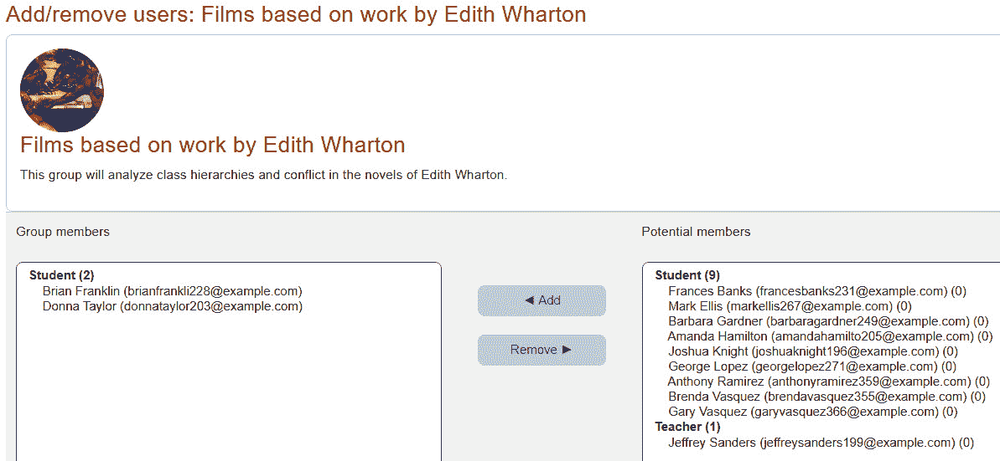

图 11.21 – 添加和删除用户

1.  你必须为群组输入一个名称。这将是在教师和管理员管理群组时看到的名称：

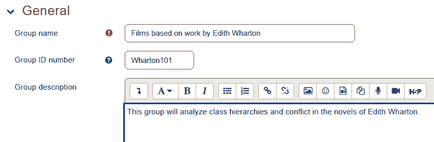

图 11.22 – 命名群组

1.  **群组 ID**号用于将此群组与另一个系统上的群组标识符匹配。如果你的组织使用 Moodle 以外的系统来管理学生，并且该系统将学生分类到群组中，你可以将来自另一个系统的群组 ID 输入到此字段。它不需要是数字。此字段是可选的。

1.  **群组描述**字段是可选的。使用此字段解释加入群组的宗旨和标准是个好习惯。

1.  `master`课程注册密钥：

图 11.23 – 注册密钥

1.  如果你向这个群组添加一张图片，当成员列表显示时（例如在论坛中），成员旁边将显示群组图片。你可以通过编辑用户资料来更改照片，如下所示：

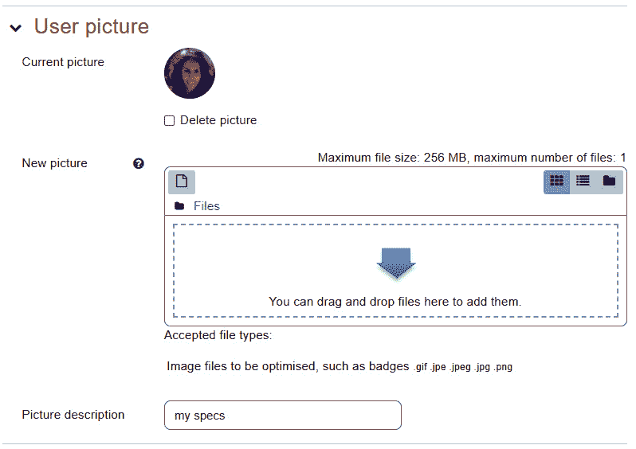

图 11.24 – 为小组添加照片

1.  点击**保存更改**按钮以保存小组。

1.  在**小组**页面，小组出现在左侧列中。选择此小组。

1.  在右侧列中，搜索并选择您想要添加到该小组中的学生：

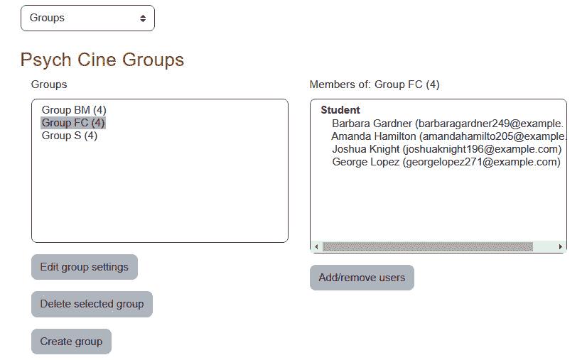

图 11.25 – 将学生添加到特定小组

注意**搜索**字段。这些字段使您能够搜索符合特定标准的学生。您可以搜索名字、姓氏和电子邮件地址。用户个人资料信息的其他部分在此搜索框中不可用。

现在我们已经学习了如何手动创建小组，我们将继续学习下一个方法，即如何自动创建和填充小组。

### 自动创建和填充小组

当您自动创建小组时，Moodle 将创建您指定的数量的小组，然后将所有注册课程的学生分配到这些小组。即使他们已经在课程中的另一个小组中，Moodle 也会将这些当前注册的学生放入这些小组。

要自动创建小组，请执行以下步骤：

1.  点击**自动创建小组**按钮。将显示**自动创建小组**页面：

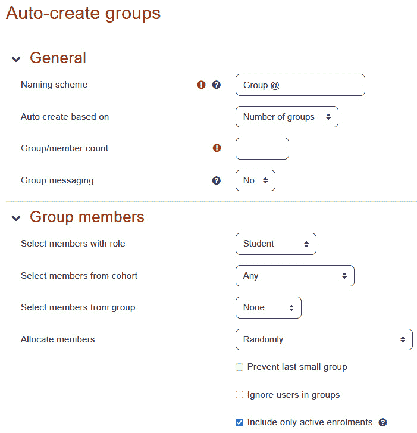

图 11.26 – 自动创建小组

1.  在**命名方案**字段中，输入所有将被创建的小组的名称。

您可以输入任何字符。如果您输入`@`，它将被转换为连续的字母。如果您输入`#`，它将被转换为连续的数字。例如，如果您输入`Group @`，Moodle 将创建**Group A**、**Group B**、**Group C**等更多组。

1.  在**基于以下选项自动创建**字段中，您将告诉系统选择以下两个选项之一：

    1.  创建指定数量的小组，然后根据需要将尽可能多的学生填入每个小组（**小组数量**）。

    1.  根据需要创建所需数量的小组，以确保每个小组有特定数量的学生（**每组成员数**）。

1.  在**小组/成员计数**字段中，您将告诉系统选择以下两个选项之一：

    1.  要创建多少组（如果您选择前面的**小组数量**选项）

    1.  每组要放入多少成员（如果您选择前面的**每组成员数**选项）：

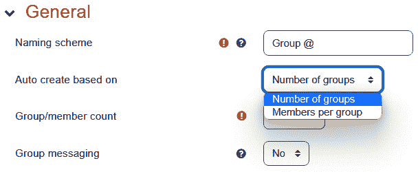

图 11.27 – 将学生添加到特定小组

1.  在**小组成员**下，选择将被放入这些小组中的人。您可以选择具有特定角色或特定班级中的所有人。

如果你选择**每组成员数**，则**防止最后一个小组**设置可用。此设置防止 Moodle 创建少于你指定的学生数的小组。例如，如果你的班级有 12 名学生，而你选择创建每组 5 人的小组，Moodle 通常会创建 2 个 5 人的小组。然后，它将为最后两名成员创建另一个小组。然而，如果选择了**防止最后一个小组**，它将在前两个小组之间分配剩余的两名成员。

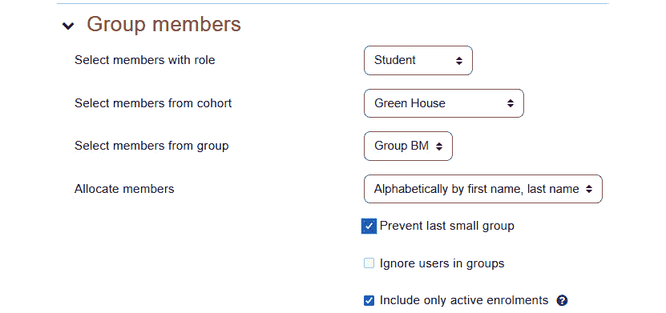

图 11.28 – 防止最后一个小组设置

1.  点击**预览**按钮来预览结果。预览不会显示组内成员的姓名，但它会显示每个组中将有多少组和成员。

# 摘要

班级和小组为你提供了管理学生的强大工具。班级是快速注册和取消注册大量学生的有用工具。小组使你能够将参加同一课程的学生分开，并让教师能够快速查看他们负责的学生。此外，你可以根据学生是否参与“按需”（异步）或“实时”（同步）来划分学生。

在前面的章节中，你学习了如何向你的课程中添加内容和活动。在本章中，你学习了如何使用一些工具来管理你的课程中的学生。在下一章中，你将看到如何使用块的功能扩展你的课程。
