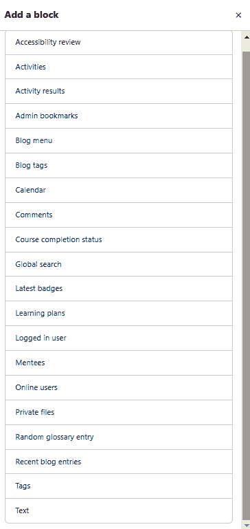

# *第十二章*：通过添加块扩展您的课程

块可以为您的网站或课程添加功能，并且它们可以被放置在页面上的许多不同位置，以帮助集中注意力在内容上并提供有用的信息，例如日历上的作业截止日期、课程完成状态、课程概述等。块非常灵活，用途广泛。它们通常被用来帮助学生建立自信，通过帮助他们保持进度和有效管理时间来实现。本章将描述许多 Moodle 的块，帮助您决定哪些块将满足您的目标，并告诉您如何实现它们。

完成本章后，您将能够做到以下事项：

+   描述块。

+   解释它们的功能。

+   为您的 Moodle 页面配置块。

+   定制 Moodle 课程中的块。

我们将首先描述什么是块，并讨论它们的使用方法。之后，我们将查看一些常用的块及其示例。一旦我们看到了这些常见的块和示例，我们将学习如何根据我们想要放置的位置来配置块。最后，我们将查看 Moodle 提供的最常用的块。在本章的整个过程中，您将需要考虑如何最好地将块与课程目标对齐。

# 定义块

块是伟大的工具，因为它们可以帮助您将内容聚类以便于使用，并且它们可以围绕学习目标进行组织。块是插件，用于排列文本块和链接。它们可以被添加到 Moodle 页面的侧边栏，可以提醒您在印刷教科书中的侧边栏断开处的样子。块通常在侧边栏的一个小区域内显示信息。例如，一个块可以显示日历、最新新闻或课程中的学生。

您可以通过访问**插件**来从**站点管理**站点管理插件：

图 12.1 – 插件在站点管理菜单中的位置

块有助于保持学生专注于任务。它们还可以包含指向课程各部分的链接，从而充当导航栏。重要的是要记住，并非所有教学设计师或课程设计师都喜欢使用块，有些人甚至认为它们有点过时。不喜欢块的人通常会指出仪表板是一个更好的替代方案。

话虽如此，对于那些喜欢块的人来说，它们对于保持参与度很有用。例如，块可以通过提供一个放置**检查你的知识**或**你知道吗？**互动的地方来帮助学生保持参与度：

图 12.2 – 插件页面上的块菜单

## 块的使用

在配置站点时，您可以选择在站点的前页上显示、隐藏和定位块。在配置课程时，您也可以在课程的主页上显示/隐藏/定位块。该过程与在站点的前页或课程的主页上操作相同。站点的前页本质上是一个课程。您还可以允许学生向他们的**仪表板**页面和**我的个人资料**页面添加块。请记住，某些 Moodle 主题有预定义的块，因此您可能无法添加块或重新定位它们。

在标准的 Moodle 安装中，有许多块可供您使用。以下截图显示了 Moodle 4.0 中的标准块：

图 12.3 – 添加块时标准块的菜单

您也可以通过访问[`moodle.org/plugins`](http://moodle.org/plugins)来安装额外的块。

## 块在行动中的示例

在标准的 Moodle 安装中，有许多块可供使用。您可以通过点击右上角的**添加块**来添加块：

图 12.4 – 在右上角出现的“添加块”选项

在选择块时务必小心，因为您很容易创建冗余。例如，您可以将活动添加到块中，这意味着它将出现在右侧列而不是页面中心部分。这真的是您想要的吗？大多数情况下，活动最好放在页面中间。一个值得注意的例外可能是**术语表**和**维基**，它们可以在课程中进行方便的放置“触手可及”：

图 12.5 – 可以添加到块中的活动

可能最受欢迎的选项是**日历**块，您可以将它定位在两侧，使其在两侧都突出显示。**日历**块是一个出色的工具，因为它允许您提醒学生截止日期和关键里程碑。

**评论**块可以帮助您组织评论，并快速让您在不经过多次点击或屏幕的情况下进行沟通。

**课程完成状态**块作为激励者和激励因素极为有用，因为它既可以提醒学生他们在课程中的位置，又可以奖励他们在课程中取得良好进展。

例如，**课程概览**块可以帮助您创建一个组织良好的页面。**课程描述**块具有类似的功能。

其他块作为访问 Moodle 中重要页面的快捷方式非常有用。这些块包括**活动**、**主菜单**、**课程**、**章节链接**和**即将发生的事件**。

就像任何工具或应用程序一样，块可能会被过度使用。它们可能会分散注意力并造成杂乱。为了决定使用哪些块，考虑你对块的使用情况，并优先考虑你希望学生做什么和看到什么。请记住，Moodle 移动版可能会在页面底部而不是在两侧显示块。

现在您已经了解了块是什么，它的用途以及 Moodle 提供的不同类型的块，让我们继续下一节，我们将学习如何配置块，以便您可以控制它们出现的位置。

# 配置块出现的位置

您可以配置一个块在课程的首页以及课程中所有资源和活动页面上显示。您还可以配置一个块在所有课程中显示。此外，您还可以创建一个包含课程类别的块，并列出这些类别中的单个课程。

要配置一个块出现的位置，请点击齿轮图标。在这种情况下，我们正在配置放置**日历**块的位置：

图 12.6 – 管理块的下拉菜单

要将块移动到屏幕的右侧并重新排列它们，请点击交叉终止箭头，按住鼠标，并将选择项移动到周围：

图 12.7 – 要移动块，点击十字，按住并移动

例如，在下面的截图中，用户正在配置**《印象派》**课程中的**即将发生的事件**块：

图 12.8 – 如何配置即将发生的事件块

这些设置组合起来确定块出现的位置。在某些地方，其中一些设置可能没有效果。您可以在页面上设置块将出现的区域，也可以指定哪些页面类型将包含块。请注意，您必须指定块的权重。这是您调整它在页面上的位置的方式。**0**将块放在底部，而**10**将块放在顶部。务必尝试不同的设置，看看调整值时块的位置如何变化。

当您将一个块添加到页面时，您选择的任何显示设置都将影响从该页面开始的所有块，直到页面层次结构的底部。例如，假设您将一个块添加到课程的首页，就像前面的截图中的用户所做的那样。任何显示设置都将影响该页面的块以及该课程内的其他页面。

当这个块被添加到课程页面时，它不会在课程之外的其他页面上显示。

如果您希望块出现在您网站的每个页面上，或特定页面类型的每个实例上，请将块添加到网站首页。从**网站管理**屏幕，开启**编辑模式**并点击右上角的**添加一个块**：

图 12.9 – 将块添加到网站首页

完成这些操作后，在**块设置**下，您将看到**显示在页面类型**的选项。我们将以**最近活动**块为例：

图 12.10 – 配置块以使其在任何网站管理页面上显示

页面下方，您将看到一个设置，用于确定块是否显示在此页面上（即首页）：

图 12.11 – 确定块是否显示在首页

这些设置可以协同工作以产生您想要的结果。例如，如果您是管理员并且希望块出现在您网站的每个页面上（除了首页），请选择**任何网站管理页面**，然后对于首页，将**可见性**设置为**否**。

您还可以将一个块添加到某个类别下的所有课程中。从**网站管理**菜单中选择**课程** | **管理课程和类别**。然后，选择类别：

图 12.12 – 从弹出菜单中选择要添加的块

将块添加到类别页面。然后，在**此块显示位置**的设置中，选择哪些页面将显示此块：

图 12.13 – 在课程类别页面上启用块

请记住，如果您为移动设备（如手机和平板电脑）选择响应式主题，则停靠的块将显示在页面底部。您现在知道如何配置块显示的位置。在下一节中，您将学习如何选择和配置您可用的某些块。

# 标准块

Moodle 为您提供了许多标准块，您可以将它们添加到您的课程中。本节将讨论其中一些最有用的块。我们将回顾**活动**、**博客**、**日历**、**评论**、**课程完成**以及许多其他块，例如**用户**和**徽章**。

## 活动块

**活动**块列出了课程中使用的所有活动类型：

图 12.14 – 选择活动块以列出课程中使用的活动

只有当您的课程至少包含一个该类型的实例时，才会显示活动类型。当用户点击活动类型时，课程中所有此类活动都会列出。

在以下屏幕截图中，用户点击了**活动**块中的**论坛**。通过这样做，显示了课程中的资源列表：

图 12.15 – 您可以使用块来组织论坛

重要提示

如果此块位于网站首页上，点击活动类型将给出首页上的活动列表（而不是整个网站）。

## 文本块

**文本**块（在 Moodle 4.0 之前称为**HTML**块）在侧边栏中创建一个块，可以包含任何可以放在网页上的 HTML（或任何网络内容）。大多数经验丰富的网络用户习惯于侧边栏中的内容是页面主要内容的补充。例如，我们可以在大多数博客软件的侧边栏中放置菜单和有趣的链接。我建议您保持这一标准。使用**文本**块来包含对课程有趣的补充内容，但不是必需的。例如，您可以将指向另一个感兴趣网站的注释链接放入其中。

当您编辑一个**文本**块时，Moodle 提供了与添加网页到课程时相同的全功能网页编辑器。

将**文本**块想象成一个可以放入您课程侧边栏中的微型网页：

图 12.16 – 配置文本块（以前称为 HTML 块）

在配置完**文本**块后，它将出现在右侧栏中，具有一致的样式：

图 12.17 – 配置的文本框外观

## 博客菜单块

默认情况下，每个 Moodle 用户在网站上都有一个个人博客。有关更多信息，请参阅 Moodle 文档（[`docs.moodle.org/400/en/Blogs`](https://docs.moodle.org/400/en/Blogs)）。如图所示，选择此块将菜单放入课程侧边栏：

图 12.18 – 博客菜单块被定位为侧边栏

**博客菜单**块帮助人们访问学生可能创建的博客文章。它允许您将博客纳入课程，并开发可以随学期更改的自定义内容，确保其保持最新。

注意，此块提供了关于课程的博客条目的快捷方式。如果博客将是课程的一部分，请将此块包含在课程主页上。

## 博客标签块

此块显示网站范围内使用的博客标签列表。标签按字母顺序列出。使用标签的博客条目越多，该标签就越大：

图 12.19 – 博客标签块有助于识别主题

## 日历块

**日历**块非常有用，因为它有助于学生保持进度。研讨会、作业、测验和事件都显示在**日历**块中。务必提醒用户他们的时区是正确的。否则，时间将不会调整到他们的时区：

图 12.20 – 日历块按月份显示计划的活动

将会出现一个弹出窗口并显示事件的名称。此事件被添加到该课程中，因此是一个全课程事件。

当用户点击**日历**块底部的四个链接之一时，它会禁用该类型事件的显示。

当在课程中的活动添加截止日期时，它将自动添加到日历中。

## 评论块

**评论**块允许任何有权访问它的人留下和阅读评论。所有评论都会被保存，因此你可以积累相当长的评论列表。

在下面的屏幕截图中，**Student1**用户已登录并添加了一条评论：

图 12.21 – 评论块允许您在一个地方查看评论

重要提示

**Student1**可以删除他们的评论，但不能删除课程管理员留下的评论。

当然，教师、经理和网站管理员可以删除任何人的评论。

由于所有评论都会被保存，列表可能会很长，你可能希望将**评论**块限制在单个课程中 – 即，你不想在网站范围内添加评论，或者添加到某个类别的所有课程中。如果你这样做，块可能会因为评论而变得拥挤（除非这是你想要的效果）。网站管理员可以通过访问**网站管理** | **网站首页** | **网站首页设置**来决定在评论块中显示多少条评论：

图 12.22 – 确定页面上可以显示多少条评论

考虑向活动或资源添加**评论**块，并使用第一条评论来鼓励学生留下反馈，如下所示：

图 12.23 – 添加第一条评论以鼓励学生留下反馈

## 课程完成状态块

此块与课程完成跟踪一起工作。为此块正常工作，您必须首先设置完成课程的准则，并且必须在网站级别启用完成跟踪。这可以通过访问**设置** | **完成跟踪**来完成：

![图 12.24 – 课程完成状态块

![img/Figure_12.24_B17288.jpg]

图 12.24 – 课程完成状态块

当学生查看此块时，他们会看到课程完成的条件以及每个条件的状态。当教师查看此块时，他们会看到课程中每个学生的完成状态报告。

## 课程/网站摘要

如果您将此块添加到您网站的首页，它将显示首页摘要，这可以通过转到**网站管理** | **网站首页设置** | **编辑设置**来找到：

![Figure 12.25 – 课程描述可以出现在课程中的块

![img/Figure_12.25_B17288.jpg]

图 12.25 – 课程描述可以出现在课程中的块

如果您将其添加到课程页面，它将显示课程的描述，这可以通过转到**设置** | **编辑课程设置** | **课程摘要**来找到。

## 学习计划块

**学习计划**块显示了学生需要掌握的能力。有关学习计划的实用参考，请访问 Moodle 文档（[`moodle.org/plugins/block_learning_plan`](https://moodle.org/plugins/block_learning_plan)）：

![Figure 12.26 – The appearance of the Learning plans block

![img/Figure_12.26_B17288.jpg]

图 12.26 – 学习计划块的外观

## 在线用户块

**在线用户**块显示了当前正在当前课程中的用户。如果它在网站首页上，它显示的是网站上的用户。当它添加到课程中时，它可以是一种减少电子学习孤立的好方法。该块每几分钟更新一次。

## 最近活动块

当**最近活动**块添加到课程的首页时，它列出了自用户上次登录以来该课程中的所有学生和教师活动。可以通过**最近活动完整报告**链接访问活动报告筛选器和生成器。

当添加到网站的首页时，它列出了自用户上次登录以来首页上的所有学生和教师活动，但不是在个别课程中。如果有人以访客用户身份登录，此块将显示自上次访客登录以来的任何活动。如果访客用户经常访问您的网站，此块可能对他们有限的使用价值。一种策略是不要将此块添加到网站的首页，这样匿名用户就看不到它，并且只将其添加到需要用户进行身份验证的课程中。

## 远程 RSS 源块

当 **远程 RSS 订阅源** 块添加到课程中时，课程创建者选择或创建要在该块中显示的 RSS 订阅源。当 RSS 订阅源最初开发时，它们往往与订阅某人的博客一起使用。现在，它们在后台使用，用于订阅播客，播客比以往任何时候都更受欢迎。Podbean、Resonate、Captivate 和 Buzzsprout 等播客托管服务自动将他们托管的播客列在播放器和分发平台（如 SoundCloud、Apple Podcasts、Google Podcasts、Spotify、TuneIn 和 Overcast）上。

网站管理员可以添加一个订阅源，然后课程创建者可以选择在 RSS 块中使用它。或者，当教师添加 **远程 RSS 订阅源** 块时，他们可以在那时添加订阅源。如果 **共享订阅源** 设置为 **是**，新的订阅源将可供所有其他教师使用，用于所有其他课程。

## 搜索论坛块

**搜索论坛** 块为论坛提供搜索功能。它不搜索其他类型的活动或资源。

当它添加到课程的首页时，它只搜索该课程中的论坛。它搜索帖子标题和内容。

此块与自动出现在网站首页上的 **搜索课程** 字段不同。**搜索课程** 字段搜索课程名称和描述，而不是论坛。

## 主题块

**主题** 块显示课程中编号主题或周次的链接。点击链接将页面推进到该主题。

## 即将发生的事件块

**即将发生的事件** 块是 **日历** 块的扩展。它从您的日历中获取事件信息。默认情况下，**即将发生的事件** 块显示 10 个事件；最大值为 20 个。它向前查看默认为 21 天；最大值为 200 天。如果即将发生的事件数量超过此块选择的最大值，则不会显示最远的事件。在下面的屏幕截图中，您可以看到事件是如何列出的，包括简短的标题以及日期和时间。标题是链接的，以便学习者可以点击并访问该网站：

图 12.27 – 即将发生的事件块

此块有助于提醒学生完成课程中的任务。请记住，如果您希望即将发生的事件块出现在所有页面上，您需要将其添加到网站主页并选择 **任何页面**：

图 12.28 – 配置即将发生的事件块以使其出现在所有页面上

# 摘要

在本章中，我们探讨了 Moodle 4.0 中可用的许多模块。请记住，在 4.0 版本中，模块会出现在仪表板上，并且你可以将它们设置为在课程页面上显示，以帮助学生提醒即将发生的事件、展示重要信息并保持他们的参与度。在决定使用哪些模块时，要抵制添加过多的诱惑。模块是有帮助的，但它们也可能分散注意力并混淆优先级。有策略地使用模块以确保学生保持进度，并标记重要信息。你还可以将它们作为持续的激励因素，让对他们的积极成就的提醒出现。记住，你可以根据需要打开或关闭模块。关键是使用模块来帮助学生成功。你可以将模块用作路标和指南。然而，避免过度使用模块，因为它们可能会分散注意力。

在下一章中，你将学习如何为教师优化课程，包括如何查看课程日志和活动报告以确定学生做了什么，如何查看和分类成绩，以及如何评分。
