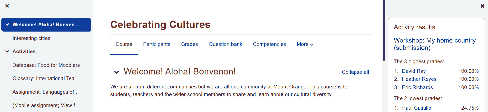

# 第十三章：*第十三章*：教师功能：日志、报告和指南

Moodle 4.0 中最有用的新功能之一是与自动生成进度报告有关，这些报告有助于学生和教师。例如，有一个新的活动完成指标，跟踪学生在每门课程中分配的任务进度。同样，仪表板有一个更新的**时间线**块和一个高度功能性的**日历**块，将所有课程截止日期汇总在一个页面上。

对于管理员来说，有一些与 Moodle 功能相关的性能报告。可以通过访问网站管理菜单，并按照以下路径找到这个新功能：**网站管理** > **报告** > **报告生成器** > **自定义报告**。因此，管理员可以构建对组织内部不同群体有用的自定义报告，从学生、教师、经理到管理员。

对于教师来说，跟踪进度、生成活动日志和确定参与程度对于评估**满意的学术进步**（SAP）至关重要，Moodle 提供了几个特别有趣的功能。这些功能集中在确定学生如何通过课程。报告和日志显示你在网站或课程中做了什么，它们可以是非常宝贵的工具，让你了解学生如何实现学习目标，并且可以作为有用的差距分析，让你能够调整内容评估策略。

你可能需要在学期不同时间生成学生进度报告。首先，你可能需要报告那些从未出席的学生，以便你可以因缺勤而取消他们的课程。然后，你可能需要生成期中进度报告。最后，你可能需要提供关于学生在任务上的时间和完成率的指标。Moodle 的日志和报告可以帮助你。

在本章中，你将学习以下内容：

+   识别 Moodle 中可用的报告和日志类型

+   根据课程成果确定所需的报告类型

+   准备所需的日志和报告

在下一节中，我们将识别和生成可用于多种学生进度评估以及认证合规性的日志和报告。

# 学生对表现和进度的看法

作为学生，Moodle 4.0 为你提供了一个机会，查看你在课程中的进度，以及查看“一目了然”的报告，了解你的表现与其他课程成员相比如何。

首先，有一个新的简化版课程索引，如果您使用平板电脑或笔记本电脑，它就是屏幕左侧的一列。因此，在您的平板电脑/笔记本电脑屏幕的左侧，您会看到**课程索引**，其中包含各种主题（模块）和活动。在中间，您会看到导航栏，它提供课程信息、公告、资源和服务链接，以及更多。在右侧是跟踪活动、显示课程表现并为您提供链接到协作活动的块，如果您的教师或管理员允许您查看它们：

图 13.1 – 左侧列中的课程索引视图

重新设计的**日历**和**时间轴**块对所有用户都可用。它们对学生特别有帮助，因为即将到来的作业会按照截止日期的顺序显示，并且它们也会出现在重新设计的**日历**块上，该块直接位于下方。在右侧是一个重新设计的**学习计划**块，以及**最近访问的项目**，它展示了新设计的活动和资源图标：

图 13.2 – 时间轴和日历块视图

新设计的**课程**页面让学生知道他们完成了多少课程。例如，如以下**我的课程**屏幕截图所示，学生完成了 42% 的**正念课程创建**，但只有 27% 的**庆祝文化**。请注意，课程类别直接位于课程名称下方，这使得导航更加容易：

图 13.3 – 新设计的“我的课程”页面

因此，尽管学生的进度报告在技术上并不位于**报告**部分，但它们是报告，并且在实现令人满意的学术进步等方面非常有帮助。

现在，让我们看看作为教师、经理或管理员，您将需要的日志和报告。

# 日志和报告

Moodle 会详细记录用户在您网站上执行的所有活动。您可以使用这些日志来确定谁在您的网站上活跃过，他们做了什么，以及他们何时做的。

重要提示

一些报告在课程级别可用；教师可以访问这些报告。其他报告在网站级别可用；您必须成为网站管理员才能访问这些报告。这两者都在本章中介绍。

Moodle 内置了一个适度的报告查看系统，在 Moodle 4.0 中作为报告构建器进行了增强。**报告构建器**功能允许管理员创建和共享自定义报告。要创建自定义报告，请转到**网站管理 | 报告 | 报告构建器 | 自定义报告**。一旦创建了报告，您就可以自定义它们何时发布以及发送到何处。您还可以管理对报告的访问。请注意，在安排报告时，您还可以自动化它们何时、何地以及发送给谁。 

然而，对于复杂的日志分析，您需要查看 Moodle 之外的内容。查看与 Moodle 兼容的第三方插件是个好主意。列表可以在以下链接找到：[`docs.moodle.org/400/en/ad-hoc_contributed_reports`](https://docs.moodle.org/400/en/ad-hoc_contributed_reports)。

要查看课程日志和报告，您必须以教师或管理员的身份登录。然后，选择**我的课程 | 课程名称 | 报告**：

![图 13.4 – 报告屏幕视图

![图片 13.04_B17288.jpg]

图 13.4 – 报告屏幕视图

如果您是学生，您将看到您的能力分解。

## 能力分解

能力分解记录了在完成课程活动时哪些能力正在得到满足。它们出现在学生的学习计划中。要激活自动更新，必须将课程活动完成日志与能力或学生学习计划关联起来。

## 查看课程日志

注意，Moodle 显示的日志文件可以通过课程、参与者、日期、活动和操作进行筛选。您可以为这些筛选器中的任何一个选择单个值，如下面的截图所示：

![图 13.5 – 如何查看课程日志

![图片 13.05_B17288.jpg]

![图 13.5 – 如何查看课程日志

您不能为这些过滤器中的任何一个选择多个值——也就是说，您不能同时查看两个课程的日志，同时查看四个参与者的日志，或者同时查看几天的日志。如果您想要更复杂的日志视图，您必须使用除 Moodle 内置日志查看器之外的工具。

幸运的是，您可以下载日志作为文本文件，并将它们导入到另一个工具中，例如电子表格。要下载日志，请使用页面底部的**下载表格数据为**下拉菜单，如下面的截图所示：

![图 13.6 – 使用“下载表格数据为”下拉菜单下载日志

![图片 13.06_B17288.jpg]

。

有两种方法可以从同一位置获取多个课程的信息。首先，您可以从管理界面作为管理员运行报告。这使您能够为网站上的所有课程运行报告。其次，作为教师，您可以分别从每个课程下载数据，并在一个 Excel 表格或工作簿中合并。

## 功能增强器

在某些情况下，您可以使用实时日志作为监考工具。您可以将实时日志与显示学生在计算机上工作的流媒体视频（Zoom、BigBlueButton 或其他网络会议应用程序）结合起来。这些最适合有指导阅读或注册人数较少的课程。

## 查看实时日志

**实时日志**显示了当前课程在过去一小时中发生的情况：

图 13.7 – 使用实时日志跟踪活动

如果您想观察学生在使用课程时的行为，请使用实时日志。例如，您可以在学生参加计划中的测验时监控课程。

在下一节中，我们将学习如何生成活动报告并分析它们。

## 查看活动报告

活动报告提供了一个用户友好的视图，用于查看单个课程中的活动。虽然日志显示了完整的信息，但活动报告仅显示课程项目、每个项目中所做的操作以及该项目的最新活动时间。当您首次从菜单中选择**活动报告**时，您将看到一个包含课程中所有活动的列表，如下面的截图所示：

图 13.8 – 活动报告区域视图

从此列表中，您可以选择您想要报告的活动，然后您将被带到该活动。在本例中，教师选择了**作业 1**，打开了这个活动。然后，教师可以选择**查看所有提交**以查看学生如何参与这个活动：

图 13.9 – 查看提交日志/报告

注意，活动报告仅作为课程中活动的链接。一旦您选择了一个活动，您将使用该活动的查看报告的方法。

现在，让我们看看我们可以生成的参与报告。

## 参与报告 – 用于确保持续性的干预措施报告

**课程参与**报告对于发现哪些学生需要完成活动并向他们发送提醒以完成活动特别有用。

图. 13.10 – 显示不同类型课程参与报告的菜单

在以下示例中，教师正在查看名为**电影心理学评估**的反馈活动的报告。教师想查看谁为课程提交了反馈：

图 13.11 – 显示谁为课程提交了反馈的课程参与报告

在这个演示课程中，教师希望所有学生都提供反馈。因此，教师将向未完成活动的学生发送消息。为此，他们可以选择学生，然后从**选择用户**下拉列表中选择**发送消息**：

图 13.12 – 要求学生提供反馈的方法

这将教师带到可以创建和发送消息的页面。该消息将发送到学生的电子邮件地址，并存储在他们的 Moodle 消息中。

现在，让我们学习如何进行更精确的监控。

## 使用活动完成情况

您可以将监控提升到更精确的水平。如果课程启用了活动完成情况，您可以看到一个报告，显示课程中活动的完成状态。请注意，活动完成情况可以通过适当的权限覆盖。活动完成情况允许您在每个活动的设置中修改和设置完成标准。您可以用它作为进步的门户。例如，学生必须达到一定的分数才能继续前进。这在掌握学习中很常见：

图 13.13 – 生成报告以显示活动的完成状态

注意，您可以显示仅针对一个组或课程中的所有学生的活动。此外，此报告仅显示那些正在跟踪完成状态的活动。

确保学生达到掌握级分数（通常是 80%或更高）是能力本位或熟练度本位学习的基础。**能力本位学习**（**CBE**）表示一个学习计划，该计划规定了达到某一技能或知识领域所需的学习类别。在 CBE 中，学生只有在完成课程并达到指定分数后才会获得证书或学分。

现在，让我们学习如何审查学生的成绩和评分。

## 报告和认证

请记住，这些报告通常用于自学认证，特别是与学生的进度相关，如 SAP 的指标，以及与坚持性相关的指标。

## 查看成绩

要访问成绩，选择您想查看成绩的课程，然后选择**成绩管理 | 评分报告**。这将显示该课程的评分摘要：

图 13.14 – 在一个位置生成带有学生成绩的评分报告

注意，在前面的屏幕截图中，一些学生尚未完成本课程的第一项作业——即**从概念到现实**。此外，请注意页面右上角的**开启编辑**按钮；教师可以使用此按钮通过输入新的成绩来覆盖显示的成绩。当教师点击该按钮时，此页面的成绩变为可编辑状态。

在我们的示例课程中，教师想要调查“从概念到现实...”作业缺少成绩的情况，因此他们必须点击作业名称，这将使他们从**评分报告**区域退出并进入作业本身。

评分报告区域是教师检查课程成绩的起点。它还使教师能够输入更新的成绩。从那里，教师可以点击进入单个活动并调查或修改成绩。

## 分类成绩

每个评分活动都可以放入一个类别中。请注意，您将活动放入类别，而不是学生。如果您想对学生进行分类，请将他们放入组中。

### 查看评分类别

将课程中的评分活动分类可以快速查看学生在各种活动中的表现。如果您没有将活动分配到类别，它将默认属于**未分类**类别。

在**测验**类别中，显示了两个测验的成绩。页面还显示了测验的**类别**总价值。

**非测验**类别仅显示类别总价值。非测验下单个活动的成绩不显示。如果用户点击位于非测验旁边的**+**号，该类别中的单个成绩将被揭示。

在这个例子中，教师可以看到**Student1**在测验中的分数与非测验活动的分数一致。将活动分类使得比较变得容易。

现在，让我们学习如何创建评分类别。

### 创建评分类别

类别是在同一窗口中创建的，并将项目移动到类别中。

#### 如何创建评分类别

按照以下步骤：

1.  选择**管理 | 成绩 |** **评分簿设置 | 添加类别**：

图 13.15 – 评分簿设置区域的查看

1.  在页面底部，点击 **添加类别** 按钮。然后您可以通过点击 **编辑类别** 按钮来编辑类别。您可以添加 **类别名称** 并指定计算成绩的方法（聚合类型）。

图 13.16 – 设置新成绩类别时的屏幕视图

1.  填写页面并保存您的更改。

#### 如何将项目分配给成绩类别

按照以下步骤操作：

1.  选择 **设置 | 评分 | 成绩类别 | 新类别**。

1.  选择您想要分配到该类别的项目。

1.  在页面底部的下拉菜单中选择您想要移动项目（们）到的类别：

图 13.17 – 移动到新的成绩类别

1.  点击 **保存更改** 按钮。

这里最重要的点是确定在检查学生成绩和创建类别时，您想回答哪种类型的问题。您可以将成绩分类在学习成果、主题或模块周围。例如，让我们考虑学生在测验和更互动的活动（如研讨会和论坛）上的表现。为了回答这个问题，您可以只为测验创建一个类别，然后通过查看成绩来回答这个问题。现在，让我们考虑学生在线下活动和线上活动上的表现。为了回答这个问题，您可以创建线上和线下评分类别。

小贴士

请记住，这些类别并非一成不变。如果您的需求发生变化，您可以根据需要创建和分配新的评分类别。

# 摘要

Moodle 4.0 已更新，增加了新的功能，使学生们、教师和行政人员更容易查看成绩，并一眼就能看出是否取得了进步，以及可能需要干预和激励的地方。

无论是在教室还是在线上，管理一个成功的课程都需要教师和学生之间的双向沟通。持续监控课程日志和成绩可以提前表明一个班级可能需要中期调整。您可以使用问题、调查和聊天来发现学生面临的具体问题和挑战。在使课程回到正轨后，定制评分标准、额外学分和曲线可以帮助您平衡成绩。在线教学时，养成经常检查日志和成绩的习惯。

您还可以使用报告和日志进行行政目的，以符合记录学生首次登录和学术进步以促进学生成功的要求。外部认证机构通常会要求课程数据。如果您是私人培训机构，您可能希望向付费客户的学生提供数据。

现在您已经完成了这本书的学习，您已经拥有了在 Moodle 中创建、交付和管理成功在线课程的基本工具包。然而，您并不需要独自完成！当您需要 Moodle 方面的帮助时，有许多优质资源可供利用。

请记住，这本书旨在作为一般性的介绍，重点关注有助于您规划课程结构、资源和活动的教学策略，以最大化您成功的可能性。Moodle 是一个功能强大的学习管理系统，具有复杂结构、惊人的灵活性和可定制性，以及报告功能。很容易感到不知所措。但是，没有必要担心。设置一个基本外壳或功能模板非常简单，您可以在进行过程中添加功能。关键是始终牢记您的学习目标和课程目标，然后通过开发模板或故事板来规划您打算如何教学。

首先，[`moodle.org`](http://moodle.org)上的 Moodle 社区是一个极好的资源。论坛中积累了丰富的智慧。

其次，欢迎您访问我的网站[`www.beyondutopia.com`](http://www.beyondutopia.com)，并点击进入我的博客[`www.elearningcorgi.com`](http://www.elearningcorgi.com)，那里有关于在线学习的更长的教程文章。留下评论并加入讨论。此外，您也可以通过 LinkedIn[`www.linkedin.com/in/susannash/`](https://www.linkedin.com/in/susannash/)联系我。

第三，查看 Packt 出版社的其他 Moodle 书籍。它们更详细地讨论了特定主题，例如 Moodle 的安全性、管理以及在企业环境中使用 Moodle。

感谢您与我一起踏上 Moodle 之旅。我期待着在网上与 Moodle 社区的其余成员见面。
