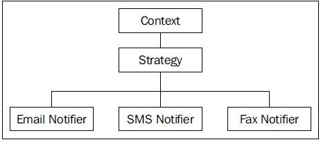
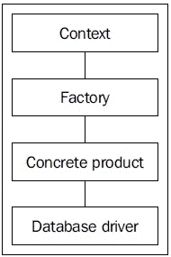
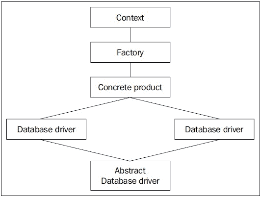
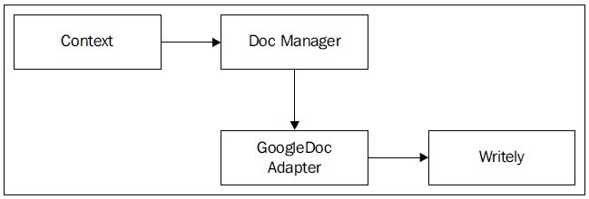
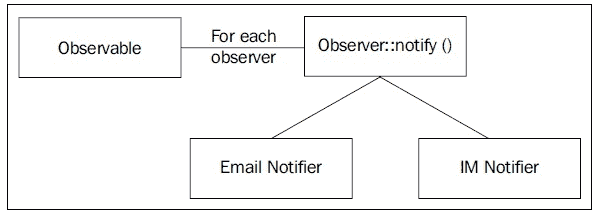
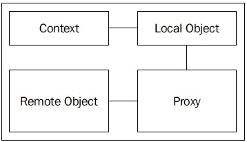
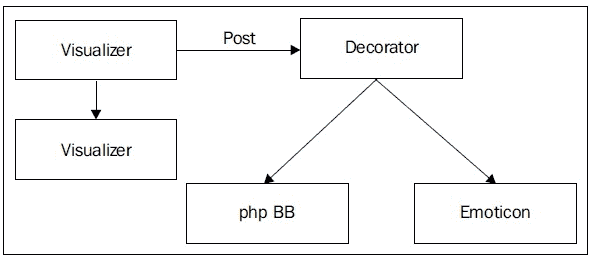
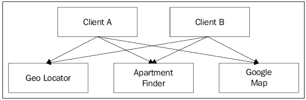
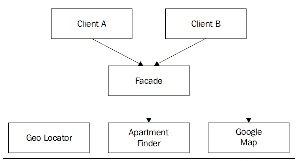

# 第四章：设计模式

面向对象编程最初是为了简化开发过程以及通过减少代码量来缩短开发时间而引入的。如果规划得当，设计合理，面向对象编程（OOP）可以极大地提高程序的性能。其中之一是“设计模式”，这是由埃里克·伽玛和他的三位朋友在 1972 年出版的《设计模式》一书中提出的。由于有四位作者，这本书被介绍为“四人帮”的作品，或者简单地称为“Goff”。在这本传奇性的书中，“四人帮”介绍了几种模式，以最大限度地减少代码量并引入有效的编码实践。在本章中，我们将学习一些这些模式，以便在 PHP 中实现。

# 你可能以前做过这件事…

在编码过程中，我们中的许多人使用这些模式，却不知道这些技术实际上被称为模式。即使在早期的编码生涯中，我也使用了一些编码技术，后来发现它们与某些模式相似。所以，不要害怕使用模式。它们是日常编码技巧，你可能一直都在使用，但你可能不知道。

在软件开发过程中，一些问题会定期出现。几乎每个软件开发都会遇到这些问题。这些问题被称为“设计模式”，并给出了一些常见的解决方案。因此，了解设计模式可以为软件开发者节省大量时间。让我们更深入地了解设计模式。

# 策略模式

我们在编程过程中遇到的一个常见问题是，我们必须在不同的策略上做出决策。策略模式是一种常见的模式，它帮助我们更容易地在不同情况下做出决策。为了更好地理解这一点，让我们使用一个场景，即你正在开发一个通知程序。这个通知程序将检查用户的给定选项。用户可能希望以多种方式被通知，如电子邮件、短信或传真。你的程序必须检查可用的联系方式，然后据此做出决策。这种情况可以通过策略模式轻松解决：



在上述模式中，我们使用了三个类，分别是`SMSNotifier`、`EmailNotifier`和`FaxNotifier`。所有这些类都实现了`Notifier`接口，该接口有一个名为`notify`的方法。每个类都独立实现了该方法。

让我们先创建接口。

```php
<?
//interface.Notifier.php
interface notifier
{
  public function notify();
}
?>
```

现在我们将创建不同类型的通知器。

```php
class.emailnotifier.php
<?
include_once("interface.notifier.php");
class EmailNotifier implements notifier 
{
  public function notify()
  {
    //do something to notify the user by Email
  }
}
?>
```

```php
class.faxnotifier.php
<?
include_once("notifier.php");
class FaxNotifier implements notifier 
{
  public function notify()
  {
    //do something to notify the user by Fax
  }
}
?>
```

```php
class.smsnotifier.php
<?
include_once("notifier.php");
class SMSNotifier implements notifier 
{
  public function notify()
  {
    //do something to notify the user by SMS
  }
}
?>
```

现在我们将使用以下代码：

```php
<?
include_once("EmailNotifier.php");
include_once("FaxNotifier.php");
include_once("SMSNotifier.php");

/**
 * Let's create a mock object User which we assume has a method named
 * getNotifier(). This method returns either "sms" or "fax" or "email"
 */

$user = new User();
$notifier = $user->getNotifier();
switch ($notifier)
{
  case "email":
    $objNotifier = new EmailNotifier();
    break;
  case "sms":
    $objNotifier = new SMSNotifier();
    break;
  case "fax":
    $objNotifier = new FaxNotifier();
  break;
}

$objNotifier->notify();
?>
```

我确信你会同意这很简单。我也确信你已经在你的现有代码中不止一次使用过这样的解决方案。

# 工厂模式

另一个常见的设计模式是工厂模式。这种模式的主要目标是通过隐藏其背后的所有复杂性来提供对象。这可能听起来有些神秘，所以让我们用一个现实生活中的场景来看看它。

你正在进行一个针对非常复杂系统的项目。在这个例子中，你正在创建一个在线文档存储库，它将文档保存在临时存储中。为此，你需要支持 PostgreSQL、MySQL、Oracle 和 SQLite，因为用户可能会使用这些中的任何一种来部署你的应用程序。所以你创建了一个对象，该对象连接到 MySQL 并执行必要的任务。你的 MySQL 对象是：

```php
<?
class MySQLManager
{
  public function setHost($host)
  {
    //set db host
  }

  public function setDB($db)
  {
    //set db name
  }
  public function setUserName($user)
  {
    //set user name
  }
  public function setPassword($pwd)
  {
    //set password
  }

  public function connect()
  {
    //now connect
  }
}
s
?>
```

好吧，现在你可以这样使用这个类：

```php
<?
$MM = new MySQLManager();
$MM->setHost("host");
$MM->setDB("db");
$MM->setUserName("user");
$MM->setPassword("pwd");
$MM->connect();
?>
```

现在你可以看到，在你开始使用你的类之前，你需要做很多事情。你的 PostgreSQL 类看起来也很相似：

```php
<?
class PostgreSQLManager
{
  public function setHost($host)
  {
    //set db host
  }

  public function setDB($db)
  {
    //set db name
  }
  public function setUserName($user)
  {
    //set user name
  }
  public function setPassword($pwd)
  {
    //set password
  }

  public function connect()
  {
    //now connect
  }
}

?>
```

使用方式也是一样的：

```php
<?
$PM = new PostgreSQLManager();
$PM->setHost("host");
$PM->setDB("db");
$PM->setUserName("user");
$PM->setPassword("pwd");
$PM->connect();
?>
```

但现在当它们合并在一起时，使用可能会有些困难：

```php
<?
  If ($dbtype=="mysql")
  //use mysql class
  Else if ($dbtype=="postgresql")
  //use postgresql class
?>
```

简短地说，当你添加更多的数据库引擎时，核心代码会显著变化，你必须将这些所有东西硬编码到核心类中。然而，编程的一个非常好的实践是松耦合。在这里，你创建一个名为 `DBManager` 的单独类，它将从中央位置执行所有这些操作。让我们来定义它：

```php
<?
class DBManager
{
  public static function setDriver($driver)
  {
    $this->driver = $driver;
  //set the driver
  }

  public static function connect()
  {
    if ($this->driver=="mysql")
    {
      $MM = new MySQLManager();
      $MM->setHost("host");
      $MM->setDB("db");
      $MM->setUserName("user");
      $MM->setPassword("pwd");
      $this->connection = $MM->connect();
    }
    else if($this->driver=="pgsql")
    {
      $PM = new PostgreSQLManager();
      $PM->setHost("host");
      $PM->setDB("db");
      $PM->setUserName("user");
      $PM->setPassword("pwd");
      $this->connection= $PM->connect();
    }
  }
}
?>
```



现在，你可以从单个位置 `DBManager` 使用它。这使得事情比以前容易得多。

```php
<?
$DM = new DBManager();
$DM->setDriver("mysql");
$DM->connect("host","user","db","pwd");
?>
```

这是工厂设计模式在现实生活中的真实例子。`DBManager` 现在作为一个工厂工作，它封装了幕后所有的复杂性，并提供了两种产品。工厂通过封装其内部的困难来简化编程。

# 抽象工厂

抽象工厂几乎与工厂相似，唯一的区别是所有具体的对象都必须扩展一个共同的抽象类。你可能会问这样做的好处是什么。好吧，只要具体的对象是从一个已知的抽象对象派生出来的，编程就会简化，因为它们都遵循相同的标准。

让我们看看之前的例子。我们首先创建一个抽象类，然后扩展该对象以开发所有具体的驱动类。

```php
<?
abstract class DBDriver
{
  public function connect();
  public function executeQuery();
  public function insert_id();
  public function setHost($host)
  {
    //set db host
  }

  public function setDB($db)
  {
    //set db name
  }
  public function setUserName($user)
  {
    //set user name
  }
  public function setPassword($pwd)
  {
    //set password
  }
  //.....
}
?>
```

现在，我们的 MySQL 将从它派生出来：

```php
<?
class MySQLManager extends DBDriver 
{
  public function connect()
  {
    //implement own connection procedures
  }

  public function executeQuery()
  {
    //execute mysql query and return result
  }

  public function insertId()
  {
    //find the latest inserted id
  }
}
?>
```



之后，我们将像往常一样在 `DBManager` 中使用这个 `MySQLManager` 类。一个主要的好处是我们可以在一个地方定义所有必要的函数，这些函数在所有派生类中都有相同的标准。我们还可以在抽象类中封装常见的函数/过程。

# 适配器模式

面向对象编程中另一个有趣的问题是通过一个名为适配器的设计模式来解决的。那么适配器模式是什么，它解决了哪些类型的问题？

适配器实际上是一个在现实生活中充当适配器的对象，它将一种东西转换成另一种东西。使用适配器，你可以将电源从高电压转换为低电压。同样，在面向对象编程中，使用适配器模式，一个对象可以适应另一个对象的相同方法。

让我们更详细地讨论现实生活中的编码模式。假设你开发了一个在线文档存储库，它可以将文档导出至流行的在线文件存储服务。你已经开发了一个包装器，它可以使用 Writely 的本地 API 存储和检索文档。然而，在谷歌收购 Writely 不久后，你发现他们暂时关闭了服务，你必须使用谷歌文档作为该存储库的基础。现在你该怎么办？你找到了一些开源解决方案与谷歌文档一起使用，但不幸的是，你发现那个谷歌文档对象的操作方法与 Writely 对象不同。

这是一个非常常见的场景，它发生在不同开发者开发类的时候。你想要使用这个谷歌文档对象，但你不想更改你的核心代码，因为那样你将不得不大量更改它。而且，在这些核心更改之后，代码可能会出错。

在这种情况下，适配器模式可以拯救你的生命。你开发了一个通用接口，Writely 对象实现了这个接口。现在你只需要开发另一个包装类，它实现了谷歌文档实现的相同接口。那么我们的包装类会做什么呢？它将谷歌文档类的所有方法包装到接口中可用的方法里。在成功包装完所有内容后，你可以在代码中直接使用这个对象。你可能需要更改一两行，但核心代码的其他部分保持不变。

这就是使用适配器模式的好处。即使第三方依赖和外部 API 的代码发生变化，你也能保持核心代码不变。让我们更仔细地看看它：



这是我们的第一个 Writely 对象版本：

```php
<?
class Writely implements DocManager()
{
  public function authenticate($user, $pwd)
  {
    //authenticate using Writely authentication scheme
  }

  public function getDocuments($folderid)
  {
    //get documents available in a folder
  }

  public function getDocumentsByType($folderid, $type)
  {
    //get documents of specific type from a folder
  }
  public function getFolders($folderid=null)
  {
    //get all folders under a specific folder
  }

  public function saveDocuments($document)
  {
    //save the document
  }
}
?> 
```

这里是 `DocManager` 接口：

```php
<?
interface DocManager
{
  public function authenticate($user, $pwd);
  public function getDocuments($folderid);
  public function getDocumentsByType($folderid, $type);
  public function getFolders($folderid=null);
  public function saveDocument($document);
}
?>
```

现在的 `GoogleDoc` 对象看起来像下面这样：

```php
<?
class GoogleDocs
{
  public function authenticateByClientLogin()
  {
    //authenticate using Writely authentication scheme
  }

  public function setUser()
  {
    //set user
  }

  public function setPassword()
  {
    //set password
  }

  public function getAllDocuments()
  {
    //get documents available in a folder
  }
  public function getRecentDocuments()
  {

  }

  public function getDocument()
  {

  }
}
?>
```

那么它是如何与我们的现有代码兼容的呢？

为了使其与我们的现有代码兼容，我们需要开发一个包装对象，它实现了相同的 `DocManager` 接口，但使用 `GoogleDoc` 对象执行实际工作。

```php
<?php
Class GoogleDocsAdapter implements DocManager 
{
  private $GD;

  public function __construct()
  {
    $this->GD = new GoogleDocs();
  }

  public function authenticate($user, $pwd)
  {
    $this->GD->setUser($user);
    $this->GD->setPwd($pwd);
    $this->GD->authenticateByClientLogin();
  }

  public function getDocuments($folderid)
  {
    return $this->GD->getAllDocuments();
  }

  public function getDocumentsByType($folderid, $type)
  {
     //get documents using GoogleDocs object and return only
     // which match the type
  }

  public function getFolders($folderid=null)
  {
    //for example there is no folder in GoogleDocs, so 
    //return anything. 
  }

  public function saveDocument($document)
  {
    //save the document using GoogleDocs object
  }
}
?>
```

现在，我们将实例化一个 `GoogleDocsAdapter` 的实例，然后在我们的核心代码中使用这个实例。因为它实现了相同的接口，所以不需要更改核心代码。

然而，还有一点需要注意：缺失的功能怎么办？例如，你的 `WritelyDocs` 对象支持 `getFolders()` 方法，但在 `GoogleDocs` 中这个方法没有用。你必须更仔细地实现这些方法。例如，如果你的核心代码需要这个方法返回的一些文件夹 ID，在 `GoogleDocsAdapter` 中你可以生成一个随机的文件夹 ID 并返回它们（这在 `GoogleDocsAdapter` 中没有用）。所以你的核心代码根本不会出错。

# 单例模式

最常用的设计模式之一是单例。这个模式解决了面向对象编程中的一个非常重要的问题，并在实际编程中拯救了数百万程序员的性命。

单例模式的主要目的是无论你实例化多少次，都提供对象的单个实例。也就是说，如果一个对象被实例化一次，使用单例模式，你可以在代码中再次需要时只提供那个实例。这样可以节省内存消耗，防止创建多个对象实例。因此，单例模式用于提高应用程序的性能。


让我们以之前示例中创建的`MySQLManager`类为例。现在我们正在使用单例模式添加一个单例实例功能。

```php
<?
class MySQLManager
{
  private static $instance;

  public function __construct()
  {
    if (!self::$instance)
    {
      self::$instance = $this;
      echo "New Instance\n";
      return self::$instance;
    }
    else 
    {
      echo "Old Instance\n";
      return self::$instance;
    }
  }
//keep other methods same
}
?>
```

现在，让我们看看它实际上是如何工作的。如果你执行以下脚本，你会对看到的结果感到惊讶。

```php
<?
$a = new MYSQLManager();
$b = new MYSQLManager();
$c = new MYSQLManager();
$d = new MYSQLManager();
$e = new MYSQLManager();
?>
```

输出结果为：

```php
New Instance
Old Instance
Old Instance
Old Instance
Old Instance
```

奇怪，不是吗？`MySQLManager`类在第一次调用时只创建了一个实例，之后它就使用相同的旧对象，而不是每次都创建一个新对象。让我们看看我们是如何实现这一点的。

```php
private static $instance;
```

我们类中有一个名为`$instance`的静态变量。在构造函数中，我们检查这个静态变量实际上是否包含任何内容。如果它是空的，我们就实例化对象本身，并将实例设置在这个静态变量中。由于它是静态的，它将在整个脚本执行过程中保持可用。

让我们回到构造函数。在第二次调用时，我们只是检查`$instance`变量是否包含任何内容。我们发现`$instance`变量实际上包含了这个对象的实例，并且它仍然被保留，因为它是一个静态变量。所以，在第二次调用中，我们实际上返回了由前一次调用创建的这个对象的实例。

单例是一个非常重要的模式，你应该正确理解它实际上做什么。你可以通过正确使用这个模式来优化你的应用程序并提高其性能。

# 迭代器模式

迭代器是一种常见的模式，它可以帮助你更轻松地操作集合。几乎每种语言都有内置的迭代器支持。甚至 PHP5 也有内置的迭代器对象。迭代器非常有用，可以提供一个简单的接口来按顺序操作集合。

让我们考虑这样一个场景，当迭代器模式可以在复杂应用程序中拯救开发者时。让我们想象你正在创建一个博客，用户在这里写下他们的日常网络日志。你该如何逐个显示不同的帖子呢？

在下面的示例中，你将所有由作者创建的`post_id`传递到你的模板中，并且模板设计者编写了以下代码来在模板中正确显示：

```php
<?
$posts = getAllPosts(); //example function return all post ids of this author
for($i = 0; $i<count($posts); $i++) 
{
  $title = getPostTitle($post[$i]);
  echo $title;
  $author = getPostAuthor($post[$i]);
  $content = parseBBCode(getPostContent($post[$i]));
  echo "Content";
  $comments = getAllComments($post[$i]);
  for ($j=0; $j<count($comments); $j++)
  {
    $commentAuthor = getCommentAuthor($comments[$j]);
    echo $commentAuthor;
    $comment = getCommentContent($comments[$j]);
    echo $comment;
  }
}
?>
```

在这个例子中，我们在模板中做所有的事情；我们获取所有帖子 ID，然后获取作者、评论、内容并显示。我们还在模板代码中获取评论列表。整个代码太模糊，难以阅读和管理，可能在任何核心更改时连续崩溃。但想想，如果我们把评论转换成针对该帖子的评论对象集合，把所有帖子转换成帖子对象集合以便更容易访问，这将减轻模板设计的负担，同时创建可管理的代码。

让我们为我们的评论和帖子实现迭代器模式，看看它如何有效地将你的代码变成一首可读的诗。毕竟，编码就是诗歌。

在 PHP5 中，为了有效地使用迭代，我们可以使用`Iterator`接口。该接口如下所示：

```php
<?
interface Iterator 
{
  function rewind();

  function current();

  function key();

  function next();

  function valid();
}
?>
```

`rewind()`函数将迭代器的索引设置到集合的开始。`Current()`返回当前对象。`key()`函数返回当前键。`next()`函数返回在当前循环计数器前是否有更多对象。如果返回是肯定的，此函数返回 true，否则返回 false。`valid()`函数返回当前对象，如果它有任何值。让我们为我们的帖子对象创建一个迭代器。

我们将创建一个名为`getAllPosts()`的函数，该函数将从数据库返回所有帖子。所有这些帖子都以`Post`对象的形式返回，该对象具有`getAuthor()`、`getTitle()`、`getDate()`、`getComments()`等方法。现在我们将创建一个`Iterator`：

```php
<?php
class Posts implements Iterator
{
  private $posts = array();

  public function __construct($posts)
  {
    if (is_array($posts)) {
      $this->posts = $posts;
    }
  }

  public function rewind() {
    reset($this->posts);
  }

  public function current() {
    return current($this->posts);
  }

  public function key() {
    return key($this->var);
  }

  public function next() {
    return next($this->var);
  }

  public function valid() {
    return ($this->current() !== false);
  }
}
?>
```

现在让我们使用我们刚刚创建的`Iterator`。

```php
<?
$blogposts = getAllPosts();
$posts = new Posts($posts);
foreach ($posts as $post)
{
  echo $post->getTitle();
  echo $post->getAuthor();
  echo $post->getDate();
  echo $post->getContent();
  $comments = new Comments($post->getComments()); 
  //another Iterator for comments, code is same as Posts
  foreach ($comments as $comment)
  {
    echo $comment->getAuthor();
    echo $comment->getContent();
  }
}
?>
```

代码现在变得更容易阅读和维护。

### 注意

在 PHP 数组中，对象默认实现这个`Iterator`接口。但当然，你可以实现它来添加更多用户自定义的功能，以简化你的开发周期。

# 观察者模式

你可能会想知道这些事件实际上是如何工作的以及它们是如何被触发的。好吧，如果你熟悉观察者模式，你可以比以往任何时候都更容易地创建事件驱动应用程序。

观察者模式解决了面向对象中的常见问题。例如，如果你想当某些对象在发生某些事情（一个事件被触发）时自动通知，你可以用这个模式解决这个问题。让我们更仔细地看看。

观察者模式由两种类型的对象组成；一种是可观察对象，它被`observer`对象观察。当可观察对象的状态发生变化时，它会通知所有与之注册的观察者。

那么它可以用在哪里呢？实际上，它无处不在。想想一个日志应用，当发生错误时，可以以不同的方式记录错误。想想一个消息应用，当收到最新消息时，会弹出。想想一个网络公告板，每当有新消息发布时，最新消息会自动显示。好吧，还有成千上万的其他应用。让我们实现这个模式。



我们所有的`observer`对象都实现了如下所示的`observer`接口：

```php
<?
interface observer
{
  public function notify();
}
?>
```

现在一些`observer`对象，当可观察对象的状态发生变化时，我们将通知它们：

```php
<?
class YMNotifier implements observer 
{
  public function notify()
  {
    //send alerts using YM
    echo "Notifying via YM\n";
  }
};
?>
```

另一个通知器：

```php
<?
class EmailNotifier implements observer 
{
  public function notify()
  {
    //send alerts using Email
    echo "Notifying via Email\n";
   }
};
?>
```

现在我们需要创建我们的`observer`。

```php
<?
class observable
{
  private $observers = array();

  public function register($object)
  {
    if ($object instanceof observer )
    $this->observers[] =$object; 
    else 
    echo "The object must implement observer interface\n";
  }
  public function stateChange()
  {
    foreach ($this->observers as $observer)
    {
      $observer->notify();
    }
  }
}
?>
```

现在让我们使用它：

```php
<?
$postmonitor = new observable();
$ym = new YMNotifier();
$em = new EmailNotifier();
$s= new stdClass();
$postmonitor->register($ym);
$postmonitor->register($em);
$postmonitor->register($s);
$postmonitor->stateChange();
?>
```

输出如下：

```php
The object must implement observer interface
Notifying via YM
Notifying via Email 
```

# 代理模式或懒加载

在面向对象编程中，另一个非常重要的编程实践是懒加载和松耦合。主要思想是在编码时减少对象之间的具体依赖。这种编程有什么好处？一个简单的答案——它总是增加了你代码的可移植性。

使用代理模式，你可以创建远程对象的本地版本。它提供了一个通用的 API 来访问远程对象的方法，而不需要了解幕后的事情。代理模式的一个最佳例子是 PHP 的 XML RPC 客户端和服务器。

让我们看看以下代码。这里我们创建了一个类，它可以访问远程创建的任何方法。远程对象的方法通过 XML RPC 服务器公开，然后通过 XML RPC 客户端访问。



如果你想知道它是如何工作的，你会发现几乎每个博客引擎都支持三种流行的博客 API，即 Blogger、MetaWebLog 和 MovableType。使用这些方法，你可以远程管理你的博客。支持哪些方法，将取决于博客引擎。

我们将使用 Incutio PHP XML-RPC 库来创建一个示例服务器和客户端对象。让我们先创建一个服务器。你可以从这里下载 XML-RPC 库：[`scripts.incutio.com/xmlrpc/IXR_Library.inc.php.txt`](http://scripts.incutio.com/xmlrpc/IXR_Library.inc.php.txt)

我们正在创建一个时间服务器，我们可以从中获取格林威治标准时间（GMT）：

```php
<?php

include('IXR_Library.inc.php');

function gmtTime() {
    return gmdate("F, d Y H:i:s");
}

$server = new IXR_Server(array(
    'time.getGMTTime' => 'gmtTime',
));

?>
```

好吧，非常简单。我们只是创建了一些方法，然后将它们映射到 XML RPC 服务器。现在让我们看看我们如何为客户编写代码：

```php
<?
include('IXR_Library.inc.php');
$client = new IXR_Client('http://localhost/proxy/server.php');

if (!$client->query('time.getGMTTime')) 
{
    die('Something went wrong - '.$client->getErrorCode().' : 
                                 '.$client->getErrorMessage());
}

echo ($client->getResponse());
?>
```

如果你将服务器放在你的网络服务器（这里`localhost`）文档中，根目录在一个名为`proxy`的文件夹中，然后访问客户端，你将得到以下输出：

**2007 年 3 月 28 日 16:13:20**

就这样！这就是代理模式的工作原理，并为本地应用程序提供远程对象的接口。

# 装饰器模式

装饰器模式是 GoF 在他们传奇的设计模式书中引入的一个重要的问题解决方法。使用这个模式，你可以在不扩展对象的情况下向现有对象添加额外的功能。所以你可能会问，在不使用继承的情况下添加额外的功能有什么好处？

好吧，当然有一些好处。要扩展一个对象，有时你需要知道那个类的许多内部事情。有时在不重写现有功能的情况下无法扩展该类。如果你想要将相同的功能添加到许多类型的对象中，使用装饰器模式而不是逐个扩展它们会更好。否则，可能会让你陷入可怕的维护噩梦。



让我们考虑一个常见的场景。例如，想象你正在构建一个博客或论坛，其中所有帖子评论都作为单独的帖子评论对象出现。这两个对象都有一个公共方法 `getContents()`，它返回该帖子或评论的过滤内容。

现在经理要求添加解析这些帖子评论中的表情符号和 BBCode 的功能。核心代码很复杂，你不想再触碰它了。这就是装饰器模式拯救你的生命的时候。

让我们先看看我们的 `Post` 和 `Comment` 对象。

```php
<?
class Post
{
  private $title;
  private $content;
  //additional properties

  public function filter()
  {
    //do necessary processing
    $this->content = $filtered_content;
    $this->title = $filtered_title;
  }

  public function getContent()
  {
    return $this->content;
  }

  //additional methods
}
?>
<?
class Comment
{
  private $date;
  private $content;
  //additional properties

  public function filter()
  {
    //do necessary processing
    $this->content = $filtered_content;
  }

  public function getContent()
  {
    return $this->content;
  }

  //additional methods
}
?>
```

现在我们创建了两个装饰器对象，分别可以解析 BBCode 和 Emoticon：

```php
<?
class BBCodeParser
{
  private $post;
  public function __construct($object)
  {
    $this->post = $object;
  }

  public function getContent()
  {
    //parse bbcode
  $post->filter();
    $content = $this->parseBBCode($post->getContent());
    return $content;
  }

  private function parseBBCode($content)
  {
    //process BB code in the content and return it
  }
}
?> 
```

接下来是表情符号解析器：

```php
<?
class EmoticonParser
{
  private $post;
  public function __construct($object)
  {
    $this->post = $object;
  }

  public function getContent()
  {
    //parse bbcode
    $post->filter();
    $content = $this->parseEmoticon($post->getContent());
    return $content;
  }

  private function parseEmoticon($content)
  {
    //process Emoticon code in the content and return it
  }

}
?>
```

这些装饰器对象只是为现有对象添加了 BBCode 和 EmoticonCode 解析能力，而没有触及它们。

让我们看看我们如何使用它：

```php
<?
$post = new Post();//set the properties of the post object
$comment = new Comment();//set the properties of the comment object

$post->filter();
$comment->filter();

if ($BBCodeEnabled==false && $EmoticonEnabled==false)
{
  $PostContent = $post->getContent();
  $CommentContent = $comment->getContent();
}
elseif ($BBCodeEnabled==true && $EmoticonEnabled==false)
{
  $bb = new BBCodeParser($post);//passing a post object to 
                                //BBCodeParser
  $PostContent = $bb->getContent();

  $bb = new BBCodeParser($comment);//passing a comment object to 
                                   //BBCodeParser

  $CommentContent = $bb->getContent();
}

elseif ($BBCodeEnabled==true && $EmoticonEnabled==false)
{
  $em = new EmoticonParser($post);
  $PostContent = $bb->getContent();
  $em = new EmoticonParser($comment);
  $CommentContent = $bb->getContent();
}
?>
```

这就是你可以在不触及现有对象的情况下添加额外功能的方法。然而，你看到 BBCodeParser 和 EmoticonParser 接受任何对象，这意味着如果你提供一个没有任何名为 `getContent()` 方法的对象，代码将会崩溃。因此，你可以在那些可能想要装饰的对象中实现一个公共接口。同样，在装饰器对象中，你只能接受实现了该接口或那些接口的对象。

# 活动记录模式

这是另一个非常重要的设计模式，用于简化数据库操作。我们将在第七章中了解更多关于这个模式的内容。

# 门面模式

到目前为止，我们已经学习了使用面向对象设计模式解决许多常见问题的方法。现在，我们将了解另一个有趣的模式，我们经常在代码中无意中使用它，而不知道它也是一个模式。让我们了解这个名为门面模式的常见模式。

门面（Facade）为许多对象提供了一个公共接口。换句话说，它只是简化了编程，提供了一个必要的接口，实际上在幕后使用了大量其他对象。因此，它最小化了开发者的学习曲线。当一位新开发者加入团队时，他突然会接触到许多带有大量方法和属性的对象，其中他可能只需要几个来完成他的工作。那么为什么还要浪费时间学习它们呢？这就是门面帮助开发者并节省他们大量时间的地方。让我们看看一些例子，以便更清楚地理解它。

假设你正在创建一个公寓租赁系统，在你的存储库中有三个对象。一个对象使用在线地理编码服务进行地理编码。另一个对象使用地图服务定位该地点。最后，另一个服务在该地区搜索所有出售的公寓。

现在你想要创建一个更简单的接口，以便任何未来的开发者都可以使用你的库，而不是一起学习它们。以下图片显示了在门面出现之前的代码结构：



使用外观模式（Facade）后的代码结构如下：



现在我们来看一下代码：

```php
<?
class ApartmentFinder
{

  public function locateApartments($place)
  {
    //use the web service and locate all apartments suitable 
    //search name
    //now return them all in an array
    return $apartmentsArray();
  }
}
?>

<?
class GeoLocator
{
  public function getLocations($place)
  {
    //use public geo coding service like yahoo and get the 
    //lattitude and
    //longitude of that place

    return array("lat"=>$lattitude, "lng"=>$longitude);
  }
}
?>

<?
class GoogleMap
{
  public function initialize()
  {
    //do initialize

  }

  public function drawLocations($locations /* array */)
  {
    //locate all the points using Google Map Locator
  }

  public function dispatch($divid)
  {
    //draw the map with in a div with the div id
  }
}
?>
```

这些是我们的具体类。现在你想要使用它们全部来开发一个外观模式（Facade），并为开发者提供一个更简单的接口。看看它是如何使三个类的组合变得如此简单：

```php
<?
class Facade
{

  public function findApartments($place, $divid)
  {
    $AF = new ApartmentFinder();
    $GL =new GeoLocator();
    $GM = new GoogleMap();

    $apartments = $AF->locateApartments($place);
    foreach ($apartments as $apartment)
    {
      $locations[] = $GL->getLocations($apartment);
    }

    $GM->initialize();
    $GM->drawLocations($locations);
    $GM->dispatch($divid);
  }

}
?>
```

现在任何人都可以通过使用单个接口外观模式（Facade）来使用所有三个类的服务：

```php
<?
$F = new Facade();
$F->findApartments("London, Greater London","mapdiv");
?>
```

如我之前所说，在面向对象编程中，我们在项目中的某个时期已经多次做过这类工作，然而我们可能并不知道这种技术被定义为名为外观模式（Facade）的设计模式。

# 摘要

设计模式是面向对象编程（OOP）的一个基本组成部分。它使你的代码更有效，性能更好，并且更容易维护。有时我们在代码中实现这些设计模式，却不知道这些解决方案被定义为设计模式。设计模式有很多种，这本书中无法全部涵盖，因为那样的话它就仅仅是一本关于设计模式的书籍了。然而，如果你对学习其他设计模式感兴趣，可以阅读由 O'Reilly 出版的《*Head First Design Patterns*》和由 Addison-Wesley 出版的《*Design Patterns Explained*》。

不要认为你必须在代码中实现设计模式。只有在需要时才使用它们。正确使用正确的模式可以使你的代码性能更佳；同样，不正确地使用它们可能会使你的代码变慢且效率降低。

在下一章中，我们将学习 PHP 中面向对象编程（OOP）的另一个重要部分。那就是单元测试和反射。在此之前，继续玩转这些模式并探索它们。
