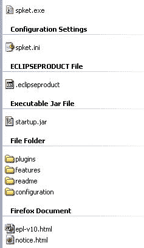

# 第六章. 标准 PHP 库

PHP5 通过引入许多内置对象，使开发者的生活比以前容易得多。**标准 PHP 库**（**SPL**）是一组 PHP 5 中引入的对象，用于 PHP 开发者。它们附带了许多接口和对象，以简化您的编码。在本章中，我们将介绍其中的一些，并展示它们的用法。

# SPL 中的可用对象

您可以通过执行以下代码来找出 SPL 中可用的对象。

```php
<?php
// a simple foreach() to traverse the SPL class names
foreach(spl_classes() as $key=>$value)
  {
    echo $value."\n";
  }
?>
```

结果将显示您当前 PHP 安装中所有可用的类：

```php
AppendIterator
ArrayIterator
ArrayObject
BadFunctionCallException
BadMethodCallException
CachingIterator
Countable
DirectoryIterator
DomainException
EmptyIterator
FilterIterator
InfiniteIterator
InvalidArgumentException
IteratorIterator
LengthException
LimitIterator
LogicException
NoRewindIterator
OuterIterator
OutOfBoundsException
OutOfRangeException
OverflowException
ParentIterator
RangeException
RecursiveArrayIterator
RecursiveCachingIterator
RecursiveDirectoryIterator
RecursiveFilterIterator
RecursiveIterator
RecursiveIteratorIterator
RuntimeException
SeekableIterator
SimpleXMLIterator
SplFileObject
SplObjectStorage
SplObserver
SplSubject
UnderflowException
UnexpectedValueException
```

# ArrayObject

这是一个 SPL 中引入的非常棒的对象，用于简化数组操作并丰富常规 PHP 数组的功能。您可以将 `ArrayObject` 作为简单的数组使用，但内部可以逐步增强它并添加新的功能。在本节中，我们将看到这个对象支持的属性和方法。此外，我们还将设计一个增强的 `ArrayObject` 以便于数组访问。

这里列出了这个类的公共成员：

+   `__construct` `($array,` `$flags=0,` `$iterator_class="ArrayIterator")`

+   `append` `($value)`

+   `asort` `()`

+   `count` `()`

+   `exchangeArray` `($array)`

+   `getArrayCopy` `()`

+   `getFlags` `()`

+   `getIterator` `()`

+   `getIteratorClass` `()`

+   `ksort` `()`

+   `natcasesort` `()`

+   `natsort` `()`

+   `offsetExists` `($index)`

+   `offsetGet` `($index)`

+   `offsetSet` `($index,` `$newval)`

+   `offsetUnset` `($index)`

+   `setFlags` `($flags)`

+   `setIteratorClass` `($itertor_class)`

+   `uasort` `(mixed` `cmp_function)`

+   `uksort` `(mixed` `cmp_function)`

许多这些函数也适用于数组操作。以下是一些函数的简要介绍，它们与数组函数不同：

| 函数 | 功能 |
| --- | --- |
| `exchangeArray($array)` | 此函数用新的数组替换 `ArrayObject` 的内部数组，并返回旧的数组。 |
| `getArrayCopy()` | 此函数返回 `ArrayObject` 内部数组的副本。 |
| `getIteratorClass()` | 此函数返回 `Iterator` 类的名称。如果您没有为该对象显式设置任何其他 `Iterator` 类，您将始终得到 `ArrayIterator` 作为结果。 |
| `setIteratorClass()` | 使用此函数，您可以设置任何 `Iterator` 类作为数组对象的迭代器。然而，有一个限制；这个 `Iterator` 类必须扩展 `arrayIterator` 类。 |
| `setFlags()` | 此函数将一些位运算标志设置到 `ArrayObject` 中。标志是 `0` 或 `1`。`0` 表示当作为列表访问（`var_dump`、`foreach` 等）时，对象的属性具有其正常功能，而 `1` 表示可以以属性的形式读写数组索引。 |

在下面有趣的例子中，我们扩展了`ArrayObject`，创建了一个更灵活的`ExtendedArrayObject`以实现类似原型的功能。扩展数组提供了通过集合进行遍历的简便性。让我们看看：

```php
<?
class ExtendedArrayObject extends ArrayObject {

  private $_array;
  public function __construct()
  {
    if (is_array(func_get_arg(0)))
    $this->_array = func_get_arg(0);
    else
    $this->_array = func_get_args();
    parent::__construct($this->_array);
  }

  public function each($callback)
  {
    $iterator = $this->getIterator();

    while($iterator->valid()) 
    {
      $callback($iterator->current());
      $iterator->next();
    }

  }

  public function without()
  {
    $args = func_get_args();
    return array_values(array_diff($this->_array,$args));
  }

  public function first()
  {
    return $this->_array[0];
  }

  public function indexOf($value)
  {
    return array_search($value,$this->_array);
  }

  public function inspect()
  {
    echo "<pre>".print_r($this->_array, true)."</pre>";
  }

  public function last()
  {
    return $this->_array[count($this->_array)-1];
  }

  public function reverse($applyToSelf=false)
  {
    if (!$applyToSelf)
    return array_reverse($this->_array);
    else 
    {
      $_array = array_reverse($this->_array);
      $this->_array = $_array;
      parent::__construct($this->_array);
      return $this->_array;
    }
  }

  public function shift()
  {
    $_element = array_shift($this->_array);
    parent::__construct($this->_array);
    return $_element;
  }

  public function pop()
  {
    $_element = array_pop($this->_array);
    parent::__construct($this->_array);
    return $_element;
  }
}
?>
```

如果你想看看如何使用它，这里就是：

```php
<?
include_once("ExtendedArrayObject.class.php");

function speak($value)
{
  echo $value;

}

$newArray = new ExtendedArrayObject(array(1,2,3,4,5,6));

/* or you can use this */

$newArray = new ExtendedArrayObject(1,2,3,4,5,6);

$newArray->each(speak); //pass callback for loop
print_r($newArray->without(2,3,4)); //subtract
$newArray->inspect(); //display the array in a nice manner
echo $newArray->indexOf(5); //position by value
print_r($newArray->reverse()); //reverse the array
print_r($newArray->reverse(true)); /*for changing array itself*/

echo $newArray->shift();//shifts the first value of the array 
                       //and returns it
echo $newArray->pop();// pops out the last value of array
echo $newArray->last();
echo $newArray->first(); //the first element
?>
```

结果看起来像这样：

```php
123456
Array
(
    [0] => 1
    [1] => 5
    [2] => 6
)
Array
(
    [0] => 1
    [1] => 2
    [2] => 3
    [3] => 4
    [4] => 5
    [5] => 6
)
4
Array
(
    [0] => 6
    [1] => 5
    [2] => 4
    [3] => 3
    [4] => 2
    [5] => 1
)
Array
(
    [0] => 6
    [1] => 5
    [2] => 4
    [3] => 3
    [4] => 2
    [5] => 1
)
6125

```

# ArrayIterator

`ArrayIterator`用于遍历数组的元素。在 SPL 中，`ArrayObject`有一个内置的迭代器，你可以使用`getIterator`函数访问它。你可以使用这个对象遍历任何集合。让我们看看下面的例子：

```php
<?php
$fruits = array(  
    "apple" => "yummy",
    "orange" => "ah ya, nice",
    "grape" => "wow, I love it!",
    "plum" => "nah, not me"
);

$obj = new ArrayObject( $fruits );

$it = $obj->getIterator();

// How many items are we iterating over?
echo "Iterating over: " . $obj->count() . " values\n";

// Iterate over the values in the ArrayObject:
while( $it->valid() )
{
    echo $it->key() . "=" . $it->current() . "\n"; 
    $it->next();
}

?> 
```

这将输出以下内容：

```php
Iterating over: 4 values
apple=yummy
orange=ah ya, nice
grape=wow, I love it!
plum=nah, not me
```

然而，迭代器还实现了`IteratorAggregator`接口，因此你甚至可以在`foreach()`循环中使用它们。

```php
<?php

$fruits = array(  
    "apple" => "yummy",
    "orange" => "ah ya, nice",
    "grape" => "wow, I love it!",
    "plum" => "nah, not me"
);

$obj = new ArrayObject( $fruits );
$it = $obj->getIterator();

// How many items are we iterating over?
echo "Iterating over: " . $obj->count() . " values\n";

// Iterate over the values in the ArrayObject:
foreach ($it as $key=>$val)
echo $key.":".$val."\n";
?> 
```

你将得到与上一个相同的输出。

如果你想要在自己的集合中实现迭代器，我建议你查看第三章。如果你想了解如何实现`IteratorAggregator`，这里有一个例子供你参考：

```php
<?php
class MyArray implements IteratorAggregate
{

  private $arr;
  public function __construct()
  {
    $this->arr = array();   
  }

  public function add( $key, $value )
  {
    if( $this->check( $key, $value ) )
      {
        $this->arr[$key] = $value;
      }
    }

  private function check( $key, $value )
    {
      if( $key == $value )
        {
          return false;
        }
       return true;
    }

  public function getIterator()
  {
    return new ArrayIterator( $this->arr );
  }       
}
?>
```

请注意，如果在迭代过程中键和值相同，则不会返回该值。你可以这样使用它：

```php
<?php

$obj = new MyArray();
$obj->add( "redhat","www.redhat.com" );

$obj->add( "php", "php" );
$it = $obj->getIterator();
while( $it->valid() )
{
  echo $it->key() . "=" . $it->current() . "\n";
  $it->next();
}
?>
```

输出如下：

```php
redhat=www.redhat.com
```

# DirectoryIterator

PHP5 中引入的另一个非常有趣的类是`DirectoryIterator`。这个对象可以遍历目录中存在的项目（好吧，那些只是文件），你可以使用这个对象检索该文件的不同属性。

在 PHP 手册中，这个对象没有很好地记录。所以如果你想了解这个对象的结构以及支持的方法和属性，你可以使用`ReflectionClass`来查看。还记得我们在上一章中使用的`ReflectionClass`吗？让我们看看以下例子：

```php
<?php
ReflectionClass::export(DirectoryIterator);
?>
```

结果是：

```php
Class [ <internal:SPL> <iterateable> class DirectoryIterator 
                      implements Iterator, Traversable ] 
{

  - Constants [0] { }
  - Static properties [0] {  }
  - Static methods [0] {  }
  - Properties [0] {  }
  - Methods [27] 
{
    Method [ <internal> <ctor> public method __construct ] 
{

      - Parameters [1] 
{
        Parameter #0 [ <required> $path ]
      }
    }
    Method [ <internal> public method rewind ] {    }
    Method [ <internal> public method valid ] {    }
    Method [ <internal> public method key ] {    }
    Method [ <internal> public method current ] {    }
    Method [ <internal> public method next ] {    }
    Method [ <internal> public method getPath ] {    }
    Method [ <internal> public method getFilename ] {    }
    Method [ <internal> public method getPathname ] {    }
    Method [ <internal> public method getPerms ] {    }
    Method [ <internal> public method getInode ] {    }
    Method [ <internal> public method getSize ] {    }
    Method [ <internal> public method getOwner ] {    }
    Method [ <internal> public method getGroup ] {    }
    Method [ <internal> public method getATime ] {    }
    Method [ <internal> public method getMTime ] {    }
    Method [ <internal> public method getCTime ] {    }
    Method [ <internal> public method getType ] {    }
    Method [ <internal> public method isWritable ] {    }
    Method [ <internal> public method isReadable ] {    }
    Method [ <internal> public method isExecutable ] {    }
    Method [ <internal> public method isFile ] {    }
    Method [ <internal> public method isDir ] {    }
    Method [ <internal> public method isLink ] {    }
    Method [ <internal> public method isDot ] {    }
    Method [ <internal> public method openFile ] 
        {
      - Parameters [3] {
        Parameter #0 [ <optional> $open_mode ]
        Parameter #1 [ <optional> $use_include_path ]
        Parameter #2 [ <optional> $context ]
        }
      }
    Method [ <internal> public method __toString ] {    }
  }
}
```

这里有一些有用的方法。让我们充分利用它们。在下面的例子中，我们将创建一个目录爬虫，它会显示特定驱动器中的所有文件和目录。看看我的 C 盘上的一个名为`spket`的目录：



现在，如果你运行以下代码，你将得到其中文件和目录的列表：

```php
<?
$DI = new DirectoryIterator("c:/spket");
foreach ($DI as $file) {
  echo $file."\n";
}
?>
```

输出如下：

```php
.
..
plugins
features
readme
.eclipseproduct
epl-v10.html
notice.html
startup.jar
configuration
spket.exe
spket.ini
```

但是输出没有任何意义。你能检测出哪些是目录，哪些是文件吗？这非常困难，所以让我们使结果对我们有用。

```php
<?
$DI = new DirectoryIterator("c:/spket");
$directories = array();
$files = array();
foreach ($DI as $file) {
  $filename = $file->getFilename();
  if ($file->isDir()){
    if(strpos($filename,".")===false) 
    $directories[] = $filename;
  }
  else
  $files[] = $filename;
}
echo "Directories\n";
print_r($directories);
echo "\nFiles\n";
print_r($files);
?>
```

输出如下：

```php
Directories
Array
(
    [1] => plugins
    [2] => features
    [3] => readme
    [4] => configuration
)

Files
Array
(
    [0] => .eclipseproduct
    [1] => epl-v10.html
    [2] => notice.html
    [3] => startup.jar
    [4] => spket.exe
    [5] => spket.ini
)
```

你可能会问，如果有一个快捷链接，你怎么能检测它。简单，只需使用`$file->isLink()`函数来检测该文件是否是快捷方式。

让我们来看看`DirectoryIterator`对象的其他有用方法：

| 方法 | 功能 |
| --- | --- |
| `getPathname()` | 返回此文件的绝对路径名（包含文件名）。 |
| `getSize()` | 返回文件的字节数。 |
| `getOwner()` | 返回所有者 ID。 |
| `getATime()` | 返回以时间戳表示的最后访问时间。 |
| `getMTime()` | 返回以时间戳表示的修改时间。 |
| `getCTime()` | 返回以时间戳表示的创建时间。 |
| `getType()` | 返回 "file"、"dir" 或 "link"。 |

其他方法相当直观，所以我们在这里不讨论它们。然而，还有一件事需要记住，那就是在 win32 机器上，`getInode()`、`getOwner()` 和 `getGroup()` 将返回 `0`。

# RecursiveDirectoryIterator

那么，这个对象是什么？还记得我们之前的例子吗？我们只得到了目录和文件列表。然而，如果我们想在不实现递归的情况下获取该目录内所有目录的列表，该怎么办？那么 `RecursiveDirectoryIterator` 就在这里救你一命。

递归目录迭代器可以与 `RecursiveIeratorIterator` 结合使用，以实现递归。让我们看看以下示例，它遍历目录下的所有目录（无论嵌套多深）：

```php
<?php
// Create the new iterator:
$it = new RecursiveIteratorIterator(new RecursiveDirectoryIterator( 
                                                    'c:/spket' ));
foreach( $it as $key=>$file ) 
{
    echo $key."=>".$file."\n";
}

?>
```

输出如下所示：

```php
c:/spket/epl-v10.html=>epl-v10.html
c:/spket/notice.html=>notice.html
c:/spket/startup.jar=>startup.jar
c:/spket/configuration/config.ini=>config.ini
c:/spket/configuration/org.eclipse.osgi/.manager/
                                .fileTableLock=>.fileTableLock
c:/spket/configuration/org.eclipse.osgi/.manager/
                                .fileTable.4=>.fileTable.4
c:/spket/configuration/org.eclipse.osgi/.manager/
                                .fileTable.5=>.fileTable.5
c:/spket/configuration/org.eclipse.osgi/bundles/4/1/.cp/
                    swt-win32-3236.dll=>swt-win32-3236.dll
c:/spket/configuration/org.eclipse.osgi/bundles/4/1/.cp/
                    swt-gdip-win32-3236.dll=>swt-gdip-win32-3236.dll
c:/spket/configuration/org.eclipse.osgi/bundles/48/1/.cp/os/win32/
                    x86/localfile_1_0_0.dll=>localfile_1_0_0.dll
c:/spket/configuration/org.eclipse.osgi/bundles/69/1/.cp/os/win32/
                    x86/monitor.dll=>monitor.dll
c:/spket/spket.exe=>spket.exe
c:/spket/spket.ini=>spket.ini
………
```

我能听到你在问自己：“为什么这些无用的文件会打印在这里？”只需看看目录结构，看看它是如何以路径作为键检索整个文件名的。

# RecursiveIteratorIterator

要递归地遍历一个集合，你可以利用 SPL 中引入的这个对象。让我们看看以下示例，了解它在日常编程中如何有效使用。在前面的章节和即将到来的章节中，我们看到许多使用 `RecursiveIteratorIterator` 的示例；因此，我们在这个章节中不再给出更多示例。

# AppendIterator

如果你想要使用一系列迭代器进行迭代，那么这可能是你的救命稻草。此对象将所有迭代器存储在一个集合中，并一次性遍历它们。

让我们看看以下 `append` 迭代器的示例，其中我们遍历一系列迭代器，然后最小化代码：

```php
<?
class Post
{
  public $id;
  public $title;

  function __construct($title, $id)
  {
    $this->title = $title;
    $this->id = $id;
  }
}

class Comment{
  public $content;
  public $post_id;

  function __construct($content, $post_id)
  {
    $this->content = $content;
    $this->post_id = $post_id;
  }
}

$posts = new ArrayObject();
$comments = new ArrayObject();

$posts->append(new post("Post 1",1));
$posts->append(new post("Post 2",2));

$comments->append(new Comment("comment 1",1));
$comments->append(new Comment("comment 2",1));
$comments->append(new Comment("comment 3",2));
$comments->append(new Comment("comment 4",2));

$a = new AppendIterator();
$a->append($posts->getIterator());
$a->append($comments->getIterator());

//print_r($a->getInnerIterator());

foreach ($a as $key=>$val)
{
  if ($val instanceof post)
  echo "title = {$val->title}\n";
  else if ($val instanceof Comment )
  echo "content = {$val->content}\n";

}
?>
```

接下来是输出：

```php
title = Post 1
title = Post 2
content = comment 1
content = comment 2
content = comment 3
content = comment 4
```

# FilterIterator

如其名所示，这个迭代器帮助你通过迭代过滤结果，以便你只得到所需的结果。这个迭代器在带有过滤的迭代中非常有用，

`FilterIterator` 在常规迭代器之上暴露了两个额外的方法。一个是 `accept()`，它在内部迭代每次调用，是你的过滤关键点。另一个是 `getInnerIterator()`，它返回当前 `FilterIterator` 内部的迭代器。

在这个例子中，我们使用 `FilterIterator` 在遍历集合时过滤数据。

```php
<?php
class GenderFilter extends FilterIterator
{
  private $GenderFilter;

  public function __construct( Iterator $it, $gender="F" )
  {
    parent::__construct( $it );
    $this->GenderFilter = $gender;
  }

  //your key point to implement filter
  public function accept()
  {
    $person = $this->getInnerIterator()->current();

    if( $person['sex'] == $this->GenderFilter ) 
    {    
      return TRUE;
    }       
    return FALSE;
  }
}

$arr = array(  
  array("name"=>"John Abraham", "sex"=>"M", "age"=>27),
  array("name"=>"Lily Bernard", "sex"=>"F", "age"=>37),
  array("name"=>"Ayesha Siddika", "sex"=>"F", "age"=>26),
  array("name"=>"Afif", "sex"=>"M", "age"=>2)
);

$persons = new ArrayObject( $arr ); 

$iterator = new GenderFilter( $persons->getIterator() );
foreach( $iterator as $person ) 
{
  echo $person['name'] . "\n"; 
}

echo str_repeat("-",30)."\n";

$persons = new ArrayObject( $arr ); 

$iterator = new GenderFilter( $persons->getIterator() ,"M");
foreach( $iterator as $person ) 
{
    echo $person['name'] . "\n"; 
}

?>
```

如果你运行代码，你将得到以下结果：

```php
Lily Bernard
Ayesha Siddika
------------------------------
John Abraham
Afif
```

我相信你会同意这相当有趣，然而你抓住了关键吗？这是通过以下入口点过滤的：

```php
public function accept()
  {
    $person = $this->getInnerIterator()->current();
    if( $person['sex'] == $this->GenderFilter ) 
    {    
      return TRUE;
    }       
      return FALSE;
  }
}

```

# LimitIterator

如果你想定义迭代开始的位置以及你想迭代的次数，该怎么办？这可以通过 `LimitIterator` 实现。

`LimitIterator`在构造时接受三个参数。第一个是一个常规的 Iterator，第二个是起始偏移量，第三个是它将迭代的次数。看看以下示例：

```php
<?
$arr = array(  
  array("name"=>"John Abraham", "sex"=>"M", "age"=>27),
  array("name"=>"Lily Bernard", "sex"=>"F", "age"=>37),
  array("name"=>"Ayesha Siddika", "sex"=>"F", "age"=>26),
  array("name"=>"Afif", "sex"=>"M", "age"=>2)
);

$persons = new ArrayObject($arr);

$LI = new LimitIterator($persons->getIterator(),1,2);
foreach ($LI as $person) {
  echo $person['name']."\n";
}
?>
```

输出如下：

```php
Lily Bernard
Ayesha Siddika
```

# NoRewindIterator

这是一个您不能调用`rewind`方法的另一个 Iterator。这意味着它是一个单向 Iterator，只能读取集合一次。看看结构；如果您执行以下代码，您将得到这个 Iterator 支持的方法：

```php
<?
print_r(get_class_methods(NoRewindIterator));
  //you can also use refelection API as before to see the methods. 
?>
```

输出将是以下所示的方法：

```php
Array
(
  [0] => __construct
  [1] => rewind
  [2] => valid
  [3] => key
  [4] => current
  [5] => next
  [6] => getInnerIterator
)
```

令人惊讶的是，它没有 rewind 方法，但您可以看到它，不是吗？嗯，该方法没有实现，它是空的。它之所以存在，是因为它实现了 Iterator 接口，但没有实现该函数，所以您不能回滚。

```php
<?
$arr = array(  
  array("name"=>"John Abraham", "sex"=>"M", "age"=>27),
  array("name"=>"Lily Bernard", "sex"=>"F", "age"=>37),
  array("name"=>"Ayesha Siddika", "sex"=>"F", "age"=>26),
  array("name"=>"Afif", "sex"=>"M", "age"=>2)
);

$persons = new ArrayObject($arr);

$LI = new NoRewindIterator($persons->getIterator());
foreach ($LI as $person) {
  echo $person['name']."\n";

  $LI->rewind();
}
?>
```

如果`rewind()`方法工作，这段代码将是一个无限循环。但在实际中，它显示的输出如下：

```php
John Abraham
Lily Bernard
Ayesha Siddika
Afif

```

# SeekableIterator

这是一个在 SPL 中引入的接口，许多 Iterator 类实际上在内部实现。如果实现了这个接口，您可以在数组内部执行`seek()`操作。

让我们看看以下示例，其中我们实现`SeekableIterator`以在集合上提供搜索功能：

```php
<?
$arr = array(  
    array("name"=>"John Abraham", "sex"=>"M", "age"=>27),
    array("name"=>"Lily Bernard", "sex"=>"F", "age"=>37),
    array("name"=>"Ayesha Siddika", "sex"=>"F", "age"=>26),
    array("name"=>"Afif", "sex"=>"M", "age"=>2)
);

$persons = new ArrayObject($arr);

$it = $persons->getIterator();
$it->seek(2);

while ($it->valid())
{
  print_r($it->current());
  $it->next();
}
?>
```

输出如下：

```php
Array
(
  [name] => Ayesha Siddika
  [sex] => F
  [age] => 26
)
Array
(
  [name] => Afif
  [sex] => M
  [age] => 2
)

```

# RecursiveIterator

这是 SPL 引入的另一个接口，用于轻松地对嵌套集合进行递归。通过实现此接口并使用`RecursiveIteratorIterator`，您可以轻松地遍历嵌套集合。

如果您实现`RecursiveIterator`，您必须应用两个方法，一个是`hasChildren()`，它必须确定当前对象是否为数组（这意味着它是否有子对象）以及第二个是`getChildren()`，它必须返回集合中相同类的实例。就是这样。为了理解更大的图景，请看以下示例：

```php
<?
$arr = array(  
  "john"=>array("name"=>"John Abraham", "sex"=>"M", "age"=>27),
  "lily"=>array("name"=>"Lily Bernard", "sex"=>"F", "age"=>37),
  "ayesha"=>array("name"=>"Ayesha Siddika", "sex"=>"F", "age"=>26),
  "afif"=>array("name"=>"Afif", "sex"=>"M", "age"=>2)
);

class MyRecursiveIterator extends ArrayIterator implements 
                                           RecursiveIterator 
{
  public function hasChildren()
  {
    return is_array($this->current());
  }

  public function getChildren()
  {
    return new MyRecursiveIterator($this->current());
  }
}

$persons = new ArrayObject($arr);
$MRI = new RecursiveIteratorIterator(new MyRecursiveIterator($persons));
foreach ($MRI as $key=>$person)
echo $key." : ".$person."\n";
?>
```

输出如下：

```php
name : John Abraham
sex : M
age : 27
name : Lily Bernard
sex : F
age : 37
name : Ayesha Siddika
sex : F
age : 26
name : Afif
sex : M
age : 2

```

# SPLFileObject

这是在 SPL 中引入的另一个用于基本文件操作的出色对象。您可以使用此对象以更优雅的方式遍历文件内容。在`SPLFileObject`中，支持以下方法：

```php
Array
(
    [0] => __construct
    [1] => getFilename
    [2] => rewind
    [3] => eof
    [4] => valid
    [5] => fgets
    [6] => fgetcsv
    [7] => flock
    [8] => fflush
    [9] => ftell
    [10] => fseek
    [11] => fgetc
    [12] => fpassthru
    [13] => fgetss
    [14] => fscanf
    [15] => fwrite
    [16] => fstat
    [17] => ftruncate
    [18] => current
    [19] => key
    [20] => next
    [21] => setFlags
    [22] => getFlags
    [23] => setMaxLineLen
    [24] => getMaxLineLen
    [25] => hasChildren
    [26] => getChildren
    [27] => seek
    [28] => getCurrentLine
    [29] => __toString
)
```

如果您仔细观察，您会发现 PHP 中的通用文件函数都是在这个对象中实现的，这为您提供了更多的工作灵活性。

在以下示例中，我们将讨论如何使用`SPLFileObject`：

```php
<?
$file = new SplFileObject("c:\\lines.txt");

foreach( $file as $line ) {
    echo $line;
}

?>
```

因此，它的工作方式与 Iterator 相同，您可以回滚、定位并执行其他一般任务。还有一些有趣的功能，如`getMaxLineLen`、`fstat`、`hasChildren`、`getChildren`等。

使用`SPLFileObject`，您还可以检索远程文件。

# SPLFileInfo

这是 SPL 引入的另一个对象，它帮助您检索任何特定文件的文件信息。让我们首先看看它的结构：

```php
Array
(
    [0] => __construct
    [1] => getPath
    [2] => getFilename
    [3] => getPathname
    [4] => getPerms
    [5] => getInode
    [6] => getSize
    [7] => getOwner
    [8] => getGroup
    [9] => getATime
    [10] => getMTime
    [11] => getCTime
    [12] => getType
    [13] => isWritable
    [14] => isReadable
    [15] => isExecutable
    [16] => isFile
    [17] => isDir
    [18] => isLink
    [19] => getFileInfo
    [20] => getPathInfo
    [21] => openFile
    [22] => setFileClass
    [23] => setInfoClass
    [24] => __toString
)

```

你可以使用`SPLFileInfo`打开任何文件。然而，更有趣的是，它支持文件打开的重载。你可以向它提供一个打开文件管理器类，它将在打开文件时被调用。

让我们看看以下示例。

```php
<?php

class CustomFO extends SplFileObject
{
  private $i=1;
  public function current() 
  {

    return $this->i++ . ":   " . 
             htmlspecialchars($this->getCurrentLine())."";
  }
}
$SFI= new SplFileInfo( "splfileinfo2.php" );

$SFI->setFileClass( "CustomFO" );
$file = $SFI->openFile(  );
echo "<pre>";
foreach( $file as $line ) 
{
  echo $line;
}

?>
```

这个示例将输出以下内容：

```php
1:   
2:   <?php
3:   
4:   class CustomFO extends SplFileObject
     {
5:     private $i=1;
6:     public function current() 
     {
7:   
8:       return $this->i++ . ":   " . 
                htmlspecialchars($this->getCurrentLine())."";
9:     }
10:   }
11:   $SFI= new SplFileInfo( "splfileinfo2.php" );
12:   
13:   $SFI->setFileClass( "CustomFO" );
14:   $file = $SFI->openFile(  );
15:   echo "<pre>";
16:   foreach( $file as $line ) 
      {
17:   	echo $line;
18:   }
19:   
20:   ?>
21:   
22:   

```

# SPLObjectStorage

除了目录、文件对象和迭代器之外，SPL 还引入了另一个非常酷的对象，它可以存储任何对象，并具有特殊功能。这个对象被称为`SPLObjectStorage`。我们将在本章后面的示例中了解它。

`SPLObjectStorage`可以存储任何对象。当你更改主对象时，存储在`SPLObjectStorage`中的对象也会发生变化。如果你尝试添加一个特定的对象多次，实际上它不会添加。你还可以随时从存储中删除对象。

此外，`SPLObjectStorage`提供了遍历存储对象集合的功能。让我们看看以下示例，它演示了`SPLObjectStorage`的使用：

```php
<?
$os = new SplObjectStorage();

$person = new stdClass();// a standard object
$person->name = "Its not a name";
$person->age = "100";

$os->attach($person); //attached in the storage

foreach ($os as $object)
{
  print_r($object);
  echo "\n";
}

$person->name = "New Name"; //change the name

echo str_repeat("-",30)."\n"; //just a format code

foreach ($os as $object)
{
  print_r($object); //you see that it changes the original object
  echo "\n";
}

$person2 = new stdClass();
$person2->name = "Another Person";
$person2->age = "80";

$os->attach($person2);

echo str_repeat("-",30)."\n";

foreach ($os as $object)
{
  print_r($object);
  echo "\n";
}

echo "\n".$os->contains($person);//seek

$os->rewind();
echo "\n".$os->current()->name;

$os->detach($person); //remove the object from collection

echo "\n".str_repeat("-",30)."\n";

foreach ($os as $object)
{
  print_r($object);
  echo "\n";
}

?>
```

输出如下：

```php
stdClass Object
(
  [name] => It's not a name
  [age] => 100
)

------------------------------
stdClass Object
(
  [name] => New Name
  [age] => 100
)

------------------------------
stdClass Object
(
  [name] => New Name
  [age] => 100
)

stdClass Object
(
  [name] => Another Person
  [age] => 80
)

1
New Name
------------------------------
stdClass Object
(
  [name] => Another Person
  [age] => 80
) 
```

# 摘要

在将 PHP5 介绍给世界之后，PHP 团队向 PHP 开发者引入了强大的面向对象编程。PHP5 附带了许多实用的内置对象，其中 SPL 就是一个非常出色的例子。它简化了许多曾经相当困难的编程任务。因此，SPL 引入了许多我们刚刚讨论并学习如何使用的对象。由于 PHP 手册没有关于所有这些类的更新和详细信息，你可以将这一章视为使用 SPL 对象的良好参考。
