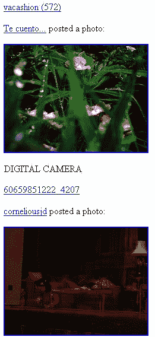

# 第八章. 使用面向对象的方法烹饪 XML

**XML**（**可扩展** **标记** **语言**）是存储多用途数据的重要格式。它也被称为通用数据格式，因为你可以借助渲染器表示任何内容，并正确地可视化数据。XML 最大的优点之一是它可以通过 XSLT 轻松地将一种数据形式转换为另一种形式。此外，XML 数据易于阅读。

PHP5 的一个巨大优势是它对操作 XML 的出色支持。PHP5 附带了一些新的 XML 扩展，可以轻松处理 XML。你有一个全新的**SimpleXML** API，可以以纯面向对象的方式读取 XML 文档。此外，你还有**DOMDocument**对象来解析和创建 XML 文档。在本章中，我们将学习这些 API，并学习如何使用 PHP 成功处理 XML。

# XML 的构成

让我们看看一个常见的 XML 文档的结构，以防你对 XML 一无所知。如果你已经熟悉 XML，我们强烈推荐你在本章中学习，那么这不是为你准备的章节。

让我们看看以下示例，它表示一组电子邮件：

```php
<?xml version="1.0" encoding="ISO-8859-1" ?>
<emails>
  <email>
    <from>nowhere@notadomain.tld</from>
    <to>unknown@unknown.tld</to>
    <subject>there is no subject</subject>
    <body>is it a body? oh ya</body>
  </email>
</emails>
```

因此，你会发现 XML 文档在顶部确实有一个小的声明，它详细说明了文档的字符集。如果你正在存储 Unicode 文本，这很有用。在 XML 中，你必须像开始时一样关闭标签。（XML 比 HTML 严格，你必须遵循约定。）

让我们看看另一个例子，其中数据中包含一些特殊符号：

```php
<?xml version="1.0" encoding="ISO-8859-1" ?>
<emails>
  <email>
    <from>nowhere@notadomain.tld</from>
    <to>unknown@unknown.tld</to>
    <subject>there is no subject</subject>
    <body><![CDATA[is it a body? oh ya, with some texts 
                                       & symbols]]></body>
  </email>
</emails>
```

这意味着你必须用`CDATA`将包含特殊字符的所有字符串括起来。

再次强调，每个实体可能都有一些与之相关的属性。例如，考虑以下 XML，其中我们描述了学生的属性：

```php
<student age= "17" class= "11" title= "Mr.">Ozniak</student> 
```

在上面的例子中，这个`student`标签有三个属性——`age`、`class`和`title`。使用 PHP，我们也可以轻松地操作它们。在接下来的章节中，我们将学习如何解析 XML 文档，或者如何动态创建 XML 文档。

# SimpleXML 简介

在 PHP4 中，有两种解析 XML 文档的方法，这些方法在 PHP5 中也是可用的。一种是通过 SAX（这是一个标准）解析文档，另一种是 DOM。但是使用 SAX 解析 XML 文档需要相当长的时间，编写代码也需要相当长的时间。

在 PHP5 中，引入了一个新的 API，可以轻松解析 XML 文档。这个 API 被命名为 SimpleXML API。使用 SimpleXML API，你可以将你的 XML 文档转换为数组。每个节点都将转换为易于解析的访问形式。

## 解析文档

在本节中，我们将学习如何使用 SimpleXML 解析基本的 XML 文档。让我们喘口气，开始吧。

```php
<?
$str = <<< END
<emails>
  <email>
    <from>nowhere@notadomain.tld</from>
    <to>unknown@unknown.tld</to>
    <subject>there is no subject</subject>
    <body><![CDATA[is it a body? oh ya, with some texts & 
                                          symbols]]></body>
  </email>
</emails>
END;
$sxml = simplexml_load_string($str);
print_r($sxml);
?>
```

输出如下：

```php
SimpleXMLElement Object
(
    [email] => SimpleXMLElement Object
        (
            [from] => nowhere@notadomain.tld
            [to] => unknown@unknown.tld
            [subject] => there is no subject
            [body] => SimpleXMLElement Object
                (
                )

        )

)
```

那么，现在你可能想知道如何单独访问这些属性中的每一个。你可以像访问一个对象一样访问它们。例如，`$sxml->email[0]`返回第一个电子邮件对象。要访问此电子邮件下的`from`元素，你可以使用以下代码，例如：

```php
echo $sxml->email[0]->from
```

因此，每个对象，除非有多个相同的对象，否则只需通过其名称即可访问。否则，你必须像访问集合一样访问它们。例如，如果你有多个元素，你可以使用`foreach`循环访问每个元素：

```php
foreach ($sxml->email as $email)
echo $email->from;
```

## 访问属性

正如我们在上一个示例中看到的，XML 节点可能具有属性。还记得那个包含`class`、`age`和`title`的示例文档吗？现在你可以使用 SimpleXML API 轻松访问这些属性。让我们看看以下示例：

```php
<?
$str = <<< END
<emails>
  <email type="mime">
    <from>nowhere@notadomain.tld</from>
    <to>unknown@unknown.tld</to>
    <subject>there is no subject</subject>
    <body><![CDATA[is it a body? oh ya, with some texts & 
                                          symbols]]></body>
  </email>

</emails>
END;
$sxml = simplexml_load_string($str);

foreach ($sxml->email as $email)
echo $email['type'];

?>
```

这将在输出窗口中显示文本`mime`。所以如果你仔细看，你会明白每个节点都可以像对象属性一样访问，所有属性都可以像数组键一样访问。SimpleXML 使 XML 解析变得非常有趣。

## 使用 SimpleXML 解析 Flickr 源

关于在咖啡里加一些牛奶和糖怎么样？到目前为止，我们已经学习了 SimpleXML API 是什么以及如何使用它。如果能看到一个实际例子会更好。在这个例子中，我们将解析 Flickr 源并显示图片。听起来很酷？让我们来做吧。

如果你感兴趣，想看看 Flickr 公共照片源的样子，这里就是内容。源数据是从[`www.flickr.com/services/feeds/photos_public.gne`](http://www.flickr.com/services/feeds/photos_public.gne)收集的：

```php
<?xml version="1.0" encoding="utf-8" standalone="yes"?>
<feed 
       >

  <title>Everyone's photos</title>
  <link rel="self" 
   href="http://www.flickr.com/services/feeds/photos_public.gne" />
  <link rel="alternate" type="text/html" 
     href="http://www.flickr.com/photos/"/>
  <id>tag:flickr.com,2005:/photos/public</id>
  <icon>http://www.flickr.com/images/buddyicon.jpg</icon>
  <subtitle></subtitle>
  <updated>2007-07-18T12:44:52Z</updated>
  <generator uri="http://www.flickr.com/">Flickr</generator>

  <entry>
    <title>A-lounge 9.07_6</title>
    <link rel="alternate" type="text/html" 
       href="http://www.flickr.com/photos/dimitranova/845455130/"/>
    <id>tag:flickr.com,2005:/photo/845455130</id>
    <published>2007-07-18T12:44:52Z</published>
    <updated>2007-07-18T12:44:52Z</updated>
            <dc:date.Taken>2007-07-09T14:22:55-08:00</dc:date.Taken>
    <content type="html">&lt;p&gt;&lt;a 
    href=&quot;http://www.flickr.com/people/dimitranova/&quot;
    &gt;Dimitranova&lt;/a&gt; posted a photo:&lt;/p&gt;

    &lt;p&gt;&lt;a 
       href=&quot;http://www.flickr.com/photos/dimitranova/845455130/
    &quot; title=&quot;A-lounge 9.07_6&quot;&gt;&lt;img src=&quot;
    http://farm2.static.flickr.com/1285/845455130_dce61d101f_m.jpg
    &quot; width=&quot;180&quot; height=&quot;240&quot; alt=&quot;
    A-lounge 9.07_6&quot; /&gt;&lt;/a&gt;&lt;/p&gt;

</content>
      <author>
        <name>Dimitranova</name>
        <uri>http://www.flickr.com/people/dimitranova/</uri>
      </author>
      <link rel="license" type="text/html" href="deed.en-us" />
        <link rel="enclosure" type="image/jpeg" 
         href="http://farm2.static.flickr.com/1285/
                                   845455130_7ef3a3415d_o.jpg" />
  </entry>
  <entry>
    <title>DSC00375</title>
    <link rel="alternate" type="text/html" 
     href="http://www.flickr.com/photos/53395103@N00/845454986/"/>
    <id>tag:flickr.com,2005:/photo/845454986</id>
    <published>2007-07-18T12:44:50Z</published>
    ...
  </entry>
</feed>
```

现在我们将提取每个条目的描述并显示出来。让我们玩得开心一些：

```php
<?
$content = 
  file_get_contents(
    "http://www.flickr.com/services/feeds/photos_public.gne ");

$sx = simplexml_load_string($content);
foreach ($sx->entry as $entry)
{
  echo "<a href='{$entry->link['href']}'>".$entry->title."</a><br/>";
  echo $entry->content."<br/>"; 
}
?>
```

这将创建以下输出。看看，SimpleXML 有多简单？以上脚本的输出如下所示：



## 使用 SimpleXML 管理 CDATA 部分

如我们之前所说，一些符号不能直接作为任何节点的值出现，除非你使用`CDATA`标签将其包围。例如，看看以下示例：

```php
<?
$str = <<<EOT
<data>
  <content>text & images </content>

</data>

EOT;
$s = simplexml_load_string($str);
?>
```

这将生成以下错误：

```php
<br />
<b>Warning</b>:  simplexml_load_string() 
     [<a href='function.simplexml-load-string'>
       function.simplexml-load-string</a>]: 
     Entity: line 2: parser error : xmlParseEntityRef: 
     no name in <b>C:\OOP with PHP5\Codes\ch8\cdata.php</b> 
     on line <b>10</b><br /><br />
<b>Warning</b>:  simplexml_load_string() 
     [<a href='function.simplexml-load-string'>
       function.simplexml-load-string</a>]: 
     &lt;content&gt;text &amp; images &lt;/content&gt; 
     in <b>C:\OOP with PHP5\Codes\ch8\cdata.php</b> 
     on line <b>10</b><br /><br />
<b>Warning</b>:  simplexml_load_string() 
     [<a href='function.simplexml-load-string'>
       function.simplexml-load-string</a>]: 
     ^ in <b>C:\OOP with PHP5\Codes\ch8\cdata.php</b> 
     on line <b>10</b><br />
```

为了避免这个问题，我们必须使用`CDATA`标签将其包围。让我们这样重写它：

```php
<data>
  <content><![CDATA[text & images ]]></content>
</data>
```

现在它将完美工作。而且你不需要做任何额外的工作来管理这个`CDATA`部分。

```php
<?
$str = <<<EOT
<data>
  <content><![CDATA[text & images ]]></content>

</data>

EOT;
$s = simplexml_load_string($str);
echo $s->content;//print "text & images"
?>
```

然而，在 PHP5.1 之前，你必须像下面这样加载这个部分：

```php
$s = simplexml_load_string($str,null,LIBXML_NOCDATA); 
```

## XPath

SimpleXML 的另一个很好的补充是，你可以使用 XPath 进行查询。那么什么是 XPath 呢？它是一种表达式语言，帮助你使用格式化的输入来定位特定的节点。在本节中，我们将学习如何使用 SimpleXML 和 XPath 来定位 XML 文档的特定部分。让我们看看以下 XML：

```php
<?xml version="1.0" encoding="utf-8"?>
<roles>
  <task type="analysis">
    <state name="new">
      <assigned to="cto">
        <action newstate="clarify" assignedto="pm">
          <notify>pm</notify>
          <notify>cto</notify>
        </action>
      </assigned>
    </state>
    <state name="clarify">
      <assigned to="pm">
        <action newstate="clarified" assignedto="pm">
          <notify>cto</notify>
        </action>
      </assigned>
    </state>
  </task>
</roles>
```

这份文档简单地说明了分析任务的流程，然后告诉它在哪个状态下应该做什么。所以现在你想搜索当任务类型是`analysis`、分配给`cto`且当前状态是`new`时应该做什么。SimpleXML 使这变得非常简单。让我们看看以下代码：

```php
<?
$str = <<< EOT
<roles>
  <task type="analysis">
    <state name="new">
      <assigned to="cto">
        <action newstate="clarify" assignedto="pm">
          <notify>pm</notify>
          <notify>cto</notify>
        </action>
      </assigned>
    </state>
    <state name="clarify">
      <assigned to="pm">
        <action newstate="clarified" assignedto="pm">
          <notify>cto</notify>
        </action>
      </assigned>
    </state>
  </task>
</roles>
EOT;

$s = simplexml_load_string($str);
$node = $s->xpath("//task[@type='analysis']/state[@name='new']
                                       /assigned[@to='cto']");
echo $node[0]->action[0]['newstate']."\n";
echo $node[0]->action[0]->notify[0];
?>
```

这将输出以下内容：

```php
clarify
pm
```

然而，在编写 XPath 时，有一些事情需要记住。当你的 XPath 后面跟着`/`时，这意味着你应该保持 XML 文档的精确顺序。例如：

```php
echo count($s->xpath("//state")); 
```

这将输出`2`。

`//state`意味着从文档的任何地方获取状态节点。现在，如果你指定`task//state`，它将返回所有任务下的所有状态。例如，以下代码将输出`3`和`3`：

```php
echo count($s->xpath("//notify"));
echo count($s->xpath("task//notify"));
```

现在假设你想在`state`节点下找到`notify`，紧随`assigned`之后，紧随`action`之后？你的 XPath 查询应该是`//state/assigned/action/notify`。

但如果你想要这样，它应该正好位于`task`节点下，该节点位于根节点下，它应该是`/task/state/assigned/action/notify`。

如果你需要匹配任何属性，则应将其匹配为`[@AttributeName1='value']` `[@AttributeName2='value']`。如果你看到以下 XPath，它将对你很清晰：

```php
//task[@type='analysis']/state[@name='new']/assigned[@to='cto']
```

## DOM API

PHP 中的 SimpleXML 用于解析文档，但它不能创建任何 XML 文档。要动态创建 XML 文档，你必须使用随 PHP 5 捆绑的 DOM API。使用 DOM API，你还可以轻松创建页面抓取工具。

在本节中，我们将学习如何使用 DOM API 创建 XML 文档，然后我们将学习如何解析现有文档并修改它们。

在以下示例中，我们将创建一个基本的 HTML 文件：

```php
<?
    $doc = new DOMDocument("1.0","UTF-8");
    $html = $doc->createElement("html");
    $body = $doc->createElement("body");
    $h1 = $doc->createElement("h1","OOP with PHP");
    $body->appendChild($h1);
    $html->appendChild($body);
    $doc->appendChild($html);
    echo $doc->saveHTML();
?>
```

这将生成以下代码：

```php
<html>
  <body>
    <h1>OOP with PHP</h1>
  </body>
</html>

```

这相当简单，对吧？

让我们再做一些练习：

```php
<?
   $doc = new DOMDocument("1.0","UTF-8");
   $html = $doc->createElement("html");
   $body = $doc->createElement("body");
   $h1 = $doc->createElement("h1","OOP with PHP");
   $h1->setAttribute("id","firsth1");
   $p = $doc->createElement("p");
   $p->appendChild($doc->createTextNode("Hi - how about some text?"));
   $body->appendChild($h1);
   $body->appendChild($p);
   $html->appendChild($body);
   $doc->appendChild($html);

   echo $doc->saveHTML();
?>
```

这将生成以下代码。

```php
<html><body>
  <h1 id="firsth1">OOP with PHP</h1>
  <p>Hi - how about some text?</p>
</body></html>
```

因此，你可以使用以下代码将 DOM 引擎生成的 XML 保存到你的文件系统中的一个文件中：

```php
file_put_contents("c:/abc.xml", $doc->saveHTML());
```

# 修改现有文档

DOM API 不仅有助于轻松创建 XML 文档，还提供了轻松加载和修改现有文档的访问。以下 XML 示例，我们将加载我们几分钟前创建的文件，然后我们将更改第一个`h1`对象的标题测试：

```php
<?php

 $uri = 'c:/abc.xml';
 $document = new DOMDocument();
 $document->loadHTMLFile($uri);// load the content of this URL as HTML
 $h1s = $document->getElementsByTagName("h1");//find all h1 elements
 $newText = $document->createElement("h1","New Heading");//created a 
                                                  //new h1 element
 $h1s->item(0)->parentNode->insertBefore($newText,
 $h1s->item(0));//insert before the existing h1 element
 $h1s->item(0)->parentNode->removeChild($h1s->item(1));//remove the 
                                                   //old h1 element
 echo $document->saveHTML();//display the content as HTML

?>
```

以下是输出结果：

```php
<!DOCTYPE html PUBLIC "-//W3C//DTD HTML 4.0 Transitional//EN" 
 "http://www.w3.org/TR/REC-html40/loose.dtd">
 <html><body>
 <h1>New Heading</h1>
 <p>Hi - how about some text?</p>
</body></html>
```

# 其他有用函数

DOM 库中还有一些其他有用的函数。我们不会深入讨论它们，但它们包含在本节中，以提供一个简短的概述。

+   `DomNode->setAttribute()`: 帮助设置任何节点的属性

+   `DomNode->hasChildNodes()`: 如果 DOM 节点有子节点，则返回 true

+   `DomNode->replaceChild()`: 用另一个节点替换任何子节点

+   `DomNode->cloneNode()`: 创建当前代码的深拷贝

# 摘要

在 PHP5 中，XML API 在 Web 应用程序开发中扮演着非常重要的角色，尤其是新的 SimpleXML API，它简化了解析过程。今天，XML 几乎是所有大型应用程序使用最多的数据格式之一。因此，熟悉 XML API 和相关技术无疑将帮助你更容易地设计健壮的基于 XML 的应用程序。

在下一章中，我们将学习 MVC 架构，并自己构建一个简洁的 MVC 框架。
