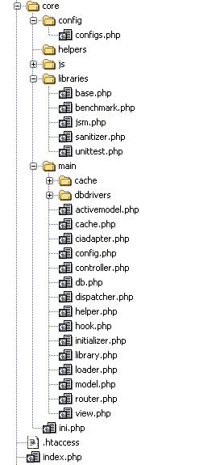
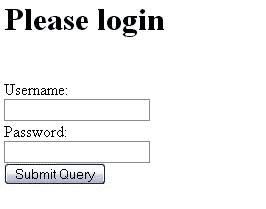

# 第九章：用 MVC 构建更好的应用

在第四章中，我们学习了设计模式如何通过提供解决问题的常用方法来简化你的日常编程生活。在应用架构中，一种流行的设计模式是**模型-视图-控制器**（Model-View-Controller），也称为**MVC**。在 PHP 的快速应用开发（Rapid Application Development, RAD）中，MVC 框架扮演着至关重要的角色。如今，几个 MVC 框架已经引起了公众的兴趣，其中许多已经准备好用于企业级应用。例如，**symfony**框架已被用于开发 Yahoo 书签，CakePHP 正在重构 Mambo，CodeIgniter 被许多在网站上展示的大型应用所使用。还有像 Zend Framework 这样的流行 MVC 框架，它被 IBM 使用，也被用于开发 Magento 开源电子商务解决方案。

因此，如今，从头开始编写代码并进行微调已经过时了，如果你正在这样做，你应该真正避免这样做。在本章中，我们将讨论 MVC 框架的基本结构，然后介绍一些这些流行的框架。

# 什么是 MVC？

如其名所示，MVC 由三个组件组成。第一个是模型（Model），第二个是视图（View），第三个是控制器（Controller）。如果我们只是列出名称，这并没有什么意义。首先，模型是一个与数据库交互的对象。所有业务逻辑通常都写在模型中。控制器是一段代码，它接收用户输入，基于这些输入初始化模型和其他对象，并最终调用它们。最后，视图是一个组件，它使用模型帮助显示控制器生成的结果。

因此，为了良好的实践，你永远不应该在视图或控制器中实现任何业务逻辑。同样，你也不应该在模型中处理输出结果。而且，你永远不应该直接从控制器中产生任何输出（而是使用视图）。

在接下来的章节中，我们将创建一个非常小的 MVC。

# 项目规划

为了成功开发任何应用，你必须有一个明确的目标。每当一个应用架构强大、稳定、无懈可击时，你将获得大量用户使用你的应用。在本章中，我们将开发的 MVC 框架将成功解决以下问题：

+   脚本小

+   容易加载组件、库、辅助工具和模型

+   开发视图的优雅且灵活的语法

+   对流行数据库服务器的出色支持

+   不会占用大量资源

+   易于使用

+   容易与其他组件框架如 Pear、ezComponents 等集成。

+   支持缓存

+   类似于 RubyOnRails 的布局支持，便于设计你的 Web 应用

+   原生 gzip 压缩器用于 JavaScript

+   支持 Ajax

# 设计引导文件

引导文件是一个文件，它只为成功执行和集成控制器、模型和视图准备环境。基本上，引导文件初始化环境、路由器、对象加载器，并将所有输入参数传递给控制器。我们将设计一个引导文件，它将借助`mod_rewrite`接收成功请求 URL 的所有参数。

### 注意

`mod_rewrite`是一个 Apache 模块，它通过模式（正则表达式）帮助将请求重定向到另一个请求 URL。对于几乎每个设计的 Web 应用程序来说，这是一个必不可少的模块。如果你对它感兴趣并想了解更多，你可以访问：[`httpd.apache.org/docs/2.0/mod/mod_rewrite.html`](http://httpd.apache.org/docs/2.0/mod/mod_rewrite.html)

要启用`mod_rewrite`，你可以按照以下细节操作。首先，打开`httpd.conf`并添加以下行：

```php
LoadModule rewrite_module modules/mod_rewrite.so
<Directory />
    Options FollowSymLinks
    AllowOverride None
    Order deny,allow
    Deny from all
    Satisfy all
</Directory>
```

我们必须在`.htaccess`文件中放置以下代码，并将其放置在我们的应用程序根目录内。

```php
RewriteEngine on
RewriteCond $1 !^(index\.php|images|robots\.txt)
RewriteCond %{REQUEST_FILENAME} !-f
RewriteCond %{REQUEST_FILENAME} !-d
RewriteRule ^(.*)$ index.php?$1
```

这段代码将仅仅将每个请求重定向到`index.php`，这将是我们的引导文件。这个引导文件将接收任何请求的 URL，并将其拆分为不同的部分，如控制器、操作和参数。例如，格式将是`http://our_application/controller/action/param/param..../param`。引导文件将借助路由器分析 URL，然后借助分发器调用控制器和操作，并传递所有参数。

下面是我们引导文件（`index.php`）的代码：

```php
<?
include("core/ini.php");
initializer::initialize();
$router = loader::load("router");
dispatcher::dispatch($router);
?>
```

在上面的代码中，你可以看到一个名为`loader`的对象。这个对象的主要目的是为我们加载对象，但通过单例模式。这将帮助我们最小化加载。使用这个 loader，我们将通过单例模式加载一个名为`router`的对象。还有一个名为`dispatcher`的对象，它将最终借助路由器将 Web 请求分发出去。

让我们检查`core/ini.php`的代码，这是一个辅助工具，用于帮助轻松地从不同目录包含类文件。

```php
<?
set_include_path(get_include_path().PATH_SEPARATOR."core/main");
function __autoload($object)
{
  require_once("{$object}.php");
}
?>
```

下面是`initializer`文件（`core/main/initializer.php`）的内容：

```php
<?
class initializer
{
  public static function initialize()
  {
  set_include_path(get_include_path().PATH_SEPARATOR."core/main");
  set_include_path(get_include_path().PATH_SEPARATOR.
                                               "core/main/cache");
  set_include_path(get_include_path().PATH_SEPARATOR."core/helpers");
  set_include_path(get_include_path().PATH_SEPARATOR.
                                                "core/libraries");
  //set_include_path(get_include_path().PATH_SEPARATOR.
                                                "app/controllers");
  set_include_path(get_include_path().PATH_SEPARATOR."app/models");
  set_include_path(get_include_path().PATH_SEPARATOR."app/views");
//include_once("core/config/config.php");
  }
}
?>
```

如果你查看`initializer`文件的代码，你会发现它实际上只是扩展了包含路径。

下面是我们`loader`文件（`core/main/loader.php`）的代码，它将通过单例模式加载不同的组件。

```php
<?
class loader
{
  private static $loaded = array();
  public static function load($object)
  {
    $valid = array(	"library",
    "view",
    "model",
    "helper",
    "router",
    "config",
    "hook",
    "cache",
    "db");

    if (!in_array($object,$valid))
    {

      $config = self::load("config");
      if ("on"==$config->debug)
      {
        base::backtrace();
      }
```

```php
throw new Exception("Not a valid object '{$object}' to load");
    }

    if (empty(self::$loaded[$object])){
      self::$loaded[$object]= new $object();
    }
    return self::$loaded[$object];

  }

}
?>
```

Loader 使用另一个`config`文件（`core/main/config.php`），实际上是从`config/configs.php`文件下加载不同的`configs`：

```php
<?
class config
{
  private $config;
  function __construct()
  {
    global $configs;
    include_once("core/config/configs.php");
    include_once("app/config/configs.php");
    $this->config = $configs;
  }

  private function __get($var)
  {
    return $this->config[$var];
  }
}
?>
```

如果你想知道我们的`configs.php`将如何看起来，下面是它的样子：

```php
<?
$configs['debug']="on";
$configs['base_url']="http://localhost/orchid";
$configs['global_profile']=true;
$configs['allowed_url_chars'] = "/[^A-z0-9\/\^]/";
$configs['default_controller']="welcome";
?>
```

好吧，如果你查看`loader.php`的代码，会发现一个类似这样的部分：

```php
$config = self::load("config");
  if ("on"==$config->debug)
    {
      base::backtrace();
    }
```

所以`$config->debug`实际上是通过`config.php`中的`__get()` `魔法`方法返回`$configs['debug']`的值。

在 loader 中有一个名为`base::backtrace()`的方法。`base`是在`core/libraries/base.php`中声明的静态对象。它包含了一些在整个框架中使用的有用函数。这是在`core/libraries/base.php`中：

```php
<?
class base{
  public static function pr($array)
  {
    echo "<pre>";
    print_r($array);
    echo "</pre>";
  }

  public static function backtrace()
  {
    echo "<pre>";
    debug_print_backtrace();
    echo "</pre>";
  }

  public static function basePath()
  {
    return getcwd();
  }

  public static function baseUrl()
  {
    $conf = loader::load("config");
    return $conf->base_url;
  }
?>
```

因此，`base::backtrace()` 实际上打印 `debug_backtrace` 以便于跟踪异常。

到目前为止，我们还没有看到 `router.php` 和 `dispatcher.php` 的代码。路由器和调度器是整个应用的主要部分。以下是 `router.php` 的代码（`core/main/router.php`）：

```php
<?
class router
{
  private $route;
  private $controller;
  private $action;
  private $params;
  public function __construct()
  {
    if(file_exists("app/config/routes.php")){
      require_once("app/config/routes.php");
    }

    $path = array_keys($_GET);
    $config = loader::load("config");
    if (!isset($path[0]))
    {
      $default_controller = $config->default_controller;
      if (!empty($default_controller))
      $path[0] = $default_controller;
      else 
      $path[0] = "index";
    }
    $route= $path[0];

    $sanitzing_pattern = $config->allowed_url_chars;
    $route = preg_replace($sanitzing_pattern, "", $route);
    $route = str_replace("^","",$route);
    $this->route = $route;

    $routeParts = split( "/",$route);
    $this->controller=$routeParts[0];
    $this->action=isset($routeParts[1])? $routeParts[1]:"base";
    array_shift($routeParts);
    array_shift($routeParts);
    $this->params=$routeParts;

    /* match user defined routing pattern */
    if (isset($routes)){
      foreach ($routes as $_route)
      {
        $_pattern = "~{$_route[0]}~";
        $_destination = $_route[1];
        if (preg_match($_pattern,$route))
        {
          $newrouteparts = split("/",$_destination);
          $this->controller = $newrouteparts[0];
          $this->action = $newrouteparts[1];
        }
      }
    }
  }

  public function getAction()
  {
    if (empty($this->action)) $this->action="main";
    return $this->action;
  }

  public function getController()
  {
    return $this->controller;
  }

  public function getParams()
  {
    return $this->params;
  }

}
?>
```

路由器实际上执行的操作是从请求 URL 中找到控制器、操作和参数。如果找不到控制器名称，它将使用默认控制器名称；如果默认控制器名称在 `config` 文件中找不到，它将使用 `index` 作为默认控制器。

在继续到调度器之前，我们必须看看视图引擎，这将用于模板引擎，这样任何从控制器都可以设置变量，例如 `$this->view->set(varname, value)`。之后，任何人都可以在我们的视图文件中以 `$varname` 的形式访问该变量。

接下来是视图引擎（`core/main/view.php`）：

```php
<?
class view
{
  private $vars=array();
  private $template;

  public function set($key, $value)
  {
  $this->vars[$key]=$value;
  }

  public function getVars(&$controller=null)
  {
    if (!empty($controller)) $this->vars['app']=$controller;
    return $this->vars;
  }

  public function setTemplate($template)
  {
    $this->template = $template;
  }

  public function getTemplate($controller=null)
  {
    if (empty($this->template)) return $controller;
    return $this->template;
  }

  private function __get($var)
  {
    return loader::load($var);
  }
}
?>
```

接下来是调度器，它是我们框架的核心部分（`core/main/dispatcher.php`）：

```php
<?
class dispatcher
{
  public static function dispatch($router)
  {
    global $app;
    //$cache = loader::load("cache");
    ob_start();
    $config = loader::load("config");

    if ($config->global_profile) $start = microtime(true);

 $controller = $router->getController();
 $action = $router->getAction();
 $params = $router->getParams();
 if (count($params)>1){
 if ("unittest"==$params[count($params)-1] || 
 '1'==$_POST['unittest'])unittest::setUp();
 }
 $controllerfile = "app/controllers/{$controller}.php";
 if (file_exists($controllerfile)){
 require_once($controllerfile);
 $app = new $controller();
 $app->use_layout = true;
 $app->setParams($params);
 $app->$action();
      unittest::tearDown();

      ob_end_clean();

      //manage view
      ob_start();

      $view = loader::load("view");
 $viewvars = $view->getVars($app);
 $uselayout = $config->use_layout;

 if (!$app->use_layout) $uselayout=false;

 $template = $view->getTemplate($action);
 base::_loadTemplate($controller, $template, 
 $viewvars, $uselayout);

      if (isset($start))
     echo "<p>Total time for dispatching is : 
                ".(microtime(true)-$start)." seconds.</p>";
      $output = ob_get_clean();

      //$cache->set("abcde",array
                     ("content"=>base64_encode($output)));
      echo $output;
    }
    else
    throw new Exception("Controller not found");
  }
}
?>
```

下面是调度器主要执行的操作（如上代码中高亮部分所示）。它接受一个路由对象作为参数，然后从路由器中找到控制器、操作和参数。如果控制器文件可用，它将加载该文件并初始化控制器。初始化后，它仅访问操作。

之后，调度器使用加载器初始化当前视图对象。由于它是通过 Singleton 来的，所以设置给它的所有变量仍然在作用域内。然后调度器将视图模板文件和变量传递给 base 中的 `_loadTemplate` 函数。

`$uselayout` 的目的是什么？它只是指示是否应该将布局文件附加到我们的模板上。当我们在实践中看到它时，这更有趣。

下面是 `base::_loadTemplate()` 函数：

```php
  public static function _loadTemplate($controller, $template, 
                                  $vars, $uselayout=false)
  {
    extract($vars);
    if ($uselayout)
    ob_start();
    $templatefile ="app/views/{$controller}/{$template}.php";
    if (file_exists($templatefile)){
      include_once($templatefile);
    }
    else
    {
      throw new Exception("View '{$template}.php' is not found in 
                               views/{$controller} directory.");
    }

    if ($uselayout) {
      $layoutdata = ob_get_clean();
      $layoutfilelocal = "app/views/{$controller}/{$controller}.php";
      $layoutfileglobal = "app/views/layouts/{$controller}.php";

      if (file_exists($layoutfilelocal))
      include_once($layoutfilelocal);
      else 
      include_once($layoutfileglobal);
    }
  }
```

如果您对这些文件的放置感到困惑，这里有一个目录结构来帮助您理解：



为什么还有像 `jsm.php`、`benchmark.php`、`unittest.php`、`helper.php`、`model.php`、`library.php`、`cache.php` 和 `db.php` 这样的其他文件？

+   这些文件将帮助我们理解以下部分：

+   `jsm.php`：帮助使用自动 gzip 压缩加载 JavaScript

+   `db.php`：用于连接不同的数据库

+   `library.php`：帮助加载库文件

+   `unittest.php`：将帮助自动化单元测试

+   `model.php`：将帮助加载用于数据库访问的模型

现在我们来看看我们的 `model` 和 `library` 都在做什么。

接下来是 `core/main/model.php`：

```php
<?
class model
{
  private $loaded = array();
  private function __get($model)
  {
    $model .="model";
    $modelfile = "app/models/{$model}.php";

    $config = loader::load("config");

    if (file_exists($modelfile))
    {
      include_once($modelfile);
      if (empty($this->loaded[$model]))
      {
        $this->loaded[$model]=new $model();
      }
      $modelobj = $this->loaded[$model];
      if ($config->auto_model_association)
      {
        $this->associate($modelobj, $_REQUEST); //auto association
      }
      return $modelobj;
    }
    else
    {
      throw new Exception("Model {$model} is not found");
    }
  }

  private function associate(&$obj, $array)
  {
    foreach ($array as $key=>$value)
    {
      if (property_exists($obj, $key))
      {
        $obj->$key = $value;
      }
    }
  }
}
?>
```

每当表单提交时，我们希望在初始化模型后立即填充它。因此，我们保留了一个名为 `auto_model_association` 的配置变量。如果您将其设置为 true，模型将自动关联。

接下来是库加载器（`core/main/library.php`）：

```php
<?
class library{
  private $loaded = array();
  private function __get($lib)
  {
    if (empty($this->loaded[$lib]))
    {
      $libnamecore = "core/libraries/{$lib}.php";
      $libnameapp = "app/libraries/{$lib}.php";
      if (file_exists($libnamecore))
      {
        require_once($libnamecore);
        $this->loaded[$lib]=new $lib();
      }
      else if(file_exists($libnameapp))
      {
        require_once($libnameapp);
        $this->loaded[$lib]=new $lib();
      }
      else 
      {
        throw new Exception("Library {$lib} not found.");
      }
    }
    return $this->loaded[$lib];
  }
}
?>
```

`library.php` 只帮助通过 Singleton 加载库。

现在我们将看到 JavaScript 加载器，它默认使用 gzip 压缩来提供每个库。如今，每个浏览器都支持 gzip 压缩，以加快任何对象的加载速度。我们还在我们的框架中内置了对 prototype、jQuery 和 script.aculo.us 的支持。

这里是 `core/libraries/jsm.php`:

```php
<?
/**
 * Javascript Manager
 *
 */
class jsm
{
  function loadPrototype()
  {
    $base = base::baseUrl();
    echo "<script type='text/javascript' 
            src='{$base}/core/js/gzip.php?js=prototypec.js'>\n";
  }
  function loadScriptaculous()
  {
    $base = base::baseUrl();
    echo "<script type='text/javascript' 
      src='{$base}/core/js/gzip.php?js=scriptaculousc.js'>\n";
  }
  function loadProtaculous()
  {
    $base = base::baseUrl();
    echo "<script type='text/javascript' 
      src='{$base}/core/js/gzip.php?js=prototypec.js'>\n";
    echo "<script type='text/javascript' 
      src='{$base}/core/js/gzip.php?js=scriptaculousc.js'>\n";
  }
  function loadJquery()
  {
    $base = base::baseUrl();
    echo "<script type='text/javascript' 
            src='{$base}/core/js/gzip.php?js=jqueryc.js'>\n";
  }
  /**
   * app specific libraries
   *
   * @param string $filename
   */
  function loadScript($filename)
  {
    $base = base::baseUrl();
    $script = $base."/app/js/{$filename}.js";
    echo "<script type='text/javascript' 
         src='{$base}/core/js/gzip.php?js={$script}'>\n";
  }
}
?>
```

如果你查看代码，你会发现它通过 `gzip.php` 加载每个 JavaScript 文件，实际上 `gzip.php` 负责压缩内容。所以这里是 `gzip.php` 的代码（`core/js/gzip.php`）:

```php
<?php 
  ob_start("ob_gzhandler");
  header("Content-type: text/javascript; charset: UTF-8");
  header("Cache-Control: must-revalidate");
  $offset = 60 * 60 * 24 * 3;
  $ExpStr = "Expires: " . 
         gmdate("D, d M Y H:i:s",  time() + $offset) . " GMT";
  header($ExpStr);
  $js = $_GET['js'];
  if (in_array($js, 
      array("prototypec.js","scriptaculousc.js","jqueryc.js")))
                               include(urldecode($_GET['js']));
?>
```

如果你还有其他库要加载，你可以修改这个库，并在以下行中添加它们。

```php
if (in_array($js, 
  array("prototypec.js","scriptaculousc.js","jqueryc.js")))
```

最后，我们还有一个文件，它帮助我们在我们应用程序的开发过程中编写单元测试。`unittest.php` 负责这个，还有一个布尔配置标志：`unit_test_enabled`。

这里是 `core/main/unittest.php`:

```php
<?
class unittest
{
  private static $results = array();
  private static $testmode = false;

  public static function setUp()
  {
    $config = loader::load("config");
    if ($config->unit_test_enabled){
      self::$results = array();
      self::$testmode = true;
    }
  }

  public static function tearDown()
  {
    if (self::$testmode)
    {
      self::printTestResult();
      self::$results = array();
      self::$testmode = false;
      die();
    }
  }

  public static function printTestResult()
  {
    foreach (self::$results as $result)
    {
      echo $result."<hr/>";
    }
  }

  public static function assertTrue($object)
  {
    if (!self::$testmode) return 0;
    if (true==$object) $result = "passed";
    self::saveResult(true, $object, $result);
  }

  public static function assertEqual($object, $constant)
  {
    if (!self::$testmode) return 0;
    if ($object==$constant)
    {
      $result = 1;
    }
    self::saveResult($constant, $object, $result);
  }

  private static function getTrace()
  {
    $result = debug_backtrace();
    $cnt = count($result);
    $callerfile = $result[2]['file'];
    $callermethod = $result[3]['function'];
    $callerline = $result[2]['line'];
    return array($callermethod, $callerline, $callerfile);
  }

  private static function saveResult($expected, $actual, 
                                              $result=false)
  {
    if (empty($actual)) $actual = "null/false";

    if ("failed"==$result || empty($result))
    $result = "<font color='red'><strong>failed</strong></font>";
    else
    $result = "<font color='green'><strong>passed</strong></font>";

    $trace = self::getTrace();
    $finalresult = "Test {$result} in Method: 
          <strong>{$trace[0]}</strong>. Line: 
          <strong>{$trace[1]}</strong>. File: 
          <strong>{$trace[2]}</strong>. <br/> Expected: 
          <strong>{$expected}</strong>, Actual: 
          <strong>{$actual}</strong>. ";
    self::$results[] = $finalresult;
  }

  public static function assertArrayHasKey($key, array $array, 
                                                     $message = '')
  {
    if (!self::$testmode) return 0;
    if (array_key_exists($key, $array))
    {
      $result = 1;
      self::saveResult("Array has a key named '{$key}'", 
                    "Array has a key named '{$key}'", $result);
      return ;
    }
    self::saveResult("Array has a key named '{$key}'", 
                "Array has not a key named '{$key}'", $result);
  }

  public static function assertArrayNotHasKey($key, array $array, 
                                               $message = '')
  {
    if (!self::$testmode) return 0;
    if (!array_key_exists($key, $array))
    {
      $result = 1;
      self::saveResult("Array has not a key named '{$key}'", 
              "Array has not a key named '{$key}'", $result);
      return ;
    }
    self::saveResult("Array has not a key named '{$key}'", 
                   "Array has a key named '{$key}'", $result);

  }
  public static function assertContains($needle, $haystack, 
                           $message = '')
  {
    if (!self::$testmode) return 0;
    if (in_array($needle,$haystack))
    {
      $result = 1;
      self::saveResult("Array has a needle named '{$needle}'", 
               "Array has a needle named '{$needle}'", $result);
      return ;
    }
    self::saveResult("Array has a needle named '{$needle}'", 
            "Array has not a needle named '{$needle}'", $result);

  }
}
?>
```

我们必须保留内置的代码基准测试支持，以帮助分析。因此，我们有 `benchmark.php` (`core/main/benchmark.php`) 来执行它：

```php
<?
class benchmark
{
  private $times = array();
  private $keys = array();

  public function setMarker($key=null)
  {
    $this->keys[] = $key;
    $this->times[] = microtime(true);
  }

  public function initiate()
  {
    $this->keys= array();
    $this->times= array();
  }

  public function printReport()
  {
    $cnt = count($this->times);
    $result = "";
    for ($i=1; $i<$cnt; $i++)
    {
      $key1 = $this->keys[$i-1];
      $key2 = $this->keys[$i];
      $seconds = $this->times[$i]-$this->times[$i-1];
      $result .= "For step '{$key1}' to '{$key2}' : {$seconds} 
                                              seconds.</br>";
    }
    $total = $this->times[$i-1]-$this->times[0];
    $result .= "Total time  : {$total} seconds.</br>";
    echo $result;
  }
}
?>

```

# 添加数据库支持

我们的框架必须有一个数据抽象层，以简化数据库操作。我们将为三个流行的数据库提供支持：SQLite、PostgreSQL 和 MySQL。以下是我们的数据抽象层代码在 `core/main/db.php` 中：

```php
<?
include_once("dbdrivers/abstract.dbdriver.php");
class db
{
  private $dbengine;
  private $state  = "development";

  public function __construct()
  {
    $config = loader::load("config");
    $dbengineinfo = $config->db;
    if (!$dbengineinfo['usedb']==false)
    {
      $driver = $dbengineinfo[$this->state]['dbtype'].'driver';
      include_once("dbdrivers/{$driver}.php");
      $dbengine = new $driver($dbengineinfo[$this->state]);
      $this->dbengine = $dbengine;
    }
  }

  public function setDbState($state)
  {
    //must be 'development'/'production'/'test' or whatever
    if (empty($this->dbengine)) return 0;
    $config = loader::load("config");
    $dbengineinfo = $config->db;
    if (isset($dbengineinfo[$state]))
    {
      $this->state = $state;
    }
    else 
    {
      throw new Exception("No such state in config filed called 
                                          ['db']['{$state}']");
    }
  }

  private function __call($method, $args)
  {
    if (empty($this->dbengine)) return 0;
    if (!method_exists($this, $method))
    return call_user_func_array(array($this->dbengine,
                                           $method),$args);
  }

  /*private function __get($property)
  {
    if (property_exists($this->dbengine,$property))
    return $this->dbengine->$property;
  }*/
}
?>
```

它使用一个抽象驱动对象来确保驱动对象的可扩展性和一致性。将来，如果任何第三方开发者想要引入新的驱动，他必须在 `core/main/dbdrivers/abstract.dbdriver.php` 中扩展它：

```php
<?
define ("FETCH_ASSOC",1);
define ("FETCH_ROW",2);
define ("FETCH_BOTH",3);
define ("FETCH_OBJECT",3);

abstract class abstractdbdriver
{
  protected $connection;
  protected $results = array();
  protected $lasthash = "";

  public function count()
  {
    return 0;
  }

  public function execute($sql)
  {
    return false;
  }

  private function prepQuery($sql)
  {
    return $sql;
  }

  public function escape($sql)
  {
    return $sql;
  }

  public function affectedRows()
  {
    return 0;
  }

  public function insertId()
  {
    return 0;
  }

  public function transBegin()
  {
    return false;
  }

  public function transCommit()
  {
  return false;	
  }

  public function transRollback()
  {
    return false;
  }

  public function getRow($fetchmode = FETCH_ASSOC)
  {
    return array();
  }

  public function getRowAt($offset=null,$fetchmode = FETCH_ASSOC)
  {
    return array();
  }

  public function rewind()
  {
    return false;
  }

  public function getRows($start, $count, $fetchmode = FETCH_ASSOC)
  {
    return array();
  }
}
?>

```

## 驾驶员

现在是难度最大的部分；驾驶员。让我们看看 SQLite 驱动文件 `core/main/dbdrivers/sqlitedriver.php`:

```php
<?
class sqlitedriver extends abstractdbdriver
{
  public function __construct($dbinfo)
  {
    if (isset($dbinfo['dbname']))
    {
      if (!$dbinfo['persistent'])
      $this->connection = 
           sqlite_open($dbinfo['dbname'],0666,$errormessage);
      else
      $this->connection = 
           sqlite_popen($dbinfo['dbname'],0666,$errormessage);
      if (!$this->connection)
      {
        throw new Exception($errormessage);
      }
    }
    else
    throw new Exception("You must supply database name for a 
                                         successful connection");

  }

  public function count()
  {
    $lastresult = $this->results[$this->lasthash];
    //print_r($this->results);
    $count = sqlite_num_rows($lastresult);
    if (!$count) $count = 0;
    return $count;
  }

  public function execute($sql)
  {

    $sql = $this->prepQuery($sql);
    $parts = split(" ",trim($sql));
    $type = strtolower($parts[0]);
    $hash = md5($sql);
    $this->lasthash = $hash;

    if ("select"==$type)
    {
      if (isset($this->results[$hash]))
      {
        if (is_resource($this->results[$hash]))
        return $this->results[$hash];
      }
    }
    else if("update"==$type || "delete"==$type)
    {
      $this->results = array(); //clear the result cache
    }
    $this->results[$hash] = sqlite_query($sql,$this->connection);
  }

  private function prepQuery($sql)
  {
    return $sql;
  }

  public function escape($sql)
  {
    if (function_exists('sqlite_escape_string'))
    {
      return sqlite_escape_string($sql);
    }
    else
    {
      return addslashes($sql);
    }
  }

  public function affectedRows()
  {
    return sqlite_changes($this->connection);
  }

  public function insertId()
  {
    return @sqlite_last_insert_rowid($this->connection);
  }

  public function transBegin()
  {
    $this->execute('BEGIN TRANSACTION');
  }

  public function transCommit()
  {
    $this->execute('COMMIT');
  }
  public function transRollback()
  {
    $this->execute('COMMIT');
  }

  public function getRow($fetchmode = FETCH_ASSOC)
  {
    $lastresult = $this->results[$this->lasthash];
    if (FETCH_ASSOC == $fetchmode)
    $row = sqlite_fetch_array($lastresult,SQLITE_ASSOC);
    elseif (FETCH_ROW == $fetchmode)
    $row = sqlite_fetch_array($lastresult, SQLITE_NUM);
    elseif (FETCH_OBJECT == $fetchmode)
    $row = sqlite_fetch_object($lastresult);
    else
    $row = sqlite_fetch_array($lastresult,SQLITE_BOTH);
    return $row;
  }

  public function getRowAt($offset=null,$fetchmode = FETCH_ASSOC)
  {
    $lastresult = $this->results[$this->lasthash];
    if (!empty($offset))
  {    
      sqlite_seek($lastresult, $offset);
    }
    return $this->getRow($fetchmode);
  }

  public function rewind()
  {
    $lastresult = $this->results[$this->lasthash];
    sqlite_rewind($lastresult);
  }

  public function getRows($start, $count, $fetchmode = FETCH_ASSOC)
  {
    $lastresult = $this->results[$this->lasthash];
    sqlite_seek($lastresult, $start);
    $rows = array();
    for ($i=$start; $i<=($start+$count); $i++)
    {
      $rows[] = $this->getRow($fetchmode);
    }
    return $rows;
  }
}
?>
```

如果你查看代码，你会发现我们只是在 `abstractdbdriver.php` 文件中实现了 `abstractdbdriver` 对象中描述的所有功能。

现在是 MySQL 驱动文件，`core/main/dbdrivers/mysqldriver.php`:

```php
<?
class mysqldriver extends abstractdbdriver 
{
  public function __construct($dbinfo)
  {
    if (!empty($dbinfo['dbname']))
    {
      if ($dbinfo['persistent'])
      $this->connection = 
                mysql_pconnect($dbinfo['dbhost'],$dbinfo['dbuser'],
                $dbinfo['dbpwd']);
      else
      $this->connection = 
                mysql_connect($dbinfo['dbhost'],$dbinfo['dbuser'],
                $dbinfo['dbpwd']);
      mysql_select_db($dbinfo['dbname'],$this->connection);
    }
    else
    throw new Exception("You must supply username, password, 
           hostname and database name for connecting to mysql");
  }

  public function execute($sql)
  {
    $sql = $this->prepQuery($sql);
    $parts = split(" ",trim($sql));
    $type = strtolower($parts[0]);
    $hash = md5($sql);
    $this->lasthash = $hash;

    if ("select"==$type)
    {
      if (isset($this->results[$hash]))
      {
        if (is_resource($this->results[$hash]))
        return $this->results[$hash];
      }
    }
    else if("update"==$type || "delete"==$type)
    {
      $this->results = array(); //clear the result cache
    }
    $this->results[$hash] = mysql_query($sql,$this->connection);

  }

  public function count()
  {
    //print_r($this);
    $lastresult = $this->results[$this->lasthash];
    //print_r($this->results);
    $count = mysql_num_rows($lastresult);
    if (!$count) $count = 0;
    return $count;
  }

  private  function prepQuery($sql)
  {
    // "DELETE FROM TABLE" returns 0 affected rows.
    // This hack modifies the query so that
    // it returns the number of affected rows
    if (preg_match('/^\s*DELETE\s+FROM\s+(\S+)\s*$/i', $sql))
    {
      $sql = preg_replace("/^\s*DELETE\s+FROM\s+(\S+)\s*$/", 
                           "DELETE FROM \\1 WHERE 1=1", $sql);
    }

    return $sql;
  }

  public function escape($sql)
  {
    if (function_exists('mysql_real_escape_string'))
    {
      return mysql_real_escape_string($sql, $this->conn_id);
    }
    elseif (function_exists('mysql_escape_string'))
    {
      return mysql_escape_string( $sql);
    }
    else
    {
      return addslashes($sql);
    }
  }
  public function affectedRows()
  {
    return @mysql_affected_rows($this->connection);
  }
  public function insertId()
  {
    return @mysql_insert_id($this->connection);
  }

  public function transBegin()
  {
    $this->execute('SET AUTOCOMMIT=0');
    $this->execute('START TRANSACTION'); // can also be BEGIN or 
                                         // BEGIN WORK
    return TRUE;
  }

  public function transCommit()
  {
    $this->execute('COMMIT');
    $this->execute('SET AUTOCOMMIT=1');
    return TRUE;
  }

  public function transRollback()
  {
    $this->execute('ROLLBACK');
    $this->execute('SET AUTOCOMMIT=1');
    return TRUE;
  }

  public function getRow($fetchmode = FETCH_ASSOC)
  {

    $lastresult = $this->results[$this->lasthash];
    if (FETCH_ASSOC == $fetchmode)
    $row = mysql_fetch_assoc($lastresult);
    elseif (FETCH_ROW == $fetchmode)
    $row = mysql_fetch_row($lastresult);
    elseif (FETCH_OBJECT == $fetchmode)
    $row = mysql_fetch_object($lastresult);
    else
    $row = mysql_fetch_array($lastresult,MYSQL_BOTH);
    return $row;
  }

  public function getRowAt($offset=null,$fetchmode = FETCH_ASSOC)
  {
    $lastresult = $this->results[$this->lasthash];
    if (!empty($offset))
    {
      mysql_data_seek($lastresult, $offset);
    }
    return $this->getRow($fetchmode);
  }

  public function rewind()
  {
    $lastresult = $this->results[$this->lasthash];
    mysql_data_seek($lastresult, 0);
  }

  public function getRows($start, $count, $fetchmode = FETCH_ASSOC)
  {
    $lastresult = $this->results[$this->lasthash];
    mysql_data_seek($lastresult, $start);
    $rows = array();
    for ($i=$start; $i<=($start+$count); $i++)
    {
      $rows[] = $this->getRow($fetchmode);
    }
    return $rows;
  }

  function __destruct(){
    foreach ($this->results as $result)
    {
      @mysql_free_result($result);
    }
  }

}
?>
```

最后，这里是 PostgreSQL 驱动，`core/main/dbdrivers/postgresql.php`:

```php
<?
class pgsqldriver extends abstractdbdriver 
{

  public function __construct($dbinfo)
  {
    if (!empty($dbinfo['dbname']))
    {
      if ($dbinfo['persistent'])
      $this->connection = pg_pconnect("host={$dbinfo['dbname']} 
      port=5432 dbname={$dbinfo['dbname']} user={$dbinfo['$dbuser']} 
      password={$dbinfo['dbpwd']}");
      else
      $this->connection = pg_connect("host={$dbinfo['dbname']} 
      port=5432 dbname={$dbinfo['dbname']} user={$dbinfo['$dbuser']} 
      password={$dbinfo['dbpwd']}");
    }
    else
    throw new Exception("You must supply username, password, 
    hostname and database name for connecting to postgresql");
  }

  public function execute($sql)
  {
    $sql = $this->prepQuery($sql);
    $parts = split(" ",trim($sql));
    $type = strtolower($parts[0]);
    $hash = md5($sql);
    $this->lasthash = $hash;

    if ("select"==$type)
    {
      if (isset($this->results[$hash]))
      {
        if (is_resource($this->results[$hash]))
        return $this->results[$hash];
      }
    }
    else if("update"==$type || "delete"==$type)
    {
      $this->results = array(); //clear the result cache
    }
    $this->results[$hash] = pg_query($this->connection,$sql);
  }

  public function count()
  {
    //print_r($this);
    $lastresult = $this->results[$this->lasthash];
    //print_r($this->results);
    $count = pg_num_rows($lastresult);
    if (!$count) $count = 0;
    return $count;
  }

  private function prepQuery($sql)
  {
    // "DELETE FROM TABLE" returns 0 affected rows this hack modifies
    // the query so that it returns the number of affected rows
    if (preg_match('/^\s*DELETE\s+FROM\s+(\S+)\s*$/i', $sql))
    {
      $sql = preg_replace("/^\s*DELETE\s+FROM\s+(\S+)\s*$/", 
                         "DELETE FROM \\1 WHERE 1=1", $sql);
    }

    return $sql;
  }

  public function escape($sql)
  {
    if (function_exists('pg_escape_string'))
    {
      return pg_escape_string( $sql);
    }
    else
    {
      return addslashes($sql);
    }
  }

  public function affectedRows()
  {
    return @pg_affected_rows($this->connection);
  }

  public function insertId($table=null, $column=null)
  {
    $_temp = $this->lasthash;
    $lastresult = $this->results[$this->lasthash];
    $this->execute("SELECT version() AS ver");

    $row = $this->getRow();
    $v = $row['server'];

    $table = func_num_args() > 0 ? func_get_arg(0) : null;
    $column = func_num_args() > 1 ? func_get_arg(1) : null;

    if ($table == null && $v >= '8.1')
    {
      $sql='SELECT LASTVAL() as ins_id';
    }
    elseif ($table != null && $column != null && $v >= '8.0')
    {
      $sql = sprintf("SELECT pg_get_serial_sequence('%s','%s') as 
                                           seq", $table, $column);
      $this->execte($sql);
      $row = $this->getRow();
      $sql = sprintf("SELECT CURRVAL('%s') as ins_id", $row['seq']);
    }
    elseif ($table != null)
    {
      // seq_name passed in table parameter
      $sql = sprintf("SELECT CURRVAL('%s') as ins_id", $table);
    }
    else
    {
      return pg_last_oid($lastresult);
    }
    $this->execute($sql);
    $row = $this->getRow();
    $this->lasthash = $_temp;
    return $row['ins_id'];
  }

  public function transBegin()
  {
    return @pg_exec($this->connection, "BEGIN");
    return TRUE;
  }

  public function transCommit()
  {
    return @pg_exec($this->connection, "COMMIT");
    return TRUE;
  }

  public function transRollback()
  {
    return @pg_exec($this->connection, "ROLLBACK");
    return TRUE;
  }

  public function getRow($fetchmode = FETCH_ASSOC)
  {

    $lastresult = $this->results[$this->lasthash];
    if (FETCH_ASSOC == $fetchmode)
    $row = pg_fetch_assoc($lastresult);
    elseif (FETCH_ROW == $fetchmode)
    $row = pg_fetch_row($lastresult);
    elseif (FETCH_OBJECT == $fetchmode)
    $row = pg_fetch_object($lastresult);
    else
    $row = pg_fetch_array($lastresult,PGSQL_BOTH);
    return $row;
  }

  public function getRowAt($offset=null,$fetchmode = FETCH_ASSOC)
  {
    $lastresult = $this->results[$this->lasthash];
    if (!empty($offset))
    {
       pg_result_seek($lastresult, $offset);
    }
    return $this->getRow($fetchmode);
  }

  public function rewind()
  {
    $lastresult = $this->results[$this->lasthash];
    pg_result_seek($lastresult, 0);
  }

  public function getRows($start, $count, $fetchmode = FETCH_ASSOC)
  {
    $lastresult = $this->results[$this->lasthash];
    $rows = array();
    for ($i=$start; $i<=($start+$count); $i++)
    {
      $rows[] = $this->getRowAt($i,$fetchmode);
    }
    return $rows;
  }

  function __destruct(){
    foreach ($this->results as $result)
    {
      @pg_free_result($result);
    }
  }

}
?>

```

现在我们的框架已经完成。在接下来的章节中，我们将看到如何在这个框架上构建应用程序。

# 在我们的框架上构建应用程序

现在是精彩时刻。到目前为止，我们已经做了很多工作来简化在我们框架上开发应用程序。所以现在在本节中，我们将开发一个基本的博客应用程序，并讨论如何利用我们的框架。

对于那些不熟悉博客的人来说，它们只是基于网络的发布系统，人们可以写任何东西并发布。在这个应用程序中，我们将允许用户撰写文章、显示它们，并允许用户发布评论。

让我们创建一个名为 `packtblog` 的 MySQL 数据库，包含三个表；`Users`、`Posts` 和 `Comments`。以下是数据库模式：

```php
Table: Posts
+---------+--------------+------+-----+---------+----------------+
| Field   | Type         | Null | Key | Default | Extra          |
+---------+--------------+------+-----+---------+----------------+
| id      | int(11)      | NO   | PRI | NULL    | auto_increment |
| title   | varchar(250) | YES  |     | NULL    |                |
| content | text         | YES  |     | NULL    |                |
| user_id | int(11)      | YES  |     | NULL    |                |
| date    | int(11)      | YES  |     | NULL    |                |
+---------+--------------+------+-----+---------+----------------+

Table: Comments
+---------+--------------+------+-----+---------+----------------+
| Field   | Type         | Null | Key | Default | Extra          |
+---------+--------------+------+-----+---------+----------------+
| id      | int(11)      | NO   | PRI | NULL    | auto_increment |
| post_id | int(11)      | YES  |     | NULL    |                |
| content | text         | YES  |     | NULL    |                |
| date    | int(11)      | YES  |     | NULL    |                |
| author  | varchar(250) | YES  |     | NULL    |                |
+---------+--------------+------+-----+---------+----------------+

Table: Users
+----------+--------------+------+-----+---------+----------------+
| Field    | Type         | Null | Key | Default | Extra          |
+----------+--------------+------+-----+---------+----------------+
| id       | int(11)      | NO   | PRI | NULL    | auto_increment |
| name     | varchar(100) | YES  |     | NULL    |                |
| fullname | varchar(250) | YES  |     | NULL    |                |
| email    | varchar(250) | YES  |     | NULL    |                |
| password | varchar(32)  | YES  |     | NULL    |                |
+----------+--------------+------+-----+---------+----------------+
```

## 认证控制器

让我们设计我们的主要控制器，其中用户将能够注册或登录到他们的系统。`app/controllers/auth.php` 文件中的代码如下：

```php
<?
session_start();
class auth extends controller
{
  public $use_layout = false;
  function base()
  {

  }

  public function login()
  {
    //$this->redirect("auth");
    $this->view->set("message","");
    if(!empty($_SESSION['userid']))
    {
      $this->redirect("blog","display");
    }
    else if (!empty($_POST))
    {
      $user = $this->model->user;
      $userdata = $user->find(array("name"=>$user->name,
                          "password"=>md5($user->password)));
      if (!$userdata)
      {
        //not found
        $this->view->set("message","Wrong username and password");
      }
      else 
      {
        $_SESSION['userid']=$userdata['id'];
        $this->redirect("blog","display");
      }
    }
  }

  public function register()
  {
    if(!empty($_POST)){
      $user = $this->model->user;
      if (!$user->find(array("name"=>$user->name))){
        $user->password = md5($user->password);
        $user->insert();
      }
    }
  }
}
?>
```

这里是认证控制器的视图：

```php
app/views/auth/base.php
<h1>
  Please <a href='<?=$base_url?>/auth/login'>login</a> or 
         <a href='<?=$base_url?>/auth/register'>register</a>
</h1>
```

这将显示以下屏幕：


```php
app/views/auth/login.php
<h1>Please login</h1>
<font color="red"><?=$message;?></font><br/>
<form method="POST">
  Username:<br/>
  <input type="text" name="name"/><br/>
  Password: <br/>
  <input type="password" name="password" /><br/>
  <input type="submit" name="Submit" value="Login" />
</form>
```

这将显示以下屏幕：



```php
app/views/auth/register.php
<h1>Please register your account</h1><br/>

<form method="POST">
  Your username: <br/>
  <input type="text" name="name" /><br/>
  Password: <br/>
  <input type="password" name="password" /><br/>
  Fullname: <br/>
  <input type="text" name="fullname" /><br/>
  Email: <br/>
  <input type="text" name="email" /><br/>
  <input type="submit"  name="submit" value="Register"/>
</form>
```

这将显示以下屏幕：


接下来是处理博客操作的控制器

`app/controllers/blog.php`中的代码如下：

```php
<?
session_start();
class blog extends controller 
{
  public function display()
  {
    $user = $_SESSION['userid'];
    $posts = $this->model->post->find(array("user_id"=>$user),10);

    if(!$posts)
    {
      $this->redirect("blog","write");
    }
    else 
    {
      foreach ($posts as &$post)
      {
        $post['comments']=$this->model->comment->find
                            (array("post_id"=>$post['id']));
      }
      $this->view->set("posts",$posts);
    }
  }

  public function post()
  {
    $postid= $this->params['0'];
    if (count($_POST)>1)
    {
      $comment = $this->model->comment;
      $comment->date = time();
      $comment->post_id = $postid;
      $comment->insert();
    }

    $post = $this->model->post->find(array("id"=>$postid));
    if (!empty($postid))
    {
      $post[0]['comments'] = $this->model->comment->find
                              (array("post_id"=>$postid),100);
    }

    $this->view->set("message","");
    $this->view->set("post",$post[0]);
    //die($postid);

  }

  public function write()
  {
    $this->view->set("color","green");
    if (!empty($_POST))
    {
      $post = $this->model->post;
      $post->user_id=$_SESSION['userid'];
      $post->date = time();
      $post->insert();
      $this->view->set("color","green");
      $this->view->set("message","Successfully saved 
                                        your blog post");
    }
  }
}
?>
```

这里是我们的博客控制器的视图：

```php
app/views/blog/display.php
<?
foreach ($posts as $post)
{
  echo "<div id='post{$post['id']}' >";
  echo "<b><a href='{$base_url}/blog/post/{$post['id']}'>
                          {$post['title']}</a></b><br/>";
  echo "<p>".nl2br($post['content'])."</p>";
  echo "Number of comments: ".(count($post['comments']));
  echo "</div>";
}
?>
```

```php
app/views/blog/post.php
<?
  echo "<div id='post{$post['id']}' >";
  echo "<b><a href='{$base_url}/blog/post/{$post['id']}'>
                          {$post['title']}</a></b><br/>";
  echo "<p>".nl2br($post['content'])."</p>";
  echo "Number of comments: ".(count($post['comments']));
  echo "</div>";
  foreach ($post['comments'] as $comment)
  {
    echo "<div style='padding:10px;margin-top:10px; 
    border:1px solid #cfcfcf;'>";
    $time = date("Y-m-d",$comment['date']);
    echo "Posted by {$comment['author']} at {$time}:<br/>";
    echo "{$comment['content']}";
    echo "</div>";
  }

?> 
<h2>Post a new comment</h2>
<font color="red"><?=$message;?></font><br/>
<form method="POST">
  Name:<br/>
  <input type="text" name="author"/><br/>
  Comment: <br/>
  <textarea rows="5" cols="60" name="content" ></textarea><br/>
  <input type="submit" />
</form>
```

```php
app/views/blog/write.php
<h1>Write a new blog post</h1>
<font color="<?=$color;?>"><?=$message;?></font><br/>
<form method="POST">
  Title:<br/>
  <input type="text" name="title"/><br/>
  Content: <br/>
  <textarea rows="5" cols="60" name="content" ></textarea><br/>

  <input type="submit" value="save"  />
</form>
```

这将显示以下表单：


最后但同样重要的是，这里是`config`文件。将其放置在`app/config/configs.php`或`core/config/configs.php`中：

```php
<?
$configs['use_layout']=false;
$configs['unit_test_enabled']=true;
$configs['default_controller']="welcome";
$configs['global_profile']=true;

/* DB */
$configs['db']['usedb']="mysql";

$configs['db']['development']['dbname']="packtblog";
$configs['db']['development']['dbhost']="localhost";
$configs['db']['development']['dbuser']="root";
$configs['db']['development']['dbpwd']="root1234";
$configs['db']['development']['persistent']=true;
$configs['db']['development']['dbtype']="mysql";
?>
```

# 摘要

在 PHP 应用的快速发展中，框架扮演着非常重要的角色。这就是为什么今天市场上存在如此多的企业级框架，你有很多选择。在本章中，我们学习了如何构建框架，这也有助于理解对象加载、数据抽象层以及分离的重要性。最后，我们更深入地了解了应用程序是如何实现的。
