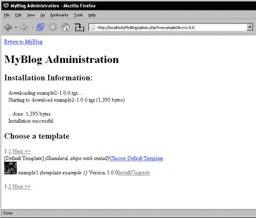

# 第六章。嵌入 PEAR 安装程序：设计自定义插件系统

到目前为止，使用`pear`和`pecl`命令以及现有的 PEAR 软件所能做的几乎所有事情都已经揭晓。在前一章中，我们学习了如何设置自定义 PEAR 频道，完成了掌握 PEAR 安装程序使用的任务。现在，既然我们可以征服 PEAR 的宇宙，让我们进一步看看，如何使用 PEAR 安装程序解决基于网络的框架的一些最常见问题。

在本章中，我们将为假博客应用程序**MyBlog**设计一个自定义插件系统。对于 MyBlog，我们将设计一个插件系统来管理模板，并使用 PEAR 安装程序来管理查询远程服务器模板的细节，处理版本之间的依赖关系，以及执行实际的安装过程。此外，它将使用远程服务器上 REST 的扩展来存储模板的缩略图，以帮助选择模板。当然，由于这是一个假博客，缩略图是猫的图片，但对于真实博客来说，它们将是模板的截图。

对于那些不想逐个字符输入的用户，MyBlog 的代码可以从 Packt 网站直接下载，或者通过直接使用 PEAR 安装程序（一种有趣的方式）进行安装，具体方法如下：

```php
pear channel-discover pear.chiaraquartet.net
pear install MyBlog
pear run-scripts chiara/MyBlog

```

虽然有点丑陋（我从未声称自己是设计师），以下是我们的假 MyBlog 应用程序的管理页面，展示了从远程服务器拉取的图片和分页：


这是点击第二个模板进行安装后的安装过程截图：



# 为什么嵌入 PEAR？

在许多情况下，PHP 应用程序是像内容管理系统（CMS）或其他可扩展的自定义框架这样的网络应用程序。不可避免地，在某个时候，最终用户会想：“如果只需点击就能自动下载和安装我想要的功能，那不是很好吗？”

在此阶段，要求用户使用 PEAR 安装程序安装额外功能可能会更简单，但如果我们不希望我们的应用程序用户必须学习如何使用 PEAR 怎么办？下载您的 CMS 或框架（让我们称它为 XYZ 框架）的用户已经有很多关于框架设计、如何定制和使用它来创建内容要学习。他们最不想学习的是一些外部工具，只是为了安装一个特殊的投票插件或一个新的模板。

我们真正需要的是一个简单的 XYZ 框架管理部分的页面，允许用户浏览插件，并点击一个进行安装，无需担心细节。更好的是，允许高级用户自定义用于下载的远程服务器，无论是安装实验性插件，等等。

换句话说，我们需要将 PEAR 安装器直接嵌入到 XYZ 框架中，并使用它来处理查询远程服务器、检索插件以及执行实际的安装/升级过程。

## 简化安装的用户选择

嵌入 PEAR 安装器使得可以专注于应用程序的重要部分：易用性和为用户提供的特性。您最不希望的事情就是用户因为您在重造内部结构上浪费了太多时间，而没有足够的时间在视觉和逻辑布局上。

依赖 PEAR 安装器将为优化插件页面的外观和流程提供更多时间，并允许创建简单的“点击此处安装”链接，这些链接将正确下载适合当前 PHP 版本、框架版本和请求的稳定性级别的正确插件。

## 消除错误的可能性

总是避免重造轮子的冲动，这可以减少应用程序的复杂性，使得引入错误的几率大大降低，同时节省时间和未来的努力。可以信赖 PEAR 的健壮测试套件和庞大的用户群体，以确保 PEAR 安装器的稳定性，让您可以专注于自己的代码的健壮性。

# 其他插件系统

在深入之前，让我们看看其他打包插件的可能性。目前，主要 PHP 应用程序采用了三种模型：

+   直接在源代码中打包插件

+   使用子包的 PEAR 依赖

+   定制的远程插件服务器

## 直接在源代码中打包插件

在 PHP 世界中，最常用的解决方案是将插件直接打包在源代码中。这种方法，如前几章所探讨的，结果是可以创建更简单的代码，但维护起来却困难得多，尤其是升级，往往导致代码过时。正如最近在流行程序中发现的网络安全漏洞所证明的，保持代码更新和没有错误不仅对微小的烦恼很重要；它可能是一个安全和不安全应用程序之间的区别。

虽然这是最常见的选择，但将插件直接打包在源代码中并不是一个非常灵活的想法，所以我们不会深入探讨这个想法。

## 子包 - PEAR 依赖

使用 PEAR 安装程序的依赖关系管理功能是捆绑插件的其他方法，这种方法在 `pear.php.net` 上开始获得动力。这种方法最初是由我在维护 phpDocumentor 的工作中提出的。我注意到，在实现 phpDocumentor 的新模板或新转换器时，这通常意味着即使只是对模板或转换器进行了小的更改，也需要整个 phpDocumentor 包的点发布。虽然频繁发布并不一定是一件坏事，但提供良好的理由让用户升级是很重要的。在这种情况下，这意味着在包含小更改的发布和推迟发布之间做出选择。

此外，当引入了新的实验性转换器，如 PDF 转换器时，转换器的稳定性只能记录为不太稳定。用户经常对为什么一个不稳定的转换器会与稳定的 phpDocumentor 一起发布感到困惑。

所有这些问题都指向了需要一种更好的方式来处理应用程序的子部分。答案以子包的形式出现。子包是离散的 PEAR 包，它们定义了大型应用程序与较小应用程序部分之间的父子关系。

### 小贴士

子包是应用程序的一个自包含部分，没有父应用程序就无法工作；例如，**MDB2_mysqli** 子包属于 **MDB2** 包。如果安装了 MDB2_mysqli 包，MDB2 可以处理 MySQL 4.1 及以上版本的 mysqli 驱动程序连接。MDB2_mysqli 不能独立工作，需要 MDB2 才能发挥作用。因此，MDB2_mysqli 是 MDB2 的子包。

### 案例研究：MDB2

第一个利用这一想法的包是 MDB2 包 ([`pear.php.net/MDB2`](http://pear.php.net/MDB2))，由 Lukas Smith 和 Lorenzo Alberton 设计，旨在取代 Smith、Alberton 设计的 MDB 包，并受到 Manuel Lemos 创建的 Metabase 的启发。

MDB2 是一个数据库抽象层，其核心功能包含在基本的 MDB2 包中。每个特定的数据库都通过一个驱动包来访问。例如，mysqli 驱动是通过 MDB2_Driver_mysqli 包来访问的。与像 DB 这样的流行数据库抽象包不同，MDB2 已经将这些驱动程序分离出来，以便每个驱动程序可以单独维护。

每个驱动程序封装了一个数据库的功能，因此，子包是：

+   MDB2_Driver_mssql ([`pear.php.net/MDB2_Driver_mssql`](http://pear.php.net/MDB2_Driver_mssql))

+   MDB2_Driver_sqlite ([`pear.php.net/MDB2_Driver_sqlite`](http://pear.php.net/MDB2_Driver_sqlite))

+   MDB2_Driver_querysim ([`pear.php.net/MDB2_Driver_querysim`](http://pear.php.net/MDB2_Driver_querysim))

+   MDB2_Driver_pgsql ([`pear.php.net/MDB2_Driver_pgsql`](http://pear.php.net/MDB2_Driver_pgsql))

+   MDB2_Driver_oci8 ([`pear.php.net/MDB2_Driver_oci8`](http://pear.php.net/MDB2_Driver_oci8))

+   MDB2_Driver_mysqli ([`pear.php.net/MDB2_Driver_mysqli`](http://pear.php.net/MDB2_Driver_mysqli))

+   MDB2_Driver_mysql ([`pear.php.net/MDB2_Driver_mysql`](http://pear.php.net/MDB2_Driver_mysql))

+   MDB2_Driver_ibase ([`pear.php.net/MDB2_Driver_ibase`](http://pear.php.net/MDB2_Driver_ibase))

+   MDB2_Driver_fbsql ([`pear.php.net/MDB2_Driver_fbsql`](http://pear.php.net/MDB2_Driver_fbsql))

每个驱动程序都有自己的版本、稳定性和更重要的是，对所需数据库驱动程序的依赖。

DB 包之前使用的旧模型使得无法指定对数据库扩展的依赖。换句话说，要为每个驱动程序要求所需的扩展，就意味着对 mssql、sqlite、pgsql、oci8、mysqli、mysql、ibase 和 fbsql PHP 扩展的依赖。这不仅会强制在`php.ini`中加载不必要的数据库扩展，还可能导致数据库扩展之间的潜在冲突。

此外，如果引入了新的驱动程序，数据库包（稳定版）的稳定性会自动过滤到扩展。为了解决这个问题，DB 在文档中使用一个文本文件来描述每个驱动程序的稳定性，并使用表格来呈现。这些信息在安装时不会显示。如果为 MDB2 引入了新的驱动程序，即使 MDB2 是稳定的，它也可能具有`devel`或`alpha`的稳定性。还有益的是，可以独立于父 MDB2 包发布驱动程序的新版本。每次对 DB 驱动程序进行更改时，都必须发布包含所有其他驱动程序的整个 DB 包。

MDB2 方法有一些缺点。首先，为了安装 MDB2，需要两个步骤：

```php
$ pear install MDB2
$ pear install MDB2_Driver_pgsql 

```

这需要知道如何使用 pear 命令行以及驱动程序的名字。一个常见的错误（我自己也犯过）是输入：

```php
$ pear install MDB2
$ pear install MDB2_pgsql 

```

当然，这会导致一个非常不友好的错误信息：

```php
$ pear install MDB2_pgsql
No releases available for package "pear.php.net/MDB2_pgsql"
Cannot initialize 'MDB2_pgsql', invalid or missing package file
Package "Mdb2_pgsql" is not valid
Install failed 

```

此外，卸载也需要相同的两个步骤，或者在命令行上传递两个包：

```php
$ pear uninstall MDB2 MDB2_Driver_pgsql 

```

然而，当使用`package.xml`版本 2.0（截至本章编写时，MDB2 仍然使用原始的 1.0 版本实现）时，实现子包模型有更好的方法。如果 MDB2 为每个驱动程序定义安装组，这将使用户能够安装 MDB2 和适当的数据库。例如，考虑在`package.xml`中的这种方法：

```php
<dependencies>
...
...
<group name="mssql" hint="Microsoft SQL Server driver">
<package>
<name>MDB2_Driver_mssql</name>
<channel>pear.php.net</channel>
</package>
</group>
<group name="sqlite" hint="SQLite driver">
<package>
<name>MDB2_Driver_sqlite</name>
<channel>pear.php.net</channel>
</package>
</group>
<group name="querysim" hint="Query Simulator driver">
<package>
<name>MDB2_Driver_querysim</name>
<channel>pear.php.net</channel>
</package>
</group>
<group name="pgsql" hint="Postgresql driver">
<package>
<name>MDB2_Driver_pgsql</name>
<channel>pear.php.net</channel>
</package>
</group>
<group name="oci8" hint="Oracle 8 driver">
<package>
<name>MDB2_Driver_oci8</name>
<channel>pear.php.net</channel>
</package>
</group>
<group name="mysqli" hint="MySQL 4.1+ driver">
<package>
<name>MDB2_Driver_mysqli</name>
<channel>pear.php.net</channel>
</package>
</group>
<group name="mysql" hint="MySQL 4.0- driver">
<package>
<name>MDB2_Driver_mysql</name>
<channel>pear.php.net</channel>
</package>
</group>
<group name="ibase" hint="Interbase driver">
<package>
<name>MDB2_Driver_ibase</name>
<channel>pear.php.net</channel>
</package>
</group>
<group name="fbsql" hint="Firebird driver">
<package>
<name>MDB2_Driver_fbsql</name>
<channel>pear.php.net</channel>
</package>
</group>
<group name="all" hint="all drivers [for uninstall]">
<package>
<name>MDB2_Driver_fbsql</name>
<channel>pear.php.net</channel>
</package>
<package>
<name>MDB2_Driver_ibase</name>
<channel>pear.php.net</channel>
</package>
<package>
<name>MDB2_Driver_mysql</name>
<channel>pear.php.net</channel>
</package>
<package>
<name>MDB2_Driver_mysqli</name>
<channel>pear.php.net</channel>
</package>
<package>
<name>MDB2_Driver_oci8</name>
<channel>pear.php.net</channel>
</package>
<package>
<name>MDB2_Driver_pgsql</name>
<channel>pear.php.net</channel>
</package>
<package>
<name>MDB2_Driver_querysim</name>
<channel>pear.php.net</channel>
</package>
<package>
<name>MDB2_Driver_sqlite</name>
<channel>pear.php.net</channel>
</package>
<package>
<name>MDB2_Driver_mssql</name>
<channel>pear.php.net</channel>
</package>
</group>
</dependencies>

```

这个`package.xml`将为用户提供更多的灵活性。在安装时，用户会看到：

```php
$ pear install MDB2
Install ok: channel://pear.php.net/MDB2-2.2.0
MDB2: Optional feature mssql available (Microsoft SQL Server driver)
MDB2: Optional feature sqlite available (SQLite driver)
MDB2: Optional feature querysim available (Query Simulator driver)
MDB2: Optional feature pgsql available (Postgresql driver)
MDB2: Optional feature oci8 available (Oracle 8 driver)
MDB2: Optional feature mysqli available (MySQL 4.1+ driver)
MDB2: Optional feature mysql available (MySQL 4.0- driver)
MDB2: Optional feature ibase available (Interbase driver)
MDB2: Optional feature fbsql available (Firebird driver)
MDB2: Optional feature all available (all drivers [for uninstall]) 

```

为了安装具有 mysqli 支持的 MDB2，用户只需输入：

```php
$ pear install MDB2#mysqli 

```

然后，将下载并安装 MDB2_Driver_mysqli 包。更好的是，如果在某个时间点需要卸载 MDB2，可以使用单个命令安装 MDB2 及其所有驱动程序：

```php
$ pear uninstall MDB2#all 

```

这种方法的缺点是，在安装或升级 MDB2 时输出的信息相当冗长，可能会使得难以注意到一个意外的错误或警告。此外，如果发布了新的驱动程序，必须将其添加到 `package.xml` 中，以便使便捷的功能可用。另一方面，这也可以是一个区分推荐和实验性驱动程序的好方法。

简而言之，这种方法非常适合探索。

## 定制插件系统：远程服务器

MDB2 使用的分包方法的缺点是，MDB2 的最终用户必须对 PEAR 安装程序有实际的理解，才能正确安装驱动程序。这对那些期望在一个地方管理并使用应用程序的图形化用户来说可能是一个重大的障碍。例如，博客作者期望能够专注于创作和与博客相关的任务。很少有博客作者愿意花时间去研究像 PEAR 安装程序这样的微妙而强大的安装系统的复杂性。

相反，他们希望能够自定义博客的外观和感觉，随意添加或删除博客的功能组件，并且这一切都可以从用于博客的相同视觉界面中完成。

如果你的应用程序适合于类似的一站式解决方案（并且大多数基于网络的程序都符合这种模式），你将希望考虑一种远程管理插件和/或模板的方法。为了做到这一点，你的应用程序需要具备三个抽象组件：

+   应用程序插件管理器

+   远程插件服务器

+   插件下载/安装器

如果你注意到了前四章的内容，你可能会注意到这种相似性与 PEAR 安装程序的目标非常相似。将一个 PEAR Channel Server（参见 第五章）。Serendipity 博客是一个易于安装、高度可配置的基于 PHP 的博客程序，它非常稳定且功能丰富。此外，它比大多数基于 PHP 的博客软件更早地完全支持 PHP 5 和最新的数据库扩展，并且最近刚刚达到了 1.0 版本的里程碑。Serendipity 是在 BSD 许可证下授权的。

### 案例研究：Serendipity 博客的 Spartacus 插件管理器

Serendipity 博客通过使用一个名为**Spartacus**的专业插件来管理插件。Spartacus 设计成与任何其他 Serendipity 插件以相同的方式工作，但具有查询受信任服务器中 Serendipity 博客的插件和模板列表的能力，并允许用户轻松下载和/或升级插件。


Serendipity 插件的架构由位于特殊位置的单一 PHP 文件组成。每个插件都位于一个单独的目录中，该目录可能包含多个附加文件。因此，Spartacus 插件由`serendipity_event_spartacus.php`文件和用于插件中使用的文本提示的不同语言翻译组成。

在`serendipity_event_spartacus.php`文件中，有一个包含多个不同方法的单个类。这些方法可以大致分为几个简单的类别：

+   如`microtime_float()`之类的实用方法，它解决了 PHP 版本 5.0.0 之前 PHP 内部`microtime()`函数的不足。

+   通用插件方法，适用于每个插件，用于插件名称/作者、Serendipity 事件钩入、配置变量等的检查。

+   处理关于插件和模板的远程元数据的 XML 操作方法。

+   安装和卸载插件及模板的文件管理方法。

+   基于 PEAR 的**HTTP_Request**包的远程 HTTP 下载方法。

+   存储下载的插件信息的数据缓存方法。

+   构建插件列表的方法。

+   构建模板列表和下载预览缩略图的方法。

即使拥有所有这些功能，整个插件文件（包含注释）也有 805 行。

Spartacus 背后的基本设计是从受信任的服务器获取描述性 XML 文件（基本上是一个 REST 服务），从文件中解析有关插件或模板的信息，将其格式化为 Serendipity 显示插件所需的形式，然后从 Serendipity 的事件钩子处理用户请求，下载/安装插件和模板。

为了下载插件，Serendipity 使用了一个简单但不够灵活的系统，该系统基于静态 URL。构建插件元数据的 URL 的方式如下：

```php
switch($type) {
// Sanitize to not fetch other URLs
default:
case 'event':
$url_type = 'event';
$i18n = true;
break;
case 'sidebar':
$url_type = 'sidebar';
$i18n = true;
break;
case 'template':
$url_type = 'template';
$i18n = false;
break;
}
if (!$i18n) {
$lang = '';
} elseif
(isset($serendipity['languages'][$serendipity['lang']])) {
$lang = '_' . $serendipity['lang'];
} else {
$lang = '_en';
}
$mirrors = $this->getMirrors('xml', true);
$mirror = $mirrors[$this->get_config('mirror_xml', 0)];
$url = $mirror . '/package_' . $url_type . $lang . '.xml';

```

然后，`$url`用于下载实际的元数据。

显示元数据需要检查插件是否已经安装：

```php
if (in_array($data['class_name'], $plugins)) {
$infoplugin =&
serendipity_plugin_api::load_plugin($data['class_name']);
if (is_object($infoplugin)) {
$bag = new serendipity_property_bag;
$infoplugin->introspect($bag);
if ($bag->get('version') == $data['version']) {
$installable = false;
} elseif (version_compare($bag->get('version'),
$data['version'], '<')) {
$data['upgradable'] = true; 
$data['upgrade_version'] = $data['version'];
$data['version'] = $bag->get('version');
$upgradeLink =
'&amp;serendipity[spartacus_upgrade]=true';
}
}
}

```

注意突出显示的条目，这些条目显示了插件是否可以升级的基本测试。这用于决定插件是否可点击（可安装/升级）。

一旦用户决定下载插件，Spartacus 将遍历插件元数据中的文件列表，并使用静态 URL 和 ViewCVS 技巧（如下例所示）逐个下载它们。以下是代码：

```php
foreach($files AS $file) {
$url = $mirror . '/' . $sfloc . '/' .
$file . '?rev=1.9999'; 
$target = $pdir . $file;
@mkdir($pdir . $plugin_to_install);
$this->fetchfile($url, $target);
if (!isset($baseDir)) {
$baseDirs = explode('/', $file);
$baseDir = $baseDirs[0];
}
}

```

这个 ViewCVS 技巧（检索修订版 1.9999）是一种非常简单的方法来检索要安装的正确版本的文件，但它并不提供太多的灵活性，并且需要在服务器上严格控制修订版本——一个错误就会使整个插件甚至我们个人 Serendipity 博客的本地安装崩溃。

因此，Serendipity 的开发者已在页面顶部放置了一个待办事项笔记，其中包含一些关于 Spartacus 下一个实现版本以解决这些问题的想法：

```php
/************
TODO:
- Perform Serendipity version checks to only install plugins
available for version
- Allow fetching files from mirrors / different locations -
don't use ViewCVS hack (revision 1.999 dumbness)
***********/

```

这两个都是难以解决的问题。要解决第一个，我们需要能够进行一些相对复杂的依赖验证，并且有能力遍历插件的可用版本，直到找到一个可以与当前 Serendipity 版本一起工作的版本。第二个也需要一些复杂的服务器/客户端通信，并且可能会在 Spartacus 的开发过程中给 Serendipity 增加显著的冗余。

幸运的是，有一个解决方案。PEAR 安装器专门设计来处理比 Serendipity 的 Spartacus 插件试图解决的问题更为复杂的情况，并且可以以惊人的最小努力嵌入到应用程序中。

### 案例研究：Seagull 框架的嵌入式 PEAR 安装器

**Seagull 框架**（[`www.seagullproject.org/`](http://www.seagullproject.org/））是一个基于网络的示例，它采取了极简的方法来嵌入

PEAR 安装器。与 Serendipity 不同，Seagull 更像是一个通用框架，旨在使构建其他事物变得容易。Seagull 提供了粘合剂以及许多方便的 buzzword-friendly 理念，以供您在开发中享受，例如在 PHP 中实现的软件模式（前端控制器、观察者、服务定位器、任务运行器、向导等），以及如 HtmlRenderer、UrlParser 和 Emailer.php 之类的实用类。快速浏览[http://trac.seagullproject.org/browser/trunk/lib/SGL](http://trac.seagullproject.org/browser/trunk/lib/SGL)可以看到可用的全部功能范围。

与 phpDocumentor 一样，Seagull 也提供了一站式解压即用的 zip 文件，或者可以通过 PEAR 安装器进行安装。同样，与 phpDocumentor 一样，通过 PEAR 安装器安装或升级时，所需的配置较少。

此外，Seagull 的大部分工作基于从[`pear.php.net`](http://pear.php.net)可获得的现有 PEAR 包的基础。Seagull 使用了一系列的 PEAR 包。以下是一些依赖性的样本：

+   归档 Tar

+   缓存 Lite

+   配置

+   日期

+   数据库

+   数据库数据对象

+   数据库嵌套集合

+   文件

+   HTML 公共部分

+   HTML 树菜单

+   HTML 快速表单

+   HTML 模板 Flexy

+   HTTP 头部

+   HTTP 下载

+   日志

+   邮件 MIME

+   网络套接字

+   网络用户代理检测

+   分页器

+   文本密码

+   翻译 2

+   验证

+   XML 解析器

+   XML 实用工具

哇！

此外，Seagull 利用来自 `pearified.com` 频道的 **Role_Web** 包，使得安装和升级变得一站式服务。

管理所有这些 PEAR 依赖项可能真的会让人头疼，尤其是当用户安装 Seagull 期望只使用 Seagull 时。当他们发现需要使用 PEAR 安装器来管理 Seagull 的依赖项时，这会使得问题更加复杂。

因此，Seagull 的创造者 Demian Turner 开发了第一个实验性的将 PEAR 安装器嵌入到 Seagull 中的实例。这种嵌入仅适用于 Seagull 的最新版本，并且被认为是 alpha 级代码质量，但非常值得研究其代码所采用的原理。以下是实际的 Seagull PEAR 管理器的截图：


在 `modules/default/classes/PearMgr.php` 文件中，Seagull 的 PEAR 管理器提供了一个定制的基于 Web 的前端，用于列出任何 PEAR 频道的包、安装和升级。

### 小贴士

**PearMgr.php 的位置**

Seagull 利用 `package.xml` 版本 2.0 的子包功能，将其庞大的代码库分为一个基础包和三个子包。`PearMgr.php` 文件位于 `pear.phpkitchen.com/Seagull_Default` 包中，该包在安装 Seagull 时默认需要和自动安装。从 SourceForge 安装源代码的用户将获得一个包含所有文件的单一压缩文件。

Seagull 使用了来自 `pear.php.net` 的 **PEAR_Frontend_Web** 包的定制版本（更改了一行，模板不同），以及 `PearMgr.php` 来管理 PEAR 的安装/升级。Seagull 还向 PEAR 安装器添加了七个命令：`sgl-clear-cache, sgl-download, sgl-list-all, sgl-list-upgrades, sgl-remote-info` 和 `sgl-search`。这些命令再次以 PEAR 等价物的几乎完全相同的方式实现，除了它们移除了所有对 `outputData()` 方法的调用，这一点我们将在稍后的文本中讨论。

`PearMgr.php` 中的代码大约有 200 行。因此，在 Serendipity 的 Spartacus 长度的四分之一内，Seagull 实现了一个功能齐全的远程插件安装器，也可以用来升级 Seagull 本身！

让我们看看用于确定哪些频道可以使用的代码：

```php
$this->aChannels = array(
'pear.phpkitchen.com' => 'Seagull',
'pear.php.net' => 'PEAR',
'pearified.com' => 'Pearified',
);

```

与斯巴达克斯一样，服务器是硬编码的。然而，与斯巴达克斯不同，如果这些频道中的任何一个在未来任何时候添加一个镜像，PEAR 将会负责更新这些信息，并且镜像将自动对用户可用。

实际的包下载/安装/升级管理全部使用 PEAR 的抽象命令接口：

```php
switch ($input->command) {
Seagull FrameworkPEAR's abstract command interfacecase 'sgl-list-all':
if ($serialized = $cache->get($cacheId, 'pear')) {
$data = unserialize($serialized);
SGL::logMessage('pear data from cache',
PEAR_LOG_DEBUG);
} else {
$cmd = PEAR_Command::factory($input->command,
$config);
$data = $cmd->run($input->command, $opts, $params); 
$serialized = serialize($data);
$cache->save($serialized, $cacheId, 'pear');
SGL::logMessage('pear data from REST call',
PEAR_LOG_DEBUG);
}
break;
case 'sgl-install':
case 'sgl-uninstall':
case 'sgl-upgrade':
$params = array($input->pkg);
ob_start();
$cmd = PEAR_Command::factory($input->command, $config);
$ok = $cmd->run($input->command, $opts, $params); 
$pearOutput = ob_get_contents();
ob_end_clean();
if ($ok) {
$this->_redirectToDefault($input, $output);
} else {
print '<pre>';print_r($ok);
}
break;
}

```

在示例中突出显示了 PEAR 特定的代码。列出包的整个复杂性仅用两行代码就解决了。安装、卸载和升级也是如此。

对于捕获 PEAR 命令的信息输出，存在一种相当奇怪的输出缓冲使用方式。这似乎是必要的，因为如果允许选择，PEAR 会输出信息到屏幕，但实际上可以在不使用黑客手段的情况下捕获这种输出。为了捍卫 Seagull 开发者，我无法想象比他们试图做的更前沿的代码了，而且他们没有这本书的帮助也做到了！

捕获 PEAR 安装过程输出的关键是注册一个前端对象。下面的代码展示了正确完成此类任务的一个示例：

```php
require_once 'PEAR/Frontend.php';
class CaptureStuff extends PEAR_Frontend
{
public $data = array();
function log($msg)
{
$this->data[] = array('log' => $msg);
}
function outputData($data, $command = '_default')
{
$this->data[] = array('outputData' => array($data,
$command));
}
function userConfirm()
{
// needed to satisfy interface contract PHP4-style
}
}
$capture = new CaptureStuff;
PEAR_Frontend::setFrontendObject($capture);
// $config is a PEAR_Config object
$cmd = PEAR_Command::factory($command, $config);
$cmd->run($command, array(), $params);

```

到目前为止，`$capture->data`数组包含了所有通常由 PEAR 安装器按顺序显示的信息，并且可以被忽略或以适当的方式显示。

现在我们已经看到了嵌入 PEAR 安装器的示例，现在是时候展示我们的特性了：设计一个定制的基于 PEAR 通道的插件系统，充分利用 PEAR 安装器的可定制性。

# 设计基于自定义 PEAR 通道的插件系统

对于这个系统，我们将设计一个模板安装器，用于虚构的博客程序"MyBlog"。在我们查看代码之前，理解问题很重要。以下是 MyBlog 模板系统的要求：

+   模板需要与它们关联缩略图，用户可以使用这些缩略图来直观地预览模板。

+   模板必须列出而不需要滚动（分页结果）。

+   必须能够将新模板标记为实验性。

+   模板必须与它们打算使用的 MyBlog 版本相匹配。

+   任何不符合博客用户需求的模板都不应该在模板列表中显示，例如过于实验性或与当前版本的 MyBlog 不兼容的模板。

+   模板必须只能从一组离散的受信任服务器远程安装。

+   模板还应可以从本地下载的模板中安装。

+   插件管理器应在 PHP 5.0.0 及更高版本中工作。当然，PEAR 与 PHP 4.2.0 及更高版本兼容，但让我们假设 MyBlog 旨在利用 PHP 5 版本中的一些新特性。将此代码移植到与 PHP 4 兼容是一个简单的任务，它将涉及替换一些关键字，并使用 PEAR_Error 而不是异常；这是一个留给读者的练习。

在满足所有这些要求的情况下，我们将需要利用`channel.xml`指定自定义网络服务的能力，在这种情况下是一个额外的 REST 协议用于模板缩略图。此外，我们还需要实现一个自定义的远程模板列表，能够过滤掉与当前版本的 MyBlog 不兼容的模板，并且可以根据稳定性进行过滤。其余的要求可以通过现有的 PEAR 功能轻松处理。

在本节中，我们将实现 PEAR 特定的代码。因此，我们不会从 MyBlog 程序中制作出下一个酷炫的 CMS，也不会实现服务器端模板缩略图上传器，因为这是一个常见的任务，使用 PHP 实现起来非常简单。

为了实现所需的任务，我们将创建一个负责从远程服务器下载和处理 REST 的类，一个负责组织和分页模板的类，以及一个负责下载和安装模板的类。在这种情况下，一旦模板安装完成，就没有必要直接卸载，一旦理解了基本原理，实现这一点就相当简单。我们的模板切换器只需在必要时安装或升级。

## 重新使用现有功能

在这个例子中，我们将充分利用 `PEAR_REST` 类、`PEAR_Downloader` 和 `PEAR_Installer` 类，以及 `PEAR_Config/PEAR_Registry` 内部类。重用组件是这种方法的主要优势，当然也是 PEAR 存储库的主要目的。这一点的重要性不容忽视，对于减少初始开发时间和调试的痛苦都至关重要。

在重用代码时，重要的是要验证围绕代码的用户社区的稳定性和健壮性。当然，PEAR 安装程序有一个广泛的测试套件，以及一个庞大的用户基础和来自全球的众多经验丰富且投入的开发者核心，他们致力于维护和改进这个包。

让我们看看我们将使用的 PEAR 包中的类。

### PEAR 安装程序基础设施：REST 和 PEAR 安装程序类

PEAR 安装程序主要由几个类组成。对于我们模板插件系统需要理解的是以下这些类：

+   PEAR_Config

+   PEAR_Dependency2

+   PEAR_REST

+   PEAR_REST_11

+   PEAR_REST_10

+   PEAR_Downloader

+   PEAR_Downloader_Package

+   PEAR_Installer

这些多功能类的复杂性可能相当令人畏惧；因此，让我们退一步，看看我们实际上需要从每个类中得到什么。

#### PEAR_Config

`PEAR_Config` 类用于管理 PEAR 安装程序的基本配置问题。因此，它被设计成可以轻松检索相关的内部包注册表、REST 对象以及我们实际上不需要关心的各种其他功能。

对于我们的目的，我们实际上只需要了解 `PEAR_Config` 对象在 PEAR 安装程序中使用时的三个要点：

+   `PEAR_Config` 对象通常由安装程序作为单例使用。

+   `get()` 方法用于检索配置值。

+   `set()` 方法用于在内存中设置配置值，除非使用 `writeConfigFile()` 保存值，否则不会影响磁盘上的配置文件。

当 PEAR 安装程序初始化时，会调用`PEAR_Config::singleton()`方法，并使用默认值。如果这些值没有设置到正确的位置，那么我们的模板插件系统将保存模板到全局 PEAR 位置。在某些情况下，这很好，因为应用程序设计为在系统上下文中工作。

如果你的应用程序使用的是应用程序内部的插件本地安装，那么在执行安装任务之前，你需要设置所有配置值。Seagull 框架是一个需要设置配置值及其设置方法的优秀示例，这种方法是最佳实践。以下是具体方法：

```php
$conf = &PEAR_Config::singleton();
$conf->set('default_channel', 'pear.php.net');
$conf->set('doc_dir', SGL_TMP_DIR);
$conf->set('php_dir', SGL_LIB_PEAR_DIR);
$conf->set('web_dir', SGL_WEB_ROOT);
$conf->set('cache_dir', SGL_TMP_DIR);
$conf->set('data_dir', SGL_TMP_DIR);
$conf->set('test_dir', SGL_TMP_DIR);
$conf->set('preferred_state', 'devel');

```

至少，你需要将所有`_dir`配置值（`bin_dir, doc_dir, ext_dir, php_dir, cache_dir, data_dir, download_dir, temp_dir`，以及从 PEAR 1.4.10 开始的`test_dir`）设置为有效值。`preferred_state`变量应该设置为`stable`，除非用户期望能够安装实验性模板，那么应该使用`beta, alpha`或`devel`之一。

我们还将使用低级注册表来确定模板包是否已经安装，类似于 Serendipity 的 Spartacus 插件所使用的方法：

```php
$reg = $this->_config->getRegistry();
// default channel is set to the template channel
$existing = $reg->packageInfo($template, 'version',
$this->_config->get('default_channel'));
if (version_compare($existing, $version) === 0) {
// installed already
$this->log('Template set as active template');
return true;
}

```

在我们的示例中，我们检索当前安装的模板版本，并作为一个理智的检查，确保我们不是试图安装当前已安装的版本。

应该注意的是，可能需要允许用户强制重新安装。如果是这种情况，代码应该修改为，如果版本相同，将`force`选项传递给安装。关于安装选项的内容将在后面的`PEAR_Installer`部分进行讨论。

#### PEAR_Dependency2

`PEAR_Dependency2`类是一个简单的实用工具类，由 PEAR 安装程序用于验证`package.xml`依赖项与系统上的所有变量。这是一个低级类，实际上期望其输入是直接从`package.xml`中的未序列化 XML 依赖项。

换句话说，以下是你试图验证的依赖项：

```php
<required>
<package>
<name>Blah</name>
<channel>foo.example.com</channel>
<min>1.2.3</min>
</package>

```

`PEAR_Dependency2`期望代表依赖的变量包含以下数组：

```php
array(
'name' => 'Blah',
'channel' => 'foo.example.com',
'min' => '1.2.3');

```

对于我们的应用程序，我们对`PEAR_Dependency2`类的唯一用途是验证对父 MyBlog 应用程序的依赖。我们需要确保模板实际上与当前的 MyBlog 版本兼容。因此，我们唯一需要验证的依赖是 MyBlog 包上的所需包依赖。

这大大简化了 `PEAR_Dependency2` 的使用，我们只需要了解如何用它来验证包依赖。用于此任务的方法被称为 `validatePackageDependency()`，正如人们所期望的那样。该方法签名期望依赖数组如我们上面的示例，一个表示依赖是否必需或可选的布尔值，以及一个包含所有将在此次迭代中尝试安装的包的列表的数组。

第三个参数与我们的任务无关，因为一次只会安装一个模板，所以我们总是为这个参数传递一个空数组。

在 PHP 代码中，我们使用的签名将类似于：

```php
$e = $d2->validatePackageDependency($pdep, true, array());

```

与 `PEAR_Dependency2` 的所有验证方法一样，`validatePackageDependency()` 返回 `true`、一个数组或一个 `PEAR_Error` 对象。在成功时返回 `true`，如果存在不使依赖无效的警告，则返回包含错误信息的数组，如果依赖验证失败，则返回一个 `PEAR_Error` 对象。

由于 PEAR 的错误处理允许注册回调，因此在调用依赖验证时禁用任何回调非常重要，因此我们的总代码如下：

```php
PEAR::staticPushErrorHandling(PEAR_ERROR_RETURN);
$e = $d2->validatePackageDependency($pdep, true, array());
PEAR::staticPopErrorHandling();
if (PEAR::isError($e)) {
// skip any template releases that cannot work
// with the current version of MyBlog
continue 2;
}

```

上述代码告诉 PEAR 简单地返回 `PEAR_Error` 对象，暂时忽略用户指定的任何特殊处理，尝试验证依赖，如果验证失败，则跳过此模板的发布。

我们如何从依赖信息中提取 `$pdep` 变量？答案是半直观的。正如上面的示例依赖被提取到一个与 XML 标签名匹配的数组中，其父标签也是如此。上述依赖的完整数组如下：

```php
array(
'dependencies' => array(
'required' => array(
'package' => array(
'name' => 'Blah',
'channel' => 'foo.example.com',
'min' => '1.2.3' 
)
)
)
);

```

注意，如果我们有多个必需的包依赖项，数组将看起来像：

```php
array(
'dependencies' => array(
'required' => array(
'package' => array(
0 => array(
'name' => 'Blah',
'channel' => 'foo.example.com',
'min' => '1.2.3'),
1 => array(
'name' => 'Dep2',
'channel' => 'foo.example.com',
'min' => '1.2.3'),
) 
)
)
);

```

在这种情况下，包标签实际上是一个数组的数组。我发现处理这个事实的最简单方法是将包元素始终转换为它自己的数组，如果它不包含数字索引。

这里是访问模板所需包依赖项的完整代码：

```php
if (isset($dep['required']) && isset($dep['required']['package'])) {
if (!isset($dep['required']['package'][0])) {
$dep['required']['package'] =
array($dep['required']['package']);
}
foreach ($dep['required']['package'] as $pdep) {
if (!isset($pdep['channel'])) {
// skip uri-based dependencies
continue;
}
if ($pdep['name'] == 'MyBlog' &&
$pdep['channel'] == 'pear.chiaraquartet.net') {
PEAR::staticPushErrorHandling(PEAR_ERROR_RETURN);
$e = $d2->validatePackageDependency($pdep, true,
array());
PEAR::staticPopErrorHandling();
if (PEAR::isError($e)) {
// skip any template releases that cannot work
// with the current version of MyBlog
continue 2;
}
}
}
}

```

注意，我们还可以通过检查依赖中是否存在 `<channel>` 标签来轻松跳过基于静态 URI 的依赖，并相应地跳过它们。

#### PEAR_REST 和 PEAR_REST_10/PEAR_REST_11

`PEAR_REST`类是一个用于下载、解析和缓存远程 REST 文件的通用工具类。它是 PEAR 曾经用于较老 XMLRPC 基于通道的 XML-RPC 类的 REST 等价物。我们将使用这个低级类来检索模板的 PNG 缩略图图像，因此需要了解`retrieveCacheFirst()`方法。此方法首先检查本地缓存，如果存在，则永远不会尝试查询远程服务器。如果文件从未下载过，它将查询服务器以检索它。作为其参数，它只需提供一个要下载的文件的完整 URL，并返回其内容作为字符串。

`retrieveData()`方法采取了不同的方法。如果缓存足够新（默认为 3600 秒），则不查询远程服务器而直接使用。在此之后，使用 HTTP 1.1 查询服务器，并使用 HTTP 缓存来确定是否需要下载。这可以显著减少带宽，因为只有在文件有变化时才会下载文件。

应当注意，XML 文件（由 Content-Type HTTP 头标识）将被`retrieveData()`和`retrieveCacheFirst()`自动解析成数组。

`PEAR_REST_10`和`PEAR_REST_11`实现了 REST1.0 和 REST1.1 PEAR REST 标准，如第五章所述。因此，这些方法实现了从原始 REST 数据中检索有用信息的方式，例如特定软件包的下载信息，或所有当前发布软件包的列表。为了我们的目的，我们需要实现 REST1.1 的`listAll()`方法的修改版，一个能够过滤掉不兼容模板和实验性模板的方法。为了实现这一点，我们将从`PEAR_REST_11`中剪切并粘贴代码，并使用它通过调整检查每个软件包的循环来实现我们的`listTemplates()`方法。

### 小贴士

从`PEAR_REST_11`剪切并粘贴可能看起来是不干净的方法，因为剪切和粘贴通常被纯粹主义者所不齿，但在此情况下，它展示了 REST 设计的一个重要原则。如果 PEAR 仍然使用 XML-RPC，实际上将无法实现我们想要的定制模板列表，因为一些必要的信息已经在服务器端被删除。

REST 模型使数据可用，并期望客户端对数据进行任何过滤。这实际上既更高效又更灵活，可以减少编程时间，并完全消除围绕系统设计时曾经必要的黑客手段。

是的，我们在剪切和粘贴，但代码正在利用一个定义良好、简单的远程 REST 资源系统，因此我们可以确信它将随着标准的演变而继续工作。

在我们的简单实现中，我们需要的基于 REST1.0 的`PEAR_REST_10`类的唯一方法是`getDownloadURL()`方法，以便实现我们的具有限制条件的定制模板下载。`getDownloadURL()`方法的 API 签名有些复杂，因此查看`PEAR_REST_10`类的实际代码和注释是有帮助的：

```php
/**
* Retrieve information about a remote package to be downloaded
* from a REST server
*
* @param string $base The uri to prepend to all REST calls
* @param array $packageinfo an array of format:
* <pre>
* array(
* 'package' => 'packagename',
* 'channel' => 'channelname',
* ['state' => 'alpha' (or valid state),]
* -or-
* ['version' => '1.whatever']
* </pre>
* @param string $prefstate Current preferred_state config
* variable value
* @param bool $installed the installed version of this package
* to compare against
* @return array|false|PEAR_Error see {@link _returnDownloadURL()}
*/
function getDownloadURL($base, $packageinfo, $prefstate, $installed)

```

`getDownloadURL()`要么返回一个`PEAR_Error`，要么返回一个数组。如果包可以成功下载，数组将包含一个关联索引`url`。如果没有发布满足指定的条件，则`url`索引将不存在。因此，我们可以非常简单地使用`getDownloadURL()`方法：

```php
$info = $this->getDownloadURL($this->_restBase,
array('channel' => $this->_channel,
'package' => $templateName,
'version' => $version),
$this->_config->get('preferred_state', null, $this->_channel),
$installed
);
if (PEAR::isError($info)) {
throw new MyBlog_Template_Exception($info->getMessage());
}
if (!isset($info['url'])) {
throw new MyBlog_Template_Exception('Template "' .
$templateName . '" cannot be installed');
}
if (!extension_loaded("zlib")) {
$ext = '.tar';
} else {
$ext = '.tgz';
}
return $info['url'] . $ext;

```

注意，`url`不包含文件扩展名，因为这由 zlib 扩展的存在来决定。如果我们有 zlib，那么我们可以下载压缩版本，节省时间和带宽。否则，将下载并安装未压缩的`.tar`文件。

这基本上是成功利用我们的远程服务器查询所需的所有代码！剩下的唯一任务是实际下载和安装。

#### PEAR_Downloader 和 PEAR_Downloader_Package

从 PEAR 安装程序的角度看，下载不仅仅是一个通过 HTTP 获取 URL 并本地保存其内容的简单任务。PEAR 安装程序智能地根据依赖关系和本地系统下载包的正确版本，并在某些情况下自动下载包依赖项。

`PEAR Downloader`机制理解三种不同的可安装包类型：

+   抽象包名，例如`pear install PEAR`或`pear install PEAR-beta`

+   绝对 URL，例如`pear install` [`pear.example.com/Blah-1.2.3.tgz`](http://pear.example.com/Blah-1.2.3.tgz)

+   本地文件，例如`pear install /path/to/Blah-1.2.3.tgz`

每个实例的处理方式都大不相同。本地包以简单的方式处理，正如人们所期望的那样。首先下载绝对 URL，然后以与本地包相同的方式处理。抽象包的处理方式则完全不同。安装程序在确保所有依赖项都已满足之前不会进行任何下载。这确保了如果复杂应用程序的依赖项未满足，就不会浪费时间和带宽下载大型包文件。

然而，在三种可下载包的每一种中，它们依赖项和包信息处理的方式是相同的。正因为如此，为了避免不必要的代码重复，三种可下载包被抽象为`PEAR_Downloader_Package`类。`PEAR_Downloader`和`PEAR_Installer`中的许多 API 函数期望或返回一个`PEAR_Downloader_Package`对象。

然而，首先要研究和调查的方法是 `PEAR_Downloader` 的 `download()` 方法。此方法期望输入一个简单的字符串数组，每个字符串代表三种可下载软件包形式之一。以下是一个演示所有三种形式的示例：

```php
$downloader->download(array('PEAR-beta',
'http://pear.example.com/Blah-1.2.3.tgz',
'/path/to/Blah-1.2.3.tgz'));

```

可以将选项传递给 `download()` 方法，但必须在创建 `PEAR_Downloader` 对象时指定：

```php
$ui = PEAR_Frontend::singleton();
$config = PEAR_Config::singleton();
$downloader = new PEAR_Downloader($ui, $config,
array('force' => true));

```

可用于 `PEAR_Downloader` 的选项包括 `force, downloadonly, soft, offline, packagingroot, nodeps, pretend, ignore-errors, nocompress, alldeps, onlyreqdeps` 和 `installroot`。换句话说，当执行 `pear help install` 时显示的所有选项都是可用的，加上内部选项 `downloadonly`，该选项由 `pear download` 命令使用。

在设计嵌入式 PEAR 安装程序时，可能感兴趣的主要选项如下：

+   `force:` 这个选项强制安装，即使依赖项无效或软件包已安装。`force` 选项的最佳用法是修复损坏的安装。

+   `offline:` 这个选项阻止了尝试联系远程服务器，在安装设置中可能很有用。

+   `nocompress:` 这个选项指示安装程序下载未压缩的 `.tar` 文件而不是 `.tgz` 文件，当 zlib 扩展不可用时很有用。

+   `nodeps:` 这个选项阻止下载器尝试验证依赖项，或下载必需的软件包依赖项。

+   `pretend:` 这个选项指示下载器仅获取所有将要下载的软件包的列表，并返回该列表，但不进行任何实际下载。这对于向用户显示需要安装或升级的软件包很有用。

+   `alldeps/onlyreqdeps:` 这些选项指示下载器自动下载软件包依赖项。`onlyreqdeps` 选项指示安装程序仅下载必需的依赖项，而 `alldeps` 则下载所有依赖项。`onlyreqdeps` 在 `package.xml` 版本 2.0 中已过时，但对于仍在 `pear.php.net` 使用 `package.xml 1.0` 的许多 PEAR 软件包来说仍然很有用。

`download()` 方法可以返回一个 `PEAR_Error` 对象，或者一个 `array()`。现在事情变得有点棘手。只有在出现严重错误的情况下，例如无法访问本地软件包注册表或某些其他异常情况时，才会返回 `PEAR_Error` 对象。在其他情况下返回一个数组。

换句话说，如果由于每个传入的软件包都未通过依赖项验证而导致下载失败，将返回一个空数组而不是 `PEAR_Error` 对象。另一种思考方式是，`PEAR_Downloader` 足够智能，可以跳过失败的下载并继续进行成功的下载，而不是因为单个软件包依赖于 Gronk_Wzilnk 软件包且不可用而停止整个下载过程。

为了处理多个错误的情况，`PEAR_Downloader` 提供了一个 `getErrorMsgs()` 方法，在下载后应该始终进行检查。此方法实现了一个简单的包含多个错误消息的数组，这些错误消息是在高级 `PEAR_ErrorStack` 类之前出现的（并且顺便提一下，有助于激发其创建）。因此，用于下载的代码看起来应该像这样：

```php
$ui = PEAR_Frontend::singleton();
$config = PEAR_Config::singleton();
$dl = new PEAR_Downloader($this, array('upgrade' => true),
$this->_config);
// download the actual URL to the template
$downloaded = $dl->download(array($info));
if (PEAR::isError($downloaded)) {
throw new MyBlog_Template_Exception($downloaded->getMessage());
}
$errors = $dl->getErrorMsgs();
if (count($errors)) {
$err = array();
foreach ($errors as $error) {
$err[] = $error;
}
if (!count($downloaded)) {
throw new MyBlog_Template_Exception('template "' .
$template . '" installation failed:<br />' .
implode('<br />', $err));
}
}

```

注意，在这个例子中，`$info` 变量应该包含要下载的模板的名称。

#### PEAR_Installer

最后，我们来到了 `PEAR_Installer` 类。这个类非常庞大，包含处理文件事务、基本安装、卸载的代码，总体上非常巨大。`PEAR_Installer` 也是 PEAR 包中最古老的类之一，尽管它在 PEAR 1.4.0 及更高版本中经历了一次严重的减肥手术，但未来版本还将进行进一步的精简。

### 提示

文件事务是 PEAR 安装程序的数据库事务等价物。在安装软件包时，PEAR 安装程序要么完全安装软件包，要么完全回滚安装。在升级时，PEAR 安装程序会备份前一个版本。如果升级过程中出现任何问题，将完全恢复前一个版本。这确保了如果出现错误，软件包不可能处于半安装的悬而未决状态。

在我们安装模板的探索中，需要了解的方法并不令人意外地被命名为 `install()`。由于向后兼容性，`install()` 方法在输入方面相当灵活。可以传递我们本应传递给 `PEAR_Downloader->download()` 的数组，但这会导致安装程序进行大量的猜测，以执行你应该告诉它执行的操作，并且已被弃用。更好的做法是传递 `PEAR_Downloader->downloader()` 返回的数组，并使用一些辅助方法准备安装：

```php
// $templatePackage is the PEAR_Downloader_Package object
// we received from PEAR_Downloader->download()
// $template is the name of the template
$ui = PEAR_Frontend::singleton();
$installer = new PEAR_Installer($ui);
$packages = array($templatePackage);
// always upgrade
$installer->setOptions(array('upgrade' => true));
$installer->sortPackagesForInstall($packages); 
PEAR::staticPushErrorHandling(PEAR_ERROR_RETURN);
$err = $installer->setDownloadedPackages($packages); 
if (PEAR::isError($err)) {
PEAR::staticPopErrorHandling();
throw new MyBlog_Template_Exception($err->getMessage());
}
// always upgrade
$info = $installer->install($templatePackage,
array('upgrade' => true)); 
PEAR::staticPopErrorHandling();
if (PEAR::isError($info)) {
throw new MyBlog_Template_Exception($info->getMessage());
}
if (is_array($info)) {
$this->log('Installation successful');
return true;
} else {
throw new MyBlog_Template_Exception('install of "' . $template .
'" failed');
}

```

上文中特别与安装相关的代码已被突出显示。再次强调，由于 `PEAR_Installer` 类是 PEAR 安装程序包中的一个较老的遗物，我们使用 `PEAR_Downloader` 可以执行的一些操作必须手动完成。例如，应该使用 `setOptions()` 方法设置选项。此外，应该使用 `sortPackagesForInstall()` 方法对软件包进行排序，以确保在安装之前先安装依赖项。由于软件包是通过 `install()` 方法逐个安装的，且不知道其他正在安装的软件包，因此这个系统也有助于确保软件包很少处于安装失败时的危险损坏状态。

在 `install()` 方法之前，应该将已经下载的软件包注册为已下载，这样预安装验证就只执行一次。这必须使用 `setDownloadedPackages()` 方法完成。

现在我们已经对 PEAR 安装器的内部有了实际的理解，让我们看看服务器端。

## 通过自定义信息扩展 REST

为了在服务器上实现缩略图，我们首先需要为服务器实现定制的 REST。让我们看看一个典型的 `channel.xml:`

```php
<?xml version="1.0" encoding="ISO-8859-1" ?>
<channel version="1.0" 

xsi:schemaLocation="http://pear.php.net/dtd/channel-1.0
http://pear.php.net/dtd/channel-1.0.xsd">
<name>pear.chiaraquartet.net/template</name>
<summary>Template example for book</summary>
<suggestedalias>te</suggestedalias>
<servers>
<primary>
<rest>
<baseurl type="REST1.0">
http://pear.chiaraquartet.net/Chiara_PEAR_Server_REST/</baseurl>
<baseurl type="REST1.1">
http://pear.chiaraquartet.net/Chiara_PEAR_Server_REST/</baseurl>
</rest>
</primary>
</servers>
</channel>

```

如果我们要添加对我们自定义缩略图 REST 的支持，我们只需要添加另一个 `<baseurl>` 标签：

```php
<?xml version="1.0" encoding="ISO-8859-1" ?>
<channel version="1.0" 

xsi:schemaLocation="http://pear.php.net/dtd/channel-1.0
http://pear.php.net/dtd/channel-1.0.xsd">
<name>pear.chiaraquartet.net/template</name>
<summary>Template example for book</summary>
<suggestedalias>te</suggestedalias>
<servers>
<primary>
<rest>
<baseurl type="REST1.0">
http://pear.chiaraquartet.net/template/Chiara_PEAR_Server_REST/
</baseurl>
<baseurl type="REST1.1">
http://pear.chiaraquartet.net/template/Chiara_PEAR_Server_REST/
</baseurl>
<baseurl type="MyBlogThumbnail1.0">
http://pear.chiaraquartet.net/template/thumbnails/
</baseurl> 
</rest>
</primary>
</servers>
</channel>

```

在上一个示例中，新的 `baseurl` 被突出显示。这允许我们通过一行代码检索模板缩略图图像：

```php
$thumbnail = $this->_rest->retrieveCacheFirst($this->_thumbnailBase .
$template . '/' . $version . 'thumbnail.png');

```

现在，我们终于有了足够的信息来实际实现我们的模板管理器！

## 设计轻量级安装插件：代码终于来了

对于我们的假 MyBlog，我们将使用这个目录结构：

```php
MyBlog/
Template/
Exceptions.php
Fetcher.php
Interfaces.php
Lister.php
REST.php
Config.php
Main.php
admin.php
index.php
image.php
blogsetup.php

```

PEAR-嵌入发生在 `Template/` 子目录中的文件中。博客通过 `Config.php` 和 `Main.php` 文件以抽象方式实现，实际的网页文件是 `index.php`、`image.php` 和 `admin.php`。我们目前不会关注假 MyBlog 博客的设计。如果你想要玩弄假 MyBlog，你可以按照以下步骤安装它：

```php
$ pear channel-discover pearified.com
$ pear install pearified/Role_Web
$ pear run-scripts pearified/Role_Web
$ pear channel-discover pear.chiaraquartet.net
$ pear up chiara/MyBlog
$ pear run-scripts chiara/MyBlog 

```

### 小贴士

来自 `pear.chiaraquartet.net` 的 MyBlog 包使用了一个在安装后完全没有提示用户的脚本。我们将在稍后更详细地介绍安装后脚本，因为它展示了 PEAR 多样性的另一面。

### MyBlog_Template_IConfig 和 MyBlog_Template_Config

让我们深入探讨；首先，`Interfaces.php:`

```php
<?php
interface MyBlog_Template_IConfig
{
function getTemplateChannel();
function getCurrentTemplate();
}

```

这已经很简单了！这允许灵活性，松散地将嵌入的 PEAR 与模板的配置耦合，并且始终是一个好主意。

接下来，让我们看看异常类，这是复杂性的另一个例子：

```php
<?php
class MyBlog_Template_Exception extends Exception {}
?>

```

好吧，我知道你在想什么：这看起来并不复杂。实际上，你是对的。我只是在开玩笑。现在让我们来点真的；让我们从 MyBlog 包的配置类开始。`getTemplateChannel()` 和

`getCurrentTemplate()` 方法在我们的示例应用程序中只是硬编码的字符串，但让我们看看 `getPearConfig()` 方法：

```php
/**
* Get a customized PEAR_Config object for our blog template system
* @return PEAR_Config
*/
function getPearConfig(){
static $done = false;
$config = PEAR_Config::singleton();
if ($done) {
return $config;
}
$config->set('php_dir', '@php-dir@' . DIRECTORY_SEPARATOR .
'MyBlog' . DIRECTORY_SEPARATOR . 'templates');
$config->set('data_dir', '@php-dir@' . DIRECTORY_SEPARATOR .
'MyBlog' . DIRECTORY_SEPARATOR . 'templates');
// restrict to the template channel
$config->set('default_channel', $this->getTemplateChannel());
return $config;
}

```

就像 Seagull 的包一样，我们获取 `PEAR_Config` 单例对象并对其进行定制。然而，我们的博客模板将只使用 php 或数据角色，并且我们正在安装到内部 PEAR 仓库中，因此我们可以利用 PEAR 的替换任务（参见第三章以刷新替换任务）来替换 `@php-dir@` 为本地计算机上 `php_dir` 配置变量的值。

从本质上讲，这指示 PEAR 将模板安装到 `@php-dir@/MyBlog/templates/`，这正是我们希望它们所在的地方。

### MyBlog_Template_REST

接下来，让我们跳入 REST 类。这个类只需要一个 `PEAR_Config` 对象来开始，并且像这样在 `admin.php` 中实例化：

```php
$conf = new MyBlog_Config;
$config = $conf->getPearConfig();
$rest = new MyBlog_Template_REST($config, array());

```

再次强调使用的简便性。让我们看看完整的代码：

```php
<?php
/**
* MyBlog_Template_REST
*
* PHP version 5
*
* @package MyBlog
* @author Greg Beaver <cellog@php.net>
* @copyright 2006 Gregory Beaver
* @license http://www.opensource.org/licenses/bsd-license.php BSD License
* @version CVS: $Id$
* @link http://pear.chiaraquartet.net/index.php?package=MyBlog
* @since File available since Release 0.1.0
*/
/**
* Helper files from PEAR and our template system
*/
require_once 'PEAR/REST/11.php';
require_once 'PEAR/REST/10.php';
require_once 'PEAR/Dependency2.php';
require_once 'MyBlog/Template/Exceptions.php';
/**
* Perform needed remote server REST actions.
*
* This class implements multiple inheritance through the
* use of magic functions, and extends both PEAR_REST_11 and
* PEAR_REST_10, giving preference to PEAR_REST_11 methods.
*
* The class provides modified listAll in the listTemplates() method,
* and a way to retrieve a template thumbnail image with
* getThumbnail().
*/
class MyBlog_Template_REST extends PEAR_REST_11
{
private $_config;
private $_rest10;
private $_restBase;
private $_thumbnailBase;
private $_channel;
function __construct(PEAR_Config $config, $options = array())
{
parent::PEAR_REST_11($config, $options);
$this->_config = $config;
$this->_rest10 = new PEAR_REST_10($config, $options);
}
/**
* Implement multiple inheritance of REST_10 and REST_11
*
* @param string $func
* @param array $params
* @return mixed
*/
function __call($func, $params)
{
if (method_exists($this->_rest10, $func)) {
return call_user_func_array(array($this->_rest10, $func),
$params);
}
}
/**
* Retrieve the web location of a template's thumbnail image
*
* @param string $base URL to template REST as defined in
* channel.xml
* @param string $template Template name (package name on the
* template server)
* @param string $version Template version
*/
function getThumbnail($template, $version)
{
return $this->_rest->retrieveCacheFirst($this->_thumbnailBase
. $template . '/' . $version . 'thumbnail.png');
}
/**
* Retrieve the Base URL for a channel's template REST
*
* @param string $channel
* @return string
* @throws MyBlog_Template_Exception
*/
function getRESTBase($channel)
{
$reg = $this->_config->getRegistry();
if (PEAR::isError($reg)) {
throw new MyBlog_Template_Exception('Cannot initialize
registry: ' . $reg->getMessage());
}
$chan = $reg->getChannel($channel);
if (PEAR::isError($chan)) {
throw new MyBlog_Template_Exception('Cannot retrieve
channel: ' . $chan->getMessage());
}
if
($chan->supportsREST($this->_config->get('preferred_mirror',
null, $channel)) &&
$base = $chan->getBaseURL('MyBlogThumbnail1.0',
$this->_config->get('preferred_mirror', null,
$channel))) {
$this->_thumbnailBase = $base;
return $chan->getBaseURL('REST1.1',
$this->_config->get('preferred_mirror', null,
$channel));
}
throw new MyBlog_Template_Exception('Unable to retrieve
MyBlogThumbnail1.0 base URL for channel ' . $channel);
}
/**
* Set the channel that will be used for the template locating
*
* @param string $channel
*/
function setTemplateChannel($channel)
{
$this->_channel = $channel;
$this->_restBase = $this->getRESTBase($channel);
}
/**
* Retrieve information about all templates
*
* This code demonstrates the power of REST. The
* REST information retrieved is in fact the same
* information used by the list-all and remote-list
* commands. However, the list-all/remote-list commands
* do not return dependency and release information.
*
* This function uses dependency/release information to strip
* away templates that are not compatible with the current
* MyBlog version, or are not stable enough.
* @param string $base
* @return array
*/
function listTemplates()
{
$d2 = new PEAR_Dependency2($this->_config, array(),
array('package' => '', 'channel' => ''));
$packagesinfo = $this->_rest->retrieveData($this->_restBase .
'c/Templates/packagesinfo.xml');
if (PEAR::isError($packagesinfo)) {
return;
}
if (!is_array($packagesinfo) || !isset($packagesinfo['pi']))
{
return;
}
if (!is_array($packagesinfo['pi']) ||
!isset($packagesinfo['pi'][0])) {
$packagesinfo['pi'] = array($packagesinfo['pi']);
}
$ret = array();
$preferred_state = $this->_config->get('preferred_state',
null, $this->_channel);
// calculate the set of possible states sorted
// from most stable -> least stable
$allowed_states =
array_flip($this->betterStates($preferred_state, true));
foreach ($packagesinfo['pi'] as $packageinfo) {
$info = $packageinfo['p'];
$package = $info['n'];
$releases = isset($packageinfo['a']) ?
$packageinfo['a'] : false;
$deps = isset($packageinfo['deps']) ?
$packageinfo['deps'] : array('b:0;');
$version_numbers = array(
'latest' => false,
'stable' => false,
'beta' => false,
'alpha' => false,
'devel' => false,
);
if ($releases) {
if (!isset($releases['r'][0])) {
$releases['r'] = array($releases['r']);
}
if (!isset($deps[0])) {
$deps = array($deps);
}
foreach ($releases['r'] as $i => $release) {
$dep = unserialize($deps[$i]['d']);
if (isset($dep['required']) &&
isset($dep['required']['package'])) {
if (!isset($dep['required']['package'][0])) {
$dep['required']['package'] =
array($dep['required']['package']);
}
foreach ($dep['required']['package'] as
$pdep) {
if (!isset($pdep['channel'])) {
// skip uri-based dependencies
continue;
}
if ($pdep['name'] == 'MyBlog' &&
$pdep['channel'] ==
'pear.chiaraquartet.net') {
PEAR::staticPushErrorHandling(PEAR_ERROR_RETURN);
$e = $d2->validatePackageDependency($pdep, true,
array());
PEAR::staticPopErrorHandling();
if (PEAR::isError($e)) {
// skip any template releases that cannot work
// with the current version of MyBlog
continue 2;
}
}
}
}
// skip releases that are not stable enough
if (!isset($allowed_states[$release['s']])) {
continue;
}
if (!$version_numbers['latest']) {
$version_numbers['latest'] = $release['v'];
}
if (!$version_numbers[$release['s']]) {
$version_numbers[$release['s']] =
$release['v'];
}
}
}
if (!$version_numbers['latest']) {
// no valid releases found, so don't list this
// template
continue;
}
$ret[$package] = array('versions' => $version_numbers,
'info' => $info);
}
return $ret;
}
/**
* Retrieve the download URL for a template
*
* @param string $templateName template package name to download
* @param string $version template version to download
* @throws MyBlog_Template_Exception
* @return string
*/
function getTemplateDownloadURL($templateName, $version)
{
$reg = $this->_config->getRegistry();
if (PEAR::isError($reg)) {
throw new MyBlog_Template_Exception($reg->getMessage());
}
$installed = $reg->packageInfo($templateName, 'version', $this->_channel);
if ($version === $installed) {
throw new MyBlog_Template_Exception('template version "'
. $version . '" is already installed');
}
MyBlogMyBlog_Template_REST$info = $this->getDownloadURL($this->_restBase,
array('channel' => $this->_channel,
'package' => $templateName,
'version' => $version),
$this->_config->get('preferred_state', null,
$this->_channel),
$installed);
if (PEAR::isError($info)) {
throw new MyBlog_Template_Exception($info->getMessage());
}
if (!isset($info['url'])) {
throw new MyBlog_Template_Exception('Template "' .
$templateName . '" cannot be installed');
}
if (!extension_loaded("zlib")) {
$ext = '.tar';
} else {
$ext = '.tgz';
}
return $info['url'] . $ext;
}
}
?>

```

### MyBlog_Template_Lister

接下来，让我们看看模板列表器。模板列表器类，恰当地命名为 `MyBlog_Template_Lister`，通过以下简单代码实例化：

```php
require_once 'MyBlog/Template/Lister.php';
require_once 'MyBlog/Config.php';
$blog_config = new MyBlog_Config;
$lister = new MyBlog_Template_Lister($blog_config->getPearConfig());
$lister->setConfigObject($blog_config);

```

主要的方法是 `listRemoteTemplates()`，调用方式如下：

```php
list($info, $pager) = $lister->listRemoteTemplates(1);

```

传递的唯一参数是每页包含的模板数量。我们传递 `1`，因为有两个用于假 MyBlog 的示例模板可供安装。返回值是一个简单的数组，第一个元素是分页的数据数组，第二个是分页器对象。

这是一个代码重用的好例子。当我最初开始设计代码时，我认为编写自己的分页器最有意义，因为它看起来只需要 10 行代码。然而，当我开始进一步参与实现时，复杂性迅速失控，我很快转向使用来自 `pear.php.net` 的分页器包（[`pear.php.net/Pager`](http://pear.php.net/Pager)）。这个精心设计的包也具有良好的文档，实现分页功能只需要 10 分钟。

从上面的示例用法中，`$info` 变量是我们应用程序中的一个数组，其格式是一个简单的数字索引的数组。

```php
array(
array(
'name' => 'example1',
'version' => '1.0.0',
'summary' => 'sample template 1'
),
array(
'name' => 'example2',
'version' => '1.0.0',
'summary' => 'sample template 2'
)
);

```

这可以很容易地迭代以创建模板列表。到这一点，我们应该准备好查看整个 `MyBlog_Template_Lister` 类文件 `Lister.php`：

```php
<?php
/**
* MyBlog_Template_Lister
*
* PHP version 5
*
* @package MyBlog
* @author Greg Beaver <cellog@php.net>
* @copyright 2006 Gregory Beaver
* @license http://www.opensource.org/licenses/bsd-license.php BSD
* License
* @version CVS: $Id$
* @link http://pear.chiaraquartet.net/index.php?package=MyBlog
* @since File available since Release 0.1.0
*/
/**
* Helper files from PEAR and our template system
*/
require_once 'PEAR/Config.php';
require_once 'Pager/Pager.php';
require_once 'MyBlog/Template/Interfaces.php';
require_once 'MyBlog/Template/REST.php';
/**
* List local and remote templates, also the currently active
* template.
* @package MyBlog
* @author Greg Beaver <cellog@php.net>
* @copyright 2006 Gregory Beaver
* @license http://www.opensource.org/licenses/bsd-license.php BSD
* License
* @version @package_version@
* @link http://pear.chiaraquartet.net/index.php?package=MyBlog
*/
class MyBlog_Template_Lister
{
/**
* Template Configuration object
*
* This is used to grab configuration information for
* the current setup
* @var Template_IConfig
*/
private $_templateConfig;
/**
* PEAR configuration object
*
* @var PEAR_Config
*/
private $_pearConfig;
/**
* Current template channel
*
* @var string
*/
private $_templateChannel;
/**
* Current template name
*
* @var string
*/
private $_currentTemplate;
/**
* Template REST object
*
* @var MyBlog_Template_REST
*/
private $_rest;
/**
* @param PEAR_Config $config
*/
function __construct(PEAR_Config $config = null)
{
if ($config === null) {
$config = PEAR_Config::singleton();
}
$this->_pearConfig = $config;
$this->_rest = new MyBlog_Template_REST($config, array());
}
/**
* Set our channel for retrieving templates
* @param string $channel
* @throws MyBlog_Template_Exception
*/
function setTemplateChannel($channel)
{
$reg = $this->_pearConfig->getRegistry();
if (PEAR::isError($reg)) {
throw new MyBlog_Template_Exception('Unable to initialize
Registry: ' . $reg->getMessage());
}
if (!$reg->channelExists($channel)) {
throw new MyBlog_Template_Exception('Channel "' .
$channel . '" is unknown');
}
// translate alias into actual channel name
$channel = $reg->channelName($channel);
$this->_templateChannel = $channel;
$this->_rest->setTemplateChannel($channel);
}
/**
* set the name of the current template package
* @param string $template
*/
function setCurrentTemplate($template)
{
$this->_currentTemplate = $template;
}
/**
* Set up the current template configuration, and
* extract the channel and current template name.
*
* @param Template_IConfig $config
*/
function setConfigObject(MyBlog_Template_IConfig $config)
{
$this->_templateConfig = $config;
$this->setTemplateChannel($config->getTemplateChannel());
$this->setCurrentTemplate($config->getCurrentTemplate());
}
/**
* Retrieve a listing of templates
*
* This method paginates the data, and prepares it for display by
* the view portion of our template lister.
* @param int $pageNumber Page number to retrieve
* @param int $templatesPerPage number of templates to display
* per-page
* @return array
* @throws MyBlog_Template_Exception indirectly, from internal
* REST calls
*/
function listRemoteTemplates($templatesPerPage = 15)
{
$info = $this->_rest->listTemplates();
if ($info === null || PEAR::isError($info)) {
return array();
}
$params = array(
'mode' => 'Jumping',
'perPage' => $templatesPerPage,
'delta' => 2,
'itemData' => $info);
$pager = Pager::factory($params);
$ret = array();
$data = $pager->getPageData();
foreach ($data as $template => $info) {
$ret[] = array(
'name' => $template,
'version' => $info['versions']['latest'],
'summary' => $info['info']['s']);
}
return array($ret, $pager);
}
MyBlogMyBlog_Template_Lister}
?>

```

### MyBlog_Template_Fetcher

最后，让我们看看安装管理器类，我们将称之为 `MyBlog_Template_Fetcher`。这个类也是简单地实例化，但比其他类更复杂一些：

```php
require_once 'MyBlog/Template/Fetcher.php';
require_once 'MyBlog/Template/REST.php';
$conf = new MyBlog_Config;
$config = $conf->getPearConfig();
$rest = new MyBlog_Template_REST($config, array());
$rest->setTemplateChannel($conf->getTemplateChannel());
$fetch = MyBlog_Template_Fetcher::factory($rest, $config);

```

`MyBlog_Template_Fetcher` 通过工厂方法实例化，因为它必须注册为 `PEAR_Frontend` 对象，以便 PEAR 安装程序可以使用它来显示输出（如前所述的 Seagull 框架部分）。

我们将使用的主要方法是 `installTemplate()`，其用法如下：

```php
try {
$fetch->installTemplate($_GET['t'], $_GET['v']);
$out = '';
foreach ($fetch->log as $info) {
if ($info[0] == 'log') {
$out .= ' &nbsp; &nbsp;' . htmlspecialchars($info[1]) .
'<br />';
} else {
$out .= htmlspecialchars($info[1]) . '<br />';
}
}
// this is safe because installTemplate throws an exception
// if the template or version are not valid PEAR package/version
// so input is validated by this point
$_SESSION['template'] = $_GET['t'];
define('MYBLOG_OUTPUT_INFO', $out);
} catch (MyBlog_Template_Exception $e) {
define('MYBLOG_OUTPUT_INFO', '<strong>ERROR:</strong> ' .
$e->getMessage());
}

```

由于 `MyBlog_Template_Fetcher` 类模仿 `PEAR Frontend`，我们需要定义三个方法，`log()`、`outputData()` 和 `userConfirm()`。前两个方法只是将它们的输入存储在一个内部数组中以便稍后显示，最后一个是一个占位方法，在我们的示例应用程序中不会使用。

最后，这是类列表：

```php
<?php
/**
* MyBlog_Template_Fetcher
*
* PHP version 5
*
* @package MyBlog
* @author Greg Beaver <cellog@php.net>
* @copyright 2006 Gregory Beaver
* @license http://www.opensource.org/licenses/bsd-license.php BSD
* License
* @version CVS: $Id$
* @link http://pear.chiaraquartet.net/index.php?package=MyBlog
* @since File available since Release 0.1.0
*/
/**
* Helper files from PEAR and our template system
*/
require_once 'MyBlog/Template/REST.php';
require_once 'MyBlog/Template/Exceptions.php';
require_once 'PEAR/Frontend.php';
require_once 'PEAR/Downloader.php';
require_once 'PEAR/Installer.php';
require_once 'PEAR/Config.php';
require_once 'PEAR/Downloader/Package.php';
/**
* Control installation/upgrade of MyBlog templates
*
* This class makes full use of internal PEAR classes to
* download and install/upgrade templates. To simplify
* things, the class extends PEAR_Frontend and stores output
* from installation directly in the class, which can then
* be retrieved for proper formatting and display to the user
* by the MyBlog application.
*
* This class should be instantiated using the factory method as in:
* <code>
* $fetch = MyBlog_Template_Fetcher::factory($rest, $config);
* </code>
* @package MyBlog
* @author Greg Beaver <cellog@php.net>
* @copyright 2006 Gregory Beaver
* @license http://www.opensource.org/licenses/bsd-license.php BSD
* License
* @version @package_version@
* @link http://pear.chiaraquartet.net/index.php?package=MyBlog
*/
class MyBlog_Template_Fetcher extends PEAR_Frontend
{
/**
* @var Template_Fetcher_REST
*/
private $_rest;
/**
* @var PEAR_Config
*/
private $_config;
/**
* log messages from installation are stored here
*
* @var array
*/
public $log = array();
private function __construct(MyBlog_Template_REST $rest,
PEAR_Config $config)
{
$this->_config = $config;
$this->_rest = $rest;
}
/**
* Create a new MyBlog_Template_Fetcher object, and register it
* as the global frontend for PEAR as well
*
* @param MyBlog_Template_REST $rest
* @param PEAR_Config $config
* @return MyBlog_Template_Fetcher
*/
static function factory(MyBlog_Template_REST $rest,
PEAR_Config $config){
$a = new MyBlog_Template_Fetcher($rest, $config);
// configure this as the frontend for all installation
// processes
PEAR_Frontend::setFrontendObject($a);
return $a;
}
/**
* Record a message logged while installing
*
* This can be used later to display information on the
* template install/download
* process
* @param string $msg
*/
function log($msg){
$this->log[] = array('log', $msg);
}
/**
* Dummy function required to be a valid UI
*
* @return boolean
*/
function userConfirm(){
return true;
}
/**
* Record a message logged while installing
*
* This can be used later to display information on the
* template install/download
* process
* @param string $msg
*/
function outputData($msg, $command){
$this->log[] = array('out', $msg);
}
/**
* Given a template package name, download and install a template
*
* @param string $templatePath template package name
* @param string $version template package version to install
* @throws MyBlog_Template_Exception
*/
function installTemplate($template, $version){
// first, validate input
if (!preg_match(PEAR_COMMON_PACKAGE_NAME_PREG, $template)) {
throw new MyBlog_Template_Exception('SECURITY ALERT:
template is not ' . 'a valid package name, aborting');
}
if (!preg_match(PEAR_COMMON_PACKAGE_VERSION_PREG, $version))
{
throw new MyBlog_Template_Exception('SECURITY ALERT:
template version ' . 'is not a valid version, aborting');
}
$reg = $this->_config->getRegistry();
// default channel is set to the template channel
$existing = $reg->packageInfo($template, 'version',
$this->_config->get('default_channel'));
if (version_compare($existing, $version) === 0) {
// installed already
$this->log('Template set as active template');
return true;
}
// convert the template package into a discrete download URL
$info = $this->_rest->getTemplateDownloadURL($template,
$version);
if (PEAR::isError($info)) {
throw new MyBlog_Template_Exception($info->getMessage());
}
// download the template and install
// (use PEAR_Downloader/Installer)
$dl = new PEAR_Downloader($this, array('upgrade' => true),
$this->_config);
// download the actual URL to the template
$downloaded = $dl->download(array($info));
if (PEAR::isError($downloaded)) {
throw new MyBlog_Template_Exception
($downloaded->getMessage());
}
$errors = $dl->getErrorMsgs();
if (count($errors)) {
$err = array();
foreach ($errors as $error) {
$err[] = $error;
}
if (!count($downloaded)) {
throw new MyBlog_Template_Exception('template "' .
$template . '" installation failed:<br />' .
implode('<br />', $err));
}
}
$templatePackage = $downloaded[0];
$installer = new PEAR_Installer($this);
// always upgrade
$installer->setOptions(array('upgrade' => true));
$packages = array($templatePackage);
$installer->sortPackagesForInstall($packages);
PEAR::staticPushErrorHandling(PEAR_ERROR_RETURN);
$err = $installer->setDownloadedPackages($packages);
if (PEAR::isError($err)) {
PEAR::staticPopErrorHandling();
throw new MyBlog_Template_Exception($err->getMessage());
}
// always upgrade
$info = $installer->install($templatePackage,
array('upgrade' => true));
PEAR::staticPopErrorHandling();
if (PEAR::isError($info)) {
throw new MyBlog_Template_Exception($info->getMessage());
}
if (is_array($info)) {
$this->log('Installation successful');
return true;
} else {
throw new MyBlog_Template_Exception('install of "' .
$template . '" failed');
}
}
MyBlogMyBlog_Template_Fetcher}
lightweight installer plug-inMyBlog_Template_Fetcher?>

```

这就是我们嵌入 PEAR 安装程序所需的所有内容，仅仅 610 行代码，包括大量的注释！

### MyBlog 后安装脚本

为了完成安装，我们需要一个后安装脚本来初始化环境。这次，在我们了解它之前，让我们看看代码：

```php
<?php
require_once 'MyBlog/Config.php';
require_once 'PEAR/Downloader.php';
require_once 'PEAR/PackageFile/v2/rw.php';
/**
* Post-installation script for the fake MyBlog blog.
*
* This script simply creates the templates/ subdirectory, if
* not present, and makes it world-writeable
* @version @package_version@
*/
class blogsetup_postinstall
{
private $_where;
/**
* @var PEAR_Config
*/
private $_config;
function __construct(){
$this->_where = '@php-dir@' . DIRECTORY_SEPARATOR .
'MyBlog' . DIRECTORY_SEPARATOR . 'templates';
}
/**
* Initialize the post-installation script
*
* @param PEAR_Config $config
* @param PEAR_PackageFile_v2 $pkg
* @param string|null $lastversion Last installed version.
* Not used in this script
* @return boolean success of initialization
*/
function init(&$config, &$pkg, $lastversion){
$this->_config = $config;
return true;
}
/**
* Run the script itself
*
* @param array $answers
* @param string $phase
*/
function run($answers, $phase){
$ui = PEAR_Frontend::singleton();
$blogconf = new MyBlog_Config;
$conf = $blogconf->getPearConfig();
$reg = $conf->getRegistry();
// we need the blog and template channels to be discovered
$conf->set('auto_discover', true);
if (!$reg->channelExists('pear.chiaraquartet.net/template',
true)) {
// make sure the registry directory exists, or this fails
System::mkdir(array('-p', $conf->get('php_dir')));
$dl = new PEAR_Downloader($ui, array(), $conf);
$dl->discover('pear.chiaraquartet.net/template');
}
if (!$reg->channelExists('pear.chiaraquartet.net', true)) {
// make sure the registry directory exists, or this fails
System::mkdir(array('-p', $conf->get('php_dir')));
$dl = new PEAR_Downloader($ui, array(), $conf);
$dl->discover('pear.chiaraquartet.net');
}
// for dependency purposes fake the MyBlog package in
// our sub-install
$reg->deletePackage('MyBlog', 'pear.chiaraquartet.net');
$fake = new PEAR_PackageFile_v2_rw;
$fake->setPackage('MyBlog');
$fake->setChannel('pear.chiaraquartet.net');
$fake->setConfig($this->_config);
$fake->setPackageType('php');
$fake->setAPIStability('stable');
$fake->setReleaseStability('stable');
$fake->setAPIVersion('1.0.0');
$fake->setReleaseVersion('@package_version@');
$fake->setDate('2004-11-12');
$fake->setDescription('foo source');
$fake->setSummary('foo');
$fake->setLicense('BSD License');
$fake->clearContents();
$fake->addFile('', 'foor.php', array('role' => 'php'));
$fake->resetFilelist();
$fake->installedFile('foor.php', array('attribs' =>
array('role' => 'php')));
$fake->setInstalledAs('foor.php', 'foor.php');
$fake->addMaintainer('lead', 'cellog', 'Greg Beaver',
'cellog@php.net');
$fake->setNotes('blah');
$fake->setPearinstallerDep('1.4.3');
$fake->setPhpDep('5.0.0');
$reg->addPackage2($fake);
do {
if (file_exists($this->_where)) {
if (OS_UNIX) {
if (!fileperms($this->_where) == 0777) {
chmod($this->_where, 0777);
$ui->outputData('set templates directory to
be world-writeable');
break;
}
$ui->outputData('templates directory already
initialized');
break;
} else {
$ui->outputData('templates directory ' .
$this->_where . ' already created');
break;
}
MyBlogpost-install script} else {
$ui->outputData('creating template directory ' .
$this->_where);
System::mkdir(array('-p', $this->_where));
chmod($this->_where, 0777);
}
} while (false);
if (file_exists($this->_where . DIRECTORY_SEPARATOR .
'default')) {
System::rm(array('-rf', $this->_where .
DIRECTORY_SEPARATOR . 'default'));
}
mkdir($this->_where . DIRECTORY_SEPARATOR . 'default');
copy('@php-dir@' . DIRECTORY_SEPARATOR . 'MyBlog' .
DIRECTORY_SEPARATOR . 'Template' . DIRECTORY_SEPARATOR .
'default' . DIRECTORY_SEPARATOR . 'body.tpl.php',
$this->_where . DIRECTORY_SEPARATOR . 'default' .
DIRECTORY_SEPARATOR . 'body.tpl.php');
copy('@php-dir@' . DIRECTORY_SEPARATOR . 'MyBlog' .
DIRECTORY_SEPARATOR . 'Template' . DIRECTORY_SEPARATOR .
'default' . DIRECTORY_SEPARATOR . 'head.tpl.php',
$this->_where . DIRECTORY_SEPARATOR . 'default' .
DIRECTORY_SEPARATOR . 'head.tpl.php');
$ui->outputData('default template copied');
return true;
}
}
?>

```

与所有后安装脚本一样，这个脚本有一个以文件名命名的类，其中 `DIRECTORY_SEPARATOR` 被替换为 `'_'` 在类名中，并附加 `_postinstall`。换句话说，由于这是 `blogsetup.php` 并且位于我们的 `package.xml` 的根目录中，我们的类名是 `blogsetup_postinstall`。脚本需要 `init()` 和 `run()` 方法。

这个脚本是必需的，因为我们将在应用程序的工作目录内设置一个定制的内部 PEAR 仓库。换句话说，模板将安装在自己的内部宇宙中，具有唯一的注册和配置设置。因此，目录结构需要看起来像以下这样：

```php
pear/
.filemap
.registry/
pear.reg
...
...
[global PEAR registry]
.channel.pear.chiaraquartet.net/
myblog.reg
.channels/
pear.chiaraquartet.net.reg
MyBlog/
templates/
.filemap
.registry/
.channel.pear.chiaraquartet.net_template/
.channels/
pear.chiaraquartet.net.reg
pear.chiaraquartet.net_template.reg

```

安装模板的注册文件将存放在 `pear/MyBlog/templates/.registry/.channel.pear.chiaraquartet.net_template/`。

此外，在我们的设计中，默认模板被复制并始终可用，这样博客就可以直接使用。

### 提示

尽管我们没有在模拟博客或列表器类中实现这一点，但 `MyBlog_Template_Fetcher` 类也具备安装本地模板文件的能力，这使得博客维护者可以设计自己的模板，或者修改现有的模板并直接安装它们。作为一个挑战，看看你是否能实现本地列表安装的模板。提示：查看 `PEAR/Registry.php` 中 `PEAR_Registry` 类的代码，以及它在 `PEAR/Command/Registry.php` 中 `pear list` 命令中的使用。

最后要查看的新功能是如何检索和显示每个模板的缩略图。为此，我们将设置一个名为 `image.php` 的小文件，并且我们的 `` 标签中的 `src` 属性将引用它以获取图像。

`image.php` 简单地接受一个模板名称和版本，然后获取远程缩略图。重要的是，这样一个文件实际上不是在读取本地文件并显示它们，因为这构成了严重的安全风险。例如，如果 `image.php` 简单地读取相对于当前路径的本地文件并显示它们，那么经过几次猜测后，类似以下请求将检索 `/etc/passwd` 文件：

```php
image.php?i=../../../etc/passwd

```

在我们的案例中，如果请求的模板在远程服务器上没有缩略图，它将不会显示。以下是 `image.php`：

```php
<?php
require_once 'MyBlog/Template/REST.php';
require_once 'MyBlog/Config.php';
$conf = new MyBlog_Config;
$a = new MyBlog_Template_REST($conf->getPearConfig());
$a->setTemplateChannel($conf->getTemplateChannel());
// sanitize input and retrieve a thumbnail image
// make certain that URL passed in fits on 1 line, so
// we don't magically send headers to the server by mistake
echo $a->getThumbnail(str_replace(array("\n", "\r"), array('', ''), $_GET['t']),
str_replace(array("\n", "\r"), array('', ''), $_GET['v'])); 
?>

```

再次注意突出显示的安全意识代码。安全必须始终是一个关注点！

### 模拟 MyBlog 包的其余部分

到目前为止，我们已经检查了所有 PEAR 特定的代码，因此让我们看看模拟 MyBlog 包（再次，可以从 `pear.chiaraquartet.net` 作为包 `chiara/MyBlog` 安装）。首先，让我们看看控制基本配置需求的 `MyBlog_Config` 类的代码：

```php
<?php
/**
* For MyBlog_Template_IConfig interface
*/
require_once 'MyBlog/Template/Interfaces.php';
require_once 'PEAR/Config.php';
// hard-coded "database" stuff for demonstration purposes.
// edit this code to try other stuff
if (!isset($_SESSION['template'])) {
$_SESSION['template'] = '#default';
}
class MyBlog_Config implements MyBlog_Template_IConfig{
function getTemplateChannel(){
return 'pear.chiaraquartet.net/template';
}
function getCurrentTemplate(){
return $_SESSION['template'];
}
/**
* Get a customized PEAR_Config object for our blog
* template system
* @return PEAR_Config
*/
function getPearConfig(){
static $done = false;
$config = PEAR_Config::singleton();
if ($done) {
return $config;
}
$config->set('php_dir', '@php-dir@' . DIRECTORY_SEPARATOR .
'MyBlog' . DIRECTORY_SEPARATOR . 'templates');
$config->set('data_dir', '@php-dir@' . DIRECTORY_SEPARATOR .
'MyBlog' . DIRECTORY_SEPARATOR . 'templates');
// restrict to the template channel
$config->set('default_channel', $this->getTemplateChannel());
return $config;
}
}

```

简单至极，对吧？接下来，我们将查看主要的 MyBlog 类。为了实现 MyBlog，我选择使用出色的 Savant3 包（可以从 `savant.pearified.com` 频道安装，网址为 [`savant.pearified.com`](http://savant.pearified.com)），这是一个使用 PHP 作为模板语言的 PHP 模板系统。对于我们的模拟博客，我们将有两个（或三个）模板文件，一个用于 `<head>` 元素，另一个可选的模板用于 `<body>` 标签的属性，第三个用于博客的内容。对于我们的示例模板，我们只使用 `head.tpl.php` 和 `body.tpl.php`。以下是主要的博客文件，`MyBlog_Main`：

```php
<?php
require_once 'Savant3.php';
class MyBlog_Main extends Savant3{
/**
* Output the <head> block
*/
function doHead(){
// output user-specific stuff
$this->display('head.tpl.php');
// output plugin-related stuff (dummy, but here
// for example purposes)
$this->displayPluginHead();
}
/**
* Output any onload parameters, etc.
*/
function doBodyTag(){
try {
$onload = $this->fetch('onload.tpl.php');
if ($onload) {
echo 'onload="' . $onload . '"';
}
} catch (Savant3_Exception $e) {
// ignore
}
}
/**
* Display blog body
*
*/
function doBody(){
$this->display('body.tpl.php');
}
function displayPluginHead(){
return; // do nothing
}
}
?>

```

我们有几个未使用的方法，只是为了展示可以做什么。模板实际上是通过`index.php`显示的，它包含以下代码：

```php
<?php
session_start();
require_once 'MyBlog/Main.php';
require_once 'MyBlog/Config.php';
$blog_config = new MyBlog_Config;
// default template is #default, so strip #
// other templates must be valid package names, and so
// can't contain #
$blog = new MyBlog_Main(array(
'template_path' => '@php-dir@' . DIRECTORY_SEPARATOR . 'MyBlog' .
DIRECTORY_SEPARATOR . 'templates' . DIRECTORY_SEPARATOR .
str_replace('#', '', $blog_config->getCurrentTemplate()),
'exceptions' => true));
$blog->title = 'Example MyBlog Blog';
$blog->content = 'blah blah blah here is my fake article';
?><!DOCTYPE HTML PUBLIC "-//W3C//DTD HTML 4.0 Transitional//EN">
<html>
<head>
<?php $blog->doHead(); ?>
</head>
<body <?php $blog->doBodyTag(); ?>>
<?php $blog->doBody(); ?>
<a href="admin.php">Administer Blog</a>
</body>
</html>

```

实际的模板应该检查其完整性，所以这里提供了一个示例模板的`head.tpl.php`：

```php
<title><?php echo $this->title; ?></title>
<link href="css.php/example1/index.css" type="text/css" />

```

以及`body.tpl.php`: 

```php
<div class="topbar">
<h1 id="pageTitle"><?php echo $this->title ?></h1>
</div>
<div class="leftbar">Left Bar
</div>
<div class="centerbar">Center Bar<br />
<?php echo $this->content; ?>
</div>
<div class="rightbar">Right Bar
</div>

```

现在我认为很清楚为什么我总是把 MyBlog 称为一个假博客！为了演示模板的安装过程，这里提供了一个来自 example1 模板的`package.xml`文件：

```php
<?xml version="1.0" encoding="UTF-8"?>
<package packagerversion="1.4.11" version="2.0"

xsi:schemaLocation="http://pear.php.net/dtd/tasks-1.0
http://pear.php.net/dtd/tasks-1.0.xsd
http://pear.php.net/dtd/package-2.0
http://pear.php.net/dtd/package-2.0.xsd">
<name>example1</name>
<channel>pear.chiaraquartet.net/template</channel>
<summary>fake MyBlog template example 1</summary>
<description>fake MyBlog template example 1</description>
<lead>
<name>Greg Beaver</name>
<user>cellog</user>
<email>cellog@php.net</email>
<active>yes</active>
</lead>
<date>2006-08-19</date>
<time>13:14:58</time>
<version>
<release>2.0.0</release>
<api>1.0.0</api>
</version>
<stability>
<release>stable</release>
<api>stable</api>
</stability>
<license uri="http://www.opensource.org/licenses/bsd-
license.php">BSD license</license>
<notes>second release</notes>
<contents>
<dir baseinstalldir="example1" name="/">
<file name="body.tpl.php" role="php" />
<file name="head.tpl.php" role="php" />
</dir> <!-- / -->
</contents>
<dependencies>
<required>
<php>
<min>5.1.0</min>
</php>
<pearinstaller>
<min>1.4.3</min>
</pearinstaller>
<package>
<name>MyBlog</name>
<channel>pear.chiaraquartet.net</channel>
<min>0.2.0</min>
<max>0.2.0</max>
</package>
</required>
</dependencies>
<phprelease />
<changelog>
<release>
<version>
<release>0.1.0</release>
<api>0.1.0</api>
</version>
<stability>
<release>alpha</release>
<api>beta</api>
</stability>
<date>2006-08-18</date>
<license uri="http://www.opensource.org/licenses/bsd-
license.php">BSD license</license>
<notes>first release</notes>
</release>
<release>
<version>
<release>1.0.0</release>
<api>1.0.0</api>
</version>
<stability>
<release>stable</release>
<api>stable</api>
</stability>
<date>2006-08-18</date>
<license uri="http://www.opensource.org/licenses/bsd-
license.php">BSD license</license>
<notes>first release</notes>
</release>
<release>
<version>
<release>2.0.0</release>
<api>1.0.0</api>
</version>
<stability>
<release>stable</release>
<api>stable</api>
</stability>
<date>2006-08-19</date>
<license uri="http://www.opensource.org/licenses/bsd-
license.php">BSD license</license>
<notes>second release</notes>
</release>
</changelog>
</package>

```

为了总结这一章，让我们看看`admin.php`，即管理控制中心，看看所有这些元素是如何结合在一起来显示模板、下载正确的模板版本以及安装它们的：

```php
<?php
// silence potential notice
@session_start();
require_once 'MyBlog/Template/Lister.php';
require_once 'MyBlog/Config.php';
$blog_config = new MyBlog_Config;
$lister = new MyBlog_Template_Lister($blog_config->getPearConfig());
$lister->setConfigObject($blog_config);
if (isset($_GET['dodefault'])) {
unset($_GET['dodefault']);
$_SESSION['template'] = '#default';
}
if (isset($_GET['t']) && isset($_GET['v'])) {
require_once 'MyBlog/Template/Fetcher.php';
require_once 'MyBlog/Template/REST.php';
$conf = new MyBlog_Config;
$config = $conf->getPearConfig();
$rest = new MyBlog_Template_REST($config, array());
$rest->setTemplateChannel($conf->getTemplateChannel());
$fetch = MyBlog_Template_Fetcher::factory($rest, $config);
try {
$fetch->installTemplate($_GET['t'], $_GET['v']);
$out = '';
foreach ($fetch->log as $info) {
if ($info[0] == 'log') {
$out .= ' &nbsp; &nbsp;' .
htmlspecialchars($info[1]) . '<br />';
} else {
$out .= htmlspecialchars($info[1]) . '<br />';
}
}
// this is safe because installTemplate throws an exception
// if the template or version are not valid PEAR
// package/version
// so input is validated by this point
$_SESSION['template'] = $_GET['t'];
define('MYBLOG_OUTPUT_INFO', $out);
} catch (MyBlog_Template_Exception $e) {
define('MYBLOG_OUTPUT_INFO', '<strong>ERROR:</strong> ' .
$e->getMessage());
}
unset($_GET['t']);
unset($_GET['v']);
}
?><!DOCTYPE HTML PUBLIC "-//W3C//DTD HTML 4.0 Transitional//EN">
<html>
<head>
<title>MyBlog Administration</title>
</head>
<body>
<a href="index.php">Return to MyBlog</a><br />
<h1>MyBlog Administration</h1>
<?php
// this is defined in install.php
if (defined('MYBLOG_OUTPUT_INFO')): ?>
<h2>Installation Information:</h2>
<?php echo MYBLOG_OUTPUT_INFO; ?>
<?php endif;
?>
<h2>Choose a template</h2>
<?php
list($info, $pager) = $lister->listRemoteTemplates(1);
$links = $pager->getLinks();
echo $links['all'] . '<br />';
?>
<?php if ($blog_config->getCurrentTemplate() == '#default'): ?>
<span class="current_template">*</span>
<?php endif; ?>[Default Template] <em>(Standard, ships with
install)</em><a href="admin.php?dodefault=1">
Choose Default Template</a><br />
<?php
foreach ($info as $template): ?>
<?php if ($template['name'] ==
$blog_config->getCurrentTemplate()): ?>
<span class="current_template">*</span>
<?php endif; ?>
"
height="36" width="36" />
<?php echo $template['name'] ?> <em>(<?php
echo htmlspecialchars($template['summary']) ?>)</em>
Version <?php echo $template['version'] ?><a
href="admin.php?t=<?php
echo htmlspecialchars(urlencode($template['name']))
?>&amp;v=<?php
echo htmlspecialchars($template['version'])
?>">Install/Upgrade</a><br />
<?php endforeach;
echo '<br />' . $links['all'];
?>
</body>
</html>

```

为了实验目的，这本书附带代码中的 MyBlog 包提供了两个`package.xml`文件。第一个，`package1.xml`，描述自己为 MyBlog 版本 0.1.0，并将显示模板 example1 版本 1.0.0 和 example2 版本 1.0.0 可供安装。测试这个之后，从 MyBlog 目录执行一个简单的：

```php
$ pear upgrade package.xml 

```

你将被升级到 MyBlog 版本 0.2.0。立即，你会注意到只有 example1 版本 2.0.0 可供安装。这是基于 example1 的`package1.xml`（版本 1.0.0）中包含了这个必需的依赖项：

```php
<package>
<name>MyBlog</name>
<channel>pear.chiaraquartet.net</channel>
<min>0.1.0</min>
<max>0.1.0</max>
</package>

```

而`package.xml`（版本 2.0.0）中包含了这个必需的依赖项：

```php
<package>
<name>MyBlog</name>
<channel>pear.chiaraquartet.net</channel>
<min>0.2.0</min>
<max>0.2.0</max>
</package>

```

这些依赖项确保模板只对它们兼容的博客版本可用。因此，如果你决定采用这个模型，你需要确保所有模板在它们的博客依赖项中都带有`<max>`元素，定义它们已知可以工作的最高版本。随着新版本的发布，模板可以带有更新的`<max>`标签发布，或者修改后发布。这样，工作模板将始终适用于不同的博客版本。

简而言之：所有复杂性都由 PEAR 安装器的内部管理，让你可以编写出色的程序！

### 对有抱负的人的改进

所有基于网络的插件安装系统都存在一个令人烦恼的问题，那就是目录权限的安全问题。为了安装某些东西，网络服务器的用户（nobody 或 apache 是常见的网络用户）必须对插件目录有写访问权限。这意味着任何在机器上有账户和公开网页的人都可以通过创建一个执行此操作的网页来对你的应用程序的插件目录进行读写操作。

在我们的示例 MyBlog 中，我做出了一个可疑的假设，即你是博客服务器的唯一所有者，不需要担心这类问题，并且没有实现一个系统来处理这个重要的安全问题。

然而，有一个简单的解决方案，需要一点工作，对有抱负的人来说是一个极好的练习。这个技巧是在页面上提供一个带有小锁的链接。用户在安装之前必须解锁目录，安装后必须上锁。

锁定页面包括递归遍历内部插件目录，并运行以下简单命令：

```php
chmod($file_or_dir, 0444); 

```

解锁是其相反操作，递归遍历内部插件目录并运行以下简单命令：

```php
chmod($file_or_dir, 0777); 

```

您可能会问，为什么没有博客或其他应用程序执行这项任务？有几个答案。首先，同样的任务可以非常容易地使用 shell 脚本来完成。换句话说，“让用户自己处理他们的安全问题。”此外，这个特定的安全问题还没有引起注意，因为它要求恶意黑客已经能够访问机器才能利用它——或者人们是这样认为的。

事实上，如果应用程序恰好存在 PHP 代码注入漏洞，这将允许恶意黑客注入代码，在服务器上创建恶意 PHP 脚本，从而通过插件目录可写性这一事实获得对服务器的控制！尽管这需要一个非常严重的漏洞才会成为问题，但可写目录可能会在拥有和失去对生产服务器的控制之间产生差异。

在开发过程中请记住这一点——安全性始终是一项重要任务！在设计时尽量像邪恶之人一样思考，这样您（和他人）将会有（和造成）更少的网络安全漏洞。

# 摘要

本章内容丰富多彩。在其中，我们研究了将插件嵌入网络应用中的常见实践方法。具体来说，我们考察了三个示例——MDB2（子包）、Serendipity（Spartacus）、Seagull（部分嵌入 PEAR 安装程序）。对于这些示例中的每一个，我们都权衡了它们各自方法的优缺点。

确定可能存在更好的做事方式后，我们学会了如何最有效地嵌入 PEAR 安装程序，以便创建一个插件管理器。

为了这个目的，我们仅用不到 1000 行代码创建了一个假博客程序，它能够无缝查询一个旨在分发模板的远程 PEAR 通道服务器。利用 PEAR 安装程序的内建类，我们的 MyBlog 网络应用可以智能地安装和升级模板，这些模板的复杂程度符合 PEAR 安装程序所期望的。

我们充分利用了 PEAR 安装程序内建的 REST 客户端来查询远程服务器，其下载能力，以及其包含文件事务的强大文件安装器。此外，我们还学会了如何扩展远程服务器的 REST 代码以包含缩略图图像，并指导 MyBlog 的管理页面显示这些缩略图图像。

最后，我想感谢您阅读这份关于激动人心且创新的 PEAR 安装程序的指南，并希望它能在您寻找完美网站和开发环境的过程中为您提供帮助！
