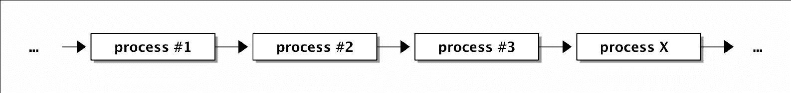
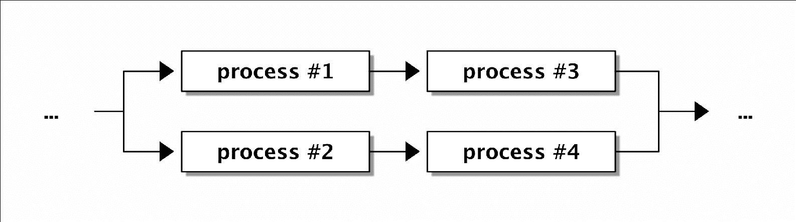
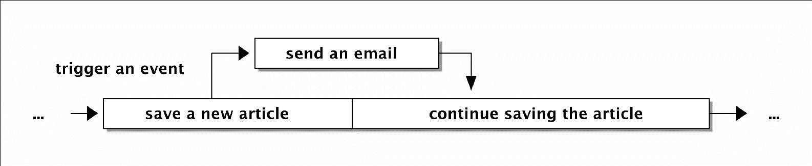

# 第一章 反应式编程简介

反应式编程在过去的几年中已经成为一个非常受欢迎和需求旺盛的主题，尽管其背后的理念并不新颖，但它从多个不同的编程范式中学到了优点。本书的目的是教会你如何带着反应式编程的原则，结合现有的库来编写 PHP 应用程序。

在本章中，我们将学习将指导我们贯穿整本书的最重要的原则：

+   回顾众所周知的编程范式，并简要解释它们对人类的意义。

+   我们将看到如何使用实用的例子，即使在今天，我们也可以使用函数式 PHP 编程。我们特别关注我们如何使用匿名函数。

+   解释什么是反应式编程，以及它从其他编程范式中学到了哪些优点。

+   我们将探讨一些广泛使用的 JavaScript 和 PHP 库的例子，这些库已经使用了与反应式编程非常相似的原则。

+   介绍反应式扩展，并了解这些如何融入反应式编程的世界。

+   使用 RxJS 展示使用反应式扩展的样子，以及它是如何融入整个方案的。

+   使用 RxPHP 库创建一个简单的第一个演示。

由于反应式编程是一种编程范式，因此我们将快速浏览其他所有我们可能已经听说过的常见范式，你会在阅读或听到反应式编程时经常看到它们。

# 命令式编程

命令式编程是一种围绕执行改变程序状态的语句的编程范式。

这在人类语言中的含义是：

+   **编程范式**：这是一组定义构建和结构化程序风格的概念。大多数编程语言，如 PHP，支持多种范式。我们也可以将其视为一种心态和一种当我们使用这些范式时解决问题的方法。

+   **语句**：在命令式编程中，具有副作用的行为单元，通常包含表达式，按顺序评估。语句执行是为了它们的副作用，表达式是为了它们的返回值。考虑以下示例：

    ```php
            $a = 2 + 5 

    ```

    这行代码是一个语句，其中`2 + 5`是一个表达式。预期的副作用是将值`7`赋给`$a`变量。这会导致改变程序的当前状态。另一个例子可以是：

    ```php
            if ($a > 5) { } 

    ```

    这个语句有一个表达式，但没有返回值。

+   **状态**：在任何给定时间内存中程序变量的值。在命令式编程中，我们定义一系列控制程序流程的语句，因此改变其状态。

# 声明式编程

声明式编程是一种关注于描述程序逻辑而不是特定执行步骤的范式。换句话说，在声明式编程中，我们定义我们想要什么，而不是我们想要如何实现。与命令式编程相比，声明式编程中的程序是用表达式而不是语句定义的。

非常常见的例子可以是 SQL 和 HTML 语言。考虑以下数据库查询：

```php
SELECT * FROM user WHERE id = 42 

```

在 SQL 中，我们定义我们想要查询哪些表中的数据，但实现细节对我们来说完全隐藏。我们甚至不想担心数据库引擎如何存储或索引数据。

在 HTML 中，我们定义元素的结构；对于我们来说，浏览器渲染过程背后的细节并不重要。我们只想在屏幕上看到页面。

# 顺序和并行编程

我们可以将顺序和并行编程视为对立面。

在顺序编程中，我们按顺序执行进程。这意味着当一个进程完成时，才会启动下一个进程。换句话说，始终只有一个进程正在执行。以下图示了这一原则：



在并行编程中，可以同时执行多个进程：



为了使理解更加容易，并且与 PHP 更加相关，我们可以不将进程视为代码行。PHP 解释器始终是顺序执行的，它永远不会并行执行代码。

在第九章《使用 pthreads 和 Gearman 进行多线程和分布式计算》中，我们将使用 PHP 模块 pthreads，它使得在多个线程中运行 PHP 代码成为可能，但我们会看到这并不像看起来那么简单。实际上，pthreads 模块创建了多个独立的 PHP 解释器，每个解释器都在一个单独的线程中运行。

# 异步编程

异步编程这个术语在 JavaScript 等语言中非常常见。一个非常普遍的定义是，在异步编程中，我们以不同于定义的顺序执行代码。这对于任何基于事件的程序都是典型的。

例如，在 JavaScript 中，我们首先定义一个事件监听器及其处理程序，该处理程序将在适当的事件发生一段时间后执行。

在 PHP 中，这可能是例如一个需要在创建新博客文章时发送电子邮件的 Web 应用程序。只是，我们考虑的是任务，而不是代码行。以下图示了一个异步触发的事件：



当 Web 应用程序保存文章（处理任务）时，它触发了一个事件，发送了电子邮件，然后继续执行原始任务。事件处理程序必须在开始此任务之前定义。

## 异步编程与并行编程的比较

一个非常常见的误解是异步编程和并行编程是相同的，或者认为一个是由另一个引起的。这在 JavaScript 中非常常见，从用户的角度来看，事情看起来像是并行运行的。

这并不正确，但许多编程语言（实际上，只是它们的解释器）在它们仍然是顺序执行的同时，创造出并行运行的错觉。它们看起来像是并行的，这要归因于它们基于事件的本性（如 JavaScript），或者归因于它们的解释器内部机制。

例如，Python 通过在不同部分的应用程序之间切换执行上下文来模拟线程。Python 解释器仍然是单线程的，按顺序执行指令，但创造出并行运行代码的错觉。

# 函数式编程

函数式编程范式将程序流程视为函数的评估。它利用了几个概念，其中对我们来说最重要的是消除副作用、避免可变数据、函数作为一等公民和高阶函数。每个函数的输出只依赖于其输入参数值，因此，调用同一个函数两次必须总是返回相同的值。它基于声明式编程，即在表达式中使用而不是使用语句。

让我们更深入地看看这意味着什么：

+   **消除副作用**：在命令式编程中，副作用在程序执行期间是期望的，而在函数式编程中则正好相反。每个函数都应该是一个独立的构建块，其返回值仅基于其输入值。请注意，在函数式编程中，定义一个没有参数且不返回值的函数几乎没有任何意义。假设函数没有副作用，这意味着这个函数不能做任何事情（或者至少从外部观察不到任何事情）。这与命令式编程形成对比，在命令式编程中，使用这样的函数是有意义的，因为它们可以修改某些内部状态（例如对象的内部状态）。消除副作用导致代码更加独立和易于测试。

+   **避免可变数据**：不修改任何输入值并使用它们的副本的概念与不产生任何副作用很好地结合。使用相同的输入参数执行相同的函数将始终返回相同的值。

+   **一等公民和高阶函数**：在编程语言中，说类型/对象/函数是一等公民（或一等元素）意味着这个实体支持通常对所有其他实体都适用的操作。通常，这包括：

    +   它可以作为参数传递给函数

    +   它可以从函数中返回

    +   它可以被分配给一个变量

    高阶函数有非常相似的意义，并且至少要做以下之一：

    +   将一个函数作为参数

    +   返回一个函数作为结果

    在函数式编程中，这种高级函数的概念经常与集合上的方法如 `map()`、`filter()`、`reduce()`、`concat()` 和 `zip()` 结合使用。

## PHP 中的函数式编程

让我们暂时离开一下，看看上述提到的三个概念如何与 PHP 相关联。

### 消除副作用

这主要是一个良好的编程风格和自律的问题。当然，PHP 并没有限制我们违反这一规则。请注意，通过副作用，我们也指代以下用例：

```php
function sum($array) { 
    $sum = 0; 
    foreach ($array as $value) { 
        $sum += $value; 
    } 
    saveToDatabase($sum); 
    return $sum; 
} 
sum([5, 1, 3, 7, 9]); 

```

尽管我们没有自己定义函数 `saveToDatabase()`（例如，它来自我们使用的框架），但它仍然是一个副作用。如果我们再次执行相同的函数，它将返回相同的值，但最终状态是不同的。例如，它将在数据库中创建两次记录。

### 避免可变数据

对于原始数据类型，这个概念很简单，例如：

```php
function add($first, $second) { 
    return $first + $second; 
} 
add(5, 2); 

```

然而，当与集合一起工作时，这一原则需要创建一个新的集合并将旧集合中的值复制到新集合中：

```php
function greaterThan($collection, $threshold) { 
    $out = []; 
    foreach ($collection as $val) { 
        if ($val > $threshold) { 
            $out[] = $val; 
        } 
    } 
    return $out; 
} 
greaterThan([5, 12, 8, 9, 42], 8); 
// will return: [12, 9, 42] 

```

上述例子展示了这一原则在实际中的应用。

在 PHP 中，出于性能原因，数组是通过引用传递的，直到第一次尝试修改它们。然后解释器将在幕后创建原始数组的副本（所谓写时复制）。然而，对象始终作为引用传递，因此我们在处理它们时必须非常小心。

这种不可变集合（或一般对象）的概念在 JavaScript 中变得非常流行，例如 Facebook 制作的 `Immutable.js` 库（[`facebook.github.io/immutable-js/`](https://facebook.github.io/immutable-js/)），或者 Angular2 中所谓的 `onPush` 变化检测机制。

除了使我们的代码更可预测外，当它被适当使用时，它将简化对大型集合中变化的检查，因为如果其任何项已更改，则整个集合将被新的实例替换。

为了检查两个集合是否包含相同的数据，我们可以使用身份运算符（`===` 三等号）而不是逐个比较集合的项。

在 PHP 中，已经有库使这项任务更容易，例如，`Immutable.php`（[`github.com/jkoudys/immutable.php`](https://github.com/jkoudys/immutable.php)）。例如，PHP 5.5+ 默认包含一个不可变的 `DateTime` 类版本，称为 `DateTimeImmutable`。

### 一等公民和高级函数

现在事情开始变得有趣。PHP 中的函数已经是一等公民很长时间了。此外，自 PHP 5.3+以来，我们可以使用匿名函数，这极大地简化了高级函数的使用。

考虑一个非常简单的例子，使用内置的 `array_map()` 函数对集合中的每个元素应用一个函数：

```php
$input = ['apple', 'banana', 'orange', 'raspberry']; 
$lengths = array_map(function($item) { 
    return strlen($item); 
}, $input); 
// $lengths = [5, 6, 6, 9]; 

```

我们使用了 PHP 的 `array_map()` 函数来迭代数组并返回每个字符串的长度。如果我们只考虑这个函数调用，它使用了我们在上面解释的多个范式的许多概念：

```php
array_map(function($item) { 
    return strlen($item); 
}, $input); 

```

这具体意味着什么：

+   单个表达式 `strlen($item)` 和没有赋值（声明式编程）。

+   实际迭代数组的实现细节对我们来说是隐藏的（声明式编程）。

+   首类公民和高级函数（函数式编程）。

+   不可变数据 - 这个函数调用不会改变原始数据，而是创建一个新的数组（函数式编程）。

+   没有副作用 - 所有操作都在内部闭包中进行。如果我们使用了任何变量，它们将只存在于这个闭包中（函数式编程）。

仅为了比较，如果我们想用过程式编程写出相同的例子，它将只多一行：

```php
$result = []; 
foreach ($input as $value) { 
    $result[] = strlen($value); 
} 

```

让我们更进一步，假设我们想要获取所有长度大于 `5` 的总和。首先，我们将从最明显的过程式方法开始：

```php
$input = ['apple', 'banana', 'orange', 'raspberry']; 
$sum = 0; 
foreach ($input as $fruit) { 
    $length = strlen($fruit); 
    if ($length > 5) { 
        $sum += $length; 
    } 
} 
// $sum = 21 
printf("sum: %d\n", $sum); 

```

现在，我们可以使用函数式编程来写出相同的内容，利用我们之前提到的三种方法：map、filter 和 reduce。在 PHP 中，这些分别被称为 `array_map()`、`array_filter()` 和 `array_reduce()`：

```php
$lengths = array_map(function($fruit) { 
    return strlen($fruit); 
}, $input); 
$filtered = array_filter($lengths, function($length) { 
    return $length > 5; 
}); 
$sum = array_reduce($filtered, function($a, $b) { 
    return $a + $b; 
}); 

```

我们去掉了所有语句，只使用了表达式。生成的代码并不短，我们还得创建三个变量来保存部分处理的数组。所以让我们将其转换成一个大的嵌套调用：

```php
$sum = array_reduce(array_filter(array_map(function($fruit) { 
    return strlen($fruit); 
}, $input), function($length) { 
    return $length > 5; 
}), function($a, $b) { 
    return $a + $b; 
}); 

```

这要短一些；我们可以看到函数应用的顺序和它们相应的表达式，顺序相同。我们已经遇到了 PHP 中函数声明的矛盾，如下所示，这已经受到了高度批评：

```php
array array_map(callable $callback, array $array1 [, $... ]) 
array array_filter(array $array, callable $callback) 
mixed array_reduce(array $array, callable $callback) 

```

这些是从 PHP 文档中缩短的函数定义。我们可以看到，有时第一个参数是迭代的集合；有时是回调函数。同样的问题也存在于字符串函数及其 haystack-needle 参数中。我们可以尝试使用 functional-PHP 库（[`github.com/lstrojny/functional-php`](https://github.com/lstrojny/functional-php)）来提高可读性，这是一个 PHP 函数式编程的函数集合。

以下代码表示与上面相同的例子，但使用了 `lstrojny/functional-php` 库：

```php
use function Functional\map; 
use function Functional\filter; 
use function Functional\reduce_left; 

$sum = reduce_left(filter(map($input, function($fruit) { 
    return strlen($fruit); 
}), function($length) { 
    return $length > 5; 
}), function($val, $i, $col, $reduction) { 
    return $val + $reduction; 
}); 

```

它确实看起来更好，但当我们使用标准的 PHP 数组时，这可能是我们能得到的最好的结果。

让我们看看在数组是对象且 map、filter 和 reduce 是其方法的编程语言中，如何解决相同的问题。例如，JavaScript 就是这样一种语言，因此我们可以再次重写上面的例子：

```php
var sum = inputs 
    .map(fruit => fruit.length) 
    .filter(len => len > 5) 
    .reduce((a, b) => a + b);  

```

### 注意

在本书中，我们将使用新的 ES6 标准来展示任何 JavaScript 代码。

嗯，这相当简单，并且比 PHP 中的函数式编程更好地满足了我们的期望。这可能是我们几乎从不使用高阶函数的原因。它们太难编写、阅读和维护了。

在我们继续之前，我们应该看看与 PHP 中的函数式编程相关的一个值得注意的话题。

### PHP 中的匿名函数

每个匿名函数在内部都表示为闭包类的一个实例，如下所示（我们也会将匿名函数称为闭包或可调用对象）：

```php
$count = function() { 
    printf("%d ", count($this->fruits)); 
}; 
var_dump(get_class($count)); 
// string(7) "Closure" 

```

不寻常的是，我们可以在调用闭包时绑定自定义的 `$this` 对象，这是一个在 JavaScript 中非常常见但在 PHP 中很少使用的概念。

让我们定义一个简单的类，我们将用它来进行演示：

```php
class MyClass { 
    public $fruits; 
    public function __construct($arr) { 
        $this->fruits = $arr; 
    } 
} 

```

然后，在两个对象上测试存储在 `$count` 变量中的函数：

```php
// closures_01.php 
// ... the class definition goes here 
$count = function() { 
    printf("%d ", count($this->fruits)); 
}; 

$obj1 = new MyClass(['apple', 'banana', 'orange']); 
$obj2 = new MyClass(['raspberry', 'melon']); 

$count->call($obj1); 
$count->call($obj2); 

```

这个例子将以下输出打印到控制台：

```php
$ php closures_01.php
3
2

```

在 PHP 中，我们可以使用 `use` 关键字指定我们想要从父作用域传递到闭包中的变量。变量也可以通过引用传递，类似于在函数调用中通过引用传递变量。考虑以下示例，它演示了这两个原则：

```php
// closures_03.php 
$str = 'Hello, World'; 

$func = function() use ($str) { 
    $str .= '!!!'; 
    echo $str . "\n"; 
}; 
$func(); 
echo $str . "\n"; 

$func2 = function() use (&$str) { 
    $str .= '???'; 
    echo $str . "\n"; 
}; 
$func2(); 
echo $str . "\n"; 

```

我们有两个闭包 `$func` 和 `$func2`。第一个闭包使用 `$str` 的一个副本，所以当我们将其打印到函数外部时，它不会被修改。然而，第二个闭包 `$func2` 使用原始变量的引用。这个演示的输出如下：

```php
$ php closures_03.php
Hello, World!!!
Hello, World
Hello, World???
Hello, World???

```

在这本书中，我们将多次将对象传递给闭包。

还有一个具有类似功能的 `bindTo($newThis)` 方法。它不是评估闭包，而是返回一个新的闭包对象，其中 `$this` 被绑定到 `$newThis`，之后可以通过例如 `call_user_func()` 方法调用。当在对象内部使用闭包时，上下文 `$this` 会自动绑定，所以我们不需要担心它。

### 注意

匿名函数和闭包类在官方文档中解释得非常好，所以如果你有任何疑问，请前往那里：[`php.net/manual/en/functions.anonymous.php`](http://php.net/manual/en/functions.anonymous.php)

### PHP 魔术方法

PHP 定义了一组可以用于具有特殊效果类方法的名称。这些名称都以前缀两个下划线 `__` 开头。就我们的目的而言，我们将特别关注其中的两个，称为 `__invoke()` 和 `__call()`。

当我们尝试将对象用作普通函数时，会使用 `__invoke()` 方法。当我们使用高阶函数时，这很有用，因为我们可以将对象和函数以完全相同的方式对待。

第二个 `__call()` 方法用于当我们尝试调用一个不存在的对象方法（更准确地说，是一个不可访问的方法）时。它接收原始方法名和尝试调用它时使用的参数数组作为参数。

我们将在 第二章 *使用 RxPHP 的响应式编程* 中使用这两个魔法方法。

这里展示的原则在 PHP 中并不常见，但当我们使用函数式编程时，我们会在几个场合遇到它们。

### 注意

在整本书中，我们将尝试遵循 PSR-1 和 PSR-2 编码标准 ([`www.php-fig.org/psr/`](http://www.php-fig.org/psr/))。然而，我们经常会故意违反它们，以使源代码尽可能短。

现在，我们终于要掌握响应式编程了。

# 响应式编程

响应式编程是另一种编程范式。它基于轻松表达数据流和自动传播变化的能力。

让我们更深入地探讨这个问题：

+   **数据流**（或数据流）：在响应式编程中，我们希望将变量视为“随时间变化的值”。例如，这可以是鼠标位置、用户点击或通过 WebSocket 传入的数据。基本上，任何基于事件的系统都可以被视为数据流。

+   **变化的传播**：一个非常合适的例子是电子表格编辑器。如果我们把单个单元格的值设置为 `A1 = A2 + A3`，这意味着对单元格 `A2` 和 `A3` 的任何更改都将传播到 `A1`。在程序员的用语中，这对应于观察者设计模式，其中 `A2` 和 `A3` 是可观察的，而 `A1` 是观察者。我们将在本章后面再次讨论观察者模式。

+   **轻松表达数据流**：这与我们使用的库有关，而不仅仅是与语言本身有关。这意味着，如果我们想有效地使用响应式编程，我们需要能够轻松地操作数据流。这个原则还表明，响应式编程属于声明性范式类别。

如我们所见，定义非常广泛。

关于数据流和变化传播的第一部分看起来像迭代器的观察者设计模式。使用函数式编程轻松表达数据流是可以做到的。这一切基本上描述了我们已经在本章中看到的内容。

与观察者模式的主要区别在于我们如何思考和操作数据流。在先前的例子中，我们总是以数组作为输入进行工作，这些数组是同步的，而数据流可以是同步的也可以是异步的。从我们的角度来看，这并不重要。

让我们看看观察者模式在 PHP 中的典型实现可能是什么样子：

```php
// observer_01.php 
class Observable { 
    /** @var Observer[] */ 
    private $observers = []; 
    private $id; 
    static private $total = 0; 

    public function __construct() { 
        $this->id = ++self::$total; 
    } 

    public function registerObserver(Observer $observer) { 
        $this->observers[] = $observer; 
    } 

    public function notifyObservers() { 
        foreach ($this->observers as $observer) { 
            $observer->notify($this, func_get_args()); 
        } 
    } 

    public function __toString() { 
        return sprintf('Observable #%d', $this->id); 
    } 
} 

```

为了通知任何由可观察者做出的更改，我们需要另一个名为 `Observer` 的类，它订阅了一个可观察者：

```php
// observer_01.php 
class Observer { 
    static private $total = 0; 
    private $id; 

    public function __construct(Observable $observable) { 
        $this->id = ++self::$total; 
        $observable->registerObserver($this); 
    } 

    public function notify($obsr, $args) { 
        $format = "Observer #%d got "%s" from %s\n"; 
        printf($format, $this->id, implode(', ', $args), $obsr); 
    } 
} 

```

然后，一个典型的用法可能如下所示：

```php
$observer1 = new Observer($subject); 
$observer2 = new Observer($subject); 
$subject->notifyObservers('test'); 

```

这个例子将在控制台打印出两条消息：

```php
$ php observer_01.php
// Observer #1 got "test" from Observable #1
// Observer #2 got "test" from Observable #1

```

这几乎遵循我们定义反应式编程范式的定义。数据流是从可观察者来的事件序列，变化被传播到所有监听观察者。我们上面提到的最后一个点——能够轻松表达数据流——实际上并不存在。如果我们想过滤掉所有不符合特定条件的事件，就像我们在`array_filter()`和函数式编程的示例中所做的那样，该怎么办？这种逻辑必须放入每个`Observer`类的实现中。

反应式编程的原则实际上在一些库中非常常见。我们将查看其中的三个，并看看它们如何与我们刚刚学到的反应式和函数式编程相关。

## jQuery Promises

可能每个 Web 开发者都曾在某个时候使用过 jQuery。在处理异步调用时，使用 Promise 来避免所谓的**回调地狱**是一个非常方便的方法。例如，调用`jQuery.ajax()`返回一个`Promise`对象，当 AJAX 调用完成时解决或拒绝：

```php
$.get('/foo/bar').done(response => { 
    // ... 
}).fail(response => { 
    // ... 
}).complete(response => { 
    // ... 
}); 

```

一个`Promise`对象代表未来的一个值。它是非阻塞的（异步的），但允许我们以声明性的方式处理它。

另一个有用的用例是链式回调，形成一个链，其中每个回调都可以在进一步传播之前修改值：

```php
// promises_01.js 
function functionReturningAPromise() { 
    var d = $.Deferred(); 
    setTimeout(() => d.resolve(42), 0); 
    return d.promise(); 
} 

functionReturningAPromise() 
    .then(value => value + 1) 
    .then(value => 'result: ' + value) 
    .then(value => console.log(value)); 

```

在这个例子中，我们有一个单一的资源，即`functionReturningAPromise()`调用，以及三个回调，只有最后一个打印出解决 Promise 的值。我们可以看到，当通过回调链传递时，数字`42`被修改了两次：

```php
$ node promises_01.js 
result: 43

```

### 注意

在反应式编程中，我们将使用与 Promise 非常相似的方法，但`Promise`对象总是只解决一次（它只携带一个值）；数据流可以生成多个或甚至无限多个值。

## Gulp 流式构建系统

Gulp 构建系统已经成为 JavaScript 中最受欢迎的构建系统。它完全基于流和流操作。考虑以下示例：

```php
gulp.src('src/*.js') 
  .pipe(concat('all.min.js')) 
  .pipe(gulp.dest('build')); 

```

这创建了一个匹配谓词`src/*.js`的文件流，将所有这些文件连接在一起，最后将一个单独的文件写入`build/all.min.js`。这让你想起了什么吗？

这是我们上面在谈论 PHP 中的函数式编程时使用的相同声明性和功能性方法。特别是，这个`concat()`函数可以用 PHP 的`array_reduce()`来替换。

gulp 中的流（即 vinyl-source-stream）可以被修改成我们想要的任何方式。例如，我们可以将一个流拆分为两个新的流：

```php
var filter = require('gulp-filter'); 
var stream = gulp.src('src/*.js'); 
var substream1 = stream.pipe(filter(['*.min.js'])); 
var substream2 = stream.pipe(filter(['!/app/*'])); 

```

或者，我们可以合并两个流并将它们压缩（最小化和混淆源代码）成一个流：

```php
var merge = require('merge2'); 
merge(gulp.src('src/*.js'), gulp.src('vendor/*')) 
    .pipe(uglify()); 
    .pipe(gulp.dest('build')); 

```

这种流操作与我们在定义反应式编程范式时使用的最后一个概念非常吻合——轻松表达数据流——同时它既功能性强又声明性强。

## PHP 中的 EventDispatcher 组件

可能每个 PHP 框架都附带某种类型的事件驱动组件，用于通过事件通知应用程序的各个不同部分。

其中一个组件是 Symfony 框架自带的功能（[`github.com/symfony/event-dispatcher`](https://github.com/symfony/event-dispatcher)）。它是一个独立的组件，允许订阅和监听事件（观察者模式）。

事件监听器可以后来根据它们订阅的事件进行分组，也可以分配自定义标签，如下面的代码所示：

```php
use Symfony\Component\EventDispatcher\EventDispatcher; 
$dispatcher = new EventDispatcher(); 
$listener = new AcmeListener(); 
$dispatcher->addListener('event_name', [$listener, 'action']); 

```

这个原则与在 Zend Framework 中使用的 Zend\EventManager 非常相似。它只是可观察者-观察者组合的另一种变体。

我们将在第四章“反应式与典型事件驱动方法”中回到 Symfony `EventDispatcher` 组件，探讨如何将反应式编程方法应用于基于事件的系统，这应该会导致代码简化并更有组织性。第四章，*反应式与典型事件驱动方法*。

# 反应式扩展

现在我们已经看到反应式编程范式中的原则对我们来说并不完全陌生，我们可以开始思考如何将这些全部组合起来。换句话说，为了开始编写反应式代码，我们真正需要哪些库或框架。

反应式扩展（ReactiveX 或简称 Rx）是在各种语言中使反应式编程变得容易的库集合，即使在异步和函数式编程概念笨拙的语言中，如 PHP。然而，有一个非常重要的区别：

反应式编程不等于反应式扩展。

反应式扩展是一个库，它将某些原则作为接近反应式编程的可能方法之一。当有人告诉你他们正在使用反应式编程在他们的应用程序中做某事时，他们实际上是在谈论他们最喜欢的语言中特定的反应式扩展库。

反应式扩展最初由微软为 .NET 创建，称为 **Rx.NET**。后来，Netflix 将其移植到 Java，称为 **RxJava**。现在，有超过十种支持的语言，其中最受欢迎的可能就是 **RxJS** - JavaScript 的实现。

所有端口都遵循一个非常相似的 API 设计，然而，差异仍然存在，我们将在几个地方讨论它们。我们将主要关注 RxPHP 和 RxJS 之间的差异。

RxPHP 主要是一片未知的领域。我们遇到异步事件的更典型环境是 JavaScript，因此我们首先将在 JavaScript（以及 RxJS 5）中演示示例，之后我们将查看 RxPHP。

## 使用 RxJS 自动完成

假设我们想要实现一个自动完成功能，从维基百科下载建议（此示例来自 RxJS 的 GitHub 页面上的官方演示集合）：

```php
function searchAndReturnPromise(term) { 
    // perform an AJAX request and return a Promise 
} 

var keyup = Rx.Observable.fromEvent($('#textInput'), 'keyup') 
    .map(e => e.target.value) 
    .filter(text => text.length > 2) 
    .debounceTime(750) 
    .distinctUntilChanged(); 
var searcher = keyup.switchMap(searchAndReturnPromise); 

```

让我们更详细地看看它是如何工作的：

1.  我们从表单输入的 `keyup` 事件创建一个可观察对象。这个函数是内置在 RxJS 中的，用于简化可观察对象的创建。我们当然也可以创建自己的可观察对象。

1.  应用 `map()` 函数。这正是我们上面已经看到的内容。请注意，这个 `map()` 函数实际上不是 `Array.map()`，而是 `Observable.map()`，因为我们这里不处理数组。

1.  使用 `filter()` 方法进行链式操作。这与 `map()` 的情况完全相同。

1.  方法 `debounceTime()` 用于限制在一段时间后只将事件向下传播一次。在这种情况下，我们使用 750ms，这意味着当用户开始输入时，它不会在每次 `keyup` 事件时从维基百科下载数据，而只是在两个事件之间至少有 750ms 延迟之后。

1.  `distinctUntilChanged()` 方法确保我们只有在值真正从上一次改变时才调用 AJAX 请求，因为下载相同的建议两次是没有意义的。

1.  最后一条使用 `keyup.switchMap()` 的语句保证了在执行多个异步调用时，只有流中的最后一个被处理。其他所有调用都被忽略。这很重要，因为在处理 AJAX 调用时，我们绝对无法控制哪个 Promise 首先解析。

如果我们没有使用 RxJS，这个功能将需要多个状态变量。至少需要保持输入的最后一个值、事件发生的最后时间以及 AJAX 调用的最后一个请求值。使用 RxJS，我们可以专注于我们想要做的事情，而不必担心其实现细节（声明式方法）。

使用响应式扩展，这种方法满足了我们所描述的所有关于响应式编程、函数式编程以及主要是声明式编程的内容。

## 拖放鼠标位置

让我们看看一个稍微复杂一点的 RxJS 示例。我们想要跟踪从开始拖动 HTML 元素的位置到释放它（`mouseup` 事件）的相对鼠标位置。

注意这个例子是如何结合多个可观察对象的（这个例子也来自 RxJS 的 GitHub 页面上的官方演示集合）：

```php
var mouseup   = Rx.Observable.fromEvent(dragTarget, 'mouseup'); 
var mousemove = Rx.Observable.fromEvent(document, 'mousemove'); 
var mousedown = Rx.Observable.fromEvent(dragTarget, 'mousedown'); 

var mousedrag = mousedown.mergeMap(md => { 
    var sX = md.offsetX, sY = md.offsetY; 
    return mousemove.map(mm => { 
        mm.preventDefault(); 
        return {left: mm.clientX - sX, top: mm.clientY - sY}; 
    }).takeUntil(mouseup); 
}); 

var subscription = mousedrag.subscribe(pos => { 
    dragTarget.style.top = pos.top + 'px'; 
    dragTarget.style.left = pos.left + 'px'; 
}); 

```

注意，`mousedrag` 是通过调用 `return mousemove(...)` 创建的可观察对象，并且它只会在发出 `mouseup` 事件时停止发出事件，这是通过 `takeUntil(mouseup)` 实现的。

通常情况下，如果没有使用 RxJS，并且采用典型的命令式方法，这会比上一个例子更复杂，需要更多的状态变量。

当然，这需要一些关于可观察对象可用函数的基本知识，但即使没有任何先前的经验，代码也应该相对容易理解。再次强调，实现细节对我们来说是完全隐藏的。

# 介绍 RxPHP

RxPHP ([`github.com/ReactiveX/RxPHP`](https://github.com/ReactiveX/RxPHP) ) 是 RxJS 的一个端口。我们将使用 Composer 来处理我们 PHP 项目的所有依赖。它已经成为一个前沿的工具，所以如果你之前没有使用过它，请先下载并查看一些基本用法 [`getcomposer.org/`](https://getcomposer.org/) 。

然后，创建一个新的目录并初始化一个 Composer 项目：

```php
$ mkdir rxphp_01
$ cd rxphp_01
$ php composer.phar init

```

通过交互式向导填写所需的字段，然后添加 RxPHP 作为依赖项：

```php
$ php composer.phar require reactivex/rxphp

```

当库成功下载后，Composer 将创建 `autoload.php` 文件来处理所有按需类自动加载。

然后，我们的代码将打印不同类型水果的字符串长度：

```php
// rxphp_01.php 
require __DIR__ . '/vendor/autoload.php'; 

$fruits = ['apple', 'banana', 'orange', 'raspberry']; 
$observer = new \Rx\Observer\CallbackObserver( 
    function($value) { 
        printf("%s\n", $value); 
    }, null, function() { 
        print("Complete\n"); 
    }); 

\Rx\Observable::fromArray($fruits) 
    ->map(function($value) { 
        return strlen($value); 
    }) 
    ->subscribe($observer); 

```

### 注意

在所有未来的示例中，我们不会包括 `autoload.php` 文件，以使示例尽可能简短。然而，显然它对于运行示例是必需的。如果你不确定，请查看每个章节提供的源代码。

我们首先创建了一个观察者 - 精确地说，是 `CallbackObserver` - 它接受三个函数作为参数。这些函数在流中的下一个项目上、在错误发生时以及在输入流完成且不会发出更多项目时被调用。

`CallbackObserver` 类的优势在于，我们不需要每次都编写一个自定义观察者类来以特殊且不太可重用的方式处理传入的项目。使用 `CallbackObserver`，我们只需编写我们想要处理的信号的调用者。

当我们运行这个示例时，我们会看到：

```php
$ php rxphp_01.php 
5
6
6
9
Complete

```

这个示例非常简单，但与 JavaScript 环境相比，在 PHP 中使用异步操作并不常见，如果我们确实需要异步工作，那可能是一些非平凡的事情。在 第三章，*使用 RxPHP 编写 Reddit 阅读器*，我们将使用 **Symfony 控制台组件**来处理来自命令行的所有用户输入，并在可能的情况下，使用与上面两个 RxJS 示例中看到类似的原理来处理鼠标事件。

JavaScript 示例非常适合作为使用响应式扩展进行响应式编程的示例，以及它的好处。

### 注意

如果你想了解更多关于响应式扩展的信息，请访问 [`reactivex.io/`](http://reactivex.io/)。此外，在继续下一章之前，你可以查看 Rx 支持的不同操作符 [`reactivex.io/documentation/operators.html`](http://reactivex.io/documentation/operators.html) 以及这些操作符如何在不同的语言中使用。

## RxPHP 1.x 和 RxPHP 2

截至 2017 年 4 月，RxPHP 有两个版本。

RxPHP 1.x 是稳定的，需要 PHP 5.5+。本书中的所有示例都是为 RxPHP 1.x 制作的，更具体地说，是 RxPHP 1.5+。它的 API 主要基于 RxJS 4，但也借鉴了一些 RxJS 5 的功能。

还有正在开发的 RxPHP 2，它需要 PHP 7.0+。从用户的角度来看，RxPHP 2 API 几乎与 1.x 相同，它只是使某些事情变得更容易（例如，我们在第六章[part0050_split_000.html#1FLS41-bd355a22cf10407cb10df27e65585b8d "第六章。PHP 流 API 和高阶观察者"]中将会看到，与事件循环一起工作），*PHP 流 API 和高阶观察者*）。当我们遇到任何值得注意的差异时，我们会给予它们额外的空间。

### 注意

新的 RxPHP 2 是打算基于 PHP 循环互操作规范（[`github.com/async-interop/event-loop`](https://github.com/async-interop/event-loop)）。然而，该规范仍处于预发布阶段，并且在未来一段时间内不会稳定。因此，RxPHP 团队决定将 async-interop 支持留给未来的版本。更多信息请访问 [`github.com/ReactiveX/RxPHP/pull/150`](https://github.com/ReactiveX/RxPHP/pull/150)。

# 摘要

在本章中，我们试图解释在大多数编程语言中使用的常见编程范式。这些是：命令式、声明式和函数式编程。我们还比较了异步和并行代码的含义。

我们花了一些时间讨论 PHP 中函数式编程的实际示例及其缺点，并介绍了某些不太常见的特性的示例，例如 Closure 类。

然后，我们考察了反应式编程的定义以及它与本章中我们之前看到的所有内容的关联。

我们将反应式扩展（Rx）介绍为一个用于反应式编程可能方法之一的库。

在两个 RxJS 的示例中，我们看到了在实际中与反应式扩展一起工作的样子，以及这与我们反应式编程定义的匹配程度。

最后，我们介绍了 RxPHP，这是我们将在整本书中使用的库。我们还简要地讨论了 RxPHP 1.x 和 RxPHP 2 之间的差异。

在下一章中，我们将更深入地探讨 RxPHP 库的各个部分，并更多地讨论在反应式扩展中使用的原则。
