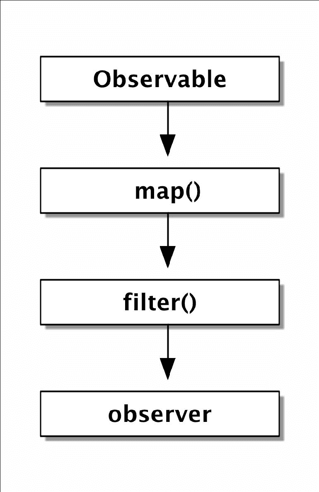
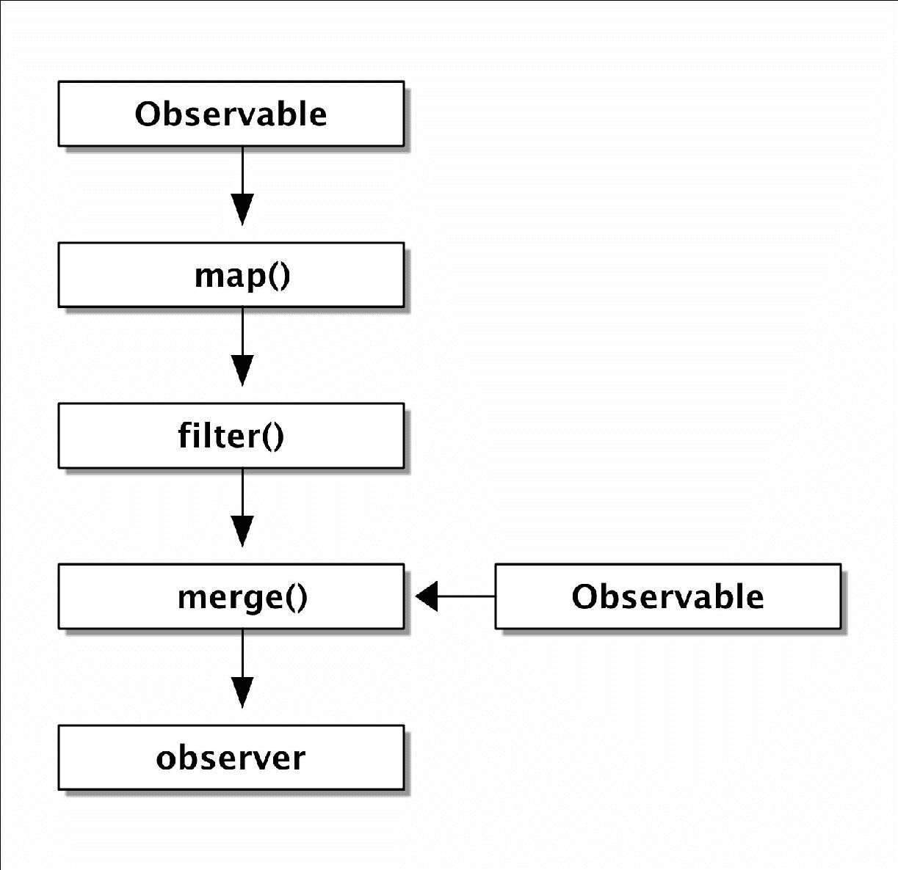
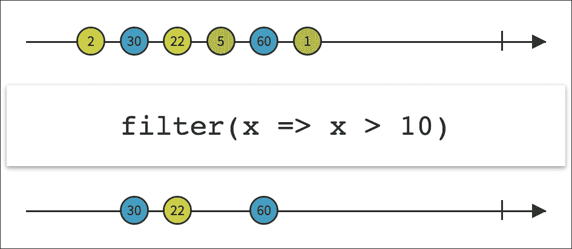
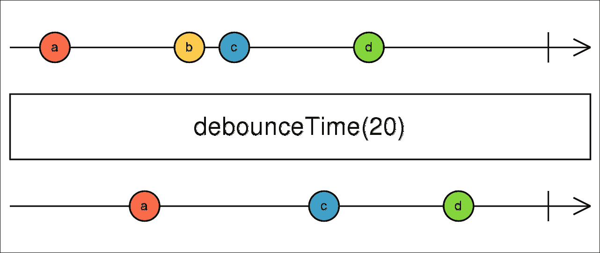
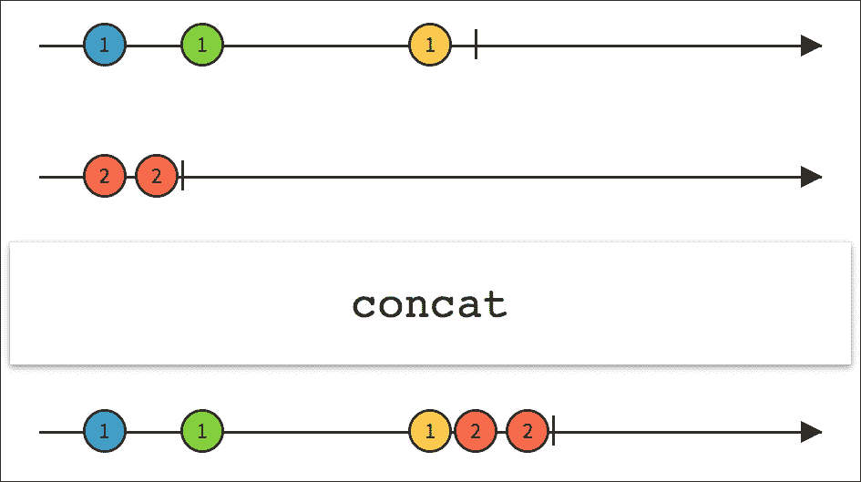

# 第二章。使用 RxPHP 进行反应式编程

在本章中，我们将更深入地了解如何使用 PHP 的反应式扩展库 RxPHP。我们将主要基于前一章的内容，但会进行更详细的探讨。

尤其是以下内容：

+   我们将在本章和所有后续章节中使用 RxPHP 的各种组件。

+   我们将快速浏览如何阅读和理解 Rx 文档。特别是，我们将查看解释 Rx 操作符功能的宝石图。

+   列出我们将全书使用的几个基本操作符及其功能说明。

+   编写自定义操作符，将 JSON 字符串解码成适当的数组表示，同时正确处理错误。

+   实现一个简单的脚本，通过 cURL 下载 HTML 页面。然后比较使用 RxPHP 的相同方法。

+   如何为我们的 cURL 示例编写自定义的可观察对象。

+   我们将深入研究 RxPHP 的源代码，看看当我们使用内置的可观察对象和操作符时会发生什么。

在我们单独查看 RxPHP 的各个部分之前，我们将简要提及一些非常常见的术语，这些术语将在我们讨论反应式扩展的各个方面时使用。

# 反应式扩展的基本原理

让我们看看一个非常简单的 RxPHP 示例，类似于我们在前一章中做的，并使用它来展示反应式扩展背后的基本原理。

我们现在不会麻烦定义观察者，而只关注可观察对象和操作符：

```php
// rxphp_basics_01.php 
use Rx\Observable; 
$fruits = ['apple', 'banana', 'orange', 'raspberry']; 

Observable::fromArray($fruits) // Observable 
    ->map(function($value) { // operator 
        return strlen($value); 
    }) 
    ->filter(function($len) { // operator 
        return $len > 5; 
    }) 
    ->subscribe($observer); // observer 

```

在这个例子中，我们有一个可观察对象，两个操作符和一个观察者。

可观察对象可以与操作符链式连接。在这个例子中，操作符是 `map()` 和 `filter()`。

可观察对象有 `subscribe()` 方法，观察者使用它来在链的末尾开始接收值。

我们可以用以下图表来表示这个链：



每个箭头都显示了项目通知的传播方向。

我们可能需要解释使用可观察对象和迭代数组之间的区别。

可观察对象就像一个推送模型，当值准备好时，它会被推送到操作符链中。这一点非常重要，因为可观察对象决定了何时应该发出下一个值。可观察对象的内部逻辑可以执行它需要的任何操作（例如，运行一些异步任务），并且仍然保持完全隐藏。

与可观察对象类似的概念是承诺。然而，虽然承诺代表未来将存在的单个值，但可观察对象代表一系列值。

另一方面，迭代数组就像一个拉模型。我们会一个接一个地拉取项目。重要的后果是，我们必须事先准备好数组（即在开始迭代之前）。

另一个重要的区别是，Observables 的行为类似于数据流（或数据流）。我们在第一章，*响应式编程简介*中讨论了流。在实践中，这意味着 Observable 知道它已经发出了所有项目，或者当发生错误时能够向下发送适当的通知。

因此，Observables 可以在它们的观察者上调用三种不同的方法（我们将在本章后面编写自定义操作符和自定义 Observable 时看到这是如何实现的）：

+   `onNext`：当下一个项目准备好发出时，会调用此方法。我们通常说“Observable 发出一个项目”。

+   `onError`：当发生错误时调用的通知。这可能是由`Exception`类的实例表示的任何类型的错误。

+   `onComplete`：当没有更多项目要发出时调用的通知。

每个 Observable 可以发出零个或多个项目。

每个 Observable 可以发送一个错误，或者一个完整的通知；但不能同时发送两者。

这就是为什么我们在第一章，*响应式编程简介*中使用的`CallbackObserver`类，将三个可调用函数作为参数。这些可调用函数分别在观察者收到下一个项目、错误通知或完成通知时被调用。所有三个可调用函数都是可选参数，我们可以决定忽略任何一个。

例如，我们可以创建一个如下所示的观察者：

```php
use Rx\Observer\Callback\Observer; 

$observer = new CallbackObserver( 
    function($value) { 
        echo "Next: $value\n"; 
    }, 
    function(Exception $err) { 
        $msg = $err->getMessage(); 
        echo "Error: $msg\n"; 
    }, 
    function() { 
        echo "Complete\n"; 
    } 
); 

```

这个观察者定义了所有三个可调用函数。我们可以在上面定义的 Observable 上测试它，并查看其输出：

```php
$ php rxphp_basics_01.php
Next: 6
Next: 6
Next: 9
Complete

```

我们可以看到，只有三个值通过了`filter()`操作符，并在最后有一个适当的完成通知。

在 RxPHP 中，每个接受可调用函数作为参数的操作符都会用`try…catch`块内部包装其调用。如果可调用函数抛出`Exception`，则此`Exception`作为`onError`通知发送。考虑以下示例：

```php
// rxphp_basics_02.php 
$fruits = ['apple', 'banana', 'orange', 'raspberry']; 
Observable::fromArray($fruits) 
    ->map(function($value) { 
        if ($value[0] == 'o') { 
            throw new Exception("It's broken."); 
        } 
        return strlen($value); 
    }) 
    ->filter(function($len) { 
        return $len > 5; 
    }) 
    ->subscribe($observer); 

```

使用我们之前定义的相同观察者，此示例将产生以下输出：

```php
$ php rxphp_basics_02.php
Next: 6
Error: It's broken.

```

重要的是要注意，当发生错误时，不再发出更多项目，也没有完整的通知。这是因为，当观察者收到错误时，它会自动取消订阅。

我们将在第三章，*使用 RxPHP 编写 Reddit 阅读器*和第十章，*在 RxPHP 中使用高级操作符和技术*中更多地讨论订阅和取消订阅背后的过程。

在第八章中，我们将更深入地探讨当观察者接收到错误或完成通知时在观察者内部发生的情况。

在我们继续之前，有一点需要说明。我们提到可观察对象代表数据流。这个优点在于我们可以轻松地合并或拆分流，类似于我们在第一章中提到的`gulp`构建工具。

让我们来看一个稍微复杂一点的例子，合并两个可观察对象：

```php
// rxphp_basics_03.php 
$fruits = ['apple', 'banana', 'orange', 'raspberry']; 
$vegetables = ['potato', 'carrot']; 

Observable::fromArray($fruits) 
    ->map(function($value) { 
        return strlen($value); 
    }) 
    ->filter(function($len) { 
        return $len > 5; 
    }) 
    ->merge(Observable::fromArray($vegetables)) 
    ->subscribe($observer); 

```

我们使用了`merge()`操作符将现有的可观察对象与另一个可观察对象合并。注意，我们可以在任何我们想要的地方添加操作符。由于我们在`filter()`操作符之后和`subscribe()`调用之前添加了它，第二个可观察对象的项将直接发送到观察者，并跳过前面的操作符链。

我们可以用以下图表来表示这个链：



这个示例的输出如下所示：

```php
$ php rxphp_basics_03.php
Next: 6
Next: 6
Next: 9
Next: potato
Next: carrot
Complete

```

这些原则适用于所有 Rx 实现。现在，我们应该对在 Rx 中使用可观察对象、观察者和操作符有一个基本的了解，然后我们可以分别讨论它们。

# 响应式扩展的命名规范

当我们谈论可观察对象时，我们使用诸如**发出/发送值/项**之类的术语。通常，我们说**一个可观察对象发出一个项**，但我们同样理解**一个可观察对象发送一个值**。

通过**发出/发送**，我们指的是一个可观察对象在观察者上调用`onNext`方法。

当我们谈论可观察对象时，我们使用诸如**发送错误/完成通知/信号**之类的术语。我们也经常提到**一个可观察对象完成了**，这意味着一个可观察对象已经发送了一个完成通知。

通过**通知/信号**，我们指的是一个可观察对象在观察者上调用`onError`或`onComplete`方法。

在前面的段落中，我们使用了一个简单的 RxPHP 演示，其中有一个可观察对象、两个操作符和一个观察者。

这种结构形成了一个**操作符/可观察对象链**。我们将从**操作符链**和**可观察对象链**（有时也称为**可观察对象操作符链**）这两个术语中理解相同的内容。这是因为从我们的角度来看，我们正在链式调用操作符；但在底层，每个操作符都返回`Observable`类的另一个实例，所以实际上我们是在链式调用可观察对象。在实践中，这并不重要，所以我们只需记住它们具有相同的意义。

当谈到可观察对象链时，我们有时会使用术语**源可观察对象**。这是链中项目的来源。换句话说，它是链中的第一个可观察对象。在先前的示例中，源可观察对象是`Observable::fromArray($fruits)`。

当谈到算子时，我们使用术语源可观察对象来描述直接位于此特定算子之前的可观察对象（因为它为该算子提供项目来源）。

有时，你可能会遇到只是`next`、`error`和`complete`这样的术语和方法名，而不是`onNext`、`onError`和`onComplete`。这来自 RxJS 5，它遵循 ES7 可观察对象规范（[`github.com/tc39/proposal-observable`](https://github.com/tc39/proposal-observable)），但它们的含义完全相同。大多数 Rx 实现使用名称`onNext`、`onError`和`onComplete`。

所有这些术语都用于各种关于 Rx 的文献和文章中，因此我们将容忍所有这些术语。

# RxPHP 组件

由于本章将主要关于可观察对象、观察者和算子，我们将从它们开始。

我们在本章中已经看到了一个预览，现在我们将更详细地介绍。

## 可观察对象

可观察对象发出项目。换句话说，可观察对象是值的来源。观察者可以订阅可观察对象，以便在下一个项目准备好、所有项目都已发出或发生错误时被通知。

可观察对象（在响应式编程的意义上）与观察者模式之间的主要区别是，可观察对象可以告诉你何时所有数据都已发出，何时发生错误。所有三种类型的事件都被观察者消费。

RxPHP 附带了几种基本类型的可观察对象，适用于一般用途。以下是一些易于使用的例子：

+   `ArrayObservable`：它从一个数组创建一个可观察对象，并在第一个观察者订阅后立即发出所有值。

+   `RangeObservable`：它从预定义的范围内生成一个数字序列。

+   `IteratorObservable`：它遍历并发出可迭代中的每个项目。这可以是任何作为迭代器包装的数组。考虑以下示例，我们遍历一个数组而不是使用`ArrayObservable`：

    ```php
            $fruits = ['apple', 'banana', 'orange', 'raspberry']; 
            new IteratorObservable(new ArrayIterator($fruits)); 

    ```

    注意，这还包括生成器。考虑另一个使用匿名函数和`yield`关键字的例子。

    ```php
            $iterator = function() use ($fruits) { 
                foreach ($fruits as $fruit) { 
                    yield $fruit; 
                } 
            }; 
            new IteratorObservable($iterator()) 
                ->subscribe(new DebugSubject()); 

    ```

调用 `$iterator()` 函数返回一个实现了 Iterator 接口的 `Generator` 类的实例。然而，这些基本 Observables 主要用于演示目的，在现实世界的使用中并不实用。在 PHP 环境中，我们无法像在 JavaScript 和 RxJS 中那样从鼠标事件创建 Observables，因此我们将在本章中很快学习如何编写自定义 Observables，以便创建一些真实世界的示例。在 第三章，*使用 RxPHP 编写 Reddit 阅读器*，我们将学习 `Observable::create()` 静态方法来创建具有一些基本自定义逻辑的 Observables。但，关于这一点我们稍后再说。

根据它们开始发出值的时间，Observables 可以分为两组：

+   **热**: 在这个组中，即使在没有观察者订阅的情况下也会发出值。例如，这是我们在 第一章 中使用的 RxJS 的 `Rx.Observable.fromEvent`，*响应式编程简介*。这从一个任何 JavaScript 事件创建一个 Observables。值立即发出，所以当你稍后订阅这个 Observables 时，你只会收到新值，而不会收到之前发出的值。

+   **冷**: 在这个组中，当至少有一个观察者订阅时才会发出值。例如，RxPHP 的 `ArrayObservable`。它创建一个 Observables，并且每次我们订阅时，我们都会收到传递给 `fromArray()` 方法的所有值。

所有在 RxPHP 中的内置 Observables 都可以通过从 `Rx\Observable` 命名空间调用静态方法轻松实例化。以下列表代表了上面提到的三个 Observables：

+   `RxObservable::fromArray()` 方法返回 `Rx\Observable\ArrayObservable`

+   `RxObservable::range()` 方法返回 `Rx\Observable\RangeObservable`

+   `RxObservable::fromIterator()` 方法返回 `Rx\Observable\IteratorObservable`

不要惊讶静态方法名不一定与返回的类名匹配。此外，通常使用静态调用比直接实例化 Observables 更容易。

## 观察者

观察者是 Observables 的消费者。换句话说，观察者对 Observables 做出反应。我们已经看到了 `CallbackObserver` 类，它接受三个可选参数，代表每种类型信号的调用者。

考虑一个类似的例子，我们在 第一章 的结尾使用的例子，*响应式编程简介*，其中我们定义了我们的观察者：

```php
$observer = new Rx\Observer\CallbackObserver(function($value) { 
    printf("%s\n", $value); 
}, function() { 
    print("onError\n"); 
}, function() { 
    print("onCompleted\n"); 
}); 

```

`CallbackObserver` 类允许我们创建一个自定义观察者，而不必一定扩展基类。它的构造函数接受三个可选参数：

+   `onNext`：当源可观察者发射新项目时，将调用此调用函数。这是我们最常用的回调之一。

+   `onComplete`：当没有剩余项目并且可观察者完成项目发射时，将调用此调用函数。一些可观察者会产生无限数量的项目，并且此回调永远不会被调用。

+   `onError`：当链中出现错误时，将调用此调用函数。

我们可以将相同的示例编写成更可重用的形式，以便快速测试可观察者链内部的情况：

```php
// rxphp_03.php 
$fruits = ['apple', 'banana', 'orange', 'raspberry']; 

class PrintObserver extends Rx\Observer\AbstractObserver { 
    protected function completed() { 
        print("Completed\n"); 
    } 
    protected function next($item) { 
        printf("Next: %s\n", $item); 
    } 
    protected function error(Exception $err) { 
        $msg = $err->getMessage(); 
        printf("Error: %s\n", $msg); 
    } 
} 

$source = Rx\Observable::fromArray($fruits); 
$source->subscribe(new PrintObserver()); 

```

当扩展`AbstractObserver`时，我们需要实现的方法是`completed()`、`next()`和`error()`，其功能与之前描述的相同。

我们正在使用`subscribe()`方法将观察者订阅到可观察者上。

此外，还有`subscribeCallback()`方法，它只接受三个调用函数作为参数。自 RxPHP 2 以来，`subscribeCallback()`方法已被弃用，其功能已合并到`subscribe()`中。

这意味着，在 RxPHP 2 中，我们也可以编写以下代码：

```php
$source->subscribe(function($item) { 
    printf("Next: %sn", $item); 
}); 

```

我们使用了一个单一的调用函数，而不是使用观察者进行订阅。这仅处理`onNext`信号。

## 单个值

单个值就像可观察者一样；唯一的区别是它们总是只发射一个值。在 RxPHP 中，我们不会区分可观察者和单个值之间的任何区别，因此我们可以使用`Observable::just()`静态方法：

```php
// single_01.php/ 
require __DIR__ . '/PrintObserver.php'; 

RxObservable::just(42) 
    ->subscribe(new PrintObserver()); 

```

这将创建一个新的可观察者，它使用值`42`调用`onNext()`，然后立即调用`onComplete()`。这个非常简单的示例的输出如下：

```php
$ php single_01.php
Next: 42
Completed

```

与前面的解释类似，调用`RxObservable::just()`静态方法返回一个`Rx\Observable\ReturnObservable`实例。

### 注意

“单个”一词在 RxJS 4 中使用得最多。由于 RxPHP 最初是从 RxJS 4 移植过来的，后来也借鉴了 RxJS 5 的一些内容，你可能会偶尔遇到这个术语。如果你只熟悉 RxJS 5，那么你可能从未听说过它。尽管如此，我们始终将所有值源称为可观察者，即使它们只发射一个或没有任何值。

## 主题

`Subject`是一个同时充当可观察者和观察者的类。这意味着它可以像观察者一样订阅可观察者，也可以像可观察者一样发射值。最终，它还可以独立于其源可观察者发射自己的值。

为了了解`Subject`类如何在不同的场景中使用，我们将基于本章开头使用的相同示例进行三个示例。

我们可以使用`Subject`类而不是可观察者。但是，我们需要通过在`Subject`实例上调用`onNext()`来手动发射项目：

```php
// subject_01.php 
use Rx\Subject\Subject; 

$subject = new Subject(); 
$subject 
    ->map(function($value) { 
        return strlen($value); 
    }) 
    ->filter(function($len) { 
        return $len > 5; 
    }) 
    ->subscribe(new PrintObserver()); 

$subject->onNext('apple'); 
$subject->onNext('banana'); 
$subject->onNext('orange'); 
$subject->onNext('raspberry'); 

```

此代码产生的输出与原始示例中的可观察者相同：

```php
$ php subject_01.php
Next: 6
Next: 6
Next: 9

```

另一个用例可能是使用`Subject`来订阅可观察者。我们将重用我们刚才创建的`PrintObserver`类来打印通过`Subject`实例的所有项目和通知：

```php
// subject_02.php 
use Rx\Subject\Subject; 
use Rx\Observable; 

$subject = new Subject(); 
$subject->subscribe(new PrintObserver()); 

$fruits = ['apple', 'banana', 'orange', 'raspberry']; 
Observable::fromArray($fruits) 
    ->map(function($value) { 
        return strlen($value); 
    }) 
    ->filter(function($len) { 
        return $len > 5; 
    }) 
    ->subscribe($subject); 

```

注意，我们将`PrintObserver`订阅到`Subject`上，然后在操作符链的末尾订阅`Subject`。正如我们所看到的，默认情况下，`Subject`类只是传递两个项目和通知。输出与上一个示例相同。

我们想要展示的最终情况是在操作符链的中间使用`Subject`的一个实例：

```php
// subject_03.php  
use Rx\Subject\Subject; 
use Rx\Observable; 

$fruits = ['apple', 'banana', 'orange', 'raspberry']; 

$subject = new Subject(); 
$subject 
    ->filter(function($len) { 
        return $len > 5; 
    }) 
    ->subscribe(new PrintObserver()); 

Observable::fromArray($fruits) 
    ->map(function($value) { 
        return strlen($value); 
    }) 
    ->subscribe($subject); 

```

再次强调，控制台输出是相同的。

在本章的后面部分，我们将编写`DebugSubject`类，我们将在整本书中多次使用它，以便快速查看我们的可观察链中发生了什么。

## 可丢弃对象

所有 Rx 实现都内部使用销毁模式。这个设计决策有两个原因：

+   能够从可观察对象中取消订阅

+   能够释放该可观察对象使用的所有数据

例如，如果我们有一个可观察对象，它从互联网下载一个大型文件并将其保存到临时位置，直到完全下载，我们希望在观察者取消订阅或发生任何错误时删除该临时文件。

在 RxPHP 中，已经有一些现成的类，每个类都有不同的用途。我们现在不需要担心可丢弃对象。我们将在下一章第三章，*使用 RxPHP 编写 Reddit 阅读器*中查看它们如何在内置的可观察对象和操作符中使用。

### 注意

你可以在维基百科上了解更多关于销毁模式的信息[`en.wikipedia.org/wiki/Dispose_pattern`](https://en.wikipedia.org/wiki/Dispose_pattern)，或者更具体地说，为什么它在反应式扩展中在 StackOverflow 上被使用[`stackoverflow.com/a/7707768/310726`](http://stackoverflow.com/a/7707768/310726)。

然而，了解在 Rx 中像释放资源这样的操作很重要，我们需要对此有所了解。

## 调度器

可观察对象和操作符通常不会直接执行它们的工作，而是使用`Scheduler`类的一个实例来决定如何以及何时执行。

实际上，`Scheduler`接收一个动作作为匿名函数，并根据其内部逻辑安排其执行。这对于所有需要与时间一起工作的可观察对象和操作符特别相关。例如，所有延迟或周期性发射都需要通过调度器进行安排。

在像 JavaScript 这样的语言中，这相对简单，例如使用`setTimeout()`函数和 JavaScript 解释器的基于事件的本质。然而，在 PHP 中，所有代码都是严格顺序执行的，我们将不得不使用事件循环。

在 RxPHP 的大多数情况下，我们甚至不需要担心调度器，因为如果没有设置不同的，所有可观察对象和操作符内部都使用`ImmediateScheduler`类，该类立即执行所有操作，而不需要任何进一步的逻辑。

我们将在本章的末尾再次遇到调度器，当我们讨论事件循环时。

在第六章，*PHP Streams API 和高级 Observables*中，我们将更详细地讨论 PHP 中的事件循环。我们还将讨论事件循环互操作性规范([`github.com/async-interop/event-loop`](https://github.com/async-interop/event-loop))以及它与 RxPHP 的关系。

### 注意

在 RxPHP 2 中，使用调度器已经显著简化，大多数时候我们根本不需要担心事件循环，正如我们将在第六章，*PHP Streams API 和高级 Observables*中看到的。

## 操作符

我们已经使用了操作符，但没有进一步的解释，但现在我们知道了如何使用 Observables、observers 和 Subjects，是时候看看操作符是如何将这些全部粘合在一起的了。

Rx 的核心原则是使用各种操作符来修改数据流。通常，一个操作符返回另一个 Observable，因此允许操作符调用的链式。

在 Rx 中，有大量的操作符，特别是在 RxPHP 中，已经有大约 40 个。其他实现，如 RxJS，甚至更多。这包括我们在上一章讨论函数式编程时看到的全部内容，例如`map()`、`filter()`以及更多。这也包括针对非常特定用例的操作符，例如`merge()`、`buffer()`或`retry()`，仅举几例。

在底层创建操作符链的过程比表面上看起来要复杂一些。我们现在不需要担心它，因为我们在第三章，*使用 RxPHP 编写 Reddit 阅读器*中还会再次讨论它。在我们开始实际使用更高级的操作符之前，我们应该看看文档中每个操作符是如何描述的。这主要是因为一些功能一开始并不明显，而且当涉及到异步事件时，有时很难理解每个操作符的作用。

### 理解操作符图表

每个操作符都在文档中使用称为**宝石图**的图表进行描述，其中每个宝石代表一个发出的值。

#### filter()操作符

首先，我们将看看`filter()`操作符是如何定义的。我们在上一章中使用了 PHP 函数`array_filter()`，所以我们知道它接受值和谓词函数作为输入。然后它使用谓词评估每个值，并根据它返回 true 或 false，将其值添加到其响应数组中或跳过该值。`filter()`操作符的行为相同，只是它处理的是数据流而不是数组。这意味着它从其源（前面的 Observable）接收项目，并将它们传播到其后续观察者（或链式操作符）。

使用水滴图，它看起来像以下图示：



来自 http://reactivex.io/documentation/operators/filter.html 的 filter() 操作符的水滴图

让我们更详细地解释这个图：

+   在顶部和底部，我们有两条时间线，代表 Observables。右上角的箭头表明时间从左到右流动。

+   我们可以将矩形以上的内容视为输入 Observable，将矩形以下的内容视为输出 Observable。通常有一个或多个输入，只有一个输出。

+   每个圆圈（水滴）代表其各自的 Observable 在时间上发出的单个值。圆圈内部的数字代表其值。所有值按它们发出的时间顺序排列，从左到右。使用不同的颜色使其明显，顶部和底部的值是相同的（例如，顶部的蓝色 "30" 与底部的 "30" 是相同的值）。

+   中间的矩形代表顶部和底部 Observables 之间的转换。其功能通常用文字或伪代码描述。在这种情况下，我们有一个看起来像 ES6 语法表达式的表达式，它表示如果 `x` 大于 `10` 则返回 `true`。用 PHP 重新编写，它等于以下内容：

```php
        function($x) { 
            return $x > 10; 
        } 

```

+   因此，最下面的一行只包含值大于 `10` 的圆圈。

+   每一行的右侧垂直线标记了这些 Observables 完成的点。这意味着它们已经发出了所有值并发送了一个 `onComplete` 通知。`filter()` 操作符对 `onComplete` 通知没有影响，因此这两个 Observables 同时结束。

这相当简单。水滴图是一种非常舒适的方式来表示数据流，而不必担心实现细节（这让我们想起了我们在第一章中定义的声明式编程，不是吗？）。

在某些图中，你还可以看到时间线上的一个交叉符号，它代表一个错误（一个精确的 `onError` 通知）。我们将在本章后面看到，我们可以像处理 `onNext` 一样处理 `onComplete` 和 `onError` 通知。

#### debounceTime() 操作符

让我们看看另一个图。这次我们有一个来自 RxJS 5 的 `debounceTime()` 操作符，我们在第一章的 *使用 RxJS 实现自动完成* 示例中见过：



来自 http://reactivex.io/documentation/operators/debounce.html 的 debounceTime() 操作符的水滴图

在中间的矩形中，这次我们没有伪代码；只有一个表达式 `debounceTime(20)`。好吧，为了弄清楚它做什么，我们需要查看文档，或者尝试分析这个图。

当`debounceTime()`操作符接收到一个值时，它会等待一定的时间间隔后再重新发出它。如果在间隔结束之前有其他值到达，原始值将被丢弃，并使用后来的值；同时，间隔也会重新开始。这可以无限进行下去。

图表精确地描述了上一段文字：

+   首先，值**a**到达。转换函数等待 20 毫秒的间隔结束，然后操作符重新发出该值。间隔通过在时间线上稍微向右移动底部值来表示。正如我们之前所说的，水平线代表时间中的值。当标记为**a**的底部圆圈向右移动时，这意味着这个事件发生在顶部的**a**圆圈之后。

+   然后，又有两个值到达，它们都非常短。第一个被丢弃，但在第二个之后，有一个更长的时间间隔，所以只有第二个值被重新发出。

+   使用最后一个值**d**的过程与第一个类似。

当我们知道可以忽略一些快速连续发生的事件时，这个操作符很有用。一个典型的例子是在用户停止输入关键字后，我们想要开始搜索时使用`debounceTime()`进行自动完成功能。

#### `concat`操作符

现在我们可以看看一个稍微复杂一些的操作符，即`concat()`。看看下面的图表，并尝试猜测它做什么：



来自 http://reactivex.io/documentation/operators/concat.html 的 Marble 图表表示`concat()`操作符

在查看文档之前，让我们一起来分析一下：

+   在顶部，我们有两个可观测量作为操作符的输入。

+   两个可观测量应该同时发出一个值，但只有第一个可观测量的值被传递。同样，对于第二个和第三个值也是如此。

+   然后，第一个可观测量到达了末尾，并发送了一个`onComplete`通知。

+   紧接着，操作符开始从第二个可观测量发出值。

`concat()`操作符将多个可观测量合并成一个。它内部按顺序订阅每个输入可观测量，一个接一个。这意味着，当第一个可观测量完成时，它会订阅下一个。重要的是要知道，一次只有一个源可观测量被订阅（我们将在第四章，*响应式与典型事件驱动方法*)中与`concat()`和类似的`merge()`操作符一起工作）。

换句话说，`concat()`操作符将多个数据流连接成一个单一的流。

在第一章中，我们讨论了函数式编程以及大多数原则在响应式编程中是相同的。实现这样的功能会比较复杂，因为没有内置的 PHP 函数专门用于处理这种用例。

如果我们再次回到第一章，我们说过响应式编程的一个关键概念是“轻松表达数据流”。这个操作符展示了这意味着什么。

### 其他常见操作符

这些只是 RxPHP 中超过 40 个可用操作符中的三个。除了非常简单的如 `filter()` 和 `map()` 之外，还有一些更复杂的操作符。我们已经看到了 `concat()`，但这里有一些在后续章节中会使用的有趣操作符：

+   `buffer()`: 这个操作符有多个变体，但所有变体都会收集接收到的值，并以预定义大小的组重新发出。例如，我们可以创建包含三个项目的组如下：

    ```php
            Rx\Observable::range(1, 4) 
                ->bufferWithCount(3) 
                ->subscribe(new DebugSubject()); 

    ```

    这将打印以下输出：

    ```php
            13:58:13 [] onNext: [1, 2, 3] (array)
            13:58:13 [] onNext: [4] (array)
            13:58:13 onCompleted

    ```

    ### 注意

    注意，最后一个数组只包含一个值，因为可观察对象发送了一个 `onComplete` 通知。

+   `merge()`: 这个操作符将所有输入可观察对象合并为一个输出可观察对象，并立即重新发出所有值（与 `concat()` 相反）。

+   `distinct()`: 这个操作符只重新发出之前未通过此操作符的值。

+   `take()`: 这个操作符只重新发出到达操作符的第一个设定数量的值，然后发送一个 `onComplete` 通知。

+   `retry()`: 当源可观察对象发送 `onError` 时，这个操作符会尝试自动重新订阅。你也可以让它只尝试有限次数，直到发出 `onError` 通知（我们将在 第四章，*响应式与典型事件驱动方法*）。

+   `catchError()`: 当发生 `onError` 通知时，这个操作符允许我们通过订阅其回调返回的另一个可观察对象来继续操作。

+   `toArray()`: 这个操作符从其源可观察对象收集所有项目，并在源可观察对象完成时将它们作为一个单独的数组重新发出。

+   `timeout()`: 如果在特定时间段内没有到达任何值，这个操作符会发送一个 `onError` 通知。

理论已经足够，让我们开始编写我们的第一个自定义类，我们将在整本书中多次使用它。

# 编写 DebugSubject 类

`Subject` 类的一个常见用途是代理其源可观察对象的所有值和通知。

在前面的段落之一中，我们编写了 `PrintObserver` 类，它打印它接收到的所有值。然而，更常见的情况是我们希望在输出可观察对象的同时，能够将其与另一个操作符或观察者链式连接。`Subject` 类正好符合这个用例，因此我们将重写前面的 `PrintObserver` 类，并继承 `Subject` 而不是 `AbstractObserver`：

```php
class DebugSubject extends Rx\Subject\Subject { 
  public function __construct($identifier=null, $maxLen=64){ 
    $this->identifier = $identifier; 
    $this->maxLen = $maxLen; 
  } 
  public function onCompleted() { 
    printf("%s%s onCompleted\n", $this->getTime(), $this->id());
    parent::onCompleted(); 
  }  
  public function onNext($val) { 
    $type = is_object($val) ? get_class($val) : gettype($val); 

    if (is_object($val) && method_exists($val, '__toString')) { 
      $str = (string)$val; 
    } elseif (is_object($val)) { 
      $str = get_class($val); 
    } elseif (is_array($val)) { 
      $str = json_encode($val); 
    } else { 
      $str = $val; 
    } 

    if (is_string($str) && strlen($str) > $this->maxLen) { 
      $str = substr($str, 0, $this->maxLen) . '...'; 
    } 
    printf("%s%s onNext: %s (%s)\n", 
        $this->getTime(), $this->id(), $str, $type); 
    parent::onNext($value); 
  } 
  public function onError(Exception $error) { 
    $msg = $error->getMessage(); 
    printf("%s%s onError (%s): %s\n", $this->getTime(),$this-> 
        $this->id(), get_class($error), $msg); 
    parent::onError($error); 
  } 
  private function getTime() { 
    return date('H:i:s'); 
  } 
  private function id() { 
    return ' [' . $this->identifier . ']'; 
  } 
} 

```

`DebugSubject`类会打印出所有值、它们的类型以及它们被`DebugSubject`接收的时间。它还允许我们为每个`DebugSubject`实例设置一个唯一的标识符，以便能够区分它们的输出。我们将在整本书中多次使用这个类，以便快速查看 Observable 链内部的情况。

然后，使用这个类就像使用任何其他观察者一样：

```php
// rxphp_04.php 
$fruits = ['apple', 'banana', 'orange', 'raspberry']; 
$observer = Rx\Observable::fromArray($fruits) 
    ->subscribe(new DebugSubject()); 

```

控制台输出如下：

```php
$ php rxphp_04.php
17:15:21 [] onNext: apple (string)
17:15:21 [] onNext: banana (string)
17:15:21 [] onNext: orange (string)
17:15:21 [] onNext: raspberry (string)
17:15:21 [] onCompleted

```

链式连接 Subjects 和操作符与连接 Observables 一样：

```php
// rxphp_05.php 
$subject = new DebugSubject(1); 
$subject 
    ->map(function($item) { 
        return strlen($item); 
    }) 
    ->subscribe(new DebugSubject(2)); 

$observable = Rx\Observable::fromArray($fruits); 
$observable->subscribe($subject); 

```

在这个例子中，我们首先创建了一个`DebugSubject`实例，然后使用`map()`操作符将其链式调用，该操作符返回每个项目的长度。最后，我们订阅了另一个只打印数字的`DebugSubject`，因为它放在`map()`之后。然后，我们从一个数组创建了一个 Observable（我们之前已经看到过这个静态方法），它将作为所有项目的源发出。结果如下：

```php
17:33:36 [1] onNext: apple (string)
17:33:36 [2] onNext: 5 (integer)
17:33:36 [1] onNext: banana (string)
17:33:36 [2] onNext: 6 (integer)
17:33:36 [1] onNext: orange (string)
17:33:36 [2] onNext: 6 (integer)
17:33:36 [1] onNext: raspberry (string)
17:33:36 [2] onNext: 9 (integer)
17:33:36 [1] onCompleted
17:33:36 [2] onCompleted

```

注意，消息的顺序与我们的假设相符，即源 Observable 一次发出一个值，这个值在整个链中传播。

### 注意

使用我们这样的 Subjects 有一个重要的副作用，不是很明显。由于我们将其订阅到前面的 Observable 上，它将其从“冷”状态转换为“热”状态，这在某些用例中可能是不希望的。

RxPHP 提供了一系列以“doOn”前缀开头的操作符，目的是将它们放置在操作符链中，以执行副作用而无需订阅 Observable。我们将在第五章中更详细地介绍它们，*测试 RxPHP 代码*。

# 编写 JSONDecodeOperator

我们将在整本书中多次处理对远程 API 的调用，因此有一个将 JSON 字符串响应转换为 PHP 数组表示的操作符将非常有用。

这个例子看起来只需要使用`map()`操作符就可以轻松完成：

```php
// rxphp_06.php  
Rx\Observable::just('{"value":42}') 
    ->map(function($value) { 
        return json_decode($value, true); 
    }) 
    ->subscribe(new DebugSubject()); 

```

这肯定能打印出正确的结果，正如我们可以在下面的输出中看到：

```php
$ php rxphp_06.php
16:39:50 [] onNext: {"value": 42} (array)
16:39:50 [] onCompleted

```

好吧，但是关于格式错误的 JSON 字符串呢？如果我们尝试解码以下内容会发生什么：

```php
Rx\Observable::just('NA') 
    ->map(function($value) { 
        return json_decode($value, true); 
    }) 
    ->subscribe(new DebugSubject()); 

```

函数`json_decode()`在尝试处理无效的 JSON 字符串时不会抛出异常；它只返回`null`：

```php
15:51:06 [] onNext:  (NULL)

```

这可能不是我们想要的。如果 JSON 字符串无效，那么就会出现问题，因为这种情况不应该发生，我们希望发送一个`onError`通知。

如果我们想了解任何关于发生错误的进一步信息，我们必须调用`json_last_error()`。因此，这是一个编写自定义操作符的绝佳机会，该操作符可以解码 JSON 字符串，如果发生任何错误，将发送一个`onError`。

所有操作符都实现了`OperatorInterface`和`__invoke()`方法。这个所谓的“魔法”方法从 PHP 5.3+开始支持，允许使用对象作为函数：

```php
// __invoke.php 
class InvokeExampleClass { 
    public function __invoke($x) { 
        echo strlen($x); 
    } 
} 
$obj = new InvokeExampleClass(); 
$obj('apple'); 
var_dump(is_callable($obj)); 

```

当类实现了 `__invoke()` 方法时，它也会自动被视为可调用的：

```php
$ php __invoke.php
int(5)
bool(true)

```

编写操作符非常相似。我们的类的存根将如下所示：

```php
// JSONDecodeOperator.php 
use Rx\ObservableInterface as ObservableI; 
use Rx\ObserverInterface as ObserverI; 
use Rx\SchedulerInterface as SchedulerI; 
use Rx\Operator\OperatorInterface as OperatorI; 

class JSONDecodeOperator implements OperatorI { 
    public function __invoke(ObservableI $observable, 
            ObserverI $observer, SchedulerI $scheduler = null) { 
        // ... 
    } 
} 

```

方法 `__invoke()` 接受三个参数并返回一个可丢弃的对象。现在，我们只使用前两个参数，而不用担心 `$scheduler`：

+   `ObservableInterface $observable`：这是我们订阅的输入可观察对象

+   `ObserverInterface $observer`：这是我们从这个操作符发出所有输出值的地方

我们将遵循与编写自定义 `Subject` 类几乎相同的原理。我们将使用 `CallbackObserver` 订阅可观察对象并执行所有逻辑：

```php
class JSONDecodeOperator implements OperatorI { 
  public function __invoke(ObservableI $observable, 
      ObserverI $observer, SchedulerI $scheduler = null) { 

    $obs = new CallbackObserver( 
      function ($value) use ($observer) { 
        $decoded = json_decode($value, true); 
        if (json_last_error() == JSON_ERROR_NONE) { 
          $observer->onNext($decoded); 
        } else { 
          $msg = json_last_error_msg(); 
          $e = new InvalidArgumentException($msg); 
          $observer->onError($e); 
        } 
      }, 
      function ($error) use ($observer) { 
        $observer->onError($error); 
      }, 
      function () use ($observer) { 
        $observer->onCompleted(); 
      } 
    ); 

    return $observable->subscribe($obs, $scheduler); 
  } 
} 

```

有几点有趣的事情需要注意：

+   当发生 `onError` 或 `onComplete` 通知时，我们只是将它们传递下去，而不进行任何进一步的逻辑处理。

+   操作符可以在任何时候发送任何信号。在 `CallbackObserver` 类的 `onNext` 闭包内部，我们检查从源可观察对象接收到的输入 JSON 字符串解码时是否发生了任何错误，使用 `json_last_error()`。

+   操作符可以完全访问源可观察对象。

+   操作符可以独立于源可观察对象中的值独立发出值。

为了使用我们的操作符，我们必须使用 `Observable::lift()` 方法，该方法接受一个闭包作为参数，该闭包需要返回一个操作符的实例（此函数被称为操作符工厂）：

```php
// rxphp_07.php 
Rx\Observable::just('{"value":42}') 
    ->lift(function() { 
        return new JSONDecodeOperator(); 
    }) 
    ->subscribe(new DebugSubject()); 

```

在 RxPHP 2 中，使用自定义操作符大大简化了，但使用 `lift()` 方法是通用的，并且在 RxPHP 的两个版本中都适用。

有效的 JSON 字符串按预期解码：

```php
$ php rxphp_07.php
17:58:49 [] onNext: {"value": 42} (array)
17:58:49 [] onCompleted

```

另一方面，我们上面使用的相同无效 JSON 字符串不会调用 `onNext`，而是调用 `onError`。它使用 `InvalidArgumentException` 类的实例和 `json_last_error_msg()` 的错误消息发送此通知，如下面的输出所示：

```php
17:59:25 onError (InvalidArgumentException): Syntax error

```

如同往常，我们将在这个书中重用这个类。下一章将大量处理远程 API，因此这个操作符将非常方便。

## 简化通知的传播

在 `JSONDecodeOperator` 类中，我们不想修改 `onError` 或 `onComplete` 通知，只是将它们传递下去。然而，由于 PHP 与可调用对象的工作方式，有更简单的方法来做这件事。一个有效的可调用对象也是一个包含两个项目的数组：一个对象和一个方法名。

这意味着我们可以将上面的 `CallbackObserver` 实例化重写如下：

```php
$callbackObserver = new CallbackObserver( 
    function ($value) use ($observer) { 
        // ... 
    }, 
    [$observer, 'onError'], 
    [$observer, 'onCompleted'] 
); 

```

功能完全相同。我们不需要为每个通知创建一个匿名函数，只需直接传递可调用即可。

## 在 RxPHP 2 中使用自定义操作符

在 第一章，*响应式编程简介*中，我们提到了一个神奇的 `__call()` 方法。RxPHP 2 使用此方法允许通过在两个命名空间格式中自动发现它们来使用自定义操作符。

第一种选项是在 `Rx\Operator` 命名空间下定义我们的操作符类：

```php
// JSONDecodeOperator.php 
namespace Rx\Operator; 

use Rx\ObservableInterface as ObservableI; 
use Rx\ObserverInterface as ObserverI; 
use Rx\Operator\OperatorInterface as OperatorI; 
use Rx\DisposableInterface as DisposableI; 

class JSONDecodeOperator implements OperatorI { 
  public function __invoke(ObservableI $observable, 
      ObserverI $observer): DisposableI { 

   return $observable->subscribe( 
     function ($value) use ($observer) { 
       $decoded = json_decode($value, true); 
       if (json_last_error() == JSON_ERROR_NONE) { 
         $observer->onNext($decoded); 
       } else { 
         $msg = json_last_error_msg(); 
         $e = new InvalidArgumentException($msg); 
         $observer->onError($e); 
       } 
     }, 
     [$observer, 'onError'], 
     [$observer, 'onCompleted'] 
   ); 
  } 
} 

```

这是相同的 `JSONDecodeOperator` 类，只是针对 RxPHP 2 更新了。使用此操作符非常简单：

```php
Observable::just('{"value":42}') 
    ->JSONDecode() 
    ->subscribe(new DebugSubject()); 

```

由于我们的操作符位于 `Rx\Operator` 命名空间下，它通过 `__call()` 方法扩展为 `Rx\Operator\JSONDecodeOperator`。这意味着我们根本不需要使用 `lift()` 方法。

另一种方法是使用下划线 `_` 前缀操作符名称和命名空间，然后它们将被合并为一个完整的类名。这意味着我们可以将所有特定于应用程序的操作符放在一个自定义命名空间下：

```php
// JSONDecodeOperator.php 
namespace MyApp\Rx\Operator; 
... 
class JSONDecodeOperator implements OperatorI { ... } 

```

现在，我们可以按以下方式使用操作符：

```php
Observable::just('{"value":42}') 
    ->_MyApp_JSONDecode() 
    ->subscribe(new DebugSubject()); 

```

# 编写 CURLObservable

正如我们所说，我们将与 API 调用一起工作，因此我们需要一种舒适的方式来创建 HTTP 请求。可能不会令人惊讶，我们将编写一个自定义的 Observable，它下载一个 URL 并将其响应传递给观察者，然后我们将使用上面创建的操作符从 JSON 中解码它。

我们将使用 PHP 的 cURL 模块，它是对 libcurl（[`curl.haxx.se/libcurl/`](https://curl.haxx.se/libcurl/)）的封装 - 一个用于通过任何可想象协议传输数据的 C 库。

我们将首先使用 PHP 中的简单 cURL，我们将看到它支持某种异步方法。 

## 命令式方法和 cURL

如果我们只想下载单个 URL，我们不需要任何特殊的东西。然而，我们希望使这个，以及所有未来的 `CURLObservable` 类的应用，更加交互式，因此我们还将跟踪下载进度。

一种简单的方法可能如下所示：

```php
// curl_01.php 
$ch = curl_init(); 
curl_setopt($ch, CURLOPT_URL, "http://google.com"); 
curl_setopt($ch, CURLOPT_RETURNTRANSFER, true); 
curl_setopt($ch, CURLOPT_PROGRESSFUNCTION, 'progress'); 
curl_setopt($ch, CURLOPT_NOPROGRESS, false); 
curl_setopt($ch, CURLOPT_HEADER, 0); 
$html = curl_exec($ch); 
curl_close($ch); 

function progress($res, $downtotal, $down, $uptotal, $up) { 
    if ($download_size > 0) { 
        printf("%.2f\n", $down / $downtotal * 100); 
    } 
    ob_flush(); 
    usleep(100 * 1000); 
} 

```

我们正在使用 `CURLOPT_PROGRESSFUNCTION` 选项来设置一个回调函数，该函数由 cURL 模块内部调用。它接受四个参数，帮助我们跟踪页面总大小已下载的百分比。

我们可能不需要显示其输出，因为它非常明显。

此外，还有一小部分 cURL 函数可以同时与多个 cURL 处理程序一起工作。这些函数都以前缀 `curl_multi_` 开头，并通过调用 `curl_multi_exec()` 来执行。不过，`curl_multi_exec()` 函数是阻塞的，解释器需要等待它完成。

## 将 cURL 实现到自定义的 Observable 中

我们已经看到了如何编写自定义观察者、Subject 和操作符。现在是我们编写 Observable 的正确时机。我们希望 Observable 在下载 URL 时发出值，并在最后返回一个完整的响应。我们可以通过检查它们的类型来区分这两种类型的消息。进度始终是双精度浮点数，而响应始终是字符串。

让我们从我们的类概要开始，看看它将如何工作，然后分别实现每个方法，并附上简短说明：

```php
use Rx\Observable; 
use Rx\ObserverInterface as ObserverI; 

class CURLObservable extends Observable { 
    public function __construct($url) {} 
    public function subscribe(ObserverI $obsr, $sched = null) {} 
    private function startDownload() {} 
    private function progress($r, $downtot, $down, $uptot, $up) {} 
} 

```

每次我们编写一个 Observable，我们都会扩展基类 `Rx\Observable`。理论上我们可以只实现 `Rx\ObservableInterface`，但大多数情况下，我们还想继承其所有内部逻辑和所有现有操作符。

构造函数和方法 `startDownload()` 将会非常简单。在 `startDownload()` 中，我们开始下载 URL 并监控其进度。

请注意，此代码位于 `CURLObservable` 类内部；我们只是试图使代码更短、更易于阅读，所以在本例中省略了缩进和类定义：

```php
public function __construct($url) { 
    $this->url = $url; 
} 

private function startDownload() { 
    $ch = curl_init(); 
    curl_setopt($ch, CURLOPT_URL, $this->url); 
    curl_setopt($ch, CURLOPT_PROGRESSFUNCTION,[$this,'progress']); 
    curl_setopt($ch, CURLOPT_RETURNTRANSFER, true); 
    curl_setopt($ch, CURLOPT_NOPROGRESS, false); 
    curl_setopt($ch, CURLOPT_HEADER, 0); 
    curl_setopt($ch, CURLOPT_USERAGENT, 'Mozilla/5.0 ...'); 
    // Disable gzip compression 
    curl_setopt($ch, CURLOPT_ENCODING, 'gzip;q=0,deflate,sdch'); 
    $response = curl_exec($ch); 
    curl_close($ch); 

    return $response; 
} 

```

这基本上与使用命令式方法的示例相同。唯一的有趣差异是我们使用了一个可调用的 `[$this,'progress']` 而不是像之前那样只使用函数名。

实际的值发射发生在 `progress()` 方法内部：

```php
private function progress($res, $downtotal, $down, $uptotal, $up){ 
    if ($downtotal > 0) { 
        $percentage = sprintf("%.2f", $down / $downtotal * 100); 
        foreach ($this->observers as $observer) { 
            /** @var ObserverI $observer */ 
            $observer->onNext(floatval($percentage)); 
        } 
    } 
} 

```

由于我们继承了原始 Observable，我们可以利用其受保护的属性 `$observers`，它持有所有已订阅的观察者，正如其名称所暗示的。要向所有这些观察者发射值，我们可以简单地遍历数组并在每个观察者上调用 `onNext`。

我们迄今为止还没有看到的方法是 `subscribe()`：

```php
public function subscribe(ObserverI $obsr, $sched = null) { 
    $disp1 = parent::subscribe($obsr, $sched); 

    if (null === $sched) { 
        $sched = new ImmediateScheduler(); 
    } 

    $disp2 = $sched->schedule(function() use ($obsr, $started) { 
        $response = $this->startDownload(); 
        if ($response) { 
            $obsr->onNext($response); 
            $obsr->onCompleted(); 
        } else { 
            $msg = 'Unable to download ' . $this->url); 
            $obsr->onError(new Exception($msg)); 
        } 
    }); 

    return new CompositeDisposable([$disp1, $disp2]); 
} 

```

此方法结合了本章中我们看到的一些东西：

+   我们肯定想保留 Observable 的原始功能，所以我们将调用其父实现。这会将观察者添加到之前提到的观察者数组中。

+   `parent::subscribe()` 方法返回一个可丢弃的对象。这是我们用来从 Observable 中取消订阅观察者的对象。

+   如果我们没有指定此 Observable 应该使用哪个调度器，它将回退到 `ImmediateScheduler`。当我们谈论调度器时，我们已经提到了 `ImmediateScheduler`。在 RxPHP 2 中，我们将使用 `Scheduler::getImmediate()` 而不是直接使用类名。

+   随后，我们安排工作（在调度器的术语中通常称为“动作”）由调度器执行。请注意，动作本身是一个闭包。

+   然后，我们开始下载 URL。如果我们向同一个 Observable 订阅另一个观察者，它将再次下载相同的 URL。下载进度将根据 cURL 的内部频率发射。我们将在下一章中更多地讨论订阅过程。

+   下载完成后，我们发出响应或错误。

+   在此方法结束时，它返回另一个可丢弃的对象。这次，它使用 `CompositeDisposable` 来包装其他可丢弃的对象。当调用其 `dispose()` 方法时，这些包装的对象也会被正确地处理。

所以，就是这样。现在我们可以测试我们的 Observable 并查看其输出。我们可以尝试获取带有 *functional-programming* 标签的 [www.stackoverflow.com](http://www.stackoverflow.com) 上最新的问题列表：

```php
$url = 'https://api.stack...&tagged=functional-programming'; 
$observable = new CurlObservable($url); 
$observable->subscribe(new DebugSubject()); 

```

这将打印出几个数字，然后是响应的 JSON 字符串：

```php
16:17:52 onNext: 21.39 (double)
16:17:52 onNext: 49.19 (double)
16:17:52 onNext: 49.19 (double)
16:17:52 onNext: 76.99 (double)
16:17:52 onNext: 100 (double)
16:17:52 onNext: {"items":[{"tags":["javascript","... (string)
16:17:52 onCompleted

```

你可以看到一个值被发射了两次。这是因为 cURL 评估回调时的时机和网络延迟，这并不罕见。如果我们不想看到重复的值，我们可以使用我们在“宝石图”中提到的`distinct()`操作符。

现在，让我们将其与我们的`JSONDecodeOperator`结合起来。由于我们现在只对字符串响应感兴趣，并希望忽略所有进度发射，我们还将使用`filter()`操作符：

```php
// rxphp_curl.php 
$observable 
    ->filter(function($value) { 
        return is_string($value); 
    }) 
    ->lift(function() { 
        return new JSONDecodeOperator(); 
    }) 
    ->subscribe(new DebugSubject(null, 128)); 

```

这返回了响应数组的部分（为了演示目的，我们添加了缩进并使输出略微变长）：

```php
$ php rxphp_curl.php 
16:23:55 [] onNext: { 
    "items": [ 
        { 
            "tags": [ 
                "javascript", 
                "functional-programming", 
       ... (array) 
16:23:55 [] onCompleted 

```

当我们使用`filter()`操作符时，你可能注意到我们没有必要使用`lift()`方法就调用了`Observable::filter()`。这是因为几乎所有操作符实际上都是带有预定义闭包的`lift()`调用，这些闭包返回适当的操作符类。一个有趣的问题是，当我们已经扩展了基础 Observable 类时，我们是否可以为我们自己的`JSONDecodeOperator`编写一个简写。也许可以像`Observable::jsonDecode()`一样？

答案是肯定的，我们可以。然而，在 RxPHP 1.x 版本中，这并不会给我们带来太多帮助。当我们链式调用操作符时，它们返回的不是我们控制的 Observable 实例。理论上，我们可以在创建`CurlObservable`之后立即使用`Observable::jsonDecode()`，因为我们知道它将是一个此类实例，但与`filter()`链式调用会带我们回到原始的 Observable，它不知道任何`jsonDecode()`方法。特别是，`filter()`操作符返回一个`Rx\Observable\AnonymousObservable`实例。

### 异步运行多个请求

一个有趣的使用案例可能是异步启动多个请求。所有对`curl_exec()`的调用都是阻塞的，这意味着它们会阻塞执行上下文，直到完成。

很不幸，这是一个非常棘手的问题，没有使用任何额外的 PHP 模块（例如**pthreads**）就很难解决，正如我们将在第九章第九章中看到的，*使用 pthreads 和 Gearman 的多线程和分布式计算*。

然而，我们可以利用 PHP 的`proc_open()`标准函数来创建非阻塞的子进程，这些子进程可以并行运行，然后只需请求它们的输出。

# proc_open()和阻塞的 fread()

我们的目标是拥有异步启动各种子进程的手段。在这个例子中，我们将使用一个简单的 PHP 脚本，它将简单地暂停几秒钟，代表我们的异步任务：

```php
// sleep.php 
$name = $argv[1]; 
$time = intval($argv[2]); 
$elapsed = 0; 

while ($elapsed < $time) { 
    sleep(1); 
    $elapsed++; 
    printf("$name: $elapsed\n"); 
} 

```

此脚本接受两个参数。第一个是我们选择的标识符，我们将用它来区分多个进程。第二个是脚本将运行多少秒，同时打印其名称和每秒经过的时间。例如，我们可以运行：

```php
$ sleep.php proc1 3
proc1: 1
proc1: 2
proc1: 3

```

现在，我们将编写另一个使用`proc_open()`来创建子进程的 PHP 脚本。正如我们所说的，我们需要脚本是非阻塞的。这意味着我们需要能够读取子进程的输出，就像使用上面的`printf()`打印一样，同时如果需要，能够创建更多的子进程：

```php
// proc_01.php 
$proc = proc_open('php sleep.php proc1 3', [ 
    0 => ['pipe', 'r'], // stdin 
    1 => ['pipe', 'w'], // stdout 
    2 => ['file', '/dev/null', 'a'] // stderr 
], $pipes); 

stream_set_blocking($pipes[1], 0); 

while (proc_get_status($proc)['running']) { 
    usleep(100 * 1000); 
    $str = fread($pipes[1], 1024); 
    if ($str) { 
        printf($str); 
    } else { 
        printf("tickn"); 
    } 
} 
fclose($pipes[1]); 
proc_close($proc); 

```

我们启动一个子进程`php sleep.php proc1 3`，然后进入循环。每 100 毫秒检查一次，看是否有来自子进程的新输出使用`fread()`。如果有，就打印它；否则，只写“tick”。循环将在子进程终止时结束（这是`proc_get_status()`函数的条件）。

在这个例子中，最重要的是调用`stream_set_blocking()`函数，这使得此流的操作非阻塞。

# 事件循环和 RxPHP

将事件循环应用于 Observables 将以类似的方式工作。我们将创建 Observables，启动一个事件循环，并定期检查它们的进度。幸运的是，RxPHP 已经为此做好了准备。结合 ReactPHP 库（[`github.com/reactphp/react`](https://github.com/reactphp/react)），我们可以使用一个专为我们的需求设计的调度器。

例如，我们可以查看周期性地发出值的`IntervalObservable`：

```php
// rxphp_eventloop.php 
$loop = new ReactEventLoopStreamSelectLoop(); 
$scheduler = new RxSchedulerEventLoopScheduler($loop); 

RxObservable::interval(1000, $scheduler) 
    ->take(3) 
    ->subscribe(new DebugSubject()); 

$loop->run(); 

```

这将打印三个值，每个值之间有 1 秒的延迟：

```php
$ php rxphp_eventloop.php
23:12:44 [] onNext: 0 (integer)
23:12:45 [] onNext: 1 (integer)
23:12:46 [] onNext: 2 (integer)
23:12:46 [] onCompleted

```

### 注意

在 RxPHP 2 中，使用事件循环已经简化了，大多数时候我们甚至不需要担心自己启动循环。我们将在第六章中讨论 RxPHP 1.x 和 RxPHP 2 在事件循环方面的差异，*PHP Streams API 和高级观察者*。

# 摘要

在本章中，我们更详细地研究了 RxPHP 的所有组件。

尤其是我们在 Rx 中看到了所有三种类型的通知：Observables、观察者、Subjects、Singles 和操作符。在实践示例中，我们设计了自定义的观察者、Subject、Observable 和一个操作符。我们将在接下来的章节中使用所有这些。

我们看到有关 Rx 操作符的文档通常以“宝石图”的形式描述。

下一章将利用本章所做的一切。我们将创建一个使用 RxPHP 和 Symfony Console 组件的 CLI Reddit 阅读器。我们还将更深入地讨论 Observable 链中的订阅过程。
