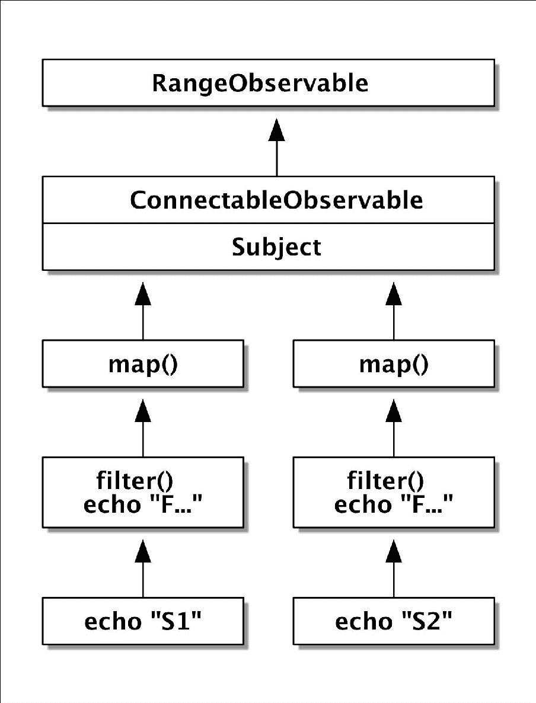
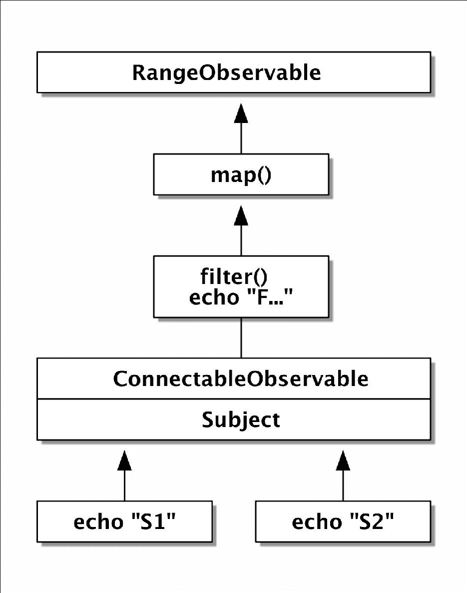
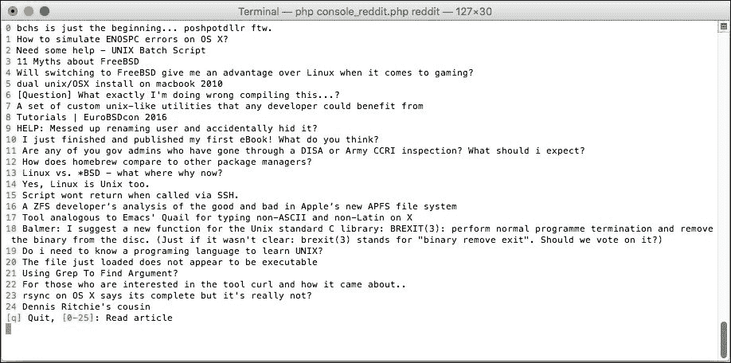
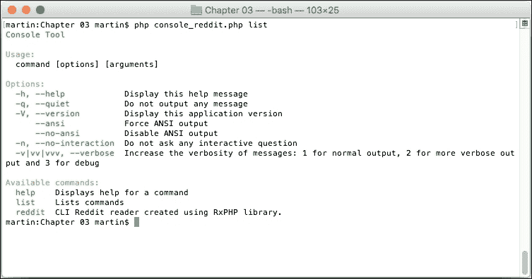
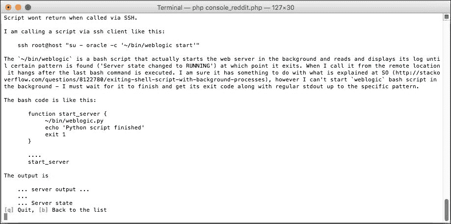
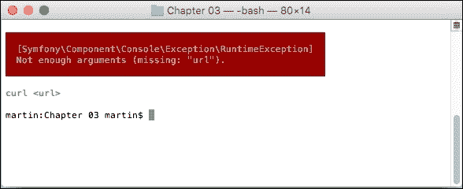
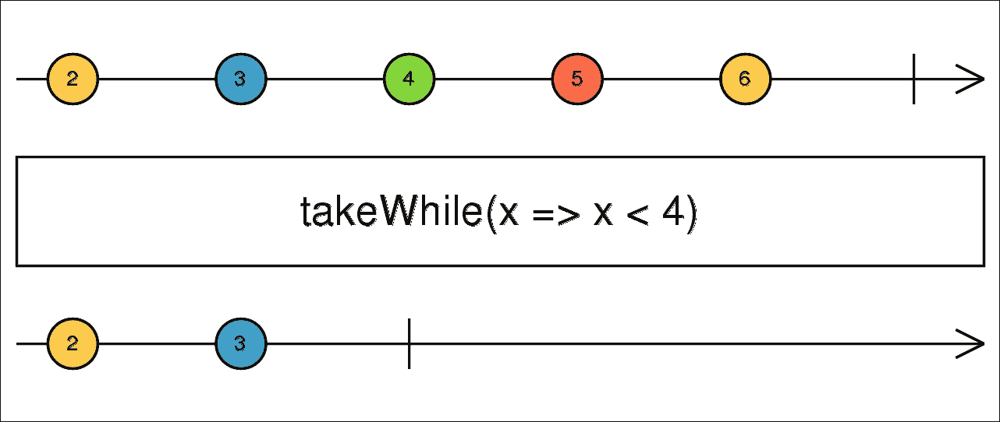

# 第三章. 使用 RxPHP 编写 Reddit 阅读器

在前面的章节中，我们讨论了很多关于 PHP 中的异步编程以及它与反应式编程的关系，特别是如何开始使用 RxPHP，以及如何异步使用常见的 PHP 函数，如`proc_open()`和`cURL`。

本章将涵盖使用 RxPHP、Symfony Console 和 Symfony Process 组件编写 CLI Reddit 阅读器应用。我们还将使用上一章中学到的几乎所有内容：

+   我们将更深入地探讨在创建可观察对象链和订阅可观察对象时内部发生的事情。

+   我们将了解 Disposables 在 RxPHP 默认类中的使用方式，以及这些如何在我们的应用中取消订阅可观察对象时变得有用。

+   当与操作符链一起工作时，Subject 有时可以简化我们的生活。

+   如何使用`Observable::create()`和`Observable::defer()`静态方法来创建具有自定义订阅逻辑的新可观察对象。

+   Symfony Console 库将成为我们在本书中大多数 CLI 交互中的首选工具。在我们开始使用它之前，我们将快速看一下它的实际好处。

+   上一章的事件循环将成为我们应用的核心。我们将利用它使应用在任何给定时间都能做出响应（我们也可以说，是反应式的）。

+   为了方便地处理子进程，我们将使用 Symfony Process 组件，它为我们处理所有与子进程管理相关的繁重工作。

+   我们将使用我们在实践中已经看到的非阻塞流处理，结合来自终端的输入和来自子进程的输出。

+   我们将列出 RxPHP 提供的一次性类。

在我们深入之前，现在是仔细观察 RxPHP 内部功能的好时机，到目前为止这并不是很重要。然而，这种知识将在本章节和接下来的大多数章节中变得至关重要。

# 检查 RxPHP 的内部结构

在上一章中，我们简要提到了 Disposables 作为释放观察者、可观察对象、Subject 等使用的资源的一种手段。在实践中，当订阅一个可观察对象时，会返回一个一次性操作，例如，以下是从默认的`Rx\Observable::subscribe()`方法中的代码：

```php
function subscribe(ObserverI $observer, $scheduler = null) { 
    $this->observers[] = $observer; 
    $this->started = true; 

    return new CallbackDisposable(function () use ($observer) { 
        $this->removeObserver($observer); 
    }); 
} 

```

此方法首先将观察者添加到所有已订阅观察者的数组中。然后，它将此可观察对象标记为已启动（记住“冷”和“热”可观察对象之间的区别，参见第二章，*使用 RxPHP 进行反应式编程*)，最后，它返回一个`CallbackDisposable`类的新实例。这个类接受一个闭包作为参数，并在它被销毁时调用它。这可能是 Disposables 最常见的使用场景。

这个一次性操作仅从数组中移除观察者，因此，它将不再接收从这个可观察对象发出的任何值。

## 仔细观察订阅可观察对象

应该很明显，Observables 需要以这种方式工作，以便所有订阅的观察者都可以迭代。然后，通过可取消订阅的实例取消订阅需要从所有已订阅观察者的数组中删除一个特定的观察者。

然而，如果我们看看大多数默认的 Observables 是如何工作的，我们会发现它们总是覆盖`Observable::subscribe()`方法，并且通常完全省略应该持有订阅者数组的部分。相反，它们只是向已订阅的观察者发出所有可用的值，并在之后立即发出`onComplete()`信号。例如，我们可以查看 RxPP 1 中`Rx\ReturnObservable`类的`subscribe()`方法的实际源代码：

```php
function subscribe(ObserverI $obs, SchedulerI $sched = null) { 
    $value = $this->value; 
    $scheduler = $scheduler ?: new ImmediateScheduler(); 
    $disp = new CompositeDisposable(); 

    $disp->add($scheduler->schedule(function() use ($obs, $val) { 
        $obs->onNext($val); 
    })); 
    $disp->add($scheduler->schedule(function() use ($obs) { 
        $obs->onCompleted(); 
    })); 

    return $disp; 
} 

```

`ReturnObservable`类在其构造函数中接受一个单一值，并将此值发送给每个订阅的观察者。

以下是一个 Observable 的生命周期可能看起来很棒的例子：

+   当观察者订阅时，它会检查是否也传递了一个调度器作为参数。通常情况下，并没有传递调度器，因此它会创建一个`ImmediateScheduler`实例。请注意，在 RxPHP 2 中，调度器只能在类构造函数中设置。

+   然后，创建一个`CompositeDisposable`实例，它将保留这个方法使用的所有可取消订阅的实例数组。当调用`CompositeDisposable::dispose()`时，它会迭代它包含的所有可取消订阅的实例，并调用它们的相应`dispose()`方法。

+   在此之后，我们开始用以下内容填充我们的`CompositeDisposable`：

```php
        $disposable->add($scheduler->schedule(function() { ... })); 

```

+   这是我们经常会看到的事情。`SchedulerInterface::schedule()`方法返回一个`DisposableInterface`，它负责取消操作并释放资源。在这种情况下，当我们使用没有其他逻辑的`ImmediateScheduler`时，它只是立即评估闭包：

```php
        function () use ($obs, $val) { 
            $observer->onNext($val); 
        } 

```

+   由于`ImmediateScheduler::schedule()`不需要释放任何资源（它没有使用任何资源），它只是返回一个`Rx\Disposable\EmptyDisposable`实例，这个实例实际上什么也不做。

+   然后返回一个可取消订阅的实例，可以用来从这个 Observable 中取消订阅。然而，正如我们在前面的源代码中看到的，这个 Observable 不允许你取消订阅，如果我们仔细想想，这甚至没有意义，因为`ReturnObservable`类的值在订阅时立即发出。

同样的情况也适用于其他类似的`Observables`，例如`IteratorObservable`、`RangeObservable`或`ArrayObservable`。这些只是包含调度器的递归调用，但原理是相同的。

一个好问题是，为什么这会如此复杂？所有前面的代码都可以简化为以下三行（假设我们不对使用调度器感兴趣）：

```php
function subscribe(ObserverI $observer) { 
    $observer->onNext($this->value); 
    $observer->onCompleted(); 
} 

```

好吧，对于`ReturnObservable`来说这可能是对的，但在实际应用中，我们很少使用这些原始的 Observables。调度器的另一个非常重要的用例是测试。我们可以提供一个模拟延迟执行的测试调度器，以确保我们的 Observables 和操作符按正确的顺序发出值。我们将在第五章深入探讨这个主题，*测试 RxPHP 代码*。

从 Observables 取消订阅或清理取消订阅时的任何资源的能力非常重要，我们将在不久的将来使用它。

### 使用调度器发出多个值

我们已经看到了如何使用`RangeObservable`。现在，当我们知道为什么使用`Scheduler->schedule()`很重要时，为了教程的目的，我们可以考虑如何自己实现`RangeObservable` Observable 的功能。

例如，它可能看起来像以下这样：

```php
// custom_range_01.php 
use Rx\Observable; 
use Rx\ObserverInterface; 

class CustomRangeObservable extends Observable { 
  private $min; 
  private $max; 

  public function __construct($min, $max) { 
    $this->min = $min; 
    $this->max = $max; 
  } 

  public function subscribe($observer, $sched = null) { 
    if (null === $sched) { 
      $sched = new \Rx\Scheduler\ImmediateScheduler(); 
    } 

    return $sched->schedule(function() use ($observer) { 
      for ($i = $this->min; $i <= $this->max; $i++) { 
        $observer->onNext($i); 
      } 
      $observer->onCompleted(); 
    }); 
  } 
} 

(new CustomRangeObservable(1, 5)) 
    ->subscribe(new DebugSubject()); 

```

当我们运行此示例时，我们将看到它产生了正确的结果：

```php
$ php custom_range_01.php
1
2
3
4
5

```

然而，原始的`RangeObservable`有一个有趣的功能。它能够在循环内部取消订阅，这意味着我们可以在任何时候停止生成值。

考虑以下示例，其中我们在观察者的可调用内部取消订阅：

```php
// range_01.php 
use Rx\Observable; 
use Rx\Scheduler\EventLoopScheduler; 
use React\EventLoop\StreamSelectLoop; 

$loop = new StreamSelectLoop(); 
$scheduler = new EventLoopScheduler($loop); 

$disposable = Observable::range(1, 5) 
    ->subscribeCallback(function($val) use (&$disposable) { 
        echo "$val\n"; 
        if ($val == 3) { 
            $disposable->dispose(); 
        } 
    }, null, null, $scheduler); 

$scheduler->start(); 

```

此示例仅发出前三个值，然后使用`$disposable->dispose()`取消订阅。

### 注意

我们必须使用异步的`EventLoopScheduler`，因为我们希望在订阅后开始执行计划的操作。使用`EventLoopScheduler`，执行是通过调用`$scheduler->start()`开始的。如果我们使用默认的`ImmediateScheduler`，那么`$disposable`变量将始终为 null（未分配），因为所有计划的操作都将执行在`subscribeCallback()`方法中，并且`$disposable`变量永远不会被分配。

当我们运行此演示时，我们将看到仅前三个数字：

```php
$ php range_01.php 
1
2
3

```

如果我们尝试使用我们刚刚创建的`CustomRangeObservable`，我们会看到它不会取消订阅，并且我们总是接收到所有值。为了处理此类用例，调度器有一个`scheduleRecursive()`方法，其行为类似于`schedule()`，但其可调用参数是一个可调用的本身，用于重新调度另一个发射。

在实践中，我们可以重写`CustomRangeObservable::subscribe()`方法，使用`scheduleRecursive()`而不是`schedule()`：

```php
public function subscribe($observer, $sched = null) { 
  if (null === $sched) { 
    $sched = new \Rx\Scheduler\ImmediateScheduler(); 
  } 
  $i = $this->min; 

  return $sched->scheduleRecursive( 
      function($reschedule) use ($observer, &$i) { 
    if ($i <= $this->max) { 
      $observer->onNext($i); 
      $i++; 
      $reschedule(); 
    } else { 
      $observer->onCompleted(); 
    } 
  }); 
} 

```

注意，我们没有创建任何循环，而是让`$reschedule()`递归地调用自身。现在我们可以正确地调用从`$sched->scheduleRecursive()`返回的可处置对象的`dispose()`方法来停止调度更多操作。我们可以使用与`RangeObservable`相同的场景来测试这一点：

```php
// php custom_range_02.php 
$loop = new StreamSelectLoop(); 
$scheduler = new EventLoopScheduler($loop); 

$disposable = (new CustomRangeObservable(1, 5)) 
    ->subscribeCallback(function($val) use (&$disposable) { 
        echo "$val\n"; 
        if ($val == 3) { 
            $disposable->dispose(); 
        } 
    }, null, null, $scheduler); 

$scheduler->start(); 

```

现在它只打印前三个数字：

```php
$ php custom_range_02.php 
1
2
3

```

## 深入了解操作符链

我们已经在上一章中使用了操作符链。在我们开始编写 Reddit 阅读器之前，我们应该简要地讨论一下可能发生的一个有趣的情况，这样我们就不至于后来措手不及。

我们还将介绍一种新的 Observable 类型，称为`ConnectableObservable`。考虑这个简单的包含两个订阅者的操作符链：

```php
// rxphp_filter_observables_01.php 
use Rx\Observable\RangeObservable; 
use Rx\Observable\ConnectableObservable; 

$connObs = new ConnectableObservable(new RangeObservable(0, 6)); 
$filteredObs = $connObs 
    ->map(function($val) { 
        return $val ** 2; 
    }) 
    ->filter(function($val) { 
        return $val % 2; 
    }); 

$disposable1 = $filteredObs->subscribeCallback(function($val) { 
    echo "S1: ${val}\n"; 
}); 
$disposable2 = $filteredObs->subscribeCallback(function($val) { 
    echo "S2: ${val}\n"; 
}); 

$connObs->connect(); 

```

`ConnectableObservable`类是一种特殊的 Observable 类型，其行为类似于 Subject（实际上，在内部，它确实使用了一个`Subject`类的实例）。任何其他 Observable 都会在你订阅后立即发出所有可用值。然而，`ConnectableObservable`接受另一个 Observable（源 Observable）作为参数，并允许你订阅观察者而不发出任何内容。当你调用`ConnectableObservable::connect()`时，它订阅了源 Observables，所有值依次发送给所有订阅者。

在内部，它包含了一个`Subject`类的实例，当我们调用`subscribe()`方法时，它只是将每个观察者订阅到其内部的 Subject。然后当我们调用`connect()`方法时，它将内部的 Subject 订阅到源 Observable。

在`$filteredObs`变量中，我们保存了从`filter()`操作符返回的`Observable`的引用，它是一个`AnnonymousObservable`的实例，在接下来的几行中，我们为两个观察者都调用了`subscribe()`方法。

现在，让我们看看这个操作符链打印了什么：

```php
$ php rxphp_filter_observables_01.php 
S1: 1 
S2: 1 
S1: 9 
S2: 9 
S1: 25 
S2: 25 

```

如我们所见，所有值都按照它们发出的顺序通过了两个观察者。出于好奇，我们也可以看看如果我们没有使用`ConnectableObservable`，而是使用`RangeObservable`会发生什么：

```php
$ php rxphp_filter_observables_02.php 
S1: 1 
S1: 9 
S1: 25 
S2: 1 
S2: 9 
S2: 25 

```

这次，`RangeObservable`将所有值发送给了第一个观察者，然后，再次，将所有值发送给了第二个观察者。我们可以看到源 Observable 必须两次生成所有值，这是低效的，并且在大数据集上，这可能会造成性能瓶颈。

### 订阅到 ConnectableObservable

让我们回到第一个`ConnectableObservable`的例子，并修改`filter()`调用，使其打印所有通过的数据：

```php
$filteredObservable = $connObservable 
    ->map(function($val) { 
        return $val ** 2; 
    }) 
    ->filter(function($val) { 
        echo "Filter: $val\n"; 
        return $val % 2; 
    }); 

```

现在我们再次运行代码，看看会发生什么：

```php
$ php rxphp_filter_observables_03.php
Filter: 0
Filter: 0
Filter: 1
S1: 1
Filter: 1
S2: 1
Filter: 4
Filter: 4
Filter: 9
S1: 9
Filter: 9
S2: 9
Filter: 16
Filter: 16
Filter: 25
S1: 25
Filter: 25
S2: 25

```

嗯，这很意外！每个值都被打印了两次，尽管我们使用了`ConnectableObservable`。但这并不意味着 Observable 必须两次生成所有值（正如我们将在第八章中看到的那样，“RxPHP 和 PHP7 pthreads 扩展中的多播”)。一开始并不明显发生了什么，但问题是我们是在操作符链的末尾订阅了 Observable。

如前所述，`$filteredObservable`是一个包含许多嵌套闭包的`AnnonymousObservable`实例。通过调用其`subscribe()`方法，它运行由其前驱创建的闭包，依此类推。这导致每次调用`subscribe()`都必须调用整个链。虽然这可能在许多用例中不是问题，但在某些情况下，我们可能想在其中一个过滤器内部执行特殊操作。

这个示例的操作符链看起来像以下图示，其中每个订阅都由一个箭头表示：



所有这一切最重要的后果是，操作符和`AnnonymousObservable`类都不共享通过它们传递的值。实际上，它们中的任何一个都没有跟踪订阅的观察者。

此外，请注意，对`subscribe()`方法的调用可能不受我们的控制，可能是由另一个想要使用我们为他们创建的可观察对象的其他开发者执行的。

了解这种情况可能发生并且可能导致不希望的行为是很好的。

### 注意

有时候很难看到可观察对象内部发生了什么。特别是在我们必须处理 PHP 中的多个嵌套闭包时，很容易迷失方向。调度器是典型的例子。请随意尝试这里显示的示例，并使用调试器逐步检查代码的执行顺序和顺序。

因此，让我们找出如何解决这个问题。一种方法是我们重构代码，将`$filteredObservable`转换为`ConnectableObservable`而不是直接转换为`RangeObservable`。考虑以下代码：

```php
// rxphp_filter_observables_04.php 
$source = new RangeObservable(0, 6); 
$filteredObservable = $source 
    ->map(function($val) { 
        return $val ** 2; 
    }) 
    ->filter(function($val) { 
        echo "Filter: $val\n"; 
        return $val % 2; 
    }); 

$connObs = new ConnectableObservable($filteredObservable); 

$disposable1 = $connObs->subscribeCallback(function($val) { 
    echo "S1: ${val}\n"; 
}); 
$disposable2 = $connObs->subscribeCallback(function($val) { 
    echo "S2: ${val}\n"; 
}); 
$connObs->connect(); 

```

当我们运行此代码时，我们可以看到`filter()`操作符对每个值只调用一次：

```php
$ php rxphp_filter_observables_04.php 
Filter: 0
Filter: 1
S1: 1
S2: 1
Filter: 4
Filter: 9
S1: 9
S2: 9
Filter: 16
Filter: 25
S1: 25
S2: 25

```

为了更好地理解与上一个示例的不同之处，我们可以查看表示此操作符链的图示：



我们可以看到，`ConnectableObservable`被移动到链的下方，并订阅了`filter()`操作符而不是`RangeObservable`。

### 使用 Subject 代替 ConnectableObservable

我们说过我们不想在链的末端多次订阅，因此我们可以创建一个`Subject`类的实例，其中我们将订阅两个观察者，而`Subject`类本身将订阅`$filteredObservable`，正如刚才讨论的那样：

```php
// rxphp_filter_observables_05.php 
use Rx\Subject\Subject; 

$subject = new Subject(); 
$source = new RangeObservable(0, 6); 
$filteredObservable = $source 
    ->map(function($val) { 
        return $val ** 2; 
    }) 
    ->filter(function($val) { 
        echo "Filter: $val\n"; 
        return $val % 2; 
    }) 
    ->subscribe($subject); 

$disposable1 = $subject->subscribeCallback(function($val) { 
    echo "S1: ${val}\n"; 
}); 
$disposable2 = $subject->subscribeCallback(function($val) { 
    echo "S2: ${val}\n"; 
}); 
$filteredObservable->subscribe($subject); 

```

我们可以运行脚本并看到它返回的输出与上一个示例完全相同：

```php
$ php rxphp_filter_observables_05.php
Filter: 0
Filter: 1
S1: 1
S2: 1
Filter: 4
Filter: 9
S1: 9
S2: 9
Filter: 16
Filter: 25
S1: 25
S2: 25

```

这可能看起来像是一个边缘情况，但很快我们会看到，如果这个问题没有得到妥善处理，可能会导致一些非常不可预测的行为。当我们开始编写我们的 Reddit 阅读器时，我们将讨论这两个问题（正确使用可处置对象和操作符链）。

# Observable::create() 和 Observable::defer()

我们知道如何使用`ReturnObservable`或`RangeObservable`创建可观察对象。我们还编写了一个自定义的`CURLObservable`。然而，在某些情况下，我们可能希望创建一个具有某些自定义逻辑的可观察对象，这些逻辑不容易用现有的可观察对象类重现。当然，我们可以编写另一个继承基本可观察对象类的可观察对象，但如果我们需要处理一个非常具体、单次使用的场景，使用静态方法`Observable::create()`和`Observable::defer()`将更容易。

## 使用`Observable::create()`创建可观察对象

使用`Observable::create()`，我们可以创建一个在订阅时自动将值推送到每个观察者的可观察对象。考虑以下示例：

```php
// observable_create_01.php 
use Rx\Observable; 
use Rx\ObserverInterface; 

$source = Observable::create(function(ObserverInterface $obs) { 
    echo "Observable::create\n"; 
    $obs->onNext(1); 
    $obs->onNext('Hello, World!'); 
    $obs->onNext(2); 
    $obs->onCompleted(); 
}); 

$source->subscribe(new DebugSubject()); 
$source->subscribe(new DebugSubject()); 

```

传递给`Observable::create()`的可调用参数接受一个观察者作为参数，它可以直接开始发射值。重要的是要记住，这个可调用参数将为每个观察者调用。这个示例输出了以下内容：

```php
$ php observable_create_01.php
Observable::create
21:00:52 [] onNext: 1 (integer)
21:00:52 [] onNext: Hello, World! (string)
21:00:52 [] onNext: 2 (integer)
21:00:52 [] onCompleted
Observable::create
21:00:52 [] onNext: 1 (integer)
21:00:52 [] onNext: Hello, World! (string)
21:00:52 [] onNext: 2 (integer)
21:00:52 [] onCompleted

```

注意，字符串`Observable::create`被打印了两次。另外，注意我们亲自调用了`onCompleted`以正确完成可观察对象。

可调用函数可以可选地返回一个`Rx\DisposableInterface`实例，该实例在取消订阅/完成可观察对象时将被销毁。我们可以修改相同的示例以返回`CallbackDisposable`实例：

```php
$source = Observable::create(function(ObserverInterface $obs) { 
    ... 
    return new CallbackDisposable(function() { 
        echo "disposed\n"; 
    }); 
}); 

```

现在，每个`CallbackDisposable`都将被调用，以正确清理每个观察者的资源。

## 使用`Observable::defer()`创建可观察对象

想象一个用例，我们希望为订阅我们可观察对象的每个观察者生成一个随机数字范围。这意味着我们希望每个观察者都有一个不同的数字范围。

让我们看看如果我们只使用`RangeObservable`会发生什么：

```php
// observable_defer_01.php  
use Rx\Observable; 
$source = Observable::range(0, rand(1, 10)); 

$source->subscribe(new DebugSubject('#1')); 
$source->subscribe(new DebugSubject('#2')); 

```

由于我们创建了一个单个源可观察对象，两个观察者将始终接收到相同的数字范围。范围维度在调用`Observable::range()`时设置一次。例如，这个脚本的输出可能如下所示：

```php
$ php observable_defer_01.php 
21:38:29 [#1] onNext: 0 (integer)
21:38:29 [#1] onNext: 1 (integer)
21:38:29 [#1] onNext: 2 (integer)
21:38:29 [#1] onCompleted
21:38:29 [#2] onNext: 0 (integer)
21:38:29 [#2] onNext: 1 (integer)
21:38:29 [#2] onNext: 2 (integer)
21:38:29 [#2] onCompleted

```

我们当然可以创建两个源可观察对象，但使用`Observable::defer()`静态方法有一个更优雅的方式：

```php
// observable_defer_02.php 
use Rx\Observable; 
$source = Observable::defer(function() { 
    return Observable::range(0, rand(1, 10)); 
}); 

$source->subscribe(new DebugSubject('#1')); 
$source->subscribe(new DebugSubject('#2')); 

```

静态方法`Observable::defer()`接受一个可调用参数，每次观察者订阅时都会调用该参数，类似于`Observable::create()`。然而，这个可调用参数需要返回另一个观察者将订阅的可观察对象。我们不是只创建一个`RangeObservable`，而是为每个观察者创建一个新的。

这个示例的输出可能看起来像以下这样：

```php
$ php observable_defer_02.php 
21:40:58 [#1] onNext: 0 (integer) 
21:40:58 [#1] onNext: 1 (integer) 
21:40:58 [#1] onNext: 2 (integer) 
21:40:58 [#1] onNext: 3 (integer) 
21:40:58 [#1] onCompleted 
21:40:58 [#2] onNext: 0 (integer) 
21:40:58 [#2] onCompleted

```

注意，每个观察者接收到了不同的数字范围。

# 使用 RxPHP 编写 Reddit 阅读器

我们将要构建的许多即将到来的应用程序将是纯 CLI 应用程序。因此，拥有一个统一的库来帮助我们处理 CLI 环境中的常见问题将是有帮助的：



我们选择使用的工具将是 Symfony Console 组件（[`symfony.com/doc/current/components/console.html`](http://symfony.com/doc/current/components/console.html)）。这是一个与 Symfony 框架一起开发的开源库，但它被设计成可以在任何项目中独立使用，这对我们来说非常理想。

它处理从输入到输出的所有事情，并且还附带了一些非常实用的助手。特别是，我们将使用以下内容：

+   着色和格式化控制台输出

+   将 CLI 应用拆分为多个独立的命令

+   从输入参数定义中自动生成帮助信息

+   处理输入参数，包括验证和默认值

+   创建一组统一的函数来处理用户输入

在这个例子中，我们将只使用前两个项目符号，但在后面的章节中，我们将使用这里列出的所有功能。

## 使用 Symfony Console 组件

首先，通过 composer 安装 Symfony Console 组件：

```php
$ composer require symfony/console

```

每个 CLI 应用都被拆分为多个可以独立运行的命令。由于我们的应用非常简单，我们可以将所有逻辑放入一个命令中，因此我们将设置一个默认命令。

我们应用的人口点只是注册命令，然后让 Console 库为我们处理所有事情：

```php
// console_reddit.php 
require_once __DIR__ . '/../vendor/autoload.php'; 
require_once 'RedditCommand.php'; 

$application = new Symfony\Component\Console\Application(); 
$application->setDefaultCommand('reddit'); 
$application->add(new RedditCommand()); 
$application->run(); 

```

运行`$application::run()`方法会检查 PHP 的全局 CLI 参数，并根据这些参数选择正确的命令。由于我们的应用只有一个命令，我们不需要从终端传递任何参数；应用将使用默认的，即`RedditCommand`，我们现在就开始编写它。

每个命令都继承自`Symfony\Component\Console\Command`类，并且至少应该定义其名称：

```php
// RedditCommand.php 
use Symfony\Component\Console\Command\Command; 
use Symfony\Component\Console\Input\InputInterface as InputI; 
use Symfony\Component\Console\Output\OutputInterface as OutputI; 

class RedditCommand extends Command { 
    protected function configure() { 
        $this->setName('reddit'); 
        $this->setDescription( 
            'CLI Reddit reader created using RxPHP library.'); 
    } 

    protected function execute(InputI $input, OutputI $output) { 
        $output->writeln('<info>Hello, World!</info>'); 
    } 
} 

```

这个命令的名称是`reddit`，它需要与我们使用`setDefaultCommand()`设置的名称相匹配。

注意，我们可以使用类似于 HTML 的标签来进行一些基本的样式设置，虽然功能非常有限，但对于典型的 CLI 应用来说已经足够了。我们将使用四种预定义的颜色，但如果你想要更详细地了解，可以自由地查看有关在[`symfony.com/doc/current/console/coloring.html`](http://symfony.com/doc/current/console/coloring.html)上着色输出的文档：

+   `<info>` = 绿色

+   `<comment>` = 黄色

+   `<question>` = 在青色背景上显示黑色

+   `<error>` = 在红色背景上显示白色文本

当 Symfony Console 库识别到一个命令时，它会调用其`execute()`方法，同时传递两个用于处理输入和输出的对象。我们通常不希望自己处理输入或输出，因为不同平台之间存在不一致，而 Console 库可以为我们做所有这些。

一个合适的例外是当我们想要使用非阻塞的用户输入而不是内置的提问助手。碰巧的是，这正是我们接下来要做的，但让我们先看看如何从终端运行这个命令：

```php
$ php console_reddit.php
Hello, World!

```

由于`RedditCommand`也是默认命令，所以我们不需要设置任何 CLI 参数来执行它。这实际上与运行以下命令相同：

```php
$ php console_reddit.php reddit

```

一个 CLI 应用程序可以包含多个命令，如前所述。我们可以使用以下方法列出此应用程序支持的所有命令：

```php
$ php console_reddit.php list

```

这将打印出所有命令的彩色概览，以及所有应用程序默认允许的一些常见选项：



在其中，还有我们上面设置的描述的`reddit`命令。我们也可以使用`help`命令来获取有关特定命令的详细信息，但由于我们的`reddit`命令没有输入参数，我们不会看到任何有趣的内容，所以我们将它留到以后。

### 注意

注意到`help`和`list`只是像其他任何命令一样。

## 非阻塞用户输入和事件循环

在上一章的结尾，我们讨论了在 PHP 中使用`proc_open()`和`stream_set_blocking()`实现的阻塞和非阻塞流。我们还提到，我们需要某种类型的事件循环，它在定期检查用户输入的同时，不会阻塞执行线程，以便在任何时候使应用程序保持响应。

我们将要使用的命令的基本原则如下：我们将创建一个 Observable，它为接收到的每一行输入发出一个值（这是一个字符串，后跟*Enter*键）。这个 Observable 将具有多个观察者，它们将根据当前应用程序的内部状态进行订阅和取消订阅。我们将始终至少有一个活动观察者，它将寻找终止事件循环并结束应用程序的`q`（退出）字符串。

让我们扩展`execute()`方法，以便从终端读取用户的输入以及事件循环本身：

```php
use Rx\Observable\IntervalObservable; 

class RedditCommand extends Command { 
  /** @var \Rx\Subject\Subject */ 
  private $subject; 
  private $interval; 

  protected function execute(InputI $input, OutputI $output) { 
    $this->subject = new \Rx\Subject\Subject(); 
    $stdin = fopen('php://stdin', 'r'); 
    stream_set_blocking($stdin, false); 

    $loop = new React\EventLoop\StreamSelectLoop();
    $scheduler = new Rx\Scheduler\EventLoopScheduler($loop); 
    $this->interval = new IntervalObservable(100, $scheduler); 

    $disposable = $this->interval 
      ->map(function($count) use ($stdin) { 
        return trim(fread($stdin, 1024)); 
      }) 
      ->filter(function($str) { 
        return strlen($str) > 0; 
      }) 
      ->subscribe($this->subject); 
    $loop->run(); 
  } 
} 

```

已经使用了一些值得注意的概念，因此让我们分别查看每个概念：

+   我们使用`fopen('php://stdin', 'r')`打开了一个输入流，并使用`stream_set_blocking()`函数将其设置为非阻塞。这与我们在上一章中使用的`proc_open()`原理完全相同。

+   事件循环的工作方式与我们之前章节中看到的一样。我们在这里使用它来创建一个每 100 毫秒触发一次（或称为`EventLoopScheduler`中的“tick”）的稳定计时器。

+   所有用户输入都被缓冲，这意味着`fread()`将始终返回一个空字符串，直到我们按下***Enter***键。

+   使用`filter()`运算符，我们可以过滤掉所有空字符串。

+   通过这个运算符链成功通过的价值将由一个`Subject`类观察。这就是我们将稍后订阅观察者的类，它只发出有效的用户输入。

使用`EventLoopScheduler`实际上非常简单。它确保它在精确的时间间隔内发出值，尽管在运算符链中始终有一些代码被执行。它内部测量上次触发的时间和传播值所花费的时间，然后只睡眠必要的间隔。

注意，我们在本章开头已经解释了关于操作符链的问题。我们将订阅/取消订阅的 Observable 总是 `$this->subject`，而不是直接使用 `IntervalObservable`。

此外，请注意，我们创建了一个 `$disposable` 变量，它包含通过调用 `subscribe($this->subject)` 创建的 `Disposable` 对象。这基本上是对 `IntervalObservable` 的订阅。如果我们取消订阅（这意味着调用 `$disposable->dispose()`），事件循环将自动结束，整个应用也将结束。

## 订阅用户输入

我们已经提到，当用户输入 `q` 时，应用应该优雅地结束。我们现在可以实施这个功能。一旦我们准备好了 Subject 的实例，我们就可以开始订阅它：

```php
protected function execute(InputI $input, OutputI $output) { 
  // The rest of the method is the same as above 

  $this->subject 
    ->filter(function($value) { 
      return strval($value) == 'q'; 
    }) 
    ->take(1) 
    ->subscribeCallback(null, null, 
        function() use ($disposable, $output, $stdin) { 
      fclose($stdin); 
      $output->writeln('<comment>Good bye!</comment>'); 
      $disposable->dispose(); 
    } 
  ); 

  $loop->run(); 
} 

```

### 注意

为了节省空间并使代码示例简短，我们省略了类名、缩进和未更改的已定义方法。

这与订阅任何其他 Observable 完全相同。这里有趣的是，我们将 `$disposable` 变量传递给 Closure，在其中调用其 `dispose()` 方法，从而取消 Subject 对 `IntervalObservable` 的订阅，并最终终止事件循环。这次，我们不需要保留从 `subscribeCallback()` 返回的任何 `Disposable` 对象的引用，因为我们知道我们永远不会想要取消这个观察者的订阅。

注意，我们使用 `take(1)` 来接受最多一个退出信号。然后接下来的 `subscribe()` 调用只为完整信号定义了一个可调用对象，并完全忽略了剩余的两个。

我们在本章开头讨论了可处置对象时提到了这个问题，实际上这些是必要的。

我们显然想让用户选择他们最喜欢的 `subreddit`。这将是 `$this->subject` 的另一个订阅者，但这次我们将保留其可处置对象，因为稍后我们需要能够订阅其他观察者并取消这个观察者的订阅，这个观察者只需要订阅 `subreddit` 名称，不需要做更多：

```php
/** @var string */ 
private $subreddit; 
/** @var \Rx\DisposableInterface */ 
private $subredditDisposable; 

protected function execute(InputI $input, OutputI $output) { 
  // The rest of the method is the same as above 
  $this->askSubreddit(); 

  $loop->run(); 
} 

protected function askSubreddit() {
  $this->output->write('Enter subreddit name: ');
  $this->subredditDisposable =
    $this->subject->subscribeCallback(function($value) {
      $this->subreddit = $value;
      $this->subredditDisposable->dispose();
      $this->refreshList();
    });
}

```

在我们开始事件循环之前，我们安排了一个动作，要求用户输入他们想要下载的 `subreddit` 名称，然后订阅一个新的观察者。当它接收到有效值时，我们将它存储在 `$this->subreddit` 变量中，然后它使用 `$this->subredditDisposable->dispose()` 来取消订阅自己。

我们已经可以看到有一个调用另一个方法，名为 `refreshList()`。这个方法将通过 Reddit API 以 JSON 格式下载该 `subreddit` 的帖子，并打印出一个包含标题的列表，用户可以通过输入帖子的索引号来选择他们想要阅读的帖子。

为了下载列表，我们将使用 cURL PHP 模块。我们已经在 第二章 *使用 RxPHP 进行响应式编程* 中使用过它，我们创建了 `CURLObservable` 来实现这个目的，这在这里也很有用。此外，我们已编写了 `JSONDecodeOperator` 用于解码 JSON 字符串，我们也将使用它：

```php
const API_URL = 'https://www.reddit.com/r/%s/new.json'; 

protected function refreshList() {
  $curlObservable = new CurlObservable( 
      sprintf(self::API_URL, $this->subreddit)); 

  $curlObservable 
    ->filter(function($value) { 
      return is_string($value); 
    }) 
    ->lift(function() { 
      return new JSONDecodeOperator(); 
    }) 
    ->subscribeCallback(function(array $response) { 
      $articles = $response['data']['children']; 
      foreach ($articles as $i => $entry) { 
        $this->output->writeln("<info>${i}</info> " . 
            $entry['data']['title']); 
      } 

      $this->printHelp(); 
      $template = ', <info>[%d-%d]</info>: Read article'; 
      $this->output->writeln( 
          sprintf($template, 0, count($articles))); 

      $this->chooseArticleDetail($articles); 
    }), function($e) { 
      $this->output->writeln( 
          '<error>Unable to download data</error>'); 
    }); 
} 

```

这是我们已经看到的，应该很容易理解。我们使用 `CURLObservable` 下载 URL，然后使用 `JSONDecodeOperator` 将其从 JSON 解码为 PHP 数组。然后我们遍历它包含的所有文章的列表，并打印它们的索引和标题。

我们还介绍了一个名为 `printHelp()` 的小方法，它只打印一个提示，即输入 `q` 并按 ***Enter*** 键将退出应用。然后我们添加一些仅与当前状态相关的提示，例如 **[b] 返回列表**，正如我们在下面的屏幕截图中所见：



然后，类似地，它调用 `chooseArticleDetail()`，允许用户输入他们想要查看的文章索引号。

这可以一直进行下去，但原则始终相同。我们订阅一个观察者到存储在 `$this->subject` 中的主 `Subject` 类，只检查与当前应用程序状态相关的值，执行一些操作，然后取消订阅。可能没有必要在这里包含完整的源代码，因为这会非常重复。

### 注意

如果你想查看此应用的所有实现方法，请查看本章的完整源代码。

相反，让我们关注与 `CURLObservable` 和子进程相关的事情，使用 Symfony Process 组件。

# 非阻塞 CURLObservable

在我们的 Reddit 阅读器应用中，我们使用 PHP 的 cURL 从远程 API 下载数据。即使使用其异步回调，如 `CURLOPT_PROGRESSFUNCTION`，我们也必须记住，无论我们选择什么选项，`curl_exec()` 仍然是一个阻塞调用。

这是因为 PHP 在单个执行线程中运行，当它开始执行 `curl_exec()` 时，其他所有操作都需要等待它完成。虽然这个方法可能会调用一些回调函数，但如果其中任何一个卡住了，例如，在一个无限循环中，`curl_exec()` 函数将永远不会结束。

这对我们 Reddit 阅读器的实际响应能力有严重影响。当 `CURLObservable` 下载数据时，它不会响应用户输入，这可能不是我们想要的。

当我们谈论 `IntervalObservable` 以及它如何能够非常精确地保持所需的间隔时，我们没有提到的是，这实际上是一种它无法处理的情况。

让我们编写一个简单的脚本，演示这种行为。我们将使用 `IntervalObservable` 每秒触发一次：

```php
use Rx\Observable\IntervalObservable; 

function getTime() { 
    $t = microtime(true); 
    $micro = sprintf("%06d", ($t - floor($t)) * 1000000); 
    return date('H:i:s') . '.' . $micro; 
} 

$loop = new React\EventLoop\StreamSelectLoop(); 
$scheduler = new Rx\Scheduler\EventLoopScheduler($loop); 
$observable = new IntervalObservable(1000, $scheduler); 

$observable->map(function($tick) { 
    printf("%s Map: %d\n", getTime(), $tick); 
    return $tick; 
})->subscribeCallback(function($tick) { 
    printf("%s Observer: %d\n", getTime(), $tick); 
}); 
$loop->run(); 

```

此示例非常精确地打印当前时间，包括微秒。如果我们让它运行一段时间，我们仍然会看到它在每增加一秒时仍然很好地保持到微秒：

```php
$ php blocked_intervalobservable.php
00:27:14.306441 Map: 0
00:27:14.306509 Observer: 0
00:27:15.305033 Map: 1
00:27:15.305116 Observer: 1
...
00:28:22.306071 Map: 68
00:28:22.306124 Observer: 68

```

我们已经可以观察到 `map()` 操作符在观察者之前被调用。现在，让我们在 `map()` 操作符中添加一个 `usleep(1250 * 1000);` 调用。我们可以看到，这个间隔甚至比 `IntervalObservable` 的 1 秒间隔还要大，这使得它完全不同步：

```php
$ php blocked_intervalobservable.php
00:41:25.606327 Map: 0
00:41:26.859891 Observer: 0
00:41:26.860455 Map: 1
00:41:28.113972 Observer: 1

```

这意味着，即使我们依赖于 `IntervalObservable` 来完成所有必要的定时，当操作符链中的任何地方有代码阻塞执行时，它也无法做任何事情。这就是我们使用 `CURLObservable` 时发生的情况，当 `curl_exec()` 运行时，应用程序没有响应。

不幸的是，PHP 本身（没有任何额外模块）并没有给我们提供很多编写非阻塞代码的选项。

但在上一章中，我们使用了 `proc_open()` 和 `stream_set_blocking()` 来运行非阻塞子进程，因此我们可以使用相同的技巧，并将 `CURLObservable` 包装成一个可以作为一个子进程运行的独立应用程序。

由于我们已经知道如何使用 Symfony Console 组件编写 CLI 应用程序，因此我们也将在这里使用它：

```php
// wrap_curl.php 
use Symfony\Component\Console\Command\Command; 
use Symfony\Component\Console\Input\InputInterface as InputI; 
use Symfony\Component\Console\Output\OutputInterface as OutputI; 
use Symfony\Component\Console\Input\InputArgument; 

class CURLCommand extends Command { 
  protected function configure() { 
    $this->setName('curl'); 
    $this->setDescription( 
        'Wrapped CURLObservable as a standalone app'); 
    $this->addArgument('url', 
        InputArgument::REQUIRED, 'URL to download'); 
  } 

  protected function execute(InputI $input, OutputI $output) { 
    $returnCode = 0; 
    (new CURLObservable($input->getArgument('url'))) 
      ->subscribeCallback(function($res) use ($output) { 
        if (!is_float($response)) { 
          $output->write($res); 
        } 
      }, function() use (&$returnCode) { 
        $returnCode = 1; 
      }); 
    return $returnCode; 
  } 
} 

$application = new Symfony\Component\Console\Application(); 
$application->add(new CURLCommand()); 
$application->run(); 

```

此命令有一个必需的参数，即它应该下载的 URL。它内部使用 `CURLObservable` 下载 URL，然后将响应打印到其标准输出。如果发生错误，它还会设置正确的 UNIX 返回码。

如果我们尝试在没有任何参数的情况下运行该命令，它会打印一个错误，告诉我们这个命令必须恰好有一个参数：



我们可以手动测试这个命令；例如，使用以下命令：

```php
$ php wrapped_curl.php curl https://www.reddit.com/r/php/new.json
{"kind": "Listing", "data": {"modhash": "", "children": ...

```

现在，我们可以像上一章中那样使用 `proc_open()`，但除了启动进程之外，还有很多事情需要我们自己处理，所以更容易将所有重工作交给另一个库。

## 使用 Symfony Process 组件

如同往常，我们将使用 composer 安装这个库：

```php
$ php composer require symfony/process

```

这个库让我们可以创建新的进程，以非阻塞的方式读取它们的输出，发送输入，发送信号，使用超时，终止进程等等。

为了测试这些，我们将编写一个小脚本，使用 `IntervalObservable` 每秒打印一个数字，同时等待子进程完成：

```php

// php curl_subprocess.php 
use Symfony\Component\Process\Process; 
use Rx\Observable\IntervalObservable; 

$c='php wrap_curl.php curl https://www.reddit.com/r/php/new.json'; 
$process = new Process($c); 
$process->start(); 

$loop = new React\EventLoop\StreamSelectLoop(); 
$scheduler = new Rx\Scheduler\EventLoopScheduler($loop); 

(new IntervalObservable(1000, $scheduler)) 
    ->takeWhile(function($ticks) use ($process) { 
        return $process->isRunning(); 
    }) 
    ->subscribeCallback(function($ticks) { 
        printf("${ticks}\n"); 
    }, function() {}, function() use ($process) { 
        echo $process->getOutput(); 
    }); 
$loop->run(); 

```

`Process` 类在其构造函数中接受一个它应该执行的完整命令。然后，调用 `Process::start()` 将以异步非阻塞的方式启动子进程，就像我们之前做的那样。我们可以随时使用 `getOutput()` 方法检查可用输出。然后，`isSuccessful()` 和 `isRunning()` 方法分别在进程成功终止（返回码等于 0）时返回 `true`，以及进程是否仍在运行。

### takeWhile() 操作符

我们还使用了一个新的操作符，称为 `takeWhile()`。这个操作符接受一个谓词闭包作为参数，为它接收到的每个值执行。如果谓词返回 `true`，它将值传递到链中（通过在其观察者上调用 `onNext()`），但如果谓词返回 `false`，它将发出 `onComplete()` 信号，因此循环结束，因为没有其他观察者订阅它。这与本章前面我们使用可处置的从 `IntervalObservable` 取消订阅并结束应用的情况完全相同。以下 Marble 图表示了 RxJS 中的 `takeWhile()` 操作符（[`reactivex.io/rxjs/class/es6/Observable.js`](http://reactivex.io/rxjs/class/es6/Observable.js)）：



如果我们运行这个示例，它将打印几个滴答声，然后转储整个响应并结束。这正是我们所需要的。因此，我们可以删除临时的 `printf()` 语句并使用这个子进程在我们的 Reddit 阅读器应用中。

## 将子进程实现到 Reddit 阅读器应用中

这次最终改进需要对现有代码进行一些修改。首先，`refreshList()` 方法不需要使用 `CURLObservable` 或 `JSONDecodeOperator`，因为我们将从 `Process` 类的实例直接读取响应。

此外，检查用户输入的主要 `Subject` 类和检查子进程是否终止的观察者都需要使用相同的调度器实例。与每次刷新帖子列表时创建一个新的实例相比，共享同一个 `IntervalObservable` 的实例更容易，所以我们将其引用作为 `property` 类保存在 `$this->intervalObservable` 中：

```php
protected function refreshList() { 
  $url = sprintf(self::API_URL, $this->subreddit); 
  $this->process = new Process( 
      'php wrap_curl.php curl '.$url); 
  $this->process->start(); 

  $this->intervalObservable 
    ->takeWhile(function() { 
      return $this->process->isRunning(); 
    }) 
    ->subscribeCallback(null, null, function() { 
      $jsonString = $this->process->getOutput(); 
      if (!$jsonString) { 
        return; 
      } 

      $response = json_decode($jsonString, true); 
      $articles = $response['data']['children']; 
      // ... the rest is unchanged 

```

然后，当我们想要退出应用时，我们必须确保子进程已经终止，或者最终由我们自己终止。如果我们不终止它，PHP 解释器将不得不等待它完成。

这就是更新后的检查退出条目的观察者将看起来像：

```php
$this->subject->filter(function($value) { 
  return strval($value) == 'q'; 
}) 
->take(1) 
->subscribeCallback(null, null, 
  function() use ($disposable, $output, $stdin) { 
    fclose($stdin); 
    $output->writeln('<comment>Good bye!</comment>'); 
    if ($this->process && $this->process->isRunning()) { 
      $this->process->stop(); 
    } 
    $disposable->dispose(); 
  } 
); 

```

因此，最终这使我们能够在任何时候退出（或执行任何其他操作），即使在这个时候 cURL 正在下载数据，因为我们以一个单独的非阻塞进程运行下载，并定期在同一事件循环中检查响应。

### 注意

在 第六章 中，我们将看到如何使用 `StreamSelectLoop` 直接从使用 `fopen()` 创建的文件句柄读取。

# 可处置类的类型

在本章中，我们一直在大量订阅和取消订阅 Observables。虽然我们知道什么是可处置的，但我们还没有讨论 RxPHP 中默认可用的不同类型的可处置类。

我们不会为它们中的每一个都编写示例，因为这些类非常简单，如果你不确定它们的实现细节，请随时查看它们的源代码。

+   `BinaryDisposable`：一个内部包含两个更多可释放对象的类。然后通过调用它的`dispose()`，它将自动调用两个内部可释放对象的`dispose()`。

+   `CallbackDisposable`：此类包装了一个在调用`dispose()`时稍后执行的调用。

+   `CompositeDisposable`：一个包含可释放对象的集合，这些对象将一起释放。

+   `EmptyDisposable`：一个不做任何事的可释放对象。有时即使我们没有什么可以释放的，也要求传递或返回`DisposableInterface`的实例。

+   `RefCountDisposable`：一个包含另一个可释放对象和计数器的可释放对象，当计数器达到 0 时将被释放（基本上与编程语言中的自动引用计数原理相同）。

+   `ScheduledDisposable`：此类包装另一个不会直接释放的可释放对象，而是通过`Scheduler::schedule()`进行调度。

+   `SerialDisposable`：一个包含可释放对象的集合，在添加新的可释放对象时，自动释放前一个（`Scheduler::scheduleRecursive()`方法返回此类可释放对象）。

+   `SingleAssignmentDisposable`：这是一个包装另一个可释放对象的包装器，该对象只能分配一次。如果我们尝试将此可释放对象分配两次，将会引发异常。

### 注意

由于 RxPHP 主要基于 RxJS 4，它使用其可释放对象风格。如果你来自 RxJS 5，你习惯于始终只使用`Subscription`类，它与`CompositeDisposable`非常相似。

# 摘要

在本章中，我们更深入地探讨了如何使用可释放对象和操作符，它们是如何在内部工作的，以及这对我们意味着什么。我们还看到了如何使用`Observable::create()`和`Observable::defer()`来创建具有自定义逻辑的新可观察对象。

我们构建的应用程序旨在成为一个简单的 Reddit 阅读器，它结合了我们迄今为止学到的所有 RxPHP 方面。我们还看到了如何通过使所有长时间运行的任务非阻塞来实现真正响应的应用程序。我们使用 Symfony Console 组件来处理来自终端的用户输入和输出。此外，我们还使用了 Symfony Process 组件来轻松生成并控制子进程。

我们还探讨了 RxPHP 的一些新类，例如`ConnectableObservable`、`CompositeDisposable`或`takeWhile()`操作符。

在下一章中，我们将处理一些在流行的 PHP 框架中使用的基于事件的系统，例如 Symfony、Silex 和 Zend Framework，并了解我们如何将它们与响应式编程的原则结合起来。
